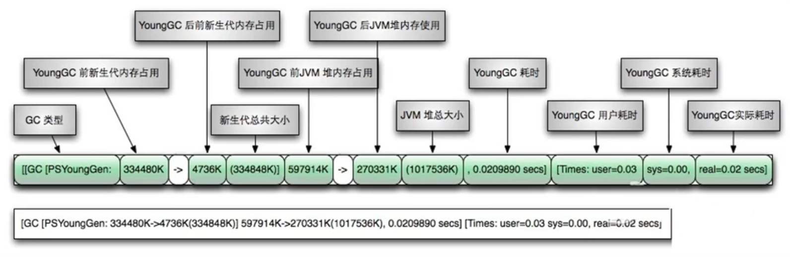
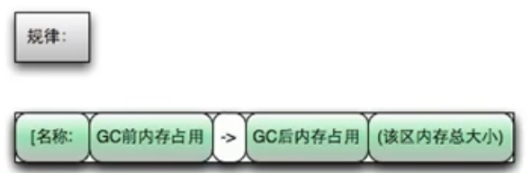
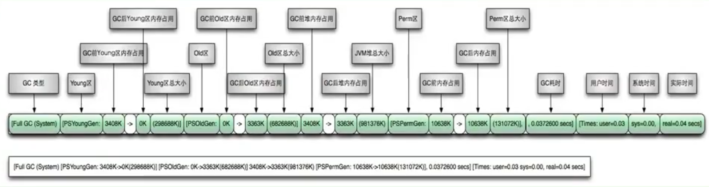
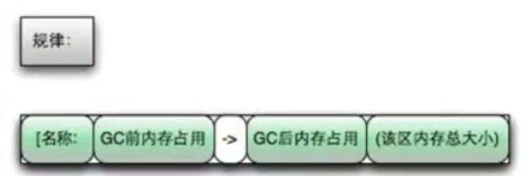
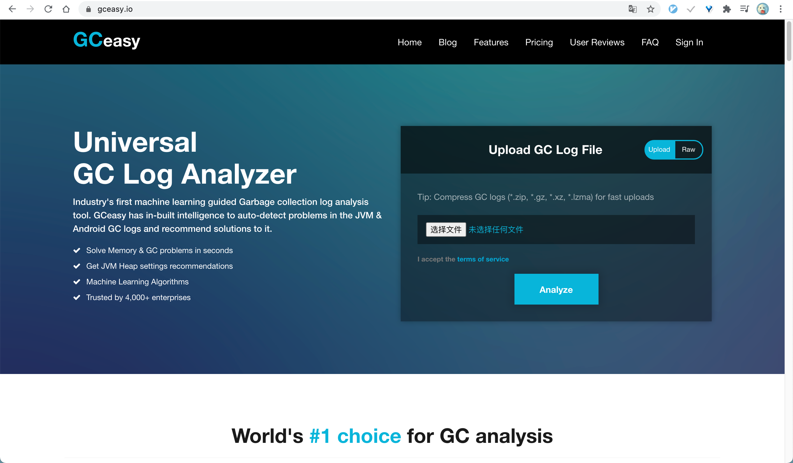
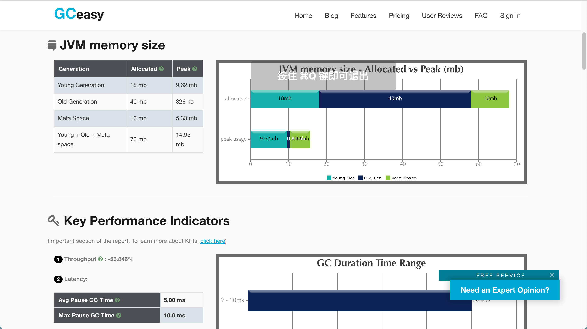

# 05. 分析 GC 日志

- 笔记本：JVM_3_性能监控与调优
- 创建时间：2021-02-12 04:53:11 UTC
- 更新时间：2021-02-20 03:44:36 UTC
- 印象笔记 GUID：7e828d31-2ec2-4fdd-acd0-8b156cb388b5

## 分析 GC 日志

### 1. GC 日志参数

- `-verbose:gc` 输出 GC 日志信息，默认输出到标准输出

- `-XX:+PrintGC` 等同于 `-verbose:gc` 表示打开简化的 GC 日志

- `-XX:+PrintGCDetails` 在发生垃圾回收时打印内存回收详情的日志，并在进程退出时输出当前内存各区域分配情况

- `-XX:+PrintGCTimeStamps` 输出 GC 发生时的时间戳

- `-XX:+PrintGCDateStamps` 输出 GC 发生时的时间戳（以日期的形式，如 2020-02-19T21:21:212+0800）

- `-XX:+PrintHeapAtGC` 每一次 GC 前和 GC 后，都打印堆信息

- `-Xloggc:<file>` 把 GC 日志写入到一个文件中去，而不是打印到标准输出中

### 2. GC 日志格式

#### 2.1. 复习：GC 分类

针对 HotSpot VM 的实现，它里面的 GC 按照回收区域又分为两大种类型：一种是部分收集（Partial GC），一种是整堆收集（Full GC）

- 部分收集：不是完整收集整个 Java 堆的垃圾收集。其中又分为：

  - 新生代收集（Minor GC/Young GC）：只是新生代（Eden/S0,S1）的垃圾收集

  - 老年代收集（Major GC/Old GC）：只是老年代的垃圾收集。

    - 目前，只有 CMS GC 会有单独收集老年代的行为。

    - **注意，很多时候 Major GC 会和 Full GC 混淆使用，需要具体分辨时老年代回收还是整堆回收。**

  - 混合收集（Mixed GC）：收集整个新生代以及部分老年代的垃圾收集。

    - 目前只有 G1 GC 会后这种行为

- 整堆收集（Full GC）：收集整个 Java 堆和方法区的垃圾收集。

哪些情况会触发 Full GC？

1. 老年代空间不足

1. 方法区空间不足

1. 显示调用 System.gc()

1. Minor GC 进入老年代的数据的平均大小大于老年代的可用内存

1. 大对象直接进入老年代，而老年代可用空间不足

#### 2.2. GC 日志分类

##### MinorGC

[GC (Allocation Failure) [PSYoungGen: 25600K->4080K(29696K)] 25600K->22502K(98304K), 0.0142196 secs] [Times: user=0.02 sys=0.01, real=0.02 secs]
 
 

##### FullGC

[Full GC (Ergonomics) [PSYoungGen: 4088K->0K(29696K)] [ParOldGen: 43780K->47608K(68608K)] 47868K->47608K(98304K), [Metaspace: 3697K->3697K(1056768K)], 0.0164703 secs] [Times: user=0.04 sys=0.01, real=0.01 secs]
 
 

#### 2.3. GC 日志结构剖析

##### 垃圾收集器

- 使用 Serial 收集器在新生代的名字时 Default New Generation，因此显示的是 "[DefNew"

- 使用 ParNew 收集器在新生代的名字会变成 "[ParNew"，意思是 "Parallel New Generation"

- 使用 Parallel Scavenge 收集器在新生代的名字是 "[PSYoungGen"，这里的 JDK1.7 使用的就是 PSYoungGen

- 使用 Parallel Old Generation 收集器在老年代的名字是 "[ParOldGen"

- 使用 G1 收集器的话，会显示为 "garbage-first heap"

**Allocation Failure**
 表明本次引起 GC 的原因是在**年轻代中没有足够的空间能够存储新的数据了**。

##### GC 前后情况

通过图示，我们可以发现 GC 日志格式的规律一般都是：GC 前内存占用 -> GC 后内存占用（该区域内存总大小）

[PSYoungGen: 5986k->696k(8704k)] 5986k->704k(9216k)

中括号内：GC 回收前年轻代堆大小，回收后大小（年轻代堆总大小）
 括号外：GC 回收前年轻代和老年代大小，回收后大小（年轻代和老年代总大小）

##### GC 时间

GC 日志中有三个时间：user、sys 和 real

- user - 进程执行用户态代码（核心之外）所使用的时间。**这是执行此进程所使用的实际 CPU 时间**，其他进程和此进程阻塞的时间并不包括在内。在垃圾收集的情况下，表示 GC 线程执行所使用的 CPU 总时间。

- sys - 进程在内核态消耗的 CPU 时间，即**在内核执行系统调用或等待系统事件所使用的 CPU 时间。**

- real - 程序从开始到结束所用的时钟时间。这个时间包括其他进程使用的时间片和进程阻塞的时间（比如等待 I/O 完成）。对于并行 GC，这个数字应该接近（用户时间 + 系统时间）除以垃圾收集器使用的线程数。

由于多核的原因，一般的 GC 事件中，real time 是小于 sys + user time 的，因为一般是多个线程并发的去做 GC，所以 real time 是要小于 sys+user time 的。如果 real>sys+user 的话，则你的应用可能存在下列问题：IO 负载非常重或者是 CPU 不够用。

#### 2.4. Minor GC 日志解析

2021-02-19T23:32:32.483-0800: 2.404: [GC (Allocation Failure) [PSYoungGen: 25600K->4080K(29696K)] 25600K->22524K(98304K), 0.0125968 secs] [Times: user=0.02 sys=0.03, real=0.01 secs]

- 2021-02-19T23:32:32.483-0800: 日志打印时间

- 2.404: GC 发生时，Java 虚拟机启动以来经过的秒数

- [GC (Allocation Failure)
 发生了一次垃圾回收，这是一次 Minor GC，它不区分新生代 GC 还是老年代 GC，括号里的内容是发生 GC 的原因，这里的 Allocation Failure 的原因是新生代中没有足够区域能够存放需要分配的数据而失败。

- [PSYoungGen: 25600K->4080K(29696K)]

  - PSYoungGen：表示 GC 发生的区域，区域名称与使用的 GC 收集器是密切相关的

    - Serial 收集器：Default New Generation 显示 DefNew

    - ParNew 收集器：ParNew

    - Parallel Scanvenge 收集器：PSYoung

    - 老年代和新生代同理，也是和收集器名称相关

  - 25600K->4080K(29696K) GC前该内存区域已使用容量 -> GC 后该区域容量（该区域总容量）

    - 如果是新生代，总容量则会显示整个新生代内存的 9/10，即 Eden + From/To 区

    - 如果是老年代，总容量则是全部内存的大小，无变化

- 25600K->22524K(98304K)
 在显示完区域容量 GC 的情况之后，会接着显示整个堆内存区域的 GC 情况：GC 前堆内存已使用容量 -> GC 堆内存容量（堆内存总容量）。堆内存总容量 = 9/10新生代 + 老年代 < 初始化的内存大小。

- 0.0125968 secs 整个 GC 所花费的时间，单位是秒

- [Times: user=0.02 sys=0.03, real=0.01 secs]

  - user：指的是 CPU 工作在用户态所花费的时间

  - sys：指的是 CPU 工作在内核态所花费的时间

  - real：指的是在此次 GC 事件中所花费的总时间

#### 2.5. Full GC 日志解析

2021-02-19T23:32:35.028-0800: 4.950: [Full GC (Ergonomics) [PSYoungGen: 4064K->0K(29696K)] [ParOldGen: 43814K->47608K(68608K)] 47878K->47608K(98304K), [Metaspace: 3699K->3699K(1056768K)], 0.0133091 secs] [Times: user=0.04 sys=0.00, real=0.02 secs]

- 2021-02-19T23:32:35.028-0800: 日志打印时间

- 4.950: GC 发生时，Java 虚拟机启动以来经过的秒数

- [Full GC (Ergonomics)

  - 发生了一次垃圾回收，这是一次 Full GC。它不区分新生代 GC 还是老年代 GC

  - 括号里的内容是 GC 发生的原因，这里的 Ergonomics 原因是 JVM 自适应调整导致的 GC

    - Full GC(Metadata GC Threshold)：Metaspace 区不够用了

    - Full GC(System)：调用了 System.gc() 方法

- [PSYoungGen: 4064K->0K(29696K)] \

  - PSYoungGen：表示 GC 发生的区域，区域名称与使用的 GC 收集器是密切相关的

    - Serial 收集器：Default New Generation 显示 DefNew

    - ParNew 收集器：ParNew

    - Parallel Scanvenge 收集器：PSYoung

    - 老年代和新生代同理，也是和收集器名称相关

  - 25600K->4080K(29696K) GC前该内存区域已使用容量 -> GC 后该区域容量（该区域总容量）

    - 如果是新生代，总容量则会显示整个新生代内存的 9/10，即 Eden + From/To 区

    - 如果是老年代，总容量则是全部内存的大小，无变化

- [ParOldGen: 43814K->47608K(68608K)] 老年代区域没有发生GC，因为本次 GC 是 Ergonomics 引起的

- 47878K->47608K(98304K)
 在显示完区域容量 GC 的情况之后，会接着显示整个堆内存区域的 GC 情况：GC 前堆内存已使用容量 -> GC 堆内存容量（堆内存总容量）。堆内存总容量 = 9/10新生代 + 老年代 < 初始化的内存大小。

- [Metaspace: 3699K->3699K(1056768K)] Metaspace GC
 回收（这里没有回收）

- 0.0133091 secs 整个 GC 所花费的时间，单位是秒

- [Times: user=0.04 sys=0.00, real=0.02 secs]

  - user：指的是 CPU 工作在用户态所花费的时间

  - sys：指的是 CPU 工作在内核态所花费的时间

  - real：指的是在此次 GC 事件中所花费的总时间

### 3. GC 日志分析工具

上节介绍了 GC 日志的打印及含义，但是 GC 日志看起来比较麻烦，本节将会介绍一下 GC 日志可视化分析工具 GCeasy 和 GCViewer 等。通过 GC 日志可视化分析工具，我们可以很方便的看到 JVM 各个分代的内存使用情况、垃圾回收次数、垃圾回收的原因、垃圾回收占用的时间、吞吐量等，这些指标在我们进行 JVM 调优的时候是很有用的。

如果想把 GC 日志存到文件的话，使用下面这个参数：
 `- xloggc:/home/liudezhi/gc.log`
 然后就可以用一些工具去分析这些 gc 日志。

**eg1:老年代溢出**

```
/**
 * 测试生成详细的日志文件
 * -Xms60m -Xmx60m -XX:SurvivorRatio=8 -XX:+PrintGCDetails -XX:+PrintGCTimeStamps -XX:+PrintGCDateStamps -XX:+PrintHeapAtGC -Xloggc:/Users/serva/Desktop/GCLogTest.log
 */
public class GCLogTest {
    public static void main(String[] args) {
        ArrayList<byte[]> list = new ArrayList<>();

        for (int i = 0; i < 5000; i++) {
            byte[] arr = new byte[1025 * 50];   // 50 KB
            list.add(arr);
            try {
                Thread.sleep(30);
            } catch (InterruptedException e) {
                e.printStackTrace();
            }
        }
    }
}

```

**eg2：元空间溢出**

```
/**
 * -Xms60m -Xmx60m -XX:MetaspaceSize=10m -XX:MaxMetaspaceSize=10m -XX:SurvivorRatio=8 -XX:+PrintGCDetails -XX:+PrintGCTimeStamps -XX:+PrintGCDateStamps -XX:+PrintHeapAtGC -Xloggc:/Users/serva/Desktop/MetaspaceOOM.log
 */
public class MetaspaceOOM extends ClassLoader {
    public static void main(String[] args) {
        int j = 0;
        try {
            MetaspaceOOM test = new MetaspaceOOM();
            for (int i = 0; i < 10000; i++) {
                // 创建 ClassWriter 对象，用于生成类的二进制字节码
                ClassWriter classWriter = new ClassWriter(0);
                // 指明版本号、修饰符、类名、包名、父类、接口
                classWriter.visit(Opcodes.V1_8, Opcodes.ACC_PUBLIC, "Class" + i, null, "java/lang/Object", null);
                // 返回 byte[]
                byte[] code = classWriter.toByteArray();
                // 类的加载
                test.defineClass("Class" + i, code, 0, code.length);    // Class 对象
                j++;
            }
        } finally {
            System.out.println(j);
        }
    }
}

```

#### 3.1. GCeasy

GCeasy -- 一款超好用的在线分析 GC 日志的网站
 官网地址：https://gceasy.io/，GCeasy 是一款在线的 GC 日志分析器，可以通过 GC 日志分析进行内存泄漏检测、GC 暂停原因分析、JVM 配置建议优化等功能，而且是可以免费使用的（有一些服务是收费的）。
 
 

#### 3.2. GCViewer

##### 基本概述

上面介绍了一款在线的 GC 日志分析器，下面介绍一个离线版的 GCViewer。

GCViewer 是一个免费开源的分析小工具，用于可视化查看由 SUN/Oracle，IBM，HP 和 BEA Java 虚拟机产生的垃圾收集器的日志。
 GCViewer 用于可视化 Java VM 选项 `-verbose:gc` 和 .NET 生成的数据 `-Xloggc:<file>`。它还计算与垃圾回收相关的性能指标（吞吐量，累计的暂停，最长的暂停等）。当通过更改世代大小或设置初始堆大小来调整特定应用程序的垃圾回收时，此功能非常有用。

##### 安装

1. 下载 GCViewer 工具
 源码下载：https://github.com/chewiebug/GCViewer
 运行版本下载：https://github.com/chewiebug/GCViewer/wiki/Changelog

1. 只需要双击 gcviewer-1.3x.jar 或运行 `java -jar gcviewer-1.3x.jar`（它需要运行 java 1.8 vm），即可启动 GCViewer（gui）

#### 3.3. 其他工具

##### GChisto

GChisto 是一款专业分析 GC 日志的工具，可以通过 GC 日志来分析：Minor GC、Full GC 的次数、频率、持续时间等，通过列表、报表、图表等不同形式来反映 GC 的情况。

虽然界面略显粗糙，但是功能还是不错的。

- 官网上没有下载的地方，需要自己从 SVN 上拉下来编译

- 已经没怎么维护了，存在不少 bug

##### HPjmeter

- 工具很强大，但只能打开由以下参数生成的 GC log，`-verbose:gc` `-Xloggc:gc.log。添加其他参数生成的 gc.log 无法打开

- HPjmeter 集成了以前的 HPjtune 功能，可以分析在 HP 机器上产生的垃圾回收日志文件

%23%23%20%E5%88%86%E6%9E%90%20GC%20%E6%97%A5%E5%BF%97%0A%23%23%23%201.%20GC%20%E6%97%A5%E5%BF%97%E5%8F%82%E6%95%B0%0A-%20%60-verbose%3Agc%60%20%E8%BE%93%E5%87%BA%20GC%20%E6%97%A5%E5%BF%97%E4%BF%A1%E6%81%AF%EF%BC%8C%E9%BB%98%E8%AE%A4%E8%BE%93%E5%87%BA%E5%88%B0%E6%A0%87%E5%87%86%E8%BE%93%E5%87%BA%0A-%20%60-XX%3A%2BPrintGC%60%20%E7%AD%89%E5%90%8C%E4%BA%8E%20%60-verbose%3Agc%60%20%E8%A1%A8%E7%A4%BA%E6%89%93%E5%BC%80%E7%AE%80%E5%8C%96%E7%9A%84%20GC%20%E6%97%A5%E5%BF%97%0A-%20%60-XX%3A%2BPrintGCDetails%60%20%E5%9C%A8%E5%8F%91%E7%94%9F%E5%9E%83%E5%9C%BE%E5%9B%9E%E6%94%B6%E6%97%B6%E6%89%93%E5%8D%B0%E5%86%85%E5%AD%98%E5%9B%9E%E6%94%B6%E8%AF%A6%E6%83%85%E7%9A%84%E6%97%A5%E5%BF%97%EF%BC%8C%E5%B9%B6%E5%9C%A8%E8%BF%9B%E7%A8%8B%E9%80%80%E5%87%BA%E6%97%B6%E8%BE%93%E5%87%BA%E5%BD%93%E5%89%8D%E5%86%85%E5%AD%98%E5%90%84%E5%8C%BA%E5%9F%9F%E5%88%86%E9%85%8D%E6%83%85%E5%86%B5%0A-%20%60-XX%3A%2BPrintGCTimeStamps%60%20%E8%BE%93%E5%87%BA%20GC%20%E5%8F%91%E7%94%9F%E6%97%B6%E7%9A%84%E6%97%B6%E9%97%B4%E6%88%B3%0A-%20%60-XX%3A%2BPrintGCDateStamps%60%20%E8%BE%93%E5%87%BA%20GC%20%E5%8F%91%E7%94%9F%E6%97%B6%E7%9A%84%E6%97%B6%E9%97%B4%E6%88%B3%EF%BC%88%E4%BB%A5%E6%97%A5%E6%9C%9F%E7%9A%84%E5%BD%A2%E5%BC%8F%EF%BC%8C%E5%A6%82%202020-02-19T21%3A21%3A212%2B0800%EF%BC%89%0A-%20%60-XX%3A%2BPrintHeapAtGC%60%20%E6%AF%8F%E4%B8%80%E6%AC%A1%20GC%20%E5%89%8D%E5%92%8C%20GC%20%E5%90%8E%EF%BC%8C%E9%83%BD%E6%89%93%E5%8D%B0%E5%A0%86%E4%BF%A1%E6%81%AF%0A-%20%60-Xloggc%3A%3Cfile%3E%60%20%E6%8A%8A%20GC%20%E6%97%A5%E5%BF%97%E5%86%99%E5%85%A5%E5%88%B0%E4%B8%80%E4%B8%AA%E6%96%87%E4%BB%B6%E4%B8%AD%E5%8E%BB%EF%BC%8C%E8%80%8C%E4%B8%8D%E6%98%AF%E6%89%93%E5%8D%B0%E5%88%B0%E6%A0%87%E5%87%86%E8%BE%93%E5%87%BA%E4%B8%AD%0A%0A%23%23%23%202.%20GC%20%E6%97%A5%E5%BF%97%E6%A0%BC%E5%BC%8F%0A%23%23%23%23%202.1.%20%E5%A4%8D%E4%B9%A0%EF%BC%9AGC%20%E5%88%86%E7%B1%BB%0A%E9%92%88%E5%AF%B9%20HotSpot%20VM%20%E7%9A%84%E5%AE%9E%E7%8E%B0%EF%BC%8C%E5%AE%83%E9%87%8C%E9%9D%A2%E7%9A%84%20GC%20%E6%8C%89%E7%85%A7%E5%9B%9E%E6%94%B6%E5%8C%BA%E5%9F%9F%E5%8F%88%E5%88%86%E4%B8%BA%E4%B8%A4%E5%A4%A7%E7%A7%8D%E7%B1%BB%E5%9E%8B%EF%BC%9A%E4%B8%80%E7%A7%8D%E6%98%AF%E9%83%A8%E5%88%86%E6%94%B6%E9%9B%86%EF%BC%88Partial%20GC%EF%BC%89%EF%BC%8C%E4%B8%80%E7%A7%8D%E6%98%AF%E6%95%B4%E5%A0%86%E6%94%B6%E9%9B%86%EF%BC%88Full%20GC%EF%BC%89%0A-%20%E9%83%A8%E5%88%86%E6%94%B6%E9%9B%86%EF%BC%9A%E4%B8%8D%E6%98%AF%E5%AE%8C%E6%95%B4%E6%94%B6%E9%9B%86%E6%95%B4%E4%B8%AA%20Java%20%E5%A0%86%E7%9A%84%E5%9E%83%E5%9C%BE%E6%94%B6%E9%9B%86%E3%80%82%E5%85%B6%E4%B8%AD%E5%8F%88%E5%88%86%E4%B8%BA%EF%BC%9A%0A%20%20%20%20-%20%E6%96%B0%E7%94%9F%E4%BB%A3%E6%94%B6%E9%9B%86%EF%BC%88Minor%20GC%2FYoung%20GC%EF%BC%89%EF%BC%9A%E5%8F%AA%E6%98%AF%E6%96%B0%E7%94%9F%E4%BB%A3%EF%BC%88Eden%2FS0%2CS1%EF%BC%89%E7%9A%84%E5%9E%83%E5%9C%BE%E6%94%B6%E9%9B%86%0A%20%20%20%20-%20%E8%80%81%E5%B9%B4%E4%BB%A3%E6%94%B6%E9%9B%86%EF%BC%88Major%20GC%2FOld%20GC%EF%BC%89%EF%BC%9A%E5%8F%AA%E6%98%AF%E8%80%81%E5%B9%B4%E4%BB%A3%E7%9A%84%E5%9E%83%E5%9C%BE%E6%94%B6%E9%9B%86%E3%80%82%0A%20%20%20%20%20%20%20%20-%20%E7%9B%AE%E5%89%8D%EF%BC%8C%E5%8F%AA%E6%9C%89%20CMS%20GC%20%E4%BC%9A%E6%9C%89%E5%8D%95%E7%8B%AC%E6%94%B6%E9%9B%86%E8%80%81%E5%B9%B4%E4%BB%A3%E7%9A%84%E8%A1%8C%E4%B8%BA%E3%80%82%0A%20%20%20%20%20%20%20%20-%20**%E6%B3%A8%E6%84%8F%EF%BC%8C%E5%BE%88%E5%A4%9A%E6%97%B6%E5%80%99%20Major%20GC%20%E4%BC%9A%E5%92%8C%20Full%20GC%20%E6%B7%B7%E6%B7%86%E4%BD%BF%E7%94%A8%EF%BC%8C%E9%9C%80%E8%A6%81%E5%85%B7%E4%BD%93%E5%88%86%E8%BE%A8%E6%97%B6%E8%80%81%E5%B9%B4%E4%BB%A3%E5%9B%9E%E6%94%B6%E8%BF%98%E6%98%AF%E6%95%B4%E5%A0%86%E5%9B%9E%E6%94%B6%E3%80%82**%0A%20%20%20%20-%20%E6%B7%B7%E5%90%88%E6%94%B6%E9%9B%86%EF%BC%88Mixed%20GC%EF%BC%89%EF%BC%9A%E6%94%B6%E9%9B%86%E6%95%B4%E4%B8%AA%E6%96%B0%E7%94%9F%E4%BB%A3%E4%BB%A5%E5%8F%8A%E9%83%A8%E5%88%86%E8%80%81%E5%B9%B4%E4%BB%A3%E7%9A%84%E5%9E%83%E5%9C%BE%E6%94%B6%E9%9B%86%E3%80%82%0A%20%20%20%20%20%20%20%20-%20%E7%9B%AE%E5%89%8D%E5%8F%AA%E6%9C%89%20G1%20GC%20%E4%BC%9A%E5%90%8E%E8%BF%99%E7%A7%8D%E8%A1%8C%E4%B8%BA%0A-%20%E6%95%B4%E5%A0%86%E6%94%B6%E9%9B%86%EF%BC%88Full%20GC%EF%BC%89%EF%BC%9A%E6%94%B6%E9%9B%86%E6%95%B4%E4%B8%AA%20Java%20%E5%A0%86%E5%92%8C%E6%96%B9%E6%B3%95%E5%8C%BA%E7%9A%84%E5%9E%83%E5%9C%BE%E6%94%B6%E9%9B%86%E3%80%82%0A%0A%E5%93%AA%E4%BA%9B%E6%83%85%E5%86%B5%E4%BC%9A%E8%A7%A6%E5%8F%91%20Full%20GC%EF%BC%9F%0A1.%20%E8%80%81%E5%B9%B4%E4%BB%A3%E7%A9%BA%E9%97%B4%E4%B8%8D%E8%B6%B3%0A2.%20%E6%96%B9%E6%B3%95%E5%8C%BA%E7%A9%BA%E9%97%B4%E4%B8%8D%E8%B6%B3%0A3.%20%E6%98%BE%E7%A4%BA%E8%B0%83%E7%94%A8%20System.gc()%0A4.%20Minor%20GC%20%E8%BF%9B%E5%85%A5%E8%80%81%E5%B9%B4%E4%BB%A3%E7%9A%84%E6%95%B0%E6%8D%AE%E7%9A%84%E5%B9%B3%E5%9D%87%E5%A4%A7%E5%B0%8F%E5%A4%A7%E4%BA%8E%E8%80%81%E5%B9%B4%E4%BB%A3%E7%9A%84%E5%8F%AF%E7%94%A8%E5%86%85%E5%AD%98%0A5.%20%E5%A4%A7%E5%AF%B9%E8%B1%A1%E7%9B%B4%E6%8E%A5%E8%BF%9B%E5%85%A5%E8%80%81%E5%B9%B4%E4%BB%A3%EF%BC%8C%E8%80%8C%E8%80%81%E5%B9%B4%E4%BB%A3%E5%8F%AF%E7%94%A8%E7%A9%BA%E9%97%B4%E4%B8%8D%E8%B6%B3%0A%0A%23%23%23%23%202.2.%20GC%20%E6%97%A5%E5%BF%97%E5%88%86%E7%B1%BB%0A%23%23%23%23%23%20MinorGC%0A%5BGC%20(Allocation%20Failure)%20%5BPSYoungGen%3A%2025600K-%3E4080K(29696K)%5D%2025600K-%3E22502K(98304K)%2C%200.0142196%20secs%5D%20%5BTimes%3A%20user%3D0.02%20sys%3D0.01%2C%20real%3D0.02%20secs%5D%20%0A!%5Befc7e67db91fc6b4e3708d1e10ed94d7.png%5D(evernotecid%3A%2F%2F90F5C43D-AEAE-49B2-85BB-D02B6A52C764%2Fappyinxiangcom%2F25356149%2FENResource%2Fp1707)%0A!%5B644596c67ea86068a083cf49a76af16c.png%5D(evernotecid%3A%2F%2F90F5C43D-AEAE-49B2-85BB-D02B6A52C764%2Fappyinxiangcom%2F25356149%2FENResource%2Fp1708)%0A%0A%23%23%23%23%23%20FullGC%0A%5BFull%20GC%20(Ergonomics)%20%5BPSYoungGen%3A%204088K-%3E0K(29696K)%5D%20%5BParOldGen%3A%2043780K-%3E47608K(68608K)%5D%2047868K-%3E47608K(98304K)%2C%20%5BMetaspace%3A%203697K-%3E3697K(1056768K)%5D%2C%200.0164703%20secs%5D%20%5BTimes%3A%20user%3D0.04%20sys%3D0.01%2C%20real%3D0.01%20secs%5D%20%0A!%5B7c069801863cf338c7b4495a0e1e8859.png%5D(evernotecid%3A%2F%2F90F5C43D-AEAE-49B2-85BB-D02B6A52C764%2Fappyinxiangcom%2F25356149%2FENResource%2Fp1709)%0A!%5B83b1ffd311734241680d9487fbc6696b.png%5D(evernotecid%3A%2F%2F90F5C43D-AEAE-49B2-85BB-D02B6A52C764%2Fappyinxiangcom%2F25356149%2FENResource%2Fp1710)%0A%0A%23%23%23%23%202.3.%20GC%20%E6%97%A5%E5%BF%97%E7%BB%93%E6%9E%84%E5%89%96%E6%9E%90%0A%23%23%23%23%23%20%E5%9E%83%E5%9C%BE%E6%94%B6%E9%9B%86%E5%99%A8%0A-%20%E4%BD%BF%E7%94%A8%20Serial%20%E6%94%B6%E9%9B%86%E5%99%A8%E5%9C%A8%E6%96%B0%E7%94%9F%E4%BB%A3%E7%9A%84%E5%90%8D%E5%AD%97%E6%97%B6%20Default%20New%20Generation%EF%BC%8C%E5%9B%A0%E6%AD%A4%E6%98%BE%E7%A4%BA%E7%9A%84%E6%98%AF%20%22%5BDefNew%22%0A-%20%E4%BD%BF%E7%94%A8%20ParNew%20%E6%94%B6%E9%9B%86%E5%99%A8%E5%9C%A8%E6%96%B0%E7%94%9F%E4%BB%A3%E7%9A%84%E5%90%8D%E5%AD%97%E4%BC%9A%E5%8F%98%E6%88%90%20%22%5BParNew%22%EF%BC%8C%E6%84%8F%E6%80%9D%E6%98%AF%20%22Parallel%20New%20Generation%22%0A-%20%E4%BD%BF%E7%94%A8%20Parallel%20Scavenge%20%E6%94%B6%E9%9B%86%E5%99%A8%E5%9C%A8%E6%96%B0%E7%94%9F%E4%BB%A3%E7%9A%84%E5%90%8D%E5%AD%97%E6%98%AF%20%22%5BPSYoungGen%22%EF%BC%8C%E8%BF%99%E9%87%8C%E7%9A%84%20JDK1.7%20%E4%BD%BF%E7%94%A8%E7%9A%84%E5%B0%B1%E6%98%AF%20PSYoungGen%0A-%20%E4%BD%BF%E7%94%A8%20Parallel%20Old%20Generation%20%E6%94%B6%E9%9B%86%E5%99%A8%E5%9C%A8%E8%80%81%E5%B9%B4%E4%BB%A3%E7%9A%84%E5%90%8D%E5%AD%97%E6%98%AF%20%22%5BParOldGen%22%0A-%20%E4%BD%BF%E7%94%A8%20G1%20%E6%94%B6%E9%9B%86%E5%99%A8%E7%9A%84%E8%AF%9D%EF%BC%8C%E4%BC%9A%E6%98%BE%E7%A4%BA%E4%B8%BA%20%22garbage-first%20heap%22%0A%0A**Allocation%20Failure**%0A%E8%A1%A8%E6%98%8E%E6%9C%AC%E6%AC%A1%E5%BC%95%E8%B5%B7%20GC%20%E7%9A%84%E5%8E%9F%E5%9B%A0%E6%98%AF%E5%9C%A8**%E5%B9%B4%E8%BD%BB%E4%BB%A3%E4%B8%AD%E6%B2%A1%E6%9C%89%E8%B6%B3%E5%A4%9F%E7%9A%84%E7%A9%BA%E9%97%B4%E8%83%BD%E5%A4%9F%E5%AD%98%E5%82%A8%E6%96%B0%E7%9A%84%E6%95%B0%E6%8D%AE%E4%BA%86**%E3%80%82%0A%0A%23%23%23%23%23%20GC%20%E5%89%8D%E5%90%8E%E6%83%85%E5%86%B5%0A%E9%80%9A%E8%BF%87%E5%9B%BE%E7%A4%BA%EF%BC%8C%E6%88%91%E4%BB%AC%E5%8F%AF%E4%BB%A5%E5%8F%91%E7%8E%B0%20GC%20%E6%97%A5%E5%BF%97%E6%A0%BC%E5%BC%8F%E7%9A%84%E8%A7%84%E5%BE%8B%E4%B8%80%E8%88%AC%E9%83%BD%E6%98%AF%EF%BC%9AGC%20%E5%89%8D%E5%86%85%E5%AD%98%E5%8D%A0%E7%94%A8%20-%3E%20GC%20%E5%90%8E%E5%86%85%E5%AD%98%E5%8D%A0%E7%94%A8%EF%BC%88%E8%AF%A5%E5%8C%BA%E5%9F%9F%E5%86%85%E5%AD%98%E6%80%BB%E5%A4%A7%E5%B0%8F%EF%BC%89%0A%5BPSYoungGen%3A%205986k-%3E696k(8704k)%5D%205986k-%3E704k(9216k)%0A%0A%E4%B8%AD%E6%8B%AC%E5%8F%B7%E5%86%85%EF%BC%9AGC%20%E5%9B%9E%E6%94%B6%E5%89%8D%E5%B9%B4%E8%BD%BB%E4%BB%A3%E5%A0%86%E5%A4%A7%E5%B0%8F%EF%BC%8C%E5%9B%9E%E6%94%B6%E5%90%8E%E5%A4%A7%E5%B0%8F%EF%BC%88%E5%B9%B4%E8%BD%BB%E4%BB%A3%E5%A0%86%E6%80%BB%E5%A4%A7%E5%B0%8F%EF%BC%89%0A%E6%8B%AC%E5%8F%B7%E5%A4%96%EF%BC%9AGC%20%E5%9B%9E%E6%94%B6%E5%89%8D%E5%B9%B4%E8%BD%BB%E4%BB%A3%E5%92%8C%E8%80%81%E5%B9%B4%E4%BB%A3%E5%A4%A7%E5%B0%8F%EF%BC%8C%E5%9B%9E%E6%94%B6%E5%90%8E%E5%A4%A7%E5%B0%8F%EF%BC%88%E5%B9%B4%E8%BD%BB%E4%BB%A3%E5%92%8C%E8%80%81%E5%B9%B4%E4%BB%A3%E6%80%BB%E5%A4%A7%E5%B0%8F%EF%BC%89%0A%0A%23%23%23%23%23%20GC%20%E6%97%B6%E9%97%B4%0AGC%20%E6%97%A5%E5%BF%97%E4%B8%AD%E6%9C%89%E4%B8%89%E4%B8%AA%E6%97%B6%E9%97%B4%EF%BC%9Auser%E3%80%81sys%20%E5%92%8C%20real%0A-%20user%20-%20%E8%BF%9B%E7%A8%8B%E6%89%A7%E8%A1%8C%E7%94%A8%E6%88%B7%E6%80%81%E4%BB%A3%E7%A0%81%EF%BC%88%E6%A0%B8%E5%BF%83%E4%B9%8B%E5%A4%96%EF%BC%89%E6%89%80%E4%BD%BF%E7%94%A8%E7%9A%84%E6%97%B6%E9%97%B4%E3%80%82**%E8%BF%99%E6%98%AF%E6%89%A7%E8%A1%8C%E6%AD%A4%E8%BF%9B%E7%A8%8B%E6%89%80%E4%BD%BF%E7%94%A8%E7%9A%84%E5%AE%9E%E9%99%85%20CPU%20%E6%97%B6%E9%97%B4**%EF%BC%8C%E5%85%B6%E4%BB%96%E8%BF%9B%E7%A8%8B%E5%92%8C%E6%AD%A4%E8%BF%9B%E7%A8%8B%E9%98%BB%E5%A1%9E%E7%9A%84%E6%97%B6%E9%97%B4%E5%B9%B6%E4%B8%8D%E5%8C%85%E6%8B%AC%E5%9C%A8%E5%86%85%E3%80%82%E5%9C%A8%E5%9E%83%E5%9C%BE%E6%94%B6%E9%9B%86%E7%9A%84%E6%83%85%E5%86%B5%E4%B8%8B%EF%BC%8C%E8%A1%A8%E7%A4%BA%20GC%20%E7%BA%BF%E7%A8%8B%E6%89%A7%E8%A1%8C%E6%89%80%E4%BD%BF%E7%94%A8%E7%9A%84%20CPU%20%E6%80%BB%E6%97%B6%E9%97%B4%E3%80%82%0A-%20sys%20-%20%E8%BF%9B%E7%A8%8B%E5%9C%A8%E5%86%85%E6%A0%B8%E6%80%81%E6%B6%88%E8%80%97%E7%9A%84%20CPU%20%E6%97%B6%E9%97%B4%EF%BC%8C%E5%8D%B3**%E5%9C%A8%E5%86%85%E6%A0%B8%E6%89%A7%E8%A1%8C%E7%B3%BB%E7%BB%9F%E8%B0%83%E7%94%A8%E6%88%96%E7%AD%89%E5%BE%85%E7%B3%BB%E7%BB%9F%E4%BA%8B%E4%BB%B6%E6%89%80%E4%BD%BF%E7%94%A8%E7%9A%84%20CPU%20%E6%97%B6%E9%97%B4%E3%80%82**%0A-%20real%20-%20%E7%A8%8B%E5%BA%8F%E4%BB%8E%E5%BC%80%E5%A7%8B%E5%88%B0%E7%BB%93%E6%9D%9F%E6%89%80%E7%94%A8%E7%9A%84%E6%97%B6%E9%92%9F%E6%97%B6%E9%97%B4%E3%80%82%E8%BF%99%E4%B8%AA%E6%97%B6%E9%97%B4%E5%8C%85%E6%8B%AC%E5%85%B6%E4%BB%96%E8%BF%9B%E7%A8%8B%E4%BD%BF%E7%94%A8%E7%9A%84%E6%97%B6%E9%97%B4%E7%89%87%E5%92%8C%E8%BF%9B%E7%A8%8B%E9%98%BB%E5%A1%9E%E7%9A%84%E6%97%B6%E9%97%B4%EF%BC%88%E6%AF%94%E5%A6%82%E7%AD%89%E5%BE%85%20I%2FO%20%E5%AE%8C%E6%88%90%EF%BC%89%E3%80%82%E5%AF%B9%E4%BA%8E%E5%B9%B6%E8%A1%8C%20GC%EF%BC%8C%E8%BF%99%E4%B8%AA%E6%95%B0%E5%AD%97%E5%BA%94%E8%AF%A5%E6%8E%A5%E8%BF%91%EF%BC%88%E7%94%A8%E6%88%B7%E6%97%B6%E9%97%B4%20%2B%20%E7%B3%BB%E7%BB%9F%E6%97%B6%E9%97%B4%EF%BC%89%E9%99%A4%E4%BB%A5%E5%9E%83%E5%9C%BE%E6%94%B6%E9%9B%86%E5%99%A8%E4%BD%BF%E7%94%A8%E7%9A%84%E7%BA%BF%E7%A8%8B%E6%95%B0%E3%80%82%0A%0A%E7%94%B1%E4%BA%8E%E5%A4%9A%E6%A0%B8%E7%9A%84%E5%8E%9F%E5%9B%A0%EF%BC%8C%E4%B8%80%E8%88%AC%E7%9A%84%20GC%20%E4%BA%8B%E4%BB%B6%E4%B8%AD%EF%BC%8Creal%20time%20%E6%98%AF%E5%B0%8F%E4%BA%8E%20sys%20%2B%20user%20time%20%E7%9A%84%EF%BC%8C%E5%9B%A0%E4%B8%BA%E4%B8%80%E8%88%AC%E6%98%AF%E5%A4%9A%E4%B8%AA%E7%BA%BF%E7%A8%8B%E5%B9%B6%E5%8F%91%E7%9A%84%E5%8E%BB%E5%81%9A%20GC%EF%BC%8C%E6%89%80%E4%BB%A5%20real%20time%20%E6%98%AF%E8%A6%81%E5%B0%8F%E4%BA%8E%20sys%2Buser%20time%20%E7%9A%84%E3%80%82%E5%A6%82%E6%9E%9C%20real%3Esys%2Buser%20%E7%9A%84%E8%AF%9D%EF%BC%8C%E5%88%99%E4%BD%A0%E7%9A%84%E5%BA%94%E7%94%A8%E5%8F%AF%E8%83%BD%E5%AD%98%E5%9C%A8%E4%B8%8B%E5%88%97%E9%97%AE%E9%A2%98%EF%BC%9AIO%20%E8%B4%9F%E8%BD%BD%E9%9D%9E%E5%B8%B8%E9%87%8D%E6%88%96%E8%80%85%E6%98%AF%20CPU%20%E4%B8%8D%E5%A4%9F%E7%94%A8%E3%80%82%0A%0A%23%23%23%23%202.4.%20Minor%20GC%20%E6%97%A5%E5%BF%97%E8%A7%A3%E6%9E%90%0A2021-02-19T23%3A32%3A32.483-0800%3A%202.404%3A%20%5C%5BGC%20(Allocation%20Failure)%20%5C%5BPSYoungGen%3A%2025600K-%3E4080K(29696K)%5C%5D%2025600K-%3E22524K(98304K)%2C%200.0125968%20secs%5C%5D%20%5C%5BTimes%3A%20user%3D0.02%20sys%3D0.03%2C%20real%3D0.01%20secs%5C%5D%20%0A%0A-%202021-02-19T23%3A32%3A32.483-0800%3A%20%E6%97%A5%E5%BF%97%E6%89%93%E5%8D%B0%E6%97%B6%E9%97%B4%0A-%202.404%3A%20GC%20%E5%8F%91%E7%94%9F%E6%97%B6%EF%BC%8CJava%20%E8%99%9A%E6%8B%9F%E6%9C%BA%E5%90%AF%E5%8A%A8%E4%BB%A5%E6%9D%A5%E7%BB%8F%E8%BF%87%E7%9A%84%E7%A7%92%E6%95%B0%0A-%20%5C%5BGC%20(Allocation%20Failure)%20%0A%E5%8F%91%E7%94%9F%E4%BA%86%E4%B8%80%E6%AC%A1%E5%9E%83%E5%9C%BE%E5%9B%9E%E6%94%B6%EF%BC%8C%E8%BF%99%E6%98%AF%E4%B8%80%E6%AC%A1%20Minor%20GC%EF%BC%8C%E5%AE%83%E4%B8%8D%E5%8C%BA%E5%88%86%E6%96%B0%E7%94%9F%E4%BB%A3%20GC%20%E8%BF%98%E6%98%AF%E8%80%81%E5%B9%B4%E4%BB%A3%20GC%EF%BC%8C%E6%8B%AC%E5%8F%B7%E9%87%8C%E7%9A%84%E5%86%85%E5%AE%B9%E6%98%AF%E5%8F%91%E7%94%9F%20GC%20%E7%9A%84%E5%8E%9F%E5%9B%A0%EF%BC%8C%E8%BF%99%E9%87%8C%E7%9A%84%20Allocation%20Failure%20%E7%9A%84%E5%8E%9F%E5%9B%A0%E6%98%AF%E6%96%B0%E7%94%9F%E4%BB%A3%E4%B8%AD%E6%B2%A1%E6%9C%89%E8%B6%B3%E5%A4%9F%E5%8C%BA%E5%9F%9F%E8%83%BD%E5%A4%9F%E5%AD%98%E6%94%BE%E9%9C%80%E8%A6%81%E5%88%86%E9%85%8D%E7%9A%84%E6%95%B0%E6%8D%AE%E8%80%8C%E5%A4%B1%E8%B4%A5%E3%80%82%0A-%20%5C%5BPSYoungGen%3A%2025600K-%3E4080K(29696K)%5C%5D%20%0A%20%20%20%20-%20PSYoungGen%EF%BC%9A%E8%A1%A8%E7%A4%BA%20GC%20%E5%8F%91%E7%94%9F%E7%9A%84%E5%8C%BA%E5%9F%9F%EF%BC%8C%E5%8C%BA%E5%9F%9F%E5%90%8D%E7%A7%B0%E4%B8%8E%E4%BD%BF%E7%94%A8%E7%9A%84%20GC%20%E6%94%B6%E9%9B%86%E5%99%A8%E6%98%AF%E5%AF%86%E5%88%87%E7%9B%B8%E5%85%B3%E7%9A%84%0A%20%20%20%20%20%20%20%20-%20Serial%20%E6%94%B6%E9%9B%86%E5%99%A8%EF%BC%9ADefault%20New%20Generation%20%E6%98%BE%E7%A4%BA%20DefNew%0A%20%20%20%20%20%20%20%20-%20ParNew%20%E6%94%B6%E9%9B%86%E5%99%A8%EF%BC%9AParNew%0A%20%20%20%20%20%20%20%20-%20Parallel%20Scanvenge%20%E6%94%B6%E9%9B%86%E5%99%A8%EF%BC%9APSYoung%0A%20%20%20%20%20%20%20%20-%20%E8%80%81%E5%B9%B4%E4%BB%A3%E5%92%8C%E6%96%B0%E7%94%9F%E4%BB%A3%E5%90%8C%E7%90%86%EF%BC%8C%E4%B9%9F%E6%98%AF%E5%92%8C%E6%94%B6%E9%9B%86%E5%99%A8%E5%90%8D%E7%A7%B0%E7%9B%B8%E5%85%B3%0A%20%20%20%20-%2025600K-%3E4080K(29696K)%20GC%E5%89%8D%E8%AF%A5%E5%86%85%E5%AD%98%E5%8C%BA%E5%9F%9F%E5%B7%B2%E4%BD%BF%E7%94%A8%E5%AE%B9%E9%87%8F%20-%3E%20GC%20%E5%90%8E%E8%AF%A5%E5%8C%BA%E5%9F%9F%E5%AE%B9%E9%87%8F%EF%BC%88%E8%AF%A5%E5%8C%BA%E5%9F%9F%E6%80%BB%E5%AE%B9%E9%87%8F%EF%BC%89%0A%20%20%20%20%20%20%20%20-%20%E5%A6%82%E6%9E%9C%E6%98%AF%E6%96%B0%E7%94%9F%E4%BB%A3%EF%BC%8C%E6%80%BB%E5%AE%B9%E9%87%8F%E5%88%99%E4%BC%9A%E6%98%BE%E7%A4%BA%E6%95%B4%E4%B8%AA%E6%96%B0%E7%94%9F%E4%BB%A3%E5%86%85%E5%AD%98%E7%9A%84%209%2F10%EF%BC%8C%E5%8D%B3%20Eden%20%2B%20From%2FTo%20%E5%8C%BA%0A%20%20%20%20%20%20%20%20-%20%E5%A6%82%E6%9E%9C%E6%98%AF%E8%80%81%E5%B9%B4%E4%BB%A3%EF%BC%8C%E6%80%BB%E5%AE%B9%E9%87%8F%E5%88%99%E6%98%AF%E5%85%A8%E9%83%A8%E5%86%85%E5%AD%98%E7%9A%84%E5%A4%A7%E5%B0%8F%EF%BC%8C%E6%97%A0%E5%8F%98%E5%8C%96%0A-%2025600K-%3E22524K(98304K)%0A%E5%9C%A8%E6%98%BE%E7%A4%BA%E5%AE%8C%E5%8C%BA%E5%9F%9F%E5%AE%B9%E9%87%8F%20GC%20%E7%9A%84%E6%83%85%E5%86%B5%E4%B9%8B%E5%90%8E%EF%BC%8C%E4%BC%9A%E6%8E%A5%E7%9D%80%E6%98%BE%E7%A4%BA%E6%95%B4%E4%B8%AA%E5%A0%86%E5%86%85%E5%AD%98%E5%8C%BA%E5%9F%9F%E7%9A%84%20GC%20%E6%83%85%E5%86%B5%EF%BC%9AGC%20%E5%89%8D%E5%A0%86%E5%86%85%E5%AD%98%E5%B7%B2%E4%BD%BF%E7%94%A8%E5%AE%B9%E9%87%8F%20-%3E%20GC%20%E5%A0%86%E5%86%85%E5%AD%98%E5%AE%B9%E9%87%8F%EF%BC%88%E5%A0%86%E5%86%85%E5%AD%98%E6%80%BB%E5%AE%B9%E9%87%8F%EF%BC%89%E3%80%82%E5%A0%86%E5%86%85%E5%AD%98%E6%80%BB%E5%AE%B9%E9%87%8F%20%3D%209%2F10%E6%96%B0%E7%94%9F%E4%BB%A3%20%2B%20%E8%80%81%E5%B9%B4%E4%BB%A3%20%3C%20%E5%88%9D%E5%A7%8B%E5%8C%96%E7%9A%84%E5%86%85%E5%AD%98%E5%A4%A7%E5%B0%8F%E3%80%82%0A-%200.0125968%20secs%20%E6%95%B4%E4%B8%AA%20GC%20%E6%89%80%E8%8A%B1%E8%B4%B9%E7%9A%84%E6%97%B6%E9%97%B4%EF%BC%8C%E5%8D%95%E4%BD%8D%E6%98%AF%E7%A7%92%0A-%20%5C%5BTimes%3A%20user%3D0.02%20sys%3D0.03%2C%20real%3D0.01%20secs%5C%5D%20%0A%20%20%20%20-%20user%EF%BC%9A%E6%8C%87%E7%9A%84%E6%98%AF%20CPU%20%E5%B7%A5%E4%BD%9C%E5%9C%A8%E7%94%A8%E6%88%B7%E6%80%81%E6%89%80%E8%8A%B1%E8%B4%B9%E7%9A%84%E6%97%B6%E9%97%B4%0A%20%20%20%20-%20sys%EF%BC%9A%E6%8C%87%E7%9A%84%E6%98%AF%20CPU%20%E5%B7%A5%E4%BD%9C%E5%9C%A8%E5%86%85%E6%A0%B8%E6%80%81%E6%89%80%E8%8A%B1%E8%B4%B9%E7%9A%84%E6%97%B6%E9%97%B4%0A%20%20%20%20-%20real%EF%BC%9A%E6%8C%87%E7%9A%84%E6%98%AF%E5%9C%A8%E6%AD%A4%E6%AC%A1%20GC%20%E4%BA%8B%E4%BB%B6%E4%B8%AD%E6%89%80%E8%8A%B1%E8%B4%B9%E7%9A%84%E6%80%BB%E6%97%B6%E9%97%B4%0A%0A%23%23%23%23%202.5.%20Full%20GC%20%E6%97%A5%E5%BF%97%E8%A7%A3%E6%9E%90%0A2021-02-19T23%3A32%3A35.028-0800%3A%204.950%3A%20%5C%5BFull%20GC%20(Ergonomics)%20%5C%5BPSYoungGen%3A%204064K-%3E0K(29696K)%5C%5D%20%5C%5BParOldGen%3A%2043814K-%3E47608K(68608K)%5C%5D%2047878K-%3E47608K(98304K)%2C%20%5C%5BMetaspace%3A%203699K-%3E3699K(1056768K)%5C%5D%2C%200.0133091%20secs%5C%5D%20%5C%5BTimes%3A%20user%3D0.04%20sys%3D0.00%2C%20real%3D0.02%20secs%5C%5D%20%0A%0A-%202021-02-19T23%3A32%3A35.028-0800%3A%20%E6%97%A5%E5%BF%97%E6%89%93%E5%8D%B0%E6%97%B6%E9%97%B4%0A-%204.950%3A%20GC%20%E5%8F%91%E7%94%9F%E6%97%B6%EF%BC%8CJava%20%E8%99%9A%E6%8B%9F%E6%9C%BA%E5%90%AF%E5%8A%A8%E4%BB%A5%E6%9D%A5%E7%BB%8F%E8%BF%87%E7%9A%84%E7%A7%92%E6%95%B0%0A-%20%5C%5BFull%20GC%20(Ergonomics)%0A%20%20%20%20-%20%E5%8F%91%E7%94%9F%E4%BA%86%E4%B8%80%E6%AC%A1%E5%9E%83%E5%9C%BE%E5%9B%9E%E6%94%B6%EF%BC%8C%E8%BF%99%E6%98%AF%E4%B8%80%E6%AC%A1%20Full%20GC%E3%80%82%E5%AE%83%E4%B8%8D%E5%8C%BA%E5%88%86%E6%96%B0%E7%94%9F%E4%BB%A3%20GC%20%E8%BF%98%E6%98%AF%E8%80%81%E5%B9%B4%E4%BB%A3%20GC%0A%20%20%20%20-%20%E6%8B%AC%E5%8F%B7%E9%87%8C%E7%9A%84%E5%86%85%E5%AE%B9%E6%98%AF%20GC%20%E5%8F%91%E7%94%9F%E7%9A%84%E5%8E%9F%E5%9B%A0%EF%BC%8C%E8%BF%99%E9%87%8C%E7%9A%84%20Ergonomics%20%E5%8E%9F%E5%9B%A0%E6%98%AF%20JVM%20%E8%87%AA%E9%80%82%E5%BA%94%E8%B0%83%E6%95%B4%E5%AF%BC%E8%87%B4%E7%9A%84%20GC%0A%20%20%20%20%20%20%20%20-%20Full%20GC(Metadata%20GC%20Threshold)%EF%BC%9AMetaspace%20%E5%8C%BA%E4%B8%8D%E5%A4%9F%E7%94%A8%E4%BA%86%0A%20%20%20%20%20%20%20%20-%20Full%20GC(System)%EF%BC%9A%E8%B0%83%E7%94%A8%E4%BA%86%20System.gc()%20%E6%96%B9%E6%B3%95%0A-%20%5C%5BPSYoungGen%3A%204064K-%3E0K(29696K)%5C%5D%20%5C%0A%20%20%20%20-%20PSYoungGen%EF%BC%9A%E8%A1%A8%E7%A4%BA%20GC%20%E5%8F%91%E7%94%9F%E7%9A%84%E5%8C%BA%E5%9F%9F%EF%BC%8C%E5%8C%BA%E5%9F%9F%E5%90%8D%E7%A7%B0%E4%B8%8E%E4%BD%BF%E7%94%A8%E7%9A%84%20GC%20%E6%94%B6%E9%9B%86%E5%99%A8%E6%98%AF%E5%AF%86%E5%88%87%E7%9B%B8%E5%85%B3%E7%9A%84%0A%20%20%20%20%20%20%20%20-%20Serial%20%E6%94%B6%E9%9B%86%E5%99%A8%EF%BC%9ADefault%20New%20Generation%20%E6%98%BE%E7%A4%BA%20DefNew%0A%20%20%20%20%20%20%20%20-%20ParNew%20%E6%94%B6%E9%9B%86%E5%99%A8%EF%BC%9AParNew%0A%20%20%20%20%20%20%20%20-%20Parallel%20Scanvenge%20%E6%94%B6%E9%9B%86%E5%99%A8%EF%BC%9APSYoung%0A%20%20%20%20%20%20%20%20-%20%E8%80%81%E5%B9%B4%E4%BB%A3%E5%92%8C%E6%96%B0%E7%94%9F%E4%BB%A3%E5%90%8C%E7%90%86%EF%BC%8C%E4%B9%9F%E6%98%AF%E5%92%8C%E6%94%B6%E9%9B%86%E5%99%A8%E5%90%8D%E7%A7%B0%E7%9B%B8%E5%85%B3%0A%20%20%20%20-%2025600K-%3E4080K(29696K)%20GC%E5%89%8D%E8%AF%A5%E5%86%85%E5%AD%98%E5%8C%BA%E5%9F%9F%E5%B7%B2%E4%BD%BF%E7%94%A8%E5%AE%B9%E9%87%8F%20-%3E%20GC%20%E5%90%8E%E8%AF%A5%E5%8C%BA%E5%9F%9F%E5%AE%B9%E9%87%8F%EF%BC%88%E8%AF%A5%E5%8C%BA%E5%9F%9F%E6%80%BB%E5%AE%B9%E9%87%8F%EF%BC%89%0A%20%20%20%20%20%20%20%20-%20%E5%A6%82%E6%9E%9C%E6%98%AF%E6%96%B0%E7%94%9F%E4%BB%A3%EF%BC%8C%E6%80%BB%E5%AE%B9%E9%87%8F%E5%88%99%E4%BC%9A%E6%98%BE%E7%A4%BA%E6%95%B4%E4%B8%AA%E6%96%B0%E7%94%9F%E4%BB%A3%E5%86%85%E5%AD%98%E7%9A%84%209%2F10%EF%BC%8C%E5%8D%B3%20Eden%20%2B%20From%2FTo%20%E5%8C%BA%0A%20%20%20%20%20%20%20%20-%20%E5%A6%82%E6%9E%9C%E6%98%AF%E8%80%81%E5%B9%B4%E4%BB%A3%EF%BC%8C%E6%80%BB%E5%AE%B9%E9%87%8F%E5%88%99%E6%98%AF%E5%85%A8%E9%83%A8%E5%86%85%E5%AD%98%E7%9A%84%E5%A4%A7%E5%B0%8F%EF%BC%8C%E6%97%A0%E5%8F%98%E5%8C%96%0A-%20%5C%5BParOldGen%3A%2043814K-%3E47608K(68608K)%5C%5D%20%E8%80%81%E5%B9%B4%E4%BB%A3%E5%8C%BA%E5%9F%9F%E6%B2%A1%E6%9C%89%E5%8F%91%E7%94%9FGC%EF%BC%8C%E5%9B%A0%E4%B8%BA%E6%9C%AC%E6%AC%A1%20GC%20%E6%98%AF%20Ergonomics%20%E5%BC%95%E8%B5%B7%E7%9A%84%0A-%2047878K-%3E47608K(98304K)%0A%E5%9C%A8%E6%98%BE%E7%A4%BA%E5%AE%8C%E5%8C%BA%E5%9F%9F%E5%AE%B9%E9%87%8F%20GC%20%E7%9A%84%E6%83%85%E5%86%B5%E4%B9%8B%E5%90%8E%EF%BC%8C%E4%BC%9A%E6%8E%A5%E7%9D%80%E6%98%BE%E7%A4%BA%E6%95%B4%E4%B8%AA%E5%A0%86%E5%86%85%E5%AD%98%E5%8C%BA%E5%9F%9F%E7%9A%84%20GC%20%E6%83%85%E5%86%B5%EF%BC%9AGC%20%E5%89%8D%E5%A0%86%E5%86%85%E5%AD%98%E5%B7%B2%E4%BD%BF%E7%94%A8%E5%AE%B9%E9%87%8F%20-%3E%20GC%20%E5%A0%86%E5%86%85%E5%AD%98%E5%AE%B9%E9%87%8F%EF%BC%88%E5%A0%86%E5%86%85%E5%AD%98%E6%80%BB%E5%AE%B9%E9%87%8F%EF%BC%89%E3%80%82%E5%A0%86%E5%86%85%E5%AD%98%E6%80%BB%E5%AE%B9%E9%87%8F%20%3D%209%2F10%E6%96%B0%E7%94%9F%E4%BB%A3%20%2B%20%E8%80%81%E5%B9%B4%E4%BB%A3%20%3C%20%E5%88%9D%E5%A7%8B%E5%8C%96%E7%9A%84%E5%86%85%E5%AD%98%E5%A4%A7%E5%B0%8F%E3%80%82%0A-%20%5C%5BMetaspace%3A%203699K-%3E3699K(1056768K)%5C%5D%20Metaspace%20GC%0A%20%E5%9B%9E%E6%94%B6%EF%BC%88%E8%BF%99%E9%87%8C%E6%B2%A1%E6%9C%89%E5%9B%9E%E6%94%B6%EF%BC%89%0A-%200.0133091%20secs%20%E6%95%B4%E4%B8%AA%20GC%20%E6%89%80%E8%8A%B1%E8%B4%B9%E7%9A%84%E6%97%B6%E9%97%B4%EF%BC%8C%E5%8D%95%E4%BD%8D%E6%98%AF%E7%A7%92%0A-%20%5C%5BTimes%3A%20user%3D0.04%20sys%3D0.00%2C%20real%3D0.02%20secs%5C%5D%20%0A%20%20%20%20-%20user%EF%BC%9A%E6%8C%87%E7%9A%84%E6%98%AF%20CPU%20%E5%B7%A5%E4%BD%9C%E5%9C%A8%E7%94%A8%E6%88%B7%E6%80%81%E6%89%80%E8%8A%B1%E8%B4%B9%E7%9A%84%E6%97%B6%E9%97%B4%0A%20%20%20%20-%20sys%EF%BC%9A%E6%8C%87%E7%9A%84%E6%98%AF%20CPU%20%E5%B7%A5%E4%BD%9C%E5%9C%A8%E5%86%85%E6%A0%B8%E6%80%81%E6%89%80%E8%8A%B1%E8%B4%B9%E7%9A%84%E6%97%B6%E9%97%B4%0A%20%20%20%20-%20real%EF%BC%9A%E6%8C%87%E7%9A%84%E6%98%AF%E5%9C%A8%E6%AD%A4%E6%AC%A1%20GC%20%E4%BA%8B%E4%BB%B6%E4%B8%AD%E6%89%80%E8%8A%B1%E8%B4%B9%E7%9A%84%E6%80%BB%E6%97%B6%E9%97%B4%0A%0A%23%23%23%203.%20GC%20%E6%97%A5%E5%BF%97%E5%88%86%E6%9E%90%E5%B7%A5%E5%85%B7%0A%E4%B8%8A%E8%8A%82%E4%BB%8B%E7%BB%8D%E4%BA%86%20GC%20%E6%97%A5%E5%BF%97%E7%9A%84%E6%89%93%E5%8D%B0%E5%8F%8A%E5%90%AB%E4%B9%89%EF%BC%8C%E4%BD%86%E6%98%AF%20GC%20%E6%97%A5%E5%BF%97%E7%9C%8B%E8%B5%B7%E6%9D%A5%E6%AF%94%E8%BE%83%E9%BA%BB%E7%83%A6%EF%BC%8C%E6%9C%AC%E8%8A%82%E5%B0%86%E4%BC%9A%E4%BB%8B%E7%BB%8D%E4%B8%80%E4%B8%8B%20GC%20%E6%97%A5%E5%BF%97%E5%8F%AF%E8%A7%86%E5%8C%96%E5%88%86%E6%9E%90%E5%B7%A5%E5%85%B7%20GCeasy%20%E5%92%8C%20GCViewer%20%E7%AD%89%E3%80%82%E9%80%9A%E8%BF%87%20GC%20%E6%97%A5%E5%BF%97%E5%8F%AF%E8%A7%86%E5%8C%96%E5%88%86%E6%9E%90%E5%B7%A5%E5%85%B7%EF%BC%8C%E6%88%91%E4%BB%AC%E5%8F%AF%E4%BB%A5%E5%BE%88%E6%96%B9%E4%BE%BF%E7%9A%84%E7%9C%8B%E5%88%B0%20JVM%20%E5%90%84%E4%B8%AA%E5%88%86%E4%BB%A3%E7%9A%84%E5%86%85%E5%AD%98%E4%BD%BF%E7%94%A8%E6%83%85%E5%86%B5%E3%80%81%E5%9E%83%E5%9C%BE%E5%9B%9E%E6%94%B6%E6%AC%A1%E6%95%B0%E3%80%81%E5%9E%83%E5%9C%BE%E5%9B%9E%E6%94%B6%E7%9A%84%E5%8E%9F%E5%9B%A0%E3%80%81%E5%9E%83%E5%9C%BE%E5%9B%9E%E6%94%B6%E5%8D%A0%E7%94%A8%E7%9A%84%E6%97%B6%E9%97%B4%E3%80%81%E5%90%9E%E5%90%90%E9%87%8F%E7%AD%89%EF%BC%8C%E8%BF%99%E4%BA%9B%E6%8C%87%E6%A0%87%E5%9C%A8%E6%88%91%E4%BB%AC%E8%BF%9B%E8%A1%8C%20JVM%20%E8%B0%83%E4%BC%98%E7%9A%84%E6%97%B6%E5%80%99%E6%98%AF%E5%BE%88%E6%9C%89%E7%94%A8%E7%9A%84%E3%80%82%0A%0A%E5%A6%82%E6%9E%9C%E6%83%B3%E6%8A%8A%20GC%20%E6%97%A5%E5%BF%97%E5%AD%98%E5%88%B0%E6%96%87%E4%BB%B6%E7%9A%84%E8%AF%9D%EF%BC%8C%E4%BD%BF%E7%94%A8%E4%B8%8B%E9%9D%A2%E8%BF%99%E4%B8%AA%E5%8F%82%E6%95%B0%EF%BC%9A%0A%60-%20xloggc%3A%2Fhome%2Fliudezhi%2Fgc.log%60%0A%E7%84%B6%E5%90%8E%E5%B0%B1%E5%8F%AF%E4%BB%A5%E7%94%A8%E4%B8%80%E4%BA%9B%E5%B7%A5%E5%85%B7%E5%8E%BB%E5%88%86%E6%9E%90%E8%BF%99%E4%BA%9B%20gc%20%E6%97%A5%E5%BF%97%E3%80%82%0A%0A**eg1%3A%E8%80%81%E5%B9%B4%E4%BB%A3%E6%BA%A2%E5%87%BA**%0A%60%60%60java%0A%2F**%0A%20*%20%E6%B5%8B%E8%AF%95%E7%94%9F%E6%88%90%E8%AF%A6%E7%BB%86%E7%9A%84%E6%97%A5%E5%BF%97%E6%96%87%E4%BB%B6%0A%20*%20-Xms60m%20-Xmx60m%20-XX%3ASurvivorRatio%3D8%20-XX%3A%2BPrintGCDetails%20-XX%3A%2BPrintGCTimeStamps%20-XX%3A%2BPrintGCDateStamps%20-XX%3A%2BPrintHeapAtGC%20-Xloggc%3A%2FUsers%2Fserva%2FDesktop%2FGCLogTest.log%0A%20*%2F%0Apublic%20class%20GCLogTest%20%7B%0A%20%20%20%20public%20static%20void%20main(String%5B%5D%20args)%20%7B%0A%20%20%20%20%20%20%20%20ArrayList%3Cbyte%5B%5D%3E%20list%20%3D%20new%20ArrayList%3C%3E()%3B%0A%0A%20%20%20%20%20%20%20%20for%20(int%20i%20%3D%200%3B%20i%20%3C%205000%3B%20i%2B%2B)%20%7B%0A%20%20%20%20%20%20%20%20%20%20%20%20byte%5B%5D%20arr%20%3D%20new%20byte%5B1025%20*%2050%5D%3B%20%20%20%2F%2F%2050%20KB%0A%20%20%20%20%20%20%20%20%20%20%20%20list.add(arr)%3B%0A%20%20%20%20%20%20%20%20%20%20%20%20try%20%7B%0A%20%20%20%20%20%20%20%20%20%20%20%20%20%20%20%20Thread.sleep(30)%3B%0A%20%20%20%20%20%20%20%20%20%20%20%20%7D%20catch%20(InterruptedException%20e)%20%7B%0A%20%20%20%20%20%20%20%20%20%20%20%20%20%20%20%20e.printStackTrace()%3B%0A%20%20%20%20%20%20%20%20%20%20%20%20%7D%0A%20%20%20%20%20%20%20%20%7D%0A%20%20%20%20%7D%0A%7D%0A%60%60%60%0A**eg2%EF%BC%9A%E5%85%83%E7%A9%BA%E9%97%B4%E6%BA%A2%E5%87%BA**%0A%60%60%60java%0A%2F**%0A%20*%20-Xms60m%20-Xmx60m%20-XX%3AMetaspaceSize%3D10m%20-XX%3AMaxMetaspaceSize%3D10m%20-XX%3ASurvivorRatio%3D8%20-XX%3A%2BPrintGCDetails%20-XX%3A%2BPrintGCTimeStamps%20-XX%3A%2BPrintGCDateStamps%20-XX%3A%2BPrintHeapAtGC%20-Xloggc%3A%2FUsers%2Fserva%2FDesktop%2FMetaspaceOOM.log%0A%20*%2F%0Apublic%20class%20MetaspaceOOM%20extends%20ClassLoader%20%7B%0A%20%20%20%20public%20static%20void%20main(String%5B%5D%20args)%20%7B%0A%20%20%20%20%20%20%20%20int%20j%20%3D%200%3B%0A%20%20%20%20%20%20%20%20try%20%7B%0A%20%20%20%20%20%20%20%20%20%20%20%20MetaspaceOOM%20test%20%3D%20new%20MetaspaceOOM()%3B%0A%20%20%20%20%20%20%20%20%20%20%20%20for%20(int%20i%20%3D%200%3B%20i%20%3C%2010000%3B%20i%2B%2B)%20%7B%0A%20%20%20%20%20%20%20%20%20%20%20%20%20%20%20%20%2F%2F%20%E5%88%9B%E5%BB%BA%20ClassWriter%20%E5%AF%B9%E8%B1%A1%EF%BC%8C%E7%94%A8%E4%BA%8E%E7%94%9F%E6%88%90%E7%B1%BB%E7%9A%84%E4%BA%8C%E8%BF%9B%E5%88%B6%E5%AD%97%E8%8A%82%E7%A0%81%0A%20%20%20%20%20%20%20%20%20%20%20%20%20%20%20%20ClassWriter%20classWriter%20%3D%20new%20ClassWriter(0)%3B%0A%20%20%20%20%20%20%20%20%20%20%20%20%20%20%20%20%2F%2F%20%E6%8C%87%E6%98%8E%E7%89%88%E6%9C%AC%E5%8F%B7%E3%80%81%E4%BF%AE%E9%A5%B0%E7%AC%A6%E3%80%81%E7%B1%BB%E5%90%8D%E3%80%81%E5%8C%85%E5%90%8D%E3%80%81%E7%88%B6%E7%B1%BB%E3%80%81%E6%8E%A5%E5%8F%A3%0A%20%20%20%20%20%20%20%20%20%20%20%20%20%20%20%20classWriter.visit(Opcodes.V1_8%2C%20Opcodes.ACC_PUBLIC%2C%20%22Class%22%20%2B%20i%2C%20null%2C%20%22java%2Flang%2FObject%22%2C%20null)%3B%0A%20%20%20%20%20%20%20%20%20%20%20%20%20%20%20%20%2F%2F%20%E8%BF%94%E5%9B%9E%20byte%5B%5D%0A%20%20%20%20%20%20%20%20%20%20%20%20%20%20%20%20byte%5B%5D%20code%20%3D%20classWriter.toByteArray()%3B%0A%20%20%20%20%20%20%20%20%20%20%20%20%20%20%20%20%2F%2F%20%E7%B1%BB%E7%9A%84%E5%8A%A0%E8%BD%BD%0A%20%20%20%20%20%20%20%20%20%20%20%20%20%20%20%20test.defineClass(%22Class%22%20%2B%20i%2C%20code%2C%200%2C%20code.length)%3B%20%20%20%20%2F%2F%20Class%20%E5%AF%B9%E8%B1%A1%0A%20%20%20%20%20%20%20%20%20%20%20%20%20%20%20%20j%2B%2B%3B%0A%20%20%20%20%20%20%20%20%20%20%20%20%7D%0A%20%20%20%20%20%20%20%20%7D%20finally%20%7B%0A%20%20%20%20%20%20%20%20%20%20%20%20System.out.println(j)%3B%0A%20%20%20%20%20%20%20%20%7D%0A%20%20%20%20%7D%0A%7D%0A%60%60%60%0A%0A%23%23%23%23%203.1.%20GCeasy%0AGCeasy%20--%20%E4%B8%80%E6%AC%BE%E8%B6%85%E5%A5%BD%E7%94%A8%E7%9A%84%E5%9C%A8%E7%BA%BF%E5%88%86%E6%9E%90%20GC%20%E6%97%A5%E5%BF%97%E7%9A%84%E7%BD%91%E7%AB%99%0A%E5%AE%98%E7%BD%91%E5%9C%B0%E5%9D%80%EF%BC%9Ahttps%3A%2F%2Fgceasy.io%2F%EF%BC%8CGCeasy%20%E6%98%AF%E4%B8%80%E6%AC%BE%E5%9C%A8%E7%BA%BF%E7%9A%84%20GC%20%E6%97%A5%E5%BF%97%E5%88%86%E6%9E%90%E5%99%A8%EF%BC%8C%E5%8F%AF%E4%BB%A5%E9%80%9A%E8%BF%87%20GC%20%E6%97%A5%E5%BF%97%E5%88%86%E6%9E%90%E8%BF%9B%E8%A1%8C%E5%86%85%E5%AD%98%E6%B3%84%E6%BC%8F%E6%A3%80%E6%B5%8B%E3%80%81GC%20%E6%9A%82%E5%81%9C%E5%8E%9F%E5%9B%A0%E5%88%86%E6%9E%90%E3%80%81JVM%20%E9%85%8D%E7%BD%AE%E5%BB%BA%E8%AE%AE%E4%BC%98%E5%8C%96%E7%AD%89%E5%8A%9F%E8%83%BD%EF%BC%8C%E8%80%8C%E4%B8%94%E6%98%AF%E5%8F%AF%E4%BB%A5%E5%85%8D%E8%B4%B9%E4%BD%BF%E7%94%A8%E7%9A%84%EF%BC%88%E6%9C%89%E4%B8%80%E4%BA%9B%E6%9C%8D%E5%8A%A1%E6%98%AF%E6%94%B6%E8%B4%B9%E7%9A%84%EF%BC%89%E3%80%82%0A!%5B6a8db80c78d5a354936eedbd10aceadd.png%5D(evernotecid%3A%2F%2F90F5C43D-AEAE-49B2-85BB-D02B6A52C764%2Fappyinxiangcom%2F25356149%2FENResource%2Fp1711)%0A!%5B5e8e91b463f226c39c924d255652557e.png%5D(evernotecid%3A%2F%2F90F5C43D-AEAE-49B2-85BB-D02B6A52C764%2Fappyinxiangcom%2F25356149%2FENResource%2Fp1712)%0A%0A%23%23%23%23%203.2.%20GCViewer%0A%23%23%23%23%23%20%E5%9F%BA%E6%9C%AC%E6%A6%82%E8%BF%B0%0A%E4%B8%8A%E9%9D%A2%E4%BB%8B%E7%BB%8D%E4%BA%86%E4%B8%80%E6%AC%BE%E5%9C%A8%E7%BA%BF%E7%9A%84%20GC%20%E6%97%A5%E5%BF%97%E5%88%86%E6%9E%90%E5%99%A8%EF%BC%8C%E4%B8%8B%E9%9D%A2%E4%BB%8B%E7%BB%8D%E4%B8%80%E4%B8%AA%E7%A6%BB%E7%BA%BF%E7%89%88%E7%9A%84%20GCViewer%E3%80%82%0A%0AGCViewer%20%E6%98%AF%E4%B8%80%E4%B8%AA%E5%85%8D%E8%B4%B9%E5%BC%80%E6%BA%90%E7%9A%84%E5%88%86%E6%9E%90%E5%B0%8F%E5%B7%A5%E5%85%B7%EF%BC%8C%E7%94%A8%E4%BA%8E%E5%8F%AF%E8%A7%86%E5%8C%96%E6%9F%A5%E7%9C%8B%E7%94%B1%20SUN%2FOracle%EF%BC%8CIBM%EF%BC%8CHP%20%E5%92%8C%20BEA%20Java%20%E8%99%9A%E6%8B%9F%E6%9C%BA%E4%BA%A7%E7%94%9F%E7%9A%84%E5%9E%83%E5%9C%BE%E6%94%B6%E9%9B%86%E5%99%A8%E7%9A%84%E6%97%A5%E5%BF%97%E3%80%82%0AGCViewer%20%E7%94%A8%E4%BA%8E%E5%8F%AF%E8%A7%86%E5%8C%96%20Java%20VM%20%E9%80%89%E9%A1%B9%20%60-verbose%3Agc%60%20%E5%92%8C%20.NET%20%E7%94%9F%E6%88%90%E7%9A%84%E6%95%B0%E6%8D%AE%20%60-Xloggc%3A%3Cfile%3E%60%E3%80%82%E5%AE%83%E8%BF%98%E8%AE%A1%E7%AE%97%E4%B8%8E%E5%9E%83%E5%9C%BE%E5%9B%9E%E6%94%B6%E7%9B%B8%E5%85%B3%E7%9A%84%E6%80%A7%E8%83%BD%E6%8C%87%E6%A0%87%EF%BC%88%E5%90%9E%E5%90%90%E9%87%8F%EF%BC%8C%E7%B4%AF%E8%AE%A1%E7%9A%84%E6%9A%82%E5%81%9C%EF%BC%8C%E6%9C%80%E9%95%BF%E7%9A%84%E6%9A%82%E5%81%9C%E7%AD%89%EF%BC%89%E3%80%82%E5%BD%93%E9%80%9A%E8%BF%87%E6%9B%B4%E6%94%B9%E4%B8%96%E4%BB%A3%E5%A4%A7%E5%B0%8F%E6%88%96%E8%AE%BE%E7%BD%AE%E5%88%9D%E5%A7%8B%E5%A0%86%E5%A4%A7%E5%B0%8F%E6%9D%A5%E8%B0%83%E6%95%B4%E7%89%B9%E5%AE%9A%E5%BA%94%E7%94%A8%E7%A8%8B%E5%BA%8F%E7%9A%84%E5%9E%83%E5%9C%BE%E5%9B%9E%E6%94%B6%E6%97%B6%EF%BC%8C%E6%AD%A4%E5%8A%9F%E8%83%BD%E9%9D%9E%E5%B8%B8%E6%9C%89%E7%94%A8%E3%80%82%0A%0A%23%23%23%23%23%20%E5%AE%89%E8%A3%85%0A1.%20%E4%B8%8B%E8%BD%BD%20GCViewer%20%E5%B7%A5%E5%85%B7%0A%E6%BA%90%E7%A0%81%E4%B8%8B%E8%BD%BD%EF%BC%9Ahttps%3A%2F%2Fgithub.com%2Fchewiebug%2FGCViewer%0A%E8%BF%90%E8%A1%8C%E7%89%88%E6%9C%AC%E4%B8%8B%E8%BD%BD%EF%BC%9Ahttps%3A%2F%2Fgithub.com%2Fchewiebug%2FGCViewer%2Fwiki%2FChangelog%0A2.%20%E5%8F%AA%E9%9C%80%E8%A6%81%E5%8F%8C%E5%87%BB%20gcviewer-1.3x.jar%20%E6%88%96%E8%BF%90%E8%A1%8C%20%60java%20-jar%20gcviewer-1.3x.jar%60%EF%BC%88%E5%AE%83%E9%9C%80%E8%A6%81%E8%BF%90%E8%A1%8C%20java%201.8%20vm%EF%BC%89%EF%BC%8C%E5%8D%B3%E5%8F%AF%E5%90%AF%E5%8A%A8%20GCViewer%EF%BC%88gui%EF%BC%89%0A%0A%23%23%23%23%203.3.%20%E5%85%B6%E4%BB%96%E5%B7%A5%E5%85%B7%0A%23%23%23%23%23%20GChisto%0AGChisto%20%E6%98%AF%E4%B8%80%E6%AC%BE%E4%B8%93%E4%B8%9A%E5%88%86%E6%9E%90%20GC%20%E6%97%A5%E5%BF%97%E7%9A%84%E5%B7%A5%E5%85%B7%EF%BC%8C%E5%8F%AF%E4%BB%A5%E9%80%9A%E8%BF%87%20GC%20%E6%97%A5%E5%BF%97%E6%9D%A5%E5%88%86%E6%9E%90%EF%BC%9AMinor%20GC%E3%80%81Full%20GC%20%E7%9A%84%E6%AC%A1%E6%95%B0%E3%80%81%E9%A2%91%E7%8E%87%E3%80%81%E6%8C%81%E7%BB%AD%E6%97%B6%E9%97%B4%E7%AD%89%EF%BC%8C%E9%80%9A%E8%BF%87%E5%88%97%E8%A1%A8%E3%80%81%E6%8A%A5%E8%A1%A8%E3%80%81%E5%9B%BE%E8%A1%A8%E7%AD%89%E4%B8%8D%E5%90%8C%E5%BD%A2%E5%BC%8F%E6%9D%A5%E5%8F%8D%E6%98%A0%20GC%20%E7%9A%84%E6%83%85%E5%86%B5%E3%80%82%0A%0A%E8%99%BD%E7%84%B6%E7%95%8C%E9%9D%A2%E7%95%A5%E6%98%BE%E7%B2%97%E7%B3%99%EF%BC%8C%E4%BD%86%E6%98%AF%E5%8A%9F%E8%83%BD%E8%BF%98%E6%98%AF%E4%B8%8D%E9%94%99%E7%9A%84%E3%80%82%0A-%20%E5%AE%98%E7%BD%91%E4%B8%8A%E6%B2%A1%E6%9C%89%E4%B8%8B%E8%BD%BD%E7%9A%84%E5%9C%B0%E6%96%B9%EF%BC%8C%E9%9C%80%E8%A6%81%E8%87%AA%E5%B7%B1%E4%BB%8E%20SVN%20%E4%B8%8A%E6%8B%89%E4%B8%8B%E6%9D%A5%E7%BC%96%E8%AF%91%0A-%20%E5%B7%B2%E7%BB%8F%E6%B2%A1%E6%80%8E%E4%B9%88%E7%BB%B4%E6%8A%A4%E4%BA%86%EF%BC%8C%E5%AD%98%E5%9C%A8%E4%B8%8D%E5%B0%91%20bug%0A%0A%23%23%23%23%23%20HPjmeter%0A-%20%E5%B7%A5%E5%85%B7%E5%BE%88%E5%BC%BA%E5%A4%A7%EF%BC%8C%E4%BD%86%E5%8F%AA%E8%83%BD%E6%89%93%E5%BC%80%E7%94%B1%E4%BB%A5%E4%B8%8B%E5%8F%82%E6%95%B0%E7%94%9F%E6%88%90%E7%9A%84%20GC%20log%EF%BC%8C%60-verbose%3Agc%60%20%60-Xloggc%3Agc.log%60%E3%80%82%E6%B7%BB%E5%8A%A0%E5%85%B6%E4%BB%96%E5%8F%82%E6%95%B0%E7%94%9F%E6%88%90%E7%9A%84%20gc.log%20%E6%97%A0%E6%B3%95%E6%89%93%E5%BC%80%0A-%20HPjmeter%20%E9%9B%86%E6%88%90%E4%BA%86%E4%BB%A5%E5%89%8D%E7%9A%84%20HPjtune%20%E5%8A%9F%E8%83%BD%EF%BC%8C%E5%8F%AF%E4%BB%A5%E5%88%86%E6%9E%90%E5%9C%A8%20HP%20%E6%9C%BA%E5%99%A8%E4%B8%8A%E4%BA%A7%E7%94%9F%E7%9A%84%E5%9E%83%E5%9C%BE%E5%9B%9E%E6%94%B6%E6%97%A5%E5%BF%97%E6%96%87%E4%BB%B6%0A
