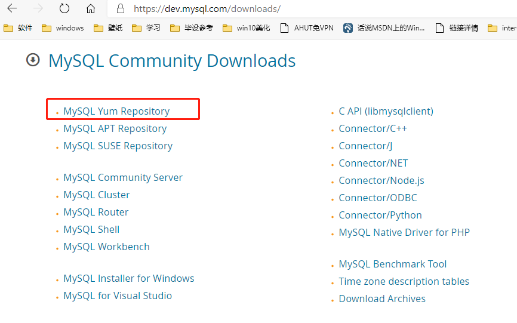
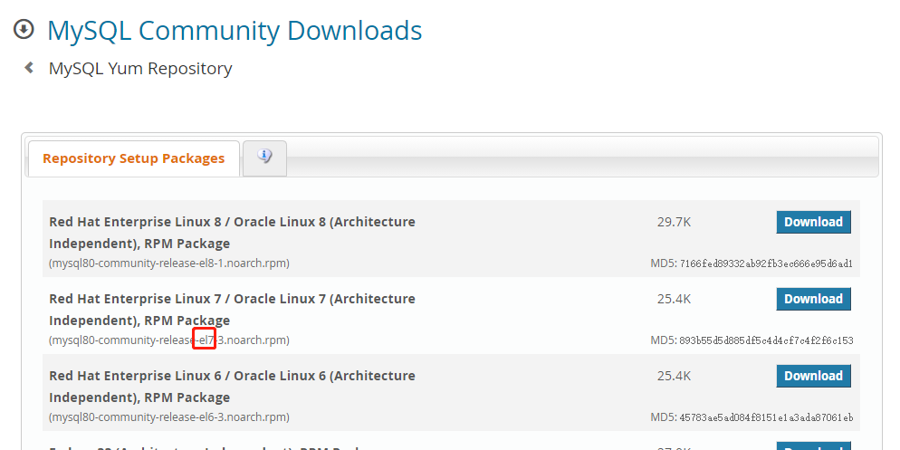
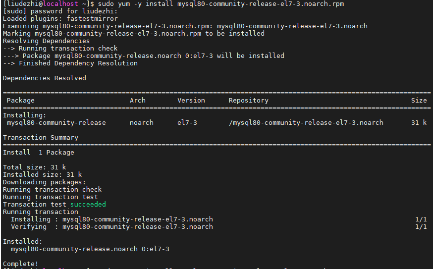
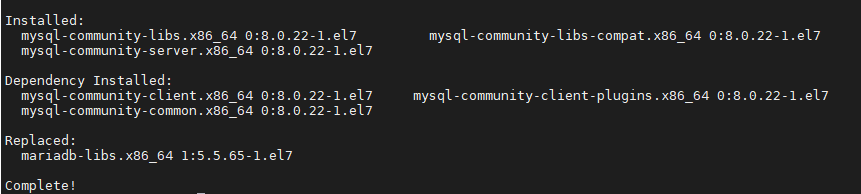
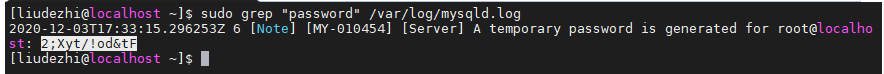

# 01. Linux 系统安装MySQL

- 笔记本：Mysql高级
- 创建时间：2020-12-03 09:04:40 UTC
- 更新时间：2020-12-10 15:05:07 UTC
- 原始链接：https://blog.csdn.net/weixin_42140801/article/details/107859925
- 印象笔记 GUID：82e5c93e-1de7-4091-bd02-dccfcf285826

# Mysql 安装

在此以 Centos7 为例

## 1. 下载安装 mysql

### 1.1. 安装 wget

```
sudo yum install wget

```

### 1.2. 安装 mysql

>
下载地址：https://dev.mysql.com/downloads/
 



```
 wget https://dev.mysql.com/get/mysql80-community-release-el7-3.noarch.rpm

 sudo yum -y install mysql80-community-release-el7-3.noarch.rpm

```



```
sudo yum -y install mysql-community-server

```



## 2. mysql 配置

### 2.1. 首先启动MySQL

```
sudo systemctl start mysqld

```

### 2.2. 查看MySQL运行状态:

```
sudo systemctl status mysqld

```

### 2.3. 在操作mysql之前要修改密码，因为MySQL默认必须修改密码之后才能操作数据库

#### 2.3.1. 首先通过如下命令可以在日志文件中找出密码：

```
sudo grep "password" /var/log/mysqld.log

```



#### 2.3.2. 登录数据库：

```
mysql -uroot -p

```

#### 2.3.3. 命令修改密码

mysql8.0 版本的密码策略是大小写字母 + 数据 + 符号
 如果直接修改密码会因为密码过于简单报错：

```
mysql> set password='root';
ERROR 1819 (HY000): Your password does not satisfy the current policy requirements

```

如果直接查看修改密码检验规则也会报错：

```
mysql> show variables like 'validate_password.%';
ERROR 1820 (HY000): You must reset your password using ALTER USER statement before executing this statement.

```

可以先将默认密码修改一个字符，然后再查看密码检查规则：

```
mysql> alter user 'root'@'localhost' identified by '2;Xyt/!od&tG';
Query OK, 0 rows affected (0.01 sec)

mysql> show variables like 'validate_password.%';
+--------------------------------------+-------+
| Variable_name                        | Value |
+--------------------------------------+-------+
| validate_password.check_user_name    | ON    |
| validate_password.dictionary_file    |       |
| validate_password.length             | 8     |
| validate_password.mixed_case_count   | 1     |
| validate_password.number_count       | 1     |
| validate_password.policy             | MEDIUM   |
| validate_password.special_char_count | 1     |
+--------------------------------------+-------+
7 rows in set (0.00 sec)

```

将检验规则进行修改：

```
mysql> set global validate_password.length=4;
Query OK, 0 rows affected (0.00 sec)

mysql> set global validate_password.policy = low;
Query OK, 0 rows affected (0.00 sec)

```

再修改密码：

```
alter user 'root'@'localhost' identified by '123456';

```

#### 2.3.4. 允许 root 远程访问

从 Mysql8 开始，不再使用该 `GRANT` 命令创建用户，改用 `CREATE USER`，然后使用 `GRANT` 语句：

```
mysql> alter user 'root'@'localhost' identified by '123456';^C
mysql> create user 'root'@'%' identified by '123456';
Query OK, 0 rows affected (0.01 sec)

mysql> grant all privileges on *.* to 'root'@'%' with grant option;
Query OK, 0 rows affected (0.02 sec)

```

开放 3306 端口

```
sudo firewall-cmd --zone=public --add-port=3306/tcp --permanent
# 重启防火墙
sudo firewall-cmd --reload
# 查看已经开放的端口
sudo firewall-cmd --list-ports

```

**Tips:** 使用 Navicat 连接 mysql，报错 `2059 - authentication plugin 'caching_sha2_password'` 解决方案：

```
ALTER USER 'root'@'%' IDENTIFIED WITH mysql_native_password BY '123456';

```

#### 2.3.5. 设置编码为 utf-8

```
mysql> show variables like 'character%';
+--------------------------+--------------------------------+
| Variable_name            | Value                          |
+--------------------------+--------------------------------+
| character_set_client     | utf8mb4                        |
| character_set_connection | utf8mb4                        |
| character_set_database   | utf8mb4                        |
| character_set_filesystem | binary                         |
| character_set_results    | utf8mb4                        |
| character_set_server     | utf8mb4                        |
| character_set_system     | utf8                           |
| character_sets_dir       | /usr/share/mysql-8.0/charsets/ |
+--------------------------+--------------------------------+
8 rows in set (0.00 sec)

```

MySQL在5.5.3之后增加了这个utf8mb4的编码，mb4就是most bytes 4的意思，专门用来兼容四字节的unicode。好在utf8mb4是utf8的超集，除了将编码改为utf8mb4外不需要做其他转换。当然，为了节省空间，一般情况下使用utf8足够,为此还是设置成utf8编码:

```
mysql> set character_set_client=utf8; mysql> set character_set_connection=utf8; mysql> set character_set_database=utf8; mysql> set character_set_results =utf8; mysql> set character_set_server=utf8;

```

#### 2.3.6. 设置开机启动

```
sudo systemctl enable mysqld
sudo systemctl daemon-reload

```

%23%20Mysql%20%E5%AE%89%E8%A3%85%0A%E5%9C%A8%E6%AD%A4%E4%BB%A5%20Centos7%20%E4%B8%BA%E4%BE%8B%0A%0A%23%23%201.%20%E4%B8%8B%E8%BD%BD%E5%AE%89%E8%A3%85%20mysql%0A%23%23%23%201.1.%20%E5%AE%89%E8%A3%85%20wget%0A%60%60%60shell%0Asudo%20yum%20install%20wget%0A%60%60%60%0A%0A%23%23%23%201.2.%20%E5%AE%89%E8%A3%85%20mysql%0A%0A%3E%20%E4%B8%8B%E8%BD%BD%E5%9C%B0%E5%9D%80%EF%BC%9Ahttps%3A%2F%2Fdev.mysql.com%2Fdownloads%2F%0A!%5B2ea2a8ed0145c1e5ec1dc2139d9daa88.png%5D(en-resource%3A%2F%2Fdatabase%2F4078%3A1)%0A%0A!%5B51aada2cc9ca63a9e50daa54622351d9.png%5D(en-resource%3A%2F%2Fdatabase%2F4080%3A1)%0A%0A%60%60%60shell%0A%20wget%20https%3A%2F%2Fdev.mysql.com%2Fget%2Fmysql80-community-release-el7-3.noarch.rpm%0A%20%0A%20sudo%20yum%20-y%20install%20mysql80-community-release-el7-3.noarch.rpm%0A%20%60%60%60%0A%20!%5B9443d9b3be8aee104282ab0cc6b5a687.png%5D(en-resource%3A%2F%2Fdatabase%2F4082%3A1)%0A%20%0A%20%60%60%60shell%0A%20sudo%20yum%20-y%20install%20mysql-community-server%0A%60%60%60%0A!%5Ba3c0b80d2d8b031117a6b6cb80365f2d.png%5D(en-resource%3A%2F%2Fdatabase%2F4084%3A1)%0A%0A%0A%23%23%202.%20mysql%20%E9%85%8D%E7%BD%AE%0A%23%23%23%202.1.%20%E9%A6%96%E5%85%88%E5%90%AF%E5%8A%A8MySQL%0A%60%60%60shell%0Asudo%20systemctl%20start%20mysqld%0A%60%60%60%0A%0A%23%23%23%202.2.%20%E6%9F%A5%E7%9C%8BMySQL%E8%BF%90%E8%A1%8C%E7%8A%B6%E6%80%81%3A%0A%60%60%60shell%0Asudo%20systemctl%20status%20mysqld%0A%60%60%60%0A%0A%23%23%23%202.3.%20%E5%9C%A8%E6%93%8D%E4%BD%9Cmysql%E4%B9%8B%E5%89%8D%E8%A6%81%E4%BF%AE%E6%94%B9%E5%AF%86%E7%A0%81%EF%BC%8C%E5%9B%A0%E4%B8%BAMySQL%E9%BB%98%E8%AE%A4%E5%BF%85%E9%A1%BB%E4%BF%AE%E6%94%B9%E5%AF%86%E7%A0%81%E4%B9%8B%E5%90%8E%E6%89%8D%E8%83%BD%E6%93%8D%E4%BD%9C%E6%95%B0%E6%8D%AE%E5%BA%93%0A%23%23%23%23%202.3.1.%20%E9%A6%96%E5%85%88%E9%80%9A%E8%BF%87%E5%A6%82%E4%B8%8B%E5%91%BD%E4%BB%A4%E5%8F%AF%E4%BB%A5%E5%9C%A8%E6%97%A5%E5%BF%97%E6%96%87%E4%BB%B6%E4%B8%AD%E6%89%BE%E5%87%BA%E5%AF%86%E7%A0%81%EF%BC%9A%0A%60%60%60shell%0Asudo%20grep%20%22password%22%20%2Fvar%2Flog%2Fmysqld.log%0A%60%60%60%0A!%5Ba6f7b726fb7235cc376d641dad0615da.png%5D(en-resource%3A%2F%2Fdatabase%2F4086%3A1)%0A%0A%23%23%23%23%202.3.2.%20%E7%99%BB%E5%BD%95%E6%95%B0%E6%8D%AE%E5%BA%93%EF%BC%9A%0A%60%60%60shell%0Amysql%20-uroot%20-p%0A%60%60%60%0A%0A%23%23%23%23%202.3.3.%20%E5%91%BD%E4%BB%A4%E4%BF%AE%E6%94%B9%E5%AF%86%E7%A0%81%0Amysql8.0%20%E7%89%88%E6%9C%AC%E7%9A%84%E5%AF%86%E7%A0%81%E7%AD%96%E7%95%A5%E6%98%AF%E5%A4%A7%E5%B0%8F%E5%86%99%E5%AD%97%E6%AF%8D%20%2B%20%E6%95%B0%E6%8D%AE%20%2B%20%E7%AC%A6%E5%8F%B7%0A%E5%A6%82%E6%9E%9C%E7%9B%B4%E6%8E%A5%E4%BF%AE%E6%94%B9%E5%AF%86%E7%A0%81%E4%BC%9A%E5%9B%A0%E4%B8%BA%E5%AF%86%E7%A0%81%E8%BF%87%E4%BA%8E%E7%AE%80%E5%8D%95%E6%8A%A5%E9%94%99%EF%BC%9A%0A%60%60%60mysql%0Amysql%3E%20set%20password%3D'root'%3B%0AERROR%201819%20(HY000)%3A%20Your%20password%20does%20not%20satisfy%20the%20current%20policy%20requirements%0A%60%60%60%0A%E5%A6%82%E6%9E%9C%E7%9B%B4%E6%8E%A5%E6%9F%A5%E7%9C%8B%E4%BF%AE%E6%94%B9%E5%AF%86%E7%A0%81%E6%A3%80%E9%AA%8C%E8%A7%84%E5%88%99%E4%B9%9F%E4%BC%9A%E6%8A%A5%E9%94%99%EF%BC%9A%0A%60%60%60mysql%0Amysql%3E%20show%20variables%20like%20'validate_password.%25'%3B%0AERROR%201820%20(HY000)%3A%20You%20must%20reset%20your%20password%20using%20ALTER%20USER%20statement%20before%20executing%20this%20statement.%0A%60%60%60%0A%E5%8F%AF%E4%BB%A5%E5%85%88%E5%B0%86%E9%BB%98%E8%AE%A4%E5%AF%86%E7%A0%81%E4%BF%AE%E6%94%B9%E4%B8%80%E4%B8%AA%E5%AD%97%E7%AC%A6%EF%BC%8C%E7%84%B6%E5%90%8E%E5%86%8D%E6%9F%A5%E7%9C%8B%E5%AF%86%E7%A0%81%E6%A3%80%E6%9F%A5%E8%A7%84%E5%88%99%EF%BC%9A%0A%60%60%60mysql%0Amysql%3E%20alter%20user%20'root'%40'localhost'%20identified%20by%20'2%3BXyt%2F!od%26tG'%3B%0AQuery%20OK%2C%200%20rows%20affected%20(0.01%20sec)%0A%0Amysql%3E%20show%20variables%20like%20'validate_password.%25'%3B%0A%2B--------------------------------------%2B-------%2B%0A%7C%20Variable_name%20%20%20%20%20%20%20%20%20%20%20%20%20%20%20%20%20%20%20%20%20%20%20%20%7C%20Value%20%7C%0A%2B--------------------------------------%2B-------%2B%0A%7C%20validate_password.check_user_name%20%20%20%20%7C%20ON%20%20%20%20%7C%0A%7C%20validate_password.dictionary_file%20%20%20%20%7C%20%20%20%20%20%20%20%7C%0A%7C%20validate_password.length%20%20%20%20%20%20%20%20%20%20%20%20%20%7C%208%20%20%20%20%20%7C%0A%7C%20validate_password.mixed_case_count%20%20%20%7C%201%20%20%20%20%20%7C%0A%7C%20validate_password.number_count%20%20%20%20%20%20%20%7C%201%20%20%20%20%20%7C%0A%7C%20validate_password.policy%20%20%20%20%20%20%20%20%20%20%20%20%20%7C%20MEDIUM%20%20%20%7C%0A%7C%20validate_password.special_char_count%20%7C%201%20%20%20%20%20%7C%0A%2B--------------------------------------%2B-------%2B%0A7%20rows%20in%20set%20(0.00%20sec)%0A%60%60%60%0A%E5%B0%86%E6%A3%80%E9%AA%8C%E8%A7%84%E5%88%99%E8%BF%9B%E8%A1%8C%E4%BF%AE%E6%94%B9%EF%BC%9A%0A%60%60%60mysql%0Amysql%3E%20set%20global%20validate_password.length%3D4%3B%0AQuery%20OK%2C%200%20rows%20affected%20(0.00%20sec)%0A%0Amysql%3E%20set%20global%20validate_password.policy%20%3D%20low%3B%0AQuery%20OK%2C%200%20rows%20affected%20(0.00%20sec)%0A%60%60%60%0A%E5%86%8D%E4%BF%AE%E6%94%B9%E5%AF%86%E7%A0%81%EF%BC%9A%0A%60%60%60mysql%0Aalter%20user%20'root'%40'localhost'%20identified%20by%20'123456'%3B%0A%60%60%60%0A%23%23%23%23%202.3.4.%20%E5%85%81%E8%AE%B8%20root%20%E8%BF%9C%E7%A8%8B%E8%AE%BF%E9%97%AE%0A%E4%BB%8E%20Mysql8%20%E5%BC%80%E5%A7%8B%EF%BC%8C%E4%B8%8D%E5%86%8D%E4%BD%BF%E7%94%A8%E8%AF%A5%20%60GRANT%60%20%E5%91%BD%E4%BB%A4%E5%88%9B%E5%BB%BA%E7%94%A8%E6%88%B7%EF%BC%8C%E6%94%B9%E7%94%A8%20%60CREATE%20USER%60%EF%BC%8C%E7%84%B6%E5%90%8E%E4%BD%BF%E7%94%A8%20%60GRANT%60%20%E8%AF%AD%E5%8F%A5%EF%BC%9A%0A%60%60%60mysql%0Amysql%3E%20alter%20user%20'root'%40'localhost'%20identified%20by%20'123456'%3B%5EC%0Amysql%3E%20create%20user%20'root'%40'%25'%20identified%20by%20'123456'%3B%0AQuery%20OK%2C%200%20rows%20affected%20(0.01%20sec)%0A%0Amysql%3E%20grant%20all%20privileges%20on%20*.*%20to%20'root'%40'%25'%20with%20grant%20option%3B%0AQuery%20OK%2C%200%20rows%20affected%20(0.02%20sec)%0A%60%60%60%0A%E5%BC%80%E6%94%BE%203306%20%E7%AB%AF%E5%8F%A3%0A%60%60%60shell%0Asudo%20firewall-cmd%20--zone%3Dpublic%20--add-port%3D3306%2Ftcp%20--permanent%0A%23%20%E9%87%8D%E5%90%AF%E9%98%B2%E7%81%AB%E5%A2%99%0Asudo%20firewall-cmd%20--reload%0A%23%20%E6%9F%A5%E7%9C%8B%E5%B7%B2%E7%BB%8F%E5%BC%80%E6%94%BE%E7%9A%84%E7%AB%AF%E5%8F%A3%0Asudo%20firewall-cmd%20--list-ports%0A%60%60%60%0A**Tips%3A**%20%E4%BD%BF%E7%94%A8%20Navicat%20%E8%BF%9E%E6%8E%A5%20mysql%EF%BC%8C%E6%8A%A5%E9%94%99%20%602059%20-%20authentication%20plugin%20'caching_sha2_password'%60%20%E8%A7%A3%E5%86%B3%E6%96%B9%E6%A1%88%EF%BC%9A%0A%60%60%60sql%0AALTER%20USER%20'root'%40'%25'%20IDENTIFIED%20WITH%20mysql_native_password%20BY%20'123456'%3B%0A%60%60%60%0A%0A%23%23%23%23%202.3.5.%20%E8%AE%BE%E7%BD%AE%E7%BC%96%E7%A0%81%E4%B8%BA%20utf-8%0A%60%60%60mysql%0Amysql%3E%20show%20variables%20like%20'character%25'%3B%0A%2B--------------------------%2B--------------------------------%2B%0A%7C%20Variable_name%20%20%20%20%20%20%20%20%20%20%20%20%7C%20Value%20%20%20%20%20%20%20%20%20%20%20%20%20%20%20%20%20%20%20%20%20%20%20%20%20%20%7C%0A%2B--------------------------%2B--------------------------------%2B%0A%7C%20character_set_client%20%20%20%20%20%7C%20utf8mb4%20%20%20%20%20%20%20%20%20%20%20%20%20%20%20%20%20%20%20%20%20%20%20%20%7C%0A%7C%20character_set_connection%20%7C%20utf8mb4%20%20%20%20%20%20%20%20%20%20%20%20%20%20%20%20%20%20%20%20%20%20%20%20%7C%0A%7C%20character_set_database%20%20%20%7C%20utf8mb4%20%20%20%20%20%20%20%20%20%20%20%20%20%20%20%20%20%20%20%20%20%20%20%20%7C%0A%7C%20character_set_filesystem%20%7C%20binary%20%20%20%20%20%20%20%20%20%20%20%20%20%20%20%20%20%20%20%20%20%20%20%20%20%7C%0A%7C%20character_set_results%20%20%20%20%7C%20utf8mb4%20%20%20%20%20%20%20%20%20%20%20%20%20%20%20%20%20%20%20%20%20%20%20%20%7C%0A%7C%20character_set_server%20%20%20%20%20%7C%20utf8mb4%20%20%20%20%20%20%20%20%20%20%20%20%20%20%20%20%20%20%20%20%20%20%20%20%7C%0A%7C%20character_set_system%20%20%20%20%20%7C%20utf8%20%20%20%20%20%20%20%20%20%20%20%20%20%20%20%20%20%20%20%20%20%20%20%20%20%20%20%7C%0A%7C%20character_sets_dir%20%20%20%20%20%20%20%7C%20%2Fusr%2Fshare%2Fmysql-8.0%2Fcharsets%2F%20%7C%0A%2B--------------------------%2B--------------------------------%2B%0A8%20rows%20in%20set%20(0.00%20sec)%0A%60%60%60%0A%0AMySQL%E5%9C%A85.5.3%E4%B9%8B%E5%90%8E%E5%A2%9E%E5%8A%A0%E4%BA%86%E8%BF%99%E4%B8%AAutf8mb4%E7%9A%84%E7%BC%96%E7%A0%81%EF%BC%8Cmb4%E5%B0%B1%E6%98%AFmost%20bytes%204%E7%9A%84%E6%84%8F%E6%80%9D%EF%BC%8C%E4%B8%93%E9%97%A8%E7%94%A8%E6%9D%A5%E5%85%BC%E5%AE%B9%E5%9B%9B%E5%AD%97%E8%8A%82%E7%9A%84unicode%E3%80%82%E5%A5%BD%E5%9C%A8utf8mb4%E6%98%AFutf8%E7%9A%84%E8%B6%85%E9%9B%86%EF%BC%8C%E9%99%A4%E4%BA%86%E5%B0%86%E7%BC%96%E7%A0%81%E6%94%B9%E4%B8%BAutf8mb4%E5%A4%96%E4%B8%8D%E9%9C%80%E8%A6%81%E5%81%9A%E5%85%B6%E4%BB%96%E8%BD%AC%E6%8D%A2%E3%80%82%E5%BD%93%E7%84%B6%EF%BC%8C%E4%B8%BA%E4%BA%86%E8%8A%82%E7%9C%81%E7%A9%BA%E9%97%B4%EF%BC%8C%E4%B8%80%E8%88%AC%E6%83%85%E5%86%B5%E4%B8%8B%E4%BD%BF%E7%94%A8utf8%E8%B6%B3%E5%A4%9F%2C%E4%B8%BA%E6%AD%A4%E8%BF%98%E6%98%AF%E8%AE%BE%E7%BD%AE%E6%88%90utf8%E7%BC%96%E7%A0%81%3A%0A%60%60%60mysql%0Aset%20character_set_client%3Dutf8%3B%20%0Aset%20character_set_connection%3Dutf8%3B%20%0Aset%20character_set_database%3Dutf8%3B%20%0Aset%20character_set_results%20%3Dutf8%3B%20%0Aset%20character_set_server%3Dutf8%3B%0A%60%60%60%0A%0A%23%23%23%23%202.3.6.%20%E8%AE%BE%E7%BD%AE%E5%BC%80%E6%9C%BA%E5%90%AF%E5%8A%A8%0A%60%60%60shell%0Asudo%20systemctl%20enable%20mysqld%0Asudo%20systemctl%20daemon-reload%0A%60%60%60
