# 02.索引

- 笔记本：Mysql高级
- 创建时间：2020-12-03 13:06:30 UTC
- 更新时间：2020-12-04 07:47:57 UTC
- 印象笔记 GUID：5d61d1d4-e174-43e8-9a58-6757460de3ce

# 索引

## 1. 索引概述

MySQL官方对索引的定义为：索引（index）是帮助MySQL高效获取数据的数据结构（有序）。在数据之外，数据库系统还维护者满足特定查找算法的数据结构，这些数据结构以某种方式引用（指向）数据， 这样就可以在这些数据结构上实现高级查找算法，这种数据结构就是索引。如下面的示意图所示 :
 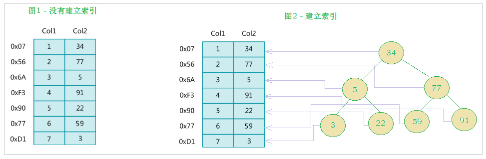

左边是数据表，一共有两列七条记录，最左边的是数据记录的物理地址（注意逻辑上相邻的记录在磁盘上也并不是一定物理相邻的）。为了加快Col2的查找，可以维护一个右边所示的二叉查找树，每个节点分别包含索引键值和一个指向对应数据记录物理地址的指针，这样就可以运用二叉查找快速获取到相应数据。

一般来说索引本身也很大，不可能全部存储在内存中，因此索引往往以索引文件的形式存储在磁盘上。索引是数据库中用来提高性能的最常用的工具。

## 2. 索引优势劣势

优势：
 1） 类似于书籍的目录索引，提高数据检索的效率，降低数据库的IO成本。
 2） 通过索引列对数据进行排序，降低数据排序的成本，降低CPU的消耗。

劣势：
 1） 实际上索引也是一张表，该表中保存了主键与索引字段，并指向实体类的记录，所以索引列也是要占用空间的。
 2） 虽然索引大大提高了查询效率，同时却也降低更新表的速度，如对表进行INSERT、UPDATE、DELETE。因为更新表时，MySQL 不仅要保存数据，还要保存一下索引文件每次更新添加了索引列的字段，都会调整因为更新所带来的键值变化后的索引信息。

## 3. 索引结构

索引是在MySQL的存储引擎层中实现的，而不是在服务器层实现的。所以每种存储引擎的索引都不一定完全相同，也不是所有的存储引擎都支持所有的索引类型的。MySQL目前提供了以下4种索引：

- BTREE 索引 ： 最常见的索引类型，大部分索引都支持 B 树索引。

- HASH 索引：只有Memory引擎支持 ， 使用场景简单 。

- R-tree 索引（空间索引）：空间索引是MyISAM引擎的一个特殊索引类型，主要用于地理空间数据类型，通常使用较少，不做特别介绍。

- Full-text （全文索引） ：全文索引也是MyISAM的一个特殊索引类型，主要用于全文索引，InnoDB从Mysql5.6版本开始支持全文索引。

<center><b>MyISAM、InnoDB、Memory三种存储引擎对各种索引类型的支持</b></center>

 | 索引 | InnoDB引擎 | MyISAM引擎 | Memory引擎
 | BTREE索引 | 支持 | 支持 | 支持
 | HASH 索引 | 不支持 | 不支持 | 支持
 | R-tree 索引 | 不支持 | 支持 | 不支持
 | Full-text | 5.6版本之后支持 | 支持 | 不支持

我们平常所说的索引，如果没有特别指明，都是指B+树（多路搜索树，并不一定是二叉的）结构组织的索引。其中聚集索引、复合索引、前缀索引、唯一索引默认都是使用 B+tree 索引，统称为 索引。
 我们平常所说的索引，如果没有特别指明，都是指B+树（多路搜索树，并不一定是二叉的）结构组织的索引。其中聚集索引、复合索引、前缀索引、唯一索引默认都是使用 B+tree 索引，统称为 索引。

### 3.1. BTREE 结构

BTree 又叫多路平衡搜索树，一颗 m 叉的 BTree 特性如下：

- 树中每个节点最多包含 m 个孩子。

- 除根节点与叶子节点外，每个节点至少有`[ceil(m/2)]`个孩子。

- 若根节点不是叶子节点，则至少有两个孩子。

- 所有的叶子节点都在同一层

- 每个非叶子节点由n个key与n+1个指针组成，其中 [ceil(m/2)-1] <= n <= m-1
 **注：** ceil() 方法：对一个数进行向上舍入，返回值大于或等于给定的参数。

以5叉BTree为例，key的数量：公式推导[ceil(m/2)-1] <= n <= m-1。所以 2 <= n <=4 。当n>4时，中间节点分裂到父节点，两边节点分裂。

插入 C N G A H E K Q M F W L T Z D P R X Y S 数据为例。

演变过程如下：
 1). 插入前4个字母 C N G A
 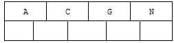

2). 插入H，n>4，中间元素G字母向上分裂到新的节点
 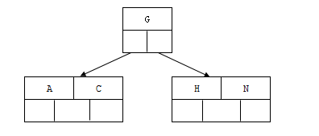

3). 插入E，K，Q不需要分裂
 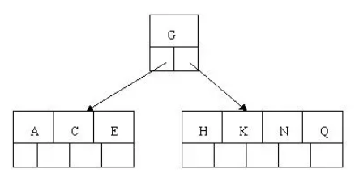

4). 插入M，中间元素M字母向上分裂到父节点G
 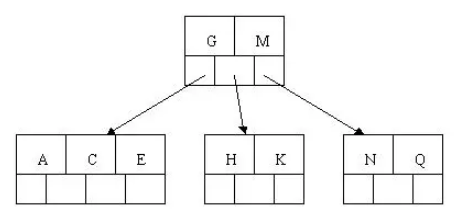

5). 插入F，W，L，T不需要分裂
 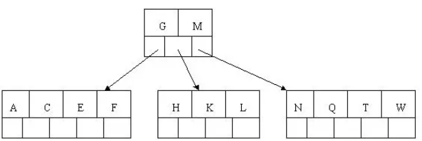

6). 插入Z，中间元素T向上分裂到父节点中
 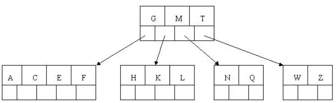

7). 插入D，中间元素D向上分裂到父节点中。然后插入P，R，X，Y不需要分裂
 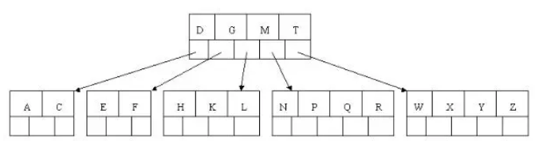

8). 最后插入S，NPQR节点n>5，中间节点Q向上分裂，但分裂后父节点DGMT的n>5，中间节点M向上分裂
 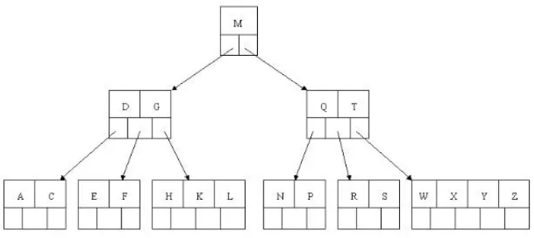

到此，该BTREE树就已经构建完成了， BTREE树 和 二叉树 相比， 查询数据的效率更高， 因为对于相同的数据量来说，BTREE的层级结构比二叉树小，因此搜索速度快。

### 3.2. B+TREE 结构

B+Tree 为 BTree 的变种，B+Tree 与 BTree 的区别为：
 1). n叉B+Tree最多含有n个key，而BTree最多含有n-1个key。
 2). B+Tree的叶子节点保存所有的key信息，依key大小顺序排列。
 3). 所有的非叶子节点都可以看作是key的索引部分。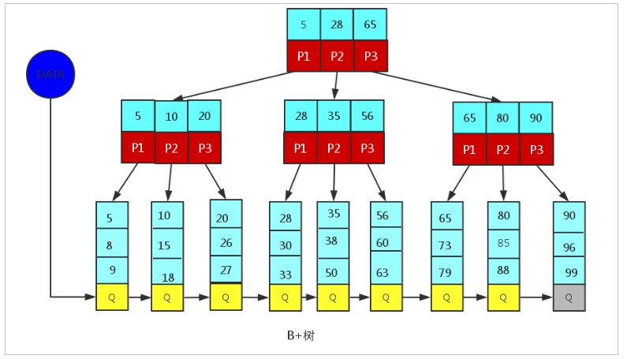

由于B+Tree只有叶子节点保存key信息，查询任何key都要从root走到叶子。所以B+Tree的查询效率更加稳定。

### 3.3. MySQL 中的 B+TREE

MySql索引数据结构对经典的B+Tree进行了优化。在原B+Tree的基础上，增加一个指向相邻叶子节点的链表指针，就形成了带有顺序指针的B+Tree，提高区间访问的性能。
 MySQL中的 B+Tree 索引结构示意图:
 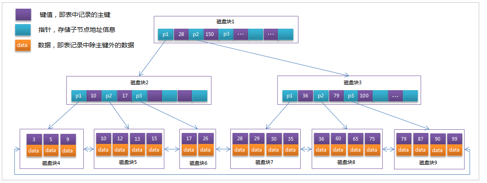

## 4. 索引分类

1） 单值索引 ：即一个索引只包含单个列，一个表可以有多个单列索引
 2） 唯一索引 ：索引列的值必须唯一，但允许有空值
 3） 复合索引 ：即一个索引包含多个列

## 5. 索引语法

索引在创建表的时候，可以同时创建， 也可以随时增加新的索引。
 准备环境:

```
create database demo_01 default charset=utf8mb4;

use demo_01;

CREATE TABLE `city` (
  `city_id` int(11) NOT NULL AUTO_INCREMENT,
  `city_name` varchar(50) NOT NULL,
  `country_id` int(11) NOT NULL,
  PRIMARY KEY (`city_id`)
) ENGINE=InnoDB DEFAULT CHARSET=utf8;

CREATE TABLE `country` (
  `country_id` int(11) NOT NULL AUTO_INCREMENT,
  `country_name` varchar(100) NOT NULL,
  PRIMARY KEY (`country_id`)
) ENGINE=InnoDB DEFAULT CHARSET=utf8;

insert into `city` (`city_id`, `city_name`, `country_id`) values(1,'西安',1);
insert into `city` (`city_id`, `city_name`, `country_id`) values(2,'NewYork',2);
insert into `city` (`city_id`, `city_name`, `country_id`) values(3,'北京',1);
insert into `city` (`city_id`, `city_name`, `country_id`) values(4,'上海',1);

insert into `country` (`country_id`, `country_name`) values(1,'China');
insert into `country` (`country_id`, `country_name`) values(2,'America');
insert into `country` (`country_id`, `country_name`) values(3,'Japan');
insert into `country` (`country_id`, `country_name`) values(4,'UK');

```

### 5.1. 创建索引

语法：

```
CREATE 	[UNIQUE|FULLTEXT|SPATIAL]  INDEX index_name
[USING  index_type]
ON tbl_name(index_col_name,...)

index_col_name : column_name[(length)][ASC | DESC]

```

示例 ： 为city表中的city_name字段创建索引 ；

### 5.2. 查看索引

### 5.3. 删除索引

### 5.4. ALTER 命令

## 6. 索引设计原则

 索引的设计可以遵循一些已有的原则，创建索引的时候请尽量考虑符合这些原则，便于提升索引的使用效率，更高效的使用索引。

- 对查询频次较高，且数据量比较大的表建立索引。

- 索引字段的选择，最佳候选列应当从where子句的条件中提取，如果where子句中的组合比较多，那么应当挑选最常用、过滤效果最好的列的组合。

- 使用唯一索引，区分度越高，使用索引的效率越高。

- 索引可以有效的提升查询数据的效率，但索引数量不是多多益善，索引越多，维护索引的代价自然也就水涨船高。对于插入、更新、删除等DML操作比较频繁的表来说，索引过多，会引入相当高的维护代价，降低DML操作的效率，增加相应操作的时间消耗。另外索引过多的话，MySQL也会犯选择困难病，虽然最终仍然会找到一个可用的索引，但无疑提高了选择的代价。

- 使用短索引，索引创建之后也是使用硬盘来存储的，因此提升索引访问的I/O效率，也可以提升总体的访问效率。假如构成索引的字段总长度比较短，那么在给定大小的存储块内可以存储更多的索引值，相应的可以有效的提升MySQL访问索引的I/O效率。

- 利用最左前缀，N个列组合而成的组合索引，那么相当于是创建了N个索引，如果查询时where子句中使用了组成该索引的前几个字段，那么这条查询SQL可以利用组合索引来提升查询效率。

```
-- 创建复合索引:
CREATE INDEX idx_name_email_status ON tb_seller(NAME,email,STATUS);

```

就相当于
 对name 创建索引 ;
 对name , email 创建了索引 ;
 对name , email, status 创建了索引 ;

%23%20%E7%B4%A2%E5%BC%95%0A%0A%23%23%201.%20%E7%B4%A2%E5%BC%95%E6%A6%82%E8%BF%B0%0AMySQL%E5%AE%98%E6%96%B9%E5%AF%B9%E7%B4%A2%E5%BC%95%E7%9A%84%E5%AE%9A%E4%B9%89%E4%B8%BA%EF%BC%9A%E7%B4%A2%E5%BC%95%EF%BC%88index%EF%BC%89%E6%98%AF%E5%B8%AE%E5%8A%A9MySQL%E9%AB%98%E6%95%88%E8%8E%B7%E5%8F%96%E6%95%B0%E6%8D%AE%E7%9A%84%E6%95%B0%E6%8D%AE%E7%BB%93%E6%9E%84%EF%BC%88%E6%9C%89%E5%BA%8F%EF%BC%89%E3%80%82%E5%9C%A8%E6%95%B0%E6%8D%AE%E4%B9%8B%E5%A4%96%EF%BC%8C%E6%95%B0%E6%8D%AE%E5%BA%93%E7%B3%BB%E7%BB%9F%E8%BF%98%E7%BB%B4%E6%8A%A4%E8%80%85%E6%BB%A1%E8%B6%B3%E7%89%B9%E5%AE%9A%E6%9F%A5%E6%89%BE%E7%AE%97%E6%B3%95%E7%9A%84%E6%95%B0%E6%8D%AE%E7%BB%93%E6%9E%84%EF%BC%8C%E8%BF%99%E4%BA%9B%E6%95%B0%E6%8D%AE%E7%BB%93%E6%9E%84%E4%BB%A5%E6%9F%90%E7%A7%8D%E6%96%B9%E5%BC%8F%E5%BC%95%E7%94%A8%EF%BC%88%E6%8C%87%E5%90%91%EF%BC%89%E6%95%B0%E6%8D%AE%EF%BC%8C%20%E8%BF%99%E6%A0%B7%E5%B0%B1%E5%8F%AF%E4%BB%A5%E5%9C%A8%E8%BF%99%E4%BA%9B%E6%95%B0%E6%8D%AE%E7%BB%93%E6%9E%84%E4%B8%8A%E5%AE%9E%E7%8E%B0%E9%AB%98%E7%BA%A7%E6%9F%A5%E6%89%BE%E7%AE%97%E6%B3%95%EF%BC%8C%E8%BF%99%E7%A7%8D%E6%95%B0%E6%8D%AE%E7%BB%93%E6%9E%84%E5%B0%B1%E6%98%AF%E7%B4%A2%E5%BC%95%E3%80%82%E5%A6%82%E4%B8%8B%E9%9D%A2%E7%9A%84%E7%A4%BA%E6%84%8F%E5%9B%BE%E6%89%80%E7%A4%BA%20%3A%0A!%5B0758a9331077ebbc367ecb42fc8a2efd.png%5D(en-resource%3A%2F%2Fdatabase%2F4090%3A0)%0A%0A%E5%B7%A6%E8%BE%B9%E6%98%AF%E6%95%B0%E6%8D%AE%E8%A1%A8%EF%BC%8C%E4%B8%80%E5%85%B1%E6%9C%89%E4%B8%A4%E5%88%97%E4%B8%83%E6%9D%A1%E8%AE%B0%E5%BD%95%EF%BC%8C%E6%9C%80%E5%B7%A6%E8%BE%B9%E7%9A%84%E6%98%AF%E6%95%B0%E6%8D%AE%E8%AE%B0%E5%BD%95%E7%9A%84%E7%89%A9%E7%90%86%E5%9C%B0%E5%9D%80%EF%BC%88%E6%B3%A8%E6%84%8F%E9%80%BB%E8%BE%91%E4%B8%8A%E7%9B%B8%E9%82%BB%E7%9A%84%E8%AE%B0%E5%BD%95%E5%9C%A8%E7%A3%81%E7%9B%98%E4%B8%8A%E4%B9%9F%E5%B9%B6%E4%B8%8D%E6%98%AF%E4%B8%80%E5%AE%9A%E7%89%A9%E7%90%86%E7%9B%B8%E9%82%BB%E7%9A%84%EF%BC%89%E3%80%82%E4%B8%BA%E4%BA%86%E5%8A%A0%E5%BF%ABCol2%E7%9A%84%E6%9F%A5%E6%89%BE%EF%BC%8C%E5%8F%AF%E4%BB%A5%E7%BB%B4%E6%8A%A4%E4%B8%80%E4%B8%AA%E5%8F%B3%E8%BE%B9%E6%89%80%E7%A4%BA%E7%9A%84%E4%BA%8C%E5%8F%89%E6%9F%A5%E6%89%BE%E6%A0%91%EF%BC%8C%E6%AF%8F%E4%B8%AA%E8%8A%82%E7%82%B9%E5%88%86%E5%88%AB%E5%8C%85%E5%90%AB%E7%B4%A2%E5%BC%95%E9%94%AE%E5%80%BC%E5%92%8C%E4%B8%80%E4%B8%AA%E6%8C%87%E5%90%91%E5%AF%B9%E5%BA%94%E6%95%B0%E6%8D%AE%E8%AE%B0%E5%BD%95%E7%89%A9%E7%90%86%E5%9C%B0%E5%9D%80%E7%9A%84%E6%8C%87%E9%92%88%EF%BC%8C%E8%BF%99%E6%A0%B7%E5%B0%B1%E5%8F%AF%E4%BB%A5%E8%BF%90%E7%94%A8%E4%BA%8C%E5%8F%89%E6%9F%A5%E6%89%BE%E5%BF%AB%E9%80%9F%E8%8E%B7%E5%8F%96%E5%88%B0%E7%9B%B8%E5%BA%94%E6%95%B0%E6%8D%AE%E3%80%82%0A%0A%E4%B8%80%E8%88%AC%E6%9D%A5%E8%AF%B4%E7%B4%A2%E5%BC%95%E6%9C%AC%E8%BA%AB%E4%B9%9F%E5%BE%88%E5%A4%A7%EF%BC%8C%E4%B8%8D%E5%8F%AF%E8%83%BD%E5%85%A8%E9%83%A8%E5%AD%98%E5%82%A8%E5%9C%A8%E5%86%85%E5%AD%98%E4%B8%AD%EF%BC%8C%E5%9B%A0%E6%AD%A4%E7%B4%A2%E5%BC%95%E5%BE%80%E5%BE%80%E4%BB%A5%E7%B4%A2%E5%BC%95%E6%96%87%E4%BB%B6%E7%9A%84%E5%BD%A2%E5%BC%8F%E5%AD%98%E5%82%A8%E5%9C%A8%E7%A3%81%E7%9B%98%E4%B8%8A%E3%80%82%E7%B4%A2%E5%BC%95%E6%98%AF%E6%95%B0%E6%8D%AE%E5%BA%93%E4%B8%AD%E7%94%A8%E6%9D%A5%E6%8F%90%E9%AB%98%E6%80%A7%E8%83%BD%E7%9A%84%E6%9C%80%E5%B8%B8%E7%94%A8%E7%9A%84%E5%B7%A5%E5%85%B7%E3%80%82%0A%0A%23%23%202.%20%E7%B4%A2%E5%BC%95%E4%BC%98%E5%8A%BF%E5%8A%A3%E5%8A%BF%0A%E4%BC%98%E5%8A%BF%EF%BC%9A%0A1%EF%BC%89%20%E7%B1%BB%E4%BC%BC%E4%BA%8E%E4%B9%A6%E7%B1%8D%E7%9A%84%E7%9B%AE%E5%BD%95%E7%B4%A2%E5%BC%95%EF%BC%8C%E6%8F%90%E9%AB%98%E6%95%B0%E6%8D%AE%E6%A3%80%E7%B4%A2%E7%9A%84%E6%95%88%E7%8E%87%EF%BC%8C%E9%99%8D%E4%BD%8E%E6%95%B0%E6%8D%AE%E5%BA%93%E7%9A%84IO%E6%88%90%E6%9C%AC%E3%80%82%0A2%EF%BC%89%20%E9%80%9A%E8%BF%87%E7%B4%A2%E5%BC%95%E5%88%97%E5%AF%B9%E6%95%B0%E6%8D%AE%E8%BF%9B%E8%A1%8C%E6%8E%92%E5%BA%8F%EF%BC%8C%E9%99%8D%E4%BD%8E%E6%95%B0%E6%8D%AE%E6%8E%92%E5%BA%8F%E7%9A%84%E6%88%90%E6%9C%AC%EF%BC%8C%E9%99%8D%E4%BD%8ECPU%E7%9A%84%E6%B6%88%E8%80%97%E3%80%82%0A%0A%E5%8A%A3%E5%8A%BF%EF%BC%9A%0A1%EF%BC%89%20%E5%AE%9E%E9%99%85%E4%B8%8A%E7%B4%A2%E5%BC%95%E4%B9%9F%E6%98%AF%E4%B8%80%E5%BC%A0%E8%A1%A8%EF%BC%8C%E8%AF%A5%E8%A1%A8%E4%B8%AD%E4%BF%9D%E5%AD%98%E4%BA%86%E4%B8%BB%E9%94%AE%E4%B8%8E%E7%B4%A2%E5%BC%95%E5%AD%97%E6%AE%B5%EF%BC%8C%E5%B9%B6%E6%8C%87%E5%90%91%E5%AE%9E%E4%BD%93%E7%B1%BB%E7%9A%84%E8%AE%B0%E5%BD%95%EF%BC%8C%E6%89%80%E4%BB%A5%E7%B4%A2%E5%BC%95%E5%88%97%E4%B9%9F%E6%98%AF%E8%A6%81%E5%8D%A0%E7%94%A8%E7%A9%BA%E9%97%B4%E7%9A%84%E3%80%82%0A2%EF%BC%89%20%E8%99%BD%E7%84%B6%E7%B4%A2%E5%BC%95%E5%A4%A7%E5%A4%A7%E6%8F%90%E9%AB%98%E4%BA%86%E6%9F%A5%E8%AF%A2%E6%95%88%E7%8E%87%EF%BC%8C%E5%90%8C%E6%97%B6%E5%8D%B4%E4%B9%9F%E9%99%8D%E4%BD%8E%E6%9B%B4%E6%96%B0%E8%A1%A8%E7%9A%84%E9%80%9F%E5%BA%A6%EF%BC%8C%E5%A6%82%E5%AF%B9%E8%A1%A8%E8%BF%9B%E8%A1%8CINSERT%E3%80%81UPDATE%E3%80%81DELETE%E3%80%82%E5%9B%A0%E4%B8%BA%E6%9B%B4%E6%96%B0%E8%A1%A8%E6%97%B6%EF%BC%8CMySQL%20%E4%B8%8D%E4%BB%85%E8%A6%81%E4%BF%9D%E5%AD%98%E6%95%B0%E6%8D%AE%EF%BC%8C%E8%BF%98%E8%A6%81%E4%BF%9D%E5%AD%98%E4%B8%80%E4%B8%8B%E7%B4%A2%E5%BC%95%E6%96%87%E4%BB%B6%E6%AF%8F%E6%AC%A1%E6%9B%B4%E6%96%B0%E6%B7%BB%E5%8A%A0%E4%BA%86%E7%B4%A2%E5%BC%95%E5%88%97%E7%9A%84%E5%AD%97%E6%AE%B5%EF%BC%8C%E9%83%BD%E4%BC%9A%E8%B0%83%E6%95%B4%E5%9B%A0%E4%B8%BA%E6%9B%B4%E6%96%B0%E6%89%80%E5%B8%A6%E6%9D%A5%E7%9A%84%E9%94%AE%E5%80%BC%E5%8F%98%E5%8C%96%E5%90%8E%E7%9A%84%E7%B4%A2%E5%BC%95%E4%BF%A1%E6%81%AF%E3%80%82%0A%0A%23%23%203.%20%E7%B4%A2%E5%BC%95%E7%BB%93%E6%9E%84%0A%E7%B4%A2%E5%BC%95%E6%98%AF%E5%9C%A8MySQL%E7%9A%84%E5%AD%98%E5%82%A8%E5%BC%95%E6%93%8E%E5%B1%82%E4%B8%AD%E5%AE%9E%E7%8E%B0%E7%9A%84%EF%BC%8C%E8%80%8C%E4%B8%8D%E6%98%AF%E5%9C%A8%E6%9C%8D%E5%8A%A1%E5%99%A8%E5%B1%82%E5%AE%9E%E7%8E%B0%E7%9A%84%E3%80%82%E6%89%80%E4%BB%A5%E6%AF%8F%E7%A7%8D%E5%AD%98%E5%82%A8%E5%BC%95%E6%93%8E%E7%9A%84%E7%B4%A2%E5%BC%95%E9%83%BD%E4%B8%8D%E4%B8%80%E5%AE%9A%E5%AE%8C%E5%85%A8%E7%9B%B8%E5%90%8C%EF%BC%8C%E4%B9%9F%E4%B8%8D%E6%98%AF%E6%89%80%E6%9C%89%E7%9A%84%E5%AD%98%E5%82%A8%E5%BC%95%E6%93%8E%E9%83%BD%E6%94%AF%E6%8C%81%E6%89%80%E6%9C%89%E7%9A%84%E7%B4%A2%E5%BC%95%E7%B1%BB%E5%9E%8B%E7%9A%84%E3%80%82MySQL%E7%9B%AE%E5%89%8D%E6%8F%90%E4%BE%9B%E4%BA%86%E4%BB%A5%E4%B8%8B4%E7%A7%8D%E7%B4%A2%E5%BC%95%EF%BC%9A%0A-%20BTREE%20%E7%B4%A2%E5%BC%95%20%EF%BC%9A%20%E6%9C%80%E5%B8%B8%E8%A7%81%E7%9A%84%E7%B4%A2%E5%BC%95%E7%B1%BB%E5%9E%8B%EF%BC%8C%E5%A4%A7%E9%83%A8%E5%88%86%E7%B4%A2%E5%BC%95%E9%83%BD%E6%94%AF%E6%8C%81%20B%20%E6%A0%91%E7%B4%A2%E5%BC%95%E3%80%82%0A-%20HASH%20%E7%B4%A2%E5%BC%95%EF%BC%9A%E5%8F%AA%E6%9C%89Memory%E5%BC%95%E6%93%8E%E6%94%AF%E6%8C%81%20%EF%BC%8C%20%E4%BD%BF%E7%94%A8%E5%9C%BA%E6%99%AF%E7%AE%80%E5%8D%95%20%E3%80%82%0A-%20R-tree%20%E7%B4%A2%E5%BC%95%EF%BC%88%E7%A9%BA%E9%97%B4%E7%B4%A2%E5%BC%95%EF%BC%89%EF%BC%9A%E7%A9%BA%E9%97%B4%E7%B4%A2%E5%BC%95%E6%98%AFMyISAM%E5%BC%95%E6%93%8E%E7%9A%84%E4%B8%80%E4%B8%AA%E7%89%B9%E6%AE%8A%E7%B4%A2%E5%BC%95%E7%B1%BB%E5%9E%8B%EF%BC%8C%E4%B8%BB%E8%A6%81%E7%94%A8%E4%BA%8E%E5%9C%B0%E7%90%86%E7%A9%BA%E9%97%B4%E6%95%B0%E6%8D%AE%E7%B1%BB%E5%9E%8B%EF%BC%8C%E9%80%9A%E5%B8%B8%E4%BD%BF%E7%94%A8%E8%BE%83%E5%B0%91%EF%BC%8C%E4%B8%8D%E5%81%9A%E7%89%B9%E5%88%AB%E4%BB%8B%E7%BB%8D%E3%80%82%0A-%20Full-text%20%EF%BC%88%E5%85%A8%E6%96%87%E7%B4%A2%E5%BC%95%EF%BC%89%20%EF%BC%9A%E5%85%A8%E6%96%87%E7%B4%A2%E5%BC%95%E4%B9%9F%E6%98%AFMyISAM%E7%9A%84%E4%B8%80%E4%B8%AA%E7%89%B9%E6%AE%8A%E7%B4%A2%E5%BC%95%E7%B1%BB%E5%9E%8B%EF%BC%8C%E4%B8%BB%E8%A6%81%E7%94%A8%E4%BA%8E%E5%85%A8%E6%96%87%E7%B4%A2%E5%BC%95%EF%BC%8CInnoDB%E4%BB%8EMysql5.6%E7%89%88%E6%9C%AC%E5%BC%80%E5%A7%8B%E6%94%AF%E6%8C%81%E5%85%A8%E6%96%87%E7%B4%A2%E5%BC%95%E3%80%82%0A%0A%3Ccenter%3E%3Cb%3EMyISAM%E3%80%81InnoDB%E3%80%81Memory%E4%B8%89%E7%A7%8D%E5%AD%98%E5%82%A8%E5%BC%95%E6%93%8E%E5%AF%B9%E5%90%84%E7%A7%8D%E7%B4%A2%E5%BC%95%E7%B1%BB%E5%9E%8B%E7%9A%84%E6%94%AF%E6%8C%81%3C%2Fb%3E%3C%2Fcenter%3E%0A%7C%20%E7%B4%A2%E5%BC%95%20%20%20%20%20%20%20%20%7C%20InnoDB%E5%BC%95%E6%93%8E%20%20%20%20%20%20%7C%20MyISAM%E5%BC%95%E6%93%8E%20%7C%20Memory%E5%BC%95%E6%93%8E%20%7C%0A%7C%20-----------%20%7C%20---------------%20%7C%20----------%20%7C%20----------%20%7C%0A%7C%20BTREE%E7%B4%A2%E5%BC%95%20%20%20%7C%20%E6%94%AF%E6%8C%81%20%20%20%20%20%20%20%20%20%20%20%20%7C%20%E6%94%AF%E6%8C%81%20%20%20%20%20%20%20%7C%20%E6%94%AF%E6%8C%81%20%20%20%20%20%20%20%7C%0A%7C%20HASH%20%E7%B4%A2%E5%BC%95%20%20%20%7C%20%E4%B8%8D%E6%94%AF%E6%8C%81%20%20%20%20%20%20%20%20%20%20%7C%20%E4%B8%8D%E6%94%AF%E6%8C%81%20%20%20%20%20%7C%20%E6%94%AF%E6%8C%81%20%20%20%20%20%20%20%7C%0A%7C%20R-tree%20%E7%B4%A2%E5%BC%95%20%7C%20%E4%B8%8D%E6%94%AF%E6%8C%81%20%20%20%20%20%20%20%20%20%20%7C%20%E6%94%AF%E6%8C%81%20%20%20%20%20%20%20%7C%20%E4%B8%8D%E6%94%AF%E6%8C%81%20%20%20%20%20%7C%0A%7C%20Full-text%20%20%20%7C%205.6%E7%89%88%E6%9C%AC%E4%B9%8B%E5%90%8E%E6%94%AF%E6%8C%81%20%7C%20%E6%94%AF%E6%8C%81%20%20%20%20%20%20%20%7C%20%E4%B8%8D%E6%94%AF%E6%8C%81%20%20%20%20%20%7C%0A%0A%E6%88%91%E4%BB%AC%E5%B9%B3%E5%B8%B8%E6%89%80%E8%AF%B4%E7%9A%84%E7%B4%A2%E5%BC%95%EF%BC%8C%E5%A6%82%E6%9E%9C%E6%B2%A1%E6%9C%89%E7%89%B9%E5%88%AB%E6%8C%87%E6%98%8E%EF%BC%8C%E9%83%BD%E6%98%AF%E6%8C%87B%2B%E6%A0%91%EF%BC%88%E5%A4%9A%E8%B7%AF%E6%90%9C%E7%B4%A2%E6%A0%91%EF%BC%8C%E5%B9%B6%E4%B8%8D%E4%B8%80%E5%AE%9A%E6%98%AF%E4%BA%8C%E5%8F%89%E7%9A%84%EF%BC%89%E7%BB%93%E6%9E%84%E7%BB%84%E7%BB%87%E7%9A%84%E7%B4%A2%E5%BC%95%E3%80%82%E5%85%B6%E4%B8%AD%E8%81%9A%E9%9B%86%E7%B4%A2%E5%BC%95%E3%80%81%E5%A4%8D%E5%90%88%E7%B4%A2%E5%BC%95%E3%80%81%E5%89%8D%E7%BC%80%E7%B4%A2%E5%BC%95%E3%80%81%E5%94%AF%E4%B8%80%E7%B4%A2%E5%BC%95%E9%BB%98%E8%AE%A4%E9%83%BD%E6%98%AF%E4%BD%BF%E7%94%A8%20B%2Btree%20%E7%B4%A2%E5%BC%95%EF%BC%8C%E7%BB%9F%E7%A7%B0%E4%B8%BA%20%E7%B4%A2%E5%BC%95%E3%80%82%0A%E6%88%91%E4%BB%AC%E5%B9%B3%E5%B8%B8%E6%89%80%E8%AF%B4%E7%9A%84%E7%B4%A2%E5%BC%95%EF%BC%8C%E5%A6%82%E6%9E%9C%E6%B2%A1%E6%9C%89%E7%89%B9%E5%88%AB%E6%8C%87%E6%98%8E%EF%BC%8C%E9%83%BD%E6%98%AF%E6%8C%87B%2B%E6%A0%91%EF%BC%88%E5%A4%9A%E8%B7%AF%E6%90%9C%E7%B4%A2%E6%A0%91%EF%BC%8C%E5%B9%B6%E4%B8%8D%E4%B8%80%E5%AE%9A%E6%98%AF%E4%BA%8C%E5%8F%89%E7%9A%84%EF%BC%89%E7%BB%93%E6%9E%84%E7%BB%84%E7%BB%87%E7%9A%84%E7%B4%A2%E5%BC%95%E3%80%82%E5%85%B6%E4%B8%AD%E8%81%9A%E9%9B%86%E7%B4%A2%E5%BC%95%E3%80%81%E5%A4%8D%E5%90%88%E7%B4%A2%E5%BC%95%E3%80%81%E5%89%8D%E7%BC%80%E7%B4%A2%E5%BC%95%E3%80%81%E5%94%AF%E4%B8%80%E7%B4%A2%E5%BC%95%E9%BB%98%E8%AE%A4%E9%83%BD%E6%98%AF%E4%BD%BF%E7%94%A8%20B%2Btree%20%E7%B4%A2%E5%BC%95%EF%BC%8C%E7%BB%9F%E7%A7%B0%E4%B8%BA%20%E7%B4%A2%E5%BC%95%E3%80%82%0A%0A%23%23%23%203.1.%20BTREE%20%E7%BB%93%E6%9E%84%0ABTree%20%E5%8F%88%E5%8F%AB%E5%A4%9A%E8%B7%AF%E5%B9%B3%E8%A1%A1%E6%90%9C%E7%B4%A2%E6%A0%91%EF%BC%8C%E4%B8%80%E9%A2%97%20m%20%E5%8F%89%E7%9A%84%20BTree%20%E7%89%B9%E6%80%A7%E5%A6%82%E4%B8%8B%EF%BC%9A%0A*%20%E6%A0%91%E4%B8%AD%E6%AF%8F%E4%B8%AA%E8%8A%82%E7%82%B9%E6%9C%80%E5%A4%9A%E5%8C%85%E5%90%AB%20m%20%E4%B8%AA%E5%AD%A9%E5%AD%90%E3%80%82%0A*%20%E9%99%A4%E6%A0%B9%E8%8A%82%E7%82%B9%E4%B8%8E%E5%8F%B6%E5%AD%90%E8%8A%82%E7%82%B9%E5%A4%96%EF%BC%8C%E6%AF%8F%E4%B8%AA%E8%8A%82%E7%82%B9%E8%87%B3%E5%B0%91%E6%9C%89%60%5Bceil(m%2F2)%5D%60%E4%B8%AA%E5%AD%A9%E5%AD%90%E3%80%82%0A*%20%E8%8B%A5%E6%A0%B9%E8%8A%82%E7%82%B9%E4%B8%8D%E6%98%AF%E5%8F%B6%E5%AD%90%E8%8A%82%E7%82%B9%EF%BC%8C%E5%88%99%E8%87%B3%E5%B0%91%E6%9C%89%E4%B8%A4%E4%B8%AA%E5%AD%A9%E5%AD%90%E3%80%82%0A*%20%E6%89%80%E6%9C%89%E7%9A%84%E5%8F%B6%E5%AD%90%E8%8A%82%E7%82%B9%E9%83%BD%E5%9C%A8%E5%90%8C%E4%B8%80%E5%B1%82%0A*%20%E6%AF%8F%E4%B8%AA%E9%9D%9E%E5%8F%B6%E5%AD%90%E8%8A%82%E7%82%B9%E7%94%B1n%E4%B8%AAkey%E4%B8%8En%2B1%E4%B8%AA%E6%8C%87%E9%92%88%E7%BB%84%E6%88%90%EF%BC%8C%E5%85%B6%E4%B8%AD%20%5Bceil(m%2F2)-1%5D%20%3C%3D%20n%20%3C%3D%20m-1%0A**%E6%B3%A8%EF%BC%9A**%20ceil()%20%E6%96%B9%E6%B3%95%EF%BC%9A%E5%AF%B9%E4%B8%80%E4%B8%AA%E6%95%B0%E8%BF%9B%E8%A1%8C%E5%90%91%E4%B8%8A%E8%88%8D%E5%85%A5%EF%BC%8C%E8%BF%94%E5%9B%9E%E5%80%BC%E5%A4%A7%E4%BA%8E%E6%88%96%E7%AD%89%E4%BA%8E%E7%BB%99%E5%AE%9A%E7%9A%84%E5%8F%82%E6%95%B0%E3%80%82%0A%0A%E4%BB%A55%E5%8F%89BTree%E4%B8%BA%E4%BE%8B%EF%BC%8Ckey%E7%9A%84%E6%95%B0%E9%87%8F%EF%BC%9A%E5%85%AC%E5%BC%8F%E6%8E%A8%E5%AF%BC%5Bceil(m%2F2)-1%5D%20%3C%3D%20n%20%3C%3D%20m-1%E3%80%82%E6%89%80%E4%BB%A5%202%20%3C%3D%20n%20%3C%3D4%20%E3%80%82%E5%BD%93n%3E4%E6%97%B6%EF%BC%8C%E4%B8%AD%E9%97%B4%E8%8A%82%E7%82%B9%E5%88%86%E8%A3%82%E5%88%B0%E7%88%B6%E8%8A%82%E7%82%B9%EF%BC%8C%E4%B8%A4%E8%BE%B9%E8%8A%82%E7%82%B9%E5%88%86%E8%A3%82%E3%80%82%0A%0A%E6%8F%92%E5%85%A5%20C%20N%20G%20A%20H%20E%20K%20Q%20M%20F%20W%20L%20T%20Z%20D%20P%20R%20X%20Y%20S%20%E6%95%B0%E6%8D%AE%E4%B8%BA%E4%BE%8B%E3%80%82%0A%0A%E6%BC%94%E5%8F%98%E8%BF%87%E7%A8%8B%E5%A6%82%E4%B8%8B%EF%BC%9A%0A1).%20%E6%8F%92%E5%85%A5%E5%89%8D4%E4%B8%AA%E5%AD%97%E6%AF%8D%20C%20N%20G%20A%0A!%5B09860a82b7b77334eaeadd1fb3596a59.png%5D(en-resource%3A%2F%2Fdatabase%2F4092%3A0)%0A%0A2).%20%E6%8F%92%E5%85%A5H%EF%BC%8Cn%3E4%EF%BC%8C%E4%B8%AD%E9%97%B4%E5%85%83%E7%B4%A0G%E5%AD%97%E6%AF%8D%E5%90%91%E4%B8%8A%E5%88%86%E8%A3%82%E5%88%B0%E6%96%B0%E7%9A%84%E8%8A%82%E7%82%B9%0A!%5B6e843c23ebbc5ab590e5fa11d1b6f82c.png%5D(en-resource%3A%2F%2Fdatabase%2F4094%3A0)%0A%0A3).%20%E6%8F%92%E5%85%A5E%EF%BC%8CK%EF%BC%8CQ%E4%B8%8D%E9%9C%80%E8%A6%81%E5%88%86%E8%A3%82%0A!%5Ba05691cfa817255e416f559ef897b34f.png%5D(en-resource%3A%2F%2Fdatabase%2F4096%3A0)%0A%0A4).%20%E6%8F%92%E5%85%A5M%EF%BC%8C%E4%B8%AD%E9%97%B4%E5%85%83%E7%B4%A0M%E5%AD%97%E6%AF%8D%E5%90%91%E4%B8%8A%E5%88%86%E8%A3%82%E5%88%B0%E7%88%B6%E8%8A%82%E7%82%B9G%0A!%5B8fb71d8cc0a368ee684753706b56979b.png%5D(en-resource%3A%2F%2Fdatabase%2F4098%3A0)%0A%0A5).%20%E6%8F%92%E5%85%A5F%EF%BC%8CW%EF%BC%8CL%EF%BC%8CT%E4%B8%8D%E9%9C%80%E8%A6%81%E5%88%86%E8%A3%82%0A!%5B9dedbe1c2da5a242f57097c3def53dbb.png%5D(en-resource%3A%2F%2Fdatabase%2F4100%3A0)%0A%0A6).%20%E6%8F%92%E5%85%A5Z%EF%BC%8C%E4%B8%AD%E9%97%B4%E5%85%83%E7%B4%A0T%E5%90%91%E4%B8%8A%E5%88%86%E8%A3%82%E5%88%B0%E7%88%B6%E8%8A%82%E7%82%B9%E4%B8%AD%0A!%5B83cdd2872fde6947eea42b8d0bb5ab46.png%5D(en-resource%3A%2F%2Fdatabase%2F4102%3A0)%0A%0A7).%20%E6%8F%92%E5%85%A5D%EF%BC%8C%E4%B8%AD%E9%97%B4%E5%85%83%E7%B4%A0D%E5%90%91%E4%B8%8A%E5%88%86%E8%A3%82%E5%88%B0%E7%88%B6%E8%8A%82%E7%82%B9%E4%B8%AD%E3%80%82%E7%84%B6%E5%90%8E%E6%8F%92%E5%85%A5P%EF%BC%8CR%EF%BC%8CX%EF%BC%8CY%E4%B8%8D%E9%9C%80%E8%A6%81%E5%88%86%E8%A3%82%0A!%5B57d2af4e435318a42dbb02469ac8640a.png%5D(en-resource%3A%2F%2Fdatabase%2F4104%3A0)%0A%0A8).%20%E6%9C%80%E5%90%8E%E6%8F%92%E5%85%A5S%EF%BC%8CNPQR%E8%8A%82%E7%82%B9n%3E5%EF%BC%8C%E4%B8%AD%E9%97%B4%E8%8A%82%E7%82%B9Q%E5%90%91%E4%B8%8A%E5%88%86%E8%A3%82%EF%BC%8C%E4%BD%86%E5%88%86%E8%A3%82%E5%90%8E%E7%88%B6%E8%8A%82%E7%82%B9DGMT%E7%9A%84n%3E5%EF%BC%8C%E4%B8%AD%E9%97%B4%E8%8A%82%E7%82%B9M%E5%90%91%E4%B8%8A%E5%88%86%E8%A3%82%0A!%5Bd971da089d6c4667c97f874852ff5993.png%5D(en-resource%3A%2F%2Fdatabase%2F4106%3A0)%0A%0A%E5%88%B0%E6%AD%A4%EF%BC%8C%E8%AF%A5BTREE%E6%A0%91%E5%B0%B1%E5%B7%B2%E7%BB%8F%E6%9E%84%E5%BB%BA%E5%AE%8C%E6%88%90%E4%BA%86%EF%BC%8C%20BTREE%E6%A0%91%20%E5%92%8C%20%E4%BA%8C%E5%8F%89%E6%A0%91%20%E7%9B%B8%E6%AF%94%EF%BC%8C%20%E6%9F%A5%E8%AF%A2%E6%95%B0%E6%8D%AE%E7%9A%84%E6%95%88%E7%8E%87%E6%9B%B4%E9%AB%98%EF%BC%8C%20%E5%9B%A0%E4%B8%BA%E5%AF%B9%E4%BA%8E%E7%9B%B8%E5%90%8C%E7%9A%84%E6%95%B0%E6%8D%AE%E9%87%8F%E6%9D%A5%E8%AF%B4%EF%BC%8CBTREE%E7%9A%84%E5%B1%82%E7%BA%A7%E7%BB%93%E6%9E%84%E6%AF%94%E4%BA%8C%E5%8F%89%E6%A0%91%E5%B0%8F%EF%BC%8C%E5%9B%A0%E6%AD%A4%E6%90%9C%E7%B4%A2%E9%80%9F%E5%BA%A6%E5%BF%AB%E3%80%82%0A%0A%23%23%23%203.2.%20B%2BTREE%20%E7%BB%93%E6%9E%84%0AB%2BTree%20%E4%B8%BA%20BTree%20%E7%9A%84%E5%8F%98%E7%A7%8D%EF%BC%8CB%2BTree%20%E4%B8%8E%20BTree%20%E7%9A%84%E5%8C%BA%E5%88%AB%E4%B8%BA%EF%BC%9A%0A1).%20n%E5%8F%89B%2BTree%E6%9C%80%E5%A4%9A%E5%90%AB%E6%9C%89n%E4%B8%AAkey%EF%BC%8C%E8%80%8CBTree%E6%9C%80%E5%A4%9A%E5%90%AB%E6%9C%89n-1%E4%B8%AAkey%E3%80%82%0A2).%20B%2BTree%E7%9A%84%E5%8F%B6%E5%AD%90%E8%8A%82%E7%82%B9%E4%BF%9D%E5%AD%98%E6%89%80%E6%9C%89%E7%9A%84key%E4%BF%A1%E6%81%AF%EF%BC%8C%E4%BE%9Dkey%E5%A4%A7%E5%B0%8F%E9%A1%BA%E5%BA%8F%E6%8E%92%E5%88%97%E3%80%82%0A3).%20%E6%89%80%E6%9C%89%E7%9A%84%E9%9D%9E%E5%8F%B6%E5%AD%90%E8%8A%82%E7%82%B9%E9%83%BD%E5%8F%AF%E4%BB%A5%E7%9C%8B%E4%BD%9C%E6%98%AFkey%E7%9A%84%E7%B4%A2%E5%BC%95%E9%83%A8%E5%88%86%E3%80%82!%5B32c7b040ff7498a16c4246bb4601fea2.jpeg%5D(en-resource%3A%2F%2Fdatabase%2F4108%3A0)%0A%0A%E7%94%B1%E4%BA%8EB%2BTree%E5%8F%AA%E6%9C%89%E5%8F%B6%E5%AD%90%E8%8A%82%E7%82%B9%E4%BF%9D%E5%AD%98key%E4%BF%A1%E6%81%AF%EF%BC%8C%E6%9F%A5%E8%AF%A2%E4%BB%BB%E4%BD%95key%E9%83%BD%E8%A6%81%E4%BB%8Eroot%E8%B5%B0%E5%88%B0%E5%8F%B6%E5%AD%90%E3%80%82%E6%89%80%E4%BB%A5B%2BTree%E7%9A%84%E6%9F%A5%E8%AF%A2%E6%95%88%E7%8E%87%E6%9B%B4%E5%8A%A0%E7%A8%B3%E5%AE%9A%E3%80%82%0A%0A%23%23%23%203.3.%20MySQL%20%E4%B8%AD%E7%9A%84%20B%2BTREE%0AMySql%E7%B4%A2%E5%BC%95%E6%95%B0%E6%8D%AE%E7%BB%93%E6%9E%84%E5%AF%B9%E7%BB%8F%E5%85%B8%E7%9A%84B%2BTree%E8%BF%9B%E8%A1%8C%E4%BA%86%E4%BC%98%E5%8C%96%E3%80%82%E5%9C%A8%E5%8E%9FB%2BTree%E7%9A%84%E5%9F%BA%E7%A1%80%E4%B8%8A%EF%BC%8C%E5%A2%9E%E5%8A%A0%E4%B8%80%E4%B8%AA%E6%8C%87%E5%90%91%E7%9B%B8%E9%82%BB%E5%8F%B6%E5%AD%90%E8%8A%82%E7%82%B9%E7%9A%84%E9%93%BE%E8%A1%A8%E6%8C%87%E9%92%88%EF%BC%8C%E5%B0%B1%E5%BD%A2%E6%88%90%E4%BA%86%E5%B8%A6%E6%9C%89%E9%A1%BA%E5%BA%8F%E6%8C%87%E9%92%88%E7%9A%84B%2BTree%EF%BC%8C%E6%8F%90%E9%AB%98%E5%8C%BA%E9%97%B4%E8%AE%BF%E9%97%AE%E7%9A%84%E6%80%A7%E8%83%BD%E3%80%82%0AMySQL%E4%B8%AD%E7%9A%84%20B%2BTree%20%E7%B4%A2%E5%BC%95%E7%BB%93%E6%9E%84%E7%A4%BA%E6%84%8F%E5%9B%BE%3A%0A!%5B17b59b6fc6b26d039da10995541db514.png%5D(en-resource%3A%2F%2Fdatabase%2F4110%3A0)%0A%0A%23%23%204.%20%E7%B4%A2%E5%BC%95%E5%88%86%E7%B1%BB%0A1%EF%BC%89%20%E5%8D%95%E5%80%BC%E7%B4%A2%E5%BC%95%20%EF%BC%9A%E5%8D%B3%E4%B8%80%E4%B8%AA%E7%B4%A2%E5%BC%95%E5%8F%AA%E5%8C%85%E5%90%AB%E5%8D%95%E4%B8%AA%E5%88%97%EF%BC%8C%E4%B8%80%E4%B8%AA%E8%A1%A8%E5%8F%AF%E4%BB%A5%E6%9C%89%E5%A4%9A%E4%B8%AA%E5%8D%95%E5%88%97%E7%B4%A2%E5%BC%95%0A2%EF%BC%89%20%E5%94%AF%E4%B8%80%E7%B4%A2%E5%BC%95%20%EF%BC%9A%E7%B4%A2%E5%BC%95%E5%88%97%E7%9A%84%E5%80%BC%E5%BF%85%E9%A1%BB%E5%94%AF%E4%B8%80%EF%BC%8C%E4%BD%86%E5%85%81%E8%AE%B8%E6%9C%89%E7%A9%BA%E5%80%BC%0A3%EF%BC%89%20%E5%A4%8D%E5%90%88%E7%B4%A2%E5%BC%95%20%EF%BC%9A%E5%8D%B3%E4%B8%80%E4%B8%AA%E7%B4%A2%E5%BC%95%E5%8C%85%E5%90%AB%E5%A4%9A%E4%B8%AA%E5%88%97%0A%0A%23%23%205.%20%E7%B4%A2%E5%BC%95%E8%AF%AD%E6%B3%95%0A%E7%B4%A2%E5%BC%95%E5%9C%A8%E5%88%9B%E5%BB%BA%E8%A1%A8%E7%9A%84%E6%97%B6%E5%80%99%EF%BC%8C%E5%8F%AF%E4%BB%A5%E5%90%8C%E6%97%B6%E5%88%9B%E5%BB%BA%EF%BC%8C%20%E4%B9%9F%E5%8F%AF%E4%BB%A5%E9%9A%8F%E6%97%B6%E5%A2%9E%E5%8A%A0%E6%96%B0%E7%9A%84%E7%B4%A2%E5%BC%95%E3%80%82%0A%E5%87%86%E5%A4%87%E7%8E%AF%E5%A2%83%3A%0A%60%60%60sql%0Acreate%20database%20demo_01%20default%20charset%3Dutf8mb4%3B%0A%0Ause%20demo_01%3B%0A%0ACREATE%20TABLE%20%60city%60%20(%0A%20%20%60city_id%60%20int(11)%20NOT%20NULL%20AUTO_INCREMENT%2C%0A%20%20%60city_name%60%20varchar(50)%20NOT%20NULL%2C%0A%20%20%60country_id%60%20int(11)%20NOT%20NULL%2C%0A%20%20PRIMARY%20KEY%20(%60city_id%60)%0A)%20ENGINE%3DInnoDB%20DEFAULT%20CHARSET%3Dutf8%3B%0A%0ACREATE%20TABLE%20%60country%60%20(%0A%20%20%60country_id%60%20int(11)%20NOT%20NULL%20AUTO_INCREMENT%2C%0A%20%20%60country_name%60%20varchar(100)%20NOT%20NULL%2C%0A%20%20PRIMARY%20KEY%20(%60country_id%60)%0A)%20ENGINE%3DInnoDB%20DEFAULT%20CHARSET%3Dutf8%3B%0A%0A%0Ainsert%20into%20%60city%60%20(%60city_id%60%2C%20%60city_name%60%2C%20%60country_id%60)%20values(1%2C'%E8%A5%BF%E5%AE%89'%2C1)%3B%0Ainsert%20into%20%60city%60%20(%60city_id%60%2C%20%60city_name%60%2C%20%60country_id%60)%20values(2%2C'NewYork'%2C2)%3B%0Ainsert%20into%20%60city%60%20(%60city_id%60%2C%20%60city_name%60%2C%20%60country_id%60)%20values(3%2C'%E5%8C%97%E4%BA%AC'%2C1)%3B%0Ainsert%20into%20%60city%60%20(%60city_id%60%2C%20%60city_name%60%2C%20%60country_id%60)%20values(4%2C'%E4%B8%8A%E6%B5%B7'%2C1)%3B%0A%0Ainsert%20into%20%60country%60%20(%60country_id%60%2C%20%60country_name%60)%20values(1%2C'China')%3B%0Ainsert%20into%20%60country%60%20(%60country_id%60%2C%20%60country_name%60)%20values(2%2C'America')%3B%0Ainsert%20into%20%60country%60%20(%60country_id%60%2C%20%60country_name%60)%20values(3%2C'Japan')%3B%0Ainsert%20into%20%60country%60%20(%60country_id%60%2C%20%60country_name%60)%20values(4%2C'UK')%3B%0A%60%60%60%0A%0A%23%23%23%205.1.%20%E5%88%9B%E5%BB%BA%E7%B4%A2%E5%BC%95%0A%E8%AF%AD%E6%B3%95%EF%BC%9A%0A%60%60%60sql%0ACREATE%20%09%5BUNIQUE%7CFULLTEXT%7CSPATIAL%5D%20%20INDEX%20index_name%20%0A%5BUSING%20%20index_type%5D%0AON%20tbl_name(index_col_name%2C...)%0A%0Aindex_col_name%20%3A%20column_name%5B(length)%5D%5BASC%20%7C%20DESC%5D%0A%60%60%60%0A%E7%A4%BA%E4%BE%8B%20%EF%BC%9A%20%E4%B8%BAcity%E8%A1%A8%E4%B8%AD%E7%9A%84city_name%E5%AD%97%E6%AE%B5%E5%88%9B%E5%BB%BA%E7%B4%A2%E5%BC%95%EF%BC%9A%0A%60%60%60sql%0Acreate%20index%20idx_city_name%20on%20city(city_name)%3B%0A%60%60%60%0A!%5B5c1aaa855252387d381ba66c43591754.png%5D(en-resource%3A%2F%2Fdatabase%2F4112%3A0)%0A%0A%23%23%23%205.2.%20%E6%9F%A5%E7%9C%8B%E7%B4%A2%E5%BC%95%0A%E8%AF%AD%E6%B3%95%EF%BC%9A%0A%60%60%60sql%0Ashow%20index%20%20from%20%20table_name%3B%0A%60%60%60%0A%E7%A4%BA%E4%BE%8B%EF%BC%9A%E6%9F%A5%E7%9C%8Bcity%E8%A1%A8%E4%B8%AD%E7%9A%84%E7%B4%A2%E5%BC%95%E4%BF%A1%E6%81%AF%EF%BC%9A%0A!%5B0ec9b85bf74209163e8bf5b9778ff289.png%5D(en-resource%3A%2F%2Fdatabase%2F4114%3A0)%0A!%5Bf92bff06cf52190d52a239b2dab64f4c.png%5D(en-resource%3A%2F%2Fdatabase%2F4116%3A0)%0A%0A%23%23%23%205.3.%20%E5%88%A0%E9%99%A4%E7%B4%A2%E5%BC%95%0A%E8%AF%AD%E6%B3%95%20%EF%BC%9A%0A%60%60%60sql%0ADROP%20%20INDEX%20%20index_name%20%20ON%20%20tbl_name%3B%0A%60%60%60%0A%E7%A4%BA%E4%BE%8B%20%EF%BC%9A%20%E6%83%B3%E8%A6%81%E5%88%A0%E9%99%A4city%E8%A1%A8%E4%B8%8A%E7%9A%84%E7%B4%A2%E5%BC%95idx_city_name%EF%BC%8C%E5%8F%AF%E4%BB%A5%E6%93%8D%E4%BD%9C%E5%A6%82%E4%B8%8B%EF%BC%9A%0A!%5Ba822072044d4dd87701faeff18f464ab.png%5D(en-resource%3A%2F%2Fdatabase%2F4118%3A0)%0A%0A%23%23%23%205.4.%20ALTER%20%E5%91%BD%E4%BB%A4%0A%60%60%60sql%0A1).%20alter%20%20table%20%20tb_name%20%20add%20%20primary%20%20key(column_list)%3B%20%0A%09%E8%AF%A5%E8%AF%AD%E5%8F%A5%E6%B7%BB%E5%8A%A0%E4%B8%80%E4%B8%AA%E4%B8%BB%E9%94%AE%EF%BC%8C%E8%BF%99%E6%84%8F%E5%91%B3%E7%9D%80%E7%B4%A2%E5%BC%95%E5%80%BC%E5%BF%85%E9%A1%BB%E6%98%AF%E5%94%AF%E4%B8%80%E7%9A%84%EF%BC%8C%E4%B8%94%E4%B8%8D%E8%83%BD%E4%B8%BANULL%0A%09%0A2).%20alter%20%20table%20%20tb_name%20%20add%20%20unique%20index_name(column_list)%3B%0A%09%E8%BF%99%E6%9D%A1%E8%AF%AD%E5%8F%A5%E5%88%9B%E5%BB%BA%E7%B4%A2%E5%BC%95%E7%9A%84%E5%80%BC%E5%BF%85%E9%A1%BB%E6%98%AF%E5%94%AF%E4%B8%80%E7%9A%84%EF%BC%88%E9%99%A4%E4%BA%86NULL%E5%A4%96%EF%BC%8CNULL%E5%8F%AF%E8%83%BD%E4%BC%9A%E5%87%BA%E7%8E%B0%E5%A4%9A%E6%AC%A1%EF%BC%89%0A%09%0A3).%20alter%20%20table%20%20tb_name%20%20add%20%20index%20index_name(column_list)%3B%0A%09%E6%B7%BB%E5%8A%A0%E6%99%AE%E9%80%9A%E7%B4%A2%E5%BC%95%EF%BC%8C%20%E7%B4%A2%E5%BC%95%E5%80%BC%E5%8F%AF%E4%BB%A5%E5%87%BA%E7%8E%B0%E5%A4%9A%E6%AC%A1%E3%80%82%0A%09%0A4).%20alter%20%20table%20%20tb_name%20%20add%20%20fulltext%20%20index_name(column_list)%3B%0A%09%E8%AF%A5%E8%AF%AD%E5%8F%A5%E6%8C%87%E5%AE%9A%E4%BA%86%E7%B4%A2%E5%BC%95%E4%B8%BAFULLTEXT%EF%BC%8C%20%E7%94%A8%E4%BA%8E%E5%85%A8%E6%96%87%E7%B4%A2%E5%BC%95%0A%60%60%60%0A%0A%23%23%206.%20%E7%B4%A2%E5%BC%95%E8%AE%BE%E8%AE%A1%E5%8E%9F%E5%88%99%0A%26emsp%3B%26emsp%3B%E7%B4%A2%E5%BC%95%E7%9A%84%E8%AE%BE%E8%AE%A1%E5%8F%AF%E4%BB%A5%E9%81%B5%E5%BE%AA%E4%B8%80%E4%BA%9B%E5%B7%B2%E6%9C%89%E7%9A%84%E5%8E%9F%E5%88%99%EF%BC%8C%E5%88%9B%E5%BB%BA%E7%B4%A2%E5%BC%95%E7%9A%84%E6%97%B6%E5%80%99%E8%AF%B7%E5%B0%BD%E9%87%8F%E8%80%83%E8%99%91%E7%AC%A6%E5%90%88%E8%BF%99%E4%BA%9B%E5%8E%9F%E5%88%99%EF%BC%8C%E4%BE%BF%E4%BA%8E%E6%8F%90%E5%8D%87%E7%B4%A2%E5%BC%95%E7%9A%84%E4%BD%BF%E7%94%A8%E6%95%88%E7%8E%87%EF%BC%8C%E6%9B%B4%E9%AB%98%E6%95%88%E7%9A%84%E4%BD%BF%E7%94%A8%E7%B4%A2%E5%BC%95%E3%80%82%0A%0A-%20%E5%AF%B9%E6%9F%A5%E8%AF%A2%E9%A2%91%E6%AC%A1%E8%BE%83%E9%AB%98%EF%BC%8C%E4%B8%94%E6%95%B0%E6%8D%AE%E9%87%8F%E6%AF%94%E8%BE%83%E5%A4%A7%E7%9A%84%E8%A1%A8%E5%BB%BA%E7%AB%8B%E7%B4%A2%E5%BC%95%E3%80%82%0A-%20%E7%B4%A2%E5%BC%95%E5%AD%97%E6%AE%B5%E7%9A%84%E9%80%89%E6%8B%A9%EF%BC%8C%E6%9C%80%E4%BD%B3%E5%80%99%E9%80%89%E5%88%97%E5%BA%94%E5%BD%93%E4%BB%8Ewhere%E5%AD%90%E5%8F%A5%E7%9A%84%E6%9D%A1%E4%BB%B6%E4%B8%AD%E6%8F%90%E5%8F%96%EF%BC%8C%E5%A6%82%E6%9E%9Cwhere%E5%AD%90%E5%8F%A5%E4%B8%AD%E7%9A%84%E7%BB%84%E5%90%88%E6%AF%94%E8%BE%83%E5%A4%9A%EF%BC%8C%E9%82%A3%E4%B9%88%E5%BA%94%E5%BD%93%E6%8C%91%E9%80%89%E6%9C%80%E5%B8%B8%E7%94%A8%E3%80%81%E8%BF%87%E6%BB%A4%E6%95%88%E6%9E%9C%E6%9C%80%E5%A5%BD%E7%9A%84%E5%88%97%E7%9A%84%E7%BB%84%E5%90%88%E3%80%82%0A-%20%E4%BD%BF%E7%94%A8%E5%94%AF%E4%B8%80%E7%B4%A2%E5%BC%95%EF%BC%8C%E5%8C%BA%E5%88%86%E5%BA%A6%E8%B6%8A%E9%AB%98%EF%BC%8C%E4%BD%BF%E7%94%A8%E7%B4%A2%E5%BC%95%E7%9A%84%E6%95%88%E7%8E%87%E8%B6%8A%E9%AB%98%E3%80%82%0A-%20%E7%B4%A2%E5%BC%95%E5%8F%AF%E4%BB%A5%E6%9C%89%E6%95%88%E7%9A%84%E6%8F%90%E5%8D%87%E6%9F%A5%E8%AF%A2%E6%95%B0%E6%8D%AE%E7%9A%84%E6%95%88%E7%8E%87%EF%BC%8C%E4%BD%86%E7%B4%A2%E5%BC%95%E6%95%B0%E9%87%8F%E4%B8%8D%E6%98%AF%E5%A4%9A%E5%A4%9A%E7%9B%8A%E5%96%84%EF%BC%8C%E7%B4%A2%E5%BC%95%E8%B6%8A%E5%A4%9A%EF%BC%8C%E7%BB%B4%E6%8A%A4%E7%B4%A2%E5%BC%95%E7%9A%84%E4%BB%A3%E4%BB%B7%E8%87%AA%E7%84%B6%E4%B9%9F%E5%B0%B1%E6%B0%B4%E6%B6%A8%E8%88%B9%E9%AB%98%E3%80%82%E5%AF%B9%E4%BA%8E%E6%8F%92%E5%85%A5%E3%80%81%E6%9B%B4%E6%96%B0%E3%80%81%E5%88%A0%E9%99%A4%E7%AD%89DML%E6%93%8D%E4%BD%9C%E6%AF%94%E8%BE%83%E9%A2%91%E7%B9%81%E7%9A%84%E8%A1%A8%E6%9D%A5%E8%AF%B4%EF%BC%8C%E7%B4%A2%E5%BC%95%E8%BF%87%E5%A4%9A%EF%BC%8C%E4%BC%9A%E5%BC%95%E5%85%A5%E7%9B%B8%E5%BD%93%E9%AB%98%E7%9A%84%E7%BB%B4%E6%8A%A4%E4%BB%A3%E4%BB%B7%EF%BC%8C%E9%99%8D%E4%BD%8EDML%E6%93%8D%E4%BD%9C%E7%9A%84%E6%95%88%E7%8E%87%EF%BC%8C%E5%A2%9E%E5%8A%A0%E7%9B%B8%E5%BA%94%E6%93%8D%E4%BD%9C%E7%9A%84%E6%97%B6%E9%97%B4%E6%B6%88%E8%80%97%E3%80%82%E5%8F%A6%E5%A4%96%E7%B4%A2%E5%BC%95%E8%BF%87%E5%A4%9A%E7%9A%84%E8%AF%9D%EF%BC%8CMySQL%E4%B9%9F%E4%BC%9A%E7%8A%AF%E9%80%89%E6%8B%A9%E5%9B%B0%E9%9A%BE%E7%97%85%EF%BC%8C%E8%99%BD%E7%84%B6%E6%9C%80%E7%BB%88%E4%BB%8D%E7%84%B6%E4%BC%9A%E6%89%BE%E5%88%B0%E4%B8%80%E4%B8%AA%E5%8F%AF%E7%94%A8%E7%9A%84%E7%B4%A2%E5%BC%95%EF%BC%8C%E4%BD%86%E6%97%A0%E7%96%91%E6%8F%90%E9%AB%98%E4%BA%86%E9%80%89%E6%8B%A9%E7%9A%84%E4%BB%A3%E4%BB%B7%E3%80%82%0A-%20%E4%BD%BF%E7%94%A8%E7%9F%AD%E7%B4%A2%E5%BC%95%EF%BC%8C%E7%B4%A2%E5%BC%95%E5%88%9B%E5%BB%BA%E4%B9%8B%E5%90%8E%E4%B9%9F%E6%98%AF%E4%BD%BF%E7%94%A8%E7%A1%AC%E7%9B%98%E6%9D%A5%E5%AD%98%E5%82%A8%E7%9A%84%EF%BC%8C%E5%9B%A0%E6%AD%A4%E6%8F%90%E5%8D%87%E7%B4%A2%E5%BC%95%E8%AE%BF%E9%97%AE%E7%9A%84I%2FO%E6%95%88%E7%8E%87%EF%BC%8C%E4%B9%9F%E5%8F%AF%E4%BB%A5%E6%8F%90%E5%8D%87%E6%80%BB%E4%BD%93%E7%9A%84%E8%AE%BF%E9%97%AE%E6%95%88%E7%8E%87%E3%80%82%E5%81%87%E5%A6%82%E6%9E%84%E6%88%90%E7%B4%A2%E5%BC%95%E7%9A%84%E5%AD%97%E6%AE%B5%E6%80%BB%E9%95%BF%E5%BA%A6%E6%AF%94%E8%BE%83%E7%9F%AD%EF%BC%8C%E9%82%A3%E4%B9%88%E5%9C%A8%E7%BB%99%E5%AE%9A%E5%A4%A7%E5%B0%8F%E7%9A%84%E5%AD%98%E5%82%A8%E5%9D%97%E5%86%85%E5%8F%AF%E4%BB%A5%E5%AD%98%E5%82%A8%E6%9B%B4%E5%A4%9A%E7%9A%84%E7%B4%A2%E5%BC%95%E5%80%BC%EF%BC%8C%E7%9B%B8%E5%BA%94%E7%9A%84%E5%8F%AF%E4%BB%A5%E6%9C%89%E6%95%88%E7%9A%84%E6%8F%90%E5%8D%87MySQL%E8%AE%BF%E9%97%AE%E7%B4%A2%E5%BC%95%E7%9A%84I%2FO%E6%95%88%E7%8E%87%E3%80%82%0A-%20%E5%88%A9%E7%94%A8%E6%9C%80%E5%B7%A6%E5%89%8D%E7%BC%80%EF%BC%8CN%E4%B8%AA%E5%88%97%E7%BB%84%E5%90%88%E8%80%8C%E6%88%90%E7%9A%84%E7%BB%84%E5%90%88%E7%B4%A2%E5%BC%95%EF%BC%8C%E9%82%A3%E4%B9%88%E7%9B%B8%E5%BD%93%E4%BA%8E%E6%98%AF%E5%88%9B%E5%BB%BA%E4%BA%86N%E4%B8%AA%E7%B4%A2%E5%BC%95%EF%BC%8C%E5%A6%82%E6%9E%9C%E6%9F%A5%E8%AF%A2%E6%97%B6where%E5%AD%90%E5%8F%A5%E4%B8%AD%E4%BD%BF%E7%94%A8%E4%BA%86%E7%BB%84%E6%88%90%E8%AF%A5%E7%B4%A2%E5%BC%95%E7%9A%84%E5%89%8D%E5%87%A0%E4%B8%AA%E5%AD%97%E6%AE%B5%EF%BC%8C%E9%82%A3%E4%B9%88%E8%BF%99%E6%9D%A1%E6%9F%A5%E8%AF%A2SQL%E5%8F%AF%E4%BB%A5%E5%88%A9%E7%94%A8%E7%BB%84%E5%90%88%E7%B4%A2%E5%BC%95%E6%9D%A5%E6%8F%90%E5%8D%87%E6%9F%A5%E8%AF%A2%E6%95%88%E7%8E%87%E3%80%82%0A%60%60%60sql%0A--%20%E5%88%9B%E5%BB%BA%E5%A4%8D%E5%90%88%E7%B4%A2%E5%BC%95%3A%0ACREATE%20INDEX%20idx_name_email_status%20ON%20tb_seller(NAME%2Cemail%2CSTATUS)%3B%0A%60%60%60%0A%E5%B0%B1%E7%9B%B8%E5%BD%93%E4%BA%8E%0A%20%20%20%20%E5%AF%B9name%20%E5%88%9B%E5%BB%BA%E7%B4%A2%E5%BC%95%20%3B%0A%20%20%20%20%E5%AF%B9name%20%2C%20email%20%E5%88%9B%E5%BB%BA%E4%BA%86%E7%B4%A2%E5%BC%95%20%3B%0A%20%20%20%20%E5%AF%B9name%20%2C%20email%2C%20status%20%E5%88%9B%E5%BB%BA%E4%BA%86%E7%B4%A2%E5%BC%95%20%3B
