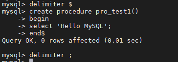
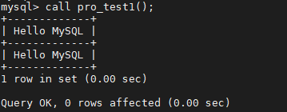
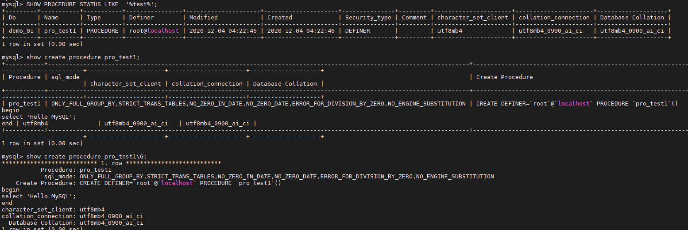
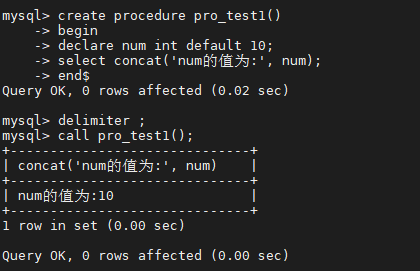
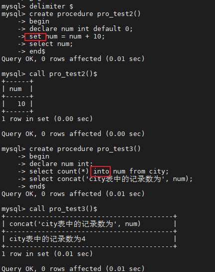

# 04.存储过程和存储函数

- 笔记本：Mysql高级
- 创建时间：2020-12-04 08:56:50 UTC
- 更新时间：2020-12-05 09:24:06 UTC
- 原始链接：https://www.cnblogs.com/xingphimo/p/9486358.html
- 印象笔记 GUID：db926c4e-01af-4cbb-b10c-d748ba32fd43

# 存储过程和函数

## 1. 存储过程和函数概述

 存储过程和函数是：事先经过编译并存储在数据库中的一段 SQL 语句的集合，调用存储过程和函数可以简化应用开发人员的很多工作，减少数据在数据库和应用服务器之间的传输，对于提高数据处理的效率是有好处的。

存储过程和函数的区别在于函数必须有返回值，而存储过程没有。
 函数 ： 是一个有返回值的过程 ；
 过程 ： 是一个没有返回值的函数 ；

## 2. 创建存储过程

```
CREATE PROCEDURE procedure_name ([proc_parameter[,...]])
begin
	-- SQL语句
end ;

```

示例：

```
delimiter $

create procedure pro_test1()
begin
	select 'Hello Mysql' ;
end$

delimiter ;

```


 **Tips:** DELIMITER
 该关键字用来声明SQL语句的分隔符 , 告诉 MySQL 解释器，该段命令是否已经结束了，mysql是否可以执行了。默认情况下，delimiter是分号;。在命令行客户端中，如果有一行命令以分号结束，那么回车后，mysql将会执行该命令。

## 3. 调用存储过程

```
call procedure_name() ;

```

**eg:**
 

## 4. 查看存储过程

```
-- 查询db_name数据库中的所有的存储过程(MySQL8.0之后没有这张表了)
select name from mysql.proc where db='db_name';

-- 查询存储过程的状态信息
show procedure status;

-- 查询某个存储过程的定义
show create procedure test.pro_test1 \G;

```



## 5. 删除存储过程

```
DROP PROCEDURE  [IF EXISTS] sp_name ；

```

## 6. 语法

存储过程是可以编程的，意味着可以使用变量，表达式，控制结构 ， 来完成比较复杂的功能。

### 6.1. 变量

- DECLARE
 通过 DECLARE 可以定义一个局部变量，该变量的作用范围只能在 BEGIN…END 块中。

```
DECLARE var_name[,...] type [DEFAULT value]

```

示例：

```
delimiter $
create procedure pro_test1()
begin
    declare num int default 10;
    select concat('num的值为:', num);
end$
delimiter ;

```



- SET
 直接赋值使用 SET，可以赋常量或者赋表达式，具体语法如下：

```
SET var_name = expr [, var_name = expr] ...

```

示例：

```
delimiter $
create procedure pro_test2()
begin
declare num int default 0;
set num = num + 10;
select num;
end$
delimiter ;

```

也可以通过select ... into 方式进行赋值操作 :
 

### 6.2. if 条件判断

### 6.3. 传递参数

### 6.4. case 结构

### 6.5. while 循环

### 6.6. repeat 结构

### 6.7. loop 语句

### 6.8. leave 语句

### 6.9. 游标/光标

## 7. 存储函数

%23%20%E5%AD%98%E5%82%A8%E8%BF%87%E7%A8%8B%E5%92%8C%E5%87%BD%E6%95%B0%0A%23%23%201.%20%E5%AD%98%E5%82%A8%E8%BF%87%E7%A8%8B%E5%92%8C%E5%87%BD%E6%95%B0%E6%A6%82%E8%BF%B0%0A%26emsp%3B%26emsp%3B%E5%AD%98%E5%82%A8%E8%BF%87%E7%A8%8B%E5%92%8C%E5%87%BD%E6%95%B0%E6%98%AF%EF%BC%9A%E4%BA%8B%E5%85%88%E7%BB%8F%E8%BF%87%E7%BC%96%E8%AF%91%E5%B9%B6%E5%AD%98%E5%82%A8%E5%9C%A8%E6%95%B0%E6%8D%AE%E5%BA%93%E4%B8%AD%E7%9A%84%E4%B8%80%E6%AE%B5%20SQL%20%E8%AF%AD%E5%8F%A5%E7%9A%84%E9%9B%86%E5%90%88%EF%BC%8C%E8%B0%83%E7%94%A8%E5%AD%98%E5%82%A8%E8%BF%87%E7%A8%8B%E5%92%8C%E5%87%BD%E6%95%B0%E5%8F%AF%E4%BB%A5%E7%AE%80%E5%8C%96%E5%BA%94%E7%94%A8%E5%BC%80%E5%8F%91%E4%BA%BA%E5%91%98%E7%9A%84%E5%BE%88%E5%A4%9A%E5%B7%A5%E4%BD%9C%EF%BC%8C%E5%87%8F%E5%B0%91%E6%95%B0%E6%8D%AE%E5%9C%A8%E6%95%B0%E6%8D%AE%E5%BA%93%E5%92%8C%E5%BA%94%E7%94%A8%E6%9C%8D%E5%8A%A1%E5%99%A8%E4%B9%8B%E9%97%B4%E7%9A%84%E4%BC%A0%E8%BE%93%EF%BC%8C%E5%AF%B9%E4%BA%8E%E6%8F%90%E9%AB%98%E6%95%B0%E6%8D%AE%E5%A4%84%E7%90%86%E7%9A%84%E6%95%88%E7%8E%87%E6%98%AF%E6%9C%89%E5%A5%BD%E5%A4%84%E7%9A%84%E3%80%82%0A%0A%E5%AD%98%E5%82%A8%E8%BF%87%E7%A8%8B%E5%92%8C%E5%87%BD%E6%95%B0%E7%9A%84%E5%8C%BA%E5%88%AB%E5%9C%A8%E4%BA%8E%E5%87%BD%E6%95%B0%E5%BF%85%E9%A1%BB%E6%9C%89%E8%BF%94%E5%9B%9E%E5%80%BC%EF%BC%8C%E8%80%8C%E5%AD%98%E5%82%A8%E8%BF%87%E7%A8%8B%E6%B2%A1%E6%9C%89%E3%80%82%0A%E5%87%BD%E6%95%B0%20%EF%BC%9A%20%E6%98%AF%E4%B8%80%E4%B8%AA%E6%9C%89%E8%BF%94%E5%9B%9E%E5%80%BC%E7%9A%84%E8%BF%87%E7%A8%8B%20%EF%BC%9B%0A%E8%BF%87%E7%A8%8B%20%EF%BC%9A%20%E6%98%AF%E4%B8%80%E4%B8%AA%E6%B2%A1%E6%9C%89%E8%BF%94%E5%9B%9E%E5%80%BC%E7%9A%84%E5%87%BD%E6%95%B0%20%EF%BC%9B%0A%0A%23%23%202.%20%E5%88%9B%E5%BB%BA%E5%AD%98%E5%82%A8%E8%BF%87%E7%A8%8B%0A%60%60%60sql%0ACREATE%20PROCEDURE%20procedure_name%20(%5Bproc_parameter%5B%2C...%5D%5D)%0Abegin%0A%09--%20SQL%E8%AF%AD%E5%8F%A5%0Aend%20%3B%0A%60%60%60%0A%E7%A4%BA%E4%BE%8B%EF%BC%9A%0A%60%60%60sql%0Adelimiter%20%24%0A%0Acreate%20procedure%20pro_test1()%0Abegin%0A%09select%20'Hello%20Mysql'%20%3B%0Aend%24%0A%0Adelimiter%20%3B%0A%60%60%60%0A!%5B3516a3d61bb651d71526c6f150afb57e.png%5D(en-resource%3A%2F%2Fdatabase%2F4142%3A0)%0A**Tips%3A**%20DELIMITER%0A%26emsp%3B%26emsp%3B%E8%AF%A5%E5%85%B3%E9%94%AE%E5%AD%97%E7%94%A8%E6%9D%A5%E5%A3%B0%E6%98%8ESQL%E8%AF%AD%E5%8F%A5%E7%9A%84%E5%88%86%E9%9A%94%E7%AC%A6%20%2C%20%E5%91%8A%E8%AF%89%20MySQL%20%E8%A7%A3%E9%87%8A%E5%99%A8%EF%BC%8C%E8%AF%A5%E6%AE%B5%E5%91%BD%E4%BB%A4%E6%98%AF%E5%90%A6%E5%B7%B2%E7%BB%8F%E7%BB%93%E6%9D%9F%E4%BA%86%EF%BC%8Cmysql%E6%98%AF%E5%90%A6%E5%8F%AF%E4%BB%A5%E6%89%A7%E8%A1%8C%E4%BA%86%E3%80%82%E9%BB%98%E8%AE%A4%E6%83%85%E5%86%B5%E4%B8%8B%EF%BC%8Cdelimiter%E6%98%AF%E5%88%86%E5%8F%B7%3B%E3%80%82%E5%9C%A8%E5%91%BD%E4%BB%A4%E8%A1%8C%E5%AE%A2%E6%88%B7%E7%AB%AF%E4%B8%AD%EF%BC%8C%E5%A6%82%E6%9E%9C%E6%9C%89%E4%B8%80%E8%A1%8C%E5%91%BD%E4%BB%A4%E4%BB%A5%E5%88%86%E5%8F%B7%E7%BB%93%E6%9D%9F%EF%BC%8C%E9%82%A3%E4%B9%88%E5%9B%9E%E8%BD%A6%E5%90%8E%EF%BC%8Cmysql%E5%B0%86%E4%BC%9A%E6%89%A7%E8%A1%8C%E8%AF%A5%E5%91%BD%E4%BB%A4%E3%80%82%0A%23%23%203.%20%E8%B0%83%E7%94%A8%E5%AD%98%E5%82%A8%E8%BF%87%E7%A8%8B%0A%60%60%60sql%0Acall%20procedure_name()%20%3B%09%0A%60%60%60%0A**eg%3A**%20%0A!%5Bb690580193dd81c5cc036a57befc3009.png%5D(en-resource%3A%2F%2Fdatabase%2F4144%3A0)%0A%0A%23%23%204.%20%E6%9F%A5%E7%9C%8B%E5%AD%98%E5%82%A8%E8%BF%87%E7%A8%8B%0A%60%60%60sql%0A--%20%E6%9F%A5%E8%AF%A2db_name%E6%95%B0%E6%8D%AE%E5%BA%93%E4%B8%AD%E7%9A%84%E6%89%80%E6%9C%89%E7%9A%84%E5%AD%98%E5%82%A8%E8%BF%87%E7%A8%8B(MySQL8.0%E4%B9%8B%E5%90%8E%E6%B2%A1%E6%9C%89%E8%BF%99%E5%BC%A0%E8%A1%A8%E4%BA%86)%0Aselect%20name%20from%20mysql.proc%20where%20db%3D'db_name'%3B%0A%0A--%20%E6%9F%A5%E8%AF%A2%E5%AD%98%E5%82%A8%E8%BF%87%E7%A8%8B%E7%9A%84%E7%8A%B6%E6%80%81%E4%BF%A1%E6%81%AF%0Ashow%20procedure%20status%3B%0A%0A--%20%E6%9F%A5%E8%AF%A2%E6%9F%90%E4%B8%AA%E5%AD%98%E5%82%A8%E8%BF%87%E7%A8%8B%E7%9A%84%E5%AE%9A%E4%B9%89%0Ashow%20create%20procedure%20test.pro_test1%20%5CG%3B%0A%60%60%60%0A!%5Bfd7cd31dea65b3e9268b2e73e1b93f0b.png%5D(en-resource%3A%2F%2Fdatabase%2F4148%3A0)%0A%0A%23%23%205.%20%E5%88%A0%E9%99%A4%E5%AD%98%E5%82%A8%E8%BF%87%E7%A8%8B%0A%60%60%60sql%0ADROP%20PROCEDURE%20%20%5BIF%20EXISTS%5D%20sp_name%20%EF%BC%9B%0A%60%60%60%0A%23%23%206.%20%E8%AF%AD%E6%B3%95%0A%E5%AD%98%E5%82%A8%E8%BF%87%E7%A8%8B%E6%98%AF%E5%8F%AF%E4%BB%A5%E7%BC%96%E7%A8%8B%E7%9A%84%EF%BC%8C%E6%84%8F%E5%91%B3%E7%9D%80%E5%8F%AF%E4%BB%A5%E4%BD%BF%E7%94%A8%E5%8F%98%E9%87%8F%EF%BC%8C%E8%A1%A8%E8%BE%BE%E5%BC%8F%EF%BC%8C%E6%8E%A7%E5%88%B6%E7%BB%93%E6%9E%84%20%EF%BC%8C%20%E6%9D%A5%E5%AE%8C%E6%88%90%E6%AF%94%E8%BE%83%E5%A4%8D%E6%9D%82%E7%9A%84%E5%8A%9F%E8%83%BD%E3%80%82%0A%23%23%23%206.1.%20%E5%8F%98%E9%87%8F%0A*%20DECLARE%0A%E9%80%9A%E8%BF%87%20DECLARE%20%E5%8F%AF%E4%BB%A5%E5%AE%9A%E4%B9%89%E4%B8%80%E4%B8%AA%E5%B1%80%E9%83%A8%E5%8F%98%E9%87%8F%EF%BC%8C%E8%AF%A5%E5%8F%98%E9%87%8F%E7%9A%84%E4%BD%9C%E7%94%A8%E8%8C%83%E5%9B%B4%E5%8F%AA%E8%83%BD%E5%9C%A8%20BEGIN%E2%80%A6END%20%E5%9D%97%E4%B8%AD%E3%80%82%0A%60%60%60sql%0ADECLARE%20var_name%5B%2C...%5D%20type%20%5BDEFAULT%20value%5D%0A%60%60%60%0A%E7%A4%BA%E4%BE%8B%EF%BC%9A%0A%60%60%60sql%0Adelimiter%20%24%0Acreate%20procedure%20pro_test1()%20%0Abegin%20%0A%20%20%20%20declare%20num%20int%20default%2010%3B%0A%20%20%20%20select%20concat('num%E7%9A%84%E5%80%BC%E4%B8%BA%3A'%2C%20num)%3B%0Aend%24%0Adelimiter%20%3B%0A%60%60%60%0A!%5Bb7e0fc87305c65fff410256d643df31d.png%5D(en-resource%3A%2F%2Fdatabase%2F4150%3A0)%0A%0A*%20SET%0A%E7%9B%B4%E6%8E%A5%E8%B5%8B%E5%80%BC%E4%BD%BF%E7%94%A8%20SET%EF%BC%8C%E5%8F%AF%E4%BB%A5%E8%B5%8B%E5%B8%B8%E9%87%8F%E6%88%96%E8%80%85%E8%B5%8B%E8%A1%A8%E8%BE%BE%E5%BC%8F%EF%BC%8C%E5%85%B7%E4%BD%93%E8%AF%AD%E6%B3%95%E5%A6%82%E4%B8%8B%EF%BC%9A%0A%60%60%60sql%0ASET%20var_name%20%3D%20expr%20%5B%2C%20var_name%20%3D%20expr%5D%20...%0A%60%60%60%0A%E7%A4%BA%E4%BE%8B%EF%BC%9A%0A%60%60%60sql%0Adelimiter%20%24%0Acreate%20procedure%20pro_test2()%0Abegin%0Adeclare%20num%20int%20default%200%3B%0Aset%20num%20%3D%20num%20%2B%2010%3B%0Aselect%20num%3B%0Aend%24%0Adelimiter%20%3B%0A%60%60%60%0A%E4%B9%9F%E5%8F%AF%E4%BB%A5%E9%80%9A%E8%BF%87select%20...%20into%20%E6%96%B9%E5%BC%8F%E8%BF%9B%E8%A1%8C%E8%B5%8B%E5%80%BC%E6%93%8D%E4%BD%9C%20%3A%0A%E7%A4%BA%E4%BE%8B%EF%BC%9A%0A%60%60%60sql%0Adelimiter%20%24%0Acreate%20procedure%20pro_test3()%0Abegin%0Adeclare%20num%20int%3B%0Aselect%20count(*)%20into%20num%20from%20city%3B%0Aselect%20concat('city%E8%A1%A8%E4%B8%AD%E7%9A%84%E8%AE%B0%E5%BD%95%E6%95%B0%E4%B8%BA'%2C%20num)%3B%0Aend%24%0Adelimiter%20%3B%0A%60%60%60%0A!%5B8c3488013b45fb28e7ea97c2fdb8d90b.png%5D(en-resource%3A%2F%2Fdatabase%2F4152%3A0)%0A%0A%23%23%23%206.2.%20if%20%E6%9D%A1%E4%BB%B6%E5%88%A4%E6%96%AD%0A%E8%AF%AD%E6%B3%95%E7%BB%93%E6%9E%84%EF%BC%9A%0A%60%60%60sql%0Aif%20search_condition%20then%20statement_list%0A%09%5Belseif%20search_condition%20then%20statement_list%5D%20...%0A%09%5Belse%20statement_list%5D%0Aend%20if%3B%0A%60%60%60%0A**%E7%A4%BA%E4%BE%8B%EF%BC%9A**%20%E6%A0%B9%E6%8D%AE%E5%AE%9A%E4%B9%89%E7%9A%84%E8%BA%AB%E9%AB%98%E5%8F%98%E9%87%8F%EF%BC%8C%E5%88%A4%E5%AE%9A%E5%BD%93%E5%89%8D%E8%BA%AB%E9%AB%98%E7%9A%84%E6%89%80%E5%B1%9E%E7%9A%84%E8%BA%AB%E6%9D%90%E7%B1%BB%E5%9E%8B%20%0A180%20%E5%8F%8A%E4%BB%A5%E4%B8%8A%20----------%3E%20%E8%BA%AB%E6%9D%90%E9%AB%98%E6%8C%91%0A170%20-%20180%20%20---------%3E%20%E6%A0%87%E5%87%86%E8%BA%AB%E6%9D%90%0A170%20%E4%BB%A5%E4%B8%8B%20%20%20----------%3E%20%E4%B8%80%E8%88%AC%E8%BA%AB%E6%9D%90%0A%60%60%60sql%0Adelimiter%20%24%0Acreate%20procedure%20pro_test4()%0Abegin%0A%20%20%20%20declare%20%20height%20%20int%20%20default%20%20175%3B%20%0A%20%20%20%20declare%20%20description%20%20varchar(50)%20default%20''%3B%0A%20%20%20%20if%20%20height%20%3E%3D%20180%20%20then%0A%20%20%20%20%20%20%20%20set%20description%20%3D%20'%E8%BA%AB%E6%9D%90%E9%AB%98%E6%8C%91'%3B%0A%20%20%20%20elseif%20height%20%3E%3D%20170%20and%20height%20%3C%20180%20%20then%0A%20%20%20%20%20%20%20%20set%20description%20%3D%20'%E6%A0%87%E5%87%86%E8%BA%AB%E6%9D%90'%3B%0A%20%20%20%20else%20%20%20%20%20%20%20%20%0A%20%20%20%20%20%20%20%20set%20description%20%3D%20'%E4%B8%80%E8%88%AC%E8%BA%AB%E6%9D%90'%3B%0A%20%20%20%20end%20if%3B%0A%20%20%20%20select%20concat('%E8%BA%AB%E9%AB%98%EF%BC%9A'%2C%20height%2C%20'%E5%AF%B9%E5%BA%94%E7%9A%84%E8%BA%AB%E6%9D%90%E7%B1%BB%E5%9E%8B%EF%BC%9A'%2C%20description)%3B%0Aend%24%0Adelimiter%20%3B%0A%60%60%60%0A%E8%B0%83%E7%94%A8%E7%BB%93%E6%9E%9C%E4%B8%BA%EF%BC%9A%0A!%5Bb67a114d079ab89916aec7087b7df29b.png%5D(en-resource%3A%2F%2Fdatabase%2F4154%3A0)%0A%0A%23%23%23%206.3.%20%E4%BC%A0%E9%80%92%E5%8F%82%E6%95%B0%0A%E8%AF%AD%E6%B3%95%E6%A0%BC%E5%BC%8F%20%3A%0A%60%60%60sql%0Acreate%20procedure%20procedure_name(%5Bin%2Fout%2Finout%5D%20%E5%8F%82%E6%95%B0%E5%90%8D%20%20%20%E5%8F%82%E6%95%B0%E7%B1%BB%E5%9E%8B)%0A...%0A%0AIN%20%3A%20%20%20%E8%AF%A5%E5%8F%82%E6%95%B0%E5%8F%AF%E4%BB%A5%E4%BD%9C%E4%B8%BA%E8%BE%93%E5%85%A5%EF%BC%8C%E4%B9%9F%E5%B0%B1%E6%98%AF%E9%9C%80%E8%A6%81%E8%B0%83%E7%94%A8%E6%96%B9%E4%BC%A0%E5%85%A5%E5%80%BC%20%2C%20%E9%BB%98%E8%AE%A4%0AOUT%3A%20%20%20%E8%AF%A5%E5%8F%82%E6%95%B0%E4%BD%9C%E4%B8%BA%E8%BE%93%E5%87%BA%EF%BC%8C%E4%B9%9F%E5%B0%B1%E6%98%AF%E8%AF%A5%E5%8F%82%E6%95%B0%E5%8F%AF%E4%BB%A5%E4%BD%9C%E4%B8%BA%E8%BF%94%E5%9B%9E%E5%80%BC%0AINOUT%3A%20%E6%97%A2%E5%8F%AF%E4%BB%A5%E4%BD%9C%E4%B8%BA%E8%BE%93%E5%85%A5%E5%8F%82%E6%95%B0%EF%BC%8C%E4%B9%9F%E5%8F%AF%E4%BB%A5%E4%BD%9C%E4%B8%BA%E8%BE%93%E5%87%BA%E5%8F%82%E6%95%B0%0A%60%60%60%0A%23%23%23%23%206.3.1.%20IN-%E8%BE%93%E5%85%A5%0A**%E9%9C%80%E6%B1%82%20%3A**%20%E6%A0%B9%E6%8D%AE%E4%BC%A0%E9%80%92%E7%9A%84%E8%BA%AB%E9%AB%98%E5%8F%98%E9%87%8F%EF%BC%8C%E5%88%A4%E5%AE%9A%E5%BD%93%E5%89%8D%E8%BA%AB%E9%AB%98%E7%9A%84%E6%89%80%E5%B1%9E%E7%9A%84%E8%BA%AB%E6%9D%90%E7%B1%BB%E5%9E%8B%20%0A%60%60%60sql%0Adelimiter%20%24%0Acreate%20procedure%20pro_test5(in%20height%20int)%0Abegin%0A%20%20%20%20declare%20%20description%20%20varchar(50)%20default%20''%3B%0A%20%20%20%20if%20%20height%20%3E%3D%20180%20%20then%0A%20%20%20%20%20%20%20%20set%20description%20%3D%20'%E8%BA%AB%E6%9D%90%E9%AB%98%E6%8C%91'%3B%0A%20%20%20%20elseif%20height%20%3E%3D%20170%20and%20height%20%3C%20180%20%20then%0A%20%20%20%20%20%20%20%20set%20description%20%3D%20'%E6%A0%87%E5%87%86%E8%BA%AB%E6%9D%90'%3B%0A%20%20%20%20else%20%20%20%20%20%20%20%20%0A%20%20%20%20%20%20%20%20set%20description%20%3D%20'%E4%B8%80%E8%88%AC%E8%BA%AB%E6%9D%90'%3B%0A%20%20%20%20end%20if%3B%0A%20%20%20%20select%20concat('%E8%BA%AB%E9%AB%98%EF%BC%9A'%2C%20height%2C%20'%E5%AF%B9%E5%BA%94%E7%9A%84%E8%BA%AB%E6%9D%90%E7%B1%BB%E5%9E%8B%EF%BC%9A'%2C%20description)%3B%0Aend%24%0Adelimiter%20%3B%0A%60%60%60%0A!%5Bda704496612e08dc3a3470eea111f36b.png%5D(en-resource%3A%2F%2Fdatabase%2F4156%3A0)%0A%0A%23%23%23%23%206.3.2.%20OUT-%E8%BE%93%E5%87%BA%0A**%E7%A4%BA%E4%BE%8B%EF%BC%9A**%20%E6%A0%B9%E6%8D%AE%E4%BC%A0%E5%85%A5%E7%9A%84%E8%BA%AB%E9%AB%98%E5%8F%98%E9%87%8F%EF%BC%8C%E8%8E%B7%E5%8F%96%E5%BD%93%E5%89%8D%E8%BA%AB%E9%AB%98%E7%9A%84%E6%89%80%E5%B1%9E%E7%9A%84%E8%BA%AB%E6%9D%90%E7%B1%BB%E5%9E%8B%20%20%0A%60%60%60sql%0Adelimiter%20%24%0Acreate%20procedure%20pro_test6(in%20height%20int%2C%20out%20description%20varchar(100))%0Abegin%0A%20%20%20%20if%20%20height%20%3E%3D%20180%20%20then%0A%20%20%20%20%20%20%20%20set%20description%20%3D%20'%E8%BA%AB%E6%9D%90%E9%AB%98%E6%8C%91'%3B%0A%20%20%20%20elseif%20height%20%3E%3D%20170%20and%20height%20%3C%20180%20%20then%0A%20%20%20%20%20%20%20%20set%20description%20%3D%20'%E6%A0%87%E5%87%86%E8%BA%AB%E6%9D%90'%3B%0A%20%20%20%20else%20%20%20%20%20%20%20%20%0A%20%20%20%20%20%20%20%20set%20description%20%3D%20'%E4%B8%80%E8%88%AC%E8%BA%AB%E6%9D%90'%3B%0A%20%20%20%20end%20if%3B%0Aend%24%0Adelimiter%20%3B%0A%60%60%60%0A%E8%B0%83%E7%94%A8%0A%60%60%60sql%0Acall%20pro_test6(185%2C%20%40description)%3B%0Aselect%20%40description%3B%0A%60%60%60%0A!%5B89525aa157f903f71ae91a04fe5f6259.png%5D(en-resource%3A%2F%2Fdatabase%2F4158%3A0)%0A**Tips%EF%BC%9A**%20%0A%40description%20%3A%20%E8%BF%99%E7%A7%8D%E5%8F%98%E9%87%8F%E8%A6%81%E5%9C%A8%E5%8F%98%E9%87%8F%E5%90%8D%E7%A7%B0%E5%89%8D%E9%9D%A2%E5%8A%A0%E4%B8%8A%E2%80%9C%40%E2%80%9D%E7%AC%A6%E5%8F%B7%EF%BC%8C%E5%8F%AB%E5%81%9A%E7%94%A8%E6%88%B7%E4%BC%9A%E8%AF%9D%E5%8F%98%E9%87%8F%EF%BC%8C%E4%BB%A3%E8%A1%A8%E6%95%B4%E4%B8%AA%E4%BC%9A%E8%AF%9D%E8%BF%87%E7%A8%8B%E4%BB%96%E9%83%BD%E6%98%AF%E6%9C%89%E4%BD%9C%E7%94%A8%E7%9A%84%EF%BC%8C%E8%BF%99%E4%B8%AA%E7%B1%BB%E4%BC%BC%E4%BA%8E%E5%85%A8%E5%B1%80%E5%8F%98%E9%87%8F%E4%B8%80%E6%A0%B7%E3%80%82%0A%40%40global.sort_buffer_size%20%3A%20%E8%BF%99%E7%A7%8D%E5%9C%A8%E5%8F%98%E9%87%8F%E5%89%8D%E5%8A%A0%E4%B8%8A%20%22%40%40%22%20%E7%AC%A6%E5%8F%B7%2C%20%E5%8F%AB%E5%81%9A%20%E7%B3%BB%E7%BB%9F%E5%8F%98%E9%87%8F%0A%23%23%23%206.4.%20case%20%E7%BB%93%E6%9E%84%0A%E8%AF%AD%E6%B3%95%E7%BB%93%E6%9E%84%20%3A%0A%60%60%60sql%0A--%20%E6%96%B9%E5%BC%8F%E4%B8%80%20%3A%20%0ACASE%20case_value%0A%20%20WHEN%20when_value%20THEN%20statement_list%0A%20%20%5BWHEN%20when_value%20THEN%20statement_list%5D%20...%0A%20%20%5BELSE%20statement_list%5D%0AEND%20CASE%3B%0A%0A--%20%E6%96%B9%E5%BC%8F%E4%BA%8C%20%3A%20%0ACASE%0A%20%20WHEN%20search_condition%20THEN%20statement_list%0A%20%20%5BWHEN%20search_condition%20THEN%20statement_list%5D%20...%0A%20%20%5BELSE%20statement_list%5D%0AEND%20CASE%3B%0A%60%60%60%0A**eg%EF%BC%9A**%20%E7%BB%99%E5%AE%9A%E4%B8%80%E4%B8%AA%E6%9C%88%E4%BB%BD%2C%20%E7%84%B6%E5%90%8E%E8%AE%A1%E7%AE%97%E5%87%BA%E6%89%80%E5%9C%A8%E7%9A%84%E5%AD%A3%E5%BA%A6%0A%60%60%60sql%0Adelimiter%C2%A0%24%0Acreate%C2%A0procedure%C2%A0pro_test7(mon%C2%A0int)%0Abegin%0A%C2%A0%C2%A0%C2%A0%C2%A0declare%C2%A0result%C2%A0varchar(20)%3B%0A%C2%A0%C2%A0%C2%A0%C2%A0case%0A%C2%A0%C2%A0%C2%A0%C2%A0%C2%A0%C2%A0%C2%A0%C2%A0when%C2%A0mon%C2%A0%3E%3D%C2%A01%C2%A0and%C2%A0mon%C2%A0%3C%3D%C2%A03%C2%A0then%0A%C2%A0%C2%A0%C2%A0%C2%A0%C2%A0%C2%A0%C2%A0%C2%A0%C2%A0%C2%A0%C2%A0%C2%A0set%C2%A0result%C2%A0%3D%C2%A0'%E7%AC%AC%E4%B8%80%E5%AD%A3%E5%BA%A6'%3B%0A%C2%A0%C2%A0%C2%A0%C2%A0%C2%A0%C2%A0%C2%A0%C2%A0when%C2%A0mon%C2%A0%3E%3D%C2%A04%C2%A0and%C2%A0mon%C2%A0%3C%3D%C2%A06%C2%A0then%0A%C2%A0%C2%A0%C2%A0%C2%A0%C2%A0%C2%A0%C2%A0%C2%A0%C2%A0%C2%A0%C2%A0%C2%A0set%C2%A0result%C2%A0%3D%C2%A0'%E7%AC%AC%E4%BA%8C%E5%AD%A3%E5%BA%A6'%3B%0A%C2%A0%C2%A0%C2%A0%C2%A0%C2%A0%C2%A0%C2%A0%C2%A0when%C2%A0mon%C2%A0%3E%3D%C2%A07%C2%A0and%C2%A0mon%C2%A0%3C%3D%C2%A09%C2%A0then%0A%C2%A0%C2%A0%C2%A0%C2%A0%C2%A0%C2%A0%C2%A0%C2%A0%C2%A0%C2%A0%C2%A0%C2%A0set%C2%A0result%C2%A0%3D%C2%A0'%E7%AC%AC%E4%B8%89%E5%AD%A3%E5%BA%A6'%3B%0A%C2%A0%C2%A0%C2%A0%C2%A0%C2%A0%C2%A0%C2%A0%C2%A0else%0A%C2%A0%C2%A0%C2%A0%C2%A0%C2%A0%C2%A0%C2%A0%C2%A0%C2%A0%C2%A0%C2%A0%C2%A0set%C2%A0result%C2%A0%3D%C2%A0'%E7%AC%AC%E5%9B%9B%E5%AD%A3%E5%BA%A6'%3B%0A%C2%A0%C2%A0%C2%A0%C2%A0end%C2%A0case%3B%0A%C2%A0%C2%A0%C2%A0%C2%A0select%C2%A0concat('%E6%9C%88%E4%BB%BD%EF%BC%9A'%2C%C2%A0mon%2C%C2%A0'%EF%BC%8C%E5%AD%A3%E5%BA%A6%EF%BC%9A'%2C%C2%A0result)%C2%A0as%C2%A0content%3B%0Aend%24%0Adelimiter%C2%A0%3B%0A%60%60%60%0A!%5Bd78b8bbf9e53c692a1be0ed786f32b63.png%5D(en-resource%3A%2F%2Fdatabase%2F4160%3A0)%0A%0A%23%23%23%206.5.%20while%20%E5%BE%AA%E7%8E%AF%0A%E8%AF%AD%E6%B3%95%E7%BB%93%E6%9E%84%3A%0A%60%60%60sql%0Awhile%20search_condition%20do%0A%09statement_list%0Aend%20while%3B%0A%60%60%60%0A**eg%EF%BC%9A**%20%E8%AE%A1%E7%AE%97%E4%BB%8E1%E5%8A%A0%E5%88%B0n%E7%9A%84%E5%80%BC%0A%60%60%60sql%0Adelimiter%C2%A0%24%0Acreate%C2%A0procedure%C2%A0pro_test8(n%C2%A0int)%0Abegin%0A%C2%A0%C2%A0%C2%A0%C2%A0declare%C2%A0total%C2%A0int%C2%A0default%C2%A00%3B%0A%C2%A0%C2%A0%C2%A0%C2%A0declare%C2%A0num%C2%A0int%C2%A0default%C2%A01%3B%0A%C2%A0%C2%A0%C2%A0%C2%A0while%C2%A0num%C2%A0%3C%3D%C2%A0n%C2%A0do%0A%C2%A0%C2%A0%C2%A0%C2%A0%C2%A0%C2%A0%C2%A0%C2%A0set%C2%A0total%C2%A0%3D%C2%A0total%C2%A0%2B%C2%A0num%3B%0A%C2%A0%C2%A0%C2%A0%C2%A0%C2%A0%C2%A0%C2%A0%C2%A0set%C2%A0num%C2%A0%3D%C2%A0num%C2%A0%2B%C2%A01%3B%0A%C2%A0%C2%A0%C2%A0%C2%A0end%C2%A0while%3B%0A%C2%A0%C2%A0%C2%A0%C2%A0select%C2%A0total%3B%0Aend%24%0Adelimiter%C2%A0%3B%0A%60%60%60%0A!%5B25349873d2567e8596a510cd5a7123ae.png%5D(en-resource%3A%2F%2Fdatabase%2F4162%3A0)%0A%0A%23%23%23%206.6.%20repeat%20%E7%BB%93%E6%9E%84%0A%E6%9C%89%E6%9D%A1%E4%BB%B6%E7%9A%84%E5%BE%AA%E7%8E%AF%E6%8E%A7%E5%88%B6%E8%AF%AD%E5%8F%A5%2C%20%E5%BD%93%E6%BB%A1%E8%B6%B3%E6%9D%A1%E4%BB%B6%E7%9A%84%E6%97%B6%E5%80%99%E9%80%80%E5%87%BA%E5%BE%AA%E7%8E%AF%20%E3%80%82while%20%E6%98%AF%E6%BB%A1%E8%B6%B3%E6%9D%A1%E4%BB%B6%E6%89%8D%E6%89%A7%E8%A1%8C%EF%BC%8Crepeat%20%E6%98%AF%E6%BB%A1%E8%B6%B3%E6%9D%A1%E4%BB%B6%E5%B0%B1%E9%80%80%E5%87%BA%E5%BE%AA%E7%8E%AF%E3%80%82%0A%E8%AF%AD%E6%B3%95%E7%BB%93%E6%9E%84%20%3A%0A%60%60%60sql%0AREPEAT%0A%20%20statement_list%0A%20%20UNTIL%20search_condition%0AEND%20REPEAT%3B%0A%60%60%60%0A**eg%EF%BC%9A**%20%E8%AE%A1%E7%AE%97%E4%BB%8E1%E5%8A%A0%E5%88%B0n%E7%9A%84%E5%80%BC%0A%60%60%60sql%0Adelimiter%C2%A0%24%0Acreate%C2%A0procedure%C2%A0pro_test9(n%C2%A0int)%0Abegin%0A%C2%A0%C2%A0%C2%A0%C2%A0declare%C2%A0total%C2%A0int%C2%A0default%C2%A00%3B%0A%C2%A0%C2%A0%C2%A0%C2%A0repeat%0A%C2%A0%C2%A0%C2%A0%C2%A0%C2%A0%C2%A0%C2%A0%C2%A0set%C2%A0total%C2%A0%3D%C2%A0total%C2%A0%2B%C2%A0n%3B%0A%C2%A0%C2%A0%C2%A0%C2%A0%C2%A0%C2%A0%C2%A0%C2%A0set%C2%A0n%C2%A0%3D%C2%A0n%C2%A0-%C2%A01%3B%0A%C2%A0%C2%A0%C2%A0%C2%A0%C2%A0%C2%A0%C2%A0%C2%A0until%C2%A0n%C2%A0%3D%C2%A00%0A%C2%A0%C2%A0%C2%A0%C2%A0end%C2%A0repeat%3B%0A%C2%A0%C2%A0%C2%A0%C2%A0select%C2%A0total%3B%0Aend%24%0Adelimiter%C2%A0%3B%0A%60%60%60%0A%0A%23%23%23%206.7.%20loop%20%E8%AF%AD%E5%8F%A5%0ALOOP%20%E5%AE%9E%E7%8E%B0%E7%AE%80%E5%8D%95%E7%9A%84%E5%BE%AA%E7%8E%AF%EF%BC%8C%E9%80%80%E5%87%BA%E5%BE%AA%E7%8E%AF%E7%9A%84%E6%9D%A1%E4%BB%B6%E9%9C%80%E8%A6%81%E4%BD%BF%E7%94%A8%E5%85%B6%E4%BB%96%E7%9A%84%E8%AF%AD%E5%8F%A5%E5%AE%9A%E4%B9%89%EF%BC%8C%E9%80%9A%E5%B8%B8%E5%8F%AF%E4%BB%A5%E4%BD%BF%E7%94%A8%20LEAVE%20%E8%AF%AD%E5%8F%A5%E5%AE%9E%E7%8E%B0%EF%BC%8C%E5%85%B7%E4%BD%93%E8%AF%AD%E6%B3%95%E5%A6%82%E4%B8%8B%EF%BC%9A%0A%60%60%60sql%0A%5Bbegin_label%3A%5D%20LOOP%0A%20%20statement_list%0AEND%20LOOP%20%5Bend_label%5D%0A%60%60%60%0A%E5%A6%82%E6%9E%9C%E4%B8%8D%E5%9C%A8%20statement_list%20%E4%B8%AD%E5%A2%9E%E5%8A%A0%E9%80%80%E5%87%BA%E5%BE%AA%E7%8E%AF%E7%9A%84%E8%AF%AD%E5%8F%A5%EF%BC%8C%E9%82%A3%E4%B9%88%20LOOP%20%E8%AF%AD%E5%8F%A5%E5%8F%AF%E4%BB%A5%E7%94%A8%E6%9D%A5%E5%AE%9E%E7%8E%B0%E7%AE%80%E5%8D%95%E7%9A%84%E6%AD%BB%E5%BE%AA%E7%8E%AF%E3%80%82%0A%0A%23%23%23%206.8.%20leave%20%E8%AF%AD%E5%8F%A5%0A%E7%94%A8%E6%9D%A5%E4%BB%8E%E6%A0%87%E6%B3%A8%E7%9A%84%E6%B5%81%E7%A8%8B%E6%9E%84%E9%80%A0%E4%B8%AD%E9%80%80%E5%87%BA%EF%BC%8C%E9%80%9A%E5%B8%B8%E5%92%8C%20BEGIN%20...%20END%20%E6%88%96%E8%80%85%E5%BE%AA%E7%8E%AF%E4%B8%80%E8%B5%B7%E4%BD%BF%E7%94%A8%E3%80%82%E4%B8%8B%E9%9D%A2%E6%98%AF%E4%B8%80%E4%B8%AA%E4%BD%BF%E7%94%A8%20LOOP%20%E5%92%8C%20LEAVE%20%E7%9A%84%E7%AE%80%E5%8D%95%E4%BE%8B%E5%AD%90%20%2C%20%E9%80%80%E5%87%BA%E5%BE%AA%E7%8E%AF%EF%BC%9A%0A**eg%EF%BC%9A**%20%E8%AE%A1%E7%AE%97%E4%BB%8E1%E5%8A%A0%E5%88%B0n%E7%9A%84%E5%80%BC(loop%20...%20leave%20%E5%AE%9E%E7%8E%B0)%0A%60%60%60sql%0Adelimiter%C2%A0%24%0Acreate%C2%A0procedure%C2%A0pro_test10(n%C2%A0int)%0Abegin%0A%C2%A0%C2%A0%C2%A0%C2%A0declare%C2%A0total%C2%A0int%C2%A0default%C2%A00%3B%0A%C2%A0%C2%A0%C2%A0%C2%A0c%3Aloop%0A%C2%A0%C2%A0%C2%A0%C2%A0%C2%A0%C2%A0%C2%A0%C2%A0set%C2%A0total%C2%A0%3D%C2%A0total%C2%A0%2B%C2%A0n%3B%0A%C2%A0%C2%A0%C2%A0%C2%A0%C2%A0%C2%A0%C2%A0%C2%A0set%C2%A0n%C2%A0%3D%C2%A0n%C2%A0-%C2%A01%3B%0A%C2%A0%C2%A0%C2%A0%C2%A0%C2%A0%C2%A0%C2%A0%C2%A0if%C2%A0n%C2%A0%3C%3D%C2%A00%C2%A0then%0A%C2%A0%C2%A0%C2%A0%C2%A0%C2%A0%C2%A0%C2%A0%C2%A0%C2%A0%C2%A0%C2%A0%C2%A0leave%C2%A0c%3B%0A%C2%A0%C2%A0%C2%A0%C2%A0%C2%A0%C2%A0%C2%A0%C2%A0end%C2%A0if%3B%0A%C2%A0%C2%A0%C2%A0%C2%A0end%C2%A0loop%C2%A0c%3B%0A%C2%A0%C2%A0%C2%A0%C2%A0select%C2%A0total%3B%0Aend%24%0Adelimiter%C2%A0%3B%0A%60%60%60%0A%0A%23%23%23%206.9.%20%E6%B8%B8%E6%A0%87%2F%E5%85%89%E6%A0%87%0A%E6%B8%B8%E6%A0%87%E6%98%AF%E7%94%A8%E6%9D%A5%E5%AD%98%E5%82%A8%E6%9F%A5%E8%AF%A2%E7%BB%93%E6%9E%9C%E9%9B%86%E7%9A%84%E6%95%B0%E6%8D%AE%E7%B1%BB%E5%9E%8B%20%2C%20%E5%9C%A8%E5%AD%98%E5%82%A8%E8%BF%87%E7%A8%8B%E5%92%8C%E5%87%BD%E6%95%B0%E4%B8%AD%E5%8F%AF%E4%BB%A5%E4%BD%BF%E7%94%A8%E5%85%89%E6%A0%87%E5%AF%B9%E7%BB%93%E6%9E%9C%E9%9B%86%E8%BF%9B%E8%A1%8C%E5%BE%AA%E7%8E%AF%E7%9A%84%E5%A4%84%E7%90%86%E3%80%82%E5%85%89%E6%A0%87%E7%9A%84%E4%BD%BF%E7%94%A8%E5%8C%85%E6%8B%AC%E5%85%89%E6%A0%87%E7%9A%84%E5%A3%B0%E6%98%8E%E3%80%81OPEN%E3%80%81FETCH%20%E5%92%8C%20CLOSE%EF%BC%8C%E5%85%B6%E8%AF%AD%E6%B3%95%E5%88%86%E5%88%AB%E5%A6%82%E4%B8%8B%E3%80%82%0A%E5%A3%B0%E6%98%8E%E5%85%89%E6%A0%87%EF%BC%9A%0A%60%60%60sql%0ADECLARE%20cursor_name%20CURSOR%20FOR%20select_statement%20%3B%0A%60%60%60%0AOPEN%20%E5%85%89%E6%A0%87%EF%BC%9A%0A%60%60%60sql%0AOPEN%20cursor_name%20%3B%0A%60%60%60%0AFETCH%20%E5%85%89%E6%A0%87%EF%BC%9A%0A%60%60%60sql%0AFETCH%20cursor_name%20INTO%20var_name%20%5B%2C%20var_name%5D%20...%0A%60%60%60%0ACLOSE%20%E5%85%89%E6%A0%87%EF%BC%9A%0A%60%60%60sql%0ACLOSE%20cursor_name%20%3B%0A%60%60%60%0A**eg%3A**%20%0A%E5%88%9D%E5%A7%8B%E5%8C%96%E8%84%9A%E6%9C%AC%3A%0A%60%60%60sql%0Acreate%20table%20emp(%0A%20%20id%20int(11)%20not%20null%20auto_increment%20%2C%0A%20%20name%20varchar(50)%20not%20null%20comment%20'%E5%A7%93%E5%90%8D'%2C%0A%20%20age%20int(11)%20comment%20'%E5%B9%B4%E9%BE%84'%2C%0A%20%20salary%20int(11)%20comment%20'%E8%96%AA%E6%B0%B4'%2C%0A%20%20primary%20key(%60id%60)%0A)engine%3Dinnodb%20default%20charset%3Dutf8%20%3B%0A%0Ainsert%20into%20emp(id%2Cname%2Cage%2Csalary)%20values(null%2C'%E9%87%91%E6%AF%9B%E7%8B%AE%E7%8E%8B'%2C55%2C3800)%2C(null%2C'%E7%99%BD%E7%9C%89%E9%B9%B0%E7%8E%8B'%2C60%2C4000)%2C(null%2C'%E9%9D%92%E7%BF%BC%E8%9D%A0%E7%8E%8B'%2C38%2C2800)%2C(null%2C'%E7%B4%AB%E8%A1%AB%E9%BE%99%E7%8E%8B'%2C42%2C1800)%3B%0A%60%60%60%0A%E6%9F%A5%E8%AF%A2emp%E8%A1%A8%E4%B8%AD%E6%95%B0%E6%8D%AE%2C%20%E5%B9%B6%E9%80%90%E8%A1%8C%E8%8E%B7%E5%8F%96%E8%BF%9B%E8%A1%8C%E5%B1%95%E7%A4%BA%EF%BC%9A%0A%60%60%60sql%0Adelimiter%C2%A0%24%0Acreate%C2%A0procedure%C2%A0pro_test11()%0Abegin%0A%C2%A0%C2%A0%C2%A0%C2%A0declare%C2%A0e_id%C2%A0int(11)%3B%0A%C2%A0%C2%A0%C2%A0%C2%A0declare%C2%A0e_name%C2%A0varchar(50)%3B%0A%C2%A0%C2%A0%C2%A0%C2%A0declare%C2%A0e_age%C2%A0int(11)%3B%0A%C2%A0%C2%A0%C2%A0%C2%A0declare%C2%A0e_salary%C2%A0int(11)%3B%0A%C2%A0%C2%A0%C2%A0%C2%A0declare%C2%A0emp_result%C2%A0cursor%C2%A0for%C2%A0select%C2%A0*%C2%A0from%C2%A0emp%3B%0A%C2%A0%C2%A0%C2%A0%C2%A0open%C2%A0emp_result%3B%0A%C2%A0%C2%A0%C2%A0%C2%A0%0A%C2%A0%C2%A0%C2%A0%C2%A0fetch%C2%A0emp_result%C2%A0into%C2%A0e_id%2C%C2%A0e_name%2C%C2%A0e_age%2C%C2%A0e_salary%3B%0A%C2%A0%C2%A0%C2%A0%C2%A0select%C2%A0concat('id%3D'%2C%C2%A0e_id%2C%C2%A0'%2Cname%3D'%2C%C2%A0e_name%2C%C2%A0'%2Cage%3D'%2C%C2%A0e_age%2C%C2%A0'%2Csalary%3D'%2C%C2%A0e_salary)%3B%0A%C2%A0%C2%A0%C2%A0%C2%A0fetch%C2%A0emp_result%C2%A0into%C2%A0e_id%2C%C2%A0e_name%2C%C2%A0e_age%2C%C2%A0e_salary%3B%0A%C2%A0%C2%A0%C2%A0%C2%A0select%C2%A0concat('id%3D'%2C%C2%A0e_id%2C%C2%A0'%2Cname%3D'%2C%C2%A0e_name%2C%C2%A0'%2Cage%3D'%2C%C2%A0e_age%2C%C2%A0'%2Csalary%3D'%2C%C2%A0e_salary)%3B%0A%C2%A0%C2%A0%C2%A0%C2%A0fetch%C2%A0emp_result%C2%A0into%C2%A0e_id%2C%C2%A0e_name%2C%C2%A0e_age%2C%C2%A0e_salary%3B%0A%C2%A0%C2%A0%C2%A0%C2%A0select%C2%A0concat('id%3D'%2C%C2%A0e_id%2C%C2%A0'%2Cname%3D'%2C%C2%A0e_name%2C%C2%A0'%2Cage%3D'%2C%C2%A0e_age%2C%C2%A0'%2Csalary%3D'%2C%C2%A0e_salary)%3B%0A%C2%A0%C2%A0%C2%A0%C2%A0fetch%C2%A0emp_result%C2%A0into%C2%A0e_id%2C%C2%A0e_name%2C%C2%A0e_age%2C%C2%A0e_salary%3B%0A%C2%A0%C2%A0%C2%A0%C2%A0select%C2%A0concat('id%3D'%2C%C2%A0e_id%2C%C2%A0'%2Cname%3D'%2C%C2%A0e_name%2C%C2%A0'%2Cage%3D'%2C%C2%A0e_age%2C%C2%A0'%2Csalary%3D'%2C%C2%A0e_salary)%3B%0A%C2%A0%C2%A0%C2%A0%C2%A0fetch%C2%A0emp_result%C2%A0into%C2%A0e_id%2C%C2%A0e_name%2C%C2%A0e_age%2C%C2%A0e_salary%3B%0A%C2%A0%C2%A0%C2%A0%C2%A0select%C2%A0concat('id%3D'%2C%C2%A0e_id%2C%C2%A0'%2Cname%3D'%2C%C2%A0e_name%2C%C2%A0'%2Cage%3D'%2C%C2%A0e_age%2C%C2%A0'%2Csalary%3D'%2C%C2%A0e_salary)%3B%0A%C2%A0%C2%A0%C2%A0%C2%A0close%C2%A0emp_result%3B%0Aend%24%0Adelimiter%C2%A0%3B%0A%60%60%60%0A**%E6%B3%A8%EF%BC%9A**%20%E6%80%BB%E5%85%B1%E5%8F%AA%E6%9C%89%E5%9B%9B%E6%9D%A1%E6%95%B0%E6%8D%AE%EF%BC%8C%E8%8E%B7%E5%8F%96%E4%BA%86%E4%BA%94%E6%AC%A1%EF%BC%8C%E5%9B%A0%E6%AD%A4%E6%9C%80%E5%90%8E%E4%B8%80%E6%AC%A1%E4%BC%9A%E6%8A%A5%E9%94%99%E3%80%82%0A!%5Beb46bd9c1ed30e8a94ef76caf321c71c.png%5D(en-resource%3A%2F%2Fdatabase%2F4164%3A0)%0A%0A%E9%80%9A%E8%BF%87%E5%BE%AA%E7%8E%AF%E7%BB%93%E6%9E%84%20%2C%20%E8%8E%B7%E5%8F%96%E6%B8%B8%E6%A0%87%E4%B8%AD%E7%9A%84%E6%95%B0%E6%8D%AE%20%3A%0A%60%60%60sql%0Adelimiter%C2%A0%24%0Acreate%C2%A0procedure%C2%A0pro_test12()%0Abegin%0A%C2%A0%C2%A0%C2%A0%C2%A0declare%C2%A0e_id%C2%A0int(11)%3B%0A%C2%A0%C2%A0%C2%A0%C2%A0declare%C2%A0e_name%C2%A0varchar(50)%3B%0A%C2%A0%C2%A0%C2%A0%C2%A0declare%C2%A0e_age%C2%A0int(11)%3B%0A%C2%A0%C2%A0%C2%A0%C2%A0declare%C2%A0e_salary%C2%A0int(11)%3B%0A%C2%A0%C2%A0%C2%A0%C2%A0declare%C2%A0has_data%C2%A0int%C2%A0default%C2%A01%3B%0A%C2%A0%C2%A0%C2%A0%C2%A0declare%C2%A0emp_result%C2%A0cursor%C2%A0for%C2%A0select%C2%A0*%C2%A0from%C2%A0emp%3B%0A%C2%A0%C2%A0%C2%A0%C2%A0declare%C2%A0EXIT%C2%A0HANDLER%C2%A0for%C2%A0not%C2%A0found%C2%A0set%C2%A0has_data%3D0%3B%0A%C2%A0%C2%A0%C2%A0%C2%A0open%C2%A0emp_result%3B%0A%C2%A0%C2%A0%C2%A0%C2%A0repeat%C2%A0%0A%C2%A0%C2%A0%C2%A0%C2%A0%C2%A0%C2%A0%C2%A0%C2%A0fetch%C2%A0emp_result%C2%A0into%C2%A0e_id%2C%C2%A0e_name%2C%C2%A0e_age%2C%C2%A0e_salary%3B%0A%C2%A0%C2%A0%C2%A0%C2%A0%C2%A0%C2%A0%C2%A0%C2%A0select%C2%A0concat('id%3D'%2C%C2%A0e_id%2C%C2%A0'%2Cname%3D'%2C%C2%A0e_name%2C%C2%A0'%2Cage%3D'%2C%C2%A0e_age%2C%C2%A0'%2Csalary%3D'%2C%C2%A0e_salary)%3B%0A%C2%A0%C2%A0%C2%A0%C2%A0%C2%A0%C2%A0%C2%A0%C2%A0until%C2%A0has_data%C2%A0%3D%C2%A00%0A%C2%A0%C2%A0%C2%A0%C2%A0end%C2%A0repeat%3B%0A%C2%A0%C2%A0%C2%A0%C2%A0close%C2%A0emp_result%3B%0Aend%24%0Adelimiter%C2%A0%3B%0A%60%60%60%0A!%5B9b1b413a32fc72a5dc15e982036bcf66.png%5D(en-resource%3A%2F%2Fdatabase%2F4166%3A0)%0A%0A%23%23%207.%20%E5%AD%98%E5%82%A8%E5%87%BD%E6%95%B0%0A%E8%AF%AD%E6%B3%95%E7%BB%93%E6%9E%84%3A%0A%60%60%60sql%0ACREATE%20FUNCTION%20function_name(%5Bparam%20type%20...%20%5D)%20%0ARETURNS%20type%20%0ABEGIN%0A%09...%0AEND%3B%0A%60%60%60%0A**eg%3A**%20%E5%AE%9A%E4%B9%89%E4%B8%80%E4%B8%AA%E5%AD%98%E5%82%A8%E5%87%BD%E6%95%B0%EF%BC%8C%E4%BA%92%E6%AE%B4%E5%8E%BB%E6%BB%A1%E8%B6%B3%E6%9D%A1%E4%BB%B6%20city%20%E7%9A%84%E6%80%BB%E8%AE%B0%E5%BD%95%E6%95%B0%20%0A%60%60%60sql%0Adelimiter%C2%A0%24%0Acreate%C2%A0function%C2%A0fun1(countryId%C2%A0int)%0Areturns%C2%A0int%0Abegin%0A%C2%A0%C2%A0%C2%A0%C2%A0declare%C2%A0cnum%C2%A0int%3B%0A%C2%A0%C2%A0%C2%A0%C2%A0select%C2%A0count(*)%C2%A0into%C2%A0cnum%C2%A0from%C2%A0city%C2%A0where%C2%A0country_id%C2%A0%3D%C2%A0countryId%3B%0A%C2%A0%C2%A0%C2%A0%C2%A0return%C2%A0cnum%3B%0Aend%24%0Adelimiter%C2%A0%3B%0A%60%60%60%0A!%5B25bc7fce365fddb01d0faae6793496aa.png%5D(en-resource%3A%2F%2Fdatabase%2F4168%3A0)%0A%E6%89%A7%E8%A1%8C%E4%BC%9A%E6%8A%A5%E9%94%99%EF%BC%8C%E5%8F%AF%E4%BB%A5%E9%80%9A%E8%BF%87%E8%AE%BE%E7%BD%AE%E4%B8%B4%E6%97%B6%E7%8E%AF%E5%A2%83%E5%8F%98%E9%87%8F%EF%BC%9A%0A%60%60%60sql%0Aset%20global%20log_bin_trust_function_creators%3D1%3B%0A%60%60%60%0A!%5B50e439fc3bde5caa2f7e895344a069dd.png%5D(en-resource%3A%2F%2Fdatabase%2F4170%3A0)%0A!%5Becadf4f663d04d98dd0e3df951a64780.png%5D(en-resource%3A%2F%2Fdatabase%2F4172%3A0)%0A
