# 07. 存储引擎

- 笔记本：Mysql高级
- 创建时间：2020-12-05 13:23:13 UTC
- 更新时间：2020-12-05 14:22:32 UTC
- 原始链接：https://blog.csdn.net/philipslu/article/details/102499234
- 印象笔记 GUID：be56aa5a-ccb0-4c6b-ae45-1b60fd55e031

# 存储引擎

## 1. 存储引擎概述

 和大多数的数据库不同, MySQL中有一个存储引擎的概念, 针对不同的存储需求可以选择最优的存储引擎。
 存储引擎就是存储数据，建立索引，更新查询数据等等技术的实现方式 。存储引擎是基于表的，而不是基于库的。所以存储引擎也可被称为表类型。
 Oracle，SqlServer等数据库只有一种存储引擎。MySQL提供了插件式的存储引擎架构。所以MySQL存在多种存储引擎，可以根据需要使用相应引擎，或者编写存储引擎。
 MySQL5.0支持的存储引擎包含 ： InnoDB 、MyISAM 、BDB、MEMORY、MERGE、EXAMPLE、NDB Cluster、ARCHIVE、CSV、BLACKHOLE、FEDERATED等，其中InnoDB和BDB提供事务安全表，其他存储引擎是非事务安全表。
 可以通过指令 `show engines` ， 来查询当前数据库支持的存储引擎 ：
 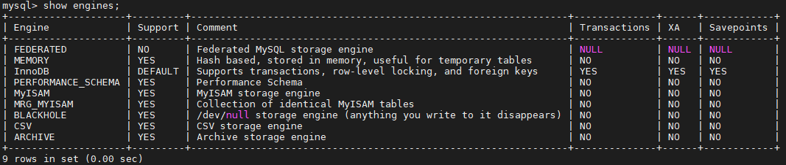

创建新表时如果不指定存储引擎，那么系统就会使用默认的存储引擎，MySQL5.5之前的默认存储引擎是MyISAM，5.5之后就改为了InnoDB。

查看Mysql数据库默认的存储引擎 ， 指令 ：

```
show variables like '%storage_engine%';

```

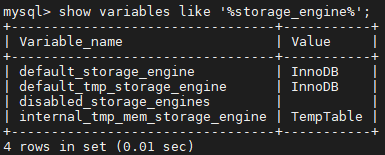

## 2. 各种存储引擎特性

下面重点介绍几种常用的存储引擎， 并对比各个存储引擎之间的区别， 如下表所示 ：

 | 特点 | InnoDB | MyISAM | MEMORY | MERGE | NDB
 | 存储限制 | 64TB | 有 | 有 | 没有 | 有
 | 事务安全 | ==支持== |  |  |  |
 | 锁机制 | ==行锁(适合高并发)== | ==表锁== | 表锁 | 表锁 | 行锁
 | B树索引 | 支持 | 支持 | 支持 | 支持 | 支持
 | 哈希索引 |  |  | 支持 |  |
 | 全文索引 | 支持(5.6版本之后) | 支持 |  |  |
 | 集群索引 | 支持 |  |  |  |
 | 数据索引 | 支持 |  | 支持 |  | 支持
 | 索引缓存 | 支持 | 支持 | 支持 | 支持 | 支持
 | 数据可压缩 |  | 支持 |  |  |
 | 空间使用 | 高 | 低 | N/A | 低 | 低
 | 内存使用 | 高 | 低 | 中等 | 低 | 高
 | 批量插入速度 | 低 | 高 | 高 | 高 | 高
 | 支持外键 | ==支持== |  |  |  |

下面将重点介绍最长使用的两种存储引擎： InnoDB、MyISAM ， 另外两种 MEMORY、MERGE ， 了解即可。

### 2.1. InnoDB

 InnoDB存储引擎是Mysql的默认存储引擎。InnoDB存储引擎提供了具有提交、回滚、崩溃恢复能力的事务安全。但是对比MyISAM的存储引擎，InnoDB写的处理效率差一些，并且会占用更多的磁盘空间以保留数据和索引。

InnoDB存储引擎不同于其他存储引擎的特点 ：

#### 2.1.1. 事务控制

```
create table goods_innodb(
	id int NOT NULL AUTO_INCREMENT,
	name varchar(20) NOT NULL,
    primary key(id)
)ENGINE=innodb DEFAULT CHARSET=utf8;

```

```
start transaction;

insert into goods_innodb(id,name)values(null,'Meta20'); -- 此时是查询不到数据的，因为此时事务还未提交。

commit; -- 事务提交，此时就可以查询到数据了。

```

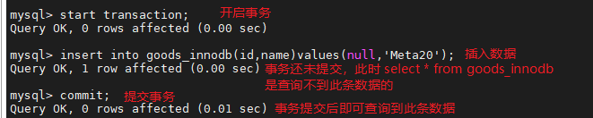
 测试，发现在InnoDB中是存在事务的 ；

#### 2.1.2. 外键约束

MySQL支持外键的存储引擎只有InnoDB ， 在创建外键的时候， 要求父表必须有对应的索引 ， 子表在创建外键的时候， 也会自动的创建对应的索引。
 下面两张表中 ， country_innodb是父表 ， country_id为主键索引，city_innodb表是子表，country_id字段为外键，对应于country_innodb表的主键country_id 。

```
create table country_innodb(
	country_id int NOT NULL AUTO_INCREMENT,
    country_name varchar(100) NOT NULL,
    primary key(country_id)
)ENGINE=InnoDB DEFAULT CHARSET=utf8;

create table city_innodb(
	city_id int NOT NULL AUTO_INCREMENT,
    city_name varchar(50) NOT NULL,
    country_id int NOT NULL,
    primary key(city_id),
    key idx_fk_country_id(country_id),
    CONSTRAINT `fk_city_country` FOREIGN KEY(country_id) REFERENCES country_innodb(country_id) ON DELETE RESTRICT ON UPDATE CASCADE
)ENGINE=InnoDB DEFAULT CHARSET=utf8;

insert into country_innodb values(null,'China'),(null,'America'),(null,'Japan');
insert into city_innodb values(null,'Xian',1),(null,'NewYork',2),(null,'BeiJing',1);

```

在创建索引时， 可以指定在删除、更新父表时，对子表进行的相应操作，包括 RESTRICT、CASCADE、SET NULL 和 NO ACTION。

RESTRICT和NO ACTION相同， 是指限制在子表有关联记录的情况下， 父表不能更新；

CASCADE表示父表在更新或者删除时，更新或者删除子表对应的记录；

SET NULL 则表示父表在更新或者删除的时候，子表的对应字段被SET NULL 。

针对上面创建的两个表， 子表的外键指定是ON DELETE RESTRICT ON UPDATE CASCADE 方式的， 那么在主表删除记录的时候， 如果子表有对应记录， 则不允许删除， 主表在更新记录的时候， 如果子表有对应记录， 则子表对应更新 。
 表中数据如下图所示 ：
 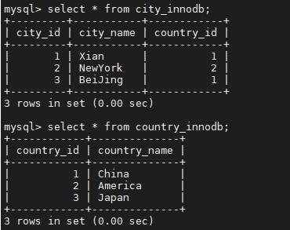

外键信息可以使用如下两种方式查看 ：

```
show create table city_innodb ;

```

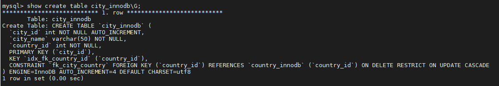

删除country_id为1 的country数据：

```
delete from country_innodb where country_id = 1;

```

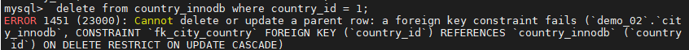

更新主表country表的字段 country_id :

```
update country_innodb set country_id = 100 where country_id = 1;

```

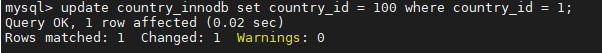

更新后， 子表的数据信息为 ：
 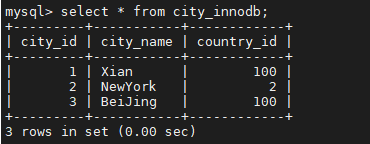

#### 2.1.3. 存储方式

InnoDB 存储表和索引有以下两种方式 ：
 ①. 使用共享表空间存储， 这种方式创建的表的表结构保存在.frm文件中， 数据和索引保存在 innodb_data_home_dir 和 innodb_data_file_path定义的表空间中，可以是多个文件。
 ②. 使用多表空间存储， 这种方式创建的表的表结构仍然存在 .frm 文件中，但是每个表的数据和索引单独保存在 .ibd 中。(MySQL8 之前)

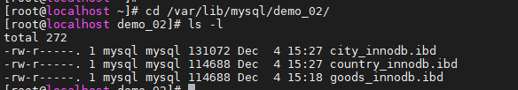
 **注：** MySQL8开始删除了原来的frm文件，并采用 Serialized Dictionary Information (SDI), 是MySQL8.0重新设计数据词典后引入的新产物,并开始已经统一使用InnoDB存储引擎来存储表的元数据信息。SDI信息源记录保存在ibd文件中。

如何可以查看表结构信息，官方提供了一个工具叫做ibd2sdi，在安装目录下可以找到，可以离线的将ibd文件中的冗余存储的sdi信息提取出来，并以json的格式输出到终端。

>
https://blog.csdn.net/n88lpo/article/details/95118434

### 2.2. MyISAM

 MyISAM 不支持事务、也不支持外键，其优势是访问的速度快，对事务的完整性没有要求或者以SELECT、INSERT为主的应用基本上都可以使用这个引擎来创建表 。有以下两个比较重要的特点：
 **不支持事务**

```
create table goods_myisam(
	id int NOT NULL AUTO_INCREMENT,
	name varchar(20) NOT NULL,
    primary key(id)
)ENGINE=myisam DEFAULT CHARSET=utf8;

```

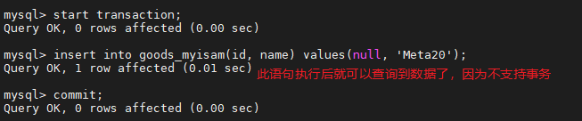
 通过测试，我们发现，在MyISAM存储引擎中，是没有事务控制的；

**文件存储方式**
 每个MyISAM在磁盘上存储成3个文件，其文件名都和表名相同，但拓展名分别是（MySQL8 之前） ：
 .frm(存储表定义)；
 .MYD(MYData , 存储数据)；
 .MYI(MYIndex , 存储索引)；
 MySQL8 之后：
 .sdi(Serialized Dictionary Information);
 .MYD(MYData , 存储数据)；
 .MYI(MYIndex , 存储索引)；
 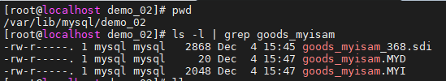
 **注：** SDI是Serialized Dictionary Information的缩写，是MySQL8.0重新设计数据词典后引入的新产物。我们知道MySQL8.0开始已经统一使用InnoDB存储引擎来存储表的元数据信息，但对于非InnoDB引擎，MySQL提供了另外一中可读的文件格式来描述表的元数据信息，在磁盘上以 $tbname.sdi的命名存储在数据库目录下。

>
https://blog.csdn.net/weixin_33713350/article/details/89694169

### 2.3. MEMORY

 Memory存储引擎将表的数据存放在内存中。每个MEMORY表实际对应一个磁盘文件，格式是.frm ，该文件中只存储表的结构，而其数据文件，都是存储在内存中，这样有利于数据的快速处理，提高整个表的效率。MEMORY 类型的表访问非常地快，因为他的数据是存放在内存中的，并且默认使用HASH索引 ， 但是服务一旦关闭，表中的数据就会丢失。

### 2.3. MERGE

 MERGE存储引擎是一组MyISAM表的组合，这些MyISAM表必须结构完全相同，MERGE表本身并没有存储数据，对MERGE类型的表可以进行查询、更新、删除操作，这些操作实际上是对内部的MyISAM表进行的。

 对于MERGE类型表的插入操作，是通过INSERT_METHOD子句定义插入的表，可以有3个不同的值，使用FIRST 或 LAST 值使得插入操作被相应地作用在第一或者最后一个表上，不定义这个子句或者定义为NO，表示不能对这个MERGE表执行插入操作。

 可以对MERGE表进行DROP操作，但是这个操作只是删除MERGE表的定义，对内部的表是没有任何影响的。
 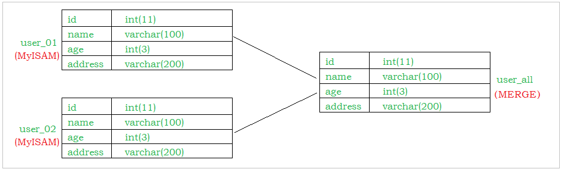

%23%20%E5%AD%98%E5%82%A8%E5%BC%95%E6%93%8E%0A%23%23%201.%20%E5%AD%98%E5%82%A8%E5%BC%95%E6%93%8E%E6%A6%82%E8%BF%B0%0A%26emsp%3B%26emsp%3B%E5%92%8C%E5%A4%A7%E5%A4%9A%E6%95%B0%E7%9A%84%E6%95%B0%E6%8D%AE%E5%BA%93%E4%B8%8D%E5%90%8C%2C%20MySQL%E4%B8%AD%E6%9C%89%E4%B8%80%E4%B8%AA%E5%AD%98%E5%82%A8%E5%BC%95%E6%93%8E%E7%9A%84%E6%A6%82%E5%BF%B5%2C%20%E9%92%88%E5%AF%B9%E4%B8%8D%E5%90%8C%E7%9A%84%E5%AD%98%E5%82%A8%E9%9C%80%E6%B1%82%E5%8F%AF%E4%BB%A5%E9%80%89%E6%8B%A9%E6%9C%80%E4%BC%98%E7%9A%84%E5%AD%98%E5%82%A8%E5%BC%95%E6%93%8E%E3%80%82%0A%E5%AD%98%E5%82%A8%E5%BC%95%E6%93%8E%E5%B0%B1%E6%98%AF%E5%AD%98%E5%82%A8%E6%95%B0%E6%8D%AE%EF%BC%8C%E5%BB%BA%E7%AB%8B%E7%B4%A2%E5%BC%95%EF%BC%8C%E6%9B%B4%E6%96%B0%E6%9F%A5%E8%AF%A2%E6%95%B0%E6%8D%AE%E7%AD%89%E7%AD%89%E6%8A%80%E6%9C%AF%E7%9A%84%E5%AE%9E%E7%8E%B0%E6%96%B9%E5%BC%8F%20%E3%80%82%E5%AD%98%E5%82%A8%E5%BC%95%E6%93%8E%E6%98%AF%E5%9F%BA%E4%BA%8E%E8%A1%A8%E7%9A%84%EF%BC%8C%E8%80%8C%E4%B8%8D%E6%98%AF%E5%9F%BA%E4%BA%8E%E5%BA%93%E7%9A%84%E3%80%82%E6%89%80%E4%BB%A5%E5%AD%98%E5%82%A8%E5%BC%95%E6%93%8E%E4%B9%9F%E5%8F%AF%E8%A2%AB%E7%A7%B0%E4%B8%BA%E8%A1%A8%E7%B1%BB%E5%9E%8B%E3%80%82%0A%26emsp%3B%26emsp%3BOracle%EF%BC%8CSqlServer%E7%AD%89%E6%95%B0%E6%8D%AE%E5%BA%93%E5%8F%AA%E6%9C%89%E4%B8%80%E7%A7%8D%E5%AD%98%E5%82%A8%E5%BC%95%E6%93%8E%E3%80%82MySQL%E6%8F%90%E4%BE%9B%E4%BA%86%E6%8F%92%E4%BB%B6%E5%BC%8F%E7%9A%84%E5%AD%98%E5%82%A8%E5%BC%95%E6%93%8E%E6%9E%B6%E6%9E%84%E3%80%82%E6%89%80%E4%BB%A5MySQL%E5%AD%98%E5%9C%A8%E5%A4%9A%E7%A7%8D%E5%AD%98%E5%82%A8%E5%BC%95%E6%93%8E%EF%BC%8C%E5%8F%AF%E4%BB%A5%E6%A0%B9%E6%8D%AE%E9%9C%80%E8%A6%81%E4%BD%BF%E7%94%A8%E7%9B%B8%E5%BA%94%E5%BC%95%E6%93%8E%EF%BC%8C%E6%88%96%E8%80%85%E7%BC%96%E5%86%99%E5%AD%98%E5%82%A8%E5%BC%95%E6%93%8E%E3%80%82%0A%26emsp%3B%26emsp%3BMySQL5.0%E6%94%AF%E6%8C%81%E7%9A%84%E5%AD%98%E5%82%A8%E5%BC%95%E6%93%8E%E5%8C%85%E5%90%AB%20%EF%BC%9A%20InnoDB%20%E3%80%81MyISAM%20%E3%80%81BDB%E3%80%81MEMORY%E3%80%81MERGE%E3%80%81EXAMPLE%E3%80%81NDB%20Cluster%E3%80%81ARCHIVE%E3%80%81CSV%E3%80%81BLACKHOLE%E3%80%81FEDERATED%E7%AD%89%EF%BC%8C%E5%85%B6%E4%B8%ADInnoDB%E5%92%8CBDB%E6%8F%90%E4%BE%9B%E4%BA%8B%E5%8A%A1%E5%AE%89%E5%85%A8%E8%A1%A8%EF%BC%8C%E5%85%B6%E4%BB%96%E5%AD%98%E5%82%A8%E5%BC%95%E6%93%8E%E6%98%AF%E9%9D%9E%E4%BA%8B%E5%8A%A1%E5%AE%89%E5%85%A8%E8%A1%A8%E3%80%82%0A%26emsp%3B%26emsp%3B%E5%8F%AF%E4%BB%A5%E9%80%9A%E8%BF%87%E6%8C%87%E4%BB%A4%20%60show%20engines%60%20%EF%BC%8C%20%E6%9D%A5%E6%9F%A5%E8%AF%A2%E5%BD%93%E5%89%8D%E6%95%B0%E6%8D%AE%E5%BA%93%E6%94%AF%E6%8C%81%E7%9A%84%E5%AD%98%E5%82%A8%E5%BC%95%E6%93%8E%20%EF%BC%9A%20%0A!%5Bf5d1ec5ae85b224b9ab08e59643cd7b9.png%5D(en-resource%3A%2F%2Fdatabase%2F4192%3A0)%0A%0A%E5%88%9B%E5%BB%BA%E6%96%B0%E8%A1%A8%E6%97%B6%E5%A6%82%E6%9E%9C%E4%B8%8D%E6%8C%87%E5%AE%9A%E5%AD%98%E5%82%A8%E5%BC%95%E6%93%8E%EF%BC%8C%E9%82%A3%E4%B9%88%E7%B3%BB%E7%BB%9F%E5%B0%B1%E4%BC%9A%E4%BD%BF%E7%94%A8%E9%BB%98%E8%AE%A4%E7%9A%84%E5%AD%98%E5%82%A8%E5%BC%95%E6%93%8E%EF%BC%8CMySQL5.5%E4%B9%8B%E5%89%8D%E7%9A%84%E9%BB%98%E8%AE%A4%E5%AD%98%E5%82%A8%E5%BC%95%E6%93%8E%E6%98%AFMyISAM%EF%BC%8C5.5%E4%B9%8B%E5%90%8E%E5%B0%B1%E6%94%B9%E4%B8%BA%E4%BA%86InnoDB%E3%80%82%0A%0A%E6%9F%A5%E7%9C%8BMysql%E6%95%B0%E6%8D%AE%E5%BA%93%E9%BB%98%E8%AE%A4%E7%9A%84%E5%AD%98%E5%82%A8%E5%BC%95%E6%93%8E%20%EF%BC%8C%20%E6%8C%87%E4%BB%A4%20%EF%BC%9A%0A%60%60%60sql%0Ashow%20variables%20like%20'%25storage_engine%25'%3B%0A%60%60%60%0A!%5B2d4aabffbbc164cc0e20a47d2ad328ab.png%5D(en-resource%3A%2F%2Fdatabase%2F4194%3A0)%0A%0A%23%23%202.%20%E5%90%84%E7%A7%8D%E5%AD%98%E5%82%A8%E5%BC%95%E6%93%8E%E7%89%B9%E6%80%A7%0A%E4%B8%8B%E9%9D%A2%E9%87%8D%E7%82%B9%E4%BB%8B%E7%BB%8D%E5%87%A0%E7%A7%8D%E5%B8%B8%E7%94%A8%E7%9A%84%E5%AD%98%E5%82%A8%E5%BC%95%E6%93%8E%EF%BC%8C%20%E5%B9%B6%E5%AF%B9%E6%AF%94%E5%90%84%E4%B8%AA%E5%AD%98%E5%82%A8%E5%BC%95%E6%93%8E%E4%B9%8B%E9%97%B4%E7%9A%84%E5%8C%BA%E5%88%AB%EF%BC%8C%20%E5%A6%82%E4%B8%8B%E8%A1%A8%E6%89%80%E7%A4%BA%20%EF%BC%9A%0A%7C%20%E7%89%B9%E7%82%B9%20%20%20%20%20%20%20%20%20%7C%20InnoDB%20%20%20%20%20%20%20%20%20%20%20%20%20%20%20%7C%20MyISAM%20%20%20%7C%20MEMORY%20%7C%20MERGE%20%7C%20NDB%20%20%7C%0A%7C%20------------%20%7C%20--------------------%20%7C%20--------%20%7C%20------%20%7C%20-----%20%7C%20----%20%7C%0A%7C%20%E5%AD%98%E5%82%A8%E9%99%90%E5%88%B6%20%20%20%20%20%7C%2064TB%20%20%20%20%20%20%20%20%20%20%20%20%20%20%20%20%20%7C%20%E6%9C%89%20%20%20%20%20%20%20%7C%20%E6%9C%89%20%20%20%20%20%7C%20%E6%B2%A1%E6%9C%89%20%20%7C%20%E6%9C%89%20%20%20%7C%0A%7C%20%E4%BA%8B%E5%8A%A1%E5%AE%89%E5%85%A8%20%20%20%20%20%7C%20%3D%3D%E6%94%AF%E6%8C%81%3D%3D%20%20%20%20%20%20%20%20%20%20%20%20%20%7C%20%20%20%20%20%20%20%20%20%20%7C%20%20%20%20%20%20%20%20%7C%20%20%20%20%20%20%20%7C%20%20%20%20%20%20%7C%0A%7C%20%E9%94%81%E6%9C%BA%E5%88%B6%20%20%20%20%20%20%20%7C%20%3D%3D%E8%A1%8C%E9%94%81(%E9%80%82%E5%90%88%E9%AB%98%E5%B9%B6%E5%8F%91)%3D%3D%20%7C%20%3D%3D%E8%A1%A8%E9%94%81%3D%3D%20%7C%20%E8%A1%A8%E9%94%81%20%20%20%7C%20%E8%A1%A8%E9%94%81%20%20%7C%20%E8%A1%8C%E9%94%81%20%7C%0A%7C%20B%E6%A0%91%E7%B4%A2%E5%BC%95%20%20%20%20%20%20%7C%20%E6%94%AF%E6%8C%81%20%20%20%20%20%20%20%20%20%20%20%20%20%20%20%20%20%7C%20%E6%94%AF%E6%8C%81%20%20%20%20%20%7C%20%E6%94%AF%E6%8C%81%20%20%20%7C%20%E6%94%AF%E6%8C%81%20%20%7C%20%E6%94%AF%E6%8C%81%20%7C%0A%7C%20%E5%93%88%E5%B8%8C%E7%B4%A2%E5%BC%95%20%20%20%20%20%7C%20%20%20%20%20%20%20%20%20%20%20%20%20%20%20%20%20%20%20%20%20%20%7C%20%20%20%20%20%20%20%20%20%20%7C%20%E6%94%AF%E6%8C%81%20%20%20%7C%20%20%20%20%20%20%20%7C%20%20%20%20%20%20%7C%0A%7C%20%E5%85%A8%E6%96%87%E7%B4%A2%E5%BC%95%20%20%20%20%20%7C%20%E6%94%AF%E6%8C%81(5.6%E7%89%88%E6%9C%AC%E4%B9%8B%E5%90%8E)%20%20%20%20%7C%20%E6%94%AF%E6%8C%81%20%20%20%20%20%7C%20%20%20%20%20%20%20%20%7C%20%20%20%20%20%20%20%7C%20%20%20%20%20%20%7C%0A%7C%20%E9%9B%86%E7%BE%A4%E7%B4%A2%E5%BC%95%20%20%20%20%20%7C%20%E6%94%AF%E6%8C%81%20%20%20%20%20%20%20%20%20%20%20%20%20%20%20%20%20%7C%20%20%20%20%20%20%20%20%20%20%7C%20%20%20%20%20%20%20%20%7C%20%20%20%20%20%20%20%7C%20%20%20%20%20%20%7C%0A%7C%20%E6%95%B0%E6%8D%AE%E7%B4%A2%E5%BC%95%20%20%20%20%20%7C%20%E6%94%AF%E6%8C%81%20%20%20%20%20%20%20%20%20%20%20%20%20%20%20%20%20%7C%20%20%20%20%20%20%20%20%20%20%7C%20%E6%94%AF%E6%8C%81%20%20%20%7C%20%20%20%20%20%20%20%7C%20%E6%94%AF%E6%8C%81%20%7C%0A%7C%20%E7%B4%A2%E5%BC%95%E7%BC%93%E5%AD%98%20%20%20%20%20%7C%20%E6%94%AF%E6%8C%81%20%20%20%20%20%20%20%20%20%20%20%20%20%20%20%20%20%7C%20%E6%94%AF%E6%8C%81%20%20%20%20%20%7C%20%E6%94%AF%E6%8C%81%20%20%20%7C%20%E6%94%AF%E6%8C%81%20%20%7C%20%E6%94%AF%E6%8C%81%20%7C%0A%7C%20%E6%95%B0%E6%8D%AE%E5%8F%AF%E5%8E%8B%E7%BC%A9%20%20%20%7C%20%20%20%20%20%20%20%20%20%20%20%20%20%20%20%20%20%20%20%20%20%20%7C%20%E6%94%AF%E6%8C%81%20%20%20%20%20%7C%20%20%20%20%20%20%20%20%7C%20%20%20%20%20%20%20%7C%20%20%20%20%20%20%7C%0A%7C%20%E7%A9%BA%E9%97%B4%E4%BD%BF%E7%94%A8%20%20%20%20%20%7C%20%E9%AB%98%20%20%20%20%20%20%20%20%20%20%20%20%20%20%20%20%20%20%20%7C%20%E4%BD%8E%20%20%20%20%20%20%20%7C%20N%2FA%20%20%20%20%7C%20%E4%BD%8E%20%20%20%20%7C%20%E4%BD%8E%20%20%20%7C%0A%7C%20%E5%86%85%E5%AD%98%E4%BD%BF%E7%94%A8%20%20%20%20%20%7C%20%E9%AB%98%20%20%20%20%20%20%20%20%20%20%20%20%20%20%20%20%20%20%20%7C%20%E4%BD%8E%20%20%20%20%20%20%20%7C%20%E4%B8%AD%E7%AD%89%20%20%20%7C%20%E4%BD%8E%20%20%20%20%7C%20%E9%AB%98%20%20%20%7C%0A%7C%20%E6%89%B9%E9%87%8F%E6%8F%92%E5%85%A5%E9%80%9F%E5%BA%A6%20%7C%20%E4%BD%8E%20%20%20%20%20%20%20%20%20%20%20%20%20%20%20%20%20%20%20%7C%20%E9%AB%98%20%20%20%20%20%20%20%7C%20%E9%AB%98%20%20%20%20%20%7C%20%E9%AB%98%20%20%20%20%7C%20%E9%AB%98%20%20%20%7C%0A%7C%20%E6%94%AF%E6%8C%81%E5%A4%96%E9%94%AE%20%20%20%20%20%7C%20%3D%3D%E6%94%AF%E6%8C%81%3D%3D%20%20%20%20%20%20%20%20%20%20%20%20%20%7C%20%20%20%20%20%20%20%20%20%20%7C%20%20%20%20%20%20%20%20%7C%20%20%20%20%20%20%20%7C%20%20%20%20%20%20%7C%0A%0A%E4%B8%8B%E9%9D%A2%E5%B0%86%E9%87%8D%E7%82%B9%E4%BB%8B%E7%BB%8D%E6%9C%80%E9%95%BF%E4%BD%BF%E7%94%A8%E7%9A%84%E4%B8%A4%E7%A7%8D%E5%AD%98%E5%82%A8%E5%BC%95%E6%93%8E%EF%BC%9A%20InnoDB%E3%80%81MyISAM%20%EF%BC%8C%20%E5%8F%A6%E5%A4%96%E4%B8%A4%E7%A7%8D%20MEMORY%E3%80%81MERGE%20%EF%BC%8C%20%E4%BA%86%E8%A7%A3%E5%8D%B3%E5%8F%AF%E3%80%82%0A%0A%23%23%23%202.1.%20InnoDB%0A%26emsp%3B%26emsp%3BInnoDB%E5%AD%98%E5%82%A8%E5%BC%95%E6%93%8E%E6%98%AFMysql%E7%9A%84%E9%BB%98%E8%AE%A4%E5%AD%98%E5%82%A8%E5%BC%95%E6%93%8E%E3%80%82InnoDB%E5%AD%98%E5%82%A8%E5%BC%95%E6%93%8E%E6%8F%90%E4%BE%9B%E4%BA%86%E5%85%B7%E6%9C%89%E6%8F%90%E4%BA%A4%E3%80%81%E5%9B%9E%E6%BB%9A%E3%80%81%E5%B4%A9%E6%BA%83%E6%81%A2%E5%A4%8D%E8%83%BD%E5%8A%9B%E7%9A%84%E4%BA%8B%E5%8A%A1%E5%AE%89%E5%85%A8%E3%80%82%E4%BD%86%E6%98%AF%E5%AF%B9%E6%AF%94MyISAM%E7%9A%84%E5%AD%98%E5%82%A8%E5%BC%95%E6%93%8E%EF%BC%8CInnoDB%E5%86%99%E7%9A%84%E5%A4%84%E7%90%86%E6%95%88%E7%8E%87%E5%B7%AE%E4%B8%80%E4%BA%9B%EF%BC%8C%E5%B9%B6%E4%B8%94%E4%BC%9A%E5%8D%A0%E7%94%A8%E6%9B%B4%E5%A4%9A%E7%9A%84%E7%A3%81%E7%9B%98%E7%A9%BA%E9%97%B4%E4%BB%A5%E4%BF%9D%E7%95%99%E6%95%B0%E6%8D%AE%E5%92%8C%E7%B4%A2%E5%BC%95%E3%80%82%0A%0AInnoDB%E5%AD%98%E5%82%A8%E5%BC%95%E6%93%8E%E4%B8%8D%E5%90%8C%E4%BA%8E%E5%85%B6%E4%BB%96%E5%AD%98%E5%82%A8%E5%BC%95%E6%93%8E%E7%9A%84%E7%89%B9%E7%82%B9%20%EF%BC%9A%0A%23%23%23%23%202.1.1.%20%E4%BA%8B%E5%8A%A1%E6%8E%A7%E5%88%B6%0A%60%60%60sql%0Acreate%20table%20goods_innodb(%0A%09id%20int%20NOT%20NULL%20AUTO_INCREMENT%2C%0A%09name%20varchar(20)%20NOT%20NULL%2C%0A%20%20%20%20primary%20key(id)%0A)ENGINE%3Dinnodb%20DEFAULT%20CHARSET%3Dutf8%3B%0A%60%60%60%0A%0A%60%60%60sql%0Astart%20transaction%3B%0A%0Ainsert%20into%20goods_innodb(id%2Cname)values(null%2C'Meta20')%3B%20--%20%E6%AD%A4%E6%97%B6%E6%98%AF%E6%9F%A5%E8%AF%A2%E4%B8%8D%E5%88%B0%E6%95%B0%E6%8D%AE%E7%9A%84%EF%BC%8C%E5%9B%A0%E4%B8%BA%E6%AD%A4%E6%97%B6%E4%BA%8B%E5%8A%A1%E8%BF%98%E6%9C%AA%E6%8F%90%E4%BA%A4%E3%80%82%0A%0Acommit%3B%20--%20%E4%BA%8B%E5%8A%A1%E6%8F%90%E4%BA%A4%EF%BC%8C%E6%AD%A4%E6%97%B6%E5%B0%B1%E5%8F%AF%E4%BB%A5%E6%9F%A5%E8%AF%A2%E5%88%B0%E6%95%B0%E6%8D%AE%E4%BA%86%E3%80%82%0A%60%60%60%0A!%5B68f3c2daf29199d490883eedb2eb531e.png%5D(en-resource%3A%2F%2Fdatabase%2F4196%3A0)%0A%E6%B5%8B%E8%AF%95%EF%BC%8C%E5%8F%91%E7%8E%B0%E5%9C%A8InnoDB%E4%B8%AD%E6%98%AF%E5%AD%98%E5%9C%A8%E4%BA%8B%E5%8A%A1%E7%9A%84%20%EF%BC%9B%0A%0A%23%23%23%23%202.1.2.%20%E5%A4%96%E9%94%AE%E7%BA%A6%E6%9D%9F%0AMySQL%E6%94%AF%E6%8C%81%E5%A4%96%E9%94%AE%E7%9A%84%E5%AD%98%E5%82%A8%E5%BC%95%E6%93%8E%E5%8F%AA%E6%9C%89InnoDB%20%EF%BC%8C%20%E5%9C%A8%E5%88%9B%E5%BB%BA%E5%A4%96%E9%94%AE%E7%9A%84%E6%97%B6%E5%80%99%EF%BC%8C%20%E8%A6%81%E6%B1%82%E7%88%B6%E8%A1%A8%E5%BF%85%E9%A1%BB%E6%9C%89%E5%AF%B9%E5%BA%94%E7%9A%84%E7%B4%A2%E5%BC%95%20%EF%BC%8C%20%E5%AD%90%E8%A1%A8%E5%9C%A8%E5%88%9B%E5%BB%BA%E5%A4%96%E9%94%AE%E7%9A%84%E6%97%B6%E5%80%99%EF%BC%8C%20%E4%B9%9F%E4%BC%9A%E8%87%AA%E5%8A%A8%E7%9A%84%E5%88%9B%E5%BB%BA%E5%AF%B9%E5%BA%94%E7%9A%84%E7%B4%A2%E5%BC%95%E3%80%82%0A%E4%B8%8B%E9%9D%A2%E4%B8%A4%E5%BC%A0%E8%A1%A8%E4%B8%AD%20%EF%BC%8C%20country_innodb%E6%98%AF%E7%88%B6%E8%A1%A8%20%EF%BC%8C%20country_id%E4%B8%BA%E4%B8%BB%E9%94%AE%E7%B4%A2%E5%BC%95%EF%BC%8Ccity_innodb%E8%A1%A8%E6%98%AF%E5%AD%90%E8%A1%A8%EF%BC%8Ccountry_id%E5%AD%97%E6%AE%B5%E4%B8%BA%E5%A4%96%E9%94%AE%EF%BC%8C%E5%AF%B9%E5%BA%94%E4%BA%8Ecountry_innodb%E8%A1%A8%E7%9A%84%E4%B8%BB%E9%94%AEcountry_id%20%E3%80%82%0A%60%60%60sql%0Acreate%20table%20country_innodb(%0A%09country_id%20int%20NOT%20NULL%20AUTO_INCREMENT%2C%0A%20%20%20%20country_name%20varchar(100)%20NOT%20NULL%2C%0A%20%20%20%20primary%20key(country_id)%0A)ENGINE%3DInnoDB%20DEFAULT%20CHARSET%3Dutf8%3B%0A%0Acreate%20table%20city_innodb(%0A%09city_id%20int%20NOT%20NULL%20AUTO_INCREMENT%2C%0A%20%20%20%20city_name%20varchar(50)%20NOT%20NULL%2C%0A%20%20%20%20country_id%20int%20NOT%20NULL%2C%0A%20%20%20%20primary%20key(city_id)%2C%0A%20%20%20%20key%20idx_fk_country_id(country_id)%2C%0A%20%20%20%20CONSTRAINT%20%60fk_city_country%60%20FOREIGN%20KEY(country_id)%20REFERENCES%20country_innodb(country_id)%20ON%20DELETE%20RESTRICT%20ON%20UPDATE%20CASCADE%0A)ENGINE%3DInnoDB%20DEFAULT%20CHARSET%3Dutf8%3B%0A%0Ainsert%20into%20country_innodb%20values(null%2C'China')%2C(null%2C'America')%2C(null%2C'Japan')%3B%0Ainsert%20into%20city_innodb%20values(null%2C'Xian'%2C1)%2C(null%2C'NewYork'%2C2)%2C(null%2C'BeiJing'%2C1)%3B%0A%0A%60%60%60%0A%0A%E5%9C%A8%E5%88%9B%E5%BB%BA%E7%B4%A2%E5%BC%95%E6%97%B6%EF%BC%8C%20%E5%8F%AF%E4%BB%A5%E6%8C%87%E5%AE%9A%E5%9C%A8%E5%88%A0%E9%99%A4%E3%80%81%E6%9B%B4%E6%96%B0%E7%88%B6%E8%A1%A8%E6%97%B6%EF%BC%8C%E5%AF%B9%E5%AD%90%E8%A1%A8%E8%BF%9B%E8%A1%8C%E7%9A%84%E7%9B%B8%E5%BA%94%E6%93%8D%E4%BD%9C%EF%BC%8C%E5%8C%85%E6%8B%AC%20RESTRICT%E3%80%81CASCADE%E3%80%81SET%20NULL%20%E5%92%8C%20NO%20ACTION%E3%80%82%0A%0ARESTRICT%E5%92%8CNO%20ACTION%E7%9B%B8%E5%90%8C%EF%BC%8C%20%E6%98%AF%E6%8C%87%E9%99%90%E5%88%B6%E5%9C%A8%E5%AD%90%E8%A1%A8%E6%9C%89%E5%85%B3%E8%81%94%E8%AE%B0%E5%BD%95%E7%9A%84%E6%83%85%E5%86%B5%E4%B8%8B%EF%BC%8C%20%E7%88%B6%E8%A1%A8%E4%B8%8D%E8%83%BD%E6%9B%B4%E6%96%B0%EF%BC%9B%0A%0ACASCADE%E8%A1%A8%E7%A4%BA%E7%88%B6%E8%A1%A8%E5%9C%A8%E6%9B%B4%E6%96%B0%E6%88%96%E8%80%85%E5%88%A0%E9%99%A4%E6%97%B6%EF%BC%8C%E6%9B%B4%E6%96%B0%E6%88%96%E8%80%85%E5%88%A0%E9%99%A4%E5%AD%90%E8%A1%A8%E5%AF%B9%E5%BA%94%E7%9A%84%E8%AE%B0%E5%BD%95%EF%BC%9B%0A%0ASET%20NULL%20%E5%88%99%E8%A1%A8%E7%A4%BA%E7%88%B6%E8%A1%A8%E5%9C%A8%E6%9B%B4%E6%96%B0%E6%88%96%E8%80%85%E5%88%A0%E9%99%A4%E7%9A%84%E6%97%B6%E5%80%99%EF%BC%8C%E5%AD%90%E8%A1%A8%E7%9A%84%E5%AF%B9%E5%BA%94%E5%AD%97%E6%AE%B5%E8%A2%ABSET%20NULL%20%E3%80%82%0A%0A%E9%92%88%E5%AF%B9%E4%B8%8A%E9%9D%A2%E5%88%9B%E5%BB%BA%E7%9A%84%E4%B8%A4%E4%B8%AA%E8%A1%A8%EF%BC%8C%20%E5%AD%90%E8%A1%A8%E7%9A%84%E5%A4%96%E9%94%AE%E6%8C%87%E5%AE%9A%E6%98%AFON%20DELETE%20RESTRICT%20ON%20UPDATE%20CASCADE%20%E6%96%B9%E5%BC%8F%E7%9A%84%EF%BC%8C%20%E9%82%A3%E4%B9%88%E5%9C%A8%E4%B8%BB%E8%A1%A8%E5%88%A0%E9%99%A4%E8%AE%B0%E5%BD%95%E7%9A%84%E6%97%B6%E5%80%99%EF%BC%8C%20%E5%A6%82%E6%9E%9C%E5%AD%90%E8%A1%A8%E6%9C%89%E5%AF%B9%E5%BA%94%E8%AE%B0%E5%BD%95%EF%BC%8C%20%E5%88%99%E4%B8%8D%E5%85%81%E8%AE%B8%E5%88%A0%E9%99%A4%EF%BC%8C%20%E4%B8%BB%E8%A1%A8%E5%9C%A8%E6%9B%B4%E6%96%B0%E8%AE%B0%E5%BD%95%E7%9A%84%E6%97%B6%E5%80%99%EF%BC%8C%20%E5%A6%82%E6%9E%9C%E5%AD%90%E8%A1%A8%E6%9C%89%E5%AF%B9%E5%BA%94%E8%AE%B0%E5%BD%95%EF%BC%8C%20%E5%88%99%E5%AD%90%E8%A1%A8%E5%AF%B9%E5%BA%94%E6%9B%B4%E6%96%B0%20%E3%80%82%0A%E8%A1%A8%E4%B8%AD%E6%95%B0%E6%8D%AE%E5%A6%82%E4%B8%8B%E5%9B%BE%E6%89%80%E7%A4%BA%20%EF%BC%9A%0A!%5Bf07b2c778e6ba8199b1093c3c33ae8ad.png%5D(en-resource%3A%2F%2Fdatabase%2F4198%3A0)%0A%0A%E5%A4%96%E9%94%AE%E4%BF%A1%E6%81%AF%E5%8F%AF%E4%BB%A5%E4%BD%BF%E7%94%A8%E5%A6%82%E4%B8%8B%E4%B8%A4%E7%A7%8D%E6%96%B9%E5%BC%8F%E6%9F%A5%E7%9C%8B%20%EF%BC%9A%0A%60%60%60sql%0Ashow%20create%20table%20city_innodb%20%3B%0A%60%60%60%0A!%5B8e8c60e97890210e0409e0e8b46a626d.png%5D(en-resource%3A%2F%2Fdatabase%2F4200%3A0)%0A%0A%E5%88%A0%E9%99%A4country_id%E4%B8%BA1%20%E7%9A%84country%E6%95%B0%E6%8D%AE%EF%BC%9A%0A%60%60%60sql%0Adelete%20from%20country_innodb%20where%20country_id%20%3D%201%3B%0A%60%60%60%0A!%5B1ad74cb85f506bba58d3e6c68e6604d1.png%5D(en-resource%3A%2F%2Fdatabase%2F4202%3A0)%0A%0A%E6%9B%B4%E6%96%B0%E4%B8%BB%E8%A1%A8country%E8%A1%A8%E7%9A%84%E5%AD%97%E6%AE%B5%20country_id%20%3A%0A%60%60%60sql%0Aupdate%20country_innodb%20set%20country_id%20%3D%20100%20where%20country_id%20%3D%201%3B%0A%60%60%60%0A!%5B1af1c4efe7f966ba6fe9f5e314869b92.png%5D(en-resource%3A%2F%2Fdatabase%2F4204%3A0)%0A%0A%E6%9B%B4%E6%96%B0%E5%90%8E%EF%BC%8C%20%E5%AD%90%E8%A1%A8%E7%9A%84%E6%95%B0%E6%8D%AE%E4%BF%A1%E6%81%AF%E4%B8%BA%20%EF%BC%9A%0A!%5Bce08d13d16101d43d86f91f479b877bc.png%5D(en-resource%3A%2F%2Fdatabase%2F4206%3A0)%0A%0A%23%23%23%23%202.1.3.%20%E5%AD%98%E5%82%A8%E6%96%B9%E5%BC%8F%0AInnoDB%20%E5%AD%98%E5%82%A8%E8%A1%A8%E5%92%8C%E7%B4%A2%E5%BC%95%E6%9C%89%E4%BB%A5%E4%B8%8B%E4%B8%A4%E7%A7%8D%E6%96%B9%E5%BC%8F%20%EF%BC%9A%20%0A%E2%91%A0.%20%E4%BD%BF%E7%94%A8%E5%85%B1%E4%BA%AB%E8%A1%A8%E7%A9%BA%E9%97%B4%E5%AD%98%E5%82%A8%EF%BC%8C%20%E8%BF%99%E7%A7%8D%E6%96%B9%E5%BC%8F%E5%88%9B%E5%BB%BA%E7%9A%84%E8%A1%A8%E7%9A%84%E8%A1%A8%E7%BB%93%E6%9E%84%E4%BF%9D%E5%AD%98%E5%9C%A8.frm%E6%96%87%E4%BB%B6%E4%B8%AD%EF%BC%8C%20%E6%95%B0%E6%8D%AE%E5%92%8C%E7%B4%A2%E5%BC%95%E4%BF%9D%E5%AD%98%E5%9C%A8%20innodb_data_home_dir%20%E5%92%8C%20innodb_data_file_path%E5%AE%9A%E4%B9%89%E7%9A%84%E8%A1%A8%E7%A9%BA%E9%97%B4%E4%B8%AD%EF%BC%8C%E5%8F%AF%E4%BB%A5%E6%98%AF%E5%A4%9A%E4%B8%AA%E6%96%87%E4%BB%B6%E3%80%82%0A%E2%91%A1.%20%E4%BD%BF%E7%94%A8%E5%A4%9A%E8%A1%A8%E7%A9%BA%E9%97%B4%E5%AD%98%E5%82%A8%EF%BC%8C%20%E8%BF%99%E7%A7%8D%E6%96%B9%E5%BC%8F%E5%88%9B%E5%BB%BA%E7%9A%84%E8%A1%A8%E7%9A%84%E8%A1%A8%E7%BB%93%E6%9E%84%E4%BB%8D%E7%84%B6%E5%AD%98%E5%9C%A8%20.frm%20%E6%96%87%E4%BB%B6%E4%B8%AD%EF%BC%8C%E4%BD%86%E6%98%AF%E6%AF%8F%E4%B8%AA%E8%A1%A8%E7%9A%84%E6%95%B0%E6%8D%AE%E5%92%8C%E7%B4%A2%E5%BC%95%E5%8D%95%E7%8B%AC%E4%BF%9D%E5%AD%98%E5%9C%A8%20.ibd%20%E4%B8%AD%E3%80%82(MySQL8%20%E4%B9%8B%E5%89%8D)%0A%0A!%5Bd1e4b696dbeedebe522502a6ecc9fd9d.png%5D(en-resource%3A%2F%2Fdatabase%2F4208%3A0)%0A**%E6%B3%A8%EF%BC%9A**%20MySQL8%E5%BC%80%E5%A7%8B%E5%88%A0%E9%99%A4%E4%BA%86%E5%8E%9F%E6%9D%A5%E7%9A%84frm%E6%96%87%E4%BB%B6%EF%BC%8C%E5%B9%B6%E9%87%87%E7%94%A8%20Serialized%20Dictionary%20Information%20(SDI)%2C%20%E6%98%AFMySQL8.0%E9%87%8D%E6%96%B0%E8%AE%BE%E8%AE%A1%E6%95%B0%E6%8D%AE%E8%AF%8D%E5%85%B8%E5%90%8E%E5%BC%95%E5%85%A5%E7%9A%84%E6%96%B0%E4%BA%A7%E7%89%A9%2C%E5%B9%B6%E5%BC%80%E5%A7%8B%E5%B7%B2%E7%BB%8F%E7%BB%9F%E4%B8%80%E4%BD%BF%E7%94%A8InnoDB%E5%AD%98%E5%82%A8%E5%BC%95%E6%93%8E%E6%9D%A5%E5%AD%98%E5%82%A8%E8%A1%A8%E7%9A%84%E5%85%83%E6%95%B0%E6%8D%AE%E4%BF%A1%E6%81%AF%E3%80%82SDI%E4%BF%A1%E6%81%AF%E6%BA%90%E8%AE%B0%E5%BD%95%E4%BF%9D%E5%AD%98%E5%9C%A8ibd%E6%96%87%E4%BB%B6%E4%B8%AD%E3%80%82%0A%0A%E5%A6%82%E4%BD%95%E5%8F%AF%E4%BB%A5%E6%9F%A5%E7%9C%8B%E8%A1%A8%E7%BB%93%E6%9E%84%E4%BF%A1%E6%81%AF%EF%BC%8C%E5%AE%98%E6%96%B9%E6%8F%90%E4%BE%9B%E4%BA%86%E4%B8%80%E4%B8%AA%E5%B7%A5%E5%85%B7%E5%8F%AB%E5%81%9Aibd2sdi%EF%BC%8C%E5%9C%A8%E5%AE%89%E8%A3%85%E7%9B%AE%E5%BD%95%E4%B8%8B%E5%8F%AF%E4%BB%A5%E6%89%BE%E5%88%B0%EF%BC%8C%E5%8F%AF%E4%BB%A5%E7%A6%BB%E7%BA%BF%E7%9A%84%E5%B0%86ibd%E6%96%87%E4%BB%B6%E4%B8%AD%E7%9A%84%E5%86%97%E4%BD%99%E5%AD%98%E5%82%A8%E7%9A%84sdi%E4%BF%A1%E6%81%AF%E6%8F%90%E5%8F%96%E5%87%BA%E6%9D%A5%EF%BC%8C%E5%B9%B6%E4%BB%A5json%E7%9A%84%E6%A0%BC%E5%BC%8F%E8%BE%93%E5%87%BA%E5%88%B0%E7%BB%88%E7%AB%AF%E3%80%82%0A%3Ehttps%3A%2F%2Fblog.csdn.net%2Fn88lpo%2Farticle%2Fdetails%2F95118434%0A%0A%23%23%23%202.2.%20MyISAM%0A%26emsp%3B%26emsp%3BMyISAM%20%E4%B8%8D%E6%94%AF%E6%8C%81%E4%BA%8B%E5%8A%A1%E3%80%81%E4%B9%9F%E4%B8%8D%E6%94%AF%E6%8C%81%E5%A4%96%E9%94%AE%EF%BC%8C%E5%85%B6%E4%BC%98%E5%8A%BF%E6%98%AF%E8%AE%BF%E9%97%AE%E7%9A%84%E9%80%9F%E5%BA%A6%E5%BF%AB%EF%BC%8C%E5%AF%B9%E4%BA%8B%E5%8A%A1%E7%9A%84%E5%AE%8C%E6%95%B4%E6%80%A7%E6%B2%A1%E6%9C%89%E8%A6%81%E6%B1%82%E6%88%96%E8%80%85%E4%BB%A5SELECT%E3%80%81INSERT%E4%B8%BA%E4%B8%BB%E7%9A%84%E5%BA%94%E7%94%A8%E5%9F%BA%E6%9C%AC%E4%B8%8A%E9%83%BD%E5%8F%AF%E4%BB%A5%E4%BD%BF%E7%94%A8%E8%BF%99%E4%B8%AA%E5%BC%95%E6%93%8E%E6%9D%A5%E5%88%9B%E5%BB%BA%E8%A1%A8%20%E3%80%82%E6%9C%89%E4%BB%A5%E4%B8%8B%E4%B8%A4%E4%B8%AA%E6%AF%94%E8%BE%83%E9%87%8D%E8%A6%81%E7%9A%84%E7%89%B9%E7%82%B9%EF%BC%9A%0A**%E4%B8%8D%E6%94%AF%E6%8C%81%E4%BA%8B%E5%8A%A1**%0A%60%60%60sql%0Acreate%20table%20goods_myisam(%0A%09id%20int%20NOT%20NULL%20AUTO_INCREMENT%2C%0A%09name%20varchar(20)%20NOT%20NULL%2C%0A%20%20%20%20primary%20key(id)%0A)ENGINE%3Dmyisam%20DEFAULT%20CHARSET%3Dutf8%3B%0A%60%60%60%0A!%5B05110c7ec6124598553ea0028ebba9a6.png%5D(en-resource%3A%2F%2Fdatabase%2F4210%3A0)%0A%E9%80%9A%E8%BF%87%E6%B5%8B%E8%AF%95%EF%BC%8C%E6%88%91%E4%BB%AC%E5%8F%91%E7%8E%B0%EF%BC%8C%E5%9C%A8MyISAM%E5%AD%98%E5%82%A8%E5%BC%95%E6%93%8E%E4%B8%AD%EF%BC%8C%E6%98%AF%E6%B2%A1%E6%9C%89%E4%BA%8B%E5%8A%A1%E6%8E%A7%E5%88%B6%E7%9A%84%EF%BC%9B%0A%0A**%E6%96%87%E4%BB%B6%E5%AD%98%E5%82%A8%E6%96%B9%E5%BC%8F**%0A%E6%AF%8F%E4%B8%AAMyISAM%E5%9C%A8%E7%A3%81%E7%9B%98%E4%B8%8A%E5%AD%98%E5%82%A8%E6%88%903%E4%B8%AA%E6%96%87%E4%BB%B6%EF%BC%8C%E5%85%B6%E6%96%87%E4%BB%B6%E5%90%8D%E9%83%BD%E5%92%8C%E8%A1%A8%E5%90%8D%E7%9B%B8%E5%90%8C%EF%BC%8C%E4%BD%86%E6%8B%93%E5%B1%95%E5%90%8D%E5%88%86%E5%88%AB%E6%98%AF%EF%BC%88MySQL8%20%E4%B9%8B%E5%89%8D%EF%BC%89%20%EF%BC%9A%0A.frm(%E5%AD%98%E5%82%A8%E8%A1%A8%E5%AE%9A%E4%B9%89)%EF%BC%9B%0A.MYD(MYData%20%2C%20%E5%AD%98%E5%82%A8%E6%95%B0%E6%8D%AE)%EF%BC%9B%0A.MYI(MYIndex%20%2C%20%E5%AD%98%E5%82%A8%E7%B4%A2%E5%BC%95)%EF%BC%9B%0AMySQL8%20%E4%B9%8B%E5%90%8E%EF%BC%9A%0A.sdi(Serialized%20Dictionary%20Information)%3B%0A.MYD(MYData%20%2C%20%E5%AD%98%E5%82%A8%E6%95%B0%E6%8D%AE)%EF%BC%9B%0A.MYI(MYIndex%20%2C%20%E5%AD%98%E5%82%A8%E7%B4%A2%E5%BC%95)%EF%BC%9B%0A!%5B39e89df8b5e9848368cd4f47c77557f2.png%5D(en-resource%3A%2F%2Fdatabase%2F4212%3A0)%0A**%E6%B3%A8%EF%BC%9A**%20SDI%E6%98%AFSerialized%20Dictionary%20Information%E7%9A%84%E7%BC%A9%E5%86%99%EF%BC%8C%E6%98%AFMySQL8.0%E9%87%8D%E6%96%B0%E8%AE%BE%E8%AE%A1%E6%95%B0%E6%8D%AE%E8%AF%8D%E5%85%B8%E5%90%8E%E5%BC%95%E5%85%A5%E7%9A%84%E6%96%B0%E4%BA%A7%E7%89%A9%E3%80%82%E6%88%91%E4%BB%AC%E7%9F%A5%E9%81%93MySQL8.0%E5%BC%80%E5%A7%8B%E5%B7%B2%E7%BB%8F%E7%BB%9F%E4%B8%80%E4%BD%BF%E7%94%A8InnoDB%E5%AD%98%E5%82%A8%E5%BC%95%E6%93%8E%E6%9D%A5%E5%AD%98%E5%82%A8%E8%A1%A8%E7%9A%84%E5%85%83%E6%95%B0%E6%8D%AE%E4%BF%A1%E6%81%AF%EF%BC%8C%E4%BD%86%E5%AF%B9%E4%BA%8E%E9%9D%9EInnoDB%E5%BC%95%E6%93%8E%EF%BC%8CMySQL%E6%8F%90%E4%BE%9B%E4%BA%86%E5%8F%A6%E5%A4%96%E4%B8%80%E4%B8%AD%E5%8F%AF%E8%AF%BB%E7%9A%84%E6%96%87%E4%BB%B6%E6%A0%BC%E5%BC%8F%E6%9D%A5%E6%8F%8F%E8%BF%B0%E8%A1%A8%E7%9A%84%E5%85%83%E6%95%B0%E6%8D%AE%E4%BF%A1%E6%81%AF%EF%BC%8C%E5%9C%A8%E7%A3%81%E7%9B%98%E4%B8%8A%E4%BB%A5%20%24tbname.sdi%E7%9A%84%E5%91%BD%E5%90%8D%E5%AD%98%E5%82%A8%E5%9C%A8%E6%95%B0%E6%8D%AE%E5%BA%93%E7%9B%AE%E5%BD%95%E4%B8%8B%E3%80%82%0A%3E%20https%3A%2F%2Fblog.csdn.net%2Fweixin_33713350%2Farticle%2Fdetails%2F89694169%0A%0A%23%23%23%202.3.%20MEMORY%0A%26emsp%3B%26emsp%3BMemory%E5%AD%98%E5%82%A8%E5%BC%95%E6%93%8E%E5%B0%86%E8%A1%A8%E7%9A%84%E6%95%B0%E6%8D%AE%E5%AD%98%E6%94%BE%E5%9C%A8%E5%86%85%E5%AD%98%E4%B8%AD%E3%80%82%E6%AF%8F%E4%B8%AAMEMORY%E8%A1%A8%E5%AE%9E%E9%99%85%E5%AF%B9%E5%BA%94%E4%B8%80%E4%B8%AA%E7%A3%81%E7%9B%98%E6%96%87%E4%BB%B6%EF%BC%8C%E6%A0%BC%E5%BC%8F%E6%98%AF.frm%20%EF%BC%8C%E8%AF%A5%E6%96%87%E4%BB%B6%E4%B8%AD%E5%8F%AA%E5%AD%98%E5%82%A8%E8%A1%A8%E7%9A%84%E7%BB%93%E6%9E%84%EF%BC%8C%E8%80%8C%E5%85%B6%E6%95%B0%E6%8D%AE%E6%96%87%E4%BB%B6%EF%BC%8C%E9%83%BD%E6%98%AF%E5%AD%98%E5%82%A8%E5%9C%A8%E5%86%85%E5%AD%98%E4%B8%AD%EF%BC%8C%E8%BF%99%E6%A0%B7%E6%9C%89%E5%88%A9%E4%BA%8E%E6%95%B0%E6%8D%AE%E7%9A%84%E5%BF%AB%E9%80%9F%E5%A4%84%E7%90%86%EF%BC%8C%E6%8F%90%E9%AB%98%E6%95%B4%E4%B8%AA%E8%A1%A8%E7%9A%84%E6%95%88%E7%8E%87%E3%80%82MEMORY%20%E7%B1%BB%E5%9E%8B%E7%9A%84%E8%A1%A8%E8%AE%BF%E9%97%AE%E9%9D%9E%E5%B8%B8%E5%9C%B0%E5%BF%AB%EF%BC%8C%E5%9B%A0%E4%B8%BA%E4%BB%96%E7%9A%84%E6%95%B0%E6%8D%AE%E6%98%AF%E5%AD%98%E6%94%BE%E5%9C%A8%E5%86%85%E5%AD%98%E4%B8%AD%E7%9A%84%EF%BC%8C%E5%B9%B6%E4%B8%94%E9%BB%98%E8%AE%A4%E4%BD%BF%E7%94%A8HASH%E7%B4%A2%E5%BC%95%20%EF%BC%8C%20%E4%BD%86%E6%98%AF%E6%9C%8D%E5%8A%A1%E4%B8%80%E6%97%A6%E5%85%B3%E9%97%AD%EF%BC%8C%E8%A1%A8%E4%B8%AD%E7%9A%84%E6%95%B0%E6%8D%AE%E5%B0%B1%E4%BC%9A%E4%B8%A2%E5%A4%B1%E3%80%82%0A%0A%23%23%23%202.3.%20MERGE%0A%26emsp%3B%26emsp%3BMERGE%E5%AD%98%E5%82%A8%E5%BC%95%E6%93%8E%E6%98%AF%E4%B8%80%E7%BB%84MyISAM%E8%A1%A8%E7%9A%84%E7%BB%84%E5%90%88%EF%BC%8C%E8%BF%99%E4%BA%9BMyISAM%E8%A1%A8%E5%BF%85%E9%A1%BB%E7%BB%93%E6%9E%84%E5%AE%8C%E5%85%A8%E7%9B%B8%E5%90%8C%EF%BC%8CMERGE%E8%A1%A8%E6%9C%AC%E8%BA%AB%E5%B9%B6%E6%B2%A1%E6%9C%89%E5%AD%98%E5%82%A8%E6%95%B0%E6%8D%AE%EF%BC%8C%E5%AF%B9MERGE%E7%B1%BB%E5%9E%8B%E7%9A%84%E8%A1%A8%E5%8F%AF%E4%BB%A5%E8%BF%9B%E8%A1%8C%E6%9F%A5%E8%AF%A2%E3%80%81%E6%9B%B4%E6%96%B0%E3%80%81%E5%88%A0%E9%99%A4%E6%93%8D%E4%BD%9C%EF%BC%8C%E8%BF%99%E4%BA%9B%E6%93%8D%E4%BD%9C%E5%AE%9E%E9%99%85%E4%B8%8A%E6%98%AF%E5%AF%B9%E5%86%85%E9%83%A8%E7%9A%84MyISAM%E8%A1%A8%E8%BF%9B%E8%A1%8C%E7%9A%84%E3%80%82%0A%0A%26emsp%3B%26emsp%3B%E5%AF%B9%E4%BA%8EMERGE%E7%B1%BB%E5%9E%8B%E8%A1%A8%E7%9A%84%E6%8F%92%E5%85%A5%E6%93%8D%E4%BD%9C%EF%BC%8C%E6%98%AF%E9%80%9A%E8%BF%87INSERT_METHOD%E5%AD%90%E5%8F%A5%E5%AE%9A%E4%B9%89%E6%8F%92%E5%85%A5%E7%9A%84%E8%A1%A8%EF%BC%8C%E5%8F%AF%E4%BB%A5%E6%9C%893%E4%B8%AA%E4%B8%8D%E5%90%8C%E7%9A%84%E5%80%BC%EF%BC%8C%E4%BD%BF%E7%94%A8FIRST%20%E6%88%96%20LAST%20%E5%80%BC%E4%BD%BF%E5%BE%97%E6%8F%92%E5%85%A5%E6%93%8D%E4%BD%9C%E8%A2%AB%E7%9B%B8%E5%BA%94%E5%9C%B0%E4%BD%9C%E7%94%A8%E5%9C%A8%E7%AC%AC%E4%B8%80%E6%88%96%E8%80%85%E6%9C%80%E5%90%8E%E4%B8%80%E4%B8%AA%E8%A1%A8%E4%B8%8A%EF%BC%8C%E4%B8%8D%E5%AE%9A%E4%B9%89%E8%BF%99%E4%B8%AA%E5%AD%90%E5%8F%A5%E6%88%96%E8%80%85%E5%AE%9A%E4%B9%89%E4%B8%BANO%EF%BC%8C%E8%A1%A8%E7%A4%BA%E4%B8%8D%E8%83%BD%E5%AF%B9%E8%BF%99%E4%B8%AAMERGE%E8%A1%A8%E6%89%A7%E8%A1%8C%E6%8F%92%E5%85%A5%E6%93%8D%E4%BD%9C%E3%80%82%0A%0A%26emsp%3B%26emsp%3B%E5%8F%AF%E4%BB%A5%E5%AF%B9MERGE%E8%A1%A8%E8%BF%9B%E8%A1%8CDROP%E6%93%8D%E4%BD%9C%EF%BC%8C%E4%BD%86%E6%98%AF%E8%BF%99%E4%B8%AA%E6%93%8D%E4%BD%9C%E5%8F%AA%E6%98%AF%E5%88%A0%E9%99%A4MERGE%E8%A1%A8%E7%9A%84%E5%AE%9A%E4%B9%89%EF%BC%8C%E5%AF%B9%E5%86%85%E9%83%A8%E7%9A%84%E8%A1%A8%E6%98%AF%E6%B2%A1%E6%9C%89%E4%BB%BB%E4%BD%95%E5%BD%B1%E5%93%8D%E7%9A%84%E3%80%82%0A!%5B6f7360a7d37f4b45bfb06711ec67e38a.png%5D(en-resource%3A%2F%2Fdatabase%2F4214%3A0)%0A%0A%E4%B8%8B%E9%9D%A2%E6%98%AF%E4%B8%80%E4%B8%AA%E5%88%9B%E5%BB%BA%E5%92%8C%E4%BD%BF%E7%94%A8MERGE%E8%A1%A8%E7%9A%84%E7%A4%BA%E4%BE%8B%20%EF%BC%9A%0A1%EF%BC%89.%20%E5%88%9B%E5%BB%BA3%E4%B8%AA%E6%B5%8B%E8%AF%95%E8%A1%A8%20order_1990%2C%20order_1991%2C%20order_all%20%2C%20%E5%85%B6%E4%B8%ADorder_all%E6%98%AF%E5%89%8D%E4%B8%A4%E4%B8%AA%E8%A1%A8%E7%9A%84MERGE%E8%A1%A8%20%EF%BC%9A%0A%60%60%60sql%0Acreate%20table%20order_1990(%0A%09order_id%20int%20%2C%0A%09order_money%20double(10%2C2)%2C%0A%09order_address%20varchar(50)%2C%0A%09primary%20key%20(order_id)%0A)engine%20%3D%20myisam%20default%20charset%3Dutf8%3B%0A%0Acreate%20table%20order_1991(%0A%09order_id%20int%20%2C%0A%09order_money%20double(10%2C2)%2C%0A%09order_address%20varchar(50)%2C%0A%09primary%20key%20(order_id)%0A)engine%20%3D%20myisam%20default%20charset%3Dutf8%3B%0A%0Acreate%20table%20order_all(%0A%09order_id%20int%20%2C%0A%09order_money%20double(10%2C2)%2C%0A%09order_address%20varchar(50)%2C%0A%09primary%20key%20(order_id)%0A)engine%20%3D%20merge%20union%20%3D%20(order_1990%2Corder_1991)%20INSERT_METHOD%3DLAST%20default%20charset%3Dutf8%3B%0A%60%60%60%0A2%EF%BC%89.%20%E5%88%86%E5%88%AB%E5%90%91%E4%B8%A4%E5%BC%A0%E8%A1%A8%E4%B8%AD%E6%8F%92%E5%85%A5%E8%AE%B0%E5%BD%95%0A%60%60%60sql%0Ainsert%20into%20order_1990%20values(1%2C100.0%2C'%E5%8C%97%E4%BA%AC')%3B%0Ainsert%20into%20order_1990%20values(2%2C100.0%2C'%E4%B8%8A%E6%B5%B7')%3B%0A%0Ainsert%20into%20order_1991%20values(10%2C200.0%2C'%E5%8C%97%E4%BA%AC')%3B%0Ainsert%20into%20order_1991%20values(11%2C200.0%2C'%E4%B8%8A%E6%B5%B7')%3B%0A%60%60%60%0A3%EF%BC%89.%20%E6%9F%A5%E8%AF%A23%E5%BC%A0%E8%A1%A8%E4%B8%AD%E7%9A%84%E6%95%B0%E6%8D%AE%E3%80%82%0Aorder_1990%E4%B8%AD%E7%9A%84%E6%95%B0%E6%8D%AE%20%EF%BC%9A%0A!%5Bd76c75e095361d07f019d761fd1c44e2.png%5D(en-resource%3A%2F%2Fdatabase%2F4216%3A0)%0Aorder_1991%E4%B8%AD%E7%9A%84%E6%95%B0%E6%8D%AE%20%EF%BC%9A%0A!%5B2f056d618776baeb69e940caeee289b6.png%5D(en-resource%3A%2F%2Fdatabase%2F4218%3A0)%0Aorder_all%E4%B8%AD%E7%9A%84%E6%95%B0%E6%8D%AE%20%EF%BC%9A%0A!%5Bf0d754f0cbab2c3c04e54cc1e30eed16.png%5D(en-resource%3A%2F%2Fdatabase%2F4220%3A0)%0A%0A4%EF%BC%89.%20%E5%BE%80order_all%E4%B8%AD%E6%8F%92%E5%85%A5%E4%B8%80%E6%9D%A1%E8%AE%B0%E5%BD%95%20%EF%BC%8C%E7%94%B1%E4%BA%8E%E5%9C%A8MERGE%E8%A1%A8%E5%AE%9A%E4%B9%89%E6%97%B6%EF%BC%8CINSERT_METHOD%20%E9%80%89%E6%8B%A9%E7%9A%84%E6%98%AFLAST%EF%BC%8C%E9%82%A3%E4%B9%88%E6%8F%92%E5%85%A5%E7%9A%84%E6%95%B0%E6%8D%AE%E4%BC%9A%E5%90%91%E6%9C%80%E5%90%8E%E4%B8%80%E5%BC%A0%E8%A1%A8%E4%B8%AD%E6%8F%92%E5%85%A5%E3%80%82%0A%60%60%60sql%0Ainsert%20into%20order_all%20values(100%2C10000.0%2C'%E8%A5%BF%E5%AE%89')%3B%0A%60%60%60%0A!%5Bdd1a0e12c8fa967e8f4ed86c3079c9f2.png%5D(en-resource%3A%2F%2Fdatabase%2F4222%3A1)%0A%0A%23%23%203.%20%E5%AD%98%E5%82%A8%E5%BC%95%E6%93%8E%E7%9A%84%E9%80%89%E6%8B%A9%0A%26emsp%3B%26emsp%3B%E5%9C%A8%E9%80%89%E6%8B%A9%E5%AD%98%E5%82%A8%E5%BC%95%E6%93%8E%E6%97%B6%EF%BC%8C%E5%BA%94%E8%AF%A5%E6%A0%B9%E6%8D%AE%E5%BA%94%E7%94%A8%E7%B3%BB%E7%BB%9F%E7%9A%84%E7%89%B9%E7%82%B9%E9%80%89%E6%8B%A9%E5%90%88%E9%80%82%E7%9A%84%E5%AD%98%E5%82%A8%E5%BC%95%E6%93%8E%E3%80%82%E5%AF%B9%E4%BA%8E%E5%A4%8D%E6%9D%82%E7%9A%84%E5%BA%94%E7%94%A8%E7%B3%BB%E7%BB%9F%EF%BC%8C%E8%BF%98%E5%8F%AF%E4%BB%A5%E6%A0%B9%E6%8D%AE%E5%AE%9E%E9%99%85%E6%83%85%E5%86%B5%E9%80%89%E6%8B%A9%E5%A4%9A%E7%A7%8D%E5%AD%98%E5%82%A8%E5%BC%95%E6%93%8E%E8%BF%9B%E8%A1%8C%E7%BB%84%E5%90%88%E3%80%82%E4%BB%A5%E4%B8%8B%E6%98%AF%E5%87%A0%E7%A7%8D%E5%B8%B8%E7%94%A8%E7%9A%84%E5%AD%98%E5%82%A8%E5%BC%95%E6%93%8E%E7%9A%84%E4%BD%BF%E7%94%A8%E7%8E%AF%E5%A2%83%E3%80%82%0A-%20InnoDB%20%3A%20%E6%98%AFMysql%E7%9A%84%E9%BB%98%E8%AE%A4%E5%AD%98%E5%82%A8%E5%BC%95%E6%93%8E%EF%BC%8C%E7%94%A8%E4%BA%8E%E4%BA%8B%E5%8A%A1%E5%A4%84%E7%90%86%E5%BA%94%E7%94%A8%E7%A8%8B%E5%BA%8F%EF%BC%8C%E6%94%AF%E6%8C%81%E5%A4%96%E9%94%AE%E3%80%82%E5%A6%82%E6%9E%9C%E5%BA%94%E7%94%A8%E5%AF%B9%E4%BA%8B%E5%8A%A1%E7%9A%84%E5%AE%8C%E6%95%B4%E6%80%A7%E6%9C%89%E6%AF%94%E8%BE%83%E9%AB%98%E7%9A%84%E8%A6%81%E6%B1%82%EF%BC%8C%E5%9C%A8%E5%B9%B6%E5%8F%91%E6%9D%A1%E4%BB%B6%E4%B8%8B%E8%A6%81%E6%B1%82%E6%95%B0%E6%8D%AE%E7%9A%84%E4%B8%80%E8%87%B4%E6%80%A7%EF%BC%8C%E6%95%B0%E6%8D%AE%E6%93%8D%E4%BD%9C%E9%99%A4%E4%BA%86%E6%8F%92%E5%85%A5%E5%92%8C%E6%9F%A5%E8%AF%A2%E6%84%8F%E5%A4%96%EF%BC%8C%E8%BF%98%E5%8C%85%E5%90%AB%E5%BE%88%E5%A4%9A%E7%9A%84%E6%9B%B4%E6%96%B0%E3%80%81%E5%88%A0%E9%99%A4%E6%93%8D%E4%BD%9C%EF%BC%8C%E9%82%A3%E4%B9%88InnoDB%E5%AD%98%E5%82%A8%E5%BC%95%E6%93%8E%E6%98%AF%E6%AF%94%E8%BE%83%E5%90%88%E9%80%82%E7%9A%84%E9%80%89%E6%8B%A9%E3%80%82InnoDB%E5%AD%98%E5%82%A8%E5%BC%95%E6%93%8E%E9%99%A4%E4%BA%86%E6%9C%89%E6%95%88%E7%9A%84%E9%99%8D%E4%BD%8E%E7%94%B1%E4%BA%8E%E5%88%A0%E9%99%A4%E5%92%8C%E6%9B%B4%E6%96%B0%E5%AF%BC%E8%87%B4%E7%9A%84%E9%94%81%E5%AE%9A%EF%BC%8C%20%E8%BF%98%E5%8F%AF%E4%BB%A5%E7%A1%AE%E4%BF%9D%E4%BA%8B%E5%8A%A1%E7%9A%84%E5%AE%8C%E6%95%B4%E6%8F%90%E4%BA%A4%E5%92%8C%E5%9B%9E%E6%BB%9A%EF%BC%8C%E5%AF%B9%E4%BA%8E%E7%B1%BB%E4%BC%BC%E4%BA%8E%E8%AE%A1%E8%B4%B9%E7%B3%BB%E7%BB%9F%E6%88%96%E8%80%85%E8%B4%A2%E5%8A%A1%E7%B3%BB%E7%BB%9F%E7%AD%89%E5%AF%B9%E6%95%B0%E6%8D%AE%E5%87%86%E7%A1%AE%E6%80%A7%E8%A6%81%E6%B1%82%E6%AF%94%E8%BE%83%E9%AB%98%E7%9A%84%E7%B3%BB%E7%BB%9F%EF%BC%8CInnoDB%E6%98%AF%E6%9C%80%E5%90%88%E9%80%82%E7%9A%84%E9%80%89%E6%8B%A9%E3%80%82%0A-%20MyISAM%20%EF%BC%9A%20%E5%A6%82%E6%9E%9C%E5%BA%94%E7%94%A8%E6%98%AF%E4%BB%A5%E8%AF%BB%E6%93%8D%E4%BD%9C%E5%92%8C%E6%8F%92%E5%85%A5%E6%93%8D%E4%BD%9C%E4%B8%BA%E4%B8%BB%EF%BC%8C%E5%8F%AA%E6%9C%89%E5%BE%88%E5%B0%91%E7%9A%84%E6%9B%B4%E6%96%B0%E5%92%8C%E5%88%A0%E9%99%A4%E6%93%8D%E4%BD%9C%EF%BC%8C%E5%B9%B6%E4%B8%94%E5%AF%B9%E4%BA%8B%E5%8A%A1%E7%9A%84%E5%AE%8C%E6%95%B4%E6%80%A7%E3%80%81%E5%B9%B6%E5%8F%91%E6%80%A7%E8%A6%81%E6%B1%82%E4%B8%8D%E6%98%AF%E5%BE%88%E9%AB%98%EF%BC%8C%E9%82%A3%E4%B9%88%E9%80%89%E6%8B%A9%E8%BF%99%E4%B8%AA%E5%AD%98%E5%82%A8%E5%BC%95%E6%93%8E%E6%98%AF%E9%9D%9E%E5%B8%B8%E5%90%88%E9%80%82%E7%9A%84%E3%80%82%0A-%20MEMORY%EF%BC%9A%E5%B0%86%E6%89%80%E6%9C%89%E6%95%B0%E6%8D%AE%E4%BF%9D%E5%AD%98%E5%9C%A8RAM%E4%B8%AD%EF%BC%8C%E5%9C%A8%E9%9C%80%E8%A6%81%E5%BF%AB%E9%80%9F%E5%AE%9A%E4%BD%8D%E8%AE%B0%E5%BD%95%E5%92%8C%E5%85%B6%E4%BB%96%E7%B1%BB%E4%BC%BC%E6%95%B0%E6%8D%AE%E7%8E%AF%E5%A2%83%E4%B8%8B%EF%BC%8C%E5%8F%AF%E4%BB%A5%E6%8F%90%E4%BE%9B%E5%87%A0%E5%9D%97%E7%9A%84%E8%AE%BF%E9%97%AE%E3%80%82MEMORY%E7%9A%84%E7%BC%BA%E9%99%B7%E5%B0%B1%E6%98%AF%E5%AF%B9%E8%A1%A8%E7%9A%84%E5%A4%A7%E5%B0%8F%E6%9C%89%E9%99%90%E5%88%B6%EF%BC%8C%E5%A4%AA%E5%A4%A7%E7%9A%84%E8%A1%A8%E6%97%A0%E6%B3%95%E7%BC%93%E5%AD%98%E5%9C%A8%E5%86%85%E5%AD%98%E4%B8%AD%EF%BC%8C%E5%85%B6%E6%AC%A1%E6%98%AF%E8%A6%81%E7%A1%AE%E4%BF%9D%E8%A1%A8%E7%9A%84%E6%95%B0%E6%8D%AE%E5%8F%AF%E4%BB%A5%E6%81%A2%E5%A4%8D%EF%BC%8C%E6%95%B0%E6%8D%AE%E5%BA%93%E5%BC%82%E5%B8%B8%E7%BB%88%E6%AD%A2%E5%90%8E%E8%A1%A8%E4%B8%AD%E7%9A%84%E6%95%B0%E6%8D%AE%E6%98%AF%E5%8F%AF%E4%BB%A5%E6%81%A2%E5%A4%8D%E7%9A%84%E3%80%82MEMORY%E8%A1%A8%E9%80%9A%E5%B8%B8%E7%94%A8%E4%BA%8E%E6%9B%B4%E6%96%B0%E4%B8%8D%E5%A4%AA%E9%A2%91%E7%B9%81%E7%9A%84%E5%B0%8F%E8%A1%A8%EF%BC%8C%E7%94%A8%E4%BB%A5%E5%BF%AB%E9%80%9F%E5%BE%97%E5%88%B0%E8%AE%BF%E9%97%AE%E7%BB%93%E6%9E%9C%E3%80%82%0A-%20MERGE%EF%BC%9A%E7%94%A8%E4%BA%8E%E5%B0%86%E4%B8%80%E7%B3%BB%E5%88%97%E7%AD%89%E5%90%8C%E7%9A%84MyISAM%E8%A1%A8%E4%BB%A5%E9%80%BB%E8%BE%91%E6%96%B9%E5%BC%8F%E7%BB%84%E5%90%88%E5%9C%A8%E4%B8%80%E8%B5%B7%EF%BC%8C%E5%B9%B6%E4%BD%9C%E4%B8%BA%E4%B8%80%E4%B8%AA%E5%AF%B9%E8%B1%A1%E5%BC%95%E7%94%A8%E4%BB%96%E4%BB%AC%E3%80%82MERGE%E8%A1%A8%E7%9A%84%E4%BC%98%E7%82%B9%E5%9C%A8%E4%BA%8E%E5%8F%AF%E4%BB%A5%E7%AA%81%E7%A0%B4%E5%AF%B9%E5%8D%95%E4%B8%AAMyISAM%E8%A1%A8%E7%9A%84%E5%A4%A7%E5%B0%8F%E9%99%90%E5%88%B6%EF%BC%8C%E5%B9%B6%E4%B8%94%E9%80%9A%E8%BF%87%E5%B0%86%E4%B8%8D%E5%90%8C%E7%9A%84%E8%A1%A8%E5%88%86%E5%B8%83%E5%9C%A8%E5%A4%9A%E4%B8%AA%E7%A3%81%E7%9B%98%E4%B8%8A%EF%BC%8C%E5%8F%AF%E4%BB%A5%E6%9C%89%E6%95%88%E7%9A%84%E6%94%B9%E5%96%84MERGE%E8%A1%A8%E7%9A%84%E8%AE%BF%E9%97%AE%E6%95%88%E7%8E%87%E3%80%82%E8%BF%99%E5%AF%B9%E4%BA%8E%E5%AD%98%E5%82%A8%E8%AF%B8%E5%A6%82%E6%95%B0%E6%8D%AE%E4%BB%93%E5%82%A8%E7%AD%89VLDB%E7%8E%AF%E5%A2%83%E5%8D%81%E5%88%86%E5%90%88%E9%80%82%E3%80%82%0A
