# 08.优化SQL步骤

- 笔记本：Mysql高级
- 创建时间：2020-12-05 14:23:59 UTC
- 更新时间：2020-12-05 15:47:11 UTC
- 印象笔记 GUID：3a404312-7743-435a-b14c-8d37b6f5b1a1

# 优化 SQL 步骤

在应用的的开发过程中，由于初期数据量小，开发人员写 SQL 语句时更重视功能上的实现，但是当应用系统正式上线后，随着生产数据量的急剧增长，很多 SQL 语句开始逐渐显露出性能问题，对生产的影响也越来越大，此时这些有问题的 SQL 语句就成为整个系统性能的瓶颈，因此我们必须要对它们进行优化，本章将详细介绍在 MySQL 中优化 SQL 语句的方法。

当面对一个有 SQL 性能问题的数据库时，我们应该从何处入手来进行系统的分析，使得能够尽快定位问题 SQL 并尽快解决问题。

## 1. 查看 SQL 执行频率

MySQL 客户端连接成功后，通过 show [session|global] status 命令可以提供服务器状态信息。show [session|global] status 可以根据需要加上参数“session”或者“global”来显示 session 级（当前连接）的计结果和 global 级（自数据库上次启动至今）的统计结果。如果不写，默认使用参数是“session”。
 下面的命令显示了当前 session 中所有统计参数的值：

```
show status like 'Com_______';
show global status like 'Com_______';

```

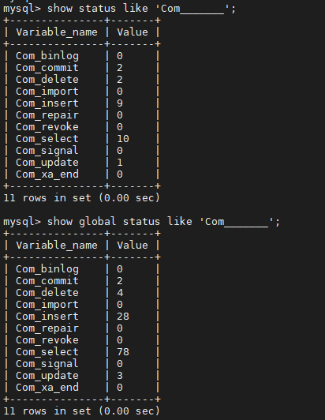

```
show status like 'Innodb_rows_%';

```

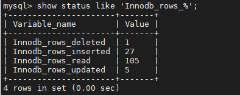

 | 参数 | 含义
 | Com_select | 执行 select 操作的次数，一次查询只累加 1。
 | Com_insert | 执行 INSERT 操作的次数，对于批量插入的 INSERT 操作，只累加一次。
 | Com_update | 执行 UPDATE 操作的次数。
 | Com_delete | 执行 DELETE 操作的次数。
 | Innodb_rows_read | select 查询返回的行数。
 | Innodb_rows_inserted | 执行 INSERT 操作插入的行数。
 | Innodb_rows_updated | 执行 UPDATE 操作更新的行数。
 | Innodb_rows_deleted | 执行 DELETE 操作删除的行数。
 | Connections | 试图连接 MySQL 服务器的次数。
 | Uptime | 服务器工作时间。
 | Slow_queries | 慢查询的次数。

Com_xxx 表示每个 xxx 语句执行的次数，我们通常比较关心的是以下几个统计参数。

Com_*** : 这些参数对于所有存储引擎的表操作都会进行累计。
 Innodb_*** : 这几个参数只是针对InnoDB 存储引擎的，累加的算法也略有不同。

## 2. 定位低效率执行 SQL

可以通过以下两种方式定位执行效率较低的 SQL 语句。

- 慢查询日志 : 通过慢查询日志定位那些执行效率较低的 SQL 语句，用--log-slow-queries[=file_name]选项启动时，mysqld 写一个包含所有执行时间超过 long_query_time 秒的 SQL 语句的日志文件。

- show processlist : 慢查询日志在查询结束以后才纪录，所以在应用反映执行效率出现问题的时候查询慢查询日志并不能定位问题，可以使用show processlist命令查看当前MySQL在进行的线程，包括线程的状态、是否锁表等，可以实时地查看 SQL 的执行情况，同时对一些锁表操作进行优化。
 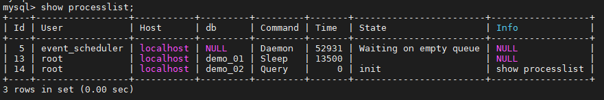

```
1） id列，用户登录mysql时，系统分配的"connection_id"，可以使用函数connection_id()查看

2） user列，显示当前用户。如果不是root，这个命令就只显示用户权限范围的sql语句

3） host列，显示这个语句是从哪个ip的哪个端口上发的，可以用来跟踪出现问题语句的用户

4） db列，显示这个进程目前连接的是哪个数据库

5） command列，显示当前连接的执行的命令，一般取值为休眠（sleep），查询（query），连接（connect）等

6） time列，显示这个状态持续的时间，单位是秒

7） state列，显示使用当前连接的sql语句的状态，很重要的列。state描述的是语句执行中的某一个状态。一个sql语句，以查询为例，可能需要经过copying to tmp table、sorting result、sending data等状态才可以完成

8） info列，显示这个sql语句，是判断问题语句的一个重要依据

```

## 3. explain 分析执行计划

通过以上步骤查询到效率低的 SQL 语句后，可以通过 EXPLAIN或者 DESC命令获取 MySQL如何执行 SELECT 语句的信息，包括在 SELECT 语句执行过程中表如何连接和连接的顺序。
 查询SQL语句的执行计划 ：

```
explain  select * from tb_item where id = 1;

```

```
explain  select * from tb_item where title = '阿尔卡特 (OT-979) 冰川白 联通3G手机3';

```

 | 字段 | 含义
 | id | select查询的序列号，是一组数字，表示的是查询中执行select子句或者是操作表的顺序。
 | select_type | 表示 SELECT 的类型，常见的取值有 SIMPLE（简单表，即不使用表连接或者子查询）、PRIMARY（主查询，即外层的查询）、UNION（UNION 中的第二个或者后面的查询语句）、SUBQUERY（子查询中的第一个 SELECT）等
 | table | 输出结果集的表
 | type | 表示表的连接类型，性能由好到差的连接类型为( system ---> const -----> eq_ref ------> ref -------> ref_or_null----> index_merge ---> index_subquery -----> range -----> index ------> all )
 | possible_keys | 表示查询时，可能使用的索引
 | key | 表示实际使用的索引
 | key_len | 索引字段的长度
 | rows | 扫描行的数量
 | extra | 执行情况的说明和描述

### 3.1. 环境准备

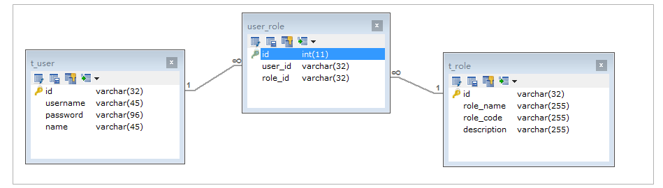

```
CREATE TABLE `t_role` (
  `id` varchar(32) NOT NULL,
  `role_name` varchar(255) DEFAULT NULL,
  `role_code` varchar(255) DEFAULT NULL,
  `description` varchar(255) DEFAULT NULL,
  PRIMARY KEY (`id`),
  UNIQUE KEY `unique_role_name` (`role_name`)
) ENGINE=InnoDB DEFAULT CHARSET=utf8;

CREATE TABLE `t_user` (
  `id` varchar(32) NOT NULL,
  `username` varchar(45) NOT NULL,
  `password` varchar(96) NOT NULL,
  `name` varchar(45) NOT NULL,
  PRIMARY KEY (`id`),
  UNIQUE KEY `unique_user_username` (`username`)
) ENGINE=InnoDB DEFAULT CHARSET=utf8;

CREATE TABLE `user_role` (
  `id` int(11) NOT NULL auto_increment ,
  `user_id` varchar(32) DEFAULT NULL,
  `role_id` varchar(32) DEFAULT NULL,
  PRIMARY KEY (`id`),
  KEY `fk_ur_user_id` (`user_id`),
  KEY `fk_ur_role_id` (`role_id`),
  CONSTRAINT `fk_ur_role_id` FOREIGN KEY (`role_id`) REFERENCES `t_role` (`id`) ON DELETE NO ACTION ON UPDATE NO ACTION,
  CONSTRAINT `fk_ur_user_id` FOREIGN KEY (`user_id`) REFERENCES `t_user` (`id`) ON DELETE NO ACTION ON UPDATE NO ACTION
) ENGINE=InnoDB DEFAULT CHARSET=utf8;

insert into `t_user` (`id`, `username`, `password`, `name`) values('1','super','$2a$10$TJ4TmCdK.X4wv/tCqHW14.w70U3CC33CeVncD3SLmyMXMknstqKRe','超级管理员');
insert into `t_user` (`id`, `username`, `password`, `name`) values('2','admin','$2a$10$TJ4TmCdK.X4wv/tCqHW14.w70U3CC33CeVncD3SLmyMXMknstqKRe','系统管理员');
insert into `t_user` (`id`, `username`, `password`, `name`) values('3','itcast','$2a$10$8qmaHgUFUAmPR5pOuWhYWOr291WJYjHelUlYn07k5ELF8ZCrW0Cui','test02');
insert into `t_user` (`id`, `username`, `password`, `name`) values('4','stu1','$2a$10$pLtt2KDAFpwTWLjNsmTEi.oU1yOZyIn9XkziK/y/spH5rftCpUMZa','学生1');
insert into `t_user` (`id`, `username`, `password`, `name`) values('5','stu2','$2a$10$nxPKkYSez7uz2YQYUnwhR.z57km3yqKn3Hr/p1FR6ZKgc18u.Tvqm','学生2');
insert into `t_user` (`id`, `username`, `password`, `name`) values('6','t1','$2a$10$TJ4TmCdK.X4wv/tCqHW14.w70U3CC33CeVncD3SLmyMXMknstqKRe','老师1');

INSERT INTO `t_role` (`id`, `role_name`, `role_code`, `description`) VALUES('5','学生','student','学生');
INSERT INTO `t_role` (`id`, `role_name`, `role_code`, `description`) VALUES('7','老师','teacher','老师');
INSERT INTO `t_role` (`id`, `role_name`, `role_code`, `description`) VALUES('8','教学管理员','teachmanager','教学管理员');
INSERT INTO `t_role` (`id`, `role_name`, `role_code`, `description`) VALUES('9','管理员','admin','管理员');
INSERT INTO `t_role` (`id`, `role_name`, `role_code`, `description`) VALUES('10','超级管理员','super','超级管理员');

INSERT INTO user_role(id,user_id,role_id) VALUES(NULL, '1', '5'),(NULL, '1', '7'),(NULL, '2', '8'),(NULL, '3', '9'),(NULL, '4', '8'),(NULL, '5', '10') ;

```

### 3.2. explain 之 id

id 字段是 select查询的序列号，是一组数字，表示的是查询中执行select子句或者是操作表的顺序。id 情况有三种 ：
 1） id 相同表示加载表的顺序是从上到下。

```
explain select * from t_role r, t_user u, user_role ur where r.id = ur.role_id and u.id = ur.user_id ;

```

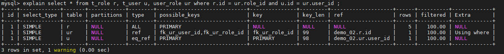

2） id 不同id值越大，优先级越高，越先被执行。

```
EXPLAIN SELECT * FROM t_role WHERE id = (SELECT role_id FROM user_role WHERE user_id = (SELECT id FROM t_user WHERE username = 'stu1'));

```

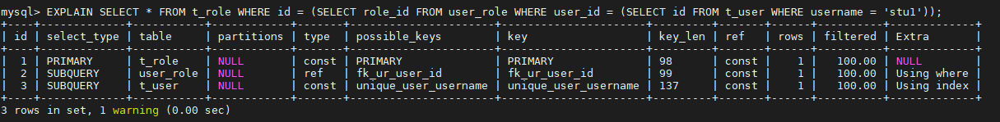

3） id 有相同，也有不同，同时存在。id相同的可以认为是一组，从上往下顺序执行；在所有的组中，id的值越大，优先级越高，越先执行。

```
EXPLAIN SELECT * FROM t_role r , (SELECT * FROM user_role ur WHERE ur.`user_id` = '2') a WHERE r.id = a.role_id;

```

MySQL8+ 执行结果：（原因暂不清楚）
 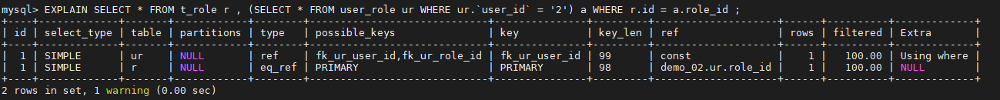
 MySQL5+ 执行结果：
 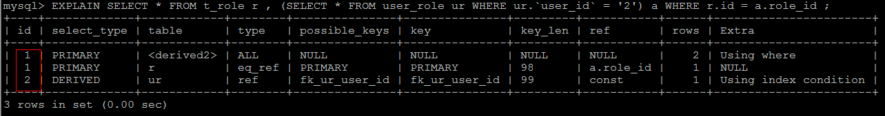

### 3.3. explain 之 select_type

表示 SELECT 的类型，常见的取值，如下表所示：

 | select_type | 含义
 | SIMPLE | 简单的select查询，查询中不包含子查询或者UNION
 | PRIMARY | 查询中若包含任何复杂的子查询，最外层查询标记为该标识
 | SUBQUERY | 在SELECT 或 WHERE 列表中包含了子查询
 | DERIVED | 在FROM 列表中包含的子查询，被标记为 DERIVED（衍生） MYSQL会递归执行这些子查询，把结果放在临时表中
 | UNION | 若第二个SELECT出现在UNION之后，则标记为UNION ； 若UNION包含在FROM子句的子查询中，外层SELECT将被标记为 ： DERIVED
 | UNION RESULT | 从UNION表获取结果的SELECT

**注：** 表格从上往下效率越来越低。

### 3.4. explain 之 table

展示这一行的数据是关于哪一张表的

### 3.5. explain 之 type

type 显示的是访问类型，是较为重要的一个指标，可取值为：

 | type | 含义 | eg
 | NULL | MySQL不访问任何表，索引，直接返回结果 | explain select now();
 | system | 表只有一行记录(等于系统表)，这是const类型的特例，一般不会出现 |
 | const | 表示通过索引一次就找到了，const 用于比较primary key 或者 unique 索引。因为只匹配一行数据，所以很快。如将主键置于where列表中，MySQL 就能将该查询转换为一个常亮。const于将 "主键" 或 "唯一" 索引的所有部分与常量值进行比较 | explain select * from t_user where ;
 | eq_ref | 类似ref，区别在于使用的是唯一索引，使用主键的关联查询，关联查询出的记录只有一条。常见于主键或唯一索引扫描 | explain select * from t_user u, t_role r where u.id = r.id;
 | ref | 非唯一性索引扫描，返回匹配某个单独值的所有行。本质上也是一种索引访问，返回所有匹配某个单独值的所有行（多个） | create index idx_user_name on t_user(name);show index from t_user;explain select * from t_user where name = 'a';
 | range | 只检索给定返回的行，使用一个索引来选择行。 where 之后出现 between ， < , > , in 等操作。 |
 | index | index 与 ALL的区别为 index 类型只是遍历了索引树， 通常比ALL 快， ALL 是遍历数据文件。 | explain select id from t_user;
 | all | 将遍历全表以找到匹配的行 | explain select * from t_user;

结果值从最好到最坏以此是：

```
NULL > system > const > eq_ref > ref > fulltext > ref_or_null > index_merge > unique_subquery > index_subquery > range > index > ALL

system > const > eq_ref > ref > range > index > ALL

```

==一般来说， 我们需要保证查询至少达到 range 级别， 最好达到ref 。==

### 3.6. explain 之 key

- possible_keys : 显示可能应用在这张表的索引， 一个或多个。

- key ： 实际使用的索引， 如果为NULL， 则没有使用索引。

- key_len : 表示索引中使用的字节数， 该值为索引字段最大可能长度，并非实际使用长度，在不损失精确性的前提下， 长度越短越好 。

### 3.7. explain 之 rows

扫描行的数量。

### 3.8. explain 之 extra

其他的额外的执行计划信息，在该列展示 。(前两行需要优化)

 | extra | 含义 | 优化建议 | eg
 | using filesort | 说明mysql会对数据使用一个外部的索引排序，而不是按照表内的索引顺序进行读取， 称为 “文件排序”, 效率低。 | 建立索引 | explain select * from t_user order by password;
 | using temporary | 使用了临时表保存中间结果，MySQL在对查询结果排序时使用临时表。常见于 order by 和 group by； 效率低 |  | explain select count(*), password from t_user group by password;
 | using index | 表示相应的select操作使用了覆盖索引， 避免访问表的数据行， 效率不错。 |  | explain select name from t_user order by name;

## 4. show profile 分析 SQL

Mysql从5.0.37版本开始增加了对 show profiles 和 show profile 语句的支持。show profiles 能够在做SQL优化时帮助我们了解时间都耗费到哪里去了。
 通过 have_profiling 参数，能够看到当前MySQL是否支持profile：
 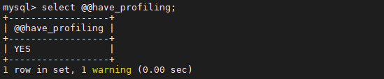
 **tips:** @@ 获取系统变量，结果为 YES，代表支持 profile
 默认profiling是关闭的，可以通过set语句在Session级别开启profiling：

```
set profiling=1; //开启profiling 开关；

```

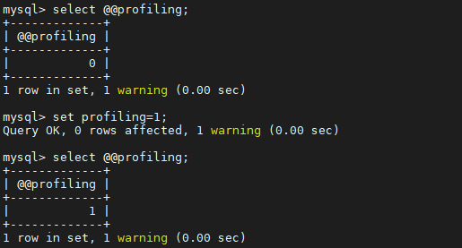

通过profile，我们能够更清楚地了解SQL执行的过程。
 首先，我们可以执行一系列的操作，如下图所示：

```
show databases;
use demo_02;
select * from t_user;
select count(*) from t_user;
select * from t_user where name = 'a';
show profiles;

```

执行完上述命令之后，再执行show profiles 指令， 来查看SQL语句执行的耗时：
 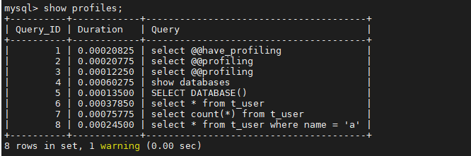

通过show profile for query query_id 语句可以查看到该SQL执行过程中每个线程的状态和消耗的时间：
 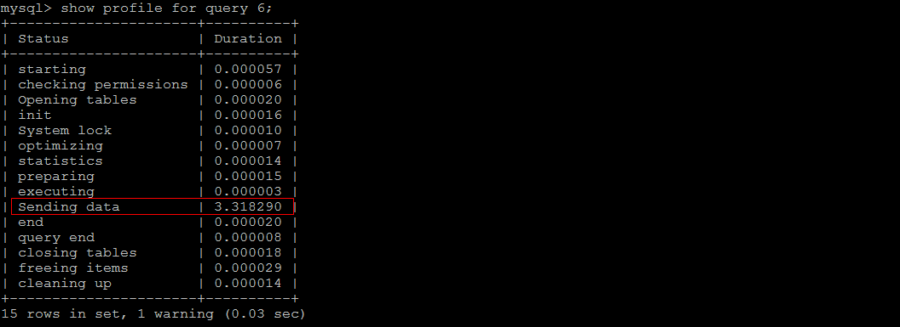
 **TIP：** Sending data 状态表示MySQL线程开始访问数据行并把结果返回给客户端，而不仅仅是返回个客户端。由于在Sending data状态下，MySQL线程往往需要做大量的磁盘读取操作，所以经常是整各查询中耗时最长的状态。

在获取到最消耗时间的线程状态后，MySQL支持进一步选择all、cpu、block io 、context switch、page faults等明细类型类查看MySQL在使用什么资源上耗费了过高的时间。例如，选择查看CPU的耗费时间 ：
 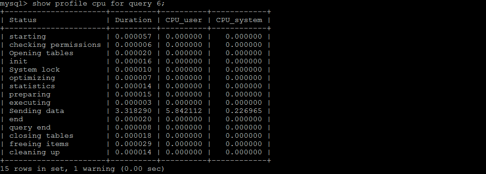

```
show profile all from query 6; -- 查询所有信息

```

 | 字段 | 含义
 | Status | sql 语句执行的状态
 | Duration | sql 执行过程中每一个步骤的耗时
 | CPU_user | 当前用户占有的cpu
 | CPU_system | 系统占有的cpu
 | ... | ...

## 5. trace 分析优化器执行计划

%23%20%E4%BC%98%E5%8C%96%20SQL%20%E6%AD%A5%E9%AA%A4%0A%E5%9C%A8%E5%BA%94%E7%94%A8%E7%9A%84%E7%9A%84%E5%BC%80%E5%8F%91%E8%BF%87%E7%A8%8B%E4%B8%AD%EF%BC%8C%E7%94%B1%E4%BA%8E%E5%88%9D%E6%9C%9F%E6%95%B0%E6%8D%AE%E9%87%8F%E5%B0%8F%EF%BC%8C%E5%BC%80%E5%8F%91%E4%BA%BA%E5%91%98%E5%86%99%20SQL%20%E8%AF%AD%E5%8F%A5%E6%97%B6%E6%9B%B4%E9%87%8D%E8%A7%86%E5%8A%9F%E8%83%BD%E4%B8%8A%E7%9A%84%E5%AE%9E%E7%8E%B0%EF%BC%8C%E4%BD%86%E6%98%AF%E5%BD%93%E5%BA%94%E7%94%A8%E7%B3%BB%E7%BB%9F%E6%AD%A3%E5%BC%8F%E4%B8%8A%E7%BA%BF%E5%90%8E%EF%BC%8C%E9%9A%8F%E7%9D%80%E7%94%9F%E4%BA%A7%E6%95%B0%E6%8D%AE%E9%87%8F%E7%9A%84%E6%80%A5%E5%89%A7%E5%A2%9E%E9%95%BF%EF%BC%8C%E5%BE%88%E5%A4%9A%20SQL%20%E8%AF%AD%E5%8F%A5%E5%BC%80%E5%A7%8B%E9%80%90%E6%B8%90%E6%98%BE%E9%9C%B2%E5%87%BA%E6%80%A7%E8%83%BD%E9%97%AE%E9%A2%98%EF%BC%8C%E5%AF%B9%E7%94%9F%E4%BA%A7%E7%9A%84%E5%BD%B1%E5%93%8D%E4%B9%9F%E8%B6%8A%E6%9D%A5%E8%B6%8A%E5%A4%A7%EF%BC%8C%E6%AD%A4%E6%97%B6%E8%BF%99%E4%BA%9B%E6%9C%89%E9%97%AE%E9%A2%98%E7%9A%84%20SQL%20%E8%AF%AD%E5%8F%A5%E5%B0%B1%E6%88%90%E4%B8%BA%E6%95%B4%E4%B8%AA%E7%B3%BB%E7%BB%9F%E6%80%A7%E8%83%BD%E7%9A%84%E7%93%B6%E9%A2%88%EF%BC%8C%E5%9B%A0%E6%AD%A4%E6%88%91%E4%BB%AC%E5%BF%85%E9%A1%BB%E8%A6%81%E5%AF%B9%E5%AE%83%E4%BB%AC%E8%BF%9B%E8%A1%8C%E4%BC%98%E5%8C%96%EF%BC%8C%E6%9C%AC%E7%AB%A0%E5%B0%86%E8%AF%A6%E7%BB%86%E4%BB%8B%E7%BB%8D%E5%9C%A8%20MySQL%20%E4%B8%AD%E4%BC%98%E5%8C%96%20SQL%20%E8%AF%AD%E5%8F%A5%E7%9A%84%E6%96%B9%E6%B3%95%E3%80%82%0A%0A%E5%BD%93%E9%9D%A2%E5%AF%B9%E4%B8%80%E4%B8%AA%E6%9C%89%20SQL%20%E6%80%A7%E8%83%BD%E9%97%AE%E9%A2%98%E7%9A%84%E6%95%B0%E6%8D%AE%E5%BA%93%E6%97%B6%EF%BC%8C%E6%88%91%E4%BB%AC%E5%BA%94%E8%AF%A5%E4%BB%8E%E4%BD%95%E5%A4%84%E5%85%A5%E6%89%8B%E6%9D%A5%E8%BF%9B%E8%A1%8C%E7%B3%BB%E7%BB%9F%E7%9A%84%E5%88%86%E6%9E%90%EF%BC%8C%E4%BD%BF%E5%BE%97%E8%83%BD%E5%A4%9F%E5%B0%BD%E5%BF%AB%E5%AE%9A%E4%BD%8D%E9%97%AE%E9%A2%98%20SQL%20%E5%B9%B6%E5%B0%BD%E5%BF%AB%E8%A7%A3%E5%86%B3%E9%97%AE%E9%A2%98%E3%80%82%0A%0A%23%23%201.%20%E6%9F%A5%E7%9C%8B%20SQL%20%E6%89%A7%E8%A1%8C%E9%A2%91%E7%8E%87%0AMySQL%20%E5%AE%A2%E6%88%B7%E7%AB%AF%E8%BF%9E%E6%8E%A5%E6%88%90%E5%8A%9F%E5%90%8E%EF%BC%8C%E9%80%9A%E8%BF%87%20show%20%5Bsession%7Cglobal%5D%20status%20%E5%91%BD%E4%BB%A4%E5%8F%AF%E4%BB%A5%E6%8F%90%E4%BE%9B%E6%9C%8D%E5%8A%A1%E5%99%A8%E7%8A%B6%E6%80%81%E4%BF%A1%E6%81%AF%E3%80%82show%20%5Bsession%7Cglobal%5D%20status%20%E5%8F%AF%E4%BB%A5%E6%A0%B9%E6%8D%AE%E9%9C%80%E8%A6%81%E5%8A%A0%E4%B8%8A%E5%8F%82%E6%95%B0%E2%80%9Csession%E2%80%9D%E6%88%96%E8%80%85%E2%80%9Cglobal%E2%80%9D%E6%9D%A5%E6%98%BE%E7%A4%BA%20session%20%E7%BA%A7%EF%BC%88%E5%BD%93%E5%89%8D%E8%BF%9E%E6%8E%A5%EF%BC%89%E7%9A%84%E8%AE%A1%E7%BB%93%E6%9E%9C%E5%92%8C%20global%20%E7%BA%A7%EF%BC%88%E8%87%AA%E6%95%B0%E6%8D%AE%E5%BA%93%E4%B8%8A%E6%AC%A1%E5%90%AF%E5%8A%A8%E8%87%B3%E4%BB%8A%EF%BC%89%E7%9A%84%E7%BB%9F%E8%AE%A1%E7%BB%93%E6%9E%9C%E3%80%82%E5%A6%82%E6%9E%9C%E4%B8%8D%E5%86%99%EF%BC%8C%E9%BB%98%E8%AE%A4%E4%BD%BF%E7%94%A8%E5%8F%82%E6%95%B0%E6%98%AF%E2%80%9Csession%E2%80%9D%E3%80%82%0A%E4%B8%8B%E9%9D%A2%E7%9A%84%E5%91%BD%E4%BB%A4%E6%98%BE%E7%A4%BA%E4%BA%86%E5%BD%93%E5%89%8D%20session%20%E4%B8%AD%E6%89%80%E6%9C%89%E7%BB%9F%E8%AE%A1%E5%8F%82%E6%95%B0%E7%9A%84%E5%80%BC%EF%BC%9A%0A%60%60%60sql%0Ashow%20status%20like%20'Com_______'%3B%0Ashow%20global%20status%20like%20'Com_______'%3B%0A%60%60%60%0A!%5Bd7e7474663226c81e1521081561a93ec.png%5D(en-resource%3A%2F%2Fdatabase%2F4226%3A0)%0A%0A%60%60%60sql%0Ashow%20status%20like%20'Innodb_rows_%25'%3B%0A%60%60%60%0A!%5B4fa3b57877647294bdb9cb6b0c47857a.png%5D(en-resource%3A%2F%2Fdatabase%2F4228%3A0)%0A%0A%7C%20%E5%8F%82%E6%95%B0%20%20%20%20%20%20%20%20%20%20%20%20%20%20%20%20%20%7C%20%E5%90%AB%E4%B9%89%20%20%20%20%20%20%20%20%20%20%20%20%20%20%20%20%20%20%20%20%20%20%20%20%20%20%20%20%20%20%20%20%20%20%20%20%20%20%20%20%20%20%20%20%20%20%20%20%20%20%20%20%20%20%20%20%20%7C%0A%7C%20%3A-------------------%20%7C%20------------------------------------------------------------%20%7C%0A%7C%20Com_select%20%20%20%20%20%20%20%20%20%20%20%7C%20%E6%89%A7%E8%A1%8C%20select%20%E6%93%8D%E4%BD%9C%E7%9A%84%E6%AC%A1%E6%95%B0%EF%BC%8C%E4%B8%80%E6%AC%A1%E6%9F%A5%E8%AF%A2%E5%8F%AA%E7%B4%AF%E5%8A%A0%201%E3%80%82%20%20%20%20%20%20%20%20%20%20%20%20%20%20%20%20%20%20%20%7C%0A%7C%20Com_insert%20%20%20%20%20%20%20%20%20%20%20%7C%20%E6%89%A7%E8%A1%8C%20INSERT%20%E6%93%8D%E4%BD%9C%E7%9A%84%E6%AC%A1%E6%95%B0%EF%BC%8C%E5%AF%B9%E4%BA%8E%E6%89%B9%E9%87%8F%E6%8F%92%E5%85%A5%E7%9A%84%20INSERT%20%E6%93%8D%E4%BD%9C%EF%BC%8C%E5%8F%AA%E7%B4%AF%E5%8A%A0%E4%B8%80%E6%AC%A1%E3%80%82%20%7C%0A%7C%20Com_update%20%20%20%20%20%20%20%20%20%20%20%7C%20%E6%89%A7%E8%A1%8C%20UPDATE%20%E6%93%8D%E4%BD%9C%E7%9A%84%E6%AC%A1%E6%95%B0%E3%80%82%20%20%20%20%20%20%20%20%20%20%20%20%20%20%20%20%20%20%20%20%20%20%20%20%20%20%20%20%20%20%20%20%20%20%20%20%20%7C%0A%7C%20Com_delete%20%20%20%20%20%20%20%20%20%20%20%7C%20%E6%89%A7%E8%A1%8C%20DELETE%20%E6%93%8D%E4%BD%9C%E7%9A%84%E6%AC%A1%E6%95%B0%E3%80%82%20%20%20%20%20%20%20%20%20%20%20%20%20%20%20%20%20%20%20%20%20%20%20%20%20%20%20%20%20%20%20%20%20%20%20%20%20%7C%0A%7C%20Innodb_rows_read%20%20%20%20%20%7C%20select%20%E6%9F%A5%E8%AF%A2%E8%BF%94%E5%9B%9E%E7%9A%84%E8%A1%8C%E6%95%B0%E3%80%82%20%20%20%20%20%20%20%20%20%20%20%20%20%20%20%20%20%20%20%20%20%20%20%20%20%20%20%20%20%20%20%20%20%20%20%20%20%20%7C%0A%7C%20Innodb_rows_inserted%20%7C%20%E6%89%A7%E8%A1%8C%20INSERT%20%E6%93%8D%E4%BD%9C%E6%8F%92%E5%85%A5%E7%9A%84%E8%A1%8C%E6%95%B0%E3%80%82%20%20%20%20%20%20%20%20%20%20%20%20%20%20%20%20%20%20%20%20%20%20%20%20%20%20%20%20%20%20%20%20%20%7C%0A%7C%20Innodb_rows_updated%20%20%7C%20%E6%89%A7%E8%A1%8C%20UPDATE%20%E6%93%8D%E4%BD%9C%E6%9B%B4%E6%96%B0%E7%9A%84%E8%A1%8C%E6%95%B0%E3%80%82%20%20%20%20%20%20%20%20%20%20%20%20%20%20%20%20%20%20%20%20%20%20%20%20%20%20%20%20%20%20%20%20%20%7C%0A%7C%20Innodb_rows_deleted%20%20%7C%20%E6%89%A7%E8%A1%8C%20DELETE%20%E6%93%8D%E4%BD%9C%E5%88%A0%E9%99%A4%E7%9A%84%E8%A1%8C%E6%95%B0%E3%80%82%20%20%20%20%20%20%20%20%20%20%20%20%20%20%20%20%20%20%20%20%20%20%20%20%20%20%20%20%20%20%20%20%20%7C%0A%7C%20Connections%20%20%20%20%20%20%20%20%20%20%7C%20%E8%AF%95%E5%9B%BE%E8%BF%9E%E6%8E%A5%20MySQL%20%E6%9C%8D%E5%8A%A1%E5%99%A8%E7%9A%84%E6%AC%A1%E6%95%B0%E3%80%82%20%20%20%20%20%20%20%20%20%20%20%20%20%20%20%20%20%20%20%20%20%20%20%20%20%20%20%20%20%20%20%20%7C%0A%7C%20Uptime%20%20%20%20%20%20%20%20%20%20%20%20%20%20%20%7C%20%E6%9C%8D%E5%8A%A1%E5%99%A8%E5%B7%A5%E4%BD%9C%E6%97%B6%E9%97%B4%E3%80%82%20%20%20%20%20%20%20%20%20%20%20%20%20%20%20%20%20%20%20%20%20%20%20%20%20%20%20%20%20%20%20%20%20%20%20%20%20%20%20%20%20%20%20%20%20%7C%0A%7C%20Slow_queries%20%20%20%20%20%20%20%20%20%7C%20%E6%85%A2%E6%9F%A5%E8%AF%A2%E7%9A%84%E6%AC%A1%E6%95%B0%E3%80%82%20%20%20%20%20%20%20%20%20%20%20%20%20%20%20%20%20%20%20%20%20%20%20%20%20%20%20%20%20%20%20%20%20%20%20%20%20%20%20%20%20%20%20%20%20%20%20%7C%0A%0ACom_xxx%20%E8%A1%A8%E7%A4%BA%E6%AF%8F%E4%B8%AA%20xxx%20%E8%AF%AD%E5%8F%A5%E6%89%A7%E8%A1%8C%E7%9A%84%E6%AC%A1%E6%95%B0%EF%BC%8C%E6%88%91%E4%BB%AC%E9%80%9A%E5%B8%B8%E6%AF%94%E8%BE%83%E5%85%B3%E5%BF%83%E7%9A%84%E6%98%AF%E4%BB%A5%E4%B8%8B%E5%87%A0%E4%B8%AA%E7%BB%9F%E8%AE%A1%E5%8F%82%E6%95%B0%E3%80%82%0A%0ACom_***%20%3A%20%E8%BF%99%E4%BA%9B%E5%8F%82%E6%95%B0%E5%AF%B9%E4%BA%8E%E6%89%80%E6%9C%89%E5%AD%98%E5%82%A8%E5%BC%95%E6%93%8E%E7%9A%84%E8%A1%A8%E6%93%8D%E4%BD%9C%E9%83%BD%E4%BC%9A%E8%BF%9B%E8%A1%8C%E7%B4%AF%E8%AE%A1%E3%80%82%0AInnodb_***%20%3A%20%E8%BF%99%E5%87%A0%E4%B8%AA%E5%8F%82%E6%95%B0%E5%8F%AA%E6%98%AF%E9%92%88%E5%AF%B9InnoDB%20%E5%AD%98%E5%82%A8%E5%BC%95%E6%93%8E%E7%9A%84%EF%BC%8C%E7%B4%AF%E5%8A%A0%E7%9A%84%E7%AE%97%E6%B3%95%E4%B9%9F%E7%95%A5%E6%9C%89%E4%B8%8D%E5%90%8C%E3%80%82%0A%0A%23%23%202.%20%E5%AE%9A%E4%BD%8D%E4%BD%8E%E6%95%88%E7%8E%87%E6%89%A7%E8%A1%8C%20SQL%0A%E5%8F%AF%E4%BB%A5%E9%80%9A%E8%BF%87%E4%BB%A5%E4%B8%8B%E4%B8%A4%E7%A7%8D%E6%96%B9%E5%BC%8F%E5%AE%9A%E4%BD%8D%E6%89%A7%E8%A1%8C%E6%95%88%E7%8E%87%E8%BE%83%E4%BD%8E%E7%9A%84%20SQL%20%E8%AF%AD%E5%8F%A5%E3%80%82%0A-%20%E6%85%A2%E6%9F%A5%E8%AF%A2%E6%97%A5%E5%BF%97%20%3A%20%E9%80%9A%E8%BF%87%E6%85%A2%E6%9F%A5%E8%AF%A2%E6%97%A5%E5%BF%97%E5%AE%9A%E4%BD%8D%E9%82%A3%E4%BA%9B%E6%89%A7%E8%A1%8C%E6%95%88%E7%8E%87%E8%BE%83%E4%BD%8E%E7%9A%84%20SQL%20%E8%AF%AD%E5%8F%A5%EF%BC%8C%E7%94%A8--log-slow-queries%5B%3Dfile_name%5D%E9%80%89%E9%A1%B9%E5%90%AF%E5%8A%A8%E6%97%B6%EF%BC%8Cmysqld%20%E5%86%99%E4%B8%80%E4%B8%AA%E5%8C%85%E5%90%AB%E6%89%80%E6%9C%89%E6%89%A7%E8%A1%8C%E6%97%B6%E9%97%B4%E8%B6%85%E8%BF%87%20long_query_time%20%E7%A7%92%E7%9A%84%20SQL%20%E8%AF%AD%E5%8F%A5%E7%9A%84%E6%97%A5%E5%BF%97%E6%96%87%E4%BB%B6%E3%80%82%20%0A-%20show%20processlist%20%20%3A%20%E6%85%A2%E6%9F%A5%E8%AF%A2%E6%97%A5%E5%BF%97%E5%9C%A8%E6%9F%A5%E8%AF%A2%E7%BB%93%E6%9D%9F%E4%BB%A5%E5%90%8E%E6%89%8D%E7%BA%AA%E5%BD%95%EF%BC%8C%E6%89%80%E4%BB%A5%E5%9C%A8%E5%BA%94%E7%94%A8%E5%8F%8D%E6%98%A0%E6%89%A7%E8%A1%8C%E6%95%88%E7%8E%87%E5%87%BA%E7%8E%B0%E9%97%AE%E9%A2%98%E7%9A%84%E6%97%B6%E5%80%99%E6%9F%A5%E8%AF%A2%E6%85%A2%E6%9F%A5%E8%AF%A2%E6%97%A5%E5%BF%97%E5%B9%B6%E4%B8%8D%E8%83%BD%E5%AE%9A%E4%BD%8D%E9%97%AE%E9%A2%98%EF%BC%8C%E5%8F%AF%E4%BB%A5%E4%BD%BF%E7%94%A8show%20processlist%E5%91%BD%E4%BB%A4%E6%9F%A5%E7%9C%8B%E5%BD%93%E5%89%8DMySQL%E5%9C%A8%E8%BF%9B%E8%A1%8C%E7%9A%84%E7%BA%BF%E7%A8%8B%EF%BC%8C%E5%8C%85%E6%8B%AC%E7%BA%BF%E7%A8%8B%E7%9A%84%E7%8A%B6%E6%80%81%E3%80%81%E6%98%AF%E5%90%A6%E9%94%81%E8%A1%A8%E7%AD%89%EF%BC%8C%E5%8F%AF%E4%BB%A5%E5%AE%9E%E6%97%B6%E5%9C%B0%E6%9F%A5%E7%9C%8B%20SQL%20%E7%9A%84%E6%89%A7%E8%A1%8C%E6%83%85%E5%86%B5%EF%BC%8C%E5%90%8C%E6%97%B6%E5%AF%B9%E4%B8%80%E4%BA%9B%E9%94%81%E8%A1%A8%E6%93%8D%E4%BD%9C%E8%BF%9B%E8%A1%8C%E4%BC%98%E5%8C%96%E3%80%82%0A!%5B6a58bec1215889c488f62f02c1e6c3b3.png%5D(en-resource%3A%2F%2Fdatabase%2F4230%3A0)%0A%60%60%60%0A1%EF%BC%89%20id%E5%88%97%EF%BC%8C%E7%94%A8%E6%88%B7%E7%99%BB%E5%BD%95mysql%E6%97%B6%EF%BC%8C%E7%B3%BB%E7%BB%9F%E5%88%86%E9%85%8D%E7%9A%84%22connection_id%22%EF%BC%8C%E5%8F%AF%E4%BB%A5%E4%BD%BF%E7%94%A8%E5%87%BD%E6%95%B0connection_id()%E6%9F%A5%E7%9C%8B%0A%0A2%EF%BC%89%20user%E5%88%97%EF%BC%8C%E6%98%BE%E7%A4%BA%E5%BD%93%E5%89%8D%E7%94%A8%E6%88%B7%E3%80%82%E5%A6%82%E6%9E%9C%E4%B8%8D%E6%98%AFroot%EF%BC%8C%E8%BF%99%E4%B8%AA%E5%91%BD%E4%BB%A4%E5%B0%B1%E5%8F%AA%E6%98%BE%E7%A4%BA%E7%94%A8%E6%88%B7%E6%9D%83%E9%99%90%E8%8C%83%E5%9B%B4%E7%9A%84sql%E8%AF%AD%E5%8F%A5%0A%0A3%EF%BC%89%20host%E5%88%97%EF%BC%8C%E6%98%BE%E7%A4%BA%E8%BF%99%E4%B8%AA%E8%AF%AD%E5%8F%A5%E6%98%AF%E4%BB%8E%E5%93%AA%E4%B8%AAip%E7%9A%84%E5%93%AA%E4%B8%AA%E7%AB%AF%E5%8F%A3%E4%B8%8A%E5%8F%91%E7%9A%84%EF%BC%8C%E5%8F%AF%E4%BB%A5%E7%94%A8%E6%9D%A5%E8%B7%9F%E8%B8%AA%E5%87%BA%E7%8E%B0%E9%97%AE%E9%A2%98%E8%AF%AD%E5%8F%A5%E7%9A%84%E7%94%A8%E6%88%B7%0A%0A4%EF%BC%89%20db%E5%88%97%EF%BC%8C%E6%98%BE%E7%A4%BA%E8%BF%99%E4%B8%AA%E8%BF%9B%E7%A8%8B%E7%9B%AE%E5%89%8D%E8%BF%9E%E6%8E%A5%E7%9A%84%E6%98%AF%E5%93%AA%E4%B8%AA%E6%95%B0%E6%8D%AE%E5%BA%93%0A%0A5%EF%BC%89%20command%E5%88%97%EF%BC%8C%E6%98%BE%E7%A4%BA%E5%BD%93%E5%89%8D%E8%BF%9E%E6%8E%A5%E7%9A%84%E6%89%A7%E8%A1%8C%E7%9A%84%E5%91%BD%E4%BB%A4%EF%BC%8C%E4%B8%80%E8%88%AC%E5%8F%96%E5%80%BC%E4%B8%BA%E4%BC%91%E7%9C%A0%EF%BC%88sleep%EF%BC%89%EF%BC%8C%E6%9F%A5%E8%AF%A2%EF%BC%88query%EF%BC%89%EF%BC%8C%E8%BF%9E%E6%8E%A5%EF%BC%88connect%EF%BC%89%E7%AD%89%0A%0A6%EF%BC%89%20time%E5%88%97%EF%BC%8C%E6%98%BE%E7%A4%BA%E8%BF%99%E4%B8%AA%E7%8A%B6%E6%80%81%E6%8C%81%E7%BB%AD%E7%9A%84%E6%97%B6%E9%97%B4%EF%BC%8C%E5%8D%95%E4%BD%8D%E6%98%AF%E7%A7%92%0A%0A7%EF%BC%89%20state%E5%88%97%EF%BC%8C%E6%98%BE%E7%A4%BA%E4%BD%BF%E7%94%A8%E5%BD%93%E5%89%8D%E8%BF%9E%E6%8E%A5%E7%9A%84sql%E8%AF%AD%E5%8F%A5%E7%9A%84%E7%8A%B6%E6%80%81%EF%BC%8C%E5%BE%88%E9%87%8D%E8%A6%81%E7%9A%84%E5%88%97%E3%80%82state%E6%8F%8F%E8%BF%B0%E7%9A%84%E6%98%AF%E8%AF%AD%E5%8F%A5%E6%89%A7%E8%A1%8C%E4%B8%AD%E7%9A%84%E6%9F%90%E4%B8%80%E4%B8%AA%E7%8A%B6%E6%80%81%E3%80%82%E4%B8%80%E4%B8%AAsql%E8%AF%AD%E5%8F%A5%EF%BC%8C%E4%BB%A5%E6%9F%A5%E8%AF%A2%E4%B8%BA%E4%BE%8B%EF%BC%8C%E5%8F%AF%E8%83%BD%E9%9C%80%E8%A6%81%E7%BB%8F%E8%BF%87copying%20to%20tmp%20table%E3%80%81sorting%20result%E3%80%81sending%20data%E7%AD%89%E7%8A%B6%E6%80%81%E6%89%8D%E5%8F%AF%E4%BB%A5%E5%AE%8C%E6%88%90%0A%0A8%EF%BC%89%20info%E5%88%97%EF%BC%8C%E6%98%BE%E7%A4%BA%E8%BF%99%E4%B8%AAsql%E8%AF%AD%E5%8F%A5%EF%BC%8C%E6%98%AF%E5%88%A4%E6%96%AD%E9%97%AE%E9%A2%98%E8%AF%AD%E5%8F%A5%E7%9A%84%E4%B8%80%E4%B8%AA%E9%87%8D%E8%A6%81%E4%BE%9D%E6%8D%AE%0A%60%60%60%0A%0A%23%23%203.%20explain%20%E5%88%86%E6%9E%90%E6%89%A7%E8%A1%8C%E8%AE%A1%E5%88%92%0A%E9%80%9A%E8%BF%87%E4%BB%A5%E4%B8%8A%E6%AD%A5%E9%AA%A4%E6%9F%A5%E8%AF%A2%E5%88%B0%E6%95%88%E7%8E%87%E4%BD%8E%E7%9A%84%20SQL%20%E8%AF%AD%E5%8F%A5%E5%90%8E%EF%BC%8C%E5%8F%AF%E4%BB%A5%E9%80%9A%E8%BF%87%20EXPLAIN%E6%88%96%E8%80%85%20DESC%E5%91%BD%E4%BB%A4%E8%8E%B7%E5%8F%96%20MySQL%E5%A6%82%E4%BD%95%E6%89%A7%E8%A1%8C%20SELECT%20%E8%AF%AD%E5%8F%A5%E7%9A%84%E4%BF%A1%E6%81%AF%EF%BC%8C%E5%8C%85%E6%8B%AC%E5%9C%A8%20SELECT%20%E8%AF%AD%E5%8F%A5%E6%89%A7%E8%A1%8C%E8%BF%87%E7%A8%8B%E4%B8%AD%E8%A1%A8%E5%A6%82%E4%BD%95%E8%BF%9E%E6%8E%A5%E5%92%8C%E8%BF%9E%E6%8E%A5%E7%9A%84%E9%A1%BA%E5%BA%8F%E3%80%82%0A%E6%9F%A5%E8%AF%A2SQL%E8%AF%AD%E5%8F%A5%E7%9A%84%E6%89%A7%E8%A1%8C%E8%AE%A1%E5%88%92%20%EF%BC%9A%0A%60%60%60sql%0Aexplain%20%20select%20*%20from%20tb_item%20where%20id%20%3D%201%3B%0A%60%60%60%0A%0A%60%60%60sql%0Aexplain%20%20select%20*%20from%20tb_item%20where%20title%20%3D%20'%E9%98%BF%E5%B0%94%E5%8D%A1%E7%89%B9%20(OT-979)%20%E5%86%B0%E5%B7%9D%E7%99%BD%20%E8%81%94%E9%80%9A3G%E6%89%8B%E6%9C%BA3'%3B%0A%60%60%60%0A%7C%20%E5%AD%97%E6%AE%B5%20%20%20%20%20%20%20%20%20%20%7C%20%E5%90%AB%E4%B9%89%20%20%20%20%20%20%20%20%20%20%20%20%20%20%20%20%20%20%20%20%20%20%20%20%20%20%20%20%20%20%20%20%20%20%20%20%20%20%20%20%20%20%20%20%20%20%20%20%20%20%20%20%20%20%20%20%20%7C%0A%7C%20-------------%20%7C%20------------------------------------------------------------%20%7C%0A%7C%20id%20%20%20%20%20%20%20%20%20%20%20%20%7C%20select%E6%9F%A5%E8%AF%A2%E7%9A%84%E5%BA%8F%E5%88%97%E5%8F%B7%EF%BC%8C%E6%98%AF%E4%B8%80%E7%BB%84%E6%95%B0%E5%AD%97%EF%BC%8C%E8%A1%A8%E7%A4%BA%E7%9A%84%E6%98%AF%E6%9F%A5%E8%AF%A2%E4%B8%AD%E6%89%A7%E8%A1%8Cselect%E5%AD%90%E5%8F%A5%E6%88%96%E8%80%85%E6%98%AF%E6%93%8D%E4%BD%9C%E8%A1%A8%E7%9A%84%E9%A1%BA%E5%BA%8F%E3%80%82%20%7C%0A%7C%20select_type%20%20%20%7C%20%E8%A1%A8%E7%A4%BA%20SELECT%20%E7%9A%84%E7%B1%BB%E5%9E%8B%EF%BC%8C%E5%B8%B8%E8%A7%81%E7%9A%84%E5%8F%96%E5%80%BC%E6%9C%89%20SIMPLE%EF%BC%88%E7%AE%80%E5%8D%95%E8%A1%A8%EF%BC%8C%E5%8D%B3%E4%B8%8D%E4%BD%BF%E7%94%A8%E8%A1%A8%E8%BF%9E%E6%8E%A5%E6%88%96%E8%80%85%E5%AD%90%E6%9F%A5%E8%AF%A2%EF%BC%89%E3%80%81PRIMARY%EF%BC%88%E4%B8%BB%E6%9F%A5%E8%AF%A2%EF%BC%8C%E5%8D%B3%E5%A4%96%E5%B1%82%E7%9A%84%E6%9F%A5%E8%AF%A2%EF%BC%89%E3%80%81UNION%EF%BC%88UNION%20%E4%B8%AD%E7%9A%84%E7%AC%AC%E4%BA%8C%E4%B8%AA%E6%88%96%E8%80%85%E5%90%8E%E9%9D%A2%E7%9A%84%E6%9F%A5%E8%AF%A2%E8%AF%AD%E5%8F%A5%EF%BC%89%E3%80%81SUBQUERY%EF%BC%88%E5%AD%90%E6%9F%A5%E8%AF%A2%E4%B8%AD%E7%9A%84%E7%AC%AC%E4%B8%80%E4%B8%AA%20SELECT%EF%BC%89%E7%AD%89%20%7C%0A%7C%20table%20%20%20%20%20%20%20%20%20%7C%20%E8%BE%93%E5%87%BA%E7%BB%93%E6%9E%9C%E9%9B%86%E7%9A%84%E8%A1%A8%20%20%20%20%20%20%20%20%20%20%20%20%20%20%20%20%20%20%20%20%20%20%20%20%20%20%20%20%20%20%20%20%20%20%20%20%20%20%20%20%20%20%20%20%20%20%20%7C%0A%7C%20type%20%20%20%20%20%20%20%20%20%20%7C%20%E8%A1%A8%E7%A4%BA%E8%A1%A8%E7%9A%84%E8%BF%9E%E6%8E%A5%E7%B1%BB%E5%9E%8B%EF%BC%8C%E6%80%A7%E8%83%BD%E7%94%B1%E5%A5%BD%E5%88%B0%E5%B7%AE%E7%9A%84%E8%BF%9E%E6%8E%A5%E7%B1%BB%E5%9E%8B%E4%B8%BA(%20system%20%20---%3E%20%20const%20%20-----%3E%20%20eq_ref%20%20------%3E%20%20ref%20%20-------%3E%20%20ref_or_null----%3E%20%20index_merge%20%20---%3E%20%20index_subquery%20%20-----%3E%20%20range%20%20-----%3E%20%20index%20%20------%3E%20all%20)%20%7C%0A%7C%20possible_keys%20%7C%20%E8%A1%A8%E7%A4%BA%E6%9F%A5%E8%AF%A2%E6%97%B6%EF%BC%8C%E5%8F%AF%E8%83%BD%E4%BD%BF%E7%94%A8%E7%9A%84%E7%B4%A2%E5%BC%95%20%20%20%20%20%20%20%20%20%20%20%20%20%20%20%20%20%20%20%20%20%20%20%20%20%20%20%20%20%20%20%20%20%20%20%7C%0A%7C%20key%20%20%20%20%20%20%20%20%20%20%20%7C%20%E8%A1%A8%E7%A4%BA%E5%AE%9E%E9%99%85%E4%BD%BF%E7%94%A8%E7%9A%84%E7%B4%A2%E5%BC%95%20%20%20%20%20%20%20%20%20%20%20%20%20%20%20%20%20%20%20%20%20%20%20%20%20%20%20%20%20%20%20%20%20%20%20%20%20%20%20%20%20%20%20%7C%0A%7C%20key_len%20%20%20%20%20%20%20%7C%20%E7%B4%A2%E5%BC%95%E5%AD%97%E6%AE%B5%E7%9A%84%E9%95%BF%E5%BA%A6%20%20%20%20%20%20%20%20%20%20%20%20%20%20%20%20%20%20%20%20%20%20%20%20%20%20%20%20%20%20%20%20%20%20%20%20%20%20%20%20%20%20%20%20%20%20%20%7C%0A%7C%20rows%20%20%20%20%20%20%20%20%20%20%7C%20%E6%89%AB%E6%8F%8F%E8%A1%8C%E7%9A%84%E6%95%B0%E9%87%8F%20%20%20%20%20%20%20%20%20%20%20%20%20%20%20%20%20%20%20%20%20%20%20%20%20%20%20%20%20%20%20%20%20%20%20%20%20%20%20%20%20%20%20%20%20%20%20%20%20%7C%0A%7C%20extra%20%20%20%20%20%20%20%20%20%7C%20%E6%89%A7%E8%A1%8C%E6%83%85%E5%86%B5%E7%9A%84%E8%AF%B4%E6%98%8E%E5%92%8C%E6%8F%8F%E8%BF%B0%20%20%20%20%20%20%20%20%20%20%20%20%20%20%20%20%20%20%20%20%20%20%20%20%20%20%20%20%20%20%20%20%20%20%20%20%20%20%20%20%20%7C%0A%23%23%23%203.1.%20%E7%8E%AF%E5%A2%83%E5%87%86%E5%A4%87%0A!%5Bd801f26ab04e29145d6f218581db4178.png%5D(en-resource%3A%2F%2Fdatabase%2F4232%3A0)%0A%60%60%60sql%0ACREATE%20TABLE%20%60t_role%60%20(%0A%20%20%60id%60%20varchar(32)%20NOT%20NULL%2C%0A%20%20%60role_name%60%20varchar(255)%20DEFAULT%20NULL%2C%0A%20%20%60role_code%60%20varchar(255)%20DEFAULT%20NULL%2C%0A%20%20%60description%60%20varchar(255)%20DEFAULT%20NULL%2C%0A%20%20PRIMARY%20KEY%20(%60id%60)%2C%0A%20%20UNIQUE%20KEY%20%60unique_role_name%60%20(%60role_name%60)%0A)%20ENGINE%3DInnoDB%20DEFAULT%20CHARSET%3Dutf8%3B%0A%0ACREATE%20TABLE%20%60t_user%60%20(%0A%20%20%60id%60%20varchar(32)%20NOT%20NULL%2C%0A%20%20%60username%60%20varchar(45)%20NOT%20NULL%2C%0A%20%20%60password%60%20varchar(96)%20NOT%20NULL%2C%0A%20%20%60name%60%20varchar(45)%20NOT%20NULL%2C%0A%20%20PRIMARY%20KEY%20(%60id%60)%2C%0A%20%20UNIQUE%20KEY%20%60unique_user_username%60%20(%60username%60)%0A)%20ENGINE%3DInnoDB%20DEFAULT%20CHARSET%3Dutf8%3B%0A%0ACREATE%20TABLE%20%60user_role%60%20(%0A%20%20%60id%60%20int(11)%20NOT%20NULL%20auto_increment%20%2C%0A%20%20%60user_id%60%20varchar(32)%20DEFAULT%20NULL%2C%0A%20%20%60role_id%60%20varchar(32)%20DEFAULT%20NULL%2C%0A%20%20PRIMARY%20KEY%20(%60id%60)%2C%0A%20%20KEY%20%60fk_ur_user_id%60%20(%60user_id%60)%2C%0A%20%20KEY%20%60fk_ur_role_id%60%20(%60role_id%60)%2C%0A%20%20CONSTRAINT%20%60fk_ur_role_id%60%20FOREIGN%20KEY%20(%60role_id%60)%20REFERENCES%20%60t_role%60%20(%60id%60)%20ON%20DELETE%20NO%20ACTION%20ON%20UPDATE%20NO%20ACTION%2C%0A%20%20CONSTRAINT%20%60fk_ur_user_id%60%20FOREIGN%20KEY%20(%60user_id%60)%20REFERENCES%20%60t_user%60%20(%60id%60)%20ON%20DELETE%20NO%20ACTION%20ON%20UPDATE%20NO%20ACTION%0A)%20ENGINE%3DInnoDB%20DEFAULT%20CHARSET%3Dutf8%3B%0A%0Ainsert%20into%20%60t_user%60%20(%60id%60%2C%20%60username%60%2C%20%60password%60%2C%20%60name%60)%20values('1'%2C'super'%2C'%242a%2410%24TJ4TmCdK.X4wv%2FtCqHW14.w70U3CC33CeVncD3SLmyMXMknstqKRe'%2C'%E8%B6%85%E7%BA%A7%E7%AE%A1%E7%90%86%E5%91%98')%3B%0Ainsert%20into%20%60t_user%60%20(%60id%60%2C%20%60username%60%2C%20%60password%60%2C%20%60name%60)%20values('2'%2C'admin'%2C'%242a%2410%24TJ4TmCdK.X4wv%2FtCqHW14.w70U3CC33CeVncD3SLmyMXMknstqKRe'%2C'%E7%B3%BB%E7%BB%9F%E7%AE%A1%E7%90%86%E5%91%98')%3B%0Ainsert%20into%20%60t_user%60%20(%60id%60%2C%20%60username%60%2C%20%60password%60%2C%20%60name%60)%20values('3'%2C'itcast'%2C'%242a%2410%248qmaHgUFUAmPR5pOuWhYWOr291WJYjHelUlYn07k5ELF8ZCrW0Cui'%2C'test02')%3B%0Ainsert%20into%20%60t_user%60%20(%60id%60%2C%20%60username%60%2C%20%60password%60%2C%20%60name%60)%20values('4'%2C'stu1'%2C'%242a%2410%24pLtt2KDAFpwTWLjNsmTEi.oU1yOZyIn9XkziK%2Fy%2FspH5rftCpUMZa'%2C'%E5%AD%A6%E7%94%9F1')%3B%0Ainsert%20into%20%60t_user%60%20(%60id%60%2C%20%60username%60%2C%20%60password%60%2C%20%60name%60)%20values('5'%2C'stu2'%2C'%242a%2410%24nxPKkYSez7uz2YQYUnwhR.z57km3yqKn3Hr%2Fp1FR6ZKgc18u.Tvqm'%2C'%E5%AD%A6%E7%94%9F2')%3B%0Ainsert%20into%20%60t_user%60%20(%60id%60%2C%20%60username%60%2C%20%60password%60%2C%20%60name%60)%20values('6'%2C't1'%2C'%242a%2410%24TJ4TmCdK.X4wv%2FtCqHW14.w70U3CC33CeVncD3SLmyMXMknstqKRe'%2C'%E8%80%81%E5%B8%881')%3B%0A%0AINSERT%20INTO%20%60t_role%60%20(%60id%60%2C%20%60role_name%60%2C%20%60role_code%60%2C%20%60description%60)%20VALUES('5'%2C'%E5%AD%A6%E7%94%9F'%2C'student'%2C'%E5%AD%A6%E7%94%9F')%3B%0AINSERT%20INTO%20%60t_role%60%20(%60id%60%2C%20%60role_name%60%2C%20%60role_code%60%2C%20%60description%60)%20VALUES('7'%2C'%E8%80%81%E5%B8%88'%2C'teacher'%2C'%E8%80%81%E5%B8%88')%3B%0AINSERT%20INTO%20%60t_role%60%20(%60id%60%2C%20%60role_name%60%2C%20%60role_code%60%2C%20%60description%60)%20VALUES('8'%2C'%E6%95%99%E5%AD%A6%E7%AE%A1%E7%90%86%E5%91%98'%2C'teachmanager'%2C'%E6%95%99%E5%AD%A6%E7%AE%A1%E7%90%86%E5%91%98')%3B%0AINSERT%20INTO%20%60t_role%60%20(%60id%60%2C%20%60role_name%60%2C%20%60role_code%60%2C%20%60description%60)%20VALUES('9'%2C'%E7%AE%A1%E7%90%86%E5%91%98'%2C'admin'%2C'%E7%AE%A1%E7%90%86%E5%91%98')%3B%0AINSERT%20INTO%20%60t_role%60%20(%60id%60%2C%20%60role_name%60%2C%20%60role_code%60%2C%20%60description%60)%20VALUES('10'%2C'%E8%B6%85%E7%BA%A7%E7%AE%A1%E7%90%86%E5%91%98'%2C'super'%2C'%E8%B6%85%E7%BA%A7%E7%AE%A1%E7%90%86%E5%91%98')%3B%0A%0AINSERT%20INTO%20user_role(id%2Cuser_id%2Crole_id)%20VALUES(NULL%2C%20'1'%2C%20'5')%2C(NULL%2C%20'1'%2C%20'7')%2C(NULL%2C%20'2'%2C%20'8')%2C(NULL%2C%20'3'%2C%20'9')%2C(NULL%2C%20'4'%2C%20'8')%2C(NULL%2C%20'5'%2C%20'10')%20%3B%0A%60%60%60%0A%23%23%23%203.2.%20explain%20%E4%B9%8B%20id%0Aid%20%E5%AD%97%E6%AE%B5%E6%98%AF%20select%E6%9F%A5%E8%AF%A2%E7%9A%84%E5%BA%8F%E5%88%97%E5%8F%B7%EF%BC%8C%E6%98%AF%E4%B8%80%E7%BB%84%E6%95%B0%E5%AD%97%EF%BC%8C%E8%A1%A8%E7%A4%BA%E7%9A%84%E6%98%AF%E6%9F%A5%E8%AF%A2%E4%B8%AD%E6%89%A7%E8%A1%8Cselect%E5%AD%90%E5%8F%A5%E6%88%96%E8%80%85%E6%98%AF%E6%93%8D%E4%BD%9C%E8%A1%A8%E7%9A%84%E9%A1%BA%E5%BA%8F%E3%80%82id%20%E6%83%85%E5%86%B5%E6%9C%89%E4%B8%89%E7%A7%8D%20%EF%BC%9A%0A1%EF%BC%89%20id%20%E7%9B%B8%E5%90%8C%E8%A1%A8%E7%A4%BA%E5%8A%A0%E8%BD%BD%E8%A1%A8%E7%9A%84%E9%A1%BA%E5%BA%8F%E6%98%AF%E4%BB%8E%E4%B8%8A%E5%88%B0%E4%B8%8B%E3%80%82%0A%60%60%60sql%0Aexplain%20select%20*%20from%20t_role%20r%2C%20t_user%20u%2C%20user_role%20ur%20where%20r.id%20%3D%20ur.role_id%20and%20u.id%20%3D%20ur.user_id%20%3B%0A%60%60%60%0A!%5B37a08f8f36e1c95eddb28ec864884915.png%5D(en-resource%3A%2F%2Fdatabase%2F4234%3A0)%0A%0A2%EF%BC%89%20id%20%E4%B8%8D%E5%90%8Cid%E5%80%BC%E8%B6%8A%E5%A4%A7%EF%BC%8C%E4%BC%98%E5%85%88%E7%BA%A7%E8%B6%8A%E9%AB%98%EF%BC%8C%E8%B6%8A%E5%85%88%E8%A2%AB%E6%89%A7%E8%A1%8C%E3%80%82%0A%60%60%60sql%0AEXPLAIN%20SELECT%20*%20FROM%20t_role%20WHERE%20id%20%3D%20(SELECT%20role_id%20FROM%20user_role%20WHERE%20user_id%20%3D%20(SELECT%20id%20FROM%20t_user%20WHERE%20username%20%3D%20'stu1'))%3B%0A%60%60%60%0A!%5B96b0db154971815f663638b6024fd4fb.png%5D(en-resource%3A%2F%2Fdatabase%2F4236%3A1)%0A%0A3%EF%BC%89%20id%20%E6%9C%89%E7%9B%B8%E5%90%8C%EF%BC%8C%E4%B9%9F%E6%9C%89%E4%B8%8D%E5%90%8C%EF%BC%8C%E5%90%8C%E6%97%B6%E5%AD%98%E5%9C%A8%E3%80%82id%E7%9B%B8%E5%90%8C%E7%9A%84%E5%8F%AF%E4%BB%A5%E8%AE%A4%E4%B8%BA%E6%98%AF%E4%B8%80%E7%BB%84%EF%BC%8C%E4%BB%8E%E4%B8%8A%E5%BE%80%E4%B8%8B%E9%A1%BA%E5%BA%8F%E6%89%A7%E8%A1%8C%EF%BC%9B%E5%9C%A8%E6%89%80%E6%9C%89%E7%9A%84%E7%BB%84%E4%B8%AD%EF%BC%8Cid%E7%9A%84%E5%80%BC%E8%B6%8A%E5%A4%A7%EF%BC%8C%E4%BC%98%E5%85%88%E7%BA%A7%E8%B6%8A%E9%AB%98%EF%BC%8C%E8%B6%8A%E5%85%88%E6%89%A7%E8%A1%8C%E3%80%82%0A%60%60%60sql%0AEXPLAIN%20SELECT%20*%20FROM%20t_role%20r%20%2C%20(SELECT%20*%20FROM%20user_role%20ur%20WHERE%20ur.%60user_id%60%20%3D%20'2')%20a%20WHERE%20r.id%20%3D%20a.role_id%3B%0A%60%60%60%0AMySQL8%2B%20%E6%89%A7%E8%A1%8C%E7%BB%93%E6%9E%9C%EF%BC%9A%EF%BC%88%E5%8E%9F%E5%9B%A0%E6%9A%82%E4%B8%8D%E6%B8%85%E6%A5%9A%EF%BC%89%0A!%5Bb4a33b24892a33c5d09ce08d3dcdb9f5.png%5D(en-resource%3A%2F%2Fdatabase%2F4238%3A0)%0AMySQL5%2B%20%E6%89%A7%E8%A1%8C%E7%BB%93%E6%9E%9C%EF%BC%9A%0A!%5Bc73a5d3162bdfcf2b7d04ccceda707c7.png%5D(en-resource%3A%2F%2Fdatabase%2F4240%3A0)%0A%0A%23%23%23%203.3.%20explain%20%E4%B9%8B%20select_type%0A%E8%A1%A8%E7%A4%BA%20SELECT%20%E7%9A%84%E7%B1%BB%E5%9E%8B%EF%BC%8C%E5%B8%B8%E8%A7%81%E7%9A%84%E5%8F%96%E5%80%BC%EF%BC%8C%E5%A6%82%E4%B8%8B%E8%A1%A8%E6%89%80%E7%A4%BA%EF%BC%9A%0A%7C%20select_type%20%20%7C%20%E5%90%AB%E4%B9%89%20%20%20%20%20%20%20%20%20%20%20%20%20%20%20%20%20%20%20%20%20%20%20%20%20%20%20%20%20%20%20%20%20%20%20%20%20%20%20%20%20%20%20%20%20%20%20%20%20%20%20%20%20%20%20%20%20%7C%0A%7C%20------------%20%7C%20------------------------------------------------------------%20%7C%0A%7C%20SIMPLE%20%20%20%20%20%20%20%7C%20%E7%AE%80%E5%8D%95%E7%9A%84select%E6%9F%A5%E8%AF%A2%EF%BC%8C%E6%9F%A5%E8%AF%A2%E4%B8%AD%E4%B8%8D%E5%8C%85%E5%90%AB%E5%AD%90%E6%9F%A5%E8%AF%A2%E6%88%96%E8%80%85UNION%20%20%20%20%20%20%20%20%20%20%20%20%20%20%20%20%7C%0A%7C%20PRIMARY%20%20%20%20%20%20%7C%20%E6%9F%A5%E8%AF%A2%E4%B8%AD%E8%8B%A5%E5%8C%85%E5%90%AB%E4%BB%BB%E4%BD%95%E5%A4%8D%E6%9D%82%E7%9A%84%E5%AD%90%E6%9F%A5%E8%AF%A2%EF%BC%8C%E6%9C%80%E5%A4%96%E5%B1%82%E6%9F%A5%E8%AF%A2%E6%A0%87%E8%AE%B0%E4%B8%BA%E8%AF%A5%E6%A0%87%E8%AF%86%20%20%20%20%20%20%20%20%20%7C%0A%7C%20SUBQUERY%20%20%20%20%20%7C%20%E5%9C%A8SELECT%20%E6%88%96%20WHERE%20%E5%88%97%E8%A1%A8%E4%B8%AD%E5%8C%85%E5%90%AB%E4%BA%86%E5%AD%90%E6%9F%A5%E8%AF%A2%20%20%20%20%20%20%20%20%20%20%20%20%20%20%20%20%20%20%20%20%20%20%20%20%20%7C%0A%7C%20DERIVED%20%20%20%20%20%20%7C%20%E5%9C%A8FROM%20%E5%88%97%E8%A1%A8%E4%B8%AD%E5%8C%85%E5%90%AB%E7%9A%84%E5%AD%90%E6%9F%A5%E8%AF%A2%EF%BC%8C%E8%A2%AB%E6%A0%87%E8%AE%B0%E4%B8%BA%20DERIVED%EF%BC%88%E8%A1%8D%E7%94%9F%EF%BC%89%20MYSQL%E4%BC%9A%E9%80%92%E5%BD%92%E6%89%A7%E8%A1%8C%E8%BF%99%E4%BA%9B%E5%AD%90%E6%9F%A5%E8%AF%A2%EF%BC%8C%E6%8A%8A%E7%BB%93%E6%9E%9C%E6%94%BE%E5%9C%A8%E4%B8%B4%E6%97%B6%E8%A1%A8%E4%B8%AD%20%7C%0A%7C%20UNION%20%20%20%20%20%20%20%20%7C%20%E8%8B%A5%E7%AC%AC%E4%BA%8C%E4%B8%AASELECT%E5%87%BA%E7%8E%B0%E5%9C%A8UNION%E4%B9%8B%E5%90%8E%EF%BC%8C%E5%88%99%E6%A0%87%E8%AE%B0%E4%B8%BAUNION%20%EF%BC%9B%20%E8%8B%A5UNION%E5%8C%85%E5%90%AB%E5%9C%A8FROM%E5%AD%90%E5%8F%A5%E7%9A%84%E5%AD%90%E6%9F%A5%E8%AF%A2%E4%B8%AD%EF%BC%8C%E5%A4%96%E5%B1%82SELECT%E5%B0%86%E8%A2%AB%E6%A0%87%E8%AE%B0%E4%B8%BA%20%EF%BC%9A%20DERIVED%20%7C%0A%7C%20UNION%20RESULT%20%7C%20%E4%BB%8EUNION%E8%A1%A8%E8%8E%B7%E5%8F%96%E7%BB%93%E6%9E%9C%E7%9A%84SELECT%20%20%20%20%20%20%20%20%20%20%20%20%20%20%20%20%20%20%20%20%20%20%20%20%20%20%20%20%20%20%20%20%20%20%20%20%7C%0A**%E6%B3%A8%EF%BC%9A**%20%E8%A1%A8%E6%A0%BC%E4%BB%8E%E4%B8%8A%E5%BE%80%E4%B8%8B%E6%95%88%E7%8E%87%E8%B6%8A%E6%9D%A5%E8%B6%8A%E4%BD%8E%E3%80%82%0A%0A%23%23%23%203.4.%20explain%20%E4%B9%8B%20table%0A%E5%B1%95%E7%A4%BA%E8%BF%99%E4%B8%80%E8%A1%8C%E7%9A%84%E6%95%B0%E6%8D%AE%E6%98%AF%E5%85%B3%E4%BA%8E%E5%93%AA%E4%B8%80%E5%BC%A0%E8%A1%A8%E7%9A%84%20%0A%0A%23%23%23%203.5.%20explain%20%E4%B9%8B%20type%20%0Atype%20%E6%98%BE%E7%A4%BA%E7%9A%84%E6%98%AF%E8%AE%BF%E9%97%AE%E7%B1%BB%E5%9E%8B%EF%BC%8C%E6%98%AF%E8%BE%83%E4%B8%BA%E9%87%8D%E8%A6%81%E7%9A%84%E4%B8%80%E4%B8%AA%E6%8C%87%E6%A0%87%EF%BC%8C%E5%8F%AF%E5%8F%96%E5%80%BC%E4%B8%BA%EF%BC%9A%20%0A%7C%20type%20%20%20%7C%20%E5%90%AB%E4%B9%89%20%20%20%20%20%20%20%20%20%20%20%20%20%20%20%20%20%20%20%20%20%20%20%20%20%20%20%20%20%20%20%20%20%20%20%20%20%20%20%20%20%20%20%20%20%20%20%20%20%20%20%20%20%20%20%20%20%7C%20eg%20%7C%20%0A%7C%20------%20%7C%20------------------------------------------------------------%20%7C%20-----%20%7C%20%0A%7C%20NULL%20%20%20%7C%20MySQL%E4%B8%8D%E8%AE%BF%E9%97%AE%E4%BB%BB%E4%BD%95%E8%A1%A8%EF%BC%8C%E7%B4%A2%E5%BC%95%EF%BC%8C%E7%9B%B4%E6%8E%A5%E8%BF%94%E5%9B%9E%E7%BB%93%E6%9E%9C%20%20%20%20%20%20%20%20%20%20%20%20%20%20%20%20%20%20%20%20%20%20%20%20%7C%20explain%20select%20now()%3B%20%7C%20%0A%7C%20system%20%7C%20%E8%A1%A8%E5%8F%AA%E6%9C%89%E4%B8%80%E8%A1%8C%E8%AE%B0%E5%BD%95(%E7%AD%89%E4%BA%8E%E7%B3%BB%E7%BB%9F%E8%A1%A8)%EF%BC%8C%E8%BF%99%E6%98%AFconst%E7%B1%BB%E5%9E%8B%E7%9A%84%E7%89%B9%E4%BE%8B%EF%BC%8C%E4%B8%80%E8%88%AC%E4%B8%8D%E4%BC%9A%E5%87%BA%E7%8E%B0%20%7C%20%7C%0A%7C%20const%20%20%7C%20%E8%A1%A8%E7%A4%BA%E9%80%9A%E8%BF%87%E7%B4%A2%E5%BC%95%E4%B8%80%E6%AC%A1%E5%B0%B1%E6%89%BE%E5%88%B0%E4%BA%86%EF%BC%8Cconst%20%E7%94%A8%E4%BA%8E%E6%AF%94%E8%BE%83primary%20key%20%E6%88%96%E8%80%85%20unique%20%E7%B4%A2%E5%BC%95%E3%80%82%E5%9B%A0%E4%B8%BA%E5%8F%AA%E5%8C%B9%E9%85%8D%E4%B8%80%E8%A1%8C%E6%95%B0%E6%8D%AE%EF%BC%8C%E6%89%80%E4%BB%A5%E5%BE%88%E5%BF%AB%E3%80%82%E5%A6%82%E5%B0%86%E4%B8%BB%E9%94%AE%E7%BD%AE%E4%BA%8Ewhere%E5%88%97%E8%A1%A8%E4%B8%AD%EF%BC%8CMySQL%20%E5%B0%B1%E8%83%BD%E5%B0%86%E8%AF%A5%E6%9F%A5%E8%AF%A2%E8%BD%AC%E6%8D%A2%E4%B8%BA%E4%B8%80%E4%B8%AA%E5%B8%B8%E4%BA%AE%E3%80%82const%E4%BA%8E%E5%B0%86%20%22%E4%B8%BB%E9%94%AE%22%20%E6%88%96%20%22%E5%94%AF%E4%B8%80%22%20%E7%B4%A2%E5%BC%95%E7%9A%84%E6%89%80%E6%9C%89%E9%83%A8%E5%88%86%E4%B8%8E%E5%B8%B8%E9%87%8F%E5%80%BC%E8%BF%9B%E8%A1%8C%E6%AF%94%E8%BE%83%20%7C%20explain%20select%20*%20from%20t_user%20where%20id%20%3D%20'1'%3B%20%7C%0A%7C%20eq_ref%20%7C%20%E7%B1%BB%E4%BC%BCref%EF%BC%8C%E5%8C%BA%E5%88%AB%E5%9C%A8%E4%BA%8E%E4%BD%BF%E7%94%A8%E7%9A%84%E6%98%AF%E5%94%AF%E4%B8%80%E7%B4%A2%E5%BC%95%EF%BC%8C%E4%BD%BF%E7%94%A8%E4%B8%BB%E9%94%AE%E7%9A%84%E5%85%B3%E8%81%94%E6%9F%A5%E8%AF%A2%EF%BC%8C%E5%85%B3%E8%81%94%E6%9F%A5%E8%AF%A2%E5%87%BA%E7%9A%84%E8%AE%B0%E5%BD%95%E5%8F%AA%E6%9C%89%E4%B8%80%E6%9D%A1%E3%80%82%E5%B8%B8%E8%A7%81%E4%BA%8E%E4%B8%BB%E9%94%AE%E6%88%96%E5%94%AF%E4%B8%80%E7%B4%A2%E5%BC%95%E6%89%AB%E6%8F%8F%20%7C%20explain%20select%20*%20from%20t_user%20u%2C%20t_role%20r%20where%20u.id%20%3D%20r.id%3B%20%7C%0A%7C%20ref%20%20%20%20%7C%20%E9%9D%9E%E5%94%AF%E4%B8%80%E6%80%A7%E7%B4%A2%E5%BC%95%E6%89%AB%E6%8F%8F%EF%BC%8C%E8%BF%94%E5%9B%9E%E5%8C%B9%E9%85%8D%E6%9F%90%E4%B8%AA%E5%8D%95%E7%8B%AC%E5%80%BC%E7%9A%84%E6%89%80%E6%9C%89%E8%A1%8C%E3%80%82%E6%9C%AC%E8%B4%A8%E4%B8%8A%E4%B9%9F%E6%98%AF%E4%B8%80%E7%A7%8D%E7%B4%A2%E5%BC%95%E8%AE%BF%E9%97%AE%EF%BC%8C%E8%BF%94%E5%9B%9E%E6%89%80%E6%9C%89%E5%8C%B9%E9%85%8D%E6%9F%90%E4%B8%AA%E5%8D%95%E7%8B%AC%E5%80%BC%E7%9A%84%E6%89%80%E6%9C%89%E8%A1%8C%EF%BC%88%E5%A4%9A%E4%B8%AA%EF%BC%89%20%7Ccreate%20index%20idx_user_name%20on%20t_user(name)%3Bshow%20index%20from%20t_user%3Bexplain%20select%20*%20from%20t_user%20where%20name%20%3D%20'a'%3B%20%7C%0A%7C%20range%20%20%7C%20%E5%8F%AA%E6%A3%80%E7%B4%A2%E7%BB%99%E5%AE%9A%E8%BF%94%E5%9B%9E%E7%9A%84%E8%A1%8C%EF%BC%8C%E4%BD%BF%E7%94%A8%E4%B8%80%E4%B8%AA%E7%B4%A2%E5%BC%95%E6%9D%A5%E9%80%89%E6%8B%A9%E8%A1%8C%E3%80%82%20where%20%E4%B9%8B%E5%90%8E%E5%87%BA%E7%8E%B0%20between%20%EF%BC%8C%20%3C%20%2C%20%3E%20%2C%20in%20%E7%AD%89%E6%93%8D%E4%BD%9C%E3%80%82%20%7C%0A%7C%20index%20%20%7C%20index%20%E4%B8%8E%20ALL%E7%9A%84%E5%8C%BA%E5%88%AB%E4%B8%BA%20%20index%20%E7%B1%BB%E5%9E%8B%E5%8F%AA%E6%98%AF%E9%81%8D%E5%8E%86%E4%BA%86%E7%B4%A2%E5%BC%95%E6%A0%91%EF%BC%8C%20%E9%80%9A%E5%B8%B8%E6%AF%94ALL%20%E5%BF%AB%EF%BC%8C%20ALL%20%E6%98%AF%E9%81%8D%E5%8E%86%E6%95%B0%E6%8D%AE%E6%96%87%E4%BB%B6%E3%80%82%20%7Cexplain%20select%20id%20from%20t_user%3B%20%7C%20%0A%7C%20all%20%20%20%20%7C%20%E5%B0%86%E9%81%8D%E5%8E%86%E5%85%A8%E8%A1%A8%E4%BB%A5%E6%89%BE%E5%88%B0%E5%8C%B9%E9%85%8D%E7%9A%84%E8%A1%8C%20%20%20%20%20%20%20%20%20%20%20%20%20%20%20%20%20%20%20%20%20%20%20%20%20%20%20%20%20%20%20%20%20%20%20%20%20%7Cexplain%20select%20*%20from%20t_user%3B%20%7C%0A%0A%E7%BB%93%E6%9E%9C%E5%80%BC%E4%BB%8E%E6%9C%80%E5%A5%BD%E5%88%B0%E6%9C%80%E5%9D%8F%E4%BB%A5%E6%AD%A4%E6%98%AF%EF%BC%9A%0A%0A%60%60%60%0ANULL%20%3E%20system%20%3E%20const%20%3E%20eq_ref%20%3E%20ref%20%3E%20fulltext%20%3E%20ref_or_null%20%3E%20index_merge%20%3E%20unique_subquery%20%3E%20index_subquery%20%3E%20range%20%3E%20index%20%3E%20ALL%0A%0Asystem%20%3E%20const%20%3E%20eq_ref%20%3E%20ref%20%3E%20range%20%3E%20index%20%3E%20ALL%0A%60%60%60%0A%0A%3D%3D%E4%B8%80%E8%88%AC%E6%9D%A5%E8%AF%B4%EF%BC%8C%20%E6%88%91%E4%BB%AC%E9%9C%80%E8%A6%81%E4%BF%9D%E8%AF%81%E6%9F%A5%E8%AF%A2%E8%87%B3%E5%B0%91%E8%BE%BE%E5%88%B0%20range%20%E7%BA%A7%E5%88%AB%EF%BC%8C%20%E6%9C%80%E5%A5%BD%E8%BE%BE%E5%88%B0ref%20%E3%80%82%3D%3D%0A%23%23%23%203.6.%20explain%20%E4%B9%8B%20key%0A-%20possible_keys%20%3A%20%E6%98%BE%E7%A4%BA%E5%8F%AF%E8%83%BD%E5%BA%94%E7%94%A8%E5%9C%A8%E8%BF%99%E5%BC%A0%E8%A1%A8%E7%9A%84%E7%B4%A2%E5%BC%95%EF%BC%8C%20%E4%B8%80%E4%B8%AA%E6%88%96%E5%A4%9A%E4%B8%AA%E3%80%82%20%0A-%20key%20%EF%BC%9A%20%E5%AE%9E%E9%99%85%E4%BD%BF%E7%94%A8%E7%9A%84%E7%B4%A2%E5%BC%95%EF%BC%8C%20%E5%A6%82%E6%9E%9C%E4%B8%BANULL%EF%BC%8C%20%E5%88%99%E6%B2%A1%E6%9C%89%E4%BD%BF%E7%94%A8%E7%B4%A2%E5%BC%95%E3%80%82%0A-%20key_len%20%3A%20%E8%A1%A8%E7%A4%BA%E7%B4%A2%E5%BC%95%E4%B8%AD%E4%BD%BF%E7%94%A8%E7%9A%84%E5%AD%97%E8%8A%82%E6%95%B0%EF%BC%8C%20%E8%AF%A5%E5%80%BC%E4%B8%BA%E7%B4%A2%E5%BC%95%E5%AD%97%E6%AE%B5%E6%9C%80%E5%A4%A7%E5%8F%AF%E8%83%BD%E9%95%BF%E5%BA%A6%EF%BC%8C%E5%B9%B6%E9%9D%9E%E5%AE%9E%E9%99%85%E4%BD%BF%E7%94%A8%E9%95%BF%E5%BA%A6%EF%BC%8C%E5%9C%A8%E4%B8%8D%E6%8D%9F%E5%A4%B1%E7%B2%BE%E7%A1%AE%E6%80%A7%E7%9A%84%E5%89%8D%E6%8F%90%E4%B8%8B%EF%BC%8C%20%E9%95%BF%E5%BA%A6%E8%B6%8A%E7%9F%AD%E8%B6%8A%E5%A5%BD%20%E3%80%82%0A%0A%23%23%23%203.7.%20explain%20%E4%B9%8B%20rows%0A%E6%89%AB%E6%8F%8F%E8%A1%8C%E7%9A%84%E6%95%B0%E9%87%8F%E3%80%82%0A%0A%23%23%23%203.8.%20explain%20%E4%B9%8B%20extra%0A%E5%85%B6%E4%BB%96%E7%9A%84%E9%A2%9D%E5%A4%96%E7%9A%84%E6%89%A7%E8%A1%8C%E8%AE%A1%E5%88%92%E4%BF%A1%E6%81%AF%EF%BC%8C%E5%9C%A8%E8%AF%A5%E5%88%97%E5%B1%95%E7%A4%BA%20%E3%80%82(%E5%89%8D%E4%B8%A4%E8%A1%8C%E9%9C%80%E8%A6%81%E4%BC%98%E5%8C%96)%0A%7C%20extra%20%20%20%20%20%20%20%20%20%20%20%20%7C%20%E5%90%AB%E4%B9%89%20%20%20%20%20%20%20%20%20%20%20%20%20%20%20%20%20%20%20%20%20%20%20%20%20%20%20%20%20%20%20%20%20%20%20%20%20%20%20%20%20%20%20%20%20%20%20%20%20%20%20%20%20%20%20%20%20%7C%20%E4%BC%98%E5%8C%96%E5%BB%BA%E8%AE%AE%20%7C%20%20eg%20%7C%20%20%0A%7C%20----------------%20%7C%20------------------------------------------------------------%20%7C%20--------------------%20%7C%20---------%20%7C%0A%7C%20using%20%20filesort%20%20%7C%20%E8%AF%B4%E6%98%8Emysql%E4%BC%9A%E5%AF%B9%E6%95%B0%E6%8D%AE%E4%BD%BF%E7%94%A8%E4%B8%80%E4%B8%AA%E5%A4%96%E9%83%A8%E7%9A%84%E7%B4%A2%E5%BC%95%E6%8E%92%E5%BA%8F%EF%BC%8C%E8%80%8C%E4%B8%8D%E6%98%AF%E6%8C%89%E7%85%A7%E8%A1%A8%E5%86%85%E7%9A%84%E7%B4%A2%E5%BC%95%E9%A1%BA%E5%BA%8F%E8%BF%9B%E8%A1%8C%E8%AF%BB%E5%8F%96%EF%BC%8C%20%E7%A7%B0%E4%B8%BA%20%E2%80%9C%E6%96%87%E4%BB%B6%E6%8E%92%E5%BA%8F%E2%80%9D%2C%20%E6%95%88%E7%8E%87%E4%BD%8E%E3%80%82%20%7C%20%E5%BB%BA%E7%AB%8B%E7%B4%A2%E5%BC%95%20%7C%20explain%20select%20*%20from%20t_user%20order%20by%20password%3B%20%7C%0A%7C%20using%20%20temporary%20%7C%20%E4%BD%BF%E7%94%A8%E4%BA%86%E4%B8%B4%E6%97%B6%E8%A1%A8%E4%BF%9D%E5%AD%98%E4%B8%AD%E9%97%B4%E7%BB%93%E6%9E%9C%EF%BC%8CMySQL%E5%9C%A8%E5%AF%B9%E6%9F%A5%E8%AF%A2%E7%BB%93%E6%9E%9C%E6%8E%92%E5%BA%8F%E6%97%B6%E4%BD%BF%E7%94%A8%E4%B8%B4%E6%97%B6%E8%A1%A8%E3%80%82%E5%B8%B8%E8%A7%81%E4%BA%8E%20order%20by%20%E5%92%8C%20group%20by%EF%BC%9B%20%E6%95%88%E7%8E%87%E4%BD%8E%20%7C%20%7C%20explain%20select%20count(%5C*)%2C%20password%20from%20t_user%20group%20by%20password%3B%20%7C%0A%7C%20using%20%20index%20%20%20%20%20%7C%20%E8%A1%A8%E7%A4%BA%E7%9B%B8%E5%BA%94%E7%9A%84select%E6%93%8D%E4%BD%9C%E4%BD%BF%E7%94%A8%E4%BA%86%E8%A6%86%E7%9B%96%E7%B4%A2%E5%BC%95%EF%BC%8C%20%E9%81%BF%E5%85%8D%E8%AE%BF%E9%97%AE%E8%A1%A8%E7%9A%84%E6%95%B0%E6%8D%AE%E8%A1%8C%EF%BC%8C%20%E6%95%88%E7%8E%87%E4%B8%8D%E9%94%99%E3%80%82%20%7C%20%20%7C%20explain%20select%20name%20from%20t_user%20order%20by%20name%3B%20%7C%20%0A%0A%23%23%204.%20show%20profile%20%E5%88%86%E6%9E%90%20SQL%0AMysql%E4%BB%8E5.0.37%E7%89%88%E6%9C%AC%E5%BC%80%E5%A7%8B%E5%A2%9E%E5%8A%A0%E4%BA%86%E5%AF%B9%20show%20profiles%20%E5%92%8C%20show%20profile%20%E8%AF%AD%E5%8F%A5%E7%9A%84%E6%94%AF%E6%8C%81%E3%80%82show%20profiles%20%E8%83%BD%E5%A4%9F%E5%9C%A8%E5%81%9ASQL%E4%BC%98%E5%8C%96%E6%97%B6%E5%B8%AE%E5%8A%A9%E6%88%91%E4%BB%AC%E4%BA%86%E8%A7%A3%E6%97%B6%E9%97%B4%E9%83%BD%E8%80%97%E8%B4%B9%E5%88%B0%E5%93%AA%E9%87%8C%E5%8E%BB%E4%BA%86%E3%80%82%0A%E9%80%9A%E8%BF%87%20have_profiling%20%E5%8F%82%E6%95%B0%EF%BC%8C%E8%83%BD%E5%A4%9F%E7%9C%8B%E5%88%B0%E5%BD%93%E5%89%8DMySQL%E6%98%AF%E5%90%A6%E6%94%AF%E6%8C%81profile%EF%BC%9A%0A!%5B351790f1af0bcd520bd57817fdc99c26.png%5D(en-resource%3A%2F%2Fdatabase%2F4242%3A0)%0A**tips%3A**%20%40%40%20%E8%8E%B7%E5%8F%96%E7%B3%BB%E7%BB%9F%E5%8F%98%E9%87%8F%EF%BC%8C%E7%BB%93%E6%9E%9C%E4%B8%BA%20YES%EF%BC%8C%E4%BB%A3%E8%A1%A8%E6%94%AF%E6%8C%81%20profile%0A%E9%BB%98%E8%AE%A4profiling%E6%98%AF%E5%85%B3%E9%97%AD%E7%9A%84%EF%BC%8C%E5%8F%AF%E4%BB%A5%E9%80%9A%E8%BF%87set%E8%AF%AD%E5%8F%A5%E5%9C%A8Session%E7%BA%A7%E5%88%AB%E5%BC%80%E5%90%AFprofiling%EF%BC%9A%0A%60%60%60sql%0Aset%20profiling%3D1%3B%20%2F%2F%E5%BC%80%E5%90%AFprofiling%20%E5%BC%80%E5%85%B3%EF%BC%9B%0A%60%60%60%0A!%5B326605309a63d25f32d0104f51ac4412.png%5D(en-resource%3A%2F%2Fdatabase%2F4244%3A0)%0A%0A%0A%E9%80%9A%E8%BF%87profile%EF%BC%8C%E6%88%91%E4%BB%AC%E8%83%BD%E5%A4%9F%E6%9B%B4%E6%B8%85%E6%A5%9A%E5%9C%B0%E4%BA%86%E8%A7%A3SQL%E6%89%A7%E8%A1%8C%E7%9A%84%E8%BF%87%E7%A8%8B%E3%80%82%0A%E9%A6%96%E5%85%88%EF%BC%8C%E6%88%91%E4%BB%AC%E5%8F%AF%E4%BB%A5%E6%89%A7%E8%A1%8C%E4%B8%80%E7%B3%BB%E5%88%97%E7%9A%84%E6%93%8D%E4%BD%9C%EF%BC%8C%E5%A6%82%E4%B8%8B%E5%9B%BE%E6%89%80%E7%A4%BA%EF%BC%9A%0A%60%60%60sql%0Ashow%20databases%3B%0Ause%20demo_02%3B%0Aselect%20*%20from%20t_user%3B%0Aselect%20count(*)%20from%20t_user%3B%0Aselect%20*%20from%20t_user%20where%20name%20%3D%20'a'%3B%0Ashow%20profiles%3B%0A%60%60%60%0A%E6%89%A7%E8%A1%8C%E5%AE%8C%E4%B8%8A%E8%BF%B0%E5%91%BD%E4%BB%A4%E4%B9%8B%E5%90%8E%EF%BC%8C%E5%86%8D%E6%89%A7%E8%A1%8Cshow%20profiles%20%E6%8C%87%E4%BB%A4%EF%BC%8C%20%E6%9D%A5%E6%9F%A5%E7%9C%8BSQL%E8%AF%AD%E5%8F%A5%E6%89%A7%E8%A1%8C%E7%9A%84%E8%80%97%E6%97%B6%EF%BC%9A%0A!%5B35e0a2311050c8537670cb4f90cccd5b.png%5D(en-resource%3A%2F%2Fdatabase%2F4246%3A0)%0A%0A%E9%80%9A%E8%BF%87show%20profile%20for%20query%20query_id%20%E8%AF%AD%E5%8F%A5%E5%8F%AF%E4%BB%A5%E6%9F%A5%E7%9C%8B%E5%88%B0%E8%AF%A5SQL%E6%89%A7%E8%A1%8C%E8%BF%87%E7%A8%8B%E4%B8%AD%E6%AF%8F%E4%B8%AA%E7%BA%BF%E7%A8%8B%E7%9A%84%E7%8A%B6%E6%80%81%E5%92%8C%E6%B6%88%E8%80%97%E7%9A%84%E6%97%B6%E9%97%B4%EF%BC%9A%0A!%5B42c9f5752edd32a9e1b4edea25ce6103.png%5D(en-resource%3A%2F%2Fdatabase%2F4250%3A0)%0A**TIP%EF%BC%9A**%20Sending%20data%20%E7%8A%B6%E6%80%81%E8%A1%A8%E7%A4%BAMySQL%E7%BA%BF%E7%A8%8B%E5%BC%80%E5%A7%8B%E8%AE%BF%E9%97%AE%E6%95%B0%E6%8D%AE%E8%A1%8C%E5%B9%B6%E6%8A%8A%E7%BB%93%E6%9E%9C%E8%BF%94%E5%9B%9E%E7%BB%99%E5%AE%A2%E6%88%B7%E7%AB%AF%EF%BC%8C%E8%80%8C%E4%B8%8D%E4%BB%85%E4%BB%85%E6%98%AF%E8%BF%94%E5%9B%9E%E4%B8%AA%E5%AE%A2%E6%88%B7%E7%AB%AF%E3%80%82%E7%94%B1%E4%BA%8E%E5%9C%A8Sending%20data%E7%8A%B6%E6%80%81%E4%B8%8B%EF%BC%8CMySQL%E7%BA%BF%E7%A8%8B%E5%BE%80%E5%BE%80%E9%9C%80%E8%A6%81%E5%81%9A%E5%A4%A7%E9%87%8F%E7%9A%84%E7%A3%81%E7%9B%98%E8%AF%BB%E5%8F%96%E6%93%8D%E4%BD%9C%EF%BC%8C%E6%89%80%E4%BB%A5%E7%BB%8F%E5%B8%B8%E6%98%AF%E6%95%B4%E5%90%84%E6%9F%A5%E8%AF%A2%E4%B8%AD%E8%80%97%E6%97%B6%E6%9C%80%E9%95%BF%E7%9A%84%E7%8A%B6%E6%80%81%E3%80%82%0A%0A%E5%9C%A8%E8%8E%B7%E5%8F%96%E5%88%B0%E6%9C%80%E6%B6%88%E8%80%97%E6%97%B6%E9%97%B4%E7%9A%84%E7%BA%BF%E7%A8%8B%E7%8A%B6%E6%80%81%E5%90%8E%EF%BC%8CMySQL%E6%94%AF%E6%8C%81%E8%BF%9B%E4%B8%80%E6%AD%A5%E9%80%89%E6%8B%A9all%E3%80%81cpu%E3%80%81block%20io%20%E3%80%81context%20switch%E3%80%81page%20faults%E7%AD%89%E6%98%8E%E7%BB%86%E7%B1%BB%E5%9E%8B%E7%B1%BB%E6%9F%A5%E7%9C%8BMySQL%E5%9C%A8%E4%BD%BF%E7%94%A8%E4%BB%80%E4%B9%88%E8%B5%84%E6%BA%90%E4%B8%8A%E8%80%97%E8%B4%B9%E4%BA%86%E8%BF%87%E9%AB%98%E7%9A%84%E6%97%B6%E9%97%B4%E3%80%82%E4%BE%8B%E5%A6%82%EF%BC%8C%E9%80%89%E6%8B%A9%E6%9F%A5%E7%9C%8BCPU%E7%9A%84%E8%80%97%E8%B4%B9%E6%97%B6%E9%97%B4%20%EF%BC%9A%0A!%5B267bc8ffc28cd6686383bcd21777eed6.png%5D(en-resource%3A%2F%2Fdatabase%2F4252%3A0)%0A%60%60%60sql%0Ashow%20profile%20all%20from%20query%206%3B%20--%20%E6%9F%A5%E8%AF%A2%E6%89%80%E6%9C%89%E4%BF%A1%E6%81%AF%0A%60%60%60%0A%7C%20%E5%AD%97%E6%AE%B5%20%20%20%20%20%20%20%7C%20%E5%90%AB%E4%B9%89%20%20%20%20%20%20%20%20%20%20%20%20%20%20%20%20%20%20%20%20%20%20%20%20%20%20%20%7C%0A%7C%20----------%20%7C%20------------------------------%20%7C%0A%7C%20Status%20%20%20%20%20%7C%20sql%20%E8%AF%AD%E5%8F%A5%E6%89%A7%E8%A1%8C%E7%9A%84%E7%8A%B6%E6%80%81%20%20%20%20%20%20%20%20%20%20%20%20%20%7C%0A%7C%20Duration%20%20%20%7C%20sql%20%E6%89%A7%E8%A1%8C%E8%BF%87%E7%A8%8B%E4%B8%AD%E6%AF%8F%E4%B8%80%E4%B8%AA%E6%AD%A5%E9%AA%A4%E7%9A%84%E8%80%97%E6%97%B6%20%7C%0A%7C%20CPU_user%20%20%20%7C%20%E5%BD%93%E5%89%8D%E7%94%A8%E6%88%B7%E5%8D%A0%E6%9C%89%E7%9A%84cpu%20%20%20%20%20%20%20%20%20%20%20%20%20%20%7C%0A%7C%20CPU_system%20%7C%20%E7%B3%BB%E7%BB%9F%E5%8D%A0%E6%9C%89%E7%9A%84cpu%20%20%20%20%20%20%20%20%20%20%20%20%20%20%20%20%20%20%7C%0A%7C%20...%20%7C%20...%20%7C%20%0A%0A%23%23%205.%20trace%20%E5%88%86%E6%9E%90%E4%BC%98%E5%8C%96%E5%99%A8%E6%89%A7%E8%A1%8C%E8%AE%A1%E5%88%92%0AMySQL5.6%E6%8F%90%E4%BE%9B%E4%BA%86%E5%AF%B9SQL%E7%9A%84%E8%B7%9F%E8%B8%AAtrace%2C%20%E9%80%9A%E8%BF%87trace%E6%96%87%E4%BB%B6%E8%83%BD%E5%A4%9F%E8%BF%9B%E4%B8%80%E6%AD%A5%E4%BA%86%E8%A7%A3%E4%B8%BA%E4%BB%80%E4%B9%88%E4%BC%98%E5%8C%96%E5%99%A8%E9%80%89%E6%8B%A9A%E8%AE%A1%E5%88%92%2C%20%E8%80%8C%E4%B8%8D%E6%98%AF%E9%80%89%E6%8B%A9B%E8%AE%A1%E5%88%92%E3%80%82%0A%0A%E6%89%93%E5%BC%80trace%20%EF%BC%8C%20%E8%AE%BE%E7%BD%AE%E6%A0%BC%E5%BC%8F%E4%B8%BA%20JSON%EF%BC%8C%E5%B9%B6%E8%AE%BE%E7%BD%AEtrace%E6%9C%80%E5%A4%A7%E8%83%BD%E5%A4%9F%E4%BD%BF%E7%94%A8%E7%9A%84%E5%86%85%E5%AD%98%E5%A4%A7%E5%B0%8F%EF%BC%8C%E9%81%BF%E5%85%8D%E8%A7%A3%E6%9E%90%E8%BF%87%E7%A8%8B%E4%B8%AD%E5%9B%A0%E4%B8%BA%E9%BB%98%E8%AE%A4%E5%86%85%E5%AD%98%E8%BF%87%E5%B0%8F%E8%80%8C%E4%B8%8D%E8%83%BD%E5%A4%9F%E5%AE%8C%E6%95%B4%E5%B1%95%E7%A4%BA%E3%80%82%0A%60%60%60sql%0ASET%20optimizer_trace%3D%22enabled%3Don%22%2Cend_markers_in_json%3Don%3B%0Aset%20optimizer_trace_max_mem_size%3D1000000%3B%0A%60%60%60%0A%E6%89%A7%E8%A1%8CSQL%E8%AF%AD%E5%8F%A5%20%EF%BC%9A%0A%60%60%60sql%0Aselect%20*%20from%20t_user%20where%20id%20%3C%205%3B%0A%60%60%60%0A%E6%9C%80%E5%90%8E%EF%BC%8C%20%E6%A3%80%E6%9F%A5information_schema.optimizer_trace%E5%B0%B1%E5%8F%AF%E4%BB%A5%E7%9F%A5%E9%81%93MySQL%E6%98%AF%E5%A6%82%E4%BD%95%E6%89%A7%E8%A1%8CSQL%E7%9A%84%20%EF%BC%9A%0A%60%60%60sql%0Aselect%20*%20from%20information_schema.optimizer_trace%5CG%3B%0A%60%60%60%0A%60%60%60%0A***************************%201.%20row%20***************************%0A%20%20%20%20%20%20%20%20%20%20%20%20%20%20%20%20%20%20%20%20%20%20%20%20%20%20%20%20QUERY%3A%20select%20*%20from%20t_user%20where%20id%20%3C%205%0A%20%20%20%20%20%20%20%20%20%20%20%20%20%20%20%20%20%20%20%20%20%20%20%20%20%20%20%20TRACE%3A%20%7B%0A%20%20%22steps%22%3A%20%5B%0A%20%20%20%20%7B%0A%20%20%20%20%20%20%22join_preparation%22%3A%20%7B%0A%20%20%20%20%20%20%20%20%22select%23%22%3A%201%2C%0A%20%20%20%20%20%20%20%20%22steps%22%3A%20%5B%0A%20%20%20%20%20%20%20%20%20%20%7B%0A%20%20%20%20%20%20%20%20%20%20%20%20%22expanded_query%22%3A%20%22%2F*%20select%231%20*%2F%20select%20%60t_user%60.%60id%60%20AS%20%60id%60%2C%60t_user%60.%60username%60%20AS%20%60username%60%2C%60t_user%60.%60password%60%20AS%20%60password%60%2C%60t_user%60.%60name%60%20AS%20%60name%60%20from%20%60t_user%60%20where%20(%60t_user%60.%60id%60%20%3C%205)%22%0A%20%20%20%20%20%20%20%20%20%20%7D%0A%20%20%20%20%20%20%20%20%5D%20%2F*%20steps%20*%2F%0A%20%20%20%20%20%20%7D%20%2F*%20join_preparation%20*%2F%0A%20%20%20%20%7D%2C%0A%20%20%20%20%7B%0A%20%20%20%20%20%20%22join_optimization%22%3A%20%7B%0A%20%20%20%20%20%20%20%20%22select%23%22%3A%201%2C%0A%20%20%20%20%20%20%20%20%22steps%22%3A%20%5B%0A%20%20%20%20%20%20%20%20%20%20%7B%0A%20%20%20%20%20%20%20%20%20%20%20%20%22condition_processing%22%3A%20%7B%0A%20%20%20%20%20%20%20%20%20%20%20%20%20%20%22condition%22%3A%20%22WHERE%22%2C%0A%20%20%20%20%20%20%20%20%20%20%20%20%20%20%22original_condition%22%3A%20%22(%60t_user%60.%60id%60%20%3C%205)%22%2C%0A%20%20%20%20%20%20%20%20%20%20%20%20%20%20%22steps%22%3A%20%5B%0A%20%20%20%20%20%20%20%20%20%20%20%20%20%20%20%20%7B%0A%20%20%20%20%20%20%20%20%20%20%20%20%20%20%20%20%20%20%22transformation%22%3A%20%22equality_propagation%22%2C%0A%20%20%20%20%20%20%20%20%20%20%20%20%20%20%20%20%20%20%22resulting_condition%22%3A%20%22(%60t_user%60.%60id%60%20%3C%205)%22%0A%20%20%20%20%20%20%20%20%20%20%20%20%20%20%20%20%7D%2C%0A%20%20%20%20%20%20%20%20%20%20%20%20%20%20%20%20%7B%0A%20%20%20%20%20%20%20%20%20%20%20%20%20%20%20%20%20%20%22transformation%22%3A%20%22constant_propagation%22%2C%0A%20%20%20%20%20%20%20%20%20%20%20%20%20%20%20%20%20%20%22resulting_condition%22%3A%20%22(%60t_user%60.%60id%60%20%3C%205)%22%0A%20%20%20%20%20%20%20%20%20%20%20%20%20%20%20%20%7D%2C%0A%20%20%20%20%20%20%20%20%20%20%20%20%20%20%20%20%7B%0A%20%20%20%20%20%20%20%20%20%20%20%20%20%20%20%20%20%20%22transformation%22%3A%20%22trivial_condition_removal%22%2C%0A%20%20%20%20%20%20%20%20%20%20%20%20%20%20%20%20%20%20%22resulting_condition%22%3A%20%22(%60t_user%60.%60id%60%20%3C%205)%22%0A%20%20%20%20%20%20%20%20%20%20%20%20%20%20%20%20%7D%0A%20%20%20%20%20%20%20%20%20%20%20%20%20%20%5D%20%2F*%20steps%20*%2F%0A%20%20%20%20%20%20%20%20%20%20%20%20%7D%20%2F*%20condition_processing%20*%2F%0A%20%20%20%20%20%20%20%20%20%20%7D%2C%0A%20%20%20%20%20%20%20%20%20%20%7B%0A%20%20%20%20%20%20%20%20%20%20%20%20%22substitute_generated_columns%22%3A%20%7B%0A%20%20%20%20%20%20%20%20%20%20%20%20%7D%20%2F*%20substitute_generated_columns%20*%2F%0A%20%20%20%20%20%20%20%20%20%20%7D%2C%0A%20%20%20%20%20%20%20%20%20%20%7B%0A%20%20%20%20%20%20%20%20%20%20%20%20%22table_dependencies%22%3A%20%5B%0A%20%20%20%20%20%20%20%20%20%20%20%20%20%20%7B%0A%20%20%20%20%20%20%20%20%20%20%20%20%20%20%20%20%22table%22%3A%20%22%60t_user%60%22%2C%0A%20%20%20%20%20%20%20%20%20%20%20%20%20%20%20%20%22row_may_be_null%22%3A%20false%2C%0A%20%20%20%20%20%20%20%20%20%20%20%20%20%20%20%20%22map_bit%22%3A%200%2C%0A%20%20%20%20%20%20%20%20%20%20%20%20%20%20%20%20%22depends_on_map_bits%22%3A%20%5B%0A%20%20%20%20%20%20%20%20%20%20%20%20%20%20%20%20%5D%20%2F*%20depends_on_map_bits%20*%2F%0A%20%20%20%20%20%20%20%20%20%20%20%20%20%20%7D%0A%20%20%20%20%20%20%20%20%20%20%20%20%5D%20%2F*%20table_dependencies%20*%2F%0A%20%20%20%20%20%20%20%20%20%20%7D%2C%0A%20%20%20%20%20%20%20%20%20%20%7B%0A%20%20%20%20%20%20%20%20%20%20%20%20%22ref_optimizer_key_uses%22%3A%20%5B%0A%20%20%20%20%20%20%20%20%20%20%20%20%5D%20%2F*%20ref_optimizer_key_uses%20*%2F%0A%20%20%20%20%20%20%20%20%20%20%7D%2C%0A%20%20%20%20%20%20%20%20%20%20%7B%0A%20%20%20%20%20%20%20%20%20%20%20%20%22rows_estimation%22%3A%20%5B%0A%20%20%20%20%20%20%20%20%20%20%20%20%20%20%7B%0A%20%20%20%20%20%20%20%20%20%20%20%20%20%20%20%20%22table%22%3A%20%22%60t_user%60%22%2C%0A%20%20%20%20%20%20%20%20%20%20%20%20%20%20%20%20%22range_analysis%22%3A%20%7B%0A%20%20%20%20%20%20%20%20%20%20%20%20%20%20%20%20%20%20%22table_scan%22%3A%20%7B%0A%20%20%20%20%20%20%20%20%20%20%20%20%20%20%20%20%20%20%20%20%22rows%22%3A%206%2C%0A%20%20%20%20%20%20%20%20%20%20%20%20%20%20%20%20%20%20%20%20%22cost%22%3A%202.95%0A%20%20%20%20%20%20%20%20%20%20%20%20%20%20%20%20%20%20%7D%20%2F*%20table_scan%20*%2F%2C%0A%20%20%20%20%20%20%20%20%20%20%20%20%20%20%20%20%20%20%22potential_range_indexes%22%3A%20%5B%0A%20%20%20%20%20%20%20%20%20%20%20%20%20%20%20%20%20%20%20%20%7B%0A%20%20%20%20%20%20%20%20%20%20%20%20%20%20%20%20%20%20%20%20%20%20%22index%22%3A%20%22PRIMARY%22%2C%0A%20%20%20%20%20%20%20%20%20%20%20%20%20%20%20%20%20%20%20%20%20%20%22usable%22%3A%20true%2C%0A%20%20%20%20%20%20%20%20%20%20%20%20%20%20%20%20%20%20%20%20%20%20%22key_parts%22%3A%20%5B%0A%20%20%20%20%20%20%20%20%20%20%20%20%20%20%20%20%20%20%20%20%20%20%20%20%22id%22%0A%20%20%20%20%20%20%20%20%20%20%20%20%20%20%20%20%20%20%20%20%20%20%5D%20%2F*%20key_parts%20*%2F%0A%20%20%20%20%20%20%20%20%20%20%20%20%20%20%20%20%20%20%20%20%7D%2C%0A%20%20%20%20%20%20%20%20%20%20%20%20%20%20%20%20%20%20%20%20%7B%0A%20%20%20%20%20%20%20%20%20%20%20%20%20%20%20%20%20%20%20%20%20%20%22index%22%3A%20%22unique_user_username%22%2C%0A%20%20%20%20%20%20%20%20%20%20%20%20%20%20%20%20%20%20%20%20%20%20%22usable%22%3A%20true%2C%0A%20%20%20%20%20%20%20%20%20%20%20%20%20%20%20%20%20%20%20%20%20%20%22key_parts%22%3A%20%5B%0A%20%20%20%20%20%20%20%20%20%20%20%20%20%20%20%20%20%20%20%20%20%20%20%20%22username%22%0A%20%20%20%20%20%20%20%20%20%20%20%20%20%20%20%20%20%20%20%20%20%20%5D%20%2F*%20key_parts%20*%2F%0A%20%20%20%20%20%20%20%20%20%20%20%20%20%20%20%20%20%20%20%20%7D%2C%0A%20%20%20%20%20%20%20%20%20%20%20%20%20%20%20%20%20%20%20%20%7B%0A%20%20%20%20%20%20%20%20%20%20%20%20%20%20%20%20%20%20%20%20%20%20%22index%22%3A%20%22idx_user_name%22%2C%0A%20%20%20%20%20%20%20%20%20%20%20%20%20%20%20%20%20%20%20%20%20%20%22usable%22%3A%20true%2C%0A%20%20%20%20%20%20%20%20%20%20%20%20%20%20%20%20%20%20%20%20%20%20%22key_parts%22%3A%20%5B%0A%20%20%20%20%20%20%20%20%20%20%20%20%20%20%20%20%20%20%20%20%20%20%20%20%22name%22%2C%0A%20%20%20%20%20%20%20%20%20%20%20%20%20%20%20%20%20%20%20%20%20%20%20%20%22id%22%0A%20%20%20%20%20%20%20%20%20%20%20%20%20%20%20%20%20%20%20%20%20%20%5D%20%2F*%20key_parts%20*%2F%0A%20%20%20%20%20%20%20%20%20%20%20%20%20%20%20%20%20%20%20%20%7D%0A%20%20%20%20%20%20%20%20%20%20%20%20%20%20%20%20%20%20%5D%20%2F*%20potential_range_indexes%20*%2F%2C%0A%20%20%20%20%20%20%20%20%20%20%20%20%20%20%20%20%20%20%22setup_range_conditions%22%3A%20%5B%0A%20%20%20%20%20%20%20%20%20%20%20%20%20%20%20%20%20%20%5D%20%2F*%20setup_range_conditions%20*%2F%2C%0A%20%20%20%20%20%20%20%20%20%20%20%20%20%20%20%20%20%20%22group_index_range%22%3A%20%7B%0A%20%20%20%20%20%20%20%20%20%20%20%20%20%20%20%20%20%20%20%20%22chosen%22%3A%20false%2C%0A%20%20%20%20%20%20%20%20%20%20%20%20%20%20%20%20%20%20%20%20%22cause%22%3A%20%22not_group_by_or_distinct%22%0A%20%20%20%20%20%20%20%20%20%20%20%20%20%20%20%20%20%20%7D%20%2F*%20group_index_range%20*%2F%2C%0A%20%20%20%20%20%20%20%20%20%20%20%20%20%20%20%20%20%20%22skip_scan_range%22%3A%20%7B%0A%20%20%20%20%20%20%20%20%20%20%20%20%20%20%20%20%20%20%20%20%22chosen%22%3A%20false%2C%0A%20%20%20%20%20%20%20%20%20%20%20%20%20%20%20%20%20%20%20%20%22cause%22%3A%20%22disjuntive_predicate_present%22%0A%20%20%20%20%20%20%20%20%20%20%20%20%20%20%20%20%20%20%7D%20%2F*%20skip_scan_range%20*%2F%0A%20%20%20%20%20%20%20%20%20%20%20%20%20%20%20%20%7D%20%2F*%20range_analysis%20*%2F%0A%20%20%20%20%20%20%20%20%20%20%20%20%20%20%7D%0A%20%20%20%20%20%20%20%20%20%20%20%20%5D%20%2F*%20rows_estimation%20*%2F%0A%20%20%20%20%20%20%20%20%20%20%7D%2C%0A%20%20%20%20%20%20%20%20%20%20%7B%0A%20%20%20%20%20%20%20%20%20%20%20%20%22considered_execution_plans%22%3A%20%5B%0A%20%20%20%20%20%20%20%20%20%20%20%20%20%20%7B%0A%20%20%20%20%20%20%20%20%20%20%20%20%20%20%20%20%22plan_prefix%22%3A%20%5B%0A%20%20%20%20%20%20%20%20%20%20%20%20%20%20%20%20%5D%20%2F*%20plan_prefix%20*%2F%2C%0A%20%20%20%20%20%20%20%20%20%20%20%20%20%20%20%20%22table%22%3A%20%22%60t_user%60%22%2C%0A%20%20%20%20%20%20%20%20%20%20%20%20%20%20%20%20%22best_access_path%22%3A%20%7B%0A%20%20%20%20%20%20%20%20%20%20%20%20%20%20%20%20%20%20%22considered_access_paths%22%3A%20%5B%0A%20%20%20%20%20%20%20%20%20%20%20%20%20%20%20%20%20%20%20%20%7B%0A%20%20%20%20%20%20%20%20%20%20%20%20%20%20%20%20%20%20%20%20%20%20%22rows_to_scan%22%3A%206%2C%0A%20%20%20%20%20%20%20%20%20%20%20%20%20%20%20%20%20%20%20%20%20%20%22access_type%22%3A%20%22scan%22%2C%0A%20%20%20%20%20%20%20%20%20%20%20%20%20%20%20%20%20%20%20%20%20%20%22resulting_rows%22%3A%206%2C%0A%20%20%20%20%20%20%20%20%20%20%20%20%20%20%20%20%20%20%20%20%20%20%22cost%22%3A%200.85%2C%0A%20%20%20%20%20%20%20%20%20%20%20%20%20%20%20%20%20%20%20%20%20%20%22chosen%22%3A%20true%0A%20%20%20%20%20%20%20%20%20%20%20%20%20%20%20%20%20%20%20%20%7D%0A%20%20%20%20%20%20%20%20%20%20%20%20%20%20%20%20%20%20%5D%20%2F*%20considered_access_paths%20*%2F%0A%20%20%20%20%20%20%20%20%20%20%20%20%20%20%20%20%7D%20%2F*%20best_access_path%20*%2F%2C%0A%20%20%20%20%20%20%20%20%20%20%20%20%20%20%20%20%22condition_filtering_pct%22%3A%20100%2C%0A%20%20%20%20%20%20%20%20%20%20%20%20%20%20%20%20%22rows_for_plan%22%3A%206%2C%0A%20%20%20%20%20%20%20%20%20%20%20%20%20%20%20%20%22cost_for_plan%22%3A%200.85%2C%0A%20%20%20%20%20%20%20%20%20%20%20%20%20%20%20%20%22chosen%22%3A%20true%0A%20%20%20%20%20%20%20%20%20%20%20%20%20%20%7D%0A%20%20%20%20%20%20%20%20%20%20%20%20%5D%20%2F*%20considered_execution_plans%20*%2F%0A%20%20%20%20%20%20%20%20%20%20%7D%2C%0A%20%20%20%20%20%20%20%20%20%20%7B%0A%20%20%20%20%20%20%20%20%20%20%20%20%22attaching_conditions_to_tables%22%3A%20%7B%0A%20%20%20%20%20%20%20%20%20%20%20%20%20%20%22original_condition%22%3A%20%22(%60t_user%60.%60id%60%20%3C%205)%22%2C%0A%20%20%20%20%20%20%20%20%20%20%20%20%20%20%22attached_conditions_computation%22%3A%20%5B%0A%20%20%20%20%20%20%20%20%20%20%20%20%20%20%5D%20%2F*%20attached_conditions_computation%20*%2F%2C%0A%20%20%20%20%20%20%20%20%20%20%20%20%20%20%22attached_conditions_summary%22%3A%20%5B%0A%20%20%20%20%20%20%20%20%20%20%20%20%20%20%20%20%7B%0A%20%20%20%20%20%20%20%20%20%20%20%20%20%20%20%20%20%20%22table%22%3A%20%22%60t_user%60%22%2C%0A%20%20%20%20%20%20%20%20%20%20%20%20%20%20%20%20%20%20%22attached%22%3A%20%22(%60t_user%60.%60id%60%20%3C%205)%22%0A%20%20%20%20%20%20%20%20%20%20%20%20%20%20%20%20%7D%0A%20%20%20%20%20%20%20%20%20%20%20%20%20%20%5D%20%2F*%20attached_conditions_summary%20*%2F%0A%20%20%20%20%20%20%20%20%20%20%20%20%7D%20%2F*%20attaching_conditions_to_tables%20*%2F%0A%20%20%20%20%20%20%20%20%20%20%7D%2C%0A%20%20%20%20%20%20%20%20%20%20%7B%0A%20%20%20%20%20%20%20%20%20%20%20%20%22finalizing_table_conditions%22%3A%20%5B%0A%20%20%20%20%20%20%20%20%20%20%20%20%20%20%7B%0A%20%20%20%20%20%20%20%20%20%20%20%20%20%20%20%20%22table%22%3A%20%22%60t_user%60%22%2C%0A%20%20%20%20%20%20%20%20%20%20%20%20%20%20%20%20%22original_table_condition%22%3A%20%22(%60t_user%60.%60id%60%20%3C%205)%22%2C%0A%20%20%20%20%20%20%20%20%20%20%20%20%20%20%20%20%22final_table_condition%20%20%20%22%3A%20%22(%60t_user%60.%60id%60%20%3C%205)%22%0A%20%20%20%20%20%20%20%20%20%20%20%20%20%20%7D%0A%20%20%20%20%20%20%20%20%20%20%20%20%5D%20%2F*%20finalizing_table_conditions%20*%2F%0A%20%20%20%20%20%20%20%20%20%20%7D%2C%0A%20%20%20%20%20%20%20%20%20%20%7B%0A%20%20%20%20%20%20%20%20%20%20%20%20%22refine_plan%22%3A%20%5B%0A%20%20%20%20%20%20%20%20%20%20%20%20%20%20%7B%0A%20%20%20%20%20%20%20%20%20%20%20%20%20%20%20%20%22table%22%3A%20%22%60t_user%60%22%0A%20%20%20%20%20%20%20%20%20%20%20%20%20%20%7D%0A%20%20%20%20%20%20%20%20%20%20%20%20%5D%20%2F*%20refine_plan%20*%2F%0A%20%20%20%20%20%20%20%20%20%20%7D%0A%20%20%20%20%20%20%20%20%5D%20%2F*%20steps%20*%2F%0A%20%20%20%20%20%20%7D%20%2F*%20join_optimization%20*%2F%0A%20%20%20%20%7D%2C%0A%20%20%20%20%7B%0A%20%20%20%20%20%20%22join_execution%22%3A%20%7B%0A%20%20%20%20%20%20%20%20%22select%23%22%3A%201%2C%0A%20%20%20%20%20%20%20%20%22steps%22%3A%20%5B%0A%20%20%20%20%20%20%20%20%5D%20%2F*%20steps%20*%2F%0A%20%20%20%20%20%20%7D%20%2F*%20join_execution%20*%2F%0A%20%20%20%20%7D%0A%20%20%5D%20%2F*%20steps%20*%2F%0A%7D%0AMISSING_BYTES_BEYOND_MAX_MEM_SIZE%3A%200%0A%20%20%20%20%20%20%20%20%20%20INSUFFICIENT_PRIVILEGES%3A%200%0A1%20row%20in%20set%20(0.01%20sec)%0A%60%60%60
