# 09. 索引的使用

- 笔记本：Mysql高级
- 创建时间：2020-12-05 15:48:35 UTC
- 更新时间：2020-12-06 05:31:04 UTC
- 原始链接：https://blog.csdn.net/qq_38688267/article/details/104900507
- 印象笔记 GUID：3a20bfbb-d8c0-4f6a-8408-2eff840560f1

# 索引的使用

## 1. 验证索引提升查询效率

索引是数据库优化最常用也是最重要的手段之一, 通过索引通常可以帮助用户解决大多数的MySQL的性能优化问题。

在表 tb_item 中， 一共存储了 300 万记录；
 A. 根据ID查询

```
select * from tb_item where id = 1999\G;

```


查询速度很快， 接近0s ， 主要的原因是因为id为主键， 有索引；
 

B. 根据 title 进行精确查询

```
select * from tb_item where title = 'iphoneX 移动3G 32G941'\G;

```


查看SQL语句的执行计划 ：
 

处理方案 ， 针对title字段， 创建索引 ：

```
create index idx_item_title on tb_item(title);

```


索引创建完成之后，再次进行查询 ：
 

通过explain ， 查看执行计划，执行SQL时使用了刚才创建的索引
 

## 2. 索引的使用

### 2.1. 准备环境

```
create table `tb_seller` (
	`sellerid` varchar (100),
	`name` varchar (100),
	`nickname` varchar (50),
	`password` varchar (60),
	`status` varchar (1),
	`address` varchar (100),
	`createtime` datetime,
    primary key(`sellerid`)
)engine=innodb default charset=utf8mb4;

insert into `tb_seller` (`sellerid`, `name`, `nickname`, `password`, `status`, `address`, `createtime`) values('alibaba','阿里巴巴','阿里小店','e10adc3949ba59abbe56e057f20f883e','1','北京市','2088-01-01 12:00:00');
insert into `tb_seller` (`sellerid`, `name`, `nickname`, `password`, `status`, `address`, `createtime`) values('baidu','百度科技有限公司','百度小店','e10adc3949ba59abbe56e057f20f883e','1','北京市','2088-01-01 12:00:00');
insert into `tb_seller` (`sellerid`, `name`, `nickname`, `password`, `status`, `address`, `createtime`) values('huawei','华为科技有限公司','华为小店','e10adc3949ba59abbe56e057f20f883e','0','北京市','2088-01-01 12:00:00');
insert into `tb_seller` (`sellerid`, `name`, `nickname`, `password`, `status`, `address`, `createtime`) values('itcast','传智播客教育科技有限公司','传智播客','e10adc3949ba59abbe56e057f20f883e','1','北京市','2088-01-01 12:00:00');
insert into `tb_seller` (`sellerid`, `name`, `nickname`, `password`, `status`, `address`, `createtime`) values('itheima','黑马程序员','黑马程序员','e10adc3949ba59abbe56e057f20f883e','0','北京市','2088-01-01 12:00:00');
insert into `tb_seller` (`sellerid`, `name`, `nickname`, `password`, `status`, `address`, `createtime`) values('luoji','罗技科技有限公司','罗技小店','e10adc3949ba59abbe56e057f20f883e','1','北京市','2088-01-01 12:00:00');
insert into `tb_seller` (`sellerid`, `name`, `nickname`, `password`, `status`, `address`, `createtime`) values('oppo','OPPO科技有限公司','OPPO官方旗舰店','e10adc3949ba59abbe56e057f20f883e','0','北京市','2088-01-01 12:00:00');
insert into `tb_seller` (`sellerid`, `name`, `nickname`, `password`, `status`, `address`, `createtime`) values('ourpalm','掌趣科技股份有限公司','掌趣小店','e10adc3949ba59abbe56e057f20f883e','1','北京市','2088-01-01 12:00:00');
insert into `tb_seller` (`sellerid`, `name`, `nickname`, `password`, `status`, `address`, `createtime`) values('qiandu','千度科技','千度小店','e10adc3949ba59abbe56e057f20f883e','2','北京市','2088-01-01 12:00:00');
insert into `tb_seller` (`sellerid`, `name`, `nickname`, `password`, `status`, `address`, `createtime`) values('sina','新浪科技有限公司','新浪官方旗舰店','e10adc3949ba59abbe56e057f20f883e','1','北京市','2088-01-01 12:00:00');
insert into `tb_seller` (`sellerid`, `name`, `nickname`, `password`, `status`, `address`, `createtime`) values('xiaomi','小米科技','小米官方旗舰店','e10adc3949ba59abbe56e057f20f883e','1','西安市','2088-01-01 12:00:00');
insert into `tb_seller` (`sellerid`, `name`, `nickname`, `password`, `status`, `address`, `createtime`) values('yijia','宜家家居','宜家家居旗舰店','e10adc3949ba59abbe56e057f20f883e','1','北京市','2088-01-01 12:00:00');

create index idx_seller_name_sta_addr on tb_seller(name,status,address);

```

### 2.2. 避免索引失效

#### 2.2.1. 全值匹配 ，对索引中所有列都指定具体值。

该情况下，索引生效，执行效率高。

```
explain select * from tb_seller where name='小米科技' and status='1' and address='北京市';

```

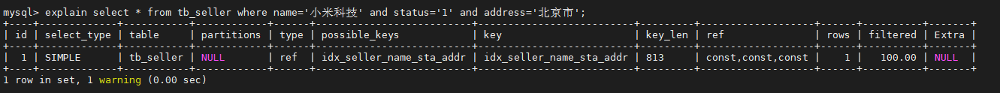

#### 2.2.2. 最左前缀法则

如果索引了多列，要遵守最左前缀法则。指的是查询从索引的最左前列开始，并且不跳过索引中的列。
 匹配最左前缀法则，走索引：
 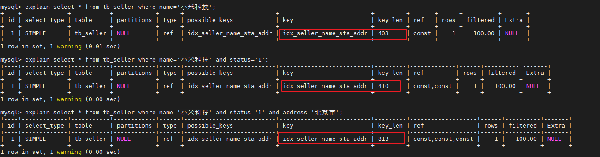

违法最左前缀法则 ， 索引失效：
 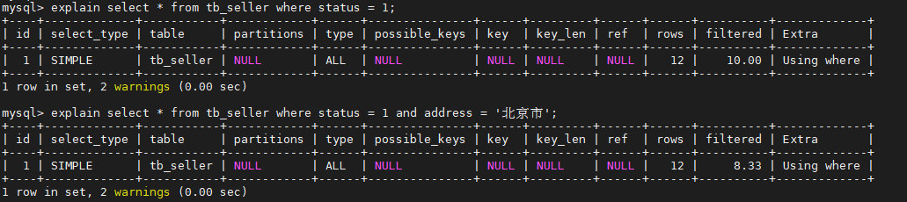

如果符合最左法则，但是出现跳跃某一列，只有最左列索引生效：
 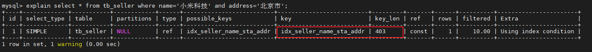

#### 2.2.3. 范围查询右边的列，不能使用索引 。

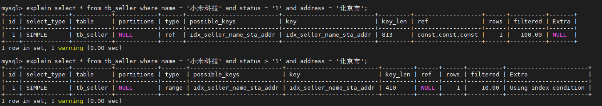
 根据前面的两个字段name ， status 查询是走索引的， 但是最后一个条件address 没有用到索引。

#### 2.2.4. 不要在索引列上进行运算操作， 索引将失效。

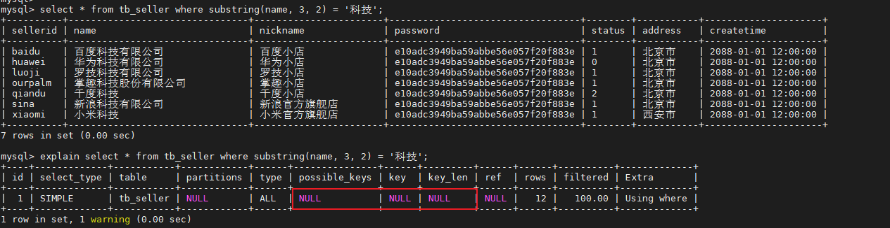

#### 2.2.5. 字符串不加单引号，造成索引失效。

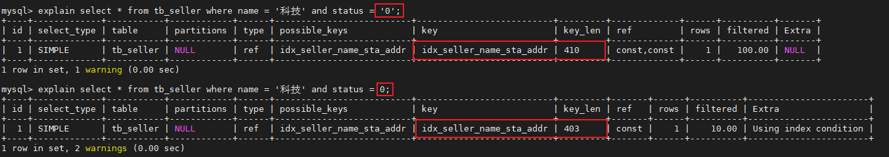
 由于，在查询是，没有对字符串加单引号，MySQL的查询优化器，会自动的进行类型转换，造成索引失效。

#### 2.2.6. 尽量使用覆盖索引，避免select *

尽量使用覆盖索引（只访问索引的查询（索引列完全包含查询列）），减少select * 。
 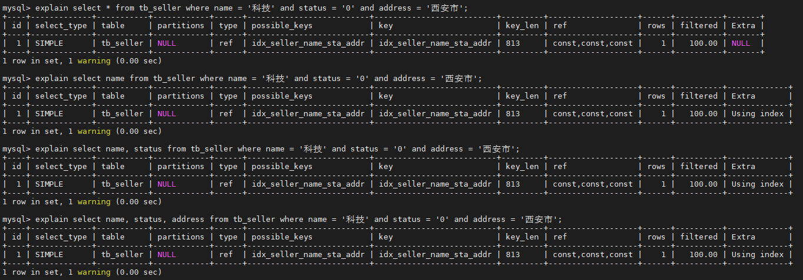
 如果查询列，超出索引列，也会降低性能。
 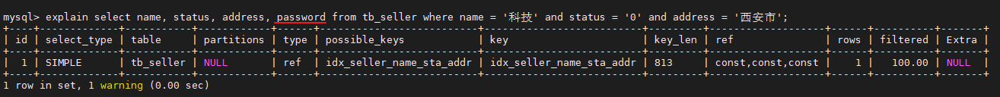
 **Tips:**
 using index ：使用覆盖索引的时候就会出现
 using where：在查找使用索引的情况下，需要回表去查询所需的数据
 using index condition：查找使用了索引，但是需要回表查询数据
 using index ; using where：查找使用了索引，但是需要的数据都在索引列中能找到，所以不需要回表查询数据

#### 2.2.7. 用or分割开的条件

如果or前的条件中的列有索引，而后面的列中没有索引，那么涉及的索引都不会被用到。示例，name字段是索引列 ， 而createtime不是索引列，中间是or进行连接是不走索引的 ：

```
explain select * from tb_seller where name='黑马程序员' or createtime = '2088-01-01 12:00:00';

```

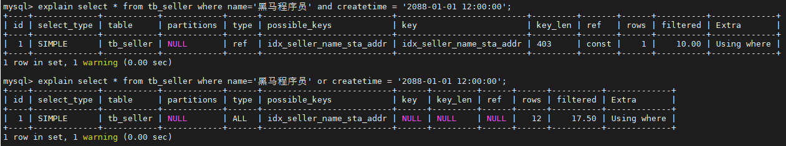

#### 2.2.8. 以%开头的Like模糊查询，索引失效

如果仅仅是尾部模糊匹配，索引不会失效。如果是头部模糊匹配，索引失效。
 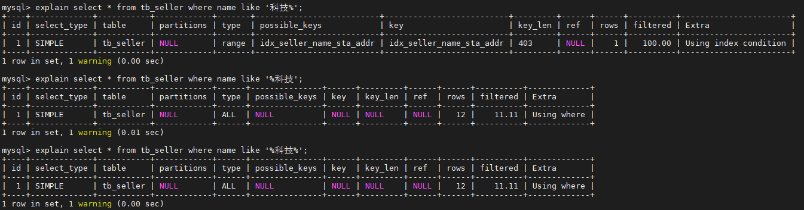
 **解决方案 ：** 通过覆盖索引来解决
 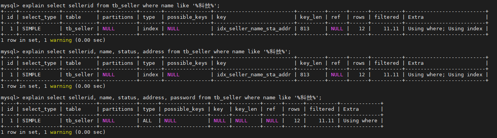

#### 2.2.9. 如果MySQL评估使用索引比全表更慢，则不使用索引

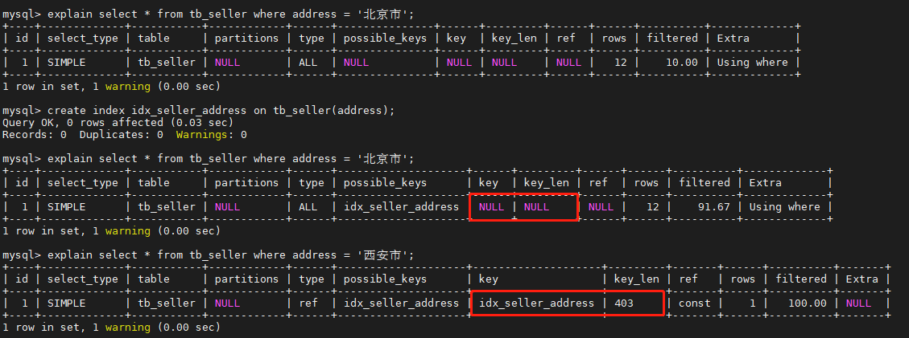

#### 2.2.10. is NULL , is NOT NULL 有时索引失效。

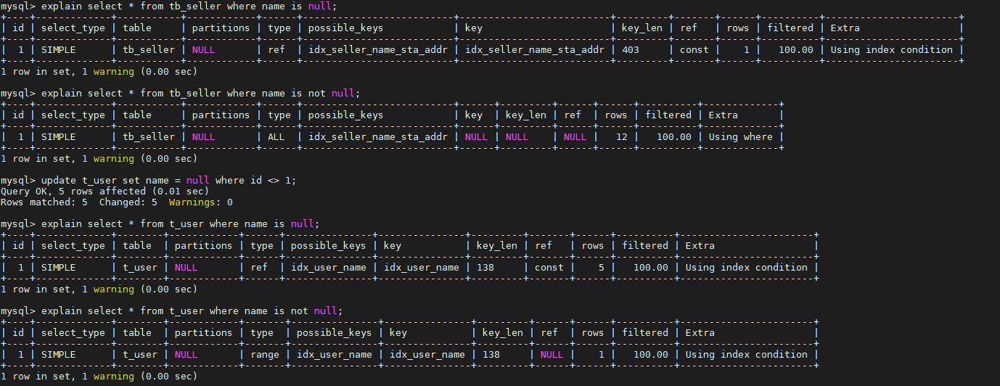

#### 2.2.11. in 走索引，not in 索引失效

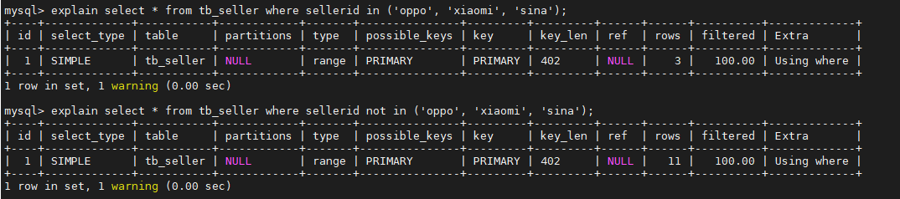
 **Ques:** MySQL 8.0 not in 也走索引了，为什么？8 的新特性？
 **tips:** 当后面的条件查询的返回值大于等于总数据50%时不使用索引;少于总数据50%则使用索引

## 3. 查看索引使用情况

```
show status like 'Handler_read%';

show global status like 'Handler_read%';

```

%23%20%E7%B4%A2%E5%BC%95%E7%9A%84%E4%BD%BF%E7%94%A8%0A%23%23%201.%20%E9%AA%8C%E8%AF%81%E7%B4%A2%E5%BC%95%E6%8F%90%E5%8D%87%E6%9F%A5%E8%AF%A2%E6%95%88%E7%8E%87%0A%E7%B4%A2%E5%BC%95%E6%98%AF%E6%95%B0%E6%8D%AE%E5%BA%93%E4%BC%98%E5%8C%96%E6%9C%80%E5%B8%B8%E7%94%A8%E4%B9%9F%E6%98%AF%E6%9C%80%E9%87%8D%E8%A6%81%E7%9A%84%E6%89%8B%E6%AE%B5%E4%B9%8B%E4%B8%80%2C%20%E9%80%9A%E8%BF%87%E7%B4%A2%E5%BC%95%E9%80%9A%E5%B8%B8%E5%8F%AF%E4%BB%A5%E5%B8%AE%E5%8A%A9%E7%94%A8%E6%88%B7%E8%A7%A3%E5%86%B3%E5%A4%A7%E5%A4%9A%E6%95%B0%E7%9A%84MySQL%E7%9A%84%E6%80%A7%E8%83%BD%E4%BC%98%E5%8C%96%E9%97%AE%E9%A2%98%E3%80%82%0A%0A%E5%9C%A8%E8%A1%A8%20tb_item%20%E4%B8%AD%EF%BC%8C%20%E4%B8%80%E5%85%B1%E5%AD%98%E5%82%A8%E4%BA%86%20300%20%E4%B8%87%E8%AE%B0%E5%BD%95%EF%BC%9B%0AA.%20%E6%A0%B9%E6%8D%AEID%E6%9F%A5%E8%AF%A2%0A%60%60%60sql%0Aselect%20*%20from%20tb_item%20where%20id%20%3D%201999%5CG%3B%0A%60%60%60%0A!%5B2ae37c1776da217ea4bd31300e2f7610.png%5D(en-resource%3A%2F%2Fdatabase%2F4256%3A0)%0A%0A%E6%9F%A5%E8%AF%A2%E9%80%9F%E5%BA%A6%E5%BE%88%E5%BF%AB%EF%BC%8C%20%E6%8E%A5%E8%BF%910s%20%EF%BC%8C%20%E4%B8%BB%E8%A6%81%E7%9A%84%E5%8E%9F%E5%9B%A0%E6%98%AF%E5%9B%A0%E4%B8%BAid%E4%B8%BA%E4%B8%BB%E9%94%AE%EF%BC%8C%20%E6%9C%89%E7%B4%A2%E5%BC%95%EF%BC%9B%0A!%5B75f7af50667c281990e3b269b568c31a.png%5D(en-resource%3A%2F%2Fdatabase%2F4258%3A0)%0A%0AB.%20%E6%A0%B9%E6%8D%AE%20title%20%E8%BF%9B%E8%A1%8C%E7%B2%BE%E7%A1%AE%E6%9F%A5%E8%AF%A2%0A%60%60%60sql%0Aselect%20*%20from%20tb_item%20where%20title%20%3D%20'iphoneX%20%E7%A7%BB%E5%8A%A83G%2032G941'%5CG%3B%20%0A%60%60%60%0A!%5Bfc61a54f567b8608449828b534980749.png%5D(en-resource%3A%2F%2Fdatabase%2F4272%3A0)%0A%0A%E6%9F%A5%E7%9C%8BSQL%E8%AF%AD%E5%8F%A5%E7%9A%84%E6%89%A7%E8%A1%8C%E8%AE%A1%E5%88%92%20%EF%BC%9A%0A!%5Bcaba6048d652df25963f70d93d7a09f6.png%5D(en-resource%3A%2F%2Fdatabase%2F4270%3A0)%0A%0A%E5%A4%84%E7%90%86%E6%96%B9%E6%A1%88%20%EF%BC%8C%20%E9%92%88%E5%AF%B9title%E5%AD%97%E6%AE%B5%EF%BC%8C%20%E5%88%9B%E5%BB%BA%E7%B4%A2%E5%BC%95%20%EF%BC%9A%0A%60%60%60sql%0Acreate%20index%20idx_item_title%20on%20tb_item(title)%3B%0A%60%60%60%0A!%5B94b5b099d90f5d08dac18d462bd3a97e.png%5D(en-resource%3A%2F%2Fdatabase%2F4268%3A0)%0A%0A%E7%B4%A2%E5%BC%95%E5%88%9B%E5%BB%BA%E5%AE%8C%E6%88%90%E4%B9%8B%E5%90%8E%EF%BC%8C%E5%86%8D%E6%AC%A1%E8%BF%9B%E8%A1%8C%E6%9F%A5%E8%AF%A2%20%EF%BC%9A%0A!%5B6bbf12fc551db7c7355122287d0fcf55.png%5D(en-resource%3A%2F%2Fdatabase%2F4264%3A0)%0A%0A%E9%80%9A%E8%BF%87explain%20%EF%BC%8C%20%E6%9F%A5%E7%9C%8B%E6%89%A7%E8%A1%8C%E8%AE%A1%E5%88%92%EF%BC%8C%E6%89%A7%E8%A1%8CSQL%E6%97%B6%E4%BD%BF%E7%94%A8%E4%BA%86%E5%88%9A%E6%89%8D%E5%88%9B%E5%BB%BA%E7%9A%84%E7%B4%A2%E5%BC%95%0A!%5B53776b595cd3e48c0db38e6b82075d4d.png%5D(en-resource%3A%2F%2Fdatabase%2F4266%3A0)%0A%0A%23%23%202.%20%E7%B4%A2%E5%BC%95%E7%9A%84%E4%BD%BF%E7%94%A8%0A%23%23%23%202.1.%20%E5%87%86%E5%A4%87%E7%8E%AF%E5%A2%83%0A%60%60%60sql%0Acreate%20table%20%60tb_seller%60%20(%0A%09%60sellerid%60%20varchar%20(100)%2C%0A%09%60name%60%20varchar%20(100)%2C%0A%09%60nickname%60%20varchar%20(50)%2C%0A%09%60password%60%20varchar%20(60)%2C%0A%09%60status%60%20varchar%20(1)%2C%0A%09%60address%60%20varchar%20(100)%2C%0A%09%60createtime%60%20datetime%2C%0A%20%20%20%20primary%20key(%60sellerid%60)%0A)engine%3Dinnodb%20default%20charset%3Dutf8mb4%3B%20%0A%0Ainsert%20into%20%60tb_seller%60%20(%60sellerid%60%2C%20%60name%60%2C%20%60nickname%60%2C%20%60password%60%2C%20%60status%60%2C%20%60address%60%2C%20%60createtime%60)%20values('alibaba'%2C'%E9%98%BF%E9%87%8C%E5%B7%B4%E5%B7%B4'%2C'%E9%98%BF%E9%87%8C%E5%B0%8F%E5%BA%97'%2C'e10adc3949ba59abbe56e057f20f883e'%2C'1'%2C'%E5%8C%97%E4%BA%AC%E5%B8%82'%2C'2088-01-01%2012%3A00%3A00')%3B%0Ainsert%20into%20%60tb_seller%60%20(%60sellerid%60%2C%20%60name%60%2C%20%60nickname%60%2C%20%60password%60%2C%20%60status%60%2C%20%60address%60%2C%20%60createtime%60)%20values('baidu'%2C'%E7%99%BE%E5%BA%A6%E7%A7%91%E6%8A%80%E6%9C%89%E9%99%90%E5%85%AC%E5%8F%B8'%2C'%E7%99%BE%E5%BA%A6%E5%B0%8F%E5%BA%97'%2C'e10adc3949ba59abbe56e057f20f883e'%2C'1'%2C'%E5%8C%97%E4%BA%AC%E5%B8%82'%2C'2088-01-01%2012%3A00%3A00')%3B%0Ainsert%20into%20%60tb_seller%60%20(%60sellerid%60%2C%20%60name%60%2C%20%60nickname%60%2C%20%60password%60%2C%20%60status%60%2C%20%60address%60%2C%20%60createtime%60)%20values('huawei'%2C'%E5%8D%8E%E4%B8%BA%E7%A7%91%E6%8A%80%E6%9C%89%E9%99%90%E5%85%AC%E5%8F%B8'%2C'%E5%8D%8E%E4%B8%BA%E5%B0%8F%E5%BA%97'%2C'e10adc3949ba59abbe56e057f20f883e'%2C'0'%2C'%E5%8C%97%E4%BA%AC%E5%B8%82'%2C'2088-01-01%2012%3A00%3A00')%3B%0Ainsert%20into%20%60tb_seller%60%20(%60sellerid%60%2C%20%60name%60%2C%20%60nickname%60%2C%20%60password%60%2C%20%60status%60%2C%20%60address%60%2C%20%60createtime%60)%20values('itcast'%2C'%E4%BC%A0%E6%99%BA%E6%92%AD%E5%AE%A2%E6%95%99%E8%82%B2%E7%A7%91%E6%8A%80%E6%9C%89%E9%99%90%E5%85%AC%E5%8F%B8'%2C'%E4%BC%A0%E6%99%BA%E6%92%AD%E5%AE%A2'%2C'e10adc3949ba59abbe56e057f20f883e'%2C'1'%2C'%E5%8C%97%E4%BA%AC%E5%B8%82'%2C'2088-01-01%2012%3A00%3A00')%3B%0Ainsert%20into%20%60tb_seller%60%20(%60sellerid%60%2C%20%60name%60%2C%20%60nickname%60%2C%20%60password%60%2C%20%60status%60%2C%20%60address%60%2C%20%60createtime%60)%20values('itheima'%2C'%E9%BB%91%E9%A9%AC%E7%A8%8B%E5%BA%8F%E5%91%98'%2C'%E9%BB%91%E9%A9%AC%E7%A8%8B%E5%BA%8F%E5%91%98'%2C'e10adc3949ba59abbe56e057f20f883e'%2C'0'%2C'%E5%8C%97%E4%BA%AC%E5%B8%82'%2C'2088-01-01%2012%3A00%3A00')%3B%0Ainsert%20into%20%60tb_seller%60%20(%60sellerid%60%2C%20%60name%60%2C%20%60nickname%60%2C%20%60password%60%2C%20%60status%60%2C%20%60address%60%2C%20%60createtime%60)%20values('luoji'%2C'%E7%BD%97%E6%8A%80%E7%A7%91%E6%8A%80%E6%9C%89%E9%99%90%E5%85%AC%E5%8F%B8'%2C'%E7%BD%97%E6%8A%80%E5%B0%8F%E5%BA%97'%2C'e10adc3949ba59abbe56e057f20f883e'%2C'1'%2C'%E5%8C%97%E4%BA%AC%E5%B8%82'%2C'2088-01-01%2012%3A00%3A00')%3B%0Ainsert%20into%20%60tb_seller%60%20(%60sellerid%60%2C%20%60name%60%2C%20%60nickname%60%2C%20%60password%60%2C%20%60status%60%2C%20%60address%60%2C%20%60createtime%60)%20values('oppo'%2C'OPPO%E7%A7%91%E6%8A%80%E6%9C%89%E9%99%90%E5%85%AC%E5%8F%B8'%2C'OPPO%E5%AE%98%E6%96%B9%E6%97%97%E8%88%B0%E5%BA%97'%2C'e10adc3949ba59abbe56e057f20f883e'%2C'0'%2C'%E5%8C%97%E4%BA%AC%E5%B8%82'%2C'2088-01-01%2012%3A00%3A00')%3B%0Ainsert%20into%20%60tb_seller%60%20(%60sellerid%60%2C%20%60name%60%2C%20%60nickname%60%2C%20%60password%60%2C%20%60status%60%2C%20%60address%60%2C%20%60createtime%60)%20values('ourpalm'%2C'%E6%8E%8C%E8%B6%A3%E7%A7%91%E6%8A%80%E8%82%A1%E4%BB%BD%E6%9C%89%E9%99%90%E5%85%AC%E5%8F%B8'%2C'%E6%8E%8C%E8%B6%A3%E5%B0%8F%E5%BA%97'%2C'e10adc3949ba59abbe56e057f20f883e'%2C'1'%2C'%E5%8C%97%E4%BA%AC%E5%B8%82'%2C'2088-01-01%2012%3A00%3A00')%3B%0Ainsert%20into%20%60tb_seller%60%20(%60sellerid%60%2C%20%60name%60%2C%20%60nickname%60%2C%20%60password%60%2C%20%60status%60%2C%20%60address%60%2C%20%60createtime%60)%20values('qiandu'%2C'%E5%8D%83%E5%BA%A6%E7%A7%91%E6%8A%80'%2C'%E5%8D%83%E5%BA%A6%E5%B0%8F%E5%BA%97'%2C'e10adc3949ba59abbe56e057f20f883e'%2C'2'%2C'%E5%8C%97%E4%BA%AC%E5%B8%82'%2C'2088-01-01%2012%3A00%3A00')%3B%0Ainsert%20into%20%60tb_seller%60%20(%60sellerid%60%2C%20%60name%60%2C%20%60nickname%60%2C%20%60password%60%2C%20%60status%60%2C%20%60address%60%2C%20%60createtime%60)%20values('sina'%2C'%E6%96%B0%E6%B5%AA%E7%A7%91%E6%8A%80%E6%9C%89%E9%99%90%E5%85%AC%E5%8F%B8'%2C'%E6%96%B0%E6%B5%AA%E5%AE%98%E6%96%B9%E6%97%97%E8%88%B0%E5%BA%97'%2C'e10adc3949ba59abbe56e057f20f883e'%2C'1'%2C'%E5%8C%97%E4%BA%AC%E5%B8%82'%2C'2088-01-01%2012%3A00%3A00')%3B%0Ainsert%20into%20%60tb_seller%60%20(%60sellerid%60%2C%20%60name%60%2C%20%60nickname%60%2C%20%60password%60%2C%20%60status%60%2C%20%60address%60%2C%20%60createtime%60)%20values('xiaomi'%2C'%E5%B0%8F%E7%B1%B3%E7%A7%91%E6%8A%80'%2C'%E5%B0%8F%E7%B1%B3%E5%AE%98%E6%96%B9%E6%97%97%E8%88%B0%E5%BA%97'%2C'e10adc3949ba59abbe56e057f20f883e'%2C'1'%2C'%E8%A5%BF%E5%AE%89%E5%B8%82'%2C'2088-01-01%2012%3A00%3A00')%3B%0Ainsert%20into%20%60tb_seller%60%20(%60sellerid%60%2C%20%60name%60%2C%20%60nickname%60%2C%20%60password%60%2C%20%60status%60%2C%20%60address%60%2C%20%60createtime%60)%20values('yijia'%2C'%E5%AE%9C%E5%AE%B6%E5%AE%B6%E5%B1%85'%2C'%E5%AE%9C%E5%AE%B6%E5%AE%B6%E5%B1%85%E6%97%97%E8%88%B0%E5%BA%97'%2C'e10adc3949ba59abbe56e057f20f883e'%2C'1'%2C'%E5%8C%97%E4%BA%AC%E5%B8%82'%2C'2088-01-01%2012%3A00%3A00')%3B%0A%0Acreate%20index%20idx_seller_name_sta_addr%20on%20tb_seller(name%2Cstatus%2Caddress)%3B%0A%60%60%60%0A%23%23%23%202.2.%20%E9%81%BF%E5%85%8D%E7%B4%A2%E5%BC%95%E5%A4%B1%E6%95%88%0A%23%23%23%23%202.2.1.%20%E5%85%A8%E5%80%BC%E5%8C%B9%E9%85%8D%20%EF%BC%8C%E5%AF%B9%E7%B4%A2%E5%BC%95%E4%B8%AD%E6%89%80%E6%9C%89%E5%88%97%E9%83%BD%E6%8C%87%E5%AE%9A%E5%85%B7%E4%BD%93%E5%80%BC%E3%80%82%0A%E8%AF%A5%E6%83%85%E5%86%B5%E4%B8%8B%EF%BC%8C%E7%B4%A2%E5%BC%95%E7%94%9F%E6%95%88%EF%BC%8C%E6%89%A7%E8%A1%8C%E6%95%88%E7%8E%87%E9%AB%98%E3%80%82%0A%60%60%60sql%0Aexplain%20select%20*%20from%20tb_seller%20where%20name%3D'%E5%B0%8F%E7%B1%B3%E7%A7%91%E6%8A%80'%20and%20status%3D'1'%20and%20address%3D'%E5%8C%97%E4%BA%AC%E5%B8%82'%3B%0A%60%60%60%0A!%5B329340ba7a271d0740a8b740a665121c.png%5D(en-resource%3A%2F%2Fdatabase%2F4274%3A0)%0A%0A%23%23%23%23%202.2.2.%20%E6%9C%80%E5%B7%A6%E5%89%8D%E7%BC%80%E6%B3%95%E5%88%99%0A%E5%A6%82%E6%9E%9C%E7%B4%A2%E5%BC%95%E4%BA%86%E5%A4%9A%E5%88%97%EF%BC%8C%E8%A6%81%E9%81%B5%E5%AE%88%E6%9C%80%E5%B7%A6%E5%89%8D%E7%BC%80%E6%B3%95%E5%88%99%E3%80%82%E6%8C%87%E7%9A%84%E6%98%AF%E6%9F%A5%E8%AF%A2%E4%BB%8E%E7%B4%A2%E5%BC%95%E7%9A%84%E6%9C%80%E5%B7%A6%E5%89%8D%E5%88%97%E5%BC%80%E5%A7%8B%EF%BC%8C%E5%B9%B6%E4%B8%94%E4%B8%8D%E8%B7%B3%E8%BF%87%E7%B4%A2%E5%BC%95%E4%B8%AD%E7%9A%84%E5%88%97%E3%80%82%0A%E5%8C%B9%E9%85%8D%E6%9C%80%E5%B7%A6%E5%89%8D%E7%BC%80%E6%B3%95%E5%88%99%EF%BC%8C%E8%B5%B0%E7%B4%A2%E5%BC%95%EF%BC%9A%0A!%5Bbe8207773d2d45d4106e51a09874d479.png%5D(en-resource%3A%2F%2Fdatabase%2F4276%3A0)%0A%0A%E8%BF%9D%E6%B3%95%E6%9C%80%E5%B7%A6%E5%89%8D%E7%BC%80%E6%B3%95%E5%88%99%20%EF%BC%8C%20%E7%B4%A2%E5%BC%95%E5%A4%B1%E6%95%88%EF%BC%9A%0A!%5B761ea25441ecdeb31b64fd61e337b28a.png%5D(en-resource%3A%2F%2Fdatabase%2F4278%3A0)%0A%0A%E5%A6%82%E6%9E%9C%E7%AC%A6%E5%90%88%E6%9C%80%E5%B7%A6%E6%B3%95%E5%88%99%EF%BC%8C%E4%BD%86%E6%98%AF%E5%87%BA%E7%8E%B0%E8%B7%B3%E8%B7%83%E6%9F%90%E4%B8%80%E5%88%97%EF%BC%8C%E5%8F%AA%E6%9C%89%E6%9C%80%E5%B7%A6%E5%88%97%E7%B4%A2%E5%BC%95%E7%94%9F%E6%95%88%EF%BC%9A%0A!%5B3172b2d84ce5f78ccca9e3fdced35e2f.png%5D(en-resource%3A%2F%2Fdatabase%2F4280%3A0)%0A%0A%23%23%23%23%202.2.3.%20%E8%8C%83%E5%9B%B4%E6%9F%A5%E8%AF%A2%E5%8F%B3%E8%BE%B9%E7%9A%84%E5%88%97%EF%BC%8C%E4%B8%8D%E8%83%BD%E4%BD%BF%E7%94%A8%E7%B4%A2%E5%BC%95%20%E3%80%82%0A!%5B3084a3d9a7db22f6da8a89b60d7c0f03.png%5D(en-resource%3A%2F%2Fdatabase%2F4282%3A0)%0A%E6%A0%B9%E6%8D%AE%E5%89%8D%E9%9D%A2%E7%9A%84%E4%B8%A4%E4%B8%AA%E5%AD%97%E6%AE%B5name%20%EF%BC%8C%20status%20%E6%9F%A5%E8%AF%A2%E6%98%AF%E8%B5%B0%E7%B4%A2%E5%BC%95%E7%9A%84%EF%BC%8C%20%E4%BD%86%E6%98%AF%E6%9C%80%E5%90%8E%E4%B8%80%E4%B8%AA%E6%9D%A1%E4%BB%B6address%20%E6%B2%A1%E6%9C%89%E7%94%A8%E5%88%B0%E7%B4%A2%E5%BC%95%E3%80%82%0A%0A%23%23%23%23%202.2.4.%20%E4%B8%8D%E8%A6%81%E5%9C%A8%E7%B4%A2%E5%BC%95%E5%88%97%E4%B8%8A%E8%BF%9B%E8%A1%8C%E8%BF%90%E7%AE%97%E6%93%8D%E4%BD%9C%EF%BC%8C%20%E7%B4%A2%E5%BC%95%E5%B0%86%E5%A4%B1%E6%95%88%E3%80%82%0A!%5Bb2365c4eb2bba4502af145b9998e3480.png%5D(en-resource%3A%2F%2Fdatabase%2F4284%3A0)%0A%0A%23%23%23%23%202.2.5.%20%E5%AD%97%E7%AC%A6%E4%B8%B2%E4%B8%8D%E5%8A%A0%E5%8D%95%E5%BC%95%E5%8F%B7%EF%BC%8C%E9%80%A0%E6%88%90%E7%B4%A2%E5%BC%95%E5%A4%B1%E6%95%88%E3%80%82%0A!%5B06ea716df4e68f346f50ee1ce568c750.png%5D(en-resource%3A%2F%2Fdatabase%2F4286%3A0)%0A%E7%94%B1%E4%BA%8E%EF%BC%8C%E5%9C%A8%E6%9F%A5%E8%AF%A2%E6%98%AF%EF%BC%8C%E6%B2%A1%E6%9C%89%E5%AF%B9%E5%AD%97%E7%AC%A6%E4%B8%B2%E5%8A%A0%E5%8D%95%E5%BC%95%E5%8F%B7%EF%BC%8CMySQL%E7%9A%84%E6%9F%A5%E8%AF%A2%E4%BC%98%E5%8C%96%E5%99%A8%EF%BC%8C%E4%BC%9A%E8%87%AA%E5%8A%A8%E7%9A%84%E8%BF%9B%E8%A1%8C%E7%B1%BB%E5%9E%8B%E8%BD%AC%E6%8D%A2%EF%BC%8C%E9%80%A0%E6%88%90%E7%B4%A2%E5%BC%95%E5%A4%B1%E6%95%88%E3%80%82%0A%0A%23%23%23%23%202.2.6.%20%E5%B0%BD%E9%87%8F%E4%BD%BF%E7%94%A8%E8%A6%86%E7%9B%96%E7%B4%A2%E5%BC%95%EF%BC%8C%E9%81%BF%E5%85%8Dselect%20*%0A%E5%B0%BD%E9%87%8F%E4%BD%BF%E7%94%A8%E8%A6%86%E7%9B%96%E7%B4%A2%E5%BC%95%EF%BC%88%E5%8F%AA%E8%AE%BF%E9%97%AE%E7%B4%A2%E5%BC%95%E7%9A%84%E6%9F%A5%E8%AF%A2%EF%BC%88%E7%B4%A2%E5%BC%95%E5%88%97%E5%AE%8C%E5%85%A8%E5%8C%85%E5%90%AB%E6%9F%A5%E8%AF%A2%E5%88%97%EF%BC%89%EF%BC%89%EF%BC%8C%E5%87%8F%E5%B0%91select%20*%20%E3%80%82%0A!%5B63d653af1b114392b0c9192f5b0e7fa5.png%5D(en-resource%3A%2F%2Fdatabase%2F4288%3A0)%0A%E5%A6%82%E6%9E%9C%E6%9F%A5%E8%AF%A2%E5%88%97%EF%BC%8C%E8%B6%85%E5%87%BA%E7%B4%A2%E5%BC%95%E5%88%97%EF%BC%8C%E4%B9%9F%E4%BC%9A%E9%99%8D%E4%BD%8E%E6%80%A7%E8%83%BD%E3%80%82%0A!%5Bf20ebc33ab58227bc0f9216a0b3aee19.png%5D(en-resource%3A%2F%2Fdatabase%2F4290%3A0)%0A**Tips%3A**%09%0A%20%20%20%20using%20index%20%EF%BC%9A%E4%BD%BF%E7%94%A8%E8%A6%86%E7%9B%96%E7%B4%A2%E5%BC%95%E7%9A%84%E6%97%B6%E5%80%99%E5%B0%B1%E4%BC%9A%E5%87%BA%E7%8E%B0%0A%20%20%20%20using%20where%EF%BC%9A%E5%9C%A8%E6%9F%A5%E6%89%BE%E4%BD%BF%E7%94%A8%E7%B4%A2%E5%BC%95%E7%9A%84%E6%83%85%E5%86%B5%E4%B8%8B%EF%BC%8C%E9%9C%80%E8%A6%81%E5%9B%9E%E8%A1%A8%E5%8E%BB%E6%9F%A5%E8%AF%A2%E6%89%80%E9%9C%80%E7%9A%84%E6%95%B0%E6%8D%AE%0A%20%20%20%20using%20index%20condition%EF%BC%9A%E6%9F%A5%E6%89%BE%E4%BD%BF%E7%94%A8%E4%BA%86%E7%B4%A2%E5%BC%95%EF%BC%8C%E4%BD%86%E6%98%AF%E9%9C%80%E8%A6%81%E5%9B%9E%E8%A1%A8%E6%9F%A5%E8%AF%A2%E6%95%B0%E6%8D%AE%0A%20%20%20%20using%20index%20%3B%20using%20where%EF%BC%9A%E6%9F%A5%E6%89%BE%E4%BD%BF%E7%94%A8%E4%BA%86%E7%B4%A2%E5%BC%95%EF%BC%8C%E4%BD%86%E6%98%AF%E9%9C%80%E8%A6%81%E7%9A%84%E6%95%B0%E6%8D%AE%E9%83%BD%E5%9C%A8%E7%B4%A2%E5%BC%95%E5%88%97%E4%B8%AD%E8%83%BD%E6%89%BE%E5%88%B0%EF%BC%8C%E6%89%80%E4%BB%A5%E4%B8%8D%E9%9C%80%E8%A6%81%E5%9B%9E%E8%A1%A8%E6%9F%A5%E8%AF%A2%E6%95%B0%E6%8D%AE%0A%0A%23%23%23%23%202.2.7.%20%E7%94%A8or%E5%88%86%E5%89%B2%E5%BC%80%E7%9A%84%E6%9D%A1%E4%BB%B6%0A%E5%A6%82%E6%9E%9Cor%E5%89%8D%E7%9A%84%E6%9D%A1%E4%BB%B6%E4%B8%AD%E7%9A%84%E5%88%97%E6%9C%89%E7%B4%A2%E5%BC%95%EF%BC%8C%E8%80%8C%E5%90%8E%E9%9D%A2%E7%9A%84%E5%88%97%E4%B8%AD%E6%B2%A1%E6%9C%89%E7%B4%A2%E5%BC%95%EF%BC%8C%E9%82%A3%E4%B9%88%E6%B6%89%E5%8F%8A%E7%9A%84%E7%B4%A2%E5%BC%95%E9%83%BD%E4%B8%8D%E4%BC%9A%E8%A2%AB%E7%94%A8%E5%88%B0%E3%80%82%E7%A4%BA%E4%BE%8B%EF%BC%8Cname%E5%AD%97%E6%AE%B5%E6%98%AF%E7%B4%A2%E5%BC%95%E5%88%97%20%EF%BC%8C%20%E8%80%8Ccreatetime%E4%B8%8D%E6%98%AF%E7%B4%A2%E5%BC%95%E5%88%97%EF%BC%8C%E4%B8%AD%E9%97%B4%E6%98%AFor%E8%BF%9B%E8%A1%8C%E8%BF%9E%E6%8E%A5%E6%98%AF%E4%B8%8D%E8%B5%B0%E7%B4%A2%E5%BC%95%E7%9A%84%20%EF%BC%9A%0A%60%60%60sql%0Aexplain%20select%20*%20from%20tb_seller%20where%20name%3D'%E9%BB%91%E9%A9%AC%E7%A8%8B%E5%BA%8F%E5%91%98'%20or%20createtime%20%3D%20'2088-01-01%2012%3A00%3A00'%3B%0A%60%60%60%0A!%5B6fee0f30c1e876070561633ed2afcb09.png%5D(en-resource%3A%2F%2Fdatabase%2F4292%3A0)%0A%0A%23%23%23%23%202.2.8.%20%E4%BB%A5%25%E5%BC%80%E5%A4%B4%E7%9A%84Like%E6%A8%A1%E7%B3%8A%E6%9F%A5%E8%AF%A2%EF%BC%8C%E7%B4%A2%E5%BC%95%E5%A4%B1%E6%95%88%0A%E5%A6%82%E6%9E%9C%E4%BB%85%E4%BB%85%E6%98%AF%E5%B0%BE%E9%83%A8%E6%A8%A1%E7%B3%8A%E5%8C%B9%E9%85%8D%EF%BC%8C%E7%B4%A2%E5%BC%95%E4%B8%8D%E4%BC%9A%E5%A4%B1%E6%95%88%E3%80%82%E5%A6%82%E6%9E%9C%E6%98%AF%E5%A4%B4%E9%83%A8%E6%A8%A1%E7%B3%8A%E5%8C%B9%E9%85%8D%EF%BC%8C%E7%B4%A2%E5%BC%95%E5%A4%B1%E6%95%88%E3%80%82%0A!%5B573355bd16f0f331656d56dc75906a6b.png%5D(en-resource%3A%2F%2Fdatabase%2F4294%3A0)%0A**%E8%A7%A3%E5%86%B3%E6%96%B9%E6%A1%88%20%EF%BC%9A**%20%E9%80%9A%E8%BF%87%E8%A6%86%E7%9B%96%E7%B4%A2%E5%BC%95%E6%9D%A5%E8%A7%A3%E5%86%B3%0A!%5Bb9dff871d5058d3ea78c4ee1ee9c2cec.png%5D(en-resource%3A%2F%2Fdatabase%2F4296%3A0)%0A%0A%23%23%23%23%202.2.9.%20%E5%A6%82%E6%9E%9CMySQL%E8%AF%84%E4%BC%B0%E4%BD%BF%E7%94%A8%E7%B4%A2%E5%BC%95%E6%AF%94%E5%85%A8%E8%A1%A8%E6%9B%B4%E6%85%A2%EF%BC%8C%E5%88%99%E4%B8%8D%E4%BD%BF%E7%94%A8%E7%B4%A2%E5%BC%95%0A!%5B7bbb9f88518de931641953e1aea65348.png%5D(en-resource%3A%2F%2Fdatabase%2F4298%3A0)%0A%0A%23%23%23%23%202.2.10.%20is%20NULL%20%2C%20is%20NOT%20NULL%20%E6%9C%89%E6%97%B6%E7%B4%A2%E5%BC%95%E5%A4%B1%E6%95%88%E3%80%82%0A!%5Bba07c3b350c34803a4d5e2c97cc47c31.png%5D(en-resource%3A%2F%2Fdatabase%2F4300%3A0)%0A%0A%23%23%23%23%202.2.11.%20in%20%E8%B5%B0%E7%B4%A2%E5%BC%95%EF%BC%8Cnot%20in%20%E7%B4%A2%E5%BC%95%E5%A4%B1%E6%95%88%0A!%5B7a5ad341ac10fd644c1812b881a07bef.png%5D(en-resource%3A%2F%2Fdatabase%2F4302%3A0)%0A**Ques%3A**%20MySQL%208.0%20not%20in%20%E4%B9%9F%E8%B5%B0%E7%B4%A2%E5%BC%95%E4%BA%86%EF%BC%8C%E4%B8%BA%E4%BB%80%E4%B9%88%EF%BC%9F8%20%E7%9A%84%E6%96%B0%E7%89%B9%E6%80%A7%EF%BC%9F%0A**tips%3A**%20%E5%BD%93%E5%90%8E%E9%9D%A2%E7%9A%84%E6%9D%A1%E4%BB%B6%E6%9F%A5%E8%AF%A2%E7%9A%84%E8%BF%94%E5%9B%9E%E5%80%BC%E5%A4%A7%E4%BA%8E%E7%AD%89%E4%BA%8E%E6%80%BB%E6%95%B0%E6%8D%AE50%25%E6%97%B6%E4%B8%8D%E4%BD%BF%E7%94%A8%E7%B4%A2%E5%BC%95%3B%E5%B0%91%E4%BA%8E%E6%80%BB%E6%95%B0%E6%8D%AE50%25%E5%88%99%E4%BD%BF%E7%94%A8%E7%B4%A2%E5%BC%95%0A%0A%23%23%23%23%202.2.12.%20%E5%8D%95%E5%88%97%E7%B4%A2%E5%BC%95%E5%92%8C%E5%A4%8D%E5%90%88%E7%B4%A2%E5%BC%95%0A**%E5%B0%BD%E9%87%8F%E4%BD%BF%E7%94%A8%E5%A4%8D%E5%90%88%E7%B4%A2%E5%BC%95%EF%BC%8C%E8%80%8C%E5%B0%91%E4%BD%BF%E7%94%A8%E5%8D%95%E5%88%97%E7%B4%A2%E5%BC%95%20%E3%80%82**%0A%E5%88%9B%E5%BB%BA%E5%A4%8D%E5%90%88%E7%B4%A2%E5%BC%95%0A%60%60%60sql%0Acreate%20index%20idx_name_sta_address%20on%20tb_seller(name%2C%20status%2C%20address)%3B%0A%60%60%60%0A%E5%B0%B1%E7%9B%B8%E5%BD%93%E4%BA%8E%E5%88%9B%E5%BB%BA%E4%BA%86%E4%B8%89%E4%B8%AA%E7%B4%A2%E5%BC%95%20%EF%BC%9A%20%0A%09name%0A%09name%20%2B%20status%0A%09name%20%2B%20status%20%2B%20address%0A%E5%88%9B%E5%BB%BA%E5%8D%95%E5%88%97%E7%B4%A2%E5%BC%95%0A%60%60%60sql%0Acreate%20index%20idx_seller_name%20on%20tb_seller(name)%3B%0Acreate%20index%20idx_seller_status%20on%20tb_seller(status)%3B%0Acreate%20index%20idx_seller_address%20on%20tb_seller(address)%3B%0A%60%60%60%0A%E6%95%B0%E6%8D%AE%E5%BA%93%E4%BC%9A%E9%80%89%E6%8B%A9%E4%B8%80%E4%B8%AA%E6%9C%80%E4%BC%98%E7%9A%84%E7%B4%A2%E5%BC%95%EF%BC%88%E8%BE%A8%E8%AF%86%E5%BA%A6%E6%9C%80%E9%AB%98%E7%9A%84%E7%B4%A2%E5%BC%95%EF%BC%89%E6%9D%A5%E4%BD%BF%E7%94%A8%EF%BC%8C%E5%B9%B6%E4%B8%8D%E4%BC%9A%E4%BD%BF%E7%94%A8%E5%85%A8%E9%83%A8%E7%B4%A2%E5%BC%95%20%E3%80%82%0A%0A%23%23%203.%20%E6%9F%A5%E7%9C%8B%E7%B4%A2%E5%BC%95%E4%BD%BF%E7%94%A8%E6%83%85%E5%86%B5%0A%60%60%60sql%0A--%20%E5%BD%93%E5%89%8D%E4%BC%9A%E8%AF%9D%E7%9A%84%E7%B4%A2%E5%BC%95%E4%BD%BF%E7%94%A8%E6%83%85%E5%86%B5%0Ashow%20status%20like%20'Handler_read%25'%3B%20%0A--%20%E5%85%A8%E5%B1%80%E7%9A%84%E7%B4%A2%E5%BC%95%E4%BD%BF%E7%94%A8%E6%83%85%E5%86%B5%0Ashow%20global%20status%20like%20'Handler_read%25'%3B%0A%60%60%60%0A-%20Handler_read_first%EF%BC%9A%E7%B4%A2%E5%BC%95%E4%B8%AD%E7%AC%AC%E4%B8%80%E6%9D%A1%E8%A2%AB%E8%AF%BB%E7%9A%84%E6%AC%A1%E6%95%B0%E3%80%82%E5%A6%82%E6%9E%9C%E8%BE%83%E9%AB%98%EF%BC%8C%E8%A1%A8%E7%A4%BA%E6%9C%8D%E5%8A%A1%E5%99%A8%E6%AD%A3%E6%89%A7%E8%A1%8C%E5%A4%A7%E9%87%8F%E5%85%A8%E7%B4%A2%E5%BC%95%E6%89%AB%E6%8F%8F%EF%BC%88%E8%BF%99%E4%B8%AA%E5%80%BC%E8%B6%8A%E4%BD%8E%E8%B6%8A%E5%A5%BD%EF%BC%89%E3%80%82%0A-%20Handler_read_key%EF%BC%9A%E5%A6%82%E6%9E%9C%E7%B4%A2%E5%BC%95%E6%AD%A3%E5%9C%A8%E5%B7%A5%E4%BD%9C%EF%BC%8C%E8%BF%99%E4%B8%AA%E5%80%BC%E4%BB%A3%E8%A1%A8%E4%B8%80%E4%B8%AA%E8%A1%8C%E8%A2%AB%E7%B4%A2%E5%BC%95%E5%80%BC%E8%AF%BB%E7%9A%84%E6%AC%A1%E6%95%B0%EF%BC%8C%E5%A6%82%E6%9E%9C%E5%80%BC%E8%B6%8A%E4%BD%8E%EF%BC%8C%E8%A1%A8%E7%A4%BA%E7%B4%A2%E5%BC%95%E5%BE%97%E5%88%B0%E7%9A%84%E6%80%A7%E8%83%BD%E6%94%B9%E5%96%84%E4%B8%8D%E9%AB%98%EF%BC%8C%E5%9B%A0%E4%B8%BA%E7%B4%A2%E5%BC%95%E4%B8%8D%E7%BB%8F%E5%B8%B8%E4%BD%BF%E7%94%A8%EF%BC%88%E8%BF%99%E4%B8%AA%E5%80%BC%E8%B6%8A%E9%AB%98%E8%B6%8A%E5%A5%BD%EF%BC%89%E3%80%82%0A-%20Handler_read_next%20%EF%BC%9A%E6%8C%89%E7%85%A7%E9%94%AE%E9%A1%BA%E5%BA%8F%E8%AF%BB%E4%B8%8B%E4%B8%80%E8%A1%8C%E7%9A%84%E8%AF%B7%E6%B1%82%E6%95%B0%E3%80%82%E5%A6%82%E6%9E%9C%E4%BD%A0%E7%94%A8%E8%8C%83%E5%9B%B4%E7%BA%A6%E6%9D%9F%E6%88%96%E5%A6%82%E6%9E%9C%E6%89%A7%E8%A1%8C%E7%B4%A2%E5%BC%95%E6%89%AB%E6%8F%8F%E6%9D%A5%E6%9F%A5%E8%AF%A2%E7%B4%A2%E5%BC%95%E5%88%97%EF%BC%8C%E8%AF%A5%E5%80%BC%E5%A2%9E%E5%8A%A0%E3%80%82%0A-%20Handler_read_prev%EF%BC%9A%E6%8C%89%E7%85%A7%E9%94%AE%E9%A1%BA%E5%BA%8F%E8%AF%BB%E5%89%8D%E4%B8%80%E8%A1%8C%E7%9A%84%E8%AF%B7%E6%B1%82%E6%95%B0%E3%80%82%E8%AF%A5%E8%AF%BB%E6%96%B9%E6%B3%95%E4%B8%BB%E8%A6%81%E7%94%A8%E4%BA%8E%E4%BC%98%E5%8C%96ORDER%20BY%20...%20DESC%E3%80%82%0A-%20Handler_read_rnd%20%EF%BC%9A%E6%A0%B9%E6%8D%AE%E5%9B%BA%E5%AE%9A%E4%BD%8D%E7%BD%AE%E8%AF%BB%E4%B8%80%E8%A1%8C%E7%9A%84%E8%AF%B7%E6%B1%82%E6%95%B0%E3%80%82%E5%A6%82%E6%9E%9C%E4%BD%A0%E6%AD%A3%E6%89%A7%E8%A1%8C%E5%A4%A7%E9%87%8F%E6%9F%A5%E8%AF%A2%E5%B9%B6%E9%9C%80%E8%A6%81%E5%AF%B9%E7%BB%93%E6%9E%9C%E8%BF%9B%E8%A1%8C%E6%8E%92%E5%BA%8F%E8%AF%A5%E5%80%BC%E8%BE%83%E9%AB%98%E3%80%82%E4%BD%A0%E5%8F%AF%E8%83%BD%E4%BD%BF%E7%94%A8%E4%BA%86%E5%A4%A7%E9%87%8F%E9%9C%80%E8%A6%81MySQL%E6%89%AB%E6%8F%8F%E6%95%B4%E4%B8%AA%E8%A1%A8%E7%9A%84%E6%9F%A5%E8%AF%A2%E6%88%96%E4%BD%A0%E7%9A%84%E8%BF%9E%E6%8E%A5%E6%B2%A1%E6%9C%89%E6%AD%A3%E7%A1%AE%E4%BD%BF%E7%94%A8%E9%94%AE%E3%80%82%E8%BF%99%E4%B8%AA%E5%80%BC%E8%BE%83%E9%AB%98%EF%BC%8C%E6%84%8F%E5%91%B3%E7%9D%80%E8%BF%90%E8%A1%8C%E6%95%88%E7%8E%87%E4%BD%8E%EF%BC%8C%E5%BA%94%E8%AF%A5%E5%BB%BA%E7%AB%8B%E7%B4%A2%E5%BC%95%E6%9D%A5%E8%A1%A5%E6%95%91%E3%80%82%0A-%20Handler_read_rnd_next%EF%BC%9A%E5%9C%A8%E6%95%B0%E6%8D%AE%E6%96%87%E4%BB%B6%E4%B8%AD%E8%AF%BB%E4%B8%8B%E4%B8%80%E8%A1%8C%E7%9A%84%E8%AF%B7%E6%B1%82%E6%95%B0%E3%80%82%E5%A6%82%E6%9E%9C%E4%BD%A0%E6%AD%A3%E8%BF%9B%E8%A1%8C%E5%A4%A7%E9%87%8F%E7%9A%84%E8%A1%A8%E6%89%AB%E6%8F%8F%EF%BC%8C%E8%AF%A5%E5%80%BC%E8%BE%83%E9%AB%98%E3%80%82%E9%80%9A%E5%B8%B8%E8%AF%B4%E6%98%8E%E4%BD%A0%E7%9A%84%E8%A1%A8%E7%B4%A2%E5%BC%95%E4%B8%8D%E6%AD%A3%E7%A1%AE%E6%88%96%E5%86%99%E5%85%A5%E7%9A%84%E6%9F%A5%E8%AF%A2%E6%B2%A1%E6%9C%89%E5%88%A9%E7%94%A8%E7%B4%A2%E5%BC%95%E3%80%82%0A
