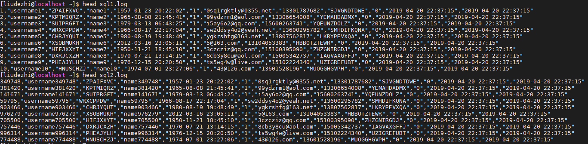
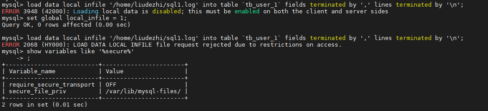
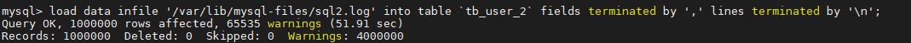
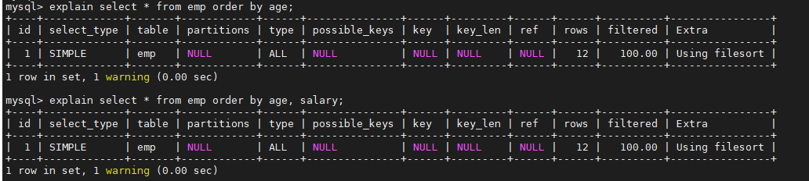
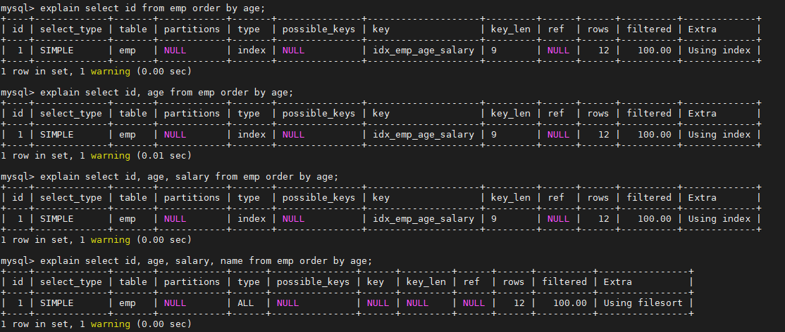
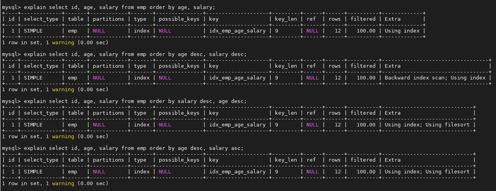
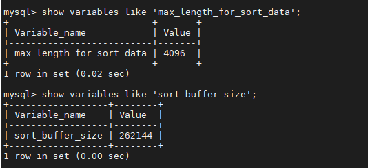

# 10.SQL 优化

- 笔记本：Mysql高级
- 创建时间：2020-12-06 05:33:58 UTC
- 更新时间：2020-12-09 08:50:51 UTC
- 原始链接：https://www.zhihu.com/question/426972214
- 印象笔记 GUID：72fcb117-a1fd-4f2c-862c-f6abfc060ed3

# SQL 优化

## 1. 大批量插入数据

环境准备：

```
CREATE TABLE `tb_user_1` (
  `id` int(11) NOT NULL AUTO_INCREMENT,
  `username` varchar(45) NOT NULL,
  `password` varchar(96) NOT NULL,
  `name` varchar(45) NOT NULL,
  `birthday` datetime DEFAULT NULL,
  `sex` char(1) DEFAULT NULL,
  `email` varchar(45) DEFAULT NULL,
  `phone` varchar(45) DEFAULT NULL,
  `qq` varchar(32) DEFAULT NULL,
  `status` varchar(32) NOT NULL COMMENT '用户状态',
  `create_time` datetime NOT NULL,
  `update_time` datetime DEFAULT NULL,
  PRIMARY KEY (`id`),
  UNIQUE KEY `unique_user_username` (`username`)
) ENGINE=InnoDB DEFAULT CHARSET=utf8 ;
-- 创建一个和 tb_user_1 表结构完全相同的 tb_user_2 表

```

当使用load 命令导入数据的时候，适当的设置可以提高导入的效率。

对于 InnoDB 类型的表，有以下几种方式可以提高导入的效率：
 1） 主键顺序插入
 因为InnoDB类型的表是按照主键的顺序保存的，所以将导入的数据按照主键的顺序排列，可以有效的提高导入数据的效率。如果InnoDB表没有主键，那么系统会自动默认创建一个内部列作为主键，所以如果可以给表创建一个主键，将可以利用这点，来提高导入数据的效率。
 **脚本文件介绍 :**
 sql1.log ----> 主键有序
 sql2.log ----> 主键无序
 

**Tips:** 使用 `load data` 命令报错：
 
 首先执行 `set global local_infile = 1;`
 设置mysql 的安全模式去掉 STRICT_TRANS_TABLES `set sql_mode = 'ONLY_FULL_GROUP_BY,NO_ZERO_IN_DATE,NO_ZERO_DATE,ERROR_FOR_DIVISION_BY_ZERO,NO_ENGINE_SUBSTITUTION';`
 然后通过 `show variables like '%secure%';` 命令查看安全路径，把文件放到安全路径中再执行。（`load data local infile '/var/lib/mysql-files/sql1.log' into table`tb_user_1`fields terminated by ',' lines terminated by '\n';`）删除放到安全路径后命令去掉 local

插入ID顺序排列数据：

```
load data infile '/var/lib/mysql-files/sql1.log' into table `tb_user_1` fields terminated by ',' lines terminated by '\n';

```


插入ID无序排列数据：

```
load data infile '/var/lib/mysql-files/sql2.log' into table `tb_user_2` fields terminated by ',' lines terminated by '\n';

```



2）关闭唯一性校验
 在导入数据前执行 SET UNIQUE_CHECKS=0，关闭唯一性校验，在导入结束后执行SET UNIQUE_CHECKS=1，恢复唯一性校验，可以提高导入的效率。
 

3） 手动提交事务
 如果应用使用自动提交的方式，建议在导入前执行 SET AUTOCOMMIT=0，关闭自动提交，导入结束后再执行 SET AUTOCOMMIT=1，打开自动提交，也可以提高导入的效率。

## 2. 优化insert语句

当进行数据的insert操作的时候，可以考虑采用以下几种优化方案。

- 如果需要同时对一张表插入很多行数据时，应该尽量使用多个值表的insert语句，这种方式将大大的缩减客户端与数据库之间的连接、关闭等消耗。使得效率比分开执行的单个insert语句快。
 示例， 原始方式为：

```
insert into tb_test values(1,'Tom');
insert into tb_test values(2,'Cat');
insert into tb_test values(3,'Jerry');

```

优化后的方案为 ：

```
insert into tb_test values(1,'Tom'),(2,'Cat')，(3,'Jerry');

```

- 在事务中进行数据插入

```
start transaction;
insert into tb_test values(1,'Tom');
insert into tb_test values(2,'Cat');
insert into tb_test values(3,'Jerry');
commit;

```

- 数据有序插入

```
insert into tb_test values(4,'Tim');
insert into tb_test values(1,'Tom');
insert into tb_test values(3,'Jerry');
insert into tb_test values(5,'Rose');
insert into tb_test values(2,'Cat');

```

优化后：

```
insert into tb_test values(1,'Tom');
insert into tb_test values(2,'Cat');
insert into tb_test values(3,'Jerry');
insert into tb_test values(4,'Tim');
insert into tb_test values(5,'Rose');

```

## 3. 优化order by语句

### 3.1. 环境准备

```
CREATE TABLE `emp` (
  `id` int(11) NOT NULL AUTO_INCREMENT,
  `name` varchar(100) NOT NULL,
  `age` int(3) NOT NULL,
  `salary` int(11) DEFAULT NULL,
  PRIMARY KEY (`id`)
) ENGINE=InnoDB  DEFAULT CHARSET=utf8mb4;

insert into `emp` (`id`, `name`, `age`, `salary`) values('1','Tom','25','2300');
insert into `emp` (`id`, `name`, `age`, `salary`) values('2','Jerry','30','3500');
insert into `emp` (`id`, `name`, `age`, `salary`) values('3','Luci','25','2800');
insert into `emp` (`id`, `name`, `age`, `salary`) values('4','Jay','36','3500');
insert into `emp` (`id`, `name`, `age`, `salary`) values('5','Tom2','21','2200');
insert into `emp` (`id`, `name`, `age`, `salary`) values('6','Jerry2','31','3300');
insert into `emp` (`id`, `name`, `age`, `salary`) values('7','Luci2','26','2700');
insert into `emp` (`id`, `name`, `age`, `salary`) values('8','Jay2','33','3500');
insert into `emp` (`id`, `name`, `age`, `salary`) values('9','Tom3','23','2400');
insert into `emp` (`id`, `name`, `age`, `salary`) values('10','Jerry3','32','3100');
insert into `emp` (`id`, `name`, `age`, `salary`) values('11','Luci3','26','2900');
insert into `emp` (`id`, `name`, `age`, `salary`) values('12','Jay3','37','4500');

create index idx_emp_age_salary on emp(age,salary);

```

### 3.2. 两种排序方式

1). 第一种是通过对返回数据进行排序，也就是通常说的 filesort 排序，所有不是通过索引直接返回排序结果的排序都叫 FileSort 排序。
 

2). 第二种通过有序索引顺序扫描直接返回有序数据，这种情况即为 using index，不需要额外排序，操作效率高。
 

多字段排序
 

了解了MySQL的排序方式，优化目标就清晰了：尽量减少额外的排序，通过索引直接返回有序数据。where 条件和Order by 使用相同的索引，并且Order By 的顺序和索引顺序相同， 并且Order by 的字段都是升序，或者都是降序。否则肯定需要额外的操作，这样就会出现FileSort。

### 3.3. Filesort 的优化

通过创建合适的索引，能够减少 Filesort 的出现，但是在某些情况下，条件限制不能让Filesort消失，那就需要加快 Filesort的排序操作。对于Filesort ， MySQL 有两种排序算法：
 1） 两次扫描算法 ：MySQL4.1 之前，使用该方式排序。首先根据条件取出排序字段和行指针信息，然后在排序区 sort buffer 中排序，如果sort buffer不够，则在临时表 temporary table 中存储排序结果。完成排序之后，再根据行指针回表读取记录，该操作可能会导致大量随机I/O操作。
 2）一次扫描算法：一次性取出满足条件的所有字段，然后在排序区 sort buffer 中排序后直接输出结果集。排序时内存开销较大，但是排序效率比两次扫描算法要高。

MySQL 通过比较系统变量 max_length_for_sort_data 的大小和Query语句取出的字段总大小， 来判定是否那种排序算法，如果max_length_for_sort_data 更大，那么使用第二种优化之后的算法；否则使用第一种。

可以适当提高 sort_buffer_size 和 max_length_for_sort_data 系统变量，来增大排序区的大小，提高排序的效率。
 

## 4. 优化group by 语句

由于GROUP BY 实际上也同样会进行排序操作，而且与ORDER BY 相比，GROUP BY 主要只是多了排序之后的分组操作。当然，如果在分组的时候还使用了其他的一些聚合函数，那么还需要一些聚合函数的计算。所以，在GROUP BY 的实现过程中，与 ORDER BY 一样也可以利用到索引。
 如果查询包含 group by 但是用户想要避免排序结果的消耗， 则可以执行order by null 禁止排序。如下 ：

```
drop index idx_emp_age_salary on emp;

explain select age,count(*) from emp group by age;

```

优化后：

```
explain select age,count(*) from emp group by age order by null;

```

从上面的例子可以看出，第一个SQL语句需要进行"filesort"，而第二个SQL由于order by null 不需要进行 "filesort"， 而上文提过Filesort往往非常耗费时间。

## 5. 优化嵌套查询

## 6. 优化OR条件

## 7. 优化分页查询

## 8. 使用SQL提示

%23%20SQL%20%E4%BC%98%E5%8C%96%0A%23%23%201.%20%E5%A4%A7%E6%89%B9%E9%87%8F%E6%8F%92%E5%85%A5%E6%95%B0%E6%8D%AE%0A%E7%8E%AF%E5%A2%83%E5%87%86%E5%A4%87%EF%BC%9A%0A%60%60%60sql%0ACREATE%20TABLE%20%60tb_user_1%60%20(%0A%20%20%60id%60%20int(11)%20NOT%20NULL%20AUTO_INCREMENT%2C%0A%20%20%60username%60%20varchar(45)%20NOT%20NULL%2C%0A%20%20%60password%60%20varchar(96)%20NOT%20NULL%2C%0A%20%20%60name%60%20varchar(45)%20NOT%20NULL%2C%0A%20%20%60birthday%60%20datetime%20DEFAULT%20NULL%2C%0A%20%20%60sex%60%20char(1)%20DEFAULT%20NULL%2C%0A%20%20%60email%60%20varchar(45)%20DEFAULT%20NULL%2C%0A%20%20%60phone%60%20varchar(45)%20DEFAULT%20NULL%2C%0A%20%20%60qq%60%20varchar(32)%20DEFAULT%20NULL%2C%0A%20%20%60status%60%20varchar(32)%20NOT%20NULL%20COMMENT%20'%E7%94%A8%E6%88%B7%E7%8A%B6%E6%80%81'%2C%0A%20%20%60create_time%60%20datetime%20NOT%20NULL%2C%0A%20%20%60update_time%60%20datetime%20DEFAULT%20NULL%2C%0A%20%20PRIMARY%20KEY%20(%60id%60)%2C%0A%20%20UNIQUE%20KEY%20%60unique_user_username%60%20(%60username%60)%0A)%20ENGINE%3DInnoDB%20DEFAULT%20CHARSET%3Dutf8%20%3B%0A--%20%E5%88%9B%E5%BB%BA%E4%B8%80%E4%B8%AA%E5%92%8C%20tb_user_1%20%E8%A1%A8%E7%BB%93%E6%9E%84%E5%AE%8C%E5%85%A8%E7%9B%B8%E5%90%8C%E7%9A%84%20tb_user_2%20%E8%A1%A8%0A%60%60%60%0A%0A%E5%BD%93%E4%BD%BF%E7%94%A8load%20%E5%91%BD%E4%BB%A4%E5%AF%BC%E5%85%A5%E6%95%B0%E6%8D%AE%E7%9A%84%E6%97%B6%E5%80%99%EF%BC%8C%E9%80%82%E5%BD%93%E7%9A%84%E8%AE%BE%E7%BD%AE%E5%8F%AF%E4%BB%A5%E6%8F%90%E9%AB%98%E5%AF%BC%E5%85%A5%E7%9A%84%E6%95%88%E7%8E%87%E3%80%82%0A%0A%E5%AF%B9%E4%BA%8E%20InnoDB%20%E7%B1%BB%E5%9E%8B%E7%9A%84%E8%A1%A8%EF%BC%8C%E6%9C%89%E4%BB%A5%E4%B8%8B%E5%87%A0%E7%A7%8D%E6%96%B9%E5%BC%8F%E5%8F%AF%E4%BB%A5%E6%8F%90%E9%AB%98%E5%AF%BC%E5%85%A5%E7%9A%84%E6%95%88%E7%8E%87%EF%BC%9A%0A1%EF%BC%89%20%E4%B8%BB%E9%94%AE%E9%A1%BA%E5%BA%8F%E6%8F%92%E5%85%A5%0A%E5%9B%A0%E4%B8%BAInnoDB%E7%B1%BB%E5%9E%8B%E7%9A%84%E8%A1%A8%E6%98%AF%E6%8C%89%E7%85%A7%E4%B8%BB%E9%94%AE%E7%9A%84%E9%A1%BA%E5%BA%8F%E4%BF%9D%E5%AD%98%E7%9A%84%EF%BC%8C%E6%89%80%E4%BB%A5%E5%B0%86%E5%AF%BC%E5%85%A5%E7%9A%84%E6%95%B0%E6%8D%AE%E6%8C%89%E7%85%A7%E4%B8%BB%E9%94%AE%E7%9A%84%E9%A1%BA%E5%BA%8F%E6%8E%92%E5%88%97%EF%BC%8C%E5%8F%AF%E4%BB%A5%E6%9C%89%E6%95%88%E7%9A%84%E6%8F%90%E9%AB%98%E5%AF%BC%E5%85%A5%E6%95%B0%E6%8D%AE%E7%9A%84%E6%95%88%E7%8E%87%E3%80%82%E5%A6%82%E6%9E%9CInnoDB%E8%A1%A8%E6%B2%A1%E6%9C%89%E4%B8%BB%E9%94%AE%EF%BC%8C%E9%82%A3%E4%B9%88%E7%B3%BB%E7%BB%9F%E4%BC%9A%E8%87%AA%E5%8A%A8%E9%BB%98%E8%AE%A4%E5%88%9B%E5%BB%BA%E4%B8%80%E4%B8%AA%E5%86%85%E9%83%A8%E5%88%97%E4%BD%9C%E4%B8%BA%E4%B8%BB%E9%94%AE%EF%BC%8C%E6%89%80%E4%BB%A5%E5%A6%82%E6%9E%9C%E5%8F%AF%E4%BB%A5%E7%BB%99%E8%A1%A8%E5%88%9B%E5%BB%BA%E4%B8%80%E4%B8%AA%E4%B8%BB%E9%94%AE%EF%BC%8C%E5%B0%86%E5%8F%AF%E4%BB%A5%E5%88%A9%E7%94%A8%E8%BF%99%E7%82%B9%EF%BC%8C%E6%9D%A5%E6%8F%90%E9%AB%98%E5%AF%BC%E5%85%A5%E6%95%B0%E6%8D%AE%E7%9A%84%E6%95%88%E7%8E%87%E3%80%82%0A**%E8%84%9A%E6%9C%AC%E6%96%87%E4%BB%B6%E4%BB%8B%E7%BB%8D%20%3A**%20%0A%09sql1.log%20%20----%3E%20%E4%B8%BB%E9%94%AE%E6%9C%89%E5%BA%8F%0A%09sql2.log%20%20----%3E%20%E4%B8%BB%E9%94%AE%E6%97%A0%E5%BA%8F%0A!%5B7389f68d4766f8efa65af5d46620d09b.png%5D(en-resource%3A%2F%2Fdatabase%2F4306%3A1)%0A%0A**Tips%3A**%20%E4%BD%BF%E7%94%A8%20%60load%20data%60%20%E5%91%BD%E4%BB%A4%E6%8A%A5%E9%94%99%EF%BC%9A%0A!%5B939586a456eb82d87b6d704ab6dd2f68.png%5D(en-resource%3A%2F%2Fdatabase%2F4308%3A1)%0A%E9%A6%96%E5%85%88%E6%89%A7%E8%A1%8C%20%60set%20global%20local_infile%20%3D%201%3B%60%0A%E8%AE%BE%E7%BD%AEmysql%20%E7%9A%84%E5%AE%89%E5%85%A8%E6%A8%A1%E5%BC%8F%E5%8E%BB%E6%8E%89%20STRICT_TRANS_TABLES%20%60set%20sql_mode%20%3D%20'ONLY_FULL_GROUP_BY%2CNO_ZERO_IN_DATE%2CNO_ZERO_DATE%2CERROR_FOR_DIVISION_BY_ZERO%2CNO_ENGINE_SUBSTITUTION'%3B%60%20%0A%E7%84%B6%E5%90%8E%E9%80%9A%E8%BF%87%20%60show%20variables%20like%20'%25secure%25'%3B%60%20%E5%91%BD%E4%BB%A4%E6%9F%A5%E7%9C%8B%E5%AE%89%E5%85%A8%E8%B7%AF%E5%BE%84%EF%BC%8C%E6%8A%8A%E6%96%87%E4%BB%B6%E6%94%BE%E5%88%B0%E5%AE%89%E5%85%A8%E8%B7%AF%E5%BE%84%E4%B8%AD%E5%86%8D%E6%89%A7%E8%A1%8C%E3%80%82%EF%BC%88%60load%C2%A0data%C2%A0local%C2%A0infile%C2%A0'%2Fvar%2Flib%2Fmysql-files%2Fsql1.log'%C2%A0into%C2%A0table%C2%A0%60tb_user_1%60%C2%A0fields%C2%A0terminated%C2%A0by%C2%A0'%2C'%C2%A0lines%C2%A0terminated%C2%A0by%C2%A0'%5Cn'%3B%60%EF%BC%89%E5%88%A0%E9%99%A4%E6%94%BE%E5%88%B0%E5%AE%89%E5%85%A8%E8%B7%AF%E5%BE%84%E5%90%8E%E5%91%BD%E4%BB%A4%E5%8E%BB%E6%8E%89%20local%20%0A%0A%E6%8F%92%E5%85%A5ID%E9%A1%BA%E5%BA%8F%E6%8E%92%E5%88%97%E6%95%B0%E6%8D%AE%EF%BC%9A%0A%60%60%60sql%0Aload%20data%20infile%20'%2Fvar%2Flib%2Fmysql-files%2Fsql1.log'%20into%20table%20%60tb_user_1%60%20fields%20terminated%20by%20'%2C'%20lines%20terminated%20by%20'%5Cn'%3B%0A%60%60%60%0A!%5B53ba0336e1f8fd9e35002cd74f47a102.png%5D(en-resource%3A%2F%2Fdatabase%2F4310%3A0)%0A%0A%E6%8F%92%E5%85%A5ID%E6%97%A0%E5%BA%8F%E6%8E%92%E5%88%97%E6%95%B0%E6%8D%AE%EF%BC%9A%0A%60%60%60sql%0Aload%20data%20infile%20'%2Fvar%2Flib%2Fmysql-files%2Fsql2.log'%20into%20table%20%60tb_user_2%60%20fields%20terminated%20by%20'%2C'%20lines%20terminated%20by%20'%5Cn'%3B%0A%60%60%60%0A!%5Be8dec46087ccceb4018efd7de0cd12a5.png%5D(en-resource%3A%2F%2Fdatabase%2F4312%3A0)%0A%0A2%EF%BC%89%E5%85%B3%E9%97%AD%E5%94%AF%E4%B8%80%E6%80%A7%E6%A0%A1%E9%AA%8C%0A%E5%9C%A8%E5%AF%BC%E5%85%A5%E6%95%B0%E6%8D%AE%E5%89%8D%E6%89%A7%E8%A1%8C%20SET%20UNIQUE_CHECKS%3D0%EF%BC%8C%E5%85%B3%E9%97%AD%E5%94%AF%E4%B8%80%E6%80%A7%E6%A0%A1%E9%AA%8C%EF%BC%8C%E5%9C%A8%E5%AF%BC%E5%85%A5%E7%BB%93%E6%9D%9F%E5%90%8E%E6%89%A7%E8%A1%8CSET%20UNIQUE_CHECKS%3D1%EF%BC%8C%E6%81%A2%E5%A4%8D%E5%94%AF%E4%B8%80%E6%80%A7%E6%A0%A1%E9%AA%8C%EF%BC%8C%E5%8F%AF%E4%BB%A5%E6%8F%90%E9%AB%98%E5%AF%BC%E5%85%A5%E7%9A%84%E6%95%88%E7%8E%87%E3%80%82%0A!%5B2da17045630c90fe4a24a6d85017c651.png%5D(en-resource%3A%2F%2Fdatabase%2F4314%3A1)%0A%0A3%EF%BC%89%20%E6%89%8B%E5%8A%A8%E6%8F%90%E4%BA%A4%E4%BA%8B%E5%8A%A1%0A%E5%A6%82%E6%9E%9C%E5%BA%94%E7%94%A8%E4%BD%BF%E7%94%A8%E8%87%AA%E5%8A%A8%E6%8F%90%E4%BA%A4%E7%9A%84%E6%96%B9%E5%BC%8F%EF%BC%8C%E5%BB%BA%E8%AE%AE%E5%9C%A8%E5%AF%BC%E5%85%A5%E5%89%8D%E6%89%A7%E8%A1%8C%20SET%20AUTOCOMMIT%3D0%EF%BC%8C%E5%85%B3%E9%97%AD%E8%87%AA%E5%8A%A8%E6%8F%90%E4%BA%A4%EF%BC%8C%E5%AF%BC%E5%85%A5%E7%BB%93%E6%9D%9F%E5%90%8E%E5%86%8D%E6%89%A7%E8%A1%8C%20SET%20AUTOCOMMIT%3D1%EF%BC%8C%E6%89%93%E5%BC%80%E8%87%AA%E5%8A%A8%E6%8F%90%E4%BA%A4%EF%BC%8C%E4%B9%9F%E5%8F%AF%E4%BB%A5%E6%8F%90%E9%AB%98%E5%AF%BC%E5%85%A5%E7%9A%84%E6%95%88%E7%8E%87%E3%80%82%0A%0A%23%23%202.%20%E4%BC%98%E5%8C%96insert%E8%AF%AD%E5%8F%A5%0A%E5%BD%93%E8%BF%9B%E8%A1%8C%E6%95%B0%E6%8D%AE%E7%9A%84insert%E6%93%8D%E4%BD%9C%E7%9A%84%E6%97%B6%E5%80%99%EF%BC%8C%E5%8F%AF%E4%BB%A5%E8%80%83%E8%99%91%E9%87%87%E7%94%A8%E4%BB%A5%E4%B8%8B%E5%87%A0%E7%A7%8D%E4%BC%98%E5%8C%96%E6%96%B9%E6%A1%88%E3%80%82%0A-%20%E5%A6%82%E6%9E%9C%E9%9C%80%E8%A6%81%E5%90%8C%E6%97%B6%E5%AF%B9%E4%B8%80%E5%BC%A0%E8%A1%A8%E6%8F%92%E5%85%A5%E5%BE%88%E5%A4%9A%E8%A1%8C%E6%95%B0%E6%8D%AE%E6%97%B6%EF%BC%8C%E5%BA%94%E8%AF%A5%E5%B0%BD%E9%87%8F%E4%BD%BF%E7%94%A8%E5%A4%9A%E4%B8%AA%E5%80%BC%E8%A1%A8%E7%9A%84insert%E8%AF%AD%E5%8F%A5%EF%BC%8C%E8%BF%99%E7%A7%8D%E6%96%B9%E5%BC%8F%E5%B0%86%E5%A4%A7%E5%A4%A7%E7%9A%84%E7%BC%A9%E5%87%8F%E5%AE%A2%E6%88%B7%E7%AB%AF%E4%B8%8E%E6%95%B0%E6%8D%AE%E5%BA%93%E4%B9%8B%E9%97%B4%E7%9A%84%E8%BF%9E%E6%8E%A5%E3%80%81%E5%85%B3%E9%97%AD%E7%AD%89%E6%B6%88%E8%80%97%E3%80%82%E4%BD%BF%E5%BE%97%E6%95%88%E7%8E%87%E6%AF%94%E5%88%86%E5%BC%80%E6%89%A7%E8%A1%8C%E7%9A%84%E5%8D%95%E4%B8%AAinsert%E8%AF%AD%E5%8F%A5%E5%BF%AB%E3%80%82%0A%E7%A4%BA%E4%BE%8B%EF%BC%8C%20%E5%8E%9F%E5%A7%8B%E6%96%B9%E5%BC%8F%E4%B8%BA%EF%BC%9A%0A%60%60%60sql%0Ainsert%20into%20tb_test%20values(1%2C'Tom')%3B%0Ainsert%20into%20tb_test%20values(2%2C'Cat')%3B%0Ainsert%20into%20tb_test%20values(3%2C'Jerry')%3B%0A%60%60%60%0A%E4%BC%98%E5%8C%96%E5%90%8E%E7%9A%84%E6%96%B9%E6%A1%88%E4%B8%BA%20%EF%BC%9A%0A%60%60%60sql%0Ainsert%20into%20tb_test%20values(1%2C'Tom')%2C(2%2C'Cat')%EF%BC%8C(3%2C'Jerry')%3B%0A%60%60%60%0A-%20%E5%9C%A8%E4%BA%8B%E5%8A%A1%E4%B8%AD%E8%BF%9B%E8%A1%8C%E6%95%B0%E6%8D%AE%E6%8F%92%E5%85%A5%0A%60%60%60sql%0Astart%20transaction%3B%0Ainsert%20into%20tb_test%20values(1%2C'Tom')%3B%0Ainsert%20into%20tb_test%20values(2%2C'Cat')%3B%0Ainsert%20into%20tb_test%20values(3%2C'Jerry')%3B%0Acommit%3B%0A%60%60%60%0A%0A-%20%E6%95%B0%E6%8D%AE%E6%9C%89%E5%BA%8F%E6%8F%92%E5%85%A5%0A%60%60%60sql%0Ainsert%20into%20tb_test%20values(4%2C'Tim')%3B%0Ainsert%20into%20tb_test%20values(1%2C'Tom')%3B%0Ainsert%20into%20tb_test%20values(3%2C'Jerry')%3B%0Ainsert%20into%20tb_test%20values(5%2C'Rose')%3B%0Ainsert%20into%20tb_test%20values(2%2C'Cat')%3B%0A%60%60%60%0A%E4%BC%98%E5%8C%96%E5%90%8E%EF%BC%9A%0A%60%60%60sql%0Ainsert%20into%20tb_test%20values(1%2C'Tom')%3B%0Ainsert%20into%20tb_test%20values(2%2C'Cat')%3B%0Ainsert%20into%20tb_test%20values(3%2C'Jerry')%3B%0Ainsert%20into%20tb_test%20values(4%2C'Tim')%3B%0Ainsert%20into%20tb_test%20values(5%2C'Rose')%3B%0A%60%60%60%0A%23%23%203.%20%E4%BC%98%E5%8C%96order%20by%E8%AF%AD%E5%8F%A5%0A%23%23%23%203.1.%20%E7%8E%AF%E5%A2%83%E5%87%86%E5%A4%87%0A%60%60%60sql%0ACREATE%20TABLE%20%60emp%60%20(%0A%20%20%60id%60%20int(11)%20NOT%20NULL%20AUTO_INCREMENT%2C%0A%20%20%60name%60%20varchar(100)%20NOT%20NULL%2C%0A%20%20%60age%60%20int(3)%20NOT%20NULL%2C%0A%20%20%60salary%60%20int(11)%20DEFAULT%20NULL%2C%0A%20%20PRIMARY%20KEY%20(%60id%60)%0A)%20ENGINE%3DInnoDB%20%20DEFAULT%20CHARSET%3Dutf8mb4%3B%0A%0Ainsert%20into%20%60emp%60%20(%60id%60%2C%20%60name%60%2C%20%60age%60%2C%20%60salary%60)%20values('1'%2C'Tom'%2C'25'%2C'2300')%3B%0Ainsert%20into%20%60emp%60%20(%60id%60%2C%20%60name%60%2C%20%60age%60%2C%20%60salary%60)%20values('2'%2C'Jerry'%2C'30'%2C'3500')%3B%0Ainsert%20into%20%60emp%60%20(%60id%60%2C%20%60name%60%2C%20%60age%60%2C%20%60salary%60)%20values('3'%2C'Luci'%2C'25'%2C'2800')%3B%0Ainsert%20into%20%60emp%60%20(%60id%60%2C%20%60name%60%2C%20%60age%60%2C%20%60salary%60)%20values('4'%2C'Jay'%2C'36'%2C'3500')%3B%0Ainsert%20into%20%60emp%60%20(%60id%60%2C%20%60name%60%2C%20%60age%60%2C%20%60salary%60)%20values('5'%2C'Tom2'%2C'21'%2C'2200')%3B%0Ainsert%20into%20%60emp%60%20(%60id%60%2C%20%60name%60%2C%20%60age%60%2C%20%60salary%60)%20values('6'%2C'Jerry2'%2C'31'%2C'3300')%3B%0Ainsert%20into%20%60emp%60%20(%60id%60%2C%20%60name%60%2C%20%60age%60%2C%20%60salary%60)%20values('7'%2C'Luci2'%2C'26'%2C'2700')%3B%0Ainsert%20into%20%60emp%60%20(%60id%60%2C%20%60name%60%2C%20%60age%60%2C%20%60salary%60)%20values('8'%2C'Jay2'%2C'33'%2C'3500')%3B%0Ainsert%20into%20%60emp%60%20(%60id%60%2C%20%60name%60%2C%20%60age%60%2C%20%60salary%60)%20values('9'%2C'Tom3'%2C'23'%2C'2400')%3B%0Ainsert%20into%20%60emp%60%20(%60id%60%2C%20%60name%60%2C%20%60age%60%2C%20%60salary%60)%20values('10'%2C'Jerry3'%2C'32'%2C'3100')%3B%0Ainsert%20into%20%60emp%60%20(%60id%60%2C%20%60name%60%2C%20%60age%60%2C%20%60salary%60)%20values('11'%2C'Luci3'%2C'26'%2C'2900')%3B%0Ainsert%20into%20%60emp%60%20(%60id%60%2C%20%60name%60%2C%20%60age%60%2C%20%60salary%60)%20values('12'%2C'Jay3'%2C'37'%2C'4500')%3B%0A%0Acreate%20index%20idx_emp_age_salary%20on%20emp(age%2Csalary)%3B%0A%60%60%60%0A%0A%23%23%23%203.2.%20%E4%B8%A4%E7%A7%8D%E6%8E%92%E5%BA%8F%E6%96%B9%E5%BC%8F%0A1).%20%E7%AC%AC%E4%B8%80%E7%A7%8D%E6%98%AF%E9%80%9A%E8%BF%87%E5%AF%B9%E8%BF%94%E5%9B%9E%E6%95%B0%E6%8D%AE%E8%BF%9B%E8%A1%8C%E6%8E%92%E5%BA%8F%EF%BC%8C%E4%B9%9F%E5%B0%B1%E6%98%AF%E9%80%9A%E5%B8%B8%E8%AF%B4%E7%9A%84%20filesort%20%E6%8E%92%E5%BA%8F%EF%BC%8C%E6%89%80%E6%9C%89%E4%B8%8D%E6%98%AF%E9%80%9A%E8%BF%87%E7%B4%A2%E5%BC%95%E7%9B%B4%E6%8E%A5%E8%BF%94%E5%9B%9E%E6%8E%92%E5%BA%8F%E7%BB%93%E6%9E%9C%E7%9A%84%E6%8E%92%E5%BA%8F%E9%83%BD%E5%8F%AB%20FileSort%20%E6%8E%92%E5%BA%8F%E3%80%82%0A!%5B76b5ff3c99c564aa28d6f5c7acd89a6f.png%5D(en-resource%3A%2F%2Fdatabase%2F4316%3A0)%0A%0A2).%20%E7%AC%AC%E4%BA%8C%E7%A7%8D%E9%80%9A%E8%BF%87%E6%9C%89%E5%BA%8F%E7%B4%A2%E5%BC%95%E9%A1%BA%E5%BA%8F%E6%89%AB%E6%8F%8F%E7%9B%B4%E6%8E%A5%E8%BF%94%E5%9B%9E%E6%9C%89%E5%BA%8F%E6%95%B0%E6%8D%AE%EF%BC%8C%E8%BF%99%E7%A7%8D%E6%83%85%E5%86%B5%E5%8D%B3%E4%B8%BA%20using%20index%EF%BC%8C%E4%B8%8D%E9%9C%80%E8%A6%81%E9%A2%9D%E5%A4%96%E6%8E%92%E5%BA%8F%EF%BC%8C%E6%93%8D%E4%BD%9C%E6%95%88%E7%8E%87%E9%AB%98%E3%80%82%0A!%5Bb9d36bc74f8d63cb2f8a185bed21469a.png%5D(en-resource%3A%2F%2Fdatabase%2F4318%3A0)%0A%0A%E5%A4%9A%E5%AD%97%E6%AE%B5%E6%8E%92%E5%BA%8F%0A!%5B66cf4edc4ddb05996d79b6f1b9dc25bd.png%5D(en-resource%3A%2F%2Fdatabase%2F4320%3A0)%0A%0A%E4%BA%86%E8%A7%A3%E4%BA%86MySQL%E7%9A%84%E6%8E%92%E5%BA%8F%E6%96%B9%E5%BC%8F%EF%BC%8C%E4%BC%98%E5%8C%96%E7%9B%AE%E6%A0%87%E5%B0%B1%E6%B8%85%E6%99%B0%E4%BA%86%EF%BC%9A%E5%B0%BD%E9%87%8F%E5%87%8F%E5%B0%91%E9%A2%9D%E5%A4%96%E7%9A%84%E6%8E%92%E5%BA%8F%EF%BC%8C%E9%80%9A%E8%BF%87%E7%B4%A2%E5%BC%95%E7%9B%B4%E6%8E%A5%E8%BF%94%E5%9B%9E%E6%9C%89%E5%BA%8F%E6%95%B0%E6%8D%AE%E3%80%82where%20%E6%9D%A1%E4%BB%B6%E5%92%8COrder%20by%20%E4%BD%BF%E7%94%A8%E7%9B%B8%E5%90%8C%E7%9A%84%E7%B4%A2%E5%BC%95%EF%BC%8C%E5%B9%B6%E4%B8%94Order%20By%20%E7%9A%84%E9%A1%BA%E5%BA%8F%E5%92%8C%E7%B4%A2%E5%BC%95%E9%A1%BA%E5%BA%8F%E7%9B%B8%E5%90%8C%EF%BC%8C%20%E5%B9%B6%E4%B8%94Order%20by%20%E7%9A%84%E5%AD%97%E6%AE%B5%E9%83%BD%E6%98%AF%E5%8D%87%E5%BA%8F%EF%BC%8C%E6%88%96%E8%80%85%E9%83%BD%E6%98%AF%E9%99%8D%E5%BA%8F%E3%80%82%E5%90%A6%E5%88%99%E8%82%AF%E5%AE%9A%E9%9C%80%E8%A6%81%E9%A2%9D%E5%A4%96%E7%9A%84%E6%93%8D%E4%BD%9C%EF%BC%8C%E8%BF%99%E6%A0%B7%E5%B0%B1%E4%BC%9A%E5%87%BA%E7%8E%B0FileSort%E3%80%82%0A%0A%23%23%23%203.3.%20Filesort%20%E7%9A%84%E4%BC%98%E5%8C%96%0A%E9%80%9A%E8%BF%87%E5%88%9B%E5%BB%BA%E5%90%88%E9%80%82%E7%9A%84%E7%B4%A2%E5%BC%95%EF%BC%8C%E8%83%BD%E5%A4%9F%E5%87%8F%E5%B0%91%20Filesort%20%E7%9A%84%E5%87%BA%E7%8E%B0%EF%BC%8C%E4%BD%86%E6%98%AF%E5%9C%A8%E6%9F%90%E4%BA%9B%E6%83%85%E5%86%B5%E4%B8%8B%EF%BC%8C%E6%9D%A1%E4%BB%B6%E9%99%90%E5%88%B6%E4%B8%8D%E8%83%BD%E8%AE%A9Filesort%E6%B6%88%E5%A4%B1%EF%BC%8C%E9%82%A3%E5%B0%B1%E9%9C%80%E8%A6%81%E5%8A%A0%E5%BF%AB%20Filesort%E7%9A%84%E6%8E%92%E5%BA%8F%E6%93%8D%E4%BD%9C%E3%80%82%E5%AF%B9%E4%BA%8EFilesort%20%EF%BC%8C%20MySQL%20%E6%9C%89%E4%B8%A4%E7%A7%8D%E6%8E%92%E5%BA%8F%E7%AE%97%E6%B3%95%EF%BC%9A%0A1%EF%BC%89%20%E4%B8%A4%E6%AC%A1%E6%89%AB%E6%8F%8F%E7%AE%97%E6%B3%95%20%EF%BC%9AMySQL4.1%20%E4%B9%8B%E5%89%8D%EF%BC%8C%E4%BD%BF%E7%94%A8%E8%AF%A5%E6%96%B9%E5%BC%8F%E6%8E%92%E5%BA%8F%E3%80%82%E9%A6%96%E5%85%88%E6%A0%B9%E6%8D%AE%E6%9D%A1%E4%BB%B6%E5%8F%96%E5%87%BA%E6%8E%92%E5%BA%8F%E5%AD%97%E6%AE%B5%E5%92%8C%E8%A1%8C%E6%8C%87%E9%92%88%E4%BF%A1%E6%81%AF%EF%BC%8C%E7%84%B6%E5%90%8E%E5%9C%A8%E6%8E%92%E5%BA%8F%E5%8C%BA%20sort%20buffer%20%E4%B8%AD%E6%8E%92%E5%BA%8F%EF%BC%8C%E5%A6%82%E6%9E%9Csort%20buffer%E4%B8%8D%E5%A4%9F%EF%BC%8C%E5%88%99%E5%9C%A8%E4%B8%B4%E6%97%B6%E8%A1%A8%20temporary%20table%20%E4%B8%AD%E5%AD%98%E5%82%A8%E6%8E%92%E5%BA%8F%E7%BB%93%E6%9E%9C%E3%80%82%E5%AE%8C%E6%88%90%E6%8E%92%E5%BA%8F%E4%B9%8B%E5%90%8E%EF%BC%8C%E5%86%8D%E6%A0%B9%E6%8D%AE%E8%A1%8C%E6%8C%87%E9%92%88%E5%9B%9E%E8%A1%A8%E8%AF%BB%E5%8F%96%E8%AE%B0%E5%BD%95%EF%BC%8C%E8%AF%A5%E6%93%8D%E4%BD%9C%E5%8F%AF%E8%83%BD%E4%BC%9A%E5%AF%BC%E8%87%B4%E5%A4%A7%E9%87%8F%E9%9A%8F%E6%9C%BAI%2FO%E6%93%8D%E4%BD%9C%E3%80%82%0A2%EF%BC%89%E4%B8%80%E6%AC%A1%E6%89%AB%E6%8F%8F%E7%AE%97%E6%B3%95%EF%BC%9A%E4%B8%80%E6%AC%A1%E6%80%A7%E5%8F%96%E5%87%BA%E6%BB%A1%E8%B6%B3%E6%9D%A1%E4%BB%B6%E7%9A%84%E6%89%80%E6%9C%89%E5%AD%97%E6%AE%B5%EF%BC%8C%E7%84%B6%E5%90%8E%E5%9C%A8%E6%8E%92%E5%BA%8F%E5%8C%BA%20sort%20buffer%20%E4%B8%AD%E6%8E%92%E5%BA%8F%E5%90%8E%E7%9B%B4%E6%8E%A5%E8%BE%93%E5%87%BA%E7%BB%93%E6%9E%9C%E9%9B%86%E3%80%82%E6%8E%92%E5%BA%8F%E6%97%B6%E5%86%85%E5%AD%98%E5%BC%80%E9%94%80%E8%BE%83%E5%A4%A7%EF%BC%8C%E4%BD%86%E6%98%AF%E6%8E%92%E5%BA%8F%E6%95%88%E7%8E%87%E6%AF%94%E4%B8%A4%E6%AC%A1%E6%89%AB%E6%8F%8F%E7%AE%97%E6%B3%95%E8%A6%81%E9%AB%98%E3%80%82%0A%0AMySQL%20%E9%80%9A%E8%BF%87%E6%AF%94%E8%BE%83%E7%B3%BB%E7%BB%9F%E5%8F%98%E9%87%8F%20max_length_for_sort_data%20%E7%9A%84%E5%A4%A7%E5%B0%8F%E5%92%8CQuery%E8%AF%AD%E5%8F%A5%E5%8F%96%E5%87%BA%E7%9A%84%E5%AD%97%E6%AE%B5%E6%80%BB%E5%A4%A7%E5%B0%8F%EF%BC%8C%20%E6%9D%A5%E5%88%A4%E5%AE%9A%E6%98%AF%E5%90%A6%E9%82%A3%E7%A7%8D%E6%8E%92%E5%BA%8F%E7%AE%97%E6%B3%95%EF%BC%8C%E5%A6%82%E6%9E%9Cmax_length_for_sort_data%20%E6%9B%B4%E5%A4%A7%EF%BC%8C%E9%82%A3%E4%B9%88%E4%BD%BF%E7%94%A8%E7%AC%AC%E4%BA%8C%E7%A7%8D%E4%BC%98%E5%8C%96%E4%B9%8B%E5%90%8E%E7%9A%84%E7%AE%97%E6%B3%95%EF%BC%9B%E5%90%A6%E5%88%99%E4%BD%BF%E7%94%A8%E7%AC%AC%E4%B8%80%E7%A7%8D%E3%80%82%0A%0A%E5%8F%AF%E4%BB%A5%E9%80%82%E5%BD%93%E6%8F%90%E9%AB%98%20sort_buffer_size%20%E5%92%8C%20max_length_for_sort_data%20%E7%B3%BB%E7%BB%9F%E5%8F%98%E9%87%8F%EF%BC%8C%E6%9D%A5%E5%A2%9E%E5%A4%A7%E6%8E%92%E5%BA%8F%E5%8C%BA%E7%9A%84%E5%A4%A7%E5%B0%8F%EF%BC%8C%E6%8F%90%E9%AB%98%E6%8E%92%E5%BA%8F%E7%9A%84%E6%95%88%E7%8E%87%E3%80%82%0A!%5B29226b6617d7741213c0da83592d9580.png%5D(en-resource%3A%2F%2Fdatabase%2F4322%3A0)%0A%0A%23%23%204.%20%E4%BC%98%E5%8C%96group%20by%20%E8%AF%AD%E5%8F%A5%0A%E7%94%B1%E4%BA%8EGROUP%20BY%20%E5%AE%9E%E9%99%85%E4%B8%8A%E4%B9%9F%E5%90%8C%E6%A0%B7%E4%BC%9A%E8%BF%9B%E8%A1%8C%E6%8E%92%E5%BA%8F%E6%93%8D%E4%BD%9C%EF%BC%8C%E8%80%8C%E4%B8%94%E4%B8%8EORDER%20BY%20%E7%9B%B8%E6%AF%94%EF%BC%8CGROUP%20BY%20%E4%B8%BB%E8%A6%81%E5%8F%AA%E6%98%AF%E5%A4%9A%E4%BA%86%E6%8E%92%E5%BA%8F%E4%B9%8B%E5%90%8E%E7%9A%84%E5%88%86%E7%BB%84%E6%93%8D%E4%BD%9C%E3%80%82%E5%BD%93%E7%84%B6%EF%BC%8C%E5%A6%82%E6%9E%9C%E5%9C%A8%E5%88%86%E7%BB%84%E7%9A%84%E6%97%B6%E5%80%99%E8%BF%98%E4%BD%BF%E7%94%A8%E4%BA%86%E5%85%B6%E4%BB%96%E7%9A%84%E4%B8%80%E4%BA%9B%E8%81%9A%E5%90%88%E5%87%BD%E6%95%B0%EF%BC%8C%E9%82%A3%E4%B9%88%E8%BF%98%E9%9C%80%E8%A6%81%E4%B8%80%E4%BA%9B%E8%81%9A%E5%90%88%E5%87%BD%E6%95%B0%E7%9A%84%E8%AE%A1%E7%AE%97%E3%80%82%E6%89%80%E4%BB%A5%EF%BC%8C%E5%9C%A8GROUP%20BY%20%E7%9A%84%E5%AE%9E%E7%8E%B0%E8%BF%87%E7%A8%8B%E4%B8%AD%EF%BC%8C%E4%B8%8E%20ORDER%20BY%20%E4%B8%80%E6%A0%B7%E4%B9%9F%E5%8F%AF%E4%BB%A5%E5%88%A9%E7%94%A8%E5%88%B0%E7%B4%A2%E5%BC%95%E3%80%82%0A%E5%A6%82%E6%9E%9C%E6%9F%A5%E8%AF%A2%E5%8C%85%E5%90%AB%20group%20by%20%E4%BD%86%E6%98%AF%E7%94%A8%E6%88%B7%E6%83%B3%E8%A6%81%E9%81%BF%E5%85%8D%E6%8E%92%E5%BA%8F%E7%BB%93%E6%9E%9C%E7%9A%84%E6%B6%88%E8%80%97%EF%BC%8C%20%E5%88%99%E5%8F%AF%E4%BB%A5%E6%89%A7%E8%A1%8Corder%20by%20null%20%E7%A6%81%E6%AD%A2%E6%8E%92%E5%BA%8F%E3%80%82%E5%A6%82%E4%B8%8B%20%EF%BC%9A%0A%60%60%60sql%0Adrop%20index%20idx_emp_age_salary%20on%20emp%3B%0A%0Aexplain%20select%20age%2Ccount(*)%20from%20emp%20group%20by%20age%3B%0A%60%60%60%0A!%5Ba24d1805fd2b739ebb798abff6e2fc52.png%5D(en-resource%3A%2F%2Fdatabase%2F4324%3A0)%0A%0A%E4%BC%98%E5%8C%96%E5%90%8E%EF%BC%9A%0A%60%60%60sql%0Aexplain%20select%20age%2Ccount(*)%20from%20emp%20group%20by%20age%20order%20by%20null%3B%0A%60%60%60%0A!%5B4b66efb19d18917701cb5103699574f5.png%5D(en-resource%3A%2F%2Fdatabase%2F4326%3A0)%0A%0A%E4%BB%8E%E4%B8%8A%E9%9D%A2%E7%9A%84%E4%BE%8B%E5%AD%90%E5%8F%AF%E4%BB%A5%E7%9C%8B%E5%87%BA%EF%BC%8C%E7%AC%AC%E4%B8%80%E4%B8%AASQL%E8%AF%AD%E5%8F%A5%E9%9C%80%E8%A6%81%E8%BF%9B%E8%A1%8C%22filesort%22%EF%BC%8C%E8%80%8C%E7%AC%AC%E4%BA%8C%E4%B8%AASQL%E7%94%B1%E4%BA%8Eorder%20by%20null%20%E4%B8%8D%E9%9C%80%E8%A6%81%E8%BF%9B%E8%A1%8C%20%22filesort%22%EF%BC%8C%20%E8%80%8C%E4%B8%8A%E6%96%87%E6%8F%90%E8%BF%87Filesort%E5%BE%80%E5%BE%80%E9%9D%9E%E5%B8%B8%E8%80%97%E8%B4%B9%E6%97%B6%E9%97%B4%E3%80%82%0A%E5%88%9B%E5%BB%BA%E7%B4%A2%E5%BC%95%20%EF%BC%9A%0A%60%60%60sql%0Acreate%20index%20idx_emp_age_salary%20on%20emp(age%2Csalary)%3B%0A%60%60%60%0A!%5B6da074ad7096795bd0580bad8a6e38b3.png%5D(en-resource%3A%2F%2Fdatabase%2F4328%3A0)%0A**Tips%EF%BC%9A**%20mysql%208.0%20%E5%BC%80%E5%A7%8B%20group%20by%20%E9%BB%98%E8%AE%A4%E6%98%AF%E6%B2%A1%E6%9C%89%E6%8E%92%E5%BA%8F%E7%9A%84%0A%0A%23%23%205.%20%E4%BC%98%E5%8C%96%E5%B5%8C%E5%A5%97%E6%9F%A5%E8%AF%A2%0AMysql4.1%E7%89%88%E6%9C%AC%E4%B9%8B%E5%90%8E%EF%BC%8C%E5%BC%80%E5%A7%8B%E6%94%AF%E6%8C%81SQL%E7%9A%84%E5%AD%90%E6%9F%A5%E8%AF%A2%E3%80%82%E8%BF%99%E4%B8%AA%E6%8A%80%E6%9C%AF%E5%8F%AF%E4%BB%A5%E4%BD%BF%E7%94%A8SELECT%E8%AF%AD%E5%8F%A5%E6%9D%A5%E5%88%9B%E5%BB%BA%E4%B8%80%E4%B8%AA%E5%8D%95%E5%88%97%E7%9A%84%E6%9F%A5%E8%AF%A2%E7%BB%93%E6%9E%9C%EF%BC%8C%E7%84%B6%E5%90%8E%E6%8A%8A%E8%BF%99%E4%B8%AA%E7%BB%93%E6%9E%9C%E4%BD%9C%E4%B8%BA%E8%BF%87%E6%BB%A4%E6%9D%A1%E4%BB%B6%E7%94%A8%E5%9C%A8%E5%8F%A6%E4%B8%80%E4%B8%AA%E6%9F%A5%E8%AF%A2%E4%B8%AD%E3%80%82%E4%BD%BF%E7%94%A8%E5%AD%90%E6%9F%A5%E8%AF%A2%E5%8F%AF%E4%BB%A5%E4%B8%80%E6%AC%A1%E6%80%A7%E7%9A%84%E5%AE%8C%E6%88%90%E5%BE%88%E5%A4%9A%E9%80%BB%E8%BE%91%E4%B8%8A%E9%9C%80%E8%A6%81%E5%A4%9A%E4%B8%AA%E6%AD%A5%E9%AA%A4%E6%89%8D%E8%83%BD%E5%AE%8C%E6%88%90%E7%9A%84SQL%E6%93%8D%E4%BD%9C%EF%BC%8C%E5%90%8C%E6%97%B6%E4%B9%9F%E5%8F%AF%E4%BB%A5%E9%81%BF%E5%85%8D%E4%BA%8B%E5%8A%A1%E6%88%96%E8%80%85%E8%A1%A8%E9%94%81%E6%AD%BB%EF%BC%8C%E5%B9%B6%E4%B8%94%E5%86%99%E8%B5%B7%E6%9D%A5%E4%B9%9F%E5%BE%88%E5%AE%B9%E6%98%93%E3%80%82%E4%BD%86%E6%98%AF%EF%BC%8C%E6%9C%89%E4%BA%9B%E6%83%85%E5%86%B5%E4%B8%8B%EF%BC%8C%E5%AD%90%E6%9F%A5%E8%AF%A2%E6%98%AF%E5%8F%AF%E4%BB%A5%E8%A2%AB%E6%9B%B4%E9%AB%98%E6%95%88%E7%9A%84%E8%BF%9E%E6%8E%A5%EF%BC%88JOIN%EF%BC%89%E6%9B%BF%E4%BB%A3%E3%80%82%0A**eg%EF%BC%9A**%20%E6%9F%A5%E6%89%BE%E6%9C%89%E8%A7%92%E8%89%B2%E7%9A%84%E6%89%80%E6%9C%89%E7%9A%84%E7%94%A8%E6%88%B7%E4%BF%A1%E6%81%AF%20%3A%0A%60%60%60sql%0Aexplain%20select%20*%20from%20t_user%20where%20id%20in%20(select%20user_id%20from%20user_role)%3B%0A%60%60%60%0A%E6%89%A7%E8%A1%8C%E8%AE%A1%E5%88%92%E4%B8%BA%20%3A%0A!%5B1aaeedd7a490675687798d789fc959b0.png%5D(en-resource%3A%2F%2Fdatabase%2F4330%3A0)%0A%0A%E4%BC%98%E5%8C%96%E5%90%8E%20%3A%0A%60%60%60sql%0Aexplain%20select%20*%20from%20t_user%20u%2C%20user_role%20ur%20where%20u.id%20%3D%20ur.user_id%3B%0A%60%60%60%0A!%5Bdb34de703aca7b7eedd5377aebc9e2ed.png%5D(en-resource%3A%2F%2Fdatabase%2F4332%3A0)%0A%0A%E8%BF%9E%E6%8E%A5(Join)%E6%9F%A5%E8%AF%A2%E4%B9%8B%E6%89%80%E4%BB%A5%E6%9B%B4%E6%9C%89%E6%95%88%E7%8E%87%E4%B8%80%E4%BA%9B%20%EF%BC%8C%E6%98%AF%E5%9B%A0%E4%B8%BAMySQL%E4%B8%8D%E9%9C%80%E8%A6%81%E5%9C%A8%E5%86%85%E5%AD%98%E4%B8%AD%E5%88%9B%E5%BB%BA%E4%B8%B4%E6%97%B6%E8%A1%A8%E6%9D%A5%E5%AE%8C%E6%88%90%E8%BF%99%E4%B8%AA%E9%80%BB%E8%BE%91%E4%B8%8A%E9%9C%80%E8%A6%81%E4%B8%A4%E4%B8%AA%E6%AD%A5%E9%AA%A4%E7%9A%84%E6%9F%A5%E8%AF%A2%E5%B7%A5%E4%BD%9C%E3%80%82%0A%0A%23%23%206.%20%E4%BC%98%E5%8C%96OR%E6%9D%A1%E4%BB%B6%0A%E5%AF%B9%E4%BA%8E%E5%8C%85%E5%90%ABOR%E7%9A%84%E6%9F%A5%E8%AF%A2%E5%AD%90%E5%8F%A5%EF%BC%8C%E5%A6%82%E6%9E%9C%E8%A6%81%E5%88%A9%E7%94%A8%E7%B4%A2%E5%BC%95%EF%BC%8C%E5%88%99OR%E4%B9%8B%E9%97%B4%E7%9A%84%E6%AF%8F%E4%B8%AA%E6%9D%A1%E4%BB%B6%E5%88%97%E9%83%BD%E5%BF%85%E9%A1%BB%E7%94%A8%E5%88%B0%E7%B4%A2%E5%BC%95%20%EF%BC%8C%20%E8%80%8C%E4%B8%94%E4%B8%8D%E8%83%BD%E4%BD%BF%E7%94%A8%E5%88%B0%E5%A4%8D%E5%90%88%E7%B4%A2%E5%BC%95%EF%BC%9B%20%E5%A6%82%E6%9E%9C%E6%B2%A1%E6%9C%89%E7%B4%A2%E5%BC%95%EF%BC%8C%E5%88%99%E5%BA%94%E8%AF%A5%E8%80%83%E8%99%91%E5%A2%9E%E5%8A%A0%E7%B4%A2%E5%BC%95%E3%80%82%0A%E8%8E%B7%E5%8F%96%20emp%20%E8%A1%A8%E4%B8%AD%E7%9A%84%E6%89%80%E6%9C%89%E7%9A%84%E7%B4%A2%E5%BC%95%20%EF%BC%9A%0A!%5B4c49005bfde70655dea66b7c9f6eecab.png%5D(en-resource%3A%2F%2Fdatabase%2F4334%3A0)%0A%0A**eg%EF%BC%9A**%0A%60%60%60sql%0Aexplain%20select%20*%20from%20emp%20where%20id%20%3D%201%20or%20name%20%3D%20'Tom'%3B%0Aexplain%20select%20*%20from%20emp%20where%20age%20%3D%2020%20or%20salary%20%3D%203500%3B%0Aexplain%20select%20*%20from%20emp%20where%20id%20%3D%201%20or%20id%20%3D%2010%3B%0A%60%60%60%0A!%5B453f76c419c1e2ff9ab87b8b5315b5f2.png%5D(en-resource%3A%2F%2Fdatabase%2F4336%3A1)%0A%0A%E5%BB%BA%E8%AE%AE%E4%BD%BF%E7%94%A8%20union%20%E6%9B%BF%E6%8D%A2%20or%20%EF%BC%9A%0A!%5B3bf29ae3c7f3524d53dbc958aeeab0bb.png%5D(en-resource%3A%2F%2Fdatabase%2F4338%3A0)%0A!%5B65f6e9846d94b4c580d534cb7cfb04eb.png%5D(en-resource%3A%2F%2Fdatabase%2F4340%3A0)%0A%E6%88%91%E4%BB%AC%E6%9D%A5%E6%AF%94%E8%BE%83%E4%B8%8B%E9%87%8D%E8%A6%81%E6%8C%87%E6%A0%87%EF%BC%8C%E5%8F%91%E7%8E%B0%E4%B8%BB%E8%A6%81%E5%B7%AE%E5%88%AB%E6%98%AF%20type%20%E5%92%8C%20ref%20%E8%BF%99%E4%B8%A4%E9%A1%B9%0Atype%20%E6%98%BE%E7%A4%BA%E7%9A%84%E6%98%AF%E8%AE%BF%E9%97%AE%E7%B1%BB%E5%9E%8B%EF%BC%8C%E6%98%AF%E8%BE%83%E4%B8%BA%E9%87%8D%E8%A6%81%E7%9A%84%E4%B8%80%E4%B8%AA%E6%8C%87%E6%A0%87%EF%BC%8C%E7%BB%93%E6%9E%9C%E5%80%BC%E4%BB%8E%E5%A5%BD%E5%88%B0%E5%9D%8F%E4%BE%9D%E6%AC%A1%E6%98%AF%EF%BC%9A%0A%60%60%60%0Asystem%20%3E%20const%20%3E%20eq_ref%20%3E%20ref%20%3E%20fulltext%20%3E%20ref_or_null%20%20%3E%20index_merge%20%3E%20unique_subquery%20%3E%20index_subquery%20%3E%20range%20%3E%20index%20%3E%20ALL%0A%60%60%60%0AUNION%20%E8%AF%AD%E5%8F%A5%E7%9A%84%20type%20%E5%80%BC%E4%B8%BA%20const%2Fref%EF%BC%8COR%20%E8%AF%AD%E5%8F%A5%E7%9A%84%20type%20%E5%80%BC%E4%B8%BA%20range%EF%BC%8C%E5%8F%AF%E4%BB%A5%E7%9C%8B%E5%88%B0%E8%BF%99%E6%98%AF%E4%B8%80%E4%B8%AA%E5%BE%88%E6%98%8E%E6%98%BE%E7%9A%84%E5%B7%AE%E8%B7%9D%0AUNION%20%E8%AF%AD%E5%8F%A5%E7%9A%84%20ref%20%E5%80%BC%E4%B8%BA%20const%EF%BC%8COR%20%E8%AF%AD%E5%8F%A5%E7%9A%84%20type%20%E5%80%BC%E4%B8%BA%20null%EF%BC%8Cconst%20%E8%A1%A8%E7%A4%BA%E6%98%AF%E5%B8%B8%E9%87%8F%E5%80%BC%E5%BC%95%E7%94%A8%EF%BC%8C%E9%9D%9E%E5%B8%B8%E5%BF%AB%0A%E8%BF%99%E4%B8%A4%E9%A1%B9%E7%9A%84%E5%B7%AE%E8%B7%9D%E5%B0%B1%E8%AF%B4%E6%98%8E%E4%BA%86%20UNION%20%E8%A6%81%E4%BC%98%E4%BA%8E%20OR%20%E3%80%82%0A%0A%23%23%207.%20%E4%BC%98%E5%8C%96%E5%88%86%E9%A1%B5%E6%9F%A5%E8%AF%A2%0A%E4%B8%80%E8%88%AC%E5%88%86%E9%A1%B5%E6%9F%A5%E8%AF%A2%E6%97%B6%EF%BC%8C%E9%80%9A%E8%BF%87%E5%88%9B%E5%BB%BA%E8%A6%86%E7%9B%96%E7%B4%A2%E5%BC%95%E8%83%BD%E5%A4%9F%E6%AF%94%E8%BE%83%E5%A5%BD%E5%9C%B0%E6%8F%90%E9%AB%98%E6%80%A7%E8%83%BD%E3%80%82%E4%B8%80%E4%B8%AA%E5%B8%B8%E8%A7%81%E5%8F%88%E9%9D%9E%E5%B8%B8%E5%A4%B4%E7%96%BC%E7%9A%84%E9%97%AE%E9%A2%98%E5%B0%B1%E6%98%AF%20limit%20bigNum%2C10%20%EF%BC%8C%E6%AD%A4%E6%97%B6%E9%9C%80%E8%A6%81MySQL%E6%8E%92%E5%BA%8F%E5%89%8DbigNum%2B10%20%E8%AE%B0%E5%BD%95%EF%BC%8C%E4%BB%85%E4%BB%85%E8%BF%94%E5%9B%9EbigNUm%20-%20(bigNum%20%2B%2010)%20%E7%9A%84%E8%AE%B0%E5%BD%95%EF%BC%8C%E5%85%B6%E4%BB%96%E8%AE%B0%E5%BD%95%E4%B8%A2%E5%BC%83%EF%BC%8C%E6%9F%A5%E8%AF%A2%E6%8E%92%E5%BA%8F%E7%9A%84%E4%BB%A3%E4%BB%B7%E9%9D%9E%E5%B8%B8%E5%A4%A7%20%E3%80%82%0A!%5B0d9b856c223ce41c6ac436ece46f4cc5.png%5D(en-resource%3A%2F%2Fdatabase%2F4342%3A0)%0A%0A%23%23%23%207.1.%20%E4%BC%98%E5%8C%96%E6%80%9D%E8%B7%AF%E4%B8%80%0A%E5%9C%A8%E7%B4%A2%E5%BC%95%E4%B8%8A%E5%AE%8C%E6%88%90%E6%8E%92%E5%BA%8F%E5%88%86%E9%A1%B5%E6%93%8D%E4%BD%9C%EF%BC%8C%E6%9C%80%E5%90%8E%E6%A0%B9%E6%8D%AE%E4%B8%BB%E9%94%AE%E5%85%B3%E8%81%94%E5%9B%9E%E5%8E%9F%E8%A1%A8%E6%9F%A5%E8%AF%A2%E6%89%80%E9%9C%80%E8%A6%81%E7%9A%84%E5%85%B6%E4%BB%96%E5%88%97%E5%86%85%E5%AE%B9%E3%80%82%0A!%5Bed1ee146e8d21def66e814c19bd9c196.png%5D(en-resource%3A%2F%2Fdatabase%2F4344%3A0)%0A%0A%23%23%23%207.2.%20%E4%BC%98%E5%8C%96%E6%80%9D%E8%B7%AF%E4%BA%8C%0A%E8%AF%A5%E6%96%B9%E6%A1%88%E9%80%82%E7%94%A8%E4%BA%8E%E4%B8%BB%E9%94%AE%E8%87%AA%E5%A2%9E%E7%9A%84%E8%A1%A8%EF%BC%8C%E5%8F%AF%E4%BB%A5%E6%8A%8ALimit%20%E6%9F%A5%E8%AF%A2%E8%BD%AC%E6%8D%A2%E6%88%90%E6%9F%90%E4%B8%AA%E4%BD%8D%E7%BD%AE%E7%9A%84%E6%9F%A5%E8%AF%A2%20%E3%80%82%0A!%5B2a59e5924d45ad69f568ca5663e54338.png%5D(en-resource%3A%2F%2Fdatabase%2F4346%3A0)%0A**Tips%EF%BC%9A**%20%E6%80%9D%E8%B7%AF%E4%BA%8C%E6%9C%89%E9%99%90%E5%88%B6%EF%BC%8C%E7%AC%AC%E4%B8%80%EF%BC%9A%E5%BF%85%E9%A1%BB%E6%98%AF%E4%B8%BB%E9%94%AE%E8%87%AA%E5%A2%9E%E7%9A%84%E8%A1%A8%EF%BC%8C%E7%AC%AC%E4%BA%8C%E4%B8%BB%E9%94%AE%E4%B8%8D%E8%83%BD%E5%87%BA%E7%8E%B0%E6%96%AD%E5%B1%82%EF%BC%88%E4%B8%AD%E9%97%B4%E5%88%A0%E9%99%A4%E8%BF%87%E6%95%B0%E6%8D%AE%EF%BC%89%E3%80%82%0A%0A%23%23%208.%20%E4%BD%BF%E7%94%A8SQL%E6%8F%90%E7%A4%BA%0ASQL%E6%8F%90%E7%A4%BA%EF%BC%8C%E6%98%AF%E4%BC%98%E5%8C%96%E6%95%B0%E6%8D%AE%E5%BA%93%E7%9A%84%E4%B8%80%E4%B8%AA%E9%87%8D%E8%A6%81%E6%89%8B%E6%AE%B5%EF%BC%8C%E7%AE%80%E5%8D%95%E6%9D%A5%E8%AF%B4%EF%BC%8C%E5%B0%B1%E6%98%AF%E5%9C%A8SQL%E8%AF%AD%E5%8F%A5%E4%B8%AD%E5%8A%A0%E5%85%A5%E4%B8%80%E4%BA%9B%E4%BA%BA%E4%B8%BA%E7%9A%84%E6%8F%90%E7%A4%BA%E6%9D%A5%E8%BE%BE%E5%88%B0%E4%BC%98%E5%8C%96%E6%93%8D%E4%BD%9C%E7%9A%84%E7%9B%AE%E7%9A%84%E3%80%82%0A%23%23%23%208.1.%20USE%20INDEX%0A%E5%9C%A8%E6%9F%A5%E8%AF%A2%E8%AF%AD%E5%8F%A5%E4%B8%AD%E8%A1%A8%E5%90%8D%E7%9A%84%E5%90%8E%E9%9D%A2%EF%BC%8C%E6%B7%BB%E5%8A%A0%20use%20index%20%E6%9D%A5%E6%8F%90%E4%BE%9B%E5%B8%8C%E6%9C%9BMySQL%E5%8E%BB%E5%8F%82%E8%80%83%E7%9A%84%E7%B4%A2%E5%BC%95%E5%88%97%E8%A1%A8%EF%BC%8C%E5%B0%B1%E5%8F%AF%E4%BB%A5%E8%AE%A9MySQL%E4%B8%8D%E5%86%8D%E8%80%83%E8%99%91%E5%85%B6%E4%BB%96%E5%8F%AF%E7%94%A8%E7%9A%84%E7%B4%A2%E5%BC%95%E3%80%82%0A%60%60%60sql%0Acreate%20index%20idx_seller_name%20on%20tb_seller(name)%3B%0A%60%60%60%0A!%5B2f108f7f04949bf2265fd90322bd020d.png%5D(en-resource%3A%2F%2Fdatabase%2F4348%3A0)%0A%0A%23%23%23%208.2.%20IGNORE%20INDEX%0A%E5%A6%82%E6%9E%9C%E7%94%A8%E6%88%B7%E5%8F%AA%E6%98%AF%E5%8D%95%E7%BA%AF%E7%9A%84%E6%83%B3%E8%AE%A9MySQL%E5%BF%BD%E7%95%A5%E4%B8%80%E4%B8%AA%E6%88%96%E8%80%85%E5%A4%9A%E4%B8%AA%E7%B4%A2%E5%BC%95%EF%BC%8C%E5%88%99%E5%8F%AF%E4%BB%A5%E4%BD%BF%E7%94%A8%20ignore%20index%20%E4%BD%9C%E4%B8%BA%20hint%20%E3%80%82%0A%60%60%60sql%0Aexplain%20select%20*%20from%20tb_seller%20ignore%20index(idx_seller_name)%20where%20name%20%3D%20'%E5%B0%8F%E7%B1%B3%E7%A7%91%E6%8A%80'%3B%0Aexplain%20select%20*%20from%20tb_seller%20ignore%20index(idx_seller_name_sta_addr)%20where%20name%20%3D%20'%E5%B0%8F%E7%B1%B3%E7%A7%91%E6%8A%80'%3B%0A%60%60%60%0A!%5B6c85a0ac0fc56176c5b54ab9fa941f94.png%5D(en-resource%3A%2F%2Fdatabase%2F4350%3A0)%0A%0A%23%23%23%208.3.%20FORCE%20INDEX%0A%E4%B8%BA%E5%BC%BA%E5%88%B6MySQL%E4%BD%BF%E7%94%A8%E4%B8%80%E4%B8%AA%E7%89%B9%E5%AE%9A%E7%9A%84%E7%B4%A2%E5%BC%95%EF%BC%8C%E5%8F%AF%E5%9C%A8%E6%9F%A5%E8%AF%A2%E4%B8%AD%E4%BD%BF%E7%94%A8%20force%20index%20%E4%BD%9C%E4%B8%BAhint%20%E3%80%82%0A%60%60%60sql%0Acreate%20index%20idx_seller_address%20on%20tb_seller(address)%3B%0Aexplain%20select%20*%20from%20tb_seller%20where%20address%20%3D%20'%E5%8C%97%E4%BA%AC%E5%B8%82'%3B%20--%20%E6%95%B0%E6%8D%AE%E5%BA%93%E8%AE%A4%E4%B8%BA%E8%B5%B0%E5%85%A8%E8%A1%A8%E6%89%AB%E6%8F%8F%E5%BF%AB%EF%BC%8C%E5%B0%B1%E4%B8%8D%E8%B5%B0%E7%B4%A2%E5%BC%95%0Aexplain%20select%20*%20from%20tb_seller%20use%20index(idx_seller_address)%20where%20address%20%3D%20'%E5%8C%97%E4%BA%AC%E5%B8%82'%3B%0Aexplain%20select%20*%20from%20tb_seller%20force%20index(idx_seller_address)%20where%20address%20%3D%20'%E5%8C%97%E4%BA%AC%E5%B8%82'%3B%0A%60%60%60%0A!%5Ba0e929f4dc05c90b326edf8c61a1bfe9.png%5D(en-resource%3A%2F%2Fdatabase%2F4352%3A0)%0A
