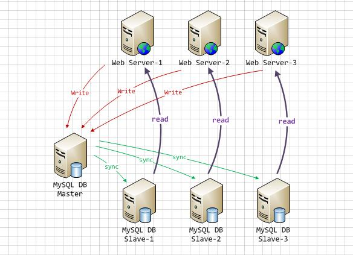

# 11.应用优化

- 笔记本：Mysql高级
- 创建时间：2020-12-09 08:52:07 UTC
- 更新时间：2020-12-09 08:58:36 UTC
- 印象笔记 GUID：77cbd5d1-6e75-4146-b4bd-afd8d49288e0

## 应用优化

在实际生产环境中，由于数据库本身的性能局限，就必须要对前台的应用进行一些优化，来降低数据库的访问压力。

### 1. 使用连接池

对于访问数据库来说，建立连接的代价是比较昂贵的，因为我们频繁的创建关闭连接，是比较耗费资源的，我们有必要建立 数据库连接池，以提高访问的性能。

### 2. 减少对MySQL的访问

#### 2.1. 避免对数据进行重复检索

在编写应用代码时，需要能够理清对数据库的访问逻辑。能够一次连接就获取到结果的，就不用两次连接，这样可以大大减少对数据库无用的重复请求。
 比如 ，需要获取书籍的id 和name字段 ， 则查询如下：

```
select id , name from tb_book;

```

之后，在业务逻辑中有需要获取到书籍状态信息， 则查询如下：

```
select id , status from tb_book;

```

这样，就需要向数据库提交两次请求，数据库就要做两次查询操作。其实完全可以用一条SQL语句得到想要的结果。

```
select id, name , status from tb_book;

```

#### 2.2. 增加 cache 层

在应用中，我们可以在应用中增加 缓存 层来达到减轻数据库负担的目的。缓存层有很多种，也有很多实现方式，只要能达到降低数据库的负担又能满足应用需求就可以。
 因此可以部分数据从数据库中抽取出来放到应用端以文本方式存储， 或者使用框架(Mybatis, Hibernate)提供的一级缓存/二级缓存，或者使用 redis 数据库来缓存数据 。

### 3. 负载均衡

负载均衡是应用中使用非常普遍的一种优化方法，它的机制就是利用某种均衡算法，将固定的负载量分布到不同的服务器上， 以此来降低单台服务器的负载，达到优化的效果。

#### 3.1. 利用MySQL复制分流查询

通过MySQL的主从复制，实现读写分离，使增删改操作走主节点，查询操作走从节点，从而可以降低单台服务器的读写压力。
 

#### 3.2. 采用分布式数据库架构

%23%23%20%E5%BA%94%E7%94%A8%E4%BC%98%E5%8C%96%0A%E5%9C%A8%E5%AE%9E%E9%99%85%E7%94%9F%E4%BA%A7%E7%8E%AF%E5%A2%83%E4%B8%AD%EF%BC%8C%E7%94%B1%E4%BA%8E%E6%95%B0%E6%8D%AE%E5%BA%93%E6%9C%AC%E8%BA%AB%E7%9A%84%E6%80%A7%E8%83%BD%E5%B1%80%E9%99%90%EF%BC%8C%E5%B0%B1%E5%BF%85%E9%A1%BB%E8%A6%81%E5%AF%B9%E5%89%8D%E5%8F%B0%E7%9A%84%E5%BA%94%E7%94%A8%E8%BF%9B%E8%A1%8C%E4%B8%80%E4%BA%9B%E4%BC%98%E5%8C%96%EF%BC%8C%E6%9D%A5%E9%99%8D%E4%BD%8E%E6%95%B0%E6%8D%AE%E5%BA%93%E7%9A%84%E8%AE%BF%E9%97%AE%E5%8E%8B%E5%8A%9B%E3%80%82%0A%0A%23%23%23%201.%20%E4%BD%BF%E7%94%A8%E8%BF%9E%E6%8E%A5%E6%B1%A0%0A%E5%AF%B9%E4%BA%8E%E8%AE%BF%E9%97%AE%E6%95%B0%E6%8D%AE%E5%BA%93%E6%9D%A5%E8%AF%B4%EF%BC%8C%E5%BB%BA%E7%AB%8B%E8%BF%9E%E6%8E%A5%E7%9A%84%E4%BB%A3%E4%BB%B7%E6%98%AF%E6%AF%94%E8%BE%83%E6%98%82%E8%B4%B5%E7%9A%84%EF%BC%8C%E5%9B%A0%E4%B8%BA%E6%88%91%E4%BB%AC%E9%A2%91%E7%B9%81%E7%9A%84%E5%88%9B%E5%BB%BA%E5%85%B3%E9%97%AD%E8%BF%9E%E6%8E%A5%EF%BC%8C%E6%98%AF%E6%AF%94%E8%BE%83%E8%80%97%E8%B4%B9%E8%B5%84%E6%BA%90%E7%9A%84%EF%BC%8C%E6%88%91%E4%BB%AC%E6%9C%89%E5%BF%85%E8%A6%81%E5%BB%BA%E7%AB%8B%20%E6%95%B0%E6%8D%AE%E5%BA%93%E8%BF%9E%E6%8E%A5%E6%B1%A0%EF%BC%8C%E4%BB%A5%E6%8F%90%E9%AB%98%E8%AE%BF%E9%97%AE%E7%9A%84%E6%80%A7%E8%83%BD%E3%80%82%0A%0A%23%23%23%202.%20%E5%87%8F%E5%B0%91%E5%AF%B9MySQL%E7%9A%84%E8%AE%BF%E9%97%AE%0A%23%23%23%23%202.1.%20%E9%81%BF%E5%85%8D%E5%AF%B9%E6%95%B0%E6%8D%AE%E8%BF%9B%E8%A1%8C%E9%87%8D%E5%A4%8D%E6%A3%80%E7%B4%A2%0A%E5%9C%A8%E7%BC%96%E5%86%99%E5%BA%94%E7%94%A8%E4%BB%A3%E7%A0%81%E6%97%B6%EF%BC%8C%E9%9C%80%E8%A6%81%E8%83%BD%E5%A4%9F%E7%90%86%E6%B8%85%E5%AF%B9%E6%95%B0%E6%8D%AE%E5%BA%93%E7%9A%84%E8%AE%BF%E9%97%AE%E9%80%BB%E8%BE%91%E3%80%82%E8%83%BD%E5%A4%9F%E4%B8%80%E6%AC%A1%E8%BF%9E%E6%8E%A5%E5%B0%B1%E8%8E%B7%E5%8F%96%E5%88%B0%E7%BB%93%E6%9E%9C%E7%9A%84%EF%BC%8C%E5%B0%B1%E4%B8%8D%E7%94%A8%E4%B8%A4%E6%AC%A1%E8%BF%9E%E6%8E%A5%EF%BC%8C%E8%BF%99%E6%A0%B7%E5%8F%AF%E4%BB%A5%E5%A4%A7%E5%A4%A7%E5%87%8F%E5%B0%91%E5%AF%B9%E6%95%B0%E6%8D%AE%E5%BA%93%E6%97%A0%E7%94%A8%E7%9A%84%E9%87%8D%E5%A4%8D%E8%AF%B7%E6%B1%82%E3%80%82%0A%E6%AF%94%E5%A6%82%20%EF%BC%8C%E9%9C%80%E8%A6%81%E8%8E%B7%E5%8F%96%E4%B9%A6%E7%B1%8D%E7%9A%84id%20%E5%92%8Cname%E5%AD%97%E6%AE%B5%20%EF%BC%8C%20%E5%88%99%E6%9F%A5%E8%AF%A2%E5%A6%82%E4%B8%8B%EF%BC%9A%0A%60%60%60sql%0Aselect%20id%20%2C%20name%20from%20tb_book%3B%0A%60%60%60%0A%E4%B9%8B%E5%90%8E%EF%BC%8C%E5%9C%A8%E4%B8%9A%E5%8A%A1%E9%80%BB%E8%BE%91%E4%B8%AD%E6%9C%89%E9%9C%80%E8%A6%81%E8%8E%B7%E5%8F%96%E5%88%B0%E4%B9%A6%E7%B1%8D%E7%8A%B6%E6%80%81%E4%BF%A1%E6%81%AF%EF%BC%8C%20%E5%88%99%E6%9F%A5%E8%AF%A2%E5%A6%82%E4%B8%8B%EF%BC%9A%0A%60%60%60sql%0Aselect%20id%20%2C%20status%20from%20tb_book%3B%0A%60%60%60%0A%E8%BF%99%E6%A0%B7%EF%BC%8C%E5%B0%B1%E9%9C%80%E8%A6%81%E5%90%91%E6%95%B0%E6%8D%AE%E5%BA%93%E6%8F%90%E4%BA%A4%E4%B8%A4%E6%AC%A1%E8%AF%B7%E6%B1%82%EF%BC%8C%E6%95%B0%E6%8D%AE%E5%BA%93%E5%B0%B1%E8%A6%81%E5%81%9A%E4%B8%A4%E6%AC%A1%E6%9F%A5%E8%AF%A2%E6%93%8D%E4%BD%9C%E3%80%82%E5%85%B6%E5%AE%9E%E5%AE%8C%E5%85%A8%E5%8F%AF%E4%BB%A5%E7%94%A8%E4%B8%80%E6%9D%A1SQL%E8%AF%AD%E5%8F%A5%E5%BE%97%E5%88%B0%E6%83%B3%E8%A6%81%E7%9A%84%E7%BB%93%E6%9E%9C%E3%80%82%0A%60%60%60sql%0Aselect%20id%2C%20name%20%2C%20status%20from%20tb_book%3B%0A%60%60%60%0A%0A%23%23%23%23%202.2.%20%E5%A2%9E%E5%8A%A0%20cache%20%E5%B1%82%0A%E5%9C%A8%E5%BA%94%E7%94%A8%E4%B8%AD%EF%BC%8C%E6%88%91%E4%BB%AC%E5%8F%AF%E4%BB%A5%E5%9C%A8%E5%BA%94%E7%94%A8%E4%B8%AD%E5%A2%9E%E5%8A%A0%20%E7%BC%93%E5%AD%98%20%E5%B1%82%E6%9D%A5%E8%BE%BE%E5%88%B0%E5%87%8F%E8%BD%BB%E6%95%B0%E6%8D%AE%E5%BA%93%E8%B4%9F%E6%8B%85%E7%9A%84%E7%9B%AE%E7%9A%84%E3%80%82%E7%BC%93%E5%AD%98%E5%B1%82%E6%9C%89%E5%BE%88%E5%A4%9A%E7%A7%8D%EF%BC%8C%E4%B9%9F%E6%9C%89%E5%BE%88%E5%A4%9A%E5%AE%9E%E7%8E%B0%E6%96%B9%E5%BC%8F%EF%BC%8C%E5%8F%AA%E8%A6%81%E8%83%BD%E8%BE%BE%E5%88%B0%E9%99%8D%E4%BD%8E%E6%95%B0%E6%8D%AE%E5%BA%93%E7%9A%84%E8%B4%9F%E6%8B%85%E5%8F%88%E8%83%BD%E6%BB%A1%E8%B6%B3%E5%BA%94%E7%94%A8%E9%9C%80%E6%B1%82%E5%B0%B1%E5%8F%AF%E4%BB%A5%E3%80%82%0A%E5%9B%A0%E6%AD%A4%E5%8F%AF%E4%BB%A5%E9%83%A8%E5%88%86%E6%95%B0%E6%8D%AE%E4%BB%8E%E6%95%B0%E6%8D%AE%E5%BA%93%E4%B8%AD%E6%8A%BD%E5%8F%96%E5%87%BA%E6%9D%A5%E6%94%BE%E5%88%B0%E5%BA%94%E7%94%A8%E7%AB%AF%E4%BB%A5%E6%96%87%E6%9C%AC%E6%96%B9%E5%BC%8F%E5%AD%98%E5%82%A8%EF%BC%8C%20%E6%88%96%E8%80%85%E4%BD%BF%E7%94%A8%E6%A1%86%E6%9E%B6(Mybatis%2C%20Hibernate)%E6%8F%90%E4%BE%9B%E7%9A%84%E4%B8%80%E7%BA%A7%E7%BC%93%E5%AD%98%2F%E4%BA%8C%E7%BA%A7%E7%BC%93%E5%AD%98%EF%BC%8C%E6%88%96%E8%80%85%E4%BD%BF%E7%94%A8%20redis%20%E6%95%B0%E6%8D%AE%E5%BA%93%E6%9D%A5%E7%BC%93%E5%AD%98%E6%95%B0%E6%8D%AE%20%E3%80%82%0A%0A%23%23%23%203.%20%E8%B4%9F%E8%BD%BD%E5%9D%87%E8%A1%A1%0A%E8%B4%9F%E8%BD%BD%E5%9D%87%E8%A1%A1%E6%98%AF%E5%BA%94%E7%94%A8%E4%B8%AD%E4%BD%BF%E7%94%A8%E9%9D%9E%E5%B8%B8%E6%99%AE%E9%81%8D%E7%9A%84%E4%B8%80%E7%A7%8D%E4%BC%98%E5%8C%96%E6%96%B9%E6%B3%95%EF%BC%8C%E5%AE%83%E7%9A%84%E6%9C%BA%E5%88%B6%E5%B0%B1%E6%98%AF%E5%88%A9%E7%94%A8%E6%9F%90%E7%A7%8D%E5%9D%87%E8%A1%A1%E7%AE%97%E6%B3%95%EF%BC%8C%E5%B0%86%E5%9B%BA%E5%AE%9A%E7%9A%84%E8%B4%9F%E8%BD%BD%E9%87%8F%E5%88%86%E5%B8%83%E5%88%B0%E4%B8%8D%E5%90%8C%E7%9A%84%E6%9C%8D%E5%8A%A1%E5%99%A8%E4%B8%8A%EF%BC%8C%20%E4%BB%A5%E6%AD%A4%E6%9D%A5%E9%99%8D%E4%BD%8E%E5%8D%95%E5%8F%B0%E6%9C%8D%E5%8A%A1%E5%99%A8%E7%9A%84%E8%B4%9F%E8%BD%BD%EF%BC%8C%E8%BE%BE%E5%88%B0%E4%BC%98%E5%8C%96%E7%9A%84%E6%95%88%E6%9E%9C%E3%80%82%0A%0A%23%23%23%23%203.1.%20%E5%88%A9%E7%94%A8MySQL%E5%A4%8D%E5%88%B6%E5%88%86%E6%B5%81%E6%9F%A5%E8%AF%A2%0A%E9%80%9A%E8%BF%87MySQL%E7%9A%84%E4%B8%BB%E4%BB%8E%E5%A4%8D%E5%88%B6%EF%BC%8C%E5%AE%9E%E7%8E%B0%E8%AF%BB%E5%86%99%E5%88%86%E7%A6%BB%EF%BC%8C%E4%BD%BF%E5%A2%9E%E5%88%A0%E6%94%B9%E6%93%8D%E4%BD%9C%E8%B5%B0%E4%B8%BB%E8%8A%82%E7%82%B9%EF%BC%8C%E6%9F%A5%E8%AF%A2%E6%93%8D%E4%BD%9C%E8%B5%B0%E4%BB%8E%E8%8A%82%E7%82%B9%EF%BC%8C%E4%BB%8E%E8%80%8C%E5%8F%AF%E4%BB%A5%E9%99%8D%E4%BD%8E%E5%8D%95%E5%8F%B0%E6%9C%8D%E5%8A%A1%E5%99%A8%E7%9A%84%E8%AF%BB%E5%86%99%E5%8E%8B%E5%8A%9B%E3%80%82%0A!%5B45096e0ab8ce523ab1743ebf55523fbc.jpeg%5D(en-resource%3A%2F%2Fdatabase%2F4358%3A0)%0A%0A%23%23%23%23%203.2.%20%E9%87%87%E7%94%A8%E5%88%86%E5%B8%83%E5%BC%8F%E6%95%B0%E6%8D%AE%E5%BA%93%E6%9E%B6%E6%9E%84%0A%E5%88%86%E5%B8%83%E5%BC%8F%E6%95%B0%E6%8D%AE%E5%BA%93%E6%9E%B6%E6%9E%84%E9%80%82%E5%90%88%E5%A4%A7%E6%95%B0%E6%8D%AE%E9%87%8F%E3%80%81%E8%B4%9F%E8%BD%BD%E9%AB%98%E7%9A%84%E6%83%85%E5%86%B5%EF%BC%8C%E5%AE%83%E6%9C%89%E8%89%AF%E5%A5%BD%E7%9A%84%E6%8B%93%E5%B1%95%E6%80%A7%E5%92%8C%E9%AB%98%E5%8F%AF%E7%94%A8%E6%80%A7%E3%80%82%E9%80%9A%E8%BF%87%E5%9C%A8%E5%A4%9A%E5%8F%B0%E6%9C%8D%E5%8A%A1%E5%99%A8%E4%B9%8B%E9%97%B4%E5%88%86%E5%B8%83%E6%95%B0%E6%8D%AE%EF%BC%8C%E5%8F%AF%E4%BB%A5%E5%AE%9E%E7%8E%B0%E5%9C%A8%E5%A4%9A%E5%8F%B0%E6%9C%8D%E5%8A%A1%E5%99%A8%E4%B9%8B%E9%97%B4%E7%9A%84%E8%B4%9F%E8%BD%BD%E5%9D%87%E8%A1%A1%EF%BC%8C%E6%8F%90%E9%AB%98%E8%AE%BF%E9%97%AE%E6%95%88%E7%8E%87%E3%80%82
