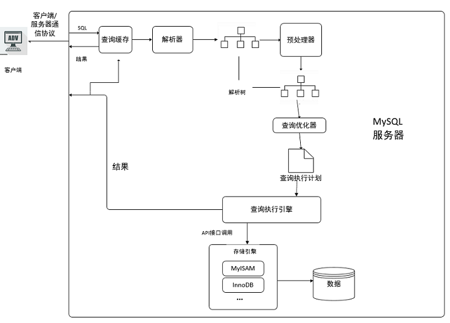
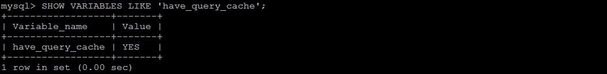
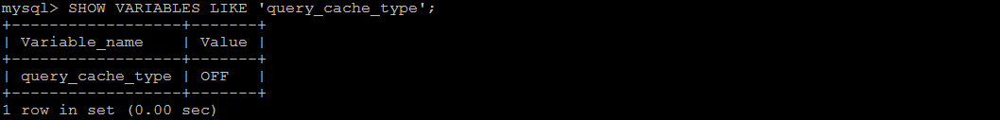
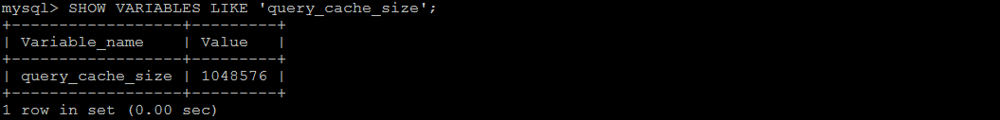
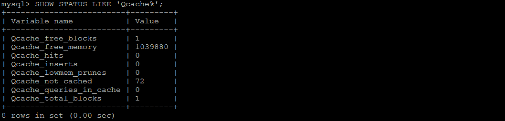

# 12.MySQL中查询缓存优化

- 笔记本：Mysql高级
- 创建时间：2020-12-09 08:59:58 UTC
- 更新时间：2020-12-09 09:27:35 UTC
- 原始链接：https://www.v2ex.com/amp/t/462703
- 印象笔记 GUID：b1d83e82-c56a-4cf2-b701-6221d9330f4c

## MySQL中查询缓存优化（MySQL5.6 之前）

### 1. 概述

开启Mysql的查询缓存，当执行完全相同的SQL语句的时候，服务器就会直接从缓存中读取结果，当数据被修改，之前的缓存会失效，修改比较频繁的表不适合做查询缓存。

### 2. 操作流程



1. 客户端发送一条查询给服务器；

1. 服务器先会检查查询缓存，如果命中了缓存，则立即返回存储在缓存中的结果。否则进入下一阶段；

1. 服务器端进行SQL解析、预处理，再由优化器生成对应的执行计划；

1. MySQL根据优化器生成的执行计划，调用存储引擎的API来执行查询；

1. 将结果返回给客户端。

### 3. 查询缓存配置

1. 查看当前的MySQL数据库是否支持查询缓存：

```
SHOW VARIABLES LIKE 'have_query_cache';

```


 2. 查看当前MySQL是否开启了查询缓存 ：

```
SHOW VARIABLES LIKE 'query_cache_type';

```


 3. 查看查询缓存的占用大小 ：

```
SHOW VARIABLES LIKE 'query_cache_size';

```


 4. 查看查询缓存的状态变量：

```
SHOW STATUS LIKE 'Qcache%';

```



各个变量的含义如下：

 | 参数 | 含义
 | Qcache_free_blocks | 查询缓存中的可用内存块数
 | Qcache_free_memory | 查询缓存的可用内存量
 | Qcache_hits | 查询缓存命中数
 | Qcache_inserts | 添加到查询缓存的查询数
 | Qcache_lowmen_prunes | 由于内存不足而从查询缓存中删除的查询数
 | Qcache_not_cached | 非缓存查询的数量（由于 query_cache_type 设置而无法缓存或未缓存）
 | Qcache_queries_in_cache | 查询缓存中注册的查询数
 | Qcache_total_blocks | 查询缓存中的块总数

### 4. 开启查询缓存

MySQL的查询缓存默认是关闭的，需要手动配置参数 query_cache_type ， 来开启查询缓存。query_cache_type 该参数的可取值有三个 ：

 | 值 | 含义
 | OFF 或 0 | 查询缓存功能关闭
 | ON 或 1 | 查询缓存功能打开，SELECT的结果符合缓存条件即会缓存，否则，不予缓存，显式指定 SQL_NO_CACHE，不予缓存
 | DEMAND 或 2 | 查询缓存功能按需进行，显式指定 SQL_CACHE 的SELECT语句才会缓存；其它均不予缓存

在 /usr/my.cnf 配置中，增加以下配置 ：
 

配置完毕之后，重启服务既可生效 ；

然后就可以在命令行执行SQL语句进行验证 ，执行一条比较耗时的SQL语句，然后再多执行几次，查看后面几次的执行时间；获取通过查看查询缓存的缓存命中数，来判定是否走查询缓存。

### 5. 查询缓存SELECT选项

可以在SELECT语句中指定两个与查询缓存相关的选项 ：
 SQL_CACHE : 如果查询结果是可缓存的，并且 query_cache_type 系统变量的值为ON或 DEMAND ，则缓存查询结果 。
 SQL_NO_CACHE : 服务器不使用查询缓存。它既不检查查询缓存，也不检查结果是否已缓存，也不缓存查询结果。
 例子：

```
SELECT SQL_CACHE id, name FROM customer;
SELECT SQL_NO_CACHE id, name FROM customer;

```

### 6. 查询缓存失效的情况

1） SQL 语句不一致的情况， 要想命中查询缓存，查询的SQL语句必须一致。

```
SQL1 : select count(*) from tb_item;
SQL2 : Select count(*) from tb_item;

```

2） 当查询语句中有一些不确定的时，则不会缓存。如 ： now() , current_date() , curdate() , curtime() , rand() , uuid() , user() , database() 。

```
SQL1 : select * from tb_item where updatetime < now() limit 1;
SQL2 : select user();
SQL3 : select database();

```

3） 不使用任何表查询语句。

```
select 'A';

```

4） 查询 mysql， information_schema或 performance_schema 数据库中的表时，不会走查询缓存。

```
select * from information_schema.engines;

```

5） 在存储的函数，触发器或事件的主体内执行的查询。
 6） 如果表更改，则使用该表的所有高速缓存查询都将变为无效并从高速缓存中删除。这包括使用MERGE映射到已更改表的表的查询。一个表可以被许多类型的语句，如被改变 INSERT， UPDATE， DELETE， TRUNCATE TABLE， ALTER TABLE， DROP TABLE，或 DROP DATABASE 。

**注意：** 8.0 中已经删除 query cache，官方所说的：造成的问题比它解决问题要多的多， 弊大于利就直接砍掉了。上门是mysql 5.* 的执行结果
 MySQL 服务器团队有一篇关于此的详细[博客](https://mysqlserverteam.com/mysql-8-0-retiring-support-for-the-query-cache/)，其中 Matt Lord 说：

>
尽管 MySQL Query Cache 旨在提高性能，但它存在严重的可伸缩性问题，并且很容易成为严重的瓶颈。
 自 MySQL 5.6（2013）以来，默认情况下已禁用查询缓存，因为总所周知，它不能与多核计算机上在高吞吐量工作负载情况下进行扩展。
 我们考虑了可以对查询进行哪些改进，以及我们可以进行的优化，这些优化可以改善所有工作负载。

虽然这些选择本身是正交的，但工程资源是有限的。也就是说，我们正在转变战略，投资于更普遍适用于所有工作负载的改进。

建议把缓存放到客户端

>
"Client + 2x ProxySQL" 结果显示，在将缓存移动到客户端时，性能提高了 5.2 倍。

%23%23%20MySQL%E4%B8%AD%E6%9F%A5%E8%AF%A2%E7%BC%93%E5%AD%98%E4%BC%98%E5%8C%96%EF%BC%88MySQL5.6%20%E4%B9%8B%E5%89%8D%EF%BC%89%0A%23%23%23%201.%20%E6%A6%82%E8%BF%B0%0A%E5%BC%80%E5%90%AFMysql%E7%9A%84%E6%9F%A5%E8%AF%A2%E7%BC%93%E5%AD%98%EF%BC%8C%E5%BD%93%E6%89%A7%E8%A1%8C%E5%AE%8C%E5%85%A8%E7%9B%B8%E5%90%8C%E7%9A%84SQL%E8%AF%AD%E5%8F%A5%E7%9A%84%E6%97%B6%E5%80%99%EF%BC%8C%E6%9C%8D%E5%8A%A1%E5%99%A8%E5%B0%B1%E4%BC%9A%E7%9B%B4%E6%8E%A5%E4%BB%8E%E7%BC%93%E5%AD%98%E4%B8%AD%E8%AF%BB%E5%8F%96%E7%BB%93%E6%9E%9C%EF%BC%8C%E5%BD%93%E6%95%B0%E6%8D%AE%E8%A2%AB%E4%BF%AE%E6%94%B9%EF%BC%8C%E4%B9%8B%E5%89%8D%E7%9A%84%E7%BC%93%E5%AD%98%E4%BC%9A%E5%A4%B1%E6%95%88%EF%BC%8C%E4%BF%AE%E6%94%B9%E6%AF%94%E8%BE%83%E9%A2%91%E7%B9%81%E7%9A%84%E8%A1%A8%E4%B8%8D%E9%80%82%E5%90%88%E5%81%9A%E6%9F%A5%E8%AF%A2%E7%BC%93%E5%AD%98%E3%80%82%0A%0A%23%23%23%202.%20%E6%93%8D%E4%BD%9C%E6%B5%81%E7%A8%8B%0A!%5Bf4f0dc5d5f446230878479adc6e321a0.png%5D(en-resource%3A%2F%2Fdatabase%2F4362%3A1)%0A1.%20%E5%AE%A2%E6%88%B7%E7%AB%AF%E5%8F%91%E9%80%81%E4%B8%80%E6%9D%A1%E6%9F%A5%E8%AF%A2%E7%BB%99%E6%9C%8D%E5%8A%A1%E5%99%A8%EF%BC%9B%0A2.%20%E6%9C%8D%E5%8A%A1%E5%99%A8%E5%85%88%E4%BC%9A%E6%A3%80%E6%9F%A5%E6%9F%A5%E8%AF%A2%E7%BC%93%E5%AD%98%EF%BC%8C%E5%A6%82%E6%9E%9C%E5%91%BD%E4%B8%AD%E4%BA%86%E7%BC%93%E5%AD%98%EF%BC%8C%E5%88%99%E7%AB%8B%E5%8D%B3%E8%BF%94%E5%9B%9E%E5%AD%98%E5%82%A8%E5%9C%A8%E7%BC%93%E5%AD%98%E4%B8%AD%E7%9A%84%E7%BB%93%E6%9E%9C%E3%80%82%E5%90%A6%E5%88%99%E8%BF%9B%E5%85%A5%E4%B8%8B%E4%B8%80%E9%98%B6%E6%AE%B5%EF%BC%9B%0A3.%20%E6%9C%8D%E5%8A%A1%E5%99%A8%E7%AB%AF%E8%BF%9B%E8%A1%8CSQL%E8%A7%A3%E6%9E%90%E3%80%81%E9%A2%84%E5%A4%84%E7%90%86%EF%BC%8C%E5%86%8D%E7%94%B1%E4%BC%98%E5%8C%96%E5%99%A8%E7%94%9F%E6%88%90%E5%AF%B9%E5%BA%94%E7%9A%84%E6%89%A7%E8%A1%8C%E8%AE%A1%E5%88%92%EF%BC%9B%0A4.%20MySQL%E6%A0%B9%E6%8D%AE%E4%BC%98%E5%8C%96%E5%99%A8%E7%94%9F%E6%88%90%E7%9A%84%E6%89%A7%E8%A1%8C%E8%AE%A1%E5%88%92%EF%BC%8C%E8%B0%83%E7%94%A8%E5%AD%98%E5%82%A8%E5%BC%95%E6%93%8E%E7%9A%84API%E6%9D%A5%E6%89%A7%E8%A1%8C%E6%9F%A5%E8%AF%A2%EF%BC%9B%0A5.%20%E5%B0%86%E7%BB%93%E6%9E%9C%E8%BF%94%E5%9B%9E%E7%BB%99%E5%AE%A2%E6%88%B7%E7%AB%AF%E3%80%82%0A%0A%23%23%23%203.%20%E6%9F%A5%E8%AF%A2%E7%BC%93%E5%AD%98%E9%85%8D%E7%BD%AE%0A1.%20%E6%9F%A5%E7%9C%8B%E5%BD%93%E5%89%8D%E7%9A%84MySQL%E6%95%B0%E6%8D%AE%E5%BA%93%E6%98%AF%E5%90%A6%E6%94%AF%E6%8C%81%E6%9F%A5%E8%AF%A2%E7%BC%93%E5%AD%98%EF%BC%9A%0A%60%60%60sql%0ASHOW%20VARIABLES%20LIKE%20'have_query_cache'%3B%09%0A%60%60%60%0A!%5Ba8cf79d2f14bb4e673a232a7e387ebb1.png%5D(en-resource%3A%2F%2Fdatabase%2F4366%3A1)%0A2.%20%E6%9F%A5%E7%9C%8B%E5%BD%93%E5%89%8DMySQL%E6%98%AF%E5%90%A6%E5%BC%80%E5%90%AF%E4%BA%86%E6%9F%A5%E8%AF%A2%E7%BC%93%E5%AD%98%20%EF%BC%9A%0A%60%60%60sql%0ASHOW%20VARIABLES%20LIKE%20'query_cache_type'%3B%0A%60%60%60%0A!%5B210f1b43779bfcb2bac843b013ffaa1a.png%5D(en-resource%3A%2F%2Fdatabase%2F4368%3A1)%0A3.%20%E6%9F%A5%E7%9C%8B%E6%9F%A5%E8%AF%A2%E7%BC%93%E5%AD%98%E7%9A%84%E5%8D%A0%E7%94%A8%E5%A4%A7%E5%B0%8F%20%EF%BC%9A%0A%60%60%60sql%0ASHOW%20VARIABLES%20LIKE%20'query_cache_size'%3B%0A%60%60%60%0A!%5B76a9f7aa96d96faebca2288239833b8c.png%5D(en-resource%3A%2F%2Fdatabase%2F4370%3A1)%0A4.%20%E6%9F%A5%E7%9C%8B%E6%9F%A5%E8%AF%A2%E7%BC%93%E5%AD%98%E7%9A%84%E7%8A%B6%E6%80%81%E5%8F%98%E9%87%8F%EF%BC%9A%0A%60%60%60sql%0ASHOW%20STATUS%20LIKE%20'Qcache%25'%3B%0A%60%60%60%0A!%5B73ddedfdd94ddb9502c9c0867e3c41ca.png%5D(en-resource%3A%2F%2Fdatabase%2F4372%3A1)%0A%0A%E5%90%84%E4%B8%AA%E5%8F%98%E9%87%8F%E7%9A%84%E5%90%AB%E4%B9%89%E5%A6%82%E4%B8%8B%EF%BC%9A%0A%7C%20%E5%8F%82%E6%95%B0%20%20%20%20%20%20%20%20%20%20%20%20%20%20%20%20%20%20%20%20%7C%20%E5%90%AB%E4%B9%89%20%20%20%20%20%20%20%20%20%20%20%20%20%20%20%20%20%20%20%20%20%20%20%20%20%20%20%20%20%20%20%20%20%20%20%20%20%20%20%20%20%20%20%20%20%20%20%20%20%20%20%20%20%20%20%20%20%7C%0A%7C%20-----------------------%20%7C%20------------------------------------------------------------%20%7C%0A%7C%20Qcache_free_blocks%20%20%20%20%20%20%7C%20%E6%9F%A5%E8%AF%A2%E7%BC%93%E5%AD%98%E4%B8%AD%E7%9A%84%E5%8F%AF%E7%94%A8%E5%86%85%E5%AD%98%E5%9D%97%E6%95%B0%20%20%20%20%20%20%20%20%20%20%20%20%20%20%20%20%20%20%20%20%20%20%20%20%20%20%20%20%20%20%20%20%20%20%20%20%20%7C%0A%7C%20Qcache_free_memory%20%20%20%20%20%20%7C%20%E6%9F%A5%E8%AF%A2%E7%BC%93%E5%AD%98%E7%9A%84%E5%8F%AF%E7%94%A8%E5%86%85%E5%AD%98%E9%87%8F%20%20%20%20%20%20%20%20%20%20%20%20%20%20%20%20%20%20%20%20%20%20%20%20%20%20%20%20%20%20%20%20%20%20%20%20%20%20%20%20%20%7C%0A%7C%20Qcache_hits%20%20%20%20%20%20%20%20%20%20%20%20%20%7C%20%E6%9F%A5%E8%AF%A2%E7%BC%93%E5%AD%98%E5%91%BD%E4%B8%AD%E6%95%B0%20%20%20%20%20%20%20%20%20%20%20%20%20%20%20%20%20%20%20%20%20%20%20%20%20%20%20%20%20%20%20%20%20%20%20%20%20%20%20%20%20%20%20%20%20%20%20%7C%0A%7C%20Qcache_inserts%20%20%20%20%20%20%20%20%20%20%7C%20%E6%B7%BB%E5%8A%A0%E5%88%B0%E6%9F%A5%E8%AF%A2%E7%BC%93%E5%AD%98%E7%9A%84%E6%9F%A5%E8%AF%A2%E6%95%B0%20%20%20%20%20%20%20%20%20%20%20%20%20%20%20%20%20%20%20%20%20%20%20%20%20%20%20%20%20%20%20%20%20%20%20%20%20%20%20%7C%0A%7C%20Qcache_lowmen_prunes%20%20%20%20%7C%20%E7%94%B1%E4%BA%8E%E5%86%85%E5%AD%98%E4%B8%8D%E8%B6%B3%E8%80%8C%E4%BB%8E%E6%9F%A5%E8%AF%A2%E7%BC%93%E5%AD%98%E4%B8%AD%E5%88%A0%E9%99%A4%E7%9A%84%E6%9F%A5%E8%AF%A2%E6%95%B0%20%20%20%20%20%20%20%20%20%20%20%20%20%20%20%20%20%20%20%20%20%20%20%7C%0A%7C%20Qcache_not_cached%20%20%20%20%20%20%20%7C%20%E9%9D%9E%E7%BC%93%E5%AD%98%E6%9F%A5%E8%AF%A2%E7%9A%84%E6%95%B0%E9%87%8F%EF%BC%88%E7%94%B1%E4%BA%8E%20query_cache_type%20%E8%AE%BE%E7%BD%AE%E8%80%8C%E6%97%A0%E6%B3%95%E7%BC%93%E5%AD%98%E6%88%96%E6%9C%AA%E7%BC%93%E5%AD%98%EF%BC%89%20%7C%0A%7C%20Qcache_queries_in_cache%20%7C%20%E6%9F%A5%E8%AF%A2%E7%BC%93%E5%AD%98%E4%B8%AD%E6%B3%A8%E5%86%8C%E7%9A%84%E6%9F%A5%E8%AF%A2%E6%95%B0%20%20%20%20%20%20%20%20%20%20%20%20%20%20%20%20%20%20%20%20%20%20%20%20%20%20%20%20%20%20%20%20%20%20%20%20%20%20%20%7C%0A%7C%20Qcache_total_blocks%20%20%20%20%20%7C%20%E6%9F%A5%E8%AF%A2%E7%BC%93%E5%AD%98%E4%B8%AD%E7%9A%84%E5%9D%97%E6%80%BB%E6%95%B0%20%20%20%20%20%20%20%20%20%20%20%20%20%20%20%20%20%20%20%20%20%20%20%20%20%20%20%20%20%20%20%20%20%20%20%20%20%20%20%20%20%20%20%7C%0A%0A%23%23%23%204.%20%E5%BC%80%E5%90%AF%E6%9F%A5%E8%AF%A2%E7%BC%93%E5%AD%98%0AMySQL%E7%9A%84%E6%9F%A5%E8%AF%A2%E7%BC%93%E5%AD%98%E9%BB%98%E8%AE%A4%E6%98%AF%E5%85%B3%E9%97%AD%E7%9A%84%EF%BC%8C%E9%9C%80%E8%A6%81%E6%89%8B%E5%8A%A8%E9%85%8D%E7%BD%AE%E5%8F%82%E6%95%B0%20query_cache_type%20%EF%BC%8C%20%E6%9D%A5%E5%BC%80%E5%90%AF%E6%9F%A5%E8%AF%A2%E7%BC%93%E5%AD%98%E3%80%82query_cache_type%20%E8%AF%A5%E5%8F%82%E6%95%B0%E7%9A%84%E5%8F%AF%E5%8F%96%E5%80%BC%E6%9C%89%E4%B8%89%E4%B8%AA%20%EF%BC%9A%0A%7C%20%E5%80%BC%20%20%20%20%20%20%20%20%20%20%7C%20%E5%90%AB%E4%B9%89%20%20%20%20%20%20%20%20%20%20%20%20%20%20%20%20%20%20%20%20%20%20%20%20%20%20%20%20%20%20%20%20%20%20%20%20%20%20%20%20%20%20%20%20%20%20%20%20%20%20%20%20%20%20%20%20%20%7C%0A%7C%20-----------%20%7C%20------------------------------------------------------------%20%7C%0A%7C%20OFF%20%E6%88%96%200%20%20%20%20%7C%20%E6%9F%A5%E8%AF%A2%E7%BC%93%E5%AD%98%E5%8A%9F%E8%83%BD%E5%85%B3%E9%97%AD%20%20%20%20%20%20%20%20%20%20%20%20%20%20%20%20%20%20%20%20%20%20%20%20%20%20%20%20%20%20%20%20%20%20%20%20%20%20%20%20%20%20%20%20%20%7C%0A%7C%20ON%20%E6%88%96%201%20%20%20%20%20%7C%20%E6%9F%A5%E8%AF%A2%E7%BC%93%E5%AD%98%E5%8A%9F%E8%83%BD%E6%89%93%E5%BC%80%EF%BC%8CSELECT%E7%9A%84%E7%BB%93%E6%9E%9C%E7%AC%A6%E5%90%88%E7%BC%93%E5%AD%98%E6%9D%A1%E4%BB%B6%E5%8D%B3%E4%BC%9A%E7%BC%93%E5%AD%98%EF%BC%8C%E5%90%A6%E5%88%99%EF%BC%8C%E4%B8%8D%E4%BA%88%E7%BC%93%E5%AD%98%EF%BC%8C%E6%98%BE%E5%BC%8F%E6%8C%87%E5%AE%9A%20SQL_NO_CACHE%EF%BC%8C%E4%B8%8D%E4%BA%88%E7%BC%93%E5%AD%98%20%7C%0A%7C%20DEMAND%20%E6%88%96%202%20%7C%20%E6%9F%A5%E8%AF%A2%E7%BC%93%E5%AD%98%E5%8A%9F%E8%83%BD%E6%8C%89%E9%9C%80%E8%BF%9B%E8%A1%8C%EF%BC%8C%E6%98%BE%E5%BC%8F%E6%8C%87%E5%AE%9A%20SQL_CACHE%20%E7%9A%84SELECT%E8%AF%AD%E5%8F%A5%E6%89%8D%E4%BC%9A%E7%BC%93%E5%AD%98%EF%BC%9B%E5%85%B6%E5%AE%83%E5%9D%87%E4%B8%8D%E4%BA%88%E7%BC%93%E5%AD%98%20%7C%0A%0A%E5%9C%A8%20%2Fusr%2Fmy.cnf%20%E9%85%8D%E7%BD%AE%E4%B8%AD%EF%BC%8C%E5%A2%9E%E5%8A%A0%E4%BB%A5%E4%B8%8B%E9%85%8D%E7%BD%AE%20%EF%BC%9A%0A!%5B2f4601b82bc9dd57d53f16c976f73ffc.png%5D(en-resource%3A%2F%2Fdatabase%2F4374%3A0)%0A%0A%E9%85%8D%E7%BD%AE%E5%AE%8C%E6%AF%95%E4%B9%8B%E5%90%8E%EF%BC%8C%E9%87%8D%E5%90%AF%E6%9C%8D%E5%8A%A1%E6%97%A2%E5%8F%AF%E7%94%9F%E6%95%88%20%EF%BC%9B%0A%0A%E7%84%B6%E5%90%8E%E5%B0%B1%E5%8F%AF%E4%BB%A5%E5%9C%A8%E5%91%BD%E4%BB%A4%E8%A1%8C%E6%89%A7%E8%A1%8CSQL%E8%AF%AD%E5%8F%A5%E8%BF%9B%E8%A1%8C%E9%AA%8C%E8%AF%81%20%EF%BC%8C%E6%89%A7%E8%A1%8C%E4%B8%80%E6%9D%A1%E6%AF%94%E8%BE%83%E8%80%97%E6%97%B6%E7%9A%84SQL%E8%AF%AD%E5%8F%A5%EF%BC%8C%E7%84%B6%E5%90%8E%E5%86%8D%E5%A4%9A%E6%89%A7%E8%A1%8C%E5%87%A0%E6%AC%A1%EF%BC%8C%E6%9F%A5%E7%9C%8B%E5%90%8E%E9%9D%A2%E5%87%A0%E6%AC%A1%E7%9A%84%E6%89%A7%E8%A1%8C%E6%97%B6%E9%97%B4%EF%BC%9B%E8%8E%B7%E5%8F%96%E9%80%9A%E8%BF%87%E6%9F%A5%E7%9C%8B%E6%9F%A5%E8%AF%A2%E7%BC%93%E5%AD%98%E7%9A%84%E7%BC%93%E5%AD%98%E5%91%BD%E4%B8%AD%E6%95%B0%EF%BC%8C%E6%9D%A5%E5%88%A4%E5%AE%9A%E6%98%AF%E5%90%A6%E8%B5%B0%E6%9F%A5%E8%AF%A2%E7%BC%93%E5%AD%98%E3%80%82%0A%0A%23%23%23%205.%20%E6%9F%A5%E8%AF%A2%E7%BC%93%E5%AD%98SELECT%E9%80%89%E9%A1%B9%0A%E5%8F%AF%E4%BB%A5%E5%9C%A8SELECT%E8%AF%AD%E5%8F%A5%E4%B8%AD%E6%8C%87%E5%AE%9A%E4%B8%A4%E4%B8%AA%E4%B8%8E%E6%9F%A5%E8%AF%A2%E7%BC%93%E5%AD%98%E7%9B%B8%E5%85%B3%E7%9A%84%E9%80%89%E9%A1%B9%20%EF%BC%9A%0ASQL_CACHE%20%3A%20%E5%A6%82%E6%9E%9C%E6%9F%A5%E8%AF%A2%E7%BB%93%E6%9E%9C%E6%98%AF%E5%8F%AF%E7%BC%93%E5%AD%98%E7%9A%84%EF%BC%8C%E5%B9%B6%E4%B8%94%20query_cache_type%20%E7%B3%BB%E7%BB%9F%E5%8F%98%E9%87%8F%E7%9A%84%E5%80%BC%E4%B8%BAON%E6%88%96%20DEMAND%20%EF%BC%8C%E5%88%99%E7%BC%93%E5%AD%98%E6%9F%A5%E8%AF%A2%E7%BB%93%E6%9E%9C%20%E3%80%82%0ASQL_NO_CACHE%20%3A%20%E6%9C%8D%E5%8A%A1%E5%99%A8%E4%B8%8D%E4%BD%BF%E7%94%A8%E6%9F%A5%E8%AF%A2%E7%BC%93%E5%AD%98%E3%80%82%E5%AE%83%E6%97%A2%E4%B8%8D%E6%A3%80%E6%9F%A5%E6%9F%A5%E8%AF%A2%E7%BC%93%E5%AD%98%EF%BC%8C%E4%B9%9F%E4%B8%8D%E6%A3%80%E6%9F%A5%E7%BB%93%E6%9E%9C%E6%98%AF%E5%90%A6%E5%B7%B2%E7%BC%93%E5%AD%98%EF%BC%8C%E4%B9%9F%E4%B8%8D%E7%BC%93%E5%AD%98%E6%9F%A5%E8%AF%A2%E7%BB%93%E6%9E%9C%E3%80%82%0A%E4%BE%8B%E5%AD%90%EF%BC%9A%0A%60%60%60sql%0ASELECT%20SQL_CACHE%20id%2C%20name%20FROM%20customer%3B%0ASELECT%20SQL_NO_CACHE%20id%2C%20name%20FROM%20customer%3B%0A%60%60%60%0A%0A%23%23%23%206.%20%E6%9F%A5%E8%AF%A2%E7%BC%93%E5%AD%98%E5%A4%B1%E6%95%88%E7%9A%84%E6%83%85%E5%86%B5%0A1%EF%BC%89%20SQL%20%E8%AF%AD%E5%8F%A5%E4%B8%8D%E4%B8%80%E8%87%B4%E7%9A%84%E6%83%85%E5%86%B5%EF%BC%8C%20%E8%A6%81%E6%83%B3%E5%91%BD%E4%B8%AD%E6%9F%A5%E8%AF%A2%E7%BC%93%E5%AD%98%EF%BC%8C%E6%9F%A5%E8%AF%A2%E7%9A%84SQL%E8%AF%AD%E5%8F%A5%E5%BF%85%E9%A1%BB%E4%B8%80%E8%87%B4%E3%80%82%0A%60%60%60sql%0ASQL1%20%3A%20select%20count(*)%20from%20tb_item%3B%0ASQL2%20%3A%20Select%20count(*)%20from%20tb_item%3B%0A%60%60%60%0A2%EF%BC%89%20%E5%BD%93%E6%9F%A5%E8%AF%A2%E8%AF%AD%E5%8F%A5%E4%B8%AD%E6%9C%89%E4%B8%80%E4%BA%9B%E4%B8%8D%E7%A1%AE%E5%AE%9A%E7%9A%84%E6%97%B6%EF%BC%8C%E5%88%99%E4%B8%8D%E4%BC%9A%E7%BC%93%E5%AD%98%E3%80%82%E5%A6%82%20%EF%BC%9A%20now()%20%2C%20current_date()%20%2C%20curdate()%20%2C%20curtime()%20%2C%20rand()%20%2C%20uuid()%20%2C%20user()%20%2C%20database()%20%E3%80%82%0A%60%60%60sql%0ASQL1%20%3A%20select%20*%20from%20tb_item%20where%20updatetime%20%3C%20now()%20limit%201%3B%0ASQL2%20%3A%20select%20user()%3B%0ASQL3%20%3A%20select%20database()%3B%0A%60%60%60%0A3%EF%BC%89%20%E4%B8%8D%E4%BD%BF%E7%94%A8%E4%BB%BB%E4%BD%95%E8%A1%A8%E6%9F%A5%E8%AF%A2%E8%AF%AD%E5%8F%A5%E3%80%82%0A%60%60%60sql%0Aselect%20'A'%3B%0A%60%60%60%0A4%EF%BC%89%20%E6%9F%A5%E8%AF%A2%20mysql%EF%BC%8C%20information_schema%E6%88%96%20performance_schema%20%E6%95%B0%E6%8D%AE%E5%BA%93%E4%B8%AD%E7%9A%84%E8%A1%A8%E6%97%B6%EF%BC%8C%E4%B8%8D%E4%BC%9A%E8%B5%B0%E6%9F%A5%E8%AF%A2%E7%BC%93%E5%AD%98%E3%80%82%0A%60%60%60sql%0Aselect%20*%20from%20information_schema.engines%3B%0A%60%60%60%0A5%EF%BC%89%20%E5%9C%A8%E5%AD%98%E5%82%A8%E7%9A%84%E5%87%BD%E6%95%B0%EF%BC%8C%E8%A7%A6%E5%8F%91%E5%99%A8%E6%88%96%E4%BA%8B%E4%BB%B6%E7%9A%84%E4%B8%BB%E4%BD%93%E5%86%85%E6%89%A7%E8%A1%8C%E7%9A%84%E6%9F%A5%E8%AF%A2%E3%80%82%0A6%EF%BC%89%20%E5%A6%82%E6%9E%9C%E8%A1%A8%E6%9B%B4%E6%94%B9%EF%BC%8C%E5%88%99%E4%BD%BF%E7%94%A8%E8%AF%A5%E8%A1%A8%E7%9A%84%E6%89%80%E6%9C%89%E9%AB%98%E9%80%9F%E7%BC%93%E5%AD%98%E6%9F%A5%E8%AF%A2%E9%83%BD%E5%B0%86%E5%8F%98%E4%B8%BA%E6%97%A0%E6%95%88%E5%B9%B6%E4%BB%8E%E9%AB%98%E9%80%9F%E7%BC%93%E5%AD%98%E4%B8%AD%E5%88%A0%E9%99%A4%E3%80%82%E8%BF%99%E5%8C%85%E6%8B%AC%E4%BD%BF%E7%94%A8MERGE%E6%98%A0%E5%B0%84%E5%88%B0%E5%B7%B2%E6%9B%B4%E6%94%B9%E8%A1%A8%E7%9A%84%E8%A1%A8%E7%9A%84%E6%9F%A5%E8%AF%A2%E3%80%82%E4%B8%80%E4%B8%AA%E8%A1%A8%E5%8F%AF%E4%BB%A5%E8%A2%AB%E8%AE%B8%E5%A4%9A%E7%B1%BB%E5%9E%8B%E7%9A%84%E8%AF%AD%E5%8F%A5%EF%BC%8C%E5%A6%82%E8%A2%AB%E6%94%B9%E5%8F%98%20INSERT%EF%BC%8C%20UPDATE%EF%BC%8C%20DELETE%EF%BC%8C%20TRUNCATE%20TABLE%EF%BC%8C%20ALTER%20TABLE%EF%BC%8C%20DROP%20TABLE%EF%BC%8C%E6%88%96%20DROP%20DATABASE%20%E3%80%82%0A%0A**%E6%B3%A8%E6%84%8F%EF%BC%9A**%208.0%20%E4%B8%AD%E5%B7%B2%E7%BB%8F%E5%88%A0%E9%99%A4%20query%20cache%EF%BC%8C%E5%AE%98%E6%96%B9%E6%89%80%E8%AF%B4%E7%9A%84%EF%BC%9A%E9%80%A0%E6%88%90%E7%9A%84%E9%97%AE%E9%A2%98%E6%AF%94%E5%AE%83%E8%A7%A3%E5%86%B3%E9%97%AE%E9%A2%98%E8%A6%81%E5%A4%9A%E7%9A%84%E5%A4%9A%EF%BC%8C%20%E5%BC%8A%E5%A4%A7%E4%BA%8E%E5%88%A9%E5%B0%B1%E7%9B%B4%E6%8E%A5%E7%A0%8D%E6%8E%89%E4%BA%86%E3%80%82%E4%B8%8A%E9%97%A8%E6%98%AFmysql%205.*%20%E7%9A%84%E6%89%A7%E8%A1%8C%E7%BB%93%E6%9E%9C%0AMySQL%20%E6%9C%8D%E5%8A%A1%E5%99%A8%E5%9B%A2%E9%98%9F%E6%9C%89%E4%B8%80%E7%AF%87%E5%85%B3%E4%BA%8E%E6%AD%A4%E7%9A%84%E8%AF%A6%E7%BB%86%5B%E5%8D%9A%E5%AE%A2%5D(https%3A%2F%2Fmysqlserverteam.com%2Fmysql-8-0-retiring-support-for-the-query-cache%2F)%EF%BC%8C%E5%85%B6%E4%B8%AD%20Matt%20Lord%20%E8%AF%B4%EF%BC%9A%0A%3E%20%E5%B0%BD%E7%AE%A1%20MySQL%20Query%20Cache%20%E6%97%A8%E5%9C%A8%E6%8F%90%E9%AB%98%E6%80%A7%E8%83%BD%EF%BC%8C%E4%BD%86%E5%AE%83%E5%AD%98%E5%9C%A8%E4%B8%A5%E9%87%8D%E7%9A%84%E5%8F%AF%E4%BC%B8%E7%BC%A9%E6%80%A7%E9%97%AE%E9%A2%98%EF%BC%8C%E5%B9%B6%E4%B8%94%E5%BE%88%E5%AE%B9%E6%98%93%E6%88%90%E4%B8%BA%E4%B8%A5%E9%87%8D%E7%9A%84%E7%93%B6%E9%A2%88%E3%80%82%0A%3E%20%E8%87%AA%20MySQL%205.6%EF%BC%882013%EF%BC%89%E4%BB%A5%E6%9D%A5%EF%BC%8C%E9%BB%98%E8%AE%A4%E6%83%85%E5%86%B5%E4%B8%8B%E5%B7%B2%E7%A6%81%E7%94%A8%E6%9F%A5%E8%AF%A2%E7%BC%93%E5%AD%98%EF%BC%8C%E5%9B%A0%E4%B8%BA%E6%80%BB%E6%89%80%E5%91%A8%E7%9F%A5%EF%BC%8C%E5%AE%83%E4%B8%8D%E8%83%BD%E4%B8%8E%E5%A4%9A%E6%A0%B8%E8%AE%A1%E7%AE%97%E6%9C%BA%E4%B8%8A%E5%9C%A8%E9%AB%98%E5%90%9E%E5%90%90%E9%87%8F%E5%B7%A5%E4%BD%9C%E8%B4%9F%E8%BD%BD%E6%83%85%E5%86%B5%E4%B8%8B%E8%BF%9B%E8%A1%8C%E6%89%A9%E5%B1%95%E3%80%82%0A%3E%20%E6%88%91%E4%BB%AC%E8%80%83%E8%99%91%E4%BA%86%E5%8F%AF%E4%BB%A5%E5%AF%B9%E6%9F%A5%E8%AF%A2%E8%BF%9B%E8%A1%8C%E5%93%AA%E4%BA%9B%E6%94%B9%E8%BF%9B%EF%BC%8C%E4%BB%A5%E5%8F%8A%E6%88%91%E4%BB%AC%E5%8F%AF%E4%BB%A5%E8%BF%9B%E8%A1%8C%E7%9A%84%E4%BC%98%E5%8C%96%EF%BC%8C%E8%BF%99%E4%BA%9B%E4%BC%98%E5%8C%96%E5%8F%AF%E4%BB%A5%E6%94%B9%E5%96%84%E6%89%80%E6%9C%89%E5%B7%A5%E4%BD%9C%E8%B4%9F%E8%BD%BD%E3%80%82%0A%3E%20%0A%3E%20%E8%99%BD%E7%84%B6%E8%BF%99%E4%BA%9B%E9%80%89%E6%8B%A9%E6%9C%AC%E8%BA%AB%E6%98%AF%E6%AD%A3%E4%BA%A4%E7%9A%84%EF%BC%8C%E4%BD%86%E5%B7%A5%E7%A8%8B%E8%B5%84%E6%BA%90%E6%98%AF%E6%9C%89%E9%99%90%E7%9A%84%E3%80%82%E4%B9%9F%E5%B0%B1%E6%98%AF%E8%AF%B4%EF%BC%8C%E6%88%91%E4%BB%AC%E6%AD%A3%E5%9C%A8%E8%BD%AC%E5%8F%98%E6%88%98%E7%95%A5%EF%BC%8C%E6%8A%95%E8%B5%84%E4%BA%8E%E6%9B%B4%E6%99%AE%E9%81%8D%E9%80%82%E7%94%A8%E4%BA%8E%E6%89%80%E6%9C%89%E5%B7%A5%E4%BD%9C%E8%B4%9F%E8%BD%BD%E7%9A%84%E6%94%B9%E8%BF%9B%E3%80%82%0A%0A%E5%BB%BA%E8%AE%AE%E6%8A%8A%E7%BC%93%E5%AD%98%E6%94%BE%E5%88%B0%E5%AE%A2%E6%88%B7%E7%AB%AF%0A%3E%20%22Client%20%2B%202x%20ProxySQL%22%20%E7%BB%93%E6%9E%9C%E6%98%BE%E7%A4%BA%EF%BC%8C%E5%9C%A8%E5%B0%86%E7%BC%93%E5%AD%98%E7%A7%BB%E5%8A%A8%E5%88%B0%E5%AE%A2%E6%88%B7%E7%AB%AF%E6%97%B6%EF%BC%8C%E6%80%A7%E8%83%BD%E6%8F%90%E9%AB%98%E4%BA%86%205.2%20%E5%80%8D%E3%80%82
