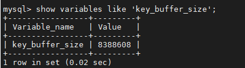

# 13.MySQL 内存管理及优化

- 笔记本：Mysql高级
- 创建时间：2020-12-10 03:00:05 UTC
- 更新时间：2020-12-10 03:07:10 UTC
- 印象笔记 GUID：4f49021d-605a-45d6-838b-0b7abc473991

## MySQL 内存管理及优化

### 1. 内存优化原则

1. 将尽量多的内存分配给MySQL做缓存，但要给操作系统和其他程序预留足够内存。

1. MyISAM 存储引擎的数据文件读取依赖于操作系统自身的IO缓存，因此，如果有MyISAM表，就要预留更多的内存给操作系统做IO缓存。

1. 排序区、连接区等缓存是分配给每个数据库会话（session）专用的，其默认值的设置要根据最大连接数合理分配，如果设置太大，不但浪费资源，而且在并发连接较高时会导致物理内存耗尽。

### 2. MyISAM 内存优化

myisam存储引擎使用 key_buffer 缓存索引块，加速myisam索引的读写速度。对于myisam表的数据块，mysql没有特别的缓存机制，完全依赖于操作系统的IO缓存。

#### 2.1. key_buffer_size

key_buffer_size决定MyISAM索引块缓存区的大小，直接影响到MyISAM表的存取效率。可以在MySQL参数文件中设置key_buffer_size的值，对于一般MyISAM数据库，建议至少将1/4可用内存分配给key_buffer_size。
 默认大小：
 

在/usr/my.cnf 中做如下配置：

```
key_buffer_size=512M

```

#### 2.2. read_buffer_size

如果需要经常顺序扫描myisam表，可以通过增大read_buffer_size的值来改善性能。但需要注意的是read_buffer_size是每个session独占的，如果默认值设置太大，就会造成内存浪费。

#### 2.3. read_rnd_buffer_size

对于需要做排序的myisam表的查询，如带有order by子句的sql，适当增加 read_rnd_buffer_size 的值，可以改善此类的sql性能。但需要注意的是 read_rnd_buffer_size 是每个session独占的，如果默认值设置太大，就会造成内存浪费。

### 3. InnoDB 内存优化

%23%23%20MySQL%20%E5%86%85%E5%AD%98%E7%AE%A1%E7%90%86%E5%8F%8A%E4%BC%98%E5%8C%96%0A%0A%23%23%23%201.%20%E5%86%85%E5%AD%98%E4%BC%98%E5%8C%96%E5%8E%9F%E5%88%99%0A1.%20%E5%B0%86%E5%B0%BD%E9%87%8F%E5%A4%9A%E7%9A%84%E5%86%85%E5%AD%98%E5%88%86%E9%85%8D%E7%BB%99MySQL%E5%81%9A%E7%BC%93%E5%AD%98%EF%BC%8C%E4%BD%86%E8%A6%81%E7%BB%99%E6%93%8D%E4%BD%9C%E7%B3%BB%E7%BB%9F%E5%92%8C%E5%85%B6%E4%BB%96%E7%A8%8B%E5%BA%8F%E9%A2%84%E7%95%99%E8%B6%B3%E5%A4%9F%E5%86%85%E5%AD%98%E3%80%82%0A2.%20MyISAM%20%E5%AD%98%E5%82%A8%E5%BC%95%E6%93%8E%E7%9A%84%E6%95%B0%E6%8D%AE%E6%96%87%E4%BB%B6%E8%AF%BB%E5%8F%96%E4%BE%9D%E8%B5%96%E4%BA%8E%E6%93%8D%E4%BD%9C%E7%B3%BB%E7%BB%9F%E8%87%AA%E8%BA%AB%E7%9A%84IO%E7%BC%93%E5%AD%98%EF%BC%8C%E5%9B%A0%E6%AD%A4%EF%BC%8C%E5%A6%82%E6%9E%9C%E6%9C%89MyISAM%E8%A1%A8%EF%BC%8C%E5%B0%B1%E8%A6%81%E9%A2%84%E7%95%99%E6%9B%B4%E5%A4%9A%E7%9A%84%E5%86%85%E5%AD%98%E7%BB%99%E6%93%8D%E4%BD%9C%E7%B3%BB%E7%BB%9F%E5%81%9AIO%E7%BC%93%E5%AD%98%E3%80%82%0A3.%20%E6%8E%92%E5%BA%8F%E5%8C%BA%E3%80%81%E8%BF%9E%E6%8E%A5%E5%8C%BA%E7%AD%89%E7%BC%93%E5%AD%98%E6%98%AF%E5%88%86%E9%85%8D%E7%BB%99%E6%AF%8F%E4%B8%AA%E6%95%B0%E6%8D%AE%E5%BA%93%E4%BC%9A%E8%AF%9D%EF%BC%88session%EF%BC%89%E4%B8%93%E7%94%A8%E7%9A%84%EF%BC%8C%E5%85%B6%E9%BB%98%E8%AE%A4%E5%80%BC%E7%9A%84%E8%AE%BE%E7%BD%AE%E8%A6%81%E6%A0%B9%E6%8D%AE%E6%9C%80%E5%A4%A7%E8%BF%9E%E6%8E%A5%E6%95%B0%E5%90%88%E7%90%86%E5%88%86%E9%85%8D%EF%BC%8C%E5%A6%82%E6%9E%9C%E8%AE%BE%E7%BD%AE%E5%A4%AA%E5%A4%A7%EF%BC%8C%E4%B8%8D%E4%BD%86%E6%B5%AA%E8%B4%B9%E8%B5%84%E6%BA%90%EF%BC%8C%E8%80%8C%E4%B8%94%E5%9C%A8%E5%B9%B6%E5%8F%91%E8%BF%9E%E6%8E%A5%E8%BE%83%E9%AB%98%E6%97%B6%E4%BC%9A%E5%AF%BC%E8%87%B4%E7%89%A9%E7%90%86%E5%86%85%E5%AD%98%E8%80%97%E5%B0%BD%E3%80%82%0A%0A%23%23%23%202.%20MyISAM%20%E5%86%85%E5%AD%98%E4%BC%98%E5%8C%96%0Amyisam%E5%AD%98%E5%82%A8%E5%BC%95%E6%93%8E%E4%BD%BF%E7%94%A8%20key_buffer%20%E7%BC%93%E5%AD%98%E7%B4%A2%E5%BC%95%E5%9D%97%EF%BC%8C%E5%8A%A0%E9%80%9Fmyisam%E7%B4%A2%E5%BC%95%E7%9A%84%E8%AF%BB%E5%86%99%E9%80%9F%E5%BA%A6%E3%80%82%E5%AF%B9%E4%BA%8Emyisam%E8%A1%A8%E7%9A%84%E6%95%B0%E6%8D%AE%E5%9D%97%EF%BC%8Cmysql%E6%B2%A1%E6%9C%89%E7%89%B9%E5%88%AB%E7%9A%84%E7%BC%93%E5%AD%98%E6%9C%BA%E5%88%B6%EF%BC%8C%E5%AE%8C%E5%85%A8%E4%BE%9D%E8%B5%96%E4%BA%8E%E6%93%8D%E4%BD%9C%E7%B3%BB%E7%BB%9F%E7%9A%84IO%E7%BC%93%E5%AD%98%E3%80%82%0A%0A%23%23%23%23%202.1.%20key_buffer_size%0Akey_buffer_size%E5%86%B3%E5%AE%9AMyISAM%E7%B4%A2%E5%BC%95%E5%9D%97%E7%BC%93%E5%AD%98%E5%8C%BA%E7%9A%84%E5%A4%A7%E5%B0%8F%EF%BC%8C%E7%9B%B4%E6%8E%A5%E5%BD%B1%E5%93%8D%E5%88%B0MyISAM%E8%A1%A8%E7%9A%84%E5%AD%98%E5%8F%96%E6%95%88%E7%8E%87%E3%80%82%E5%8F%AF%E4%BB%A5%E5%9C%A8MySQL%E5%8F%82%E6%95%B0%E6%96%87%E4%BB%B6%E4%B8%AD%E8%AE%BE%E7%BD%AEkey_buffer_size%E7%9A%84%E5%80%BC%EF%BC%8C%E5%AF%B9%E4%BA%8E%E4%B8%80%E8%88%ACMyISAM%E6%95%B0%E6%8D%AE%E5%BA%93%EF%BC%8C%E5%BB%BA%E8%AE%AE%E8%87%B3%E5%B0%91%E5%B0%861%2F4%E5%8F%AF%E7%94%A8%E5%86%85%E5%AD%98%E5%88%86%E9%85%8D%E7%BB%99key_buffer_size%E3%80%82%0A%E9%BB%98%E8%AE%A4%E5%A4%A7%E5%B0%8F%EF%BC%9A%0A!%5B8d77b78196b074fe1a204efb2081029d.png%5D(en-resource%3A%2F%2Fdatabase%2F4378%3A0)%0A%0A%E5%9C%A8%2Fusr%2Fmy.cnf%20%E4%B8%AD%E5%81%9A%E5%A6%82%E4%B8%8B%E9%85%8D%E7%BD%AE%EF%BC%9A%0A%60%60%60config%0Akey_buffer_size%3D512M%0A%60%60%60%0A%0A%23%23%23%23%202.2.%20read_buffer_size%0A%E5%A6%82%E6%9E%9C%E9%9C%80%E8%A6%81%E7%BB%8F%E5%B8%B8%E9%A1%BA%E5%BA%8F%E6%89%AB%E6%8F%8Fmyisam%E8%A1%A8%EF%BC%8C%E5%8F%AF%E4%BB%A5%E9%80%9A%E8%BF%87%E5%A2%9E%E5%A4%A7read_buffer_size%E7%9A%84%E5%80%BC%E6%9D%A5%E6%94%B9%E5%96%84%E6%80%A7%E8%83%BD%E3%80%82%E4%BD%86%E9%9C%80%E8%A6%81%E6%B3%A8%E6%84%8F%E7%9A%84%E6%98%AFread_buffer_size%E6%98%AF%E6%AF%8F%E4%B8%AAsession%E7%8B%AC%E5%8D%A0%E7%9A%84%EF%BC%8C%E5%A6%82%E6%9E%9C%E9%BB%98%E8%AE%A4%E5%80%BC%E8%AE%BE%E7%BD%AE%E5%A4%AA%E5%A4%A7%EF%BC%8C%E5%B0%B1%E4%BC%9A%E9%80%A0%E6%88%90%E5%86%85%E5%AD%98%E6%B5%AA%E8%B4%B9%E3%80%82%0A%0A%23%23%23%23%202.3.%20read_rnd_buffer_size%0A%E5%AF%B9%E4%BA%8E%E9%9C%80%E8%A6%81%E5%81%9A%E6%8E%92%E5%BA%8F%E7%9A%84myisam%E8%A1%A8%E7%9A%84%E6%9F%A5%E8%AF%A2%EF%BC%8C%E5%A6%82%E5%B8%A6%E6%9C%89order%20by%E5%AD%90%E5%8F%A5%E7%9A%84sql%EF%BC%8C%E9%80%82%E5%BD%93%E5%A2%9E%E5%8A%A0%20read_rnd_buffer_size%20%E7%9A%84%E5%80%BC%EF%BC%8C%E5%8F%AF%E4%BB%A5%E6%94%B9%E5%96%84%E6%AD%A4%E7%B1%BB%E7%9A%84sql%E6%80%A7%E8%83%BD%E3%80%82%E4%BD%86%E9%9C%80%E8%A6%81%E6%B3%A8%E6%84%8F%E7%9A%84%E6%98%AF%20read_rnd_buffer_size%20%E6%98%AF%E6%AF%8F%E4%B8%AAsession%E7%8B%AC%E5%8D%A0%E7%9A%84%EF%BC%8C%E5%A6%82%E6%9E%9C%E9%BB%98%E8%AE%A4%E5%80%BC%E8%AE%BE%E7%BD%AE%E5%A4%AA%E5%A4%A7%EF%BC%8C%E5%B0%B1%E4%BC%9A%E9%80%A0%E6%88%90%E5%86%85%E5%AD%98%E6%B5%AA%E8%B4%B9%E3%80%82%0A%0A%23%23%23%203.%20InnoDB%20%E5%86%85%E5%AD%98%E4%BC%98%E5%8C%96%0Ainnodb%20%E7%94%A8%E4%B8%80%E5%9D%97%E5%86%85%E5%AD%98%E5%8C%BA%E5%81%9AIO%E7%BC%93%E5%AD%98%E6%B1%A0%EF%BC%8C%E8%AF%A5%E7%BC%93%E5%AD%98%E6%B1%A0%E4%B8%8D%E4%BB%85%E7%94%A8%E6%9D%A5%E7%BC%93%E5%AD%98innodb%E7%9A%84%E7%B4%A2%E5%BC%95%E5%9D%97%EF%BC%8C%E8%80%8C%E4%B8%94%E4%B9%9F%E7%94%A8%E6%9D%A5%E7%BC%93%E5%AD%98innodb%E7%9A%84%E6%95%B0%E6%8D%AE%E5%9D%97%E3%80%82%0A%0A%23%23%23%23%203.1.%20innodb_buffer_pool_size%0A%E8%AF%A5%E5%8F%98%E9%87%8F%E5%86%B3%E5%AE%9A%E4%BA%86%20innodb%20%E5%AD%98%E5%82%A8%E5%BC%95%E6%93%8E%E8%A1%A8%E6%95%B0%E6%8D%AE%E5%92%8C%E7%B4%A2%E5%BC%95%E6%95%B0%E6%8D%AE%E7%9A%84%E6%9C%80%E5%A4%A7%E7%BC%93%E5%AD%98%E5%8C%BA%E5%A4%A7%E5%B0%8F%E3%80%82%E5%9C%A8%E4%BF%9D%E8%AF%81%E6%93%8D%E4%BD%9C%E7%B3%BB%E7%BB%9F%E5%8F%8A%E5%85%B6%E4%BB%96%E7%A8%8B%E5%BA%8F%E6%9C%89%E8%B6%B3%E5%A4%9F%E5%86%85%E5%AD%98%E5%8F%AF%E7%94%A8%E7%9A%84%E6%83%85%E5%86%B5%E4%B8%8B%EF%BC%8Cinnodb_buffer_pool_size%20%E7%9A%84%E5%80%BC%E8%B6%8A%E5%A4%A7%EF%BC%8C%E7%BC%93%E5%AD%98%E5%91%BD%E4%B8%AD%E7%8E%87%E8%B6%8A%E9%AB%98%EF%BC%8C%E8%AE%BF%E9%97%AEInnoDB%E8%A1%A8%E9%9C%80%E8%A6%81%E7%9A%84%E7%A3%81%E7%9B%98I%2FO%20%E5%B0%B1%E8%B6%8A%E5%B0%91%EF%BC%8C%E6%80%A7%E8%83%BD%E4%B9%9F%E5%B0%B1%E8%B6%8A%E9%AB%98%E3%80%82%0A%60%60%60%0Ainnodb_buffer_pool_size%3D512M%0A%60%60%60%0A%0A%23%23%23%23%203.2.%20innodb_log_buffer_size%0A%E5%86%B3%E5%AE%9A%E4%BA%86innodb%E9%87%8D%E5%81%9A%E6%97%A5%E5%BF%97%E7%BC%93%E5%AD%98%E7%9A%84%E5%A4%A7%E5%B0%8F%EF%BC%8C%E5%AF%B9%E4%BA%8E%E5%8F%AF%E8%83%BD%E4%BA%A7%E7%94%9F%E5%A4%A7%E9%87%8F%E6%9B%B4%E6%96%B0%E8%AE%B0%E5%BD%95%E7%9A%84%E5%A4%A7%E4%BA%8B%E5%8A%A1%EF%BC%8C%E5%A2%9E%E5%8A%A0innodb_log_buffer_size%E7%9A%84%E5%A4%A7%E5%B0%8F%EF%BC%8C%E5%8F%AF%E4%BB%A5%E9%81%BF%E5%85%8Dinnodb%E5%9C%A8%E4%BA%8B%E5%8A%A1%E6%8F%90%E4%BA%A4%E5%89%8D%E5%B0%B1%E6%89%A7%E8%A1%8C%E4%B8%8D%E5%BF%85%E8%A6%81%E7%9A%84%E6%97%A5%E5%BF%97%E5%86%99%E5%85%A5%E7%A3%81%E7%9B%98%E6%93%8D%E4%BD%9C%E3%80%82%0A%60%60%60sql%0Ainnodb_log_buffer_size%3D10M%0A%60%60%60
