# 15.MySQL 锁问题

- 笔记本：Mysql高级
- 创建时间：2020-12-10 03:18:10 UTC
- 更新时间：2020-12-10 06:52:21 UTC
- 原始链接：https://blog.csdn.net/qq_39455116/article/details/86238033
- 印象笔记 GUID：5278b25c-b765-480a-8b66-0b3619232a64

## MySQL 锁问题

### 1. 锁概述

锁是计算机协调多个进程或线程并发访问某一资源的机制（避免争抢）。

在数据库中，除传统的计算资源（如 CPU、RAM、I/O 等）的争用以外，数据也是一种供许多用户共享的资源。如何保证数据并发访问的一致性、有效性是所有数据库必须解决的一个问题，锁冲突也是影响数据库并发访问性能的一个重要因素。从这个角度来说，锁对数据库而言显得尤其重要，也更加复杂。

### 2. 锁分类

从对数据操作的粒度分 ：
 1） 表锁：操作时，会锁定整个表。
 2） 行锁：操作时，会锁定当前操作行。
 从对数据操作的类型分：
 1） 读锁（共享锁）：针对同一份数据，多个读操作可以同时进行而不会互相影响。
 2） 写锁（排它锁）：当前操作没有完成之前，它会阻断其他写锁和读锁。

### 3. MySQL 锁

相对其他数据库而言，MySQL的锁机制比较简单，其最显著的特点是不同的存储引擎支持不同的锁机制。下表中罗列出了各存储引擎对锁的支持情况：

 | 存储引擎 | 表级锁 | 行级锁 | 页面锁
 | MyISAM | 支持 | 不支持 | 不支持
 | InnoDB | 支持 | 支持 | 不支持
 | MEMORY | 支持 | 不支持 | 不支持
 | BDB | 支持 | 不支持 | 支持

MySQL这3种锁的特性可大致归纳如下 ：

 | 锁类型 | 特点
 | 表级锁 | 偏向MyISAM 存储引擎，开销小，加锁快；不会出现死锁；锁定粒度大，发生锁冲突的概率最高,并发度最低。
 | 行级锁 | 偏向InnoDB 存储引擎，开销大，加锁慢；会出现死锁；锁定粒度最小，发生锁冲突的概率最低,并发度也最高。
 | 页面锁 | 开销和加锁时间界于表锁和行锁之间；会出现死锁；锁定粒度界于表锁和行锁之间，并发度一般。

从上述特点可见，很难笼统地说哪种锁更好，只能就具体应用的特点来说哪种锁更合适！仅从锁的角度来说：表级锁更适合于以查询为主，只有少量按索引条件更新数据的应用，如Web 应用；而行级锁则更适合于有大量按索引条件并发更新少量不同数据，同时又有并查询的应用，如一些在线事务处理（OLTP）系统。

### 4. MyISAM 表锁

MyISAM 存储引擎只支持表锁，这也是MySQL开始几个版本中唯一支持的锁类型。

#### 4.1. 如何加表锁

MyISAM 在执行查询语句（SELECT）前，会自动给涉及的所有表加读锁，在执行更新操作（UPDATE、DELETE、INSERT 等）前，会自动给涉及的表加写锁，这个过程并不需要用户干预，因此，用户一般不需要直接用 LOCK TABLE 命令给 MyISAM 表显式加锁。
 显示加表锁语法：

```
-- 加读锁 ：
lock table table_name read;
-- 加写锁 ：
lock table table_name write;

```

#### 4.2. 读锁案例

**准备环境：**

```
create database demo_03 default charset=utf8mb4;

use demo_03;

CREATE TABLE `tb_book` (
  `id` INT(11) auto_increment,
  `name` VARCHAR(50) DEFAULT NULL,
  `publish_time` DATE DEFAULT NULL,
  `status` CHAR(1) DEFAULT NULL,
  PRIMARY KEY (`id`)
) ENGINE=myisam DEFAULT CHARSET=utf8 ;

INSERT INTO tb_book (id, name, publish_time, status) VALUES(NULL,'java编程思想','2088-08-01','1');
INSERT INTO tb_book (id, name, publish_time, status) VALUES(NULL,'solr编程思想','2088-08-08','0');

CREATE TABLE `tb_user` (
  `id` INT(11) auto_increment,
  `name` VARCHAR(50) DEFAULT NULL,
  PRIMARY KEY (`id`)
) ENGINE=myisam DEFAULT CHARSET=utf8 ;

INSERT INTO tb_user (id, name) VALUES(NULL,'令狐冲');
INSERT INTO tb_user (id, name) VALUES(NULL,'田伯光');

```

客户端一 ：
 1） 获得tb_book 表的读锁

```
lock table tb_book read;

```

2） 执行查询操作

```
select * from tb_books;

```

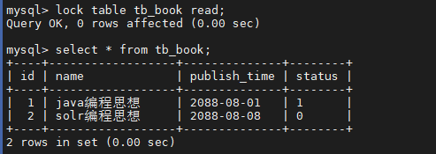
 可以正常执行 ， 查询出数据。

客户端二 ：
 3） 执行查询操作

```
select * from tb_book;

```

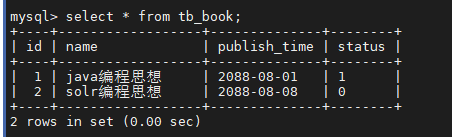

客户端一 ：
 4）查询未锁定的表

```
select * from tb_user;

```

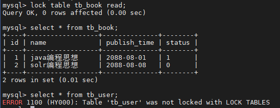

客户端二 ：
 5）查询未锁定的表

```
select * from tb_user;

```

可以正常查询出未锁定的表；
 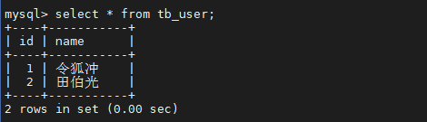

客户端一 ：
 6） 执行插入操作

```
insert into tb_book values(null,'Mysql高级','2088-01-01','1');

```


 执行插入， 直接报错 ， 由于当前tb_book 获得的是 读锁， 不能执行更新操作。

客户端二 ：
 7） 执行插入操作

```
insert into tb_book values(null,'Mysql高级','2088-01-01','1');

```


当在客户端一中释放锁指令 unlock tables 后 ， 客户端二中的 inesrt 语句 ， 立即执行 ；
 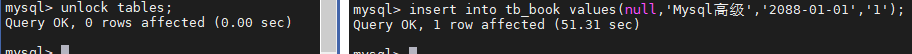

#### 4.3. 写锁案例

客户端一 ：
 1）获得tb_book 表的写锁

```
lock table tb_book write ;

```

2）执行查询操作

```
select * from tb_book ;

```

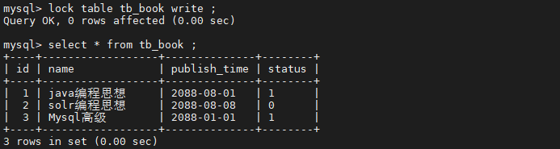
 查询操作执行成功；

3）执行更新操作

```
update tb_book set name = 'java编程思想（第二版）' where id = 1;

```

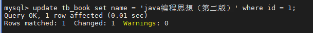
 更新操作执行成功 ；

客户端二 ：
 4）执行查询操作

```
select * from tb_book ;

```


当在客户端一中释放锁指令 unlock tables 后 ， 客户端二中的 select 语句 ， 立即执行 ；
 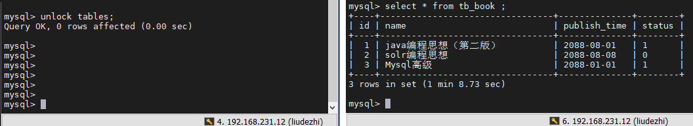

#### 4.4. 结论

锁模式的相互兼容性如表中所示：
 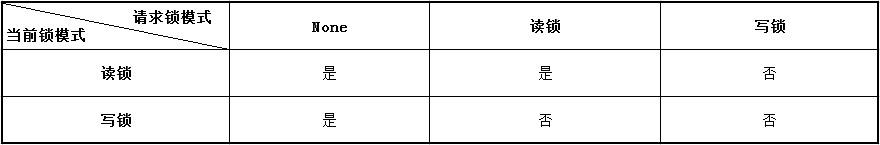

由上表可见：

- 对MyISAM 表的读操作，不会阻塞其他用户对同一表的读请求，但会阻塞对同一表的写请求；

- 对MyISAM 表的写操作，则会阻塞其他用户对同一表的读和写操作；

简而言之，就是读锁会阻塞写，但是不会阻塞读。而写锁，则既会阻塞读，又会阻塞写。

此外，MyISAM 的读写锁调度是写优先，这也是MyISAM不适合做写为主的表的存储引擎的原因。因为写锁后，其他线程不能做任何操作，大量的更新会使查询很难得到锁，从而造成永远阻塞。

#### 4.5. 查看锁的争用情况

```
show open tables；

```

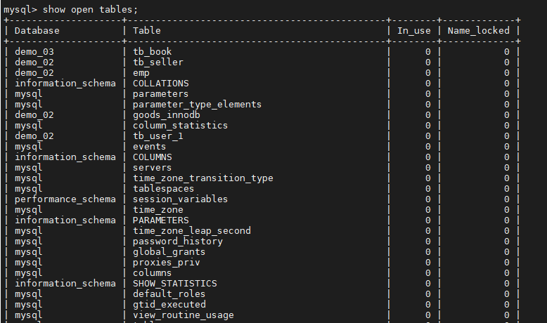

- In_user : 表当前被查询使用的次数。如果该数为零，则表是打开的，但是当前没有被使用。

- Name_locked：表名称是否被锁定。名称锁定用于取消表或对表进行重命名等操作。

```
show status like 'Table_locks%';

```

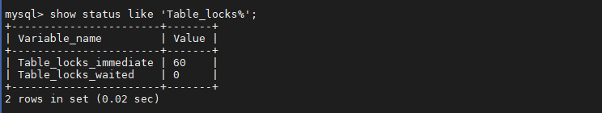

- Table_locks_immediate ： 指的是能够立即获得表级锁的次数，每立即获取锁，值加1。

- Table_locks_waited ： 指的是不能立即获取表级锁而需要等待的次数，每等待一次，该值加1，此值高说明存在着较为严重的表级锁争用情况。

### 5. InnoDB 行锁

#### 5.1. 行锁介绍

行锁特点 ：偏向InnoDB 存储引擎，开销大，加锁慢；会出现死锁；锁定粒度最小，发生锁冲突的概率最低,并发度也最高。

InnoDB 与 MyISAM 的最大不同有两点：一是支持事务；二是 采用了行级锁。

#### 5.2. 背景知识

**事务及其ACID属性**
 事务是由一组SQL语句组成的逻辑处理单元。
 事务具有以下4个特性，简称为事务ACID属性。

 | ACID属性 | 含义
 | 原子性（Atomicity） | 事务是一个原子操作单元，其对数据的修改，要么全部成功，要么全部失败。
 | 一致性（Consistent） | 在事务开始和完成时，数据都必须保持一致状态。
 | 隔离性（Isolation） | 数据库系统提供一定的隔离机制，保证事务在不受外部并发操作影响的 “独立” 环境下运行。
 | 持久性（Durable） | 事务完成之后，对于数据的修改是永久的。

**并发事务处理带来的问题**

 | 问题 | 含义
 | 丢失更新（Lost Update） | 当两个或多个事务选择同一行，最初的事务修改的值，会被后面的事务修改的值覆盖。
 | 脏读（Dirty Reads） | 当一个事务正在访问数据，并且对数据进行了修改，而这种修改还没有提交到数据库中，这时，另外一个事务也访问这个数据，然后使用了这个数据。
 | 不可重复读（Non-Repeatable Reads） | 一个事务在读取某些数据后的某个时间，再次读取以前读过的数据，却发现和以前读出的数据不一致。
 | 幻读（Phantom Reads） | 一个事务按照相同的查询条件重新读取以前查询过的数据，却发现其他事务插入了满足其查询条件的新数据。

**事务隔离级别**
 为了解决上述提到的事务并发问题，数据库提供一定的事务隔离机制来解决这个问题。数据库的事务隔离越严格，并发副作用越小，但付出的代价也就越大，因为事务隔离实质上就是使用事务在一定程度上“串行化” 进行，这显然与“并发” 是矛盾的。
 数据库的隔离级别有4个，由低到高依次为Read uncommitted、Read committed、Repeatable read、Serializable，这四个级别可以逐个解决脏写、脏读、不可重复读、幻读这几类问题。

 | 隔离级别 | 丢失更新 | 脏读 | 不可重复读 | 幻读
 | Read uncommitted | × | √ | √ | √
 | Read committed | × | × | √ | √
 | Repeatable read（默认） | × | × | × | √
 | Serializable | × | × | × | ×

备注 ： √ 代表可能出现 ， × 代表不会出现 。

Mysql 的数据库的默认隔离级别为 Repeatable read ， 查看方式：

```
-- MySQL 5.6
show variables like 'tx_isolation';
-- MySQL 8.0 +
select @@global.transaction_isolation,@@transaction_isolation;

```

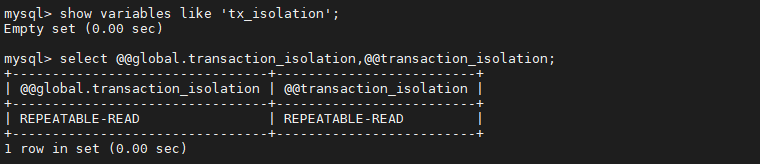

#### 5.3. InnoDB 的行锁模式

InnoDB 实现了以下两种类型的行锁。

- 共享锁（S）：又称为读锁，简称S锁，共享锁就是多个事务对于同一数据可以共享一把锁，都能访问到数据，但是只能读不能修改。

- 排他锁（X）：又称为写锁，简称X锁，排他锁就是不能与其他锁并存，如一个事务获取了一个数据行的排他锁，其他事务就不能再获取该行的其他锁，包括共享锁和排他锁，但是获取排他锁的事务是可以对数据就行读取和修改。

对于UPDATE、DELETE和INSERT语句，InnoDB会自动给涉及数据集加排他锁（X)；

对于普通SELECT语句，InnoDB不会加任何锁；

可以通过以下语句显示给记录集加共享锁或排他锁 。

```
-- 共享锁（S）
SELECT * FROM table_name WHERE ... LOCK IN SHARE MODE
-- 排他锁（X) ：
SELECT * FROM table_name WHERE ... FOR UPDATE

```

#### 5.4. 案例准备工作

```
create table test_innodb_lock(
	id int(11),
	name varchar(16),
	sex varchar(1)
)engine = innodb default charset=utf8;

insert into test_innodb_lock values(1,'100','1');
insert into test_innodb_lock values(3,'3','1');
insert into test_innodb_lock values(4,'400','0');
insert into test_innodb_lock values(5,'500','1');
insert into test_innodb_lock values(6,'600','0');
insert into test_innodb_lock values(7,'700','0');
insert into test_innodb_lock values(8,'800','1');
insert into test_innodb_lock values(9,'900','1');
insert into test_innodb_lock values(1,'200','0');

create index idx_test_innodb_lock_id on test_innodb_lock(id);
create index idx_test_innodb_lock_name on test_innodb_lock(name);

```

#### 5.5. 行锁基本演示

 | Session-1 | Session-2
 | 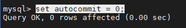 关闭自动提交功能 |  关闭自动提交功能
 | 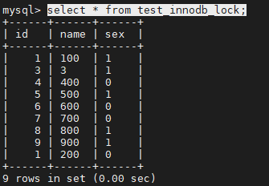 可以正常查询出全部的数据 |  可以正常查询出全部的数据
 | 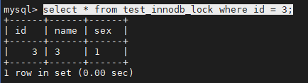 查询id 为3的数据 |  查询id 为3的数据
 | 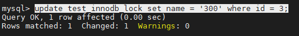 更新id为3的数据，但是不提交 | 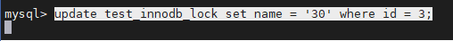 更新id为3 的数据， 处于等待状态
 | 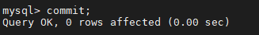 通过commit， 提交事务 | 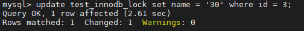 解除阻塞，更新正常进行
 | 以上， 操作的都是同一行的数据，接下来，演示不同行的数据 ： |
 | 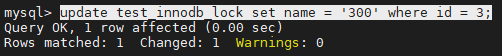 更新id为3数据，正常的获取到行锁 ， 执行更新 | 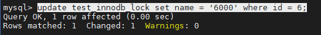 由于与Session-1 操作不是同一行，获取当前行锁，执行更新

#### 5.6. 无索引行锁升级为表锁

如果不通过索引条件检索数据，那么InnoDB将对表中的所有记录加锁，实际效果跟表锁一样。

查看当前表的索引：`show index from test_innodb_lock;`
 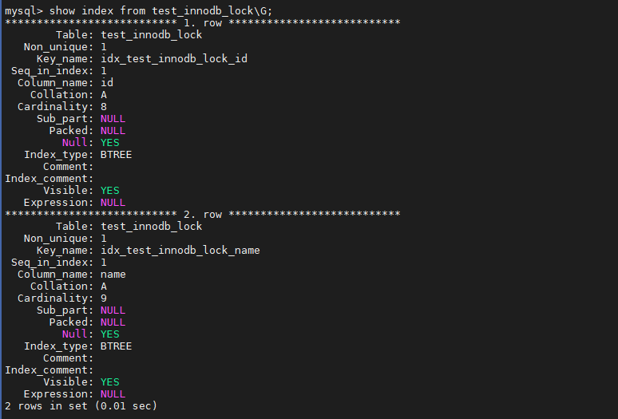

 | Session-1 | Session-2
 | 关闭事务的自动提交 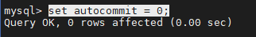 | 关闭事务的自动提交 
 | 执行更新语句 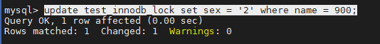 | 执行更新语句，但处于阻塞状态：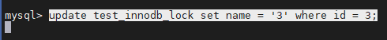
 | 提交事务 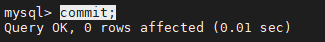 | 解除阻塞，执行更新成功：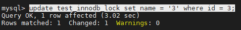
 |  | 执行提交操作 ：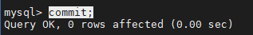

由于 执行更新时 ， name字段本来为varchar类型， 我们是作为数组类型使用，存在类型转换，索引失效，最终行锁变为表锁 ；

#### 5.7. 间隙锁危害

当我们用范围条件，而不是使用相等条件检索数据，并请求共享或排他锁时，InnoDB会给符合条件的已有数据进行加锁； 对于键值在条件范围内但并不存在的记录，叫做 "间隙（GAP）" ， InnoDB也会对这个 "间隙" 加锁，这种锁机制就是所谓的 间隙锁（Next-Key锁）。
 **示例 ：**

 | Session-1 | Session-2
 | 关闭事务自动提交 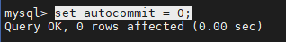 | 关闭事务自动提交 
 | 根据id范围更新数据 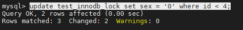 |
 |  | 插入id为2的记录，处于阻塞状态 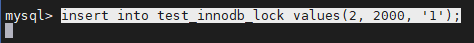
 | 提交事务 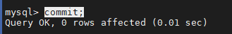 |
 |  | 解除阻塞 ， 执行插入操作：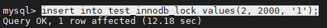
 |  | 提交事务 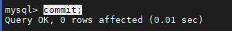

#### 5.8. InnoDB 行锁争用情况

```
show  status like 'innodb_row_lock%';

```

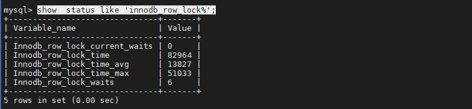

```
Innodb_row_lock_current_waits: 当前正在等待锁定的数量
Innodb_row_lock_time: 从系统启动到现在锁定总时间长度
Innodb_row_lock_time_avg:每次等待所花平均时长
Innodb_row_lock_time_max:从系统启动到现在等待最长的一次所花的时间
Innodb_row_lock_waits: 系统启动后到现在总共等待的次数

当等待的次数很高，而且每次等待的时长也不小的时候，我们就需要分析系统中为什么会有如此多的等待，然后根据分析结果着手制定优化计划。

```

#### 5.9. 总结

InnoDB存储引擎由于实现了行级锁定，虽然在锁定机制的实现方面带来了性能损耗可能比表锁会更高一些，但是在整体并发处理能力方面要远远由于MyISAM的表锁的。当系统并发量较高的时候，InnoDB的整体性能和MyISAM相比就会有比较明显的优势。

但是，InnoDB的行级锁同样也有其脆弱的一面，当我们使用不当的时候，可能会让InnoDB的整体性能表现不仅不能比MyISAM高，甚至可能会更差。
 优化建议：

- 尽可能让所有数据检索都能通过索引来完成，避免无索引行锁升级为表锁。

- 合理设计索引，尽量缩小锁的范围

- 尽可能减少索引条件，及索引范围，避免间隙锁

- 尽量控制事务大小，减少锁定资源量和时间长度

- 尽可使用低级别事务隔离（但是需要业务层面满足需求）

%23%23%20MySQL%20%E9%94%81%E9%97%AE%E9%A2%98%0A%23%23%23%201.%20%E9%94%81%E6%A6%82%E8%BF%B0%0A%E9%94%81%E6%98%AF%E8%AE%A1%E7%AE%97%E6%9C%BA%E5%8D%8F%E8%B0%83%E5%A4%9A%E4%B8%AA%E8%BF%9B%E7%A8%8B%E6%88%96%E7%BA%BF%E7%A8%8B%E5%B9%B6%E5%8F%91%E8%AE%BF%E9%97%AE%E6%9F%90%E4%B8%80%E8%B5%84%E6%BA%90%E7%9A%84%E6%9C%BA%E5%88%B6%EF%BC%88%E9%81%BF%E5%85%8D%E4%BA%89%E6%8A%A2%EF%BC%89%E3%80%82%0A%0A%E5%9C%A8%E6%95%B0%E6%8D%AE%E5%BA%93%E4%B8%AD%EF%BC%8C%E9%99%A4%E4%BC%A0%E7%BB%9F%E7%9A%84%E8%AE%A1%E7%AE%97%E8%B5%84%E6%BA%90%EF%BC%88%E5%A6%82%20CPU%E3%80%81RAM%E3%80%81I%2FO%20%E7%AD%89%EF%BC%89%E7%9A%84%E4%BA%89%E7%94%A8%E4%BB%A5%E5%A4%96%EF%BC%8C%E6%95%B0%E6%8D%AE%E4%B9%9F%E6%98%AF%E4%B8%80%E7%A7%8D%E4%BE%9B%E8%AE%B8%E5%A4%9A%E7%94%A8%E6%88%B7%E5%85%B1%E4%BA%AB%E7%9A%84%E8%B5%84%E6%BA%90%E3%80%82%E5%A6%82%E4%BD%95%E4%BF%9D%E8%AF%81%E6%95%B0%E6%8D%AE%E5%B9%B6%E5%8F%91%E8%AE%BF%E9%97%AE%E7%9A%84%E4%B8%80%E8%87%B4%E6%80%A7%E3%80%81%E6%9C%89%E6%95%88%E6%80%A7%E6%98%AF%E6%89%80%E6%9C%89%E6%95%B0%E6%8D%AE%E5%BA%93%E5%BF%85%E9%A1%BB%E8%A7%A3%E5%86%B3%E7%9A%84%E4%B8%80%E4%B8%AA%E9%97%AE%E9%A2%98%EF%BC%8C%E9%94%81%E5%86%B2%E7%AA%81%E4%B9%9F%E6%98%AF%E5%BD%B1%E5%93%8D%E6%95%B0%E6%8D%AE%E5%BA%93%E5%B9%B6%E5%8F%91%E8%AE%BF%E9%97%AE%E6%80%A7%E8%83%BD%E7%9A%84%E4%B8%80%E4%B8%AA%E9%87%8D%E8%A6%81%E5%9B%A0%E7%B4%A0%E3%80%82%E4%BB%8E%E8%BF%99%E4%B8%AA%E8%A7%92%E5%BA%A6%E6%9D%A5%E8%AF%B4%EF%BC%8C%E9%94%81%E5%AF%B9%E6%95%B0%E6%8D%AE%E5%BA%93%E8%80%8C%E8%A8%80%E6%98%BE%E5%BE%97%E5%B0%A4%E5%85%B6%E9%87%8D%E8%A6%81%EF%BC%8C%E4%B9%9F%E6%9B%B4%E5%8A%A0%E5%A4%8D%E6%9D%82%E3%80%82%0A%0A%23%23%23%202.%20%E9%94%81%E5%88%86%E7%B1%BB%0A%E4%BB%8E%E5%AF%B9%E6%95%B0%E6%8D%AE%E6%93%8D%E4%BD%9C%E7%9A%84%E7%B2%92%E5%BA%A6%E5%88%86%20%EF%BC%9A%0A1%EF%BC%89%20%E8%A1%A8%E9%94%81%EF%BC%9A%E6%93%8D%E4%BD%9C%E6%97%B6%EF%BC%8C%E4%BC%9A%E9%94%81%E5%AE%9A%E6%95%B4%E4%B8%AA%E8%A1%A8%E3%80%82%0A2%EF%BC%89%20%E8%A1%8C%E9%94%81%EF%BC%9A%E6%93%8D%E4%BD%9C%E6%97%B6%EF%BC%8C%E4%BC%9A%E9%94%81%E5%AE%9A%E5%BD%93%E5%89%8D%E6%93%8D%E4%BD%9C%E8%A1%8C%E3%80%82%0A%E4%BB%8E%E5%AF%B9%E6%95%B0%E6%8D%AE%E6%93%8D%E4%BD%9C%E7%9A%84%E7%B1%BB%E5%9E%8B%E5%88%86%EF%BC%9A%0A1%EF%BC%89%20%E8%AF%BB%E9%94%81%EF%BC%88%E5%85%B1%E4%BA%AB%E9%94%81%EF%BC%89%EF%BC%9A%E9%92%88%E5%AF%B9%E5%90%8C%E4%B8%80%E4%BB%BD%E6%95%B0%E6%8D%AE%EF%BC%8C%E5%A4%9A%E4%B8%AA%E8%AF%BB%E6%93%8D%E4%BD%9C%E5%8F%AF%E4%BB%A5%E5%90%8C%E6%97%B6%E8%BF%9B%E8%A1%8C%E8%80%8C%E4%B8%8D%E4%BC%9A%E4%BA%92%E7%9B%B8%E5%BD%B1%E5%93%8D%E3%80%82%0A2%EF%BC%89%20%E5%86%99%E9%94%81%EF%BC%88%E6%8E%92%E5%AE%83%E9%94%81%EF%BC%89%EF%BC%9A%E5%BD%93%E5%89%8D%E6%93%8D%E4%BD%9C%E6%B2%A1%E6%9C%89%E5%AE%8C%E6%88%90%E4%B9%8B%E5%89%8D%EF%BC%8C%E5%AE%83%E4%BC%9A%E9%98%BB%E6%96%AD%E5%85%B6%E4%BB%96%E5%86%99%E9%94%81%E5%92%8C%E8%AF%BB%E9%94%81%E3%80%82%0A%0A%23%23%23%203.%20MySQL%20%E9%94%81%0A%E7%9B%B8%E5%AF%B9%E5%85%B6%E4%BB%96%E6%95%B0%E6%8D%AE%E5%BA%93%E8%80%8C%E8%A8%80%EF%BC%8CMySQL%E7%9A%84%E9%94%81%E6%9C%BA%E5%88%B6%E6%AF%94%E8%BE%83%E7%AE%80%E5%8D%95%EF%BC%8C%E5%85%B6%E6%9C%80%E6%98%BE%E8%91%97%E7%9A%84%E7%89%B9%E7%82%B9%E6%98%AF%E4%B8%8D%E5%90%8C%E7%9A%84%E5%AD%98%E5%82%A8%E5%BC%95%E6%93%8E%E6%94%AF%E6%8C%81%E4%B8%8D%E5%90%8C%E7%9A%84%E9%94%81%E6%9C%BA%E5%88%B6%E3%80%82%E4%B8%8B%E8%A1%A8%E4%B8%AD%E7%BD%97%E5%88%97%E5%87%BA%E4%BA%86%E5%90%84%E5%AD%98%E5%82%A8%E5%BC%95%E6%93%8E%E5%AF%B9%E9%94%81%E7%9A%84%E6%94%AF%E6%8C%81%E6%83%85%E5%86%B5%EF%BC%9A%0A%7C%20%E5%AD%98%E5%82%A8%E5%BC%95%E6%93%8E%20%7C%20%E8%A1%A8%E7%BA%A7%E9%94%81%20%7C%20%E8%A1%8C%E7%BA%A7%E9%94%81%20%7C%20%E9%A1%B5%E9%9D%A2%E9%94%81%20%7C%0A%7C%20--------%20%7C%20------%20%7C%20------%20%7C%20------%20%7C%0A%7C%20MyISAM%20%20%20%7C%20%E6%94%AF%E6%8C%81%20%20%20%7C%20%E4%B8%8D%E6%94%AF%E6%8C%81%20%7C%20%E4%B8%8D%E6%94%AF%E6%8C%81%20%7C%0A%7C%20InnoDB%20%20%20%7C%20%E6%94%AF%E6%8C%81%20%20%20%7C%20%E6%94%AF%E6%8C%81%20%20%20%7C%20%E4%B8%8D%E6%94%AF%E6%8C%81%20%7C%0A%7C%20MEMORY%20%20%20%7C%20%E6%94%AF%E6%8C%81%20%20%20%7C%20%E4%B8%8D%E6%94%AF%E6%8C%81%20%7C%20%E4%B8%8D%E6%94%AF%E6%8C%81%20%7C%0A%7C%20BDB%20%20%20%20%20%20%7C%20%E6%94%AF%E6%8C%81%20%20%20%7C%20%E4%B8%8D%E6%94%AF%E6%8C%81%20%7C%20%E6%94%AF%E6%8C%81%20%20%20%7C%0A%0AMySQL%E8%BF%993%E7%A7%8D%E9%94%81%E7%9A%84%E7%89%B9%E6%80%A7%E5%8F%AF%E5%A4%A7%E8%87%B4%E5%BD%92%E7%BA%B3%E5%A6%82%E4%B8%8B%20%EF%BC%9A%0A%7C%20%E9%94%81%E7%B1%BB%E5%9E%8B%20%7C%20%E7%89%B9%E7%82%B9%20%20%20%20%20%20%20%20%20%20%20%20%20%20%20%20%20%20%20%20%20%20%20%20%20%20%20%20%20%20%20%20%20%20%20%20%20%20%20%20%20%20%20%20%20%20%20%20%20%20%20%20%20%20%20%20%20%7C%0A%7C%20------%20%7C%20------------------------------------------------------------%20%7C%0A%7C%20%E8%A1%A8%E7%BA%A7%E9%94%81%20%7C%20%E5%81%8F%E5%90%91MyISAM%20%E5%AD%98%E5%82%A8%E5%BC%95%E6%93%8E%EF%BC%8C%E5%BC%80%E9%94%80%E5%B0%8F%EF%BC%8C%E5%8A%A0%E9%94%81%E5%BF%AB%EF%BC%9B%E4%B8%8D%E4%BC%9A%E5%87%BA%E7%8E%B0%E6%AD%BB%E9%94%81%EF%BC%9B%E9%94%81%E5%AE%9A%E7%B2%92%E5%BA%A6%E5%A4%A7%EF%BC%8C%E5%8F%91%E7%94%9F%E9%94%81%E5%86%B2%E7%AA%81%E7%9A%84%E6%A6%82%E7%8E%87%E6%9C%80%E9%AB%98%2C%E5%B9%B6%E5%8F%91%E5%BA%A6%E6%9C%80%E4%BD%8E%E3%80%82%20%7C%0A%7C%20%E8%A1%8C%E7%BA%A7%E9%94%81%20%7C%20%E5%81%8F%E5%90%91InnoDB%20%E5%AD%98%E5%82%A8%E5%BC%95%E6%93%8E%EF%BC%8C%E5%BC%80%E9%94%80%E5%A4%A7%EF%BC%8C%E5%8A%A0%E9%94%81%E6%85%A2%EF%BC%9B%E4%BC%9A%E5%87%BA%E7%8E%B0%E6%AD%BB%E9%94%81%EF%BC%9B%E9%94%81%E5%AE%9A%E7%B2%92%E5%BA%A6%E6%9C%80%E5%B0%8F%EF%BC%8C%E5%8F%91%E7%94%9F%E9%94%81%E5%86%B2%E7%AA%81%E7%9A%84%E6%A6%82%E7%8E%87%E6%9C%80%E4%BD%8E%2C%E5%B9%B6%E5%8F%91%E5%BA%A6%E4%B9%9F%E6%9C%80%E9%AB%98%E3%80%82%20%7C%0A%7C%20%E9%A1%B5%E9%9D%A2%E9%94%81%20%7C%20%E5%BC%80%E9%94%80%E5%92%8C%E5%8A%A0%E9%94%81%E6%97%B6%E9%97%B4%E7%95%8C%E4%BA%8E%E8%A1%A8%E9%94%81%E5%92%8C%E8%A1%8C%E9%94%81%E4%B9%8B%E9%97%B4%EF%BC%9B%E4%BC%9A%E5%87%BA%E7%8E%B0%E6%AD%BB%E9%94%81%EF%BC%9B%E9%94%81%E5%AE%9A%E7%B2%92%E5%BA%A6%E7%95%8C%E4%BA%8E%E8%A1%A8%E9%94%81%E5%92%8C%E8%A1%8C%E9%94%81%E4%B9%8B%E9%97%B4%EF%BC%8C%E5%B9%B6%E5%8F%91%E5%BA%A6%E4%B8%80%E8%88%AC%E3%80%82%20%7C%0A%0A%E4%BB%8E%E4%B8%8A%E8%BF%B0%E7%89%B9%E7%82%B9%E5%8F%AF%E8%A7%81%EF%BC%8C%E5%BE%88%E9%9A%BE%E7%AC%BC%E7%BB%9F%E5%9C%B0%E8%AF%B4%E5%93%AA%E7%A7%8D%E9%94%81%E6%9B%B4%E5%A5%BD%EF%BC%8C%E5%8F%AA%E8%83%BD%E5%B0%B1%E5%85%B7%E4%BD%93%E5%BA%94%E7%94%A8%E7%9A%84%E7%89%B9%E7%82%B9%E6%9D%A5%E8%AF%B4%E5%93%AA%E7%A7%8D%E9%94%81%E6%9B%B4%E5%90%88%E9%80%82%EF%BC%81%E4%BB%85%E4%BB%8E%E9%94%81%E7%9A%84%E8%A7%92%E5%BA%A6%E6%9D%A5%E8%AF%B4%EF%BC%9A%E8%A1%A8%E7%BA%A7%E9%94%81%E6%9B%B4%E9%80%82%E5%90%88%E4%BA%8E%E4%BB%A5%E6%9F%A5%E8%AF%A2%E4%B8%BA%E4%B8%BB%EF%BC%8C%E5%8F%AA%E6%9C%89%E5%B0%91%E9%87%8F%E6%8C%89%E7%B4%A2%E5%BC%95%E6%9D%A1%E4%BB%B6%E6%9B%B4%E6%96%B0%E6%95%B0%E6%8D%AE%E7%9A%84%E5%BA%94%E7%94%A8%EF%BC%8C%E5%A6%82Web%20%E5%BA%94%E7%94%A8%EF%BC%9B%E8%80%8C%E8%A1%8C%E7%BA%A7%E9%94%81%E5%88%99%E6%9B%B4%E9%80%82%E5%90%88%E4%BA%8E%E6%9C%89%E5%A4%A7%E9%87%8F%E6%8C%89%E7%B4%A2%E5%BC%95%E6%9D%A1%E4%BB%B6%E5%B9%B6%E5%8F%91%E6%9B%B4%E6%96%B0%E5%B0%91%E9%87%8F%E4%B8%8D%E5%90%8C%E6%95%B0%E6%8D%AE%EF%BC%8C%E5%90%8C%E6%97%B6%E5%8F%88%E6%9C%89%E5%B9%B6%E6%9F%A5%E8%AF%A2%E7%9A%84%E5%BA%94%E7%94%A8%EF%BC%8C%E5%A6%82%E4%B8%80%E4%BA%9B%E5%9C%A8%E7%BA%BF%E4%BA%8B%E5%8A%A1%E5%A4%84%E7%90%86%EF%BC%88OLTP%EF%BC%89%E7%B3%BB%E7%BB%9F%E3%80%82%0A%0A%23%23%23%204.%20MyISAM%20%E8%A1%A8%E9%94%81%0AMyISAM%20%E5%AD%98%E5%82%A8%E5%BC%95%E6%93%8E%E5%8F%AA%E6%94%AF%E6%8C%81%E8%A1%A8%E9%94%81%EF%BC%8C%E8%BF%99%E4%B9%9F%E6%98%AFMySQL%E5%BC%80%E5%A7%8B%E5%87%A0%E4%B8%AA%E7%89%88%E6%9C%AC%E4%B8%AD%E5%94%AF%E4%B8%80%E6%94%AF%E6%8C%81%E7%9A%84%E9%94%81%E7%B1%BB%E5%9E%8B%E3%80%82%0A%0A%23%23%23%23%204.1.%20%E5%A6%82%E4%BD%95%E5%8A%A0%E8%A1%A8%E9%94%81%0AMyISAM%20%E5%9C%A8%E6%89%A7%E8%A1%8C%E6%9F%A5%E8%AF%A2%E8%AF%AD%E5%8F%A5%EF%BC%88SELECT%EF%BC%89%E5%89%8D%EF%BC%8C%E4%BC%9A%E8%87%AA%E5%8A%A8%E7%BB%99%E6%B6%89%E5%8F%8A%E7%9A%84%E6%89%80%E6%9C%89%E8%A1%A8%E5%8A%A0%E8%AF%BB%E9%94%81%EF%BC%8C%E5%9C%A8%E6%89%A7%E8%A1%8C%E6%9B%B4%E6%96%B0%E6%93%8D%E4%BD%9C%EF%BC%88UPDATE%E3%80%81DELETE%E3%80%81INSERT%20%E7%AD%89%EF%BC%89%E5%89%8D%EF%BC%8C%E4%BC%9A%E8%87%AA%E5%8A%A8%E7%BB%99%E6%B6%89%E5%8F%8A%E7%9A%84%E8%A1%A8%E5%8A%A0%E5%86%99%E9%94%81%EF%BC%8C%E8%BF%99%E4%B8%AA%E8%BF%87%E7%A8%8B%E5%B9%B6%E4%B8%8D%E9%9C%80%E8%A6%81%E7%94%A8%E6%88%B7%E5%B9%B2%E9%A2%84%EF%BC%8C%E5%9B%A0%E6%AD%A4%EF%BC%8C%E7%94%A8%E6%88%B7%E4%B8%80%E8%88%AC%E4%B8%8D%E9%9C%80%E8%A6%81%E7%9B%B4%E6%8E%A5%E7%94%A8%20LOCK%20TABLE%20%E5%91%BD%E4%BB%A4%E7%BB%99%20MyISAM%20%E8%A1%A8%E6%98%BE%E5%BC%8F%E5%8A%A0%E9%94%81%E3%80%82%0A%E6%98%BE%E7%A4%BA%E5%8A%A0%E8%A1%A8%E9%94%81%E8%AF%AD%E6%B3%95%EF%BC%9A%0A%60%60%60sql%0A--%20%E5%8A%A0%E8%AF%BB%E9%94%81%20%EF%BC%9A%20%0Alock%20table%20table_name%20read%3B%0A--%20%E5%8A%A0%E5%86%99%E9%94%81%20%EF%BC%9A%20%0Alock%20table%20table_name%20write%3B%0A%60%60%60%0A%0A%23%23%23%23%204.2.%20%E8%AF%BB%E9%94%81%E6%A1%88%E4%BE%8B%0A**%E5%87%86%E5%A4%87%E7%8E%AF%E5%A2%83%EF%BC%9A**%0A%60%60%60sql%0Acreate%20database%20demo_03%20default%20charset%3Dutf8mb4%3B%0A%0Ause%20demo_03%3B%0A%0ACREATE%20TABLE%20%60tb_book%60%20(%0A%20%20%60id%60%20INT(11)%20auto_increment%2C%0A%20%20%60name%60%20VARCHAR(50)%20DEFAULT%20NULL%2C%0A%20%20%60publish_time%60%20DATE%20DEFAULT%20NULL%2C%0A%20%20%60status%60%20CHAR(1)%20DEFAULT%20NULL%2C%0A%20%20PRIMARY%20KEY%20(%60id%60)%0A)%20ENGINE%3Dmyisam%20DEFAULT%20CHARSET%3Dutf8%20%3B%0A%0AINSERT%20INTO%20tb_book%20(id%2C%20name%2C%20publish_time%2C%20status)%20VALUES(NULL%2C'java%E7%BC%96%E7%A8%8B%E6%80%9D%E6%83%B3'%2C'2088-08-01'%2C'1')%3B%0AINSERT%20INTO%20tb_book%20(id%2C%20name%2C%20publish_time%2C%20status)%20VALUES(NULL%2C'solr%E7%BC%96%E7%A8%8B%E6%80%9D%E6%83%B3'%2C'2088-08-08'%2C'0')%3B%0A%0ACREATE%20TABLE%20%60tb_user%60%20(%0A%20%20%60id%60%20INT(11)%20auto_increment%2C%0A%20%20%60name%60%20VARCHAR(50)%20DEFAULT%20NULL%2C%0A%20%20PRIMARY%20KEY%20(%60id%60)%0A)%20ENGINE%3Dmyisam%20DEFAULT%20CHARSET%3Dutf8%20%3B%0A%0AINSERT%20INTO%20tb_user%20(id%2C%20name)%20VALUES(NULL%2C'%E4%BB%A4%E7%8B%90%E5%86%B2')%3B%0AINSERT%20INTO%20tb_user%20(id%2C%20name)%20VALUES(NULL%2C'%E7%94%B0%E4%BC%AF%E5%85%89')%3B%0A%60%60%60%0A%E5%AE%A2%E6%88%B7%E7%AB%AF%E4%B8%80%20%EF%BC%9A%0A1%EF%BC%89%20%E8%8E%B7%E5%BE%97tb_book%20%E8%A1%A8%E7%9A%84%E8%AF%BB%E9%94%81%0A%60%60%60sql%0Alock%20table%20tb_book%20read%3B%0A%60%60%60%0A2%EF%BC%89%20%E6%89%A7%E8%A1%8C%E6%9F%A5%E8%AF%A2%E6%93%8D%E4%BD%9C%0A%60%60%60sql%0Aselect%20*%20from%20tb_books%3B%0A%60%60%60%0A!%5Bcbc954b098e285d2f6f1d3ec5ff662ec.png%5D(en-resource%3A%2F%2Fdatabase%2F4386%3A0)%0A%E5%8F%AF%E4%BB%A5%E6%AD%A3%E5%B8%B8%E6%89%A7%E8%A1%8C%20%EF%BC%8C%20%E6%9F%A5%E8%AF%A2%E5%87%BA%E6%95%B0%E6%8D%AE%E3%80%82%0A%0A%E5%AE%A2%E6%88%B7%E7%AB%AF%E4%BA%8C%20%EF%BC%9A%0A3%EF%BC%89%20%E6%89%A7%E8%A1%8C%E6%9F%A5%E8%AF%A2%E6%93%8D%E4%BD%9C%0A%60%60%60sql%0Aselect%20*%20from%20tb_book%3B%0A%60%60%60%0A!%5B2fd46c50d6974b0663b9950951ccac57.png%5D(en-resource%3A%2F%2Fdatabase%2F4388%3A0)%0A%0A%E5%AE%A2%E6%88%B7%E7%AB%AF%E4%B8%80%20%EF%BC%9A%0A4%EF%BC%89%E6%9F%A5%E8%AF%A2%E6%9C%AA%E9%94%81%E5%AE%9A%E7%9A%84%E8%A1%A8%0A%60%60%60sql%0Aselect%20*%20from%20tb_user%3B%0A%60%60%60%0A!%5Baeb7c8ab6464ba370b65454a77f849bb.png%5D(en-resource%3A%2F%2Fdatabase%2F4390%3A1)%0A%0A%E5%AE%A2%E6%88%B7%E7%AB%AF%E4%BA%8C%20%EF%BC%9A%0A5%EF%BC%89%E6%9F%A5%E8%AF%A2%E6%9C%AA%E9%94%81%E5%AE%9A%E7%9A%84%E8%A1%A8%0A%60%60%60sql%0Aselect%20*%20from%20tb_user%3B%0A%60%60%60%0A%E5%8F%AF%E4%BB%A5%E6%AD%A3%E5%B8%B8%E6%9F%A5%E8%AF%A2%E5%87%BA%E6%9C%AA%E9%94%81%E5%AE%9A%E7%9A%84%E8%A1%A8%EF%BC%9B%0A!%5Bf861c902f7baf44543681c46cf2fcdea.png%5D(en-resource%3A%2F%2Fdatabase%2F4392%3A0)%0A%0A%E5%AE%A2%E6%88%B7%E7%AB%AF%E4%B8%80%20%EF%BC%9A%0A6%EF%BC%89%20%E6%89%A7%E8%A1%8C%E6%8F%92%E5%85%A5%E6%93%8D%E4%BD%9C%0A%60%60%60sql%0Ainsert%20into%20tb_book%20values(null%2C'Mysql%E9%AB%98%E7%BA%A7'%2C'2088-01-01'%2C'1')%3B%0A%60%60%60%0A!%5B609566bf152f5f86f7b8dd9ae138d35c.png%5D(en-resource%3A%2F%2Fdatabase%2F4394%3A0)%0A%E6%89%A7%E8%A1%8C%E6%8F%92%E5%85%A5%EF%BC%8C%20%E7%9B%B4%E6%8E%A5%E6%8A%A5%E9%94%99%20%EF%BC%8C%20%E7%94%B1%E4%BA%8E%E5%BD%93%E5%89%8Dtb_book%20%E8%8E%B7%E5%BE%97%E7%9A%84%E6%98%AF%20%E8%AF%BB%E9%94%81%EF%BC%8C%20%E4%B8%8D%E8%83%BD%E6%89%A7%E8%A1%8C%E6%9B%B4%E6%96%B0%E6%93%8D%E4%BD%9C%E3%80%82%0A%0A%E5%AE%A2%E6%88%B7%E7%AB%AF%E4%BA%8C%20%EF%BC%9A%0A7%EF%BC%89%20%E6%89%A7%E8%A1%8C%E6%8F%92%E5%85%A5%E6%93%8D%E4%BD%9C%0A%60%60%60sql%0Ainsert%20into%20tb_book%20values(null%2C'Mysql%E9%AB%98%E7%BA%A7'%2C'2088-01-01'%2C'1')%3B%0A%60%60%60%0A!%5B8d94413d3eb6d82da5a764fa1f3912a7.png%5D(en-resource%3A%2F%2Fdatabase%2F4396%3A0)%0A%0A%E5%BD%93%E5%9C%A8%E5%AE%A2%E6%88%B7%E7%AB%AF%E4%B8%80%E4%B8%AD%E9%87%8A%E6%94%BE%E9%94%81%E6%8C%87%E4%BB%A4%20unlock%20tables%20%E5%90%8E%20%EF%BC%8C%20%E5%AE%A2%E6%88%B7%E7%AB%AF%E4%BA%8C%E4%B8%AD%E7%9A%84%20inesrt%20%E8%AF%AD%E5%8F%A5%20%EF%BC%8C%20%E7%AB%8B%E5%8D%B3%E6%89%A7%E8%A1%8C%20%EF%BC%9B%0A!%5B0af0f92094162ef0de4fade189857772.png%5D(en-resource%3A%2F%2Fdatabase%2F4398%3A0)%0A%0A%23%23%23%23%204.3.%20%E5%86%99%E9%94%81%E6%A1%88%E4%BE%8B%0A%E5%AE%A2%E6%88%B7%E7%AB%AF%E4%B8%80%20%EF%BC%9A%0A1%EF%BC%89%E8%8E%B7%E5%BE%97tb_book%20%E8%A1%A8%E7%9A%84%E5%86%99%E9%94%81%0A%60%60%60sql%0Alock%20table%20tb_book%20write%20%3B%0A%60%60%60%0A2%EF%BC%89%E6%89%A7%E8%A1%8C%E6%9F%A5%E8%AF%A2%E6%93%8D%E4%BD%9C%0A%60%60%60sql%0Aselect%20*%20from%20tb_book%20%3B%0A%60%60%60%0A!%5B23aed32dbe8eaa1a33d0e28f39f7bd47.png%5D(en-resource%3A%2F%2Fdatabase%2F4400%3A0)%0A%E6%9F%A5%E8%AF%A2%E6%93%8D%E4%BD%9C%E6%89%A7%E8%A1%8C%E6%88%90%E5%8A%9F%EF%BC%9B%0A%0A3%EF%BC%89%E6%89%A7%E8%A1%8C%E6%9B%B4%E6%96%B0%E6%93%8D%E4%BD%9C%0A%60%60%60sql%0Aupdate%20tb_book%20set%20name%20%3D%20'java%E7%BC%96%E7%A8%8B%E6%80%9D%E6%83%B3%EF%BC%88%E7%AC%AC%E4%BA%8C%E7%89%88%EF%BC%89'%20where%20id%20%3D%201%3B%0A%60%60%60%0A!%5Be3f26f2b37e86324bad993edf5e6cb51.png%5D(en-resource%3A%2F%2Fdatabase%2F4402%3A0)%0A%E6%9B%B4%E6%96%B0%E6%93%8D%E4%BD%9C%E6%89%A7%E8%A1%8C%E6%88%90%E5%8A%9F%20%EF%BC%9B%0A%0A%E5%AE%A2%E6%88%B7%E7%AB%AF%E4%BA%8C%20%EF%BC%9A%0A4%EF%BC%89%E6%89%A7%E8%A1%8C%E6%9F%A5%E8%AF%A2%E6%93%8D%E4%BD%9C%0A%60%60%60sql%0Aselect%20*%20from%20tb_book%20%3B%0A%60%60%60%0A!%5Bd9c256fa618a6c2febcaa9b8c5a9c059.png%5D(en-resource%3A%2F%2Fdatabase%2F4404%3A0)%0A%0A%E5%BD%93%E5%9C%A8%E5%AE%A2%E6%88%B7%E7%AB%AF%E4%B8%80%E4%B8%AD%E9%87%8A%E6%94%BE%E9%94%81%E6%8C%87%E4%BB%A4%20unlock%20tables%20%E5%90%8E%20%EF%BC%8C%20%E5%AE%A2%E6%88%B7%E7%AB%AF%E4%BA%8C%E4%B8%AD%E7%9A%84%20select%20%E8%AF%AD%E5%8F%A5%20%EF%BC%8C%20%E7%AB%8B%E5%8D%B3%E6%89%A7%E8%A1%8C%20%EF%BC%9B%0A!%5B9d1e186c0e08d7162d71ef856da9a448.png%5D(en-resource%3A%2F%2Fdatabase%2F4406%3A0)%0A%0A%23%23%23%23%204.4.%20%E7%BB%93%E8%AE%BA%0A%E9%94%81%E6%A8%A1%E5%BC%8F%E7%9A%84%E7%9B%B8%E4%BA%92%E5%85%BC%E5%AE%B9%E6%80%A7%E5%A6%82%E8%A1%A8%E4%B8%AD%E6%89%80%E7%A4%BA%EF%BC%9A%0A!%5Bcaf6696c32eee8752fa01ffb734afe6b.png%5D(en-resource%3A%2F%2Fdatabase%2F4408%3A0)%0A%0A%E7%94%B1%E4%B8%8A%E8%A1%A8%E5%8F%AF%E8%A7%81%EF%BC%9A%0A-%20%E5%AF%B9MyISAM%20%E8%A1%A8%E7%9A%84%E8%AF%BB%E6%93%8D%E4%BD%9C%EF%BC%8C%E4%B8%8D%E4%BC%9A%E9%98%BB%E5%A1%9E%E5%85%B6%E4%BB%96%E7%94%A8%E6%88%B7%E5%AF%B9%E5%90%8C%E4%B8%80%E8%A1%A8%E7%9A%84%E8%AF%BB%E8%AF%B7%E6%B1%82%EF%BC%8C%E4%BD%86%E4%BC%9A%E9%98%BB%E5%A1%9E%E5%AF%B9%E5%90%8C%E4%B8%80%E8%A1%A8%E7%9A%84%E5%86%99%E8%AF%B7%E6%B1%82%EF%BC%9B%0A-%20%E5%AF%B9MyISAM%20%E8%A1%A8%E7%9A%84%E5%86%99%E6%93%8D%E4%BD%9C%EF%BC%8C%E5%88%99%E4%BC%9A%E9%98%BB%E5%A1%9E%E5%85%B6%E4%BB%96%E7%94%A8%E6%88%B7%E5%AF%B9%E5%90%8C%E4%B8%80%E8%A1%A8%E7%9A%84%E8%AF%BB%E5%92%8C%E5%86%99%E6%93%8D%E4%BD%9C%EF%BC%9B%0A%0A%E7%AE%80%E8%80%8C%E8%A8%80%E4%B9%8B%EF%BC%8C%E5%B0%B1%E6%98%AF%E8%AF%BB%E9%94%81%E4%BC%9A%E9%98%BB%E5%A1%9E%E5%86%99%EF%BC%8C%E4%BD%86%E6%98%AF%E4%B8%8D%E4%BC%9A%E9%98%BB%E5%A1%9E%E8%AF%BB%E3%80%82%E8%80%8C%E5%86%99%E9%94%81%EF%BC%8C%E5%88%99%E6%97%A2%E4%BC%9A%E9%98%BB%E5%A1%9E%E8%AF%BB%EF%BC%8C%E5%8F%88%E4%BC%9A%E9%98%BB%E5%A1%9E%E5%86%99%E3%80%82%0A%0A%E6%AD%A4%E5%A4%96%EF%BC%8CMyISAM%20%E7%9A%84%E8%AF%BB%E5%86%99%E9%94%81%E8%B0%83%E5%BA%A6%E6%98%AF%E5%86%99%E4%BC%98%E5%85%88%EF%BC%8C%E8%BF%99%E4%B9%9F%E6%98%AFMyISAM%E4%B8%8D%E9%80%82%E5%90%88%E5%81%9A%E5%86%99%E4%B8%BA%E4%B8%BB%E7%9A%84%E8%A1%A8%E7%9A%84%E5%AD%98%E5%82%A8%E5%BC%95%E6%93%8E%E7%9A%84%E5%8E%9F%E5%9B%A0%E3%80%82%E5%9B%A0%E4%B8%BA%E5%86%99%E9%94%81%E5%90%8E%EF%BC%8C%E5%85%B6%E4%BB%96%E7%BA%BF%E7%A8%8B%E4%B8%8D%E8%83%BD%E5%81%9A%E4%BB%BB%E4%BD%95%E6%93%8D%E4%BD%9C%EF%BC%8C%E5%A4%A7%E9%87%8F%E7%9A%84%E6%9B%B4%E6%96%B0%E4%BC%9A%E4%BD%BF%E6%9F%A5%E8%AF%A2%E5%BE%88%E9%9A%BE%E5%BE%97%E5%88%B0%E9%94%81%EF%BC%8C%E4%BB%8E%E8%80%8C%E9%80%A0%E6%88%90%E6%B0%B8%E8%BF%9C%E9%98%BB%E5%A1%9E%E3%80%82%0A%0A%23%23%23%23%204.5.%20%E6%9F%A5%E7%9C%8B%E9%94%81%E7%9A%84%E4%BA%89%E7%94%A8%E6%83%85%E5%86%B5%0A%60%60%60sql%0Ashow%20open%20tables%EF%BC%9B%0A%60%60%60%0A!%5Ba48424aa249336114b39cb41b0614b64.png%5D(en-resource%3A%2F%2Fdatabase%2F4410%3A0)%0A-%20In_user%20%3A%20%E8%A1%A8%E5%BD%93%E5%89%8D%E8%A2%AB%E6%9F%A5%E8%AF%A2%E4%BD%BF%E7%94%A8%E7%9A%84%E6%AC%A1%E6%95%B0%E3%80%82%E5%A6%82%E6%9E%9C%E8%AF%A5%E6%95%B0%E4%B8%BA%E9%9B%B6%EF%BC%8C%E5%88%99%E8%A1%A8%E6%98%AF%E6%89%93%E5%BC%80%E7%9A%84%EF%BC%8C%E4%BD%86%E6%98%AF%E5%BD%93%E5%89%8D%E6%B2%A1%E6%9C%89%E8%A2%AB%E4%BD%BF%E7%94%A8%E3%80%82%0A-%20Name_locked%EF%BC%9A%E8%A1%A8%E5%90%8D%E7%A7%B0%E6%98%AF%E5%90%A6%E8%A2%AB%E9%94%81%E5%AE%9A%E3%80%82%E5%90%8D%E7%A7%B0%E9%94%81%E5%AE%9A%E7%94%A8%E4%BA%8E%E5%8F%96%E6%B6%88%E8%A1%A8%E6%88%96%E5%AF%B9%E8%A1%A8%E8%BF%9B%E8%A1%8C%E9%87%8D%E5%91%BD%E5%90%8D%E7%AD%89%E6%93%8D%E4%BD%9C%E3%80%82%0A%0A%60%60%60sql%0Ashow%20status%20like%20'Table_locks%25'%3B%0A%60%60%60%0A!%5Ba59e79fcd72f6146849ccfed3299ef01.png%5D(en-resource%3A%2F%2Fdatabase%2F4412%3A0)%0A-%20Table_locks_immediate%20%EF%BC%9A%20%E6%8C%87%E7%9A%84%E6%98%AF%E8%83%BD%E5%A4%9F%E7%AB%8B%E5%8D%B3%E8%8E%B7%E5%BE%97%E8%A1%A8%E7%BA%A7%E9%94%81%E7%9A%84%E6%AC%A1%E6%95%B0%EF%BC%8C%E6%AF%8F%E7%AB%8B%E5%8D%B3%E8%8E%B7%E5%8F%96%E9%94%81%EF%BC%8C%E5%80%BC%E5%8A%A01%E3%80%82%0A-%20Table_locks_waited%20%EF%BC%9A%20%E6%8C%87%E7%9A%84%E6%98%AF%E4%B8%8D%E8%83%BD%E7%AB%8B%E5%8D%B3%E8%8E%B7%E5%8F%96%E8%A1%A8%E7%BA%A7%E9%94%81%E8%80%8C%E9%9C%80%E8%A6%81%E7%AD%89%E5%BE%85%E7%9A%84%E6%AC%A1%E6%95%B0%EF%BC%8C%E6%AF%8F%E7%AD%89%E5%BE%85%E4%B8%80%E6%AC%A1%EF%BC%8C%E8%AF%A5%E5%80%BC%E5%8A%A01%EF%BC%8C%E6%AD%A4%E5%80%BC%E9%AB%98%E8%AF%B4%E6%98%8E%E5%AD%98%E5%9C%A8%E7%9D%80%E8%BE%83%E4%B8%BA%E4%B8%A5%E9%87%8D%E7%9A%84%E8%A1%A8%E7%BA%A7%E9%94%81%E4%BA%89%E7%94%A8%E6%83%85%E5%86%B5%E3%80%82%0A%0A%23%23%23%205.%20%20InnoDB%20%E8%A1%8C%E9%94%81%0A%23%23%23%23%205.1.%20%E8%A1%8C%E9%94%81%E4%BB%8B%E7%BB%8D%0A%E8%A1%8C%E9%94%81%E7%89%B9%E7%82%B9%20%EF%BC%9A%E5%81%8F%E5%90%91InnoDB%20%E5%AD%98%E5%82%A8%E5%BC%95%E6%93%8E%EF%BC%8C%E5%BC%80%E9%94%80%E5%A4%A7%EF%BC%8C%E5%8A%A0%E9%94%81%E6%85%A2%EF%BC%9B%E4%BC%9A%E5%87%BA%E7%8E%B0%E6%AD%BB%E9%94%81%EF%BC%9B%E9%94%81%E5%AE%9A%E7%B2%92%E5%BA%A6%E6%9C%80%E5%B0%8F%EF%BC%8C%E5%8F%91%E7%94%9F%E9%94%81%E5%86%B2%E7%AA%81%E7%9A%84%E6%A6%82%E7%8E%87%E6%9C%80%E4%BD%8E%2C%E5%B9%B6%E5%8F%91%E5%BA%A6%E4%B9%9F%E6%9C%80%E9%AB%98%E3%80%82%0A%0AInnoDB%20%E4%B8%8E%20MyISAM%20%E7%9A%84%E6%9C%80%E5%A4%A7%E4%B8%8D%E5%90%8C%E6%9C%89%E4%B8%A4%E7%82%B9%EF%BC%9A%E4%B8%80%E6%98%AF%E6%94%AF%E6%8C%81%E4%BA%8B%E5%8A%A1%EF%BC%9B%E4%BA%8C%E6%98%AF%20%E9%87%87%E7%94%A8%E4%BA%86%E8%A1%8C%E7%BA%A7%E9%94%81%E3%80%82%0A%0A%23%23%23%23%205.2.%20%E8%83%8C%E6%99%AF%E7%9F%A5%E8%AF%86%0A**%E4%BA%8B%E5%8A%A1%E5%8F%8A%E5%85%B6ACID%E5%B1%9E%E6%80%A7**%0A%E4%BA%8B%E5%8A%A1%E6%98%AF%E7%94%B1%E4%B8%80%E7%BB%84SQL%E8%AF%AD%E5%8F%A5%E7%BB%84%E6%88%90%E7%9A%84%E9%80%BB%E8%BE%91%E5%A4%84%E7%90%86%E5%8D%95%E5%85%83%E3%80%82%0A%E4%BA%8B%E5%8A%A1%E5%85%B7%E6%9C%89%E4%BB%A5%E4%B8%8B4%E4%B8%AA%E7%89%B9%E6%80%A7%EF%BC%8C%E7%AE%80%E7%A7%B0%E4%B8%BA%E4%BA%8B%E5%8A%A1ACID%E5%B1%9E%E6%80%A7%E3%80%82%0A%7C%20ACID%E5%B1%9E%E6%80%A7%20%20%20%20%20%20%20%20%20%20%20%20%20%7C%20%E5%90%AB%E4%B9%89%20%20%20%20%20%20%20%20%20%20%20%20%20%20%20%20%20%20%20%20%20%20%20%20%20%20%20%20%20%20%20%20%20%20%20%20%20%20%20%20%20%20%20%20%20%20%20%20%20%20%20%20%20%20%20%20%20%7C%0A%7C%20--------------------%20%7C%20------------------------------------------------------------%20%7C%0A%7C%20%E5%8E%9F%E5%AD%90%E6%80%A7%EF%BC%88Atomicity%EF%BC%89%20%20%7C%20%E4%BA%8B%E5%8A%A1%E6%98%AF%E4%B8%80%E4%B8%AA%E5%8E%9F%E5%AD%90%E6%93%8D%E4%BD%9C%E5%8D%95%E5%85%83%EF%BC%8C%E5%85%B6%E5%AF%B9%E6%95%B0%E6%8D%AE%E7%9A%84%E4%BF%AE%E6%94%B9%EF%BC%8C%E8%A6%81%E4%B9%88%E5%85%A8%E9%83%A8%E6%88%90%E5%8A%9F%EF%BC%8C%E8%A6%81%E4%B9%88%E5%85%A8%E9%83%A8%E5%A4%B1%E8%B4%A5%E3%80%82%20%7C%0A%7C%20%E4%B8%80%E8%87%B4%E6%80%A7%EF%BC%88Consistent%EF%BC%89%20%7C%20%E5%9C%A8%E4%BA%8B%E5%8A%A1%E5%BC%80%E5%A7%8B%E5%92%8C%E5%AE%8C%E6%88%90%E6%97%B6%EF%BC%8C%E6%95%B0%E6%8D%AE%E9%83%BD%E5%BF%85%E9%A1%BB%E4%BF%9D%E6%8C%81%E4%B8%80%E8%87%B4%E7%8A%B6%E6%80%81%E3%80%82%20%20%20%20%20%20%20%20%20%20%20%20%20%20%20%20%20%7C%0A%7C%20%E9%9A%94%E7%A6%BB%E6%80%A7%EF%BC%88Isolation%EF%BC%89%20%20%7C%20%E6%95%B0%E6%8D%AE%E5%BA%93%E7%B3%BB%E7%BB%9F%E6%8F%90%E4%BE%9B%E4%B8%80%E5%AE%9A%E7%9A%84%E9%9A%94%E7%A6%BB%E6%9C%BA%E5%88%B6%EF%BC%8C%E4%BF%9D%E8%AF%81%E4%BA%8B%E5%8A%A1%E5%9C%A8%E4%B8%8D%E5%8F%97%E5%A4%96%E9%83%A8%E5%B9%B6%E5%8F%91%E6%93%8D%E4%BD%9C%E5%BD%B1%E5%93%8D%E7%9A%84%20%E2%80%9C%E7%8B%AC%E7%AB%8B%E2%80%9D%20%E7%8E%AF%E5%A2%83%E4%B8%8B%E8%BF%90%E8%A1%8C%E3%80%82%20%7C%0A%7C%20%E6%8C%81%E4%B9%85%E6%80%A7%EF%BC%88Durable%EF%BC%89%20%20%20%20%7C%20%E4%BA%8B%E5%8A%A1%E5%AE%8C%E6%88%90%E4%B9%8B%E5%90%8E%EF%BC%8C%E5%AF%B9%E4%BA%8E%E6%95%B0%E6%8D%AE%E7%9A%84%E4%BF%AE%E6%94%B9%E6%98%AF%E6%B0%B8%E4%B9%85%E7%9A%84%E3%80%82%20%20%20%20%20%20%20%20%20%20%20%20%20%20%20%20%20%20%20%20%20%20%20%7C%0A%0A**%E5%B9%B6%E5%8F%91%E4%BA%8B%E5%8A%A1%E5%A4%84%E7%90%86%E5%B8%A6%E6%9D%A5%E7%9A%84%E9%97%AE%E9%A2%98**%0A%7C%20%E9%97%AE%E9%A2%98%20%20%20%20%20%20%20%20%20%20%20%20%20%20%20%20%20%20%20%20%20%20%20%20%20%20%20%20%20%20%20%7C%20%E5%90%AB%E4%B9%89%20%20%20%20%20%20%20%20%20%20%20%20%20%20%20%20%20%20%20%20%20%20%20%20%20%20%20%20%20%20%20%20%20%20%20%20%20%20%20%20%20%20%20%20%20%20%20%20%20%20%20%20%20%20%20%20%20%7C%0A%7C%20----------------------------------%20%7C%20------------------------------------------------------------%20%7C%0A%7C%20%E4%B8%A2%E5%A4%B1%E6%9B%B4%E6%96%B0%EF%BC%88Lost%20Update%EF%BC%89%20%20%20%20%20%20%20%20%20%20%20%20%7C%20%E5%BD%93%E4%B8%A4%E4%B8%AA%E6%88%96%E5%A4%9A%E4%B8%AA%E4%BA%8B%E5%8A%A1%E9%80%89%E6%8B%A9%E5%90%8C%E4%B8%80%E8%A1%8C%EF%BC%8C%E6%9C%80%E5%88%9D%E7%9A%84%E4%BA%8B%E5%8A%A1%E4%BF%AE%E6%94%B9%E7%9A%84%E5%80%BC%EF%BC%8C%E4%BC%9A%E8%A2%AB%E5%90%8E%E9%9D%A2%E7%9A%84%E4%BA%8B%E5%8A%A1%E4%BF%AE%E6%94%B9%E7%9A%84%E5%80%BC%E8%A6%86%E7%9B%96%E3%80%82%20%7C%0A%7C%20%E8%84%8F%E8%AF%BB%EF%BC%88Dirty%20Reads%EF%BC%89%20%20%20%20%20%20%20%20%20%20%20%20%20%20%20%20%7C%20%E5%BD%93%E4%B8%80%E4%B8%AA%E4%BA%8B%E5%8A%A1%E6%AD%A3%E5%9C%A8%E8%AE%BF%E9%97%AE%E6%95%B0%E6%8D%AE%EF%BC%8C%E5%B9%B6%E4%B8%94%E5%AF%B9%E6%95%B0%E6%8D%AE%E8%BF%9B%E8%A1%8C%E4%BA%86%E4%BF%AE%E6%94%B9%EF%BC%8C%E8%80%8C%E8%BF%99%E7%A7%8D%E4%BF%AE%E6%94%B9%E8%BF%98%E6%B2%A1%E6%9C%89%E6%8F%90%E4%BA%A4%E5%88%B0%E6%95%B0%E6%8D%AE%E5%BA%93%E4%B8%AD%EF%BC%8C%E8%BF%99%E6%97%B6%EF%BC%8C%E5%8F%A6%E5%A4%96%E4%B8%80%E4%B8%AA%E4%BA%8B%E5%8A%A1%E4%B9%9F%E8%AE%BF%E9%97%AE%E8%BF%99%E4%B8%AA%E6%95%B0%E6%8D%AE%EF%BC%8C%E7%84%B6%E5%90%8E%E4%BD%BF%E7%94%A8%E4%BA%86%E8%BF%99%E4%B8%AA%E6%95%B0%E6%8D%AE%E3%80%82%20%7C%0A%7C%20%E4%B8%8D%E5%8F%AF%E9%87%8D%E5%A4%8D%E8%AF%BB%EF%BC%88Non-Repeatable%20Reads%EF%BC%89%20%7C%20%E4%B8%80%E4%B8%AA%E4%BA%8B%E5%8A%A1%E5%9C%A8%E8%AF%BB%E5%8F%96%E6%9F%90%E4%BA%9B%E6%95%B0%E6%8D%AE%E5%90%8E%E7%9A%84%E6%9F%90%E4%B8%AA%E6%97%B6%E9%97%B4%EF%BC%8C%E5%86%8D%E6%AC%A1%E8%AF%BB%E5%8F%96%E4%BB%A5%E5%89%8D%E8%AF%BB%E8%BF%87%E7%9A%84%E6%95%B0%E6%8D%AE%EF%BC%8C%E5%8D%B4%E5%8F%91%E7%8E%B0%E5%92%8C%E4%BB%A5%E5%89%8D%E8%AF%BB%E5%87%BA%E7%9A%84%E6%95%B0%E6%8D%AE%E4%B8%8D%E4%B8%80%E8%87%B4%E3%80%82%20%7C%0A%7C%20%E5%B9%BB%E8%AF%BB%EF%BC%88Phantom%20Reads%EF%BC%89%20%20%20%20%20%20%20%20%20%20%20%20%20%20%7C%20%E4%B8%80%E4%B8%AA%E4%BA%8B%E5%8A%A1%E6%8C%89%E7%85%A7%E7%9B%B8%E5%90%8C%E7%9A%84%E6%9F%A5%E8%AF%A2%E6%9D%A1%E4%BB%B6%E9%87%8D%E6%96%B0%E8%AF%BB%E5%8F%96%E4%BB%A5%E5%89%8D%E6%9F%A5%E8%AF%A2%E8%BF%87%E7%9A%84%E6%95%B0%E6%8D%AE%EF%BC%8C%E5%8D%B4%E5%8F%91%E7%8E%B0%E5%85%B6%E4%BB%96%E4%BA%8B%E5%8A%A1%E6%8F%92%E5%85%A5%E4%BA%86%E6%BB%A1%E8%B6%B3%E5%85%B6%E6%9F%A5%E8%AF%A2%E6%9D%A1%E4%BB%B6%E7%9A%84%E6%96%B0%E6%95%B0%E6%8D%AE%E3%80%82%20%7C%0A%0A**%E4%BA%8B%E5%8A%A1%E9%9A%94%E7%A6%BB%E7%BA%A7%E5%88%AB**%0A%E4%B8%BA%E4%BA%86%E8%A7%A3%E5%86%B3%E4%B8%8A%E8%BF%B0%E6%8F%90%E5%88%B0%E7%9A%84%E4%BA%8B%E5%8A%A1%E5%B9%B6%E5%8F%91%E9%97%AE%E9%A2%98%EF%BC%8C%E6%95%B0%E6%8D%AE%E5%BA%93%E6%8F%90%E4%BE%9B%E4%B8%80%E5%AE%9A%E7%9A%84%E4%BA%8B%E5%8A%A1%E9%9A%94%E7%A6%BB%E6%9C%BA%E5%88%B6%E6%9D%A5%E8%A7%A3%E5%86%B3%E8%BF%99%E4%B8%AA%E9%97%AE%E9%A2%98%E3%80%82%E6%95%B0%E6%8D%AE%E5%BA%93%E7%9A%84%E4%BA%8B%E5%8A%A1%E9%9A%94%E7%A6%BB%E8%B6%8A%E4%B8%A5%E6%A0%BC%EF%BC%8C%E5%B9%B6%E5%8F%91%E5%89%AF%E4%BD%9C%E7%94%A8%E8%B6%8A%E5%B0%8F%EF%BC%8C%E4%BD%86%E4%BB%98%E5%87%BA%E7%9A%84%E4%BB%A3%E4%BB%B7%E4%B9%9F%E5%B0%B1%E8%B6%8A%E5%A4%A7%EF%BC%8C%E5%9B%A0%E4%B8%BA%E4%BA%8B%E5%8A%A1%E9%9A%94%E7%A6%BB%E5%AE%9E%E8%B4%A8%E4%B8%8A%E5%B0%B1%E6%98%AF%E4%BD%BF%E7%94%A8%E4%BA%8B%E5%8A%A1%E5%9C%A8%E4%B8%80%E5%AE%9A%E7%A8%8B%E5%BA%A6%E4%B8%8A%E2%80%9C%E4%B8%B2%E8%A1%8C%E5%8C%96%E2%80%9D%20%E8%BF%9B%E8%A1%8C%EF%BC%8C%E8%BF%99%E6%98%BE%E7%84%B6%E4%B8%8E%E2%80%9C%E5%B9%B6%E5%8F%91%E2%80%9D%20%E6%98%AF%E7%9F%9B%E7%9B%BE%E7%9A%84%E3%80%82%0A%E6%95%B0%E6%8D%AE%E5%BA%93%E7%9A%84%E9%9A%94%E7%A6%BB%E7%BA%A7%E5%88%AB%E6%9C%894%E4%B8%AA%EF%BC%8C%E7%94%B1%E4%BD%8E%E5%88%B0%E9%AB%98%E4%BE%9D%E6%AC%A1%E4%B8%BARead%20uncommitted%E3%80%81Read%20committed%E3%80%81Repeatable%20read%E3%80%81Serializable%EF%BC%8C%E8%BF%99%E5%9B%9B%E4%B8%AA%E7%BA%A7%E5%88%AB%E5%8F%AF%E4%BB%A5%E9%80%90%E4%B8%AA%E8%A7%A3%E5%86%B3%E8%84%8F%E5%86%99%E3%80%81%E8%84%8F%E8%AF%BB%E3%80%81%E4%B8%8D%E5%8F%AF%E9%87%8D%E5%A4%8D%E8%AF%BB%E3%80%81%E5%B9%BB%E8%AF%BB%E8%BF%99%E5%87%A0%E7%B1%BB%E9%97%AE%E9%A2%98%E3%80%82%0A%7C%20%E9%9A%94%E7%A6%BB%E7%BA%A7%E5%88%AB%20%20%20%20%20%20%20%20%20%20%20%20%20%20%20%20%7C%20%E4%B8%A2%E5%A4%B1%E6%9B%B4%E6%96%B0%20%7C%20%E8%84%8F%E8%AF%BB%20%7C%20%E4%B8%8D%E5%8F%AF%E9%87%8D%E5%A4%8D%E8%AF%BB%20%7C%20%E5%B9%BB%E8%AF%BB%20%7C%0A%7C%20-----------------------%20%7C%20--------%20%7C%20----%20%7C%20----------%20%7C%20----%20%7C%0A%7C%20Read%20uncommitted%20%20%20%20%20%20%20%20%7C%20%C3%97%20%20%20%20%20%20%20%20%7C%20%E2%88%9A%20%20%20%20%7C%20%E2%88%9A%20%20%20%20%20%20%20%20%20%20%7C%20%E2%88%9A%20%20%20%20%7C%0A%7C%20Read%20committed%20%20%20%20%20%20%20%20%20%20%7C%20%C3%97%20%20%20%20%20%20%20%20%7C%20%C3%97%20%20%20%20%7C%20%E2%88%9A%20%20%20%20%20%20%20%20%20%20%7C%20%E2%88%9A%20%20%20%20%7C%0A%7C%20Repeatable%20read%EF%BC%88%E9%BB%98%E8%AE%A4%EF%BC%89%20%7C%20%C3%97%20%20%20%20%20%20%20%20%7C%20%C3%97%20%20%20%20%7C%20%C3%97%20%20%20%20%20%20%20%20%20%20%7C%20%E2%88%9A%20%20%20%20%7C%0A%7C%20Serializable%20%20%20%20%20%20%20%20%20%20%20%20%7C%20%C3%97%20%20%20%20%20%20%20%20%7C%20%C3%97%20%20%20%20%7C%20%C3%97%20%20%20%20%20%20%20%20%20%20%7C%20%C3%97%20%20%20%20%7C%0A%0A%E5%A4%87%E6%B3%A8%20%EF%BC%9A%20%E2%88%9A%20%20%E4%BB%A3%E8%A1%A8%E5%8F%AF%E8%83%BD%E5%87%BA%E7%8E%B0%20%EF%BC%8C%20%C3%97%20%E4%BB%A3%E8%A1%A8%E4%B8%8D%E4%BC%9A%E5%87%BA%E7%8E%B0%20%E3%80%82%0A%0AMysql%20%E7%9A%84%E6%95%B0%E6%8D%AE%E5%BA%93%E7%9A%84%E9%BB%98%E8%AE%A4%E9%9A%94%E7%A6%BB%E7%BA%A7%E5%88%AB%E4%B8%BA%20Repeatable%20read%20%EF%BC%8C%20%E6%9F%A5%E7%9C%8B%E6%96%B9%E5%BC%8F%EF%BC%9A%0A%60%60%60sql%0A--%20MySQL%205.6%0Ashow%20variables%20like%20'tx_isolation'%3B%0A--%20MySQL%208.0%20%2B%20%0Aselect%20%40%40global.transaction_isolation%2C%40%40transaction_isolation%3B%0A%60%60%60%0A!%5B204df2472ce3fc18b737efc94c9f161a.png%5D(en-resource%3A%2F%2Fdatabase%2F4414%3A0)%0A%0A%23%23%23%23%205.3.%20InnoDB%20%E7%9A%84%E8%A1%8C%E9%94%81%E6%A8%A1%E5%BC%8F%0AInnoDB%20%E5%AE%9E%E7%8E%B0%E4%BA%86%E4%BB%A5%E4%B8%8B%E4%B8%A4%E7%A7%8D%E7%B1%BB%E5%9E%8B%E7%9A%84%E8%A1%8C%E9%94%81%E3%80%82%0A-%20%E5%85%B1%E4%BA%AB%E9%94%81%EF%BC%88S%EF%BC%89%EF%BC%9A%E5%8F%88%E7%A7%B0%E4%B8%BA%E8%AF%BB%E9%94%81%EF%BC%8C%E7%AE%80%E7%A7%B0S%E9%94%81%EF%BC%8C%E5%85%B1%E4%BA%AB%E9%94%81%E5%B0%B1%E6%98%AF%E5%A4%9A%E4%B8%AA%E4%BA%8B%E5%8A%A1%E5%AF%B9%E4%BA%8E%E5%90%8C%E4%B8%80%E6%95%B0%E6%8D%AE%E5%8F%AF%E4%BB%A5%E5%85%B1%E4%BA%AB%E4%B8%80%E6%8A%8A%E9%94%81%EF%BC%8C%E9%83%BD%E8%83%BD%E8%AE%BF%E9%97%AE%E5%88%B0%E6%95%B0%E6%8D%AE%EF%BC%8C%E4%BD%86%E6%98%AF%E5%8F%AA%E8%83%BD%E8%AF%BB%E4%B8%8D%E8%83%BD%E4%BF%AE%E6%94%B9%E3%80%82%0A-%20%E6%8E%92%E4%BB%96%E9%94%81%EF%BC%88X%EF%BC%89%EF%BC%9A%E5%8F%88%E7%A7%B0%E4%B8%BA%E5%86%99%E9%94%81%EF%BC%8C%E7%AE%80%E7%A7%B0X%E9%94%81%EF%BC%8C%E6%8E%92%E4%BB%96%E9%94%81%E5%B0%B1%E6%98%AF%E4%B8%8D%E8%83%BD%E4%B8%8E%E5%85%B6%E4%BB%96%E9%94%81%E5%B9%B6%E5%AD%98%EF%BC%8C%E5%A6%82%E4%B8%80%E4%B8%AA%E4%BA%8B%E5%8A%A1%E8%8E%B7%E5%8F%96%E4%BA%86%E4%B8%80%E4%B8%AA%E6%95%B0%E6%8D%AE%E8%A1%8C%E7%9A%84%E6%8E%92%E4%BB%96%E9%94%81%EF%BC%8C%E5%85%B6%E4%BB%96%E4%BA%8B%E5%8A%A1%E5%B0%B1%E4%B8%8D%E8%83%BD%E5%86%8D%E8%8E%B7%E5%8F%96%E8%AF%A5%E8%A1%8C%E7%9A%84%E5%85%B6%E4%BB%96%E9%94%81%EF%BC%8C%E5%8C%85%E6%8B%AC%E5%85%B1%E4%BA%AB%E9%94%81%E5%92%8C%E6%8E%92%E4%BB%96%E9%94%81%EF%BC%8C%E4%BD%86%E6%98%AF%E8%8E%B7%E5%8F%96%E6%8E%92%E4%BB%96%E9%94%81%E7%9A%84%E4%BA%8B%E5%8A%A1%E6%98%AF%E5%8F%AF%E4%BB%A5%E5%AF%B9%E6%95%B0%E6%8D%AE%E5%B0%B1%E8%A1%8C%E8%AF%BB%E5%8F%96%E5%92%8C%E4%BF%AE%E6%94%B9%E3%80%82%0A%0A%E5%AF%B9%E4%BA%8EUPDATE%E3%80%81DELETE%E5%92%8CINSERT%E8%AF%AD%E5%8F%A5%EF%BC%8CInnoDB%E4%BC%9A%E8%87%AA%E5%8A%A8%E7%BB%99%E6%B6%89%E5%8F%8A%E6%95%B0%E6%8D%AE%E9%9B%86%E5%8A%A0%E6%8E%92%E4%BB%96%E9%94%81%EF%BC%88X)%EF%BC%9B%0A%0A%E5%AF%B9%E4%BA%8E%E6%99%AE%E9%80%9ASELECT%E8%AF%AD%E5%8F%A5%EF%BC%8CInnoDB%E4%B8%8D%E4%BC%9A%E5%8A%A0%E4%BB%BB%E4%BD%95%E9%94%81%EF%BC%9B%0A%0A%E5%8F%AF%E4%BB%A5%E9%80%9A%E8%BF%87%E4%BB%A5%E4%B8%8B%E8%AF%AD%E5%8F%A5%E6%98%BE%E7%A4%BA%E7%BB%99%E8%AE%B0%E5%BD%95%E9%9B%86%E5%8A%A0%E5%85%B1%E4%BA%AB%E9%94%81%E6%88%96%E6%8E%92%E4%BB%96%E9%94%81%20%E3%80%82%0A%60%60%60sql%0A--%20%E5%85%B1%E4%BA%AB%E9%94%81%EF%BC%88S%EF%BC%89%0ASELECT%20*%20FROM%20table_name%20WHERE%20...%20LOCK%20IN%20SHARE%20MODE%0A--%20%E6%8E%92%E4%BB%96%E9%94%81%EF%BC%88X)%20%EF%BC%9A%0ASELECT%20*%20FROM%20table_name%20WHERE%20...%20FOR%20UPDATE%0A%60%60%60%0A%0A%23%23%23%23%205.4.%20%E6%A1%88%E4%BE%8B%E5%87%86%E5%A4%87%E5%B7%A5%E4%BD%9C%0A%60%60%60sql%0Acreate%20table%20test_innodb_lock(%0A%09id%20int(11)%2C%0A%09name%20varchar(16)%2C%0A%09sex%20varchar(1)%0A)engine%20%3D%20innodb%20default%20charset%3Dutf8%3B%0A%0Ainsert%20into%20test_innodb_lock%20values(1%2C'100'%2C'1')%3B%0Ainsert%20into%20test_innodb_lock%20values(3%2C'3'%2C'1')%3B%0Ainsert%20into%20test_innodb_lock%20values(4%2C'400'%2C'0')%3B%0Ainsert%20into%20test_innodb_lock%20values(5%2C'500'%2C'1')%3B%0Ainsert%20into%20test_innodb_lock%20values(6%2C'600'%2C'0')%3B%0Ainsert%20into%20test_innodb_lock%20values(7%2C'700'%2C'0')%3B%0Ainsert%20into%20test_innodb_lock%20values(8%2C'800'%2C'1')%3B%0Ainsert%20into%20test_innodb_lock%20values(9%2C'900'%2C'1')%3B%0Ainsert%20into%20test_innodb_lock%20values(1%2C'200'%2C'0')%3B%0A%0Acreate%20index%20idx_test_innodb_lock_id%20on%20test_innodb_lock(id)%3B%0Acreate%20index%20idx_test_innodb_lock_name%20on%20test_innodb_lock(name)%3B%0A%60%60%60%0A%0A%23%23%23%23%205.5.%20%E8%A1%8C%E9%94%81%E5%9F%BA%E6%9C%AC%E6%BC%94%E7%A4%BA%0A%7C%20Session-1%20%20%20%20%20%20%20%20%20%20%20%20%20%20%20%20%20%20%20%20%20%20%20%20%7C%20Session-2%20%20%20%20%20%20%20%20%20%20%20%20%20%20%20%20%20%20%20%20%20%20%20%20%20%20%20%7C%20%0A%7C%20-----------------------------%20%20%20%7C%20---------------------------------%20%7C%0A%7C%20!%5B8e69f7adb589f618a7d8cd6e629d94d2.png%5D(en-resource%3A%2F%2Fdatabase%2F4434%3A0)%20%E5%85%B3%E9%97%AD%E8%87%AA%E5%8A%A8%E6%8F%90%E4%BA%A4%E5%8A%9F%E8%83%BD%20%7C%20!%5B8e69f7adb589f618a7d8cd6e629d94d2.png%5D(en-resource%3A%2F%2Fdatabase%2F4434%3A1)%20%E5%85%B3%E9%97%AD%E8%87%AA%E5%8A%A8%E6%8F%90%E4%BA%A4%E5%8A%9F%E8%83%BD%20%7C%0A%7C!%5B7237602ca61f5d7498ef7f46893e85cd.png%5D(en-resource%3A%2F%2Fdatabase%2F4436%3A0)%20%E5%8F%AF%E4%BB%A5%E6%AD%A3%E5%B8%B8%E6%9F%A5%E8%AF%A2%E5%87%BA%E5%85%A8%E9%83%A8%E7%9A%84%E6%95%B0%E6%8D%AE%20%7C%20!%5B7237602ca61f5d7498ef7f46893e85cd.png%5D(en-resource%3A%2F%2Fdatabase%2F4436%3A1)%20%E5%8F%AF%E4%BB%A5%E6%AD%A3%E5%B8%B8%E6%9F%A5%E8%AF%A2%E5%87%BA%E5%85%A8%E9%83%A8%E7%9A%84%E6%95%B0%E6%8D%AE%20%7C%0A%7C!%5B03ebe26e43b4cf10016a07f6d1971e1a.png%5D(en-resource%3A%2F%2Fdatabase%2F4420%3A0)%20%E6%9F%A5%E8%AF%A2id%20%E4%B8%BA3%E7%9A%84%E6%95%B0%E6%8D%AE%20%7C!%5B03ebe26e43b4cf10016a07f6d1971e1a.png%5D(en-resource%3A%2F%2Fdatabase%2F4420%3A1)%20%E6%9F%A5%E8%AF%A2id%20%E4%B8%BA3%E7%9A%84%E6%95%B0%E6%8D%AE%20%7C%0A%7C%20!%5B71b6301a466b96b2587fc3cdba86571c.png%5D(en-resource%3A%2F%2Fdatabase%2F4422%3A0)%20%E6%9B%B4%E6%96%B0id%E4%B8%BA3%E7%9A%84%E6%95%B0%E6%8D%AE%EF%BC%8C%E4%BD%86%E6%98%AF%E4%B8%8D%E6%8F%90%E4%BA%A4%20%20%7C%20!%5B15e4551f121fc4f6d26a6e2d7f8a1d6f.png%5D(en-resource%3A%2F%2Fdatabase%2F4424%3A0)%20%E6%9B%B4%E6%96%B0id%E4%B8%BA3%20%E7%9A%84%E6%95%B0%E6%8D%AE%EF%BC%8C%20%E5%A4%84%E4%BA%8E%E7%AD%89%E5%BE%85%E7%8A%B6%E6%80%81%20%7C%0A%7C%20!%5B3a78cc49b2c681d54e94867cb53b0642.png%5D(en-resource%3A%2F%2Fdatabase%2F4426%3A0)%20%E9%80%9A%E8%BF%87commit%EF%BC%8C%20%E6%8F%90%E4%BA%A4%E4%BA%8B%E5%8A%A1%20%20%7C%20!%5B0298b323bdfb8802d7055b4eb6887083.png%5D(en-resource%3A%2F%2Fdatabase%2F4428%3A0)%20%E8%A7%A3%E9%99%A4%E9%98%BB%E5%A1%9E%EF%BC%8C%E6%9B%B4%E6%96%B0%E6%AD%A3%E5%B8%B8%E8%BF%9B%E8%A1%8C%20%7C%0A%7C%20%E4%BB%A5%E4%B8%8A%EF%BC%8C%20%E6%93%8D%E4%BD%9C%E7%9A%84%E9%83%BD%E6%98%AF%E5%90%8C%E4%B8%80%E8%A1%8C%E7%9A%84%E6%95%B0%E6%8D%AE%EF%BC%8C%E6%8E%A5%E4%B8%8B%E6%9D%A5%EF%BC%8C%E6%BC%94%E7%A4%BA%E4%B8%8D%E5%90%8C%E8%A1%8C%E7%9A%84%E6%95%B0%E6%8D%AE%20%EF%BC%9A%20%7C%20%7C%0A%7C%20!%5Bc26f986543f073a9348441a5272cff4b.png%5D(en-resource%3A%2F%2Fdatabase%2F4430%3A0)%20%E6%9B%B4%E6%96%B0id%E4%B8%BA3%E6%95%B0%E6%8D%AE%EF%BC%8C%E6%AD%A3%E5%B8%B8%E7%9A%84%E8%8E%B7%E5%8F%96%E5%88%B0%E8%A1%8C%E9%94%81%20%EF%BC%8C%20%E6%89%A7%E8%A1%8C%E6%9B%B4%E6%96%B0%20%7C%20!%5B5edad47ddff7de3c65842879b58f6837.png%5D(en-resource%3A%2F%2Fdatabase%2F4432%3A0)%20%E7%94%B1%E4%BA%8E%E4%B8%8ESession-1%20%E6%93%8D%E4%BD%9C%E4%B8%8D%E6%98%AF%E5%90%8C%E4%B8%80%E8%A1%8C%EF%BC%8C%E8%8E%B7%E5%8F%96%E5%BD%93%E5%89%8D%E8%A1%8C%E9%94%81%EF%BC%8C%E6%89%A7%E8%A1%8C%E6%9B%B4%E6%96%B0%20%7C%0A%0A%23%23%23%23%205.6.%20%E6%97%A0%E7%B4%A2%E5%BC%95%E8%A1%8C%E9%94%81%E5%8D%87%E7%BA%A7%E4%B8%BA%E8%A1%A8%E9%94%81%0A%E5%A6%82%E6%9E%9C%E4%B8%8D%E9%80%9A%E8%BF%87%E7%B4%A2%E5%BC%95%E6%9D%A1%E4%BB%B6%E6%A3%80%E7%B4%A2%E6%95%B0%E6%8D%AE%EF%BC%8C%E9%82%A3%E4%B9%88InnoDB%E5%B0%86%E5%AF%B9%E8%A1%A8%E4%B8%AD%E7%9A%84%E6%89%80%E6%9C%89%E8%AE%B0%E5%BD%95%E5%8A%A0%E9%94%81%EF%BC%8C%E5%AE%9E%E9%99%85%E6%95%88%E6%9E%9C%E8%B7%9F%E8%A1%A8%E9%94%81%E4%B8%80%E6%A0%B7%E3%80%82%0A%0A%E6%9F%A5%E7%9C%8B%E5%BD%93%E5%89%8D%E8%A1%A8%E7%9A%84%E7%B4%A2%E5%BC%95%EF%BC%9A%60show%20index%20from%20test_innodb_lock%3B%60%0A!%5Bd6cc7d408e467f2282ebf60a55c833d4.png%5D(en-resource%3A%2F%2Fdatabase%2F4438%3A0)%0A%7C%20Session-1%20%20%20%20%20%20%20%20%20%20%20%20%20%20%20%20%20%20%20%20%20%20%20%20%7C%20Session-2%20%20%20%20%20%20%20%20%20%20%20%20%20%20%20%20%20%20%20%20%20%20%20%20%20%20%20%7C%20%0A%7C%20-----------------------------%20%20%20%7C%20---------------------------------%20%7C%0A%7C%E5%85%B3%E9%97%AD%E4%BA%8B%E5%8A%A1%E7%9A%84%E8%87%AA%E5%8A%A8%E6%8F%90%E4%BA%A4%20!%5B43afcd553ea7018f86087e870d946771.png%5D(en-resource%3A%2F%2Fdatabase%2F4440%3A0)%7C%E5%85%B3%E9%97%AD%E4%BA%8B%E5%8A%A1%E7%9A%84%E8%87%AA%E5%8A%A8%E6%8F%90%E4%BA%A4%20!%5B43afcd553ea7018f86087e870d946771.png%5D(en-resource%3A%2F%2Fdatabase%2F4440%3A1)%7C%0A%7C%E6%89%A7%E8%A1%8C%E6%9B%B4%E6%96%B0%E8%AF%AD%E5%8F%A5%20!%5Ba5e6fb2f5051054901d7fa9c18723c87.png%5D(en-resource%3A%2F%2Fdatabase%2F4444%3A0)%7C%E6%89%A7%E8%A1%8C%E6%9B%B4%E6%96%B0%E8%AF%AD%E5%8F%A5%EF%BC%8C%E4%BD%86%E5%A4%84%E4%BA%8E%E9%98%BB%E5%A1%9E%E7%8A%B6%E6%80%81%EF%BC%9A!%5Bdabaeeada0a325f91f2af94a546f3968.png%5D(en-resource%3A%2F%2Fdatabase%2F4450%3A0)%7C%0A%7C%E6%8F%90%E4%BA%A4%E4%BA%8B%E5%8A%A1%20!%5B89354fd3a548dad20f2be63bbfc549b2.png%5D(en-resource%3A%2F%2Fdatabase%2F4446%3A0)%7C%20%E8%A7%A3%E9%99%A4%E9%98%BB%E5%A1%9E%EF%BC%8C%E6%89%A7%E8%A1%8C%E6%9B%B4%E6%96%B0%E6%88%90%E5%8A%9F%EF%BC%9A!%5Bef0b349bd4ce525a30df1e819256c694.png%5D(en-resource%3A%2F%2Fdatabase%2F4448%3A0)%7C%0A%7C%20%20%7C%20%E6%89%A7%E8%A1%8C%E6%8F%90%E4%BA%A4%E6%93%8D%E4%BD%9C%20%EF%BC%9A!%5B164e9870067467787d3da9b6d8cb55be.png%5D(en-resource%3A%2F%2Fdatabase%2F4452%3A0)%7C%0A%E7%94%B1%E4%BA%8E%20%E6%89%A7%E8%A1%8C%E6%9B%B4%E6%96%B0%E6%97%B6%20%EF%BC%8C%20name%E5%AD%97%E6%AE%B5%E6%9C%AC%E6%9D%A5%E4%B8%BAvarchar%E7%B1%BB%E5%9E%8B%EF%BC%8C%20%E6%88%91%E4%BB%AC%E6%98%AF%E4%BD%9C%E4%B8%BA%E6%95%B0%E7%BB%84%E7%B1%BB%E5%9E%8B%E4%BD%BF%E7%94%A8%EF%BC%8C%E5%AD%98%E5%9C%A8%E7%B1%BB%E5%9E%8B%E8%BD%AC%E6%8D%A2%EF%BC%8C%E7%B4%A2%E5%BC%95%E5%A4%B1%E6%95%88%EF%BC%8C%E6%9C%80%E7%BB%88%E8%A1%8C%E9%94%81%E5%8F%98%E4%B8%BA%E8%A1%A8%E9%94%81%20%EF%BC%9B%0A%0A%23%23%23%23%205.7.%20%E9%97%B4%E9%9A%99%E9%94%81%E5%8D%B1%E5%AE%B3%0A%E5%BD%93%E6%88%91%E4%BB%AC%E7%94%A8%E8%8C%83%E5%9B%B4%E6%9D%A1%E4%BB%B6%EF%BC%8C%E8%80%8C%E4%B8%8D%E6%98%AF%E4%BD%BF%E7%94%A8%E7%9B%B8%E7%AD%89%E6%9D%A1%E4%BB%B6%E6%A3%80%E7%B4%A2%E6%95%B0%E6%8D%AE%EF%BC%8C%E5%B9%B6%E8%AF%B7%E6%B1%82%E5%85%B1%E4%BA%AB%E6%88%96%E6%8E%92%E4%BB%96%E9%94%81%E6%97%B6%EF%BC%8CInnoDB%E4%BC%9A%E7%BB%99%E7%AC%A6%E5%90%88%E6%9D%A1%E4%BB%B6%E7%9A%84%E5%B7%B2%E6%9C%89%E6%95%B0%E6%8D%AE%E8%BF%9B%E8%A1%8C%E5%8A%A0%E9%94%81%EF%BC%9B%20%E5%AF%B9%E4%BA%8E%E9%94%AE%E5%80%BC%E5%9C%A8%E6%9D%A1%E4%BB%B6%E8%8C%83%E5%9B%B4%E5%86%85%E4%BD%86%E5%B9%B6%E4%B8%8D%E5%AD%98%E5%9C%A8%E7%9A%84%E8%AE%B0%E5%BD%95%EF%BC%8C%E5%8F%AB%E5%81%9A%20%22%E9%97%B4%E9%9A%99%EF%BC%88GAP%EF%BC%89%22%20%EF%BC%8C%20InnoDB%E4%B9%9F%E4%BC%9A%E5%AF%B9%E8%BF%99%E4%B8%AA%20%22%E9%97%B4%E9%9A%99%22%20%E5%8A%A0%E9%94%81%EF%BC%8C%E8%BF%99%E7%A7%8D%E9%94%81%E6%9C%BA%E5%88%B6%E5%B0%B1%E6%98%AF%E6%89%80%E8%B0%93%E7%9A%84%20%E9%97%B4%E9%9A%99%E9%94%81%EF%BC%88Next-Key%E9%94%81%EF%BC%89%E3%80%82%0A**%E7%A4%BA%E4%BE%8B%20%EF%BC%9A**%20%0A%7C%20Session-1%20%20%20%20%20%20%20%20%20%20%20%20%20%20%20%20%20%20%20%20%20%20%20%20%7C%20Session-2%20%20%20%20%20%20%20%20%20%20%20%20%20%20%20%20%20%20%20%20%20%20%20%20%20%20%20%7C%20%0A%7C%20-----------------------------%20%20%20%7C%20---------------------------------%20%7C%0A%7C%E5%85%B3%E9%97%AD%E4%BA%8B%E5%8A%A1%E8%87%AA%E5%8A%A8%E6%8F%90%E4%BA%A4%20!%5Bcbc9f99aa63aa7228684fb490480cd0d.png%5D(en-resource%3A%2F%2Fdatabase%2F4454%3A0)%7C%E5%85%B3%E9%97%AD%E4%BA%8B%E5%8A%A1%E8%87%AA%E5%8A%A8%E6%8F%90%E4%BA%A4%20!%5Bcbc9f99aa63aa7228684fb490480cd0d.png%5D(en-resource%3A%2F%2Fdatabase%2F4454%3A1)%7C%0A%7C%E6%A0%B9%E6%8D%AEid%E8%8C%83%E5%9B%B4%E6%9B%B4%E6%96%B0%E6%95%B0%E6%8D%AE%20!%5B8cd8cbad533b20f7fc664a60f4f20723.png%5D(en-resource%3A%2F%2Fdatabase%2F4456%3A0)%7C%20%7C%0A%7C%20%7C%E6%8F%92%E5%85%A5id%E4%B8%BA2%E7%9A%84%E8%AE%B0%E5%BD%95%EF%BC%8C%E5%A4%84%E4%BA%8E%E9%98%BB%E5%A1%9E%E7%8A%B6%E6%80%81%20!%5B09ebde098d7cd08ef7334d6a0bfb4822.png%5D(en-resource%3A%2F%2Fdatabase%2F4458%3A0)%7C%0A%7C%E6%8F%90%E4%BA%A4%E4%BA%8B%E5%8A%A1%20!%5B8ba1bb0774dbb6ef2a9347d7886437e2.png%5D(en-resource%3A%2F%2Fdatabase%2F4460%3A0)%7C%20%7C%0A%7C%20%7C%E8%A7%A3%E9%99%A4%E9%98%BB%E5%A1%9E%20%EF%BC%8C%20%E6%89%A7%E8%A1%8C%E6%8F%92%E5%85%A5%E6%93%8D%E4%BD%9C%EF%BC%9A!%5B76ab5b06a3c495679177358ddb0b1b3b.png%5D(en-resource%3A%2F%2Fdatabase%2F4462%3A0)%7C%0A%7C%20%7C%E6%8F%90%E4%BA%A4%E4%BA%8B%E5%8A%A1%20!%5B0a34e34f281276d5196915f346633c6a.png%5D(en-resource%3A%2F%2Fdatabase%2F4464%3A0)%7C%0A%0A%23%23%23%23%205.8.%20InnoDB%20%E8%A1%8C%E9%94%81%E4%BA%89%E7%94%A8%E6%83%85%E5%86%B5%0A%60%60%60sql%0Ashow%20%20status%20like%20'innodb_row_lock%25'%3B%0A%60%60%60%0A!%5Bc1a7c162a308c877a64d5e6fb203d70e.png%5D(en-resource%3A%2F%2Fdatabase%2F4466%3A0)%0A%60%60%60%0AInnodb_row_lock_current_waits%3A%20%E5%BD%93%E5%89%8D%E6%AD%A3%E5%9C%A8%E7%AD%89%E5%BE%85%E9%94%81%E5%AE%9A%E7%9A%84%E6%95%B0%E9%87%8F%0AInnodb_row_lock_time%3A%20%E4%BB%8E%E7%B3%BB%E7%BB%9F%E5%90%AF%E5%8A%A8%E5%88%B0%E7%8E%B0%E5%9C%A8%E9%94%81%E5%AE%9A%E6%80%BB%E6%97%B6%E9%97%B4%E9%95%BF%E5%BA%A6%0AInnodb_row_lock_time_avg%3A%E6%AF%8F%E6%AC%A1%E7%AD%89%E5%BE%85%E6%89%80%E8%8A%B1%E5%B9%B3%E5%9D%87%E6%97%B6%E9%95%BF%0AInnodb_row_lock_time_max%3A%E4%BB%8E%E7%B3%BB%E7%BB%9F%E5%90%AF%E5%8A%A8%E5%88%B0%E7%8E%B0%E5%9C%A8%E7%AD%89%E5%BE%85%E6%9C%80%E9%95%BF%E7%9A%84%E4%B8%80%E6%AC%A1%E6%89%80%E8%8A%B1%E7%9A%84%E6%97%B6%E9%97%B4%0AInnodb_row_lock_waits%3A%20%E7%B3%BB%E7%BB%9F%E5%90%AF%E5%8A%A8%E5%90%8E%E5%88%B0%E7%8E%B0%E5%9C%A8%E6%80%BB%E5%85%B1%E7%AD%89%E5%BE%85%E7%9A%84%E6%AC%A1%E6%95%B0%0A%0A%E5%BD%93%E7%AD%89%E5%BE%85%E7%9A%84%E6%AC%A1%E6%95%B0%E5%BE%88%E9%AB%98%EF%BC%8C%E8%80%8C%E4%B8%94%E6%AF%8F%E6%AC%A1%E7%AD%89%E5%BE%85%E7%9A%84%E6%97%B6%E9%95%BF%E4%B9%9F%E4%B8%8D%E5%B0%8F%E7%9A%84%E6%97%B6%E5%80%99%EF%BC%8C%E6%88%91%E4%BB%AC%E5%B0%B1%E9%9C%80%E8%A6%81%E5%88%86%E6%9E%90%E7%B3%BB%E7%BB%9F%E4%B8%AD%E4%B8%BA%E4%BB%80%E4%B9%88%E4%BC%9A%E6%9C%89%E5%A6%82%E6%AD%A4%E5%A4%9A%E7%9A%84%E7%AD%89%E5%BE%85%EF%BC%8C%E7%84%B6%E5%90%8E%E6%A0%B9%E6%8D%AE%E5%88%86%E6%9E%90%E7%BB%93%E6%9E%9C%E7%9D%80%E6%89%8B%E5%88%B6%E5%AE%9A%E4%BC%98%E5%8C%96%E8%AE%A1%E5%88%92%E3%80%82%0A%60%60%60%0A%0A%23%23%23%23%205.9.%20%E6%80%BB%E7%BB%93%0AInnoDB%E5%AD%98%E5%82%A8%E5%BC%95%E6%93%8E%E7%94%B1%E4%BA%8E%E5%AE%9E%E7%8E%B0%E4%BA%86%E8%A1%8C%E7%BA%A7%E9%94%81%E5%AE%9A%EF%BC%8C%E8%99%BD%E7%84%B6%E5%9C%A8%E9%94%81%E5%AE%9A%E6%9C%BA%E5%88%B6%E7%9A%84%E5%AE%9E%E7%8E%B0%E6%96%B9%E9%9D%A2%E5%B8%A6%E6%9D%A5%E4%BA%86%E6%80%A7%E8%83%BD%E6%8D%9F%E8%80%97%E5%8F%AF%E8%83%BD%E6%AF%94%E8%A1%A8%E9%94%81%E4%BC%9A%E6%9B%B4%E9%AB%98%E4%B8%80%E4%BA%9B%EF%BC%8C%E4%BD%86%E6%98%AF%E5%9C%A8%E6%95%B4%E4%BD%93%E5%B9%B6%E5%8F%91%E5%A4%84%E7%90%86%E8%83%BD%E5%8A%9B%E6%96%B9%E9%9D%A2%E8%A6%81%E8%BF%9C%E8%BF%9C%E7%94%B1%E4%BA%8EMyISAM%E7%9A%84%E8%A1%A8%E9%94%81%E7%9A%84%E3%80%82%E5%BD%93%E7%B3%BB%E7%BB%9F%E5%B9%B6%E5%8F%91%E9%87%8F%E8%BE%83%E9%AB%98%E7%9A%84%E6%97%B6%E5%80%99%EF%BC%8CInnoDB%E7%9A%84%E6%95%B4%E4%BD%93%E6%80%A7%E8%83%BD%E5%92%8CMyISAM%E7%9B%B8%E6%AF%94%E5%B0%B1%E4%BC%9A%E6%9C%89%E6%AF%94%E8%BE%83%E6%98%8E%E6%98%BE%E7%9A%84%E4%BC%98%E5%8A%BF%E3%80%82%0A%0A%E4%BD%86%E6%98%AF%EF%BC%8CInnoDB%E7%9A%84%E8%A1%8C%E7%BA%A7%E9%94%81%E5%90%8C%E6%A0%B7%E4%B9%9F%E6%9C%89%E5%85%B6%E8%84%86%E5%BC%B1%E7%9A%84%E4%B8%80%E9%9D%A2%EF%BC%8C%E5%BD%93%E6%88%91%E4%BB%AC%E4%BD%BF%E7%94%A8%E4%B8%8D%E5%BD%93%E7%9A%84%E6%97%B6%E5%80%99%EF%BC%8C%E5%8F%AF%E8%83%BD%E4%BC%9A%E8%AE%A9InnoDB%E7%9A%84%E6%95%B4%E4%BD%93%E6%80%A7%E8%83%BD%E8%A1%A8%E7%8E%B0%E4%B8%8D%E4%BB%85%E4%B8%8D%E8%83%BD%E6%AF%94MyISAM%E9%AB%98%EF%BC%8C%E7%94%9A%E8%87%B3%E5%8F%AF%E8%83%BD%E4%BC%9A%E6%9B%B4%E5%B7%AE%E3%80%82%0A%0A%E4%BC%98%E5%8C%96%E5%BB%BA%E8%AE%AE%EF%BC%9A%0A-%20%E5%B0%BD%E5%8F%AF%E8%83%BD%E8%AE%A9%E6%89%80%E6%9C%89%E6%95%B0%E6%8D%AE%E6%A3%80%E7%B4%A2%E9%83%BD%E8%83%BD%E9%80%9A%E8%BF%87%E7%B4%A2%E5%BC%95%E6%9D%A5%E5%AE%8C%E6%88%90%EF%BC%8C%E9%81%BF%E5%85%8D%E6%97%A0%E7%B4%A2%E5%BC%95%E8%A1%8C%E9%94%81%E5%8D%87%E7%BA%A7%E4%B8%BA%E8%A1%A8%E9%94%81%E3%80%82%0A-%20%E5%90%88%E7%90%86%E8%AE%BE%E8%AE%A1%E7%B4%A2%E5%BC%95%EF%BC%8C%E5%B0%BD%E9%87%8F%E7%BC%A9%E5%B0%8F%E9%94%81%E7%9A%84%E8%8C%83%E5%9B%B4%0A-%20%E5%B0%BD%E5%8F%AF%E8%83%BD%E5%87%8F%E5%B0%91%E7%B4%A2%E5%BC%95%E6%9D%A1%E4%BB%B6%EF%BC%8C%E5%8F%8A%E7%B4%A2%E5%BC%95%E8%8C%83%E5%9B%B4%EF%BC%8C%E9%81%BF%E5%85%8D%E9%97%B4%E9%9A%99%E9%94%81%0A-%20%E5%B0%BD%E9%87%8F%E6%8E%A7%E5%88%B6%E4%BA%8B%E5%8A%A1%E5%A4%A7%E5%B0%8F%EF%BC%8C%E5%87%8F%E5%B0%91%E9%94%81%E5%AE%9A%E8%B5%84%E6%BA%90%E9%87%8F%E5%92%8C%E6%97%B6%E9%97%B4%E9%95%BF%E5%BA%A6%0A-%20%E5%B0%BD%E5%8F%AF%E4%BD%BF%E7%94%A8%E4%BD%8E%E7%BA%A7%E5%88%AB%E4%BA%8B%E5%8A%A1%E9%9A%94%E7%A6%BB%EF%BC%88%E4%BD%86%E6%98%AF%E9%9C%80%E8%A6%81%E4%B8%9A%E5%8A%A1%E5%B1%82%E9%9D%A2%E6%BB%A1%E8%B6%B3%E9%9C%80%E6%B1%82%EF%BC%89
