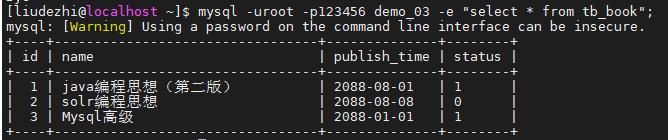
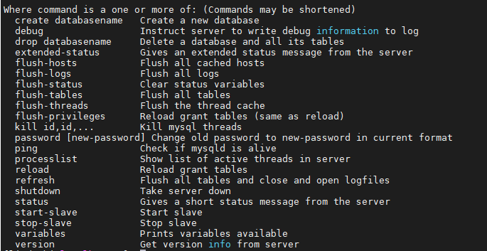
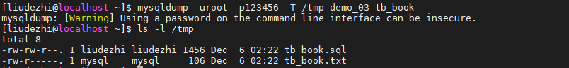
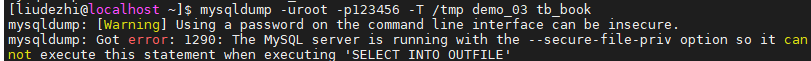
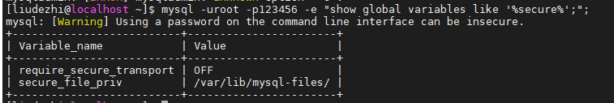
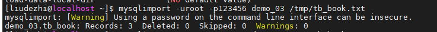
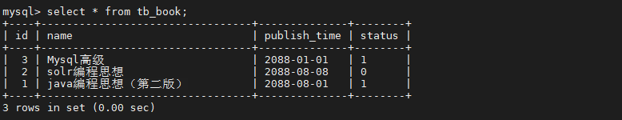

# 17.MySQL 中常用工具

- 笔记本：Mysql高级
- 创建时间：2020-12-10 07:24:44 UTC
- 更新时间：2020-12-10 07:58:27 UTC
- 原始链接：https://blog.csdn.net/qq_28921653/article/details/54174341
- 印象笔记 GUID：b528289a-b616-4582-9b94-38a8cd8b6c66

## MySQL 中常用工具

## 1. MySQL

该mysql不是指mysql服务，而是指mysql的客户端工具。
 语法 ：

```
mysql [options] [database]

```

### 1.1. 连接选项

```
参数 ：
	-u, --user=name			指定用户名
	-p, --password[=name]	指定密码
	-h, --host=name			指定服务器IP或域名
	-P, --port=#			指定连接端口

示例 ：
	mysql -h 127.0.0.1 -P 3306 -u root -p
	mysql -h127.0.0.1 -P3306 -uroot -p2143

```

### 1.2. 执行选项

```
-e, --execute=name		执行SQL语句并退出

```

此选项可以在Mysql客户端执行SQL语句，而不用连接到MySQL数据库再执行，对于一些批处理脚本，这种方式尤其方便。

```
-- 示例：
mysql -uroot -p2143 db01 -e "select * from tb_book";

```



## 2. mysqladmin

mysqladmin 是一个执行管理操作的客户端程序。可以用它来检查服务器的配置和当前状态、创建并删除数据库等。

可以通过：`mysqladmin --help` 指令查看帮助文档
 
 **eg：**

```
mysqladmin -uroot -p123456 create 'test01';
mysqladmin -uroot -p123456 drop 'test01';
mysqladmin -uroot -p123456 version;

```

## 3. mysqlbinlog

由于服务器生成的二进制日志文件以二进制格式保存，所以如果想要检查这些文本的文本格式，就会使用到mysqlbinlog 日志管理工具。

语法 ：

```
mysqlbinlog [options]  log-files1 log-files2 ...

选项：
	-d, --database=name : 指定数据库名称，只列出指定的数据库相关操作。
	-o, --offset=# : 忽略掉日志中的前n行命令。
	-r,--result-file=name : 将输出的文本格式日志输出到指定文件。
	-s, --short-form : 显示简单格式， 省略掉一些信息。
	--start-datatime=date1  --stop-datetime=date2 : 指定日期间隔内的所有日志。
	--start-position=pos1 --stop-position=pos2 : 指定位置间隔内的所有日志。

```

## 4. mysqldump

mysqldump 客户端工具用来备份数据库或在不同数据库之间进行数据迁移。备份内容包含创建表，及插入表的SQL语句。

语法 ：

```
mysqldump [options] db_name [tables]

mysqldump [options] --database/-B db1 [db2 db3...]

mysqldump [options] --all-databases/-A

```

### 4.1. 连接选项

```
参数 ：
	-u, --user=name			指定用户名
	-p, --password[=name]	指定密码
	-h, --host=name			指定服务器IP或域名
	-P, --port=#			指定连接端口

```

### 4.2. 输出内容选项

```
参数：
	--add-drop-database		在每个数据库创建语句前加上 Drop database 语句
	--add-drop-table		在每个表创建语句前加上 Drop table 语句 , 默认开启 ; 不开启 (--skip-add-drop-table)

	-n, --no-create-db		不包含数据库的创建语句
	-t, --no-create-info	不包含数据表的创建语句
	-d --no-data			不包含数据

	 -T, --tab=name			自动生成两个文件：一个.sql文件，创建表结构的语句；
	 						一个.txt文件，数据文件，相当于select into outfile

```

**eg：**

```
mysqldump -uroot -p123456 demo_03 tb_book --add-drop-database --add-drop-table > tb_book.sql

mysqldump -uroot -p123456 -T /tmp demo_03 tb_book

```



**Tips：**
 
 mysql服务启用了–secure-file-priv，无法执行此命令。
 secure-file-priv参数是用来限制LOAD DATA, SELECT … OUTFILE, and LOAD_FILE()传到哪个指定目录的
 当secure_file_priv的值为null ，表示限制mysqld 不允许导入|导出
 当secure_file_priv的值为/tmp/ ，表示限制mysqld 的导入|导出只能发生在/tmp/目录下
 当secure_file_priv的值没有具体值时，表示不对mysqld 的导入|导出做限制
 查看数据库当前该参数的值：
 
 清楚地看到secure_file_priv 的值是NULL，说明此时限制导入导出的
 找到my.ini配置文件，加入在mysqld目录下，`secure_file_priv=''`，重启mysql服务器即可。

```
sudo vim /etc/my.cnf
# 在文件最后添加：
secure_file_priv=''
# 重启 MySQL
sudo service mysqld restart

```

## 5. mysqlimport/source

mysqlimport 是客户端数据导入工具，用来导入mysqldump 加 -T 参数后导出的文本文件。

语法：

```
mysqlimport [options]  db_name  textfile1  [textfile2...]

```

示例：

```
mysqlimport -uroot -p123456 demo_03 /tmp/tb_book.txt

```


 
 

如果需要导入sql文件,可以使用mysql中的source 指令 :

```
source /tmp/tb_book.sql

```

## 6. mysqlshow

%23%23%20MySQL%20%E4%B8%AD%E5%B8%B8%E7%94%A8%E5%B7%A5%E5%85%B7%0A%23%23%201.%20MySQL%0A%E8%AF%A5mysql%E4%B8%8D%E6%98%AF%E6%8C%87mysql%E6%9C%8D%E5%8A%A1%EF%BC%8C%E8%80%8C%E6%98%AF%E6%8C%87mysql%E7%9A%84%E5%AE%A2%E6%88%B7%E7%AB%AF%E5%B7%A5%E5%85%B7%E3%80%82%0A%E8%AF%AD%E6%B3%95%20%EF%BC%9A%0A%60%60%60%0Amysql%20%5Boptions%5D%20%5Bdatabase%5D%0A%60%60%60%0A%23%23%23%201.1.%20%E8%BF%9E%E6%8E%A5%E9%80%89%E9%A1%B9%0A%60%60%60%0A%E5%8F%82%E6%95%B0%20%EF%BC%9A%20%0A%09-u%2C%20--user%3Dname%09%09%09%E6%8C%87%E5%AE%9A%E7%94%A8%E6%88%B7%E5%90%8D%0A%09-p%2C%20--password%5B%3Dname%5D%09%E6%8C%87%E5%AE%9A%E5%AF%86%E7%A0%81%0A%09-h%2C%20--host%3Dname%09%09%09%E6%8C%87%E5%AE%9A%E6%9C%8D%E5%8A%A1%E5%99%A8IP%E6%88%96%E5%9F%9F%E5%90%8D%0A%09-P%2C%20--port%3D%23%09%09%09%E6%8C%87%E5%AE%9A%E8%BF%9E%E6%8E%A5%E7%AB%AF%E5%8F%A3%0A%0A%E7%A4%BA%E4%BE%8B%20%EF%BC%9A%0A%09mysql%20-h%20127.0.0.1%20-P%203306%20-u%20root%20-p%0A%09mysql%20-h127.0.0.1%20-P3306%20-uroot%20-p2143%0A%60%60%60%0A%0A%23%23%23%201.2.%20%E6%89%A7%E8%A1%8C%E9%80%89%E9%A1%B9%0A%60%60%60%0A-e%2C%20--execute%3Dname%09%09%E6%89%A7%E8%A1%8CSQL%E8%AF%AD%E5%8F%A5%E5%B9%B6%E9%80%80%E5%87%BA%0A%60%60%60%0A%E6%AD%A4%E9%80%89%E9%A1%B9%E5%8F%AF%E4%BB%A5%E5%9C%A8Mysql%E5%AE%A2%E6%88%B7%E7%AB%AF%E6%89%A7%E8%A1%8CSQL%E8%AF%AD%E5%8F%A5%EF%BC%8C%E8%80%8C%E4%B8%8D%E7%94%A8%E8%BF%9E%E6%8E%A5%E5%88%B0MySQL%E6%95%B0%E6%8D%AE%E5%BA%93%E5%86%8D%E6%89%A7%E8%A1%8C%EF%BC%8C%E5%AF%B9%E4%BA%8E%E4%B8%80%E4%BA%9B%E6%89%B9%E5%A4%84%E7%90%86%E8%84%9A%E6%9C%AC%EF%BC%8C%E8%BF%99%E7%A7%8D%E6%96%B9%E5%BC%8F%E5%B0%A4%E5%85%B6%E6%96%B9%E4%BE%BF%E3%80%82%0A%60%60%60sql%0A--%20%E7%A4%BA%E4%BE%8B%EF%BC%9A%0Amysql%20-uroot%20-p2143%20db01%20-e%20%22select%20*%20from%20tb_book%22%3B%0A%60%60%60%0A!%5Bc1c402781ba95b81d25cd06b707ea81c.png%5D(en-resource%3A%2F%2Fdatabase%2F4472%3A0)%0A%0A%23%23%202.%20mysqladmin%0Amysqladmin%20%E6%98%AF%E4%B8%80%E4%B8%AA%E6%89%A7%E8%A1%8C%E7%AE%A1%E7%90%86%E6%93%8D%E4%BD%9C%E7%9A%84%E5%AE%A2%E6%88%B7%E7%AB%AF%E7%A8%8B%E5%BA%8F%E3%80%82%E5%8F%AF%E4%BB%A5%E7%94%A8%E5%AE%83%E6%9D%A5%E6%A3%80%E6%9F%A5%E6%9C%8D%E5%8A%A1%E5%99%A8%E7%9A%84%E9%85%8D%E7%BD%AE%E5%92%8C%E5%BD%93%E5%89%8D%E7%8A%B6%E6%80%81%E3%80%81%E5%88%9B%E5%BB%BA%E5%B9%B6%E5%88%A0%E9%99%A4%E6%95%B0%E6%8D%AE%E5%BA%93%E7%AD%89%E3%80%82%0A%0A%E5%8F%AF%E4%BB%A5%E9%80%9A%E8%BF%87%EF%BC%9A%60mysqladmin%20--help%60%20%E6%8C%87%E4%BB%A4%E6%9F%A5%E7%9C%8B%E5%B8%AE%E5%8A%A9%E6%96%87%E6%A1%A3%0A!%5B7df40b17856dc33c95a251ffbffa955d.png%5D(en-resource%3A%2F%2Fdatabase%2F4474%3A0)%0A**eg%EF%BC%9A**%0A%60%60%60sql%0Amysqladmin%20-uroot%20-p123456%20create%20'test01'%3B%20%20%0Amysqladmin%20-uroot%20-p123456%20drop%20'test01'%3B%0Amysqladmin%20-uroot%20-p123456%20version%3B%0A%60%60%60%0A%0A%23%23%203.%20mysqlbinlog%0A%E7%94%B1%E4%BA%8E%E6%9C%8D%E5%8A%A1%E5%99%A8%E7%94%9F%E6%88%90%E7%9A%84%E4%BA%8C%E8%BF%9B%E5%88%B6%E6%97%A5%E5%BF%97%E6%96%87%E4%BB%B6%E4%BB%A5%E4%BA%8C%E8%BF%9B%E5%88%B6%E6%A0%BC%E5%BC%8F%E4%BF%9D%E5%AD%98%EF%BC%8C%E6%89%80%E4%BB%A5%E5%A6%82%E6%9E%9C%E6%83%B3%E8%A6%81%E6%A3%80%E6%9F%A5%E8%BF%99%E4%BA%9B%E6%96%87%E6%9C%AC%E7%9A%84%E6%96%87%E6%9C%AC%E6%A0%BC%E5%BC%8F%EF%BC%8C%E5%B0%B1%E4%BC%9A%E4%BD%BF%E7%94%A8%E5%88%B0mysqlbinlog%20%E6%97%A5%E5%BF%97%E7%AE%A1%E7%90%86%E5%B7%A5%E5%85%B7%E3%80%82%0A%0A%E8%AF%AD%E6%B3%95%20%EF%BC%9A%0A%60%60%60%0Amysqlbinlog%20%5Boptions%5D%20%20log-files1%20log-files2%20...%0A%0A%E9%80%89%E9%A1%B9%EF%BC%9A%0A%09-d%2C%20--database%3Dname%20%3A%20%E6%8C%87%E5%AE%9A%E6%95%B0%E6%8D%AE%E5%BA%93%E5%90%8D%E7%A7%B0%EF%BC%8C%E5%8F%AA%E5%88%97%E5%87%BA%E6%8C%87%E5%AE%9A%E7%9A%84%E6%95%B0%E6%8D%AE%E5%BA%93%E7%9B%B8%E5%85%B3%E6%93%8D%E4%BD%9C%E3%80%82%0A%09-o%2C%20--offset%3D%23%20%3A%20%E5%BF%BD%E7%95%A5%E6%8E%89%E6%97%A5%E5%BF%97%E4%B8%AD%E7%9A%84%E5%89%8Dn%E8%A1%8C%E5%91%BD%E4%BB%A4%E3%80%82%0A%09-r%2C--result-file%3Dname%20%3A%20%E5%B0%86%E8%BE%93%E5%87%BA%E7%9A%84%E6%96%87%E6%9C%AC%E6%A0%BC%E5%BC%8F%E6%97%A5%E5%BF%97%E8%BE%93%E5%87%BA%E5%88%B0%E6%8C%87%E5%AE%9A%E6%96%87%E4%BB%B6%E3%80%82%0A%09-s%2C%20--short-form%20%3A%20%E6%98%BE%E7%A4%BA%E7%AE%80%E5%8D%95%E6%A0%BC%E5%BC%8F%EF%BC%8C%20%E7%9C%81%E7%95%A5%E6%8E%89%E4%B8%80%E4%BA%9B%E4%BF%A1%E6%81%AF%E3%80%82%0A%09--start-datatime%3Ddate1%20%20--stop-datetime%3Ddate2%20%3A%20%E6%8C%87%E5%AE%9A%E6%97%A5%E6%9C%9F%E9%97%B4%E9%9A%94%E5%86%85%E7%9A%84%E6%89%80%E6%9C%89%E6%97%A5%E5%BF%97%E3%80%82%0A%09--start-position%3Dpos1%20--stop-position%3Dpos2%20%3A%20%E6%8C%87%E5%AE%9A%E4%BD%8D%E7%BD%AE%E9%97%B4%E9%9A%94%E5%86%85%E7%9A%84%E6%89%80%E6%9C%89%E6%97%A5%E5%BF%97%E3%80%82%0A%60%60%60%0A%0A%23%23%204.%20mysqldump%0Amysqldump%20%E5%AE%A2%E6%88%B7%E7%AB%AF%E5%B7%A5%E5%85%B7%E7%94%A8%E6%9D%A5%E5%A4%87%E4%BB%BD%E6%95%B0%E6%8D%AE%E5%BA%93%E6%88%96%E5%9C%A8%E4%B8%8D%E5%90%8C%E6%95%B0%E6%8D%AE%E5%BA%93%E4%B9%8B%E9%97%B4%E8%BF%9B%E8%A1%8C%E6%95%B0%E6%8D%AE%E8%BF%81%E7%A7%BB%E3%80%82%E5%A4%87%E4%BB%BD%E5%86%85%E5%AE%B9%E5%8C%85%E5%90%AB%E5%88%9B%E5%BB%BA%E8%A1%A8%EF%BC%8C%E5%8F%8A%E6%8F%92%E5%85%A5%E8%A1%A8%E7%9A%84SQL%E8%AF%AD%E5%8F%A5%E3%80%82%0A%0A%E8%AF%AD%E6%B3%95%20%EF%BC%9A%0A%60%60%60%0Amysqldump%20%5Boptions%5D%20db_name%20%5Btables%5D%0A%0Amysqldump%20%5Boptions%5D%20--database%2F-B%20db1%20%5Bdb2%20db3...%5D%0A%0Amysqldump%20%5Boptions%5D%20--all-databases%2F-A%0A%60%60%60%0A%23%23%23%204.1.%20%E8%BF%9E%E6%8E%A5%E9%80%89%E9%A1%B9%0A%60%60%60%0A%E5%8F%82%E6%95%B0%20%EF%BC%9A%20%0A%09-u%2C%20--user%3Dname%09%09%09%E6%8C%87%E5%AE%9A%E7%94%A8%E6%88%B7%E5%90%8D%0A%09-p%2C%20--password%5B%3Dname%5D%09%E6%8C%87%E5%AE%9A%E5%AF%86%E7%A0%81%0A%09-h%2C%20--host%3Dname%09%09%09%E6%8C%87%E5%AE%9A%E6%9C%8D%E5%8A%A1%E5%99%A8IP%E6%88%96%E5%9F%9F%E5%90%8D%0A%09-P%2C%20--port%3D%23%09%09%09%E6%8C%87%E5%AE%9A%E8%BF%9E%E6%8E%A5%E7%AB%AF%E5%8F%A3%0A%60%60%60%0A%0A%23%23%23%204.2.%20%E8%BE%93%E5%87%BA%E5%86%85%E5%AE%B9%E9%80%89%E9%A1%B9%0A%60%60%60%0A%E5%8F%82%E6%95%B0%EF%BC%9A%0A%09--add-drop-database%09%09%E5%9C%A8%E6%AF%8F%E4%B8%AA%E6%95%B0%E6%8D%AE%E5%BA%93%E5%88%9B%E5%BB%BA%E8%AF%AD%E5%8F%A5%E5%89%8D%E5%8A%A0%E4%B8%8A%20Drop%20database%20%E8%AF%AD%E5%8F%A5%0A%09--add-drop-table%09%09%E5%9C%A8%E6%AF%8F%E4%B8%AA%E8%A1%A8%E5%88%9B%E5%BB%BA%E8%AF%AD%E5%8F%A5%E5%89%8D%E5%8A%A0%E4%B8%8A%20Drop%20table%20%E8%AF%AD%E5%8F%A5%20%2C%20%E9%BB%98%E8%AE%A4%E5%BC%80%E5%90%AF%20%3B%20%E4%B8%8D%E5%BC%80%E5%90%AF%20(--skip-add-drop-table)%0A%09%0A%09-n%2C%20--no-create-db%09%09%E4%B8%8D%E5%8C%85%E5%90%AB%E6%95%B0%E6%8D%AE%E5%BA%93%E7%9A%84%E5%88%9B%E5%BB%BA%E8%AF%AD%E5%8F%A5%0A%09-t%2C%20--no-create-info%09%E4%B8%8D%E5%8C%85%E5%90%AB%E6%95%B0%E6%8D%AE%E8%A1%A8%E7%9A%84%E5%88%9B%E5%BB%BA%E8%AF%AD%E5%8F%A5%0A%09-d%20--no-data%09%09%09%E4%B8%8D%E5%8C%85%E5%90%AB%E6%95%B0%E6%8D%AE%0A%09%0A%09%20-T%2C%20--tab%3Dname%09%09%09%E8%87%AA%E5%8A%A8%E7%94%9F%E6%88%90%E4%B8%A4%E4%B8%AA%E6%96%87%E4%BB%B6%EF%BC%9A%E4%B8%80%E4%B8%AA.sql%E6%96%87%E4%BB%B6%EF%BC%8C%E5%88%9B%E5%BB%BA%E8%A1%A8%E7%BB%93%E6%9E%84%E7%9A%84%E8%AF%AD%E5%8F%A5%EF%BC%9B%0A%09%20%09%09%09%09%09%09%E4%B8%80%E4%B8%AA.txt%E6%96%87%E4%BB%B6%EF%BC%8C%E6%95%B0%E6%8D%AE%E6%96%87%E4%BB%B6%EF%BC%8C%E7%9B%B8%E5%BD%93%E4%BA%8Eselect%20into%20outfile%20%0A%60%60%60%0A**eg%EF%BC%9A**%0A%60%60%60sql%0Amysqldump%20-uroot%20-p123456%20demo_03%20tb_book%20--add-drop-database%20--add-drop-table%20%3E%20tb_book.sql%0A%09%0Amysqldump%20-uroot%20-p123456%20-T%20%2Ftmp%20demo_03%20tb_book%0A%60%60%60%0A!%5Bc3e37e44a745cf06a625f2076caac36c.png%5D(en-resource%3A%2F%2Fdatabase%2F4480%3A0)%0A%0A**Tips%EF%BC%9A**%0A!%5B7f1cf003fc77143b5b7298b0b3491d9c.png%5D(en-resource%3A%2F%2Fdatabase%2F4476%3A0)%0Amysql%E6%9C%8D%E5%8A%A1%E5%90%AF%E7%94%A8%E4%BA%86%E2%80%93secure-file-priv%EF%BC%8C%E6%97%A0%E6%B3%95%E6%89%A7%E8%A1%8C%E6%AD%A4%E5%91%BD%E4%BB%A4%E3%80%82%0Asecure-file-priv%E5%8F%82%E6%95%B0%E6%98%AF%E7%94%A8%E6%9D%A5%E9%99%90%E5%88%B6LOAD%20DATA%2C%20SELECT%20%E2%80%A6%20OUTFILE%2C%20and%20LOAD_FILE()%E4%BC%A0%E5%88%B0%E5%93%AA%E4%B8%AA%E6%8C%87%E5%AE%9A%E7%9B%AE%E5%BD%95%E7%9A%84%0A%E5%BD%93secure_file_priv%E7%9A%84%E5%80%BC%E4%B8%BAnull%20%EF%BC%8C%E8%A1%A8%E7%A4%BA%E9%99%90%E5%88%B6mysqld%20%E4%B8%8D%E5%85%81%E8%AE%B8%E5%AF%BC%E5%85%A5%7C%E5%AF%BC%E5%87%BA%0A%E5%BD%93secure_file_priv%E7%9A%84%E5%80%BC%E4%B8%BA%2Ftmp%2F%20%EF%BC%8C%E8%A1%A8%E7%A4%BA%E9%99%90%E5%88%B6mysqld%20%E7%9A%84%E5%AF%BC%E5%85%A5%7C%E5%AF%BC%E5%87%BA%E5%8F%AA%E8%83%BD%E5%8F%91%E7%94%9F%E5%9C%A8%2Ftmp%2F%E7%9B%AE%E5%BD%95%E4%B8%8B%0A%E5%BD%93secure_file_priv%E7%9A%84%E5%80%BC%E6%B2%A1%E6%9C%89%E5%85%B7%E4%BD%93%E5%80%BC%E6%97%B6%EF%BC%8C%E8%A1%A8%E7%A4%BA%E4%B8%8D%E5%AF%B9mysqld%20%E7%9A%84%E5%AF%BC%E5%85%A5%7C%E5%AF%BC%E5%87%BA%E5%81%9A%E9%99%90%E5%88%B6%0A%E6%9F%A5%E7%9C%8B%E6%95%B0%E6%8D%AE%E5%BA%93%E5%BD%93%E5%89%8D%E8%AF%A5%E5%8F%82%E6%95%B0%E7%9A%84%E5%80%BC%EF%BC%9A%0A!%5B3d1f3af11121925788be06e8a5415ed4.png%5D(en-resource%3A%2F%2Fdatabase%2F4478%3A0)%0A%E6%B8%85%E6%A5%9A%E5%9C%B0%E7%9C%8B%E5%88%B0secure_file_priv%20%E7%9A%84%E5%80%BC%E6%98%AFNULL%EF%BC%8C%E8%AF%B4%E6%98%8E%E6%AD%A4%E6%97%B6%E9%99%90%E5%88%B6%E5%AF%BC%E5%85%A5%E5%AF%BC%E5%87%BA%E7%9A%84%0A%E6%89%BE%E5%88%B0my.ini%E9%85%8D%E7%BD%AE%E6%96%87%E4%BB%B6%EF%BC%8C%E5%8A%A0%E5%85%A5%E5%9C%A8mysqld%E7%9B%AE%E5%BD%95%E4%B8%8B%EF%BC%8C%60secure_file_priv%3D''%60%EF%BC%8C%E9%87%8D%E5%90%AFmysql%E6%9C%8D%E5%8A%A1%E5%99%A8%E5%8D%B3%E5%8F%AF%E3%80%82%0A%60%60%60shell%0Asudo%20vim%20%2Fetc%2Fmy.cnf%0A%23%20%E5%9C%A8%E6%96%87%E4%BB%B6%E6%9C%80%E5%90%8E%E6%B7%BB%E5%8A%A0%EF%BC%9A%0Asecure_file_priv%3D''%0A%23%20%E9%87%8D%E5%90%AF%20MySQL%0Asudo%20service%20mysqld%20restart%0A%60%60%60%0A%0A%23%23%205.%20mysqlimport%2Fsource%0Amysqlimport%20%E6%98%AF%E5%AE%A2%E6%88%B7%E7%AB%AF%E6%95%B0%E6%8D%AE%E5%AF%BC%E5%85%A5%E5%B7%A5%E5%85%B7%EF%BC%8C%E7%94%A8%E6%9D%A5%E5%AF%BC%E5%85%A5mysqldump%20%E5%8A%A0%20-T%20%E5%8F%82%E6%95%B0%E5%90%8E%E5%AF%BC%E5%87%BA%E7%9A%84%E6%96%87%E6%9C%AC%E6%96%87%E4%BB%B6%E3%80%82%0A%0A%E8%AF%AD%E6%B3%95%EF%BC%9A%0A%60%60%60%0Amysqlimport%20%5Boptions%5D%20%20db_name%20%20textfile1%20%20%5Btextfile2...%5D%0A%60%60%60%0A%E7%A4%BA%E4%BE%8B%EF%BC%9A%0A%60%60%60shell%0Amysqlimport%20-uroot%20-p123456%20demo_03%20%2Ftmp%2Ftb_book.txt%0A%60%60%60%0A!%5B0bc5a1b95262692133a747d369b15578.png%5D(en-resource%3A%2F%2Fdatabase%2F4482%3A0)%0A!%5Ba61b2645e9c9b471b694c96beb4d4c0d.png%5D(en-resource%3A%2F%2Fdatabase%2F4484%3A0)%0A!%5B2613c9d727bff9ee6b9ae76fc2786b9f.png%5D(en-resource%3A%2F%2Fdatabase%2F4486%3A0)%0A%0A%E5%A6%82%E6%9E%9C%E9%9C%80%E8%A6%81%E5%AF%BC%E5%85%A5sql%E6%96%87%E4%BB%B6%2C%E5%8F%AF%E4%BB%A5%E4%BD%BF%E7%94%A8mysql%E4%B8%AD%E7%9A%84source%20%E6%8C%87%E4%BB%A4%20%3A%0A%60%60%60sql%0Asource%20%2Ftmp%2Ftb_book.sql%0A%60%60%60%0A%0A%23%23%206.%20mysqlshow%0Amysqlshow%20%E5%AE%A2%E6%88%B7%E7%AB%AF%E5%AF%B9%E8%B1%A1%E6%9F%A5%E6%89%BE%E5%B7%A5%E5%85%B7%EF%BC%8C%E7%94%A8%E6%9D%A5%E5%BE%88%E5%BF%AB%E5%9C%B0%E6%9F%A5%E6%89%BE%E5%AD%98%E5%9C%A8%E5%93%AA%E4%BA%9B%E6%95%B0%E6%8D%AE%E5%BA%93%E3%80%81%E6%95%B0%E6%8D%AE%E5%BA%93%E4%B8%AD%E7%9A%84%E8%A1%A8%E3%80%81%E8%A1%A8%E4%B8%AD%E7%9A%84%E5%88%97%E6%88%96%E8%80%85%E7%B4%A2%E5%BC%95%E3%80%82%0A%0A**%E8%AF%AD%E6%B3%95%EF%BC%9A**%0A%60%60%60%0Amysqlshow%20%5Boptions%5D%20%5Bdb_name%20%5Btable_name%20%5Bcol_name%5D%5D%5D%0A%60%60%60%0A**%E5%8F%82%E6%95%B0%EF%BC%9A**%0A%60%60%60%0A--count%09%09%E6%98%BE%E7%A4%BA%E6%95%B0%E6%8D%AE%E5%BA%93%E5%8F%8A%E8%A1%A8%E7%9A%84%E7%BB%9F%E8%AE%A1%E4%BF%A1%E6%81%AF%EF%BC%88%E6%95%B0%E6%8D%AE%E5%BA%93%EF%BC%8C%E8%A1%A8%20%E5%9D%87%E5%8F%AF%E4%BB%A5%E4%B8%8D%E6%8C%87%E5%AE%9A%EF%BC%89%0A-i%09%09%09%E6%98%BE%E7%A4%BA%E6%8C%87%E5%AE%9A%E6%95%B0%E6%8D%AE%E5%BA%93%E6%88%96%E8%80%85%E6%8C%87%E5%AE%9A%E8%A1%A8%E7%9A%84%E7%8A%B6%E6%80%81%E4%BF%A1%E6%81%AF%0A%60%60%60%0A**eg%EF%BC%9A**%0A%60%60%60sql%0A%23%E6%9F%A5%E8%AF%A2%E6%AF%8F%E4%B8%AA%E6%95%B0%E6%8D%AE%E5%BA%93%E7%9A%84%E8%A1%A8%E7%9A%84%E6%95%B0%E9%87%8F%E5%8F%8A%E8%A1%A8%E4%B8%AD%E8%AE%B0%E5%BD%95%E7%9A%84%E6%95%B0%E9%87%8F%0Amysqlshow%20-uroot%20-p123456%20--count%0A%0A%23%E6%9F%A5%E8%AF%A2%20demo_03%20%E5%BA%93%E4%B8%AD%E6%AF%8F%E4%B8%AA%E8%A1%A8%E4%B8%AD%E7%9A%84%E5%AD%97%E6%AE%B5%E4%B9%A6%EF%BC%8C%E5%8F%8A%E8%A1%8C%E6%95%B0%0Amysqlshow%20-uroot%20-p123456%20demo_03%20--count%0A%0A%23%E6%9F%A5%E8%AF%A2%20demo_03%20%E5%BA%93%E4%B8%AD%20tb_book%20%E8%A1%A8%E7%9A%84%E8%AF%A6%E7%BB%86%E6%83%85%E5%86%B5%0Amysqlshow%20-uroot%20-p%20demo_03%20tb_book%20--count%0A%0A%23%E6%9F%A5%E8%AF%A2%20demo_03%20%E5%BA%93%E4%B8%AD%20tb_book%20%E8%A1%A8%E7%9A%84%E6%A6%82%E8%A6%81%E4%BF%A1%E6%81%AF%0Amysqlshow%20-uroot%20-p123456%20demo_03%20tb_book%20-i%0A%60%60%60
