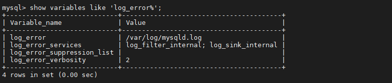
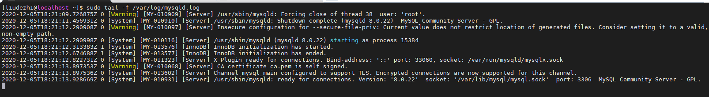
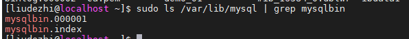
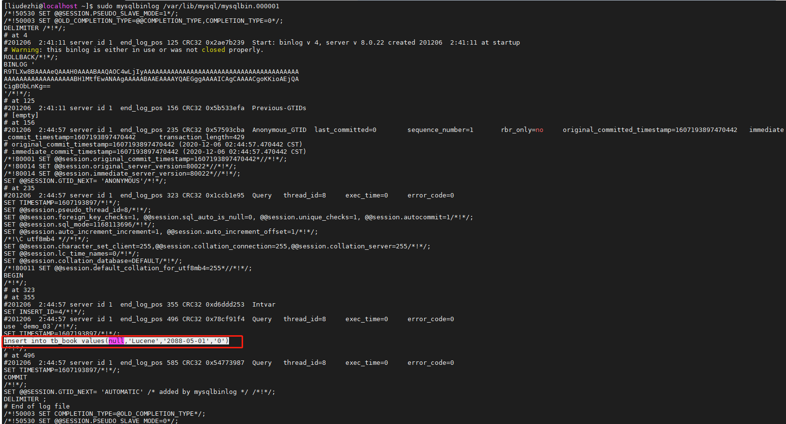
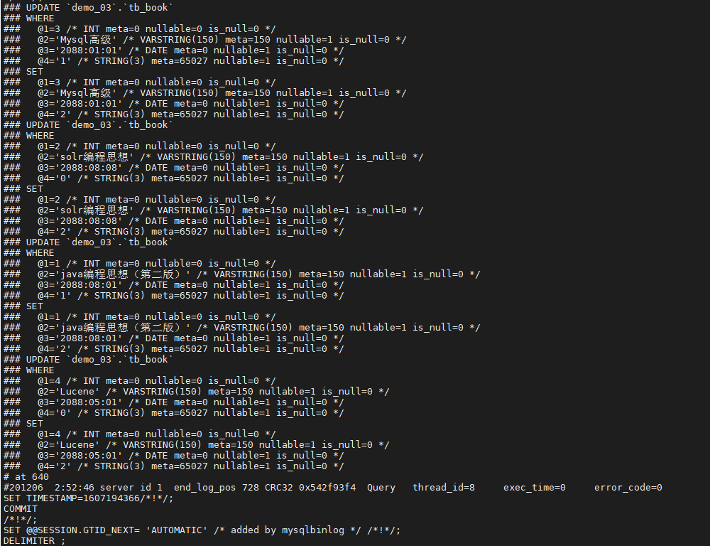
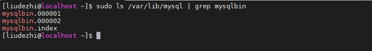
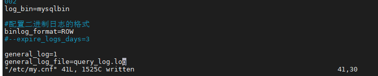
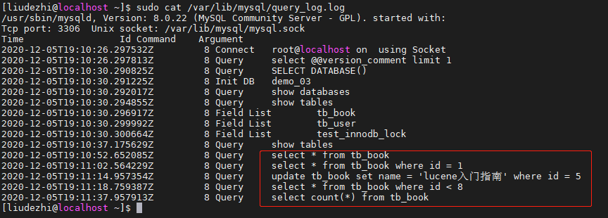

# 18.MySQL 日志

- 笔记本：Mysql高级
- 创建时间：2020-12-10 07:58:48 UTC
- 更新时间：2020-12-10 08:54:44 UTC
- 原始链接：https://blog.csdn.net/torpidcat/article/details/108683386
- 印象笔记 GUID：71695dc0-f1dd-4a1c-9996-af84dae80155

## MySQL 日志

在任何一种数据库中，都会有各种各样的日志，记录着数据库工作的方方面面，以帮助数据库管理员追踪数据库曾经发生过的各种事件。MySQL 也不例外，在 MySQL 中，有 4 种不同的日志，分别是错误日志、二进制日志（BINLOG 日志）、查询日志和慢查询日志，这些日志记录着数据库在不同方面的踪迹。

### 1. 错误日志

错误日志是 MySQL 中最重要的日志之一，它记录了当 mysqld 启动和停止时，以及服务器在运行过程中发生任何严重错误时的相关信息。当数据库出现任何故障导致无法正常使用时，可以首先查看此日志。

该日志是默认开启的。
 对于 Mysql 5.6 默认存放目录为 mysql 的数据目录（var/lib/mysql）, 默认的日志文件名为 hostname.err（hostname是主机名）。

**查看日志位置指令 ：**

```
show variables like 'log_error%';

```



**查看日志内容：**

```
sudo tail -f /var/log/mysqld.log

```



### 2. 二进制日志

#### 2.1. 概述

二进制日志（BINLOG）记录了所有的 DDL（数据定义语言）语句和 DML（数据操纵语言）语句，但是不包括数据查询语句。此日志对于灾难时的数据恢复起着极其重要的作用，MySQL的主从复制， 就是通过该binlog实现的。

二进制日志，默认情况下是没有开启的，需要到MySQL的配置文件中开启，并配置MySQL日志的格式。

配置文件位置 : /etc/my.cnf

日志存放位置 : 配置时，给定了文件名但是没有指定路径，日志默认写入Mysql的数据目录。

```
#配置开启binlog日志， 日志的文件前缀为 mysqlbin -----> 生成的文件名如 : mysqlbin.000001,mysqlbin.000002
log_bin=mysqlbin

#配置二进制日志的格式
binlog_format=STATEMENT

```

#### 2.2. 日志格式

**STATEMENT**
 该日志格式在日志文件中记录的都是SQL语句（statement），每一条对数据进行修改的SQL都会记录在日志文件中，通过Mysql提供的mysqlbinlog工具，可以清晰的查看到每条语句的文本。主从复制的时候，从库（slave）会将日志解析为原文本，并在从库重新执行一次。

**ROW**
 该日志格式在日志文件中记录的是每一行的数据变更，而不是记录SQL语句。比如，执行SQL语句 ： update tb_book set status='1' , 如果是STATEMENT 日志格式，在日志中会记录一行SQL文件； 如果是ROW，由于是对全表进行更新，也就是每一行记录都会发生变更，ROW 格式的日志中会记录每一行的数据变更。

**MIXED**
 这是目前MySQL默认的日志格式，即混合了STATEMENT 和 ROW两种格式。默认情况下采用STATEMENT，但是在一些特殊情况下采用ROW来进行记录。MIXED 格式能尽量利用两种模式的优点，而避开他们的缺点。

#### 2.3. 日志读取

由于日志以二进制方式存储，不能直接读取，需要用mysqlbinlog工具来查看，语法如下 ：

```
mysqlbinlog log-file;

```

**查看 STATEMENT 格式日志**
 执行插入语句：

```
insert into tb_book values(null,'Lucene','2088-05-01','0');

```

查看日志文件 ：
 

mysqlbin.index : 该文件是日志索引文件 ， 记录日志的文件名；
 

mysqlbing.000001 ：日志文件
 查看日志内容 ：

```
sudo mysqlbinlog /var/lib/mysql/mysqlbin.000001

```



**查看 ROW 格式日志**
 配置 :

```
#配置开启binlog日志， 日志的文件前缀为 mysqlbin -----> 生成的文件名如 : mysqlbin.000001,mysqlbin.000002
log_bin=mysqlbin

#配置二进制日志的格式
binlog_format=ROW

```

插入数据 :

```
update tb_book set status = '2';

```

如果日志格式是 ROW , 直接查看数据 , 是查看不懂的 ; 可以在mysqlbinlog 后面加上参数 -vv

```
sudo mysqlbinlog -vv /var/lib/mysql/mysqlbin.000002

```



#### 2.4. 日志删除

对于比较繁忙的系统，由于每天生成日志量大 ，这些日志如果长时间不清楚，将会占用大量的磁盘空间。下面我们将会讲解几种删除日志的常见方法 ：

##### 2.4.1. 方式一

通过 Reset Master 指令删除全部 binlog 日志，删除之后，日志编号，将从 xxxx.000001重新开始 。

执行之前 ，先查询下日志文件 ：
 
 执行删除日志指令：

```
reset master

```

执行之后， 查看日志文件 ：
 

##### 2.4.2. 方式二

执行指令 `purge master logs to 'mysqlbin.******'` ，该命令将删除 `******` 编号之前的所有日志。

##### 2.4.3. 方式三

执行指令 `purge master logs before 'yyyy-mm-dd hh24:mi:ss'` ，该命令将删除日志为 "yyyy-mm-dd hh24:mi:ss" 之前产生的所有日志 。

##### 2.4.4. 方式四

设置参数 --expire_logs_days=# ，此参数的含义是设置日志的过期天数， 过了指定的天数后日志将会被自动删除，这样将有利于减少DBA 管理日志的工作量。
 配置如下（Mysql5.6 /etc/my.cnf）：
 
 **Tips：**
 mysql 8 expire_logs_days 废弃 启用binlog_expire_logs_seconds设置binlog自动清除日志时间
 MySQL8.0 以下版本

```
-- mysql8.0以下版本查看当前数据库日志binlog保存时效 以天为单位，默认0 永不过期
show variables like '%expire_logs_days%';
-- mysql8.0以下版本通过设置全局参数expire_logs_days修改binlog保存时效 以天为单位，默认0 永不过期
set global expire_logs_days=5;

```

mysql8.0以上版本

```
-- mysql8.0以下版本查看当前数据库日志binlog保存时效 以秒为单位
show variables like '%binlog_expire_logs_seconds%';
-- mysql8.0以下版本通过设置全局参数binlog_expire_logs_seconds修改binlog保存时间 以秒为单位；默认2592000 30天
-- 14400   4小时；86400  1天；259200  3天； 
set global binlog_expire_logs_seconds=259200;

```

### 3. 查询日志

查询日志中记录了客户端的所有操作语句，而二进制日志不包含查询数据的SQL语句。

默认情况下， 查询日志是未开启的。如果需要开启查询日志，可以设置以下配置 ：

```
#该选项用来开启查询日志 ， 可选值 ： 0 或者 1 ； 0 代表关闭， 1 代表开启
general_log=1

#设置日志的文件名 ， 如果没有指定， 默认的文件名为 host_name.log
general_log_file=file_name

```

在 mysql 的配置文件 /etc/my.cnf 中配置如下内容 ：
 

配置完毕之后，在数据库执行以下操作 ：

```
select * from tb_book;
select * from tb_book where id = 1;
update tb_book set name = 'lucene入门指南' where id = 5;
select * from tb_book where id < 8;
select count(*) from tb_book;

```

执行完毕之后， 再次来查询日志文件 ：
 

### 4. 慢日志查询

%23%23%20MySQL%20%E6%97%A5%E5%BF%97%0A%E5%9C%A8%E4%BB%BB%E4%BD%95%E4%B8%80%E7%A7%8D%E6%95%B0%E6%8D%AE%E5%BA%93%E4%B8%AD%EF%BC%8C%E9%83%BD%E4%BC%9A%E6%9C%89%E5%90%84%E7%A7%8D%E5%90%84%E6%A0%B7%E7%9A%84%E6%97%A5%E5%BF%97%EF%BC%8C%E8%AE%B0%E5%BD%95%E7%9D%80%E6%95%B0%E6%8D%AE%E5%BA%93%E5%B7%A5%E4%BD%9C%E7%9A%84%E6%96%B9%E6%96%B9%E9%9D%A2%E9%9D%A2%EF%BC%8C%E4%BB%A5%E5%B8%AE%E5%8A%A9%E6%95%B0%E6%8D%AE%E5%BA%93%E7%AE%A1%E7%90%86%E5%91%98%E8%BF%BD%E8%B8%AA%E6%95%B0%E6%8D%AE%E5%BA%93%E6%9B%BE%E7%BB%8F%E5%8F%91%E7%94%9F%E8%BF%87%E7%9A%84%E5%90%84%E7%A7%8D%E4%BA%8B%E4%BB%B6%E3%80%82MySQL%20%E4%B9%9F%E4%B8%8D%E4%BE%8B%E5%A4%96%EF%BC%8C%E5%9C%A8%20MySQL%20%E4%B8%AD%EF%BC%8C%E6%9C%89%204%20%E7%A7%8D%E4%B8%8D%E5%90%8C%E7%9A%84%E6%97%A5%E5%BF%97%EF%BC%8C%E5%88%86%E5%88%AB%E6%98%AF%E9%94%99%E8%AF%AF%E6%97%A5%E5%BF%97%E3%80%81%E4%BA%8C%E8%BF%9B%E5%88%B6%E6%97%A5%E5%BF%97%EF%BC%88BINLOG%20%E6%97%A5%E5%BF%97%EF%BC%89%E3%80%81%E6%9F%A5%E8%AF%A2%E6%97%A5%E5%BF%97%E5%92%8C%E6%85%A2%E6%9F%A5%E8%AF%A2%E6%97%A5%E5%BF%97%EF%BC%8C%E8%BF%99%E4%BA%9B%E6%97%A5%E5%BF%97%E8%AE%B0%E5%BD%95%E7%9D%80%E6%95%B0%E6%8D%AE%E5%BA%93%E5%9C%A8%E4%B8%8D%E5%90%8C%E6%96%B9%E9%9D%A2%E7%9A%84%E8%B8%AA%E8%BF%B9%E3%80%82%0A%23%23%23%201.%20%E9%94%99%E8%AF%AF%E6%97%A5%E5%BF%97%0A%E9%94%99%E8%AF%AF%E6%97%A5%E5%BF%97%E6%98%AF%20MySQL%20%E4%B8%AD%E6%9C%80%E9%87%8D%E8%A6%81%E7%9A%84%E6%97%A5%E5%BF%97%E4%B9%8B%E4%B8%80%EF%BC%8C%E5%AE%83%E8%AE%B0%E5%BD%95%E4%BA%86%E5%BD%93%20mysqld%20%E5%90%AF%E5%8A%A8%E5%92%8C%E5%81%9C%E6%AD%A2%E6%97%B6%EF%BC%8C%E4%BB%A5%E5%8F%8A%E6%9C%8D%E5%8A%A1%E5%99%A8%E5%9C%A8%E8%BF%90%E8%A1%8C%E8%BF%87%E7%A8%8B%E4%B8%AD%E5%8F%91%E7%94%9F%E4%BB%BB%E4%BD%95%E4%B8%A5%E9%87%8D%E9%94%99%E8%AF%AF%E6%97%B6%E7%9A%84%E7%9B%B8%E5%85%B3%E4%BF%A1%E6%81%AF%E3%80%82%E5%BD%93%E6%95%B0%E6%8D%AE%E5%BA%93%E5%87%BA%E7%8E%B0%E4%BB%BB%E4%BD%95%E6%95%85%E9%9A%9C%E5%AF%BC%E8%87%B4%E6%97%A0%E6%B3%95%E6%AD%A3%E5%B8%B8%E4%BD%BF%E7%94%A8%E6%97%B6%EF%BC%8C%E5%8F%AF%E4%BB%A5%E9%A6%96%E5%85%88%E6%9F%A5%E7%9C%8B%E6%AD%A4%E6%97%A5%E5%BF%97%E3%80%82%0A%0A%E8%AF%A5%E6%97%A5%E5%BF%97%E6%98%AF%E9%BB%98%E8%AE%A4%E5%BC%80%E5%90%AF%E7%9A%84%E3%80%82%0A%E5%AF%B9%E4%BA%8E%20Mysql%205.6%20%E9%BB%98%E8%AE%A4%E5%AD%98%E6%94%BE%E7%9B%AE%E5%BD%95%E4%B8%BA%20mysql%20%E7%9A%84%E6%95%B0%E6%8D%AE%E7%9B%AE%E5%BD%95%EF%BC%88var%2Flib%2Fmysql%EF%BC%89%2C%20%E9%BB%98%E8%AE%A4%E7%9A%84%E6%97%A5%E5%BF%97%E6%96%87%E4%BB%B6%E5%90%8D%E4%B8%BA%20hostname.err%EF%BC%88hostname%E6%98%AF%E4%B8%BB%E6%9C%BA%E5%90%8D%EF%BC%89%E3%80%82%0A%0A**%E6%9F%A5%E7%9C%8B%E6%97%A5%E5%BF%97%E4%BD%8D%E7%BD%AE%E6%8C%87%E4%BB%A4%20%EF%BC%9A**%0A%60%60%60sql%0Ashow%20variables%20like%20'log_error%25'%3B%0A%60%60%60%0A!%5Bc549de52789f5f2e2f197716005d7181.png%5D(en-resource%3A%2F%2Fdatabase%2F4490%3A0)%0A%0A**%E6%9F%A5%E7%9C%8B%E6%97%A5%E5%BF%97%E5%86%85%E5%AE%B9%EF%BC%9A**%0A%60%60%60shell%0Asudo%20tail%20-f%20%2Fvar%2Flog%2Fmysqld.log%0A%60%60%60%0A!%5B344f3a2d544e62b0211838ecbf5caa51.png%5D(en-resource%3A%2F%2Fdatabase%2F4492%3A0)%0A%0A%23%23%23%202.%20%E4%BA%8C%E8%BF%9B%E5%88%B6%E6%97%A5%E5%BF%97%0A%23%23%23%23%202.1.%20%E6%A6%82%E8%BF%B0%0A%E4%BA%8C%E8%BF%9B%E5%88%B6%E6%97%A5%E5%BF%97%EF%BC%88BINLOG%EF%BC%89%E8%AE%B0%E5%BD%95%E4%BA%86%E6%89%80%E6%9C%89%E7%9A%84%20DDL%EF%BC%88%E6%95%B0%E6%8D%AE%E5%AE%9A%E4%B9%89%E8%AF%AD%E8%A8%80%EF%BC%89%E8%AF%AD%E5%8F%A5%E5%92%8C%20DML%EF%BC%88%E6%95%B0%E6%8D%AE%E6%93%8D%E7%BA%B5%E8%AF%AD%E8%A8%80%EF%BC%89%E8%AF%AD%E5%8F%A5%EF%BC%8C%E4%BD%86%E6%98%AF%E4%B8%8D%E5%8C%85%E6%8B%AC%E6%95%B0%E6%8D%AE%E6%9F%A5%E8%AF%A2%E8%AF%AD%E5%8F%A5%E3%80%82%E6%AD%A4%E6%97%A5%E5%BF%97%E5%AF%B9%E4%BA%8E%E7%81%BE%E9%9A%BE%E6%97%B6%E7%9A%84%E6%95%B0%E6%8D%AE%E6%81%A2%E5%A4%8D%E8%B5%B7%E7%9D%80%E6%9E%81%E5%85%B6%E9%87%8D%E8%A6%81%E7%9A%84%E4%BD%9C%E7%94%A8%EF%BC%8CMySQL%E7%9A%84%E4%B8%BB%E4%BB%8E%E5%A4%8D%E5%88%B6%EF%BC%8C%20%E5%B0%B1%E6%98%AF%E9%80%9A%E8%BF%87%E8%AF%A5binlog%E5%AE%9E%E7%8E%B0%E7%9A%84%E3%80%82%0A%0A%E4%BA%8C%E8%BF%9B%E5%88%B6%E6%97%A5%E5%BF%97%EF%BC%8C%E9%BB%98%E8%AE%A4%E6%83%85%E5%86%B5%E4%B8%8B%E6%98%AF%E6%B2%A1%E6%9C%89%E5%BC%80%E5%90%AF%E7%9A%84%EF%BC%8C%E9%9C%80%E8%A6%81%E5%88%B0MySQL%E7%9A%84%E9%85%8D%E7%BD%AE%E6%96%87%E4%BB%B6%E4%B8%AD%E5%BC%80%E5%90%AF%EF%BC%8C%E5%B9%B6%E9%85%8D%E7%BD%AEMySQL%E6%97%A5%E5%BF%97%E7%9A%84%E6%A0%BC%E5%BC%8F%E3%80%82%0A%0A%E9%85%8D%E7%BD%AE%E6%96%87%E4%BB%B6%E4%BD%8D%E7%BD%AE%20%3A%20%2Fetc%2Fmy.cnf%0A%0A%E6%97%A5%E5%BF%97%E5%AD%98%E6%94%BE%E4%BD%8D%E7%BD%AE%20%3A%20%E9%85%8D%E7%BD%AE%E6%97%B6%EF%BC%8C%E7%BB%99%E5%AE%9A%E4%BA%86%E6%96%87%E4%BB%B6%E5%90%8D%E4%BD%86%E6%98%AF%E6%B2%A1%E6%9C%89%E6%8C%87%E5%AE%9A%E8%B7%AF%E5%BE%84%EF%BC%8C%E6%97%A5%E5%BF%97%E9%BB%98%E8%AE%A4%E5%86%99%E5%85%A5Mysql%E7%9A%84%E6%95%B0%E6%8D%AE%E7%9B%AE%E5%BD%95%E3%80%82%0A%60%60%60%0A%23%E9%85%8D%E7%BD%AE%E5%BC%80%E5%90%AFbinlog%E6%97%A5%E5%BF%97%EF%BC%8C%20%E6%97%A5%E5%BF%97%E7%9A%84%E6%96%87%E4%BB%B6%E5%89%8D%E7%BC%80%E4%B8%BA%20mysqlbin%20-----%3E%20%E7%94%9F%E6%88%90%E7%9A%84%E6%96%87%E4%BB%B6%E5%90%8D%E5%A6%82%20%3A%20mysqlbin.000001%2Cmysqlbin.000002%0Alog_bin%3Dmysqlbin%0A%0A%23%E9%85%8D%E7%BD%AE%E4%BA%8C%E8%BF%9B%E5%88%B6%E6%97%A5%E5%BF%97%E7%9A%84%E6%A0%BC%E5%BC%8F%0Abinlog_format%3DSTATEMENT%0A%60%60%60%0A%23%23%23%23%202.2.%20%E6%97%A5%E5%BF%97%E6%A0%BC%E5%BC%8F%0A**STATEMENT**%0A%E8%AF%A5%E6%97%A5%E5%BF%97%E6%A0%BC%E5%BC%8F%E5%9C%A8%E6%97%A5%E5%BF%97%E6%96%87%E4%BB%B6%E4%B8%AD%E8%AE%B0%E5%BD%95%E7%9A%84%E9%83%BD%E6%98%AFSQL%E8%AF%AD%E5%8F%A5%EF%BC%88statement%EF%BC%89%EF%BC%8C%E6%AF%8F%E4%B8%80%E6%9D%A1%E5%AF%B9%E6%95%B0%E6%8D%AE%E8%BF%9B%E8%A1%8C%E4%BF%AE%E6%94%B9%E7%9A%84SQL%E9%83%BD%E4%BC%9A%E8%AE%B0%E5%BD%95%E5%9C%A8%E6%97%A5%E5%BF%97%E6%96%87%E4%BB%B6%E4%B8%AD%EF%BC%8C%E9%80%9A%E8%BF%87Mysql%E6%8F%90%E4%BE%9B%E7%9A%84mysqlbinlog%E5%B7%A5%E5%85%B7%EF%BC%8C%E5%8F%AF%E4%BB%A5%E6%B8%85%E6%99%B0%E7%9A%84%E6%9F%A5%E7%9C%8B%E5%88%B0%E6%AF%8F%E6%9D%A1%E8%AF%AD%E5%8F%A5%E7%9A%84%E6%96%87%E6%9C%AC%E3%80%82%E4%B8%BB%E4%BB%8E%E5%A4%8D%E5%88%B6%E7%9A%84%E6%97%B6%E5%80%99%EF%BC%8C%E4%BB%8E%E5%BA%93%EF%BC%88slave%EF%BC%89%E4%BC%9A%E5%B0%86%E6%97%A5%E5%BF%97%E8%A7%A3%E6%9E%90%E4%B8%BA%E5%8E%9F%E6%96%87%E6%9C%AC%EF%BC%8C%E5%B9%B6%E5%9C%A8%E4%BB%8E%E5%BA%93%E9%87%8D%E6%96%B0%E6%89%A7%E8%A1%8C%E4%B8%80%E6%AC%A1%E3%80%82%0A%0A**ROW**%0A%E8%AF%A5%E6%97%A5%E5%BF%97%E6%A0%BC%E5%BC%8F%E5%9C%A8%E6%97%A5%E5%BF%97%E6%96%87%E4%BB%B6%E4%B8%AD%E8%AE%B0%E5%BD%95%E7%9A%84%E6%98%AF%E6%AF%8F%E4%B8%80%E8%A1%8C%E7%9A%84%E6%95%B0%E6%8D%AE%E5%8F%98%E6%9B%B4%EF%BC%8C%E8%80%8C%E4%B8%8D%E6%98%AF%E8%AE%B0%E5%BD%95SQL%E8%AF%AD%E5%8F%A5%E3%80%82%E6%AF%94%E5%A6%82%EF%BC%8C%E6%89%A7%E8%A1%8CSQL%E8%AF%AD%E5%8F%A5%20%EF%BC%9A%20update%20tb_book%20set%20status%3D'1'%20%2C%20%E5%A6%82%E6%9E%9C%E6%98%AFSTATEMENT%20%E6%97%A5%E5%BF%97%E6%A0%BC%E5%BC%8F%EF%BC%8C%E5%9C%A8%E6%97%A5%E5%BF%97%E4%B8%AD%E4%BC%9A%E8%AE%B0%E5%BD%95%E4%B8%80%E8%A1%8CSQL%E6%96%87%E4%BB%B6%EF%BC%9B%20%E5%A6%82%E6%9E%9C%E6%98%AFROW%EF%BC%8C%E7%94%B1%E4%BA%8E%E6%98%AF%E5%AF%B9%E5%85%A8%E8%A1%A8%E8%BF%9B%E8%A1%8C%E6%9B%B4%E6%96%B0%EF%BC%8C%E4%B9%9F%E5%B0%B1%E6%98%AF%E6%AF%8F%E4%B8%80%E8%A1%8C%E8%AE%B0%E5%BD%95%E9%83%BD%E4%BC%9A%E5%8F%91%E7%94%9F%E5%8F%98%E6%9B%B4%EF%BC%8CROW%20%E6%A0%BC%E5%BC%8F%E7%9A%84%E6%97%A5%E5%BF%97%E4%B8%AD%E4%BC%9A%E8%AE%B0%E5%BD%95%E6%AF%8F%E4%B8%80%E8%A1%8C%E7%9A%84%E6%95%B0%E6%8D%AE%E5%8F%98%E6%9B%B4%E3%80%82%0A%0A**MIXED**%0A%E8%BF%99%E6%98%AF%E7%9B%AE%E5%89%8DMySQL%E9%BB%98%E8%AE%A4%E7%9A%84%E6%97%A5%E5%BF%97%E6%A0%BC%E5%BC%8F%EF%BC%8C%E5%8D%B3%E6%B7%B7%E5%90%88%E4%BA%86STATEMENT%20%E5%92%8C%20ROW%E4%B8%A4%E7%A7%8D%E6%A0%BC%E5%BC%8F%E3%80%82%E9%BB%98%E8%AE%A4%E6%83%85%E5%86%B5%E4%B8%8B%E9%87%87%E7%94%A8STATEMENT%EF%BC%8C%E4%BD%86%E6%98%AF%E5%9C%A8%E4%B8%80%E4%BA%9B%E7%89%B9%E6%AE%8A%E6%83%85%E5%86%B5%E4%B8%8B%E9%87%87%E7%94%A8ROW%E6%9D%A5%E8%BF%9B%E8%A1%8C%E8%AE%B0%E5%BD%95%E3%80%82MIXED%20%E6%A0%BC%E5%BC%8F%E8%83%BD%E5%B0%BD%E9%87%8F%E5%88%A9%E7%94%A8%E4%B8%A4%E7%A7%8D%E6%A8%A1%E5%BC%8F%E7%9A%84%E4%BC%98%E7%82%B9%EF%BC%8C%E8%80%8C%E9%81%BF%E5%BC%80%E4%BB%96%E4%BB%AC%E7%9A%84%E7%BC%BA%E7%82%B9%E3%80%82%0A%0A%23%23%23%23%202.3.%20%E6%97%A5%E5%BF%97%E8%AF%BB%E5%8F%96%0A%E7%94%B1%E4%BA%8E%E6%97%A5%E5%BF%97%E4%BB%A5%E4%BA%8C%E8%BF%9B%E5%88%B6%E6%96%B9%E5%BC%8F%E5%AD%98%E5%82%A8%EF%BC%8C%E4%B8%8D%E8%83%BD%E7%9B%B4%E6%8E%A5%E8%AF%BB%E5%8F%96%EF%BC%8C%E9%9C%80%E8%A6%81%E7%94%A8mysqlbinlog%E5%B7%A5%E5%85%B7%E6%9D%A5%E6%9F%A5%E7%9C%8B%EF%BC%8C%E8%AF%AD%E6%B3%95%E5%A6%82%E4%B8%8B%20%EF%BC%9A%0A%60%60%60shell%0Amysqlbinlog%20log-file%3B%0A%60%60%60%0A**%E6%9F%A5%E7%9C%8B%20STATEMENT%20%E6%A0%BC%E5%BC%8F%E6%97%A5%E5%BF%97**%0A%E6%89%A7%E8%A1%8C%E6%8F%92%E5%85%A5%E8%AF%AD%E5%8F%A5%EF%BC%9A%0A%60%60%60sql%0Ainsert%20into%20tb_book%20values(null%2C'Lucene'%2C'2088-05-01'%2C'0')%3B%0A%60%60%60%0A%20%E6%9F%A5%E7%9C%8B%E6%97%A5%E5%BF%97%E6%96%87%E4%BB%B6%20%EF%BC%9A%0A!%5Bf9067def330c2c7c53ac073d2feabc82.png%5D(en-resource%3A%2F%2Fdatabase%2F4494%3A1)%0A%0Amysqlbin.index%20%3A%20%E8%AF%A5%E6%96%87%E4%BB%B6%E6%98%AF%E6%97%A5%E5%BF%97%E7%B4%A2%E5%BC%95%E6%96%87%E4%BB%B6%20%EF%BC%8C%20%E8%AE%B0%E5%BD%95%E6%97%A5%E5%BF%97%E7%9A%84%E6%96%87%E4%BB%B6%E5%90%8D%EF%BC%9B%0A!%5Bd25b7a189510827be27e0697cbe7d0a0.png%5D(en-resource%3A%2F%2Fdatabase%2F4496%3A0)%0A%0Amysqlbing.000001%20%EF%BC%9A%E6%97%A5%E5%BF%97%E6%96%87%E4%BB%B6%0A%E6%9F%A5%E7%9C%8B%E6%97%A5%E5%BF%97%E5%86%85%E5%AE%B9%20%EF%BC%9A%0A%60%60%60shell%0Asudo%20mysqlbinlog%20%2Fvar%2Flib%2Fmysql%2Fmysqlbin.000001%0A%60%60%60%0A!%5B33bee3c5918bdbba732a699ccc5bccc3.png%5D(en-resource%3A%2F%2Fdatabase%2F4498%3A0)%0A%0A**%E6%9F%A5%E7%9C%8B%20ROW%20%E6%A0%BC%E5%BC%8F%E6%97%A5%E5%BF%97**%0A%E9%85%8D%E7%BD%AE%20%3A%0A%60%60%60%0A%23%E9%85%8D%E7%BD%AE%E5%BC%80%E5%90%AFbinlog%E6%97%A5%E5%BF%97%EF%BC%8C%20%E6%97%A5%E5%BF%97%E7%9A%84%E6%96%87%E4%BB%B6%E5%89%8D%E7%BC%80%E4%B8%BA%20mysqlbin%20-----%3E%20%E7%94%9F%E6%88%90%E7%9A%84%E6%96%87%E4%BB%B6%E5%90%8D%E5%A6%82%20%3A%20mysqlbin.000001%2Cmysqlbin.000002%0Alog_bin%3Dmysqlbin%0A%0A%23%E9%85%8D%E7%BD%AE%E4%BA%8C%E8%BF%9B%E5%88%B6%E6%97%A5%E5%BF%97%E7%9A%84%E6%A0%BC%E5%BC%8F%0Abinlog_format%3DROW%0A%60%60%60%0A%E6%8F%92%E5%85%A5%E6%95%B0%E6%8D%AE%20%3A%0A%60%60%60sql%0Aupdate%20tb_book%20set%20status%20%3D%20'2'%3B%0A%60%60%60%0A%E5%A6%82%E6%9E%9C%E6%97%A5%E5%BF%97%E6%A0%BC%E5%BC%8F%E6%98%AF%20ROW%20%2C%20%E7%9B%B4%E6%8E%A5%E6%9F%A5%E7%9C%8B%E6%95%B0%E6%8D%AE%20%2C%20%E6%98%AF%E6%9F%A5%E7%9C%8B%E4%B8%8D%E6%87%82%E7%9A%84%20%3B%20%E5%8F%AF%E4%BB%A5%E5%9C%A8mysqlbinlog%20%E5%90%8E%E9%9D%A2%E5%8A%A0%E4%B8%8A%E5%8F%82%E6%95%B0%20-vv%0A%60%60%60shell%0Asudo%20mysqlbinlog%20-vv%20%2Fvar%2Flib%2Fmysql%2Fmysqlbin.000002%0A%60%60%60%0A!%5Bab491e95e13b572f0a988a8a61cad4af.png%5D(en-resource%3A%2F%2Fdatabase%2F4500%3A0)%0A%0A%0A%23%23%23%23%202.4.%20%E6%97%A5%E5%BF%97%E5%88%A0%E9%99%A4%0A%E5%AF%B9%E4%BA%8E%E6%AF%94%E8%BE%83%E7%B9%81%E5%BF%99%E7%9A%84%E7%B3%BB%E7%BB%9F%EF%BC%8C%E7%94%B1%E4%BA%8E%E6%AF%8F%E5%A4%A9%E7%94%9F%E6%88%90%E6%97%A5%E5%BF%97%E9%87%8F%E5%A4%A7%20%EF%BC%8C%E8%BF%99%E4%BA%9B%E6%97%A5%E5%BF%97%E5%A6%82%E6%9E%9C%E9%95%BF%E6%97%B6%E9%97%B4%E4%B8%8D%E6%B8%85%E6%A5%9A%EF%BC%8C%E5%B0%86%E4%BC%9A%E5%8D%A0%E7%94%A8%E5%A4%A7%E9%87%8F%E7%9A%84%E7%A3%81%E7%9B%98%E7%A9%BA%E9%97%B4%E3%80%82%E4%B8%8B%E9%9D%A2%E6%88%91%E4%BB%AC%E5%B0%86%E4%BC%9A%E8%AE%B2%E8%A7%A3%E5%87%A0%E7%A7%8D%E5%88%A0%E9%99%A4%E6%97%A5%E5%BF%97%E7%9A%84%E5%B8%B8%E8%A7%81%E6%96%B9%E6%B3%95%20%EF%BC%9A%0A%23%23%23%23%23%202.4.1.%20%E6%96%B9%E5%BC%8F%E4%B8%80%0A%E9%80%9A%E8%BF%87%20Reset%20Master%20%E6%8C%87%E4%BB%A4%E5%88%A0%E9%99%A4%E5%85%A8%E9%83%A8%20binlog%20%E6%97%A5%E5%BF%97%EF%BC%8C%E5%88%A0%E9%99%A4%E4%B9%8B%E5%90%8E%EF%BC%8C%E6%97%A5%E5%BF%97%E7%BC%96%E5%8F%B7%EF%BC%8C%E5%B0%86%E4%BB%8E%20xxxx.000001%E9%87%8D%E6%96%B0%E5%BC%80%E5%A7%8B%20%E3%80%82%0A%0A%E6%89%A7%E8%A1%8C%E4%B9%8B%E5%89%8D%20%EF%BC%8C%E5%85%88%E6%9F%A5%E8%AF%A2%E4%B8%8B%E6%97%A5%E5%BF%97%E6%96%87%E4%BB%B6%20%EF%BC%9A%0A!%5B5880bbc28e1173329263e0cfed29cf06.png%5D(en-resource%3A%2F%2Fdatabase%2F4502%3A0)%0A%E6%89%A7%E8%A1%8C%E5%88%A0%E9%99%A4%E6%97%A5%E5%BF%97%E6%8C%87%E4%BB%A4%EF%BC%9A%0A%60%60%60sql%0Areset%20master%0A%60%60%60%0A%E6%89%A7%E8%A1%8C%E4%B9%8B%E5%90%8E%EF%BC%8C%20%E6%9F%A5%E7%9C%8B%E6%97%A5%E5%BF%97%E6%96%87%E4%BB%B6%20%EF%BC%9A%0A!%5B0ef6cb3924595bc8df66e0dd34553548.png%5D(en-resource%3A%2F%2Fdatabase%2F4504%3A0)%0A%0A%23%23%23%23%23%202.4.2.%20%E6%96%B9%E5%BC%8F%E4%BA%8C%0A%E6%89%A7%E8%A1%8C%E6%8C%87%E4%BB%A4%20%60%60%60%20purge%20%20master%20logs%20to%20'mysqlbin.******'%60%60%60%20%EF%BC%8C%E8%AF%A5%E5%91%BD%E4%BB%A4%E5%B0%86%E5%88%A0%E9%99%A4%20%20%60%60%60%20******%60%60%60%20%E7%BC%96%E5%8F%B7%E4%B9%8B%E5%89%8D%E7%9A%84%E6%89%80%E6%9C%89%E6%97%A5%E5%BF%97%E3%80%82%20%0A%0A%23%23%23%23%23%202.4.3.%20%E6%96%B9%E5%BC%8F%E4%B8%89%0A%E6%89%A7%E8%A1%8C%E6%8C%87%E4%BB%A4%20%60%60%60%20purge%20master%20logs%20before%20'yyyy-mm-dd%20hh24%3Ami%3Ass'%60%60%60%20%EF%BC%8C%E8%AF%A5%E5%91%BD%E4%BB%A4%E5%B0%86%E5%88%A0%E9%99%A4%E6%97%A5%E5%BF%97%E4%B8%BA%20%22yyyy-mm-dd%20hh24%3Ami%3Ass%22%20%E4%B9%8B%E5%89%8D%E4%BA%A7%E7%94%9F%E7%9A%84%E6%89%80%E6%9C%89%E6%97%A5%E5%BF%97%20%E3%80%82%0A%0A%23%23%23%23%23%202.4.4.%20%E6%96%B9%E5%BC%8F%E5%9B%9B%0A%E8%AE%BE%E7%BD%AE%E5%8F%82%E6%95%B0%20--expire_logs_days%3D%23%20%EF%BC%8C%E6%AD%A4%E5%8F%82%E6%95%B0%E7%9A%84%E5%90%AB%E4%B9%89%E6%98%AF%E8%AE%BE%E7%BD%AE%E6%97%A5%E5%BF%97%E7%9A%84%E8%BF%87%E6%9C%9F%E5%A4%A9%E6%95%B0%EF%BC%8C%20%E8%BF%87%E4%BA%86%E6%8C%87%E5%AE%9A%E7%9A%84%E5%A4%A9%E6%95%B0%E5%90%8E%E6%97%A5%E5%BF%97%E5%B0%86%E4%BC%9A%E8%A2%AB%E8%87%AA%E5%8A%A8%E5%88%A0%E9%99%A4%EF%BC%8C%E8%BF%99%E6%A0%B7%E5%B0%86%E6%9C%89%E5%88%A9%E4%BA%8E%E5%87%8F%E5%B0%91DBA%20%E7%AE%A1%E7%90%86%E6%97%A5%E5%BF%97%E7%9A%84%E5%B7%A5%E4%BD%9C%E9%87%8F%E3%80%82%0A%E9%85%8D%E7%BD%AE%E5%A6%82%E4%B8%8B%EF%BC%88Mysql5.6%20%2Fetc%2Fmy.cnf%EF%BC%89%EF%BC%9A%0A!%5Be78d2a3398ecbc4bb1bbb990b94ba6d3.png%5D(en-resource%3A%2F%2Fdatabase%2F4506%3A0)%0A**Tips%EF%BC%9A**%0Amysql%208%20expire_logs_days%20%E5%BA%9F%E5%BC%83%20%E5%90%AF%E7%94%A8binlog_expire_logs_seconds%E8%AE%BE%E7%BD%AEbinlog%E8%87%AA%E5%8A%A8%E6%B8%85%E9%99%A4%E6%97%A5%E5%BF%97%E6%97%B6%E9%97%B4%0AMySQL8.0%20%E4%BB%A5%E4%B8%8B%E7%89%88%E6%9C%AC%0A%60%60%60sql%0A--%20mysql8.0%E4%BB%A5%E4%B8%8B%E7%89%88%E6%9C%AC%E6%9F%A5%E7%9C%8B%E5%BD%93%E5%89%8D%E6%95%B0%E6%8D%AE%E5%BA%93%E6%97%A5%E5%BF%97binlog%E4%BF%9D%E5%AD%98%E6%97%B6%E6%95%88%20%E4%BB%A5%E5%A4%A9%E4%B8%BA%E5%8D%95%E4%BD%8D%EF%BC%8C%E9%BB%98%E8%AE%A40%20%E6%B0%B8%E4%B8%8D%E8%BF%87%E6%9C%9F%0Ashow%20variables%20like%20'%25expire_logs_days%25'%3B%0A--%20mysql8.0%E4%BB%A5%E4%B8%8B%E7%89%88%E6%9C%AC%E9%80%9A%E8%BF%87%E8%AE%BE%E7%BD%AE%E5%85%A8%E5%B1%80%E5%8F%82%E6%95%B0expire_logs_days%E4%BF%AE%E6%94%B9binlog%E4%BF%9D%E5%AD%98%E6%97%B6%E6%95%88%20%E4%BB%A5%E5%A4%A9%E4%B8%BA%E5%8D%95%E4%BD%8D%EF%BC%8C%E9%BB%98%E8%AE%A40%20%E6%B0%B8%E4%B8%8D%E8%BF%87%E6%9C%9F%0Aset%20global%20expire_logs_days%3D5%3B%0A%60%60%60%0Amysql8.0%E4%BB%A5%E4%B8%8A%E7%89%88%E6%9C%AC%0A%60%60%60sql%0A--%20mysql8.0%E4%BB%A5%E4%B8%8B%E7%89%88%E6%9C%AC%E6%9F%A5%E7%9C%8B%E5%BD%93%E5%89%8D%E6%95%B0%E6%8D%AE%E5%BA%93%E6%97%A5%E5%BF%97binlog%E4%BF%9D%E5%AD%98%E6%97%B6%E6%95%88%20%E4%BB%A5%E7%A7%92%E4%B8%BA%E5%8D%95%E4%BD%8D%0Ashow%20variables%20like%20'%25binlog_expire_logs_seconds%25'%3B%0A--%20mysql8.0%E4%BB%A5%E4%B8%8B%E7%89%88%E6%9C%AC%E9%80%9A%E8%BF%87%E8%AE%BE%E7%BD%AE%E5%85%A8%E5%B1%80%E5%8F%82%E6%95%B0binlog_expire_logs_seconds%E4%BF%AE%E6%94%B9binlog%E4%BF%9D%E5%AD%98%E6%97%B6%E9%97%B4%20%E4%BB%A5%E7%A7%92%E4%B8%BA%E5%8D%95%E4%BD%8D%EF%BC%9B%E9%BB%98%E8%AE%A42592000%2030%E5%A4%A9%0A--%2014400%20%C2%A0%204%E5%B0%8F%E6%97%B6%EF%BC%9B86400%20%C2%A01%E5%A4%A9%EF%BC%9B259200%20%C2%A03%E5%A4%A9%EF%BC%9B%C2%A0%0Aset%20global%20binlog_expire_logs_seconds%3D259200%3B%0A%60%60%60%0A%0A%23%23%23%203.%20%E6%9F%A5%E8%AF%A2%E6%97%A5%E5%BF%97%0A%E6%9F%A5%E8%AF%A2%E6%97%A5%E5%BF%97%E4%B8%AD%E8%AE%B0%E5%BD%95%E4%BA%86%E5%AE%A2%E6%88%B7%E7%AB%AF%E7%9A%84%E6%89%80%E6%9C%89%E6%93%8D%E4%BD%9C%E8%AF%AD%E5%8F%A5%EF%BC%8C%E8%80%8C%E4%BA%8C%E8%BF%9B%E5%88%B6%E6%97%A5%E5%BF%97%E4%B8%8D%E5%8C%85%E5%90%AB%E6%9F%A5%E8%AF%A2%E6%95%B0%E6%8D%AE%E7%9A%84SQL%E8%AF%AD%E5%8F%A5%E3%80%82%0A%0A%E9%BB%98%E8%AE%A4%E6%83%85%E5%86%B5%E4%B8%8B%EF%BC%8C%20%E6%9F%A5%E8%AF%A2%E6%97%A5%E5%BF%97%E6%98%AF%E6%9C%AA%E5%BC%80%E5%90%AF%E7%9A%84%E3%80%82%E5%A6%82%E6%9E%9C%E9%9C%80%E8%A6%81%E5%BC%80%E5%90%AF%E6%9F%A5%E8%AF%A2%E6%97%A5%E5%BF%97%EF%BC%8C%E5%8F%AF%E4%BB%A5%E8%AE%BE%E7%BD%AE%E4%BB%A5%E4%B8%8B%E9%85%8D%E7%BD%AE%20%EF%BC%9A%0A%60%60%60%0A%23%E8%AF%A5%E9%80%89%E9%A1%B9%E7%94%A8%E6%9D%A5%E5%BC%80%E5%90%AF%E6%9F%A5%E8%AF%A2%E6%97%A5%E5%BF%97%20%EF%BC%8C%20%E5%8F%AF%E9%80%89%E5%80%BC%20%EF%BC%9A%200%20%E6%88%96%E8%80%85%201%20%EF%BC%9B%200%20%E4%BB%A3%E8%A1%A8%E5%85%B3%E9%97%AD%EF%BC%8C%201%20%E4%BB%A3%E8%A1%A8%E5%BC%80%E5%90%AF%20%0Ageneral_log%3D1%0A%0A%23%E8%AE%BE%E7%BD%AE%E6%97%A5%E5%BF%97%E7%9A%84%E6%96%87%E4%BB%B6%E5%90%8D%20%EF%BC%8C%20%E5%A6%82%E6%9E%9C%E6%B2%A1%E6%9C%89%E6%8C%87%E5%AE%9A%EF%BC%8C%20%E9%BB%98%E8%AE%A4%E7%9A%84%E6%96%87%E4%BB%B6%E5%90%8D%E4%B8%BA%20host_name.log%20%0Ageneral_log_file%3Dfile_name%0A%60%60%60%0A%E5%9C%A8%20mysql%20%E7%9A%84%E9%85%8D%E7%BD%AE%E6%96%87%E4%BB%B6%20%2Fetc%2Fmy.cnf%20%E4%B8%AD%E9%85%8D%E7%BD%AE%E5%A6%82%E4%B8%8B%E5%86%85%E5%AE%B9%20%EF%BC%9A%0A!%5B7b6eab5dbbee174323ecb4ed7ed482eb.png%5D(en-resource%3A%2F%2Fdatabase%2F4508%3A0)%0A%0A%E9%85%8D%E7%BD%AE%E5%AE%8C%E6%AF%95%E4%B9%8B%E5%90%8E%EF%BC%8C%E5%9C%A8%E6%95%B0%E6%8D%AE%E5%BA%93%E6%89%A7%E8%A1%8C%E4%BB%A5%E4%B8%8B%E6%93%8D%E4%BD%9C%20%EF%BC%9A%0A%60%60%60sql%0Aselect%20*%20from%20tb_book%3B%0Aselect%20*%20from%20tb_book%20where%20id%20%3D%201%3B%0Aupdate%20tb_book%20set%20name%20%3D%20'lucene%E5%85%A5%E9%97%A8%E6%8C%87%E5%8D%97'%20where%20id%20%3D%205%3B%0Aselect%20*%20from%20tb_book%20where%20id%20%3C%208%3B%0Aselect%20count(*)%20from%20tb_book%3B%0A%60%60%60%0A%E6%89%A7%E8%A1%8C%E5%AE%8C%E6%AF%95%E4%B9%8B%E5%90%8E%EF%BC%8C%20%E5%86%8D%E6%AC%A1%E6%9D%A5%E6%9F%A5%E8%AF%A2%E6%97%A5%E5%BF%97%E6%96%87%E4%BB%B6%20%EF%BC%9A%0A!%5B87c0cf0b78f64c419f6598c9d486d396.png%5D(en-resource%3A%2F%2Fdatabase%2F4510%3A0)%0A%0A%23%23%23%204.%20%E6%85%A2%E6%97%A5%E5%BF%97%E6%9F%A5%E8%AF%A2%0A%E6%85%A2%E6%9F%A5%E8%AF%A2%E6%97%A5%E5%BF%97%E8%AE%B0%E5%BD%95%E4%BA%86%E6%89%80%E6%9C%89%E6%89%A7%E8%A1%8C%E6%97%B6%E9%97%B4%E8%B6%85%E8%BF%87%E5%8F%82%E6%95%B0%20long_query_time%20%E8%AE%BE%E7%BD%AE%E5%80%BC%E5%B9%B6%E4%B8%94%E6%89%AB%E6%8F%8F%E8%AE%B0%E5%BD%95%E6%95%B0%E4%B8%8D%E5%B0%8F%E4%BA%8E%20min_examined_row_limit%20%E7%9A%84%E6%89%80%E6%9C%89%E7%9A%84SQL%E8%AF%AD%E5%8F%A5%E7%9A%84%E6%97%A5%E5%BF%97%E3%80%82long_query_time%20%E9%BB%98%E8%AE%A4%E4%B8%BA%2010%20%E7%A7%92%EF%BC%8C%E6%9C%80%E5%B0%8F%E4%B8%BA%200%EF%BC%8C%20%E7%B2%BE%E5%BA%A6%E5%8F%AF%E4%BB%A5%E5%88%B0%E5%BE%AE%E7%A7%92%E3%80%82%0A%0A%23%23%23%23%204.1.%20%E6%96%87%E4%BB%B6%E4%BD%8D%E7%BD%AE%E5%92%8C%E6%A0%BC%E5%BC%8F%0A%E6%85%A2%E6%9F%A5%E8%AF%A2%E6%97%A5%E5%BF%97%E9%BB%98%E8%AE%A4%E6%98%AF%E5%85%B3%E9%97%AD%E7%9A%84%20%E3%80%82%E5%8F%AF%E4%BB%A5%E9%80%9A%E8%BF%87%E4%B8%A4%E4%B8%AA%E5%8F%82%E6%95%B0%E6%9D%A5%E6%8E%A7%E5%88%B6%E6%85%A2%E6%9F%A5%E8%AF%A2%E6%97%A5%E5%BF%97(%2Fetc%2Fmy.cnf)%20%EF%BC%9A%0A%60%60%60%0A%23%20%E8%AF%A5%E5%8F%82%E6%95%B0%E7%94%A8%E6%9D%A5%E6%8E%A7%E5%88%B6%E6%85%A2%E6%9F%A5%E8%AF%A2%E6%97%A5%E5%BF%97%E6%98%AF%E5%90%A6%E5%BC%80%E5%90%AF%EF%BC%8C%20%E5%8F%AF%E5%8F%96%E5%80%BC%EF%BC%9A%201%20%E5%92%8C%200%20%EF%BC%8C%201%20%E4%BB%A3%E8%A1%A8%E5%BC%80%E5%90%AF%EF%BC%8C%200%20%E4%BB%A3%E8%A1%A8%E5%85%B3%E9%97%AD%0Aslow_query_log%3D1%20%0A%0A%23%20%E8%AF%A5%E5%8F%82%E6%95%B0%E7%94%A8%E6%9D%A5%E6%8C%87%E5%AE%9A%E6%85%A2%E6%9F%A5%E8%AF%A2%E6%97%A5%E5%BF%97%E7%9A%84%E6%96%87%E4%BB%B6%E5%90%8D%0Aslow_query_log_file%3Dslow_query.log%0A%0A%23%20%E8%AF%A5%E9%80%89%E9%A1%B9%E7%94%A8%E6%9D%A5%E9%85%8D%E7%BD%AE%E6%9F%A5%E8%AF%A2%E7%9A%84%E6%97%B6%E9%97%B4%E9%99%90%E5%88%B6%EF%BC%8C%20%E8%B6%85%E8%BF%87%E8%BF%99%E4%B8%AA%E6%97%B6%E9%97%B4%E5%B0%86%E8%AE%A4%E4%B8%BA%E5%80%BC%E6%85%A2%E6%9F%A5%E8%AF%A2%EF%BC%8C%20%E5%B0%86%E9%9C%80%E8%A6%81%E8%BF%9B%E8%A1%8C%E6%97%A5%E5%BF%97%E8%AE%B0%E5%BD%95%EF%BC%8C%20%E9%BB%98%E8%AE%A410s%0Along_query_time%3D2%0A%60%60%60%0A%0A%23%23%23%23%204.2.%20%E6%97%A5%E5%BF%97%E7%9A%84%E8%AF%BB%E5%8F%96%0A%E5%92%8C%E9%94%99%E8%AF%AF%E6%97%A5%E5%BF%97%E3%80%81%E6%9F%A5%E8%AF%A2%E6%97%A5%E5%BF%97%E4%B8%80%E6%A0%B7%EF%BC%8C%E6%85%A2%E6%9F%A5%E8%AF%A2%E6%97%A5%E5%BF%97%E8%AE%B0%E5%BD%95%E7%9A%84%E6%A0%BC%E5%BC%8F%E4%B9%9F%E6%98%AF%E7%BA%AF%E6%96%87%E6%9C%AC%EF%BC%8C%E5%8F%AF%E4%BB%A5%E8%A2%AB%E7%9B%B4%E6%8E%A5%E8%AF%BB%E5%8F%96%E3%80%82%0A%0A1%EF%BC%89%20%E6%9F%A5%E8%AF%A2long_query_time%20%E7%9A%84%E5%80%BC%E3%80%82%0A!%5Bc2d25929941a0dde64d56ae1d35a28b5.png%5D(en-resource%3A%2F%2Fdatabase%2F4512%3A0)%0A%0A2%EF%BC%89%20%E6%89%A7%E8%A1%8C%E6%9F%A5%E8%AF%A2%E6%93%8D%E4%BD%9C%0A%60%60%60sql%0Aselect%20id%2C%20username%2C%20password%2C%20name%2C%20phone%20from%20tb_user_1%20where%20id%20%3D%201%3B%0A%60%60%60%0A!%5B85a54602ea2ce3bbaf75b106307e4c3b.png%5D(en-resource%3A%2F%2Fdatabase%2F4514%3A0)%0A%E7%94%B1%E4%BA%8E%E8%AF%A5%E8%AF%AD%E5%8F%A5%E6%89%A7%E8%A1%8C%E6%97%B6%E9%97%B4%E5%BE%88%E7%9F%AD%EF%BC%8C%E4%B8%BA0s%20%EF%BC%8C%20%E6%89%80%E4%BB%A5%E4%B8%8D%E4%BC%9A%E8%AE%B0%E5%BD%95%E5%9C%A8%E6%85%A2%E6%9F%A5%E8%AF%A2%E6%97%A5%E5%BF%97%E4%B8%AD%E3%80%82%0A%0A%60%60%60sql%0Aselect%20count(*)%20from%20tb_user_1%2C%20tb_user_2%20where%20tb_user_1.name%20%3D%20tb_user_2.name%3B%0A%60%60%60%0A!%5B1191c4672818164814c87662ad7635f6.png%5D(en-resource%3A%2F%2Fdatabase%2F4516%3A0)%0A%E8%AF%A5SQL%E8%AF%AD%E5%8F%A5%20%EF%BC%8C%20%E6%89%A7%E8%A1%8C%E6%97%B6%E9%95%BF%E4%B8%BA%202.71s%20%EF%BC%8C%E8%B6%85%E8%BF%872s%20%EF%BC%8C%20%E6%89%80%E4%BB%A5%E4%BC%9A%E8%AE%B0%E5%BD%95%E5%9C%A8%E6%85%A2%E6%9F%A5%E8%AF%A2%E6%97%A5%E5%BF%97%E6%96%87%E4%BB%B6%E4%B8%AD%E3%80%82%0A%0A3%EF%BC%89%20%E6%9F%A5%E7%9C%8B%E6%85%A2%E6%9F%A5%E8%AF%A2%E6%97%A5%E5%BF%97%E6%96%87%E4%BB%B6%0A%E7%9B%B4%E6%8E%A5%E9%80%9A%E8%BF%87cat%20%E6%8C%87%E4%BB%A4%E6%9F%A5%E8%AF%A2%E8%AF%A5%E6%97%A5%E5%BF%97%E6%96%87%E4%BB%B6%20%EF%BC%9A%0A!%5B3d2eeab10dab227a966a24b02ac74ea0.png%5D(en-resource%3A%2F%2Fdatabase%2F4518%3A0)%0A%0A%E5%A6%82%E6%9E%9C%E6%85%A2%E6%9F%A5%E8%AF%A2%E6%97%A5%E5%BF%97%E5%86%85%E5%AE%B9%E5%BE%88%E5%A4%9A%EF%BC%8C%20%E7%9B%B4%E6%8E%A5%E6%9F%A5%E7%9C%8B%E6%96%87%E4%BB%B6%EF%BC%8C%E6%AF%94%E8%BE%83%E9%BA%BB%E7%83%A6%EF%BC%8C%20%E8%BF%99%E4%B8%AA%E6%97%B6%E5%80%99%E5%8F%AF%E4%BB%A5%E5%80%9F%E5%8A%A9%E4%BA%8Emysql%E8%87%AA%E5%B8%A6%E7%9A%84%20mysqldumpslow%20%E5%B7%A5%E5%85%B7%EF%BC%8C%20%E6%9D%A5%E5%AF%B9%E6%85%A2%E6%9F%A5%E8%AF%A2%E6%97%A5%E5%BF%97%E8%BF%9B%E8%A1%8C%E5%88%86%E7%B1%BB%E6%B1%87%E6%80%BB%E3%80%82%0A!%5B426f1e60677a8325d3afbcc8eeaa98e4.png%5D(en-resource%3A%2F%2Fdatabase%2F4520%3A0)%0A
