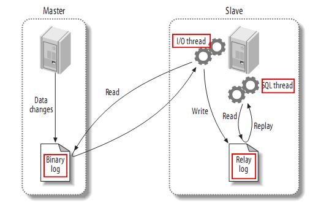
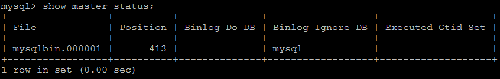
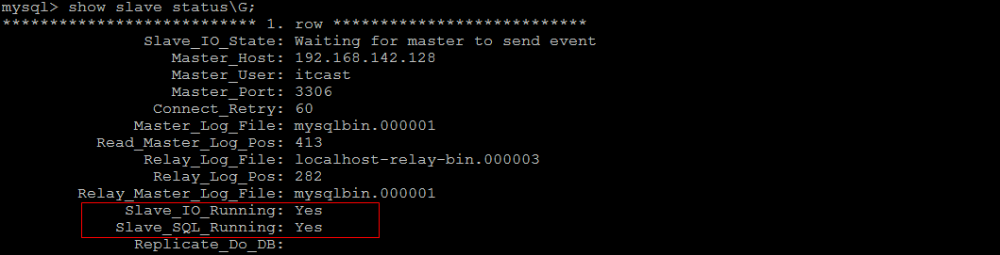
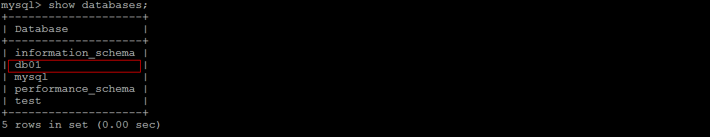

# 19.MySQL 复制

- 笔记本：Mysql高级
- 创建时间：2020-12-10 08:55:55 UTC
- 更新时间：2020-12-13 07:51:54 UTC
- 原始链接：file:///D:/work/Typora/resources/app//window.html
- 印象笔记 GUID：9198cfc6-1888-4b80-a8df-2e7a99c045dc

## MySQL 复制

### 1. 复制概述

复制是指将主数据库的DDL 和 DML 操作通过二进制日志传到从库服务器中，然后在从库上对这些日志重新执行（也叫重做），从而使得从库和主库的数据保持同步。

MySQL支持一台主库同时向多台从库进行复制， 从库同时也可以作为其他从服务器的主库，实现链状复制。

### 2. 复制原理

MySQL 的主从复制原理如下。
 
 从上层来看，复制分成三步：

- Master 主库在事务提交时，会把数据变更作为时间 Events 记录在二进制日志文件 Binlog 中。

- 主库推送二进制日志文件 Binlog 中的日志事件到从库的中继日志 Relay Log 。

- slave重做中继日志中的事件，将改变反映它自己的数据。

### 3. 复制优势

MySQL 复制的有点主要包含以下三个方面：

- 主库出现问题，可以快速切换到从库提供服务。

- 可以在从库上执行查询操作，从主库中更新，实现读写分离，降低主库的访问压力。

- 可以在从库中执行备份，以避免备份期间影响主库的服务。

### 4. 搭建步骤

#### 4.1. master

1） 在master 的配置文件（/etc/my.cnf）中，配置如下内容：

```
#mysql 服务ID,保证整个集群环境中唯一
server-id=1

#mysql binlog 日志的存储路径和文件名
log-bin=/var/lib/mysql/mysqlbin

#错误日志,默认已经开启
#log-err

#mysql的安装目录
#basedir

#mysql的临时目录
#tmpdir

#mysql的数据存放目录
#datadir

#是否只读,1 代表只读, 0 代表读写
read-only=0

#忽略的数据, 指不需要同步的数据库
binlog-ignore-db=mysql

#指定同步的数据库
#binlog-do-db=db01

```

2） 执行完毕之后，需要重启Mysql：

```
sudo systemctl restart mysqld

```

3） 创建同步数据的账户，并且进行授权操作：

```
set global validate_password.length=4;
set global validate_password.policy = low;
CREATE USER 'repl'@'*' IDENTIFIED WITH mysql_native_password BY '123456';

flush privileges;

```

4） 查看master状态：

```
show master status;

```


 字段含义：

```
File : 从哪个日志文件开始推送日志文件
Position ： 从哪个位置开始推送日志
Binlog_Ignore_DB : 指定不需要同步的数据库

```

#### 4.2. slave

1） 在 slave 端配置文件中，配置如下内容：

```
#mysql服务端ID,唯一
server-id=2

#指定binlog日志
log-bin=/var/lib/mysql/mysqlbin

```

2） 执行完毕之后，需要重启Mysql：

```
sudo systemctl restart mysqld

```

3） 执行如下指令 ：

```
change master to master_host= '192.168.192.130', master_user='itcast', master_password='itcast', master_log_file='mysqlbin.000001', master_log_pos=413;

```

指定当前从库对应的主库的IP地址，用户名，密码，从哪个日志文件开始的那个位置开始同步推送日志。
 4） 开启同步操作

```
start slave;

show slave status;

```


 5） 停止同步操作

```
stop slave;

```

3.4.3 验证同步操作
 1） 在主库中创建数据库，创建表，并插入数据 ：

```
create database db01;

user db01;

create table user(
	id int(11) not null auto_increment,
	name varchar(50) not null,
	sex varchar(1),
	primary key (id)
)engine=innodb default charset=utf8;

insert into user(id,name,sex) values(null,'Tom','1');
insert into user(id,name,sex) values(null,'Trigger','0');
insert into user(id,name,sex) values(null,'Dawn','1');

```

2） 在从库中查询数据，进行验证 ：
 在从库中，可以查看到刚才创建的数据库：
 
 在该数据库中，查询user表中的数据：
 

%23%23%20MySQL%20%E5%A4%8D%E5%88%B6%0A%23%23%23%201.%20%E5%A4%8D%E5%88%B6%E6%A6%82%E8%BF%B0%0A%E5%A4%8D%E5%88%B6%E6%98%AF%E6%8C%87%E5%B0%86%E4%B8%BB%E6%95%B0%E6%8D%AE%E5%BA%93%E7%9A%84DDL%20%E5%92%8C%20DML%20%E6%93%8D%E4%BD%9C%E9%80%9A%E8%BF%87%E4%BA%8C%E8%BF%9B%E5%88%B6%E6%97%A5%E5%BF%97%E4%BC%A0%E5%88%B0%E4%BB%8E%E5%BA%93%E6%9C%8D%E5%8A%A1%E5%99%A8%E4%B8%AD%EF%BC%8C%E7%84%B6%E5%90%8E%E5%9C%A8%E4%BB%8E%E5%BA%93%E4%B8%8A%E5%AF%B9%E8%BF%99%E4%BA%9B%E6%97%A5%E5%BF%97%E9%87%8D%E6%96%B0%E6%89%A7%E8%A1%8C%EF%BC%88%E4%B9%9F%E5%8F%AB%E9%87%8D%E5%81%9A%EF%BC%89%EF%BC%8C%E4%BB%8E%E8%80%8C%E4%BD%BF%E5%BE%97%E4%BB%8E%E5%BA%93%E5%92%8C%E4%B8%BB%E5%BA%93%E7%9A%84%E6%95%B0%E6%8D%AE%E4%BF%9D%E6%8C%81%E5%90%8C%E6%AD%A5%E3%80%82%0A%0AMySQL%E6%94%AF%E6%8C%81%E4%B8%80%E5%8F%B0%E4%B8%BB%E5%BA%93%E5%90%8C%E6%97%B6%E5%90%91%E5%A4%9A%E5%8F%B0%E4%BB%8E%E5%BA%93%E8%BF%9B%E8%A1%8C%E5%A4%8D%E5%88%B6%EF%BC%8C%20%E4%BB%8E%E5%BA%93%E5%90%8C%E6%97%B6%E4%B9%9F%E5%8F%AF%E4%BB%A5%E4%BD%9C%E4%B8%BA%E5%85%B6%E4%BB%96%E4%BB%8E%E6%9C%8D%E5%8A%A1%E5%99%A8%E7%9A%84%E4%B8%BB%E5%BA%93%EF%BC%8C%E5%AE%9E%E7%8E%B0%E9%93%BE%E7%8A%B6%E5%A4%8D%E5%88%B6%E3%80%82%0A%0A%23%23%23%202.%20%E5%A4%8D%E5%88%B6%E5%8E%9F%E7%90%86%0AMySQL%20%E7%9A%84%E4%B8%BB%E4%BB%8E%E5%A4%8D%E5%88%B6%E5%8E%9F%E7%90%86%E5%A6%82%E4%B8%8B%E3%80%82%0A!%5Bb218d68052871e54247819359317893b.jpeg%5D(en-resource%3A%2F%2Fdatabase%2F4524%3A1)%0A%E4%BB%8E%E4%B8%8A%E5%B1%82%E6%9D%A5%E7%9C%8B%EF%BC%8C%E5%A4%8D%E5%88%B6%E5%88%86%E6%88%90%E4%B8%89%E6%AD%A5%EF%BC%9A%0A-%20Master%20%E4%B8%BB%E5%BA%93%E5%9C%A8%E4%BA%8B%E5%8A%A1%E6%8F%90%E4%BA%A4%E6%97%B6%EF%BC%8C%E4%BC%9A%E6%8A%8A%E6%95%B0%E6%8D%AE%E5%8F%98%E6%9B%B4%E4%BD%9C%E4%B8%BA%E6%97%B6%E9%97%B4%20Events%20%E8%AE%B0%E5%BD%95%E5%9C%A8%E4%BA%8C%E8%BF%9B%E5%88%B6%E6%97%A5%E5%BF%97%E6%96%87%E4%BB%B6%20Binlog%20%E4%B8%AD%E3%80%82%0A-%20%E4%B8%BB%E5%BA%93%E6%8E%A8%E9%80%81%E4%BA%8C%E8%BF%9B%E5%88%B6%E6%97%A5%E5%BF%97%E6%96%87%E4%BB%B6%20Binlog%20%E4%B8%AD%E7%9A%84%E6%97%A5%E5%BF%97%E4%BA%8B%E4%BB%B6%E5%88%B0%E4%BB%8E%E5%BA%93%E7%9A%84%E4%B8%AD%E7%BB%A7%E6%97%A5%E5%BF%97%20Relay%20Log%20%E3%80%82%0A-%20slave%E9%87%8D%E5%81%9A%E4%B8%AD%E7%BB%A7%E6%97%A5%E5%BF%97%E4%B8%AD%E7%9A%84%E4%BA%8B%E4%BB%B6%EF%BC%8C%E5%B0%86%E6%94%B9%E5%8F%98%E5%8F%8D%E6%98%A0%E5%AE%83%E8%87%AA%E5%B7%B1%E7%9A%84%E6%95%B0%E6%8D%AE%E3%80%82%0A%0A%23%23%23%203.%20%E5%A4%8D%E5%88%B6%E4%BC%98%E5%8A%BF%0AMySQL%20%E5%A4%8D%E5%88%B6%E7%9A%84%E6%9C%89%E7%82%B9%E4%B8%BB%E8%A6%81%E5%8C%85%E5%90%AB%E4%BB%A5%E4%B8%8B%E4%B8%89%E4%B8%AA%E6%96%B9%E9%9D%A2%EF%BC%9A%0A-%20%E4%B8%BB%E5%BA%93%E5%87%BA%E7%8E%B0%E9%97%AE%E9%A2%98%EF%BC%8C%E5%8F%AF%E4%BB%A5%E5%BF%AB%E9%80%9F%E5%88%87%E6%8D%A2%E5%88%B0%E4%BB%8E%E5%BA%93%E6%8F%90%E4%BE%9B%E6%9C%8D%E5%8A%A1%E3%80%82%0A-%20%E5%8F%AF%E4%BB%A5%E5%9C%A8%E4%BB%8E%E5%BA%93%E4%B8%8A%E6%89%A7%E8%A1%8C%E6%9F%A5%E8%AF%A2%E6%93%8D%E4%BD%9C%EF%BC%8C%E4%BB%8E%E4%B8%BB%E5%BA%93%E4%B8%AD%E6%9B%B4%E6%96%B0%EF%BC%8C%E5%AE%9E%E7%8E%B0%E8%AF%BB%E5%86%99%E5%88%86%E7%A6%BB%EF%BC%8C%E9%99%8D%E4%BD%8E%E4%B8%BB%E5%BA%93%E7%9A%84%E8%AE%BF%E9%97%AE%E5%8E%8B%E5%8A%9B%E3%80%82%0A-%20%E5%8F%AF%E4%BB%A5%E5%9C%A8%E4%BB%8E%E5%BA%93%E4%B8%AD%E6%89%A7%E8%A1%8C%E5%A4%87%E4%BB%BD%EF%BC%8C%E4%BB%A5%E9%81%BF%E5%85%8D%E5%A4%87%E4%BB%BD%E6%9C%9F%E9%97%B4%E5%BD%B1%E5%93%8D%E4%B8%BB%E5%BA%93%E7%9A%84%E6%9C%8D%E5%8A%A1%E3%80%82%0A%0A%23%23%23%204.%20%E6%90%AD%E5%BB%BA%E6%AD%A5%E9%AA%A4%0A%23%23%23%23%204.1.%20master%0A1%EF%BC%89%20%E5%9C%A8master%20%E7%9A%84%E9%85%8D%E7%BD%AE%E6%96%87%E4%BB%B6%EF%BC%88%2Fetc%2Fmy.cnf%EF%BC%89%E4%B8%AD%EF%BC%8C%E9%85%8D%E7%BD%AE%E5%A6%82%E4%B8%8B%E5%86%85%E5%AE%B9%EF%BC%9A%0A%60%60%60properties%0A%23mysql%20%E6%9C%8D%E5%8A%A1ID%2C%E4%BF%9D%E8%AF%81%E6%95%B4%E4%B8%AA%E9%9B%86%E7%BE%A4%E7%8E%AF%E5%A2%83%E4%B8%AD%E5%94%AF%E4%B8%80%0Aserver-id%3D1%0A%0A%23mysql%20binlog%20%E6%97%A5%E5%BF%97%E7%9A%84%E5%AD%98%E5%82%A8%E8%B7%AF%E5%BE%84%E5%92%8C%E6%96%87%E4%BB%B6%E5%90%8D%0Alog-bin%3D%2Fvar%2Flib%2Fmysql%2Fmysqlbin%0A%0A%23%E9%94%99%E8%AF%AF%E6%97%A5%E5%BF%97%2C%E9%BB%98%E8%AE%A4%E5%B7%B2%E7%BB%8F%E5%BC%80%E5%90%AF%0A%23log-err%0A%0A%23mysql%E7%9A%84%E5%AE%89%E8%A3%85%E7%9B%AE%E5%BD%95%0A%23basedir%0A%0A%23mysql%E7%9A%84%E4%B8%B4%E6%97%B6%E7%9B%AE%E5%BD%95%0A%23tmpdir%0A%0A%23mysql%E7%9A%84%E6%95%B0%E6%8D%AE%E5%AD%98%E6%94%BE%E7%9B%AE%E5%BD%95%0A%23datadir%0A%0A%23%E6%98%AF%E5%90%A6%E5%8F%AA%E8%AF%BB%2C1%20%E4%BB%A3%E8%A1%A8%E5%8F%AA%E8%AF%BB%2C%200%20%E4%BB%A3%E8%A1%A8%E8%AF%BB%E5%86%99%0Aread-only%3D0%0A%0A%23%E5%BF%BD%E7%95%A5%E7%9A%84%E6%95%B0%E6%8D%AE%2C%20%E6%8C%87%E4%B8%8D%E9%9C%80%E8%A6%81%E5%90%8C%E6%AD%A5%E7%9A%84%E6%95%B0%E6%8D%AE%E5%BA%93%0Abinlog-ignore-db%3Dmysql%0A%0A%23%E6%8C%87%E5%AE%9A%E5%90%8C%E6%AD%A5%E7%9A%84%E6%95%B0%E6%8D%AE%E5%BA%93%0A%23binlog-do-db%3Ddb01%0A%60%60%60%0A2%EF%BC%89%20%E6%89%A7%E8%A1%8C%E5%AE%8C%E6%AF%95%E4%B9%8B%E5%90%8E%EF%BC%8C%E9%9C%80%E8%A6%81%E9%87%8D%E5%90%AFMysql%EF%BC%9A%0A%60%60%60shell%0Asudo%20systemctl%20restart%20mysqld%0A%60%60%60%0A3%EF%BC%89%20%E5%88%9B%E5%BB%BA%E5%90%8C%E6%AD%A5%E6%95%B0%E6%8D%AE%E7%9A%84%E8%B4%A6%E6%88%B7%EF%BC%8C%E5%B9%B6%E4%B8%94%E8%BF%9B%E8%A1%8C%E6%8E%88%E6%9D%83%E6%93%8D%E4%BD%9C%EF%BC%9A%0A%60%60%60sql%0Aset%20global%20validate_password.length%3D4%3B%0Aset%20global%20validate_password.policy%20%3D%20low%3B%0ACREATE%20USER%20'repl'%40'%25'%20IDENTIFIED%20WITH%20mysql_native_password%20BY%20'123456'%3B%0AGRANT%20REPLICATION%20SLAVE%20ON%20*.*%20TO%20'repl'%40'%25'%3B%0Aflush%20privileges%3B%0A%60%60%60%0A4%EF%BC%89%20%E6%9F%A5%E7%9C%8Bmaster%E7%8A%B6%E6%80%81%EF%BC%9A%0A%60%60%60sql%0Ashow%20master%20status%3B%0A%60%60%60%0A!%5Bf5b237da4e217aeb8c26c056ca766c75.png%5D(en-resource%3A%2F%2Fdatabase%2F4526%3A1)%0A%E5%AD%97%E6%AE%B5%E5%90%AB%E4%B9%89%EF%BC%9A%0A%60%60%60sql%0AFile%20%3A%20%E4%BB%8E%E5%93%AA%E4%B8%AA%E6%97%A5%E5%BF%97%E6%96%87%E4%BB%B6%E5%BC%80%E5%A7%8B%E6%8E%A8%E9%80%81%E6%97%A5%E5%BF%97%E6%96%87%E4%BB%B6%20%0APosition%20%EF%BC%9A%20%E4%BB%8E%E5%93%AA%E4%B8%AA%E4%BD%8D%E7%BD%AE%E5%BC%80%E5%A7%8B%E6%8E%A8%E9%80%81%E6%97%A5%E5%BF%97%0ABinlog_Ignore_DB%20%3A%20%E6%8C%87%E5%AE%9A%E4%B8%8D%E9%9C%80%E8%A6%81%E5%90%8C%E6%AD%A5%E7%9A%84%E6%95%B0%E6%8D%AE%E5%BA%93%0A%60%60%60%0A%0A%23%23%23%23%204.2.%20slave%0A1%EF%BC%89%20%E5%9C%A8%20slave%20%E7%AB%AF%E9%85%8D%E7%BD%AE%E6%96%87%E4%BB%B6%E4%B8%AD%EF%BC%8C%E9%85%8D%E7%BD%AE%E5%A6%82%E4%B8%8B%E5%86%85%E5%AE%B9%EF%BC%9A%0A%60%60%60properties%0A%23mysql%E6%9C%8D%E5%8A%A1%E7%AB%AFID%2C%E5%94%AF%E4%B8%80%0Aserver-id%3D2%0A%0A%23%E6%8C%87%E5%AE%9Abinlog%E6%97%A5%E5%BF%97%0Alog-bin%3D%2Fvar%2Flib%2Fmysql%2Fmysqlbin%0A%60%60%60%0A2%EF%BC%89%20%E6%89%A7%E8%A1%8C%E5%AE%8C%E6%AF%95%E4%B9%8B%E5%90%8E%EF%BC%8C%E9%9C%80%E8%A6%81%E9%87%8D%E5%90%AFMysql%EF%BC%9A%0A%60%60%60shell%0Asudo%20systemctl%20restart%20mysqld%0A%60%60%60%0A3%EF%BC%89%20%E6%89%A7%E8%A1%8C%E5%A6%82%E4%B8%8B%E6%8C%87%E4%BB%A4%20%EF%BC%9A%0A%60%60%60sql%0Achange%20master%20to%20master_host%3D%20'192.168.192.130'%2C%20master_user%3D'itcast'%2C%20master_password%3D'itcast'%2C%20master_log_file%3D'mysqlbin.000001'%2C%20master_log_pos%3D413%3B%0A%60%60%60%0A%E6%8C%87%E5%AE%9A%E5%BD%93%E5%89%8D%E4%BB%8E%E5%BA%93%E5%AF%B9%E5%BA%94%E7%9A%84%E4%B8%BB%E5%BA%93%E7%9A%84IP%E5%9C%B0%E5%9D%80%EF%BC%8C%E7%94%A8%E6%88%B7%E5%90%8D%EF%BC%8C%E5%AF%86%E7%A0%81%EF%BC%8C%E4%BB%8E%E5%93%AA%E4%B8%AA%E6%97%A5%E5%BF%97%E6%96%87%E4%BB%B6%E5%BC%80%E5%A7%8B%E7%9A%84%E9%82%A3%E4%B8%AA%E4%BD%8D%E7%BD%AE%E5%BC%80%E5%A7%8B%E5%90%8C%E6%AD%A5%E6%8E%A8%E9%80%81%E6%97%A5%E5%BF%97%E3%80%82%0A4%EF%BC%89%20%E5%BC%80%E5%90%AF%E5%90%8C%E6%AD%A5%E6%93%8D%E4%BD%9C%0A%60%60%60sql%0Astart%20slave%3B%0A%0Ashow%20slave%20status%3B%0A%60%60%60%0A!%5Be4597d0ea351aefce54b0c9c8e6850c6.png%5D(en-resource%3A%2F%2Fdatabase%2F4528%3A1)%0A5%EF%BC%89%20%E5%81%9C%E6%AD%A2%E5%90%8C%E6%AD%A5%E6%93%8D%E4%BD%9C%0A%60%60%60sql%0Astop%20slave%3B%0A%60%60%60%0A3.4.3%20%E9%AA%8C%E8%AF%81%E5%90%8C%E6%AD%A5%E6%93%8D%E4%BD%9C%0A1%EF%BC%89%20%E5%9C%A8%E4%B8%BB%E5%BA%93%E4%B8%AD%E5%88%9B%E5%BB%BA%E6%95%B0%E6%8D%AE%E5%BA%93%EF%BC%8C%E5%88%9B%E5%BB%BA%E8%A1%A8%EF%BC%8C%E5%B9%B6%E6%8F%92%E5%85%A5%E6%95%B0%E6%8D%AE%20%EF%BC%9A%0A%60%60%60sql%0Acreate%20database%20db01%3B%0A%0Auser%20db01%3B%0A%0Acreate%20table%20user(%0A%09id%20int(11)%20not%20null%20auto_increment%2C%0A%09name%20varchar(50)%20not%20null%2C%0A%09sex%20varchar(1)%2C%0A%09primary%20key%20(id)%0A)engine%3Dinnodb%20default%20charset%3Dutf8%3B%0A%0Ainsert%20into%20user(id%2Cname%2Csex)%20values(null%2C'Tom'%2C'1')%3B%0Ainsert%20into%20user(id%2Cname%2Csex)%20values(null%2C'Trigger'%2C'0')%3B%0Ainsert%20into%20user(id%2Cname%2Csex)%20values(null%2C'Dawn'%2C'1')%3B%0A%60%60%60%0A2%EF%BC%89%20%E5%9C%A8%E4%BB%8E%E5%BA%93%E4%B8%AD%E6%9F%A5%E8%AF%A2%E6%95%B0%E6%8D%AE%EF%BC%8C%E8%BF%9B%E8%A1%8C%E9%AA%8C%E8%AF%81%20%EF%BC%9A%0A%E5%9C%A8%E4%BB%8E%E5%BA%93%E4%B8%AD%EF%BC%8C%E5%8F%AF%E4%BB%A5%E6%9F%A5%E7%9C%8B%E5%88%B0%E5%88%9A%E6%89%8D%E5%88%9B%E5%BB%BA%E7%9A%84%E6%95%B0%E6%8D%AE%E5%BA%93%EF%BC%9A%0A!%5B82e63c212592fa2c6ab12c407ae6f552.png%5D(en-resource%3A%2F%2Fdatabase%2F4530%3A1)%0A%E5%9C%A8%E8%AF%A5%E6%95%B0%E6%8D%AE%E5%BA%93%E4%B8%AD%EF%BC%8C%E6%9F%A5%E8%AF%A2user%E8%A1%A8%E4%B8%AD%E7%9A%84%E6%95%B0%E6%8D%AE%EF%BC%9A%0A!%5Bfbbbf9cf029ffb542fb9e7d1f6b81944.png%5D(en-resource%3A%2F%2Fdatabase%2F4532%3A1)%0A%0A
