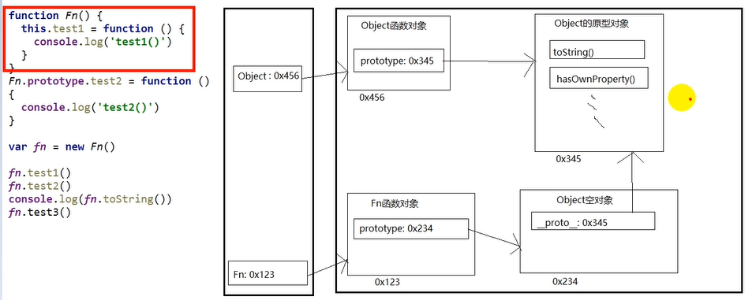
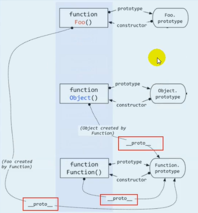
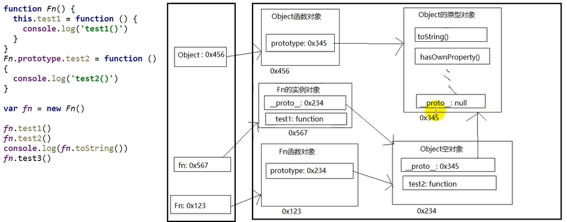
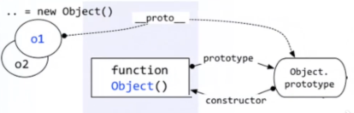
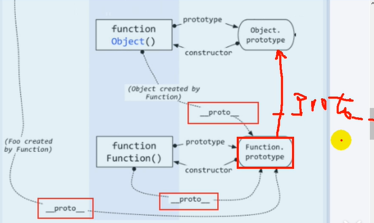

# 10.原型链

- 笔记本：JavaScript高级知识
- 创建时间：2020-01-12 12:39:02 UTC
- 更新时间：2020-01-12 14:05:10 UTC
- 印象笔记 GUID：69fea4b8-0b0e-450f-bb37-47be15fa94fd

#### 1. 原型链


 JS 引擎在加载页面的时候，首先会把内置的函数加载进来，接着再去执行我们的代码
 我们创建的对象的 prototype 指向一个空Object对象，因此__proto__指向Object 对象，而Object的原型对象中有 `toString()`、`hasOwnProperty()` 等方法。因此我们的对象的原型链上就有了这些方法
 


 Object 对象的prototype原型的 **proto** 的值为null，原型链的尽头

- 访问一个对象的属性时：

  - 先在自身属性中找，找到返回

  - 如果没有，再沿着 **proto** 这条链向上查找，找到返回

  - 如果最终没有找到，返回 undefined

- 别名：隐式原型链（沿着隐式原型链寻找）

- 作用：查找对象的属性（方法）

#### 2. 构造函数/原型/实体对象的关系

```
var 01 = new Object();
var 02 = {};

```



#### 3. 构造函数/原型/实体对象的关系2

```
function Foo() {}
// 等价 var Foo = new Function()
// Function = new Function()        //只有这样才能保证，自身的显式原型和自身的隐式原型相等
// 所有函数的 __proto__ 属性都是一样的，因为它们都是 new Function()
// 所有函数都有一个隐式原型属性，指向 Function 的显式原型

```

**eg:**

```
console.log(Object);
console.log(Object.prototype);
console.log(Object.__proto__);              // null
function Fun() {
    this.test1 = function() {
        console.log("test1");
    }
}

Fun.prototype.test2 = function() {
    console.log("test2");
}

var fun = new Fun();
fun.test1();
fun.test2();
console.log(fun.toString());
console.log(fun.test3);             // undefined
//fun.test3();                      // 报错

```

#### 补充

1. 函数的显式原型指向的对象默认是空 Object 实例对象（但 Object 不满足）

```
console.log(Fn.prototype instanceof Object);   // true
console.log(Object.prototype instaneof Object); // false
console.log(Function.prototype instanceof Object);  // true

```



1. 所有函数都是 Function 的实例（包含 Function 本身）

```
console.log(Function.__proto__ === Function.prototype);

```

1. Object 的原型对象是原型链的尽头

```
console.log(Object.__prototype.__proto__);          // null

```

%23%23%23%23%201.%20%E5%8E%9F%E5%9E%8B%E9%93%BE%0A!%5Bd124fd621beb52dc654ce96b5f9a53f7.png%5D(en-resource%3A%2F%2Fdatabase%2F940%3A1)%0AJS%20%E5%BC%95%E6%93%8E%E5%9C%A8%E5%8A%A0%E8%BD%BD%E9%A1%B5%E9%9D%A2%E7%9A%84%E6%97%B6%E5%80%99%EF%BC%8C%E9%A6%96%E5%85%88%E4%BC%9A%E6%8A%8A%E5%86%85%E7%BD%AE%E7%9A%84%E5%87%BD%E6%95%B0%E5%8A%A0%E8%BD%BD%E8%BF%9B%E6%9D%A5%EF%BC%8C%E6%8E%A5%E7%9D%80%E5%86%8D%E5%8E%BB%E6%89%A7%E8%A1%8C%E6%88%91%E4%BB%AC%E7%9A%84%E4%BB%A3%E7%A0%81%0A%E6%88%91%E4%BB%AC%E5%88%9B%E5%BB%BA%E7%9A%84%E5%AF%B9%E8%B1%A1%E7%9A%84%20prototype%20%E6%8C%87%E5%90%91%E4%B8%80%E4%B8%AA%E7%A9%BAObject%E5%AF%B9%E8%B1%A1%EF%BC%8C%E5%9B%A0%E6%AD%A4__proto__%E6%8C%87%E5%90%91Object%20%E5%AF%B9%E8%B1%A1%EF%BC%8C%E8%80%8CObject%E7%9A%84%E5%8E%9F%E5%9E%8B%E5%AF%B9%E8%B1%A1%E4%B8%AD%E6%9C%89%20%60toString()%60%E3%80%81%60hasOwnProperty()%60%20%E7%AD%89%E6%96%B9%E6%B3%95%E3%80%82%E5%9B%A0%E6%AD%A4%E6%88%91%E4%BB%AC%E7%9A%84%E5%AF%B9%E8%B1%A1%E7%9A%84%E5%8E%9F%E5%9E%8B%E9%93%BE%E4%B8%8A%E5%B0%B1%E6%9C%89%E4%BA%86%E8%BF%99%E4%BA%9B%E6%96%B9%E6%B3%95%0A!%5B3e0dd5475a7e14a613d52b51e4e24756.png%5D(en-resource%3A%2F%2Fdatabase%2F950%3A0)%0A%0A!%5B64f7ebf654bc7ea1cc9e01c952677af6.png%5D(en-resource%3A%2F%2Fdatabase%2F944%3A1)%0AObject%20%E5%AF%B9%E8%B1%A1%E7%9A%84prototype%E5%8E%9F%E5%9E%8B%E7%9A%84%20__proto__%20%E7%9A%84%E5%80%BC%E4%B8%BAnull%EF%BC%8C%E5%8E%9F%E5%9E%8B%E9%93%BE%E7%9A%84%E5%B0%BD%E5%A4%B4%0A%0A%2B%20%E8%AE%BF%E9%97%AE%E4%B8%80%E4%B8%AA%E5%AF%B9%E8%B1%A1%E7%9A%84%E5%B1%9E%E6%80%A7%E6%97%B6%EF%BC%9A%0A%20%20%20%20%2B%20%E5%85%88%E5%9C%A8%E8%87%AA%E8%BA%AB%E5%B1%9E%E6%80%A7%E4%B8%AD%E6%89%BE%EF%BC%8C%E6%89%BE%E5%88%B0%E8%BF%94%E5%9B%9E%0A%20%20%20%20%2B%20%E5%A6%82%E6%9E%9C%E6%B2%A1%E6%9C%89%EF%BC%8C%E5%86%8D%E6%B2%BF%E7%9D%80%20__proto__%20%E8%BF%99%E6%9D%A1%E9%93%BE%E5%90%91%E4%B8%8A%E6%9F%A5%E6%89%BE%EF%BC%8C%E6%89%BE%E5%88%B0%E8%BF%94%E5%9B%9E%0A%20%20%20%20%2B%20%E5%A6%82%E6%9E%9C%E6%9C%80%E7%BB%88%E6%B2%A1%E6%9C%89%E6%89%BE%E5%88%B0%EF%BC%8C%E8%BF%94%E5%9B%9E%20undefined%0A%2B%20%E5%88%AB%E5%90%8D%EF%BC%9A%E9%9A%90%E5%BC%8F%E5%8E%9F%E5%9E%8B%E9%93%BE%EF%BC%88%E6%B2%BF%E7%9D%80%E9%9A%90%E5%BC%8F%E5%8E%9F%E5%9E%8B%E9%93%BE%E5%AF%BB%E6%89%BE%EF%BC%89%0A%2B%20%E4%BD%9C%E7%94%A8%EF%BC%9A%E6%9F%A5%E6%89%BE%E5%AF%B9%E8%B1%A1%E7%9A%84%E5%B1%9E%E6%80%A7%EF%BC%88%E6%96%B9%E6%B3%95%EF%BC%89%0A%0A%23%23%23%23%202.%20%E6%9E%84%E9%80%A0%E5%87%BD%E6%95%B0%2F%E5%8E%9F%E5%9E%8B%2F%E5%AE%9E%E4%BD%93%E5%AF%B9%E8%B1%A1%E7%9A%84%E5%85%B3%E7%B3%BB%0A%60%60%60javascript%0Avar%2001%20%3D%20new%20Object()%3B%0Avar%2002%20%3D%20%7B%7D%3B%0A%60%60%60%0A!%5B7ac448f5731f286b38d39b33cbdcfb64.png%5D(en-resource%3A%2F%2Fdatabase%2F948%3A1)%0A%0A%0A%23%23%23%23%203.%20%E6%9E%84%E9%80%A0%E5%87%BD%E6%95%B0%2F%E5%8E%9F%E5%9E%8B%2F%E5%AE%9E%E4%BD%93%E5%AF%B9%E8%B1%A1%E7%9A%84%E5%85%B3%E7%B3%BB2%0A%60%60%60javascript%0Afunction%20Foo()%20%7B%7D%20%20%20%20%20%20%20%20%20%20%20%0A%2F%2F%20%E7%AD%89%E4%BB%B7%20var%20Foo%20%3D%20new%20Function()%20%20%0A%2F%2F%20Function%20%3D%20new%20Function()%20%20%20%20%20%20%20%20%2F%2F%E5%8F%AA%E6%9C%89%E8%BF%99%E6%A0%B7%E6%89%8D%E8%83%BD%E4%BF%9D%E8%AF%81%EF%BC%8C%E8%87%AA%E8%BA%AB%E7%9A%84%E6%98%BE%E5%BC%8F%E5%8E%9F%E5%9E%8B%E5%92%8C%E8%87%AA%E8%BA%AB%E7%9A%84%E9%9A%90%E5%BC%8F%E5%8E%9F%E5%9E%8B%E7%9B%B8%E7%AD%89%0A%2F%2F%20%E6%89%80%E6%9C%89%E5%87%BD%E6%95%B0%E7%9A%84%20__proto__%20%E5%B1%9E%E6%80%A7%E9%83%BD%E6%98%AF%E4%B8%80%E6%A0%B7%E7%9A%84%EF%BC%8C%E5%9B%A0%E4%B8%BA%E5%AE%83%E4%BB%AC%E9%83%BD%E6%98%AF%20new%20Function()%0A%2F%2F%20%E6%89%80%E6%9C%89%E5%87%BD%E6%95%B0%E9%83%BD%E6%9C%89%E4%B8%80%E4%B8%AA%E9%9A%90%E5%BC%8F%E5%8E%9F%E5%9E%8B%E5%B1%9E%E6%80%A7%EF%BC%8C%E6%8C%87%E5%90%91%20Function%20%E7%9A%84%E6%98%BE%E5%BC%8F%E5%8E%9F%E5%9E%8B%0A%60%60%60%0A%0A%0A%0A**eg%3A**%0A%60%60%60javascript%0Aconsole.log(Object)%3B%0Aconsole.log(Object.prototype)%3B%0Aconsole.log(Object.__proto__)%3B%20%20%20%20%20%20%20%20%20%20%20%20%20%20%2F%2F%20null%0Afunction%20Fun()%20%7B%0A%20%20%20%20this.test1%20%3D%20function()%20%7B%0A%20%20%20%20%20%20%20%20console.log(%22test1%22)%3B%0A%20%20%20%20%7D%0A%7D%0A%0AFun.prototype.test2%20%3D%20function()%20%7B%0A%20%20%20%20console.log(%22test2%22)%3B%0A%7D%0A%0Avar%20fun%20%3D%20new%20Fun()%3B%0Afun.test1()%3B%0Afun.test2()%3B%0Aconsole.log(fun.toString())%3B%0Aconsole.log(fun.test3)%3B%20%20%20%20%20%20%20%20%20%20%20%20%20%2F%2F%20undefined%0A%2F%2Ffun.test3()%3B%20%20%20%20%20%20%20%20%20%20%20%20%20%20%20%20%20%20%20%20%20%20%2F%2F%20%E6%8A%A5%E9%94%99%0A%60%60%60%0A%0A%23%23%23%23%20%E8%A1%A5%E5%85%85%0A1.%20%E5%87%BD%E6%95%B0%E7%9A%84%E6%98%BE%E5%BC%8F%E5%8E%9F%E5%9E%8B%E6%8C%87%E5%90%91%E7%9A%84%E5%AF%B9%E8%B1%A1%E9%BB%98%E8%AE%A4%E6%98%AF%E7%A9%BA%20Object%20%E5%AE%9E%E4%BE%8B%E5%AF%B9%E8%B1%A1%EF%BC%88%E4%BD%86%20Object%20%E4%B8%8D%E6%BB%A1%E8%B6%B3%EF%BC%89%0A%60%60%60javascript%0Aconsole.log(Fn.prototype%20instanceof%20Object)%3B%20%20%20%2F%2F%20true%0Aconsole.log(Object.prototype%20instaneof%20Object)%3B%20%2F%2F%20false%0Aconsole.log(Function.prototype%20instanceof%20Object)%3B%20%20%2F%2F%20true%0A%60%60%60%0A!%5B61f3a5ba6f986164efbe744a5b96ce4d.png%5D(en-resource%3A%2F%2Fdatabase%2F952%3A0)%0A%0A2.%20%E6%89%80%E6%9C%89%E5%87%BD%E6%95%B0%E9%83%BD%E6%98%AF%20Function%20%E7%9A%84%E5%AE%9E%E4%BE%8B%EF%BC%88%E5%8C%85%E5%90%AB%20Function%20%E6%9C%AC%E8%BA%AB%EF%BC%89%0A%60%60%60javascript%0Aconsole.log(Function.__proto__%20%3D%3D%3D%20Function.prototype)%3B%20%20%20%20%20%2F%2F%20true%0A%60%60%60%0A%0A3.%20Object%20%E7%9A%84%E5%8E%9F%E5%9E%8B%E5%AF%B9%E8%B1%A1%E6%98%AF%E5%8E%9F%E5%9E%8B%E9%93%BE%E7%9A%84%E5%B0%BD%E5%A4%B4%0A%60%60%60javascript%0Aconsole.log(Object.__prototype.__proto__)%3B%20%20%20%20%20%20%20%20%20%20%2F%2F%20null%0A%60%60%60%0A
