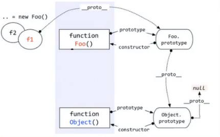
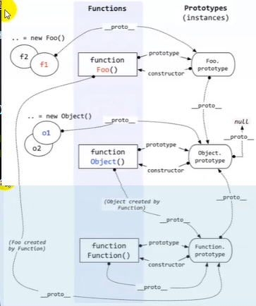

# 12.instanceof

- 笔记本：JavaScript高级知识
- 创建时间：2020-01-12 14:20:15 UTC
- 更新时间：2020-01-12 15:28:55 UTC
- 印象笔记 GUID：8a6a8a94-03e0-4478-92c0-800d50c170d7

1. instanceof 是如何判断的？

- 表达式：A instanceof B

- 如果B 函数的显式原型对象在A 对象的原型链上，返回 true，否则返回 false

1. Function 是通过new 自己产生的实例

**作用：** 判断左边的对象是不是右边的实例

**案例1：**

```
function Foo() {}
var f1 = new Foo();
console.log(f1 instanceof Foo);
console.log(f1 instanceof Object);

```



**案例2：**

```
console.log(Object instanceof Function);        // true
console.log(Object instanceof Object);          // true
console.log(Function instanceof Function);      // true
console.log(Function instanceof Object);        // true

function Foo() {}
console.log(Object instanceof Foo);             // false

```



**eg:**

```
function Foo() {}
var f1 = new Foo();
console.log(f1 instanceof Foo);     // true
console.log(f1 instanceof Object);     // true

```

1.%20instanceof%20%E6%98%AF%E5%A6%82%E4%BD%95%E5%88%A4%E6%96%AD%E7%9A%84%EF%BC%9F%0A*%20%E8%A1%A8%E8%BE%BE%E5%BC%8F%EF%BC%9AA%20instanceof%20B%0A*%20%E5%A6%82%E6%9E%9CB%20%E5%87%BD%E6%95%B0%E7%9A%84%E6%98%BE%E5%BC%8F%E5%8E%9F%E5%9E%8B%E5%AF%B9%E8%B1%A1%E5%9C%A8A%20%E5%AF%B9%E8%B1%A1%E7%9A%84%E5%8E%9F%E5%9E%8B%E9%93%BE%E4%B8%8A%EF%BC%8C%E8%BF%94%E5%9B%9E%20true%EF%BC%8C%E5%90%A6%E5%88%99%E8%BF%94%E5%9B%9E%20false%0A%0A2.%20Function%20%E6%98%AF%E9%80%9A%E8%BF%87new%20%E8%87%AA%E5%B7%B1%E4%BA%A7%E7%94%9F%E7%9A%84%E5%AE%9E%E4%BE%8B%0A%0A**%E4%BD%9C%E7%94%A8%EF%BC%9A**%20%E5%88%A4%E6%96%AD%E5%B7%A6%E8%BE%B9%E7%9A%84%E5%AF%B9%E8%B1%A1%E6%98%AF%E4%B8%8D%E6%98%AF%E5%8F%B3%E8%BE%B9%E7%9A%84%E5%AE%9E%E4%BE%8B%0A%0A---%0A%0A**%E6%A1%88%E4%BE%8B1%EF%BC%9A**%0A%60%60%60javascript%0Afunction%20Foo()%20%7B%7D%0Avar%20f1%20%3D%20new%20Foo()%3B%0Aconsole.log(f1%20instanceof%20Foo)%3B%0Aconsole.log(f1%20instanceof%20Object)%3B%0A%60%60%60%0A!%5B40c1d96b3ea693b2f566b778384102ce.png%5D(en-resource%3A%2F%2Fdatabase%2F960%3A0)%0A%0A---%0A%0A**%E6%A1%88%E4%BE%8B2%EF%BC%9A**%0A%60%60%60javascript%0Aconsole.log(Object%20instanceof%20Function)%3B%20%20%20%20%20%20%20%20%2F%2F%20true%0Aconsole.log(Object%20instanceof%20Object)%3B%20%20%20%20%20%20%20%20%20%20%2F%2F%20true%0Aconsole.log(Function%20instanceof%20Function)%3B%20%20%20%20%20%20%2F%2F%20true%0Aconsole.log(Function%20instanceof%20Object)%3B%20%20%20%20%20%20%20%20%2F%2F%20true%0A%0Afunction%20Foo()%20%7B%7D%0Aconsole.log(Object%20instanceof%20Foo)%3B%20%20%20%20%20%20%20%20%20%20%20%20%20%2F%2F%20false%0A%60%60%60%0A!%5B1a912b6d71e287aa284c9c171c28ae60.png%5D(en-resource%3A%2F%2Fdatabase%2F962%3A0)%0A%0A---%0A%0A**eg%3A**%0A%60%60%60javascript%0Afunction%20Foo()%20%7B%7D%0Avar%20f1%20%3D%20new%20Foo()%3B%0Aconsole.log(f1%20instanceof%20Foo)%3B%20%20%20%20%20%2F%2F%20true%0Aconsole.log(f1%20instanceof%20Object)%3B%20%20%20%20%20%2F%2F%20true%0A%60%60%60%0A%0A
