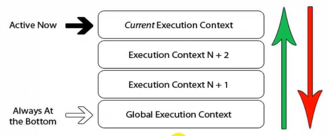

# 16.执行上下文栈

- 笔记本：JavaScript高级知识
- 创建时间：2020-01-12 17:10:27 UTC
- 更新时间：2020-01-13 01:58:16 UTC
- 印象笔记 GUID：4a893890-780d-4672-a1d6-30b1dbd25c29

1. 在全局代码执行前，JS 引擎就会创建一个栈来存储管理所有的执行上下文对象

1. 在全局执行上下文（window）确定后，将其添加到栈中（压栈）

1. 在函数执行上下文创建后，将其添加到栈中（压栈）

1. 在当前函数执行完后，将栈顶的对象移除（出栈）

1. 当所有的代码执行完后，栈中只剩下 window

**eg:**

```
var a = 10;
var bar = function(x) {
    var b = 5;
    foo(x + b);
}
var foo = function(y) {
    var c = 5;
    console.log(a + c + y);
}
bar(10);

```




#### 面试题

1.
依次输出了什么？
 global begin: undefined
 foo() begin: 1
 foo() begin: 2
 foo() begin: 3
 foo() end: 3
 foo() end: 2
 foo() end: 1
 gloabl end: 1

1.
整个过程中产生了几个执行上下文？
 5个

```
console.log('global begin: ' + i);
var i = 1;
foo(1);
function foo(i) {
    if( i == 4) {
        return;
    }
    console.log('foo() begin: ' + i);
    foo(i + 1);     // 递归调用：在函数内部调用自己
    console.log('foo() end: ' + i);
}
console.log('gloabl end: ' + i);

```

#### 测试题1

**先执行变量提升，再执行函数提升**

```
function a() {}
var a;
console.log(typeof a);          // ‘function'

```

#### 测试题2

```
if(!(b in window)) {
    var b = 1;
}
console.log(b);          // undefined

```

#### 测试题3

```
var c = 1;
function c(c) {
    console.log(c);
    // var c = 3;
}
c(2);                       // 报错， 变量提升高于函数提升

```

上面的代码等价于

```
var c;
function c(c) {
    console.log(c);
}
c = 1;
c(2);

```

1.%20%E5%9C%A8%E5%85%A8%E5%B1%80%E4%BB%A3%E7%A0%81%E6%89%A7%E8%A1%8C%E5%89%8D%EF%BC%8CJS%20%E5%BC%95%E6%93%8E%E5%B0%B1%E4%BC%9A%E5%88%9B%E5%BB%BA%E4%B8%80%E4%B8%AA%E6%A0%88%E6%9D%A5%E5%AD%98%E5%82%A8%E7%AE%A1%E7%90%86%E6%89%80%E6%9C%89%E7%9A%84%E6%89%A7%E8%A1%8C%E4%B8%8A%E4%B8%8B%E6%96%87%E5%AF%B9%E8%B1%A1%0A2.%20%E5%9C%A8%E5%85%A8%E5%B1%80%E6%89%A7%E8%A1%8C%E4%B8%8A%E4%B8%8B%E6%96%87%EF%BC%88window%EF%BC%89%E7%A1%AE%E5%AE%9A%E5%90%8E%EF%BC%8C%E5%B0%86%E5%85%B6%E6%B7%BB%E5%8A%A0%E5%88%B0%E6%A0%88%E4%B8%AD%EF%BC%88%E5%8E%8B%E6%A0%88%EF%BC%89%0A3.%20%E5%9C%A8%E5%87%BD%E6%95%B0%E6%89%A7%E8%A1%8C%E4%B8%8A%E4%B8%8B%E6%96%87%E5%88%9B%E5%BB%BA%E5%90%8E%EF%BC%8C%E5%B0%86%E5%85%B6%E6%B7%BB%E5%8A%A0%E5%88%B0%E6%A0%88%E4%B8%AD%EF%BC%88%E5%8E%8B%E6%A0%88%EF%BC%89%0A4.%20%E5%9C%A8%E5%BD%93%E5%89%8D%E5%87%BD%E6%95%B0%E6%89%A7%E8%A1%8C%E5%AE%8C%E5%90%8E%EF%BC%8C%E5%B0%86%E6%A0%88%E9%A1%B6%E7%9A%84%E5%AF%B9%E8%B1%A1%E7%A7%BB%E9%99%A4%EF%BC%88%E5%87%BA%E6%A0%88%EF%BC%89%0A5.%20%E5%BD%93%E6%89%80%E6%9C%89%E7%9A%84%E4%BB%A3%E7%A0%81%E6%89%A7%E8%A1%8C%E5%AE%8C%E5%90%8E%EF%BC%8C%E6%A0%88%E4%B8%AD%E5%8F%AA%E5%89%A9%E4%B8%8B%20window%0A%0A---%0A%0A**eg%3A**%0A%60%60%60javascript%0Avar%20a%20%3D%2010%3B%0Avar%20bar%20%3D%20function(x)%20%7B%0A%20%20%20%20var%20b%20%3D%205%3B%0A%20%20%20%20foo(x%20%2B%20b)%3B%0A%7D%0Avar%20foo%20%3D%20function(y)%20%7B%0A%20%20%20%20var%20c%20%3D%205%3B%0A%20%20%20%20console.log(a%20%2B%20c%20%2B%20y)%3B%0A%7D%0Abar(10)%3B%0A%60%60%60%0A!%5Be0ae8163f5151cccfa65f1d872c02718.png%5D(en-resource%3A%2F%2Fdatabase%2F978%3A1)%0A%0A!%5B5d11d23972c8fb37a5df94035aded75f.png%5D(en-resource%3A%2F%2Fdatabase%2F980%3A1)%0A%0A---%0A%0A%23%23%23%23%20%E9%9D%A2%E8%AF%95%E9%A2%98%0A1.%20%E4%BE%9D%E6%AC%A1%E8%BE%93%E5%87%BA%E4%BA%86%E4%BB%80%E4%B9%88%EF%BC%9F%0A%20%20%20%20global%20begin%3A%20undefined%0A%20%20%20%20foo()%20begin%3A%201%0A%20%20%20%20foo()%20begin%3A%202%0A%20%20%20%20foo()%20begin%3A%203%0A%20%20%20%20foo()%20end%3A%203%0A%20%20%20%20foo()%20end%3A%202%0A%20%20%20%20foo()%20end%3A%201%0A%20%20%20%20gloabl%20end%3A%201%0A%0A2.%20%E6%95%B4%E4%B8%AA%E8%BF%87%E7%A8%8B%E4%B8%AD%E4%BA%A7%E7%94%9F%E4%BA%86%E5%87%A0%E4%B8%AA%E6%89%A7%E8%A1%8C%E4%B8%8A%E4%B8%8B%E6%96%87%EF%BC%9F%0A%20%20%20%205%E4%B8%AA%0A%0A%60%60%60javascript%0Aconsole.log('global%20begin%3A%20'%20%2B%20i)%3B%0Avar%20i%20%3D%201%3B%0Afoo(1)%3B%0Afunction%20foo(i)%20%7B%0A%20%20%20%20if(%20i%20%3D%3D%204)%20%7B%0A%20%20%20%20%20%20%20%20return%3B%0A%20%20%20%20%7D%0A%20%20%20%20console.log('foo()%20begin%3A%20'%20%2B%20i)%3B%0A%20%20%20%20foo(i%20%2B%201)%3B%20%20%20%20%20%2F%2F%20%E9%80%92%E5%BD%92%E8%B0%83%E7%94%A8%EF%BC%9A%E5%9C%A8%E5%87%BD%E6%95%B0%E5%86%85%E9%83%A8%E8%B0%83%E7%94%A8%E8%87%AA%E5%B7%B1%0A%20%20%20%20console.log('foo()%20end%3A%20'%20%2B%20i)%3B%0A%7D%0Aconsole.log('gloabl%20end%3A%20'%20%2B%20i)%3B%0A%60%60%60%0A%0A---%0A%0A%23%23%23%23%20%E6%B5%8B%E8%AF%95%E9%A2%981%0A**%E5%85%88%E6%89%A7%E8%A1%8C%E5%8F%98%E9%87%8F%E6%8F%90%E5%8D%87%EF%BC%8C%E5%86%8D%E6%89%A7%E8%A1%8C%E5%87%BD%E6%95%B0%E6%8F%90%E5%8D%87**%0A%60%60%60javascript%0Afunction%20a()%20%7B%7D%0Avar%20a%3B%0Aconsole.log(typeof%20a)%3B%20%20%20%20%20%20%20%20%20%20%2F%2F%20%E2%80%98function'%0A%60%60%60%0A%0A%23%23%23%23%20%E6%B5%8B%E8%AF%95%E9%A2%982%0A%60%60%60javascript%0Aif(!(b%20in%20window))%20%7B%0A%20%20%20%20var%20b%20%3D%201%3B%0A%7D%0Aconsole.log(b)%3B%20%20%20%20%20%20%20%20%20%20%2F%2F%20undefined%0A%60%60%60%0A%0A%23%23%23%23%20%E6%B5%8B%E8%AF%95%E9%A2%983%0A%60%60%60javascript%0Avar%20c%20%3D%201%3B%0Afunction%20c(c)%20%7B%0A%20%20%20%20console.log(c)%3B%0A%20%20%20%20%2F%2F%20var%20c%20%3D%203%3B%0A%7D%0Ac(2)%3B%20%20%20%20%20%20%20%20%20%20%20%20%20%20%20%20%20%20%20%20%20%20%20%2F%2F%20%E6%8A%A5%E9%94%99%EF%BC%8C%20%E5%8F%98%E9%87%8F%E6%8F%90%E5%8D%87%E9%AB%98%E4%BA%8E%E5%87%BD%E6%95%B0%E6%8F%90%E5%8D%87%0A%60%60%60%0A%E4%B8%8A%E9%9D%A2%E7%9A%84%E4%BB%A3%E7%A0%81%E7%AD%89%E4%BB%B7%E4%BA%8E%0A%60%60%60javascript%0Avar%20c%3B%0Afunction%20c(c)%20%7B%0A%20%20%20%20console.log(c)%3B%0A%7D%0Ac%20%3D%201%3B%0Ac(2)%3B%20%20%20%20%20%20%20%20%20%20%20%20%20%20%20%0A%60%60%60
