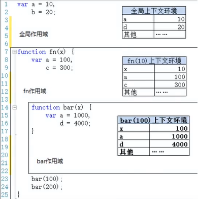
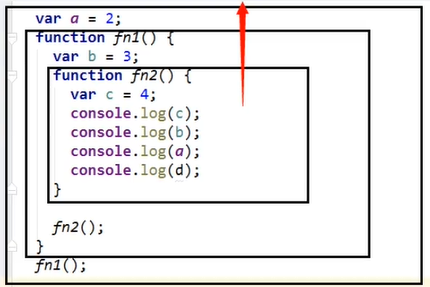

# 17.作用域与作用域链

- 笔记本：JavaScript高级知识
- 创建时间：2020-01-13 02:05:34 UTC
- 更新时间：2020-01-13 03:56:29 UTC
- 印象笔记 GUID：a4065ddb-63e7-445e-b567-9cd7ae279278

### 作用域

#### 1. 理解

- 就是一块“地盘”，一个代码段所在的区域

- 它是静态的（相对于上下文对象），在编写代码时就确定了

#### 2. 分类

- 全局作用域

- 函数作用域

- 没有块作用域（ES6 有了）

#### 3. 作用

- 隔离变量，不同作用域下同名变量不会有冲突

**eg:**

```
// 没有块作用域
if(true) {
    var c = 3;
}
console.log(c);

var a = 10, b =20;
function fn(x) {
    var a = 100, c = 300;
    console.log('fn()', a, b, c, x);
    function bar(x) {
        var a = 1000, d = 400;
        console.log('bar()', a, b, c, d, x);
    }
    bar(100);
    bar(200);
}
fn(10);

```

**输出：**

```
fn() 100 20 300 10
bar() 1000 20 300 400 100
bar() 1000 20 300 400 200

```

### 作用域与执行上下文

#### 1. 区别1

- 全局作用域之外，每个函数都会创建自己的作用域，作用域在函数定义时就确定了，而不是在函数调用时

- 全局执行上下文环境时在全局作用域确定之后，js 代码马上执行创建

- 函数执行上下文环境是在调用函数时，函数体代码执行之前创建

#### 2. 区别2

- 作用域是静态的，只要函数定义好了就一直存在，且不会再变化

- 执行上下文环境是动态的，调用函数时创建，函数调用结束时就会自动释放

#### 3. 联系

- 执行上下文（对象）是从属于所在的作用域

- 全局上下文环境 ==> 全局作用域

- 函数上下文环境 ==> 对应的函数作用域

**eg:**

```
var a = 10, b =20;
function fn(x) {
    var a = 100, c = 300;
    console.log('fn()', a, b, c, x);
    function bar(x) {
        var a = 1000, d = 400;
        console.log('bar()', a, b, c, d, x);
    }
    bar(100);
    bar(200);
}
fn(10);

```



### 作用域链

#### 1. 理解

- 多个上下级关系的作用域形成的链，它的方向是从下向上的（从内到外）

- 查找变量时就是沿着作用域链来查找的

#### 2. 查找一个变量的查找规则

- 在当前作用域下的执行上下文中查找对应的属性，如果有直接返回，否则进入2

- 在上一级作用域的执行上下文中查找对应的属性，如果有直接返回，否则进入3

- 再次执行2的相同操作，知道全局作用域，如果还找不到就抛出找不到的异常

**eg:**

```
var a = 1;
function fn1() {
    var b = 2;
    functionfn2() {
        var c = 3;
        console.log(a);
        console.log(b);
        console.log(c);
        console.log(d);
    }
    fn2();
}
fn1();

```



### 面试题

#### 面试题1

```
var x = 10;
function fn() {
    console.log(x);
}
function show(f) {
    var x = 20;
    f();
}
show(fn);

```

**输出**

```
10

```

#### 面试题2

```
var fn = function() {
    console.log(fn);
}
fn();
var obj = {
    fn2: function() {
        console.log(this.fn2);
        console.log(fn2);       // this.fn2 才可以找到fn2
    }
}
obj.fn2();

```

**输出**

```
function() {
    console.log(fn);
}
function() {
    console.log(this.fn2);
    console.log(fn2);
}
Uncatcht
ReferenceError: fn2 is not defined

```

%23%23%23%20%E4%BD%9C%E7%94%A8%E5%9F%9F%0A%23%23%23%23%201.%20%E7%90%86%E8%A7%A3%0A*%20%E5%B0%B1%E6%98%AF%E4%B8%80%E5%9D%97%E2%80%9C%E5%9C%B0%E7%9B%98%E2%80%9D%EF%BC%8C%E4%B8%80%E4%B8%AA%E4%BB%A3%E7%A0%81%E6%AE%B5%E6%89%80%E5%9C%A8%E7%9A%84%E5%8C%BA%E5%9F%9F%0A*%20%E5%AE%83%E6%98%AF%E9%9D%99%E6%80%81%E7%9A%84%EF%BC%88%E7%9B%B8%E5%AF%B9%E4%BA%8E%E4%B8%8A%E4%B8%8B%E6%96%87%E5%AF%B9%E8%B1%A1%EF%BC%89%EF%BC%8C%E5%9C%A8%E7%BC%96%E5%86%99%E4%BB%A3%E7%A0%81%E6%97%B6%E5%B0%B1%E7%A1%AE%E5%AE%9A%E4%BA%86%0A%0A%23%23%23%23%202.%20%E5%88%86%E7%B1%BB%0A*%20%E5%85%A8%E5%B1%80%E4%BD%9C%E7%94%A8%E5%9F%9F%0A*%20%E5%87%BD%E6%95%B0%E4%BD%9C%E7%94%A8%E5%9F%9F%0A*%20%E6%B2%A1%E6%9C%89%E5%9D%97%E4%BD%9C%E7%94%A8%E5%9F%9F%EF%BC%88ES6%20%E6%9C%89%E4%BA%86%EF%BC%89%0A%0A%23%23%23%23%203.%20%E4%BD%9C%E7%94%A8%0A*%20%E9%9A%94%E7%A6%BB%E5%8F%98%E9%87%8F%EF%BC%8C%E4%B8%8D%E5%90%8C%E4%BD%9C%E7%94%A8%E5%9F%9F%E4%B8%8B%E5%90%8C%E5%90%8D%E5%8F%98%E9%87%8F%E4%B8%8D%E4%BC%9A%E6%9C%89%E5%86%B2%E7%AA%81%0A%0A**eg%3A**%0A%60%60%60javascript%0A%2F%2F%20%E6%B2%A1%E6%9C%89%E5%9D%97%E4%BD%9C%E7%94%A8%E5%9F%9F%0Aif(true)%20%7B%0A%20%20%20%20var%20c%20%3D%203%3B%0A%7D%0Aconsole.log(c)%3B%0A%0Avar%20a%20%3D%2010%2C%20b%20%3D20%3B%0Afunction%20fn(x)%20%7B%0A%20%20%20%20var%20a%20%3D%20100%2C%20c%20%3D%20300%3B%0A%20%20%20%20console.log('fn()'%2C%20a%2C%20b%2C%20c%2C%20x)%3B%0A%20%20%20%20function%20bar(x)%20%7B%0A%20%20%20%20%20%20%20%20var%20a%20%3D%201000%2C%20d%20%3D%20400%3B%0A%20%20%20%20%20%20%20%20console.log('bar()'%2C%20a%2C%20b%2C%20c%2C%20d%2C%20x)%3B%0A%20%20%20%20%7D%0A%20%20%20%20bar(100)%3B%0A%20%20%20%20bar(200)%3B%0A%7D%0Afn(10)%3B%0A%60%60%60%0A**%E8%BE%93%E5%87%BA%EF%BC%9A**%0A%60%60%60console%0Afn()%20100%2020%20300%2010%0Abar()%201000%2020%20300%20400%20100%0Abar()%201000%2020%20300%20400%20200%0A%60%60%60%0A%0A---%0A%0A%23%23%23%20%E4%BD%9C%E7%94%A8%E5%9F%9F%E4%B8%8E%E6%89%A7%E8%A1%8C%E4%B8%8A%E4%B8%8B%E6%96%87%0A%23%23%23%23%201.%20%E5%8C%BA%E5%88%AB1%0A*%20%E5%85%A8%E5%B1%80%E4%BD%9C%E7%94%A8%E5%9F%9F%E4%B9%8B%E5%A4%96%EF%BC%8C%E6%AF%8F%E4%B8%AA%E5%87%BD%E6%95%B0%E9%83%BD%E4%BC%9A%E5%88%9B%E5%BB%BA%E8%87%AA%E5%B7%B1%E7%9A%84%E4%BD%9C%E7%94%A8%E5%9F%9F%EF%BC%8C%E4%BD%9C%E7%94%A8%E5%9F%9F%E5%9C%A8%E5%87%BD%E6%95%B0%E5%AE%9A%E4%B9%89%E6%97%B6%E5%B0%B1%E7%A1%AE%E5%AE%9A%E4%BA%86%EF%BC%8C%E8%80%8C%E4%B8%8D%E6%98%AF%E5%9C%A8%E5%87%BD%E6%95%B0%E8%B0%83%E7%94%A8%E6%97%B6%0A*%20%E5%85%A8%E5%B1%80%E6%89%A7%E8%A1%8C%E4%B8%8A%E4%B8%8B%E6%96%87%E7%8E%AF%E5%A2%83%E6%97%B6%E5%9C%A8%E5%85%A8%E5%B1%80%E4%BD%9C%E7%94%A8%E5%9F%9F%E7%A1%AE%E5%AE%9A%E4%B9%8B%E5%90%8E%EF%BC%8Cjs%20%E4%BB%A3%E7%A0%81%E9%A9%AC%E4%B8%8A%E6%89%A7%E8%A1%8C%E5%88%9B%E5%BB%BA%0A*%20%E5%87%BD%E6%95%B0%E6%89%A7%E8%A1%8C%E4%B8%8A%E4%B8%8B%E6%96%87%E7%8E%AF%E5%A2%83%E6%98%AF%E5%9C%A8%E8%B0%83%E7%94%A8%E5%87%BD%E6%95%B0%E6%97%B6%EF%BC%8C%E5%87%BD%E6%95%B0%E4%BD%93%E4%BB%A3%E7%A0%81%E6%89%A7%E8%A1%8C%E4%B9%8B%E5%89%8D%E5%88%9B%E5%BB%BA%0A%0A%23%23%23%23%202.%20%E5%8C%BA%E5%88%AB2%0A*%20%E4%BD%9C%E7%94%A8%E5%9F%9F%E6%98%AF%E9%9D%99%E6%80%81%E7%9A%84%EF%BC%8C%E5%8F%AA%E8%A6%81%E5%87%BD%E6%95%B0%E5%AE%9A%E4%B9%89%E5%A5%BD%E4%BA%86%E5%B0%B1%E4%B8%80%E7%9B%B4%E5%AD%98%E5%9C%A8%EF%BC%8C%E4%B8%94%E4%B8%8D%E4%BC%9A%E5%86%8D%E5%8F%98%E5%8C%96%0A*%20%E6%89%A7%E8%A1%8C%E4%B8%8A%E4%B8%8B%E6%96%87%E7%8E%AF%E5%A2%83%E6%98%AF%E5%8A%A8%E6%80%81%E7%9A%84%EF%BC%8C%E8%B0%83%E7%94%A8%E5%87%BD%E6%95%B0%E6%97%B6%E5%88%9B%E5%BB%BA%EF%BC%8C%E5%87%BD%E6%95%B0%E8%B0%83%E7%94%A8%E7%BB%93%E6%9D%9F%E6%97%B6%E5%B0%B1%E4%BC%9A%E8%87%AA%E5%8A%A8%E9%87%8A%E6%94%BE%0A%0A%23%23%23%23%203.%20%E8%81%94%E7%B3%BB%0A*%20%E6%89%A7%E8%A1%8C%E4%B8%8A%E4%B8%8B%E6%96%87%EF%BC%88%E5%AF%B9%E8%B1%A1%EF%BC%89%E6%98%AF%E4%BB%8E%E5%B1%9E%E4%BA%8E%E6%89%80%E5%9C%A8%E7%9A%84%E4%BD%9C%E7%94%A8%E5%9F%9F%0A*%20%E5%85%A8%E5%B1%80%E4%B8%8A%E4%B8%8B%E6%96%87%E7%8E%AF%E5%A2%83%20%3D%3D%3E%20%E5%85%A8%E5%B1%80%E4%BD%9C%E7%94%A8%E5%9F%9F%0A*%20%E5%87%BD%E6%95%B0%E4%B8%8A%E4%B8%8B%E6%96%87%E7%8E%AF%E5%A2%83%20%3D%3D%3E%20%E5%AF%B9%E5%BA%94%E7%9A%84%E5%87%BD%E6%95%B0%E4%BD%9C%E7%94%A8%E5%9F%9F%0A%0A**eg%3A**%0A%60%60%60javascript%0Avar%20a%20%3D%2010%2C%20b%20%3D20%3B%0Afunction%20fn(x)%20%7B%0A%20%20%20%20var%20a%20%3D%20100%2C%20c%20%3D%20300%3B%0A%20%20%20%20console.log('fn()'%2C%20a%2C%20b%2C%20c%2C%20x)%3B%0A%20%20%20%20function%20bar(x)%20%7B%0A%20%20%20%20%20%20%20%20var%20a%20%3D%201000%2C%20d%20%3D%20400%3B%0A%20%20%20%20%20%20%20%20console.log('bar()'%2C%20a%2C%20b%2C%20c%2C%20d%2C%20x)%3B%0A%20%20%20%20%7D%0A%20%20%20%20bar(100)%3B%0A%20%20%20%20bar(200)%3B%0A%7D%0Afn(10)%3B%0A%60%60%60%0A!%5B6ae8b653af698475da23e7766bf1125c.png%5D(en-resource%3A%2F%2Fdatabase%2F992%3A0)%0A%0A%0A---%0A%0A%23%23%23%20%E4%BD%9C%E7%94%A8%E5%9F%9F%E9%93%BE%0A%23%23%23%23%201.%20%E7%90%86%E8%A7%A3%0A*%20%E5%A4%9A%E4%B8%AA%E4%B8%8A%E4%B8%8B%E7%BA%A7%E5%85%B3%E7%B3%BB%E7%9A%84%E4%BD%9C%E7%94%A8%E5%9F%9F%E5%BD%A2%E6%88%90%E7%9A%84%E9%93%BE%EF%BC%8C%E5%AE%83%E7%9A%84%E6%96%B9%E5%90%91%E6%98%AF%E4%BB%8E%E4%B8%8B%E5%90%91%E4%B8%8A%E7%9A%84%EF%BC%88%E4%BB%8E%E5%86%85%E5%88%B0%E5%A4%96%EF%BC%89%0A*%20%E6%9F%A5%E6%89%BE%E5%8F%98%E9%87%8F%E6%97%B6%E5%B0%B1%E6%98%AF%E6%B2%BF%E7%9D%80%E4%BD%9C%E7%94%A8%E5%9F%9F%E9%93%BE%E6%9D%A5%E6%9F%A5%E6%89%BE%E7%9A%84%0A%0A%23%23%23%23%202.%20%E6%9F%A5%E6%89%BE%E4%B8%80%E4%B8%AA%E5%8F%98%E9%87%8F%E7%9A%84%E6%9F%A5%E6%89%BE%E8%A7%84%E5%88%99%0A*%20%E5%9C%A8%E5%BD%93%E5%89%8D%E4%BD%9C%E7%94%A8%E5%9F%9F%E4%B8%8B%E7%9A%84%E6%89%A7%E8%A1%8C%E4%B8%8A%E4%B8%8B%E6%96%87%E4%B8%AD%E6%9F%A5%E6%89%BE%E5%AF%B9%E5%BA%94%E7%9A%84%E5%B1%9E%E6%80%A7%EF%BC%8C%E5%A6%82%E6%9E%9C%E6%9C%89%E7%9B%B4%E6%8E%A5%E8%BF%94%E5%9B%9E%EF%BC%8C%E5%90%A6%E5%88%99%E8%BF%9B%E5%85%A52%0A*%20%E5%9C%A8%E4%B8%8A%E4%B8%80%E7%BA%A7%E4%BD%9C%E7%94%A8%E5%9F%9F%E7%9A%84%E6%89%A7%E8%A1%8C%E4%B8%8A%E4%B8%8B%E6%96%87%E4%B8%AD%E6%9F%A5%E6%89%BE%E5%AF%B9%E5%BA%94%E7%9A%84%E5%B1%9E%E6%80%A7%EF%BC%8C%E5%A6%82%E6%9E%9C%E6%9C%89%E7%9B%B4%E6%8E%A5%E8%BF%94%E5%9B%9E%EF%BC%8C%E5%90%A6%E5%88%99%E8%BF%9B%E5%85%A53%0A*%20%E5%86%8D%E6%AC%A1%E6%89%A7%E8%A1%8C2%E7%9A%84%E7%9B%B8%E5%90%8C%E6%93%8D%E4%BD%9C%EF%BC%8C%E7%9F%A5%E9%81%93%E5%85%A8%E5%B1%80%E4%BD%9C%E7%94%A8%E5%9F%9F%EF%BC%8C%E5%A6%82%E6%9E%9C%E8%BF%98%E6%89%BE%E4%B8%8D%E5%88%B0%E5%B0%B1%E6%8A%9B%E5%87%BA%E6%89%BE%E4%B8%8D%E5%88%B0%E7%9A%84%E5%BC%82%E5%B8%B8%0A%0A**eg%3A**%0A%60%60%60javascript%0Avar%20a%20%3D%201%3B%0Afunction%20fn1()%20%7B%0A%20%20%20%20var%20b%20%3D%202%3B%0A%20%20%20%20functionfn2()%20%7B%0A%20%20%20%20%20%20%20%20var%20c%20%3D%203%3B%0A%20%20%20%20%20%20%20%20console.log(a)%3B%0A%20%20%20%20%20%20%20%20console.log(b)%3B%0A%20%20%20%20%20%20%20%20console.log(c)%3B%0A%20%20%20%20%20%20%20%20console.log(d)%3B%0A%20%20%20%20%7D%0A%20%20%20%20fn2()%3B%0A%7D%0Afn1()%3B%0A%60%60%60%0A%0A!%5B4e616a70421ec3e03a82223580229a4d.png%5D(en-resource%3A%2F%2Fdatabase%2F994%3A0)%0A%0A---%0A%0A%23%23%23%20%E9%9D%A2%E8%AF%95%E9%A2%98%0A%23%23%23%23%20%E9%9D%A2%E8%AF%95%E9%A2%981%0A%60%60%60javascript%0Avar%20x%20%3D%2010%3B%0Afunction%20fn()%20%7B%0A%20%20%20%20console.log(x)%3B%0A%7D%0Afunction%20show(f)%20%7B%0A%20%20%20%20var%20x%20%3D%2020%3B%0A%20%20%20%20f()%3B%0A%7D%0Ashow(fn)%3B%0A%60%60%60%0A**%E8%BE%93%E5%87%BA**%0A%60%60%60console%0A10%0A%60%60%60%0A%0A%23%23%23%23%20%E9%9D%A2%E8%AF%95%E9%A2%982%0A%60%60%60javascript%0Avar%20fn%20%3D%20function()%20%7B%0A%20%20%20%20console.log(fn)%3B%0A%7D%0Afn()%3B%0Avar%20obj%20%3D%20%7B%0A%20%20%20%20fn2%3A%20function()%20%7B%0A%20%20%20%20%20%20%20%20console.log(this.fn2)%3B%0A%20%20%20%20%20%20%20%20console.log(fn2)%3B%20%20%20%20%20%20%20%2F%2F%20this.fn2%20%E6%89%8D%E5%8F%AF%E4%BB%A5%E6%89%BE%E5%88%B0fn2%0A%20%20%20%20%7D%0A%7D%0Aobj.fn2()%3B%0A%60%60%60%0A%0A**%E8%BE%93%E5%87%BA**%0A%60%60%60console%0Afunction()%20%7B%0A%20%20%20%20console.log(fn)%3B%0A%7D%0Afunction()%20%7B%0A%20%20%20%20console.log(this.fn2)%3B%0A%20%20%20%20console.log(fn2)%3B%20%20%20%20%20%20%20%0A%7D%0AUncatcht%0AReferenceError%3A%20fn2%20is%20not%20defined%0A%60%60%60
