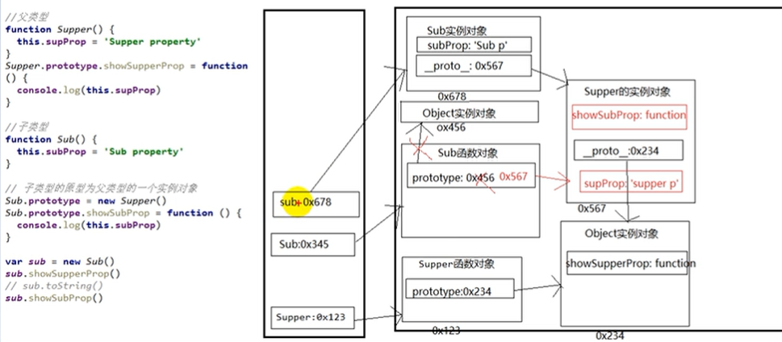

# 27.继承模式-原型链继承

- 笔记本：JavaScript高级知识
- 创建时间：2020-01-21 06:31:24 UTC
- 更新时间：2020-01-21 07:00:36 UTC
- 印象笔记 GUID：2cb97142-b2c5-4cdd-92c3-d32bc034e9d0

1.
套路

  1. 定义父类型构造函数

  1. 给父类型的原型添加方法

  1. 定义子类型的构造函数

  1. 创建父类型的对象赋值给子类型的原型

  1. 将子对象原型的构造属性设置为子类型

  1. 给子类型原型添加方法

  1. 创建子类型对象：可以调用父类型的方法

1.
关键

  1. 子类型的原型为父类型的一个实例

```
// 父类型
function Super() {
    this.supProp = 'Super property';
}
Super.prototype.showSupperProp = function() {   // 这个方法，Super 的所有实例都可以看见
    console.log(this.supProp);
}

// 子类型
function Sub() {
    this.subProp = 'Sub property';
}
// 子类型的原型为父类型的一个实例对象
Sub.prototype = new Supper();
// 让子类型
Sub.prototype.showSubProp =  function() {
    console.log(this.subProp);
}

var sub = new Sub();
sub.showSupperProp();
sub.showSubProp();
sub.toString();     // 可以执行，原型是Object实例对象，可以找到Object原型上的方法，即找到了toString();(之所以可以看到 toString 是因为 有 Sub.prorotype = new Object();)

// 查看实例对象的构造方法是谁
console.log(sub.constructor);           // Super(运行对象指向了Super的实例)
console.log(sub);
// Sub 构造器的属性指向了Super
// 让子类型的原型的constructor 指向子类型（加在 Sub.prototype = new Supper() 后）
// Sub.prototype.constructor = Sub;

```



1.%20%E5%A5%97%E8%B7%AF%0A%20%20%20%201.%20%E5%AE%9A%E4%B9%89%E7%88%B6%E7%B1%BB%E5%9E%8B%E6%9E%84%E9%80%A0%E5%87%BD%E6%95%B0%0A%20%20%20%202.%20%E7%BB%99%E7%88%B6%E7%B1%BB%E5%9E%8B%E7%9A%84%E5%8E%9F%E5%9E%8B%E6%B7%BB%E5%8A%A0%E6%96%B9%E6%B3%95%0A%20%20%20%203.%20%E5%AE%9A%E4%B9%89%E5%AD%90%E7%B1%BB%E5%9E%8B%E7%9A%84%E6%9E%84%E9%80%A0%E5%87%BD%E6%95%B0%0A%20%20%20%204.%20%E5%88%9B%E5%BB%BA%E7%88%B6%E7%B1%BB%E5%9E%8B%E7%9A%84%E5%AF%B9%E8%B1%A1%E8%B5%8B%E5%80%BC%E7%BB%99%E5%AD%90%E7%B1%BB%E5%9E%8B%E7%9A%84%E5%8E%9F%E5%9E%8B%0A%20%20%20%205.%20%E5%B0%86%E5%AD%90%E5%AF%B9%E8%B1%A1%E5%8E%9F%E5%9E%8B%E7%9A%84%E6%9E%84%E9%80%A0%E5%B1%9E%E6%80%A7%E8%AE%BE%E7%BD%AE%E4%B8%BA%E5%AD%90%E7%B1%BB%E5%9E%8B%0A%20%20%20%206.%20%E7%BB%99%E5%AD%90%E7%B1%BB%E5%9E%8B%E5%8E%9F%E5%9E%8B%E6%B7%BB%E5%8A%A0%E6%96%B9%E6%B3%95%0A%20%20%20%207.%20%E5%88%9B%E5%BB%BA%E5%AD%90%E7%B1%BB%E5%9E%8B%E5%AF%B9%E8%B1%A1%EF%BC%9A%E5%8F%AF%E4%BB%A5%E8%B0%83%E7%94%A8%E7%88%B6%E7%B1%BB%E5%9E%8B%E7%9A%84%E6%96%B9%E6%B3%95%0A%0A2.%20%E5%85%B3%E9%94%AE%0A%20%20%20%201.%20%E5%AD%90%E7%B1%BB%E5%9E%8B%E7%9A%84%E5%8E%9F%E5%9E%8B%E4%B8%BA%E7%88%B6%E7%B1%BB%E5%9E%8B%E7%9A%84%E4%B8%80%E4%B8%AA%E5%AE%9E%E4%BE%8B%0A%0A%0A%60%60%60javascript%0A%2F%2F%20%E7%88%B6%E7%B1%BB%E5%9E%8B%0Afunction%20Super()%20%7B%0A%20%20%20%20this.supProp%20%3D%20'Super%20property'%3B%0A%7D%0ASuper.prototype.showSupperProp%20%3D%20function()%20%7B%20%20%20%2F%2F%20%E8%BF%99%E4%B8%AA%E6%96%B9%E6%B3%95%EF%BC%8CSuper%20%E7%9A%84%E6%89%80%E6%9C%89%E5%AE%9E%E4%BE%8B%E9%83%BD%E5%8F%AF%E4%BB%A5%E7%9C%8B%E8%A7%81%0A%20%20%20%20console.log(this.supProp)%3B%0A%7D%0A%0A%2F%2F%20%E5%AD%90%E7%B1%BB%E5%9E%8B%0Afunction%20Sub()%20%7B%0A%20%20%20%20this.subProp%20%3D%20'Sub%20property'%3B%0A%7D%0A%2F%2F%20%E5%AD%90%E7%B1%BB%E5%9E%8B%E7%9A%84%E5%8E%9F%E5%9E%8B%E4%B8%BA%E7%88%B6%E7%B1%BB%E5%9E%8B%E7%9A%84%E4%B8%80%E4%B8%AA%E5%AE%9E%E4%BE%8B%E5%AF%B9%E8%B1%A1%0ASub.prototype%20%3D%20new%20Supper()%3B%0A%2F%2F%20%E8%AE%A9%E5%AD%90%E7%B1%BB%E5%9E%8B%E7%9A%84%E5%8E%9F%E5%9E%8B%E7%9A%84constructor%E6%8C%87%E5%90%91%E5%AD%90%E7%B1%BB%E5%9E%8B%0ASub.prototype.constructor%20%3D%20Sub%3B%0ASub.prototype.showSubProp%20%3D%20%20function()%20%7B%0A%20%20%20%20console.log(this.subProp)%3B%0A%7D%0A%0Avar%20sub%20%3D%20new%20Sub()%3B%0Asub.showSupperProp()%3B%0Asub.showSubProp()%3B%0Asub.toString()%3B%20%20%20%20%20%2F%2F%20%E5%8F%AF%E4%BB%A5%E6%89%A7%E8%A1%8C%EF%BC%8C%E5%8E%9F%E5%9E%8B%E6%98%AFObject%E5%AE%9E%E4%BE%8B%E5%AF%B9%E8%B1%A1%EF%BC%8C%E5%8F%AF%E4%BB%A5%E6%89%BE%E5%88%B0Object%E5%8E%9F%E5%9E%8B%E4%B8%8A%E7%9A%84%E6%96%B9%E6%B3%95%EF%BC%8C%E5%8D%B3%E6%89%BE%E5%88%B0%E4%BA%86toString()%3B(%E4%B9%8B%E6%89%80%E4%BB%A5%E5%8F%AF%E4%BB%A5%E7%9C%8B%E5%88%B0%20toString%20%E6%98%AF%E5%9B%A0%E4%B8%BA%20%E6%9C%89%20Sub.prorotype%20%3D%20new%20Object()%3B)%0A%0A%2F%2F%20%E6%9F%A5%E7%9C%8B%E5%AE%9E%E4%BE%8B%E5%AF%B9%E8%B1%A1%E7%9A%84%E6%9E%84%E9%80%A0%E6%96%B9%E6%B3%95%E6%98%AF%E8%B0%81%0Aconsole.log(sub.constructor)%3B%20%20%20%20%20%20%20%20%20%20%20%2F%2F%20Super(%E8%BF%90%E8%A1%8C%E5%AF%B9%E8%B1%A1%E6%8C%87%E5%90%91%E4%BA%86Super%E7%9A%84%E5%AE%9E%E4%BE%8B)%0Aconsole.log(sub)%3B%0A%2F%2F%20Sub%20%E6%9E%84%E9%80%A0%E5%99%A8%E7%9A%84%E5%B1%9E%E6%80%A7%E6%8C%87%E5%90%91%E4%BA%86Super%0A%2F%2F%20%E8%AE%A9%E5%AD%90%E7%B1%BB%E5%9E%8B%E7%9A%84%E5%8E%9F%E5%9E%8B%E7%9A%84constructor%20%E6%8C%87%E5%90%91%E5%AD%90%E7%B1%BB%E5%9E%8B%EF%BC%88%E5%8A%A0%E5%9C%A8%20Sub.prototype%20%3D%20new%20Supper()%20%E5%90%8E%EF%BC%89%0A%2F%2F%20Sub.prototype.constructor%20%3D%20Sub%3B%0A%60%60%60%0A%0A!%5Be202b0a95df96ad1682b487f0946d2b2.png%5D(en-resource%3A%2F%2Fdatabase%2F1126%3A0)%0A
