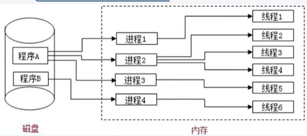

# 30.线程机制与事件机制-进程与线程

- 笔记本：JavaScript高级知识
- 创建时间：2020-01-22 03:06:03 UTC
- 更新时间：2020-01-22 03:09:40 UTC
- 印象笔记 GUID：30f12379-b739-49db-a2fc-d156584cc0d2

#### 进程：

- 程序的一次执行，它占有一片独有的内存空间

- 可以通过windows任务管理器查看进程

#### 线程：

- 是进程内的一个独立执行单元

- 是程序执行的一个完整流程

- 是CPU的最小调度单元

#### 图解：

%23%23%23%23%20%E8%BF%9B%E7%A8%8B%EF%BC%9A%0A*%20%E7%A8%8B%E5%BA%8F%E7%9A%84%E4%B8%80%E6%AC%A1%E6%89%A7%E8%A1%8C%EF%BC%8C%E5%AE%83%E5%8D%A0%E6%9C%89%E4%B8%80%E7%89%87%E7%8B%AC%E6%9C%89%E7%9A%84%E5%86%85%E5%AD%98%E7%A9%BA%E9%97%B4%20%0A*%20%E5%8F%AF%E4%BB%A5%E9%80%9A%E8%BF%87windows%E4%BB%BB%E5%8A%A1%E7%AE%A1%E7%90%86%E5%99%A8%E6%9F%A5%E7%9C%8B%E8%BF%9B%E7%A8%8B%0A%0A%23%23%23%23%20%E7%BA%BF%E7%A8%8B%EF%BC%9A%0A*%20%E6%98%AF%E8%BF%9B%E7%A8%8B%E5%86%85%E7%9A%84%E4%B8%80%E4%B8%AA%E7%8B%AC%E7%AB%8B%E6%89%A7%E8%A1%8C%E5%8D%95%E5%85%83%0A*%20%E6%98%AF%E7%A8%8B%E5%BA%8F%E6%89%A7%E8%A1%8C%E7%9A%84%E4%B8%80%E4%B8%AA%E5%AE%8C%E6%95%B4%E6%B5%81%E7%A8%8B%0A*%20%E6%98%AFCPU%E7%9A%84%E6%9C%80%E5%B0%8F%E8%B0%83%E5%BA%A6%E5%8D%95%E5%85%83%0A%0A%23%23%23%23%20%E5%9B%BE%E8%A7%A3%EF%BC%9A%0A!%5Bb107e205c2f6b2331f60dbfcbdce0068.png%5D(en-resource%3A%2F%2Fdatabase%2F1138%3A0)%0A
