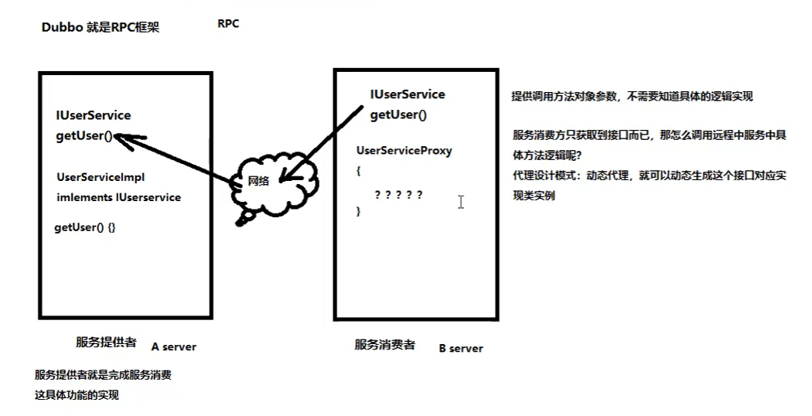

# 1.rpc描述及涉及到的知识点：

- 笔记本：RPC框架
- 创建时间：2019-12-21 14:19:14 UTC
- 更新时间：2019-12-21 14:21:38 UTC
- 印象笔记 GUID：ad38bfaf-50da-4a29-be2d-c55d82f9719a

**涉及到的知识点：**

1. 反射

1. 序列化流

1. 动态代理

1. 多线程

1. 线程池

!%5B24b12187ed8b150352a8a9dd7b4d1438.png%5D(en-resource%3A%2F%2Fdatabase%2F748%3A0)%0A%0A%0A**%E6%B6%89%E5%8F%8A%E5%88%B0%E7%9A%84%E7%9F%A5%E8%AF%86%E7%82%B9%EF%BC%9A**%0A1.%20%E5%8F%8D%E5%B0%84%0A2.%20%E5%BA%8F%E5%88%97%E5%8C%96%E6%B5%81%0A3.%20%E5%8A%A8%E6%80%81%E4%BB%A3%E7%90%86%0A4.%20%E5%A4%9A%E7%BA%BF%E7%A8%8B%0A5.%20%E7%BA%BF%E7%A8%8B%E6%B1%A0%0A
