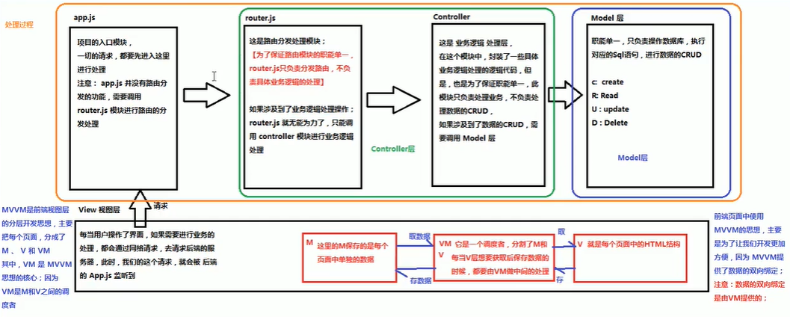

# 2.MVVM

- 笔记本：01.Vue概述及入门
- 创建时间：2019-12-10 05:50:25 UTC
- 更新时间：2019-12-10 06:14:26 UTC
- 印象笔记 GUID：f94d7465-f4f7-4aa1-abd2-2cd9ab27f77d



**MVVM在代码中的对应**

```

<!DOCTYPE html>
<html lang="en">
<head>
    <meta charset="UTF-8">
    <meta name="viewport" content="width=device-width, initial-scale=1.0">
    <meta http-equiv="X-UA-Compatible" content="ie=edge">
    <title>Document</title>
    <!-- 1.导入Vue的包 -->
    <script src="lib/vue.js"></script>
</head>
<body>
    <!-- 将来new 的Vue实例，会控制这个元素中的所有内容-->
    <!-- Vue 实例所控制的区域，就是我们的V -->
    <div id="app">     
        <p>{{msg}}</p>
    </div>
    <script>
        // 2.创建一个Vue的示例
        // 当我们导入包之后，在浏览器内存中就多了一个Vue构造函数
        // 注意：我们new 出来的vm 对象，就是我们MVVM中的VM.
        var vm = new Vue({
            el:'#app',              // 表示当前new的这个Vue实例，要控制页面上的哪个区域
            // 这里的data 就是MVVM中的M ,专门用来保存每个页面的数据的
            data: {                 // data属性中，存放的是el中要用到的数据
                msg: 'Hello World'  // 通过Vue提供的指令，就可以很方便的把数据渲染到页面上，程序员不再手动操作Dom元素了(前端的Vue之类的框架，不提倡我们去手动操作DOM元素了)
            }
        });
    </script>
</body>
</html>

```

!%5Bd76341d79ede401ab313bfda6b0b244d.png%5D(en-resource%3A%2F%2Fdatabase%2F638%3A0)%0A%0A**MVVM%E5%9C%A8%E4%BB%A3%E7%A0%81%E4%B8%AD%E7%9A%84%E5%AF%B9%E5%BA%94**%0A%60%60%60html%0A%0A%3C!DOCTYPE%C2%A0html%3E%0A%3Chtml%C2%A0lang%3D%22en%22%3E%0A%3Chead%3E%0A%C2%A0%C2%A0%C2%A0%C2%A0%3Cmeta%C2%A0charset%3D%22UTF-8%22%3E%0A%C2%A0%C2%A0%C2%A0%C2%A0%3Cmeta%C2%A0name%3D%22viewport%22%C2%A0content%3D%22width%3Ddevice-width%2C%C2%A0initial-scale%3D1.0%22%3E%0A%C2%A0%C2%A0%C2%A0%C2%A0%3Cmeta%C2%A0http-equiv%3D%22X-UA-Compatible%22%C2%A0content%3D%22ie%3Dedge%22%3E%0A%C2%A0%C2%A0%C2%A0%C2%A0%3Ctitle%3EDocument%3C%2Ftitle%3E%0A%C2%A0%C2%A0%C2%A0%C2%A0%3C!--%C2%A01.%E5%AF%BC%E5%85%A5Vue%E7%9A%84%E5%8C%85%C2%A0--%3E%0A%C2%A0%C2%A0%C2%A0%C2%A0%3Cscript%C2%A0src%3D%22lib%2Fvue.js%22%3E%3C%2Fscript%3E%0A%3C%2Fhead%3E%0A%3Cbody%3E%0A%C2%A0%C2%A0%C2%A0%C2%A0%3C!--%C2%A0%E5%B0%86%E6%9D%A5new%C2%A0%E7%9A%84Vue%E5%AE%9E%E4%BE%8B%EF%BC%8C%E4%BC%9A%E6%8E%A7%E5%88%B6%E8%BF%99%E4%B8%AA%E5%85%83%E7%B4%A0%E4%B8%AD%E7%9A%84%E6%89%80%E6%9C%89%E5%86%85%E5%AE%B9--%3E%0A%C2%A0%C2%A0%C2%A0%C2%A0%3C!--%C2%A0Vue%C2%A0%E5%AE%9E%E4%BE%8B%E6%89%80%E6%8E%A7%E5%88%B6%E7%9A%84%E5%8C%BA%E5%9F%9F%EF%BC%8C%E5%B0%B1%E6%98%AF%E6%88%91%E4%BB%AC%E7%9A%84V%C2%A0--%3E%0A%C2%A0%C2%A0%C2%A0%C2%A0%3Cdiv%C2%A0id%3D%22app%22%3E%C2%A0%C2%A0%C2%A0%C2%A0%C2%A0%0A%C2%A0%C2%A0%C2%A0%C2%A0%C2%A0%C2%A0%C2%A0%C2%A0%3Cp%3E%7B%7Bmsg%7D%7D%3C%2Fp%3E%0A%C2%A0%C2%A0%C2%A0%C2%A0%3C%2Fdiv%3E%0A%C2%A0%C2%A0%C2%A0%C2%A0%3Cscript%3E%0A%C2%A0%C2%A0%C2%A0%C2%A0%C2%A0%C2%A0%C2%A0%C2%A0%2F%2F%C2%A02.%E5%88%9B%E5%BB%BA%E4%B8%80%E4%B8%AAVue%E7%9A%84%E7%A4%BA%E4%BE%8B%0A%C2%A0%C2%A0%C2%A0%C2%A0%C2%A0%C2%A0%C2%A0%C2%A0%2F%2F%C2%A0%E5%BD%93%E6%88%91%E4%BB%AC%E5%AF%BC%E5%85%A5%E5%8C%85%E4%B9%8B%E5%90%8E%EF%BC%8C%E5%9C%A8%E6%B5%8F%E8%A7%88%E5%99%A8%E5%86%85%E5%AD%98%E4%B8%AD%E5%B0%B1%E5%A4%9A%E4%BA%86%E4%B8%80%E4%B8%AAVue%E6%9E%84%E9%80%A0%E5%87%BD%E6%95%B0%0A%C2%A0%C2%A0%C2%A0%C2%A0%C2%A0%C2%A0%C2%A0%C2%A0%2F%2F%C2%A0%E6%B3%A8%E6%84%8F%EF%BC%9A%E6%88%91%E4%BB%ACnew%C2%A0%E5%87%BA%E6%9D%A5%E7%9A%84vm%C2%A0%E5%AF%B9%E8%B1%A1%EF%BC%8C%E5%B0%B1%E6%98%AF%E6%88%91%E4%BB%ACMVVM%E4%B8%AD%E7%9A%84VM.%0A%C2%A0%C2%A0%C2%A0%C2%A0%C2%A0%C2%A0%C2%A0%C2%A0var%C2%A0vm%C2%A0%3D%C2%A0new%C2%A0Vue(%7B%0A%C2%A0%C2%A0%C2%A0%C2%A0%C2%A0%C2%A0%C2%A0%C2%A0%C2%A0%C2%A0%C2%A0%C2%A0el%3A'%23app'%2C%C2%A0%C2%A0%C2%A0%C2%A0%C2%A0%C2%A0%C2%A0%C2%A0%C2%A0%C2%A0%C2%A0%C2%A0%C2%A0%C2%A0%2F%2F%C2%A0%E8%A1%A8%E7%A4%BA%E5%BD%93%E5%89%8Dnew%E7%9A%84%E8%BF%99%E4%B8%AAVue%E5%AE%9E%E4%BE%8B%EF%BC%8C%E8%A6%81%E6%8E%A7%E5%88%B6%E9%A1%B5%E9%9D%A2%E4%B8%8A%E7%9A%84%E5%93%AA%E4%B8%AA%E5%8C%BA%E5%9F%9F%0A%C2%A0%C2%A0%C2%A0%C2%A0%C2%A0%C2%A0%C2%A0%C2%A0%C2%A0%C2%A0%C2%A0%C2%A0%2F%2F%C2%A0%E8%BF%99%E9%87%8C%E7%9A%84data%C2%A0%E5%B0%B1%E6%98%AFMVVM%E4%B8%AD%E7%9A%84M%C2%A0%2C%E4%B8%93%E9%97%A8%E7%94%A8%E6%9D%A5%E4%BF%9D%E5%AD%98%E6%AF%8F%E4%B8%AA%E9%A1%B5%E9%9D%A2%E7%9A%84%E6%95%B0%E6%8D%AE%E7%9A%84%0A%C2%A0%C2%A0%C2%A0%C2%A0%C2%A0%C2%A0%C2%A0%C2%A0%C2%A0%C2%A0%C2%A0%C2%A0data%3A%C2%A0%7B%C2%A0%C2%A0%C2%A0%C2%A0%C2%A0%C2%A0%C2%A0%C2%A0%C2%A0%C2%A0%C2%A0%C2%A0%C2%A0%C2%A0%C2%A0%C2%A0%C2%A0%2F%2F%C2%A0data%E5%B1%9E%E6%80%A7%E4%B8%AD%EF%BC%8C%E5%AD%98%E6%94%BE%E7%9A%84%E6%98%AFel%E4%B8%AD%E8%A6%81%E7%94%A8%E5%88%B0%E7%9A%84%E6%95%B0%E6%8D%AE%0A%C2%A0%C2%A0%C2%A0%C2%A0%C2%A0%C2%A0%C2%A0%C2%A0%C2%A0%C2%A0%C2%A0%C2%A0%C2%A0%C2%A0%C2%A0%C2%A0msg%3A%C2%A0'Hello%C2%A0World'%C2%A0%C2%A0%2F%2F%C2%A0%E9%80%9A%E8%BF%87Vue%E6%8F%90%E4%BE%9B%E7%9A%84%E6%8C%87%E4%BB%A4%EF%BC%8C%E5%B0%B1%E5%8F%AF%E4%BB%A5%E5%BE%88%E6%96%B9%E4%BE%BF%E7%9A%84%E6%8A%8A%E6%95%B0%E6%8D%AE%E6%B8%B2%E6%9F%93%E5%88%B0%E9%A1%B5%E9%9D%A2%E4%B8%8A%EF%BC%8C%E7%A8%8B%E5%BA%8F%E5%91%98%E4%B8%8D%E5%86%8D%E6%89%8B%E5%8A%A8%E6%93%8D%E4%BD%9CDom%E5%85%83%E7%B4%A0%E4%BA%86(%E5%89%8D%E7%AB%AF%E7%9A%84Vue%E4%B9%8B%E7%B1%BB%E7%9A%84%E6%A1%86%E6%9E%B6%EF%BC%8C%E4%B8%8D%E6%8F%90%E5%80%A1%E6%88%91%E4%BB%AC%E5%8E%BB%E6%89%8B%E5%8A%A8%E6%93%8D%E4%BD%9CDOM%E5%85%83%E7%B4%A0%E4%BA%86)%0A%C2%A0%C2%A0%C2%A0%C2%A0%C2%A0%C2%A0%C2%A0%C2%A0%C2%A0%C2%A0%C2%A0%C2%A0%7D%0A%C2%A0%C2%A0%C2%A0%C2%A0%C2%A0%C2%A0%C2%A0%C2%A0%7D)%3B%0A%C2%A0%C2%A0%C2%A0%C2%A0%3C%2Fscript%3E%0A%3C%2Fbody%3E%0A%3C%2Fhtml%3E%0A%60%60%60
