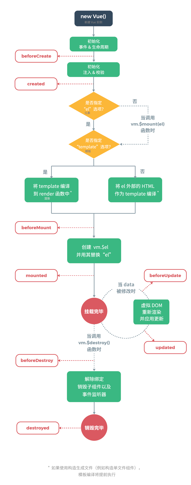

# 1.生命周期函数-组件创建期间的4个钩子函数

- 笔记本：03.Vue实例的生命周期
- 创建时间：2019-12-16 10:09:02 UTC
- 更新时间：2019-12-17 04:12:02 UTC
- 印象笔记 GUID：4c518132-0076-4268-a3d2-ed019308000c



```

<!DOCTYPE html>
<html lang="en">
<head>
    <meta charset="UTF-8">
    <meta name="viewport" content="width=device-width, initial-scale=1.0">
    <meta http-equiv="X-UA-Compatible" content="ie=edge">
    <title>Document</title>
    <script src="./lib/vue-2.4.0.js"></script>
</head>
<body>
   <div id="app">
       <input type="button" value="修改msg" @click="msg='no'">
        <h3 id="h3">{{ msg }}</h3>
   </div> 
   <script>
       var vm = new Vue({
           el: '#app',
           data: {
               msg: 'ok'
           },
           methods: { 
           },
           beforeCreate() {  // 这是遇到的第一个生命周期函数，表示实例完全被创建出来之前，会执行它
            // console.log(this.msg);
            // this.show();
            // 注意：在beforeCreate 生命周期函数执行的时候，data 和methods 中的数据都还没有被初始化
           },
           created() {      // 这是遇到的第二个生命周期函数
               // console.log(this.msg);
               // this.show();
               // 在created 中，data 和methods 都已经被初始化好了！
               // 如果要调用methods 中的方法或者操作data中的数据，最早，只能在created中操作
           },
           beforeMount() {  // 这是遇到的第三个生命周期函数，表示模板已经在内存中编辑晚生了，但是尚未把模板渲染到页面中
            // console.log(document.getElementById('h3').innerText);      // {{ msg }}
            // 在beforeMount 执行的时候，页面中的元素，还没有真正的替换过来，只是之前写的一些模板字符串
           },
           mounted() {      // 这是遇到的第四个生命周期函数，表示内存中的模板，已经真实的挂载到了页面中，用户已经可以看到渲染好的页面了ok
            console.log(document.getElementById('h3').innerText);       // ok
            // 注意：mounted 时实例创建期间的最后一个生命周期函数，当执行完mounted 就表示，实例已经被完全创建好了，此时，如果没有其他操作的话，这个实例就放在内存中不变了
           },
           //接下来时运行中的两个事件
           beforeUpdate() {     // 这时候，表示我们的界面还没有被更新，数据肯定被更新了
            console.log('beforeUpdate: 界面上的内容：' + document.getElementById('h3').innerText);
            console.log('beforeUpdate: data中的msg 数据是：' + this.msg);
            // 当执行beforeUpdate 时，页面中显示的数据还是旧的，此时data数据是最新的，页面尚未和数据保持同步
           },
           updated() {
            console.log('updated: 界面上的内容：' + document.getElementById('h3').innerText);
            console.log('updated: data中的msg 数据是：' + this.msg);
            // update 事件执行的时候，页面和data 数据已经保持同步了，都是最新的
           },
       });
   </script>
</body>
</html>

```

.png)

!%5Bb3251a15e5779fcfec925b78a149f5c8.png%5D(en-resource%3A%2F%2Fdatabase%2F696%3A1)%0A%60%60%60html%0A%3C!DOCTYPE%C2%A0html%3E%0A%3Chtml%C2%A0lang%3D%22en%22%3E%0A%3Chead%3E%0A%C2%A0%C2%A0%C2%A0%C2%A0%3Cmeta%C2%A0charset%3D%22UTF-8%22%3E%0A%C2%A0%C2%A0%C2%A0%C2%A0%3Cmeta%C2%A0name%3D%22viewport%22%C2%A0content%3D%22width%3Ddevice-width%2C%C2%A0initial-scale%3D1.0%22%3E%0A%C2%A0%C2%A0%C2%A0%C2%A0%3Cmeta%C2%A0http-equiv%3D%22X-UA-Compatible%22%C2%A0content%3D%22ie%3Dedge%22%3E%0A%C2%A0%C2%A0%C2%A0%C2%A0%3Ctitle%3EDocument%3C%2Ftitle%3E%0A%C2%A0%C2%A0%C2%A0%C2%A0%3Cscript%C2%A0src%3D%22.%2Flib%2Fvue-2.4.0.js%22%3E%3C%2Fscript%3E%0A%3C%2Fhead%3E%0A%3Cbody%3E%0A%C2%A0%C2%A0%C2%A0%3Cdiv%C2%A0id%3D%22app%22%3E%0A%C2%A0%C2%A0%C2%A0%C2%A0%C2%A0%C2%A0%C2%A0%3Cinput%C2%A0type%3D%22button%22%C2%A0value%3D%22%E4%BF%AE%E6%94%B9msg%22%C2%A0%40click%3D%22msg%3D'no'%22%3E%0A%C2%A0%C2%A0%C2%A0%C2%A0%C2%A0%C2%A0%C2%A0%C2%A0%3Ch3%C2%A0id%3D%22h3%22%3E%7B%7B%C2%A0msg%C2%A0%7D%7D%3C%2Fh3%3E%0A%C2%A0%C2%A0%C2%A0%3C%2Fdiv%3E%C2%A0%0A%C2%A0%C2%A0%C2%A0%3Cscript%3E%0A%C2%A0%C2%A0%C2%A0%C2%A0%C2%A0%C2%A0%C2%A0var%C2%A0vm%C2%A0%3D%C2%A0new%C2%A0Vue(%7B%0A%C2%A0%C2%A0%C2%A0%C2%A0%C2%A0%C2%A0%C2%A0%C2%A0%C2%A0%C2%A0%C2%A0el%3A%C2%A0'%23app'%2C%0A%C2%A0%C2%A0%C2%A0%C2%A0%C2%A0%C2%A0%C2%A0%C2%A0%C2%A0%C2%A0%C2%A0data%3A%C2%A0%7B%0A%C2%A0%C2%A0%C2%A0%C2%A0%C2%A0%C2%A0%C2%A0%C2%A0%C2%A0%C2%A0%C2%A0%C2%A0%C2%A0%C2%A0%C2%A0msg%3A%C2%A0'ok'%0A%C2%A0%C2%A0%C2%A0%C2%A0%C2%A0%C2%A0%C2%A0%C2%A0%C2%A0%C2%A0%C2%A0%7D%2C%0A%C2%A0%C2%A0%C2%A0%C2%A0%C2%A0%C2%A0%C2%A0%C2%A0%C2%A0%C2%A0%C2%A0methods%3A%C2%A0%7B%C2%A0%0A%C2%A0%C2%A0%C2%A0%C2%A0%C2%A0%C2%A0%C2%A0%C2%A0%C2%A0%C2%A0%C2%A0%7D%2C%0A%C2%A0%C2%A0%C2%A0%C2%A0%C2%A0%C2%A0%C2%A0%C2%A0%C2%A0%C2%A0%C2%A0beforeCreate()%C2%A0%7B%C2%A0%C2%A0%2F%2F%C2%A0%E8%BF%99%E6%98%AF%E9%81%87%E5%88%B0%E7%9A%84%E7%AC%AC%E4%B8%80%E4%B8%AA%E7%94%9F%E5%91%BD%E5%91%A8%E6%9C%9F%E5%87%BD%E6%95%B0%EF%BC%8C%E8%A1%A8%E7%A4%BA%E5%AE%9E%E4%BE%8B%E5%AE%8C%E5%85%A8%E8%A2%AB%E5%88%9B%E5%BB%BA%E5%87%BA%E6%9D%A5%E4%B9%8B%E5%89%8D%EF%BC%8C%E4%BC%9A%E6%89%A7%E8%A1%8C%E5%AE%83%0A%C2%A0%C2%A0%C2%A0%C2%A0%C2%A0%C2%A0%C2%A0%C2%A0%C2%A0%C2%A0%C2%A0%C2%A0%2F%2F%C2%A0console.log(this.msg)%3B%0A%C2%A0%C2%A0%C2%A0%C2%A0%C2%A0%C2%A0%C2%A0%C2%A0%C2%A0%C2%A0%C2%A0%C2%A0%2F%2F%C2%A0this.show()%3B%0A%C2%A0%C2%A0%C2%A0%C2%A0%C2%A0%C2%A0%C2%A0%C2%A0%C2%A0%C2%A0%C2%A0%C2%A0%2F%2F%C2%A0%E6%B3%A8%E6%84%8F%EF%BC%9A%E5%9C%A8beforeCreate%C2%A0%E7%94%9F%E5%91%BD%E5%91%A8%E6%9C%9F%E5%87%BD%E6%95%B0%E6%89%A7%E8%A1%8C%E7%9A%84%E6%97%B6%E5%80%99%EF%BC%8Cdata%C2%A0%E5%92%8Cmethods%C2%A0%E4%B8%AD%E7%9A%84%E6%95%B0%E6%8D%AE%E9%83%BD%E8%BF%98%E6%B2%A1%E6%9C%89%E8%A2%AB%E5%88%9D%E5%A7%8B%E5%8C%96%0A%C2%A0%C2%A0%C2%A0%C2%A0%C2%A0%C2%A0%C2%A0%C2%A0%C2%A0%C2%A0%C2%A0%7D%2C%0A%C2%A0%C2%A0%C2%A0%C2%A0%C2%A0%C2%A0%C2%A0%C2%A0%C2%A0%C2%A0%C2%A0created()%C2%A0%7B%C2%A0%C2%A0%C2%A0%C2%A0%C2%A0%C2%A0%2F%2F%C2%A0%E8%BF%99%E6%98%AF%E9%81%87%E5%88%B0%E7%9A%84%E7%AC%AC%E4%BA%8C%E4%B8%AA%E7%94%9F%E5%91%BD%E5%91%A8%E6%9C%9F%E5%87%BD%E6%95%B0%0A%C2%A0%C2%A0%C2%A0%C2%A0%C2%A0%C2%A0%C2%A0%C2%A0%C2%A0%C2%A0%C2%A0%C2%A0%C2%A0%C2%A0%C2%A0%2F%2F%C2%A0console.log(this.msg)%3B%0A%C2%A0%C2%A0%C2%A0%C2%A0%C2%A0%C2%A0%C2%A0%C2%A0%C2%A0%C2%A0%C2%A0%C2%A0%C2%A0%C2%A0%C2%A0%2F%2F%C2%A0this.show()%3B%0A%C2%A0%C2%A0%C2%A0%C2%A0%C2%A0%C2%A0%C2%A0%C2%A0%C2%A0%C2%A0%C2%A0%C2%A0%C2%A0%C2%A0%C2%A0%2F%2F%C2%A0%E5%9C%A8created%C2%A0%E4%B8%AD%EF%BC%8Cdata%C2%A0%E5%92%8Cmethods%C2%A0%E9%83%BD%E5%B7%B2%E7%BB%8F%E8%A2%AB%E5%88%9D%E5%A7%8B%E5%8C%96%E5%A5%BD%E4%BA%86%EF%BC%81%0A%C2%A0%C2%A0%C2%A0%C2%A0%C2%A0%C2%A0%C2%A0%C2%A0%C2%A0%C2%A0%C2%A0%C2%A0%C2%A0%C2%A0%C2%A0%2F%2F%C2%A0%E5%A6%82%E6%9E%9C%E8%A6%81%E8%B0%83%E7%94%A8methods%C2%A0%E4%B8%AD%E7%9A%84%E6%96%B9%E6%B3%95%E6%88%96%E8%80%85%E6%93%8D%E4%BD%9Cdata%E4%B8%AD%E7%9A%84%E6%95%B0%E6%8D%AE%EF%BC%8C%E6%9C%80%E6%97%A9%EF%BC%8C%E5%8F%AA%E8%83%BD%E5%9C%A8created%E4%B8%AD%E6%93%8D%E4%BD%9C%0A%C2%A0%C2%A0%C2%A0%C2%A0%C2%A0%C2%A0%C2%A0%C2%A0%C2%A0%C2%A0%C2%A0%7D%2C%0A%C2%A0%C2%A0%C2%A0%C2%A0%C2%A0%C2%A0%C2%A0%C2%A0%C2%A0%C2%A0%C2%A0beforeMount()%C2%A0%7B%C2%A0%C2%A0%2F%2F%C2%A0%E8%BF%99%E6%98%AF%E9%81%87%E5%88%B0%E7%9A%84%E7%AC%AC%E4%B8%89%E4%B8%AA%E7%94%9F%E5%91%BD%E5%91%A8%E6%9C%9F%E5%87%BD%E6%95%B0%EF%BC%8C%E8%A1%A8%E7%A4%BA%E6%A8%A1%E6%9D%BF%E5%B7%B2%E7%BB%8F%E5%9C%A8%E5%86%85%E5%AD%98%E4%B8%AD%E7%BC%96%E8%BE%91%E6%99%9A%E7%94%9F%E4%BA%86%EF%BC%8C%E4%BD%86%E6%98%AF%E5%B0%9A%E6%9C%AA%E6%8A%8A%E6%A8%A1%E6%9D%BF%E6%B8%B2%E6%9F%93%E5%88%B0%E9%A1%B5%E9%9D%A2%E4%B8%AD%0A%C2%A0%C2%A0%C2%A0%C2%A0%C2%A0%C2%A0%C2%A0%C2%A0%C2%A0%C2%A0%C2%A0%C2%A0%2F%2F%C2%A0console.log(document.getElementById('h3').innerText)%3B%C2%A0%C2%A0%C2%A0%C2%A0%C2%A0%C2%A0%2F%2F%C2%A0%7B%7B%C2%A0msg%C2%A0%7D%7D%0A%C2%A0%C2%A0%C2%A0%C2%A0%C2%A0%C2%A0%C2%A0%C2%A0%C2%A0%C2%A0%C2%A0%C2%A0%2F%2F%C2%A0%E5%9C%A8beforeMount%C2%A0%E6%89%A7%E8%A1%8C%E7%9A%84%E6%97%B6%E5%80%99%EF%BC%8C%E9%A1%B5%E9%9D%A2%E4%B8%AD%E7%9A%84%E5%85%83%E7%B4%A0%EF%BC%8C%E8%BF%98%E6%B2%A1%E6%9C%89%E7%9C%9F%E6%AD%A3%E7%9A%84%E6%9B%BF%E6%8D%A2%E8%BF%87%E6%9D%A5%EF%BC%8C%E5%8F%AA%E6%98%AF%E4%B9%8B%E5%89%8D%E5%86%99%E7%9A%84%E4%B8%80%E4%BA%9B%E6%A8%A1%E6%9D%BF%E5%AD%97%E7%AC%A6%E4%B8%B2%0A%C2%A0%C2%A0%C2%A0%C2%A0%C2%A0%C2%A0%C2%A0%C2%A0%C2%A0%C2%A0%C2%A0%7D%2C%0A%C2%A0%C2%A0%C2%A0%C2%A0%C2%A0%C2%A0%C2%A0%C2%A0%C2%A0%C2%A0%C2%A0mounted()%C2%A0%7B%C2%A0%C2%A0%C2%A0%C2%A0%C2%A0%C2%A0%2F%2F%C2%A0%E8%BF%99%E6%98%AF%E9%81%87%E5%88%B0%E7%9A%84%E7%AC%AC%E5%9B%9B%E4%B8%AA%E7%94%9F%E5%91%BD%E5%91%A8%E6%9C%9F%E5%87%BD%E6%95%B0%EF%BC%8C%E8%A1%A8%E7%A4%BA%E5%86%85%E5%AD%98%E4%B8%AD%E7%9A%84%E6%A8%A1%E6%9D%BF%EF%BC%8C%E5%B7%B2%E7%BB%8F%E7%9C%9F%E5%AE%9E%E7%9A%84%E6%8C%82%E8%BD%BD%E5%88%B0%E4%BA%86%E9%A1%B5%E9%9D%A2%E4%B8%AD%EF%BC%8C%E7%94%A8%E6%88%B7%E5%B7%B2%E7%BB%8F%E5%8F%AF%E4%BB%A5%E7%9C%8B%E5%88%B0%E6%B8%B2%E6%9F%93%E5%A5%BD%E7%9A%84%E9%A1%B5%E9%9D%A2%E4%BA%86ok%0A%C2%A0%C2%A0%C2%A0%C2%A0%C2%A0%C2%A0%C2%A0%C2%A0%C2%A0%C2%A0%C2%A0%C2%A0console.log(document.getElementById('h3').innerText)%3B%C2%A0%C2%A0%C2%A0%C2%A0%C2%A0%C2%A0%C2%A0%2F%2F%C2%A0ok%0A%C2%A0%C2%A0%C2%A0%C2%A0%C2%A0%C2%A0%C2%A0%C2%A0%C2%A0%C2%A0%C2%A0%C2%A0%2F%2F%C2%A0%E6%B3%A8%E6%84%8F%EF%BC%9Amounted%C2%A0%E6%97%B6%E5%AE%9E%E4%BE%8B%E5%88%9B%E5%BB%BA%E6%9C%9F%E9%97%B4%E7%9A%84%E6%9C%80%E5%90%8E%E4%B8%80%E4%B8%AA%E7%94%9F%E5%91%BD%E5%91%A8%E6%9C%9F%E5%87%BD%E6%95%B0%EF%BC%8C%E5%BD%93%E6%89%A7%E8%A1%8C%E5%AE%8Cmounted%C2%A0%E5%B0%B1%E8%A1%A8%E7%A4%BA%EF%BC%8C%E5%AE%9E%E4%BE%8B%E5%B7%B2%E7%BB%8F%E8%A2%AB%E5%AE%8C%E5%85%A8%E5%88%9B%E5%BB%BA%E5%A5%BD%E4%BA%86%EF%BC%8C%E6%AD%A4%E6%97%B6%EF%BC%8C%E5%A6%82%E6%9E%9C%E6%B2%A1%E6%9C%89%E5%85%B6%E4%BB%96%E6%93%8D%E4%BD%9C%E7%9A%84%E8%AF%9D%EF%BC%8C%E8%BF%99%E4%B8%AA%E5%AE%9E%E4%BE%8B%E5%B0%B1%E6%94%BE%E5%9C%A8%E5%86%85%E5%AD%98%E4%B8%AD%E4%B8%8D%E5%8F%98%E4%BA%86%0A%C2%A0%C2%A0%C2%A0%C2%A0%C2%A0%C2%A0%C2%A0%C2%A0%C2%A0%C2%A0%C2%A0%7D%2C%0A%C2%A0%C2%A0%C2%A0%C2%A0%C2%A0%C2%A0%C2%A0%C2%A0%C2%A0%C2%A0%C2%A0%2F%2F%E6%8E%A5%E4%B8%8B%E6%9D%A5%E6%97%B6%E8%BF%90%E8%A1%8C%E4%B8%AD%E7%9A%84%E4%B8%A4%E4%B8%AA%E4%BA%8B%E4%BB%B6%0A%C2%A0%C2%A0%C2%A0%C2%A0%C2%A0%C2%A0%C2%A0%C2%A0%C2%A0%C2%A0%C2%A0beforeUpdate()%C2%A0%7B%C2%A0%C2%A0%C2%A0%C2%A0%C2%A0%2F%2F%C2%A0%E8%BF%99%E6%97%B6%E5%80%99%EF%BC%8C%E8%A1%A8%E7%A4%BA%E6%88%91%E4%BB%AC%E7%9A%84%E7%95%8C%E9%9D%A2%E8%BF%98%E6%B2%A1%E6%9C%89%E8%A2%AB%E6%9B%B4%E6%96%B0%EF%BC%8C%E6%95%B0%E6%8D%AE%E8%82%AF%E5%AE%9A%E8%A2%AB%E6%9B%B4%E6%96%B0%E4%BA%86%0A%C2%A0%C2%A0%C2%A0%C2%A0%C2%A0%C2%A0%C2%A0%C2%A0%C2%A0%C2%A0%C2%A0%C2%A0console.log('beforeUpdate%3A%C2%A0%E7%95%8C%E9%9D%A2%E4%B8%8A%E7%9A%84%E5%86%85%E5%AE%B9%EF%BC%9A'%C2%A0%2B%C2%A0document.getElementById('h3').innerText)%3B%0A%C2%A0%C2%A0%C2%A0%C2%A0%C2%A0%C2%A0%C2%A0%C2%A0%C2%A0%C2%A0%C2%A0%C2%A0console.log('beforeUpdate%3A%C2%A0data%E4%B8%AD%E7%9A%84msg%C2%A0%E6%95%B0%E6%8D%AE%E6%98%AF%EF%BC%9A'%C2%A0%2B%C2%A0this.msg)%3B%0A%C2%A0%C2%A0%C2%A0%C2%A0%C2%A0%C2%A0%C2%A0%C2%A0%C2%A0%C2%A0%C2%A0%C2%A0%2F%2F%C2%A0%E5%BD%93%E6%89%A7%E8%A1%8CbeforeUpdate%C2%A0%E6%97%B6%EF%BC%8C%E9%A1%B5%E9%9D%A2%E4%B8%AD%E6%98%BE%E7%A4%BA%E7%9A%84%E6%95%B0%E6%8D%AE%E8%BF%98%E6%98%AF%E6%97%A7%E7%9A%84%EF%BC%8C%E6%AD%A4%E6%97%B6data%E6%95%B0%E6%8D%AE%E6%98%AF%E6%9C%80%E6%96%B0%E7%9A%84%EF%BC%8C%E9%A1%B5%E9%9D%A2%E5%B0%9A%E6%9C%AA%E5%92%8C%E6%95%B0%E6%8D%AE%E4%BF%9D%E6%8C%81%E5%90%8C%E6%AD%A5%0A%C2%A0%C2%A0%C2%A0%C2%A0%C2%A0%C2%A0%C2%A0%C2%A0%C2%A0%C2%A0%C2%A0%7D%2C%0A%C2%A0%C2%A0%C2%A0%C2%A0%C2%A0%C2%A0%C2%A0%C2%A0%C2%A0%C2%A0%C2%A0updated()%C2%A0%7B%0A%C2%A0%C2%A0%C2%A0%C2%A0%C2%A0%C2%A0%C2%A0%C2%A0%C2%A0%C2%A0%C2%A0%C2%A0console.log('updated%3A%C2%A0%E7%95%8C%E9%9D%A2%E4%B8%8A%E7%9A%84%E5%86%85%E5%AE%B9%EF%BC%9A'%C2%A0%2B%C2%A0document.getElementById('h3').innerText)%3B%0A%C2%A0%C2%A0%C2%A0%C2%A0%C2%A0%C2%A0%C2%A0%C2%A0%C2%A0%C2%A0%C2%A0%C2%A0console.log('updated%3A%C2%A0data%E4%B8%AD%E7%9A%84msg%C2%A0%E6%95%B0%E6%8D%AE%E6%98%AF%EF%BC%9A'%C2%A0%2B%C2%A0this.msg)%3B%0A%C2%A0%C2%A0%C2%A0%C2%A0%C2%A0%C2%A0%C2%A0%C2%A0%C2%A0%C2%A0%C2%A0%C2%A0%2F%2F%C2%A0update%C2%A0%E4%BA%8B%E4%BB%B6%E6%89%A7%E8%A1%8C%E7%9A%84%E6%97%B6%E5%80%99%EF%BC%8C%E9%A1%B5%E9%9D%A2%E5%92%8Cdata%C2%A0%E6%95%B0%E6%8D%AE%E5%B7%B2%E7%BB%8F%E4%BF%9D%E6%8C%81%E5%90%8C%E6%AD%A5%E4%BA%86%EF%BC%8C%E9%83%BD%E6%98%AF%E6%9C%80%E6%96%B0%E7%9A%84%0A%C2%A0%C2%A0%C2%A0%C2%A0%C2%A0%C2%A0%C2%A0%C2%A0%C2%A0%C2%A0%C2%A0%7D%2C%0A%C2%A0%C2%A0%C2%A0%C2%A0%C2%A0%C2%A0%C2%A0%7D)%3B%0A%C2%A0%C2%A0%C2%A0%3C%2Fscript%3E%0A%3C%2Fbody%3E%0A%3C%2Fhtml%3E%0A%60%60%60%0A%0A!%5B00bbcaf2d94b691d031097519835284f.png%5D(en-resource%3A%2F%2Fdatabase%2F698%3A1)%0A
