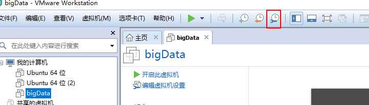

# 3.克隆虚拟机

- 笔记本：1.CentOS安装
- 创建时间：2019-11-26 06:07:19 UTC
- 更新时间：2019-11-26 06:11:24 UTC
- 印象笔记 GUID：530a5646-5d91-4b2c-a0db-09925de0ab75

在模板虚拟机上右键 -> 快照 -> 拍摄快照
 
 .png)

克隆出几台新的机器
 刚克隆出来的机器硬件地址和老的机器地址一样，但是当克隆出来的机器开机后硬件地址会自动更改。
 克隆出的4个系统
 分别命名为node0001,node0002,node0003,node0004
 ip分别修改为 192.168.231.31,32,33,34

```
vim /etc/sysconfig/network-scripts/ifcfg-eth0
service network restart

```

修改主机名

```
vim /etc/sysconfig/network
#修改
HOSTNAME=node0001
#重启生效

```

```
vim /etc/hosts
#添加：
192.168.231.31 node0001
192.168.231.32 node0002
192.168.231.33 node0003 192.168.231.34 node0004

```

%0A%E5%9C%A8%E6%A8%A1%E6%9D%BF%E8%99%9A%E6%8B%9F%E6%9C%BA%E4%B8%8A%E5%8F%B3%E9%94%AE%20-%3E%20%E5%BF%AB%E7%85%A7%20-%3E%20%E6%8B%8D%E6%91%84%E5%BF%AB%E7%85%A7%0A!%5B60444fcb586562f75c5b9da3a3eb0dcf.png%5D(en-resource%3A%2F%2Fdatabase%2F418%3A1)%0A!%5B843a72aeeb82f253d583eeeb59575840.png%5D(en-resource%3A%2F%2Fdatabase%2F420%3A0)%0A%0A%E5%85%8B%E9%9A%86%E5%87%BA%E5%87%A0%E5%8F%B0%E6%96%B0%E7%9A%84%E6%9C%BA%E5%99%A8%0A%E5%88%9A%E5%85%8B%E9%9A%86%E5%87%BA%E6%9D%A5%E7%9A%84%E6%9C%BA%E5%99%A8%E7%A1%AC%E4%BB%B6%E5%9C%B0%E5%9D%80%E5%92%8C%E8%80%81%E7%9A%84%E6%9C%BA%E5%99%A8%E5%9C%B0%E5%9D%80%E4%B8%80%E6%A0%B7%EF%BC%8C%E4%BD%86%E6%98%AF%E5%BD%93%E5%85%8B%E9%9A%86%E5%87%BA%E6%9D%A5%E7%9A%84%E6%9C%BA%E5%99%A8%E5%BC%80%E6%9C%BA%E5%90%8E%E7%A1%AC%E4%BB%B6%E5%9C%B0%E5%9D%80%E4%BC%9A%E8%87%AA%E5%8A%A8%E6%9B%B4%E6%94%B9%E3%80%82%0A%E5%85%8B%E9%9A%86%E5%87%BA%E7%9A%844%E4%B8%AA%E7%B3%BB%E7%BB%9F%0A%26nbsp%3B%26nbsp%3B%20%E5%88%86%E5%88%AB%E5%91%BD%E5%90%8D%E4%B8%BAnode0001%2Cnode0002%2Cnode0003%2Cnode0004%0A%26nbsp%3B%26nbsp%3B%20ip%E5%88%86%E5%88%AB%E4%BF%AE%E6%94%B9%E4%B8%BA%20192.168.231.31%2C32%2C33%2C34%0A%60%60%60shell%0Avim%20%2Fetc%2Fsysconfig%2Fnetwork-scripts%2Fifcfg-eth0%20%0Aservice%20network%20restart%0A%60%60%60%0A%0A%0A%E4%BF%AE%E6%94%B9%E4%B8%BB%E6%9C%BA%E5%90%8D%0A%60%60%60shell%0Avim%20%2Fetc%2Fsysconfig%2Fnetwork%20%0A%23%E4%BF%AE%E6%94%B9%20%0AHOSTNAME%3Dnode0001%20%0A%23%E9%87%8D%E5%90%AF%E7%94%9F%E6%95%88%0A%60%60%60%0A%60%60%60shell%0Avim%20%2Fetc%2Fhosts%20%0A%23%E6%B7%BB%E5%8A%A0%EF%BC%9A%20%0A192.168.231.31%20node0001%20%0A192.168.231.32%20node0002%20%0A192.168.231.33%20node0003%20%0A192.168.231.34%20node0004%0A%60%60%60
