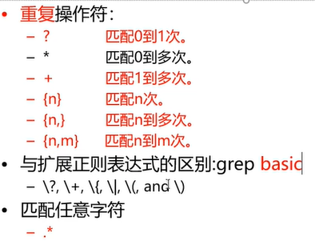
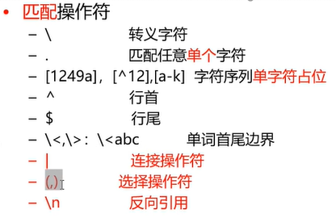

# 2.linux-grep-regx-cut-sort-wc

- 笔记本：2.Linux常用命令
- 创建时间：2019-11-26 06:27:48 UTC
- 更新时间：2019-11-26 06:41:21 UTC
- 印象笔记 GUID：c199288d-9583-4ec0-a302-90ef827d240c

**grep：显示匹配行**
 - v：反显示
 - e：使用扩展正则表达式

```
grep liudezhi a.txt
#grep 要查找的内容 文件名
grep -v liudezhi a.txt
#输出不包含“liduezhi"的

```

```
ls -l ./a*              # *统配n个字符
ls -l ./a?              # ?通配0/1个字符
ls -l ./a??

```

**正则表达式**
 匹配操作符：
 - \ 转义字符 #基本
 - . 匹配任意单个字符 #基本
 - [1249a], [^12],[a-k] 字符序列单字符占位 # ^取反的意思 #基本
 - ^ 行首 #基本
 - $ 行尾 #基本
 - <,>:
 - | 连接操作符
 - (,) 选择操作符
 - \n 反向引用

 重复操作符：
 - ? 匹配0到1次
 - * 匹配0到多次 #基本
 - + 匹配1到多次
 - {n} 匹配n次
 - {n,} 匹配n到多次
 - {n,m} 匹配n到m次
 #匹配任意字符
 - .*
 #grep模式只能用基本正则表达式，若要使用扩展正则表达式，需要在其前面加\让grep对这些表达式敏感
 #也可以grep -E，让grep工作在扩展正则表达式上


 

```
grep "ooxx"
grep.txt grep "\" grep.txt              #查询带ooxx单词的行
grep "^ooxx" grep.txt                   #查询以ooxx开头的行
grep "^^ooxx\>" grep.txt            #查询以ooxx单词开头的行
grep "[0-9]" grep.txt                     #查找包含数字的行
grep "[4-8]" grep.txt                     #查询包含4-8的数字的行
grep "ooxx.*ooxx" grep.txt
grep "\(oo\)\(xx\).*\1\2" grep.txt #与上面等价，\1代表第一个小括号的内容

```

**扩展：** 匹配手机号 ip地址 邮箱

**cut:** 显示切割的行数据

- f: 选择显示的列

- s: 不显示没有分隔符的行

- d: 自定义分隔符 *

*eg:*

```
cut -d ' ' -f1 grep.txt
#不能被切分的行，每次都会出现
#eg:cut -d ' ' -f2 grep.txt，没有空格的行也会出现(可以称为脏数据)
cut -s -d ' ' -f2 grep.txt
# -s可以隐藏脏数据
cut -s -d ' ' -f1,3 grep.txt
#可以显示多个列
cut -s -d ' ' -f1-3 grep.txt
#也可以显示一个区间里的所有列

```

**sort:** 排序文件的行（默认按照字典序来比较[从左向右逐个字符比较]）

- n: 按数值排序

- r: 倒序

- t: 自定义分隔符 *

- k: 选择排序列 *

- u: 合并像同行

- f: 忽略大小写

*eg:*

```
sort.txt
--------------
banana 12
apple 1
orange 8

```

```
sort sort.txt
sort -t' ' -k2 sort.txt               #根据第二列排序(按字典序排)
sort -t' ' -k2 -n sort.txt          #根据第二列排序(按数值序排)
sort -t' ' -k2 -nr sort.txt         #倒序

```

**wc**

```
wc -l sort.txt
cat sort.txt | wc -l
ls -l /etc | wc -l

```

%0A**grep%EF%BC%9A%E6%98%BE%E7%A4%BA%E5%8C%B9%E9%85%8D%E8%A1%8C**%0A%26nbsp%3B%26nbsp%3B%26nbsp%3B%20%5C-%20v%EF%BC%9A%E5%8F%8D%E6%98%BE%E7%A4%BA%0A%26nbsp%3B%26nbsp%3B%26nbsp%3B%20%5C-%20e%EF%BC%9A%E4%BD%BF%E7%94%A8%E6%89%A9%E5%B1%95%E6%AD%A3%E5%88%99%E8%A1%A8%E8%BE%BE%E5%BC%8F%0A%0A%60%60%60shell%0Agrep%20liudezhi%20a.txt%20%0A%23grep%20%E8%A6%81%E6%9F%A5%E6%89%BE%E7%9A%84%E5%86%85%E5%AE%B9%20%E6%96%87%E4%BB%B6%E5%90%8D%20%0Agrep%20-v%20liudezhi%20a.txt%20%0A%23%E8%BE%93%E5%87%BA%E4%B8%8D%E5%8C%85%E5%90%AB%E2%80%9Cliduezhi%22%E7%9A%84%0A%60%60%60%0A%0A%60%60%60shell%0Als%20-l%20.%2Fa*%20%20%20%20%20%20%20%20%20%20%20%20%20%20%23%20*%E7%BB%9F%E9%85%8Dn%E4%B8%AA%E5%AD%97%E7%AC%A6%20%0Als%20-l%20.%2Fa%3F%20%20%20%20%20%20%20%20%20%20%20%20%20%20%23%20%3F%E9%80%9A%E9%85%8D0%2F1%E4%B8%AA%E5%AD%97%E7%AC%A6%20%0Als%20-l%20.%2Fa%3F%3F%0A%60%60%60%0A%0A%0A**%E6%AD%A3%E5%88%99%E8%A1%A8%E8%BE%BE%E5%BC%8F**%0A%26nbsp%3B%26nbsp%3B%20%E5%8C%B9%E9%85%8D%E6%93%8D%E4%BD%9C%E7%AC%A6%EF%BC%9A%0A%26nbsp%3B%26nbsp%3B%26nbsp%3B%26nbsp%3B%26nbsp%3B%20-%20%5C%20%E8%BD%AC%E4%B9%89%E5%AD%97%E7%AC%A6%20%23%E5%9F%BA%E6%9C%AC%0A%26nbsp%3B%26nbsp%3B%26nbsp%3B%26nbsp%3B%26nbsp%3B%20-%20.%20%E5%8C%B9%E9%85%8D%E4%BB%BB%E6%84%8F%E5%8D%95%E4%B8%AA%E5%AD%97%E7%AC%A6%20%23%E5%9F%BA%E6%9C%AC%0A%26nbsp%3B%26nbsp%3B%26nbsp%3B%26nbsp%3B%26nbsp%3B%20-%20%5B1249a%5D%2C%20%5B%5E12%5D%2C%5Ba-k%5D%20%E5%AD%97%E7%AC%A6%E5%BA%8F%E5%88%97%E5%8D%95%E5%AD%97%E7%AC%A6%E5%8D%A0%E4%BD%8D%20%23%20%5E%E5%8F%96%E5%8F%8D%E7%9A%84%E6%84%8F%E6%80%9D%20%23%E5%9F%BA%E6%9C%AC%0A%26nbsp%3B%26nbsp%3B%26nbsp%3B%26nbsp%3B%26nbsp%3B%20-%20%5E%20%E8%A1%8C%E9%A6%96%20%23%E5%9F%BA%E6%9C%AC%0A%26nbsp%3B%26nbsp%3B%26nbsp%3B%26nbsp%3B%26nbsp%3B%20-%20%24%20%E8%A1%8C%E5%B0%BE%20%23%E5%9F%BA%E6%9C%AC%0A%26nbsp%3B%26nbsp%3B%26nbsp%3B%26nbsp%3B%26nbsp%3B%20-%20%5C%3C%2C%5C%3E%3A%20%5C%0A%26nbsp%3B%26nbsp%3B%26nbsp%3B%26nbsp%3B%26nbsp%3B%20-%20%7C%20%E8%BF%9E%E6%8E%A5%E6%93%8D%E4%BD%9C%E7%AC%A6%0A%26nbsp%3B%26nbsp%3B%26nbsp%3B%26nbsp%3B%26nbsp%3B%20-%20(%2C)%20%E9%80%89%E6%8B%A9%E6%93%8D%E4%BD%9C%E7%AC%A6%0A%26nbsp%3B%26nbsp%3B%26nbsp%3B%26nbsp%3B%26nbsp%3B%20-%20%5Cn%20%E5%8F%8D%E5%90%91%E5%BC%95%E7%94%A8%0A%0A%26nbsp%3B%26nbsp%3B%20%E9%87%8D%E5%A4%8D%E6%93%8D%E4%BD%9C%E7%AC%A6%EF%BC%9A%0A%26nbsp%3B%26nbsp%3B%26nbsp%3B%26nbsp%3B%26nbsp%3B%20-%20%3F%20%E5%8C%B9%E9%85%8D0%E5%88%B01%E6%AC%A1%0A%26nbsp%3B%26nbsp%3B%26nbsp%3B%26nbsp%3B%26nbsp%3B%20-%20*%20%E5%8C%B9%E9%85%8D0%E5%88%B0%E5%A4%9A%E6%AC%A1%20%23%E5%9F%BA%E6%9C%AC%0A%26nbsp%3B%26nbsp%3B%26nbsp%3B%26nbsp%3B%26nbsp%3B%20-%20%2B%20%E5%8C%B9%E9%85%8D1%E5%88%B0%E5%A4%9A%E6%AC%A1%0A%26nbsp%3B%26nbsp%3B%26nbsp%3B%26nbsp%3B%26nbsp%3B%20-%20%7Bn%7D%20%E5%8C%B9%E9%85%8Dn%E6%AC%A1%0A%26nbsp%3B%26nbsp%3B%26nbsp%3B%26nbsp%3B%26nbsp%3B%20-%20%7Bn%2C%7D%20%E5%8C%B9%E9%85%8Dn%E5%88%B0%E5%A4%9A%E6%AC%A1%0A%26nbsp%3B%26nbsp%3B%26nbsp%3B%26nbsp%3B%26nbsp%3B%20-%20%7Bn%2Cm%7D%20%E5%8C%B9%E9%85%8Dn%E5%88%B0m%E6%AC%A1%0A%26nbsp%3B%26nbsp%3B%26nbsp%3B%26nbsp%3B%26nbsp%3B%20%23%E5%8C%B9%E9%85%8D%E4%BB%BB%E6%84%8F%E5%AD%97%E7%AC%A6%0A%26nbsp%3B%26nbsp%3B%26nbsp%3B%26nbsp%3B%26nbsp%3B%20-%20.*%0A%26nbsp%3B%26nbsp%3B%26nbsp%3B%26nbsp%3B%26nbsp%3B%20%23grep%E6%A8%A1%E5%BC%8F%E5%8F%AA%E8%83%BD%E7%94%A8%E5%9F%BA%E6%9C%AC%E6%AD%A3%E5%88%99%E8%A1%A8%E8%BE%BE%E5%BC%8F%EF%BC%8C%E8%8B%A5%E8%A6%81%E4%BD%BF%E7%94%A8%E6%89%A9%E5%B1%95%E6%AD%A3%E5%88%99%E8%A1%A8%E8%BE%BE%E5%BC%8F%EF%BC%8C%E9%9C%80%E8%A6%81%E5%9C%A8%E5%85%B6%E5%89%8D%E9%9D%A2%E5%8A%A0%5C%E8%AE%A9grep%E5%AF%B9%E8%BF%99%E4%BA%9B%E8%A1%A8%E8%BE%BE%E5%BC%8F%E6%95%8F%E6%84%9F%0A%26nbsp%3B%26nbsp%3B%26nbsp%3B%26nbsp%3B%26nbsp%3B%20%23%E4%B9%9F%E5%8F%AF%E4%BB%A5grep%20-E%EF%BC%8C%E8%AE%A9grep%E5%B7%A5%E4%BD%9C%E5%9C%A8%E6%89%A9%E5%B1%95%E6%AD%A3%E5%88%99%E8%A1%A8%E8%BE%BE%E5%BC%8F%E4%B8%8A%0A%0A!%5B6bad1cf9d74225a2be147a27167c38b3.png%5D(en-resource%3A%2F%2Fdatabase%2F426%3A0)%0A!%5B5708f08b0668078167f2d52d482cf32d.png%5D(en-resource%3A%2F%2Fdatabase%2F428%3A0)%0A%0A%0A%60%60%60shell%0Agrep%20%22ooxx%22%20%0Agrep.txt%20grep%20%22%5C%22%20grep.txt%20%20%20%20%20%20%20%20%20%20%20%20%20%20%23%E6%9F%A5%E8%AF%A2%E5%B8%A6ooxx%E5%8D%95%E8%AF%8D%E7%9A%84%E8%A1%8C%20%0Agrep%20%22%5Eooxx%22%20grep.txt%20%20%20%20%20%20%20%20%20%20%20%20%20%20%20%20%20%20%20%23%E6%9F%A5%E8%AF%A2%E4%BB%A5ooxx%E5%BC%80%E5%A4%B4%E7%9A%84%E8%A1%8C%20%0Agrep%20%22%5E%5Eooxx%5C%3E%22%20grep.txt%20%20%20%20%20%20%20%20%20%20%20%20%23%E6%9F%A5%E8%AF%A2%E4%BB%A5ooxx%E5%8D%95%E8%AF%8D%E5%BC%80%E5%A4%B4%E7%9A%84%E8%A1%8C%20%0Agrep%20%22%5B0-9%5D%22%20grep.txt%20%20%20%20%20%20%20%20%20%20%20%20%20%20%20%20%20%20%20%20%20%23%E6%9F%A5%E6%89%BE%E5%8C%85%E5%90%AB%E6%95%B0%E5%AD%97%E7%9A%84%E8%A1%8C%20%0Agrep%20%22%5B4-8%5D%22%20grep.txt%20%20%20%20%20%20%20%20%20%20%20%20%20%20%20%20%20%20%20%20%20%23%E6%9F%A5%E8%AF%A2%E5%8C%85%E5%90%AB4-8%E7%9A%84%E6%95%B0%E5%AD%97%E7%9A%84%E8%A1%8C%20%0Agrep%20%22ooxx.*ooxx%22%20grep.txt%20%0Agrep%20%22%5C(oo%5C)%5C(xx%5C).*%5C1%5C2%22%20grep.txt%20%23%E4%B8%8E%E4%B8%8A%E9%9D%A2%E7%AD%89%E4%BB%B7%EF%BC%8C%5C1%E4%BB%A3%E8%A1%A8%E7%AC%AC%E4%B8%80%E4%B8%AA%E5%B0%8F%E6%8B%AC%E5%8F%B7%E7%9A%84%E5%86%85%E5%AE%B9%0A%60%60%60%0A%0A%0A**%E6%89%A9%E5%B1%95%EF%BC%9A**%20%E5%8C%B9%E9%85%8D%E6%89%8B%E6%9C%BA%E5%8F%B7%20ip%E5%9C%B0%E5%9D%80%20%E9%82%AE%E7%AE%B1%0A%0A**cut%3A**%20%E6%98%BE%E7%A4%BA%E5%88%87%E5%89%B2%E7%9A%84%E8%A1%8C%E6%95%B0%E6%8D%AE%0A-%20f%3A%20%E9%80%89%E6%8B%A9%E6%98%BE%E7%A4%BA%E7%9A%84%E5%88%97%0A-%20s%3A%20%E4%B8%8D%E6%98%BE%E7%A4%BA%E6%B2%A1%E6%9C%89%E5%88%86%E9%9A%94%E7%AC%A6%E7%9A%84%E8%A1%8C%0A-%20d%3A%20%E8%87%AA%E5%AE%9A%E4%B9%89%E5%88%86%E9%9A%94%E7%AC%A6%20*%0A%0A*eg%3A*%0A%60%60%60shell%0Acut%20-d%20'%20'%20-f1%20grep.txt%20%0A%23%E4%B8%8D%E8%83%BD%E8%A2%AB%E5%88%87%E5%88%86%E7%9A%84%E8%A1%8C%EF%BC%8C%E6%AF%8F%E6%AC%A1%E9%83%BD%E4%BC%9A%E5%87%BA%E7%8E%B0%20%0A%23eg%3Acut%20-d%20'%20'%20-f2%20grep.txt%EF%BC%8C%E6%B2%A1%E6%9C%89%E7%A9%BA%E6%A0%BC%E7%9A%84%E8%A1%8C%E4%B9%9F%E4%BC%9A%E5%87%BA%E7%8E%B0(%E5%8F%AF%E4%BB%A5%E7%A7%B0%E4%B8%BA%E8%84%8F%E6%95%B0%E6%8D%AE)%20%0Acut%20-s%20-d%20'%20'%20-f2%20grep.txt%20%0A%23%20-s%E5%8F%AF%E4%BB%A5%E9%9A%90%E8%97%8F%E8%84%8F%E6%95%B0%E6%8D%AE%20%0Acut%20-s%20-d%20'%20'%20-f1%2C3%20grep.txt%20%0A%23%E5%8F%AF%E4%BB%A5%E6%98%BE%E7%A4%BA%E5%A4%9A%E4%B8%AA%E5%88%97%20%0Acut%20-s%20-d%20'%20'%20-f1-3%20grep.txt%20%0A%23%E4%B9%9F%E5%8F%AF%E4%BB%A5%E6%98%BE%E7%A4%BA%E4%B8%80%E4%B8%AA%E5%8C%BA%E9%97%B4%E9%87%8C%E7%9A%84%E6%89%80%E6%9C%89%E5%88%97%0A%60%60%60%0A%0A**sort%3A**%20%E6%8E%92%E5%BA%8F%E6%96%87%E4%BB%B6%E7%9A%84%E8%A1%8C%EF%BC%88%E9%BB%98%E8%AE%A4%E6%8C%89%E7%85%A7%E5%AD%97%E5%85%B8%E5%BA%8F%E6%9D%A5%E6%AF%94%E8%BE%83%5B%E4%BB%8E%E5%B7%A6%E5%90%91%E5%8F%B3%E9%80%90%E4%B8%AA%E5%AD%97%E7%AC%A6%E6%AF%94%E8%BE%83%5D%EF%BC%89%0A-%20n%3A%20%E6%8C%89%E6%95%B0%E5%80%BC%E6%8E%92%E5%BA%8F%0A-%20r%3A%20%E5%80%92%E5%BA%8F%0A-%20t%3A%20%E8%87%AA%E5%AE%9A%E4%B9%89%E5%88%86%E9%9A%94%E7%AC%A6%20*%0A-%20k%3A%20%E9%80%89%E6%8B%A9%E6%8E%92%E5%BA%8F%E5%88%97%20*%0A-%20u%3A%20%E5%90%88%E5%B9%B6%E5%83%8F%E5%90%8C%E8%A1%8C%0A-%20f%3A%20%E5%BF%BD%E7%95%A5%E5%A4%A7%E5%B0%8F%E5%86%99%0A%0A*eg%3A*%0A%60%60%60shell%0Asort.txt%20%0A--------------%20%0Abanana%2012%20%0Aapple%201%20%0Aorange%208%0A%60%60%60%0A%0A%60%60%60shell%0Asort%20sort.txt%20%0Asort%20-t'%20'%20-k2%20sort.txt%20%20%20%20%20%20%20%20%20%20%20%20%20%20%20%23%E6%A0%B9%E6%8D%AE%E7%AC%AC%E4%BA%8C%E5%88%97%E6%8E%92%E5%BA%8F(%E6%8C%89%E5%AD%97%E5%85%B8%E5%BA%8F%E6%8E%92)%20%0Asort%20-t'%20'%20-k2%20-n%20sort.txt%20%20%20%20%20%20%20%20%20%20%23%E6%A0%B9%E6%8D%AE%E7%AC%AC%E4%BA%8C%E5%88%97%E6%8E%92%E5%BA%8F(%E6%8C%89%E6%95%B0%E5%80%BC%E5%BA%8F%E6%8E%92)%20%0Asort%20-t'%20'%20-k2%20-nr%20sort.txt%20%20%20%20%20%20%20%20%20%23%E5%80%92%E5%BA%8F%0A%60%60%60%0A%0A**wc**%0A%60%60%60shell%0Awc%20-l%20sort.txt%20%0Acat%20sort.txt%20%7C%20wc%20-l%20%0Als%20-l%20%2Fetc%20%7C%20wc%20-l%0A%60%60%60%0A
