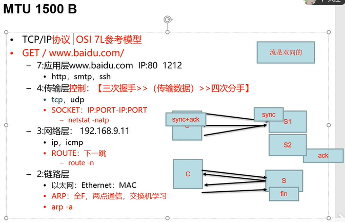
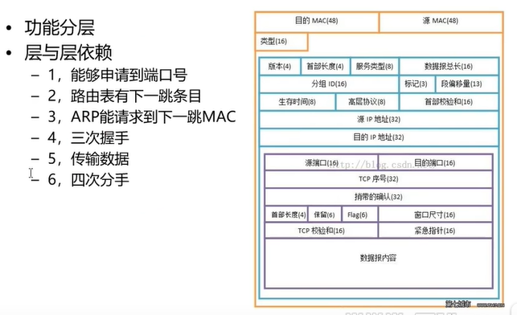
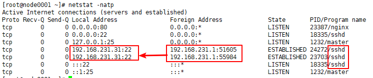
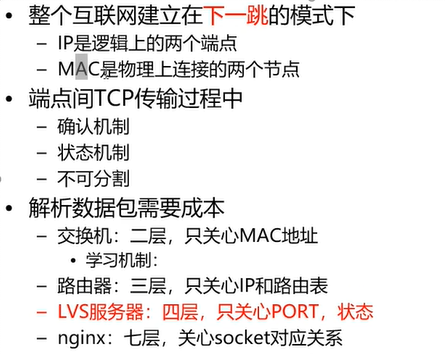

# 1.网络介绍

- 笔记本：3.高并发负载均衡
- 创建时间：2019-11-26 07:42:25 UTC
- 更新时间：2019-11-27 03:04:56 UTC
- 印象笔记 GUID：100bde70-7202-4626-9109-e2e982f4c765

**SAP HANA**

-
上网用户基数：高并发<br/>

-
互联网时代：服务<br/>
 - 一台服务器解决不了<br/>

-
大数据<br/>
 - 高并发>日志>分析行为>画像>推荐>服务<br/>
 - 四层：lvs 快：应付更大的流量<br/>
 - 七层：nginx: 慢于四层：看得懂客户端请求的资源<br/>
 

-
应用层7 nginx 软件

-
表示层6

-
会话层5

-
传输层4 lvs内核

-
网络层3

-
链路层2

-
物理层1



一个主机可以有65535个端口号

```
netstat -natp
# -n: 不进行转换，全以ip地址展示
# -a: 所有的
# -t: 只显示tcp协议的
# -p: 显示进程id号
# 可以查看哪些ip的哪个端口号连接了本机的哪些服务

```



```
route -n
Destination     Gateway         Genmask         Flags Metric Ref    Use Iface
192.168.231.0   0.0.0.0         255.255.255.0   U     0      0        0 eth0
169.254.0.0     0.0.0.0         255.255.0.0     U     1002   0        0 eth0
0.0.0.0         192.168.231.2   0.0.0.0         UG    0      0        0 eth0
# 路由表

```

**互联网的数据包传输方式是基于下一跳的方式，不是基于完整路径规划的方式。**

```
ping www.baidu.com
# 首先经过DNS解析，得到ip地址 119.75.217.26
# ip与路由表中的掩码(Genmask)做与运算
# 前两个与运算后得到的网络号都不同，然后与0.0.0.0掩码与运算，得到0.0.0.0与最后一条相同，然后就得到了下一跳地址 192.168.231.2 即网关地址
# 所以网关也叫下一跳
# 0.0.0.0         192.168.231.2   0.0.0.0         UG    0      0        0 eth0
# 无论任何目标地址来后都可以与这条目，绝对可以匹配上，所以这个条目叫做默认网关
# 下一跳网关一定是同局域网的
# 比如在家里使用，路由器就是默认网关

```

```
arp -a
? (192.168.231.2) at 00:50:56:e1:82:26 [ether] on eth0
? (192.168.231.1) at 00:50:56:c0:00:08 [ether] on eth0
# 链路层，记录ip对应的mac地址
# 在网络层确定下一跳ip后，再找链路层拿到下一跳的mac地址
# 开机时arp是空的
# 牵扯到arp协议
# 会先发本机mac地址和要连接的机器ip及全F地址，交换机会广播这个数据包，非目标机器收到后会丢弃数据博爱，目标机器收到后会回复mac地址
# 交换机内部也有一张mac地址和端口映射的表，可以减少广播，进行转发

```



**SAP%20HANA**%0A-%20%E4%B8%8A%E7%BD%91%E7%94%A8%E6%88%B7%E5%9F%BA%E6%95%B0%EF%BC%9A%E9%AB%98%E5%B9%B6%E5%8F%91%3Cbr%2F%3E%0A-%20%E4%BA%92%E8%81%94%E7%BD%91%E6%97%B6%E4%BB%A3%EF%BC%9A%E6%9C%8D%E5%8A%A1%3Cbr%2F%3E%0A%20%26nbsp%3B%26nbsp%3B%26nbsp%3B%20%5C-%20%E4%B8%80%E5%8F%B0%E6%9C%8D%E5%8A%A1%E5%99%A8%E8%A7%A3%E5%86%B3%E4%B8%8D%E4%BA%86%3Cbr%2F%3E%0A-%20%E5%A4%A7%E6%95%B0%E6%8D%AE%3Cbr%2F%3E%0A%20%20%20%20%26nbsp%3B%26nbsp%3B%26nbsp%3B%20%5C-%20%E9%AB%98%E5%B9%B6%E5%8F%91%3E%E6%97%A5%E5%BF%97%3E%E5%88%86%E6%9E%90%E8%A1%8C%E4%B8%BA%3E%E7%94%BB%E5%83%8F%3E%E6%8E%A8%E8%8D%90%3E%E6%9C%8D%E5%8A%A1%3Cbr%2F%3E%0A%20%20%20%20%26nbsp%3B%26nbsp%3B%26nbsp%3B%20%5C-%20%E5%9B%9B%E5%B1%82%EF%BC%9Alvs%20%E5%BF%AB%EF%BC%9A%E5%BA%94%E4%BB%98%E6%9B%B4%E5%A4%A7%E7%9A%84%E6%B5%81%E9%87%8F%3Cbr%2F%3E%0A%20%20%20%20%26nbsp%3B%26nbsp%3B%26nbsp%3B%20%5C-%20%E4%B8%83%E5%B1%82%EF%BC%9Anginx%3A%20%E6%85%A2%E4%BA%8E%E5%9B%9B%E5%B1%82%EF%BC%9A%E7%9C%8B%E5%BE%97%E6%87%82%E5%AE%A2%E6%88%B7%E7%AB%AF%E8%AF%B7%E6%B1%82%E7%9A%84%E8%B5%84%E6%BA%90%3Cbr%2F%3E%0A!%5B6d8cbec595a198674387142f5c53dc3d.png%5D(en-resource%3A%2F%2Fdatabase%2F446%3A1)%0A%0A-%20%E5%BA%94%E7%94%A8%E5%B1%827%20nginx%20%E8%BD%AF%E4%BB%B6%0A-%20%E8%A1%A8%E7%A4%BA%E5%B1%826%0A-%20%E4%BC%9A%E8%AF%9D%E5%B1%825%0A-%20%E4%BC%A0%E8%BE%93%E5%B1%824%20lvs%E5%86%85%E6%A0%B8%0A-%20%E7%BD%91%E7%BB%9C%E5%B1%823%0A-%20%E9%93%BE%E8%B7%AF%E5%B1%822%0A-%20%E7%89%A9%E7%90%86%E5%B1%821%0A%0A!%5B254a23a18bcbc22e6ad8323575fcf4dc.png%5D(en-resource%3A%2F%2Fdatabase%2F448%3A1)%0A%0A%E4%B8%80%E4%B8%AA%E4%B8%BB%E6%9C%BA%E5%8F%AF%E4%BB%A5%E6%9C%8965535%E4%B8%AA%E7%AB%AF%E5%8F%A3%E5%8F%B7%0A%0A%60%60%60shell%0Anetstat%20-natp%0A%23%20-n%3A%20%E4%B8%8D%E8%BF%9B%E8%A1%8C%E8%BD%AC%E6%8D%A2%EF%BC%8C%E5%85%A8%E4%BB%A5ip%E5%9C%B0%E5%9D%80%E5%B1%95%E7%A4%BA%0A%23%20-a%3A%20%E6%89%80%E6%9C%89%E7%9A%84%0A%23%20-t%3A%20%E5%8F%AA%E6%98%BE%E7%A4%BAtcp%E5%8D%8F%E8%AE%AE%E7%9A%84%0A%23%20-p%3A%20%E6%98%BE%E7%A4%BA%E8%BF%9B%E7%A8%8Bid%E5%8F%B7%0A%23%20%E5%8F%AF%E4%BB%A5%E6%9F%A5%E7%9C%8B%E5%93%AA%E4%BA%9Bip%E7%9A%84%E5%93%AA%E4%B8%AA%E7%AB%AF%E5%8F%A3%E5%8F%B7%E8%BF%9E%E6%8E%A5%E4%BA%86%E6%9C%AC%E6%9C%BA%E7%9A%84%E5%93%AA%E4%BA%9B%E6%9C%8D%E5%8A%A1%0A%60%60%60%0A!%5B58112d71fe308394f2a2693ae3e5d1ed.png%5D(en-resource%3A%2F%2Fdatabase%2F452%3A1)%0A%0A%60%60%60shell%0Aroute%20-n%0ADestination%20%20%20%20%20Gateway%20%20%20%20%20%20%20%20%20Genmask%20%20%20%20%20%20%20%20%20Flags%20Metric%20Ref%20%20%20%20Use%20Iface%0A192.168.231.0%20%20%200.0.0.0%20%20%20%20%20%20%20%20%20255.255.255.0%20%20%20U%20%20%20%20%200%20%20%20%20%20%200%20%20%20%20%20%20%20%200%20eth0%0A169.254.0.0%20%20%20%20%200.0.0.0%20%20%20%20%20%20%20%20%20255.255.0.0%20%20%20%20%20U%20%20%20%20%201002%20%20%200%20%20%20%20%20%20%20%200%20eth0%0A0.0.0.0%20%20%20%20%20%20%20%20%20192.168.231.2%20%20%200.0.0.0%20%20%20%20%20%20%20%20%20UG%20%20%20%200%20%20%20%20%20%200%20%20%20%20%20%20%20%200%20eth0%0A%23%20%E8%B7%AF%E7%94%B1%E8%A1%A8%0A%60%60%60%0A**%E4%BA%92%E8%81%94%E7%BD%91%E7%9A%84%E6%95%B0%E6%8D%AE%E5%8C%85%E4%BC%A0%E8%BE%93%E6%96%B9%E5%BC%8F%E6%98%AF%E5%9F%BA%E4%BA%8E%E4%B8%8B%E4%B8%80%E8%B7%B3%E7%9A%84%E6%96%B9%E5%BC%8F%EF%BC%8C%E4%B8%8D%E6%98%AF%E5%9F%BA%E4%BA%8E%E5%AE%8C%E6%95%B4%E8%B7%AF%E5%BE%84%E8%A7%84%E5%88%92%E7%9A%84%E6%96%B9%E5%BC%8F%E3%80%82**%0A%60%60%60shell%0Aping%20www.baidu.com%0A%23%20%E9%A6%96%E5%85%88%E7%BB%8F%E8%BF%87DNS%E8%A7%A3%E6%9E%90%EF%BC%8C%E5%BE%97%E5%88%B0ip%E5%9C%B0%E5%9D%80%20119.75.217.26%0A%23%20ip%E4%B8%8E%E8%B7%AF%E7%94%B1%E8%A1%A8%E4%B8%AD%E7%9A%84%E6%8E%A9%E7%A0%81(Genmask)%E5%81%9A%E4%B8%8E%E8%BF%90%E7%AE%97%0A%23%20%E5%89%8D%E4%B8%A4%E4%B8%AA%E4%B8%8E%E8%BF%90%E7%AE%97%E5%90%8E%E5%BE%97%E5%88%B0%E7%9A%84%E7%BD%91%E7%BB%9C%E5%8F%B7%E9%83%BD%E4%B8%8D%E5%90%8C%EF%BC%8C%E7%84%B6%E5%90%8E%E4%B8%8E0.0.0.0%E6%8E%A9%E7%A0%81%E4%B8%8E%E8%BF%90%E7%AE%97%EF%BC%8C%E5%BE%97%E5%88%B00.0.0.0%E4%B8%8E%E6%9C%80%E5%90%8E%E4%B8%80%E6%9D%A1%E7%9B%B8%E5%90%8C%EF%BC%8C%E7%84%B6%E5%90%8E%E5%B0%B1%E5%BE%97%E5%88%B0%E4%BA%86%E4%B8%8B%E4%B8%80%E8%B7%B3%E5%9C%B0%E5%9D%80%20192.168.231.2%20%E5%8D%B3%E7%BD%91%E5%85%B3%E5%9C%B0%E5%9D%80%0A%23%20%E6%89%80%E4%BB%A5%E7%BD%91%E5%85%B3%E4%B9%9F%E5%8F%AB%E4%B8%8B%E4%B8%80%E8%B7%B3%0A%23%200.0.0.0%20%20%20%20%20%20%20%20%20192.168.231.2%20%20%200.0.0.0%20%20%20%20%20%20%20%20%20UG%20%20%20%200%20%20%20%20%20%200%20%20%20%20%20%20%20%200%20eth0%0A%23%20%E6%97%A0%E8%AE%BA%E4%BB%BB%E4%BD%95%E7%9B%AE%E6%A0%87%E5%9C%B0%E5%9D%80%E6%9D%A5%E5%90%8E%E9%83%BD%E5%8F%AF%E4%BB%A5%E4%B8%8E%E8%BF%99%E6%9D%A1%E7%9B%AE%EF%BC%8C%E7%BB%9D%E5%AF%B9%E5%8F%AF%E4%BB%A5%E5%8C%B9%E9%85%8D%E4%B8%8A%EF%BC%8C%E6%89%80%E4%BB%A5%E8%BF%99%E4%B8%AA%E6%9D%A1%E7%9B%AE%E5%8F%AB%E5%81%9A%E9%BB%98%E8%AE%A4%E7%BD%91%E5%85%B3%0A%23%20%E4%B8%8B%E4%B8%80%E8%B7%B3%E7%BD%91%E5%85%B3%E4%B8%80%E5%AE%9A%E6%98%AF%E5%90%8C%E5%B1%80%E5%9F%9F%E7%BD%91%E7%9A%84%0A%23%20%E6%AF%94%E5%A6%82%E5%9C%A8%E5%AE%B6%E9%87%8C%E4%BD%BF%E7%94%A8%EF%BC%8C%E8%B7%AF%E7%94%B1%E5%99%A8%E5%B0%B1%E6%98%AF%E9%BB%98%E8%AE%A4%E7%BD%91%E5%85%B3%0A%60%60%60%0A%0A%60%60%60shell%0Aarp%20-a%0A%3F%20(192.168.231.2)%20at%2000%3A50%3A56%3Ae1%3A82%3A26%20%5Bether%5D%20on%20eth0%0A%3F%20(192.168.231.1)%20at%2000%3A50%3A56%3Ac0%3A00%3A08%20%5Bether%5D%20on%20eth0%0A%23%20%E9%93%BE%E8%B7%AF%E5%B1%82%EF%BC%8C%E8%AE%B0%E5%BD%95ip%E5%AF%B9%E5%BA%94%E7%9A%84mac%E5%9C%B0%E5%9D%80%0A%23%20%E5%9C%A8%E7%BD%91%E7%BB%9C%E5%B1%82%E7%A1%AE%E5%AE%9A%E4%B8%8B%E4%B8%80%E8%B7%B3ip%E5%90%8E%EF%BC%8C%E5%86%8D%E6%89%BE%E9%93%BE%E8%B7%AF%E5%B1%82%E6%8B%BF%E5%88%B0%E4%B8%8B%E4%B8%80%E8%B7%B3%E7%9A%84mac%E5%9C%B0%E5%9D%80%0A%23%20%E5%BC%80%E6%9C%BA%E6%97%B6arp%E6%98%AF%E7%A9%BA%E7%9A%84%0A%23%20%E7%89%B5%E6%89%AF%E5%88%B0arp%E5%8D%8F%E8%AE%AE%0A%23%20%E4%BC%9A%E5%85%88%E5%8F%91%E6%9C%AC%E6%9C%BAmac%E5%9C%B0%E5%9D%80%E5%92%8C%E8%A6%81%E8%BF%9E%E6%8E%A5%E7%9A%84%E6%9C%BA%E5%99%A8ip%E5%8F%8A%E5%85%A8F%E5%9C%B0%E5%9D%80%EF%BC%8C%E4%BA%A4%E6%8D%A2%E6%9C%BA%E4%BC%9A%E5%B9%BF%E6%92%AD%E8%BF%99%E4%B8%AA%E6%95%B0%E6%8D%AE%E5%8C%85%EF%BC%8C%E9%9D%9E%E7%9B%AE%E6%A0%87%E6%9C%BA%E5%99%A8%E6%94%B6%E5%88%B0%E5%90%8E%E4%BC%9A%E4%B8%A2%E5%BC%83%E6%95%B0%E6%8D%AE%E5%8D%9A%E7%88%B1%EF%BC%8C%E7%9B%AE%E6%A0%87%E6%9C%BA%E5%99%A8%E6%94%B6%E5%88%B0%E5%90%8E%E4%BC%9A%E5%9B%9E%E5%A4%8Dmac%E5%9C%B0%E5%9D%80%0A%23%20%E4%BA%A4%E6%8D%A2%E6%9C%BA%E5%86%85%E9%83%A8%E4%B9%9F%E6%9C%89%E4%B8%80%E5%BC%A0mac%E5%9C%B0%E5%9D%80%E5%92%8C%E7%AB%AF%E5%8F%A3%E6%98%A0%E5%B0%84%E7%9A%84%E8%A1%A8%EF%BC%8C%E5%8F%AF%E4%BB%A5%E5%87%8F%E5%B0%91%E5%B9%BF%E6%92%AD%EF%BC%8C%E8%BF%9B%E8%A1%8C%E8%BD%AC%E5%8F%91%0A%60%60%60%0A!%5B1473103bd6199a55d52151e84ce107bc.png%5D(en-resource%3A%2F%2Fdatabase%2F456%3A0)%0A
