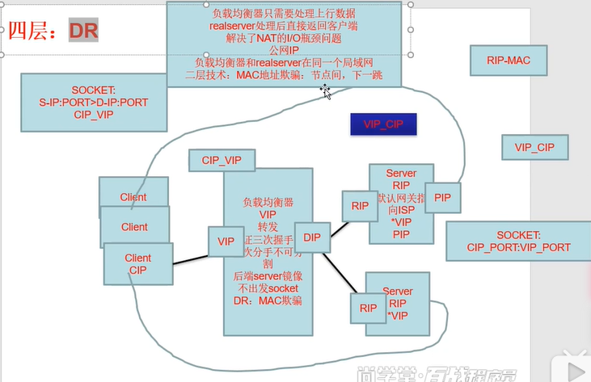

# 2.lvs模式

- 笔记本：3.高并发负载均衡
- 创建时间：2019-11-27 03:01:51 UTC
- 更新时间：2019-11-27 03:41:30 UTC
- 印象笔记 GUID：5c52cd0c-1fc8-4929-bb8f-47baa87b0e64

##### **LVS DR**

- VIP: 虚拟服务器地址

- DIP: 转发的网络地址

  - 1，和RIP通信：ARP协议，获取Real Server的RIP: MAC地址

  - 2，转发Client的数据包到RIP上（隐藏的VIP）

- RIP: 后端真实主机（后端服务器）

- CIP: 客户端IP地址

%23%23%23%23%23%20**LVS%20DR**%0A-%20VIP%3A%20%E8%99%9A%E6%8B%9F%E6%9C%8D%E5%8A%A1%E5%99%A8%E5%9C%B0%E5%9D%80%0A-%20DIP%3A%20%E8%BD%AC%E5%8F%91%E7%9A%84%E7%BD%91%E7%BB%9C%E5%9C%B0%E5%9D%80%0A%20%20%20%20-%201%EF%BC%8C%E5%92%8CRIP%E9%80%9A%E4%BF%A1%EF%BC%9AARP%E5%8D%8F%E8%AE%AE%EF%BC%8C%E8%8E%B7%E5%8F%96Real%20Server%E7%9A%84RIP%3A%20MAC%E5%9C%B0%E5%9D%80%0A%20%20%20%20-%202%EF%BC%8C%E8%BD%AC%E5%8F%91Client%E7%9A%84%E6%95%B0%E6%8D%AE%E5%8C%85%E5%88%B0RIP%E4%B8%8A%EF%BC%88%E9%9A%90%E8%97%8F%E7%9A%84VIP%EF%BC%89%0A-%20RIP%3A%20%E5%90%8E%E7%AB%AF%E7%9C%9F%E5%AE%9E%E4%B8%BB%E6%9C%BA%EF%BC%88%E5%90%8E%E7%AB%AF%E6%9C%8D%E5%8A%A1%E5%99%A8%EF%BC%89%0A-%20CIP%3A%20%E5%AE%A2%E6%88%B7%E7%AB%AFIP%E5%9C%B0%E5%9D%80%0A%0A!%5B41fb4339759ffdf74aed62848f388062.png%5D(en-resource%3A%2F%2Fdatabase%2F458%3A0)%0A
