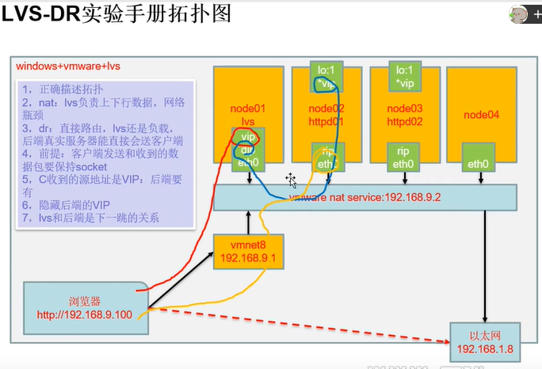
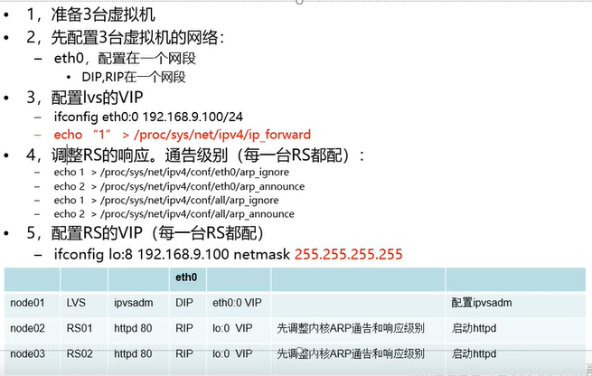
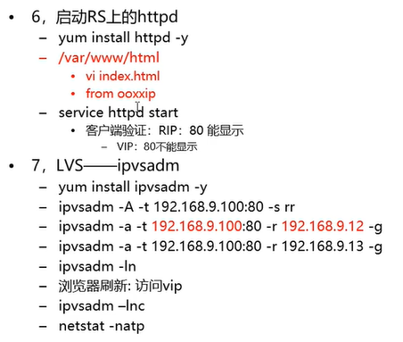

# 3.lvs-dr-install

- 笔记本：3.高并发负载均衡
- 创建时间：2019-11-27 03:46:06 UTC
- 更新时间：2019-11-27 10:07:59 UTC
- 印象笔记 GUID：9c758b10-ccd7-4f94-b026-7d28adafe45f

**隐藏VIP方法：对外隐藏，对内可见**

kernel parameter

- 目标mac地址为全F，交换机触发广播

- /proc/sys/net/ipv4/conf/*IF*/

- arp-ignore: 定义接收到ARP请求时的相应级别

  - 0: 只要本地配置的有相应地址，就给与相应；

  - 1: 仅在请求的目标(MAC)地址配置请求到达的接口上的时候，才给与响应；

- arp_announce: 定义将自己地址向外通告时的通告级别；

  - 0: 将本地任何接口上的任何地址向外通告；

  - 1: 试图仅向目标网络通告与其网路匹配的地址；

  - 2: 仅向与本地接口上地址匹配的网络进行通告;

```
ifconfig
eth0 ...
lo Link encap:Local Loopback
    inet addr:127.0.0.1...

```

响应级别：在环回接口配置VIP，在物理接口上调成1的级别。
 通告级别：设置为2级别。

#### **LVS**

- LVS是Linux Virtual Server的简写，意即Linux虚拟机服务器，是一个虚拟的服务器集群系统

- ipvs: 嵌入到linux的内核（集成进了linux内核，所以想要使用lvs要在用户控件安装一个应用程序ipvsadm工具）

- ipvsadm: 管理应用程序

- **类型:**

  - NAT: 地址转换

  - DR: 直接路由

  - TUN: 隧道

**弄懂：用户态内核态 及其切换**

##### **LVS调度方法**

-
四种静态：

  - rr: 轮询

  - wrr: 加权轮询

  - dh:

  - sh:

-
动态调度方法：

  - lc: 最少链接

  - wlc: 加权最少链接

  - sed: 最短期望延迟

  - nq: never queue

  - LBLC: 基于本地的最少连接

  - DH:

  - LBLCR: 基于本地的大复制功能的最少连接

-
默认方法: wlc

##### **LVS命令: 监控多个端口号**

- ipvs内核模块

- **yum install ipvsadm -y**

- **管理集群服务**

  - 添加: -A -t|u|f service-address [-s scheduler]

    - -s: 选择调度算法

  - -t: TCP协议的集群

  - -u: UDP协议的集群

    - service-address: IP:PORT

  - -f: FWM: 防火墙标记

    - service-address: Mark Number

  - 修改: -E

  - 删除: -D -t|u|f service-address

- ipvsadm -A -t 192.168.231.100:80 -s rr

- ipvsadm -A -t 192.168.231.100:8080 -s rrf

**案例：**
 
 
 

配置node0001为DIP，配置VIP(配置在eth0的子接口上)

- ifconfig eth0:0 192.168.231.100/24

- echo "1" > /proc/sys/net/ipv4/ip_forward
 node0002,node0003配置为RIP,配置隐藏的VIP

##### node0001

```
ifconfig
ifconfig eth0:0 192.168.231.100/24
# 或 ifconfig eth0:0 192.168.231.1000 netmask 255.255.255.0
ifconfig
cat /proc/sys/net/ipv4/ip_forward
0
echo 1 > /proc/sys/net/ipv4/ip_forward

```

##### node0002和node0003

```
cd /proc/sys/net/ipv4/conf/eth0
cat arp_ignore
cat arp_announce
echo 1 > arp_ignore
echo 2 > arp_announce
cd ../all
echo 1 > arp_ignore
echo 2 > arp_announce

ifconfig lo:0 192.168.231.100 netmask 255.255.255.255
# 若 netmask设置为255.255.255.0与eth0的重复了，lo的优先级更高
yum -y install httpd
cd /var/www/html
vim index.html
# 写入 from 192.168.231.32/33
service httpd start
# 访问http://192.168.231.32/33

```

##### node0001

```
yum -y install ipvsadm
ipvsadm -A -t 192.168.9.100:80 -s rr #添加Tcp协议规则
ipvsadm -ln
ipvsadm -a -t 192.168.231.100:80 -r 192.168.231.32 -g #追加 realserver -r  -g dr模型
ipvsadm -ln
ipvsadm -a -t 192.168.231.100:80 -r 192.168.231.33 -g

```

**在浏览器中访问192.168.231.100，可能存在缓存问题**
 **使用另外一台服务器**

##### node0004

```
curl 192.168.231.100
# 重复访问，因为设置的是 -s rr 轮询模式，所以循环访问32和33服务器

```

##### node0001

```
ipvsadm -lnc
##### node0001

```

##### node0002和node0003

```
netstat -natp # 查看握手

```

**node0001中使用netstat -natp查看，无握手连接，只有node0002和node0003中有，验证了客户端和RIP(Real Server)握手，和LVS不握手，LVS只是记录**

##### 存在问题：

1. 若有一台负载服务器挂了/进程异常退出，就会导致没有服务器相应请求，照成一部分客户端访问不了。

1. 若LVS服务器挂了。所有客户端都请求不了了。

**若一台计算机出现故障的概率是10%，有10台计算机，从宏观上来看，就有100%的概率会有一台计算机出现故障。因此在集群中，出现异常故障，挂机等硬件软件问题是一种必然现象，在这个前提条件下得出一个名词，单点故障。不是一种偶然现象，及其可能出现。**

##### 解决方案

防止lvs服务器挂：主备模型(高可用)：热备份

- 如何决策主挂了，哪个从接替？（给每个备机配一个唯一的数值，谁大就是谁）

- 备机如何知道主机挂掉了？(主机广播一个数据包,备机才接受数据包，如果连续几次没有收到主发的数据包，然后推出最大的备机)，可以达到毫秒级

- eg: 三台电脑都配上lvs，

**%E9%9A%90%E8%97%8FVIP%E6%96%B9%E6%B3%95%EF%BC%9A%E5%AF%B9%E5%A4%96%E9%9A%90%E8%97%8F%EF%BC%8C%E5%AF%B9%E5%86%85%E5%8F%AF%E8%A7%81**%0A%0Akernel%20parameter%0A-%20%E7%9B%AE%E6%A0%87mac%E5%9C%B0%E5%9D%80%E4%B8%BA%E5%85%A8F%EF%BC%8C%E4%BA%A4%E6%8D%A2%E6%9C%BA%E8%A7%A6%E5%8F%91%E5%B9%BF%E6%92%AD%0A-%20%2Fproc%2Fsys%2Fnet%2Fipv4%2Fconf%2F*IF*%2F%0A-%20arp-ignore%3A%20%E5%AE%9A%E4%B9%89%E6%8E%A5%E6%94%B6%E5%88%B0ARP%E8%AF%B7%E6%B1%82%E6%97%B6%E7%9A%84%E7%9B%B8%E5%BA%94%E7%BA%A7%E5%88%AB%0A%20%20%20%20-%200%3A%20%E5%8F%AA%E8%A6%81%E6%9C%AC%E5%9C%B0%E9%85%8D%E7%BD%AE%E7%9A%84%E6%9C%89%E7%9B%B8%E5%BA%94%E5%9C%B0%E5%9D%80%EF%BC%8C%E5%B0%B1%E7%BB%99%E4%B8%8E%E7%9B%B8%E5%BA%94%EF%BC%9B%0A%20%20%20%20-%201%3A%20%E4%BB%85%E5%9C%A8%E8%AF%B7%E6%B1%82%E7%9A%84%E7%9B%AE%E6%A0%87(MAC)%E5%9C%B0%E5%9D%80%E9%85%8D%E7%BD%AE%E8%AF%B7%E6%B1%82%E5%88%B0%E8%BE%BE%E7%9A%84%E6%8E%A5%E5%8F%A3%E4%B8%8A%E7%9A%84%E6%97%B6%E5%80%99%EF%BC%8C%E6%89%8D%E7%BB%99%E4%B8%8E%E5%93%8D%E5%BA%94%EF%BC%9B%0A-%20arp_announce%3A%20%E5%AE%9A%E4%B9%89%E5%B0%86%E8%87%AA%E5%B7%B1%E5%9C%B0%E5%9D%80%E5%90%91%E5%A4%96%E9%80%9A%E5%91%8A%E6%97%B6%E7%9A%84%E9%80%9A%E5%91%8A%E7%BA%A7%E5%88%AB%EF%BC%9B%0A%20%20%20%20-%200%3A%20%E5%B0%86%E6%9C%AC%E5%9C%B0%E4%BB%BB%E4%BD%95%E6%8E%A5%E5%8F%A3%E4%B8%8A%E7%9A%84%E4%BB%BB%E4%BD%95%E5%9C%B0%E5%9D%80%E5%90%91%E5%A4%96%E9%80%9A%E5%91%8A%EF%BC%9B%0A%20%20%20%20-%201%3A%20%E8%AF%95%E5%9B%BE%E4%BB%85%E5%90%91%E7%9B%AE%E6%A0%87%E7%BD%91%E7%BB%9C%E9%80%9A%E5%91%8A%E4%B8%8E%E5%85%B6%E7%BD%91%E8%B7%AF%E5%8C%B9%E9%85%8D%E7%9A%84%E5%9C%B0%E5%9D%80%EF%BC%9B%0A%20%20%20%20-%202%3A%20%E4%BB%85%E5%90%91%E4%B8%8E%E6%9C%AC%E5%9C%B0%E6%8E%A5%E5%8F%A3%E4%B8%8A%E5%9C%B0%E5%9D%80%E5%8C%B9%E9%85%8D%E7%9A%84%E7%BD%91%E7%BB%9C%E8%BF%9B%E8%A1%8C%E9%80%9A%E5%91%8A%3B%0A%60%60%60shell%0Aifconfig%0Aeth0%20...%0Alo%20Link%20encap%3ALocal%20Loopback%0A%20%20%20%20inet%20addr%3A127.0.0.1...%0A%60%60%60%0A%E5%93%8D%E5%BA%94%E7%BA%A7%E5%88%AB%EF%BC%9A%E5%9C%A8%E7%8E%AF%E5%9B%9E%E6%8E%A5%E5%8F%A3%E9%85%8D%E7%BD%AEVIP%EF%BC%8C%E5%9C%A8%E7%89%A9%E7%90%86%E6%8E%A5%E5%8F%A3%E4%B8%8A%E8%B0%83%E6%88%901%E7%9A%84%E7%BA%A7%E5%88%AB%E3%80%82%0A%E9%80%9A%E5%91%8A%E7%BA%A7%E5%88%AB%EF%BC%9A%E8%AE%BE%E7%BD%AE%E4%B8%BA2%E7%BA%A7%E5%88%AB%E3%80%82%0A%0A%23%23%23%23%20**LVS**%0A-%20LVS%E6%98%AFLinux%20Virtual%20Server%E7%9A%84%E7%AE%80%E5%86%99%EF%BC%8C%E6%84%8F%E5%8D%B3Linux%E8%99%9A%E6%8B%9F%E6%9C%BA%E6%9C%8D%E5%8A%A1%E5%99%A8%EF%BC%8C%E6%98%AF%E4%B8%80%E4%B8%AA%E8%99%9A%E6%8B%9F%E7%9A%84%E6%9C%8D%E5%8A%A1%E5%99%A8%E9%9B%86%E7%BE%A4%E7%B3%BB%E7%BB%9F%0A-%20ipvs%3A%20%E5%B5%8C%E5%85%A5%E5%88%B0linux%E7%9A%84%E5%86%85%E6%A0%B8%EF%BC%88%E9%9B%86%E6%88%90%E8%BF%9B%E4%BA%86linux%E5%86%85%E6%A0%B8%EF%BC%8C%E6%89%80%E4%BB%A5%E6%83%B3%E8%A6%81%E4%BD%BF%E7%94%A8lvs%E8%A6%81%E5%9C%A8%E7%94%A8%E6%88%B7%E6%8E%A7%E4%BB%B6%E5%AE%89%E8%A3%85%E4%B8%80%E4%B8%AA%E5%BA%94%E7%94%A8%E7%A8%8B%E5%BA%8Fipvsadm%E5%B7%A5%E5%85%B7%EF%BC%89%0A-%20ipvsadm%3A%20%E7%AE%A1%E7%90%86%E5%BA%94%E7%94%A8%E7%A8%8B%E5%BA%8F%0A-%20**%E7%B1%BB%E5%9E%8B%3A**%0A%20%20%20%20-%20NAT%3A%20%E5%9C%B0%E5%9D%80%E8%BD%AC%E6%8D%A2%0A%20%20%20%20-%20DR%3A%20%E7%9B%B4%E6%8E%A5%E8%B7%AF%E7%94%B1%0A%20%20%20%20-%20TUN%3A%20%E9%9A%A7%E9%81%93%20%0A%0A**%E5%BC%84%E6%87%82%EF%BC%9A%E7%94%A8%E6%88%B7%E6%80%81%E5%86%85%E6%A0%B8%E6%80%81%20%E5%8F%8A%E5%85%B6%E5%88%87%E6%8D%A2**%0A%0A%23%23%23%23%23%20**LVS%E8%B0%83%E5%BA%A6%E6%96%B9%E6%B3%95**%0A-%20%E5%9B%9B%E7%A7%8D%E9%9D%99%E6%80%81%EF%BC%9A%0A%20%20%20%20-%20rr%3A%20%E8%BD%AE%E8%AF%A2%0A%20%20%20%20-%20wrr%3A%20%E5%8A%A0%E6%9D%83%E8%BD%AE%E8%AF%A2%0A%20%20%20%20-%20dh%3A%20%0A%20%20%20%20-%20sh%3A%20%0A%0A-%20%E5%8A%A8%E6%80%81%E8%B0%83%E5%BA%A6%E6%96%B9%E6%B3%95%EF%BC%9A%0A%20%20%20%20-%20lc%3A%20%E6%9C%80%E5%B0%91%E9%93%BE%E6%8E%A5%0A%20%20%20%20-%20wlc%3A%20%E5%8A%A0%E6%9D%83%E6%9C%80%E5%B0%91%E9%93%BE%E6%8E%A5%0A%20%20%20%20-%20sed%3A%20%E6%9C%80%E7%9F%AD%E6%9C%9F%E6%9C%9B%E5%BB%B6%E8%BF%9F%0A%20%20%20%20-%20nq%3A%20never%20queue%0A%20%20%20%20-%20LBLC%3A%20%E5%9F%BA%E4%BA%8E%E6%9C%AC%E5%9C%B0%E7%9A%84%E6%9C%80%E5%B0%91%E8%BF%9E%E6%8E%A5%0A%20%20%20%20-%20DH%3A%0A%20%20%20%20-%20LBLCR%3A%20%E5%9F%BA%E4%BA%8E%E6%9C%AC%E5%9C%B0%E7%9A%84%E5%A4%A7%E5%A4%8D%E5%88%B6%E5%8A%9F%E8%83%BD%E7%9A%84%E6%9C%80%E5%B0%91%E8%BF%9E%E6%8E%A5%20%0A%0A-%20%E9%BB%98%E8%AE%A4%E6%96%B9%E6%B3%95%3A%20wlc%20%0A%0A%23%23%23%23%23%20**LVS%E5%91%BD%E4%BB%A4%3A%20%E7%9B%91%E6%8E%A7%E5%A4%9A%E4%B8%AA%E7%AB%AF%E5%8F%A3%E5%8F%B7**%0A-%20ipvs%E5%86%85%E6%A0%B8%E6%A8%A1%E5%9D%97%0A-%20**yum%20install%20ipvsadm%20-y**%20%0A-%20**%E7%AE%A1%E7%90%86%E9%9B%86%E7%BE%A4%E6%9C%8D%E5%8A%A1**%0A%20%20%20%20-%20%E6%B7%BB%E5%8A%A0%3A%20-A%20-t%7Cu%7Cf%20service-address%20%5B-s%20scheduler%5D%20%0A%20%20%20%20%20%20%20%20-%20-s%3A%20%E9%80%89%E6%8B%A9%E8%B0%83%E5%BA%A6%E7%AE%97%E6%B3%95%0A%20%20%20%20-%20-t%3A%20TCP%E5%8D%8F%E8%AE%AE%E7%9A%84%E9%9B%86%E7%BE%A4%0A%20%20%20%20-%20-u%3A%20UDP%E5%8D%8F%E8%AE%AE%E7%9A%84%E9%9B%86%E7%BE%A4%0A%20%20%20%20%20%20%20%20-%20service-address%3A%20IP%3APORT%0A%20%20%20%20-%20-f%3A%20FWM%3A%20%E9%98%B2%E7%81%AB%E5%A2%99%E6%A0%87%E8%AE%B0%0A%20%20%20%20%20%20%20%20-%20service-address%3A%20Mark%20Number%0A%20%20%20%20-%20%E4%BF%AE%E6%94%B9%3A%20-E%0A%20%20%20%20-%20%E5%88%A0%E9%99%A4%3A%20-D%20-t%7Cu%7Cf%20service-address%20%0A-%20ipvsadm%20-A%20-t%20192.168.231.100%3A80%20-s%20rr%0A-%20ipvsadm%20-A%20-t%20192.168.231.100%3A8080%20-s%20rrf%0A%0A**%E6%A1%88%E4%BE%8B%EF%BC%9A**%0A!%5B938df03c72441f52e5125c22ecc38635.png%5D(en-resource%3A%2F%2Fdatabase%2F464%3A0)%0A!%5B9e9c2b7b8cc1c4fdbc7e810346f34e56.png%5D(en-resource%3A%2F%2Fdatabase%2F466%3A0)%0A!%5Bca1c820343f5a9b6d02deeaa9560e49e.png%5D(en-resource%3A%2F%2Fdatabase%2F468%3A0)%0A%0A%E9%85%8D%E7%BD%AEnode0001%E4%B8%BADIP%EF%BC%8C%E9%85%8D%E7%BD%AEVIP(%E9%85%8D%E7%BD%AE%E5%9C%A8eth0%E7%9A%84%E5%AD%90%E6%8E%A5%E5%8F%A3%E4%B8%8A)%0A-%20ifconfig%20eth0%3A0%20192.168.231.100%2F24%0A-%20echo%20%221%22%20%3E%20%2Fproc%2Fsys%2Fnet%2Fipv4%2Fip_forward%20%0Anode0002%2Cnode0003%E9%85%8D%E7%BD%AE%E4%B8%BARIP%2C%E9%85%8D%E7%BD%AE%E9%9A%90%E8%97%8F%E7%9A%84VIP%0A%0A%23%23%23%23%23%20node0001%0A%60%60%60shell%0Aifconfig%0Aifconfig%20eth0%3A0%20192.168.231.100%2F24%0A%23%20%E6%88%96%20ifconfig%20eth0%3A0%20192.168.231.1000%20netmask%20255.255.255.0%0Aifconfig%0Acat%20%2Fproc%2Fsys%2Fnet%2Fipv4%2Fip_forward%0A0%0Aecho%201%20%3E%20%2Fproc%2Fsys%2Fnet%2Fipv4%2Fip_forward%0A%60%60%60%0A%0A%23%23%23%23%23%20node0002%E5%92%8Cnode0003%0A%60%60%60shell%0Acd%20%2Fproc%2Fsys%2Fnet%2Fipv4%2Fconf%2Feth0%0Acat%20arp_ignore%0Acat%20arp_announce%0Aecho%201%20%3E%20arp_ignore%20%0Aecho%202%20%3E%20arp_announce%0Acd%20..%2Fall%0Aecho%201%20%3E%20arp_ignore%20%0Aecho%202%20%3E%20arp_announce%0A%0Aifconfig%20lo%3A0%20192.168.231.100%20netmask%20255.255.255.255%0A%23%20%E8%8B%A5%20netmask%E8%AE%BE%E7%BD%AE%E4%B8%BA255.255.255.0%E4%B8%8Eeth0%E7%9A%84%E9%87%8D%E5%A4%8D%E4%BA%86%EF%BC%8Clo%E7%9A%84%E4%BC%98%E5%85%88%E7%BA%A7%E6%9B%B4%E9%AB%98%0Ayum%20-y%20install%20httpd%0Acd%20%2Fvar%2Fwww%2Fhtml%0Avim%20index.html%0A%23%20%E5%86%99%E5%85%A5%20from%20192.168.231.32%2F33%0Aservice%20httpd%20start%0A%23%20%E8%AE%BF%E9%97%AEhttp%3A%2F%2F192.168.231.32%2F33%0A%60%60%60%0A%0A%23%23%23%23%23%20node0001%0A%60%60%60shell%0Ayum%20-y%20install%20ipvsadm%0Aipvsadm%20-A%20-t%20192.168.9.100%3A80%20-s%20rr%20%23%E6%B7%BB%E5%8A%A0Tcp%E5%8D%8F%E8%AE%AE%E8%A7%84%E5%88%99%0Aipvsadm%20-ln%0Aipvsadm%20-a%20-t%20192.168.231.100%3A80%20-r%20192.168.231.32%20-g%20%23%E8%BF%BD%E5%8A%A0%20realserver%20-r%20%20-g%20dr%E6%A8%A1%E5%9E%8B%0Aipvsadm%20-ln%0Aipvsadm%20-a%20-t%20192.168.231.100%3A80%20-r%20192.168.231.33%20-g%0A%60%60%60%0A%0A**%E5%9C%A8%E6%B5%8F%E8%A7%88%E5%99%A8%E4%B8%AD%E8%AE%BF%E9%97%AE192.168.231.100%EF%BC%8C%E5%8F%AF%E8%83%BD%E5%AD%98%E5%9C%A8%E7%BC%93%E5%AD%98%E9%97%AE%E9%A2%98**%0A**%E4%BD%BF%E7%94%A8%E5%8F%A6%E5%A4%96%E4%B8%80%E5%8F%B0%E6%9C%8D%E5%8A%A1%E5%99%A8**%0A%23%23%23%23%23%20node0004%0A%60%60%60shell%0Acurl%20192.168.231.100%0A%23%20%E9%87%8D%E5%A4%8D%E8%AE%BF%E9%97%AE%EF%BC%8C%E5%9B%A0%E4%B8%BA%E8%AE%BE%E7%BD%AE%E7%9A%84%E6%98%AF%20-s%20rr%20%E8%BD%AE%E8%AF%A2%E6%A8%A1%E5%BC%8F%EF%BC%8C%E6%89%80%E4%BB%A5%E5%BE%AA%E7%8E%AF%E8%AE%BF%E9%97%AE32%E5%92%8C33%E6%9C%8D%E5%8A%A1%E5%99%A8%0A%60%60%60%0A%0A%23%23%23%23%23%20node0001%0A%60%60%60shell%0Aipvsadm%20-lnc%0A%23%23%23%23%23%20node0001%0A%60%60%60%0A%23%23%23%23%23%20node0002%E5%92%8Cnode0003%0A%60%60%60shell%0Anetstat%20-natp%20%23%20%E6%9F%A5%E7%9C%8B%E6%8F%A1%E6%89%8B%0A%60%60%60%0A**node0001%E4%B8%AD%E4%BD%BF%E7%94%A8netstat%20-natp%E6%9F%A5%E7%9C%8B%EF%BC%8C%E6%97%A0%E6%8F%A1%E6%89%8B%E8%BF%9E%E6%8E%A5%EF%BC%8C%E5%8F%AA%E6%9C%89node0002%E5%92%8Cnode0003%E4%B8%AD%E6%9C%89%EF%BC%8C%E9%AA%8C%E8%AF%81%E4%BA%86%E5%AE%A2%E6%88%B7%E7%AB%AF%E5%92%8CRIP(Real%20Server)%E6%8F%A1%E6%89%8B%EF%BC%8C%E5%92%8CLVS%E4%B8%8D%E6%8F%A1%E6%89%8B%EF%BC%8CLVS%E5%8F%AA%E6%98%AF%E8%AE%B0%E5%BD%95**%0A%0A%0A%23%23%23%23%23%20%E5%AD%98%E5%9C%A8%E9%97%AE%E9%A2%98%EF%BC%9A%20%0A1.%20%E8%8B%A5%E6%9C%89%E4%B8%80%E5%8F%B0%E8%B4%9F%E8%BD%BD%E6%9C%8D%E5%8A%A1%E5%99%A8%E6%8C%82%E4%BA%86%2F%E8%BF%9B%E7%A8%8B%E5%BC%82%E5%B8%B8%E9%80%80%E5%87%BA%EF%BC%8C%E5%B0%B1%E4%BC%9A%E5%AF%BC%E8%87%B4%E6%B2%A1%E6%9C%89%E6%9C%8D%E5%8A%A1%E5%99%A8%E7%9B%B8%E5%BA%94%E8%AF%B7%E6%B1%82%EF%BC%8C%E7%85%A7%E6%88%90%E4%B8%80%E9%83%A8%E5%88%86%E5%AE%A2%E6%88%B7%E7%AB%AF%E8%AE%BF%E9%97%AE%E4%B8%8D%E4%BA%86%E3%80%82%0A2.%20%E8%8B%A5LVS%E6%9C%8D%E5%8A%A1%E5%99%A8%E6%8C%82%E4%BA%86%E3%80%82%E6%89%80%E6%9C%89%E5%AE%A2%E6%88%B7%E7%AB%AF%E9%83%BD%E8%AF%B7%E6%B1%82%E4%B8%8D%E4%BA%86%E4%BA%86%E3%80%82%0A%0A**%E8%8B%A5%E4%B8%80%E5%8F%B0%E8%AE%A1%E7%AE%97%E6%9C%BA%E5%87%BA%E7%8E%B0%E6%95%85%E9%9A%9C%E7%9A%84%E6%A6%82%E7%8E%87%E6%98%AF10%25%EF%BC%8C%E6%9C%8910%E5%8F%B0%E8%AE%A1%E7%AE%97%E6%9C%BA%EF%BC%8C%E4%BB%8E%E5%AE%8F%E8%A7%82%E4%B8%8A%E6%9D%A5%E7%9C%8B%EF%BC%8C%E5%B0%B1%E6%9C%89100%25%E7%9A%84%E6%A6%82%E7%8E%87%E4%BC%9A%E6%9C%89%E4%B8%80%E5%8F%B0%E8%AE%A1%E7%AE%97%E6%9C%BA%E5%87%BA%E7%8E%B0%E6%95%85%E9%9A%9C%E3%80%82%E5%9B%A0%E6%AD%A4%E5%9C%A8%E9%9B%86%E7%BE%A4%E4%B8%AD%EF%BC%8C%E5%87%BA%E7%8E%B0%E5%BC%82%E5%B8%B8%E6%95%85%E9%9A%9C%EF%BC%8C%E6%8C%82%E6%9C%BA%E7%AD%89%E7%A1%AC%E4%BB%B6%E8%BD%AF%E4%BB%B6%E9%97%AE%E9%A2%98%E6%98%AF%E4%B8%80%E7%A7%8D%E5%BF%85%E7%84%B6%E7%8E%B0%E8%B1%A1%EF%BC%8C%E5%9C%A8%E8%BF%99%E4%B8%AA%E5%89%8D%E6%8F%90%E6%9D%A1%E4%BB%B6%E4%B8%8B%E5%BE%97%E5%87%BA%E4%B8%80%E4%B8%AA%E5%90%8D%E8%AF%8D%EF%BC%8C%E5%8D%95%E7%82%B9%E6%95%85%E9%9A%9C%E3%80%82%E4%B8%8D%E6%98%AF%E4%B8%80%E7%A7%8D%E5%81%B6%E7%84%B6%E7%8E%B0%E8%B1%A1%EF%BC%8C%E5%8F%8A%E5%85%B6%E5%8F%AF%E8%83%BD%E5%87%BA%E7%8E%B0%E3%80%82**%0A%0A%23%23%23%23%23%20%E8%A7%A3%E5%86%B3%E6%96%B9%E6%A1%88%0A%E9%98%B2%E6%AD%A2lvs%E6%9C%8D%E5%8A%A1%E5%99%A8%E6%8C%82%EF%BC%9A%E4%B8%BB%E5%A4%87%E6%A8%A1%E5%9E%8B(%E9%AB%98%E5%8F%AF%E7%94%A8)%EF%BC%9A%E7%83%AD%E5%A4%87%E4%BB%BD%0A-%20%E5%A6%82%E4%BD%95%E5%86%B3%E7%AD%96%E4%B8%BB%E6%8C%82%E4%BA%86%EF%BC%8C%E5%93%AA%E4%B8%AA%E4%BB%8E%E6%8E%A5%E6%9B%BF%EF%BC%9F%EF%BC%88%E7%BB%99%E6%AF%8F%E4%B8%AA%E5%A4%87%E6%9C%BA%E9%85%8D%E4%B8%80%E4%B8%AA%E5%94%AF%E4%B8%80%E7%9A%84%E6%95%B0%E5%80%BC%EF%BC%8C%E8%B0%81%E5%A4%A7%E5%B0%B1%E6%98%AF%E8%B0%81%EF%BC%89%20%0A-%20%E5%A4%87%E6%9C%BA%E5%A6%82%E4%BD%95%E7%9F%A5%E9%81%93%E4%B8%BB%E6%9C%BA%E6%8C%82%E6%8E%89%E4%BA%86%EF%BC%9F(%E4%B8%BB%E6%9C%BA%E5%B9%BF%E6%92%AD%E4%B8%80%E4%B8%AA%E6%95%B0%E6%8D%AE%E5%8C%85%2C%E5%A4%87%E6%9C%BA%E6%89%8D%E6%8E%A5%E5%8F%97%E6%95%B0%E6%8D%AE%E5%8C%85%EF%BC%8C%E5%A6%82%E6%9E%9C%E8%BF%9E%E7%BB%AD%E5%87%A0%E6%AC%A1%E6%B2%A1%E6%9C%89%E6%94%B6%E5%88%B0%E4%B8%BB%E5%8F%91%E7%9A%84%E6%95%B0%E6%8D%AE%E5%8C%85%EF%BC%8C%E7%84%B6%E5%90%8E%E6%8E%A8%E5%87%BA%E6%9C%80%E5%A4%A7%E7%9A%84%E5%A4%87%E6%9C%BA)%EF%BC%8C%E5%8F%AF%E4%BB%A5%E8%BE%BE%E5%88%B0%E6%AF%AB%E7%A7%92%E7%BA%A7%0A-%20eg%3A%20%E4%B8%89%E5%8F%B0%E7%94%B5%E8%84%91%E9%83%BD%E9%85%8D%E4%B8%8Alvs%EF%BC%8C
