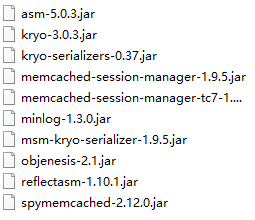

# 7.nginx-session一致性问题

- 笔记本：3.高并发负载均衡
- 创建时间：2019-12-04 03:57:25 UTC
- 更新时间：2019-12-06 09:57:12 UTC
- 原始链接：https://www.cnblogs.com/dyh004/p/8400768.html
- 印象笔记 GUID：8d20833e-8ffc-4bcd-8ed0-c66102b35cf8

#### Nginx的session一致性问题

##### Session一致性解决方案

- session复制

  - tomcat本身带有复制session的功能。

- 共享session

  - 需要专门管理session的软件，

  - memcached缓存服务，可以和tomcat整合，帮助tomcat共享管理session。

session对时间敏感，使用集群的时候节点时间要一致，凡是用的集群，集群里节点时间要同步。集群出问题排错先看时间。

```
# node0002和node0003安装tomcat，tomcat依赖jdk，可以使用命令jps查看
# tomcat中的index.jsp文件改为
from:192.168.231.32 <br>session: <%= session.getId()%>

```

```
# nginx.conf
upstream tom {
    server 192.168.231.32:8080;
    server 192.168.231.33:8080;
}
server {
    location /cat {
            proxy_pass http://tom/;
        }
}
service nginx reload

```

访问 http://www.liucezhi.com/cat，多次刷新session一直改变

##### 解决：

先把tomcat停掉

```
./shutdown

```

安装memcached

- 安装libevent

- 安装memcached

- 启动memcached

- memcached -d -m 128m -p 11211 -l 192.168.231.31 -u root -P /tmp/

- -d: 后台启动服务

- -m: 缓存大小

- -p:端口

- -l:IP(小写L)

- -P:服务器启动后的系统进程ID，存储的文件(端口号)

- -u: 服务器启动时以哪个用户名作为管理用户
 如果源配置了也可以用`yum -y install memcached`

配置session共享：

-
拷贝jar到tomcat的lib下，
 

-
配置tomcat，每个tomcat里面的context.xml中加入
 <Manager
 className="de.javakaffee.web.msm.MemcachedBackupSessionManager"
 memcachedNodes="n1:192.168.51.75:11211"
 sticky="false"
 sessionBackupAsync="false"
 lockingMode="uriPattern:/path1|/path2"
 requestUriIgnorePattern=".*.(ico|png|gif|jpg|css|js)$"
 transcoderFactory/>

```
# node0001
yum -y install memcached

netstat -natp | grep 11211

```

```
# node0002 & node0003
cd ./apach.../

```

```
date -s "1970-11-11 22:22:22"
# 修改时间
# 再刷新，session会变

```

- 如果每刷新一轮，session都会变一次，一般是时间问题！！！使用`date`命令即可查看

#### 任务：

- 图纸互斥

- 文件上传接口整理

%23%23%23%23%20Nginx%E7%9A%84session%E4%B8%80%E8%87%B4%E6%80%A7%E9%97%AE%E9%A2%98%0A%0A%23%23%23%23%23%20Session%E4%B8%80%E8%87%B4%E6%80%A7%E8%A7%A3%E5%86%B3%E6%96%B9%E6%A1%88%0A-%20session%E5%A4%8D%E5%88%B6%0A%20%20%20%20-%20tomcat%E6%9C%AC%E8%BA%AB%E5%B8%A6%E6%9C%89%E5%A4%8D%E5%88%B6session%E7%9A%84%E5%8A%9F%E8%83%BD%E3%80%82%0A-%20%E5%85%B1%E4%BA%ABsession%0A%20%20%20%20-%20%E9%9C%80%E8%A6%81%E4%B8%93%E9%97%A8%E7%AE%A1%E7%90%86session%E7%9A%84%E8%BD%AF%E4%BB%B6%EF%BC%8C%0A%20%20%20%20-%20memcached%E7%BC%93%E5%AD%98%E6%9C%8D%E5%8A%A1%EF%BC%8C%E5%8F%AF%E4%BB%A5%E5%92%8Ctomcat%E6%95%B4%E5%90%88%EF%BC%8C%E5%B8%AE%E5%8A%A9tomcat%E5%85%B1%E4%BA%AB%E7%AE%A1%E7%90%86session%E3%80%82%0A%0Asession%E5%AF%B9%E6%97%B6%E9%97%B4%E6%95%8F%E6%84%9F%EF%BC%8C%E4%BD%BF%E7%94%A8%E9%9B%86%E7%BE%A4%E7%9A%84%E6%97%B6%E5%80%99%E8%8A%82%E7%82%B9%E6%97%B6%E9%97%B4%E8%A6%81%E4%B8%80%E8%87%B4%EF%BC%8C%E5%87%A1%E6%98%AF%E7%94%A8%E7%9A%84%E9%9B%86%E7%BE%A4%EF%BC%8C%E9%9B%86%E7%BE%A4%E9%87%8C%E8%8A%82%E7%82%B9%E6%97%B6%E9%97%B4%E8%A6%81%E5%90%8C%E6%AD%A5%E3%80%82%E9%9B%86%E7%BE%A4%E5%87%BA%E9%97%AE%E9%A2%98%E6%8E%92%E9%94%99%E5%85%88%E7%9C%8B%E6%97%B6%E9%97%B4%E3%80%82%0A%0A%0A%60%60%60shell%0A%23%20node0002%E5%92%8Cnode0003%E5%AE%89%E8%A3%85tomcat%EF%BC%8Ctomcat%E4%BE%9D%E8%B5%96jdk%EF%BC%8C%E5%8F%AF%E4%BB%A5%E4%BD%BF%E7%94%A8%E5%91%BD%E4%BB%A4jps%E6%9F%A5%E7%9C%8B%0A%23%20tomcat%E4%B8%AD%E7%9A%84index.jsp%E6%96%87%E4%BB%B6%E6%94%B9%E4%B8%BA%20%0Afrom%3A192.168.231.32%20%3Cbr%3Esession%3A%20%3C%25%3D%20session.getId()%25%3E%0A%60%60%60%0A%60%60%60shell%0A%23%20nginx.conf%0Aupstream%20tom%20%7B%0A%20%20%20%20server%20192.168.231.32%3A8080%3B%0A%20%20%20%20server%20192.168.231.33%3A8080%3B%0A%7D%0Aserver%20%7B%0A%20%20%20%20location%20%2Fcat%20%7B%0A%20%20%20%20%20%20%20%20%20%20%20%20proxy_pass%20http%3A%2F%2Ftom%2F%3B%0A%20%20%20%20%20%20%20%20%7D%0A%7D%0Aservice%20nginx%20reload%0A%60%60%60%0A%0A%E8%AE%BF%E9%97%AE%20http%3A%2F%2Fwww.liucezhi.com%2Fcat%EF%BC%8C%E5%A4%9A%E6%AC%A1%E5%88%B7%E6%96%B0session%E4%B8%80%E7%9B%B4%E6%94%B9%E5%8F%98%0A%0A%23%23%23%23%23%20%E8%A7%A3%E5%86%B3%EF%BC%9A%0A%E5%85%88%E6%8A%8Atomcat%E5%81%9C%E6%8E%89%0A%60%60%60shell%0A.%2Fshutdown%0A%60%60%60%0A%0A%E5%AE%89%E8%A3%85memcached%0A-%20%E5%AE%89%E8%A3%85libevent%0A-%20%E5%AE%89%E8%A3%85memcached%0A-%20%E5%90%AF%E5%8A%A8memcached%0A-%20memcached%20-d%20-m%20128m%20-p%2011211%20-l%20192.168.231.31%20-u%20root%20-P%20%2Ftmp%2F%0A-%20-d%3A%20%E5%90%8E%E5%8F%B0%E5%90%AF%E5%8A%A8%E6%9C%8D%E5%8A%A1%0A-%20-m%3A%20%E7%BC%93%E5%AD%98%E5%A4%A7%E5%B0%8F%0A-%20-p%3A%E7%AB%AF%E5%8F%A3%0A-%20-l%3AIP(%E5%B0%8F%E5%86%99L)%0A-%20-P%3A%E6%9C%8D%E5%8A%A1%E5%99%A8%E5%90%AF%E5%8A%A8%E5%90%8E%E7%9A%84%E7%B3%BB%E7%BB%9F%E8%BF%9B%E7%A8%8BID%EF%BC%8C%E5%AD%98%E5%82%A8%E7%9A%84%E6%96%87%E4%BB%B6(%E7%AB%AF%E5%8F%A3%E5%8F%B7)%0A-%20-u%3A%20%E6%9C%8D%E5%8A%A1%E5%99%A8%E5%90%AF%E5%8A%A8%E6%97%B6%E4%BB%A5%E5%93%AA%E4%B8%AA%E7%94%A8%E6%88%B7%E5%90%8D%E4%BD%9C%E4%B8%BA%E7%AE%A1%E7%90%86%E7%94%A8%E6%88%B7%0A%E5%A6%82%E6%9E%9C%E6%BA%90%E9%85%8D%E7%BD%AE%E4%BA%86%E4%B9%9F%E5%8F%AF%E4%BB%A5%E7%94%A8%60yum%20-y%20install%20memcached%60%0A%0A%E9%85%8D%E7%BD%AEsession%E5%85%B1%E4%BA%AB%EF%BC%9A%0A-%20%E6%8B%B7%E8%B4%9Djar%E5%88%B0tomcat%E7%9A%84lib%E4%B8%8B%EF%BC%8C%0A!%5Bcbbbb472dd366a930386dac5b76557a4.png%5D(en-resource%3A%2F%2Fdatabase%2F488%3A1)%0A%0A-%20%E9%85%8D%E7%BD%AEtomcat%EF%BC%8C%E6%AF%8F%E4%B8%AAtomcat%E9%87%8C%E9%9D%A2%E7%9A%84context.xml%E4%B8%AD%E5%8A%A0%E5%85%A5%0A%3CManager%20%20%0A%20%20%20%20%20%20%20%20className%3D%22de.javakaffee.web.msm.MemcachedBackupSessionManager%22%20%20%0A%20%20%20%20%20%20%20%20memcachedNodes%3D%22n1%3A192.168.51.75%3A11211%22%20%20%0A%20%20%20%20%20%20%20%20sticky%3D%22false%22%20%20%0A%20%20%20%20%20%20%20%20sessionBackupAsync%3D%22false%22%20%20%0A%20%20%20%20%20%20%20%20lockingMode%3D%22uriPattern%3A%2Fpath1%7C%2Fpath2%22%20%20%0A%20%20%20%20%20%20%20%20requestUriIgnorePattern%3D%22.*%5C.(ico%7Cpng%7Cgif%7Cjpg%7Ccss%7Cjs)%24%22%20%20%0A%20%20%20%20%20%20%20%20transcoderFactoryClass%3D%22de.javakaffee.web.msm.serializer.kryo.KryoTranscoderFactory%22%2F%3E%20%0A%0A%0A%0A%60%60%60shell%0A%23%20node0001%0Ayum%20-y%20install%20memcached%0A%0Anetstat%20-natp%20%7C%20grep%2011211%0A%60%60%60%0A%0A%60%60%60shell%0A%23%20node0002%20%26%20node0003%0Acd%20.%2Fapach...%2F%0A%60%60%60%0A%60%60%60shell%0Adate%20-s%20%221970-11-11%2022%3A22%3A22%22%0A%23%20%E4%BF%AE%E6%94%B9%E6%97%B6%E9%97%B4%0A%23%20%E5%86%8D%E5%88%B7%E6%96%B0%EF%BC%8Csession%E4%BC%9A%E5%8F%98%0A%60%60%60%0A%0A*%20%E5%A6%82%E6%9E%9C%E6%AF%8F%E5%88%B7%E6%96%B0%E4%B8%80%E8%BD%AE%EF%BC%8Csession%E9%83%BD%E4%BC%9A%E5%8F%98%E4%B8%80%E6%AC%A1%EF%BC%8C%E4%B8%80%E8%88%AC%E6%98%AF%E6%97%B6%E9%97%B4%E9%97%AE%E9%A2%98%EF%BC%81%EF%BC%81%EF%BC%81%E4%BD%BF%E7%94%A8%60date%60%E5%91%BD%E4%BB%A4%E5%8D%B3%E5%8F%AF%E6%9F%A5%E7%9C%8B%E6%97%A5%E6%9C%9F%0A%0A%0A%23%23%23%23%20%E4%BB%BB%E5%8A%A1%EF%BC%9A%0A*%20%E5%9B%BE%E7%BA%B8%E4%BA%92%E6%96%A5%0A*%20%E6%96%87%E4%BB%B6%E4%B8%8A%E4%BC%A0%E6%8E%A5%E5%8F%A3%E6%95%B4%E7%90%86%0A%0A
