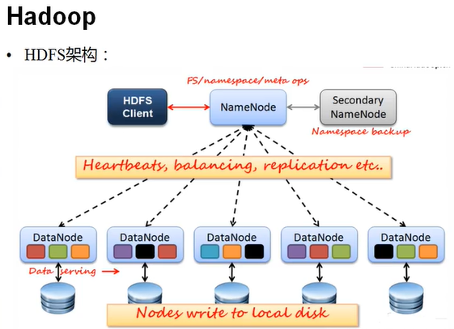
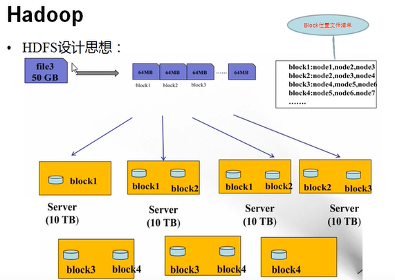
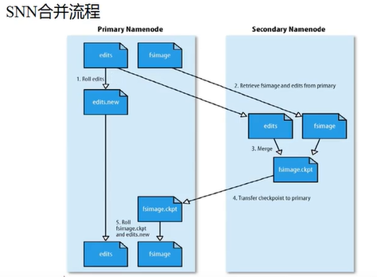

# 3.Hadoop NameNode持久化

- 笔记本：4.hadoop
- 创建时间：2019-12-09 03:43:56 UTC
- 更新时间：2019-12-09 07:18:28 UTC
- 印象笔记 GUID：7a392f2d-50bf-4193-97e4-43aa2e76c8d5

**NameNode(NN)**

- 基于内存存储：不会和磁盘发生交换(双向)

  - 只存在内存中

  - 持久化(单向)（存到磁盘中永久保存下来，定时持久化）

- NameNode主要功能:

  - 接受客户端的读写服务

  - 收集DataNode汇报的Block列表信息

- NameNode保存metadata信息包括:

  - 文件owership和permissions

  - 文件大小，时间

  - (Block列表：Block偏移量)，位置信息(持久化不存，不会放到持久化的文件当中，因为DataNode和NameNode一直在交互，如果持久化的话，重启服务器，加载文件位置，若有块坏了，就可能导致客户访问不到数据)

  - Block每副本位置(由DataNode上报)

**NameNode持久化**

- NameNode的metadata信息在启动后会加载到内存

- metadata存储到磁盘文件名为"fsimage"（时点备份）

- Block的位置信息不会保存到fsimage

- edits记录对metadata的操作日志..>Redis

- 二者的禅师时间和过程？ （format）

**Secondary NameNode(SNN)**

- 它不是NN的备份(但可以做备份)，它的主要工作是帮助NN合并edits log，减少NN启动时间。

- SNN执行合并时机

  - 根据配置文件设置的时间间隔 fs.checkpoint:period 默认3600秒

  - 根据配置文件设置edits log大小fs.checkpoint.size规定edits文件的最大值默认是64MB

**hadoop 1.0 SNN并不能作为备机，因为不是实时同步的。2.x之后这个决策消失了**
 

**DataNode(DN)**

- 本地磁盘目录存储数据(Block)，文件形式

- 同时存储Block的元数据信息文件(MD5文件)

- 启动DN时会向NN汇报block信息(主动)

- 通过向NN发送心跳保持与其联系(3秒一次)，如果NN10分钟没有收到DN的心跳，则认为其已经lost，并copy其上的block到其他DN

!%5B6159dd8ba24a2b119799c6874fbaf613.png%5D(en-resource%3A%2F%2Fdatabase%2F604%3A0)%0A%0A!%5B9564799179946061fe19b0c30e4e22eb.png%5D(en-resource%3A%2F%2Fdatabase%2F606%3A0)%0A%0A**NameNode(NN)**%0A-%20%E5%9F%BA%E4%BA%8E%E5%86%85%E5%AD%98%E5%AD%98%E5%82%A8%EF%BC%9A%E4%B8%8D%E4%BC%9A%E5%92%8C%E7%A3%81%E7%9B%98%E5%8F%91%E7%94%9F%E4%BA%A4%E6%8D%A2(%E5%8F%8C%E5%90%91)%0A%20%20%20%20-%20%E5%8F%AA%E5%AD%98%E5%9C%A8%E5%86%85%E5%AD%98%E4%B8%AD%0A%20%20%20%20-%20%E6%8C%81%E4%B9%85%E5%8C%96(%E5%8D%95%E5%90%91)%EF%BC%88%E5%AD%98%E5%88%B0%E7%A3%81%E7%9B%98%E4%B8%AD%E6%B0%B8%E4%B9%85%E4%BF%9D%E5%AD%98%E4%B8%8B%E6%9D%A5%EF%BC%8C%E5%AE%9A%E6%97%B6%E6%8C%81%E4%B9%85%E5%8C%96%EF%BC%89%0A-%20NameNode%E4%B8%BB%E8%A6%81%E5%8A%9F%E8%83%BD%3A%0A%20%20%20%20-%20%E6%8E%A5%E5%8F%97%E5%AE%A2%E6%88%B7%E7%AB%AF%E7%9A%84%E8%AF%BB%E5%86%99%E6%9C%8D%E5%8A%A1%0A%20%20%20%20-%20%E6%94%B6%E9%9B%86DataNode%E6%B1%87%E6%8A%A5%E7%9A%84Block%E5%88%97%E8%A1%A8%E4%BF%A1%E6%81%AF%0A-%20NameNode%E4%BF%9D%E5%AD%98metadata%E4%BF%A1%E6%81%AF%E5%8C%85%E6%8B%AC%3A%0A%20%20%20%20-%20%E6%96%87%E4%BB%B6owership%E5%92%8Cpermissions%0A%20%20%20%20-%20%E6%96%87%E4%BB%B6%E5%A4%A7%E5%B0%8F%EF%BC%8C%E6%97%B6%E9%97%B4%0A%20%20%20%20-%20(Block%E5%88%97%E8%A1%A8%EF%BC%9ABlock%E5%81%8F%E7%A7%BB%E9%87%8F)%EF%BC%8C%E4%BD%8D%E7%BD%AE%E4%BF%A1%E6%81%AF(%E6%8C%81%E4%B9%85%E5%8C%96%E4%B8%8D%E5%AD%98%EF%BC%8C%E4%B8%8D%E4%BC%9A%E6%94%BE%E5%88%B0%E6%8C%81%E4%B9%85%E5%8C%96%E7%9A%84%E6%96%87%E4%BB%B6%E5%BD%93%E4%B8%AD%EF%BC%8C%E5%9B%A0%E4%B8%BADataNode%E5%92%8CNameNode%E4%B8%80%E7%9B%B4%E5%9C%A8%E4%BA%A4%E4%BA%92%EF%BC%8C%E5%A6%82%E6%9E%9C%E6%8C%81%E4%B9%85%E5%8C%96%E7%9A%84%E8%AF%9D%EF%BC%8C%E9%87%8D%E5%90%AF%E6%9C%8D%E5%8A%A1%E5%99%A8%EF%BC%8C%E5%8A%A0%E8%BD%BD%E6%96%87%E4%BB%B6%E4%BD%8D%E7%BD%AE%EF%BC%8C%E8%8B%A5%E6%9C%89%E5%9D%97%E5%9D%8F%E4%BA%86%EF%BC%8C%E5%B0%B1%E5%8F%AF%E8%83%BD%E5%AF%BC%E8%87%B4%E5%AE%A2%E6%88%B7%E8%AE%BF%E9%97%AE%E4%B8%8D%E5%88%B0%E6%95%B0%E6%8D%AE)%0A%20%20%20%20-%20Block%E6%AF%8F%E5%89%AF%E6%9C%AC%E4%BD%8D%E7%BD%AE(%E7%94%B1DataNode%E4%B8%8A%E6%8A%A5)%0A%0A**NameNode%E6%8C%81%E4%B9%85%E5%8C%96**%0A-%20NameNode%E7%9A%84metadata%E4%BF%A1%E6%81%AF%E5%9C%A8%E5%90%AF%E5%8A%A8%E5%90%8E%E4%BC%9A%E5%8A%A0%E8%BD%BD%E5%88%B0%E5%86%85%E5%AD%98%0A-%20metadata%E5%AD%98%E5%82%A8%E5%88%B0%E7%A3%81%E7%9B%98%E6%96%87%E4%BB%B6%E5%90%8D%E4%B8%BA%22fsimage%22%EF%BC%88%E6%97%B6%E7%82%B9%E5%A4%87%E4%BB%BD%EF%BC%89%0A-%20Block%E7%9A%84%E4%BD%8D%E7%BD%AE%E4%BF%A1%E6%81%AF%E4%B8%8D%E4%BC%9A%E4%BF%9D%E5%AD%98%E5%88%B0fsimage%0A-%20edits%E8%AE%B0%E5%BD%95%E5%AF%B9metadata%E7%9A%84%E6%93%8D%E4%BD%9C%E6%97%A5%E5%BF%97..%3ERedis%0A-%20%E4%BA%8C%E8%80%85%E7%9A%84%E7%A6%85%E5%B8%88%E6%97%B6%E9%97%B4%E5%92%8C%E8%BF%87%E7%A8%8B%EF%BC%9F%20%EF%BC%88format%EF%BC%89%0A%0A**Secondary%20NameNode(SNN)**%0A-%20%E5%AE%83%E4%B8%8D%E6%98%AFNN%E7%9A%84%E5%A4%87%E4%BB%BD(%E4%BD%86%E5%8F%AF%E4%BB%A5%E5%81%9A%E5%A4%87%E4%BB%BD)%EF%BC%8C%E5%AE%83%E7%9A%84%E4%B8%BB%E8%A6%81%E5%B7%A5%E4%BD%9C%E6%98%AF%E5%B8%AE%E5%8A%A9NN%E5%90%88%E5%B9%B6edits%20log%EF%BC%8C%E5%87%8F%E5%B0%91NN%E5%90%AF%E5%8A%A8%E6%97%B6%E9%97%B4%E3%80%82%0A-%20SNN%E6%89%A7%E8%A1%8C%E5%90%88%E5%B9%B6%E6%97%B6%E6%9C%BA%0A%20%20%20%20-%20%E6%A0%B9%E6%8D%AE%E9%85%8D%E7%BD%AE%E6%96%87%E4%BB%B6%E8%AE%BE%E7%BD%AE%E7%9A%84%E6%97%B6%E9%97%B4%E9%97%B4%E9%9A%94%20fs.checkpoint%3Aperiod%20%E9%BB%98%E8%AE%A43600%E7%A7%92%0A%20%20%20%20-%20%E6%A0%B9%E6%8D%AE%E9%85%8D%E7%BD%AE%E6%96%87%E4%BB%B6%E8%AE%BE%E7%BD%AEedits%20log%E5%A4%A7%E5%B0%8Ffs.checkpoint.size%E8%A7%84%E5%AE%9Aedits%E6%96%87%E4%BB%B6%E7%9A%84%E6%9C%80%E5%A4%A7%E5%80%BC%E9%BB%98%E8%AE%A4%E6%98%AF64MB%0A%20%20%20%20%0A**hadoop%201.0%20SNN%E5%B9%B6%E4%B8%8D%E8%83%BD%E4%BD%9C%E4%B8%BA%E5%A4%87%E6%9C%BA%EF%BC%8C%E5%9B%A0%E4%B8%BA%E4%B8%8D%E6%98%AF%E5%AE%9E%E6%97%B6%E5%90%8C%E6%AD%A5%E7%9A%84%E3%80%822.x%E4%B9%8B%E5%90%8E%E8%BF%99%E4%B8%AA%E5%86%B3%E7%AD%96%E6%B6%88%E5%A4%B1%E4%BA%86**%0A!%5B7dba769bb8444ab4269b9859d5d026b0.png%5D(en-resource%3A%2F%2Fdatabase%2F608%3A0)%0A%0A**DataNode(DN)**%0A-%20%E6%9C%AC%E5%9C%B0%E7%A3%81%E7%9B%98%E7%9B%AE%E5%BD%95%E5%AD%98%E5%82%A8%E6%95%B0%E6%8D%AE(Block)%EF%BC%8C%E6%96%87%E4%BB%B6%E5%BD%A2%E5%BC%8F%0A-%20%E5%90%8C%E6%97%B6%E5%AD%98%E5%82%A8Block%E7%9A%84%E5%85%83%E6%95%B0%E6%8D%AE%E4%BF%A1%E6%81%AF%E6%96%87%E4%BB%B6(MD5%E6%96%87%E4%BB%B6)%0A-%20%E5%90%AF%E5%8A%A8DN%E6%97%B6%E4%BC%9A%E5%90%91NN%E6%B1%87%E6%8A%A5block%E4%BF%A1%E6%81%AF(%E4%B8%BB%E5%8A%A8)%0A-%20%E9%80%9A%E8%BF%87%E5%90%91NN%E5%8F%91%E9%80%81%E5%BF%83%E8%B7%B3%E4%BF%9D%E6%8C%81%E4%B8%8E%E5%85%B6%E8%81%94%E7%B3%BB(3%E7%A7%92%E4%B8%80%E6%AC%A1)%EF%BC%8C%E5%A6%82%E6%9E%9CNN10%E5%88%86%E9%92%9F%E6%B2%A1%E6%9C%89%E6%94%B6%E5%88%B0DN%E7%9A%84%E5%BF%83%E8%B7%B3%EF%BC%8C%E5%88%99%E8%AE%A4%E4%B8%BA%E5%85%B6%E5%B7%B2%E7%BB%8Flost%EF%BC%8C%E5%B9%B6copy%E5%85%B6%E4%B8%8A%E7%9A%84block%E5%88%B0%E5%85%B6%E4%BB%96DN%0A%0A%0A
