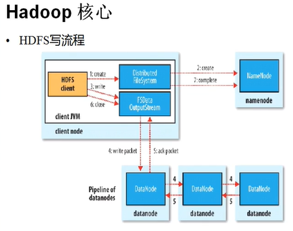
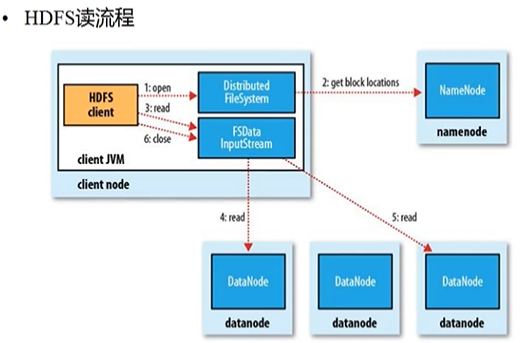

# 4.Hadoop HDFS读写流程

- 笔记本：4.hadoop
- 创建时间：2019-12-09 07:28:14 UTC
- 更新时间：2019-12-09 08:07:47 UTC
- 印象笔记 GUID：c9148a59-0c03-41b2-8f67-df51d30b8cdb

**HDFS优点：**

- 高容错性

  - 数据自动保存多个副本

  - 副本丢失后，自动恢复

- 适合批处理

  - 移动计算而非数据

  - 数据位置暴露给计算框架(Block偏移量)

- 适合大数据处理

  - GB、TB、甚至PB级数据

  - 百万规模以上的文件数量

  - 10K+节点

- 可构建在廉价机器上

  - 通过多副本提高可靠性

  - 提供了容错和恢复机制

**HDFS缺点：**

- 低延迟数据访问(无法做到)

  - 比如毫秒级

  - 低延迟与高吞吐率

- 小文件存取

  - 占用NameNode大量内存

  - 寻道时间超过读取时间

- 并发写入、文件随机修改

  - 一个文件只能有一个写者

  - 仅支持append

**Block的副本放置策略**

- 第一个副本：放置在上传文件的DN；如果是集群外提交，则随机挑选一台磁盘不太慢，CPU不太忙的节点

- 第二个副本：放置在与第一个副本不同的机架的节点上

- 第三个副本：与第二个副本相同机架的其他节点

- 更多副本：随机节点

##### HDFS写流程

**Client:**

- 切分文件Block

- 按Block线性和NN获取DN列表(副本数)

- 验证DN列表后以更小单位流式传输数据

  - 各节点，两两通信确定可用

- Block传输结束后：

  - DN向NN汇报Block信息

  - DN向Client汇报完成

  - Client向NN汇报完成

- 获取下一个Block存放的DN列表

- ......

- 最终Client汇报完成

- NN会在写流程更新文件状态

 *Hadoop永远找离它最近的块来读*

##### HDFS读流程

**Client:**

- 和NN获取一部分Block副本位置列表

- 线性和DN获取Block，最终合并为一个文件

- 在Block副本列表中按距离择优选取

- MD5

*SAP HAHA(内存数据库)*

**HDFS%E4%BC%98%E7%82%B9%EF%BC%9A**%0A-%20%E9%AB%98%E5%AE%B9%E9%94%99%E6%80%A7%0A%20%20%20%20-%20%E6%95%B0%E6%8D%AE%E8%87%AA%E5%8A%A8%E4%BF%9D%E5%AD%98%E5%A4%9A%E4%B8%AA%E5%89%AF%E6%9C%AC%0A%20%20%20%20-%20%E5%89%AF%E6%9C%AC%E4%B8%A2%E5%A4%B1%E5%90%8E%EF%BC%8C%E8%87%AA%E5%8A%A8%E6%81%A2%E5%A4%8D%0A-%20%E9%80%82%E5%90%88%E6%89%B9%E5%A4%84%E7%90%86%0A%20%20%20%20-%20%E7%A7%BB%E5%8A%A8%E8%AE%A1%E7%AE%97%E8%80%8C%E9%9D%9E%E6%95%B0%E6%8D%AE%0A%20%20%20%20-%20%E6%95%B0%E6%8D%AE%E4%BD%8D%E7%BD%AE%E6%9A%B4%E9%9C%B2%E7%BB%99%E8%AE%A1%E7%AE%97%E6%A1%86%E6%9E%B6(Block%E5%81%8F%E7%A7%BB%E9%87%8F)%0A-%20%E9%80%82%E5%90%88%E5%A4%A7%E6%95%B0%E6%8D%AE%E5%A4%84%E7%90%86%0A%20%20%20%20-%20GB%E3%80%81TB%E3%80%81%E7%94%9A%E8%87%B3PB%E7%BA%A7%E6%95%B0%E6%8D%AE%0A%20%20%20%20-%20%E7%99%BE%E4%B8%87%E8%A7%84%E6%A8%A1%E4%BB%A5%E4%B8%8A%E7%9A%84%E6%96%87%E4%BB%B6%E6%95%B0%E9%87%8F%0A%20%20%20%20-%2010K%2B%E8%8A%82%E7%82%B9%0A-%20%E5%8F%AF%E6%9E%84%E5%BB%BA%E5%9C%A8%E5%BB%89%E4%BB%B7%E6%9C%BA%E5%99%A8%E4%B8%8A%0A%20%20%20%20-%20%E9%80%9A%E8%BF%87%E5%A4%9A%E5%89%AF%E6%9C%AC%E6%8F%90%E9%AB%98%E5%8F%AF%E9%9D%A0%E6%80%A7%0A%20%20%20%20-%20%E6%8F%90%E4%BE%9B%E4%BA%86%E5%AE%B9%E9%94%99%E5%92%8C%E6%81%A2%E5%A4%8D%E6%9C%BA%E5%88%B6%20%0A%0A**HDFS%E7%BC%BA%E7%82%B9%EF%BC%9A**%0A-%20%E4%BD%8E%E5%BB%B6%E8%BF%9F%E6%95%B0%E6%8D%AE%E8%AE%BF%E9%97%AE(%E6%97%A0%E6%B3%95%E5%81%9A%E5%88%B0)%0A%20%20%20%20-%20%E6%AF%94%E5%A6%82%E6%AF%AB%E7%A7%92%E7%BA%A7%0A%20%20%20%20-%20%E4%BD%8E%E5%BB%B6%E8%BF%9F%E4%B8%8E%E9%AB%98%E5%90%9E%E5%90%90%E7%8E%87%0A-%20%E5%B0%8F%E6%96%87%E4%BB%B6%E5%AD%98%E5%8F%96%0A%20%20%20%20-%20%E5%8D%A0%E7%94%A8NameNode%E5%A4%A7%E9%87%8F%E5%86%85%E5%AD%98%0A%20%20%20%20-%20%E5%AF%BB%E9%81%93%E6%97%B6%E9%97%B4%E8%B6%85%E8%BF%87%E8%AF%BB%E5%8F%96%E6%97%B6%E9%97%B4%0A-%20%E5%B9%B6%E5%8F%91%E5%86%99%E5%85%A5%E3%80%81%E6%96%87%E4%BB%B6%E9%9A%8F%E6%9C%BA%E4%BF%AE%E6%94%B9%0A%20%20%20%20-%20%E4%B8%80%E4%B8%AA%E6%96%87%E4%BB%B6%E5%8F%AA%E8%83%BD%E6%9C%89%E4%B8%80%E4%B8%AA%E5%86%99%E8%80%85%0A%20%20%20%20-%20%E4%BB%85%E6%94%AF%E6%8C%81append%0A%0A**Block%E7%9A%84%E5%89%AF%E6%9C%AC%E6%94%BE%E7%BD%AE%E7%AD%96%E7%95%A5**%0A-%20%E7%AC%AC%E4%B8%80%E4%B8%AA%E5%89%AF%E6%9C%AC%EF%BC%9A%E6%94%BE%E7%BD%AE%E5%9C%A8%E4%B8%8A%E4%BC%A0%E6%96%87%E4%BB%B6%E7%9A%84DN%EF%BC%9B%E5%A6%82%E6%9E%9C%E6%98%AF%E9%9B%86%E7%BE%A4%E5%A4%96%E6%8F%90%E4%BA%A4%EF%BC%8C%E5%88%99%E9%9A%8F%E6%9C%BA%E6%8C%91%E9%80%89%E4%B8%80%E5%8F%B0%E7%A3%81%E7%9B%98%E4%B8%8D%E5%A4%AA%E6%85%A2%EF%BC%8CCPU%E4%B8%8D%E5%A4%AA%E5%BF%99%E7%9A%84%E8%8A%82%E7%82%B9%0A-%20%E7%AC%AC%E4%BA%8C%E4%B8%AA%E5%89%AF%E6%9C%AC%EF%BC%9A%E6%94%BE%E7%BD%AE%E5%9C%A8%E4%B8%8E%E7%AC%AC%E4%B8%80%E4%B8%AA%E5%89%AF%E6%9C%AC%E4%B8%8D%E5%90%8C%E7%9A%84%E6%9C%BA%E6%9E%B6%E7%9A%84%E8%8A%82%E7%82%B9%E4%B8%8A%0A-%20%E7%AC%AC%E4%B8%89%E4%B8%AA%E5%89%AF%E6%9C%AC%EF%BC%9A%E4%B8%8E%E7%AC%AC%E4%BA%8C%E4%B8%AA%E5%89%AF%E6%9C%AC%E7%9B%B8%E5%90%8C%E6%9C%BA%E6%9E%B6%E7%9A%84%E5%85%B6%E4%BB%96%E8%8A%82%E7%82%B9%0A-%20%E6%9B%B4%E5%A4%9A%E5%89%AF%E6%9C%AC%EF%BC%9A%E9%9A%8F%E6%9C%BA%E8%8A%82%E7%82%B9%20%0A%0A!%5B76542ffcf89439683339897e1698a388.png%5D(en-resource%3A%2F%2Fdatabase%2F620%3A0)%0A%23%23%23%23%23%20HDFS%E5%86%99%E6%B5%81%E7%A8%8B%0A**Client%3A**%0A-%20%E5%88%87%E5%88%86%E6%96%87%E4%BB%B6Block%0A-%20%E6%8C%89Block%E7%BA%BF%E6%80%A7%E5%92%8CNN%E8%8E%B7%E5%8F%96DN%E5%88%97%E8%A1%A8(%E5%89%AF%E6%9C%AC%E6%95%B0)%0A-%20%E9%AA%8C%E8%AF%81DN%E5%88%97%E8%A1%A8%E5%90%8E%E4%BB%A5%E6%9B%B4%E5%B0%8F%E5%8D%95%E4%BD%8D%E6%B5%81%E5%BC%8F%E4%BC%A0%E8%BE%93%E6%95%B0%E6%8D%AE%0A%20%20%20%20-%20%E5%90%84%E8%8A%82%E7%82%B9%EF%BC%8C%E4%B8%A4%E4%B8%A4%E9%80%9A%E4%BF%A1%E7%A1%AE%E5%AE%9A%E5%8F%AF%E7%94%A8%0A-%20Block%E4%BC%A0%E8%BE%93%E7%BB%93%E6%9D%9F%E5%90%8E%EF%BC%9A%0A%20%20%20%20-%20DN%E5%90%91NN%E6%B1%87%E6%8A%A5Block%E4%BF%A1%E6%81%AF%0A%20%20%20%20-%20DN%E5%90%91Client%E6%B1%87%E6%8A%A5%E5%AE%8C%E6%88%90%0A%20%20%20%20-%20Client%E5%90%91NN%E6%B1%87%E6%8A%A5%E5%AE%8C%E6%88%90%0A-%20%E8%8E%B7%E5%8F%96%E4%B8%8B%E4%B8%80%E4%B8%AABlock%E5%AD%98%E6%94%BE%E7%9A%84DN%E5%88%97%E8%A1%A8%0A-%20......%0A-%20%E6%9C%80%E7%BB%88Client%E6%B1%87%E6%8A%A5%E5%AE%8C%E6%88%90%0A-%20NN%E4%BC%9A%E5%9C%A8%E5%86%99%E6%B5%81%E7%A8%8B%E6%9B%B4%E6%96%B0%E6%96%87%E4%BB%B6%E7%8A%B6%E6%80%81%0A%0A!%5B5ba958c94748fbab30d0ca1d90a79acb.png%5D(en-resource%3A%2F%2Fdatabase%2F622%3A0)%0A*Hadoop%E6%B0%B8%E8%BF%9C%E6%89%BE%E7%A6%BB%E5%AE%83%E6%9C%80%E8%BF%91%E7%9A%84%E5%9D%97%E6%9D%A5%E8%AF%BB*%0A%23%23%23%23%23%20HDFS%E8%AF%BB%E6%B5%81%E7%A8%8B%0A**Client%3A**%0A-%20%E5%92%8CNN%E8%8E%B7%E5%8F%96%E4%B8%80%E9%83%A8%E5%88%86Block%E5%89%AF%E6%9C%AC%E4%BD%8D%E7%BD%AE%E5%88%97%E8%A1%A8%0A-%20%E7%BA%BF%E6%80%A7%E5%92%8CDN%E8%8E%B7%E5%8F%96Block%EF%BC%8C%E6%9C%80%E7%BB%88%E5%90%88%E5%B9%B6%E4%B8%BA%E4%B8%80%E4%B8%AA%E6%96%87%E4%BB%B6%0A-%20%E5%9C%A8Block%E5%89%AF%E6%9C%AC%E5%88%97%E8%A1%A8%E4%B8%AD%E6%8C%89%E8%B7%9D%E7%A6%BB%E6%8B%A9%E4%BC%98%E9%80%89%E5%8F%96%0A-%20MD5%E9%AA%8C%E8%AF%81%E6%95%B0%E6%8D%AE%E5%AE%8C%E6%95%B4%E8%A1%8C%0A%0A%0A*SAP%20HAHA(%E5%86%85%E5%AD%98%E6%95%B0%E6%8D%AE%E5%BA%93)*%0A%0A
