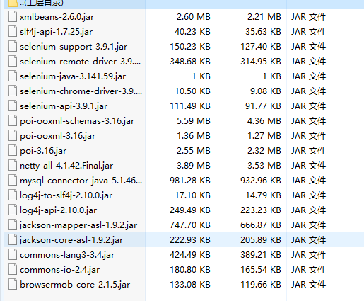
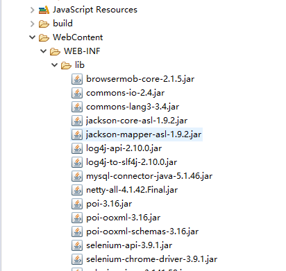
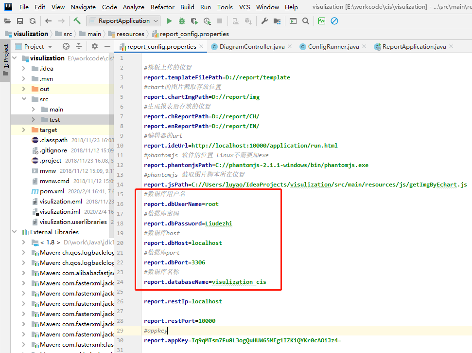
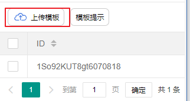
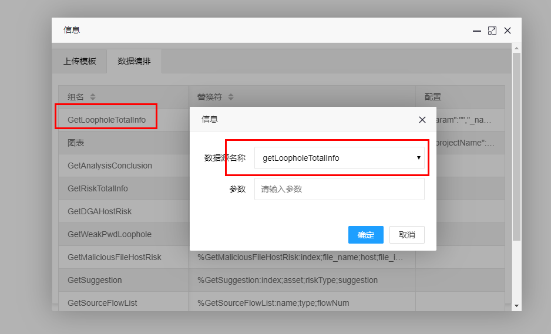
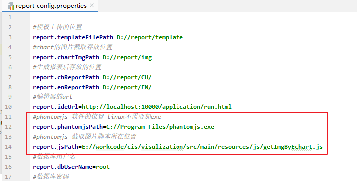

# 01.项目部署

- 笔记本：cis报表生成
- 创建时间：2020-02-05 07:54:41 UTC
- 更新时间：2020-02-24 07:57:17 UTC
- 印象笔记 GUID：6e1d8de7-7d67-45a1-928a-ff3c00395797

1.
git 拉取：ssh://luffy@121.40.56.69/home/git/visualization-Java.git

1.
下载jar包，导入拉取的项目中
 
 Jar包位置：
 

1.
把项目打成jar 包

1.
下载报表项目，把上面打的jar包导入到本地maven仓库中叫report-1.0.0.jar
 **eg：** 文件在D://a目录下，打开cmd在当前目录
 `mvn install:install-file -Dfile=D:\a\report-1.0.0.jar -DgroupId=com.serva -DartifactId=report -Dversion=1.0.0 -Dpackaging=jar`

1.
配置数据库（下载路遥给的v.sql）
 

1.
启动项目，访问`localhost/8080` 即可访问

1.
测试

  1. 上传模板
 

  1. 配置数据员（以cis为例）
 
 

  1. 下载phantomjs.exe 放在某目录下，配置
 

1.%20git%20%E6%8B%89%E5%8F%96%EF%BC%9Assh%3A%2F%2Fluffy%40121.40.56.69%2Fhome%2Fgit%2Fvisualization-Java.git%0A2.%20%E4%B8%8B%E8%BD%BDjar%E5%8C%85%EF%BC%8C%E5%AF%BC%E5%85%A5%E6%8B%89%E5%8F%96%E7%9A%84%E9%A1%B9%E7%9B%AE%E4%B8%AD%0A%20%20%20%20!%5B8ab04b19b32c36b0b69aa47f243f31a3.png%5D(en-resource%3A%2F%2Fdatabase%2F1496%3A1)%0A%20%20%20Jar%E5%8C%85%E4%BD%8D%E7%BD%AE%EF%BC%9A%0A%20%20%20!%5Bcfa23a79746f09ae8fa5787a71653a3f.png%5D(en-resource%3A%2F%2Fdatabase%2F1498%3A1)%0A%20%20%20%20%0A3.%20%E6%8A%8A%E9%A1%B9%E7%9B%AE%E6%89%93%E6%88%90jar%20%E5%8C%85%0A4.%20%E4%B8%8B%E8%BD%BD%E6%8A%A5%E8%A1%A8%E9%A1%B9%E7%9B%AE%EF%BC%8C%E6%8A%8A%E4%B8%8A%E9%9D%A2%E6%89%93%E7%9A%84jar%E5%8C%85%E5%AF%BC%E5%85%A5%E5%88%B0%E6%9C%AC%E5%9C%B0maven%E4%BB%93%E5%BA%93%E4%B8%AD%E5%8F%ABreport-1.0.0.jar%0A**eg%EF%BC%9A**%20%E6%96%87%E4%BB%B6%E5%9C%A8D%3A%2F%2Fa%E7%9B%AE%E5%BD%95%E4%B8%8B%EF%BC%8C%E6%89%93%E5%BC%80cmd%E5%9C%A8%E5%BD%93%E5%89%8D%E7%9B%AE%E5%BD%95%0A%60mvn%20install%3Ainstall-file%20-Dfile%3DD%3A%5Ca%5Creport-1.0.0.jar%20-DgroupId%3Dcom.serva%20-DartifactId%3Dreport%20-Dversion%3D1.0.0%20-Dpackaging%3Djar%60%0A%0A5.%20%E9%85%8D%E7%BD%AE%E6%95%B0%E6%8D%AE%E5%BA%93%EF%BC%88%E4%B8%8B%E8%BD%BD%E8%B7%AF%E9%81%A5%E7%BB%99%E7%9A%84v.sql%EF%BC%89%0A!%5Bbb04798e1d19e189cdcce9606df38bf3.png%5D(en-resource%3A%2F%2Fdatabase%2F1500%3A0)%0A6.%20%E5%90%AF%E5%8A%A8%E9%A1%B9%E7%9B%AE%EF%BC%8C%E8%AE%BF%E9%97%AE%60localhost%2F8080%60%20%E5%8D%B3%E5%8F%AF%E8%AE%BF%E9%97%AE%0A%0A7.%20%E6%B5%8B%E8%AF%95%0A%20%20%20%201.%20%E4%B8%8A%E4%BC%A0%E6%A8%A1%E6%9D%BF%20%0A%20%20%20%20!%5Bc951580327897c60d9c80cd365f7d7db.png%5D(en-resource%3A%2F%2Fdatabase%2F1502%3A0)%0A%20%20%20%202.%20%E9%85%8D%E7%BD%AE%E6%95%B0%E6%8D%AE%E5%91%98%EF%BC%88%E4%BB%A5cis%E4%B8%BA%E4%BE%8B%EF%BC%89%0A%20%20%20%20!%5B0b7da765c0e8d1254fc01be09e23b657.png%5D(en-resource%3A%2F%2Fdatabase%2F1504%3A0)%0A%20%20%20%20!%5B0b7da765c0e8d1254fc01be09e23b657.png%5D(en-resource%3A%2F%2Fdatabase%2F1504%3A1)%0A%20%20%20%203.%20%E4%B8%8B%E8%BD%BDphantomjs.exe%20%E6%94%BE%E5%9C%A8%E6%9F%90%E7%9B%AE%E5%BD%95%E4%B8%8B%EF%BC%8C%E9%85%8D%E7%BD%AE%0A%20%20%20%20!%5Ba074511d0469d54c6ce21b926f52d861.png%5D(en-resource%3A%2F%2Fdatabase%2F1506%3A0)%0A%20%20%20%20%0A
