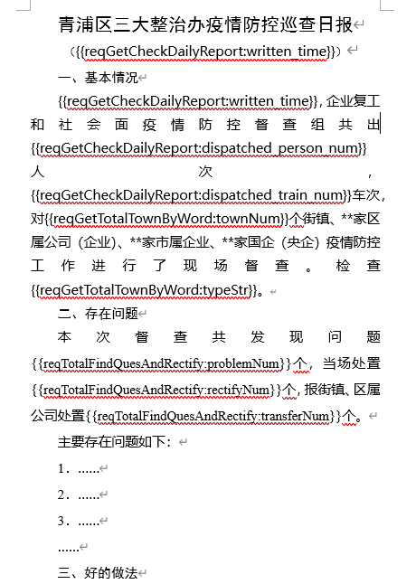
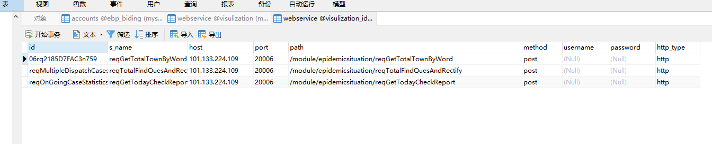

# 使用

- 笔记本：cis报表生成
- 创建时间：2020-02-24 11:42:41 UTC
- 更新时间：2020-02-24 12:06:36 UTC
- 印象笔记 GUID：f6407a8b-d410-4466-a71d-c6ae98f3bbae

运行项目（线上 120.55.191.141:8080/report)
 上传模板，eg：
 
 数据编排中会自动从word 中读取到要替换的字符串列在此处。
 点击，绑定数据源（webservice），数据源的添加（暂时没有界面）去数据库 webservice 中添加数据源。
 
 绑定数据源即可。

点击下载按钮时，会调用generalReport方法，可以在本地打断点调试来查看运行流程。

%E8%BF%90%E8%A1%8C%E9%A1%B9%E7%9B%AE%EF%BC%88%E7%BA%BF%E4%B8%8A%20120.55.191.141%3A8080%2Freport)%0A%E4%B8%8A%E4%BC%A0%E6%A8%A1%E6%9D%BF%EF%BC%8Ceg%EF%BC%9A%0A!%5B1d06a684081a7b6aae864845dfca85fc.png%5D(en-resource%3A%2F%2Fdatabase%2F1520%3A1)%0A%E6%95%B0%E6%8D%AE%E7%BC%96%E6%8E%92%E4%B8%AD%E4%BC%9A%E8%87%AA%E5%8A%A8%E4%BB%8Eword%20%E4%B8%AD%E8%AF%BB%E5%8F%96%E5%88%B0%E8%A6%81%E6%9B%BF%E6%8D%A2%E7%9A%84%E5%AD%97%E7%AC%A6%E4%B8%B2%E5%88%97%E5%9C%A8%E6%AD%A4%E5%A4%84%E3%80%82%0A%E7%82%B9%E5%87%BB%EF%BC%8C%E7%BB%91%E5%AE%9A%E6%95%B0%E6%8D%AE%E6%BA%90%EF%BC%88webservice%EF%BC%89%EF%BC%8C%E6%95%B0%E6%8D%AE%E6%BA%90%E7%9A%84%E6%B7%BB%E5%8A%A0%EF%BC%88%E6%9A%82%E6%97%B6%E6%B2%A1%E6%9C%89%E7%95%8C%E9%9D%A2%EF%BC%89%E5%8E%BB%E6%95%B0%E6%8D%AE%E5%BA%93%20webservice%20%E4%B8%AD%E6%B7%BB%E5%8A%A0%E6%95%B0%E6%8D%AE%E6%BA%90%E3%80%82%0A!%5B6680e2a680e6199192abc2d629232276.png%5D(en-resource%3A%2F%2Fdatabase%2F1522%3A1)%0A%E7%BB%91%E5%AE%9A%E6%95%B0%E6%8D%AE%E6%BA%90%E5%8D%B3%E5%8F%AF%E3%80%82%0A%0A%0A%E7%82%B9%E5%87%BB%E4%B8%8B%E8%BD%BD%E6%8C%89%E9%92%AE%E6%97%B6%EF%BC%8C%E4%BC%9A%E8%B0%83%E7%94%A8generalReport%E6%96%B9%E6%B3%95%EF%BC%8C%E5%8F%AF%E4%BB%A5%E5%9C%A8%E6%9C%AC%E5%9C%B0%E6%89%93%E6%96%AD%E7%82%B9%E8%B0%83%E8%AF%95%E6%9D%A5%E6%9F%A5%E7%9C%8B%E8%BF%90%E8%A1%8C%E6%B5%81%E7%A8%8B%E3%80%82%0A%0A%0A
