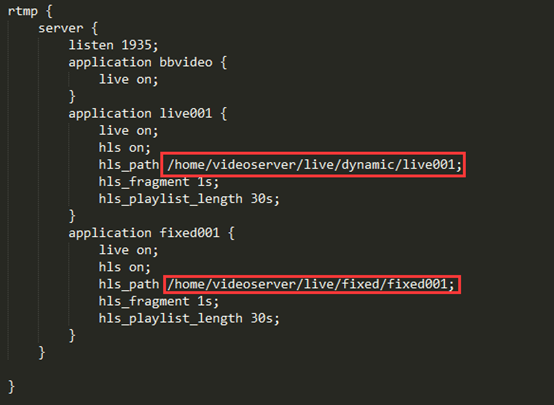

# 2.视频服务器安装

- 笔记本：视频服务器
- 创建时间：2019-12-23 06:46:47 UTC
- 更新时间：2019-12-23 09:16:00 UTC
- 原始链接：https://www.cnblogs.com/lmaster/p/9947028.html
- 印象笔记 GUID：60602147-c3e7-42e2-a400-8ddfc0c526c0

#### 安装ffmpeg

```
sudo apt-get install ffmpeg

```

#### 安装node

安装nvm

```
# 首先安装必要的包
sudo apt-get install build-essential libssl-dev

# 通过curl/wget
 curl -o- https://raw.githubusercontent.com/creationix/nvm/v0.25.2/install.sh | bash

 # 重新打开终端
 nvm --version
 nvm ls-remote
 nvm install v8.12.0
 nvm ls
 nvm current
 nvm use v...

```

安装 forever 模块

```
sudo npm install forever -g

```

#### 允许root远程登录

```
sudo vim /etc/ssh/sshd_config
PermitRootLogin yes
service sshd restart

```

#### 安装nginx

1. 下载nginx和nginx-rtmp 编译依赖工具

```
sudo apt-get install build-essential libpcre3 libpcre3-dev libssl-dev

```

1. 切换到/usr/local 目录

```
cd /usr/local

```

1. 下载nginx 和nginx-rtmp 源码

```
sudo wget http://nginx.org/download/nginx-1.7.5.tar.gz
sudo wget https://github.com/arut/nginx-rtmp-module/archive/master.zip

```

1. 安装unzip 工具，解压下载的安装包

```
sudo apt-get install unzip

```

1. 解压nginx 和nginx-rtmp 安装包

```
tar -zxvf nginx-1.7.5.tar.gz
unzip master.zip

```

1. 切换到nginx目录

```
cd nginx-1.7.5

```

1. 添加nginx-rtmp 模板编译到 nginx

```
./configure --with-http_ssl_module --add-module=../nginx-rtmp-module-master

```

1. 编译安装

```
make
sudo make install

```

1. 配置nginx.conf

```

#user  nobody;
worker_processes  1;
#error_log  logs/error.log;
#error_log  logs/error.log  notice;
#error_log  logs/error.log  info;
#pid        logs/nginx.pid;
events {
    worker_connections  1024;
}
rtmp {
    server {
        listen 1935;
        application bbvideo {
            live on;
        }
        application live001 {
            live on;
            hls on;
            hls_path /home/videoserver/live/dynamic/live001;
            hls_fragment 1s;
            hls_playlist_length 30s;
        }
        application live002 {
            live on;
            hls on;
            hls_path /home/videoserver/live/dynamic/live002;
            hls_fragment 1s;
            hls_playlist_length 30s;
        }
        application live003 {
            live on;
            hls on;
            hls_path /home/videoserver/live/dynamic/live003;
            hls_fragment 1s;
            hls_playlist_length 30s;
        }
        application live004 {
            live on;
            hls on;
            hls_path /home/videoserver/live/dynamic/live004;
            hls_fragment 1s;
            hls_playlist_length 30s;
        }
        application live005 {
            live on;
            hls on;
            hls_path /home/videoserver/live/dynamic/live005;
            hls_fragment 1s;
            hls_playlist_length 30s;
        }
        application live006 {
            live on;
            hls on;
            hls_path /home/videoserver/live/dynamic/live006;
            hls_fragment 1s;
            hls_playlist_length 30s;
        }
        application fixed001 {
            live on;
            hls on;
            hls_path /home/videoserver/live/fixed/fixed001;
            hls_fragment 1s;
            hls_playlist_length 30s;
        }
    }
}
http {
    include       mime.types;
    default_type  application/octet-stream;
    #log_format  main  '$remote_addr - $remote_user [$time_local] "$request" '
    #                  '$status $body_bytes_sent "$http_referer" '
    #                  '"$http_user_agent" "$http_x_forwarded_for"';
    #access_log  logs/access.log  main;
    sendfile        on;
    #tcp_nopush     on;
    #keepalive_timeout  0;
    keepalive_timeout  65;
    #gzip  on;
    server {
        listen       10004;
        server_name  192.168.1.64;
        #charset koi8-r;
        #access_log  logs/host.access.log  main;
        location / {
            add_header Access-Control-Allow-Origin *;
            allow all;
            add_header Access-Control-Allow-Credentials true;
            add_header Access-Control-Allow-Headers DNT,X-CustomHeader,Keep-Alive,User-Agent,X-Requested-With,If-Modified-Since,Cache-Control,Content-Type;
            add_header Access-Control-Allow-Methods PUT,POST,GET,DELETE,OPTIONS;
            root   html;
            index  index.html index.htm;
            #proxy_pass http://192.168.110.11:10004;
        }
    
        location /stat{
            rtmp_stat all;
            rtmp_stat_stylesheet stat.xsl;
        }
        location /stat.xsl {
            root /usr/local/nginx-rtmp-module-master/;
        }
        location /control{
            rtmp_control all;
        }
        error_page 500 502 503 504 /50.html;
        location /live001{
            types{
                application/vnd.apple.mpegurl m3u8;
                video/mp2t ts;
            }
            root /home/videoserver/live/dynamic;
            add_header Cache-Control no-cache;
            add_header Access-Control-Allow-Origin *;
        }
        location /live002{
            types{
                application/vnd.apple.mpegurl m3u8;
                video/mp2t ts;
            }
            root /home/videoserver/live/dynamic;
            add_header Cache-Control no-cache;
            add_header Access-Control-Allow-Origin *;
        }
        location /live003{
            types{
                application/vnd.apple.mpegurl m3u8;
                video/mp2t ts;
            }
            root /home/videoserver/live/dynamic;
            add_header Cache-Control no-cache;
            add_header Access-Control-Allow-Origin *;
        }
        location /live004{
            types{
                application/vnd.apple.mpegurl m3u8;
                video/mp2t ts;
            }
            root /home/videoserver/live/dynamic;
            add_header Cache-Control no-cache;
            add_header Access-Control-Allow-Origin *;
        }
        location /live005{
            types{
                application/vnd.apple.mpegurl m3u8;
                video/mp2t ts;
            }
            root /home/videoserver/live/dynamic;
            add_header Cache-Control no-cache;
            add_header Access-Control-Allow-Origin *;
        }
        location /live006{
            types{
                application/vnd.apple.mpegurl m3u8;
                video/mp2t ts;
            }
            root /home/videoserver/live/dynamic;
            add_header Cache-Control no-cache;
            add_header Access-Control-Allow-Origin *;
        }
        location /fixed001 {
            types {
                application/vnd.apple.mpegurl m3u8;
                video/mp2t ts;
            }
            root /home/videoserver/live/fixed;
            add_header Cache-Control no-cache;
            add_header Access-Control-Allow-Origin *;
        }
        #error_page  404              /404.html;
        # redirect server error pages to the static page /50x.html
        #
        error_page   500 502 503 504  /50x.html;
        location = /50x.html {
            root   html;
        }
        # proxy the PHP scripts to Apache listening on 127.0.0.1:80
        #
        #location ~ \.php$ {
        #    proxy_pass   http://127.0.0.1;
        #}
        # pass the PHP scripts to FastCGI server listening on 127.0.0.1:9000
        #
        #location ~ \.php$ {
        #    root           html;
        #    fastcgi_pass   127.0.0.1:9000;
        #    fastcgi_index  index.php;
        #    fastcgi_param  SCRIPT_FILENAME  /scripts$fastcgi_script_name;
        #    include        fastcgi_params;
        #}
        # deny access to .htaccess files, if Apache's document root
        # concurs with nginx's one
        #
        #location ~ /\.ht {
        #    deny  all;
        #}
    }
    # another virtual host using mix of IP-, name-, and port-based configuration
    #
    #server {
    #    listen       8000;
    #    listen       somename:8080;
    #    server_name  somename  alias  another.alias;
    #    location / {
    #        root   html;
    #        index  index.html index.htm;
    #    }
    #}
    # HTTPS server
    #
    #server {
    #    listen       443 ssl;
    #    server_name  localhost;
    #    ssl_certificate      cert.pem;
    #    ssl_certificate_key  cert.key;
    #    ssl_session_cache    shared:SSL:1m;
    #    ssl_session_timeout  5m;
    #    ssl_ciphers  HIGH:!aNULL:!MD5;
    #    ssl_prefer_server_ciphers  on;
    #    location / {
    #        root   html;
    #        index  index.html index.htm;
    #    }
    #}
}

```

1.
在ubuntu上创建同名目录/文件夹
 

1.
赋予写权限

```
chmod +w *

```

1. 安装 nginx init 脚本

```
sudo wget https://raw.github.com/JasonGiedymin/nginx-init-ubuntu/master/nginx -O /etc/init.d/nginx
sudo chmod +x /etc/init.d/nginx
sudo update-rc.d nginx defaults

```

1. 启动和停止nginx 服务，生成配置文件

```
sudo service nginx start
sudo service nginx stop

```

%23%23%23%23%20%E5%AE%89%E8%A3%85ffmpeg%0A%60%60%60shell%0Asudo%20apt-get%20install%20ffmpeg%0A%60%60%60%0A%0A%23%23%23%23%20%E5%AE%89%E8%A3%85node%0A%E5%AE%89%E8%A3%85nvm%0A%60%60%60shell%0A%23%20%E9%A6%96%E5%85%88%E5%AE%89%E8%A3%85%E5%BF%85%E8%A6%81%E7%9A%84%E5%8C%85%0Asudo%20apt-get%20install%20build-essential%20libssl-dev%0A%0A%23%20%E9%80%9A%E8%BF%87curl%2Fwget%0A%C2%A0curl%20-o-%20https%3A%2F%2Fraw.githubusercontent.com%2Fcreationix%2Fnvm%2Fv0.25.2%2Finstall.sh%20%7C%20bash%0A%20%0A%20%23%20%E9%87%8D%E6%96%B0%E6%89%93%E5%BC%80%E7%BB%88%E7%AB%AF%0A%20nvm%20--version%0A%20nvm%20ls-remote%0A%20nvm%20install%20v8.12.0%0A%20nvm%20ls%0A%20nvm%20current%0A%20nvm%20use%20v...%0A%60%60%60%0A%E5%AE%89%E8%A3%85%20forever%20%E6%A8%A1%E5%9D%97%0A%60%60%60shell%0Asudo%20npm%20install%20forever%20-g%0A%60%60%60%0A%0A%23%23%23%23%20%E5%85%81%E8%AE%B8root%E8%BF%9C%E7%A8%8B%E7%99%BB%E5%BD%95%0A%60%60%60shell%0Asudo%20vim%20%2Fetc%2Fssh%2Fsshd_config%0APermitRootLogin%20yes%0Aservice%20sshd%20restart%0A%60%60%60%0A%23%23%23%23%20%E5%AE%89%E8%A3%85nginx%0A1.%20%E4%B8%8B%E8%BD%BDnginx%E5%92%8Cnginx-rtmp%20%E7%BC%96%E8%AF%91%E4%BE%9D%E8%B5%96%E5%B7%A5%E5%85%B7%0A%60%60%60shell%0Asudo%20apt-get%20install%20build-essential%20libpcre3%20libpcre3-dev%20libssl-dev%0A%60%60%60%0A2.%20%E5%88%87%E6%8D%A2%E5%88%B0%2Fusr%2Flocal%20%E7%9B%AE%E5%BD%95%0A%60%60%60shell%0Acd%20%2Fusr%2Flocal%0A%60%60%60%0A3.%20%E4%B8%8B%E8%BD%BDnginx%20%E5%92%8Cnginx-rtmp%20%E6%BA%90%E7%A0%81%0A%60%60%60shell%0Asudo%20wget%20http%3A%2F%2Fnginx.org%2Fdownload%2Fnginx-1.7.5.tar.gz%0Asudo%20wget%20https%3A%2F%2Fgithub.com%2Farut%2Fnginx-rtmp-module%2Farchive%2Fmaster.zip%0A%60%60%60%0A4.%20%E5%AE%89%E8%A3%85unzip%20%E5%B7%A5%E5%85%B7%EF%BC%8C%E8%A7%A3%E5%8E%8B%E4%B8%8B%E8%BD%BD%E7%9A%84%E5%AE%89%E8%A3%85%E5%8C%85%0A%60%60%60shell%0Asudo%20apt-get%20install%20unzip%0A%60%60%60%0A%0A5.%20%E8%A7%A3%E5%8E%8Bnginx%20%E5%92%8Cnginx-rtmp%20%E5%AE%89%E8%A3%85%E5%8C%85%0A%60%60%60shell%0Atar%20-zxvf%20nginx-1.7.5.tar.gz%0Aunzip%20master.zip%0A%60%60%60%0A%0A6.%20%E5%88%87%E6%8D%A2%E5%88%B0nginx%E7%9B%AE%E5%BD%95%0A%60%60%60shell%0Acd%20nginx-1.7.5%0A%60%60%60%0A7.%20%E6%B7%BB%E5%8A%A0nginx-rtmp%20%E6%A8%A1%E6%9D%BF%E7%BC%96%E8%AF%91%E5%88%B0%20nginx%0A%60%60%60shell%0A.%2Fconfigure%20--with-http_ssl_module%20--add-module%3D..%2Fnginx-rtmp-module-master%0A%60%60%60%0A8.%20%E7%BC%96%E8%AF%91%E5%AE%89%E8%A3%85%0A%60%60%60shell%0Amake%20%0Asudo%20make%20install%0A%60%60%60%0A%0A9.%20%E9%85%8D%E7%BD%AEnginx.conf%0A%60%60%60%20conf%0A%0A%23user%C2%A0%C2%A0nobody%3B%0Aworker_processes%C2%A0%C2%A01%3B%0A%23error_log%C2%A0%C2%A0logs%2Ferror.log%3B%0A%23error_log%C2%A0%C2%A0logs%2Ferror.log%C2%A0%C2%A0notice%3B%0A%23error_log%C2%A0%C2%A0logs%2Ferror.log%C2%A0%C2%A0info%3B%0A%23pid%C2%A0%C2%A0%C2%A0%C2%A0%C2%A0%C2%A0%C2%A0%C2%A0logs%2Fnginx.pid%3B%0Aevents%C2%A0%7B%0A%C2%A0%C2%A0%C2%A0%C2%A0worker_connections%C2%A0%C2%A01024%3B%0A%7D%0Artmp%C2%A0%7B%0A%C2%A0%C2%A0%C2%A0%C2%A0server%C2%A0%7B%0A%C2%A0%C2%A0%C2%A0%C2%A0%C2%A0%C2%A0%C2%A0%C2%A0listen%C2%A01935%3B%0A%C2%A0%C2%A0%C2%A0%C2%A0%C2%A0%C2%A0%C2%A0%C2%A0application%C2%A0bbvideo%C2%A0%7B%0A%C2%A0%C2%A0%C2%A0%C2%A0%C2%A0%C2%A0%C2%A0%C2%A0%C2%A0%C2%A0%C2%A0%C2%A0live%C2%A0on%3B%0A%C2%A0%C2%A0%C2%A0%C2%A0%C2%A0%C2%A0%C2%A0%C2%A0%7D%0A%C2%A0%C2%A0%C2%A0%C2%A0%C2%A0%C2%A0%C2%A0%C2%A0application%C2%A0live001%C2%A0%7B%0A%C2%A0%C2%A0%C2%A0%C2%A0%C2%A0%C2%A0%C2%A0%C2%A0%C2%A0%C2%A0%C2%A0%C2%A0live%C2%A0on%3B%0A%C2%A0%C2%A0%C2%A0%C2%A0%C2%A0%C2%A0%C2%A0%C2%A0%C2%A0%C2%A0%C2%A0%C2%A0hls%C2%A0on%3B%0A%C2%A0%C2%A0%C2%A0%C2%A0%C2%A0%C2%A0%C2%A0%C2%A0%C2%A0%C2%A0%C2%A0%C2%A0hls_path%C2%A0%2Fhome%2Fvideoserver%2Flive%2Fdynamic%2Flive001%3B%0A%C2%A0%C2%A0%C2%A0%C2%A0%C2%A0%C2%A0%C2%A0%C2%A0%C2%A0%C2%A0%C2%A0%C2%A0hls_fragment%C2%A01s%3B%0A%C2%A0%C2%A0%C2%A0%C2%A0%C2%A0%C2%A0%C2%A0%C2%A0%C2%A0%C2%A0%C2%A0%C2%A0hls_playlist_length%C2%A030s%3B%0A%C2%A0%C2%A0%C2%A0%C2%A0%C2%A0%C2%A0%C2%A0%C2%A0%7D%0A%C2%A0%C2%A0%C2%A0%C2%A0%C2%A0%C2%A0%C2%A0%C2%A0application%C2%A0live002%C2%A0%7B%0A%C2%A0%C2%A0%C2%A0%C2%A0%C2%A0%C2%A0%C2%A0%C2%A0%C2%A0%C2%A0%C2%A0%C2%A0live%C2%A0on%3B%0A%C2%A0%C2%A0%C2%A0%C2%A0%C2%A0%C2%A0%C2%A0%C2%A0%C2%A0%C2%A0%C2%A0%C2%A0hls%C2%A0on%3B%0A%C2%A0%C2%A0%C2%A0%C2%A0%C2%A0%C2%A0%C2%A0%C2%A0%C2%A0%C2%A0%C2%A0%C2%A0hls_path%C2%A0%2Fhome%2Fvideoserver%2Flive%2Fdynamic%2Flive002%3B%0A%C2%A0%C2%A0%C2%A0%C2%A0%C2%A0%C2%A0%C2%A0%C2%A0%C2%A0%C2%A0%C2%A0%C2%A0hls_fragment%C2%A01s%3B%0A%C2%A0%C2%A0%C2%A0%C2%A0%C2%A0%C2%A0%C2%A0%C2%A0%C2%A0%C2%A0%C2%A0%C2%A0hls_playlist_length%C2%A030s%3B%0A%C2%A0%C2%A0%C2%A0%C2%A0%C2%A0%C2%A0%C2%A0%C2%A0%7D%0A%C2%A0%C2%A0%C2%A0%C2%A0%C2%A0%C2%A0%C2%A0%C2%A0application%C2%A0live003%C2%A0%7B%0A%C2%A0%C2%A0%C2%A0%C2%A0%C2%A0%C2%A0%C2%A0%C2%A0%C2%A0%C2%A0%C2%A0%C2%A0live%C2%A0on%3B%0A%C2%A0%C2%A0%C2%A0%C2%A0%C2%A0%C2%A0%C2%A0%C2%A0%C2%A0%C2%A0%C2%A0%C2%A0hls%C2%A0on%3B%0A%C2%A0%C2%A0%C2%A0%C2%A0%C2%A0%C2%A0%C2%A0%C2%A0%C2%A0%C2%A0%C2%A0%C2%A0hls_path%C2%A0%2Fhome%2Fvideoserver%2Flive%2Fdynamic%2Flive003%3B%0A%C2%A0%C2%A0%C2%A0%C2%A0%C2%A0%C2%A0%C2%A0%C2%A0%C2%A0%C2%A0%C2%A0%C2%A0hls_fragment%C2%A01s%3B%0A%C2%A0%C2%A0%C2%A0%C2%A0%C2%A0%C2%A0%C2%A0%C2%A0%C2%A0%C2%A0%C2%A0%C2%A0hls_playlist_length%C2%A030s%3B%0A%C2%A0%C2%A0%C2%A0%C2%A0%C2%A0%C2%A0%C2%A0%C2%A0%7D%0A%C2%A0%C2%A0%C2%A0%C2%A0%C2%A0%C2%A0%C2%A0%C2%A0application%C2%A0live004%C2%A0%7B%0A%C2%A0%C2%A0%C2%A0%C2%A0%C2%A0%C2%A0%C2%A0%C2%A0%C2%A0%C2%A0%C2%A0%C2%A0live%C2%A0on%3B%0A%C2%A0%C2%A0%C2%A0%C2%A0%C2%A0%C2%A0%C2%A0%C2%A0%C2%A0%C2%A0%C2%A0%C2%A0hls%C2%A0on%3B%0A%C2%A0%C2%A0%C2%A0%C2%A0%C2%A0%C2%A0%C2%A0%C2%A0%C2%A0%C2%A0%C2%A0%C2%A0hls_path%C2%A0%2Fhome%2Fvideoserver%2Flive%2Fdynamic%2Flive004%3B%0A%C2%A0%C2%A0%C2%A0%C2%A0%C2%A0%C2%A0%C2%A0%C2%A0%C2%A0%C2%A0%C2%A0%C2%A0hls_fragment%C2%A01s%3B%0A%C2%A0%C2%A0%C2%A0%C2%A0%C2%A0%C2%A0%C2%A0%C2%A0%C2%A0%C2%A0%C2%A0%C2%A0hls_playlist_length%C2%A030s%3B%0A%C2%A0%C2%A0%C2%A0%C2%A0%C2%A0%C2%A0%C2%A0%C2%A0%7D%0A%C2%A0%C2%A0%C2%A0%C2%A0%C2%A0%C2%A0%C2%A0%C2%A0application%C2%A0live005%C2%A0%7B%0A%C2%A0%C2%A0%C2%A0%C2%A0%C2%A0%C2%A0%C2%A0%C2%A0%C2%A0%C2%A0%C2%A0%C2%A0live%C2%A0on%3B%0A%C2%A0%C2%A0%C2%A0%C2%A0%C2%A0%C2%A0%C2%A0%C2%A0%C2%A0%C2%A0%C2%A0%C2%A0hls%C2%A0on%3B%0A%C2%A0%C2%A0%C2%A0%C2%A0%C2%A0%C2%A0%C2%A0%C2%A0%C2%A0%C2%A0%C2%A0%C2%A0hls_path%C2%A0%2Fhome%2Fvideoserver%2Flive%2Fdynamic%2Flive005%3B%0A%C2%A0%C2%A0%C2%A0%C2%A0%C2%A0%C2%A0%C2%A0%C2%A0%C2%A0%C2%A0%C2%A0%C2%A0hls_fragment%C2%A01s%3B%0A%C2%A0%C2%A0%C2%A0%C2%A0%C2%A0%C2%A0%C2%A0%C2%A0%C2%A0%C2%A0%C2%A0%C2%A0hls_playlist_length%C2%A030s%3B%0A%C2%A0%C2%A0%C2%A0%C2%A0%C2%A0%C2%A0%C2%A0%C2%A0%7D%0A%C2%A0%C2%A0%C2%A0%C2%A0%C2%A0%C2%A0%C2%A0%C2%A0application%C2%A0live006%C2%A0%7B%0A%C2%A0%C2%A0%C2%A0%C2%A0%C2%A0%C2%A0%C2%A0%C2%A0%C2%A0%C2%A0%C2%A0%C2%A0live%C2%A0on%3B%0A%C2%A0%C2%A0%C2%A0%C2%A0%C2%A0%C2%A0%C2%A0%C2%A0%C2%A0%C2%A0%C2%A0%C2%A0hls%C2%A0on%3B%0A%C2%A0%C2%A0%C2%A0%C2%A0%C2%A0%C2%A0%C2%A0%C2%A0%C2%A0%C2%A0%C2%A0%C2%A0hls_path%C2%A0%2Fhome%2Fvideoserver%2Flive%2Fdynamic%2Flive006%3B%0A%C2%A0%C2%A0%C2%A0%C2%A0%C2%A0%C2%A0%C2%A0%C2%A0%C2%A0%C2%A0%C2%A0%C2%A0hls_fragment%C2%A01s%3B%0A%C2%A0%C2%A0%C2%A0%C2%A0%C2%A0%C2%A0%C2%A0%C2%A0%C2%A0%C2%A0%C2%A0%C2%A0hls_playlist_length%C2%A030s%3B%0A%C2%A0%C2%A0%C2%A0%C2%A0%C2%A0%C2%A0%C2%A0%C2%A0%7D%0A%C2%A0%C2%A0%C2%A0%C2%A0%C2%A0%C2%A0%C2%A0%C2%A0application%C2%A0fixed001%C2%A0%7B%0A%C2%A0%C2%A0%C2%A0%C2%A0%C2%A0%C2%A0%C2%A0%C2%A0%C2%A0%C2%A0%C2%A0%C2%A0live%C2%A0on%3B%0A%C2%A0%C2%A0%C2%A0%C2%A0%C2%A0%C2%A0%C2%A0%C2%A0%C2%A0%C2%A0%C2%A0%C2%A0hls%C2%A0on%3B%0A%C2%A0%C2%A0%C2%A0%C2%A0%C2%A0%C2%A0%C2%A0%C2%A0%C2%A0%C2%A0%C2%A0%C2%A0hls_path%C2%A0%2Fhome%2Fvideoserver%2Flive%2Ffixed%2Ffixed001%3B%0A%C2%A0%C2%A0%C2%A0%C2%A0%C2%A0%C2%A0%C2%A0%C2%A0%C2%A0%C2%A0%C2%A0%C2%A0hls_fragment%C2%A01s%3B%0A%C2%A0%C2%A0%C2%A0%C2%A0%C2%A0%C2%A0%C2%A0%C2%A0%C2%A0%C2%A0%C2%A0%C2%A0hls_playlist_length%C2%A030s%3B%0A%C2%A0%C2%A0%C2%A0%C2%A0%C2%A0%C2%A0%C2%A0%C2%A0%7D%0A%C2%A0%C2%A0%C2%A0%C2%A0%7D%0A%7D%0Ahttp%C2%A0%7B%0A%C2%A0%C2%A0%C2%A0%C2%A0include%C2%A0%C2%A0%C2%A0%C2%A0%C2%A0%C2%A0%C2%A0mime.types%3B%0A%C2%A0%C2%A0%C2%A0%C2%A0default_type%C2%A0%C2%A0application%2Foctet-stream%3B%0A%C2%A0%C2%A0%C2%A0%C2%A0%23log_format%C2%A0%C2%A0main%C2%A0%C2%A0'%24remote_addr%C2%A0-%C2%A0%24remote_user%C2%A0%5B%24time_local%5D%C2%A0%22%24request%22%C2%A0'%0A%C2%A0%C2%A0%C2%A0%C2%A0%23%C2%A0%C2%A0%C2%A0%C2%A0%C2%A0%C2%A0%C2%A0%C2%A0%C2%A0%C2%A0%C2%A0%C2%A0%C2%A0%C2%A0%C2%A0%C2%A0%C2%A0%C2%A0'%24status%C2%A0%24body_bytes_sent%C2%A0%22%24http_referer%22%C2%A0'%0A%C2%A0%C2%A0%C2%A0%C2%A0%23%C2%A0%C2%A0%C2%A0%C2%A0%C2%A0%C2%A0%C2%A0%C2%A0%C2%A0%C2%A0%C2%A0%C2%A0%C2%A0%C2%A0%C2%A0%C2%A0%C2%A0%C2%A0'%22%24http_user_agent%22%C2%A0%22%24http_x_forwarded_for%22'%3B%0A%C2%A0%C2%A0%C2%A0%C2%A0%23access_log%C2%A0%C2%A0logs%2Faccess.log%C2%A0%C2%A0main%3B%0A%C2%A0%C2%A0%C2%A0%C2%A0sendfile%C2%A0%C2%A0%C2%A0%C2%A0%C2%A0%C2%A0%C2%A0%C2%A0on%3B%0A%C2%A0%C2%A0%C2%A0%C2%A0%23tcp_nopush%C2%A0%C2%A0%C2%A0%C2%A0%C2%A0on%3B%0A%C2%A0%C2%A0%C2%A0%C2%A0%23keepalive_timeout%C2%A0%C2%A00%3B%0A%C2%A0%C2%A0%C2%A0%C2%A0keepalive_timeout%C2%A0%C2%A065%3B%0A%C2%A0%C2%A0%C2%A0%C2%A0%23gzip%C2%A0%C2%A0on%3B%0A%C2%A0%C2%A0%C2%A0%C2%A0server%C2%A0%7B%0A%C2%A0%C2%A0%C2%A0%C2%A0%C2%A0%C2%A0%C2%A0%C2%A0listen%C2%A0%C2%A0%C2%A0%C2%A0%C2%A0%C2%A0%C2%A010004%3B%0A%C2%A0%C2%A0%C2%A0%C2%A0%C2%A0%C2%A0%C2%A0%C2%A0server_name%C2%A0%C2%A0192.168.1.64%3B%0A%C2%A0%C2%A0%C2%A0%C2%A0%C2%A0%C2%A0%C2%A0%C2%A0%23charset%C2%A0koi8-r%3B%0A%C2%A0%C2%A0%C2%A0%C2%A0%C2%A0%C2%A0%C2%A0%C2%A0%23access_log%C2%A0%C2%A0logs%2Fhost.access.log%C2%A0%C2%A0main%3B%0A%C2%A0%C2%A0%C2%A0%C2%A0%C2%A0%C2%A0%C2%A0%C2%A0location%C2%A0%2F%C2%A0%7B%0A%C2%A0%C2%A0%C2%A0%C2%A0%C2%A0%C2%A0%C2%A0%C2%A0%C2%A0%C2%A0%C2%A0%C2%A0add_header%C2%A0Access-Control-Allow-Origin%C2%A0*%3B%0A%C2%A0%C2%A0%C2%A0%C2%A0%C2%A0%C2%A0%C2%A0%C2%A0%C2%A0%C2%A0%C2%A0%C2%A0allow%C2%A0all%3B%0A%C2%A0%C2%A0%C2%A0%C2%A0%C2%A0%C2%A0%C2%A0%C2%A0%C2%A0%C2%A0%C2%A0%C2%A0add_header%C2%A0Access-Control-Allow-Credentials%C2%A0true%3B%0A%C2%A0%C2%A0%C2%A0%C2%A0%C2%A0%C2%A0%C2%A0%C2%A0%C2%A0%C2%A0%C2%A0%C2%A0add_header%C2%A0Access-Control-Allow-Headers%C2%A0DNT%2CX-CustomHeader%2CKeep-Alive%2CUser-Agent%2CX-Requested-With%2CIf-Modified-Since%2CCache-Control%2CContent-Type%3B%0A%C2%A0%C2%A0%C2%A0%C2%A0%C2%A0%C2%A0%C2%A0%C2%A0%C2%A0%C2%A0%C2%A0%C2%A0add_header%C2%A0Access-Control-Allow-Methods%C2%A0PUT%2CPOST%2CGET%2CDELETE%2COPTIONS%3B%0A%C2%A0%C2%A0%C2%A0%C2%A0%C2%A0%C2%A0%C2%A0%C2%A0%C2%A0%C2%A0%C2%A0%C2%A0root%C2%A0%C2%A0%C2%A0html%3B%0A%C2%A0%C2%A0%C2%A0%C2%A0%C2%A0%C2%A0%C2%A0%C2%A0%C2%A0%C2%A0%C2%A0%C2%A0index%C2%A0%C2%A0index.html%C2%A0index.htm%3B%0A%C2%A0%C2%A0%C2%A0%C2%A0%C2%A0%C2%A0%C2%A0%C2%A0%C2%A0%C2%A0%C2%A0%C2%A0%23proxy_pass%C2%A0http%3A%2F%2F192.168.110.11%3A10004%3B%0A%C2%A0%C2%A0%C2%A0%C2%A0%C2%A0%C2%A0%C2%A0%C2%A0%7D%0A%C2%A0%C2%A0%C2%A0%C2%A0%0A%C2%A0%C2%A0%C2%A0%C2%A0%C2%A0%C2%A0%C2%A0%C2%A0location%C2%A0%2Fstat%7B%0A%C2%A0%C2%A0%C2%A0%C2%A0%C2%A0%C2%A0%C2%A0%C2%A0%C2%A0%C2%A0%C2%A0%C2%A0rtmp_stat%C2%A0all%3B%0A%C2%A0%C2%A0%C2%A0%C2%A0%C2%A0%C2%A0%C2%A0%C2%A0%C2%A0%C2%A0%C2%A0%C2%A0rtmp_stat_stylesheet%C2%A0stat.xsl%3B%0A%C2%A0%C2%A0%C2%A0%C2%A0%C2%A0%C2%A0%C2%A0%C2%A0%7D%0A%C2%A0%C2%A0%C2%A0%C2%A0%C2%A0%C2%A0%C2%A0%C2%A0location%C2%A0%2Fstat.xsl%C2%A0%7B%0A%C2%A0%C2%A0%C2%A0%C2%A0%C2%A0%C2%A0%C2%A0%C2%A0%C2%A0%C2%A0%C2%A0%C2%A0root%C2%A0%2Fusr%2Flocal%2Fnginx-rtmp-module-master%2F%3B%0A%C2%A0%C2%A0%C2%A0%C2%A0%C2%A0%C2%A0%C2%A0%C2%A0%7D%0A%C2%A0%C2%A0%C2%A0%C2%A0%C2%A0%C2%A0%C2%A0%C2%A0location%C2%A0%2Fcontrol%7B%0A%C2%A0%C2%A0%C2%A0%C2%A0%C2%A0%C2%A0%C2%A0%C2%A0%C2%A0%C2%A0%C2%A0%C2%A0rtmp_control%C2%A0all%3B%0A%C2%A0%C2%A0%C2%A0%C2%A0%C2%A0%C2%A0%C2%A0%C2%A0%7D%0A%C2%A0%C2%A0%C2%A0%C2%A0%C2%A0%C2%A0%C2%A0%C2%A0error_page%C2%A0500%C2%A0502%C2%A0503%C2%A0504%C2%A0%2F50.html%3B%0A%C2%A0%C2%A0%C2%A0%C2%A0%C2%A0%C2%A0%C2%A0%C2%A0location%C2%A0%2Flive001%7B%0A%C2%A0%C2%A0%C2%A0%C2%A0%C2%A0%C2%A0%C2%A0%C2%A0%C2%A0%C2%A0%C2%A0%C2%A0types%7B%0A%C2%A0%C2%A0%C2%A0%C2%A0%C2%A0%C2%A0%C2%A0%C2%A0%C2%A0%C2%A0%C2%A0%C2%A0%C2%A0%C2%A0%C2%A0%C2%A0application%2Fvnd.apple.mpegurl%C2%A0m3u8%3B%0A%C2%A0%C2%A0%C2%A0%C2%A0%C2%A0%C2%A0%C2%A0%C2%A0%C2%A0%C2%A0%C2%A0%C2%A0%C2%A0%C2%A0%C2%A0%C2%A0video%2Fmp2t%C2%A0ts%3B%0A%C2%A0%C2%A0%C2%A0%C2%A0%C2%A0%C2%A0%C2%A0%C2%A0%C2%A0%C2%A0%C2%A0%C2%A0%7D%0A%C2%A0%C2%A0%C2%A0%C2%A0%C2%A0%C2%A0%C2%A0%C2%A0%C2%A0%C2%A0%C2%A0%C2%A0root%C2%A0%2Fhome%2Fvideoserver%2Flive%2Fdynamic%3B%0A%C2%A0%C2%A0%C2%A0%C2%A0%C2%A0%C2%A0%C2%A0%C2%A0%C2%A0%C2%A0%C2%A0%C2%A0add_header%C2%A0Cache-Control%C2%A0no-cache%3B%0A%C2%A0%C2%A0%C2%A0%C2%A0%C2%A0%C2%A0%C2%A0%C2%A0%C2%A0%C2%A0%C2%A0%C2%A0add_header%C2%A0Access-Control-Allow-Origin%C2%A0*%3B%0A%C2%A0%C2%A0%C2%A0%C2%A0%C2%A0%C2%A0%C2%A0%C2%A0%7D%0A%C2%A0%C2%A0%C2%A0%C2%A0%C2%A0%C2%A0%C2%A0%C2%A0location%C2%A0%2Flive002%7B%0A%C2%A0%C2%A0%C2%A0%C2%A0%C2%A0%C2%A0%C2%A0%C2%A0%C2%A0%C2%A0%C2%A0%C2%A0types%7B%0A%C2%A0%C2%A0%C2%A0%C2%A0%C2%A0%C2%A0%C2%A0%C2%A0%C2%A0%C2%A0%C2%A0%C2%A0%C2%A0%C2%A0%C2%A0%C2%A0application%2Fvnd.apple.mpegurl%C2%A0m3u8%3B%0A%C2%A0%C2%A0%C2%A0%C2%A0%C2%A0%C2%A0%C2%A0%C2%A0%C2%A0%C2%A0%C2%A0%C2%A0%C2%A0%C2%A0%C2%A0%C2%A0video%2Fmp2t%C2%A0ts%3B%0A%C2%A0%C2%A0%C2%A0%C2%A0%C2%A0%C2%A0%C2%A0%C2%A0%C2%A0%C2%A0%C2%A0%C2%A0%7D%0A%C2%A0%C2%A0%C2%A0%C2%A0%C2%A0%C2%A0%C2%A0%C2%A0%C2%A0%C2%A0%C2%A0%C2%A0root%C2%A0%2Fhome%2Fvideoserver%2Flive%2Fdynamic%3B%0A%C2%A0%C2%A0%C2%A0%C2%A0%C2%A0%C2%A0%C2%A0%C2%A0%C2%A0%C2%A0%C2%A0%C2%A0add_header%C2%A0Cache-Control%C2%A0no-cache%3B%0A%C2%A0%C2%A0%C2%A0%C2%A0%C2%A0%C2%A0%C2%A0%C2%A0%C2%A0%C2%A0%C2%A0%C2%A0add_header%C2%A0Access-Control-Allow-Origin%C2%A0*%3B%0A%C2%A0%C2%A0%C2%A0%C2%A0%C2%A0%C2%A0%C2%A0%C2%A0%7D%0A%C2%A0%C2%A0%C2%A0%C2%A0%C2%A0%C2%A0%C2%A0%C2%A0location%C2%A0%2Flive003%7B%0A%C2%A0%C2%A0%C2%A0%C2%A0%C2%A0%C2%A0%C2%A0%C2%A0%C2%A0%C2%A0%C2%A0%C2%A0types%7B%0A%C2%A0%C2%A0%C2%A0%C2%A0%C2%A0%C2%A0%C2%A0%C2%A0%C2%A0%C2%A0%C2%A0%C2%A0%C2%A0%C2%A0%C2%A0%C2%A0application%2Fvnd.apple.mpegurl%C2%A0m3u8%3B%0A%C2%A0%C2%A0%C2%A0%C2%A0%C2%A0%C2%A0%C2%A0%C2%A0%C2%A0%C2%A0%C2%A0%C2%A0%C2%A0%C2%A0%C2%A0%C2%A0video%2Fmp2t%C2%A0ts%3B%0A%C2%A0%C2%A0%C2%A0%C2%A0%C2%A0%C2%A0%C2%A0%C2%A0%C2%A0%C2%A0%C2%A0%C2%A0%7D%0A%C2%A0%C2%A0%C2%A0%C2%A0%C2%A0%C2%A0%C2%A0%C2%A0%C2%A0%C2%A0%C2%A0%C2%A0root%C2%A0%2Fhome%2Fvideoserver%2Flive%2Fdynamic%3B%0A%C2%A0%C2%A0%C2%A0%C2%A0%C2%A0%C2%A0%C2%A0%C2%A0%C2%A0%C2%A0%C2%A0%C2%A0add_header%C2%A0Cache-Control%C2%A0no-cache%3B%0A%C2%A0%C2%A0%C2%A0%C2%A0%C2%A0%C2%A0%C2%A0%C2%A0%C2%A0%C2%A0%C2%A0%C2%A0add_header%C2%A0Access-Control-Allow-Origin%C2%A0*%3B%0A%C2%A0%C2%A0%C2%A0%C2%A0%C2%A0%C2%A0%C2%A0%C2%A0%7D%0A%C2%A0%C2%A0%C2%A0%C2%A0%C2%A0%C2%A0%C2%A0%C2%A0location%C2%A0%2Flive004%7B%0A%C2%A0%C2%A0%C2%A0%C2%A0%C2%A0%C2%A0%C2%A0%C2%A0%C2%A0%C2%A0%C2%A0%C2%A0types%7B%0A%C2%A0%C2%A0%C2%A0%C2%A0%C2%A0%C2%A0%C2%A0%C2%A0%C2%A0%C2%A0%C2%A0%C2%A0%C2%A0%C2%A0%C2%A0%C2%A0application%2Fvnd.apple.mpegurl%C2%A0m3u8%3B%0A%C2%A0%C2%A0%C2%A0%C2%A0%C2%A0%C2%A0%C2%A0%C2%A0%C2%A0%C2%A0%C2%A0%C2%A0%C2%A0%C2%A0%C2%A0%C2%A0video%2Fmp2t%C2%A0ts%3B%0A%C2%A0%C2%A0%C2%A0%C2%A0%C2%A0%C2%A0%C2%A0%C2%A0%C2%A0%C2%A0%C2%A0%C2%A0%7D%0A%C2%A0%C2%A0%C2%A0%C2%A0%C2%A0%C2%A0%C2%A0%C2%A0%C2%A0%C2%A0%C2%A0%C2%A0root%C2%A0%2Fhome%2Fvideoserver%2Flive%2Fdynamic%3B%0A%C2%A0%C2%A0%C2%A0%C2%A0%C2%A0%C2%A0%C2%A0%C2%A0%C2%A0%C2%A0%C2%A0%C2%A0add_header%C2%A0Cache-Control%C2%A0no-cache%3B%0A%C2%A0%C2%A0%C2%A0%C2%A0%C2%A0%C2%A0%C2%A0%C2%A0%C2%A0%C2%A0%C2%A0%C2%A0add_header%C2%A0Access-Control-Allow-Origin%C2%A0*%3B%0A%C2%A0%C2%A0%C2%A0%C2%A0%C2%A0%C2%A0%C2%A0%C2%A0%7D%0A%C2%A0%C2%A0%C2%A0%C2%A0%C2%A0%C2%A0%C2%A0%C2%A0location%C2%A0%2Flive005%7B%0A%C2%A0%C2%A0%C2%A0%C2%A0%C2%A0%C2%A0%C2%A0%C2%A0%C2%A0%C2%A0%C2%A0%C2%A0types%7B%0A%C2%A0%C2%A0%C2%A0%C2%A0%C2%A0%C2%A0%C2%A0%C2%A0%C2%A0%C2%A0%C2%A0%C2%A0%C2%A0%C2%A0%C2%A0%C2%A0application%2Fvnd.apple.mpegurl%C2%A0m3u8%3B%0A%C2%A0%C2%A0%C2%A0%C2%A0%C2%A0%C2%A0%C2%A0%C2%A0%C2%A0%C2%A0%C2%A0%C2%A0%C2%A0%C2%A0%C2%A0%C2%A0video%2Fmp2t%C2%A0ts%3B%0A%C2%A0%C2%A0%C2%A0%C2%A0%C2%A0%C2%A0%C2%A0%C2%A0%C2%A0%C2%A0%C2%A0%C2%A0%7D%0A%C2%A0%C2%A0%C2%A0%C2%A0%C2%A0%C2%A0%C2%A0%C2%A0%C2%A0%C2%A0%C2%A0%C2%A0root%C2%A0%2Fhome%2Fvideoserver%2Flive%2Fdynamic%3B%0A%C2%A0%C2%A0%C2%A0%C2%A0%C2%A0%C2%A0%C2%A0%C2%A0%C2%A0%C2%A0%C2%A0%C2%A0add_header%C2%A0Cache-Control%C2%A0no-cache%3B%0A%C2%A0%C2%A0%C2%A0%C2%A0%C2%A0%C2%A0%C2%A0%C2%A0%C2%A0%C2%A0%C2%A0%C2%A0add_header%C2%A0Access-Control-Allow-Origin%C2%A0*%3B%0A%C2%A0%C2%A0%C2%A0%C2%A0%C2%A0%C2%A0%C2%A0%C2%A0%7D%0A%C2%A0%C2%A0%C2%A0%C2%A0%C2%A0%C2%A0%C2%A0%C2%A0location%C2%A0%2Flive006%7B%0A%C2%A0%C2%A0%C2%A0%C2%A0%C2%A0%C2%A0%C2%A0%C2%A0%C2%A0%C2%A0%C2%A0%C2%A0types%7B%0A%C2%A0%C2%A0%C2%A0%C2%A0%C2%A0%C2%A0%C2%A0%C2%A0%C2%A0%C2%A0%C2%A0%C2%A0%C2%A0%C2%A0%C2%A0%C2%A0application%2Fvnd.apple.mpegurl%C2%A0m3u8%3B%0A%C2%A0%C2%A0%C2%A0%C2%A0%C2%A0%C2%A0%C2%A0%C2%A0%C2%A0%C2%A0%C2%A0%C2%A0%C2%A0%C2%A0%C2%A0%C2%A0video%2Fmp2t%C2%A0ts%3B%0A%C2%A0%C2%A0%C2%A0%C2%A0%C2%A0%C2%A0%C2%A0%C2%A0%C2%A0%C2%A0%C2%A0%C2%A0%7D%0A%C2%A0%C2%A0%C2%A0%C2%A0%C2%A0%C2%A0%C2%A0%C2%A0%C2%A0%C2%A0%C2%A0%C2%A0root%C2%A0%2Fhome%2Fvideoserver%2Flive%2Fdynamic%3B%0A%C2%A0%C2%A0%C2%A0%C2%A0%C2%A0%C2%A0%C2%A0%C2%A0%C2%A0%C2%A0%C2%A0%C2%A0add_header%C2%A0Cache-Control%C2%A0no-cache%3B%0A%C2%A0%C2%A0%C2%A0%C2%A0%C2%A0%C2%A0%C2%A0%C2%A0%C2%A0%C2%A0%C2%A0%C2%A0add_header%C2%A0Access-Control-Allow-Origin%C2%A0*%3B%0A%C2%A0%C2%A0%C2%A0%C2%A0%C2%A0%C2%A0%C2%A0%C2%A0%7D%0A%C2%A0%C2%A0%C2%A0%C2%A0%C2%A0%C2%A0%C2%A0%C2%A0location%C2%A0%2Ffixed001%C2%A0%7B%0A%C2%A0%C2%A0%C2%A0%C2%A0%C2%A0%C2%A0%C2%A0%C2%A0%C2%A0%C2%A0%C2%A0%C2%A0types%C2%A0%7B%0A%C2%A0%C2%A0%C2%A0%C2%A0%C2%A0%C2%A0%C2%A0%C2%A0%C2%A0%C2%A0%C2%A0%C2%A0%C2%A0%C2%A0%C2%A0%C2%A0application%2Fvnd.apple.mpegurl%C2%A0m3u8%3B%0A%C2%A0%C2%A0%C2%A0%C2%A0%C2%A0%C2%A0%C2%A0%C2%A0%C2%A0%C2%A0%C2%A0%C2%A0%C2%A0%C2%A0%C2%A0%C2%A0video%2Fmp2t%C2%A0ts%3B%0A%C2%A0%C2%A0%C2%A0%C2%A0%C2%A0%C2%A0%C2%A0%C2%A0%C2%A0%C2%A0%C2%A0%C2%A0%7D%0A%C2%A0%C2%A0%C2%A0%C2%A0%C2%A0%C2%A0%C2%A0%C2%A0%C2%A0%C2%A0%C2%A0%C2%A0root%C2%A0%2Fhome%2Fvideoserver%2Flive%2Ffixed%3B%0A%C2%A0%C2%A0%C2%A0%C2%A0%C2%A0%C2%A0%C2%A0%C2%A0%C2%A0%C2%A0%C2%A0%C2%A0add_header%C2%A0Cache-Control%C2%A0no-cache%3B%0A%C2%A0%C2%A0%C2%A0%C2%A0%C2%A0%C2%A0%C2%A0%C2%A0%C2%A0%C2%A0%C2%A0%C2%A0add_header%C2%A0Access-Control-Allow-Origin%C2%A0*%3B%0A%C2%A0%C2%A0%C2%A0%C2%A0%C2%A0%C2%A0%C2%A0%C2%A0%7D%0A%C2%A0%C2%A0%C2%A0%C2%A0%C2%A0%C2%A0%C2%A0%C2%A0%23error_page%C2%A0%C2%A0404%C2%A0%C2%A0%C2%A0%C2%A0%C2%A0%C2%A0%C2%A0%C2%A0%C2%A0%C2%A0%C2%A0%C2%A0%C2%A0%C2%A0%2F404.html%3B%0A%C2%A0%C2%A0%C2%A0%C2%A0%C2%A0%C2%A0%C2%A0%C2%A0%23%C2%A0redirect%C2%A0server%C2%A0error%C2%A0pages%C2%A0to%C2%A0the%C2%A0static%C2%A0page%C2%A0%2F50x.html%0A%C2%A0%C2%A0%C2%A0%C2%A0%C2%A0%C2%A0%C2%A0%C2%A0%23%0A%C2%A0%C2%A0%C2%A0%C2%A0%C2%A0%C2%A0%C2%A0%C2%A0error_page%C2%A0%C2%A0%C2%A0500%C2%A0502%C2%A0503%C2%A0504%C2%A0%C2%A0%2F50x.html%3B%0A%C2%A0%C2%A0%C2%A0%C2%A0%C2%A0%C2%A0%C2%A0%C2%A0location%C2%A0%3D%C2%A0%2F50x.html%C2%A0%7B%0A%C2%A0%C2%A0%C2%A0%C2%A0%C2%A0%C2%A0%C2%A0%C2%A0%C2%A0%C2%A0%C2%A0%C2%A0root%C2%A0%C2%A0%C2%A0html%3B%0A%C2%A0%C2%A0%C2%A0%C2%A0%C2%A0%C2%A0%C2%A0%C2%A0%7D%0A%C2%A0%C2%A0%C2%A0%C2%A0%C2%A0%C2%A0%C2%A0%C2%A0%23%C2%A0proxy%C2%A0the%C2%A0PHP%C2%A0scripts%C2%A0to%C2%A0Apache%C2%A0listening%C2%A0on%C2%A0127.0.0.1%3A80%0A%C2%A0%C2%A0%C2%A0%C2%A0%C2%A0%C2%A0%C2%A0%C2%A0%23%0A%C2%A0%C2%A0%C2%A0%C2%A0%C2%A0%C2%A0%C2%A0%C2%A0%23location%C2%A0~%C2%A0%5C.php%24%C2%A0%7B%0A%C2%A0%C2%A0%C2%A0%C2%A0%C2%A0%C2%A0%C2%A0%C2%A0%23%C2%A0%C2%A0%C2%A0%C2%A0proxy_pass%C2%A0%C2%A0%C2%A0http%3A%2F%2F127.0.0.1%3B%0A%C2%A0%C2%A0%C2%A0%C2%A0%C2%A0%C2%A0%C2%A0%C2%A0%23%7D%0A%C2%A0%C2%A0%C2%A0%C2%A0%C2%A0%C2%A0%C2%A0%C2%A0%23%C2%A0pass%C2%A0the%C2%A0PHP%C2%A0scripts%C2%A0to%C2%A0FastCGI%C2%A0server%C2%A0listening%C2%A0on%C2%A0127.0.0.1%3A9000%0A%C2%A0%C2%A0%C2%A0%C2%A0%C2%A0%C2%A0%C2%A0%C2%A0%23%0A%C2%A0%C2%A0%C2%A0%C2%A0%C2%A0%C2%A0%C2%A0%C2%A0%23location%C2%A0~%C2%A0%5C.php%24%C2%A0%7B%0A%C2%A0%C2%A0%C2%A0%C2%A0%C2%A0%C2%A0%C2%A0%C2%A0%23%C2%A0%C2%A0%C2%A0%C2%A0root%C2%A0%C2%A0%C2%A0%C2%A0%C2%A0%C2%A0%C2%A0%C2%A0%C2%A0%C2%A0%C2%A0html%3B%0A%C2%A0%C2%A0%C2%A0%C2%A0%C2%A0%C2%A0%C2%A0%C2%A0%23%C2%A0%C2%A0%C2%A0%C2%A0fastcgi_pass%C2%A0%C2%A0%C2%A0127.0.0.1%3A9000%3B%0A%C2%A0%C2%A0%C2%A0%C2%A0%C2%A0%C2%A0%C2%A0%C2%A0%23%C2%A0%C2%A0%C2%A0%C2%A0fastcgi_index%C2%A0%C2%A0index.php%3B%0A%C2%A0%C2%A0%C2%A0%C2%A0%C2%A0%C2%A0%C2%A0%C2%A0%23%C2%A0%C2%A0%C2%A0%C2%A0fastcgi_param%C2%A0%C2%A0SCRIPT_FILENAME%C2%A0%C2%A0%2Fscripts%24fastcgi_script_name%3B%0A%C2%A0%C2%A0%C2%A0%C2%A0%C2%A0%C2%A0%C2%A0%C2%A0%23%C2%A0%C2%A0%C2%A0%C2%A0include%C2%A0%C2%A0%C2%A0%C2%A0%C2%A0%C2%A0%C2%A0%C2%A0fastcgi_params%3B%0A%C2%A0%C2%A0%C2%A0%C2%A0%C2%A0%C2%A0%C2%A0%C2%A0%23%7D%0A%C2%A0%C2%A0%C2%A0%C2%A0%C2%A0%C2%A0%C2%A0%C2%A0%23%C2%A0deny%C2%A0access%C2%A0to%C2%A0.htaccess%C2%A0files%2C%C2%A0if%C2%A0Apache's%C2%A0document%C2%A0root%0A%C2%A0%C2%A0%C2%A0%C2%A0%C2%A0%C2%A0%C2%A0%C2%A0%23%C2%A0concurs%C2%A0with%C2%A0nginx's%C2%A0one%0A%C2%A0%C2%A0%C2%A0%C2%A0%C2%A0%C2%A0%C2%A0%C2%A0%23%0A%C2%A0%C2%A0%C2%A0%C2%A0%C2%A0%C2%A0%C2%A0%C2%A0%23location%C2%A0~%C2%A0%2F%5C.ht%C2%A0%7B%0A%C2%A0%C2%A0%C2%A0%C2%A0%C2%A0%C2%A0%C2%A0%C2%A0%23%C2%A0%C2%A0%C2%A0%C2%A0deny%C2%A0%C2%A0all%3B%0A%C2%A0%C2%A0%C2%A0%C2%A0%C2%A0%C2%A0%C2%A0%C2%A0%23%7D%0A%C2%A0%C2%A0%C2%A0%C2%A0%7D%0A%C2%A0%C2%A0%C2%A0%C2%A0%23%C2%A0another%C2%A0virtual%C2%A0host%C2%A0using%C2%A0mix%C2%A0of%C2%A0IP-%2C%C2%A0name-%2C%C2%A0and%C2%A0port-based%C2%A0configuration%0A%C2%A0%C2%A0%C2%A0%C2%A0%23%0A%C2%A0%C2%A0%C2%A0%C2%A0%23server%C2%A0%7B%0A%C2%A0%C2%A0%C2%A0%C2%A0%23%C2%A0%C2%A0%C2%A0%C2%A0listen%C2%A0%C2%A0%C2%A0%C2%A0%C2%A0%C2%A0%C2%A08000%3B%0A%C2%A0%C2%A0%C2%A0%C2%A0%23%C2%A0%C2%A0%C2%A0%C2%A0listen%C2%A0%C2%A0%C2%A0%C2%A0%C2%A0%C2%A0%C2%A0somename%3A8080%3B%0A%C2%A0%C2%A0%C2%A0%C2%A0%23%C2%A0%C2%A0%C2%A0%C2%A0server_name%C2%A0%C2%A0somename%C2%A0%C2%A0alias%C2%A0%C2%A0another.alias%3B%0A%C2%A0%C2%A0%C2%A0%C2%A0%23%C2%A0%C2%A0%C2%A0%C2%A0location%C2%A0%2F%C2%A0%7B%0A%C2%A0%C2%A0%C2%A0%C2%A0%23%C2%A0%C2%A0%C2%A0%C2%A0%C2%A0%C2%A0%C2%A0%C2%A0root%C2%A0%C2%A0%C2%A0html%3B%0A%C2%A0%C2%A0%C2%A0%C2%A0%23%C2%A0%C2%A0%C2%A0%C2%A0%C2%A0%C2%A0%C2%A0%C2%A0index%C2%A0%C2%A0index.html%C2%A0index.htm%3B%0A%C2%A0%C2%A0%C2%A0%C2%A0%23%C2%A0%C2%A0%C2%A0%C2%A0%7D%0A%C2%A0%C2%A0%C2%A0%C2%A0%23%7D%0A%C2%A0%C2%A0%C2%A0%C2%A0%23%C2%A0HTTPS%C2%A0server%0A%C2%A0%C2%A0%C2%A0%C2%A0%23%0A%C2%A0%C2%A0%C2%A0%C2%A0%23server%C2%A0%7B%0A%C2%A0%C2%A0%C2%A0%C2%A0%23%C2%A0%C2%A0%C2%A0%C2%A0listen%C2%A0%C2%A0%C2%A0%C2%A0%C2%A0%C2%A0%C2%A0443%C2%A0ssl%3B%0A%C2%A0%C2%A0%C2%A0%C2%A0%23%C2%A0%C2%A0%C2%A0%C2%A0server_name%C2%A0%C2%A0localhost%3B%0A%C2%A0%C2%A0%C2%A0%C2%A0%23%C2%A0%C2%A0%C2%A0%C2%A0ssl_certificate%C2%A0%C2%A0%C2%A0%C2%A0%C2%A0%C2%A0cert.pem%3B%0A%C2%A0%C2%A0%C2%A0%C2%A0%23%C2%A0%C2%A0%C2%A0%C2%A0ssl_certificate_key%C2%A0%C2%A0cert.key%3B%0A%C2%A0%C2%A0%C2%A0%C2%A0%23%C2%A0%C2%A0%C2%A0%C2%A0ssl_session_cache%C2%A0%C2%A0%C2%A0%C2%A0shared%3ASSL%3A1m%3B%0A%C2%A0%C2%A0%C2%A0%C2%A0%23%C2%A0%C2%A0%C2%A0%C2%A0ssl_session_timeout%C2%A0%C2%A05m%3B%0A%C2%A0%C2%A0%C2%A0%C2%A0%23%C2%A0%C2%A0%C2%A0%C2%A0ssl_ciphers%C2%A0%C2%A0HIGH%3A!aNULL%3A!MD5%3B%0A%C2%A0%C2%A0%C2%A0%C2%A0%23%C2%A0%C2%A0%C2%A0%C2%A0ssl_prefer_server_ciphers%C2%A0%C2%A0on%3B%0A%C2%A0%C2%A0%C2%A0%C2%A0%23%C2%A0%C2%A0%C2%A0%C2%A0location%C2%A0%2F%C2%A0%7B%0A%C2%A0%C2%A0%C2%A0%C2%A0%23%C2%A0%C2%A0%C2%A0%C2%A0%C2%A0%C2%A0%C2%A0%C2%A0root%C2%A0%C2%A0%C2%A0html%3B%0A%C2%A0%C2%A0%C2%A0%C2%A0%23%C2%A0%C2%A0%C2%A0%C2%A0%C2%A0%C2%A0%C2%A0%C2%A0index%C2%A0%C2%A0index.html%C2%A0index.htm%3B%0A%C2%A0%C2%A0%C2%A0%C2%A0%23%C2%A0%C2%A0%C2%A0%C2%A0%7D%0A%C2%A0%C2%A0%C2%A0%C2%A0%23%7D%0A%7D%0A%60%60%60%0A10.%20%E5%9C%A8ubuntu%E4%B8%8A%E5%88%9B%E5%BB%BA%E5%90%8C%E5%90%8D%E7%9B%AE%E5%BD%95%2F%E6%96%87%E4%BB%B6%E5%A4%B9%0A!%5B23d1ef99ebb41ad514c7f3bb4849bcec.png%5D(en-resource%3A%2F%2Fdatabase%2F758%3A1)%0A%0A11.%20%E8%B5%8B%E4%BA%88%E5%86%99%E6%9D%83%E9%99%90%0A%60%60%60shell%0Achmod%20%2Bw%20*%0A%60%60%60%0A12.%20%E5%AE%89%E8%A3%85%20nginx%20init%20%E8%84%9A%E6%9C%AC%0A%60%60%60shell%0Asudo%20wget%20https%3A%2F%2Fraw.github.com%2FJasonGiedymin%2Fnginx-init-ubuntu%2Fmaster%2Fnginx%20-O%20%2Fetc%2Finit.d%2Fnginx%0Asudo%20chmod%20%2Bx%20%2Fetc%2Finit.d%2Fnginx%0Asudo%20update-rc.d%20nginx%20defaults%0A%60%60%60%0A13.%20%E5%90%AF%E5%8A%A8%E5%92%8C%E5%81%9C%E6%AD%A2nginx%20%E6%9C%8D%E5%8A%A1%EF%BC%8C%E7%94%9F%E6%88%90%E9%85%8D%E7%BD%AE%E6%96%87%E4%BB%B6%0A%60%60%60shell%0Asudo%20service%20nginx%20start%0Asudo%20service%20nginx%20stop%0A%60%60%60%0A%0A
