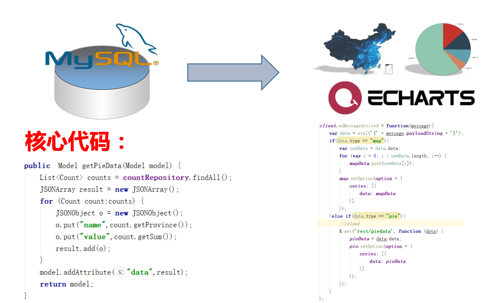
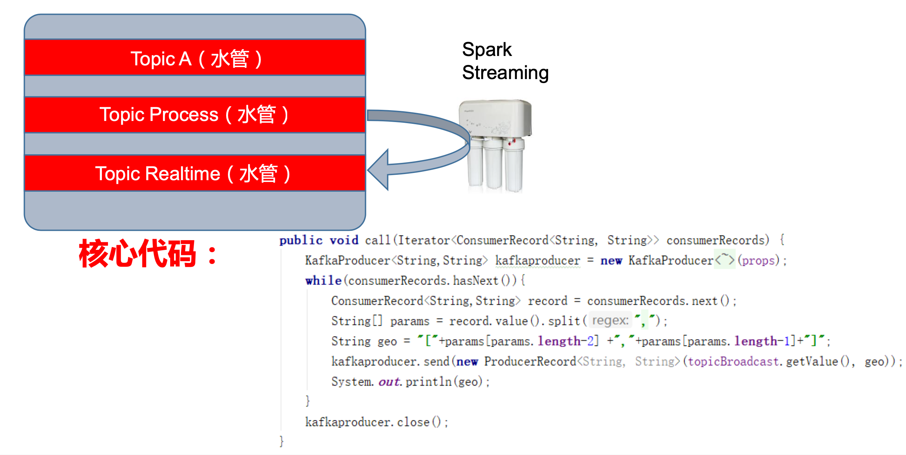
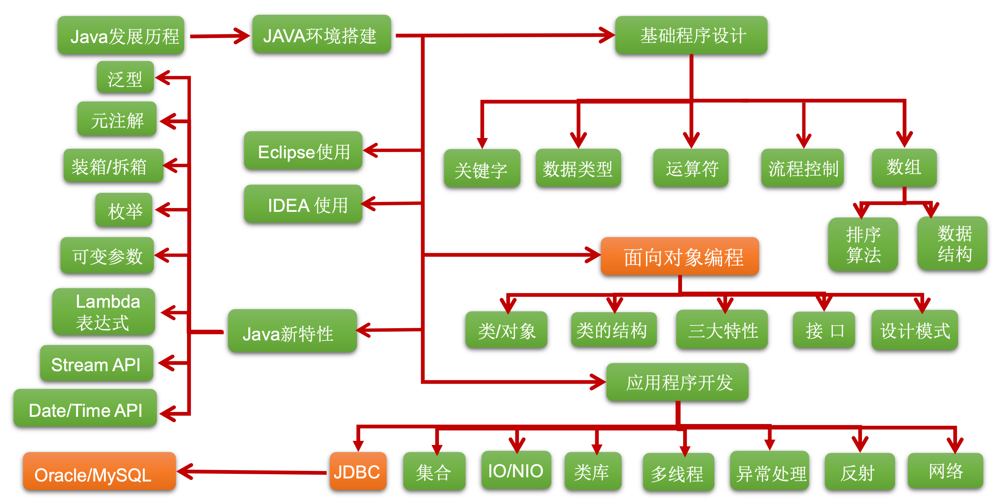
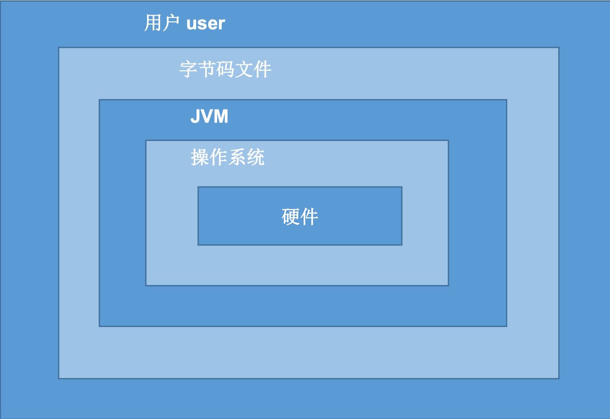
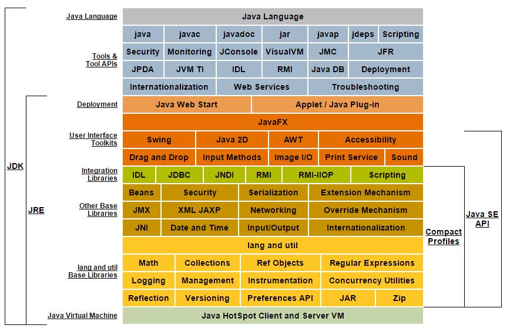
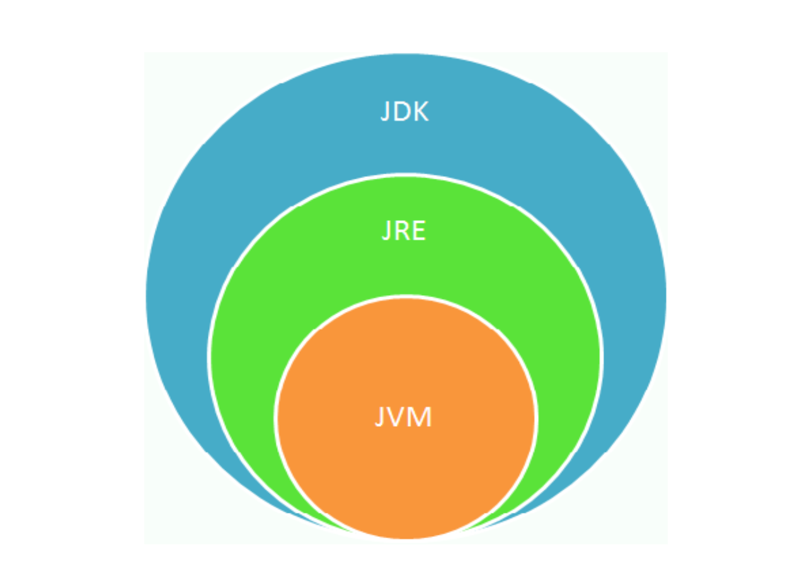
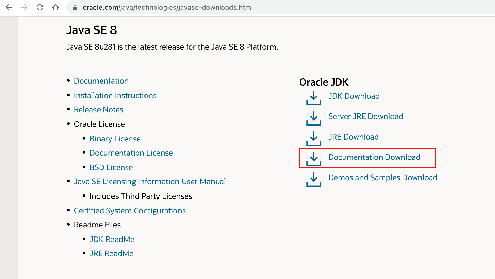
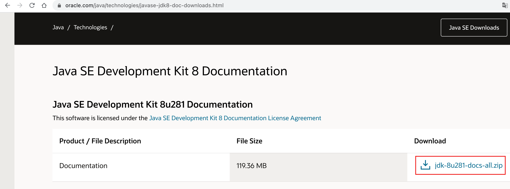
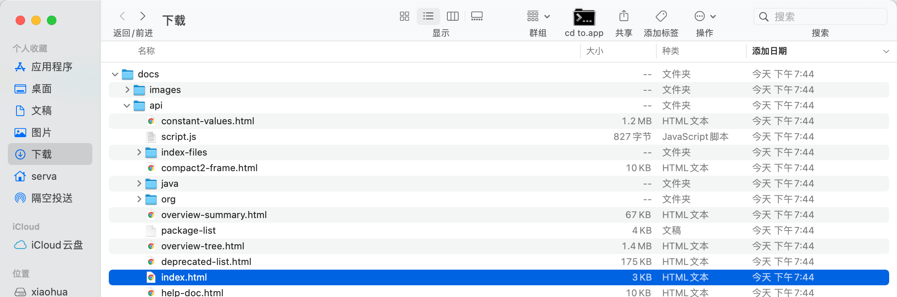
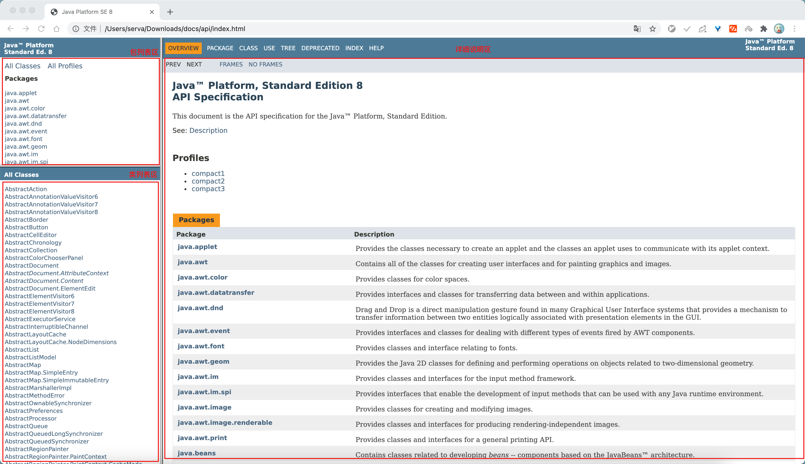

# 01. Java 语言概述

- 笔记本：01. Java 核心基础（宋红康）
- 创建时间：2021-01-23 10:43:33 UTC
- 更新时间：2021-01-23 11:49:18 UTC
- 印象笔记 GUID：2e324014-f030-4df5-94d2-be1998d35ea0

## Java 语言概述

Java 基础是学习 JavaEE、大数据、Android 开发的基石！

**举例：** Spring – Rest(Spring MVC)
 

**举例：** Spark – Spark Streaming
 

**Java 基础知识图解**
 

### 1. Java 语言概述

- 是SUN(Stanford University Network，斯坦福大学网络公司 ) 1995年推出的一门高级编程语言。

- 是一种面向Internet的编程语言。Java一开始富有吸引力是因为Java程序可以 在Web浏览器中运行。这些Java程序被称为Java小程序(applet)。applet使 用现代的图形用户界面与Web用户进行交互。 applet内嵌在HTML代码中。

- 随着Java技术在web方面的不断成熟，已经成为Web应用程序的首选开发语言。

#### Java简史

- 1991年 Green项目，开发语言最初命名为Oak (橡树)

- 1994年，开发组意识到Oak 非常适合于互联网

- 1996年，发布JDK 1.0，约8.3万个网页应用Java技术来制作

- 1997年，发布JDK 1.1，JavaOne会议召开，创当时全球同类会议规模之最

- 1998年，发布JDK 1.2，同年发布企业平台J2EE

- 1999年，Java分成J2SE、J2EE和J2ME，JSP/Servlet技术诞生

- 2004年，发布**里程碑式版本:JDK 1.5，为突出此版本的重要性，更名为JDK 5.0**

- 2005年，J2SE -> JavaSE，J2EE -> JavaEE，J2ME -> JavaME

- 2009年，Oracle公司收购SUN，交易价格74亿美元

- 2011年，发布JDK 7.0

- **2014年，发布JDK 8.0，是继JDK 5.0以来变化最大的版本**

- 2017年，发布JDK 9.0，最大限度实现模块化

- 2018年3月，发布JDK 10.0，版本号也称为18.3

- 2018年9月，发布JDK 11.0，版本号也称为18.9

#### Java技术体系平台

- **Java SE(Java Standard Edition)标准版：** 支持面向桌面级应用(如Windows下的应用程序)的Java平台，提供了完整的Java核 心API，此版本以前称为J2SE

- **Java EE(Java Enterprise Edition)企业版：** 是为开发企业环境下的应用程序提供的一套解决方案。该技术体系中包含的技术如 :Servlet 、Jsp等，主要针对于Web应用程序开发。版本以前称为J2EE

- **Java ME(Java Micro Edition)小型版：** 支持Java程序运行在移动终端(手机、PDA)上的平台，对Java API有所精简，并加 入了针对移动终端的支持，此版本以前称为J2ME

- **Java Card：** 支持一些Java小程序(Applets)运行在小内存设备(如智能卡)上的平台

#### Java在各领域的应用

从Java的应用领域来分，Java语言的应用方向主要表现在以下几个方面:

- **企业级应用:** 主要指复杂的大企业的软件系统、各种类型的网站。Java的安全机制以及 它的跨平台的优势，使它在分布式系统领域开发中有广泛应用。应用领域包括金融、电 信、交通、电子商务等。

- **Android平台应用:** Android应用程序使用Java语言编写。Android开发水平的高低 很大程度上取决于Java语言核心能力是否扎实。

- **大数据平台开发:** 各类框架有Hadoop，spark，storm，flink等，就这类技术生态 圈来讲，还有各种中间件如flume，kafka，sqoop等等 ，这些框架以及工具大多数 是用Java编写而成，但提供诸如Java，scala，Python，R等各种语言API供编程。

- 移动领域应用:主要表现在消费和嵌入式领域，是指在各种小型设备上的应用，包括手 机、PDA、机顶盒、汽车通信设备等。

#### Java语言的诞生

java之父James Gosling团队在开发”Green”项目时，发现C缺少垃圾回收系统，还有可移植的安全性、分布程序设计和多线程功能。最后，他们想要一种易于移植到各种设备上的平台。

#### 主要特性

- **Java语言是易学的。** Java语言的语法与C语言和C++语言很接近，使得大多数程序员很容易学习和使用Java。

- **Java语言是强制面向对象的。** Java语言提供类、接口和继承等原语，为了简单起见，只支持类之间的单继承，但支持接口之间的多继承，并支持类与接口之间的实现机制 (关键字为implements)。

- **Java语言是分布式的。** Java语言支持Internet应用的开发，在基本的Java应用编 程接口中有一个网络应用编程接口(java net)，它提供了用于网络应用编程的类 库，包括URL、URLConnection、Socket、ServerSocket等。Java的RMI(远程 方法激活)机制也是开发分布式应用的重要手段。

- **Java语言是健壮的。** Java的强类型机制、异常处理、垃圾的自动收集等是Java程序 健壮性的重要保证。对指针的丢弃是Java的明智选择。

- **Java语言是安全的。** Java通常被用在网络环境中，为此，Java提供了一个安全机 制以防恶意代码的攻击。如:安全防范机制(类ClassLoader)，如分配不同的 名字空间以防替代本地的同名类、字节代码检查。

- **Java语言是体系结构中立的。** Java程序(后缀为java的文件)在Java平台上被 编译为体系结构中立的字节码格式(后缀为class的文件)，然后可以在实现这个 Java平台的任何系统中运行。

- **Java语言是解释型的。** 如前所述，Java程序在Java平台上被编译为字节码格式， 然后可以在实现这个Java平台的任何系统的解释器中运行。

- **Java是性能略高的。** 与那些解释型的高级脚本语言相比，Java的性能还是较优的。

- **Java语言是原生支持多线程的。** 在Java语言中，线程是一种特殊的对象，它必须 由Thread类或其子(孙)类来创建。

### 2. Java 程序运行机制及运行过程

**Java 语言的特点**

- 特点一:面向对象
 两个基本概念:类、对象
 **三大特性:** 封装、继承、多态

- 特点二:健壮性
 吸收了C/C++语言的优点，但去掉了其影响程序健壮性的部分(如指针、内存的申请与释放等)，提供了一个相对安全的内存管理和访问机制

- 特点三:跨平台性
 跨平台性:通过Java语言编写的应用程序在不同的系统平台上都可以运行。“Write once , Run Anywhere”
 原理:只要在需要运行 java 应用程序的操作系统上，先安装一个Java虚拟机 (JVM Java Virtual Machine) 即可。由JVM来负责Java程序在该系统中的运行

- Java语言的特点:跨平台性

**Java 两种核心机制**

- Java虚拟机 (Java Virtal Machine)

- 垃圾收集机制 (Garbage Collection)

#### 核心机制—Java虚拟机

- JVM是一个虚拟的计算机，具有指令集并使用不同的存储区域。负责执行指 令，管理数据、内存、寄存器。

- 对于不同的平台，有不同的虚拟机。

- 只有某平台提供了对应的java虚拟机，java程序才可在此平台运行

- Java虚拟机机制屏蔽了底层运行平台的差别，实现了“一次编译，到处运行”
 

#### 核心机制—垃圾回收

- 不再使用的内存空间应回收 —— 垃圾回收。

  - 在C/C++等语言中，由程序员负责回收无用内存。

  - Java 语言消除了程序员回收无用内存空间的责任:它提供一种系统级线程跟踪存储空 间的分配情况。并在JVM空闲时，检查并释放那些可被释放的存储空间。

- 垃圾回收在Java程序运行过程中自动进行，程序员无法精确控制和干预。

### 3. Java语言的环境搭建

**JDK(Java Development Kit Java开发工具包)：**
 JDK是提供给Java开发人员使用的，其中包含了java的开发工具，也包括了 JRE。所以安装了JDK，就不用在单独安装JRE了。
 其中的开发工具:编译工具(javac.exe) 打包工具(jar.exe)等

**JRE(Java Runtime Environment Java运行环境)**
 包括Java虚拟机(JVM Java Virtual Machine)和Java程序所需的核心类库等， 如果想要运行一个开发好的Java程序，计算机中只需要安装JRE即可。

#### JDK、JRE、JVM关系


 

- JDK = JRE + 开发工具集(例如Javac编译工具等)

- JRE = JVM + Java SE标准类库

### 4. 注释(Comment)

**Java中的注释类型:**

- 单行注释

- 多行注释

- 文档注释 (java特有)

#### 文档注释(Java特有)

- **格式:**

```
/**
 * @Author 指定java程序的作者
 * @version 指定源文件的版本
 */

```

- 注释内容可以被JDK提供的工具 javadoc 所解析，生成一套以网页文件形 式体现的该程序的说明文档。

- 操作方式

```
javadoc -d myodc -author -version HelloWorld.java

```

### 5. Java API文档

- API (Application Programming Interface,应用程序编程接口)是 Java 提供的基本编程接口。

- Java语言提供了大量的基础类，因此 Oracle 也为这些基础类提供了相应的API文档，用于告诉开发者如何使用这些类，以及这些类里包含的方法。

- 下载 API 文档:

>
http://www.oracle.com/technetwork/java/javase/downloads/index.html


 
 
 

%23%23%20Java%20%E8%AF%AD%E8%A8%80%E6%A6%82%E8%BF%B0%0AJava%20%E5%9F%BA%E7%A1%80%E6%98%AF%E5%AD%A6%E4%B9%A0%20JavaEE%E3%80%81%E5%A4%A7%E6%95%B0%E6%8D%AE%E3%80%81Android%20%E5%BC%80%E5%8F%91%E7%9A%84%E5%9F%BA%E7%9F%B3%EF%BC%81%0A%0A**%E4%B8%BE%E4%BE%8B%EF%BC%9A**%20Spring%20%E2%80%93%20Rest(Spring%20MVC)%0A!%5B36dd7ad7053e47b97cd96ed1de8f69e2.png%5D(evernotecid%3A%2F%2F90F5C43D-AEAE-49B2-85BB-D02B6A52C764%2Fappyinxiangcom%2F25356149%2FENResource%2Fp1591)%0A%0A**%E4%B8%BE%E4%BE%8B%EF%BC%9A**%20Spark%20%E2%80%93%20Spark%20Streaming%0A!%5Bf9bf7f76298f981bb32e0cf52eaffbc2.png%5D(evernotecid%3A%2F%2F90F5C43D-AEAE-49B2-85BB-D02B6A52C764%2Fappyinxiangcom%2F25356149%2FENResource%2Fp1592)%0A%0A%0A**Java%20%E5%9F%BA%E7%A1%80%E7%9F%A5%E8%AF%86%E5%9B%BE%E8%A7%A3**%0A!%5B361721bf333c8722490d1224aadd0965.png%5D(evernotecid%3A%2F%2F90F5C43D-AEAE-49B2-85BB-D02B6A52C764%2Fappyinxiangcom%2F25356149%2FENResource%2Fp1593)%0A%0A%23%23%23%201.%20Java%20%E8%AF%AD%E8%A8%80%E6%A6%82%E8%BF%B0%0A-%20%E6%98%AFSUN(Stanford%20University%20Network%EF%BC%8C%E6%96%AF%E5%9D%A6%E7%A6%8F%E5%A4%A7%E5%AD%A6%E7%BD%91%E7%BB%9C%E5%85%AC%E5%8F%B8%20)%201995%E5%B9%B4%E6%8E%A8%E5%87%BA%E7%9A%84%E4%B8%80%E9%97%A8%E9%AB%98%E7%BA%A7%E7%BC%96%E7%A8%8B%E8%AF%AD%E8%A8%80%E3%80%82%0A-%20%E6%98%AF%E4%B8%80%E7%A7%8D%E9%9D%A2%E5%90%91Internet%E7%9A%84%E7%BC%96%E7%A8%8B%E8%AF%AD%E8%A8%80%E3%80%82Java%E4%B8%80%E5%BC%80%E5%A7%8B%E5%AF%8C%E6%9C%89%E5%90%B8%E5%BC%95%E5%8A%9B%E6%98%AF%E5%9B%A0%E4%B8%BAJava%E7%A8%8B%E5%BA%8F%E5%8F%AF%E4%BB%A5%20%E5%9C%A8Web%E6%B5%8F%E8%A7%88%E5%99%A8%E4%B8%AD%E8%BF%90%E8%A1%8C%E3%80%82%E8%BF%99%E4%BA%9BJava%E7%A8%8B%E5%BA%8F%E8%A2%AB%E7%A7%B0%E4%B8%BAJava%E5%B0%8F%E7%A8%8B%E5%BA%8F(applet)%E3%80%82applet%E4%BD%BF%20%E7%94%A8%E7%8E%B0%E4%BB%A3%E7%9A%84%E5%9B%BE%E5%BD%A2%E7%94%A8%E6%88%B7%E7%95%8C%E9%9D%A2%E4%B8%8EWeb%E7%94%A8%E6%88%B7%E8%BF%9B%E8%A1%8C%E4%BA%A4%E4%BA%92%E3%80%82%20applet%E5%86%85%E5%B5%8C%E5%9C%A8HTML%E4%BB%A3%E7%A0%81%E4%B8%AD%E3%80%82%0A-%20%E9%9A%8F%E7%9D%80Java%E6%8A%80%E6%9C%AF%E5%9C%A8web%E6%96%B9%E9%9D%A2%E7%9A%84%E4%B8%8D%E6%96%AD%E6%88%90%E7%86%9F%EF%BC%8C%E5%B7%B2%E7%BB%8F%E6%88%90%E4%B8%BAWeb%E5%BA%94%E7%94%A8%E7%A8%8B%E5%BA%8F%E7%9A%84%E9%A6%96%E9%80%89%E5%BC%80%E5%8F%91%E8%AF%AD%E8%A8%80%E3%80%82%0A%0A%23%23%23%23%20Java%E7%AE%80%E5%8F%B2%0A-%201991%E5%B9%B4%20Green%E9%A1%B9%E7%9B%AE%EF%BC%8C%E5%BC%80%E5%8F%91%E8%AF%AD%E8%A8%80%E6%9C%80%E5%88%9D%E5%91%BD%E5%90%8D%E4%B8%BAOak%20(%E6%A9%A1%E6%A0%91)%0A-%201994%E5%B9%B4%EF%BC%8C%E5%BC%80%E5%8F%91%E7%BB%84%E6%84%8F%E8%AF%86%E5%88%B0Oak%20%E9%9D%9E%E5%B8%B8%E9%80%82%E5%90%88%E4%BA%8E%E4%BA%92%E8%81%94%E7%BD%91%0A-%201996%E5%B9%B4%EF%BC%8C%E5%8F%91%E5%B8%83JDK%201.0%EF%BC%8C%E7%BA%A68.3%E4%B8%87%E4%B8%AA%E7%BD%91%E9%A1%B5%E5%BA%94%E7%94%A8Java%E6%8A%80%E6%9C%AF%E6%9D%A5%E5%88%B6%E4%BD%9C%0A-%201997%E5%B9%B4%EF%BC%8C%E5%8F%91%E5%B8%83JDK%201.1%EF%BC%8CJavaOne%E4%BC%9A%E8%AE%AE%E5%8F%AC%E5%BC%80%EF%BC%8C%E5%88%9B%E5%BD%93%E6%97%B6%E5%85%A8%E7%90%83%E5%90%8C%E7%B1%BB%E4%BC%9A%E8%AE%AE%E8%A7%84%E6%A8%A1%E4%B9%8B%E6%9C%80%0A-%201998%E5%B9%B4%EF%BC%8C%E5%8F%91%E5%B8%83JDK%201.2%EF%BC%8C%E5%90%8C%E5%B9%B4%E5%8F%91%E5%B8%83%E4%BC%81%E4%B8%9A%E5%B9%B3%E5%8F%B0J2EE%0A-%201999%E5%B9%B4%EF%BC%8CJava%E5%88%86%E6%88%90J2SE%E3%80%81J2EE%E5%92%8CJ2ME%EF%BC%8CJSP%2FServlet%E6%8A%80%E6%9C%AF%E8%AF%9E%E7%94%9F%0A-%202004%E5%B9%B4%EF%BC%8C%E5%8F%91%E5%B8%83**%E9%87%8C%E7%A8%8B%E7%A2%91%E5%BC%8F%E7%89%88%E6%9C%AC%3AJDK%201.5%EF%BC%8C%E4%B8%BA%E7%AA%81%E5%87%BA%E6%AD%A4%E7%89%88%E6%9C%AC%E7%9A%84%E9%87%8D%E8%A6%81%E6%80%A7%EF%BC%8C%E6%9B%B4%E5%90%8D%E4%B8%BAJDK%205.0**%0A-%202005%E5%B9%B4%EF%BC%8CJ2SE%20-%3E%20JavaSE%EF%BC%8CJ2EE%20-%3E%20JavaEE%EF%BC%8CJ2ME%20-%3E%20JavaME%0A-%202009%E5%B9%B4%EF%BC%8COracle%E5%85%AC%E5%8F%B8%E6%94%B6%E8%B4%ADSUN%EF%BC%8C%E4%BA%A4%E6%98%93%E4%BB%B7%E6%A0%BC74%E4%BA%BF%E7%BE%8E%E5%85%83%0A-%202011%E5%B9%B4%EF%BC%8C%E5%8F%91%E5%B8%83JDK%207.0%0A-%20**2014%E5%B9%B4%EF%BC%8C%E5%8F%91%E5%B8%83JDK%208.0%EF%BC%8C%E6%98%AF%E7%BB%A7JDK%205.0%E4%BB%A5%E6%9D%A5%E5%8F%98%E5%8C%96%E6%9C%80%E5%A4%A7%E7%9A%84%E7%89%88%E6%9C%AC**%0A-%202017%E5%B9%B4%EF%BC%8C%E5%8F%91%E5%B8%83JDK%209.0%EF%BC%8C%E6%9C%80%E5%A4%A7%E9%99%90%E5%BA%A6%E5%AE%9E%E7%8E%B0%E6%A8%A1%E5%9D%97%E5%8C%96%0A-%202018%E5%B9%B43%E6%9C%88%EF%BC%8C%E5%8F%91%E5%B8%83JDK%2010.0%EF%BC%8C%E7%89%88%E6%9C%AC%E5%8F%B7%E4%B9%9F%E7%A7%B0%E4%B8%BA18.3%0A-%202018%E5%B9%B49%E6%9C%88%EF%BC%8C%E5%8F%91%E5%B8%83JDK%2011.0%EF%BC%8C%E7%89%88%E6%9C%AC%E5%8F%B7%E4%B9%9F%E7%A7%B0%E4%B8%BA18.9%0A%0A%0A%23%23%23%23%20Java%E6%8A%80%E6%9C%AF%E4%BD%93%E7%B3%BB%E5%B9%B3%E5%8F%B0%0A-%20**Java%20SE(Java%20Standard%20Edition)%E6%A0%87%E5%87%86%E7%89%88%EF%BC%9A**%20%E6%94%AF%E6%8C%81%E9%9D%A2%E5%90%91%E6%A1%8C%E9%9D%A2%E7%BA%A7%E5%BA%94%E7%94%A8(%E5%A6%82Windows%E4%B8%8B%E7%9A%84%E5%BA%94%E7%94%A8%E7%A8%8B%E5%BA%8F)%E7%9A%84Java%E5%B9%B3%E5%8F%B0%EF%BC%8C%E6%8F%90%E4%BE%9B%E4%BA%86%E5%AE%8C%E6%95%B4%E7%9A%84Java%E6%A0%B8%20%E5%BF%83API%EF%BC%8C%E6%AD%A4%E7%89%88%E6%9C%AC%E4%BB%A5%E5%89%8D%E7%A7%B0%E4%B8%BAJ2SE%0A-%20**Java%20EE(Java%20Enterprise%20Edition)%E4%BC%81%E4%B8%9A%E7%89%88%EF%BC%9A**%20%E6%98%AF%E4%B8%BA%E5%BC%80%E5%8F%91%E4%BC%81%E4%B8%9A%E7%8E%AF%E5%A2%83%E4%B8%8B%E7%9A%84%E5%BA%94%E7%94%A8%E7%A8%8B%E5%BA%8F%E6%8F%90%E4%BE%9B%E7%9A%84%E4%B8%80%E5%A5%97%E8%A7%A3%E5%86%B3%E6%96%B9%E6%A1%88%E3%80%82%E8%AF%A5%E6%8A%80%E6%9C%AF%E4%BD%93%E7%B3%BB%E4%B8%AD%E5%8C%85%E5%90%AB%E7%9A%84%E6%8A%80%E6%9C%AF%E5%A6%82%20%3AServlet%20%E3%80%81Jsp%E7%AD%89%EF%BC%8C%E4%B8%BB%E8%A6%81%E9%92%88%E5%AF%B9%E4%BA%8EWeb%E5%BA%94%E7%94%A8%E7%A8%8B%E5%BA%8F%E5%BC%80%E5%8F%91%E3%80%82%E7%89%88%E6%9C%AC%E4%BB%A5%E5%89%8D%E7%A7%B0%E4%B8%BAJ2EE%0A-%20**Java%20ME(Java%20Micro%20Edition)%E5%B0%8F%E5%9E%8B%E7%89%88%EF%BC%9A**%20%E6%94%AF%E6%8C%81Java%E7%A8%8B%E5%BA%8F%E8%BF%90%E8%A1%8C%E5%9C%A8%E7%A7%BB%E5%8A%A8%E7%BB%88%E7%AB%AF(%E6%89%8B%E6%9C%BA%E3%80%81PDA)%E4%B8%8A%E7%9A%84%E5%B9%B3%E5%8F%B0%EF%BC%8C%E5%AF%B9Java%20API%E6%9C%89%E6%89%80%E7%B2%BE%E7%AE%80%EF%BC%8C%E5%B9%B6%E5%8A%A0%20%E5%85%A5%E4%BA%86%E9%92%88%E5%AF%B9%E7%A7%BB%E5%8A%A8%E7%BB%88%E7%AB%AF%E7%9A%84%E6%94%AF%E6%8C%81%EF%BC%8C%E6%AD%A4%E7%89%88%E6%9C%AC%E4%BB%A5%E5%89%8D%E7%A7%B0%E4%B8%BAJ2ME%0A-%20**Java%20Card%EF%BC%9A**%20%E6%94%AF%E6%8C%81%E4%B8%80%E4%BA%9BJava%E5%B0%8F%E7%A8%8B%E5%BA%8F(Applets)%E8%BF%90%E8%A1%8C%E5%9C%A8%E5%B0%8F%E5%86%85%E5%AD%98%E8%AE%BE%E5%A4%87(%E5%A6%82%E6%99%BA%E8%83%BD%E5%8D%A1)%E4%B8%8A%E7%9A%84%E5%B9%B3%E5%8F%B0%0A%0A%23%23%23%23%20Java%E5%9C%A8%E5%90%84%E9%A2%86%E5%9F%9F%E7%9A%84%E5%BA%94%E7%94%A8%0A%E4%BB%8EJava%E7%9A%84%E5%BA%94%E7%94%A8%E9%A2%86%E5%9F%9F%E6%9D%A5%E5%88%86%EF%BC%8CJava%E8%AF%AD%E8%A8%80%E7%9A%84%E5%BA%94%E7%94%A8%E6%96%B9%E5%90%91%E4%B8%BB%E8%A6%81%E8%A1%A8%E7%8E%B0%E5%9C%A8%E4%BB%A5%E4%B8%8B%E5%87%A0%E4%B8%AA%E6%96%B9%E9%9D%A2%3A%0A-%20**%E4%BC%81%E4%B8%9A%E7%BA%A7%E5%BA%94%E7%94%A8%3A**%20%E4%B8%BB%E8%A6%81%E6%8C%87%E5%A4%8D%E6%9D%82%E7%9A%84%E5%A4%A7%E4%BC%81%E4%B8%9A%E7%9A%84%E8%BD%AF%E4%BB%B6%E7%B3%BB%E7%BB%9F%E3%80%81%E5%90%84%E7%A7%8D%E7%B1%BB%E5%9E%8B%E7%9A%84%E7%BD%91%E7%AB%99%E3%80%82Java%E7%9A%84%E5%AE%89%E5%85%A8%E6%9C%BA%E5%88%B6%E4%BB%A5%E5%8F%8A%20%E5%AE%83%E7%9A%84%E8%B7%A8%E5%B9%B3%E5%8F%B0%E7%9A%84%E4%BC%98%E5%8A%BF%EF%BC%8C%E4%BD%BF%E5%AE%83%E5%9C%A8%E5%88%86%E5%B8%83%E5%BC%8F%E7%B3%BB%E7%BB%9F%E9%A2%86%E5%9F%9F%E5%BC%80%E5%8F%91%E4%B8%AD%E6%9C%89%E5%B9%BF%E6%B3%9B%E5%BA%94%E7%94%A8%E3%80%82%E5%BA%94%E7%94%A8%E9%A2%86%E5%9F%9F%E5%8C%85%E6%8B%AC%E9%87%91%E8%9E%8D%E3%80%81%E7%94%B5%20%E4%BF%A1%E3%80%81%E4%BA%A4%E9%80%9A%E3%80%81%E7%94%B5%E5%AD%90%E5%95%86%E5%8A%A1%E7%AD%89%E3%80%82%0A-%20**Android%E5%B9%B3%E5%8F%B0%E5%BA%94%E7%94%A8%3A**%20Android%E5%BA%94%E7%94%A8%E7%A8%8B%E5%BA%8F%E4%BD%BF%E7%94%A8Java%E8%AF%AD%E8%A8%80%E7%BC%96%E5%86%99%E3%80%82Android%E5%BC%80%E5%8F%91%E6%B0%B4%E5%B9%B3%E7%9A%84%E9%AB%98%E4%BD%8E%20%E5%BE%88%E5%A4%A7%E7%A8%8B%E5%BA%A6%E4%B8%8A%E5%8F%96%E5%86%B3%E4%BA%8EJava%E8%AF%AD%E8%A8%80%E6%A0%B8%E5%BF%83%E8%83%BD%E5%8A%9B%E6%98%AF%E5%90%A6%E6%89%8E%E5%AE%9E%E3%80%82%0A-%20**%E5%A4%A7%E6%95%B0%E6%8D%AE%E5%B9%B3%E5%8F%B0%E5%BC%80%E5%8F%91%3A**%20%E5%90%84%E7%B1%BB%E6%A1%86%E6%9E%B6%E6%9C%89Hadoop%EF%BC%8Cspark%EF%BC%8Cstorm%EF%BC%8Cflink%E7%AD%89%EF%BC%8C%E5%B0%B1%E8%BF%99%E7%B1%BB%E6%8A%80%E6%9C%AF%E7%94%9F%E6%80%81%20%E5%9C%88%E6%9D%A5%E8%AE%B2%EF%BC%8C%E8%BF%98%E6%9C%89%E5%90%84%E7%A7%8D%E4%B8%AD%E9%97%B4%E4%BB%B6%E5%A6%82flume%EF%BC%8Ckafka%EF%BC%8Csqoop%E7%AD%89%E7%AD%89%20%EF%BC%8C%E8%BF%99%E4%BA%9B%E6%A1%86%E6%9E%B6%E4%BB%A5%E5%8F%8A%E5%B7%A5%E5%85%B7%E5%A4%A7%E5%A4%9A%E6%95%B0%20%E6%98%AF%E7%94%A8Java%E7%BC%96%E5%86%99%E8%80%8C%E6%88%90%EF%BC%8C%E4%BD%86%E6%8F%90%E4%BE%9B%E8%AF%B8%E5%A6%82Java%EF%BC%8Cscala%EF%BC%8CPython%EF%BC%8CR%E7%AD%89%E5%90%84%E7%A7%8D%E8%AF%AD%E8%A8%80API%E4%BE%9B%E7%BC%96%E7%A8%8B%E3%80%82%0A-%20%E7%A7%BB%E5%8A%A8%E9%A2%86%E5%9F%9F%E5%BA%94%E7%94%A8%3A%E4%B8%BB%E8%A6%81%E8%A1%A8%E7%8E%B0%E5%9C%A8%E6%B6%88%E8%B4%B9%E5%92%8C%E5%B5%8C%E5%85%A5%E5%BC%8F%E9%A2%86%E5%9F%9F%EF%BC%8C%E6%98%AF%E6%8C%87%E5%9C%A8%E5%90%84%E7%A7%8D%E5%B0%8F%E5%9E%8B%E8%AE%BE%E5%A4%87%E4%B8%8A%E7%9A%84%E5%BA%94%E7%94%A8%EF%BC%8C%E5%8C%85%E6%8B%AC%E6%89%8B%20%E6%9C%BA%E3%80%81PDA%E3%80%81%E6%9C%BA%E9%A1%B6%E7%9B%92%E3%80%81%E6%B1%BD%E8%BD%A6%E9%80%9A%E4%BF%A1%E8%AE%BE%E5%A4%87%E7%AD%89%E3%80%82%0A%0A%23%23%23%23%20Java%E8%AF%AD%E8%A8%80%E7%9A%84%E8%AF%9E%E7%94%9F%0Ajava%E4%B9%8B%E7%88%B6James%20Gosling%E5%9B%A2%E9%98%9F%E5%9C%A8%E5%BC%80%E5%8F%91%E2%80%9DGreen%E2%80%9D%E9%A1%B9%E7%9B%AE%E6%97%B6%EF%BC%8C%E5%8F%91%E7%8E%B0C%E7%BC%BA%E5%B0%91%E5%9E%83%E5%9C%BE%E5%9B%9E%E6%94%B6%E7%B3%BB%E7%BB%9F%EF%BC%8C%E8%BF%98%E6%9C%89%E5%8F%AF%E7%A7%BB%E6%A4%8D%E7%9A%84%E5%AE%89%E5%85%A8%E6%80%A7%E3%80%81%E5%88%86%E5%B8%83%E7%A8%8B%E5%BA%8F%E8%AE%BE%E8%AE%A1%E5%92%8C%E5%A4%9A%E7%BA%BF%E7%A8%8B%E5%8A%9F%E8%83%BD%E3%80%82%E6%9C%80%E5%90%8E%EF%BC%8C%E4%BB%96%E4%BB%AC%E6%83%B3%E8%A6%81%E4%B8%80%E7%A7%8D%E6%98%93%E4%BA%8E%E7%A7%BB%E6%A4%8D%E5%88%B0%E5%90%84%E7%A7%8D%E8%AE%BE%E5%A4%87%E4%B8%8A%E7%9A%84%E5%B9%B3%E5%8F%B0%E3%80%82%0A%0A%0A%23%23%23%23%20%E4%B8%BB%E8%A6%81%E7%89%B9%E6%80%A7%0A-%20**Java%E8%AF%AD%E8%A8%80%E6%98%AF%E6%98%93%E5%AD%A6%E7%9A%84%E3%80%82**%20Java%E8%AF%AD%E8%A8%80%E7%9A%84%E8%AF%AD%E6%B3%95%E4%B8%8EC%E8%AF%AD%E8%A8%80%E5%92%8CC%2B%2B%E8%AF%AD%E8%A8%80%E5%BE%88%E6%8E%A5%E8%BF%91%EF%BC%8C%E4%BD%BF%E5%BE%97%E5%A4%A7%E5%A4%9A%E6%95%B0%E7%A8%8B%E5%BA%8F%E5%91%98%E5%BE%88%E5%AE%B9%E6%98%93%E5%AD%A6%E4%B9%A0%E5%92%8C%E4%BD%BF%E7%94%A8Java%E3%80%82%0A-%20**Java%E8%AF%AD%E8%A8%80%E6%98%AF%E5%BC%BA%E5%88%B6%E9%9D%A2%E5%90%91%E5%AF%B9%E8%B1%A1%E7%9A%84%E3%80%82**%20Java%E8%AF%AD%E8%A8%80%E6%8F%90%E4%BE%9B%E7%B1%BB%E3%80%81%E6%8E%A5%E5%8F%A3%E5%92%8C%E7%BB%A7%E6%89%BF%E7%AD%89%E5%8E%9F%E8%AF%AD%EF%BC%8C%E4%B8%BA%E4%BA%86%E7%AE%80%E5%8D%95%E8%B5%B7%E8%A7%81%EF%BC%8C%E5%8F%AA%E6%94%AF%E6%8C%81%E7%B1%BB%E4%B9%8B%E9%97%B4%E7%9A%84%E5%8D%95%E7%BB%A7%E6%89%BF%EF%BC%8C%E4%BD%86%E6%94%AF%E6%8C%81%E6%8E%A5%E5%8F%A3%E4%B9%8B%E9%97%B4%E7%9A%84%E5%A4%9A%E7%BB%A7%E6%89%BF%EF%BC%8C%E5%B9%B6%E6%94%AF%E6%8C%81%E7%B1%BB%E4%B8%8E%E6%8E%A5%E5%8F%A3%E4%B9%8B%E9%97%B4%E7%9A%84%E5%AE%9E%E7%8E%B0%E6%9C%BA%E5%88%B6%20(%E5%85%B3%E9%94%AE%E5%AD%97%E4%B8%BAimplements)%E3%80%82%0A-%20**Java%E8%AF%AD%E8%A8%80%E6%98%AF%E5%88%86%E5%B8%83%E5%BC%8F%E7%9A%84%E3%80%82**%20Java%E8%AF%AD%E8%A8%80%E6%94%AF%E6%8C%81Internet%E5%BA%94%E7%94%A8%E7%9A%84%E5%BC%80%E5%8F%91%EF%BC%8C%E5%9C%A8%E5%9F%BA%E6%9C%AC%E7%9A%84Java%E5%BA%94%E7%94%A8%E7%BC%96%20%E7%A8%8B%E6%8E%A5%E5%8F%A3%E4%B8%AD%E6%9C%89%E4%B8%80%E4%B8%AA%E7%BD%91%E7%BB%9C%E5%BA%94%E7%94%A8%E7%BC%96%E7%A8%8B%E6%8E%A5%E5%8F%A3(java%20net)%EF%BC%8C%E5%AE%83%E6%8F%90%E4%BE%9B%E4%BA%86%E7%94%A8%E4%BA%8E%E7%BD%91%E7%BB%9C%E5%BA%94%E7%94%A8%E7%BC%96%E7%A8%8B%E7%9A%84%E7%B1%BB%20%E5%BA%93%EF%BC%8C%E5%8C%85%E6%8B%ACURL%E3%80%81URLConnection%E3%80%81Socket%E3%80%81ServerSocket%E7%AD%89%E3%80%82Java%E7%9A%84RMI(%E8%BF%9C%E7%A8%8B%20%E6%96%B9%E6%B3%95%E6%BF%80%E6%B4%BB)%E6%9C%BA%E5%88%B6%E4%B9%9F%E6%98%AF%E5%BC%80%E5%8F%91%E5%88%86%E5%B8%83%E5%BC%8F%E5%BA%94%E7%94%A8%E7%9A%84%E9%87%8D%E8%A6%81%E6%89%8B%E6%AE%B5%E3%80%82%0A-%20**Java%E8%AF%AD%E8%A8%80%E6%98%AF%E5%81%A5%E5%A3%AE%E7%9A%84%E3%80%82**%20Java%E7%9A%84%E5%BC%BA%E7%B1%BB%E5%9E%8B%E6%9C%BA%E5%88%B6%E3%80%81%E5%BC%82%E5%B8%B8%E5%A4%84%E7%90%86%E3%80%81%E5%9E%83%E5%9C%BE%E7%9A%84%E8%87%AA%E5%8A%A8%E6%94%B6%E9%9B%86%E7%AD%89%E6%98%AFJava%E7%A8%8B%E5%BA%8F%20%E5%81%A5%E5%A3%AE%E6%80%A7%E7%9A%84%E9%87%8D%E8%A6%81%E4%BF%9D%E8%AF%81%E3%80%82%E5%AF%B9%E6%8C%87%E9%92%88%E7%9A%84%E4%B8%A2%E5%BC%83%E6%98%AFJava%E7%9A%84%E6%98%8E%E6%99%BA%E9%80%89%E6%8B%A9%E3%80%82%0A-%20**Java%E8%AF%AD%E8%A8%80%E6%98%AF%E5%AE%89%E5%85%A8%E7%9A%84%E3%80%82**%20Java%E9%80%9A%E5%B8%B8%E8%A2%AB%E7%94%A8%E5%9C%A8%E7%BD%91%E7%BB%9C%E7%8E%AF%E5%A2%83%E4%B8%AD%EF%BC%8C%E4%B8%BA%E6%AD%A4%EF%BC%8CJava%E6%8F%90%E4%BE%9B%E4%BA%86%E4%B8%80%E4%B8%AA%E5%AE%89%E5%85%A8%E6%9C%BA%20%E5%88%B6%E4%BB%A5%E9%98%B2%E6%81%B6%E6%84%8F%E4%BB%A3%E7%A0%81%E7%9A%84%E6%94%BB%E5%87%BB%E3%80%82%E5%A6%82%3A%E5%AE%89%E5%85%A8%E9%98%B2%E8%8C%83%E6%9C%BA%E5%88%B6(%E7%B1%BBClassLoader)%EF%BC%8C%E5%A6%82%E5%88%86%E9%85%8D%E4%B8%8D%E5%90%8C%E7%9A%84%20%E5%90%8D%E5%AD%97%E7%A9%BA%E9%97%B4%E4%BB%A5%E9%98%B2%E6%9B%BF%E4%BB%A3%E6%9C%AC%E5%9C%B0%E7%9A%84%E5%90%8C%E5%90%8D%E7%B1%BB%E3%80%81%E5%AD%97%E8%8A%82%E4%BB%A3%E7%A0%81%E6%A3%80%E6%9F%A5%E3%80%82%0A-%20**Java%E8%AF%AD%E8%A8%80%E6%98%AF%E4%BD%93%E7%B3%BB%E7%BB%93%E6%9E%84%E4%B8%AD%E7%AB%8B%E7%9A%84%E3%80%82**%20Java%E7%A8%8B%E5%BA%8F(%E5%90%8E%E7%BC%80%E4%B8%BAjava%E7%9A%84%E6%96%87%E4%BB%B6)%E5%9C%A8Java%E5%B9%B3%E5%8F%B0%E4%B8%8A%E8%A2%AB%20%E7%BC%96%E8%AF%91%E4%B8%BA%E4%BD%93%E7%B3%BB%E7%BB%93%E6%9E%84%E4%B8%AD%E7%AB%8B%E7%9A%84%E5%AD%97%E8%8A%82%E7%A0%81%E6%A0%BC%E5%BC%8F(%E5%90%8E%E7%BC%80%E4%B8%BAclass%E7%9A%84%E6%96%87%E4%BB%B6)%EF%BC%8C%E7%84%B6%E5%90%8E%E5%8F%AF%E4%BB%A5%E5%9C%A8%E5%AE%9E%E7%8E%B0%E8%BF%99%E4%B8%AA%20Java%E5%B9%B3%E5%8F%B0%E7%9A%84%E4%BB%BB%E4%BD%95%E7%B3%BB%E7%BB%9F%E4%B8%AD%E8%BF%90%E8%A1%8C%E3%80%82%0A-%20**Java%E8%AF%AD%E8%A8%80%E6%98%AF%E8%A7%A3%E9%87%8A%E5%9E%8B%E7%9A%84%E3%80%82**%20%E5%A6%82%E5%89%8D%E6%89%80%E8%BF%B0%EF%BC%8CJava%E7%A8%8B%E5%BA%8F%E5%9C%A8Java%E5%B9%B3%E5%8F%B0%E4%B8%8A%E8%A2%AB%E7%BC%96%E8%AF%91%E4%B8%BA%E5%AD%97%E8%8A%82%E7%A0%81%E6%A0%BC%E5%BC%8F%EF%BC%8C%20%E7%84%B6%E5%90%8E%E5%8F%AF%E4%BB%A5%E5%9C%A8%E5%AE%9E%E7%8E%B0%E8%BF%99%E4%B8%AAJava%E5%B9%B3%E5%8F%B0%E7%9A%84%E4%BB%BB%E4%BD%95%E7%B3%BB%E7%BB%9F%E7%9A%84%E8%A7%A3%E9%87%8A%E5%99%A8%E4%B8%AD%E8%BF%90%E8%A1%8C%E3%80%82%0A-%20**Java%E6%98%AF%E6%80%A7%E8%83%BD%E7%95%A5%E9%AB%98%E7%9A%84%E3%80%82**%20%E4%B8%8E%E9%82%A3%E4%BA%9B%E8%A7%A3%E9%87%8A%E5%9E%8B%E7%9A%84%E9%AB%98%E7%BA%A7%E8%84%9A%E6%9C%AC%E8%AF%AD%E8%A8%80%E7%9B%B8%E6%AF%94%EF%BC%8CJava%E7%9A%84%E6%80%A7%E8%83%BD%E8%BF%98%E6%98%AF%E8%BE%83%E4%BC%98%E7%9A%84%E3%80%82%0A-%20**Java%E8%AF%AD%E8%A8%80%E6%98%AF%E5%8E%9F%E7%94%9F%E6%94%AF%E6%8C%81%E5%A4%9A%E7%BA%BF%E7%A8%8B%E7%9A%84%E3%80%82**%20%E5%9C%A8Java%E8%AF%AD%E8%A8%80%E4%B8%AD%EF%BC%8C%E7%BA%BF%E7%A8%8B%E6%98%AF%E4%B8%80%E7%A7%8D%E7%89%B9%E6%AE%8A%E7%9A%84%E5%AF%B9%E8%B1%A1%EF%BC%8C%E5%AE%83%E5%BF%85%E9%A1%BB%20%E7%94%B1Thread%E7%B1%BB%E6%88%96%E5%85%B6%E5%AD%90(%E5%AD%99)%E7%B1%BB%E6%9D%A5%E5%88%9B%E5%BB%BA%E3%80%82%0A%0A%0A%23%23%23%202.%20Java%20%E7%A8%8B%E5%BA%8F%E8%BF%90%E8%A1%8C%E6%9C%BA%E5%88%B6%E5%8F%8A%E8%BF%90%E8%A1%8C%E8%BF%87%E7%A8%8B%0A**Java%20%E8%AF%AD%E8%A8%80%E7%9A%84%E7%89%B9%E7%82%B9**%0A-%20%E7%89%B9%E7%82%B9%E4%B8%80%3A%E9%9D%A2%E5%90%91%E5%AF%B9%E8%B1%A1%0A%E4%B8%A4%E4%B8%AA%E5%9F%BA%E6%9C%AC%E6%A6%82%E5%BF%B5%3A%E7%B1%BB%E3%80%81%E5%AF%B9%E8%B1%A1%0A**%E4%B8%89%E5%A4%A7%E7%89%B9%E6%80%A7%3A**%20%E5%B0%81%E8%A3%85%E3%80%81%E7%BB%A7%E6%89%BF%E3%80%81%E5%A4%9A%E6%80%81%0A-%20%E7%89%B9%E7%82%B9%E4%BA%8C%3A%E5%81%A5%E5%A3%AE%E6%80%A7%0A%E5%90%B8%E6%94%B6%E4%BA%86C%2FC%2B%2B%E8%AF%AD%E8%A8%80%E7%9A%84%E4%BC%98%E7%82%B9%EF%BC%8C%E4%BD%86%E5%8E%BB%E6%8E%89%E4%BA%86%E5%85%B6%E5%BD%B1%E5%93%8D%E7%A8%8B%E5%BA%8F%E5%81%A5%E5%A3%AE%E6%80%A7%E7%9A%84%E9%83%A8%E5%88%86(%E5%A6%82%E6%8C%87%E9%92%88%E3%80%81%E5%86%85%E5%AD%98%E7%9A%84%E7%94%B3%E8%AF%B7%E4%B8%8E%E9%87%8A%E6%94%BE%E7%AD%89)%EF%BC%8C%E6%8F%90%E4%BE%9B%E4%BA%86%E4%B8%80%E4%B8%AA%E7%9B%B8%E5%AF%B9%E5%AE%89%E5%85%A8%E7%9A%84%E5%86%85%E5%AD%98%E7%AE%A1%E7%90%86%E5%92%8C%E8%AE%BF%E9%97%AE%E6%9C%BA%E5%88%B6%0A-%20%E7%89%B9%E7%82%B9%E4%B8%89%3A%E8%B7%A8%E5%B9%B3%E5%8F%B0%E6%80%A7%0A%E8%B7%A8%E5%B9%B3%E5%8F%B0%E6%80%A7%3A%E9%80%9A%E8%BF%87Java%E8%AF%AD%E8%A8%80%E7%BC%96%E5%86%99%E7%9A%84%E5%BA%94%E7%94%A8%E7%A8%8B%E5%BA%8F%E5%9C%A8%E4%B8%8D%E5%90%8C%E7%9A%84%E7%B3%BB%E7%BB%9F%E5%B9%B3%E5%8F%B0%E4%B8%8A%E9%83%BD%E5%8F%AF%E4%BB%A5%E8%BF%90%E8%A1%8C%E3%80%82%E2%80%9CWrite%20once%20%2C%20Run%20Anywhere%E2%80%9D%0A%E5%8E%9F%E7%90%86%3A%E5%8F%AA%E8%A6%81%E5%9C%A8%E9%9C%80%E8%A6%81%E8%BF%90%E8%A1%8C%20java%20%E5%BA%94%E7%94%A8%E7%A8%8B%E5%BA%8F%E7%9A%84%E6%93%8D%E4%BD%9C%E7%B3%BB%E7%BB%9F%E4%B8%8A%EF%BC%8C%E5%85%88%E5%AE%89%E8%A3%85%E4%B8%80%E4%B8%AAJava%E8%99%9A%E6%8B%9F%E6%9C%BA%20(JVM%20Java%20Virtual%20Machine)%20%E5%8D%B3%E5%8F%AF%E3%80%82%E7%94%B1JVM%E6%9D%A5%E8%B4%9F%E8%B4%A3Java%E7%A8%8B%E5%BA%8F%E5%9C%A8%E8%AF%A5%E7%B3%BB%E7%BB%9F%E4%B8%AD%E7%9A%84%E8%BF%90%E8%A1%8C%0A-%20Java%E8%AF%AD%E8%A8%80%E7%9A%84%E7%89%B9%E7%82%B9%3A%E8%B7%A8%E5%B9%B3%E5%8F%B0%E6%80%A7%0A%0A**Java%20%E4%B8%A4%E7%A7%8D%E6%A0%B8%E5%BF%83%E6%9C%BA%E5%88%B6**%0A-%20Java%E8%99%9A%E6%8B%9F%E6%9C%BA%20(Java%20Virtal%20Machine)%0A-%20%E5%9E%83%E5%9C%BE%E6%94%B6%E9%9B%86%E6%9C%BA%E5%88%B6%20(Garbage%20Collection)%0A%0A%23%23%23%23%20%E6%A0%B8%E5%BF%83%E6%9C%BA%E5%88%B6%E2%80%94Java%E8%99%9A%E6%8B%9F%E6%9C%BA%0A-%20JVM%E6%98%AF%E4%B8%80%E4%B8%AA%E8%99%9A%E6%8B%9F%E7%9A%84%E8%AE%A1%E7%AE%97%E6%9C%BA%EF%BC%8C%E5%85%B7%E6%9C%89%E6%8C%87%E4%BB%A4%E9%9B%86%E5%B9%B6%E4%BD%BF%E7%94%A8%E4%B8%8D%E5%90%8C%E7%9A%84%E5%AD%98%E5%82%A8%E5%8C%BA%E5%9F%9F%E3%80%82%E8%B4%9F%E8%B4%A3%E6%89%A7%E8%A1%8C%E6%8C%87%20%E4%BB%A4%EF%BC%8C%E7%AE%A1%E7%90%86%E6%95%B0%E6%8D%AE%E3%80%81%E5%86%85%E5%AD%98%E3%80%81%E5%AF%84%E5%AD%98%E5%99%A8%E3%80%82%0A-%20%E5%AF%B9%E4%BA%8E%E4%B8%8D%E5%90%8C%E7%9A%84%E5%B9%B3%E5%8F%B0%EF%BC%8C%E6%9C%89%E4%B8%8D%E5%90%8C%E7%9A%84%E8%99%9A%E6%8B%9F%E6%9C%BA%E3%80%82%0A-%20%E5%8F%AA%E6%9C%89%E6%9F%90%E5%B9%B3%E5%8F%B0%E6%8F%90%E4%BE%9B%E4%BA%86%E5%AF%B9%E5%BA%94%E7%9A%84java%E8%99%9A%E6%8B%9F%E6%9C%BA%EF%BC%8Cjava%E7%A8%8B%E5%BA%8F%E6%89%8D%E5%8F%AF%E5%9C%A8%E6%AD%A4%E5%B9%B3%E5%8F%B0%E8%BF%90%E8%A1%8C%0A-%20Java%E8%99%9A%E6%8B%9F%E6%9C%BA%E6%9C%BA%E5%88%B6%E5%B1%8F%E8%94%BD%E4%BA%86%E5%BA%95%E5%B1%82%E8%BF%90%E8%A1%8C%E5%B9%B3%E5%8F%B0%E7%9A%84%E5%B7%AE%E5%88%AB%EF%BC%8C%E5%AE%9E%E7%8E%B0%E4%BA%86%E2%80%9C%E4%B8%80%E6%AC%A1%E7%BC%96%E8%AF%91%EF%BC%8C%E5%88%B0%E5%A4%84%E8%BF%90%E8%A1%8C%E2%80%9D%0A%20!%5Bf55404bef56a8cbac805402c9c3168c1.png%5D(evernotecid%3A%2F%2F90F5C43D-AEAE-49B2-85BB-D02B6A52C764%2Fappyinxiangcom%2F25356149%2FENResource%2Fp1594)%0A%0A%0A%23%23%23%23%20%E6%A0%B8%E5%BF%83%E6%9C%BA%E5%88%B6%E2%80%94%E5%9E%83%E5%9C%BE%E5%9B%9E%E6%94%B6%0A-%20%E4%B8%8D%E5%86%8D%E4%BD%BF%E7%94%A8%E7%9A%84%E5%86%85%E5%AD%98%E7%A9%BA%E9%97%B4%E5%BA%94%E5%9B%9E%E6%94%B6%20%E2%80%94%E2%80%94%20%E5%9E%83%E5%9C%BE%E5%9B%9E%E6%94%B6%E3%80%82%0A%20%20%20%20-%20%E5%9C%A8C%2FC%2B%2B%E7%AD%89%E8%AF%AD%E8%A8%80%E4%B8%AD%EF%BC%8C%E7%94%B1%E7%A8%8B%E5%BA%8F%E5%91%98%E8%B4%9F%E8%B4%A3%E5%9B%9E%E6%94%B6%E6%97%A0%E7%94%A8%E5%86%85%E5%AD%98%E3%80%82%0A%20%20%20%20-%20Java%20%E8%AF%AD%E8%A8%80%E6%B6%88%E9%99%A4%E4%BA%86%E7%A8%8B%E5%BA%8F%E5%91%98%E5%9B%9E%E6%94%B6%E6%97%A0%E7%94%A8%E5%86%85%E5%AD%98%E7%A9%BA%E9%97%B4%E7%9A%84%E8%B4%A3%E4%BB%BB%3A%E5%AE%83%E6%8F%90%E4%BE%9B%E4%B8%80%E7%A7%8D%E7%B3%BB%E7%BB%9F%E7%BA%A7%E7%BA%BF%E7%A8%8B%E8%B7%9F%E8%B8%AA%E5%AD%98%E5%82%A8%E7%A9%BA%20%E9%97%B4%E7%9A%84%E5%88%86%E9%85%8D%E6%83%85%E5%86%B5%E3%80%82%E5%B9%B6%E5%9C%A8JVM%E7%A9%BA%E9%97%B2%E6%97%B6%EF%BC%8C%E6%A3%80%E6%9F%A5%E5%B9%B6%E9%87%8A%E6%94%BE%E9%82%A3%E4%BA%9B%E5%8F%AF%E8%A2%AB%E9%87%8A%E6%94%BE%E7%9A%84%E5%AD%98%E5%82%A8%E7%A9%BA%E9%97%B4%E3%80%82%0A-%20%E5%9E%83%E5%9C%BE%E5%9B%9E%E6%94%B6%E5%9C%A8Java%E7%A8%8B%E5%BA%8F%E8%BF%90%E8%A1%8C%E8%BF%87%E7%A8%8B%E4%B8%AD%E8%87%AA%E5%8A%A8%E8%BF%9B%E8%A1%8C%EF%BC%8C%E7%A8%8B%E5%BA%8F%E5%91%98%E6%97%A0%E6%B3%95%E7%B2%BE%E7%A1%AE%E6%8E%A7%E5%88%B6%E5%92%8C%E5%B9%B2%E9%A2%84%E3%80%82%0A%0A%23%23%23%203.%20Java%E8%AF%AD%E8%A8%80%E7%9A%84%E7%8E%AF%E5%A2%83%E6%90%AD%E5%BB%BA%0A**JDK(Java%20Development%20Kit%20Java%E5%BC%80%E5%8F%91%E5%B7%A5%E5%85%B7%E5%8C%85)%EF%BC%9A**%20%0AJDK%E6%98%AF%E6%8F%90%E4%BE%9B%E7%BB%99Java%E5%BC%80%E5%8F%91%E4%BA%BA%E5%91%98%E4%BD%BF%E7%94%A8%E7%9A%84%EF%BC%8C%E5%85%B6%E4%B8%AD%E5%8C%85%E5%90%AB%E4%BA%86java%E7%9A%84%E5%BC%80%E5%8F%91%E5%B7%A5%E5%85%B7%EF%BC%8C%E4%B9%9F%E5%8C%85%E6%8B%AC%E4%BA%86%20JRE%E3%80%82%E6%89%80%E4%BB%A5%E5%AE%89%E8%A3%85%E4%BA%86JDK%EF%BC%8C%E5%B0%B1%E4%B8%8D%E7%94%A8%E5%9C%A8%E5%8D%95%E7%8B%AC%E5%AE%89%E8%A3%85JRE%E4%BA%86%E3%80%82%0A%E5%85%B6%E4%B8%AD%E7%9A%84%E5%BC%80%E5%8F%91%E5%B7%A5%E5%85%B7%3A%E7%BC%96%E8%AF%91%E5%B7%A5%E5%85%B7(javac.exe)%20%E6%89%93%E5%8C%85%E5%B7%A5%E5%85%B7(jar.exe)%E7%AD%89%0A%0A**JRE(Java%20Runtime%20Environment%20Java%E8%BF%90%E8%A1%8C%E7%8E%AF%E5%A2%83)**%0A%E5%8C%85%E6%8B%ACJava%E8%99%9A%E6%8B%9F%E6%9C%BA(JVM%20Java%20Virtual%20Machine)%E5%92%8CJava%E7%A8%8B%E5%BA%8F%E6%89%80%E9%9C%80%E7%9A%84%E6%A0%B8%E5%BF%83%E7%B1%BB%E5%BA%93%E7%AD%89%EF%BC%8C%20%E5%A6%82%E6%9E%9C%E6%83%B3%E8%A6%81%E8%BF%90%E8%A1%8C%E4%B8%80%E4%B8%AA%E5%BC%80%E5%8F%91%E5%A5%BD%E7%9A%84Java%E7%A8%8B%E5%BA%8F%EF%BC%8C%E8%AE%A1%E7%AE%97%E6%9C%BA%E4%B8%AD%E5%8F%AA%E9%9C%80%E8%A6%81%E5%AE%89%E8%A3%85JRE%E5%8D%B3%E5%8F%AF%E3%80%82%0A%0A%23%23%23%23%20JDK%E3%80%81JRE%E3%80%81JVM%E5%85%B3%E7%B3%BB%0A!%5B98b3ff4cc84ee9fec4c5ee695a296f96.jpeg%5D(evernotecid%3A%2F%2F90F5C43D-AEAE-49B2-85BB-D02B6A52C764%2Fappyinxiangcom%2F25356149%2FENResource%2Fp1595)%0A!%5Bcbc179ab63e8ce45475826cc663fd6cf.png%5D(evernotecid%3A%2F%2F90F5C43D-AEAE-49B2-85BB-D02B6A52C764%2Fappyinxiangcom%2F25356149%2FENResource%2Fp1596)%0A-%20JDK%20%3D%20JRE%20%2B%20%E5%BC%80%E5%8F%91%E5%B7%A5%E5%85%B7%E9%9B%86(%E4%BE%8B%E5%A6%82Javac%E7%BC%96%E8%AF%91%E5%B7%A5%E5%85%B7%E7%AD%89)%0A-%20JRE%20%3D%20JVM%20%2B%20Java%20SE%E6%A0%87%E5%87%86%E7%B1%BB%E5%BA%93%0A%0A%23%23%23%204.%20%E6%B3%A8%E9%87%8A(Comment)%0A**Java%E4%B8%AD%E7%9A%84%E6%B3%A8%E9%87%8A%E7%B1%BB%E5%9E%8B%3A**%0A-%20%E5%8D%95%E8%A1%8C%E6%B3%A8%E9%87%8A%0A-%20%E5%A4%9A%E8%A1%8C%E6%B3%A8%E9%87%8A%0A-%20%E6%96%87%E6%A1%A3%E6%B3%A8%E9%87%8A%20(java%E7%89%B9%E6%9C%89)%0A%0A%23%23%23%23%20%E6%96%87%E6%A1%A3%E6%B3%A8%E9%87%8A(Java%E7%89%B9%E6%9C%89)%0A-%20**%E6%A0%BC%E5%BC%8F%3A**%0A%60%60%60java%0A%2F**%0A%20*%20%40Author%20%E6%8C%87%E5%AE%9Ajava%E7%A8%8B%E5%BA%8F%E7%9A%84%E4%BD%9C%E8%80%85%0A%20*%20%40version%20%E6%8C%87%E5%AE%9A%E6%BA%90%E6%96%87%E4%BB%B6%E7%9A%84%E7%89%88%E6%9C%AC%0A%20*%2F%0A%60%60%60%0A-%20%E6%B3%A8%E9%87%8A%E5%86%85%E5%AE%B9%E5%8F%AF%E4%BB%A5%E8%A2%ABJDK%E6%8F%90%E4%BE%9B%E7%9A%84%E5%B7%A5%E5%85%B7%20javadoc%20%E6%89%80%E8%A7%A3%E6%9E%90%EF%BC%8C%E7%94%9F%E6%88%90%E4%B8%80%E5%A5%97%E4%BB%A5%E7%BD%91%E9%A1%B5%E6%96%87%E4%BB%B6%E5%BD%A2%20%E5%BC%8F%E4%BD%93%E7%8E%B0%E7%9A%84%E8%AF%A5%E7%A8%8B%E5%BA%8F%E7%9A%84%E8%AF%B4%E6%98%8E%E6%96%87%E6%A1%A3%E3%80%82%0A-%20%E6%93%8D%E4%BD%9C%E6%96%B9%E5%BC%8F%0A%60%60%60cmd%0Ajavadoc%20-d%20myodc%20-author%20-version%20HelloWorld.java%0A%60%60%60%0A%0A%23%23%23%205.%20Java%20API%E6%96%87%E6%A1%A3%0A-%20API%20(Application%20Programming%20Interface%2C%E5%BA%94%E7%94%A8%E7%A8%8B%E5%BA%8F%E7%BC%96%E7%A8%8B%E6%8E%A5%E5%8F%A3)%E6%98%AF%20Java%20%E6%8F%90%E4%BE%9B%E7%9A%84%E5%9F%BA%E6%9C%AC%E7%BC%96%E7%A8%8B%E6%8E%A5%E5%8F%A3%E3%80%82%0A-%20Java%E8%AF%AD%E8%A8%80%E6%8F%90%E4%BE%9B%E4%BA%86%E5%A4%A7%E9%87%8F%E7%9A%84%E5%9F%BA%E7%A1%80%E7%B1%BB%EF%BC%8C%E5%9B%A0%E6%AD%A4%20Oracle%20%E4%B9%9F%E4%B8%BA%E8%BF%99%E4%BA%9B%E5%9F%BA%E7%A1%80%E7%B1%BB%E6%8F%90%E4%BE%9B%E4%BA%86%E7%9B%B8%E5%BA%94%E7%9A%84API%E6%96%87%E6%A1%A3%EF%BC%8C%E7%94%A8%E4%BA%8E%E5%91%8A%E8%AF%89%E5%BC%80%E5%8F%91%E8%80%85%E5%A6%82%E4%BD%95%E4%BD%BF%E7%94%A8%E8%BF%99%E4%BA%9B%E7%B1%BB%EF%BC%8C%E4%BB%A5%E5%8F%8A%E8%BF%99%E4%BA%9B%E7%B1%BB%E9%87%8C%E5%8C%85%E5%90%AB%E7%9A%84%E6%96%B9%E6%B3%95%E3%80%82%0A-%20%E4%B8%8B%E8%BD%BD%20API%20%E6%96%87%E6%A1%A3%3A%20%0A%3E%20http%3A%2F%2Fwww.oracle.com%2Ftechnetwork%2Fjava%2Fjavase%2Fdownloads%2Findex.html%0A%0A!%5Bb292d190c25fe22f1668a8c0e80b3f38.png%5D(evernotecid%3A%2F%2F90F5C43D-AEAE-49B2-85BB-D02B6A52C764%2Fappyinxiangcom%2F25356149%2FENResource%2Fp1597)%0A!%5Bf070df7aba2bccf0d1a3fb2686ab0448.png%5D(evernotecid%3A%2F%2F90F5C43D-AEAE-49B2-85BB-D02B6A52C764%2Fappyinxiangcom%2F25356149%2FENResource%2Fp1599)%0A!%5Bc035c0262e3eabb7e17914e942b14045.png%5D(evernotecid%3A%2F%2F90F5C43D-AEAE-49B2-85BB-D02B6A52C764%2Fappyinxiangcom%2F25356149%2FENResource%2Fp1601)%0A!%5B3844c429e62e3dbeeec9fc3f0b5dc904.png%5D(evernotecid%3A%2F%2F90F5C43D-AEAE-49B2-85BB-D02B6A52C764%2Fappyinxiangcom%2F25356149%2FENResource%2Fp1602)%0A%0A
