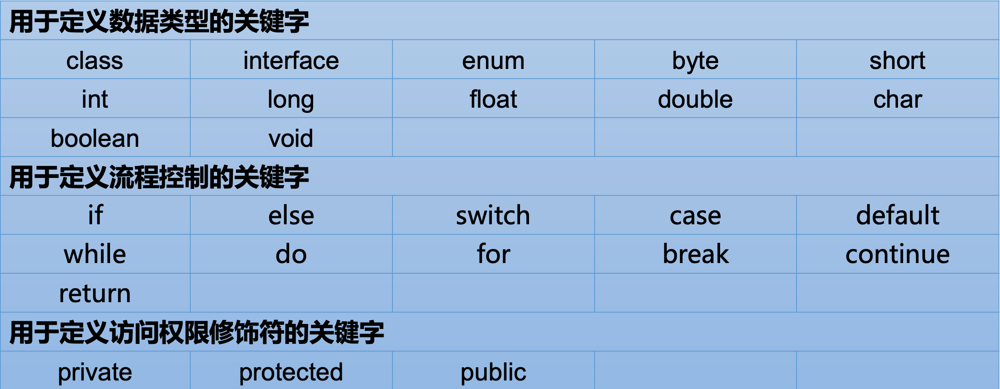
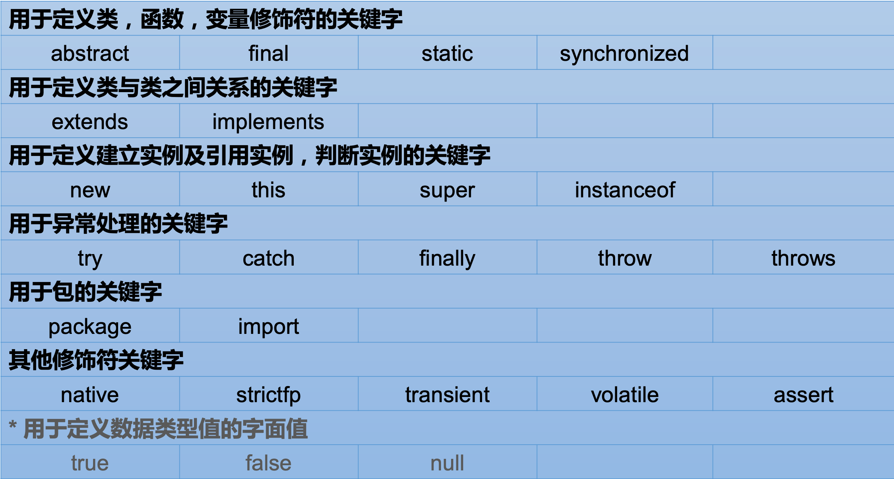
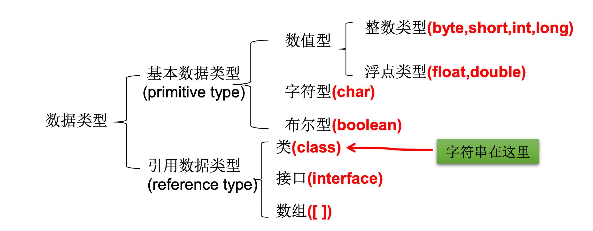
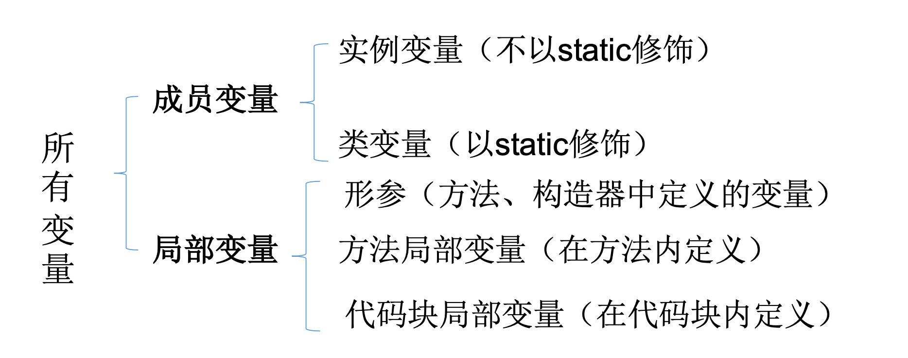
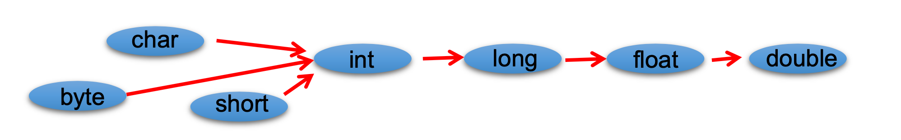

# 02. Java 基本语法

- 笔记本：01. Java 核心基础（宋红康）
- 创建时间：2021-01-23 11:38:10 UTC
- 更新时间：2021-01-23 12:45:27 UTC
- 印象笔记 GUID：1fc591ba-36aa-4bcb-870d-fb9888c45906

## Java 基本语法

### 1. 关键字和保留字

**关键字(keyword)的定义和特点**

- 定义: 被Java语言赋予了特殊含义，用做专门用途的字符串(单词)

- 特点: 关键字中所有字母都为小写

- 官方地址:

>
https://docs.oracle.com/javase/tutorial/java/nutsandbolts/_keywords.html

 

**保留字(reserved word)**
 Java保留字:现有Java版本尚未使用，但以后版本可能会作为关键字使 用。自己命名标识符时要避免使用这些保留字 `goto` 、`const`

### 2. 标识符

Java 对各种变量、方法和类等要素命名时使用的字符序列称为标识符

**Tips:** 凡是自己可以起名字的地方都叫标识符。

**定义合法标识符规则:**

- 由26个英文字母大小写，0-9 ，_或 $ 组成

- 不可以数字开头

- 不可以使用关键字和保留字，但能包含关键字和保留字

- Java中严格区分大小写，长度无限制

- 标识符不能包含空格

#### Java中的名称命名规范

- **包名:** 多单词组成时所有字母都小写:xxxyyyzzz

- **类名、接口名:** 多单词组成时，所有单词的首字母大写:XxxYyyZzz

- **变量名、方法名:** 多单词组成时，第一个单词首字母小写，第二个单词开始每个单词首字母大写:xxxYyyZzz

- **常量名:** 所有字母都大写。多单词时每个单词用下划线连接:XXX_YYY_ZZZ

**注意1:** 在起名字时，为了提高阅读性，要尽量有意义，“见名知意”。
 **注意2:** java采用unicode字符集，因此标识符也可以使用汉字声明，但是不建议使用。

### 3. 变量

**变量的概念:**

- 内存中的一个存储区域

- 该区域的数据可以在同一类型范围内不断变化

- 变量是程序中最基本的存储单元。包含**变量类型、变量名和存储的值**

**变量的作用:** 用于在内存中保存数据

**使用变量注意:**

- Java中每个变量必须先声明，后使用

- 使用变量名来访问这块区域的数据

- 变量的作用域:其定义所在的一对{ }内

- 变量只有在其作用域内才有效

- 同一个作用域内，不能定义重名的变量

#### 变量的分类 - 按数据类型

对于每一种数据都定义了明确的具体数据类型(强类型语言)，在内存中分
 变量的分类-按数据类型 配了不同大小的内存空间。
 

#### 变量的分类 - 按声明的位置的不同

- 在方法体外，类体内声明的变量称为成员变量。

- 在方法体内部声明的变量称为局部变量。
 

**注意:** 二者在初始化值方面的异同:
 同: 都有生命周期 异: 局部变量除形参外，需显式初始化。

#### 3.1. 整数类型：byte、short、int、long

- Java各整数类型有固定的表数范围和字段长度，不受具体OS的影响，以保 证java程序的可移植性

- java的整型常量默认为 int 型，声明long型常量须后加‘l’或‘L’

- java程序中变量通常声明为int型，除非不足以表示较大的数，才使用long

 | 类型 | 占用存储空间 | 表数范围
 | byte | 1字节=8bit位 | -128 ~ 127
 | short | 2字节 | -2^15 ~2^15-1
 | int | 4字节 | -2^31 ~ 2^31-1 (约21亿)
 | long | 8字节 | -2^63 ~ 2^63-1

#### 3.2. 浮点类型：float、double

- 与整数类型类似，Java 浮点类型也有固定的表数范围和字段长度，不受具体操作系统的影响。

- 浮点型常量有两种表示形式:

  - 十进制数形式:如:5.12 512.0f .512 (必须有小数点)

  - 科学计数法形式:如:5.12e2 512E2 100E-2

- float:单精度，尾数可以精确到7位有效数字。很多情况下，精度很难满足需求。 double:双精度，精度是float的两倍。通常采用此类型。

- **Java 的浮点型常量默认为double型**，声明float型常量，须后加‘f’或‘F’。

 | 类型 | 占用存储空间 | 表数范围
 | float | 4字节=8bit位 | -3.403E38 ~ 3.403E38
 | double | 8字节 | -1.798E308 ~ 1.798E308

#### 3.3. 字符类型：char

- char 型数据用来表示通常意义上“字符”(2字节)

- Java中的所有字符都使用Unicode编码，故一个字符可以存储一个字
 母，一个汉字，或其他书面语的一个字符。

- 字符型变量的三种表现形式:

  - 字符常量是用单引号(‘ ’)括起来的单个字符。例如:char c1 = 'a'; char c2 = '中'; char c3 = '9';

  - Java中还允许使用转义字符‘\’来将其后的字符转变为特殊字符型常量。 例如:char c3 = ‘\n’; // '\n'表示换行符

  - 直接使用 Unicode 值来表示字符型常量:‘\uXXXX’。其中，XXXX代表 一个十六进制整数。如:\u000a 表示 \n。

- char类型是可以进行运算的。因为它都对应有Unicode码。

##### ASCII 码

- 在计算机内部，所有数据都使用二进制表示。每一个二进制位(bit)有 0 和 1 两种状态， 因此 8 个二进制位就可以组合出 256 种状态，这被称为一个字节(byte)。一个字节一 共可以用来表示 256 种不同的状态，每一个状态对应一个符号，就是 256 个符号，从 0000000 到 11111111。

- ASCII码:上个世纪60年代，美国制定了一套字符编码，对英语字符与二进制位之间的 关系，做了统一规定。这被称为ASCII码。ASCII码一共规定了128个字符的编码，比如 空格“SPACE”是32(二进制00100000)，大写的字母A是65(二进制01000001)。这 128个符号(包括32个不能打印出来的控制符号)，只占用了一个字节的后面7位，最前 面的1位统一规定为0。

- 缺点:

  - 不能表示所有字符。

  - 相同的编码表示的字符不一样:比如，130在法语编码中代表了é，在希伯来语编码中却代表 了字母Gimel(ג)

##### Unicode 编码

- 乱码:世界上存在着多种编码方式，同一个二进制数字可以被解释成不同的符号。因 此，要想打开一个文本文件，就必须知道它的编码方式，否则用错误的编码方式解读， 就会出现乱码。

- Unicode:一种编码，将世界上所有的符号都纳入其中。每一个符号都给予一个独一 无二的编码，使用 Unicode 没有乱码的问题。

- Unicode 的缺点:Unicode 只规定了符号的二进制代码，却没有规定这个二进制代码 应该如何存储:无法区别 Unicode 和 ASCII:计算机无法区分三个字节表示一个符号 还是分别表示三个符号。另外，我们知道，英文字母只用一个字节表示就够了，如果 unicode统一规定，每个符号用三个或四个字节表示，那么每个英文字母前都必然有 二到三个字节是0，这对于存储空间来说是极大的浪费。

##### UTF-8

- UTF-8 是在互联网上使用最广的一种 Unicode 的实现方式。

- UTF-8 是一种变长的编码方式。它可以使用 1-6 个字节表示一个符号，根据不同的符号而变化字节长度。

- UTF-8的编码规则:

  - 对于单字节的UTF-8编码，该字节的最高位为0，其余7位用来对字符进行编码(等同于 ASCII码)。

  - 对于多字节的UTF-8编码，如果编码包含 n 个字节，那么第一个字节的前 n 位为1，第一 个字节的第 n+1 位为0，该字节的剩余各位用来对字符进行编码。在第一个字节之后的 所有的字节，都是最高两位为"10"，其余6位用来对字符进行编码。

#### 3.4. 布尔类型：boolean

- boolean 类型用来判断逻辑条件，一般用于程序流程控制:

  - if条件控制语句;

  - while循环控制语句;

  - do-while循环控制语句;

  - for循环控制语句;

- **boolean类型数据只允许取值true和false，无null。**

  - 不可以使用0或非 0 的整数替代false和true，这点和C语言不同。

  - Java虚拟机中没有任何供boolean值专用的字节码指令，Java语言表达所操作的 boolean值，在编译之后都使用java虚拟机中的int数据类型来代替:true用1表示，false 用0表示。———《java虚拟机规范 8版》

##### 基本数据类型转换

- **自动类型转换:** 容量小的类型自动转换为容量大的数据类型。数据类型按容量大小排序为:
 

- 有多种类型的数据混合运算时，系统首先自动将所有数据转换成容量最大的 那种数据类型，然后再进行计算。

- byte,short,char之间不会相互转换，他们三者在计算时首先转换为int类型。

- boolean类型不能与其它数据类型运算。

- 当把任何基本数据类型的值和字符串(String)进行连接运算时(+)，基本数据类 型的值将自动转化为字符串(String)类型。

#### 3.5. 字符串类型：String

- String不是基本数据类型，属于引用数据类型

- 使用方式与基本数据类型一致。例如:String str = “abcd”;

- 一个字符串可以串接另一个字符串，也可以直接串接其他类型的数据。

##### 强制类型转换

- 自动类型转换的逆过程，将容量大的数据类型转换为容量小的数据类型。使 用时要加上强制转换符:()，但可能造成**精度降低或溢出**,格外要注意。

- 通常，字符串不能直接转换为基本类型，但通过基本类型对应的包装类则可 以实现把字符串转换成基本类型。

- 如: String a = “43”; int i = Integer.parseInt(a);

- boolean类型不可以转换为其它的数据类型。

%23%23%20Java%20%E5%9F%BA%E6%9C%AC%E8%AF%AD%E6%B3%95%0A%0A%23%23%23%201.%20%E5%85%B3%E9%94%AE%E5%AD%97%E5%92%8C%E4%BF%9D%E7%95%99%E5%AD%97%0A**%E5%85%B3%E9%94%AE%E5%AD%97(keyword)%E7%9A%84%E5%AE%9A%E4%B9%89%E5%92%8C%E7%89%B9%E7%82%B9**%0A-%20%E5%AE%9A%E4%B9%89%3A%20%E8%A2%ABJava%E8%AF%AD%E8%A8%80%E8%B5%8B%E4%BA%88%E4%BA%86%E7%89%B9%E6%AE%8A%E5%90%AB%E4%B9%89%EF%BC%8C%E7%94%A8%E5%81%9A%E4%B8%93%E9%97%A8%E7%94%A8%E9%80%94%E7%9A%84%E5%AD%97%E7%AC%A6%E4%B8%B2(%E5%8D%95%E8%AF%8D)%0A-%20%E7%89%B9%E7%82%B9%3A%20%E5%85%B3%E9%94%AE%E5%AD%97%E4%B8%AD%E6%89%80%E6%9C%89%E5%AD%97%E6%AF%8D%E9%83%BD%E4%B8%BA%E5%B0%8F%E5%86%99%0A-%20%E5%AE%98%E6%96%B9%E5%9C%B0%E5%9D%80%3A%20%0A%20%20%20%20%3Ehttps%3A%2F%2Fdocs.oracle.com%2Fjavase%2Ftutorial%2Fjava%2Fnutsandbolts%2F_keywords.html%0A%0A!%5Ba9b5841bd279246ad4fd168ecf383f6a.png%5D(evernotecid%3A%2F%2F90F5C43D-AEAE-49B2-85BB-D02B6A52C764%2Fappyinxiangcom%2F25356149%2FENResource%2Fp1604)%0A!%5Bd075b5f4949b1c5a4199fae7d26e9b79.png%5D(evernotecid%3A%2F%2F90F5C43D-AEAE-49B2-85BB-D02B6A52C764%2Fappyinxiangcom%2F25356149%2FENResource%2Fp1605)%0A%0A**%E4%BF%9D%E7%95%99%E5%AD%97(reserved%20word)**%0AJava%E4%BF%9D%E7%95%99%E5%AD%97%3A%E7%8E%B0%E6%9C%89Java%E7%89%88%E6%9C%AC%E5%B0%9A%E6%9C%AA%E4%BD%BF%E7%94%A8%EF%BC%8C%E4%BD%86%E4%BB%A5%E5%90%8E%E7%89%88%E6%9C%AC%E5%8F%AF%E8%83%BD%E4%BC%9A%E4%BD%9C%E4%B8%BA%E5%85%B3%E9%94%AE%E5%AD%97%E4%BD%BF%20%E7%94%A8%E3%80%82%E8%87%AA%E5%B7%B1%E5%91%BD%E5%90%8D%E6%A0%87%E8%AF%86%E7%AC%A6%E6%97%B6%E8%A6%81%E9%81%BF%E5%85%8D%E4%BD%BF%E7%94%A8%E8%BF%99%E4%BA%9B%E4%BF%9D%E7%95%99%E5%AD%97%20%60goto%60%20%E3%80%81%60const%60%0A%0A%23%23%23%202.%20%E6%A0%87%E8%AF%86%E7%AC%A6%0AJava%20%E5%AF%B9%E5%90%84%E7%A7%8D%E5%8F%98%E9%87%8F%E3%80%81%E6%96%B9%E6%B3%95%E5%92%8C%E7%B1%BB%E7%AD%89%E8%A6%81%E7%B4%A0%E5%91%BD%E5%90%8D%E6%97%B6%E4%BD%BF%E7%94%A8%E7%9A%84%E5%AD%97%E7%AC%A6%E5%BA%8F%E5%88%97%E7%A7%B0%E4%B8%BA%E6%A0%87%E8%AF%86%E7%AC%A6%0A%0A**Tips%3A**%20%E5%87%A1%E6%98%AF%E8%87%AA%E5%B7%B1%E5%8F%AF%E4%BB%A5%E8%B5%B7%E5%90%8D%E5%AD%97%E7%9A%84%E5%9C%B0%E6%96%B9%E9%83%BD%E5%8F%AB%E6%A0%87%E8%AF%86%E7%AC%A6%E3%80%82%0A%0A**%E5%AE%9A%E4%B9%89%E5%90%88%E6%B3%95%E6%A0%87%E8%AF%86%E7%AC%A6%E8%A7%84%E5%88%99%3A**%0A-%20%E7%94%B126%E4%B8%AA%E8%8B%B1%E6%96%87%E5%AD%97%E6%AF%8D%E5%A4%A7%E5%B0%8F%E5%86%99%EF%BC%8C0-9%20%EF%BC%8C_%E6%88%96%20%24%20%E7%BB%84%E6%88%90%0A-%20%E4%B8%8D%E5%8F%AF%E4%BB%A5%E6%95%B0%E5%AD%97%E5%BC%80%E5%A4%B4%0A-%20%E4%B8%8D%E5%8F%AF%E4%BB%A5%E4%BD%BF%E7%94%A8%E5%85%B3%E9%94%AE%E5%AD%97%E5%92%8C%E4%BF%9D%E7%95%99%E5%AD%97%EF%BC%8C%E4%BD%86%E8%83%BD%E5%8C%85%E5%90%AB%E5%85%B3%E9%94%AE%E5%AD%97%E5%92%8C%E4%BF%9D%E7%95%99%E5%AD%97%0A-%20Java%E4%B8%AD%E4%B8%A5%E6%A0%BC%E5%8C%BA%E5%88%86%E5%A4%A7%E5%B0%8F%E5%86%99%EF%BC%8C%E9%95%BF%E5%BA%A6%E6%97%A0%E9%99%90%E5%88%B6%0A-%20%E6%A0%87%E8%AF%86%E7%AC%A6%E4%B8%8D%E8%83%BD%E5%8C%85%E5%90%AB%E7%A9%BA%E6%A0%BC%0A%0A%23%23%23%23%20Java%E4%B8%AD%E7%9A%84%E5%90%8D%E7%A7%B0%E5%91%BD%E5%90%8D%E8%A7%84%E8%8C%83%0A-%20**%E5%8C%85%E5%90%8D%3A**%20%E5%A4%9A%E5%8D%95%E8%AF%8D%E7%BB%84%E6%88%90%E6%97%B6%E6%89%80%E6%9C%89%E5%AD%97%E6%AF%8D%E9%83%BD%E5%B0%8F%E5%86%99%3Axxxyyyzzz%0A-%20**%E7%B1%BB%E5%90%8D%E3%80%81%E6%8E%A5%E5%8F%A3%E5%90%8D%3A**%20%E5%A4%9A%E5%8D%95%E8%AF%8D%E7%BB%84%E6%88%90%E6%97%B6%EF%BC%8C%E6%89%80%E6%9C%89%E5%8D%95%E8%AF%8D%E7%9A%84%E9%A6%96%E5%AD%97%E6%AF%8D%E5%A4%A7%E5%86%99%3AXxxYyyZzz%0A-%20**%E5%8F%98%E9%87%8F%E5%90%8D%E3%80%81%E6%96%B9%E6%B3%95%E5%90%8D%3A**%20%E5%A4%9A%E5%8D%95%E8%AF%8D%E7%BB%84%E6%88%90%E6%97%B6%EF%BC%8C%E7%AC%AC%E4%B8%80%E4%B8%AA%E5%8D%95%E8%AF%8D%E9%A6%96%E5%AD%97%E6%AF%8D%E5%B0%8F%E5%86%99%EF%BC%8C%E7%AC%AC%E4%BA%8C%E4%B8%AA%E5%8D%95%E8%AF%8D%E5%BC%80%E5%A7%8B%E6%AF%8F%E4%B8%AA%E5%8D%95%E8%AF%8D%E9%A6%96%E5%AD%97%E6%AF%8D%E5%A4%A7%E5%86%99%3AxxxYyyZzz%0A-%20**%E5%B8%B8%E9%87%8F%E5%90%8D%3A**%20%E6%89%80%E6%9C%89%E5%AD%97%E6%AF%8D%E9%83%BD%E5%A4%A7%E5%86%99%E3%80%82%E5%A4%9A%E5%8D%95%E8%AF%8D%E6%97%B6%E6%AF%8F%E4%B8%AA%E5%8D%95%E8%AF%8D%E7%94%A8%E4%B8%8B%E5%88%92%E7%BA%BF%E8%BF%9E%E6%8E%A5%3AXXX_YYY_ZZZ%0A%0A**%E6%B3%A8%E6%84%8F1%3A**%20%E5%9C%A8%E8%B5%B7%E5%90%8D%E5%AD%97%E6%97%B6%EF%BC%8C%E4%B8%BA%E4%BA%86%E6%8F%90%E9%AB%98%E9%98%85%E8%AF%BB%E6%80%A7%EF%BC%8C%E8%A6%81%E5%B0%BD%E9%87%8F%E6%9C%89%E6%84%8F%E4%B9%89%EF%BC%8C%E2%80%9C%E8%A7%81%E5%90%8D%E7%9F%A5%E6%84%8F%E2%80%9D%E3%80%82%0A**%E6%B3%A8%E6%84%8F2%3A**%20java%E9%87%87%E7%94%A8unicode%E5%AD%97%E7%AC%A6%E9%9B%86%EF%BC%8C%E5%9B%A0%E6%AD%A4%E6%A0%87%E8%AF%86%E7%AC%A6%E4%B9%9F%E5%8F%AF%E4%BB%A5%E4%BD%BF%E7%94%A8%E6%B1%89%E5%AD%97%E5%A3%B0%E6%98%8E%EF%BC%8C%E4%BD%86%E6%98%AF%E4%B8%8D%E5%BB%BA%E8%AE%AE%E4%BD%BF%E7%94%A8%E3%80%82%0A%0A%23%23%23%203.%20%E5%8F%98%E9%87%8F%0A**%E5%8F%98%E9%87%8F%E7%9A%84%E6%A6%82%E5%BF%B5%3A**%0A-%20%E5%86%85%E5%AD%98%E4%B8%AD%E7%9A%84%E4%B8%80%E4%B8%AA%E5%AD%98%E5%82%A8%E5%8C%BA%E5%9F%9F%0A-%20%E8%AF%A5%E5%8C%BA%E5%9F%9F%E7%9A%84%E6%95%B0%E6%8D%AE%E5%8F%AF%E4%BB%A5%E5%9C%A8%E5%90%8C%E4%B8%80%E7%B1%BB%E5%9E%8B%E8%8C%83%E5%9B%B4%E5%86%85%E4%B8%8D%E6%96%AD%E5%8F%98%E5%8C%96%0A-%20%E5%8F%98%E9%87%8F%E6%98%AF%E7%A8%8B%E5%BA%8F%E4%B8%AD%E6%9C%80%E5%9F%BA%E6%9C%AC%E7%9A%84%E5%AD%98%E5%82%A8%E5%8D%95%E5%85%83%E3%80%82%E5%8C%85%E5%90%AB**%E5%8F%98%E9%87%8F%E7%B1%BB%E5%9E%8B%E3%80%81%E5%8F%98%E9%87%8F%E5%90%8D%E5%92%8C%E5%AD%98%E5%82%A8%E7%9A%84%E5%80%BC**%0A%0A**%E5%8F%98%E9%87%8F%E7%9A%84%E4%BD%9C%E7%94%A8%3A**%20%E7%94%A8%E4%BA%8E%E5%9C%A8%E5%86%85%E5%AD%98%E4%B8%AD%E4%BF%9D%E5%AD%98%E6%95%B0%E6%8D%AE%0A%0A**%E4%BD%BF%E7%94%A8%E5%8F%98%E9%87%8F%E6%B3%A8%E6%84%8F%3A**%0A-%20Java%E4%B8%AD%E6%AF%8F%E4%B8%AA%E5%8F%98%E9%87%8F%E5%BF%85%E9%A1%BB%E5%85%88%E5%A3%B0%E6%98%8E%EF%BC%8C%E5%90%8E%E4%BD%BF%E7%94%A8%0A-%20%E4%BD%BF%E7%94%A8%E5%8F%98%E9%87%8F%E5%90%8D%E6%9D%A5%E8%AE%BF%E9%97%AE%E8%BF%99%E5%9D%97%E5%8C%BA%E5%9F%9F%E7%9A%84%E6%95%B0%E6%8D%AE%0A-%20%E5%8F%98%E9%87%8F%E7%9A%84%E4%BD%9C%E7%94%A8%E5%9F%9F%3A%E5%85%B6%E5%AE%9A%E4%B9%89%E6%89%80%E5%9C%A8%E7%9A%84%E4%B8%80%E5%AF%B9%7B%20%7D%E5%86%85%0A-%20%E5%8F%98%E9%87%8F%E5%8F%AA%E6%9C%89%E5%9C%A8%E5%85%B6%E4%BD%9C%E7%94%A8%E5%9F%9F%E5%86%85%E6%89%8D%E6%9C%89%E6%95%88%0A-%20%E5%90%8C%E4%B8%80%E4%B8%AA%E4%BD%9C%E7%94%A8%E5%9F%9F%E5%86%85%EF%BC%8C%E4%B8%8D%E8%83%BD%E5%AE%9A%E4%B9%89%E9%87%8D%E5%90%8D%E7%9A%84%E5%8F%98%E9%87%8F%0A%0A%23%23%23%23%20%E5%8F%98%E9%87%8F%E7%9A%84%E5%88%86%E7%B1%BB%20-%20%E6%8C%89%E6%95%B0%E6%8D%AE%E7%B1%BB%E5%9E%8B%0A%E5%AF%B9%E4%BA%8E%E6%AF%8F%E4%B8%80%E7%A7%8D%E6%95%B0%E6%8D%AE%E9%83%BD%E5%AE%9A%E4%B9%89%E4%BA%86%E6%98%8E%E7%A1%AE%E7%9A%84%E5%85%B7%E4%BD%93%E6%95%B0%E6%8D%AE%E7%B1%BB%E5%9E%8B(%E5%BC%BA%E7%B1%BB%E5%9E%8B%E8%AF%AD%E8%A8%80)%EF%BC%8C%E5%9C%A8%E5%86%85%E5%AD%98%E4%B8%AD%E5%88%86%0A%E5%8F%98%E9%87%8F%E7%9A%84%E5%88%86%E7%B1%BB-%E6%8C%89%E6%95%B0%E6%8D%AE%E7%B1%BB%E5%9E%8B%20%E9%85%8D%E4%BA%86%E4%B8%8D%E5%90%8C%E5%A4%A7%E5%B0%8F%E7%9A%84%E5%86%85%E5%AD%98%E7%A9%BA%E9%97%B4%E3%80%82%0A!%5Bf60b088efa444e55f33340602bd793d7.png%5D(evernotecid%3A%2F%2F90F5C43D-AEAE-49B2-85BB-D02B6A52C764%2Fappyinxiangcom%2F25356149%2FENResource%2Fp1606)%0A%0A%23%23%23%23%20%E5%8F%98%E9%87%8F%E7%9A%84%E5%88%86%E7%B1%BB%20-%20%E6%8C%89%E5%A3%B0%E6%98%8E%E7%9A%84%E4%BD%8D%E7%BD%AE%E7%9A%84%E4%B8%8D%E5%90%8C%0A-%20%E5%9C%A8%E6%96%B9%E6%B3%95%E4%BD%93%E5%A4%96%EF%BC%8C%E7%B1%BB%E4%BD%93%E5%86%85%E5%A3%B0%E6%98%8E%E7%9A%84%E5%8F%98%E9%87%8F%E7%A7%B0%E4%B8%BA%E6%88%90%E5%91%98%E5%8F%98%E9%87%8F%E3%80%82%0A-%20%E5%9C%A8%E6%96%B9%E6%B3%95%E4%BD%93%E5%86%85%E9%83%A8%E5%A3%B0%E6%98%8E%E7%9A%84%E5%8F%98%E9%87%8F%E7%A7%B0%E4%B8%BA%E5%B1%80%E9%83%A8%E5%8F%98%E9%87%8F%E3%80%82%0A!%5Bbdb5fcf1e4b0ac7a8c568b21404fd9f5.png%5D(evernotecid%3A%2F%2F90F5C43D-AEAE-49B2-85BB-D02B6A52C764%2Fappyinxiangcom%2F25356149%2FENResource%2Fp1607)%0A%0A**%E6%B3%A8%E6%84%8F%3A**%20%E4%BA%8C%E8%80%85%E5%9C%A8%E5%88%9D%E5%A7%8B%E5%8C%96%E5%80%BC%E6%96%B9%E9%9D%A2%E7%9A%84%E5%BC%82%E5%90%8C%3A%0A%E5%90%8C%3A%20%E9%83%BD%E6%9C%89%E7%94%9F%E5%91%BD%E5%91%A8%E6%9C%9F%20%E5%BC%82%3A%20%E5%B1%80%E9%83%A8%E5%8F%98%E9%87%8F%E9%99%A4%E5%BD%A2%E5%8F%82%E5%A4%96%EF%BC%8C%E9%9C%80%E6%98%BE%E5%BC%8F%E5%88%9D%E5%A7%8B%E5%8C%96%E3%80%82%0A%0A%23%23%23%23%203.1.%20%E6%95%B4%E6%95%B0%E7%B1%BB%E5%9E%8B%EF%BC%9Abyte%E3%80%81short%E3%80%81int%E3%80%81long%0A-%20Java%E5%90%84%E6%95%B4%E6%95%B0%E7%B1%BB%E5%9E%8B%E6%9C%89%E5%9B%BA%E5%AE%9A%E7%9A%84%E8%A1%A8%E6%95%B0%E8%8C%83%E5%9B%B4%E5%92%8C%E5%AD%97%E6%AE%B5%E9%95%BF%E5%BA%A6%EF%BC%8C%E4%B8%8D%E5%8F%97%E5%85%B7%E4%BD%93OS%E7%9A%84%E5%BD%B1%E5%93%8D%EF%BC%8C%E4%BB%A5%E4%BF%9D%20%E8%AF%81java%E7%A8%8B%E5%BA%8F%E7%9A%84%E5%8F%AF%E7%A7%BB%E6%A4%8D%E6%80%A7%0A-%20java%E7%9A%84%E6%95%B4%E5%9E%8B%E5%B8%B8%E9%87%8F%E9%BB%98%E8%AE%A4%E4%B8%BA%20int%20%E5%9E%8B%EF%BC%8C%E5%A3%B0%E6%98%8Elong%E5%9E%8B%E5%B8%B8%E9%87%8F%E9%A1%BB%E5%90%8E%E5%8A%A0%E2%80%98l%E2%80%99%E6%88%96%E2%80%98L%E2%80%99%0A-%20java%E7%A8%8B%E5%BA%8F%E4%B8%AD%E5%8F%98%E9%87%8F%E9%80%9A%E5%B8%B8%E5%A3%B0%E6%98%8E%E4%B8%BAint%E5%9E%8B%EF%BC%8C%E9%99%A4%E9%9D%9E%E4%B8%8D%E8%B6%B3%E4%BB%A5%E8%A1%A8%E7%A4%BA%E8%BE%83%E5%A4%A7%E7%9A%84%E6%95%B0%EF%BC%8C%E6%89%8D%E4%BD%BF%E7%94%A8long%0A%0A%E7%B1%BB%E5%9E%8B%20%7C%20%E5%8D%A0%E7%94%A8%E5%AD%98%E5%82%A8%E7%A9%BA%E9%97%B4%20%7C%20%E8%A1%A8%E6%95%B0%E8%8C%83%E5%9B%B4%0A---%20%7C%20---%20%7C%20---%0Abyte%20%7C%201%E5%AD%97%E8%8A%82%3D8bit%E4%BD%8D%20%7C%20-128%20~%20127%0Ashort%20%7C%202%E5%AD%97%E8%8A%82%20%7C%20-2%5E15%20~2%5E15-1%0Aint%20%7C%204%E5%AD%97%E8%8A%82%20%7C%20-2%5E31%20~%202%5E31-1%20(%E7%BA%A621%E4%BA%BF)%0Along%20%7C%208%E5%AD%97%E8%8A%82%20%7C%20-2%5E63%20~%202%5E63-1%0A%0A%23%23%23%23%203.2.%20%E6%B5%AE%E7%82%B9%E7%B1%BB%E5%9E%8B%EF%BC%9Afloat%E3%80%81double%0A-%20%E4%B8%8E%E6%95%B4%E6%95%B0%E7%B1%BB%E5%9E%8B%E7%B1%BB%E4%BC%BC%EF%BC%8CJava%20%E6%B5%AE%E7%82%B9%E7%B1%BB%E5%9E%8B%E4%B9%9F%E6%9C%89%E5%9B%BA%E5%AE%9A%E7%9A%84%E8%A1%A8%E6%95%B0%E8%8C%83%E5%9B%B4%E5%92%8C%E5%AD%97%E6%AE%B5%E9%95%BF%E5%BA%A6%EF%BC%8C%E4%B8%8D%E5%8F%97%E5%85%B7%E4%BD%93%E6%93%8D%E4%BD%9C%E7%B3%BB%E7%BB%9F%E7%9A%84%E5%BD%B1%E5%93%8D%E3%80%82%0A-%20%E6%B5%AE%E7%82%B9%E5%9E%8B%E5%B8%B8%E9%87%8F%E6%9C%89%E4%B8%A4%E7%A7%8D%E8%A1%A8%E7%A4%BA%E5%BD%A2%E5%BC%8F%3A%0A%20%20%20%20-%20%E5%8D%81%E8%BF%9B%E5%88%B6%E6%95%B0%E5%BD%A2%E5%BC%8F%3A%E5%A6%82%3A5.12%20512.0f%20.512%20(%E5%BF%85%E9%A1%BB%E6%9C%89%E5%B0%8F%E6%95%B0%E7%82%B9)%0A%20%20%20%20-%20%E7%A7%91%E5%AD%A6%E8%AE%A1%E6%95%B0%E6%B3%95%E5%BD%A2%E5%BC%8F%3A%E5%A6%82%3A5.12e2%20512E2%20100E-2%0A-%20float%3A%E5%8D%95%E7%B2%BE%E5%BA%A6%EF%BC%8C%E5%B0%BE%E6%95%B0%E5%8F%AF%E4%BB%A5%E7%B2%BE%E7%A1%AE%E5%88%B07%E4%BD%8D%E6%9C%89%E6%95%88%E6%95%B0%E5%AD%97%E3%80%82%E5%BE%88%E5%A4%9A%E6%83%85%E5%86%B5%E4%B8%8B%EF%BC%8C%E7%B2%BE%E5%BA%A6%E5%BE%88%E9%9A%BE%E6%BB%A1%E8%B6%B3%E9%9C%80%E6%B1%82%E3%80%82%20double%3A%E5%8F%8C%E7%B2%BE%E5%BA%A6%EF%BC%8C%E7%B2%BE%E5%BA%A6%E6%98%AFfloat%E7%9A%84%E4%B8%A4%E5%80%8D%E3%80%82%E9%80%9A%E5%B8%B8%E9%87%87%E7%94%A8%E6%AD%A4%E7%B1%BB%E5%9E%8B%E3%80%82%0A-%20**Java%20%E7%9A%84%E6%B5%AE%E7%82%B9%E5%9E%8B%E5%B8%B8%E9%87%8F%E9%BB%98%E8%AE%A4%E4%B8%BAdouble%E5%9E%8B**%EF%BC%8C%E5%A3%B0%E6%98%8Efloat%E5%9E%8B%E5%B8%B8%E9%87%8F%EF%BC%8C%E9%A1%BB%E5%90%8E%E5%8A%A0%E2%80%98f%E2%80%99%E6%88%96%E2%80%98F%E2%80%99%E3%80%82%0A%0A%E7%B1%BB%E5%9E%8B%20%7C%20%E5%8D%A0%E7%94%A8%E5%AD%98%E5%82%A8%E7%A9%BA%E9%97%B4%20%7C%20%E8%A1%A8%E6%95%B0%E8%8C%83%E5%9B%B4%0A---%20%7C%20---%20%7C%20---%0Afloat%20%7C%204%E5%AD%97%E8%8A%82%3D8bit%E4%BD%8D%20%7C%20-3.403E38%20~%203.403E38%0Adouble%20%7C%208%E5%AD%97%E8%8A%82%20%7C%20-1.798E308%20~%201.798E308%0A%0A%23%23%23%23%203.3.%20%E5%AD%97%E7%AC%A6%E7%B1%BB%E5%9E%8B%EF%BC%9Achar%0A-%20char%20%E5%9E%8B%E6%95%B0%E6%8D%AE%E7%94%A8%E6%9D%A5%E8%A1%A8%E7%A4%BA%E9%80%9A%E5%B8%B8%E6%84%8F%E4%B9%89%E4%B8%8A%E2%80%9C%E5%AD%97%E7%AC%A6%E2%80%9D(2%E5%AD%97%E8%8A%82)%0A-%20Java%E4%B8%AD%E7%9A%84%E6%89%80%E6%9C%89%E5%AD%97%E7%AC%A6%E9%83%BD%E4%BD%BF%E7%94%A8Unicode%E7%BC%96%E7%A0%81%EF%BC%8C%E6%95%85%E4%B8%80%E4%B8%AA%E5%AD%97%E7%AC%A6%E5%8F%AF%E4%BB%A5%E5%AD%98%E5%82%A8%E4%B8%80%E4%B8%AA%E5%AD%97%0A%E6%AF%8D%EF%BC%8C%E4%B8%80%E4%B8%AA%E6%B1%89%E5%AD%97%EF%BC%8C%E6%88%96%E5%85%B6%E4%BB%96%E4%B9%A6%E9%9D%A2%E8%AF%AD%E7%9A%84%E4%B8%80%E4%B8%AA%E5%AD%97%E7%AC%A6%E3%80%82%0A-%20%E5%AD%97%E7%AC%A6%E5%9E%8B%E5%8F%98%E9%87%8F%E7%9A%84%E4%B8%89%E7%A7%8D%E8%A1%A8%E7%8E%B0%E5%BD%A2%E5%BC%8F%3A%0A%20%20%20%20-%20%E5%AD%97%E7%AC%A6%E5%B8%B8%E9%87%8F%E6%98%AF%E7%94%A8%E5%8D%95%E5%BC%95%E5%8F%B7(%E2%80%98%20%E2%80%99)%E6%8B%AC%E8%B5%B7%E6%9D%A5%E7%9A%84%E5%8D%95%E4%B8%AA%E5%AD%97%E7%AC%A6%E3%80%82%E4%BE%8B%E5%A6%82%3Achar%20c1%20%3D%20'a'%3B%20char%20c2%20%3D%20'%E4%B8%AD'%3B%20char%20c3%20%3D%20'9'%3B%0A%20%20%20%20-%20Java%E4%B8%AD%E8%BF%98%E5%85%81%E8%AE%B8%E4%BD%BF%E7%94%A8%E8%BD%AC%E4%B9%89%E5%AD%97%E7%AC%A6%E2%80%98%5C%E2%80%99%E6%9D%A5%E5%B0%86%E5%85%B6%E5%90%8E%E7%9A%84%E5%AD%97%E7%AC%A6%E8%BD%AC%E5%8F%98%E4%B8%BA%E7%89%B9%E6%AE%8A%E5%AD%97%E7%AC%A6%E5%9E%8B%E5%B8%B8%E9%87%8F%E3%80%82%20%E4%BE%8B%E5%A6%82%3Achar%20c3%20%3D%20%E2%80%98%5Cn%E2%80%99%3B%20%2F%2F%20'%5Cn'%E8%A1%A8%E7%A4%BA%E6%8D%A2%E8%A1%8C%E7%AC%A6%0A%20%20%20%20-%20%E7%9B%B4%E6%8E%A5%E4%BD%BF%E7%94%A8%20Unicode%20%E5%80%BC%E6%9D%A5%E8%A1%A8%E7%A4%BA%E5%AD%97%E7%AC%A6%E5%9E%8B%E5%B8%B8%E9%87%8F%3A%E2%80%98%5CuXXXX%E2%80%99%E3%80%82%E5%85%B6%E4%B8%AD%EF%BC%8CXXXX%E4%BB%A3%E8%A1%A8%20%E4%B8%80%E4%B8%AA%E5%8D%81%E5%85%AD%E8%BF%9B%E5%88%B6%E6%95%B4%E6%95%B0%E3%80%82%E5%A6%82%3A%5Cu000a%20%E8%A1%A8%E7%A4%BA%20%5Cn%E3%80%82%0A-%20char%E7%B1%BB%E5%9E%8B%E6%98%AF%E5%8F%AF%E4%BB%A5%E8%BF%9B%E8%A1%8C%E8%BF%90%E7%AE%97%E7%9A%84%E3%80%82%E5%9B%A0%E4%B8%BA%E5%AE%83%E9%83%BD%E5%AF%B9%E5%BA%94%E6%9C%89Unicode%E7%A0%81%E3%80%82%0A%0A%23%23%23%23%23%20ASCII%20%E7%A0%81%0A-%20%E5%9C%A8%E8%AE%A1%E7%AE%97%E6%9C%BA%E5%86%85%E9%83%A8%EF%BC%8C%E6%89%80%E6%9C%89%E6%95%B0%E6%8D%AE%E9%83%BD%E4%BD%BF%E7%94%A8%E4%BA%8C%E8%BF%9B%E5%88%B6%E8%A1%A8%E7%A4%BA%E3%80%82%E6%AF%8F%E4%B8%80%E4%B8%AA%E4%BA%8C%E8%BF%9B%E5%88%B6%E4%BD%8D(bit)%E6%9C%89%200%20%E5%92%8C%201%20%E4%B8%A4%E7%A7%8D%E7%8A%B6%E6%80%81%EF%BC%8C%20%E5%9B%A0%E6%AD%A4%208%20%E4%B8%AA%E4%BA%8C%E8%BF%9B%E5%88%B6%E4%BD%8D%E5%B0%B1%E5%8F%AF%E4%BB%A5%E7%BB%84%E5%90%88%E5%87%BA%20256%20%E7%A7%8D%E7%8A%B6%E6%80%81%EF%BC%8C%E8%BF%99%E8%A2%AB%E7%A7%B0%E4%B8%BA%E4%B8%80%E4%B8%AA%E5%AD%97%E8%8A%82(byte)%E3%80%82%E4%B8%80%E4%B8%AA%E5%AD%97%E8%8A%82%E4%B8%80%20%E5%85%B1%E5%8F%AF%E4%BB%A5%E7%94%A8%E6%9D%A5%E8%A1%A8%E7%A4%BA%20256%20%E7%A7%8D%E4%B8%8D%E5%90%8C%E7%9A%84%E7%8A%B6%E6%80%81%EF%BC%8C%E6%AF%8F%E4%B8%80%E4%B8%AA%E7%8A%B6%E6%80%81%E5%AF%B9%E5%BA%94%E4%B8%80%E4%B8%AA%E7%AC%A6%E5%8F%B7%EF%BC%8C%E5%B0%B1%E6%98%AF%20256%20%E4%B8%AA%E7%AC%A6%E5%8F%B7%EF%BC%8C%E4%BB%8E%200000000%20%E5%88%B0%2011111111%E3%80%82%0A-%20ASCII%E7%A0%81%3A%E4%B8%8A%E4%B8%AA%E4%B8%96%E7%BA%AA60%E5%B9%B4%E4%BB%A3%EF%BC%8C%E7%BE%8E%E5%9B%BD%E5%88%B6%E5%AE%9A%E4%BA%86%E4%B8%80%E5%A5%97%E5%AD%97%E7%AC%A6%E7%BC%96%E7%A0%81%EF%BC%8C%E5%AF%B9%E8%8B%B1%E8%AF%AD%E5%AD%97%E7%AC%A6%E4%B8%8E%E4%BA%8C%E8%BF%9B%E5%88%B6%E4%BD%8D%E4%B9%8B%E9%97%B4%E7%9A%84%20%E5%85%B3%E7%B3%BB%EF%BC%8C%E5%81%9A%E4%BA%86%E7%BB%9F%E4%B8%80%E8%A7%84%E5%AE%9A%E3%80%82%E8%BF%99%E8%A2%AB%E7%A7%B0%E4%B8%BAASCII%E7%A0%81%E3%80%82ASCII%E7%A0%81%E4%B8%80%E5%85%B1%E8%A7%84%E5%AE%9A%E4%BA%86128%E4%B8%AA%E5%AD%97%E7%AC%A6%E7%9A%84%E7%BC%96%E7%A0%81%EF%BC%8C%E6%AF%94%E5%A6%82%20%E7%A9%BA%E6%A0%BC%E2%80%9CSPACE%E2%80%9D%E6%98%AF32(%E4%BA%8C%E8%BF%9B%E5%88%B600100000)%EF%BC%8C%E5%A4%A7%E5%86%99%E7%9A%84%E5%AD%97%E6%AF%8DA%E6%98%AF65(%E4%BA%8C%E8%BF%9B%E5%88%B601000001)%E3%80%82%E8%BF%99%20128%E4%B8%AA%E7%AC%A6%E5%8F%B7(%E5%8C%85%E6%8B%AC32%E4%B8%AA%E4%B8%8D%E8%83%BD%E6%89%93%E5%8D%B0%E5%87%BA%E6%9D%A5%E7%9A%84%E6%8E%A7%E5%88%B6%E7%AC%A6%E5%8F%B7)%EF%BC%8C%E5%8F%AA%E5%8D%A0%E7%94%A8%E4%BA%86%E4%B8%80%E4%B8%AA%E5%AD%97%E8%8A%82%E7%9A%84%E5%90%8E%E9%9D%A27%E4%BD%8D%EF%BC%8C%E6%9C%80%E5%89%8D%20%E9%9D%A2%E7%9A%841%E4%BD%8D%E7%BB%9F%E4%B8%80%E8%A7%84%E5%AE%9A%E4%B8%BA0%E3%80%82%0A-%20%E7%BC%BA%E7%82%B9%3A%0A%20%20%20%20-%20%E4%B8%8D%E8%83%BD%E8%A1%A8%E7%A4%BA%E6%89%80%E6%9C%89%E5%AD%97%E7%AC%A6%E3%80%82%0A%20%20%20%20-%20%E7%9B%B8%E5%90%8C%E7%9A%84%E7%BC%96%E7%A0%81%E8%A1%A8%E7%A4%BA%E7%9A%84%E5%AD%97%E7%AC%A6%E4%B8%8D%E4%B8%80%E6%A0%B7%3A%E6%AF%94%E5%A6%82%EF%BC%8C130%E5%9C%A8%E6%B3%95%E8%AF%AD%E7%BC%96%E7%A0%81%E4%B8%AD%E4%BB%A3%E8%A1%A8%E4%BA%86%C3%A9%EF%BC%8C%E5%9C%A8%E5%B8%8C%E4%BC%AF%E6%9D%A5%E8%AF%AD%E7%BC%96%E7%A0%81%E4%B8%AD%E5%8D%B4%E4%BB%A3%E8%A1%A8%20%E4%BA%86%E5%AD%97%E6%AF%8DGimel(%D7%92)%0A%0A%23%23%23%23%23%20Unicode%20%E7%BC%96%E7%A0%81%0A-%20%E4%B9%B1%E7%A0%81%3A%E4%B8%96%E7%95%8C%E4%B8%8A%E5%AD%98%E5%9C%A8%E7%9D%80%E5%A4%9A%E7%A7%8D%E7%BC%96%E7%A0%81%E6%96%B9%E5%BC%8F%EF%BC%8C%E5%90%8C%E4%B8%80%E4%B8%AA%E4%BA%8C%E8%BF%9B%E5%88%B6%E6%95%B0%E5%AD%97%E5%8F%AF%E4%BB%A5%E8%A2%AB%E8%A7%A3%E9%87%8A%E6%88%90%E4%B8%8D%E5%90%8C%E7%9A%84%E7%AC%A6%E5%8F%B7%E3%80%82%E5%9B%A0%20%E6%AD%A4%EF%BC%8C%E8%A6%81%E6%83%B3%E6%89%93%E5%BC%80%E4%B8%80%E4%B8%AA%E6%96%87%E6%9C%AC%E6%96%87%E4%BB%B6%EF%BC%8C%E5%B0%B1%E5%BF%85%E9%A1%BB%E7%9F%A5%E9%81%93%E5%AE%83%E7%9A%84%E7%BC%96%E7%A0%81%E6%96%B9%E5%BC%8F%EF%BC%8C%E5%90%A6%E5%88%99%E7%94%A8%E9%94%99%E8%AF%AF%E7%9A%84%E7%BC%96%E7%A0%81%E6%96%B9%E5%BC%8F%E8%A7%A3%E8%AF%BB%EF%BC%8C%20%E5%B0%B1%E4%BC%9A%E5%87%BA%E7%8E%B0%E4%B9%B1%E7%A0%81%E3%80%82%0A-%20Unicode%3A%E4%B8%80%E7%A7%8D%E7%BC%96%E7%A0%81%EF%BC%8C%E5%B0%86%E4%B8%96%E7%95%8C%E4%B8%8A%E6%89%80%E6%9C%89%E7%9A%84%E7%AC%A6%E5%8F%B7%E9%83%BD%E7%BA%B3%E5%85%A5%E5%85%B6%E4%B8%AD%E3%80%82%E6%AF%8F%E4%B8%80%E4%B8%AA%E7%AC%A6%E5%8F%B7%E9%83%BD%E7%BB%99%E4%BA%88%E4%B8%80%E4%B8%AA%E7%8B%AC%E4%B8%80%20%E6%97%A0%E4%BA%8C%E7%9A%84%E7%BC%96%E7%A0%81%EF%BC%8C%E4%BD%BF%E7%94%A8%20Unicode%20%E6%B2%A1%E6%9C%89%E4%B9%B1%E7%A0%81%E7%9A%84%E9%97%AE%E9%A2%98%E3%80%82%0A-%20Unicode%20%E7%9A%84%E7%BC%BA%E7%82%B9%3AUnicode%20%E5%8F%AA%E8%A7%84%E5%AE%9A%E4%BA%86%E7%AC%A6%E5%8F%B7%E7%9A%84%E4%BA%8C%E8%BF%9B%E5%88%B6%E4%BB%A3%E7%A0%81%EF%BC%8C%E5%8D%B4%E6%B2%A1%E6%9C%89%E8%A7%84%E5%AE%9A%E8%BF%99%E4%B8%AA%E4%BA%8C%E8%BF%9B%E5%88%B6%E4%BB%A3%E7%A0%81%20%E5%BA%94%E8%AF%A5%E5%A6%82%E4%BD%95%E5%AD%98%E5%82%A8%3A%E6%97%A0%E6%B3%95%E5%8C%BA%E5%88%AB%20Unicode%20%E5%92%8C%20ASCII%3A%E8%AE%A1%E7%AE%97%E6%9C%BA%E6%97%A0%E6%B3%95%E5%8C%BA%E5%88%86%E4%B8%89%E4%B8%AA%E5%AD%97%E8%8A%82%E8%A1%A8%E7%A4%BA%E4%B8%80%E4%B8%AA%E7%AC%A6%E5%8F%B7%20%E8%BF%98%E6%98%AF%E5%88%86%E5%88%AB%E8%A1%A8%E7%A4%BA%E4%B8%89%E4%B8%AA%E7%AC%A6%E5%8F%B7%E3%80%82%E5%8F%A6%E5%A4%96%EF%BC%8C%E6%88%91%E4%BB%AC%E7%9F%A5%E9%81%93%EF%BC%8C%E8%8B%B1%E6%96%87%E5%AD%97%E6%AF%8D%E5%8F%AA%E7%94%A8%E4%B8%80%E4%B8%AA%E5%AD%97%E8%8A%82%E8%A1%A8%E7%A4%BA%E5%B0%B1%E5%A4%9F%E4%BA%86%EF%BC%8C%E5%A6%82%E6%9E%9C%20unicode%E7%BB%9F%E4%B8%80%E8%A7%84%E5%AE%9A%EF%BC%8C%E6%AF%8F%E4%B8%AA%E7%AC%A6%E5%8F%B7%E7%94%A8%E4%B8%89%E4%B8%AA%E6%88%96%E5%9B%9B%E4%B8%AA%E5%AD%97%E8%8A%82%E8%A1%A8%E7%A4%BA%EF%BC%8C%E9%82%A3%E4%B9%88%E6%AF%8F%E4%B8%AA%E8%8B%B1%E6%96%87%E5%AD%97%E6%AF%8D%E5%89%8D%E9%83%BD%E5%BF%85%E7%84%B6%E6%9C%89%20%E4%BA%8C%E5%88%B0%E4%B8%89%E4%B8%AA%E5%AD%97%E8%8A%82%E6%98%AF0%EF%BC%8C%E8%BF%99%E5%AF%B9%E4%BA%8E%E5%AD%98%E5%82%A8%E7%A9%BA%E9%97%B4%E6%9D%A5%E8%AF%B4%E6%98%AF%E6%9E%81%E5%A4%A7%E7%9A%84%E6%B5%AA%E8%B4%B9%E3%80%82%0A%0A%23%23%23%23%23%20UTF-8%0A-%20UTF-8%20%E6%98%AF%E5%9C%A8%E4%BA%92%E8%81%94%E7%BD%91%E4%B8%8A%E4%BD%BF%E7%94%A8%E6%9C%80%E5%B9%BF%E7%9A%84%E4%B8%80%E7%A7%8D%20Unicode%20%E7%9A%84%E5%AE%9E%E7%8E%B0%E6%96%B9%E5%BC%8F%E3%80%82%0A-%20UTF-8%20%E6%98%AF%E4%B8%80%E7%A7%8D%E5%8F%98%E9%95%BF%E7%9A%84%E7%BC%96%E7%A0%81%E6%96%B9%E5%BC%8F%E3%80%82%E5%AE%83%E5%8F%AF%E4%BB%A5%E4%BD%BF%E7%94%A8%201-6%20%E4%B8%AA%E5%AD%97%E8%8A%82%E8%A1%A8%E7%A4%BA%E4%B8%80%E4%B8%AA%E7%AC%A6%E5%8F%B7%EF%BC%8C%E6%A0%B9%E6%8D%AE%E4%B8%8D%E5%90%8C%E7%9A%84%E7%AC%A6%E5%8F%B7%E8%80%8C%E5%8F%98%E5%8C%96%E5%AD%97%E8%8A%82%E9%95%BF%E5%BA%A6%E3%80%82%0A-%20UTF-8%E7%9A%84%E7%BC%96%E7%A0%81%E8%A7%84%E5%88%99%3A%0A%20%20%20%20-%20%E5%AF%B9%E4%BA%8E%E5%8D%95%E5%AD%97%E8%8A%82%E7%9A%84UTF-8%E7%BC%96%E7%A0%81%EF%BC%8C%E8%AF%A5%E5%AD%97%E8%8A%82%E7%9A%84%E6%9C%80%E9%AB%98%E4%BD%8D%E4%B8%BA0%EF%BC%8C%E5%85%B6%E4%BD%997%E4%BD%8D%E7%94%A8%E6%9D%A5%E5%AF%B9%E5%AD%97%E7%AC%A6%E8%BF%9B%E8%A1%8C%E7%BC%96%E7%A0%81(%E7%AD%89%E5%90%8C%E4%BA%8E%20ASCII%E7%A0%81)%E3%80%82%0A%20%20%20%20-%20%E5%AF%B9%E4%BA%8E%E5%A4%9A%E5%AD%97%E8%8A%82%E7%9A%84UTF-8%E7%BC%96%E7%A0%81%EF%BC%8C%E5%A6%82%E6%9E%9C%E7%BC%96%E7%A0%81%E5%8C%85%E5%90%AB%20n%20%E4%B8%AA%E5%AD%97%E8%8A%82%EF%BC%8C%E9%82%A3%E4%B9%88%E7%AC%AC%E4%B8%80%E4%B8%AA%E5%AD%97%E8%8A%82%E7%9A%84%E5%89%8D%20n%20%E4%BD%8D%E4%B8%BA1%EF%BC%8C%E7%AC%AC%E4%B8%80%20%E4%B8%AA%E5%AD%97%E8%8A%82%E7%9A%84%E7%AC%AC%20n%2B1%20%E4%BD%8D%E4%B8%BA0%EF%BC%8C%E8%AF%A5%E5%AD%97%E8%8A%82%E7%9A%84%E5%89%A9%E4%BD%99%E5%90%84%E4%BD%8D%E7%94%A8%E6%9D%A5%E5%AF%B9%E5%AD%97%E7%AC%A6%E8%BF%9B%E8%A1%8C%E7%BC%96%E7%A0%81%E3%80%82%E5%9C%A8%E7%AC%AC%E4%B8%80%E4%B8%AA%E5%AD%97%E8%8A%82%E4%B9%8B%E5%90%8E%E7%9A%84%20%E6%89%80%E6%9C%89%E7%9A%84%E5%AD%97%E8%8A%82%EF%BC%8C%E9%83%BD%E6%98%AF%E6%9C%80%E9%AB%98%E4%B8%A4%E4%BD%8D%E4%B8%BA%2210%22%EF%BC%8C%E5%85%B6%E4%BD%996%E4%BD%8D%E7%94%A8%E6%9D%A5%E5%AF%B9%E5%AD%97%E7%AC%A6%E8%BF%9B%E8%A1%8C%E7%BC%96%E7%A0%81%E3%80%82%0A%0A%23%23%23%23%203.4.%20%E5%B8%83%E5%B0%94%E7%B1%BB%E5%9E%8B%EF%BC%9Aboolean%0A-%20boolean%20%E7%B1%BB%E5%9E%8B%E7%94%A8%E6%9D%A5%E5%88%A4%E6%96%AD%E9%80%BB%E8%BE%91%E6%9D%A1%E4%BB%B6%EF%BC%8C%E4%B8%80%E8%88%AC%E7%94%A8%E4%BA%8E%E7%A8%8B%E5%BA%8F%E6%B5%81%E7%A8%8B%E6%8E%A7%E5%88%B6%3A%0A%20%20%20%20-%20if%E6%9D%A1%E4%BB%B6%E6%8E%A7%E5%88%B6%E8%AF%AD%E5%8F%A5%3B%0A%20%20%20%20-%20while%E5%BE%AA%E7%8E%AF%E6%8E%A7%E5%88%B6%E8%AF%AD%E5%8F%A5%3B%0A%20%20%20%20-%20do-while%E5%BE%AA%E7%8E%AF%E6%8E%A7%E5%88%B6%E8%AF%AD%E5%8F%A5%3B%0A%20%20%20%20-%20for%E5%BE%AA%E7%8E%AF%E6%8E%A7%E5%88%B6%E8%AF%AD%E5%8F%A5%3B%0A-%20**boolean%E7%B1%BB%E5%9E%8B%E6%95%B0%E6%8D%AE%E5%8F%AA%E5%85%81%E8%AE%B8%E5%8F%96%E5%80%BCtrue%E5%92%8Cfalse%EF%BC%8C%E6%97%A0null%E3%80%82**%20%0A%20%20%20%20-%20%E4%B8%8D%E5%8F%AF%E4%BB%A5%E4%BD%BF%E7%94%A80%E6%88%96%E9%9D%9E%200%20%E7%9A%84%E6%95%B4%E6%95%B0%E6%9B%BF%E4%BB%A3false%E5%92%8Ctrue%EF%BC%8C%E8%BF%99%E7%82%B9%E5%92%8CC%E8%AF%AD%E8%A8%80%E4%B8%8D%E5%90%8C%E3%80%82%0A%20%20%20%20-%20Java%E8%99%9A%E6%8B%9F%E6%9C%BA%E4%B8%AD%E6%B2%A1%E6%9C%89%E4%BB%BB%E4%BD%95%E4%BE%9Bboolean%E5%80%BC%E4%B8%93%E7%94%A8%E7%9A%84%E5%AD%97%E8%8A%82%E7%A0%81%E6%8C%87%E4%BB%A4%EF%BC%8CJava%E8%AF%AD%E8%A8%80%E8%A1%A8%E8%BE%BE%E6%89%80%E6%93%8D%E4%BD%9C%E7%9A%84%20boolean%E5%80%BC%EF%BC%8C%E5%9C%A8%E7%BC%96%E8%AF%91%E4%B9%8B%E5%90%8E%E9%83%BD%E4%BD%BF%E7%94%A8java%E8%99%9A%E6%8B%9F%E6%9C%BA%E4%B8%AD%E7%9A%84int%E6%95%B0%E6%8D%AE%E7%B1%BB%E5%9E%8B%E6%9D%A5%E4%BB%A3%E6%9B%BF%3Atrue%E7%94%A81%E8%A1%A8%E7%A4%BA%EF%BC%8Cfalse%20%E7%94%A80%E8%A1%A8%E7%A4%BA%E3%80%82%E2%80%94%E2%80%94%E2%80%94%E3%80%8Ajava%E8%99%9A%E6%8B%9F%E6%9C%BA%E8%A7%84%E8%8C%83%208%E7%89%88%E3%80%8B%0A%0A%23%23%23%23%23%20%E5%9F%BA%E6%9C%AC%E6%95%B0%E6%8D%AE%E7%B1%BB%E5%9E%8B%E8%BD%AC%E6%8D%A2%0A-%20**%E8%87%AA%E5%8A%A8%E7%B1%BB%E5%9E%8B%E8%BD%AC%E6%8D%A2%3A**%20%E5%AE%B9%E9%87%8F%E5%B0%8F%E7%9A%84%E7%B1%BB%E5%9E%8B%E8%87%AA%E5%8A%A8%E8%BD%AC%E6%8D%A2%E4%B8%BA%E5%AE%B9%E9%87%8F%E5%A4%A7%E7%9A%84%E6%95%B0%E6%8D%AE%E7%B1%BB%E5%9E%8B%E3%80%82%E6%95%B0%E6%8D%AE%E7%B1%BB%E5%9E%8B%E6%8C%89%E5%AE%B9%E9%87%8F%E5%A4%A7%E5%B0%8F%E6%8E%92%E5%BA%8F%E4%B8%BA%3A%0A!%5B627c9f4ca99d663eb5b6ad9754ed58ca.png%5D(evernotecid%3A%2F%2F90F5C43D-AEAE-49B2-85BB-D02B6A52C764%2Fappyinxiangcom%2F25356149%2FENResource%2Fp1608)%0A-%20%E6%9C%89%E5%A4%9A%E7%A7%8D%E7%B1%BB%E5%9E%8B%E7%9A%84%E6%95%B0%E6%8D%AE%E6%B7%B7%E5%90%88%E8%BF%90%E7%AE%97%E6%97%B6%EF%BC%8C%E7%B3%BB%E7%BB%9F%E9%A6%96%E5%85%88%E8%87%AA%E5%8A%A8%E5%B0%86%E6%89%80%E6%9C%89%E6%95%B0%E6%8D%AE%E8%BD%AC%E6%8D%A2%E6%88%90%E5%AE%B9%E9%87%8F%E6%9C%80%E5%A4%A7%E7%9A%84%20%E9%82%A3%E7%A7%8D%E6%95%B0%E6%8D%AE%E7%B1%BB%E5%9E%8B%EF%BC%8C%E7%84%B6%E5%90%8E%E5%86%8D%E8%BF%9B%E8%A1%8C%E8%AE%A1%E7%AE%97%E3%80%82%0A-%20byte%2Cshort%2Cchar%E4%B9%8B%E9%97%B4%E4%B8%8D%E4%BC%9A%E7%9B%B8%E4%BA%92%E8%BD%AC%E6%8D%A2%EF%BC%8C%E4%BB%96%E4%BB%AC%E4%B8%89%E8%80%85%E5%9C%A8%E8%AE%A1%E7%AE%97%E6%97%B6%E9%A6%96%E5%85%88%E8%BD%AC%E6%8D%A2%E4%B8%BAint%E7%B1%BB%E5%9E%8B%E3%80%82%0A-%20boolean%E7%B1%BB%E5%9E%8B%E4%B8%8D%E8%83%BD%E4%B8%8E%E5%85%B6%E5%AE%83%E6%95%B0%E6%8D%AE%E7%B1%BB%E5%9E%8B%E8%BF%90%E7%AE%97%E3%80%82%0A-%20%E5%BD%93%E6%8A%8A%E4%BB%BB%E4%BD%95%E5%9F%BA%E6%9C%AC%E6%95%B0%E6%8D%AE%E7%B1%BB%E5%9E%8B%E7%9A%84%E5%80%BC%E5%92%8C%E5%AD%97%E7%AC%A6%E4%B8%B2(String)%E8%BF%9B%E8%A1%8C%E8%BF%9E%E6%8E%A5%E8%BF%90%E7%AE%97%E6%97%B6(%2B)%EF%BC%8C%E5%9F%BA%E6%9C%AC%E6%95%B0%E6%8D%AE%E7%B1%BB%20%E5%9E%8B%E7%9A%84%E5%80%BC%E5%B0%86%E8%87%AA%E5%8A%A8%E8%BD%AC%E5%8C%96%E4%B8%BA%E5%AD%97%E7%AC%A6%E4%B8%B2(String)%E7%B1%BB%E5%9E%8B%E3%80%82%0A%0A%23%23%23%23%203.5.%20%E5%AD%97%E7%AC%A6%E4%B8%B2%E7%B1%BB%E5%9E%8B%EF%BC%9AString%0A-%20String%E4%B8%8D%E6%98%AF%E5%9F%BA%E6%9C%AC%E6%95%B0%E6%8D%AE%E7%B1%BB%E5%9E%8B%EF%BC%8C%E5%B1%9E%E4%BA%8E%E5%BC%95%E7%94%A8%E6%95%B0%E6%8D%AE%E7%B1%BB%E5%9E%8B%0A-%20%E4%BD%BF%E7%94%A8%E6%96%B9%E5%BC%8F%E4%B8%8E%E5%9F%BA%E6%9C%AC%E6%95%B0%E6%8D%AE%E7%B1%BB%E5%9E%8B%E4%B8%80%E8%87%B4%E3%80%82%E4%BE%8B%E5%A6%82%3AString%20str%20%3D%20%E2%80%9Cabcd%E2%80%9D%3B%0A-%20%E4%B8%80%E4%B8%AA%E5%AD%97%E7%AC%A6%E4%B8%B2%E5%8F%AF%E4%BB%A5%E4%B8%B2%E6%8E%A5%E5%8F%A6%E4%B8%80%E4%B8%AA%E5%AD%97%E7%AC%A6%E4%B8%B2%EF%BC%8C%E4%B9%9F%E5%8F%AF%E4%BB%A5%E7%9B%B4%E6%8E%A5%E4%B8%B2%E6%8E%A5%E5%85%B6%E4%BB%96%E7%B1%BB%E5%9E%8B%E7%9A%84%E6%95%B0%E6%8D%AE%E3%80%82%0A%0A%23%23%23%23%23%20%E5%BC%BA%E5%88%B6%E7%B1%BB%E5%9E%8B%E8%BD%AC%E6%8D%A2%0A-%20%E8%87%AA%E5%8A%A8%E7%B1%BB%E5%9E%8B%E8%BD%AC%E6%8D%A2%E7%9A%84%E9%80%86%E8%BF%87%E7%A8%8B%EF%BC%8C%E5%B0%86%E5%AE%B9%E9%87%8F%E5%A4%A7%E7%9A%84%E6%95%B0%E6%8D%AE%E7%B1%BB%E5%9E%8B%E8%BD%AC%E6%8D%A2%E4%B8%BA%E5%AE%B9%E9%87%8F%E5%B0%8F%E7%9A%84%E6%95%B0%E6%8D%AE%E7%B1%BB%E5%9E%8B%E3%80%82%E4%BD%BF%20%E7%94%A8%E6%97%B6%E8%A6%81%E5%8A%A0%E4%B8%8A%E5%BC%BA%E5%88%B6%E8%BD%AC%E6%8D%A2%E7%AC%A6%3A()%EF%BC%8C%E4%BD%86%E5%8F%AF%E8%83%BD%E9%80%A0%E6%88%90**%E7%B2%BE%E5%BA%A6%E9%99%8D%E4%BD%8E%E6%88%96%E6%BA%A2%E5%87%BA**%2C%E6%A0%BC%E5%A4%96%E8%A6%81%E6%B3%A8%E6%84%8F%E3%80%82%0A-%20%E9%80%9A%E5%B8%B8%EF%BC%8C%E5%AD%97%E7%AC%A6%E4%B8%B2%E4%B8%8D%E8%83%BD%E7%9B%B4%E6%8E%A5%E8%BD%AC%E6%8D%A2%E4%B8%BA%E5%9F%BA%E6%9C%AC%E7%B1%BB%E5%9E%8B%EF%BC%8C%E4%BD%86%E9%80%9A%E8%BF%87%E5%9F%BA%E6%9C%AC%E7%B1%BB%E5%9E%8B%E5%AF%B9%E5%BA%94%E7%9A%84%E5%8C%85%E8%A3%85%E7%B1%BB%E5%88%99%E5%8F%AF%20%E4%BB%A5%E5%AE%9E%E7%8E%B0%E6%8A%8A%E5%AD%97%E7%AC%A6%E4%B8%B2%E8%BD%AC%E6%8D%A2%E6%88%90%E5%9F%BA%E6%9C%AC%E7%B1%BB%E5%9E%8B%E3%80%82%0A-%20%E5%A6%82%3A%20String%20a%20%3D%20%E2%80%9C43%E2%80%9D%3B%20int%20i%20%3D%20Integer.parseInt(a)%3B%0A-%20boolean%E7%B1%BB%E5%9E%8B%E4%B8%8D%E5%8F%AF%E4%BB%A5%E8%BD%AC%E6%8D%A2%E4%B8%BA%E5%85%B6%E5%AE%83%E7%9A%84%E6%95%B0%E6%8D%AE%E7%B1%BB%E5%9E%8B%E3%80%82%0A
