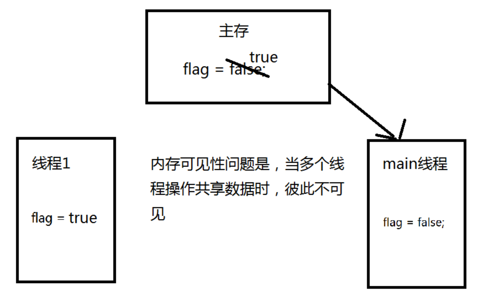
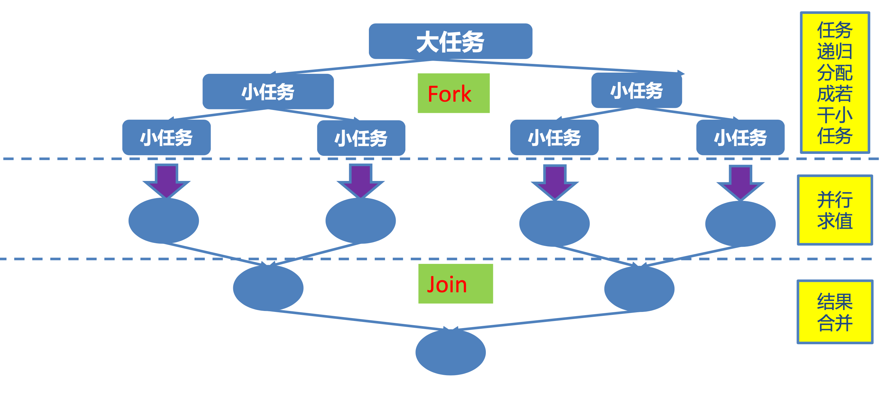

# JUC

- 笔记本：01. Java 核心基础（宋红康）
- 创建时间：2021-01-25 14:59:45 UTC
- 更新时间：2021-01-30 04:19:44 UTC
- 印象笔记 GUID：294bee21-6084-4899-88b7-482e749804d8

## JUC

### 1. JUC 简介

在 Java 5.0 提供了 java.util.concurrent (简称 JUC )包，在此包中增加了在并发编程中很常用的实用工具类，用于定义类似于线程的自定义子系统，包括线程池、异步 IO 和轻量级任务框架。提供可调的、灵活的线程池。还提供了设计用于多线程上下文中的 Collection 实现等。

### 2. volatile 关键字 内存可见性

#### 内存可见性

- 内存可见性(Memory Visibility)是指当某个线程正在使用对象状态 而另一个线程在同时修改该状态，需要确保当一个线程修改了对象状态后，其他线程能够看到发生的状态变化。til

- 可见性错误是指当读操作与写操作在不同的线程中执行时，我们无法确保执行读操作的线程能适时地看到其他线程写入的值，有时甚至是根本不可能的事情。

- 我们可以通过同步来保证对象被安全地发布。除此之外我们也可以 使用一种更加轻量级的 volatile 变量。

#### volatile 关键字

Java 提供了一种稍弱的同步机制，即 volatile 变量，用来确保将变量的更新操作通知到其他线程。可以将 volatile 看做一个轻量级的锁，但是又与锁有些不同:

- 对于多线程，不是一种互斥关系

- 不能保证变量状态的“原子性操作”

```
public class TestVolatile {
    public static void main(String[] args) {
        ThreadDemo td = new ThreadDemo();
        new Thread(td).start();

        /*while (true) {    // while 效率极高，没有时间去同步 tb，一直读取的是自己缓存的数据，导致一直运行。
            if (td.isFlag()) {
                System.out.println("------------");
                break;
            }
        }*/

        while (true) {
            synchronized (td) { // 加锁效率极低
                if (td.isFlag()) {
                    System.out.println("------------");
                    break;
                }
            }
        }
    }
}

class ThreadDemo implements Runnable {

    private boolean flag = false;

    @Override
    public void run() {
        try {
            Thread.sleep(200);
        } catch (InterruptedException e) {
        }

        flag = true;
        System.out.println("flag=" + isFlag());
    }
    // getter、setter 省略
}

```



```
/**
 * 1. volatile 关键字：当多个线程进行操作共享数据时，可以保证内存中的数据可见。
 *  相较于 synchronized 是一种较为轻量级的同步策略
 *  注意：
 *  1. volatile 不具备"互斥性"
 *  2. volatile 不能保证变量的"原子性"
 *      直接到主存中读/写，效率低，但是比 synchronized 效率高
 */
public class TestVolatile {
    public static void main(String[] args) {
        ThreadDemo td = new ThreadDemo();
        new Thread(td).start();

        while (true) {
            if (td.isFlag()) {
                System.out.println("------------");
                break;
            }
        }
    }
}
class ThreadDemo implements Runnable {
    private volatile boolean flag = false;
}

```

#### CAS 算法

- CAS (Compare-And-Swap) 是一种硬件对并发的支持，针对多处理器操作而设计的处理器中的一种特殊指令，用于管理对共享数据的并发访问。

- CAS 是一种无锁的非阻塞算法的实现。

- CAS 包含了 3 个操作数:

  - 需要读写的内存值 V

  - 进行比较的值 A

  - 拟写入的新值 B

- 当且仅当 V 的值等于 A 时，CAS 通过原子方式用新值 B 来更新 V 的值，否则不会执行任何操作。

**eg：** 模拟 CAS 算法

```
/**
 * 模拟 CAS 算法
 */
public class TestCompareAndSwap {

    public static void main(String[] args) {
        final CompareAndSwap cas = new CompareAndSwap();

        for (int i = 0; i < 10; i++) {
            new Thread(() -> {
                int expectedValue = cas.get();
                System.out.println(cas.compareAndSet(expectedValue, (int)(Math.random() * 101)));
            }).start();
        }
    }

}
class CompareAndSwap {
    private int value;

    // 获取内存值
    public synchronized int get() {
        return value;
    }

    // 比较
    public synchronized int compareAndSwap(int expectedValue, int newValue) {
        int oldValue = value;
        if (oldValue == expectedValue) {
            this.value = newValue;
        }
        return oldValue;
    }

    // 设置
    public synchronized boolean compareAndSet(int expectedValue, int newValue) {
        return expectedValue == compareAndSwap(expectedValue, newValue);
    }
}

```

#### 原子变量

jdk1.5 之后，java.util.concurrent.atomic 包下提供了常用的原子变量。内部：1⃣️使用 volatile 保证内存可见性。2⃣️ CAS（Compare-And-Swap）算法

- 类的小工具包，支持在单个变量上解除锁的线程安全编程。事实上，此包中的类可将 volatile 值、字段和数组元素的概念扩展到那些也提供原子条件更新操作的类。

- 类 AtomicBoolean、AtomicInteger、AtomicLong 和 AtomicReference 的实例各自提供对相应类型单个变量的访问和更新。每个类也为该类型提供适当的实用工具方法。

- AtomicIntegerArray、AtomicLongArray和AtomicReferenceArray类进一步扩展了原子操作，对这些类型的数组提供了支持。这些类在为其数组元素提供 volatile 访问语义方面也引人注目，这对于普通数组来说是不受支持的。

- **核心方法:boolean compareAndSet(expectedValue, updateValue)**

- java.util.concurrent.atomic包下提供了一些原子操作的常用类:

  - AtomicBoolean、AtomicInteger、AtomicLong、AtomicReference

  - AtomicIntegerArray、AtomicLongArray

  - AtomicMarkableReference

  - AtomicReferenceArray

  - AtomicStampedReference

### 3. ConcurrentHashMap 锁分段机制

- Java 5.0 在 java.util.concurrent 包中提供了多种并发容器类来改进同步容器的性能。

- ConcurrentHashMap 同步容器类是Java 5 增加的一个线程安全的哈希表。对与多线程的操作，介于 HashMap 与 Hashtable 之间。内部采用“锁分段” 机制替代 Hashtable 的独占锁。进而提高性能。

- 此包还提供了设计用于多线程上下文中的 Collection 实现: ConcurrentHashMap、ConcurrentSkipListMap、ConcurrentSkipListSet、 CopyOnWriteArrayList 和 CopyOnWriteArraySet。当期望许多线程访问一个给定 collection 时，ConcurrentHashMap 通常优于同步的 HashMap， ConcurrentSkipListMap 通常优于同步的 TreeMap。当期望的读数和遍历远远大于列表的更新数时，CopyOnWriteArrayList 优于同步的 ArrayList。

```
/**
 * CopyOnWriteArrayList/CopyOnWriteArraySet : "写入并复制"
 * 注意：添加操作多时，效率低，因为每次添加时都会进行复制，开销非常大。并发迭代操作多时可以选择。
 */
public class TestCopyAndWriteArrayList {
    public static void main(String[] args) {
        HelloThread hd = new HelloThread();

        for (int i = 0; i < 10; i++) {
            new Thread(hd).start();
        }
    }
}

class HelloThread implements Runnable {

//    private static List<String> list = Collections.synchronizedList(new ArrayList<>());

    private static CopyOnWriteArrayList<String> list = new CopyOnWriteArrayList<>();

    static {
        list.add("AA");
        list.add("BB");
        list.add("CC");
    }

    @Override
    public void run() {
        Iterator<String> it = list.iterator();
        while (it.hasNext()) {
            System.out.println(it.next());
            list.add("AA");                 // java.util.ConcurrentModificationException
        }
    }
}

```

### 4. CountDownLatch 闭锁

- Java 5.0 在 java.util.concurrent 包中提供了多种并发容器类来改进同步容器的性能。

- CountDownLatch 一个同步辅助类，在完成一组正在其他线程中执行的操作之前，它允许一个或多个线程一直等待。

- 闭锁可以延迟线程的进度直到其到达终止状态，闭锁可以用来确保某些活 动直到其他活动都完成才继续执行:

  - 确保某个计算在其需要的所有资源都被初始化之后才继续执行;

  - 确保某个服务在其依赖的所有其他服务都已经启动之后才启动;

  - 等待直到某个操作所有参与者都准备就绪再继续执行。

**eg:** 计算子线程运行时间

```
/**
 * CountDownLatch：闭锁，在完成某些运算时，只有其他所有线程的运算全部完成，当前运算才继续执行
 */
public class TestCountDownLatch {
    public static void main(String[] args) {
        final CountDownLatch latch = new CountDownLatch(5);
        LatchDemo ld = new LatchDemo(latch);

        long start = System.currentTimeMillis();

        for (int i = 0; i < 5; i++) {
            new Thread(ld).start();
        }

        try {
            latch.await();
        } catch (InterruptedException e) {
        }

        long end = System.currentTimeMillis();
        System.out.println("耗费时间为：" + (end - start));
    }

}

class LatchDemo implements Runnable {
    private CountDownLatch latch;

    public LatchDemo(CountDownLatch latch) {
        this.latch = latch;
    }

    @Override
    public void run() {

        synchronized (this) {
            try {
                for (int i = 0; i < 50000; i++) {
                    if (i % 2 == 0) {
                        System.out.println(i);
                    }
                }
            } finally {
                latch.countDown();
            }
        }
    }
}

```

### 5. 实现 Callable 接口

#### Callable 接口

- Java 5.0 在 java.util.concurrent 提供了一个新的创建执行线程的方式:Callable 接口

- Callable 接口类似于 Runnable，两者都是为那些其实例可能被另一个线程执行的类设计的。但是 Runnable 不会返回结果，并且无法抛出经过检查的异常。

- Callable 需要依赖FutureTask ，FutureTask 也可以用作闭锁。
 **eg:**

```
/**
 * 一、创建执行线程的方式三：实现 Callable 接口。
 *  相较于实现 Runnable 接口的方式，方法可以有返回值，并且可以抛出异常。
 * 二、执行 Callable 方式，需要 FutureTask 实现类的支持，用于接收运算结果
 *  FutureTask 是 Future 接口的实现类
 */
public class TestCallable {
    public static void main(String[] args) {
        ThreadDemos td = new ThreadDemos();

        // 1. 执行 Callable 方式，需要 FutureTask 实现类的支持，用于接收运算结果
        FutureTask<Integer> result = new FutureTask<>(td);

        new Thread(result).start();

        // 2. 接收线程运算后的结果
        try {
            Integer sum = result.get(); // 上面的线程执行完，才会执行；--> FutureTask 可用于闭锁
            System.out.println(sum);
            System.out.println("-----------");
        } catch (InterruptedException | ExecutionException e) {
            e.printStackTrace();
        }
    }
}

class ThreadDemos implements Callable<Integer> {

    @Override
    public Integer call() throws Exception {
        int sum = 0;
        for (int i = 0; i < 100; i++) {
            sum += i;
        }
        return sum;
    }
}

/*class ThreadDemos implements Runnable {

    @Override
    public void run() {

    }
}*/

```

### 6. Lock 同步锁

#### 显示锁 Lock

- 在 Java 5.0 之前，协调共享对象的访问时可以使用的机制只有 synchronized 和 volatile 。Java 5.0 后增加了一些新的机制，但并不是一种替代内置锁的方法，而是当内置锁不适用时，作为一种可选择的高级功能。

- ReentrantLock 实现了 Lock 接口，并提供了与 synchronized 相同的互斥性和内存可见性。但相较于 synchronized 提供了更高的处理锁的灵活性。
 **eg:**

```
/**
 * 一、用于解决多线程安全问题的方式：
 * synchronized：隐式锁
 *  1. 同步代码块
 *  2. 同步方法
 * jdk1.5 后：
 *  3. 同步锁 Lock
 *      注意：是一个显示锁，需要通过 lock() 方法上锁，必须通过 unlock() 方法进行释放锁
 */
public class TestLock {

    public static void main(String[] args) {
        Ticket ticket = new Ticket();

        new Thread(ticket, "1号窗口").start();
        new Thread(ticket, "2号窗口").start();
        new Thread(ticket, "3号窗口").start();
    }
}

class Ticket implements Runnable {
    public int tick = 100;

    private Lock lock = new ReentrantLock();

    @Override
    public void run() {
        while (true) {

            lock.lock();    // 上锁

            try {
                if (tick > 0) {
                    try {
                        Thread.sleep(200);
                    } catch (InterruptedException e) {
                    }
                    System.out.println(Thread.currentThread().getName() + "完成售票，余票为：" + --tick);
                } else {
                    break;
                }
            } finally {
                lock.unlock();  // 释放锁
            }
        }
    }
}

```

**eg：** 生产者消费者案例-虚假唤醒(wait, notifyAll)

```
/**
 * 生产者和消费者案例（等待唤醒机制）
 */
public class TestProductorAndConsumer {
    public static void main(String[] args) {
        Clerk clerk = new Clerk();

        Productor productor = new Productor(clerk);
        Consumer consumer = new Consumer(clerk);

        new Thread(productor, "生产者A").start();
        new Thread(consumer, "消费者B").start();

        new Thread(productor, "生产者C").start();
        new Thread(consumer, "消费者D").start();
    }
}

// 店员
class Clerk {
    private int product = 0;

    // 进货
    public synchronized void get() {
//        if (product >= 1) {
        while (product >= 1) {  // 为了避免虚假唤醒问题，notifyAll 应该总是使用在循环中
            System.out.println("产品已满！");

            try {
                this.wait();
            } catch (InterruptedException e) {
            }
        }/* else {
            System.out.println(Thread.currentThread().getName() + ":" + ++product);
            this.notifyAll();
        }*/
        System.out.println(Thread.currentThread().getName() + ":" + ++product);
        this.notifyAll();   // 存在虚假唤醒
    }

    // 卖货
    public synchronized void sale() {
//        if (product <= 0) {
        while (product <= 0) {
            System.out.println("缺货！");

            try {
                this.wait();
            } catch (InterruptedException e) {
            }
        }/* else {
            System.out.println(Thread.currentThread().getName() + ":" + --product);
            this.notifyAll();
        }*/
        System.out.println(Thread.currentThread().getName() + ":" + --product);
        this.notifyAll();
    }
}

// 生产者
class Productor implements Runnable {
    private Clerk clerk;

    public Productor(Clerk clerk) {
        this.clerk = clerk;
    }

    @Override
    public void run() {
        for (int i = 0; i < 20; i++) {
            try {
                Thread.sleep(200);
            } catch (InterruptedException e) {
            }
            clerk.get();
        }
    }
}

// 消费者
class Consumer implements Runnable {
    private Clerk clerk;

    public Consumer(Clerk clerk) {
        this.clerk = clerk;
    }

    @Override
    public void run() {
        for (int i = 0; i < 20; i++) {
            clerk.sale();
        }
    }
}

```

### 7. Condition 控制线程通信

**Condition**

- Condition 接口描述了可能会与锁有关联的条件变量。这些变量在用法上与使用 Object.wait 访问的隐式监视器类似，但提供了更强大的功能。需要特别指出的是，单个 Lock 可能与多个 Condition 对象关联。为了避免兼容性问题，Condition 方法的名称与对应的 Object 版 本中的不同。

- 在 Condition 对象中，与 wait、notify 和 notifyAll 方法对应的分别是 await、signal 和 signalAll。

- Condition 实例实质上被绑定到一个锁上。要为特定 Lock 实例获得 Condition 实例，请使用其 newCondition() 方法。

**eg：** 生产者消费者案例-虚假唤醒(Lock await, signalAll)

```
/**
 * 生产者和消费者案例（等待唤醒机制）
 */
public class TestProductorAndConsumerForLock {
    public static void main(String[] args) {
        Clerk clerk = new Clerk();

        Productor productor = new Productor(clerk);
        Consumer consumer = new Consumer(clerk);

        new Thread(productor, "生产者A").start();
        new Thread(consumer, "消费者B").start();

        new Thread(productor, "生产者C").start();
        new Thread(consumer, "消费者D").start();
    }
}

// 店员
class Clerk {
    private int product = 0;

    private Lock lock = new ReentrantLock();
    private Condition condition = lock.newCondition();

    // 进货
    public void get() {
        lock.lock();

        try {
            while (product >= 1) {  // 为了避免虚假唤醒问题，notifyAll 应该总是使用在循环中
                System.out.println("产品已满！");

                try {
                    condition.await();
                } catch (InterruptedException e) {
                }
            }
            System.out.println(Thread.currentThread().getName() + ":" + ++product);
            condition.signalAll();
        } finally {
            lock.unlock();
        }
    }

    // 卖货
    public void sale() {
        lock.lock();

        try {
            while (product <= 0) {
                System.out.println("缺货！");

                try {
                    condition.await();
                } catch (InterruptedException e) {
                }
            }
            System.out.println(Thread.currentThread().getName() + ":" + --product);
            condition.signalAll();
        } finally {
            lock.unlock();
        }
    }
}

// 生产者
class Productor implements Runnable {
    private Clerk clerk;

    public Productor(Clerk clerk) {
        this.clerk = clerk;
    }

    @Override
    public void run() {
        for (int i = 0; i < 20; i++) {
            try {
                Thread.sleep(200);
            } catch (InterruptedException e) {
            }
            clerk.get();
        }
    }
}

// 消费者
class Consumer implements Runnable {
    private Clerk clerk;

    public Consumer(Clerk clerk) {
        this.clerk = clerk;
    }

    @Override
    public void run() {
        for (int i = 0; i < 20; i++) {
            clerk.sale();
        }
    }
}

```

### 8. 线程按序交替

编写一个程序，开启 3 个线程，这三个线程的 ID 分别为 A、B、C，每个线程将自己的 ID 在屏幕上打印 10 遍，要求输出的结果必须按顺序显示。
 如:ABCABCABC...... 依次递归

```
/**
 * 编写一个程序，开启 3 个线程，这三个线程的 ID 分别为 A、B、C，每个线程将自己的 ID 在屏幕上打印 10 遍，要求输出的结果必须按顺序显示。
 *  如:ABCABCABC...... 依次递归
 */
public class TestABCAlternate {
    public static void main(String[] args) {
        AlternateDemo alternateDemo = new AlternateDemo();

        new Thread(() -> {
            for (int i = 1; i <= 20; i++) {
                alternateDemo.loopA(i, 1);
            }
        }, "A").start();

        new Thread(() -> {
            for (int i = 1; i <= 20; i++) {
                alternateDemo.loopB(i, 1);
            }
        }, "B").start();

        new Thread(() -> {
            for (int i = 1; i <= 20; i++) {
                alternateDemo.loopC(i, 1);
                System.out.println("---------");
            }
        }, "C").start();
    }
}

class AlternateDemo {
    private int number = 1; // 当前正在执行线程的标记

    private Lock lock = new ReentrantLock();
    private Condition condition1 = lock.newCondition();
    private Condition condition2 = lock.newCondition();
    private Condition condition3 = lock.newCondition();

    /**
     * @param totalLoop : 循环第几轮
     */
    public void loopA(int totalLoop, int num) {
        lock.lock();

        try {
            // 1. 判断
            if (number != 1) {
                condition1.await();
            }
            // 2. 打印
            for (int i = 1; i <= num; i++) {
                System.out.println(Thread.currentThread().getName() + "\t" + i + "\t" + totalLoop);
            }
            // 3. 唤醒
            number = 2;
            condition2.signal();
        } catch (Exception e) {
            e.printStackTrace();
        } finally {
            lock.unlock();
        }
    }

    public void loopB(int totalLoop, int num) {
        lock.lock();

        try {
            // 1. 判断
            if (number != 2) {
                condition2.await();
            }
            // 2. 打印
            for (int i = 1; i <= num; i++) {
                System.out.println(Thread.currentThread().getName() + "\t" + i + "\t" + totalLoop);
            }
            // 3. 唤醒
            number = 3;
            condition3.signal();
        } catch (Exception e) {
            e.printStackTrace();
        } finally {
            lock.unlock();
        }
    }

    public void loopC(int totalLoop, int num) {
        lock.lock();

        try {
            // 1. 判断
            if (number != 3) {
                condition3.await();
            }
            // 2. 打印
            for (int i = 1; i <= num; i++) {
                System.out.println(Thread.currentThread().getName() + "\t" + i + "\t" + totalLoop);
            }
            // 3. 唤醒
            number = 1;
            condition1.signal();
        } catch (Exception e) {
            e.printStackTrace();
        } finally {
            lock.unlock();
        }
    }
}

```

### 9. ReadWriteLock 读写锁

**读-写锁 ReadWriteLock**

- ReadWriteLock 维护了一对相关的锁，一个用于只读操作， 另一个用于写入操作。只要没有 writer，读取锁可以由多个 reader 线程同时保持。写入锁是独占的。

- ReadWriteLock 读取操作通常不会改变共享资源，但执行写入操作时，必须独占方式来获取锁。对于读取操作占多数的数据结构。 ReadWriteLock 能提供比独占锁更高的并发性。而对于只读的数据结构，其中包含的不变性可以完全不需要考虑加锁操作。

```
/**
 * ReadWriteLock 读写锁
 *  写写/读写 需要"互斥"
 *  读读 不需要"互斥"
 */
public class TestReadWriteLock {
    public static void main(String[] args) {
        ReadWriteLockDemo rw = new ReadWriteLockDemo();
        new Thread(() -> {
            rw.set((int)(Math.random() * 101));
        }, "write").start();
        for (int i = 0; i < 100; i++) {
            new Thread(() -> {
                rw.get();
            }, "read" + i).start();
        }
    }
}

class ReadWriteLockDemo {
    private int number = 0;

    private ReadWriteLock lock = new ReentrantReadWriteLock();

    // 读
    public void get() {
        lock.readLock().lock();         // 上锁
        try {
            System.out.println(Thread.currentThread().getName() + " : " + number);
        } finally {
            lock.readLock().unlock();   // 释放锁
        }
    }

    // 写
    public void set(int number) {
        lock.writeLock().lock();    // 上锁
        try {
            System.out.println(Thread.currentThread().getName());
            this.number = number;
        } finally {
            lock.writeLock().unlock();  // 释放锁
        }
    }
}

```

### 10. 线程八锁

**线程八锁**

- 一个对象里面如果有多个synchronized方法，某一个时刻内，只要一个线程去调用其中的一个synchronized方法了，其它的线程都只能等待，换句话说，某一个时刻内，只能有唯一一个线程去访问这些 synchronized 方法

- 的是当前对象this，被锁定后，其它的线程都不能进入到当前对象的其它的 synchronized方法

- 加个普通方法后发现和同步锁无关

- 换成两个对象后，不是同一把锁了，情况立刻变化。

- 都换成静态同步方法后，情况又变化

- 所有的非静态同步方法用的都是同一把锁——实例对象本身，也就是说如果一个实例对象的非静态同步方法获取锁后，该实例对象的其他非静态同步方法必须等待获 取锁的方法释放锁后才能获取锁，可是别的实例对象的非静态同步方法因为跟该实例对象的非静态同步方法用的是不同的锁，所以毋须等待该实例对象已获取锁的非静态同步方法释放锁就可以获取他们自己的锁。

- 所有的静态同步方法用的也是同一把锁——类对象本身，这两把锁是两个不同的对象，所以静态同步方法与非静态同步方法之间是不会有竞态条件的。但是一旦一个静态同步方法获取锁后，其他的静态同步方法都必须等待该方法释放锁后才能获取锁，而不管是同一个实例对象的静态同步方法之间，还是不同的实例对象的静态同步方法之间，只要它们同一个类的实例对象!
 **eg：**

```
/**
 * 题目：判断打印的是"one" or "two"
 *  1. 两个普通同步方法，两个线程，标准打印，打印：one two
 *  2. 新增 Thread.sleep() 给 getOne()，打印：one two
 *  3. 新增普通方法 getThree(),打印：three one two
 *  4. 两个普通同步方法，两个 Number 对象，打印：two，one
 *  5. 修改 getOne() 为静态同步方法，打印：two，one
 *  6. 修改两个方法均为静态同步方法，一个 Number 对象，打印：one，two
 *  7. 一个静态同步方法，一个非静态同步方法，两个 Number 对象，打印：two，one
 *  8. 两个静态同步方法，两个 Number 对象，打印：one，two
 *
 * 线程八锁的关键：
 *  1⃣️ 非静态方法的锁默认为 this，静态方法的锁为对应的 Class 实例
 *  2⃣️ 某一个时刻内，只能有一个线程持有锁，无论几个方法
 */
public class TestThread8Monitor {
    public static void main(String[] args) {
        Number number = new Number();
        Number number2 = new Number();

        new Thread(() -> {
            number.getOne();
        }).start();
        new Thread(() -> {
//            number.getTwo();
            number2.getTwo();
//            number2.getThree();
        }).start();
        /*new Thread(() -> {
            number.getThree();
        }).start();*/
    }
}

class Number {
    public static synchronized void getOne() {
        try {
            Thread.sleep(1000);
        } catch (InterruptedException e) {
        }
        System.out.println("one");
    }
    public static synchronized void getTwo() {
        System.out.println("two");
    }

    public void getThree() {
        System.out.println("Three");
    }
}

```

### 11. 线程池

- 第四种获取线程的方法:线程池，一个 ExecutorService，它使用可能的几个池线程之一执行每个提交的任务，通常使用 Executors 工厂方法配置。

- 线程池可以解决两个不同问题:由于减少了每个任务调用的开销，它们通常可以在执行大量异步任务时提供增强的性能，并且还可以提供绑定和管理资源(包括执行 任务集时使用的线程)的方法。每个 ThreadPoolExecutor 还维护着一些基本的统计数据，如完成的任务数。

- 为了便于跨大量上下文使用，此类提供了很多可调整的参数和扩展钩子 (hook)。但是，强烈建议程序员使用较为方便的 Executors 工厂方法 :

  - Executors.newCachedThreadPool()(无界线程池，可以进行自动线程回收)

  - Executors.newFixedThreadPool(int)(固定大小线程池)

  - Executors.newSingleThreadExecutor()(单个后台线程)
 它们均为大多数使用场景预定义了设置。

```
/**
 * 一、线程池：提供了一个线程队列，队列中保存着所有等待状态的线程。避免了创建与销毁额外开销，提高了响应的速度
 * 二、线程池的体系结构：
 *  java.util.concurrent.Executor：负责线程的使用与调度的跟接口
 *      ｜-- ExecutorService 子接口：线程池的主要接口
 *          ｜-- ThreadPoolExecutor：线程池的实现类
 *          ｜-- ScheduledExecutorService 子接口：负责线程的调度
 *              ｜-- ScheduledThreadPoolExecutor：基础ThreadPoolExecutor，实现ScheduledExecutorService
 * 三、工具类：Executors
 *  ExecutorService newFixedThreadPool()：创建固定大小的线程池
 *  ExecutorService newCachedThreadPool()：缓存线程池，线程池的数量不固定，可以根据需求自动更改数量
 *  ExecutorService newSingleThreadExecutor()：创建单个线程池。线程池中只有一个线程
 *
 *  ScheduledExecutorService newScheduledThreadPool()：创建固定大小的线程，可以延迟或定时的执行任务
 */
public class TestThreadPool {
    public static void main(String[] args) throws ExecutionException, InterruptedException {
        // 1. 创建线程池
        ExecutorService pool = Executors.newFixedThreadPool(5);

        /*Future<Integer> submit = pool.submit(() -> {
            int sum = 0;
            for (int i = 0; i < 100; i++) {
                sum += i;
            }
            return sum;
        });*/

        List<Future<Integer>> futures = new ArrayList<>();

        for (int i = 0; i < 10; i++) {
            Future<Integer> future = pool.submit(new Callable<Integer>() {
                @Override
                public Integer call() throws Exception {
                    int sum = 0;
                    for (int i = 0; i <= 100; i++) {
                        sum += i;
                    }
                    return sum;
                }
            });

            futures.add(future);
        }

        pool.shutdown();

        for (Future<Integer> future : futures) {
            System.out.println(future.get());
        }

        /*ThreadPoolDemo tpd = new ThreadPoolDemo();

        // 2. 为线程池中的线程分配任务
        for (int i = 0; i < 10; i++) {
            pool.submit(tpd);
//        new Thread(tpd).start();
        }

        // 3. 关闭线程池
        pool.shutdown();*/
    }
}

class ThreadPoolDemo implements Runnable {

    private int i = 0;

    @Override
    public void run() {
        while (i <= 100) {
            System.out.println(Thread.currentThread().getName() + " : " + i++);
        }
    }
}

```

### 12. 线程调度

**ScheduledExecutorService**
 一个 ExecutorService，可安排在给定的延迟后运行或定期执行的命令。

```
/**
 *  ScheduledExecutorService newScheduledThreadPool()：创建固定大小的线程，可以延迟或定时的执行任务
 */
public class TestScheduledThreadPool {
    public static void main(String[] args) throws ExecutionException, InterruptedException {
        ScheduledExecutorService pool = Executors.newScheduledThreadPool(5);

        for (int i = 0; i < 10; i++) {
            ScheduledFuture<Integer> result = pool.schedule(new Callable<Integer>() {
                @Override
                public Integer call() throws Exception {
                    int num = new Random().nextInt(100);
                    System.out.println(Thread.currentThread().getName() + " : " + num);
                    return num;
                }
            }, 3, TimeUnit.SECONDS);

            System.out.println(result.get());
        }

        pool.shutdown();
    }
}

```

### 13. ForkJoinPool 分支/合并框架 工作窃取

#### Fork/Join 框架

Fork/Join 框架:就是在必要的情况下，将一个大任务，进行拆分(fork)成若干个小任务(拆到不可再拆时)，再将一个个的小任务运算的结果进行 join 汇总。
 

#### Fork/Join 框架与线程池的区别

- 采用 “工作窃取”模式(work-stealing):
 当执行新的任务时它可以将其拆分分成更小的任务执行，并将小任务加到线程队列中，然后再从一个随机线程的队列中偷一个并把它放在自己的队列中。

- 相对于一般的线程池实现，fork/join框架的优势体现在对其中包含的任务的处理方式上.在一般的线程池中，如果一个线程正在执行的任务由于某些原因无法继续运行，那么该线程会处于等待状态。而在fork/join框架实现中，如果某个子问题由于等待另外一个子问题的完成而无法继续运行。那么处理该子问题的线程会主动寻找其他尚未运行的子问题来执行.这种方式减少了线程的等待时间，提高了性能。

```
public class TestForkJoinPool {
    public static void main(String[] args) {
        Instant start = Instant.now();
        ForkJoinPool pool = new ForkJoinPool();

        ForkJoinSumCalculate task = new ForkJoinSumCalculate(0L, 100000000L);
        Long sum = pool.invoke(task);

        System.out.println(sum);

        Instant end = Instant.now();

        System.out.println("耗费时间为：" + Duration.between(start, end).toMillis()); // 121
    }

    @Test
    public void test1() {
        Instant start = Instant.now();

        long sum = 0L;

        for (long i = 0; i < 100000000L; i++) {
            sum += i;
        }

        Instant end = Instant.now();

        System.out.println("耗费时间为：" + Duration.between(start, end).toMillis()); // 259
    }

    // java8 新特性
    @Test
    public void test2() {
        Instant start = Instant.now();
        Long sum = LongStream.rangeClosed(0L, 100000000L)
                .parallel()
                .reduce(0L, Long::sum);
        System.out.println(sum);

        Instant end = Instant.now();

        System.out.println("耗费时间为：" + Duration.between(start, end).toMillis()); // 167
    }
}

class ForkJoinSumCalculate extends RecursiveTask<Long> {

//    private static final long serialVersionUID = 5232453912226585270L;

    private long start;
    private long end;

    private static final long THURSHLOD = 10000L;   // 临界值

    public ForkJoinSumCalculate(long start, long end) {
        this.start = start;
        this.end = end;
    }

    @Override
    protected Long compute() {
        long length = end - start;
        if (length <= THURSHLOD) {
            long sum = 0L;
            for (long i = start; i <= end; i++) {
                sum += i;
            }
            return sum;
        } else {
            long middle = (start + end) / 2;
            ForkJoinSumCalculate left = new ForkJoinSumCalculate(start, middle);
            left.fork();        // 进行拆分，同时压入线程队列
            ForkJoinSumCalculate right = new ForkJoinSumCalculate(middle + 1, end);
            right.fork();

            return left.join() + right.join();
        }
    }
}

```

%23%23%20JUC%0A%0A%23%23%23%201.%20JUC%20%E7%AE%80%E4%BB%8B%0A%E5%9C%A8%20Java%205.0%20%E6%8F%90%E4%BE%9B%E4%BA%86%20java.util.concurrent%20(%E7%AE%80%E7%A7%B0%20JUC%20)%E5%8C%85%EF%BC%8C%E5%9C%A8%E6%AD%A4%E5%8C%85%E4%B8%AD%E5%A2%9E%E5%8A%A0%E4%BA%86%E5%9C%A8%E5%B9%B6%E5%8F%91%E7%BC%96%E7%A8%8B%E4%B8%AD%E5%BE%88%E5%B8%B8%E7%94%A8%E7%9A%84%E5%AE%9E%E7%94%A8%E5%B7%A5%E5%85%B7%E7%B1%BB%EF%BC%8C%E7%94%A8%E4%BA%8E%E5%AE%9A%E4%B9%89%E7%B1%BB%E4%BC%BC%E4%BA%8E%E7%BA%BF%E7%A8%8B%E7%9A%84%E8%87%AA%E5%AE%9A%E4%B9%89%E5%AD%90%E7%B3%BB%E7%BB%9F%EF%BC%8C%E5%8C%85%E6%8B%AC%E7%BA%BF%E7%A8%8B%E6%B1%A0%E3%80%81%E5%BC%82%E6%AD%A5%20IO%20%E5%92%8C%E8%BD%BB%E9%87%8F%E7%BA%A7%E4%BB%BB%E5%8A%A1%E6%A1%86%E6%9E%B6%E3%80%82%E6%8F%90%E4%BE%9B%E5%8F%AF%E8%B0%83%E7%9A%84%E3%80%81%E7%81%B5%E6%B4%BB%E7%9A%84%E7%BA%BF%E7%A8%8B%E6%B1%A0%E3%80%82%E8%BF%98%E6%8F%90%E4%BE%9B%E4%BA%86%E8%AE%BE%E8%AE%A1%E7%94%A8%E4%BA%8E%E5%A4%9A%E7%BA%BF%E7%A8%8B%E4%B8%8A%E4%B8%8B%E6%96%87%E4%B8%AD%E7%9A%84%20Collection%20%E5%AE%9E%E7%8E%B0%E7%AD%89%E3%80%82%0A%0A%23%23%23%202.%20volatile%20%E5%85%B3%E9%94%AE%E5%AD%97%20%E5%86%85%E5%AD%98%E5%8F%AF%E8%A7%81%E6%80%A7%0A%23%23%23%23%20%E5%86%85%E5%AD%98%E5%8F%AF%E8%A7%81%E6%80%A7%0A-%20%E5%86%85%E5%AD%98%E5%8F%AF%E8%A7%81%E6%80%A7(Memory%20Visibility)%E6%98%AF%E6%8C%87%E5%BD%93%E6%9F%90%E4%B8%AA%E7%BA%BF%E7%A8%8B%E6%AD%A3%E5%9C%A8%E4%BD%BF%E7%94%A8%E5%AF%B9%E8%B1%A1%E7%8A%B6%E6%80%81%20%E8%80%8C%E5%8F%A6%E4%B8%80%E4%B8%AA%E7%BA%BF%E7%A8%8B%E5%9C%A8%E5%90%8C%E6%97%B6%E4%BF%AE%E6%94%B9%E8%AF%A5%E7%8A%B6%E6%80%81%EF%BC%8C%E9%9C%80%E8%A6%81%E7%A1%AE%E4%BF%9D%E5%BD%93%E4%B8%80%E4%B8%AA%E7%BA%BF%E7%A8%8B%E4%BF%AE%E6%94%B9%E4%BA%86%E5%AF%B9%E8%B1%A1%E7%8A%B6%E6%80%81%E5%90%8E%EF%BC%8C%E5%85%B6%E4%BB%96%E7%BA%BF%E7%A8%8B%E8%83%BD%E5%A4%9F%E7%9C%8B%E5%88%B0%E5%8F%91%E7%94%9F%E7%9A%84%E7%8A%B6%E6%80%81%E5%8F%98%E5%8C%96%E3%80%82til%0A-%20%E5%8F%AF%E8%A7%81%E6%80%A7%E9%94%99%E8%AF%AF%E6%98%AF%E6%8C%87%E5%BD%93%E8%AF%BB%E6%93%8D%E4%BD%9C%E4%B8%8E%E5%86%99%E6%93%8D%E4%BD%9C%E5%9C%A8%E4%B8%8D%E5%90%8C%E7%9A%84%E7%BA%BF%E7%A8%8B%E4%B8%AD%E6%89%A7%E8%A1%8C%E6%97%B6%EF%BC%8C%E6%88%91%E4%BB%AC%E6%97%A0%E6%B3%95%E7%A1%AE%E4%BF%9D%E6%89%A7%E8%A1%8C%E8%AF%BB%E6%93%8D%E4%BD%9C%E7%9A%84%E7%BA%BF%E7%A8%8B%E8%83%BD%E9%80%82%E6%97%B6%E5%9C%B0%E7%9C%8B%E5%88%B0%E5%85%B6%E4%BB%96%E7%BA%BF%E7%A8%8B%E5%86%99%E5%85%A5%E7%9A%84%E5%80%BC%EF%BC%8C%E6%9C%89%E6%97%B6%E7%94%9A%E8%87%B3%E6%98%AF%E6%A0%B9%E6%9C%AC%E4%B8%8D%E5%8F%AF%E8%83%BD%E7%9A%84%E4%BA%8B%E6%83%85%E3%80%82%0A-%20%E6%88%91%E4%BB%AC%E5%8F%AF%E4%BB%A5%E9%80%9A%E8%BF%87%E5%90%8C%E6%AD%A5%E6%9D%A5%E4%BF%9D%E8%AF%81%E5%AF%B9%E8%B1%A1%E8%A2%AB%E5%AE%89%E5%85%A8%E5%9C%B0%E5%8F%91%E5%B8%83%E3%80%82%E9%99%A4%E6%AD%A4%E4%B9%8B%E5%A4%96%E6%88%91%E4%BB%AC%E4%B9%9F%E5%8F%AF%E4%BB%A5%20%E4%BD%BF%E7%94%A8%E4%B8%80%E7%A7%8D%E6%9B%B4%E5%8A%A0%E8%BD%BB%E9%87%8F%E7%BA%A7%E7%9A%84%20volatile%20%E5%8F%98%E9%87%8F%E3%80%82%0A%0A%23%23%23%23%20volatile%20%E5%85%B3%E9%94%AE%E5%AD%97%0AJava%20%E6%8F%90%E4%BE%9B%E4%BA%86%E4%B8%80%E7%A7%8D%E7%A8%8D%E5%BC%B1%E7%9A%84%E5%90%8C%E6%AD%A5%E6%9C%BA%E5%88%B6%EF%BC%8C%E5%8D%B3%20volatile%20%E5%8F%98%E9%87%8F%EF%BC%8C%E7%94%A8%E6%9D%A5%E7%A1%AE%E4%BF%9D%E5%B0%86%E5%8F%98%E9%87%8F%E7%9A%84%E6%9B%B4%E6%96%B0%E6%93%8D%E4%BD%9C%E9%80%9A%E7%9F%A5%E5%88%B0%E5%85%B6%E4%BB%96%E7%BA%BF%E7%A8%8B%E3%80%82%E5%8F%AF%E4%BB%A5%E5%B0%86%20volatile%20%E7%9C%8B%E5%81%9A%E4%B8%80%E4%B8%AA%E8%BD%BB%E9%87%8F%E7%BA%A7%E7%9A%84%E9%94%81%EF%BC%8C%E4%BD%86%E6%98%AF%E5%8F%88%E4%B8%8E%E9%94%81%E6%9C%89%E4%BA%9B%E4%B8%8D%E5%90%8C%3A%0A-%20%E5%AF%B9%E4%BA%8E%E5%A4%9A%E7%BA%BF%E7%A8%8B%EF%BC%8C%E4%B8%8D%E6%98%AF%E4%B8%80%E7%A7%8D%E4%BA%92%E6%96%A5%E5%85%B3%E7%B3%BB%0A-%20%E4%B8%8D%E8%83%BD%E4%BF%9D%E8%AF%81%E5%8F%98%E9%87%8F%E7%8A%B6%E6%80%81%E7%9A%84%E2%80%9C%E5%8E%9F%E5%AD%90%E6%80%A7%E6%93%8D%E4%BD%9C%E2%80%9D%20%0A%0A%60%60%60java%0Apublic%20class%20TestVolatile%20%7B%0A%20%20%20%20public%20static%20void%20main(String%5B%5D%20args)%20%7B%0A%20%20%20%20%20%20%20%20ThreadDemo%20td%20%3D%20new%20ThreadDemo()%3B%0A%20%20%20%20%20%20%20%20new%20Thread(td).start()%3B%0A%0A%20%20%20%20%20%20%20%20%2F*while%20(true)%20%7B%20%20%20%20%2F%2F%20while%20%E6%95%88%E7%8E%87%E6%9E%81%E9%AB%98%EF%BC%8C%E6%B2%A1%E6%9C%89%E6%97%B6%E9%97%B4%E5%8E%BB%E5%90%8C%E6%AD%A5%20tb%EF%BC%8C%E4%B8%80%E7%9B%B4%E8%AF%BB%E5%8F%96%E7%9A%84%E6%98%AF%E8%87%AA%E5%B7%B1%E7%BC%93%E5%AD%98%E7%9A%84%E6%95%B0%E6%8D%AE%EF%BC%8C%E5%AF%BC%E8%87%B4%E4%B8%80%E7%9B%B4%E8%BF%90%E8%A1%8C%E3%80%82%0A%20%20%20%20%20%20%20%20%20%20%20%20if%20(td.isFlag())%20%7B%0A%20%20%20%20%20%20%20%20%20%20%20%20%20%20%20%20System.out.println(%22------------%22)%3B%0A%20%20%20%20%20%20%20%20%20%20%20%20%20%20%20%20break%3B%0A%20%20%20%20%20%20%20%20%20%20%20%20%7D%0A%20%20%20%20%20%20%20%20%7D*%2F%0A%0A%20%20%20%20%20%20%20%20while%20(true)%20%7B%0A%20%20%20%20%20%20%20%20%20%20%20%20synchronized%20(td)%20%7B%20%2F%2F%20%E5%8A%A0%E9%94%81%E6%95%88%E7%8E%87%E6%9E%81%E4%BD%8E%0A%20%20%20%20%20%20%20%20%20%20%20%20%20%20%20%20if%20(td.isFlag())%20%7B%0A%20%20%20%20%20%20%20%20%20%20%20%20%20%20%20%20%20%20%20%20System.out.println(%22------------%22)%3B%0A%20%20%20%20%20%20%20%20%20%20%20%20%20%20%20%20%20%20%20%20break%3B%0A%20%20%20%20%20%20%20%20%20%20%20%20%20%20%20%20%7D%0A%20%20%20%20%20%20%20%20%20%20%20%20%7D%0A%20%20%20%20%20%20%20%20%7D%0A%20%20%20%20%7D%0A%7D%0A%0Aclass%20ThreadDemo%20implements%20Runnable%20%7B%0A%0A%20%20%20%20private%20boolean%20flag%20%3D%20false%3B%0A%0A%20%20%20%20%40Override%0A%20%20%20%20public%20void%20run()%20%7B%0A%20%20%20%20%20%20%20%20try%20%7B%0A%20%20%20%20%20%20%20%20%20%20%20%20Thread.sleep(200)%3B%0A%20%20%20%20%20%20%20%20%7D%20catch%20(InterruptedException%20e)%20%7B%0A%20%20%20%20%20%20%20%20%7D%0A%0A%20%20%20%20%20%20%20%20flag%20%3D%20true%3B%0A%20%20%20%20%20%20%20%20System.out.println(%22flag%3D%22%20%2B%20isFlag())%3B%0A%20%20%20%20%7D%0A%20%20%20%20%2F%2F%20getter%E3%80%81setter%20%E7%9C%81%E7%95%A5%0A%7D%0A%60%60%60%0A!%5B0cb9c364e682fe83f2e5c0ba24cc37b6.png%5D(evernotecid%3A%2F%2F90F5C43D-AEAE-49B2-85BB-D02B6A52C764%2Fappyinxiangcom%2F25356149%2FENResource%2Fp1615)%0A%60%60%60java%0A%2F**%0A%20*%201.%20volatile%20%E5%85%B3%E9%94%AE%E5%AD%97%EF%BC%9A%E5%BD%93%E5%A4%9A%E4%B8%AA%E7%BA%BF%E7%A8%8B%E8%BF%9B%E8%A1%8C%E6%93%8D%E4%BD%9C%E5%85%B1%E4%BA%AB%E6%95%B0%E6%8D%AE%E6%97%B6%EF%BC%8C%E5%8F%AF%E4%BB%A5%E4%BF%9D%E8%AF%81%E5%86%85%E5%AD%98%E4%B8%AD%E7%9A%84%E6%95%B0%E6%8D%AE%E5%8F%AF%E8%A7%81%E3%80%82%0A%20*%20%20%E7%9B%B8%E8%BE%83%E4%BA%8E%20synchronized%20%E6%98%AF%E4%B8%80%E7%A7%8D%E8%BE%83%E4%B8%BA%E8%BD%BB%E9%87%8F%E7%BA%A7%E7%9A%84%E5%90%8C%E6%AD%A5%E7%AD%96%E7%95%A5%0A%20*%20%20%E6%B3%A8%E6%84%8F%EF%BC%9A%0A%20*%20%201.%20volatile%20%E4%B8%8D%E5%85%B7%E5%A4%87%22%E4%BA%92%E6%96%A5%E6%80%A7%22%0A%20*%20%202.%20volatile%20%E4%B8%8D%E8%83%BD%E4%BF%9D%E8%AF%81%E5%8F%98%E9%87%8F%E7%9A%84%22%E5%8E%9F%E5%AD%90%E6%80%A7%22%0A%20*%20%20%20%20%20%20%E7%9B%B4%E6%8E%A5%E5%88%B0%E4%B8%BB%E5%AD%98%E4%B8%AD%E8%AF%BB%2F%E5%86%99%EF%BC%8C%E6%95%88%E7%8E%87%E4%BD%8E%EF%BC%8C%E4%BD%86%E6%98%AF%E6%AF%94%20synchronized%20%E6%95%88%E7%8E%87%E9%AB%98%0A%20*%2F%0Apublic%20class%20TestVolatile%20%7B%0A%20%20%20%20public%20static%20void%20main(String%5B%5D%20args)%20%7B%0A%20%20%20%20%20%20%20%20ThreadDemo%20td%20%3D%20new%20ThreadDemo()%3B%0A%20%20%20%20%20%20%20%20new%20Thread(td).start()%3B%0A%0A%20%20%20%20%20%20%20%20while%20(true)%20%7B%0A%20%20%20%20%20%20%20%20%20%20%20%20if%20(td.isFlag())%20%7B%0A%20%20%20%20%20%20%20%20%20%20%20%20%20%20%20%20System.out.println(%22------------%22)%3B%0A%20%20%20%20%20%20%20%20%20%20%20%20%20%20%20%20break%3B%0A%20%20%20%20%20%20%20%20%20%20%20%20%7D%0A%20%20%20%20%20%20%20%20%7D%0A%20%20%20%20%7D%0A%7D%0Aclass%20ThreadDemo%20implements%20Runnable%20%7B%0A%20%20%20%20private%20volatile%20boolean%20flag%20%3D%20false%3B%0A%7D%0A%60%60%60%0A%0A%23%23%23%23%20CAS%20%E7%AE%97%E6%B3%95%0A-%20CAS%20(Compare-And-Swap)%20%E6%98%AF%E4%B8%80%E7%A7%8D%E7%A1%AC%E4%BB%B6%E5%AF%B9%E5%B9%B6%E5%8F%91%E7%9A%84%E6%94%AF%E6%8C%81%EF%BC%8C%E9%92%88%E5%AF%B9%E5%A4%9A%E5%A4%84%E7%90%86%E5%99%A8%E6%93%8D%E4%BD%9C%E8%80%8C%E8%AE%BE%E8%AE%A1%E7%9A%84%E5%A4%84%E7%90%86%E5%99%A8%E4%B8%AD%E7%9A%84%E4%B8%80%E7%A7%8D%E7%89%B9%E6%AE%8A%E6%8C%87%E4%BB%A4%EF%BC%8C%E7%94%A8%E4%BA%8E%E7%AE%A1%E7%90%86%E5%AF%B9%E5%85%B1%E4%BA%AB%E6%95%B0%E6%8D%AE%E7%9A%84%E5%B9%B6%E5%8F%91%E8%AE%BF%E9%97%AE%E3%80%82%0A-%20CAS%20%E6%98%AF%E4%B8%80%E7%A7%8D%E6%97%A0%E9%94%81%E7%9A%84%E9%9D%9E%E9%98%BB%E5%A1%9E%E7%AE%97%E6%B3%95%E7%9A%84%E5%AE%9E%E7%8E%B0%E3%80%82%0A-%20CAS%20%E5%8C%85%E5%90%AB%E4%BA%86%203%20%E4%B8%AA%E6%93%8D%E4%BD%9C%E6%95%B0%3A%0A%20%20%20%20-%20%E9%9C%80%E8%A6%81%E8%AF%BB%E5%86%99%E7%9A%84%E5%86%85%E5%AD%98%E5%80%BC%20V%0A%20%20%20%20-%20%E8%BF%9B%E8%A1%8C%E6%AF%94%E8%BE%83%E7%9A%84%E5%80%BC%20A%0A%20%20%20%20-%20%E6%8B%9F%E5%86%99%E5%85%A5%E7%9A%84%E6%96%B0%E5%80%BC%20B%0A-%20%E5%BD%93%E4%B8%94%E4%BB%85%E5%BD%93%20V%20%E7%9A%84%E5%80%BC%E7%AD%89%E4%BA%8E%20A%20%E6%97%B6%EF%BC%8CCAS%20%E9%80%9A%E8%BF%87%E5%8E%9F%E5%AD%90%E6%96%B9%E5%BC%8F%E7%94%A8%E6%96%B0%E5%80%BC%20B%20%E6%9D%A5%E6%9B%B4%E6%96%B0%20V%20%E7%9A%84%E5%80%BC%EF%BC%8C%E5%90%A6%E5%88%99%E4%B8%8D%E4%BC%9A%E6%89%A7%E8%A1%8C%E4%BB%BB%E4%BD%95%E6%93%8D%E4%BD%9C%E3%80%82%0A%0A**eg%EF%BC%9A**%20%E6%A8%A1%E6%8B%9F%20CAS%20%E7%AE%97%E6%B3%95%0A%60%60%60java%0A%2F**%0A%20*%20%E6%A8%A1%E6%8B%9F%20CAS%20%E7%AE%97%E6%B3%95%0A%20*%2F%0Apublic%20class%20TestCompareAndSwap%20%7B%0A%0A%20%20%20%20public%20static%20void%20main(String%5B%5D%20args)%20%7B%0A%20%20%20%20%20%20%20%20final%20CompareAndSwap%20cas%20%3D%20new%20CompareAndSwap()%3B%0A%0A%20%20%20%20%20%20%20%20for%20(int%20i%20%3D%200%3B%20i%20%3C%2010%3B%20i%2B%2B)%20%7B%0A%20%20%20%20%20%20%20%20%20%20%20%20new%20Thread(()%20-%3E%20%7B%0A%20%20%20%20%20%20%20%20%20%20%20%20%20%20%20%20int%20expectedValue%20%3D%20cas.get()%3B%0A%20%20%20%20%20%20%20%20%20%20%20%20%20%20%20%20System.out.println(cas.compareAndSet(expectedValue%2C%20(int)(Math.random()%20*%20101)))%3B%0A%20%20%20%20%20%20%20%20%20%20%20%20%7D).start()%3B%0A%20%20%20%20%20%20%20%20%7D%0A%20%20%20%20%7D%0A%0A%0A%7D%0Aclass%20CompareAndSwap%20%7B%0A%20%20%20%20private%20int%20value%3B%0A%0A%20%20%20%20%2F%2F%20%E8%8E%B7%E5%8F%96%E5%86%85%E5%AD%98%E5%80%BC%0A%20%20%20%20public%20synchronized%20int%20get()%20%7B%0A%20%20%20%20%20%20%20%20return%20value%3B%0A%20%20%20%20%7D%0A%0A%20%20%20%20%2F%2F%20%E6%AF%94%E8%BE%83%0A%20%20%20%20public%20synchronized%20int%20compareAndSwap(int%20expectedValue%2C%20int%20newValue)%20%7B%0A%20%20%20%20%20%20%20%20int%20oldValue%20%3D%20value%3B%0A%20%20%20%20%20%20%20%20if%20(oldValue%20%3D%3D%20expectedValue)%20%7B%0A%20%20%20%20%20%20%20%20%20%20%20%20this.value%20%3D%20newValue%3B%0A%20%20%20%20%20%20%20%20%7D%0A%20%20%20%20%20%20%20%20return%20oldValue%3B%0A%20%20%20%20%7D%0A%0A%20%20%20%20%2F%2F%20%E8%AE%BE%E7%BD%AE%0A%20%20%20%20public%20synchronized%20boolean%20compareAndSet(int%20expectedValue%2C%20int%20newValue)%20%7B%0A%20%20%20%20%20%20%20%20return%20expectedValue%20%3D%3D%20compareAndSwap(expectedValue%2C%20newValue)%3B%0A%20%20%20%20%7D%0A%7D%0A%60%60%60%0A%0A%23%23%23%23%20%E5%8E%9F%E5%AD%90%E5%8F%98%E9%87%8F%0Ajdk1.5%20%E4%B9%8B%E5%90%8E%EF%BC%8Cjava.util.concurrent.atomic%20%E5%8C%85%E4%B8%8B%E6%8F%90%E4%BE%9B%E4%BA%86%E5%B8%B8%E7%94%A8%E7%9A%84%E5%8E%9F%E5%AD%90%E5%8F%98%E9%87%8F%E3%80%82%E5%86%85%E9%83%A8%EF%BC%9A1%E2%83%A3%EF%B8%8F%E4%BD%BF%E7%94%A8%20volatile%20%E4%BF%9D%E8%AF%81%E5%86%85%E5%AD%98%E5%8F%AF%E8%A7%81%E6%80%A7%E3%80%822%E2%83%A3%EF%B8%8F%20CAS%EF%BC%88Compare-And-Swap%EF%BC%89%E7%AE%97%E6%B3%95%0A-%20%E7%B1%BB%E7%9A%84%E5%B0%8F%E5%B7%A5%E5%85%B7%E5%8C%85%EF%BC%8C%E6%94%AF%E6%8C%81%E5%9C%A8%E5%8D%95%E4%B8%AA%E5%8F%98%E9%87%8F%E4%B8%8A%E8%A7%A3%E9%99%A4%E9%94%81%E7%9A%84%E7%BA%BF%E7%A8%8B%E5%AE%89%E5%85%A8%E7%BC%96%E7%A8%8B%E3%80%82%E4%BA%8B%E5%AE%9E%E4%B8%8A%EF%BC%8C%E6%AD%A4%E5%8C%85%E4%B8%AD%E7%9A%84%E7%B1%BB%E5%8F%AF%E5%B0%86%20volatile%20%E5%80%BC%E3%80%81%E5%AD%97%E6%AE%B5%E5%92%8C%E6%95%B0%E7%BB%84%E5%85%83%E7%B4%A0%E7%9A%84%E6%A6%82%E5%BF%B5%E6%89%A9%E5%B1%95%E5%88%B0%E9%82%A3%E4%BA%9B%E4%B9%9F%E6%8F%90%E4%BE%9B%E5%8E%9F%E5%AD%90%E6%9D%A1%E4%BB%B6%E6%9B%B4%E6%96%B0%E6%93%8D%E4%BD%9C%E7%9A%84%E7%B1%BB%E3%80%82%0A-%20%E7%B1%BB%20AtomicBoolean%E3%80%81AtomicInteger%E3%80%81AtomicLong%20%E5%92%8C%20AtomicReference%20%E7%9A%84%E5%AE%9E%E4%BE%8B%E5%90%84%E8%87%AA%E6%8F%90%E4%BE%9B%E5%AF%B9%E7%9B%B8%E5%BA%94%E7%B1%BB%E5%9E%8B%E5%8D%95%E4%B8%AA%E5%8F%98%E9%87%8F%E7%9A%84%E8%AE%BF%E9%97%AE%E5%92%8C%E6%9B%B4%E6%96%B0%E3%80%82%E6%AF%8F%E4%B8%AA%E7%B1%BB%E4%B9%9F%E4%B8%BA%E8%AF%A5%E7%B1%BB%E5%9E%8B%E6%8F%90%E4%BE%9B%E9%80%82%E5%BD%93%E7%9A%84%E5%AE%9E%E7%94%A8%E5%B7%A5%E5%85%B7%E6%96%B9%E6%B3%95%E3%80%82%0A-%20AtomicIntegerArray%E3%80%81AtomicLongArray%E5%92%8CAtomicReferenceArray%E7%B1%BB%E8%BF%9B%E4%B8%80%E6%AD%A5%E6%89%A9%E5%B1%95%E4%BA%86%E5%8E%9F%E5%AD%90%E6%93%8D%E4%BD%9C%EF%BC%8C%E5%AF%B9%E8%BF%99%E4%BA%9B%E7%B1%BB%E5%9E%8B%E7%9A%84%E6%95%B0%E7%BB%84%E6%8F%90%E4%BE%9B%E4%BA%86%E6%94%AF%E6%8C%81%E3%80%82%E8%BF%99%E4%BA%9B%E7%B1%BB%E5%9C%A8%E4%B8%BA%E5%85%B6%E6%95%B0%E7%BB%84%E5%85%83%E7%B4%A0%E6%8F%90%E4%BE%9B%20volatile%20%E8%AE%BF%E9%97%AE%E8%AF%AD%E4%B9%89%E6%96%B9%E9%9D%A2%E4%B9%9F%E5%BC%95%E4%BA%BA%E6%B3%A8%E7%9B%AE%EF%BC%8C%E8%BF%99%E5%AF%B9%E4%BA%8E%E6%99%AE%E9%80%9A%E6%95%B0%E7%BB%84%E6%9D%A5%E8%AF%B4%E6%98%AF%E4%B8%8D%E5%8F%97%E6%94%AF%E6%8C%81%E7%9A%84%E3%80%82%0A-%20**%E6%A0%B8%E5%BF%83%E6%96%B9%E6%B3%95%3Aboolean%20compareAndSet(expectedValue%2C%20updateValue)**%0A-%20java.util.concurrent.atomic%E5%8C%85%E4%B8%8B%E6%8F%90%E4%BE%9B%E4%BA%86%E4%B8%80%E4%BA%9B%E5%8E%9F%E5%AD%90%E6%93%8D%E4%BD%9C%E7%9A%84%E5%B8%B8%E7%94%A8%E7%B1%BB%3A%0A%20%20%20%20-%20AtomicBoolean%E3%80%81AtomicInteger%E3%80%81AtomicLong%E3%80%81AtomicReference%0A%20%20%20%20-%20AtomicIntegerArray%E3%80%81AtomicLongArray%0A%20%20%20%20-%20AtomicMarkableReference%0A%20%20%20%20-%20AtomicReferenceArray%0A%20%20%20%20-%20AtomicStampedReference%0A%0A%23%23%23%203.%20ConcurrentHashMap%20%E9%94%81%E5%88%86%E6%AE%B5%E6%9C%BA%E5%88%B6%0A-%20Java%205.0%20%E5%9C%A8%20java.util.concurrent%20%E5%8C%85%E4%B8%AD%E6%8F%90%E4%BE%9B%E4%BA%86%E5%A4%9A%E7%A7%8D%E5%B9%B6%E5%8F%91%E5%AE%B9%E5%99%A8%E7%B1%BB%E6%9D%A5%E6%94%B9%E8%BF%9B%E5%90%8C%E6%AD%A5%E5%AE%B9%E5%99%A8%E7%9A%84%E6%80%A7%E8%83%BD%E3%80%82%0A-%20ConcurrentHashMap%20%E5%90%8C%E6%AD%A5%E5%AE%B9%E5%99%A8%E7%B1%BB%E6%98%AFJava%205%20%E5%A2%9E%E5%8A%A0%E7%9A%84%E4%B8%80%E4%B8%AA%E7%BA%BF%E7%A8%8B%E5%AE%89%E5%85%A8%E7%9A%84%E5%93%88%E5%B8%8C%E8%A1%A8%E3%80%82%E5%AF%B9%E4%B8%8E%E5%A4%9A%E7%BA%BF%E7%A8%8B%E7%9A%84%E6%93%8D%E4%BD%9C%EF%BC%8C%E4%BB%8B%E4%BA%8E%20HashMap%20%E4%B8%8E%20Hashtable%20%E4%B9%8B%E9%97%B4%E3%80%82%E5%86%85%E9%83%A8%E9%87%87%E7%94%A8%E2%80%9C%E9%94%81%E5%88%86%E6%AE%B5%E2%80%9D%20%E6%9C%BA%E5%88%B6%E6%9B%BF%E4%BB%A3%20Hashtable%20%E7%9A%84%E7%8B%AC%E5%8D%A0%E9%94%81%E3%80%82%E8%BF%9B%E8%80%8C%E6%8F%90%E9%AB%98%E6%80%A7%E8%83%BD%E3%80%82%0A-%20%E6%AD%A4%E5%8C%85%E8%BF%98%E6%8F%90%E4%BE%9B%E4%BA%86%E8%AE%BE%E8%AE%A1%E7%94%A8%E4%BA%8E%E5%A4%9A%E7%BA%BF%E7%A8%8B%E4%B8%8A%E4%B8%8B%E6%96%87%E4%B8%AD%E7%9A%84%20Collection%20%E5%AE%9E%E7%8E%B0%3A%20ConcurrentHashMap%E3%80%81ConcurrentSkipListMap%E3%80%81ConcurrentSkipListSet%E3%80%81%20CopyOnWriteArrayList%20%E5%92%8C%20CopyOnWriteArraySet%E3%80%82%E5%BD%93%E6%9C%9F%E6%9C%9B%E8%AE%B8%E5%A4%9A%E7%BA%BF%E7%A8%8B%E8%AE%BF%E9%97%AE%E4%B8%80%E4%B8%AA%E7%BB%99%E5%AE%9A%20collection%20%E6%97%B6%EF%BC%8CConcurrentHashMap%20%E9%80%9A%E5%B8%B8%E4%BC%98%E4%BA%8E%E5%90%8C%E6%AD%A5%E7%9A%84%20HashMap%EF%BC%8C%20ConcurrentSkipListMap%20%E9%80%9A%E5%B8%B8%E4%BC%98%E4%BA%8E%E5%90%8C%E6%AD%A5%E7%9A%84%20TreeMap%E3%80%82%E5%BD%93%E6%9C%9F%E6%9C%9B%E7%9A%84%E8%AF%BB%E6%95%B0%E5%92%8C%E9%81%8D%E5%8E%86%E8%BF%9C%E8%BF%9C%E5%A4%A7%E4%BA%8E%E5%88%97%E8%A1%A8%E7%9A%84%E6%9B%B4%E6%96%B0%E6%95%B0%E6%97%B6%EF%BC%8CCopyOnWriteArrayList%20%E4%BC%98%E4%BA%8E%E5%90%8C%E6%AD%A5%E7%9A%84%20ArrayList%E3%80%82%0A%60%60%60java%0A%2F**%0A%20*%20CopyOnWriteArrayList%2FCopyOnWriteArraySet%20%3A%20%22%E5%86%99%E5%85%A5%E5%B9%B6%E5%A4%8D%E5%88%B6%22%0A%20*%20%E6%B3%A8%E6%84%8F%EF%BC%9A%E6%B7%BB%E5%8A%A0%E6%93%8D%E4%BD%9C%E5%A4%9A%E6%97%B6%EF%BC%8C%E6%95%88%E7%8E%87%E4%BD%8E%EF%BC%8C%E5%9B%A0%E4%B8%BA%E6%AF%8F%E6%AC%A1%E6%B7%BB%E5%8A%A0%E6%97%B6%E9%83%BD%E4%BC%9A%E8%BF%9B%E8%A1%8C%E5%A4%8D%E5%88%B6%EF%BC%8C%E5%BC%80%E9%94%80%E9%9D%9E%E5%B8%B8%E5%A4%A7%E3%80%82%E5%B9%B6%E5%8F%91%E8%BF%AD%E4%BB%A3%E6%93%8D%E4%BD%9C%E5%A4%9A%E6%97%B6%E5%8F%AF%E4%BB%A5%E9%80%89%E6%8B%A9%E3%80%82%0A%20*%2F%0Apublic%20class%20TestCopyAndWriteArrayList%20%7B%0A%20%20%20%20public%20static%20void%20main(String%5B%5D%20args)%20%7B%0A%20%20%20%20%20%20%20%20HelloThread%20hd%20%3D%20new%20HelloThread()%3B%0A%0A%20%20%20%20%20%20%20%20for%20(int%20i%20%3D%200%3B%20i%20%3C%2010%3B%20i%2B%2B)%20%7B%0A%20%20%20%20%20%20%20%20%20%20%20%20new%20Thread(hd).start()%3B%0A%20%20%20%20%20%20%20%20%7D%0A%20%20%20%20%7D%0A%7D%0A%0Aclass%20HelloThread%20implements%20Runnable%20%7B%0A%0A%2F%2F%20%20%20%20private%20static%20List%3CString%3E%20list%20%3D%20Collections.synchronizedList(new%20ArrayList%3C%3E())%3B%0A%0A%20%20%20%20private%20static%20CopyOnWriteArrayList%3CString%3E%20list%20%3D%20new%20CopyOnWriteArrayList%3C%3E()%3B%0A%0A%20%20%20%20static%20%7B%0A%20%20%20%20%20%20%20%20list.add(%22AA%22)%3B%0A%20%20%20%20%20%20%20%20list.add(%22BB%22)%3B%0A%20%20%20%20%20%20%20%20list.add(%22CC%22)%3B%0A%20%20%20%20%7D%0A%0A%20%20%20%20%40Override%0A%20%20%20%20public%20void%20run()%20%7B%0A%20%20%20%20%20%20%20%20Iterator%3CString%3E%20it%20%3D%20list.iterator()%3B%0A%20%20%20%20%20%20%20%20while%20(it.hasNext())%20%7B%0A%20%20%20%20%20%20%20%20%20%20%20%20System.out.println(it.next())%3B%0A%20%20%20%20%20%20%20%20%20%20%20%20list.add(%22AA%22)%3B%20%20%20%20%20%20%20%20%20%20%20%20%20%20%20%20%20%2F%2F%20java.util.ConcurrentModificationException%0A%20%20%20%20%20%20%20%20%7D%0A%20%20%20%20%7D%0A%7D%0A%60%60%60%0A%0A%23%23%23%204.%20CountDownLatch%20%E9%97%AD%E9%94%81%0A-%20Java%205.0%20%E5%9C%A8%20java.util.concurrent%20%E5%8C%85%E4%B8%AD%E6%8F%90%E4%BE%9B%E4%BA%86%E5%A4%9A%E7%A7%8D%E5%B9%B6%E5%8F%91%E5%AE%B9%E5%99%A8%E7%B1%BB%E6%9D%A5%E6%94%B9%E8%BF%9B%E5%90%8C%E6%AD%A5%E5%AE%B9%E5%99%A8%E7%9A%84%E6%80%A7%E8%83%BD%E3%80%82%0A-%20CountDownLatch%20%E4%B8%80%E4%B8%AA%E5%90%8C%E6%AD%A5%E8%BE%85%E5%8A%A9%E7%B1%BB%EF%BC%8C%E5%9C%A8%E5%AE%8C%E6%88%90%E4%B8%80%E7%BB%84%E6%AD%A3%E5%9C%A8%E5%85%B6%E4%BB%96%E7%BA%BF%E7%A8%8B%E4%B8%AD%E6%89%A7%E8%A1%8C%E7%9A%84%E6%93%8D%E4%BD%9C%E4%B9%8B%E5%89%8D%EF%BC%8C%E5%AE%83%E5%85%81%E8%AE%B8%E4%B8%80%E4%B8%AA%E6%88%96%E5%A4%9A%E4%B8%AA%E7%BA%BF%E7%A8%8B%E4%B8%80%E7%9B%B4%E7%AD%89%E5%BE%85%E3%80%82%0A-%20%E9%97%AD%E9%94%81%E5%8F%AF%E4%BB%A5%E5%BB%B6%E8%BF%9F%E7%BA%BF%E7%A8%8B%E7%9A%84%E8%BF%9B%E5%BA%A6%E7%9B%B4%E5%88%B0%E5%85%B6%E5%88%B0%E8%BE%BE%E7%BB%88%E6%AD%A2%E7%8A%B6%E6%80%81%EF%BC%8C%E9%97%AD%E9%94%81%E5%8F%AF%E4%BB%A5%E7%94%A8%E6%9D%A5%E7%A1%AE%E4%BF%9D%E6%9F%90%E4%BA%9B%E6%B4%BB%20%E5%8A%A8%E7%9B%B4%E5%88%B0%E5%85%B6%E4%BB%96%E6%B4%BB%E5%8A%A8%E9%83%BD%E5%AE%8C%E6%88%90%E6%89%8D%E7%BB%A7%E7%BB%AD%E6%89%A7%E8%A1%8C%3A%0A%20%20%20%20-%20%E7%A1%AE%E4%BF%9D%E6%9F%90%E4%B8%AA%E8%AE%A1%E7%AE%97%E5%9C%A8%E5%85%B6%E9%9C%80%E8%A6%81%E7%9A%84%E6%89%80%E6%9C%89%E8%B5%84%E6%BA%90%E9%83%BD%E8%A2%AB%E5%88%9D%E5%A7%8B%E5%8C%96%E4%B9%8B%E5%90%8E%E6%89%8D%E7%BB%A7%E7%BB%AD%E6%89%A7%E8%A1%8C%3B%0A%20%20%20%20-%20%E7%A1%AE%E4%BF%9D%E6%9F%90%E4%B8%AA%E6%9C%8D%E5%8A%A1%E5%9C%A8%E5%85%B6%E4%BE%9D%E8%B5%96%E7%9A%84%E6%89%80%E6%9C%89%E5%85%B6%E4%BB%96%E6%9C%8D%E5%8A%A1%E9%83%BD%E5%B7%B2%E7%BB%8F%E5%90%AF%E5%8A%A8%E4%B9%8B%E5%90%8E%E6%89%8D%E5%90%AF%E5%8A%A8%3B%0A%20%20%20%20-%20%E7%AD%89%E5%BE%85%E7%9B%B4%E5%88%B0%E6%9F%90%E4%B8%AA%E6%93%8D%E4%BD%9C%E6%89%80%E6%9C%89%E5%8F%82%E4%B8%8E%E8%80%85%E9%83%BD%E5%87%86%E5%A4%87%E5%B0%B1%E7%BB%AA%E5%86%8D%E7%BB%A7%E7%BB%AD%E6%89%A7%E8%A1%8C%E3%80%82%0A%0A**eg%3A**%20%E8%AE%A1%E7%AE%97%E5%AD%90%E7%BA%BF%E7%A8%8B%E8%BF%90%E8%A1%8C%E6%97%B6%E9%97%B4%0A%60%60%60java%0A%2F**%0A%20*%20CountDownLatch%EF%BC%9A%E9%97%AD%E9%94%81%EF%BC%8C%E5%9C%A8%E5%AE%8C%E6%88%90%E6%9F%90%E4%BA%9B%E8%BF%90%E7%AE%97%E6%97%B6%EF%BC%8C%E5%8F%AA%E6%9C%89%E5%85%B6%E4%BB%96%E6%89%80%E6%9C%89%E7%BA%BF%E7%A8%8B%E7%9A%84%E8%BF%90%E7%AE%97%E5%85%A8%E9%83%A8%E5%AE%8C%E6%88%90%EF%BC%8C%E5%BD%93%E5%89%8D%E8%BF%90%E7%AE%97%E6%89%8D%E7%BB%A7%E7%BB%AD%E6%89%A7%E8%A1%8C%0A%20*%2F%0Apublic%20class%20TestCountDownLatch%20%7B%0A%20%20%20%20public%20static%20void%20main(String%5B%5D%20args)%20%7B%0A%20%20%20%20%20%20%20%20final%20CountDownLatch%20latch%20%3D%20new%20CountDownLatch(5)%3B%0A%20%20%20%20%20%20%20%20LatchDemo%20ld%20%3D%20new%20LatchDemo(latch)%3B%0A%0A%20%20%20%20%20%20%20%20long%20start%20%3D%20System.currentTimeMillis()%3B%0A%0A%20%20%20%20%20%20%20%20for%20(int%20i%20%3D%200%3B%20i%20%3C%205%3B%20i%2B%2B)%20%7B%0A%20%20%20%20%20%20%20%20%20%20%20%20new%20Thread(ld).start()%3B%0A%20%20%20%20%20%20%20%20%7D%0A%0A%20%20%20%20%20%20%20%20try%20%7B%0A%20%20%20%20%20%20%20%20%20%20%20%20latch.await()%3B%0A%20%20%20%20%20%20%20%20%7D%20catch%20(InterruptedException%20e)%20%7B%0A%20%20%20%20%20%20%20%20%7D%0A%0A%20%20%20%20%20%20%20%20long%20end%20%3D%20System.currentTimeMillis()%3B%0A%20%20%20%20%20%20%20%20System.out.println(%22%E8%80%97%E8%B4%B9%E6%97%B6%E9%97%B4%E4%B8%BA%EF%BC%9A%22%20%2B%20(end%20-%20start))%3B%0A%20%20%20%20%7D%0A%0A%7D%0A%0Aclass%20LatchDemo%20implements%20Runnable%20%7B%0A%20%20%20%20private%20CountDownLatch%20latch%3B%0A%0A%20%20%20%20public%20LatchDemo(CountDownLatch%20latch)%20%7B%0A%20%20%20%20%20%20%20%20this.latch%20%3D%20latch%3B%0A%20%20%20%20%7D%0A%0A%20%20%20%20%40Override%0A%20%20%20%20public%20void%20run()%20%7B%0A%0A%20%20%20%20%20%20%20%20synchronized%20(this)%20%7B%0A%20%20%20%20%20%20%20%20%20%20%20%20try%20%7B%0A%20%20%20%20%20%20%20%20%20%20%20%20%20%20%20%20for%20(int%20i%20%3D%200%3B%20i%20%3C%2050000%3B%20i%2B%2B)%20%7B%0A%20%20%20%20%20%20%20%20%20%20%20%20%20%20%20%20%20%20%20%20if%20(i%20%25%202%20%3D%3D%200)%20%7B%0A%20%20%20%20%20%20%20%20%20%20%20%20%20%20%20%20%20%20%20%20%20%20%20%20System.out.println(i)%3B%0A%20%20%20%20%20%20%20%20%20%20%20%20%20%20%20%20%20%20%20%20%7D%0A%20%20%20%20%20%20%20%20%20%20%20%20%20%20%20%20%7D%0A%20%20%20%20%20%20%20%20%20%20%20%20%7D%20finally%20%7B%0A%20%20%20%20%20%20%20%20%20%20%20%20%20%20%20%20latch.countDown()%3B%0A%20%20%20%20%20%20%20%20%20%20%20%20%7D%0A%20%20%20%20%20%20%20%20%7D%0A%20%20%20%20%7D%0A%7D%0A%60%60%60%0A%0A%23%23%23%205.%20%E5%AE%9E%E7%8E%B0%20Callable%20%E6%8E%A5%E5%8F%A3%0A%23%23%23%23%20Callable%20%E6%8E%A5%E5%8F%A3%0A-%20Java%205.0%20%E5%9C%A8%20java.util.concurrent%20%E6%8F%90%E4%BE%9B%E4%BA%86%E4%B8%80%E4%B8%AA%E6%96%B0%E7%9A%84%E5%88%9B%E5%BB%BA%E6%89%A7%E8%A1%8C%E7%BA%BF%E7%A8%8B%E7%9A%84%E6%96%B9%E5%BC%8F%3ACallable%20%E6%8E%A5%E5%8F%A3%0A-%20Callable%20%E6%8E%A5%E5%8F%A3%E7%B1%BB%E4%BC%BC%E4%BA%8E%20Runnable%EF%BC%8C%E4%B8%A4%E8%80%85%E9%83%BD%E6%98%AF%E4%B8%BA%E9%82%A3%E4%BA%9B%E5%85%B6%E5%AE%9E%E4%BE%8B%E5%8F%AF%E8%83%BD%E8%A2%AB%E5%8F%A6%E4%B8%80%E4%B8%AA%E7%BA%BF%E7%A8%8B%E6%89%A7%E8%A1%8C%E7%9A%84%E7%B1%BB%E8%AE%BE%E8%AE%A1%E7%9A%84%E3%80%82%E4%BD%86%E6%98%AF%20Runnable%20%E4%B8%8D%E4%BC%9A%E8%BF%94%E5%9B%9E%E7%BB%93%E6%9E%9C%EF%BC%8C%E5%B9%B6%E4%B8%94%E6%97%A0%E6%B3%95%E6%8A%9B%E5%87%BA%E7%BB%8F%E8%BF%87%E6%A3%80%E6%9F%A5%E7%9A%84%E5%BC%82%E5%B8%B8%E3%80%82%0A-%20Callable%20%E9%9C%80%E8%A6%81%E4%BE%9D%E8%B5%96FutureTask%20%EF%BC%8CFutureTask%20%E4%B9%9F%E5%8F%AF%E4%BB%A5%E7%94%A8%E4%BD%9C%E9%97%AD%E9%94%81%E3%80%82%0A**eg%3A**%0A%60%60%60java%0A%2F**%0A%20*%20%E4%B8%80%E3%80%81%E5%88%9B%E5%BB%BA%E6%89%A7%E8%A1%8C%E7%BA%BF%E7%A8%8B%E7%9A%84%E6%96%B9%E5%BC%8F%E4%B8%89%EF%BC%9A%E5%AE%9E%E7%8E%B0%20Callable%20%E6%8E%A5%E5%8F%A3%E3%80%82%0A%20*%20%20%E7%9B%B8%E8%BE%83%E4%BA%8E%E5%AE%9E%E7%8E%B0%20Runnable%20%E6%8E%A5%E5%8F%A3%E7%9A%84%E6%96%B9%E5%BC%8F%EF%BC%8C%E6%96%B9%E6%B3%95%E5%8F%AF%E4%BB%A5%E6%9C%89%E8%BF%94%E5%9B%9E%E5%80%BC%EF%BC%8C%E5%B9%B6%E4%B8%94%E5%8F%AF%E4%BB%A5%E6%8A%9B%E5%87%BA%E5%BC%82%E5%B8%B8%E3%80%82%0A%20*%20%E4%BA%8C%E3%80%81%E6%89%A7%E8%A1%8C%20Callable%20%E6%96%B9%E5%BC%8F%EF%BC%8C%E9%9C%80%E8%A6%81%20FutureTask%20%E5%AE%9E%E7%8E%B0%E7%B1%BB%E7%9A%84%E6%94%AF%E6%8C%81%EF%BC%8C%E7%94%A8%E4%BA%8E%E6%8E%A5%E6%94%B6%E8%BF%90%E7%AE%97%E7%BB%93%E6%9E%9C%0A%20*%20%20FutureTask%20%E6%98%AF%20Future%20%E6%8E%A5%E5%8F%A3%E7%9A%84%E5%AE%9E%E7%8E%B0%E7%B1%BB%0A%20*%2F%0Apublic%20class%20TestCallable%20%7B%0A%20%20%20%20public%20static%20void%20main(String%5B%5D%20args)%20%7B%0A%20%20%20%20%20%20%20%20ThreadDemos%20td%20%3D%20new%20ThreadDemos()%3B%0A%0A%20%20%20%20%20%20%20%20%2F%2F%201.%20%E6%89%A7%E8%A1%8C%20Callable%20%E6%96%B9%E5%BC%8F%EF%BC%8C%E9%9C%80%E8%A6%81%20FutureTask%20%E5%AE%9E%E7%8E%B0%E7%B1%BB%E7%9A%84%E6%94%AF%E6%8C%81%EF%BC%8C%E7%94%A8%E4%BA%8E%E6%8E%A5%E6%94%B6%E8%BF%90%E7%AE%97%E7%BB%93%E6%9E%9C%0A%20%20%20%20%20%20%20%20FutureTask%3CInteger%3E%20result%20%3D%20new%20FutureTask%3C%3E(td)%3B%0A%0A%20%20%20%20%20%20%20%20new%20Thread(result).start()%3B%0A%0A%20%20%20%20%20%20%20%20%2F%2F%202.%20%E6%8E%A5%E6%94%B6%E7%BA%BF%E7%A8%8B%E8%BF%90%E7%AE%97%E5%90%8E%E7%9A%84%E7%BB%93%E6%9E%9C%0A%20%20%20%20%20%20%20%20try%20%7B%0A%20%20%20%20%20%20%20%20%20%20%20%20Integer%20sum%20%3D%20result.get()%3B%20%2F%2F%20%E4%B8%8A%E9%9D%A2%E7%9A%84%E7%BA%BF%E7%A8%8B%E6%89%A7%E8%A1%8C%E5%AE%8C%EF%BC%8C%E6%89%8D%E4%BC%9A%E6%89%A7%E8%A1%8C%EF%BC%9B--%3E%20FutureTask%20%E5%8F%AF%E7%94%A8%E4%BA%8E%E9%97%AD%E9%94%81%0A%20%20%20%20%20%20%20%20%20%20%20%20System.out.println(sum)%3B%0A%20%20%20%20%20%20%20%20%20%20%20%20System.out.println(%22-----------%22)%3B%0A%20%20%20%20%20%20%20%20%7D%20catch%20(InterruptedException%20%7C%20ExecutionException%20e)%20%7B%0A%20%20%20%20%20%20%20%20%20%20%20%20e.printStackTrace()%3B%0A%20%20%20%20%20%20%20%20%7D%0A%20%20%20%20%7D%0A%7D%0A%0Aclass%20ThreadDemos%20implements%20Callable%3CInteger%3E%20%7B%0A%0A%20%20%20%20%40Override%0A%20%20%20%20public%20Integer%20call()%20throws%20Exception%20%7B%0A%20%20%20%20%20%20%20%20int%20sum%20%3D%200%3B%0A%20%20%20%20%20%20%20%20for%20(int%20i%20%3D%200%3B%20i%20%3C%20100%3B%20i%2B%2B)%20%7B%0A%20%20%20%20%20%20%20%20%20%20%20%20sum%20%2B%3D%20i%3B%0A%20%20%20%20%20%20%20%20%7D%0A%20%20%20%20%20%20%20%20return%20sum%3B%0A%20%20%20%20%7D%0A%7D%0A%0A%2F*class%20ThreadDemos%20implements%20Runnable%20%7B%0A%0A%20%20%20%20%40Override%0A%20%20%20%20public%20void%20run()%20%7B%0A%0A%20%20%20%20%7D%0A%7D*%2F%0A%60%60%60%0A%0A%23%23%23%206.%20Lock%20%E5%90%8C%E6%AD%A5%E9%94%81%0A%23%23%23%23%20%E6%98%BE%E7%A4%BA%E9%94%81%20Lock%0A-%20%E5%9C%A8%20Java%205.0%20%E4%B9%8B%E5%89%8D%EF%BC%8C%E5%8D%8F%E8%B0%83%E5%85%B1%E4%BA%AB%E5%AF%B9%E8%B1%A1%E7%9A%84%E8%AE%BF%E9%97%AE%E6%97%B6%E5%8F%AF%E4%BB%A5%E4%BD%BF%E7%94%A8%E7%9A%84%E6%9C%BA%E5%88%B6%E5%8F%AA%E6%9C%89%20synchronized%20%E5%92%8C%20volatile%20%E3%80%82Java%205.0%20%E5%90%8E%E5%A2%9E%E5%8A%A0%E4%BA%86%E4%B8%80%E4%BA%9B%E6%96%B0%E7%9A%84%E6%9C%BA%E5%88%B6%EF%BC%8C%E4%BD%86%E5%B9%B6%E4%B8%8D%E6%98%AF%E4%B8%80%E7%A7%8D%E6%9B%BF%E4%BB%A3%E5%86%85%E7%BD%AE%E9%94%81%E7%9A%84%E6%96%B9%E6%B3%95%EF%BC%8C%E8%80%8C%E6%98%AF%E5%BD%93%E5%86%85%E7%BD%AE%E9%94%81%E4%B8%8D%E9%80%82%E7%94%A8%E6%97%B6%EF%BC%8C%E4%BD%9C%E4%B8%BA%E4%B8%80%E7%A7%8D%E5%8F%AF%E9%80%89%E6%8B%A9%E7%9A%84%E9%AB%98%E7%BA%A7%E5%8A%9F%E8%83%BD%E3%80%82%0A-%20ReentrantLock%20%E5%AE%9E%E7%8E%B0%E4%BA%86%20Lock%20%E6%8E%A5%E5%8F%A3%EF%BC%8C%E5%B9%B6%E6%8F%90%E4%BE%9B%E4%BA%86%E4%B8%8E%20synchronized%20%E7%9B%B8%E5%90%8C%E7%9A%84%E4%BA%92%E6%96%A5%E6%80%A7%E5%92%8C%E5%86%85%E5%AD%98%E5%8F%AF%E8%A7%81%E6%80%A7%E3%80%82%E4%BD%86%E7%9B%B8%E8%BE%83%E4%BA%8E%20synchronized%20%E6%8F%90%E4%BE%9B%E4%BA%86%E6%9B%B4%E9%AB%98%E7%9A%84%E5%A4%84%E7%90%86%E9%94%81%E7%9A%84%E7%81%B5%E6%B4%BB%E6%80%A7%E3%80%82%0A**eg%3A**%0A%60%60%60java%0A%2F**%0A%20*%20%E4%B8%80%E3%80%81%E7%94%A8%E4%BA%8E%E8%A7%A3%E5%86%B3%E5%A4%9A%E7%BA%BF%E7%A8%8B%E5%AE%89%E5%85%A8%E9%97%AE%E9%A2%98%E7%9A%84%E6%96%B9%E5%BC%8F%EF%BC%9A%0A%20*%20synchronized%EF%BC%9A%E9%9A%90%E5%BC%8F%E9%94%81%0A%20*%20%201.%20%E5%90%8C%E6%AD%A5%E4%BB%A3%E7%A0%81%E5%9D%97%0A%20*%20%202.%20%E5%90%8C%E6%AD%A5%E6%96%B9%E6%B3%95%0A%20*%20jdk1.5%20%E5%90%8E%EF%BC%9A%0A%20*%20%203.%20%E5%90%8C%E6%AD%A5%E9%94%81%20Lock%0A%20*%20%20%20%20%20%20%E6%B3%A8%E6%84%8F%EF%BC%9A%E6%98%AF%E4%B8%80%E4%B8%AA%E6%98%BE%E7%A4%BA%E9%94%81%EF%BC%8C%E9%9C%80%E8%A6%81%E9%80%9A%E8%BF%87%20lock()%20%E6%96%B9%E6%B3%95%E4%B8%8A%E9%94%81%EF%BC%8C%E5%BF%85%E9%A1%BB%E9%80%9A%E8%BF%87%20unlock()%20%E6%96%B9%E6%B3%95%E8%BF%9B%E8%A1%8C%E9%87%8A%E6%94%BE%E9%94%81%0A%20*%2F%0Apublic%20class%20TestLock%20%7B%0A%0A%20%20%20%20public%20static%20void%20main(String%5B%5D%20args)%20%7B%0A%20%20%20%20%20%20%20%20Ticket%20ticket%20%3D%20new%20Ticket()%3B%0A%0A%20%20%20%20%20%20%20%20new%20Thread(ticket%2C%20%221%E5%8F%B7%E7%AA%97%E5%8F%A3%22).start()%3B%0A%20%20%20%20%20%20%20%20new%20Thread(ticket%2C%20%222%E5%8F%B7%E7%AA%97%E5%8F%A3%22).start()%3B%0A%20%20%20%20%20%20%20%20new%20Thread(ticket%2C%20%223%E5%8F%B7%E7%AA%97%E5%8F%A3%22).start()%3B%0A%20%20%20%20%7D%0A%7D%0A%0Aclass%20Ticket%20implements%20Runnable%20%7B%0A%20%20%20%20public%20int%20tick%20%3D%20100%3B%0A%0A%20%20%20%20private%20Lock%20lock%20%3D%20new%20ReentrantLock()%3B%0A%0A%20%20%20%20%40Override%0A%20%20%20%20public%20void%20run()%20%7B%0A%20%20%20%20%20%20%20%20while%20(true)%20%7B%0A%0A%20%20%20%20%20%20%20%20%20%20%20%20lock.lock()%3B%20%20%20%20%2F%2F%20%E4%B8%8A%E9%94%81%0A%0A%20%20%20%20%20%20%20%20%20%20%20%20try%20%7B%0A%20%20%20%20%20%20%20%20%20%20%20%20%20%20%20%20if%20(tick%20%3E%200)%20%7B%0A%20%20%20%20%20%20%20%20%20%20%20%20%20%20%20%20%20%20%20%20try%20%7B%0A%20%20%20%20%20%20%20%20%20%20%20%20%20%20%20%20%20%20%20%20%20%20%20%20Thread.sleep(200)%3B%0A%20%20%20%20%20%20%20%20%20%20%20%20%20%20%20%20%20%20%20%20%7D%20catch%20(InterruptedException%20e)%20%7B%0A%20%20%20%20%20%20%20%20%20%20%20%20%20%20%20%20%20%20%20%20%7D%0A%20%20%20%20%20%20%20%20%20%20%20%20%20%20%20%20%20%20%20%20System.out.println(Thread.currentThread().getName()%20%2B%20%22%E5%AE%8C%E6%88%90%E5%94%AE%E7%A5%A8%EF%BC%8C%E4%BD%99%E7%A5%A8%E4%B8%BA%EF%BC%9A%22%20%2B%20--tick)%3B%0A%20%20%20%20%20%20%20%20%20%20%20%20%20%20%20%20%7D%20else%20%7B%0A%20%20%20%20%20%20%20%20%20%20%20%20%20%20%20%20%20%20%20%20break%3B%0A%20%20%20%20%20%20%20%20%20%20%20%20%20%20%20%20%7D%0A%20%20%20%20%20%20%20%20%20%20%20%20%7D%20finally%20%7B%0A%20%20%20%20%20%20%20%20%20%20%20%20%20%20%20%20lock.unlock()%3B%20%20%2F%2F%20%E9%87%8A%E6%94%BE%E9%94%81%0A%20%20%20%20%20%20%20%20%20%20%20%20%7D%0A%20%20%20%20%20%20%20%20%7D%0A%20%20%20%20%7D%0A%7D%0A%60%60%60%0A%0A**eg%EF%BC%9A**%20%E7%94%9F%E4%BA%A7%E8%80%85%E6%B6%88%E8%B4%B9%E8%80%85%E6%A1%88%E4%BE%8B-%E8%99%9A%E5%81%87%E5%94%A4%E9%86%92(wait%2C%20notifyAll)%0A%60%60%60java%0A%2F**%0A%20*%20%E7%94%9F%E4%BA%A7%E8%80%85%E5%92%8C%E6%B6%88%E8%B4%B9%E8%80%85%E6%A1%88%E4%BE%8B%EF%BC%88%E7%AD%89%E5%BE%85%E5%94%A4%E9%86%92%E6%9C%BA%E5%88%B6%EF%BC%89%0A%20*%2F%0Apublic%20class%20TestProductorAndConsumer%20%7B%0A%20%20%20%20public%20static%20void%20main(String%5B%5D%20args)%20%7B%0A%20%20%20%20%20%20%20%20Clerk%20clerk%20%3D%20new%20Clerk()%3B%0A%0A%20%20%20%20%20%20%20%20Productor%20productor%20%3D%20new%20Productor(clerk)%3B%0A%20%20%20%20%20%20%20%20Consumer%20consumer%20%3D%20new%20Consumer(clerk)%3B%0A%0A%20%20%20%20%20%20%20%20new%20Thread(productor%2C%20%22%E7%94%9F%E4%BA%A7%E8%80%85A%22).start()%3B%0A%20%20%20%20%20%20%20%20new%20Thread(consumer%2C%20%22%E6%B6%88%E8%B4%B9%E8%80%85B%22).start()%3B%0A%0A%20%20%20%20%20%20%20%20new%20Thread(productor%2C%20%22%E7%94%9F%E4%BA%A7%E8%80%85C%22).start()%3B%0A%20%20%20%20%20%20%20%20new%20Thread(consumer%2C%20%22%E6%B6%88%E8%B4%B9%E8%80%85D%22).start()%3B%0A%20%20%20%20%7D%0A%7D%0A%0A%2F%2F%20%E5%BA%97%E5%91%98%0Aclass%20Clerk%20%7B%0A%20%20%20%20private%20int%20product%20%3D%200%3B%0A%0A%20%20%20%20%2F%2F%20%E8%BF%9B%E8%B4%A7%0A%20%20%20%20public%20synchronized%20void%20get()%20%7B%0A%2F%2F%20%20%20%20%20%20%20%20if%20(product%20%3E%3D%201)%20%7B%0A%20%20%20%20%20%20%20%20while%20(product%20%3E%3D%201)%20%7B%20%20%2F%2F%20%E4%B8%BA%E4%BA%86%E9%81%BF%E5%85%8D%E8%99%9A%E5%81%87%E5%94%A4%E9%86%92%E9%97%AE%E9%A2%98%EF%BC%8CnotifyAll%20%E5%BA%94%E8%AF%A5%E6%80%BB%E6%98%AF%E4%BD%BF%E7%94%A8%E5%9C%A8%E5%BE%AA%E7%8E%AF%E4%B8%AD%0A%20%20%20%20%20%20%20%20%20%20%20%20System.out.println(%22%E4%BA%A7%E5%93%81%E5%B7%B2%E6%BB%A1%EF%BC%81%22)%3B%0A%0A%20%20%20%20%20%20%20%20%20%20%20%20try%20%7B%0A%20%20%20%20%20%20%20%20%20%20%20%20%20%20%20%20this.wait()%3B%0A%20%20%20%20%20%20%20%20%20%20%20%20%7D%20catch%20(InterruptedException%20e)%20%7B%0A%20%20%20%20%20%20%20%20%20%20%20%20%7D%0A%20%20%20%20%20%20%20%20%7D%2F*%20else%20%7B%0A%20%20%20%20%20%20%20%20%20%20%20%20System.out.println(Thread.currentThread().getName()%20%2B%20%22%3A%22%20%2B%20%2B%2Bproduct)%3B%0A%20%20%20%20%20%20%20%20%20%20%20%20this.notifyAll()%3B%0A%20%20%20%20%20%20%20%20%7D*%2F%0A%20%20%20%20%20%20%20%20System.out.println(Thread.currentThread().getName()%20%2B%20%22%3A%22%20%2B%20%2B%2Bproduct)%3B%0A%20%20%20%20%20%20%20%20this.notifyAll()%3B%20%20%20%2F%2F%20%E5%AD%98%E5%9C%A8%E8%99%9A%E5%81%87%E5%94%A4%E9%86%92%0A%20%20%20%20%7D%0A%0A%20%20%20%20%2F%2F%20%E5%8D%96%E8%B4%A7%0A%20%20%20%20public%20synchronized%20void%20sale()%20%7B%0A%2F%2F%20%20%20%20%20%20%20%20if%20(product%20%3C%3D%200)%20%7B%0A%20%20%20%20%20%20%20%20while%20(product%20%3C%3D%200)%20%7B%0A%20%20%20%20%20%20%20%20%20%20%20%20System.out.println(%22%E7%BC%BA%E8%B4%A7%EF%BC%81%22)%3B%0A%0A%20%20%20%20%20%20%20%20%20%20%20%20try%20%7B%0A%20%20%20%20%20%20%20%20%20%20%20%20%20%20%20%20this.wait()%3B%0A%20%20%20%20%20%20%20%20%20%20%20%20%7D%20catch%20(InterruptedException%20e)%20%7B%0A%20%20%20%20%20%20%20%20%20%20%20%20%7D%0A%20%20%20%20%20%20%20%20%7D%2F*%20else%20%7B%0A%20%20%20%20%20%20%20%20%20%20%20%20System.out.println(Thread.currentThread().getName()%20%2B%20%22%3A%22%20%2B%20--product)%3B%0A%20%20%20%20%20%20%20%20%20%20%20%20this.notifyAll()%3B%0A%20%20%20%20%20%20%20%20%7D*%2F%0A%20%20%20%20%20%20%20%20System.out.println(Thread.currentThread().getName()%20%2B%20%22%3A%22%20%2B%20--product)%3B%0A%20%20%20%20%20%20%20%20this.notifyAll()%3B%0A%20%20%20%20%7D%0A%7D%0A%0A%2F%2F%20%E7%94%9F%E4%BA%A7%E8%80%85%0Aclass%20Productor%20implements%20Runnable%20%7B%0A%20%20%20%20private%20Clerk%20clerk%3B%0A%0A%20%20%20%20public%20Productor(Clerk%20clerk)%20%7B%0A%20%20%20%20%20%20%20%20this.clerk%20%3D%20clerk%3B%0A%20%20%20%20%7D%0A%0A%20%20%20%20%40Override%0A%20%20%20%20public%20void%20run()%20%7B%0A%20%20%20%20%20%20%20%20for%20(int%20i%20%3D%200%3B%20i%20%3C%2020%3B%20i%2B%2B)%20%7B%0A%20%20%20%20%20%20%20%20%20%20%20%20try%20%7B%0A%20%20%20%20%20%20%20%20%20%20%20%20%20%20%20%20Thread.sleep(200)%3B%0A%20%20%20%20%20%20%20%20%20%20%20%20%7D%20catch%20(InterruptedException%20e)%20%7B%0A%20%20%20%20%20%20%20%20%20%20%20%20%7D%0A%20%20%20%20%20%20%20%20%20%20%20%20clerk.get()%3B%0A%20%20%20%20%20%20%20%20%7D%0A%20%20%20%20%7D%0A%7D%0A%0A%2F%2F%20%E6%B6%88%E8%B4%B9%E8%80%85%0Aclass%20Consumer%20implements%20Runnable%20%7B%0A%20%20%20%20private%20Clerk%20clerk%3B%0A%0A%20%20%20%20public%20Consumer(Clerk%20clerk)%20%7B%0A%20%20%20%20%20%20%20%20this.clerk%20%3D%20clerk%3B%0A%20%20%20%20%7D%0A%0A%20%20%20%20%40Override%0A%20%20%20%20public%20void%20run()%20%7B%0A%20%20%20%20%20%20%20%20for%20(int%20i%20%3D%200%3B%20i%20%3C%2020%3B%20i%2B%2B)%20%7B%0A%20%20%20%20%20%20%20%20%20%20%20%20clerk.sale()%3B%0A%20%20%20%20%20%20%20%20%7D%0A%20%20%20%20%7D%0A%7D%0A%60%60%60%0A%0A%23%23%23%207.%20Condition%20%E6%8E%A7%E5%88%B6%E7%BA%BF%E7%A8%8B%E9%80%9A%E4%BF%A1%0A**Condition**%0A-%20Condition%20%E6%8E%A5%E5%8F%A3%E6%8F%8F%E8%BF%B0%E4%BA%86%E5%8F%AF%E8%83%BD%E4%BC%9A%E4%B8%8E%E9%94%81%E6%9C%89%E5%85%B3%E8%81%94%E7%9A%84%E6%9D%A1%E4%BB%B6%E5%8F%98%E9%87%8F%E3%80%82%E8%BF%99%E4%BA%9B%E5%8F%98%E9%87%8F%E5%9C%A8%E7%94%A8%E6%B3%95%E4%B8%8A%E4%B8%8E%E4%BD%BF%E7%94%A8%20Object.wait%20%E8%AE%BF%E9%97%AE%E7%9A%84%E9%9A%90%E5%BC%8F%E7%9B%91%E8%A7%86%E5%99%A8%E7%B1%BB%E4%BC%BC%EF%BC%8C%E4%BD%86%E6%8F%90%E4%BE%9B%E4%BA%86%E6%9B%B4%E5%BC%BA%E5%A4%A7%E7%9A%84%E5%8A%9F%E8%83%BD%E3%80%82%E9%9C%80%E8%A6%81%E7%89%B9%E5%88%AB%E6%8C%87%E5%87%BA%E7%9A%84%E6%98%AF%EF%BC%8C%E5%8D%95%E4%B8%AA%20Lock%20%E5%8F%AF%E8%83%BD%E4%B8%8E%E5%A4%9A%E4%B8%AA%20Condition%20%E5%AF%B9%E8%B1%A1%E5%85%B3%E8%81%94%E3%80%82%E4%B8%BA%E4%BA%86%E9%81%BF%E5%85%8D%E5%85%BC%E5%AE%B9%E6%80%A7%E9%97%AE%E9%A2%98%EF%BC%8CCondition%20%E6%96%B9%E6%B3%95%E7%9A%84%E5%90%8D%E7%A7%B0%E4%B8%8E%E5%AF%B9%E5%BA%94%E7%9A%84%20Object%20%E7%89%88%20%E6%9C%AC%E4%B8%AD%E7%9A%84%E4%B8%8D%E5%90%8C%E3%80%82%0A-%20%E5%9C%A8%20Condition%20%E5%AF%B9%E8%B1%A1%E4%B8%AD%EF%BC%8C%E4%B8%8E%20wait%E3%80%81notify%20%E5%92%8C%20notifyAll%20%E6%96%B9%E6%B3%95%E5%AF%B9%E5%BA%94%E7%9A%84%E5%88%86%E5%88%AB%E6%98%AF%20await%E3%80%81signal%20%E5%92%8C%20signalAll%E3%80%82%0A-%20Condition%20%E5%AE%9E%E4%BE%8B%E5%AE%9E%E8%B4%A8%E4%B8%8A%E8%A2%AB%E7%BB%91%E5%AE%9A%E5%88%B0%E4%B8%80%E4%B8%AA%E9%94%81%E4%B8%8A%E3%80%82%E8%A6%81%E4%B8%BA%E7%89%B9%E5%AE%9A%20Lock%20%E5%AE%9E%E4%BE%8B%E8%8E%B7%E5%BE%97%20Condition%20%E5%AE%9E%E4%BE%8B%EF%BC%8C%E8%AF%B7%E4%BD%BF%E7%94%A8%E5%85%B6%20newCondition()%20%E6%96%B9%E6%B3%95%E3%80%82%0A%0A**eg%EF%BC%9A**%20%E7%94%9F%E4%BA%A7%E8%80%85%E6%B6%88%E8%B4%B9%E8%80%85%E6%A1%88%E4%BE%8B-%E8%99%9A%E5%81%87%E5%94%A4%E9%86%92(Lock%20await%2C%20signalAll)%0A%60%60%60java%0A%2F**%0A%20*%20%E7%94%9F%E4%BA%A7%E8%80%85%E5%92%8C%E6%B6%88%E8%B4%B9%E8%80%85%E6%A1%88%E4%BE%8B%EF%BC%88%E7%AD%89%E5%BE%85%E5%94%A4%E9%86%92%E6%9C%BA%E5%88%B6%EF%BC%89%0A%20*%2F%0Apublic%20class%20TestProductorAndConsumerForLock%20%7B%0A%20%20%20%20public%20static%20void%20main(String%5B%5D%20args)%20%7B%0A%20%20%20%20%20%20%20%20Clerk%20clerk%20%3D%20new%20Clerk()%3B%0A%0A%20%20%20%20%20%20%20%20Productor%20productor%20%3D%20new%20Productor(clerk)%3B%0A%20%20%20%20%20%20%20%20Consumer%20consumer%20%3D%20new%20Consumer(clerk)%3B%0A%0A%20%20%20%20%20%20%20%20new%20Thread(productor%2C%20%22%E7%94%9F%E4%BA%A7%E8%80%85A%22).start()%3B%0A%20%20%20%20%20%20%20%20new%20Thread(consumer%2C%20%22%E6%B6%88%E8%B4%B9%E8%80%85B%22).start()%3B%0A%0A%20%20%20%20%20%20%20%20new%20Thread(productor%2C%20%22%E7%94%9F%E4%BA%A7%E8%80%85C%22).start()%3B%0A%20%20%20%20%20%20%20%20new%20Thread(consumer%2C%20%22%E6%B6%88%E8%B4%B9%E8%80%85D%22).start()%3B%0A%20%20%20%20%7D%0A%7D%0A%0A%2F%2F%20%E5%BA%97%E5%91%98%0Aclass%20Clerk%20%7B%0A%20%20%20%20private%20int%20product%20%3D%200%3B%0A%0A%20%20%20%20private%20Lock%20lock%20%3D%20new%20ReentrantLock()%3B%0A%20%20%20%20private%20Condition%20condition%20%3D%20lock.newCondition()%3B%0A%0A%20%20%20%20%2F%2F%20%E8%BF%9B%E8%B4%A7%0A%20%20%20%20public%20void%20get()%20%7B%0A%20%20%20%20%20%20%20%20lock.lock()%3B%0A%0A%20%20%20%20%20%20%20%20try%20%7B%0A%20%20%20%20%20%20%20%20%20%20%20%20while%20(product%20%3E%3D%201)%20%7B%20%20%2F%2F%20%E4%B8%BA%E4%BA%86%E9%81%BF%E5%85%8D%E8%99%9A%E5%81%87%E5%94%A4%E9%86%92%E9%97%AE%E9%A2%98%EF%BC%8CnotifyAll%20%E5%BA%94%E8%AF%A5%E6%80%BB%E6%98%AF%E4%BD%BF%E7%94%A8%E5%9C%A8%E5%BE%AA%E7%8E%AF%E4%B8%AD%0A%20%20%20%20%20%20%20%20%20%20%20%20%20%20%20%20System.out.println(%22%E4%BA%A7%E5%93%81%E5%B7%B2%E6%BB%A1%EF%BC%81%22)%3B%0A%0A%20%20%20%20%20%20%20%20%20%20%20%20%20%20%20%20try%20%7B%0A%20%20%20%20%20%20%20%20%20%20%20%20%20%20%20%20%20%20%20%20condition.await()%3B%0A%20%20%20%20%20%20%20%20%20%20%20%20%20%20%20%20%7D%20catch%20(InterruptedException%20e)%20%7B%0A%20%20%20%20%20%20%20%20%20%20%20%20%20%20%20%20%7D%0A%20%20%20%20%20%20%20%20%20%20%20%20%7D%0A%20%20%20%20%20%20%20%20%20%20%20%20System.out.println(Thread.currentThread().getName()%20%2B%20%22%3A%22%20%2B%20%2B%2Bproduct)%3B%0A%20%20%20%20%20%20%20%20%20%20%20%20condition.signalAll()%3B%0A%20%20%20%20%20%20%20%20%7D%20finally%20%7B%0A%20%20%20%20%20%20%20%20%20%20%20%20lock.unlock()%3B%0A%20%20%20%20%20%20%20%20%7D%0A%20%20%20%20%7D%0A%0A%20%20%20%20%2F%2F%20%E5%8D%96%E8%B4%A7%0A%20%20%20%20public%20void%20sale()%20%7B%0A%20%20%20%20%20%20%20%20lock.lock()%3B%0A%0A%20%20%20%20%20%20%20%20try%20%7B%0A%20%20%20%20%20%20%20%20%20%20%20%20while%20(product%20%3C%3D%200)%20%7B%0A%20%20%20%20%20%20%20%20%20%20%20%20%20%20%20%20System.out.println(%22%E7%BC%BA%E8%B4%A7%EF%BC%81%22)%3B%0A%0A%20%20%20%20%20%20%20%20%20%20%20%20%20%20%20%20try%20%7B%0A%20%20%20%20%20%20%20%20%20%20%20%20%20%20%20%20%20%20%20%20condition.await()%3B%0A%20%20%20%20%20%20%20%20%20%20%20%20%20%20%20%20%7D%20catch%20(InterruptedException%20e)%20%7B%0A%20%20%20%20%20%20%20%20%20%20%20%20%20%20%20%20%7D%0A%20%20%20%20%20%20%20%20%20%20%20%20%7D%0A%20%20%20%20%20%20%20%20%20%20%20%20System.out.println(Thread.currentThread().getName()%20%2B%20%22%3A%22%20%2B%20--product)%3B%0A%20%20%20%20%20%20%20%20%20%20%20%20condition.signalAll()%3B%0A%20%20%20%20%20%20%20%20%7D%20finally%20%7B%0A%20%20%20%20%20%20%20%20%20%20%20%20lock.unlock()%3B%0A%20%20%20%20%20%20%20%20%7D%0A%20%20%20%20%7D%0A%7D%0A%0A%2F%2F%20%E7%94%9F%E4%BA%A7%E8%80%85%0Aclass%20Productor%20implements%20Runnable%20%7B%0A%20%20%20%20private%20Clerk%20clerk%3B%0A%0A%20%20%20%20public%20Productor(Clerk%20clerk)%20%7B%0A%20%20%20%20%20%20%20%20this.clerk%20%3D%20clerk%3B%0A%20%20%20%20%7D%0A%0A%20%20%20%20%40Override%0A%20%20%20%20public%20void%20run()%20%7B%0A%20%20%20%20%20%20%20%20for%20(int%20i%20%3D%200%3B%20i%20%3C%2020%3B%20i%2B%2B)%20%7B%0A%20%20%20%20%20%20%20%20%20%20%20%20try%20%7B%0A%20%20%20%20%20%20%20%20%20%20%20%20%20%20%20%20Thread.sleep(200)%3B%0A%20%20%20%20%20%20%20%20%20%20%20%20%7D%20catch%20(InterruptedException%20e)%20%7B%0A%20%20%20%20%20%20%20%20%20%20%20%20%7D%0A%20%20%20%20%20%20%20%20%20%20%20%20clerk.get()%3B%0A%20%20%20%20%20%20%20%20%7D%0A%20%20%20%20%7D%0A%7D%0A%0A%2F%2F%20%E6%B6%88%E8%B4%B9%E8%80%85%0Aclass%20Consumer%20implements%20Runnable%20%7B%0A%20%20%20%20private%20Clerk%20clerk%3B%0A%0A%20%20%20%20public%20Consumer(Clerk%20clerk)%20%7B%0A%20%20%20%20%20%20%20%20this.clerk%20%3D%20clerk%3B%0A%20%20%20%20%7D%0A%0A%20%20%20%20%40Override%0A%20%20%20%20public%20void%20run()%20%7B%0A%20%20%20%20%20%20%20%20for%20(int%20i%20%3D%200%3B%20i%20%3C%2020%3B%20i%2B%2B)%20%7B%0A%20%20%20%20%20%20%20%20%20%20%20%20clerk.sale()%3B%0A%20%20%20%20%20%20%20%20%7D%0A%20%20%20%20%7D%0A%7D%0A%60%60%60%0A%0A%23%23%23%208.%20%E7%BA%BF%E7%A8%8B%E6%8C%89%E5%BA%8F%E4%BA%A4%E6%9B%BF%0A%E7%BC%96%E5%86%99%E4%B8%80%E4%B8%AA%E7%A8%8B%E5%BA%8F%EF%BC%8C%E5%BC%80%E5%90%AF%203%20%E4%B8%AA%E7%BA%BF%E7%A8%8B%EF%BC%8C%E8%BF%99%E4%B8%89%E4%B8%AA%E7%BA%BF%E7%A8%8B%E7%9A%84%20ID%20%E5%88%86%E5%88%AB%E4%B8%BA%20A%E3%80%81B%E3%80%81C%EF%BC%8C%E6%AF%8F%E4%B8%AA%E7%BA%BF%E7%A8%8B%E5%B0%86%E8%87%AA%E5%B7%B1%E7%9A%84%20ID%20%E5%9C%A8%E5%B1%8F%E5%B9%95%E4%B8%8A%E6%89%93%E5%8D%B0%2010%20%E9%81%8D%EF%BC%8C%E8%A6%81%E6%B1%82%E8%BE%93%E5%87%BA%E7%9A%84%E7%BB%93%E6%9E%9C%E5%BF%85%E9%A1%BB%E6%8C%89%E9%A1%BA%E5%BA%8F%E6%98%BE%E7%A4%BA%E3%80%82%0A%26emsp%3B%26emsp%3B%26emsp%3B%26emsp%3B%E5%A6%82%3AABCABCABC......%20%E4%BE%9D%E6%AC%A1%E9%80%92%E5%BD%92%0A%60%60%60java%0A%2F**%0A%20*%20%E7%BC%96%E5%86%99%E4%B8%80%E4%B8%AA%E7%A8%8B%E5%BA%8F%EF%BC%8C%E5%BC%80%E5%90%AF%203%20%E4%B8%AA%E7%BA%BF%E7%A8%8B%EF%BC%8C%E8%BF%99%E4%B8%89%E4%B8%AA%E7%BA%BF%E7%A8%8B%E7%9A%84%20ID%20%E5%88%86%E5%88%AB%E4%B8%BA%20A%E3%80%81B%E3%80%81C%EF%BC%8C%E6%AF%8F%E4%B8%AA%E7%BA%BF%E7%A8%8B%E5%B0%86%E8%87%AA%E5%B7%B1%E7%9A%84%20ID%20%E5%9C%A8%E5%B1%8F%E5%B9%95%E4%B8%8A%E6%89%93%E5%8D%B0%2010%20%E9%81%8D%EF%BC%8C%E8%A6%81%E6%B1%82%E8%BE%93%E5%87%BA%E7%9A%84%E7%BB%93%E6%9E%9C%E5%BF%85%E9%A1%BB%E6%8C%89%E9%A1%BA%E5%BA%8F%E6%98%BE%E7%A4%BA%E3%80%82%0A%20*%20%20%E5%A6%82%3AABCABCABC......%20%E4%BE%9D%E6%AC%A1%E9%80%92%E5%BD%92%0A%20*%2F%0Apublic%20class%20TestABCAlternate%20%7B%0A%20%20%20%20public%20static%20void%20main(String%5B%5D%20args)%20%7B%0A%20%20%20%20%20%20%20%20AlternateDemo%20alternateDemo%20%3D%20new%20AlternateDemo()%3B%0A%0A%20%20%20%20%20%20%20%20new%20Thread(()%20-%3E%20%7B%0A%20%20%20%20%20%20%20%20%20%20%20%20for%20(int%20i%20%3D%201%3B%20i%20%3C%3D%2020%3B%20i%2B%2B)%20%7B%0A%20%20%20%20%20%20%20%20%20%20%20%20%20%20%20%20alternateDemo.loopA(i%2C%201)%3B%0A%20%20%20%20%20%20%20%20%20%20%20%20%7D%0A%20%20%20%20%20%20%20%20%7D%2C%20%22A%22).start()%3B%0A%0A%20%20%20%20%20%20%20%20new%20Thread(()%20-%3E%20%7B%0A%20%20%20%20%20%20%20%20%20%20%20%20for%20(int%20i%20%3D%201%3B%20i%20%3C%3D%2020%3B%20i%2B%2B)%20%7B%0A%20%20%20%20%20%20%20%20%20%20%20%20%20%20%20%20alternateDemo.loopB(i%2C%201)%3B%0A%20%20%20%20%20%20%20%20%20%20%20%20%7D%0A%20%20%20%20%20%20%20%20%7D%2C%20%22B%22).start()%3B%0A%0A%20%20%20%20%20%20%20%20new%20Thread(()%20-%3E%20%7B%0A%20%20%20%20%20%20%20%20%20%20%20%20for%20(int%20i%20%3D%201%3B%20i%20%3C%3D%2020%3B%20i%2B%2B)%20%7B%0A%20%20%20%20%20%20%20%20%20%20%20%20%20%20%20%20alternateDemo.loopC(i%2C%201)%3B%0A%20%20%20%20%20%20%20%20%20%20%20%20%20%20%20%20System.out.println(%22---------%22)%3B%0A%20%20%20%20%20%20%20%20%20%20%20%20%7D%0A%20%20%20%20%20%20%20%20%7D%2C%20%22C%22).start()%3B%0A%20%20%20%20%7D%0A%7D%0A%0Aclass%20AlternateDemo%20%7B%0A%20%20%20%20private%20int%20number%20%3D%201%3B%20%2F%2F%20%E5%BD%93%E5%89%8D%E6%AD%A3%E5%9C%A8%E6%89%A7%E8%A1%8C%E7%BA%BF%E7%A8%8B%E7%9A%84%E6%A0%87%E8%AE%B0%0A%0A%20%20%20%20private%20Lock%20lock%20%3D%20new%20ReentrantLock()%3B%0A%20%20%20%20private%20Condition%20condition1%20%3D%20lock.newCondition()%3B%0A%20%20%20%20private%20Condition%20condition2%20%3D%20lock.newCondition()%3B%0A%20%20%20%20private%20Condition%20condition3%20%3D%20lock.newCondition()%3B%0A%0A%20%20%20%20%2F**%0A%20%20%20%20%20*%20%40param%20totalLoop%20%3A%20%E5%BE%AA%E7%8E%AF%E7%AC%AC%E5%87%A0%E8%BD%AE%0A%20%20%20%20%20*%2F%0A%20%20%20%20public%20void%20loopA(int%20totalLoop%2C%20int%20num)%20%7B%0A%20%20%20%20%20%20%20%20lock.lock()%3B%0A%0A%20%20%20%20%20%20%20%20try%20%7B%0A%20%20%20%20%20%20%20%20%20%20%20%20%2F%2F%201.%20%E5%88%A4%E6%96%AD%0A%20%20%20%20%20%20%20%20%20%20%20%20if%20(number%20!%3D%201)%20%7B%0A%20%20%20%20%20%20%20%20%20%20%20%20%20%20%20%20condition1.await()%3B%0A%20%20%20%20%20%20%20%20%20%20%20%20%7D%0A%20%20%20%20%20%20%20%20%20%20%20%20%2F%2F%202.%20%E6%89%93%E5%8D%B0%0A%20%20%20%20%20%20%20%20%20%20%20%20for%20(int%20i%20%3D%201%3B%20i%20%3C%3D%20num%3B%20i%2B%2B)%20%7B%0A%20%20%20%20%20%20%20%20%20%20%20%20%20%20%20%20System.out.println(Thread.currentThread().getName()%20%2B%20%22%5Ct%22%20%2B%20i%20%2B%20%22%5Ct%22%20%2B%20totalLoop)%3B%0A%20%20%20%20%20%20%20%20%20%20%20%20%7D%0A%20%20%20%20%20%20%20%20%20%20%20%20%2F%2F%203.%20%E5%94%A4%E9%86%92%0A%20%20%20%20%20%20%20%20%20%20%20%20number%20%3D%202%3B%0A%20%20%20%20%20%20%20%20%20%20%20%20condition2.signal()%3B%0A%20%20%20%20%20%20%20%20%7D%20catch%20(Exception%20e)%20%7B%0A%20%20%20%20%20%20%20%20%20%20%20%20e.printStackTrace()%3B%0A%20%20%20%20%20%20%20%20%7D%20finally%20%7B%0A%20%20%20%20%20%20%20%20%20%20%20%20lock.unlock()%3B%0A%20%20%20%20%20%20%20%20%7D%0A%20%20%20%20%7D%0A%0A%20%20%20%20public%20void%20loopB(int%20totalLoop%2C%20int%20num)%20%7B%0A%20%20%20%20%20%20%20%20lock.lock()%3B%0A%0A%20%20%20%20%20%20%20%20try%20%7B%0A%20%20%20%20%20%20%20%20%20%20%20%20%2F%2F%201.%20%E5%88%A4%E6%96%AD%0A%20%20%20%20%20%20%20%20%20%20%20%20if%20(number%20!%3D%202)%20%7B%0A%20%20%20%20%20%20%20%20%20%20%20%20%20%20%20%20condition2.await()%3B%0A%20%20%20%20%20%20%20%20%20%20%20%20%7D%0A%20%20%20%20%20%20%20%20%20%20%20%20%2F%2F%202.%20%E6%89%93%E5%8D%B0%0A%20%20%20%20%20%20%20%20%20%20%20%20for%20(int%20i%20%3D%201%3B%20i%20%3C%3D%20num%3B%20i%2B%2B)%20%7B%0A%20%20%20%20%20%20%20%20%20%20%20%20%20%20%20%20System.out.println(Thread.currentThread().getName()%20%2B%20%22%5Ct%22%20%2B%20i%20%2B%20%22%5Ct%22%20%2B%20totalLoop)%3B%0A%20%20%20%20%20%20%20%20%20%20%20%20%7D%0A%20%20%20%20%20%20%20%20%20%20%20%20%2F%2F%203.%20%E5%94%A4%E9%86%92%0A%20%20%20%20%20%20%20%20%20%20%20%20number%20%3D%203%3B%0A%20%20%20%20%20%20%20%20%20%20%20%20condition3.signal()%3B%0A%20%20%20%20%20%20%20%20%7D%20catch%20(Exception%20e)%20%7B%0A%20%20%20%20%20%20%20%20%20%20%20%20e.printStackTrace()%3B%0A%20%20%20%20%20%20%20%20%7D%20finally%20%7B%0A%20%20%20%20%20%20%20%20%20%20%20%20lock.unlock()%3B%0A%20%20%20%20%20%20%20%20%7D%0A%20%20%20%20%7D%0A%0A%20%20%20%20public%20void%20loopC(int%20totalLoop%2C%20int%20num)%20%7B%0A%20%20%20%20%20%20%20%20lock.lock()%3B%0A%0A%20%20%20%20%20%20%20%20try%20%7B%0A%20%20%20%20%20%20%20%20%20%20%20%20%2F%2F%201.%20%E5%88%A4%E6%96%AD%0A%20%20%20%20%20%20%20%20%20%20%20%20if%20(number%20!%3D%203)%20%7B%0A%20%20%20%20%20%20%20%20%20%20%20%20%20%20%20%20condition3.await()%3B%0A%20%20%20%20%20%20%20%20%20%20%20%20%7D%0A%20%20%20%20%20%20%20%20%20%20%20%20%2F%2F%202.%20%E6%89%93%E5%8D%B0%0A%20%20%20%20%20%20%20%20%20%20%20%20for%20(int%20i%20%3D%201%3B%20i%20%3C%3D%20num%3B%20i%2B%2B)%20%7B%0A%20%20%20%20%20%20%20%20%20%20%20%20%20%20%20%20System.out.println(Thread.currentThread().getName()%20%2B%20%22%5Ct%22%20%2B%20i%20%2B%20%22%5Ct%22%20%2B%20totalLoop)%3B%0A%20%20%20%20%20%20%20%20%20%20%20%20%7D%0A%20%20%20%20%20%20%20%20%20%20%20%20%2F%2F%203.%20%E5%94%A4%E9%86%92%0A%20%20%20%20%20%20%20%20%20%20%20%20number%20%3D%201%3B%0A%20%20%20%20%20%20%20%20%20%20%20%20condition1.signal()%3B%0A%20%20%20%20%20%20%20%20%7D%20catch%20(Exception%20e)%20%7B%0A%20%20%20%20%20%20%20%20%20%20%20%20e.printStackTrace()%3B%0A%20%20%20%20%20%20%20%20%7D%20finally%20%7B%0A%20%20%20%20%20%20%20%20%20%20%20%20lock.unlock()%3B%0A%20%20%20%20%20%20%20%20%7D%0A%20%20%20%20%7D%0A%7D%0A%60%60%60%0A%0A%23%23%23%209.%20ReadWriteLock%20%E8%AF%BB%E5%86%99%E9%94%81%0A**%E8%AF%BB-%E5%86%99%E9%94%81%20ReadWriteLock**%0A-%20ReadWriteLock%20%E7%BB%B4%E6%8A%A4%E4%BA%86%E4%B8%80%E5%AF%B9%E7%9B%B8%E5%85%B3%E7%9A%84%E9%94%81%EF%BC%8C%E4%B8%80%E4%B8%AA%E7%94%A8%E4%BA%8E%E5%8F%AA%E8%AF%BB%E6%93%8D%E4%BD%9C%EF%BC%8C%20%E5%8F%A6%E4%B8%80%E4%B8%AA%E7%94%A8%E4%BA%8E%E5%86%99%E5%85%A5%E6%93%8D%E4%BD%9C%E3%80%82%E5%8F%AA%E8%A6%81%E6%B2%A1%E6%9C%89%20writer%EF%BC%8C%E8%AF%BB%E5%8F%96%E9%94%81%E5%8F%AF%E4%BB%A5%E7%94%B1%E5%A4%9A%E4%B8%AA%20reader%20%E7%BA%BF%E7%A8%8B%E5%90%8C%E6%97%B6%E4%BF%9D%E6%8C%81%E3%80%82%E5%86%99%E5%85%A5%E9%94%81%E6%98%AF%E7%8B%AC%E5%8D%A0%E7%9A%84%E3%80%82%0A-%20ReadWriteLock%20%E8%AF%BB%E5%8F%96%E6%93%8D%E4%BD%9C%E9%80%9A%E5%B8%B8%E4%B8%8D%E4%BC%9A%E6%94%B9%E5%8F%98%E5%85%B1%E4%BA%AB%E8%B5%84%E6%BA%90%EF%BC%8C%E4%BD%86%E6%89%A7%E8%A1%8C%E5%86%99%E5%85%A5%E6%93%8D%E4%BD%9C%E6%97%B6%EF%BC%8C%E5%BF%85%E9%A1%BB%E7%8B%AC%E5%8D%A0%E6%96%B9%E5%BC%8F%E6%9D%A5%E8%8E%B7%E5%8F%96%E9%94%81%E3%80%82%E5%AF%B9%E4%BA%8E%E8%AF%BB%E5%8F%96%E6%93%8D%E4%BD%9C%E5%8D%A0%E5%A4%9A%E6%95%B0%E7%9A%84%E6%95%B0%E6%8D%AE%E7%BB%93%E6%9E%84%E3%80%82%20ReadWriteLock%20%E8%83%BD%E6%8F%90%E4%BE%9B%E6%AF%94%E7%8B%AC%E5%8D%A0%E9%94%81%E6%9B%B4%E9%AB%98%E7%9A%84%E5%B9%B6%E5%8F%91%E6%80%A7%E3%80%82%E8%80%8C%E5%AF%B9%E4%BA%8E%E5%8F%AA%E8%AF%BB%E7%9A%84%E6%95%B0%E6%8D%AE%E7%BB%93%E6%9E%84%EF%BC%8C%E5%85%B6%E4%B8%AD%E5%8C%85%E5%90%AB%E7%9A%84%E4%B8%8D%E5%8F%98%E6%80%A7%E5%8F%AF%E4%BB%A5%E5%AE%8C%E5%85%A8%E4%B8%8D%E9%9C%80%E8%A6%81%E8%80%83%E8%99%91%E5%8A%A0%E9%94%81%E6%93%8D%E4%BD%9C%E3%80%82%0A%60%60%60java%0A%2F**%0A%20*%20ReadWriteLock%20%E8%AF%BB%E5%86%99%E9%94%81%0A%20*%20%20%E5%86%99%E5%86%99%2F%E8%AF%BB%E5%86%99%20%E9%9C%80%E8%A6%81%22%E4%BA%92%E6%96%A5%22%0A%20*%20%20%E8%AF%BB%E8%AF%BB%20%E4%B8%8D%E9%9C%80%E8%A6%81%22%E4%BA%92%E6%96%A5%22%0A%20*%2F%0Apublic%20class%20TestReadWriteLock%20%7B%0A%20%20%20%20public%20static%20void%20main(String%5B%5D%20args)%20%7B%0A%20%20%20%20%20%20%20%20ReadWriteLockDemo%20rw%20%3D%20new%20ReadWriteLockDemo()%3B%0A%20%20%20%20%20%20%20%20new%20Thread(()%20-%3E%20%7B%0A%20%20%20%20%20%20%20%20%20%20%20%20rw.set((int)(Math.random()%20*%20101))%3B%0A%20%20%20%20%20%20%20%20%7D%2C%20%22write%22).start()%3B%0A%20%20%20%20%20%20%20%20for%20(int%20i%20%3D%200%3B%20i%20%3C%20100%3B%20i%2B%2B)%20%7B%0A%20%20%20%20%20%20%20%20%20%20%20%20new%20Thread(()%20-%3E%20%7B%0A%20%20%20%20%20%20%20%20%20%20%20%20%20%20%20%20rw.get()%3B%0A%20%20%20%20%20%20%20%20%20%20%20%20%7D%2C%20%22read%22%20%2B%20i).start()%3B%0A%20%20%20%20%20%20%20%20%7D%0A%20%20%20%20%7D%0A%7D%0A%0Aclass%20ReadWriteLockDemo%20%7B%0A%20%20%20%20private%20int%20number%20%3D%200%3B%0A%0A%20%20%20%20private%20ReadWriteLock%20lock%20%3D%20new%20ReentrantReadWriteLock()%3B%0A%0A%20%20%20%20%2F%2F%20%E8%AF%BB%0A%20%20%20%20public%20void%20get()%20%7B%0A%20%20%20%20%20%20%20%20lock.readLock().lock()%3B%20%20%20%20%20%20%20%20%20%2F%2F%20%E4%B8%8A%E9%94%81%0A%20%20%20%20%20%20%20%20try%20%7B%0A%20%20%20%20%20%20%20%20%20%20%20%20System.out.println(Thread.currentThread().getName()%20%2B%20%22%20%3A%20%22%20%2B%20number)%3B%0A%20%20%20%20%20%20%20%20%7D%20finally%20%7B%0A%20%20%20%20%20%20%20%20%20%20%20%20lock.readLock().unlock()%3B%20%20%20%2F%2F%20%E9%87%8A%E6%94%BE%E9%94%81%0A%20%20%20%20%20%20%20%20%7D%0A%20%20%20%20%7D%0A%0A%20%20%20%20%2F%2F%20%E5%86%99%0A%20%20%20%20public%20void%20set(int%20number)%20%7B%0A%20%20%20%20%20%20%20%20lock.writeLock().lock()%3B%20%20%20%20%2F%2F%20%E4%B8%8A%E9%94%81%0A%20%20%20%20%20%20%20%20try%20%7B%0A%20%20%20%20%20%20%20%20%20%20%20%20System.out.println(Thread.currentThread().getName())%3B%0A%20%20%20%20%20%20%20%20%20%20%20%20this.number%20%3D%20number%3B%0A%20%20%20%20%20%20%20%20%7D%20finally%20%7B%0A%20%20%20%20%20%20%20%20%20%20%20%20lock.writeLock().unlock()%3B%20%20%2F%2F%20%E9%87%8A%E6%94%BE%E9%94%81%0A%20%20%20%20%20%20%20%20%7D%0A%20%20%20%20%7D%0A%7D%0A%60%60%60%0A%0A%23%23%23%2010.%20%E7%BA%BF%E7%A8%8B%E5%85%AB%E9%94%81%0A**%E7%BA%BF%E7%A8%8B%E5%85%AB%E9%94%81**%0A-%20%E4%B8%80%E4%B8%AA%E5%AF%B9%E8%B1%A1%E9%87%8C%E9%9D%A2%E5%A6%82%E6%9E%9C%E6%9C%89%E5%A4%9A%E4%B8%AAsynchronized%E6%96%B9%E6%B3%95%EF%BC%8C%E6%9F%90%E4%B8%80%E4%B8%AA%E6%97%B6%E5%88%BB%E5%86%85%EF%BC%8C%E5%8F%AA%E8%A6%81%E4%B8%80%E4%B8%AA%E7%BA%BF%E7%A8%8B%E5%8E%BB%E8%B0%83%E7%94%A8%E5%85%B6%E4%B8%AD%E7%9A%84%E4%B8%80%E4%B8%AAsynchronized%E6%96%B9%E6%B3%95%E4%BA%86%EF%BC%8C%E5%85%B6%E5%AE%83%E7%9A%84%E7%BA%BF%E7%A8%8B%E9%83%BD%E5%8F%AA%E8%83%BD%E7%AD%89%E5%BE%85%EF%BC%8C%E6%8D%A2%E5%8F%A5%E8%AF%9D%E8%AF%B4%EF%BC%8C%E6%9F%90%E4%B8%80%E4%B8%AA%E6%97%B6%E5%88%BB%E5%86%85%EF%BC%8C%E5%8F%AA%E8%83%BD%E6%9C%89%E5%94%AF%E4%B8%80%E4%B8%80%E4%B8%AA%E7%BA%BF%E7%A8%8B%E5%8E%BB%E8%AE%BF%E9%97%AE%E8%BF%99%E4%BA%9B%20synchronized%20%E6%96%B9%E6%B3%95%0A-%20%E7%9A%84%E6%98%AF%E5%BD%93%E5%89%8D%E5%AF%B9%E8%B1%A1this%EF%BC%8C%E8%A2%AB%E9%94%81%E5%AE%9A%E5%90%8E%EF%BC%8C%E5%85%B6%E5%AE%83%E7%9A%84%E7%BA%BF%E7%A8%8B%E9%83%BD%E4%B8%8D%E8%83%BD%E8%BF%9B%E5%85%A5%E5%88%B0%E5%BD%93%E5%89%8D%E5%AF%B9%E8%B1%A1%E7%9A%84%E5%85%B6%E5%AE%83%E7%9A%84%20synchronized%E6%96%B9%E6%B3%95%0A-%20%E5%8A%A0%E4%B8%AA%E6%99%AE%E9%80%9A%E6%96%B9%E6%B3%95%E5%90%8E%E5%8F%91%E7%8E%B0%E5%92%8C%E5%90%8C%E6%AD%A5%E9%94%81%E6%97%A0%E5%85%B3%0A-%20%E6%8D%A2%E6%88%90%E4%B8%A4%E4%B8%AA%E5%AF%B9%E8%B1%A1%E5%90%8E%EF%BC%8C%E4%B8%8D%E6%98%AF%E5%90%8C%E4%B8%80%E6%8A%8A%E9%94%81%E4%BA%86%EF%BC%8C%E6%83%85%E5%86%B5%E7%AB%8B%E5%88%BB%E5%8F%98%E5%8C%96%E3%80%82%0A-%20%E9%83%BD%E6%8D%A2%E6%88%90%E9%9D%99%E6%80%81%E5%90%8C%E6%AD%A5%E6%96%B9%E6%B3%95%E5%90%8E%EF%BC%8C%E6%83%85%E5%86%B5%E5%8F%88%E5%8F%98%E5%8C%96%0A-%20%E6%89%80%E6%9C%89%E7%9A%84%E9%9D%9E%E9%9D%99%E6%80%81%E5%90%8C%E6%AD%A5%E6%96%B9%E6%B3%95%E7%94%A8%E7%9A%84%E9%83%BD%E6%98%AF%E5%90%8C%E4%B8%80%E6%8A%8A%E9%94%81%E2%80%94%E2%80%94%E5%AE%9E%E4%BE%8B%E5%AF%B9%E8%B1%A1%E6%9C%AC%E8%BA%AB%EF%BC%8C%E4%B9%9F%E5%B0%B1%E6%98%AF%E8%AF%B4%E5%A6%82%E6%9E%9C%E4%B8%80%E4%B8%AA%E5%AE%9E%E4%BE%8B%E5%AF%B9%E8%B1%A1%E7%9A%84%E9%9D%9E%E9%9D%99%E6%80%81%E5%90%8C%E6%AD%A5%E6%96%B9%E6%B3%95%E8%8E%B7%E5%8F%96%E9%94%81%E5%90%8E%EF%BC%8C%E8%AF%A5%E5%AE%9E%E4%BE%8B%E5%AF%B9%E8%B1%A1%E7%9A%84%E5%85%B6%E4%BB%96%E9%9D%9E%E9%9D%99%E6%80%81%E5%90%8C%E6%AD%A5%E6%96%B9%E6%B3%95%E5%BF%85%E9%A1%BB%E7%AD%89%E5%BE%85%E8%8E%B7%20%E5%8F%96%E9%94%81%E7%9A%84%E6%96%B9%E6%B3%95%E9%87%8A%E6%94%BE%E9%94%81%E5%90%8E%E6%89%8D%E8%83%BD%E8%8E%B7%E5%8F%96%E9%94%81%EF%BC%8C%E5%8F%AF%E6%98%AF%E5%88%AB%E7%9A%84%E5%AE%9E%E4%BE%8B%E5%AF%B9%E8%B1%A1%E7%9A%84%E9%9D%9E%E9%9D%99%E6%80%81%E5%90%8C%E6%AD%A5%E6%96%B9%E6%B3%95%E5%9B%A0%E4%B8%BA%E8%B7%9F%E8%AF%A5%E5%AE%9E%E4%BE%8B%E5%AF%B9%E8%B1%A1%E7%9A%84%E9%9D%9E%E9%9D%99%E6%80%81%E5%90%8C%E6%AD%A5%E6%96%B9%E6%B3%95%E7%94%A8%E7%9A%84%E6%98%AF%E4%B8%8D%E5%90%8C%E7%9A%84%E9%94%81%EF%BC%8C%E6%89%80%E4%BB%A5%E6%AF%8B%E9%A1%BB%E7%AD%89%E5%BE%85%E8%AF%A5%E5%AE%9E%E4%BE%8B%E5%AF%B9%E8%B1%A1%E5%B7%B2%E8%8E%B7%E5%8F%96%E9%94%81%E7%9A%84%E9%9D%9E%E9%9D%99%E6%80%81%E5%90%8C%E6%AD%A5%E6%96%B9%E6%B3%95%E9%87%8A%E6%94%BE%E9%94%81%E5%B0%B1%E5%8F%AF%E4%BB%A5%E8%8E%B7%E5%8F%96%E4%BB%96%E4%BB%AC%E8%87%AA%E5%B7%B1%E7%9A%84%E9%94%81%E3%80%82%0A-%20%E6%89%80%E6%9C%89%E7%9A%84%E9%9D%99%E6%80%81%E5%90%8C%E6%AD%A5%E6%96%B9%E6%B3%95%E7%94%A8%E7%9A%84%E4%B9%9F%E6%98%AF%E5%90%8C%E4%B8%80%E6%8A%8A%E9%94%81%E2%80%94%E2%80%94%E7%B1%BB%E5%AF%B9%E8%B1%A1%E6%9C%AC%E8%BA%AB%EF%BC%8C%E8%BF%99%E4%B8%A4%E6%8A%8A%E9%94%81%E6%98%AF%E4%B8%A4%E4%B8%AA%E4%B8%8D%E5%90%8C%E7%9A%84%E5%AF%B9%E8%B1%A1%EF%BC%8C%E6%89%80%E4%BB%A5%E9%9D%99%E6%80%81%E5%90%8C%E6%AD%A5%E6%96%B9%E6%B3%95%E4%B8%8E%E9%9D%9E%E9%9D%99%E6%80%81%E5%90%8C%E6%AD%A5%E6%96%B9%E6%B3%95%E4%B9%8B%E9%97%B4%E6%98%AF%E4%B8%8D%E4%BC%9A%E6%9C%89%E7%AB%9E%E6%80%81%E6%9D%A1%E4%BB%B6%E7%9A%84%E3%80%82%E4%BD%86%E6%98%AF%E4%B8%80%E6%97%A6%E4%B8%80%E4%B8%AA%E9%9D%99%E6%80%81%E5%90%8C%E6%AD%A5%E6%96%B9%E6%B3%95%E8%8E%B7%E5%8F%96%E9%94%81%E5%90%8E%EF%BC%8C%E5%85%B6%E4%BB%96%E7%9A%84%E9%9D%99%E6%80%81%E5%90%8C%E6%AD%A5%E6%96%B9%E6%B3%95%E9%83%BD%E5%BF%85%E9%A1%BB%E7%AD%89%E5%BE%85%E8%AF%A5%E6%96%B9%E6%B3%95%E9%87%8A%E6%94%BE%E9%94%81%E5%90%8E%E6%89%8D%E8%83%BD%E8%8E%B7%E5%8F%96%E9%94%81%EF%BC%8C%E8%80%8C%E4%B8%8D%E7%AE%A1%E6%98%AF%E5%90%8C%E4%B8%80%E4%B8%AA%E5%AE%9E%E4%BE%8B%E5%AF%B9%E8%B1%A1%E7%9A%84%E9%9D%99%E6%80%81%E5%90%8C%E6%AD%A5%E6%96%B9%E6%B3%95%E4%B9%8B%E9%97%B4%EF%BC%8C%E8%BF%98%E6%98%AF%E4%B8%8D%E5%90%8C%E7%9A%84%E5%AE%9E%E4%BE%8B%E5%AF%B9%E8%B1%A1%E7%9A%84%E9%9D%99%E6%80%81%E5%90%8C%E6%AD%A5%E6%96%B9%E6%B3%95%E4%B9%8B%E9%97%B4%EF%BC%8C%E5%8F%AA%E8%A6%81%E5%AE%83%E4%BB%AC%E5%90%8C%E4%B8%80%E4%B8%AA%E7%B1%BB%E7%9A%84%E5%AE%9E%E4%BE%8B%E5%AF%B9%E8%B1%A1!%0A**eg%EF%BC%9A**%0A%60%60%60java%0A%2F**%0A%20*%20%E9%A2%98%E7%9B%AE%EF%BC%9A%E5%88%A4%E6%96%AD%E6%89%93%E5%8D%B0%E7%9A%84%E6%98%AF%22one%22%20or%20%22two%22%0A%20*%20%201.%20%E4%B8%A4%E4%B8%AA%E6%99%AE%E9%80%9A%E5%90%8C%E6%AD%A5%E6%96%B9%E6%B3%95%EF%BC%8C%E4%B8%A4%E4%B8%AA%E7%BA%BF%E7%A8%8B%EF%BC%8C%E6%A0%87%E5%87%86%E6%89%93%E5%8D%B0%EF%BC%8C%E6%89%93%E5%8D%B0%EF%BC%9Aone%20two%0A%20*%20%202.%20%E6%96%B0%E5%A2%9E%20Thread.sleep()%20%E7%BB%99%20getOne()%EF%BC%8C%E6%89%93%E5%8D%B0%EF%BC%9Aone%20two%0A%20*%20%203.%20%E6%96%B0%E5%A2%9E%E6%99%AE%E9%80%9A%E6%96%B9%E6%B3%95%20getThree()%2C%E6%89%93%E5%8D%B0%EF%BC%9Athree%20one%20two%0A%20*%20%204.%20%E4%B8%A4%E4%B8%AA%E6%99%AE%E9%80%9A%E5%90%8C%E6%AD%A5%E6%96%B9%E6%B3%95%EF%BC%8C%E4%B8%A4%E4%B8%AA%20Number%20%E5%AF%B9%E8%B1%A1%EF%BC%8C%E6%89%93%E5%8D%B0%EF%BC%9Atwo%EF%BC%8Cone%0A%20*%20%205.%20%E4%BF%AE%E6%94%B9%20getOne()%20%E4%B8%BA%E9%9D%99%E6%80%81%E5%90%8C%E6%AD%A5%E6%96%B9%E6%B3%95%EF%BC%8C%E6%89%93%E5%8D%B0%EF%BC%9Atwo%EF%BC%8Cone%0A%20*%20%206.%20%E4%BF%AE%E6%94%B9%E4%B8%A4%E4%B8%AA%E6%96%B9%E6%B3%95%E5%9D%87%E4%B8%BA%E9%9D%99%E6%80%81%E5%90%8C%E6%AD%A5%E6%96%B9%E6%B3%95%EF%BC%8C%E4%B8%80%E4%B8%AA%20Number%20%E5%AF%B9%E8%B1%A1%EF%BC%8C%E6%89%93%E5%8D%B0%EF%BC%9Aone%EF%BC%8Ctwo%0A%20*%20%207.%20%E4%B8%80%E4%B8%AA%E9%9D%99%E6%80%81%E5%90%8C%E6%AD%A5%E6%96%B9%E6%B3%95%EF%BC%8C%E4%B8%80%E4%B8%AA%E9%9D%9E%E9%9D%99%E6%80%81%E5%90%8C%E6%AD%A5%E6%96%B9%E6%B3%95%EF%BC%8C%E4%B8%A4%E4%B8%AA%20Number%20%E5%AF%B9%E8%B1%A1%EF%BC%8C%E6%89%93%E5%8D%B0%EF%BC%9Atwo%EF%BC%8Cone%0A%20*%20%208.%20%E4%B8%A4%E4%B8%AA%E9%9D%99%E6%80%81%E5%90%8C%E6%AD%A5%E6%96%B9%E6%B3%95%EF%BC%8C%E4%B8%A4%E4%B8%AA%20Number%20%E5%AF%B9%E8%B1%A1%EF%BC%8C%E6%89%93%E5%8D%B0%EF%BC%9Aone%EF%BC%8Ctwo%0A%20*%0A%20*%20%E7%BA%BF%E7%A8%8B%E5%85%AB%E9%94%81%E7%9A%84%E5%85%B3%E9%94%AE%EF%BC%9A%0A%20*%20%201%E2%83%A3%EF%B8%8F%20%E9%9D%9E%E9%9D%99%E6%80%81%E6%96%B9%E6%B3%95%E7%9A%84%E9%94%81%E9%BB%98%E8%AE%A4%E4%B8%BA%20this%EF%BC%8C%E9%9D%99%E6%80%81%E6%96%B9%E6%B3%95%E7%9A%84%E9%94%81%E4%B8%BA%E5%AF%B9%E5%BA%94%E7%9A%84%20Class%20%E5%AE%9E%E4%BE%8B%0A%20*%20%202%E2%83%A3%EF%B8%8F%20%E6%9F%90%E4%B8%80%E4%B8%AA%E6%97%B6%E5%88%BB%E5%86%85%EF%BC%8C%E5%8F%AA%E8%83%BD%E6%9C%89%E4%B8%80%E4%B8%AA%E7%BA%BF%E7%A8%8B%E6%8C%81%E6%9C%89%E9%94%81%EF%BC%8C%E6%97%A0%E8%AE%BA%E5%87%A0%E4%B8%AA%E6%96%B9%E6%B3%95%0A%20*%2F%0Apublic%20class%20TestThread8Monitor%20%7B%0A%20%20%20%20public%20static%20void%20main(String%5B%5D%20args)%20%7B%0A%20%20%20%20%20%20%20%20Number%20number%20%3D%20new%20Number()%3B%0A%20%20%20%20%20%20%20%20Number%20number2%20%3D%20new%20Number()%3B%0A%0A%20%20%20%20%20%20%20%20new%20Thread(()%20-%3E%20%7B%0A%20%20%20%20%20%20%20%20%20%20%20%20number.getOne()%3B%0A%20%20%20%20%20%20%20%20%7D).start()%3B%0A%20%20%20%20%20%20%20%20new%20Thread(()%20-%3E%20%7B%0A%2F%2F%20%20%20%20%20%20%20%20%20%20%20%20number.getTwo()%3B%0A%20%20%20%20%20%20%20%20%20%20%20%20number2.getTwo()%3B%0A%2F%2F%20%20%20%20%20%20%20%20%20%20%20%20number2.getThree()%3B%0A%20%20%20%20%20%20%20%20%7D).start()%3B%0A%20%20%20%20%20%20%20%20%2F*new%20Thread(()%20-%3E%20%7B%0A%20%20%20%20%20%20%20%20%20%20%20%20number.getThree()%3B%0A%20%20%20%20%20%20%20%20%7D).start()%3B*%2F%0A%20%20%20%20%7D%0A%7D%0A%0Aclass%20Number%20%7B%0A%20%20%20%20public%20static%20synchronized%20void%20getOne()%20%7B%0A%20%20%20%20%20%20%20%20try%20%7B%0A%20%20%20%20%20%20%20%20%20%20%20%20Thread.sleep(1000)%3B%0A%20%20%20%20%20%20%20%20%7D%20catch%20(InterruptedException%20e)%20%7B%0A%20%20%20%20%20%20%20%20%7D%0A%20%20%20%20%20%20%20%20System.out.println(%22one%22)%3B%0A%20%20%20%20%7D%0A%20%20%20%20public%20static%20synchronized%20void%20getTwo()%20%7B%0A%20%20%20%20%20%20%20%20System.out.println(%22two%22)%3B%0A%20%20%20%20%7D%0A%0A%20%20%20%20public%20void%20getThree()%20%7B%0A%20%20%20%20%20%20%20%20System.out.println(%22Three%22)%3B%0A%20%20%20%20%7D%0A%7D%0A%60%60%60%0A%0A%23%23%23%2011.%20%E7%BA%BF%E7%A8%8B%E6%B1%A0%0A-%20%E7%AC%AC%E5%9B%9B%E7%A7%8D%E8%8E%B7%E5%8F%96%E7%BA%BF%E7%A8%8B%E7%9A%84%E6%96%B9%E6%B3%95%3A%E7%BA%BF%E7%A8%8B%E6%B1%A0%EF%BC%8C%E4%B8%80%E4%B8%AA%20ExecutorService%EF%BC%8C%E5%AE%83%E4%BD%BF%E7%94%A8%E5%8F%AF%E8%83%BD%E7%9A%84%E5%87%A0%E4%B8%AA%E6%B1%A0%E7%BA%BF%E7%A8%8B%E4%B9%8B%E4%B8%80%E6%89%A7%E8%A1%8C%E6%AF%8F%E4%B8%AA%E6%8F%90%E4%BA%A4%E7%9A%84%E4%BB%BB%E5%8A%A1%EF%BC%8C%E9%80%9A%E5%B8%B8%E4%BD%BF%E7%94%A8%20Executors%20%E5%B7%A5%E5%8E%82%E6%96%B9%E6%B3%95%E9%85%8D%E7%BD%AE%E3%80%82%0A-%20%E7%BA%BF%E7%A8%8B%E6%B1%A0%E5%8F%AF%E4%BB%A5%E8%A7%A3%E5%86%B3%E4%B8%A4%E4%B8%AA%E4%B8%8D%E5%90%8C%E9%97%AE%E9%A2%98%3A%E7%94%B1%E4%BA%8E%E5%87%8F%E5%B0%91%E4%BA%86%E6%AF%8F%E4%B8%AA%E4%BB%BB%E5%8A%A1%E8%B0%83%E7%94%A8%E7%9A%84%E5%BC%80%E9%94%80%EF%BC%8C%E5%AE%83%E4%BB%AC%E9%80%9A%E5%B8%B8%E5%8F%AF%E4%BB%A5%E5%9C%A8%E6%89%A7%E8%A1%8C%E5%A4%A7%E9%87%8F%E5%BC%82%E6%AD%A5%E4%BB%BB%E5%8A%A1%E6%97%B6%E6%8F%90%E4%BE%9B%E5%A2%9E%E5%BC%BA%E7%9A%84%E6%80%A7%E8%83%BD%EF%BC%8C%E5%B9%B6%E4%B8%94%E8%BF%98%E5%8F%AF%E4%BB%A5%E6%8F%90%E4%BE%9B%E7%BB%91%E5%AE%9A%E5%92%8C%E7%AE%A1%E7%90%86%E8%B5%84%E6%BA%90(%E5%8C%85%E6%8B%AC%E6%89%A7%E8%A1%8C%20%E4%BB%BB%E5%8A%A1%E9%9B%86%E6%97%B6%E4%BD%BF%E7%94%A8%E7%9A%84%E7%BA%BF%E7%A8%8B)%E7%9A%84%E6%96%B9%E6%B3%95%E3%80%82%E6%AF%8F%E4%B8%AA%20ThreadPoolExecutor%20%E8%BF%98%E7%BB%B4%E6%8A%A4%E7%9D%80%E4%B8%80%E4%BA%9B%E5%9F%BA%E6%9C%AC%E7%9A%84%E7%BB%9F%E8%AE%A1%E6%95%B0%E6%8D%AE%EF%BC%8C%E5%A6%82%E5%AE%8C%E6%88%90%E7%9A%84%E4%BB%BB%E5%8A%A1%E6%95%B0%E3%80%82%0A-%20%E4%B8%BA%E4%BA%86%E4%BE%BF%E4%BA%8E%E8%B7%A8%E5%A4%A7%E9%87%8F%E4%B8%8A%E4%B8%8B%E6%96%87%E4%BD%BF%E7%94%A8%EF%BC%8C%E6%AD%A4%E7%B1%BB%E6%8F%90%E4%BE%9B%E4%BA%86%E5%BE%88%E5%A4%9A%E5%8F%AF%E8%B0%83%E6%95%B4%E7%9A%84%E5%8F%82%E6%95%B0%E5%92%8C%E6%89%A9%E5%B1%95%E9%92%A9%E5%AD%90%20(hook)%E3%80%82%E4%BD%86%E6%98%AF%EF%BC%8C%E5%BC%BA%E7%83%88%E5%BB%BA%E8%AE%AE%E7%A8%8B%E5%BA%8F%E5%91%98%E4%BD%BF%E7%94%A8%E8%BE%83%E4%B8%BA%E6%96%B9%E4%BE%BF%E7%9A%84%20Executors%20%E5%B7%A5%E5%8E%82%E6%96%B9%E6%B3%95%20%3A%0A%20%20%20%20-%20Executors.newCachedThreadPool()(%E6%97%A0%E7%95%8C%E7%BA%BF%E7%A8%8B%E6%B1%A0%EF%BC%8C%E5%8F%AF%E4%BB%A5%E8%BF%9B%E8%A1%8C%E8%87%AA%E5%8A%A8%E7%BA%BF%E7%A8%8B%E5%9B%9E%E6%94%B6)%0A%20%20%20%20-%20Executors.newFixedThreadPool(int)(%E5%9B%BA%E5%AE%9A%E5%A4%A7%E5%B0%8F%E7%BA%BF%E7%A8%8B%E6%B1%A0)%0A%20%20%20%20-%20Executors.newSingleThreadExecutor()(%E5%8D%95%E4%B8%AA%E5%90%8E%E5%8F%B0%E7%BA%BF%E7%A8%8B)%0A%E5%AE%83%E4%BB%AC%E5%9D%87%E4%B8%BA%E5%A4%A7%E5%A4%9A%E6%95%B0%E4%BD%BF%E7%94%A8%E5%9C%BA%E6%99%AF%E9%A2%84%E5%AE%9A%E4%B9%89%E4%BA%86%E8%AE%BE%E7%BD%AE%E3%80%82%0A%60%60%60java%0A%2F**%0A%20*%20%E4%B8%80%E3%80%81%E7%BA%BF%E7%A8%8B%E6%B1%A0%EF%BC%9A%E6%8F%90%E4%BE%9B%E4%BA%86%E4%B8%80%E4%B8%AA%E7%BA%BF%E7%A8%8B%E9%98%9F%E5%88%97%EF%BC%8C%E9%98%9F%E5%88%97%E4%B8%AD%E4%BF%9D%E5%AD%98%E7%9D%80%E6%89%80%E6%9C%89%E7%AD%89%E5%BE%85%E7%8A%B6%E6%80%81%E7%9A%84%E7%BA%BF%E7%A8%8B%E3%80%82%E9%81%BF%E5%85%8D%E4%BA%86%E5%88%9B%E5%BB%BA%E4%B8%8E%E9%94%80%E6%AF%81%E9%A2%9D%E5%A4%96%E5%BC%80%E9%94%80%EF%BC%8C%E6%8F%90%E9%AB%98%E4%BA%86%E5%93%8D%E5%BA%94%E7%9A%84%E9%80%9F%E5%BA%A6%0A%20*%20%E4%BA%8C%E3%80%81%E7%BA%BF%E7%A8%8B%E6%B1%A0%E7%9A%84%E4%BD%93%E7%B3%BB%E7%BB%93%E6%9E%84%EF%BC%9A%0A%20*%20%20java.util.concurrent.Executor%EF%BC%9A%E8%B4%9F%E8%B4%A3%E7%BA%BF%E7%A8%8B%E7%9A%84%E4%BD%BF%E7%94%A8%E4%B8%8E%E8%B0%83%E5%BA%A6%E7%9A%84%E8%B7%9F%E6%8E%A5%E5%8F%A3%0A%20*%20%20%20%20%20%20%EF%BD%9C--%20ExecutorService%20%E5%AD%90%E6%8E%A5%E5%8F%A3%EF%BC%9A%E7%BA%BF%E7%A8%8B%E6%B1%A0%E7%9A%84%E4%B8%BB%E8%A6%81%E6%8E%A5%E5%8F%A3%0A%20*%20%20%20%20%20%20%20%20%20%20%EF%BD%9C--%20ThreadPoolExecutor%EF%BC%9A%E7%BA%BF%E7%A8%8B%E6%B1%A0%E7%9A%84%E5%AE%9E%E7%8E%B0%E7%B1%BB%0A%20*%20%20%20%20%20%20%20%20%20%20%EF%BD%9C--%20ScheduledExecutorService%20%E5%AD%90%E6%8E%A5%E5%8F%A3%EF%BC%9A%E8%B4%9F%E8%B4%A3%E7%BA%BF%E7%A8%8B%E7%9A%84%E8%B0%83%E5%BA%A6%0A%20*%20%20%20%20%20%20%20%20%20%20%20%20%20%20%EF%BD%9C--%20ScheduledThreadPoolExecutor%EF%BC%9A%E5%9F%BA%E7%A1%80ThreadPoolExecutor%EF%BC%8C%E5%AE%9E%E7%8E%B0ScheduledExecutorService%0A%20*%20%E4%B8%89%E3%80%81%E5%B7%A5%E5%85%B7%E7%B1%BB%EF%BC%9AExecutors%0A%20*%20%20ExecutorService%20newFixedThreadPool()%EF%BC%9A%E5%88%9B%E5%BB%BA%E5%9B%BA%E5%AE%9A%E5%A4%A7%E5%B0%8F%E7%9A%84%E7%BA%BF%E7%A8%8B%E6%B1%A0%0A%20*%20%20ExecutorService%20newCachedThreadPool()%EF%BC%9A%E7%BC%93%E5%AD%98%E7%BA%BF%E7%A8%8B%E6%B1%A0%EF%BC%8C%E7%BA%BF%E7%A8%8B%E6%B1%A0%E7%9A%84%E6%95%B0%E9%87%8F%E4%B8%8D%E5%9B%BA%E5%AE%9A%EF%BC%8C%E5%8F%AF%E4%BB%A5%E6%A0%B9%E6%8D%AE%E9%9C%80%E6%B1%82%E8%87%AA%E5%8A%A8%E6%9B%B4%E6%94%B9%E6%95%B0%E9%87%8F%0A%20*%20%20ExecutorService%20newSingleThreadExecutor()%EF%BC%9A%E5%88%9B%E5%BB%BA%E5%8D%95%E4%B8%AA%E7%BA%BF%E7%A8%8B%E6%B1%A0%E3%80%82%E7%BA%BF%E7%A8%8B%E6%B1%A0%E4%B8%AD%E5%8F%AA%E6%9C%89%E4%B8%80%E4%B8%AA%E7%BA%BF%E7%A8%8B%0A%20*%0A%20*%20%20ScheduledExecutorService%20newScheduledThreadPool()%EF%BC%9A%E5%88%9B%E5%BB%BA%E5%9B%BA%E5%AE%9A%E5%A4%A7%E5%B0%8F%E7%9A%84%E7%BA%BF%E7%A8%8B%EF%BC%8C%E5%8F%AF%E4%BB%A5%E5%BB%B6%E8%BF%9F%E6%88%96%E5%AE%9A%E6%97%B6%E7%9A%84%E6%89%A7%E8%A1%8C%E4%BB%BB%E5%8A%A1%0A%20*%2F%0Apublic%20class%20TestThreadPool%20%7B%0A%20%20%20%20public%20static%20void%20main(String%5B%5D%20args)%20throws%20ExecutionException%2C%20InterruptedException%20%7B%0A%20%20%20%20%20%20%20%20%2F%2F%201.%20%E5%88%9B%E5%BB%BA%E7%BA%BF%E7%A8%8B%E6%B1%A0%0A%20%20%20%20%20%20%20%20ExecutorService%20pool%20%3D%20Executors.newFixedThreadPool(5)%3B%0A%0A%20%20%20%20%20%20%20%20%2F*Future%3CInteger%3E%20submit%20%3D%20pool.submit(()%20-%3E%20%7B%0A%20%20%20%20%20%20%20%20%20%20%20%20int%20sum%20%3D%200%3B%0A%20%20%20%20%20%20%20%20%20%20%20%20for%20(int%20i%20%3D%200%3B%20i%20%3C%20100%3B%20i%2B%2B)%20%7B%0A%20%20%20%20%20%20%20%20%20%20%20%20%20%20%20%20sum%20%2B%3D%20i%3B%0A%20%20%20%20%20%20%20%20%20%20%20%20%7D%0A%20%20%20%20%20%20%20%20%20%20%20%20return%20sum%3B%0A%20%20%20%20%20%20%20%20%7D)%3B*%2F%0A%0A%20%20%20%20%20%20%20%20List%3CFuture%3CInteger%3E%3E%20futures%20%3D%20new%20ArrayList%3C%3E()%3B%0A%0A%20%20%20%20%20%20%20%20for%20(int%20i%20%3D%200%3B%20i%20%3C%2010%3B%20i%2B%2B)%20%7B%0A%20%20%20%20%20%20%20%20%20%20%20%20Future%3CInteger%3E%20future%20%3D%20pool.submit(new%20Callable%3CInteger%3E()%20%7B%0A%20%20%20%20%20%20%20%20%20%20%20%20%20%20%20%20%40Override%0A%20%20%20%20%20%20%20%20%20%20%20%20%20%20%20%20public%20Integer%20call()%20throws%20Exception%20%7B%0A%20%20%20%20%20%20%20%20%20%20%20%20%20%20%20%20%20%20%20%20int%20sum%20%3D%200%3B%0A%20%20%20%20%20%20%20%20%20%20%20%20%20%20%20%20%20%20%20%20for%20(int%20i%20%3D%200%3B%20i%20%3C%3D%20100%3B%20i%2B%2B)%20%7B%0A%20%20%20%20%20%20%20%20%20%20%20%20%20%20%20%20%20%20%20%20%20%20%20%20sum%20%2B%3D%20i%3B%0A%20%20%20%20%20%20%20%20%20%20%20%20%20%20%20%20%20%20%20%20%7D%0A%20%20%20%20%20%20%20%20%20%20%20%20%20%20%20%20%20%20%20%20return%20sum%3B%0A%20%20%20%20%20%20%20%20%20%20%20%20%20%20%20%20%7D%0A%20%20%20%20%20%20%20%20%20%20%20%20%7D)%3B%0A%0A%20%20%20%20%20%20%20%20%20%20%20%20futures.add(future)%3B%0A%20%20%20%20%20%20%20%20%7D%0A%0A%20%20%20%20%20%20%20%20pool.shutdown()%3B%0A%0A%20%20%20%20%20%20%20%20for%20(Future%3CInteger%3E%20future%20%3A%20futures)%20%7B%0A%20%20%20%20%20%20%20%20%20%20%20%20System.out.println(future.get())%3B%0A%20%20%20%20%20%20%20%20%7D%0A%0A%20%20%20%20%20%20%20%20%2F*ThreadPoolDemo%20tpd%20%3D%20new%20ThreadPoolDemo()%3B%0A%0A%20%20%20%20%20%20%20%20%2F%2F%202.%20%E4%B8%BA%E7%BA%BF%E7%A8%8B%E6%B1%A0%E4%B8%AD%E7%9A%84%E7%BA%BF%E7%A8%8B%E5%88%86%E9%85%8D%E4%BB%BB%E5%8A%A1%0A%20%20%20%20%20%20%20%20for%20(int%20i%20%3D%200%3B%20i%20%3C%2010%3B%20i%2B%2B)%20%7B%0A%20%20%20%20%20%20%20%20%20%20%20%20pool.submit(tpd)%3B%0A%2F%2F%20%20%20%20%20%20%20%20new%20Thread(tpd).start()%3B%0A%20%20%20%20%20%20%20%20%7D%0A%0A%20%20%20%20%20%20%20%20%2F%2F%203.%20%E5%85%B3%E9%97%AD%E7%BA%BF%E7%A8%8B%E6%B1%A0%0A%20%20%20%20%20%20%20%20pool.shutdown()%3B*%2F%0A%20%20%20%20%7D%0A%7D%0A%0Aclass%20ThreadPoolDemo%20implements%20Runnable%20%7B%0A%0A%20%20%20%20private%20int%20i%20%3D%200%3B%0A%0A%20%20%20%20%40Override%0A%20%20%20%20public%20void%20run()%20%7B%0A%20%20%20%20%20%20%20%20while%20(i%20%3C%3D%20100)%20%7B%0A%20%20%20%20%20%20%20%20%20%20%20%20System.out.println(Thread.currentThread().getName()%20%2B%20%22%20%3A%20%22%20%2B%20i%2B%2B)%3B%0A%20%20%20%20%20%20%20%20%7D%0A%20%20%20%20%7D%0A%7D%0A%60%60%60%0A%0A%23%23%23%2012.%20%E7%BA%BF%E7%A8%8B%E8%B0%83%E5%BA%A6%0A**ScheduledExecutorService**%0A%E4%B8%80%E4%B8%AA%20ExecutorService%EF%BC%8C%E5%8F%AF%E5%AE%89%E6%8E%92%E5%9C%A8%E7%BB%99%E5%AE%9A%E7%9A%84%E5%BB%B6%E8%BF%9F%E5%90%8E%E8%BF%90%E8%A1%8C%E6%88%96%E5%AE%9A%E6%9C%9F%E6%89%A7%E8%A1%8C%E7%9A%84%E5%91%BD%E4%BB%A4%E3%80%82%0A%60%60%60java%0A%2F**%0A%20*%20%20ScheduledExecutorService%20newScheduledThreadPool()%EF%BC%9A%E5%88%9B%E5%BB%BA%E5%9B%BA%E5%AE%9A%E5%A4%A7%E5%B0%8F%E7%9A%84%E7%BA%BF%E7%A8%8B%EF%BC%8C%E5%8F%AF%E4%BB%A5%E5%BB%B6%E8%BF%9F%E6%88%96%E5%AE%9A%E6%97%B6%E7%9A%84%E6%89%A7%E8%A1%8C%E4%BB%BB%E5%8A%A1%0A%20*%2F%0Apublic%20class%20TestScheduledThreadPool%20%7B%0A%20%20%20%20public%20static%20void%20main(String%5B%5D%20args)%20throws%20ExecutionException%2C%20InterruptedException%20%7B%0A%20%20%20%20%20%20%20%20ScheduledExecutorService%20pool%20%3D%20Executors.newScheduledThreadPool(5)%3B%0A%0A%20%20%20%20%20%20%20%20for%20(int%20i%20%3D%200%3B%20i%20%3C%2010%3B%20i%2B%2B)%20%7B%0A%20%20%20%20%20%20%20%20%20%20%20%20ScheduledFuture%3CInteger%3E%20result%20%3D%20pool.schedule(new%20Callable%3CInteger%3E()%20%7B%0A%20%20%20%20%20%20%20%20%20%20%20%20%20%20%20%20%40Override%0A%20%20%20%20%20%20%20%20%20%20%20%20%20%20%20%20public%20Integer%20call()%20throws%20Exception%20%7B%0A%20%20%20%20%20%20%20%20%20%20%20%20%20%20%20%20%20%20%20%20int%20num%20%3D%20new%20Random().nextInt(100)%3B%0A%20%20%20%20%20%20%20%20%20%20%20%20%20%20%20%20%20%20%20%20System.out.println(Thread.currentThread().getName()%20%2B%20%22%20%3A%20%22%20%2B%20num)%3B%0A%20%20%20%20%20%20%20%20%20%20%20%20%20%20%20%20%20%20%20%20return%20num%3B%0A%20%20%20%20%20%20%20%20%20%20%20%20%20%20%20%20%7D%0A%20%20%20%20%20%20%20%20%20%20%20%20%7D%2C%203%2C%20TimeUnit.SECONDS)%3B%0A%0A%20%20%20%20%20%20%20%20%20%20%20%20System.out.println(result.get())%3B%0A%20%20%20%20%20%20%20%20%7D%0A%0A%20%20%20%20%20%20%20%20pool.shutdown()%3B%0A%20%20%20%20%7D%0A%7D%0A%60%60%60%0A%0A%23%23%23%2013.%20ForkJoinPool%20%E5%88%86%E6%94%AF%2F%E5%90%88%E5%B9%B6%E6%A1%86%E6%9E%B6%20%E5%B7%A5%E4%BD%9C%E7%AA%83%E5%8F%96%0A%23%23%23%23%20Fork%2FJoin%20%E6%A1%86%E6%9E%B6%0AFork%2FJoin%20%E6%A1%86%E6%9E%B6%3A%E5%B0%B1%E6%98%AF%E5%9C%A8%E5%BF%85%E8%A6%81%E7%9A%84%E6%83%85%E5%86%B5%E4%B8%8B%EF%BC%8C%E5%B0%86%E4%B8%80%E4%B8%AA%E5%A4%A7%E4%BB%BB%E5%8A%A1%EF%BC%8C%E8%BF%9B%E8%A1%8C%E6%8B%86%E5%88%86(fork)%E6%88%90%E8%8B%A5%E5%B9%B2%E4%B8%AA%E5%B0%8F%E4%BB%BB%E5%8A%A1(%E6%8B%86%E5%88%B0%E4%B8%8D%E5%8F%AF%E5%86%8D%E6%8B%86%E6%97%B6)%EF%BC%8C%E5%86%8D%E5%B0%86%E4%B8%80%E4%B8%AA%E4%B8%AA%E7%9A%84%E5%B0%8F%E4%BB%BB%E5%8A%A1%E8%BF%90%E7%AE%97%E7%9A%84%E7%BB%93%E6%9E%9C%E8%BF%9B%E8%A1%8C%20join%20%E6%B1%87%E6%80%BB%E3%80%82%0A!%5B81f3e4f40f0c868bc5691546a481fb54.png%5D(evernotecid%3A%2F%2F90F5C43D-AEAE-49B2-85BB-D02B6A52C764%2Fappyinxiangcom%2F25356149%2FENResource%2Fp1616)%0A%0A%23%23%23%23%20Fork%2FJoin%20%E6%A1%86%E6%9E%B6%E4%B8%8E%E7%BA%BF%E7%A8%8B%E6%B1%A0%E7%9A%84%E5%8C%BA%E5%88%AB%0A-%20%E9%87%87%E7%94%A8%20%E2%80%9C%E5%B7%A5%E4%BD%9C%E7%AA%83%E5%8F%96%E2%80%9D%E6%A8%A1%E5%BC%8F(work-stealing)%3A%0A%E5%BD%93%E6%89%A7%E8%A1%8C%E6%96%B0%E7%9A%84%E4%BB%BB%E5%8A%A1%E6%97%B6%E5%AE%83%E5%8F%AF%E4%BB%A5%E5%B0%86%E5%85%B6%E6%8B%86%E5%88%86%E5%88%86%E6%88%90%E6%9B%B4%E5%B0%8F%E7%9A%84%E4%BB%BB%E5%8A%A1%E6%89%A7%E8%A1%8C%EF%BC%8C%E5%B9%B6%E5%B0%86%E5%B0%8F%E4%BB%BB%E5%8A%A1%E5%8A%A0%E5%88%B0%E7%BA%BF%E7%A8%8B%E9%98%9F%E5%88%97%E4%B8%AD%EF%BC%8C%E7%84%B6%E5%90%8E%E5%86%8D%E4%BB%8E%E4%B8%80%E4%B8%AA%E9%9A%8F%E6%9C%BA%E7%BA%BF%E7%A8%8B%E7%9A%84%E9%98%9F%E5%88%97%E4%B8%AD%E5%81%B7%E4%B8%80%E4%B8%AA%E5%B9%B6%E6%8A%8A%E5%AE%83%E6%94%BE%E5%9C%A8%E8%87%AA%E5%B7%B1%E7%9A%84%E9%98%9F%E5%88%97%E4%B8%AD%E3%80%82%0A-%20%E7%9B%B8%E5%AF%B9%E4%BA%8E%E4%B8%80%E8%88%AC%E7%9A%84%E7%BA%BF%E7%A8%8B%E6%B1%A0%E5%AE%9E%E7%8E%B0%EF%BC%8Cfork%2Fjoin%E6%A1%86%E6%9E%B6%E7%9A%84%E4%BC%98%E5%8A%BF%E4%BD%93%E7%8E%B0%E5%9C%A8%E5%AF%B9%E5%85%B6%E4%B8%AD%E5%8C%85%E5%90%AB%E7%9A%84%E4%BB%BB%E5%8A%A1%E7%9A%84%E5%A4%84%E7%90%86%E6%96%B9%E5%BC%8F%E4%B8%8A.%E5%9C%A8%E4%B8%80%E8%88%AC%E7%9A%84%E7%BA%BF%E7%A8%8B%E6%B1%A0%E4%B8%AD%EF%BC%8C%E5%A6%82%E6%9E%9C%E4%B8%80%E4%B8%AA%E7%BA%BF%E7%A8%8B%E6%AD%A3%E5%9C%A8%E6%89%A7%E8%A1%8C%E7%9A%84%E4%BB%BB%E5%8A%A1%E7%94%B1%E4%BA%8E%E6%9F%90%E4%BA%9B%E5%8E%9F%E5%9B%A0%E6%97%A0%E6%B3%95%E7%BB%A7%E7%BB%AD%E8%BF%90%E8%A1%8C%EF%BC%8C%E9%82%A3%E4%B9%88%E8%AF%A5%E7%BA%BF%E7%A8%8B%E4%BC%9A%E5%A4%84%E4%BA%8E%E7%AD%89%E5%BE%85%E7%8A%B6%E6%80%81%E3%80%82%E8%80%8C%E5%9C%A8fork%2Fjoin%E6%A1%86%E6%9E%B6%E5%AE%9E%E7%8E%B0%E4%B8%AD%EF%BC%8C%E5%A6%82%E6%9E%9C%E6%9F%90%E4%B8%AA%E5%AD%90%E9%97%AE%E9%A2%98%E7%94%B1%E4%BA%8E%E7%AD%89%E5%BE%85%E5%8F%A6%E5%A4%96%E4%B8%80%E4%B8%AA%E5%AD%90%E9%97%AE%E9%A2%98%E7%9A%84%E5%AE%8C%E6%88%90%E8%80%8C%E6%97%A0%E6%B3%95%E7%BB%A7%E7%BB%AD%E8%BF%90%E8%A1%8C%E3%80%82%E9%82%A3%E4%B9%88%E5%A4%84%E7%90%86%E8%AF%A5%E5%AD%90%E9%97%AE%E9%A2%98%E7%9A%84%E7%BA%BF%E7%A8%8B%E4%BC%9A%E4%B8%BB%E5%8A%A8%E5%AF%BB%E6%89%BE%E5%85%B6%E4%BB%96%E5%B0%9A%E6%9C%AA%E8%BF%90%E8%A1%8C%E7%9A%84%E5%AD%90%E9%97%AE%E9%A2%98%E6%9D%A5%E6%89%A7%E8%A1%8C.%E8%BF%99%E7%A7%8D%E6%96%B9%E5%BC%8F%E5%87%8F%E5%B0%91%E4%BA%86%E7%BA%BF%E7%A8%8B%E7%9A%84%E7%AD%89%E5%BE%85%E6%97%B6%E9%97%B4%EF%BC%8C%E6%8F%90%E9%AB%98%E4%BA%86%E6%80%A7%E8%83%BD%E3%80%82%0A%60%60%60java%0Apublic%20class%20TestForkJoinPool%20%7B%0A%20%20%20%20public%20static%20void%20main(String%5B%5D%20args)%20%7B%0A%20%20%20%20%20%20%20%20Instant%20start%20%3D%20Instant.now()%3B%0A%20%20%20%20%20%20%20%20ForkJoinPool%20pool%20%3D%20new%20ForkJoinPool()%3B%0A%0A%20%20%20%20%20%20%20%20ForkJoinSumCalculate%20task%20%3D%20new%20ForkJoinSumCalculate(0L%2C%20100000000L)%3B%0A%20%20%20%20%20%20%20%20Long%20sum%20%3D%20pool.invoke(task)%3B%0A%0A%20%20%20%20%20%20%20%20System.out.println(sum)%3B%0A%0A%20%20%20%20%20%20%20%20Instant%20end%20%3D%20Instant.now()%3B%0A%0A%20%20%20%20%20%20%20%20System.out.println(%22%E8%80%97%E8%B4%B9%E6%97%B6%E9%97%B4%E4%B8%BA%EF%BC%9A%22%20%2B%20Duration.between(start%2C%20end).toMillis())%3B%20%2F%2F%20121%0A%20%20%20%20%7D%0A%0A%20%20%20%20%40Test%0A%20%20%20%20public%20void%20test1()%20%7B%0A%20%20%20%20%20%20%20%20Instant%20start%20%3D%20Instant.now()%3B%0A%0A%20%20%20%20%20%20%20%20long%20sum%20%3D%200L%3B%0A%0A%20%20%20%20%20%20%20%20for%20(long%20i%20%3D%200%3B%20i%20%3C%20100000000L%3B%20i%2B%2B)%20%7B%0A%20%20%20%20%20%20%20%20%20%20%20%20sum%20%2B%3D%20i%3B%0A%20%20%20%20%20%20%20%20%7D%0A%0A%20%20%20%20%20%20%20%20Instant%20end%20%3D%20Instant.now()%3B%0A%0A%20%20%20%20%20%20%20%20System.out.println(%22%E8%80%97%E8%B4%B9%E6%97%B6%E9%97%B4%E4%B8%BA%EF%BC%9A%22%20%2B%20Duration.between(start%2C%20end).toMillis())%3B%20%2F%2F%20259%0A%20%20%20%20%7D%0A%0A%20%20%20%20%2F%2F%20java8%20%E6%96%B0%E7%89%B9%E6%80%A7%0A%20%20%20%20%40Test%0A%20%20%20%20public%20void%20test2()%20%7B%0A%20%20%20%20%20%20%20%20Instant%20start%20%3D%20Instant.now()%3B%0A%20%20%20%20%20%20%20%20Long%20sum%20%3D%20LongStream.rangeClosed(0L%2C%20100000000L)%0A%20%20%20%20%20%20%20%20%20%20%20%20%20%20%20%20.parallel()%0A%20%20%20%20%20%20%20%20%20%20%20%20%20%20%20%20.reduce(0L%2C%20Long%3A%3Asum)%3B%0A%20%20%20%20%20%20%20%20System.out.println(sum)%3B%0A%0A%20%20%20%20%20%20%20%20Instant%20end%20%3D%20Instant.now()%3B%0A%0A%20%20%20%20%20%20%20%20System.out.println(%22%E8%80%97%E8%B4%B9%E6%97%B6%E9%97%B4%E4%B8%BA%EF%BC%9A%22%20%2B%20Duration.between(start%2C%20end).toMillis())%3B%20%2F%2F%20167%0A%20%20%20%20%7D%0A%7D%0A%0Aclass%20ForkJoinSumCalculate%20extends%20RecursiveTask%3CLong%3E%20%7B%0A%0A%2F%2F%20%20%20%20private%20static%20final%20long%20serialVersionUID%20%3D%205232453912226585270L%3B%0A%0A%20%20%20%20private%20long%20start%3B%0A%20%20%20%20private%20long%20end%3B%0A%0A%20%20%20%20private%20static%20final%20long%20THURSHLOD%20%3D%2010000L%3B%20%20%20%2F%2F%20%E4%B8%B4%E7%95%8C%E5%80%BC%0A%0A%20%20%20%20public%20ForkJoinSumCalculate(long%20start%2C%20long%20end)%20%7B%0A%20%20%20%20%20%20%20%20this.start%20%3D%20start%3B%0A%20%20%20%20%20%20%20%20this.end%20%3D%20end%3B%0A%20%20%20%20%7D%0A%0A%20%20%20%20%40Override%0A%20%20%20%20protected%20Long%20compute()%20%7B%0A%20%20%20%20%20%20%20%20long%20length%20%3D%20end%20-%20start%3B%0A%20%20%20%20%20%20%20%20if%20(length%20%3C%3D%20THURSHLOD)%20%7B%0A%20%20%20%20%20%20%20%20%20%20%20%20long%20sum%20%3D%200L%3B%0A%20%20%20%20%20%20%20%20%20%20%20%20for%20(long%20i%20%3D%20start%3B%20i%20%3C%3D%20end%3B%20i%2B%2B)%20%7B%0A%20%20%20%20%20%20%20%20%20%20%20%20%20%20%20%20sum%20%2B%3D%20i%3B%0A%20%20%20%20%20%20%20%20%20%20%20%20%7D%0A%20%20%20%20%20%20%20%20%20%20%20%20return%20sum%3B%0A%20%20%20%20%20%20%20%20%7D%20else%20%7B%0A%20%20%20%20%20%20%20%20%20%20%20%20long%20middle%20%3D%20(start%20%2B%20end)%20%2F%202%3B%0A%20%20%20%20%20%20%20%20%20%20%20%20ForkJoinSumCalculate%20left%20%3D%20new%20ForkJoinSumCalculate(start%2C%20middle)%3B%0A%20%20%20%20%20%20%20%20%20%20%20%20left.fork()%3B%20%20%20%20%20%20%20%20%2F%2F%20%E8%BF%9B%E8%A1%8C%E6%8B%86%E5%88%86%EF%BC%8C%E5%90%8C%E6%97%B6%E5%8E%8B%E5%85%A5%E7%BA%BF%E7%A8%8B%E9%98%9F%E5%88%97%0A%20%20%20%20%20%20%20%20%20%20%20%20ForkJoinSumCalculate%20right%20%3D%20new%20ForkJoinSumCalculate(middle%20%2B%201%2C%20end)%3B%0A%20%20%20%20%20%20%20%20%20%20%20%20right.fork()%3B%0A%0A%20%20%20%20%20%20%20%20%20%20%20%20return%20left.join()%20%2B%20right.join()%3B%0A%20%20%20%20%20%20%20%20%7D%0A%20%20%20%20%7D%0A%7D%0A%60%60%60
