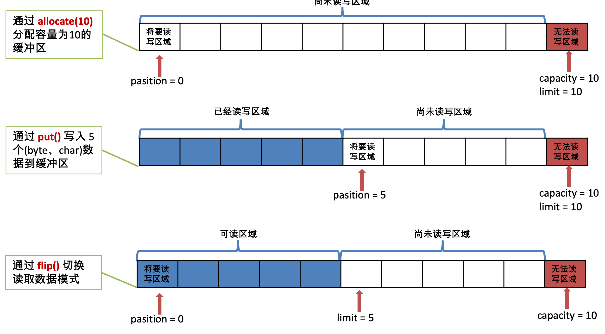
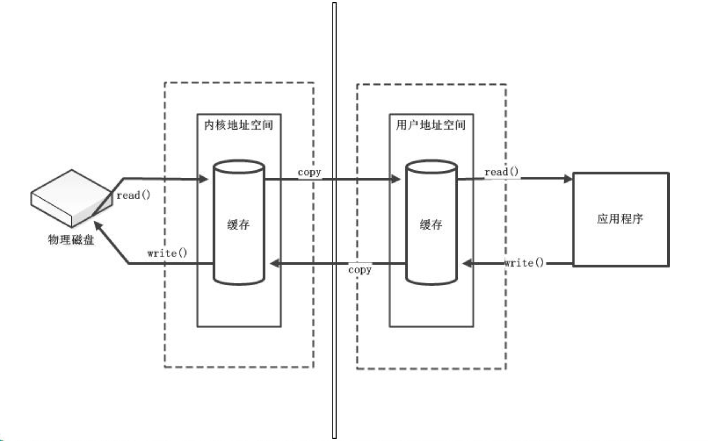
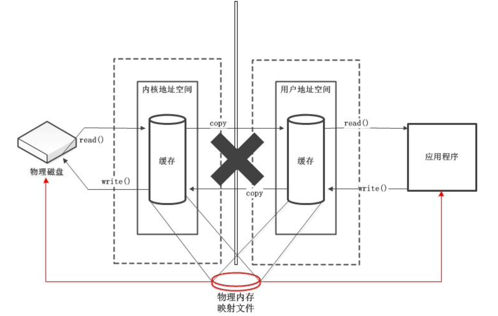
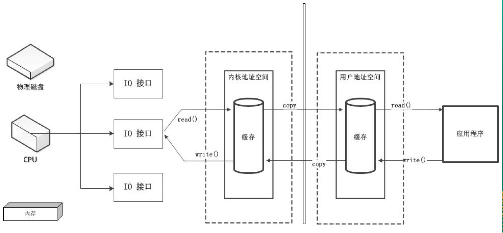
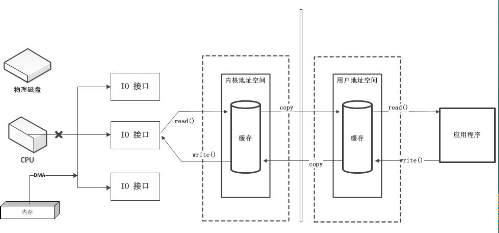
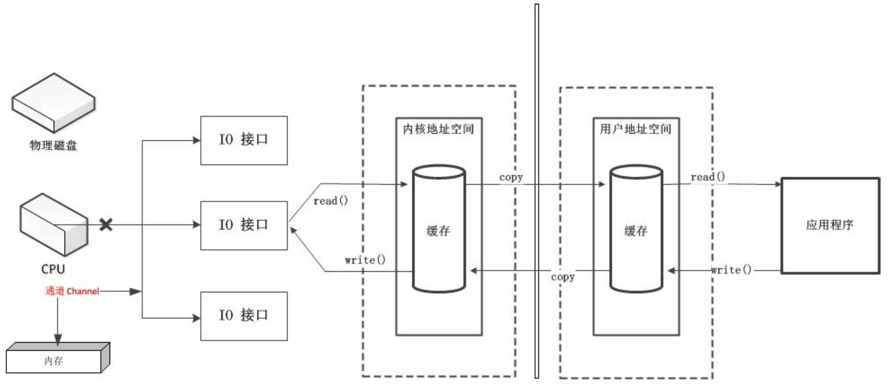
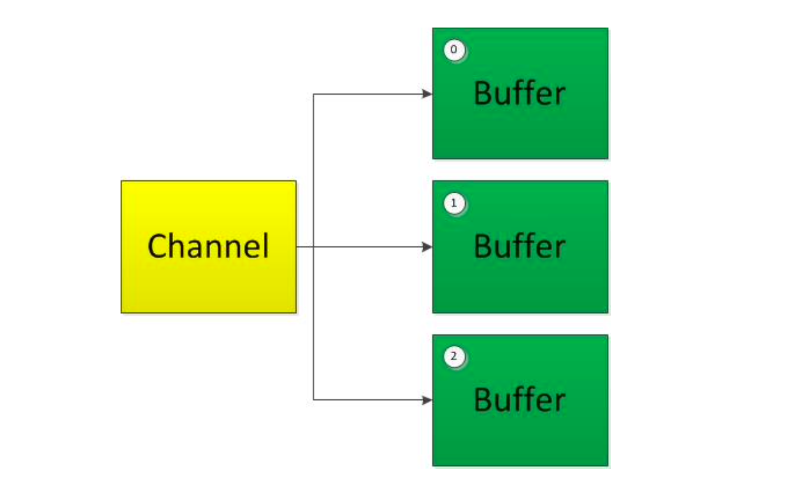
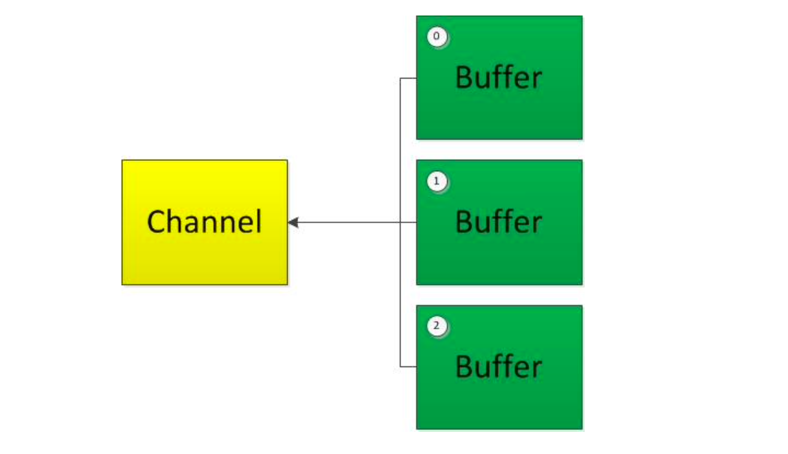
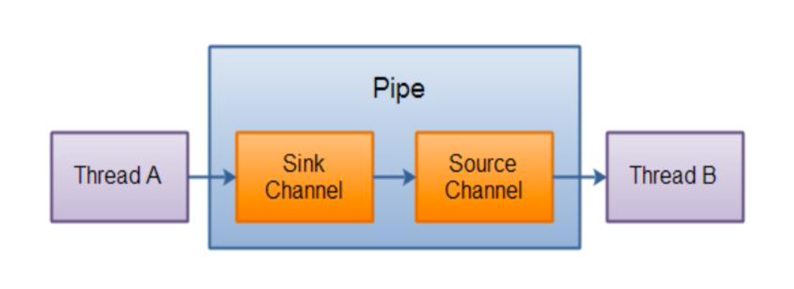

# NIO

- 笔记本：01. Java 核心基础（宋红康）
- 创建时间：2021-01-30 10:24:05 UTC
- 更新时间：2021-01-31 10:45:05 UTC
- 印象笔记 GUID：5bd96d6a-0229-4f87-aba4-075274e5fdb7

## NIO

### 1. Java NIO 简介

Java NIO(New IO / Non Blocking IO)是从Java 1.4版本开始引入的一个新的IO API，可以替代标准的Java IO API。 NIO与原来的IO有同样的作用和目的，但是使用的方式完全不同，NIO支持面向缓冲区的、基于通道的IO操作。NIO将以更加高效的方式进行文件的读写操作。

### 2. Java NIO 与 IO 的主要区别

 | IO | NIO
 | 面向流(Stream Oriented) | 面向缓冲区(Buffer Oriented)
 | 阻塞IO(Blocking IO) | 非阻塞IO(Non Blocking IO)
 | (无) | 选择器(Selectors)

### 3. 缓冲区(Buffer)和通道(Channel)

Java NIO系统的核心在于:通道(Channel)和缓冲区(Buffer)。通道表示打开到 IO 设备(例如:文件、套接字)的连接。若需要使用 NIO 系统，需要获取用于连接 IO 设备的通道以及用于容纳数据的缓冲区。然后操作缓冲区，对数据进行处理。
 **简而言之，Channel 负责传输， Buffer 负责存储**

#### 3.1. 缓冲区(Buffer)

- 缓冲区(Buffer):一个用于特定基本数据类型的容器。由 java.nio 包定义的，所有缓冲区都是 Buffer 抽象类的子类。

- Java NIO 中的 Buffer 主要用于与 NIO 通道进行交互，数据是从通道读入缓冲区，从缓冲区写入通道中的。

- Buffer 就像一个数组，可以保存多个相同类型的数据。根据数据类型不同(boolean 除外) ，有以下 Buffer 常用子类:

  - ByteBuffer

  - CharBuffer

  - ShortBuffer

  - IntBuffer

  - LongBuffer

  - FloatBuffer

  - DoubleBuffer

上述 Buffer 类 他们都采用相似的方法进行管理数据，只是各自管理的数据类型不同而已。都是通过如下方法获取一个 Buffer 对象:
 **`static XxxBuffer allocate(int capacity)` : 创建一个容量为 capacity 的 XxxBuffer 对象**

##### 缓冲区的基本属性

**Buffer 中的重要概念:**

- **容量 (capacity)** :表示 Buffer 最大数据容量，缓冲区容量不能为负，并且创建后不能更改。

- **限制 (limit)** : 第一个不应该读取或写入的数据的索引，即位于 limit 后的数据不可读写。缓冲区的限制不能为负，并且不能大于其容量。

- **位置 (position)** : 下一个要读取或写入的数据的索引。缓冲区的位置不能为负，并且不能大于其限制

- **标记 (mark)与重置 (reset)** : 标记是一个索引，通过 Buffer 中的 mark() 方法指定 Buffer 中一个特定的 position，之后可以通过调用 reset() 方法恢复到这个 position.

**标记、位置、限制、容量遵守以下不变式 : 0<=mark<=position<=limit<=capacity**
 

**Buffer 的常用方法:**

 | 方法 | 描述
 | Buffer clear() | 清空缓冲区并返回对缓冲区的引用
 | Buffer flip() | 将缓冲区的界限设置为当前位置，并将当前位置充值为 0
 | int capacity() | 返回 Buffer 的 capacity 大小
 | boolean hasRemaining() | 判断缓冲区中是否还有元素
 | int limit() | 返回 Buffer 的界限(limit) 的位置
 | Buffer limit(int n) | 将设置缓冲区界限为 n, 并返回一个具有新 limit 的缓冲区对象
 | Buffer mark() | 对缓冲区设置标记
 | int position() | 返回缓冲区的当前位置 position
 | Buffer position(int n) | 将设置缓冲区的当前位置为 n , 并返回修改后的 Buffer 对象
 | int remaining() | 返回 position 和 limit 之间的元素个数
 | Buffer reset() | 将位置 position 转到以前设置的 mark 所在的位置
 | Buffer rewind() | 将位置设为为 0， 取消设置的 mark

**缓冲区的数据操作:**
 Buffer 所有子类提供了两个用于数据操作的方法:get() 与 put() 方法

- 获取 Buffer 中的数据

  - `get()` : 读取单个字节

  - `get(byte[] dst)` : 批量读取多个字节到 dst 中

  - `get(int index)` : 读取指定索引位置的字节(不会移动 position)

- 放入数据到 Buffer 中

  - `put(byte b)` : 将给定单个字节写入缓冲区的当前位置

  - `put(byte[] src)` : 将 src 中的字节写入缓冲区的当前位置

  - `put(int index, byte b)` : 将指定字节写入缓冲区的索引位置(不会移动 position)

##### 直接与非直接缓冲区:

- 字节缓冲区要么是直接的，要么是非直接的。如果为直接字节缓冲区，则Java虚拟机会尽最大努力直接在此缓冲区上执行本机 I/O 操作。也就是说，在每次调用基础操作系统的一个本机 I/O 操作之前(或之后)， 虚拟机都会尽量避免将缓冲区的内容复制到中间缓冲区中(或从中间缓冲区中复制内容)。

- 直接字节缓冲区可以通过调用此类的 **`allocateDirect()` 工厂方法**来创建。此方法返回的**缓冲区进行分配和取消分配所需成本通常高于非直接缓冲区**。直接缓冲区的内容可以驻留在常规的垃圾回收堆之外，因此，它们对应用程序的内存需求量造成的影响可能并不明显。所以，建议将直接缓冲区主要分配给那些易受基础系统的本机 I/O 操作影响的大型、持久的缓冲区。一般情况下，最好仅在直接缓冲区能在程序性能方面带来明显好处时分配它们。

- 直接字节缓冲区还可以通过 **FileChannel 的 `map()`** 方法将文件区域直接映射到内存中来创建。该方法返回 MappedByteBuffer 。Java 平台的实现有助于通过 JNI 从本机代码创建直接字节缓冲区。如果以上这些缓冲区中的某个缓冲区实例指的是不可访问的内存区域，则试图访问该区域不会更改该缓冲区的内容，并且将会在访问期间或稍后的某个时间导致抛出不确定的异常。

- 字节缓冲区是直接缓冲区还是非直接缓冲区可通过调用其 **`isDirect()`** 方法来确定。提供此方法是为了能够在性能关键型代码中执行显式缓冲区管理。

**非直接缓冲区**
 

**直接缓冲区**
 
 **eg：** 缓冲区

```
/**
 * 一、缓冲区（Buffer）：在 Java NIO 中负责数据的存取。缓冲区就是数组，用于存储不同数据类型的数据
 *  根据数据类型不同（boooean 类型除外），通过了相应类型的缓冲区：
 *      ByteBuffer
 *      CharBuffer
 *      ShortBuffer
 *      IntBuffer
 *      LongBuffer
 *      FloatBuffer
 *      DoubleBuffer
 *  上述缓冲区的管理方式几乎是一样的，通过 allocate() 获取缓冲区
 * 二、缓冲区存取数据的两个核心方法：
 *  put()：存入数据到缓冲区
 *  get()：获取缓冲区中的数据
 * 三、缓冲区中的四个核心属性：
 *  capacity：容量，表示缓冲区中最大存储数据的容量。一旦声明不能改变。
 *  limit：界限，表示缓冲区中可以操作数据的大小。（limit 后数据不能进行读写）
 *  position：位置，表示缓冲区中正在操作数据的位置
 *  mark：标记，表示记录当前 position 的位置。可以通过 reset() 恢复到 mark 的位置
 *  0 <= mark <= position <= limit <= capacity
 * 四、直接缓冲区与非直接缓冲区
 *  非直接缓冲区：通过 allocate() 方法分配缓冲区，将缓冲区建立在 JVM 的内存中
 *  直接缓冲区：通过 allocateDirect() 方法分配直接缓冲区，将缓冲区建立在物理内存中。可以提高效率
 */
public class TestBuffer {

    @Test
    public void test1() {
        String str = "xiaohua";
        // 1. 分配一个指定大小的缓冲区
        ByteBuffer buf = ByteBuffer.allocate(1024);

        System.out.println("------------allocate()------------");
        System.out.println(buf.position());     // 0
        System.out.println(buf.limit());        // 1024
        System.out.println(buf.capacity());     // 1024

        // 2. 利用 put() 存入数据到缓冲区中
        buf.put(str.getBytes());

        System.out.println("------------put()------------");
        System.out.println(buf.position());     // 7
        System.out.println(buf.limit());        // 1024
        System.out.println(buf.capacity());     // 1024

        // 3. 切换读取数据模式
        buf.flip();

        System.out.println("------------put()------------");
        System.out.println(buf.position());     // 0
        System.out.println(buf.limit());        // 7
        System.out.println(buf.capacity());     // 1024

        // 4. 利用 get() 读取缓冲区中的数据
        byte[] dst = new byte[buf.limit()];
        buf.get(dst);

        System.out.println("------------get()------------");
        System.out.println(buf.position());     // 7
        System.out.println(buf.limit());        // 7
        System.out.println(buf.capacity());     // 1024
        System.out.println(new String(dst, 0, dst.length));

        // 5. rewind() : 可重复读数据
        buf.rewind();

        System.out.println("------------rewind()------------");
        System.out.println(buf.position());     // 0
        System.out.println(buf.limit());        // 7
        System.out.println(buf.capacity());     // 1024

        // 6. 清空缓冲区，但是缓冲区中的数据依然存在，但是处于"被遗忘"的状态
        buf.clear();

        System.out.println("------------clear()------------");
        System.out.println(buf.position());     // 0
        System.out.println(buf.limit());        // 1024
        System.out.println(buf.capacity());     // 1024

        System.out.println((char)buf.get());    // x 可以看到虽然清空了，但是数据还在。只是无法正确读取数据了
    }

    @Test
    public void test2() {
        String str = "xiaohua";

        ByteBuffer buf = ByteBuffer.allocate(1024);

        buf.put(str.getBytes());

        buf.flip();

        byte[] dst = new byte[buf.limit()];
        buf.get(dst, 0, 2);
        System.out.println(new String(dst, 0, 2));  // xi

        System.out.println(buf.position()); // 2

        // mark()：标记
        buf.mark();
        buf.get(dst, 2, 2);
        System.out.println(new String(dst, 2, 2));  // ao
        System.out.println(buf.position()); // 4

        // reset()：恢复到 mark 的位置
        buf.reset();
        System.out.println(buf.position()); // 2

        /// 判断缓冲区中是否还有剩余数据
        if (buf.hasRemaining()) {   // return position < limit;
            // 获取缓冲区中可以操作的数量
            System.out.println(buf.remaining());    // limit - position
        }
    }

    @Test
    public void testBuffer() {
        // 分配直接缓冲区
        ByteBuffer buf = ByteBuffer.allocateDirect(1024);

        // 判断是否是直接缓冲区
        System.out.println(buf.isDirect());     // true
    }
}

```

#### 3.2. 通道(Channel)

通道(Channel) : 由 java.nio.channels 包定义的。Channel 表示 IO 源与目标打开的连接。 Channel 类似于传统的“流”。只不过 Channel 本身不能直接访问数据，Channel 只能与 Buffer 进行交互。

- 最早期的操作系统，所有的 IO 接口调用都是 CPU 独立负责的。当发起大量读写请求时，CPU 占用率会非常高，以至于 CPU 无法做其它工作。CPU 处理能力下降。
 

- 后来 OS 有所改进，在内存和 IO 接口之间加了 DMA（直接存储器存储）。当应用程序对操作系统发起读写请求时，DMA 会先向 CPU 申请权限，如果 CPU 赋予 DMA 权限后，接下来 IO 操作全权由 DMA 负责操作。CPU 不需要干预。当大量读写请求时，DMA 也会向 CPU 申请资源，建立大量 DMA 总线，可能会造成总线冲突，也会影响性能。
 

- 通道是一个完全独立的处理器（附属于 CPU），专门用于 IO 操作。
 

**Java 为 Channel 接口提供的最主要实现类如下:**

- FileChannel : 用于读取、写入、映射和操作文件的通道。

- DatagramChannel : 通过 UDP 读写网络中的数据通道。

- SocketChannel : 通过 TCP 读写网络中的数据。

- ServerSocketChannel : 可以监听新进来的 TCP 连接，对每一个新进来的连接都会创建一个 SocketChannel。

##### 获取通道

获取通道的一种方式是对支持通道的对象调用 getChannel() 方法。支持通道的类如下:

- FileInputStream

- FileOutputStream

- RandomAccessFile

- DatagramSocket

- Socket

- ServerSocket

获取通道的其他方式是使用 Files 类的静态方法 newByteChannel() 获取字节通道。或者通过通道的静态方法 open() 打开并返回指定通道。

##### 通道的数据传输

- 将 Buffer 中数据写入 Channel
 **eg：**

```
// 将 Buffer 中数据写入 Channel 中
int bytesWritten = inChannel.write(buf);

```

- 从 Channel 读取数据到 Buffer
 **eg：**

```
// 从 Channel 读取数据到 Buffer 中
int bytesRead = inChannel.read(buf);

```

##### 分散(Scatter)和聚集(Gather)

- 分散读取(Scattering Reads)是指从 Channel 中读取的数据“分 散”到多个 Buffer 中。
 
 **注意:** 按照缓冲区的顺序，从 Channel 中读取的数据依次将 Buffer 填满。

- 聚集写入(Gathering Writes)是指将多个 Buffer 中的数据“聚集” 到 Channel。
 
 **注意:** 按照缓冲区的顺序，写入 position 和 limit 之间的数据到 Channel 。

##### transferFrom()

将数据从源通道传输到其他 Channel 中:

##### transferTo()

将数据从源通道传输到其他 Channel 中:
 **eg:**

```
/**
 * 一、通道（Channel）：用于源节点与目标节点的连接。在 Java NIO 中负责缓冲区中数据的传输。通道本身不存储数据，因此需要配合缓冲区进行传输。
 * 二、通道的一些主要实现类
 *  java.nio.channels.Channel 接口：
 *      |-- FileChannel
 *      |-- SocketChannel
 *      |-- ServerSocketChannel
 *      |-- DatagramChannel
 * 三、获取通道
 *  1. Java 针对支持通道的类提供了 getChannel() 方法
 *      本地 IO：
 *          FileInputStream/FileOutputStream
 *          RandomAccessFile
 *      网络 IO：
 *          Socket
 *          ServerSocket
 *          DatagramSocket
 *  2. 在 JDK1.7 中的 NIO.2 针对各个通道提供了静态方法 open()
 *  3. 在 JDK1.7 中的 NIO.2 的 Files 工具类的 newByteChannel()
 * 四、通道之间的数据传输
 *  transferFrom()
 *  transferTo()
 * 五、分散（Scatter）与聚集（Gather）
 *  分散读取（Scattering Reads）：将通道中的数据分散到多个缓冲区中
 *  聚集写入（Gathering Writes）：将多个缓冲区中的数据聚集到通道中
 * 六、字符集 Charset
 *  编码：字符串 -> 字节数组
 *  解码：字节数组 -> 字符串
 */
public class TestChannel {
    // 1. 利用通道完成文件的复制(非直接缓冲区)
    @Test
    public void testFileCopy() {
        Instant start = Instant.now();
        FileInputStream fis = null;
        FileOutputStream fos = null;
        FileChannel inChannel = null;
        FileChannel outChannel = null;
        try {   // idea 快捷键 ctrl(Command) + alt + t 快速 try catch
            fis = new FileInputStream("1.png");
            fos = new FileOutputStream("2.png");

            // 1⃣️ 获取通道
            inChannel = fis.getChannel();
            outChannel = fos.getChannel();

            // 2⃣️ 分配指定大小的缓冲区
            ByteBuffer buf = ByteBuffer.allocate(1024);

            // 3⃣️ 将通道中的数据存入缓冲区中
            while (inChannel.read(buf) != -1) {
                buf.flip();     // 切换成读取数据的模式

                // 4⃣️ 将缓冲区中的数据写入通道中
                outChannel.write(buf);
                buf.clear();    // 清空缓冲区
            }
        } catch (IOException e) {
            e.printStackTrace();
        } finally {
            // 5⃣️ 通道关闭
            if (outChannel != null) {
                try {
                    outChannel.close();
                } catch (IOException e) {
                    e.printStackTrace();
                }
            }
            if (inChannel != null) {
                try {
                    inChannel.close();
                } catch (IOException e) {
                    e.printStackTrace();
                }
            }
            if (fos != null) {
                try {
                    fos.close();
                } catch (IOException e) {
                    e.printStackTrace();
                }
            }
            if (fis != null) {
                try {
                    fis.close();
                } catch (IOException e) {
                    e.printStackTrace();
                }
            }
        }
        Instant end = Instant.now();
        System.out.println("耗费时间为：" + Duration.between(start, end).toMillis()); // 103
    }
    // 2. 使用直接缓冲区完成文件的复制（内存映射文件的方式）
    @Test
    public void testFileCopyDirect() throws IOException {
        Instant start = Instant.now();
        // 1. 创建通道
        FileChannel inChannel = FileChannel.open(Paths.get("1.png"), StandardOpenOption.READ);
        FileChannel outChannel = FileChannel.open(Paths.get("sdd.png"),
                StandardOpenOption.WRITE, StandardOpenOption.READ, StandardOpenOption.CREATE);   // CREATE_NEW 不存在就创建，存在就报错

        // 内存映射文件（只有 ByteBuffer 支持）
        MappedByteBuffer inMapperBuf = inChannel.map(FileChannel.MapMode.READ_ONLY, 0, inChannel.size());
        MappedByteBuffer outMapperBuf = outChannel.map(FileChannel.MapMode.READ_WRITE, 0, inChannel.size());

        // 直接对缓冲区进行数据的读写操作
        byte[] dst = new byte[inMapperBuf.limit()];
        inMapperBuf.get(dst);
        outMapperBuf.put(dst);

        // 关闭通道
        inChannel.close();
        outChannel.close();

        Instant end = Instant.now();
        System.out.println("耗费时间为：" + Duration.between(start, end).toMillis()); // 83
    }

    // 3. 通道之间的数据传输(直接缓冲区)
    @Test
    public void testFileCopyByChannel() throws IOException {
        // 1. 创建通道
        FileChannel inChannel = FileChannel.open(Paths.get("1.png"), StandardOpenOption.READ);
        FileChannel outChannel = FileChannel.open(Paths.get("sdd.png"),
                StandardOpenOption.WRITE, StandardOpenOption.READ, StandardOpenOption.CREATE);   // CREATE_NEW 不存在就创建，存在就报错

        // inChannel.transferTo(0, inChannel.size(), outChannel);
        outChannel.transferFrom(inChannel, 0, inChannel.size());

        inChannel.close();
        outChannel.close();
    }

    // 4. 分散和聚集
    @Test
    public void testScatterAndGather() throws IOException {
        RandomAccessFile raf1 = new RandomAccessFile("1.txt", "rw");
        // 1. 获取通道
        FileChannel channel1 = raf1.getChannel();
        // 2. 分配指定大小的缓冲区
        ByteBuffer buf1 = ByteBuffer.allocate(100);
        ByteBuffer buf2 = ByteBuffer.allocate(1024);
        // 3. 分散读取
        ByteBuffer[] bufs = {buf1, buf2};
        channel1.read(bufs);

        // 4。 聚集写入
        RandomAccessFile raf2 = new RandomAccessFile("2.txt", "rw");
        FileChannel channel2 = raf2.getChannel();

        channel2.write(bufs);

        channel2.close();
        raf2.close();
        channel1.close();
        raf1.close();
    }

    // 字符集
    @Test
    public void testCharsets() {
        SortedMap<String, Charset> charsets = Charset.availableCharsets();  // 查看所有支持的字符集
        Set<Map.Entry<String, Charset>> entries = charsets.entrySet();
        for (Map.Entry<String, Charset> entry : entries) {
            System.out.println(entry.getKey() + "=" + entry.getValue());
        }
    }
    @Test
    public void testEncoderAndDecoder() throws CharacterCodingException {
        Charset csGbk = Charset.forName("GBK");

        // 获取编码器
        CharsetEncoder ce = csGbk.newEncoder();

        // 获取解码器
        CharsetDecoder cd = csGbk.newDecoder();

        CharBuffer charBuffer = CharBuffer.allocate(1024);
        charBuffer.put("liudezhi");
        charBuffer.flip();

        //  编码
        ByteBuffer byteBuffer = ce.encode(charBuffer);

        for (int i = 0; i < byteBuffer.limit(); i++) {
            System.out.println(byteBuffer.get());
        }

        // 解码
        byteBuffer.flip();
        CharBuffer decode = cd.decode(byteBuffer);
        System.out.println(decode.toString());

        System.out.println("---------------------");

        byteBuffer.flip();
        Charset uCharset = Charset.forName("UTF-8");
        CharBuffer buf1 = uCharset.decode(byteBuffer);
        System.out.println(buf1.toString());
    }
}

```

### 4. 文件通道(FileChannel)

**FileChannel 的常用方法**

 | 方法 | 描述
 | int read(ByteBuffer dst) | 从 Channel 中读取数据到 ByteBuffer
 | long read(ByteBuffer[] dsts) | 将 Channel 中的数据“分散”到 ByteBuffer[]
 | int write(ByteBuffer src) | 将 ByteBuffer 中的数据写入到 Channel
 | long write(ByteBuffer[] srcs) | 将 ByteBuffer[] 中的数据“聚集”到 Channel
 | long position() | 返回此通道的文件位置
 | FileChannel position(long p) | 设置此通道的文件位置
 | long size() | 返回此通道的文件的当前大小
 | FileChannel truncate(long s) | 将此通道的文件截取为给定大小
 | void force(boolean metaData) | 强制将所有对此通道的文件更新写入到存储设备中

### 5. NIO 的非阻塞式网络通信

**阻塞与非阻塞**

- 传统的 IO 流都是阻塞式的。也就是说，当一个线程调用 read() 或 write() 时，该线程被阻塞，直到有一些数据被读取或写入，该线程在此期间不能执行其他任务。因此，在完成网络通信进行 IO 操作时，由于线程会阻塞，所以服务器端必须为每个客户端都提供一个独立的线程进行处理，当服务器端需要处理大量客户端时，性能急剧下降。

- Java NIO 是非阻塞模式的。当线程从某通道进行读写数据时，若没有数据可用时，该线程可以进行其他任务。线程通常将非阻塞 IO 的空闲时 间用于在其他通道上执行 IO 操作，所以单独的线程可以管理多个输入和输出通道。因此，NIO 可以让服务器端使用一个或有限几个线程来同时处理连接到服务器端的所有客户端。

#### 5.1. 选择器(Selector)

- 选择器(Selector) 是 SelectableChannle 对象的多路复用器，**Selector 可以同时监控多个 SelectableChannel 的 IO 状况**，也就是说，利用 **Selector 可使一个单独的线程管理多个 Channel。Selector 是非阻塞 IO 的核心**。

- SelectableChannle 的结构如下图:

```
PHN2ZyBpZD0iZG1scnRjbmZkaTYiIHdpZHRoPSIxMDAlIiB4bWxucz0iaHR0cDovL3d3dy53My5vcmcvMjAwMC9zdmciIHN0eWxlPSJtYXgtd2lkdGg6IDQ5Ny4wNDY4NzVweDsiIHZpZXdCb3g9IjAgMCA0OTcuMDQ2ODc1IDIyNC44NDM3NSI+PHN0eWxlPgoKCiNkbWxydGNuZmRpNiAubGFiZWwgewogIGZvbnQtZmFtaWx5OiAndHJlYnVjaGV0IG1zJywgdmVyZGFuYSwgYXJpYWw7CiAgY29sb3I6ICMzMzM7IH0KCiNkbWxydGNuZmRpNiAubm9kZSByZWN0LAojZG1scnRjbmZkaTYgLm5vZGUgY2lyY2xlLAojZG1scnRjbmZkaTYgLm5vZGUgZWxsaXBzZSwKI2RtbHJ0Y25mZGk2IC5ub2RlIHBvbHlnb24gewogIGZpbGw6ICNFQ0VDRkY7CiAgc3Ryb2tlOiAjOTM3MERCOwogIHN0cm9rZS13aWR0aDogMXB4OyB9CgojZG1scnRjbmZkaTYgLm5vZGUuY2xpY2thYmxlIHsKICBjdXJzb3I6IHBvaW50ZXI7IH0KCiNkbWxydGNuZmRpNiAuYXJyb3doZWFkUGF0aCB7CiAgZmlsbDogIzMzMzMzMzsgfQoKI2RtbHJ0Y25mZGk2IC5lZGdlUGF0aCAucGF0aCB7CiAgc3Ryb2tlOiAjMzMzMzMzOwogIHN0cm9rZS13aWR0aDogMS41cHg7IH0KCiNkbWxydGNuZmRpNiAuZWRnZUxhYmVsIHsKICBiYWNrZ3JvdW5kLWNvbG9yOiAjZThlOGU4OyB9CgojZG1scnRjbmZkaTYgLmNsdXN0ZXIgcmVjdCB7CiAgZmlsbDogI2ZmZmZkZSAhaW1wb3J0YW50OwogIHN0cm9rZTogI2FhYWEzMyAhaW1wb3J0YW50OwogIHN0cm9rZS13aWR0aDogMXB4ICFpbXBvcnRhbnQ7IH0KCiNkbWxydGNuZmRpNiAuY2x1c3RlciB0ZXh0IHsKICBmaWxsOiAjMzMzOyB9CgojZG1scnRjbmZkaTYgZGl2Lm1lcm1haWRUb29sdGlwIHsKICBwb3NpdGlvbjogYWJzb2x1dGU7CiAgdGV4dC1hbGlnbjogY2VudGVyOwogIG1heC13aWR0aDogMjAwcHg7CiAgcGFkZGluZzogMnB4OwogIGZvbnQtZmFtaWx5OiAndHJlYnVjaGV0IG1zJywgdmVyZGFuYSwgYXJpYWw7CiAgZm9udC1zaXplOiAxMnB4OwogIGJhY2tncm91bmQ6ICNmZmZmZGU7CiAgYm9yZGVyOiAxcHggc29saWQgI2FhYWEzMzsKICBib3JkZXItcmFkaXVzOiAycHg7CiAgcG9pbnRlci1ldmVudHM6IG5vbmU7CiAgei1pbmRleDogMTAwOyB9CgojZG1scnRjbmZkaTYgLmFjdG9yIHsKICBzdHJva2U6ICNDQ0NDRkY7CiAgZmlsbDogI0VDRUNGRjsgfQoKI2RtbHJ0Y25mZGk2IHRleHQuYWN0b3IgewogIGZpbGw6IGJsYWNrOwogIHN0cm9rZTogbm9uZTsgfQoKI2RtbHJ0Y25mZGk2IC5hY3Rvci1saW5lIHsKICBzdHJva2U6IGdyZXk7IH0KCiNkbWxydGNuZmRpNiAubWVzc2FnZUxpbmUwIHsKICBzdHJva2Utd2lkdGg6IDEuNTsKICBzdHJva2UtZGFzaGFycmF5OiAnMiAyJzsKICBzdHJva2U6ICMzMzM7IH0KCiNkbWxydGNuZmRpNiAubWVzc2FnZUxpbmUxIHsKICBzdHJva2Utd2lkdGg6IDEuNTsKICBzdHJva2UtZGFzaGFycmF5OiAnMiAyJzsKICBzdHJva2U6ICMzMzM7IH0KCiNkbWxydGNuZmRpNiAjYXJyb3doZWFkIHsKICBmaWxsOiAjMzMzOyB9CgojZG1scnRjbmZkaTYgI2Nyb3NzaGVhZCBwYXRoIHsKICBmaWxsOiAjMzMzICFpbXBvcnRhbnQ7CiAgc3Ryb2tlOiAjMzMzICFpbXBvcnRhbnQ7IH0KCiNkbWxydGNuZmRpNiAubWVzc2FnZVRleHQgewogIGZpbGw6ICMzMzM7CiAgc3Ryb2tlOiBub25lOyB9CgojZG1scnRjbmZkaTYgLmxhYmVsQm94IHsKICBzdHJva2U6ICNDQ0NDRkY7CiAgZmlsbDogI0VDRUNGRjsgfQoKI2RtbHJ0Y25mZGk2IC5sYWJlbFRleHQgewogIGZpbGw6IGJsYWNrOwogIHN0cm9rZTogbm9uZTsgfQoKI2RtbHJ0Y25mZGk2IC5sb29wVGV4dCB7CiAgZmlsbDogYmxhY2s7CiAgc3Ryb2tlOiBub25lOyB9CgojZG1scnRjbmZkaTYgLmxvb3BMaW5lIHsKICBzdHJva2Utd2lkdGg6IDI7CiAgc3Ryb2tlLWRhc2hhcnJheTogJzIgMic7CiAgc3Ryb2tlOiAjQ0NDQ0ZGOyB9CgojZG1scnRjbmZkaTYgLm5vdGUgewogIHN0cm9rZTogI2FhYWEzMzsKICBmaWxsOiAjZmZmNWFkOyB9CgojZG1scnRjbmZkaTYgLm5vdGVUZXh0IHsKICBmaWxsOiBibGFjazsKICBzdHJva2U6IG5vbmU7CiAgZm9udC1mYW1pbHk6ICd0cmVidWNoZXQgbXMnLCB2ZXJkYW5hLCBhcmlhbDsKICBmb250LXNpemU6IDE0cHg7IH0KCiNkbWxydGNuZmRpNiAuYWN0aXZhdGlvbjAgewogIGZpbGw6ICNmNGY0ZjQ7CiAgc3Ryb2tlOiAjNjY2OyB9CgojZG1scnRjbmZkaTYgLmFjdGl2YXRpb24xIHsKICBmaWxsOiAjZjRmNGY0OwogIHN0cm9rZTogIzY2NjsgfQoKI2RtbHJ0Y25mZGk2IC5hY3RpdmF0aW9uMiB7CiAgZmlsbDogI2Y0ZjRmNDsKICBzdHJva2U6ICM2NjY7IH0KCgojZG1scnRjbmZkaTYgLnNlY3Rpb24gewogIHN0cm9rZTogbm9uZTsKICBvcGFjaXR5OiAwLjI7IH0KCiNkbWxydGNuZmRpNiAuc2VjdGlvbjAgewogIGZpbGw6IHJnYmEoMTAyLCAxMDIsIDI1NSwgMC40OSk7IH0KCiNkbWxydGNuZmRpNiAuc2VjdGlvbjIgewogIGZpbGw6ICNmZmY0MDA7IH0KCiNkbWxydGNuZmRpNiAuc2VjdGlvbjEsCiNkbWxydGNuZmRpNiAuc2VjdGlvbjMgewogIGZpbGw6IHdoaXRlOwogIG9wYWNpdHk6IDAuMjsgfQoKI2RtbHJ0Y25mZGk2IC5zZWN0aW9uVGl0bGUwIHsKICBmaWxsOiAjMzMzOyB9CgojZG1scnRjbmZkaTYgLnNlY3Rpb25UaXRsZTEgewogIGZpbGw6ICMzMzM7IH0KCiNkbWxydGNuZmRpNiAuc2VjdGlvblRpdGxlMiB7CiAgZmlsbDogIzMzMzsgfQoKI2RtbHJ0Y25mZGk2IC5zZWN0aW9uVGl0bGUzIHsKICBmaWxsOiAjMzMzOyB9CgojZG1scnRjbmZkaTYgLnNlY3Rpb25UaXRsZSB7CiAgdGV4dC1hbmNob3I6IHN0YXJ0OwogIGZvbnQtc2l6ZTogMTFweDsKICB0ZXh0LWhlaWdodDogMTRweDsgfQoKCiNkbWxydGNuZmRpNiAuZ3JpZCAudGljayB7CiAgc3Ryb2tlOiBsaWdodGdyZXk7CiAgb3BhY2l0eTogMC4zOwogIHNoYXBlLXJlbmRlcmluZzogY3Jpc3BFZGdlczsgfQoKI2RtbHJ0Y25mZGk2IC5ncmlkIHBhdGggewogIHN0cm9rZS13aWR0aDogMDsgfQoKCiNkbWxydGNuZmRpNiAudG9kYXkgewogIGZpbGw6IG5vbmU7CiAgc3Ryb2tlOiByZWQ7CiAgc3Ryb2tlLXdpZHRoOiAycHg7IH0KCgoKI2RtbHJ0Y25mZGk2IC50YXNrIHsKICBzdHJva2Utd2lkdGg6IDI7IH0KCiNkbWxydGNuZmRpNiAudGFza1RleHQgewogIHRleHQtYW5jaG9yOiBtaWRkbGU7CiAgZm9udC1zaXplOiAxMXB4OyB9CgojZG1scnRjbmZkaTYgLnRhc2tUZXh0T3V0c2lkZVJpZ2h0IHsKICBmaWxsOiBibGFjazsKICB0ZXh0LWFuY2hvcjogc3RhcnQ7CiAgZm9udC1zaXplOiAxMXB4OyB9CgojZG1scnRjbmZkaTYgLnRhc2tUZXh0T3V0c2lkZUxlZnQgewogIGZpbGw6IGJsYWNrOwogIHRleHQtYW5jaG9yOiBlbmQ7CiAgZm9udC1zaXplOiAxMXB4OyB9CgoKI2RtbHJ0Y25mZGk2IC50YXNrVGV4dDAsCiNkbWxydGNuZmRpNiAudGFza1RleHQxLAojZG1scnRjbmZkaTYgLnRhc2tUZXh0MiwKI2RtbHJ0Y25mZGk2IC50YXNrVGV4dDMgewogIGZpbGw6IHdoaXRlOyB9CgojZG1scnRjbmZkaTYgLnRhc2swLAojZG1scnRjbmZkaTYgLnRhc2sxLAojZG1scnRjbmZkaTYgLnRhc2syLAojZG1scnRjbmZkaTYgLnRhc2szIHsKICBmaWxsOiAjOGE5MGRkOwogIHN0cm9rZTogIzUzNGZiYzsgfQoKI2RtbHJ0Y25mZGk2IC50YXNrVGV4dE91dHNpZGUwLAojZG1scnRjbmZkaTYgLnRhc2tUZXh0T3V0c2lkZTIgewogIGZpbGw6IGJsYWNrOyB9CgojZG1scnRjbmZkaTYgLnRhc2tUZXh0T3V0c2lkZTEsCiNkbWxydGNuZmRpNiAudGFza1RleHRPdXRzaWRlMyB7CiAgZmlsbDogYmxhY2s7IH0KCgojZG1scnRjbmZkaTYgLmFjdGl2ZTAsCiNkbWxydGNuZmRpNiAuYWN0aXZlMSwKI2RtbHJ0Y25mZGk2IC5hY3RpdmUyLAojZG1scnRjbmZkaTYgLmFjdGl2ZTMgewogIGZpbGw6ICNiZmM3ZmY7CiAgc3Ryb2tlOiAjNTM0ZmJjOyB9CgojZG1scnRjbmZkaTYgLmFjdGl2ZVRleHQwLAojZG1scnRjbmZkaTYgLmFjdGl2ZVRleHQxLAojZG1scnRjbmZkaTYgLmFjdGl2ZVRleHQyLAojZG1scnRjbmZkaTYgLmFjdGl2ZVRleHQzIHsKICBmaWxsOiBibGFjayAhaW1wb3J0YW50OyB9CgoKI2RtbHJ0Y25mZGk2IC5kb25lMCwKI2RtbHJ0Y25mZGk2IC5kb25lMSwKI2RtbHJ0Y25mZGk2IC5kb25lMiwKI2RtbHJ0Y25mZGk2IC5kb25lMyB7CiAgc3Ryb2tlOiBncmV5OwogIGZpbGw6IGxpZ2h0Z3JleTsKICBzdHJva2Utd2lkdGg6IDI7IH0KCiNkbWxydGNuZmRpNiAuZG9uZVRleHQwLAojZG1scnRjbmZkaTYgLmRvbmVUZXh0MSwKI2RtbHJ0Y25mZGk2IC5kb25lVGV4dDIsCiNkbWxydGNuZmRpNiAuZG9uZVRleHQzIHsKICBmaWxsOiBibGFjayAhaW1wb3J0YW50OyB9CgoKI2RtbHJ0Y25mZGk2IC5jcml0MCwKI2RtbHJ0Y25mZGk2IC5jcml0MSwKI2RtbHJ0Y25mZGk2IC5jcml0MiwKI2RtbHJ0Y25mZGk2IC5jcml0MyB7CiAgc3Ryb2tlOiAjZmY4ODg4OwogIGZpbGw6IHJlZDsKICBzdHJva2Utd2lkdGg6IDI7IH0KCiNkbWxydGNuZmRpNiAuYWN0aXZlQ3JpdDAsCiNkbWxydGNuZmRpNiAuYWN0aXZlQ3JpdDEsCiNkbWxydGNuZmRpNiAuYWN0aXZlQ3JpdDIsCiNkbWxydGNuZmRpNiAuYWN0aXZlQ3JpdDMgewogIHN0cm9rZTogI2ZmODg4ODsKICBmaWxsOiAjYmZjN2ZmOwogIHN0cm9rZS13aWR0aDogMjsgfQoKI2RtbHJ0Y25mZGk2IC5kb25lQ3JpdDAsCiNkbWxydGNuZmRpNiAuZG9uZUNyaXQxLAojZG1scnRjbmZkaTYgLmRvbmVDcml0MiwKI2RtbHJ0Y25mZGk2IC5kb25lQ3JpdDMgewogIHN0cm9rZTogI2ZmODg4ODsKICBmaWxsOiBsaWdodGdyZXk7CiAgc3Ryb2tlLXdpZHRoOiAyOwogIGN1cnNvcjogcG9pbnRlcjsKICBzaGFwZS1yZW5kZXJpbmc6IGNyaXNwRWRnZXM7IH0KCiNkbWxydGNuZmRpNiAuZG9uZUNyaXRUZXh0MCwKI2RtbHJ0Y25mZGk2IC5kb25lQ3JpdFRleHQxLAojZG1scnRjbmZkaTYgLmRvbmVDcml0VGV4dDIsCiNkbWxydGNuZmRpNiAuZG9uZUNyaXRUZXh0MyB7CiAgZmlsbDogYmxhY2sgIWltcG9ydGFudDsgfQoKI2RtbHJ0Y25mZGk2IC5hY3RpdmVDcml0VGV4dDAsCiNkbWxydGNuZmRpNiAuYWN0aXZlQ3JpdFRleHQxLAojZG1scnRjbmZkaTYgLmFjdGl2ZUNyaXRUZXh0MiwKI2RtbHJ0Y25mZGk2IC5hY3RpdmVDcml0VGV4dDMgewogIGZpbGw6IGJsYWNrICFpbXBvcnRhbnQ7IH0KCiNkbWxydGNuZmRpNiAudGl0bGVUZXh0IHsKICB0ZXh0LWFuY2hvcjogbWlkZGxlOwogIGZvbnQtc2l6ZTogMThweDsKICBmaWxsOiBibGFjazsgfQoKI2RtbHJ0Y25mZGk2IGcuY2xhc3NHcm91cCB0ZXh0IHsKICBmaWxsOiAjOTM3MERCOwogIHN0cm9rZTogbm9uZTsKICBmb250LWZhbWlseTogJ3RyZWJ1Y2hldCBtcycsIHZlcmRhbmEsIGFyaWFsOwogIGZvbnQtc2l6ZTogMTBweDsgfQoKI2RtbHJ0Y25mZGk2IGcuY2xhc3NHcm91cCByZWN0IHsKICBmaWxsOiAjRUNFQ0ZGOwogIHN0cm9rZTogIzkzNzBEQjsgfQoKI2RtbHJ0Y25mZGk2IGcuY2xhc3NHcm91cCBsaW5lIHsKICBzdHJva2U6ICM5MzcwREI7CiAgc3Ryb2tlLXdpZHRoOiAxOyB9CgojZG1scnRjbmZkaTYgLmNsYXNzTGFiZWwgLmJveCB7CiAgc3Ryb2tlOiBub25lOwogIHN0cm9rZS13aWR0aDogMDsKICBmaWxsOiAjRUNFQ0ZGOwogIG9wYWNpdHk6IDAuNTsgfQoKI2RtbHJ0Y25mZGk2IC5jbGFzc0xhYmVsIC5sYWJlbCB7CiAgZmlsbDogIzkzNzBEQjsKICBmb250LXNpemU6IDEwcHg7IH0KCiNkbWxydGNuZmRpNiAucmVsYXRpb24gewogIHN0cm9rZTogIzkzNzBEQjsKICBzdHJva2Utd2lkdGg6IDE7CiAgZmlsbDogbm9uZTsgfQoKI2RtbHJ0Y25mZGk2ICNjb21wb3NpdGlvblN0YXJ0IHsKICBmaWxsOiAjOTM3MERCOwogIHN0cm9rZTogIzkzNzBEQjsKICBzdHJva2Utd2lkdGg6IDE7IH0KCiNkbWxydGNuZmRpNiAjY29tcG9zaXRpb25FbmQgewogIGZpbGw6ICM5MzcwREI7CiAgc3Ryb2tlOiAjOTM3MERCOwogIHN0cm9rZS13aWR0aDogMTsgfQoKI2RtbHJ0Y25mZGk2ICNhZ2dyZWdhdGlvblN0YXJ0IHsKICBmaWxsOiAjRUNFQ0ZGOwogIHN0cm9rZTogIzkzNzBEQjsKICBzdHJva2Utd2lkdGg6IDE7IH0KCiNkbWxydGNuZmRpNiAjYWdncmVnYXRpb25FbmQgewogIGZpbGw6ICNFQ0VDRkY7CiAgc3Ryb2tlOiAjOTM3MERCOwogIHN0cm9rZS13aWR0aDogMTsgfQoKI2RtbHJ0Y25mZGk2ICNkZXBlbmRlbmN5U3RhcnQgewogIGZpbGw6ICM5MzcwREI7CiAgc3Ryb2tlOiAjOTM3MERCOwogIHN0cm9rZS13aWR0aDogMTsgfQoKI2RtbHJ0Y25mZGk2ICNkZXBlbmRlbmN5RW5kIHsKICBmaWxsOiAjOTM3MERCOwogIHN0cm9rZTogIzkzNzBEQjsKICBzdHJva2Utd2lkdGg6IDE7IH0KCiNkbWxydGNuZmRpNiAjZXh0ZW5zaW9uU3RhcnQgewogIGZpbGw6ICM5MzcwREI7CiAgc3Ryb2tlOiAjOTM3MERCOwogIHN0cm9rZS13aWR0aDogMTsgfQoKI2RtbHJ0Y25mZGk2ICNleHRlbnNpb25FbmQgewogIGZpbGw6ICM5MzcwREI7CiAgc3Ryb2tlOiAjOTM3MERCOwogIHN0cm9rZS13aWR0aDogMTsgfQoKI2RtbHJ0Y25mZGk2IC5jb21taXQtaWQsCiNkbWxydGNuZmRpNiAuY29tbWl0LW1zZywKI2RtbHJ0Y25mZGk2IC5icmFuY2gtbGFiZWwgewogIGZpbGw6IGxpZ2h0Z3JleTsKICBjb2xvcjogbGlnaHRncmV5OyB9CgoKCiNkbWxydGNuZmRpNiAubGFiZWx7CiAgY29sb3I6IzE4QjE0RTsKfQojZG1scnRjbmZkaTYgLnRlLW1kLWNvbnRhaW5lci0tZGFyayAubm9kZSByZWN0IHsKICBmaWxsOiByZWQ7Cn0KCiNkbWxydGNuZmRpNiAubm9kZSByZWN0LAojZG1scnRjbmZkaTYgLm5vZGUgY2lyY2xlLAojZG1scnRjbmZkaTYgLm5vZGUgZWxsaXBzZSwKI2RtbHJ0Y25mZGk2IC5ub2RlIHBvbHlnb24gewogIGZpbGw6ICNGOUZGRkI7OwogIHN0cm9rZTogIzJEQkQ2MDsKICBzdHJva2Utd2lkdGg6IDEuNXB4Owp9CiNkbWxydGNuZmRpNiAuYXJyb3doZWFkUGF0aHsKICBmaWxsOiAjMkRCRDYwOwp9CiNkbWxydGNuZmRpNiAuZWRnZVBhdGggLnBhdGggewogIHN0cm9rZTogIzJEQkQ2MDsKICBzdHJva2Utd2lkdGg6IDFweDsKfQojZG1scnRjbmZkaTYgLmVkZ2VMYWJlbCB7CiAgYmFja2dyb3VuZC1jb2xvcjogI2ZmZjsKfQojZG1scnRjbmZkaTYgLmNsdXN0ZXIgcmVjdCB7CiAgZmlsbDogI0Y5RkZGQiAhaW1wb3J0YW50OwogIHN0cm9rZTogIzJEQkQ2MCAhaW1wb3J0YW50OwogIHN0cm9rZS13aWR0aDogMXB4ICFpbXBvcnRhbnQ7Cn0KCiNkbWxydGNuZmRpNiAuY2x1c3RlciB0ZXh0IHsKICBmaWxsOiAjRjlGRkZCOwp9CgojZG1scnRjbmZkaTYgZGl2Lm1lcm1haWRUb29sdGlwIHsKICBiYWNrZ3JvdW5kOiAjRjlGRkZCOwogIGJvcmRlcjogMXB4IHNvbGlkICMyREJENjA7Cn0KCgojZG1scnRjbmZkaTYgLmFjdG9yIHsKICBzdHJva2U6ICMyREJENjA7CiAgZmlsbDogI0Y5RkZGQjsKfQoKI2RtbHJ0Y25mZGk2IHRleHQuYWN0b3IgewogIGZpbGw6ICMyREJENjA7CiAgc3Ryb2tlOiBub25lOwp9CgojZG1scnRjbmZkaTYgLmFjdG9yLWxpbmUgewogIHN0cm9rZTogIzJEQkQ2MDsKfQoKI2RtbHJ0Y25mZGk2IC5tZXNzYWdlTGluZTAgewogIHN0cm9rZS13aWR0aDogMS41OwogIHN0cm9rZS1kYXNoYXJyYXk6ICcyIDInOwogIG1hcmtlci1lbmQ6ICd1cmwoI2Fycm93aGVhZCknOwogIHN0cm9rZTogIzJEQkQ2MDsKfQoKI2RtbHJ0Y25mZGk2IC5tZXNzYWdlTGluZTEgewogIHN0cm9rZS13aWR0aDogMS41OwogIHN0cm9rZS1kYXNoYXJyYXk6ICcyIDInOwogIHN0cm9rZTogIzJEQkQ2MDsKfQoKI2RtbHJ0Y25mZGk2ICNhcnJvd2hlYWQgewogIGZpbGw6ICMyREJENjA7Cn0KCiNkbWxydGNuZmRpNiAjY3Jvc3NoZWFkIHBhdGggewogIGZpbGw6ICMyREJENjAgIWltcG9ydGFudDsKICBzdHJva2U6ICMyREJENjAgIWltcG9ydGFudDsKfQoKI2RtbHJ0Y25mZGk2IC5tZXNzYWdlVGV4dCB7CiAgZmlsbDogIzJEQkQ2MDsKICBzdHJva2U6IG5vbmU7Cn0KCiNkbWxydGNuZmRpNiAubGFiZWxCb3ggewogIHN0cm9rZTogIzJEQkQ2MDsKICBmaWxsOiAjRjlGRkZCOwp9CgojZG1scnRjbmZkaTYgLmxhYmVsVGV4dCB7CiAgZmlsbDogIzJEQkQ2MDsKICBzdHJva2U6ICMyREJENjA7Cn0KCiNkbWxydGNuZmRpNiAubG9vcFRleHQgewogIGZpbGw6ICMyREJENjA7CiAgc3Ryb2tlOiAjMkRCRDYwOwp9CgojZG1scnRjbmZkaTYgLmxvb3BMaW5lIHsKICBzdHJva2Utd2lkdGg6IDI7CiAgc3Ryb2tlLWRhc2hhcnJheTogJzIgMic7CiAgbWFya2VyLWVuZDogJ3VybCgjYXJyb3doZWFkKSc7CiAgc3Ryb2tlOiAjMkRCRDYwOwp9CgojZG1scnRjbmZkaTYgLm5vdGUgewogIHN0cm9rZTogIzJEQkQ2MDsKICBmaWxsOiAjRjlGRkZCOwp9CgojZG1scnRjbmZkaTYgLm5vdGVUZXh0IHsKICBmaWxsOiAjMkRCRDYwOwogIHN0cm9rZTogIzJEQkQ2MDsKfQoKCiNkbWxydGNuZmRpNiAuc2VjdGlvbnsKICBvcGFjaXR5OjE7Cn0KI2RtbHJ0Y25mZGk2IC5zZWN0aW9uMCwjZG1scnRjbmZkaTYgIC5zZWN0aW9uMiB7CiAgZmlsbDogI0VDRjdGMDsKfQoKI2RtbHJ0Y25mZGk2IC5zZWN0aW9uMSwKI2RtbHJ0Y25mZGk2IC5zZWN0aW9uMyB7CiAgZmlsbDogI0ZGRjsKfQojZG1scnRjbmZkaTYgLnRhc2tUZXh0MCwKI2RtbHJ0Y25mZGk2IC50YXNrVGV4dDEsCiNkbWxydGNuZmRpNiAudGFza1RleHQyLAojZG1scnRjbmZkaTYgLnRhc2tUZXh0MyB7CiAgZmlsbDogI2ZmZjsKfQoKI2RtbHJ0Y25mZGk2IC50YXNrMCwKI2RtbHJ0Y25mZGk2IC50YXNrMSwKI2RtbHJ0Y25mZGk2IC50YXNrMiwKI2RtbHJ0Y25mZGk2IC50YXNrMyB7CiAgZmlsbDogIzJEQkQ2MDsKICBzdHJva2U6ICMzNTlGNUE7Cn0KPC9zdHlsZT48c3R5bGU+I2RtbHJ0Y25mZGk2IHsKICAgIGNvbG9yOiByZ2IoMjQ0LCAyNDQsIDI0NCk7CiAgICBmb250OiBub3JtYWwgbm9ybWFsIG5vcm1hbCBub3JtYWwgMTRweC8yMi4zOTk5OTk2MTg1MzAyNzNweCBtb25vc3BhY2U7CiAgfTwvc3R5bGU+PGcgdHJhbnNmb3JtPSJ0cmFuc2xhdGUoLTEyLCAtMTIpIj48ZyBjbGFzcz0ib3V0cHV0Ij48ZyBjbGFzcz0iY2x1c3RlcnMiPjwvZz48ZyBjbGFzcz0iZWRnZVBhdGhzIj48ZyBjbGFzcz0iZWRnZVBhdGgiIHN0eWxlPSJvcGFjaXR5OiAxOyI+PHBhdGggY2xhc3M9InBhdGgiIGQ9Ik03NC4xNDA2MjUsNTYuMjgxMjVMNzQuMTQwNjI1LDgxLjI4MTI1TDE3Ni44NTcwMzIwOTg4NzcyLDEwNi4yODEyNSIgbWFya2VyLWVuZD0idXJsKCNhcnJvd2hlYWQ2NDU3KSIgc3R5bGU9InN0cm9rZTogIzMzMzsgc3Ryb2tlLXdpZHRoOiAxLjVweDtmaWxsOm5vbmUiPjwvcGF0aD48ZGVmcz48bWFya2VyIGlkPSJhcnJvd2hlYWQ2NDU3IiB2aWV3Qm94PSIwIDAgMTAgMTAiIHJlZlg9IjkiIHJlZlk9IjUiIG1hcmtlclVuaXRzPSJzdHJva2VXaWR0aCIgbWFya2VyV2lkdGg9IjgiIG1hcmtlckhlaWdodD0iNiIgb3JpZW50PSJhdXRvIj48cGF0aCBkPSJNIDAgMCBMIDEwIDUgTCAwIDEwIHoiIGNsYXNzPSJhcnJvd2hlYWRQYXRoIiBzdHlsZT0ic3Ryb2tlLXdpZHRoOiAxcHg7IHN0cm9rZS1kYXNoYXJyYXk6IDFweCwgMHB4OyI+PC9wYXRoPjwvbWFya2VyPjwvZGVmcz48L2c+PGcgY2xhc3M9ImVkZ2VQYXRoIiBzdHlsZT0ib3BhY2l0eTogMTsiPjxwYXRoIGNsYXNzPSJwYXRoIiBkPSJNMjUxLjM5MDYyNSw1Ni4yODEyNUwyNTEuMzkwNjI1LDgxLjI4MTI1TDI1MS4zOTA2MjUsMTA2LjI4MTI1IiBtYXJrZXItZW5kPSJ1cmwoI2Fycm93aGVhZDY0NTgpIiBzdHlsZT0ic3Ryb2tlOiAjMzMzOyBzdHJva2Utd2lkdGg6IDEuNXB4O2ZpbGw6bm9uZSI+PC9wYXRoPjxkZWZzPjxtYXJrZXIgaWQ9ImFycm93aGVhZDY0NTgiIHZpZXdCb3g9IjAgMCAxMCAxMCIgcmVmWD0iOSIgcmVmWT0iNSIgbWFya2VyVW5pdHM9InN0cm9rZVdpZHRoIiBtYXJrZXJXaWR0aD0iOCIgbWFya2VySGVpZ2h0PSI2IiBvcmllbnQ9ImF1dG8iPjxwYXRoIGQ9Ik0gMCAwIEwgMTAgNSBMIDAgMTAgeiIgY2xhc3M9ImFycm93aGVhZFBhdGgiIHN0eWxlPSJzdHJva2Utd2lkdGg6IDFweDsgc3Ryb2tlLWRhc2hhcnJheTogMXB4LCAwcHg7Ij48L3BhdGg+PC9tYXJrZXI+PC9kZWZzPjwvZz48ZyBjbGFzcz0iZWRnZVBhdGgiIHN0eWxlPSJvcGFjaXR5OiAxOyI+PHBhdGggY2xhc3M9InBhdGgiIGQ9Ik00MzcuNzczNDM3NSw1Ni4yODEyNUw0MzcuNzczNDM3NSw4MS4yODEyNUwzMjkuNzY0NTYzOTAzNDc3LDEwNi4yODEyNSIgbWFya2VyLWVuZD0idXJsKCNhcnJvd2hlYWQ2NDU5KSIgc3R5bGU9InN0cm9rZTogIzMzMzsgc3Ryb2tlLXdpZHRoOiAxLjVweDtmaWxsOm5vbmUiPjwvcGF0aD48ZGVmcz48bWFya2VyIGlkPSJhcnJvd2hlYWQ2NDU5IiB2aWV3Qm94PSIwIDAgMTAgMTAiIHJlZlg9IjkiIHJlZlk9IjUiIG1hcmtlclVuaXRzPSJzdHJva2VXaWR0aCIgbWFya2VyV2lkdGg9IjgiIG1hcmtlckhlaWdodD0iNiIgb3JpZW50PSJhdXRvIj48cGF0aCBkPSJNIDAgMCBMIDEwIDUgTCAwIDEwIHoiIGNsYXNzPSJhcnJvd2hlYWRQYXRoIiBzdHlsZT0ic3Ryb2tlLXdpZHRoOiAxcHg7IHN0cm9rZS1kYXNoYXJyYXk6IDFweCwgMHB4OyI+PC9wYXRoPjwvbWFya2VyPjwvZGVmcz48L2c+PGcgY2xhc3M9ImVkZ2VQYXRoIiBzdHlsZT0ib3BhY2l0eTogMTsiPjxwYXRoIGNsYXNzPSJwYXRoIiBkPSJNMjUxLjM5MDYyNSwxNDIuNTYyNUwyNTEuMzkwNjI1LDE2Ny41NjI1TDI1MS4zOTA2MjUsMTkyLjU2MjUiIG1hcmtlci1lbmQ9InVybCgjYXJyb3doZWFkNjQ2MCkiIHN0eWxlPSJzdHJva2U6ICMzMzM7IHN0cm9rZS13aWR0aDogMS41cHg7ZmlsbDpub25lIj48L3BhdGg+PGRlZnM+PG1hcmtlciBpZD0iYXJyb3doZWFkNjQ2MCIgdmlld0JveD0iMCAwIDEwIDEwIiByZWZYPSI5IiByZWZZPSI1IiBtYXJrZXJVbml0cz0ic3Ryb2tlV2lkdGgiIG1hcmtlcldpZHRoPSI4IiBtYXJrZXJIZWlnaHQ9IjYiIG9yaWVudD0iYXV0byI+PHBhdGggZD0iTSAwIDAgTCAxMCA1IEwgMCAxMCB6IiBjbGFzcz0iYXJyb3doZWFkUGF0aCIgc3R5bGU9InN0cm9rZS13aWR0aDogMXB4OyBzdHJva2UtZGFzaGFycmF5OiAxcHgsIDBweDsiPjwvcGF0aD48L21hcmtlcj48L2RlZnM+PC9nPjwvZz48ZyBjbGFzcz0iZWRnZUxhYmVscyI+PGcgY2xhc3M9ImVkZ2VMYWJlbCIgdHJhbnNmb3JtPSIiIHN0eWxlPSJvcGFjaXR5OiAxOyI+PGcgdHJhbnNmb3JtPSJ0cmFuc2xhdGUoMCwwKSIgY2xhc3M9ImxhYmVsIj48cmVjdCByeD0iMCIgcnk9IjAiIHdpZHRoPSIwIiBoZWlnaHQ9IjAiIHN0eWxlPSJmaWxsOiNlOGU4ZTg7Ij48L3JlY3Q+PHRleHQ+PHRzcGFuIHhtbDpzcGFjZT0icHJlc2VydmUiIGR5PSIxZW0iIHg9IjEiPjwvdHNwYW4+PC90ZXh0PjwvZz48L2c+PGcgY2xhc3M9ImVkZ2VMYWJlbCIgdHJhbnNmb3JtPSIiIHN0eWxlPSJvcGFjaXR5OiAxOyI+PGcgdHJhbnNmb3JtPSJ0cmFuc2xhdGUoMCwwKSIgY2xhc3M9ImxhYmVsIj48cmVjdCByeD0iMCIgcnk9IjAiIHdpZHRoPSIwIiBoZWlnaHQ9IjAiIHN0eWxlPSJmaWxsOiNlOGU4ZTg7Ij48L3JlY3Q+PHRleHQ+PHRzcGFuIHhtbDpzcGFjZT0icHJlc2VydmUiIGR5PSIxZW0iIHg9IjEiPjwvdHNwYW4+PC90ZXh0PjwvZz48L2c+PGcgY2xhc3M9ImVkZ2VMYWJlbCIgdHJhbnNmb3JtPSIiIHN0eWxlPSJvcGFjaXR5OiAxOyI+PGcgdHJhbnNmb3JtPSJ0cmFuc2xhdGUoMCwwKSIgY2xhc3M9ImxhYmVsIj48cmVjdCByeD0iMCIgcnk9IjAiIHdpZHRoPSIwIiBoZWlnaHQ9IjAiIHN0eWxlPSJmaWxsOiNlOGU4ZTg7Ij48L3JlY3Q+PHRleHQ+PHRzcGFuIHhtbDpzcGFjZT0icHJlc2VydmUiIGR5PSIxZW0iIHg9IjEiPjwvdHNwYW4+PC90ZXh0PjwvZz48L2c+PGcgY2xhc3M9ImVkZ2VMYWJlbCIgdHJhbnNmb3JtPSIiIHN0eWxlPSJvcGFjaXR5OiAxOyI+PGcgdHJhbnNmb3JtPSJ0cmFuc2xhdGUoMCwwKSIgY2xhc3M9ImxhYmVsIj48cmVjdCByeD0iMCIgcnk9IjAiIHdpZHRoPSIwIiBoZWlnaHQ9IjAiIHN0eWxlPSJmaWxsOiNlOGU4ZTg7Ij48L3JlY3Q+PHRleHQ+PHRzcGFuIHhtbDpzcGFjZT0icHJlc2VydmUiIGR5PSIxZW0iIHg9IjEiPjwvdHNwYW4+PC90ZXh0PjwvZz48L2c+PC9nPjxnIGNsYXNzPSJub2RlcyI+PGcgY2xhc3M9Im5vZGUiIGlkPSJBIiB0cmFuc2Zvcm09InRyYW5zbGF0ZSg3NC4xNDA2MjUsMzguMTQwNjI1KSIgc3R5bGU9Im9wYWNpdHk6IDE7Ij48cmVjdCByeD0iMCIgcnk9IjAiIHg9Ii01NC4xNDA2MjUiIHk9Ii0xOC4xNDA2MjUiIHdpZHRoPSIxMDguMjgxMjUiIGhlaWdodD0iMzYuMjgxMjUiIHN0eWxlPSJmaWxsOiNjY2Y7c3Ryb2tlOiNmNjY7c3Ryb2tlLXdpZHRoOjJweDtzdHJva2UtZGFzaGFycmF5OiAxMDs1OyI+PC9yZWN0PjxnIGNsYXNzPSJsYWJlbCIgdHJhbnNmb3JtPSJ0cmFuc2xhdGUoMCwwKSI+PGcgdHJhbnNmb3JtPSJ0cmFuc2xhdGUoLTQ0LjE0MDYyNSwtOC4xNDA2MjUpIj48dGV4dD48dHNwYW4geG1sOnNwYWNlPSJwcmVzZXJ2ZSIgZHk9IjFlbSIgeD0iMSI+U29ja2V0Q2hhbm5lbDwvdHNwYW4+PC90ZXh0PjwvZz48L2c+PC9nPjxnIGNsYXNzPSJub2RlIiBpZD0iRCIgdHJhbnNmb3JtPSJ0cmFuc2xhdGUoMjUxLjM5MDYyNSwxMjQuNDIxODc1KSIgc3R5bGU9Im9wYWNpdHk6IDE7Ij48cmVjdCByeD0iMCIgcnk9IjAiIHg9Ii05MC42NzE4NzUiIHk9Ii0xOC4xNDA2MjUiIHdpZHRoPSIxODEuMzQzNzUiIGhlaWdodD0iMzYuMjgxMjUiPjwvcmVjdD48ZyBjbGFzcz0ibGFiZWwiIHRyYW5zZm9ybT0idHJhbnNsYXRlKDAsMCkiPjxnIHRyYW5zZm9ybT0idHJhbnNsYXRlKC04MC42NzE4NzUsLTguMTQwNjI1KSI+PHRleHQ+PHRzcGFuIHhtbDpzcGFjZT0icHJlc2VydmUiIGR5PSIxZW0iIHg9IjEiPkFic3RyYWN0U2VsZWN0YWJsZUNoYW5uZWw8L3RzcGFuPjwvdGV4dD48L2c+PC9nPjwvZz48ZyBjbGFzcz0ibm9kZSIgaWQ9IkIiIHRyYW5zZm9ybT0idHJhbnNsYXRlKDI1MS4zOTA2MjUsMzguMTQwNjI1KSIgc3R5bGU9Im9wYWNpdHk6IDE7Ij48cmVjdCByeD0iMCIgcnk9IjAiIHg9Ii03My4xMDkzNzUiIHk9Ii0xOC4xNDA2MjUiIHdpZHRoPSIxNDYuMjE4NzUiIGhlaWdodD0iMzYuMjgxMjUiIHN0eWxlPSJmaWxsOiNjY2Y7c3Ryb2tlOiNmNjY7c3Ryb2tlLXdpZHRoOjJweDtzdHJva2UtZGFzaGFycmF5OiAxMDs1OyI+PC9yZWN0PjxnIGNsYXNzPSJsYWJlbCIgdHJhbnNmb3JtPSJ0cmFuc2xhdGUoMCwwKSI+PGcgdHJhbnNmb3JtPSJ0cmFuc2xhdGUoLTYzLjEwOTM3NSwtOC4xNDA2MjUpIj48dGV4dD48dHNwYW4geG1sOnNwYWNlPSJwcmVzZXJ2ZSIgZHk9IjFlbSIgeD0iMSI+U2VydmVyU29ja2V0Q2hhbm5lbDwvdHNwYW4+PC90ZXh0PjwvZz48L2c+PC9nPjxnIGNsYXNzPSJub2RlIiBpZD0iQyIgdHJhbnNmb3JtPSJ0cmFuc2xhdGUoNDM3Ljc3MzQzNzUsMzguMTQwNjI1KSIgc3R5bGU9Im9wYWNpdHk6IDE7Ij48cmVjdCByeD0iMCIgcnk9IjAiIHg9Ii02My4yNzM0Mzc1IiB5PSItMTguMTQwNjI1IiB3aWR0aD0iMTI2LjU0Njg3NSIgaGVpZ2h0PSIzNi4yODEyNSIgc3R5bGU9ImZpbGw6I2NjZjtzdHJva2U6I2Y2NjtzdHJva2Utd2lkdGg6MnB4O3N0cm9rZS1kYXNoYXJyYXk6IDEwOzU7Ij48L3JlY3Q+PGcgY2xhc3M9ImxhYmVsIiB0cmFuc2Zvcm09InRyYW5zbGF0ZSgwLDApIj48ZyB0cmFuc2Zvcm09InRyYW5zbGF0ZSgtNTMuMjczNDM3NSwtOC4xNDA2MjUpIj48dGV4dD48dHNwYW4geG1sOnNwYWNlPSJwcmVzZXJ2ZSIgZHk9IjFlbSIgeD0iMSI+RGF0YWdyYW1DaGFubmVsPC90c3Bhbj48L3RleHQ+PC9nPjwvZz48L2c+PGcgY2xhc3M9Im5vZGUiIGlkPSJFIiB0cmFuc2Zvcm09InRyYW5zbGF0ZSgyNTEuMzkwNjI1LDIxMC43MDMxMjUpIiBzdHlsZT0ib3BhY2l0eTogMTsiPjxyZWN0IHJ4PSIwIiByeT0iMCIgeD0iLTY1LjU5Mzc1IiB5PSItMTguMTQwNjI1IiB3aWR0aD0iMTMxLjE4NzUiIGhlaWdodD0iMzYuMjgxMjUiPjwvcmVjdD48ZyBjbGFzcz0ibGFiZWwiIHRyYW5zZm9ybT0idHJhbnNsYXRlKDAsMCkiPjxnIHRyYW5zZm9ybT0idHJhbnNsYXRlKC01NS41OTM3NSwtOC4xNDA2MjUpIj48dGV4dD48dHNwYW4geG1sOnNwYWNlPSJwcmVzZXJ2ZSIgZHk9IjFlbSIgeD0iMSI+U2VsZWN0YWJsZUNoYW5uZWw8L3RzcGFuPjwvdGV4dD48L2c+PC9nPjwvZz48L2c+PC9nPjwvZz48L3N2Zz4=

```

##### 选择器的应用

- 创建 Selector :通过调用 Selector.open() 方法创建一个 Selector。

```
// 创建选择器
Selector selector = Selector.open();

```

- 向选择器注册通道:SelectableChannel.register(Selector sel, int ops)

```
// 创建一个 Socket 套接字
Socket socket = new Socket(InetAddress.getByName("127.0.0.1", 9898));
// 获取 SocketChannel
SocketCHannel channel = socket.getChannel();
// 创建选择器
Selector selector = Selecotr.open();
// 将 SocketChannel 切换到非阻塞模式
channel.configureBlocking(false);
// 向 Selector 组册 Channel
SelectoionKey key = channel.register(selector, SelectionKey.OP_READ);

```

##### SelectionKey

- 当调用 register(Selector sel, int ops) 将通道注册选择器时，选择器对通道的监听事件，需要通过第二个参数 ops 指定。

- 可以监听的事件类型(可使用 SelectionKey 的四个常量表示):

  - 读 : SelectionKey.OP_READ (1)

  - 写 : SelectionKey.OP_WRITE (4)

  - 连接:SelectionKey.OP_CONNECT (8)

  - 接收 : SelectionKey.OP_ACCEPT (16)

- 若注册时不止监听一个事件，则可以使用“位或”操作符连接。
 **eg:**

```
// 注册监听事件
int interstSet = SelectoionKey.OP_READ | SelectionKey.OP_WRITE;

```

- SelectionKey:表示 SelectableChannel 和 Selector 之间的注册关系。每次向选择器注册通道时就会选择一个事件(选择键)。选择键包含两个表示为整数值的操作集。操作集的每一位都表示该键的通道所支持的一类可选择操作。

 | 方法 | 描述
 | int interestOps() | 获取感兴趣事件集合
 | int readyOps() | 获取通道已经准备就绪的操作的集合
 | SelectableChannel channel() | 获取注册通道
 | Selector selector() | 返回选择器
 | boolean isReadable() | 检测 Channal 中读事件是否就绪
 | boolean isWritable() | 检测 Channal 中写事件是否就绪
 | boolean isConnectable() | 检测 Channel 中连接是否就绪
 | boolean isAcceptable() | 检测 Channel 中接收是否就绪

##### Selector 的常用方法

 | 方法 | 描述
 | Set<SelectionKey> keys() | 所有的 SelectionKey 集合。代表注册在该Selector上的Channel
 | selectedKeys() | 被选择的 SelectionKey 集合。返回此Selector的已选择键集
 | int select() | 监控所有注册的Channel，当它们中间有需要处理的 IO 操作时，该方法返回，并将对应得的 SelectionKey 加入被选择的 SelectionKey 集合中，该方法返回这些 Channel 的数量。
 | int select(long timeout) | 可以设置超时时长的 select() 操作
 | int selectNow() | 执行一个立即返回的 select() 操作，该方法不会阻塞线程
 | Selector wakeup() | 使一个还未返回的 select() 方法立即返回
 | void close() | 关闭该选择器

#### 5.2. SocketChannel、ServerSocketChannel、DatagramChannel

##### SocketChannel

- Java NIO中的SocketChannel是一个连接到TCP网 络套接字的通道。

- 操作步骤:

  - 打开 SocketChannel

  - 读写数据

  - 关闭 SocketChannel

##### ServerSocketChannel

Java NIO中的 ServerSocketChannel 是一个可以 监听新进来的TCP连接的通道，就像标准IO中 的ServerSocket一样。

###### DatagramChannel

- Java NIO中的DatagramChannel是一个能收发 UDP包的通道。

- 操作步骤:

  - 打开 DatagramChannel

  - 接收/发送数据

**eg:** 阻塞式NIO

```
/**
 * 一、使用 NIO 完成网络通信的三个核心：
 *  1. 通道（Channel）：负责连接
 *      java.nio.channels.Channel 接口：
 *          |-- SelectableChannel
 *              |-- SocketChannel
 *              |-- ServerSocketChannel
 *              |-- DatagramChannel
 *
 *              |-- Pipe.SinkChannel
 *              |-- Pipe.SourceChannel
 *  2. 缓冲区（Buffer）：负责数据的存取
 *  3. 选择器（Selector）：是 SelectableChannel 的多路复用。用于监控 SelectableChannel 的 IO 状况
 */
public class TestBlockingNIO {

    @Test
    public void clinet() throws IOException {
        // 1. 获取通道
        SocketChannel sChannel = SocketChannel.open(new InetSocketAddress("127.0.0.1", 9898));

        FileChannel inChannel = FileChannel.open(Paths.get("1.png"), StandardOpenOption.READ);

        // 2. 分配指定大小的缓冲区
        ByteBuffer buf = ByteBuffer.allocate(1024);

        // 3. 读取本地文件，并发送到服务端
        while (inChannel.read(buf) != -1) {
            buf.flip();
            sChannel.write(buf);
            buf.clear();
        }

        socketChannel.shutdownOutput();

        // 接收服务端的反馈
        int len = 0;
        while ((len = socketChannel.read(buffer)) != -1) {
            buffer.flip();
            System.out.println(new String(buffer.array(), 0, len));
        }

        // 4. 关闭通道
        inChannel.close();
        sChannel.close();
    }

    @Test
    public void server() throws IOException {
        // 1. 获取通道
        ServerSocketChannel ssChannel = ServerSocketChannel.open();

        FileChannel outChannel = FileChannel.open(Paths.get("2.jpg"), StandardOpenOption.WRITE, StandardOpenOption.CREATE);

        // 2. 绑定连接
        ssChannel.bind(new InetSocketAddress(9898));

        // 3. 获取客户端连接的通道
        SocketChannel sChannel = ssChannel.accept();

        // 4. 分配指定大小的缓冲区
        ByteBuffer buf = ByteBuffer.allocate(1024);

        // 5. 接收客户端的数据，并保存到本地
        while (sChannel.read(buf) != -1) {
            buf.flip();
            outChannel.write(buf);
            buf.clear();
        }

        // 发送反馈给客户端
        buffer.put("服务端接收数据成功！".getBytes());
        buffer.flip();
        sChannel.write(buffer);

        // 6. 关闭通道
        sChannel.close();
        outChannel.close();
        ssChannel.close();
    }
}

```

**eg:** 非阻塞式NIO

```
public class TestNonBlockingNIO {

    public static void main(String[] args) throws IOException {
        TestNonBlockingNIO t = new TestNonBlockingNIO();
        t.client();         // tips: Scaner @Test 中无法输入，只有在 main 中可以
    }

    @Test
    public void client() throws IOException {
        // 1. 获取通道
        SocketChannel sChannel = SocketChannel.open(new InetSocketAddress("127.0.0.1", 9898));

        // 2. 切换非阻塞模式
        sChannel.configureBlocking(false);

        // 3. 分配指定大小的缓冲区
        ByteBuffer buf = ByteBuffer.allocate(1024);

        // 4. 发送数据给服务端
        Scanner scanner = new Scanner(System.in);

        while (scanner.hasNext()) {
            String str = scanner.next();
            if ("exit".equals(str) || str.startsWith("exit;")) {
                break;
            }
            buf.put((new Date().toString() + ":\t" + str).getBytes());
            buf.flip();
            sChannel.write(buf);
            buf.clear();
        }

        scanner.close();

        // 5. 关闭通道
        sChannel.close();
    }

    @Test
    public void server() throws IOException {
        // 1. 获取通道
        ServerSocketChannel ssChannel = ServerSocketChannel.open();

        // 2. 切换非阻塞模式
        ssChannel.configureBlocking(false);

        // 3. 绑定连接
        ssChannel.bind(new InetSocketAddress(9898));

        // 4. 获取选择器
        Selector selector = Selector.open();

        // 5. 将通道注册到选择器，并且指定"监听接收事件"
        ssChannel.register(selector, SelectionKey.OP_ACCEPT);

        // 6. 轮询式的获取选择器上已经"准备就绪"的事件
        while (selector.select() > 0) {
            // 7. 获取当前选择器中所有注册的"选择键（已就绪的监听事件）"
            Iterator<SelectionKey> keys = selector.selectedKeys().iterator();

            while (keys.hasNext()) {
                // 8. 获取准备就绪的事件
                SelectionKey sk = keys.next();

                // 9. 判断具体是什么事件准备就绪
                if (sk.isAcceptable()) {
                    // 10. 若"接收就绪"，获取客户端连接
                    SocketChannel sChannel = ssChannel.accept();

                    // 11. 切换非阻塞模式
                    sChannel.configureBlocking(false);

                    // 12. 将该通道注册到选择器上
                    sChannel.register(selector, SelectionKey.OP_READ);
                } else if (sk.isReadable()) {
                    // 13. 获取当前选择器上"读就绪"状态的通道
                    SocketChannel sChannel = (SocketChannel) sk.channel();

                    // 14. 读取数据
                    ByteBuffer buf = ByteBuffer.allocate(1024);
                    int len = 0;
                    while ((len = sChannel.read(buf)) > 0) {
                        buf.flip();
                        System.out.println(new String(buf.array(), 0, len));
                        buf.clear();
                    }
                }

                // 15. 取消选择键 SelectionKey
                keys.remove();
            }
        }
    }
}

```

**eg:** 非阻塞式NIO -- DatagramChannel

```
public class TestNonBlokingNIO2 {
    public static void main(String[] args) throws IOException {
        TestNonBlokingNIO2 t = new TestNonBlokingNIO2();
        t.send();
    }

    @Test
    public void send() throws IOException {
        DatagramChannel dc = DatagramChannel.open();
        dc.configureBlocking(false);

        ByteBuffer buf = ByteBuffer.allocate(1024);
        Scanner scanner = new Scanner(System.in);

        while (scanner.hasNext()) {
            String str = scanner.next();
            if ("exit".equals(str) || str.startsWith("exit;")) {
                break;
            }
            buf.put((new Date().toString() + ":\t" + str).getBytes());
            buf.flip();
            dc.send(buf, new InetSocketAddress("127.0.0.1", 9898));
            buf.clear();
        }

        scanner.close();
        dc.close();
    }

    @Test
    public void receive() throws IOException {
        DatagramChannel dc = DatagramChannel.open();
        dc.configureBlocking(false);

        dc.bind(new InetSocketAddress(9898));

        Selector selector = Selector.open();

        dc.register(selector, SelectionKey.OP_READ);

        while (selector.select() > 0) {
            Iterator<SelectionKey> keys = selector.selectedKeys().iterator();
            while (keys.hasNext()) {
                SelectionKey sk = keys.next();
                if (sk.isReadable()) {
                    ByteBuffer buf = ByteBuffer.allocate(1024);

                    dc.receive(buf);
                    buf.flip();
                    System.out.println(new String(buf.array(), 0, buf.limit()));
                    buf.clear();
                }
            }
            keys.remove();
        }
    }
}

```

### 6. 管道(Pipe)

Java NIO 管道是2个线程之间的单向数据连接。Pipe有一个source通道和一个sink通道。数据会被写到sink通道，从source通道读取。
 

#### 向管道写数据

```
@Test
public void test1() throws IOException {
    // 1. 获取管道
    Pipe pipe = Pipe.open();

    // 2. 将缓冲区中的数据写入管道
    ByteBuffer buf = ByteBuffer.allocate(1024);
    Pipe.SinkChannel sinkChannel = pipe.sink();
    buf.put("通过单向管道发送数据！".getBytes());
    buf.flip();
    sinkChannel.write(buf);

    // 3. 读取缓冲区中的数据
    Pipe.SourceChannel sourceChannel = pipe.source();
    buf.flip();
    int len = sourceChannel.read(buf);
    System.out.println(new String(buf.array(), 0, len));

    sourceChannel.close();
    sinkChannel.close();
}

```

#### 从管道读取数据

- 从读取管道的数据，需要访问source通道。

```
// 从管道读取数据
Pipe.SourceChannel sourceChannel = pipe.source();

```

- 调用source通道的read()方法来读取数据

```
// 调用 sourceChannel 的 read() 方法读取数据
ByteBuffer buf = ByteBuffer.allocate(1024);
sourceChannel.read(buf);

```

### 7. Java NIO2 (Path、Paths 与 Files )

**NIO.2**
 随着 JDK 7 的发布，Java对NIO进行了极大的扩展，增强了对文件处理和文件系统特性的支持，以至于我们称他们为 NIO.2。因为 NIO 提供的 一些功能，NIO已经成为文件处理中越来越重要的部分。

#### Path 与 Paths

- **java.nio.file.Path 接口代表一个平台无关的平台路径，描述了目录结构中文件的位置。**

- Paths提供的get()方法用来获取Path对象:

  - `Path get(String first, String ... more)` : 用于将多个字符串串连成路径。

- Path常用方法:

  - `booleanendsWith(Stringpath)` : 判断是否以path路径结束

  - `booleanstartsWith(Stringpath)` : 判断是否以path路径开始

  - `boolean isAbsolute()` : 判断是否是绝对路径

  - `PathgetFileName()` : 返回与调用Path对象关联的文件名

  - `Path getName(int idx)` : 返回的指定索引位置 idx 的路径名称

  - `intgetNameCount()` : 返回Path根目录后面元素的数量

  - `PathgetParent()` : 返回Path对象包含整个路径，不包含Path对象指定的文件路径

  - `PathgetRoot()` : 返回调用Path对象的根路径

  - `Path resolve(Path p)` :将相对路径解析为绝对路径

  - `PathtoAbsolutePath()` : 作为绝对路径返回调用Path对象

  - `StringtoString()` : 返回调用Path对象的字符串表示形式

#### Files 类

- **java.nio.file.Files 用于操作文件或目录的工具类。**

- Files常用方法:

  - `Path copy(Path src, Path dest, CopyOption ... how)` : 文件的复制

  - `Path createDirectory(Path path, FileAttribute<?> ... attr)` : 创建一个目录

  - `Path createFile(Path path, FileAttribute<?> ... arr)` : 创建一个文件

  - `void delete(Path path)` : 删除一个文件

  - `Path move(Path src, Path dest, CopyOption...how)` : 将 src 移动到 dest 位置

  - `long size(Path path)` : 返回 path 指定文件的大小

- Files常用方法:用于判断

  - `boolean exists(Path path, LinkOption ... opts)` : 判断文件是否存在

  - `boolean isDirectory(Path path, LinkOption ... opts)` : 判断是否是目录

  - `boolean isExecutable(Path path)` : 判断是否是可执行文件

  - `boolean isHidden(Path path)` : 判断是否是隐藏文件

  - `boolean isReadable(Path path)` : 判断文件是否可读

  - `boolean isWritable(Path path)` : 判断文件是否可写

  - `boolean notExists(Path path, LinkOption ... opts)` : 判断文件是否不存在

  - `public static <A extends BasicFileAttributes> A readAttributes(Path path,Class<A> type,LinkOption... options)` : 获取与 path 指定的文件相关联的属性。

- Files常用方法:用于操作内容

  - `SeekableByteChannel newByteChannel(Path path, OpenOption...how)` : 获取与指定文件的连接，how 指定打开方式。

  - `DirectoryStream newDirectoryStream(Path path)` : 打开 path 指定的目录

  - `InputStream newInputStream(Path path, OpenOption...how)` : 获取 InputStream 对象

  - `OutputStream newOutputStream(Path path, OpenOption...how)` : 获取 OutputStream 对象

#### 自动资源管理

- Java 7 增加了一个新特性，该特性提供了另外一种管理资源的方式，这种方式能自动关闭文件。这个特性有时被称为自动资源管理(Automatic Resource Management, ARM)，该特性以 try 语句的扩展版为基础。自动资源管理主要用于，当不再需要文件(或其他资源)时，可以防止无意中忘记释放它们。

- 自动资源管理基于 try 语句的扩展形式:

```
try(需要关闭的资源声明){
    //可能发生异常的语句
}catch(异常类型 变量名){
    //异常的处理语句
}
...... finally{
    //一定执行的语句
}

```

当 try 代码块结束时，自动释放资源。因此不需要显示的调用 close() 方法。该形式也称为“带资源的 try 语句”。
 **注意:**
 1⃣️ try 语句中声明的资源被隐式声明为 final ，资源的作用局限于带资源的 try 语句
 2⃣️ 可以在一条 try 语句中管理多个资源，每个资源以“;” 隔开即可。
 3⃣️ 需要关闭的资源，必须实现了 AutoCloseable 接口或其自接口 Closeable

%23%23%20NIO%0A%23%23%23%201.%20Java%20NIO%20%E7%AE%80%E4%BB%8B%0AJava%20NIO(New%20IO%20%2F%20Non%20Blocking%20IO)%E6%98%AF%E4%BB%8EJava%201.4%E7%89%88%E6%9C%AC%E5%BC%80%E5%A7%8B%E5%BC%95%E5%85%A5%E7%9A%84%E4%B8%80%E4%B8%AA%E6%96%B0%E7%9A%84IO%20API%EF%BC%8C%E5%8F%AF%E4%BB%A5%E6%9B%BF%E4%BB%A3%E6%A0%87%E5%87%86%E7%9A%84Java%20IO%20API%E3%80%82%20NIO%E4%B8%8E%E5%8E%9F%E6%9D%A5%E7%9A%84IO%E6%9C%89%E5%90%8C%E6%A0%B7%E7%9A%84%E4%BD%9C%E7%94%A8%E5%92%8C%E7%9B%AE%E7%9A%84%EF%BC%8C%E4%BD%86%E6%98%AF%E4%BD%BF%E7%94%A8%E7%9A%84%E6%96%B9%E5%BC%8F%E5%AE%8C%E5%85%A8%E4%B8%8D%E5%90%8C%EF%BC%8CNIO%E6%94%AF%E6%8C%81%E9%9D%A2%E5%90%91%E7%BC%93%E5%86%B2%E5%8C%BA%E7%9A%84%E3%80%81%E5%9F%BA%E4%BA%8E%E9%80%9A%E9%81%93%E7%9A%84IO%E6%93%8D%E4%BD%9C%E3%80%82NIO%E5%B0%86%E4%BB%A5%E6%9B%B4%E5%8A%A0%E9%AB%98%E6%95%88%E7%9A%84%E6%96%B9%E5%BC%8F%E8%BF%9B%E8%A1%8C%E6%96%87%E4%BB%B6%E7%9A%84%E8%AF%BB%E5%86%99%E6%93%8D%E4%BD%9C%E3%80%82%0A%0A%23%23%23%202.%20Java%20NIO%20%E4%B8%8E%20IO%20%E7%9A%84%E4%B8%BB%E8%A6%81%E5%8C%BA%E5%88%AB%0AIO%20%7C%20NIO%0A--%20%7C%20--%0A%E9%9D%A2%E5%90%91%E6%B5%81(Stream%20Oriented)%20%20%7C%20%E9%9D%A2%E5%90%91%E7%BC%93%E5%86%B2%E5%8C%BA(Buffer%20Oriented)%0A%E9%98%BB%E5%A1%9EIO(Blocking%20IO)%20%7C%20%E9%9D%9E%E9%98%BB%E5%A1%9EIO(Non%20Blocking%20IO)%0A(%E6%97%A0)%20%7C%20%E9%80%89%E6%8B%A9%E5%99%A8(Selectors)%0A%0A%23%23%23%203.%20%E7%BC%93%E5%86%B2%E5%8C%BA(Buffer)%E5%92%8C%E9%80%9A%E9%81%93(Channel)%0AJava%20NIO%E7%B3%BB%E7%BB%9F%E7%9A%84%E6%A0%B8%E5%BF%83%E5%9C%A8%E4%BA%8E%3A%E9%80%9A%E9%81%93(Channel)%E5%92%8C%E7%BC%93%E5%86%B2%E5%8C%BA(Buffer)%E3%80%82%E9%80%9A%E9%81%93%E8%A1%A8%E7%A4%BA%E6%89%93%E5%BC%80%E5%88%B0%20IO%20%E8%AE%BE%E5%A4%87(%E4%BE%8B%E5%A6%82%3A%E6%96%87%E4%BB%B6%E3%80%81%E5%A5%97%E6%8E%A5%E5%AD%97)%E7%9A%84%E8%BF%9E%E6%8E%A5%E3%80%82%E8%8B%A5%E9%9C%80%E8%A6%81%E4%BD%BF%E7%94%A8%20NIO%20%E7%B3%BB%E7%BB%9F%EF%BC%8C%E9%9C%80%E8%A6%81%E8%8E%B7%E5%8F%96%E7%94%A8%E4%BA%8E%E8%BF%9E%E6%8E%A5%20IO%20%E8%AE%BE%E5%A4%87%E7%9A%84%E9%80%9A%E9%81%93%E4%BB%A5%E5%8F%8A%E7%94%A8%E4%BA%8E%E5%AE%B9%E7%BA%B3%E6%95%B0%E6%8D%AE%E7%9A%84%E7%BC%93%E5%86%B2%E5%8C%BA%E3%80%82%E7%84%B6%E5%90%8E%E6%93%8D%E4%BD%9C%E7%BC%93%E5%86%B2%E5%8C%BA%EF%BC%8C%E5%AF%B9%E6%95%B0%E6%8D%AE%E8%BF%9B%E8%A1%8C%E5%A4%84%E7%90%86%E3%80%82%0A**%E7%AE%80%E8%80%8C%E8%A8%80%E4%B9%8B%EF%BC%8CChannel%20%E8%B4%9F%E8%B4%A3%E4%BC%A0%E8%BE%93%EF%BC%8C%20Buffer%20%E8%B4%9F%E8%B4%A3%E5%AD%98%E5%82%A8**%0A%23%23%23%23%203.1.%20%E7%BC%93%E5%86%B2%E5%8C%BA(Buffer)%0A-%20%E7%BC%93%E5%86%B2%E5%8C%BA(Buffer)%3A%E4%B8%80%E4%B8%AA%E7%94%A8%E4%BA%8E%E7%89%B9%E5%AE%9A%E5%9F%BA%E6%9C%AC%E6%95%B0%E6%8D%AE%E7%B1%BB%E5%9E%8B%E7%9A%84%E5%AE%B9%E5%99%A8%E3%80%82%E7%94%B1%20java.nio%20%E5%8C%85%E5%AE%9A%E4%B9%89%E7%9A%84%EF%BC%8C%E6%89%80%E6%9C%89%E7%BC%93%E5%86%B2%E5%8C%BA%E9%83%BD%E6%98%AF%20Buffer%20%E6%8A%BD%E8%B1%A1%E7%B1%BB%E7%9A%84%E5%AD%90%E7%B1%BB%E3%80%82%0A-%20Java%20NIO%20%E4%B8%AD%E7%9A%84%20Buffer%20%E4%B8%BB%E8%A6%81%E7%94%A8%E4%BA%8E%E4%B8%8E%20NIO%20%E9%80%9A%E9%81%93%E8%BF%9B%E8%A1%8C%E4%BA%A4%E4%BA%92%EF%BC%8C%E6%95%B0%E6%8D%AE%E6%98%AF%E4%BB%8E%E9%80%9A%E9%81%93%E8%AF%BB%E5%85%A5%E7%BC%93%E5%86%B2%E5%8C%BA%EF%BC%8C%E4%BB%8E%E7%BC%93%E5%86%B2%E5%8C%BA%E5%86%99%E5%85%A5%E9%80%9A%E9%81%93%E4%B8%AD%E7%9A%84%E3%80%82%0A-%20Buffer%20%E5%B0%B1%E5%83%8F%E4%B8%80%E4%B8%AA%E6%95%B0%E7%BB%84%EF%BC%8C%E5%8F%AF%E4%BB%A5%E4%BF%9D%E5%AD%98%E5%A4%9A%E4%B8%AA%E7%9B%B8%E5%90%8C%E7%B1%BB%E5%9E%8B%E7%9A%84%E6%95%B0%E6%8D%AE%E3%80%82%E6%A0%B9%E6%8D%AE%E6%95%B0%E6%8D%AE%E7%B1%BB%E5%9E%8B%E4%B8%8D%E5%90%8C(boolean%20%E9%99%A4%E5%A4%96)%20%EF%BC%8C%E6%9C%89%E4%BB%A5%E4%B8%8B%20Buffer%20%E5%B8%B8%E7%94%A8%E5%AD%90%E7%B1%BB%3A%0A%20%20%20%20-%20ByteBuffer%0A%20%20%20%20-%20CharBuffer%0A%20%20%20%20-%20ShortBuffer%0A%20%20%20%20-%20IntBuffer%0A%20%20%20%20-%20LongBuffer%0A%20%20%20%20-%20FloatBuffer%0A%20%20%20%20-%20DoubleBuffer%0A%0A%E4%B8%8A%E8%BF%B0%20Buffer%20%E7%B1%BB%20%E4%BB%96%E4%BB%AC%E9%83%BD%E9%87%87%E7%94%A8%E7%9B%B8%E4%BC%BC%E7%9A%84%E6%96%B9%E6%B3%95%E8%BF%9B%E8%A1%8C%E7%AE%A1%E7%90%86%E6%95%B0%E6%8D%AE%EF%BC%8C%E5%8F%AA%E6%98%AF%E5%90%84%E8%87%AA%E7%AE%A1%E7%90%86%E7%9A%84%E6%95%B0%E6%8D%AE%E7%B1%BB%E5%9E%8B%E4%B8%8D%E5%90%8C%E8%80%8C%E5%B7%B2%E3%80%82%E9%83%BD%E6%98%AF%E9%80%9A%E8%BF%87%E5%A6%82%E4%B8%8B%E6%96%B9%E6%B3%95%E8%8E%B7%E5%8F%96%E4%B8%80%E4%B8%AA%20Buffer%20%E5%AF%B9%E8%B1%A1%3A%0A**%60static%20XxxBuffer%20allocate(int%20capacity)%60%20%3A%20%E5%88%9B%E5%BB%BA%E4%B8%80%E4%B8%AA%E5%AE%B9%E9%87%8F%E4%B8%BA%20capacity%20%E7%9A%84%20XxxBuffer%20%E5%AF%B9%E8%B1%A1**%0A%0A%23%23%23%23%23%20%E7%BC%93%E5%86%B2%E5%8C%BA%E7%9A%84%E5%9F%BA%E6%9C%AC%E5%B1%9E%E6%80%A7%0A**Buffer%20%E4%B8%AD%E7%9A%84%E9%87%8D%E8%A6%81%E6%A6%82%E5%BF%B5%3A**%0A-%20**%E5%AE%B9%E9%87%8F%20(capacity)**%20%3A%E8%A1%A8%E7%A4%BA%20Buffer%20%E6%9C%80%E5%A4%A7%E6%95%B0%E6%8D%AE%E5%AE%B9%E9%87%8F%EF%BC%8C%E7%BC%93%E5%86%B2%E5%8C%BA%E5%AE%B9%E9%87%8F%E4%B8%8D%E8%83%BD%E4%B8%BA%E8%B4%9F%EF%BC%8C%E5%B9%B6%E4%B8%94%E5%88%9B%E5%BB%BA%E5%90%8E%E4%B8%8D%E8%83%BD%E6%9B%B4%E6%94%B9%E3%80%82%0A-%20**%E9%99%90%E5%88%B6%20(limit)**%20%3A%20%E7%AC%AC%E4%B8%80%E4%B8%AA%E4%B8%8D%E5%BA%94%E8%AF%A5%E8%AF%BB%E5%8F%96%E6%88%96%E5%86%99%E5%85%A5%E7%9A%84%E6%95%B0%E6%8D%AE%E7%9A%84%E7%B4%A2%E5%BC%95%EF%BC%8C%E5%8D%B3%E4%BD%8D%E4%BA%8E%20limit%20%E5%90%8E%E7%9A%84%E6%95%B0%E6%8D%AE%E4%B8%8D%E5%8F%AF%E8%AF%BB%E5%86%99%E3%80%82%E7%BC%93%E5%86%B2%E5%8C%BA%E7%9A%84%E9%99%90%E5%88%B6%E4%B8%8D%E8%83%BD%E4%B8%BA%E8%B4%9F%EF%BC%8C%E5%B9%B6%E4%B8%94%E4%B8%8D%E8%83%BD%E5%A4%A7%E4%BA%8E%E5%85%B6%E5%AE%B9%E9%87%8F%E3%80%82%0A-%20**%E4%BD%8D%E7%BD%AE%20(position)**%20%3A%20%E4%B8%8B%E4%B8%80%E4%B8%AA%E8%A6%81%E8%AF%BB%E5%8F%96%E6%88%96%E5%86%99%E5%85%A5%E7%9A%84%E6%95%B0%E6%8D%AE%E7%9A%84%E7%B4%A2%E5%BC%95%E3%80%82%E7%BC%93%E5%86%B2%E5%8C%BA%E7%9A%84%E4%BD%8D%E7%BD%AE%E4%B8%8D%E8%83%BD%E4%B8%BA%E8%B4%9F%EF%BC%8C%E5%B9%B6%E4%B8%94%E4%B8%8D%E8%83%BD%E5%A4%A7%E4%BA%8E%E5%85%B6%E9%99%90%E5%88%B6%0A-%20**%E6%A0%87%E8%AE%B0%20(mark)%E4%B8%8E%E9%87%8D%E7%BD%AE%20(reset)**%20%3A%20%E6%A0%87%E8%AE%B0%E6%98%AF%E4%B8%80%E4%B8%AA%E7%B4%A2%E5%BC%95%EF%BC%8C%E9%80%9A%E8%BF%87%20Buffer%20%E4%B8%AD%E7%9A%84%20mark()%20%E6%96%B9%E6%B3%95%E6%8C%87%E5%AE%9A%20Buffer%20%E4%B8%AD%E4%B8%80%E4%B8%AA%E7%89%B9%E5%AE%9A%E7%9A%84%20position%EF%BC%8C%E4%B9%8B%E5%90%8E%E5%8F%AF%E4%BB%A5%E9%80%9A%E8%BF%87%E8%B0%83%E7%94%A8%20reset()%20%E6%96%B9%E6%B3%95%E6%81%A2%E5%A4%8D%E5%88%B0%E8%BF%99%E4%B8%AA%20position.%0A%0A**%E6%A0%87%E8%AE%B0%E3%80%81%E4%BD%8D%E7%BD%AE%E3%80%81%E9%99%90%E5%88%B6%E3%80%81%E5%AE%B9%E9%87%8F%E9%81%B5%E5%AE%88%E4%BB%A5%E4%B8%8B%E4%B8%8D%E5%8F%98%E5%BC%8F%20%3A%200%3C%3Dmark%3C%3Dposition%3C%3Dlimit%3C%3Dcapacity**%0A!%5B06d194d6c703753643cd7392066ac98e.png%5D(evernotecid%3A%2F%2F90F5C43D-AEAE-49B2-85BB-D02B6A52C764%2Fappyinxiangcom%2F25356149%2FENResource%2Fp1617)%0A%0A**Buffer%20%E7%9A%84%E5%B8%B8%E7%94%A8%E6%96%B9%E6%B3%95%3A**%0A%E6%96%B9%E6%B3%95%20%7C%20%E6%8F%8F%E8%BF%B0%0A--%20%7C%20--%0ABuffer%20clear()%20%7C%20%E6%B8%85%E7%A9%BA%E7%BC%93%E5%86%B2%E5%8C%BA%E5%B9%B6%E8%BF%94%E5%9B%9E%E5%AF%B9%E7%BC%93%E5%86%B2%E5%8C%BA%E7%9A%84%E5%BC%95%E7%94%A8%0ABuffer%20flip()%20%7C%20%E5%B0%86%E7%BC%93%E5%86%B2%E5%8C%BA%E7%9A%84%E7%95%8C%E9%99%90%E8%AE%BE%E7%BD%AE%E4%B8%BA%E5%BD%93%E5%89%8D%E4%BD%8D%E7%BD%AE%EF%BC%8C%E5%B9%B6%E5%B0%86%E5%BD%93%E5%89%8D%E4%BD%8D%E7%BD%AE%E5%85%85%E5%80%BC%E4%B8%BA%200%0Aint%20capacity()%20%7C%20%E8%BF%94%E5%9B%9E%20Buffer%20%E7%9A%84%20capacity%20%E5%A4%A7%E5%B0%8F%0Aboolean%20hasRemaining()%20%7C%20%E5%88%A4%E6%96%AD%E7%BC%93%E5%86%B2%E5%8C%BA%E4%B8%AD%E6%98%AF%E5%90%A6%E8%BF%98%E6%9C%89%E5%85%83%E7%B4%A0%0Aint%20limit()%20%7C%20%E8%BF%94%E5%9B%9E%20Buffer%20%E7%9A%84%E7%95%8C%E9%99%90(limit)%20%E7%9A%84%E4%BD%8D%E7%BD%AE%0ABuffer%20limit(int%20n)%20%7C%20%E5%B0%86%E8%AE%BE%E7%BD%AE%E7%BC%93%E5%86%B2%E5%8C%BA%E7%95%8C%E9%99%90%E4%B8%BA%20n%2C%20%E5%B9%B6%E8%BF%94%E5%9B%9E%E4%B8%80%E4%B8%AA%E5%85%B7%E6%9C%89%E6%96%B0%20limit%20%E7%9A%84%E7%BC%93%E5%86%B2%E5%8C%BA%E5%AF%B9%E8%B1%A1%0ABuffer%20mark()%20%7C%20%E5%AF%B9%E7%BC%93%E5%86%B2%E5%8C%BA%E8%AE%BE%E7%BD%AE%E6%A0%87%E8%AE%B0%0Aint%20position()%20%7C%20%E8%BF%94%E5%9B%9E%E7%BC%93%E5%86%B2%E5%8C%BA%E7%9A%84%E5%BD%93%E5%89%8D%E4%BD%8D%E7%BD%AE%20position%0ABuffer%20position(int%20n)%20%7C%20%E5%B0%86%E8%AE%BE%E7%BD%AE%E7%BC%93%E5%86%B2%E5%8C%BA%E7%9A%84%E5%BD%93%E5%89%8D%E4%BD%8D%E7%BD%AE%E4%B8%BA%20n%20%2C%20%E5%B9%B6%E8%BF%94%E5%9B%9E%E4%BF%AE%E6%94%B9%E5%90%8E%E7%9A%84%20Buffer%20%E5%AF%B9%E8%B1%A1%0Aint%20remaining()%20%7C%20%E8%BF%94%E5%9B%9E%20position%20%E5%92%8C%20limit%20%E4%B9%8B%E9%97%B4%E7%9A%84%E5%85%83%E7%B4%A0%E4%B8%AA%E6%95%B0%0ABuffer%20reset()%20%7C%20%E5%B0%86%E4%BD%8D%E7%BD%AE%20position%20%E8%BD%AC%E5%88%B0%E4%BB%A5%E5%89%8D%E8%AE%BE%E7%BD%AE%E7%9A%84%20mark%20%E6%89%80%E5%9C%A8%E7%9A%84%E4%BD%8D%E7%BD%AE%0ABuffer%20rewind()%20%7C%20%E5%B0%86%E4%BD%8D%E7%BD%AE%E8%AE%BE%E4%B8%BA%E4%B8%BA%200%EF%BC%8C%20%E5%8F%96%E6%B6%88%E8%AE%BE%E7%BD%AE%E7%9A%84%20mark%0A%0A**%E7%BC%93%E5%86%B2%E5%8C%BA%E7%9A%84%E6%95%B0%E6%8D%AE%E6%93%8D%E4%BD%9C%3A**%0ABuffer%20%E6%89%80%E6%9C%89%E5%AD%90%E7%B1%BB%E6%8F%90%E4%BE%9B%E4%BA%86%E4%B8%A4%E4%B8%AA%E7%94%A8%E4%BA%8E%E6%95%B0%E6%8D%AE%E6%93%8D%E4%BD%9C%E7%9A%84%E6%96%B9%E6%B3%95%3Aget()%20%E4%B8%8E%20put()%20%E6%96%B9%E6%B3%95%0A-%20%E8%8E%B7%E5%8F%96%20Buffer%20%E4%B8%AD%E7%9A%84%E6%95%B0%E6%8D%AE%0A%20%20%20%20-%20%60get()%60%20%3A%20%E8%AF%BB%E5%8F%96%E5%8D%95%E4%B8%AA%E5%AD%97%E8%8A%82%0A%20%20%20%20-%20%60get(byte%5B%5D%20dst)%60%20%3A%20%E6%89%B9%E9%87%8F%E8%AF%BB%E5%8F%96%E5%A4%9A%E4%B8%AA%E5%AD%97%E8%8A%82%E5%88%B0%20dst%20%E4%B8%AD%0A%20%20%20%20-%20%60get(int%20index)%60%20%3A%20%E8%AF%BB%E5%8F%96%E6%8C%87%E5%AE%9A%E7%B4%A2%E5%BC%95%E4%BD%8D%E7%BD%AE%E7%9A%84%E5%AD%97%E8%8A%82(%E4%B8%8D%E4%BC%9A%E7%A7%BB%E5%8A%A8%20position)%0A-%20%E6%94%BE%E5%85%A5%E6%95%B0%E6%8D%AE%E5%88%B0%20Buffer%20%E4%B8%AD%0A%20%20%20%20-%20%60put(byte%20b)%60%20%3A%20%E5%B0%86%E7%BB%99%E5%AE%9A%E5%8D%95%E4%B8%AA%E5%AD%97%E8%8A%82%E5%86%99%E5%85%A5%E7%BC%93%E5%86%B2%E5%8C%BA%E7%9A%84%E5%BD%93%E5%89%8D%E4%BD%8D%E7%BD%AE%0A%20%20%20%20-%20%60put(byte%5B%5D%20src)%60%20%3A%20%E5%B0%86%20src%20%E4%B8%AD%E7%9A%84%E5%AD%97%E8%8A%82%E5%86%99%E5%85%A5%E7%BC%93%E5%86%B2%E5%8C%BA%E7%9A%84%E5%BD%93%E5%89%8D%E4%BD%8D%E7%BD%AE%0A%20%20%20%20-%20%60put(int%20index%2C%20byte%20b)%60%20%3A%20%E5%B0%86%E6%8C%87%E5%AE%9A%E5%AD%97%E8%8A%82%E5%86%99%E5%85%A5%E7%BC%93%E5%86%B2%E5%8C%BA%E7%9A%84%E7%B4%A2%E5%BC%95%E4%BD%8D%E7%BD%AE(%E4%B8%8D%E4%BC%9A%E7%A7%BB%E5%8A%A8%20position)%0A%20%20%20%20%0A%23%23%23%23%23%20%E7%9B%B4%E6%8E%A5%E4%B8%8E%E9%9D%9E%E7%9B%B4%E6%8E%A5%E7%BC%93%E5%86%B2%E5%8C%BA%3A%0A-%20%E5%AD%97%E8%8A%82%E7%BC%93%E5%86%B2%E5%8C%BA%E8%A6%81%E4%B9%88%E6%98%AF%E7%9B%B4%E6%8E%A5%E7%9A%84%EF%BC%8C%E8%A6%81%E4%B9%88%E6%98%AF%E9%9D%9E%E7%9B%B4%E6%8E%A5%E7%9A%84%E3%80%82%E5%A6%82%E6%9E%9C%E4%B8%BA%E7%9B%B4%E6%8E%A5%E5%AD%97%E8%8A%82%E7%BC%93%E5%86%B2%E5%8C%BA%EF%BC%8C%E5%88%99Java%E8%99%9A%E6%8B%9F%E6%9C%BA%E4%BC%9A%E5%B0%BD%E6%9C%80%E5%A4%A7%E5%8A%AA%E5%8A%9B%E7%9B%B4%E6%8E%A5%E5%9C%A8%E6%AD%A4%E7%BC%93%E5%86%B2%E5%8C%BA%E4%B8%8A%E6%89%A7%E8%A1%8C%E6%9C%AC%E6%9C%BA%20I%2FO%20%E6%93%8D%E4%BD%9C%E3%80%82%E4%B9%9F%E5%B0%B1%E6%98%AF%E8%AF%B4%EF%BC%8C%E5%9C%A8%E6%AF%8F%E6%AC%A1%E8%B0%83%E7%94%A8%E5%9F%BA%E7%A1%80%E6%93%8D%E4%BD%9C%E7%B3%BB%E7%BB%9F%E7%9A%84%E4%B8%80%E4%B8%AA%E6%9C%AC%E6%9C%BA%20I%2FO%20%E6%93%8D%E4%BD%9C%E4%B9%8B%E5%89%8D(%E6%88%96%E4%B9%8B%E5%90%8E)%EF%BC%8C%20%E8%99%9A%E6%8B%9F%E6%9C%BA%E9%83%BD%E4%BC%9A%E5%B0%BD%E9%87%8F%E9%81%BF%E5%85%8D%E5%B0%86%E7%BC%93%E5%86%B2%E5%8C%BA%E7%9A%84%E5%86%85%E5%AE%B9%E5%A4%8D%E5%88%B6%E5%88%B0%E4%B8%AD%E9%97%B4%E7%BC%93%E5%86%B2%E5%8C%BA%E4%B8%AD(%E6%88%96%E4%BB%8E%E4%B8%AD%E9%97%B4%E7%BC%93%E5%86%B2%E5%8C%BA%E4%B8%AD%E5%A4%8D%E5%88%B6%E5%86%85%E5%AE%B9)%E3%80%82%0A-%20%E7%9B%B4%E6%8E%A5%E5%AD%97%E8%8A%82%E7%BC%93%E5%86%B2%E5%8C%BA%E5%8F%AF%E4%BB%A5%E9%80%9A%E8%BF%87%E8%B0%83%E7%94%A8%E6%AD%A4%E7%B1%BB%E7%9A%84%20**%60allocateDirect()%60%20%E5%B7%A5%E5%8E%82%E6%96%B9%E6%B3%95**%E6%9D%A5%E5%88%9B%E5%BB%BA%E3%80%82%E6%AD%A4%E6%96%B9%E6%B3%95%E8%BF%94%E5%9B%9E%E7%9A%84**%E7%BC%93%E5%86%B2%E5%8C%BA%E8%BF%9B%E8%A1%8C%E5%88%86%E9%85%8D%E5%92%8C%E5%8F%96%E6%B6%88%E5%88%86%E9%85%8D%E6%89%80%E9%9C%80%E6%88%90%E6%9C%AC%E9%80%9A%E5%B8%B8%E9%AB%98%E4%BA%8E%E9%9D%9E%E7%9B%B4%E6%8E%A5%E7%BC%93%E5%86%B2%E5%8C%BA**%E3%80%82%E7%9B%B4%E6%8E%A5%E7%BC%93%E5%86%B2%E5%8C%BA%E7%9A%84%E5%86%85%E5%AE%B9%E5%8F%AF%E4%BB%A5%E9%A9%BB%E7%95%99%E5%9C%A8%E5%B8%B8%E8%A7%84%E7%9A%84%E5%9E%83%E5%9C%BE%E5%9B%9E%E6%94%B6%E5%A0%86%E4%B9%8B%E5%A4%96%EF%BC%8C%E5%9B%A0%E6%AD%A4%EF%BC%8C%E5%AE%83%E4%BB%AC%E5%AF%B9%E5%BA%94%E7%94%A8%E7%A8%8B%E5%BA%8F%E7%9A%84%E5%86%85%E5%AD%98%E9%9C%80%E6%B1%82%E9%87%8F%E9%80%A0%E6%88%90%E7%9A%84%E5%BD%B1%E5%93%8D%E5%8F%AF%E8%83%BD%E5%B9%B6%E4%B8%8D%E6%98%8E%E6%98%BE%E3%80%82%E6%89%80%E4%BB%A5%EF%BC%8C%E5%BB%BA%E8%AE%AE%E5%B0%86%E7%9B%B4%E6%8E%A5%E7%BC%93%E5%86%B2%E5%8C%BA%E4%B8%BB%E8%A6%81%E5%88%86%E9%85%8D%E7%BB%99%E9%82%A3%E4%BA%9B%E6%98%93%E5%8F%97%E5%9F%BA%E7%A1%80%E7%B3%BB%E7%BB%9F%E7%9A%84%E6%9C%AC%E6%9C%BA%20I%2FO%20%E6%93%8D%E4%BD%9C%E5%BD%B1%E5%93%8D%E7%9A%84%E5%A4%A7%E5%9E%8B%E3%80%81%E6%8C%81%E4%B9%85%E7%9A%84%E7%BC%93%E5%86%B2%E5%8C%BA%E3%80%82%E4%B8%80%E8%88%AC%E6%83%85%E5%86%B5%E4%B8%8B%EF%BC%8C%E6%9C%80%E5%A5%BD%E4%BB%85%E5%9C%A8%E7%9B%B4%E6%8E%A5%E7%BC%93%E5%86%B2%E5%8C%BA%E8%83%BD%E5%9C%A8%E7%A8%8B%E5%BA%8F%E6%80%A7%E8%83%BD%E6%96%B9%E9%9D%A2%E5%B8%A6%E6%9D%A5%E6%98%8E%E6%98%BE%E5%A5%BD%E5%A4%84%E6%97%B6%E5%88%86%E9%85%8D%E5%AE%83%E4%BB%AC%E3%80%82%0A-%20%E7%9B%B4%E6%8E%A5%E5%AD%97%E8%8A%82%E7%BC%93%E5%86%B2%E5%8C%BA%E8%BF%98%E5%8F%AF%E4%BB%A5%E9%80%9A%E8%BF%87%20**FileChannel%20%E7%9A%84%20%60map()%60**%20%E6%96%B9%E6%B3%95%E5%B0%86%E6%96%87%E4%BB%B6%E5%8C%BA%E5%9F%9F%E7%9B%B4%E6%8E%A5%E6%98%A0%E5%B0%84%E5%88%B0%E5%86%85%E5%AD%98%E4%B8%AD%E6%9D%A5%E5%88%9B%E5%BB%BA%E3%80%82%E8%AF%A5%E6%96%B9%E6%B3%95%E8%BF%94%E5%9B%9E%20MappedByteBuffer%20%E3%80%82Java%20%E5%B9%B3%E5%8F%B0%E7%9A%84%E5%AE%9E%E7%8E%B0%E6%9C%89%E5%8A%A9%E4%BA%8E%E9%80%9A%E8%BF%87%20JNI%20%E4%BB%8E%E6%9C%AC%E6%9C%BA%E4%BB%A3%E7%A0%81%E5%88%9B%E5%BB%BA%E7%9B%B4%E6%8E%A5%E5%AD%97%E8%8A%82%E7%BC%93%E5%86%B2%E5%8C%BA%E3%80%82%E5%A6%82%E6%9E%9C%E4%BB%A5%E4%B8%8A%E8%BF%99%E4%BA%9B%E7%BC%93%E5%86%B2%E5%8C%BA%E4%B8%AD%E7%9A%84%E6%9F%90%E4%B8%AA%E7%BC%93%E5%86%B2%E5%8C%BA%E5%AE%9E%E4%BE%8B%E6%8C%87%E7%9A%84%E6%98%AF%E4%B8%8D%E5%8F%AF%E8%AE%BF%E9%97%AE%E7%9A%84%E5%86%85%E5%AD%98%E5%8C%BA%E5%9F%9F%EF%BC%8C%E5%88%99%E8%AF%95%E5%9B%BE%E8%AE%BF%E9%97%AE%E8%AF%A5%E5%8C%BA%E5%9F%9F%E4%B8%8D%E4%BC%9A%E6%9B%B4%E6%94%B9%E8%AF%A5%E7%BC%93%E5%86%B2%E5%8C%BA%E7%9A%84%E5%86%85%E5%AE%B9%EF%BC%8C%E5%B9%B6%E4%B8%94%E5%B0%86%E4%BC%9A%E5%9C%A8%E8%AE%BF%E9%97%AE%E6%9C%9F%E9%97%B4%E6%88%96%E7%A8%8D%E5%90%8E%E7%9A%84%E6%9F%90%E4%B8%AA%E6%97%B6%E9%97%B4%E5%AF%BC%E8%87%B4%E6%8A%9B%E5%87%BA%E4%B8%8D%E7%A1%AE%E5%AE%9A%E7%9A%84%E5%BC%82%E5%B8%B8%E3%80%82%0A-%20%E5%AD%97%E8%8A%82%E7%BC%93%E5%86%B2%E5%8C%BA%E6%98%AF%E7%9B%B4%E6%8E%A5%E7%BC%93%E5%86%B2%E5%8C%BA%E8%BF%98%E6%98%AF%E9%9D%9E%E7%9B%B4%E6%8E%A5%E7%BC%93%E5%86%B2%E5%8C%BA%E5%8F%AF%E9%80%9A%E8%BF%87%E8%B0%83%E7%94%A8%E5%85%B6%20**%60isDirect()%60**%20%E6%96%B9%E6%B3%95%E6%9D%A5%E7%A1%AE%E5%AE%9A%E3%80%82%E6%8F%90%E4%BE%9B%E6%AD%A4%E6%96%B9%E6%B3%95%E6%98%AF%E4%B8%BA%E4%BA%86%E8%83%BD%E5%A4%9F%E5%9C%A8%E6%80%A7%E8%83%BD%E5%85%B3%E9%94%AE%E5%9E%8B%E4%BB%A3%E7%A0%81%E4%B8%AD%E6%89%A7%E8%A1%8C%E6%98%BE%E5%BC%8F%E7%BC%93%E5%86%B2%E5%8C%BA%E7%AE%A1%E7%90%86%E3%80%82%0A%0A**%E9%9D%9E%E7%9B%B4%E6%8E%A5%E7%BC%93%E5%86%B2%E5%8C%BA**%0A!%5Bae8861d04d5a31b3c0ec37aca8cb0850.png%5D(evernotecid%3A%2F%2F90F5C43D-AEAE-49B2-85BB-D02B6A52C764%2Fappyinxiangcom%2F25356149%2FENResource%2Fp1618)%0A%0A**%E7%9B%B4%E6%8E%A5%E7%BC%93%E5%86%B2%E5%8C%BA**%0A!%5Bff83e257221c544939225ba6db1dfc6a.png%5D(evernotecid%3A%2F%2F90F5C43D-AEAE-49B2-85BB-D02B6A52C764%2Fappyinxiangcom%2F25356149%2FENResource%2Fp1619)%0A**eg%EF%BC%9A**%20%E7%BC%93%E5%86%B2%E5%8C%BA%0A%60%60%60java%0A%2F**%0A%20*%20%E4%B8%80%E3%80%81%E7%BC%93%E5%86%B2%E5%8C%BA%EF%BC%88Buffer%EF%BC%89%EF%BC%9A%E5%9C%A8%20Java%20NIO%20%E4%B8%AD%E8%B4%9F%E8%B4%A3%E6%95%B0%E6%8D%AE%E7%9A%84%E5%AD%98%E5%8F%96%E3%80%82%E7%BC%93%E5%86%B2%E5%8C%BA%E5%B0%B1%E6%98%AF%E6%95%B0%E7%BB%84%EF%BC%8C%E7%94%A8%E4%BA%8E%E5%AD%98%E5%82%A8%E4%B8%8D%E5%90%8C%E6%95%B0%E6%8D%AE%E7%B1%BB%E5%9E%8B%E7%9A%84%E6%95%B0%E6%8D%AE%0A%20*%20%20%E6%A0%B9%E6%8D%AE%E6%95%B0%E6%8D%AE%E7%B1%BB%E5%9E%8B%E4%B8%8D%E5%90%8C%EF%BC%88boooean%20%E7%B1%BB%E5%9E%8B%E9%99%A4%E5%A4%96%EF%BC%89%EF%BC%8C%E9%80%9A%E8%BF%87%E4%BA%86%E7%9B%B8%E5%BA%94%E7%B1%BB%E5%9E%8B%E7%9A%84%E7%BC%93%E5%86%B2%E5%8C%BA%EF%BC%9A%0A%20*%20%20%20%20%20%20ByteBuffer%0A%20*%20%20%20%20%20%20CharBuffer%0A%20*%20%20%20%20%20%20ShortBuffer%0A%20*%20%20%20%20%20%20IntBuffer%0A%20*%20%20%20%20%20%20LongBuffer%0A%20*%20%20%20%20%20%20FloatBuffer%0A%20*%20%20%20%20%20%20DoubleBuffer%0A%20*%20%20%E4%B8%8A%E8%BF%B0%E7%BC%93%E5%86%B2%E5%8C%BA%E7%9A%84%E7%AE%A1%E7%90%86%E6%96%B9%E5%BC%8F%E5%87%A0%E4%B9%8E%E6%98%AF%E4%B8%80%E6%A0%B7%E7%9A%84%EF%BC%8C%E9%80%9A%E8%BF%87%20allocate()%20%E8%8E%B7%E5%8F%96%E7%BC%93%E5%86%B2%E5%8C%BA%0A%20*%20%E4%BA%8C%E3%80%81%E7%BC%93%E5%86%B2%E5%8C%BA%E5%AD%98%E5%8F%96%E6%95%B0%E6%8D%AE%E7%9A%84%E4%B8%A4%E4%B8%AA%E6%A0%B8%E5%BF%83%E6%96%B9%E6%B3%95%EF%BC%9A%0A%20*%20%20put()%EF%BC%9A%E5%AD%98%E5%85%A5%E6%95%B0%E6%8D%AE%E5%88%B0%E7%BC%93%E5%86%B2%E5%8C%BA%0A%20*%20%20get()%EF%BC%9A%E8%8E%B7%E5%8F%96%E7%BC%93%E5%86%B2%E5%8C%BA%E4%B8%AD%E7%9A%84%E6%95%B0%E6%8D%AE%0A%20*%20%E4%B8%89%E3%80%81%E7%BC%93%E5%86%B2%E5%8C%BA%E4%B8%AD%E7%9A%84%E5%9B%9B%E4%B8%AA%E6%A0%B8%E5%BF%83%E5%B1%9E%E6%80%A7%EF%BC%9A%0A%20*%20%20capacity%EF%BC%9A%E5%AE%B9%E9%87%8F%EF%BC%8C%E8%A1%A8%E7%A4%BA%E7%BC%93%E5%86%B2%E5%8C%BA%E4%B8%AD%E6%9C%80%E5%A4%A7%E5%AD%98%E5%82%A8%E6%95%B0%E6%8D%AE%E7%9A%84%E5%AE%B9%E9%87%8F%E3%80%82%E4%B8%80%E6%97%A6%E5%A3%B0%E6%98%8E%E4%B8%8D%E8%83%BD%E6%94%B9%E5%8F%98%E3%80%82%0A%20*%20%20limit%EF%BC%9A%E7%95%8C%E9%99%90%EF%BC%8C%E8%A1%A8%E7%A4%BA%E7%BC%93%E5%86%B2%E5%8C%BA%E4%B8%AD%E5%8F%AF%E4%BB%A5%E6%93%8D%E4%BD%9C%E6%95%B0%E6%8D%AE%E7%9A%84%E5%A4%A7%E5%B0%8F%E3%80%82%EF%BC%88limit%20%E5%90%8E%E6%95%B0%E6%8D%AE%E4%B8%8D%E8%83%BD%E8%BF%9B%E8%A1%8C%E8%AF%BB%E5%86%99%EF%BC%89%0A%20*%20%20position%EF%BC%9A%E4%BD%8D%E7%BD%AE%EF%BC%8C%E8%A1%A8%E7%A4%BA%E7%BC%93%E5%86%B2%E5%8C%BA%E4%B8%AD%E6%AD%A3%E5%9C%A8%E6%93%8D%E4%BD%9C%E6%95%B0%E6%8D%AE%E7%9A%84%E4%BD%8D%E7%BD%AE%0A%20*%20%20mark%EF%BC%9A%E6%A0%87%E8%AE%B0%EF%BC%8C%E8%A1%A8%E7%A4%BA%E8%AE%B0%E5%BD%95%E5%BD%93%E5%89%8D%20position%20%E7%9A%84%E4%BD%8D%E7%BD%AE%E3%80%82%E5%8F%AF%E4%BB%A5%E9%80%9A%E8%BF%87%20reset()%20%E6%81%A2%E5%A4%8D%E5%88%B0%20mark%20%E7%9A%84%E4%BD%8D%E7%BD%AE%0A%20*%20%200%20%3C%3D%20mark%20%3C%3D%20position%20%3C%3D%20limit%20%3C%3D%20capacity%0A%20*%20%E5%9B%9B%E3%80%81%E7%9B%B4%E6%8E%A5%E7%BC%93%E5%86%B2%E5%8C%BA%E4%B8%8E%E9%9D%9E%E7%9B%B4%E6%8E%A5%E7%BC%93%E5%86%B2%E5%8C%BA%0A%20*%20%20%E9%9D%9E%E7%9B%B4%E6%8E%A5%E7%BC%93%E5%86%B2%E5%8C%BA%EF%BC%9A%E9%80%9A%E8%BF%87%20allocate()%20%E6%96%B9%E6%B3%95%E5%88%86%E9%85%8D%E7%BC%93%E5%86%B2%E5%8C%BA%EF%BC%8C%E5%B0%86%E7%BC%93%E5%86%B2%E5%8C%BA%E5%BB%BA%E7%AB%8B%E5%9C%A8%20JVM%20%E7%9A%84%E5%86%85%E5%AD%98%E4%B8%AD%0A%20*%20%20%E7%9B%B4%E6%8E%A5%E7%BC%93%E5%86%B2%E5%8C%BA%EF%BC%9A%E9%80%9A%E8%BF%87%20allocateDirect()%20%E6%96%B9%E6%B3%95%E5%88%86%E9%85%8D%E7%9B%B4%E6%8E%A5%E7%BC%93%E5%86%B2%E5%8C%BA%EF%BC%8C%E5%B0%86%E7%BC%93%E5%86%B2%E5%8C%BA%E5%BB%BA%E7%AB%8B%E5%9C%A8%E7%89%A9%E7%90%86%E5%86%85%E5%AD%98%E4%B8%AD%E3%80%82%E5%8F%AF%E4%BB%A5%E6%8F%90%E9%AB%98%E6%95%88%E7%8E%87%0A%20*%2F%0Apublic%20class%20TestBuffer%20%7B%0A%0A%20%20%20%20%40Test%0A%20%20%20%20public%20void%20test1()%20%7B%0A%20%20%20%20%20%20%20%20String%20str%20%3D%20%22xiaohua%22%3B%0A%20%20%20%20%20%20%20%20%2F%2F%201.%20%E5%88%86%E9%85%8D%E4%B8%80%E4%B8%AA%E6%8C%87%E5%AE%9A%E5%A4%A7%E5%B0%8F%E7%9A%84%E7%BC%93%E5%86%B2%E5%8C%BA%0A%20%20%20%20%20%20%20%20ByteBuffer%20buf%20%3D%20ByteBuffer.allocate(1024)%3B%0A%0A%20%20%20%20%20%20%20%20System.out.println(%22------------allocate()------------%22)%3B%0A%20%20%20%20%20%20%20%20System.out.println(buf.position())%3B%20%20%20%20%20%2F%2F%200%0A%20%20%20%20%20%20%20%20System.out.println(buf.limit())%3B%20%20%20%20%20%20%20%20%2F%2F%201024%0A%20%20%20%20%20%20%20%20System.out.println(buf.capacity())%3B%20%20%20%20%20%2F%2F%201024%0A%0A%20%20%20%20%20%20%20%20%2F%2F%202.%20%E5%88%A9%E7%94%A8%20put()%20%E5%AD%98%E5%85%A5%E6%95%B0%E6%8D%AE%E5%88%B0%E7%BC%93%E5%86%B2%E5%8C%BA%E4%B8%AD%0A%20%20%20%20%20%20%20%20buf.put(str.getBytes())%3B%0A%0A%20%20%20%20%20%20%20%20System.out.println(%22------------put()------------%22)%3B%0A%20%20%20%20%20%20%20%20System.out.println(buf.position())%3B%20%20%20%20%20%2F%2F%207%0A%20%20%20%20%20%20%20%20System.out.println(buf.limit())%3B%20%20%20%20%20%20%20%20%2F%2F%201024%0A%20%20%20%20%20%20%20%20System.out.println(buf.capacity())%3B%20%20%20%20%20%2F%2F%201024%0A%0A%20%20%20%20%20%20%20%20%2F%2F%203.%20%E5%88%87%E6%8D%A2%E8%AF%BB%E5%8F%96%E6%95%B0%E6%8D%AE%E6%A8%A1%E5%BC%8F%0A%20%20%20%20%20%20%20%20buf.flip()%3B%0A%0A%20%20%20%20%20%20%20%20System.out.println(%22------------put()------------%22)%3B%0A%20%20%20%20%20%20%20%20System.out.println(buf.position())%3B%20%20%20%20%20%2F%2F%200%0A%20%20%20%20%20%20%20%20System.out.println(buf.limit())%3B%20%20%20%20%20%20%20%20%2F%2F%207%0A%20%20%20%20%20%20%20%20System.out.println(buf.capacity())%3B%20%20%20%20%20%2F%2F%201024%0A%0A%20%20%20%20%20%20%20%20%2F%2F%204.%20%E5%88%A9%E7%94%A8%20get()%20%E8%AF%BB%E5%8F%96%E7%BC%93%E5%86%B2%E5%8C%BA%E4%B8%AD%E7%9A%84%E6%95%B0%E6%8D%AE%0A%20%20%20%20%20%20%20%20byte%5B%5D%20dst%20%3D%20new%20byte%5Bbuf.limit()%5D%3B%0A%20%20%20%20%20%20%20%20buf.get(dst)%3B%0A%0A%20%20%20%20%20%20%20%20System.out.println(%22------------get()------------%22)%3B%0A%20%20%20%20%20%20%20%20System.out.println(buf.position())%3B%20%20%20%20%20%2F%2F%207%0A%20%20%20%20%20%20%20%20System.out.println(buf.limit())%3B%20%20%20%20%20%20%20%20%2F%2F%207%0A%20%20%20%20%20%20%20%20System.out.println(buf.capacity())%3B%20%20%20%20%20%2F%2F%201024%0A%20%20%20%20%20%20%20%20System.out.println(new%20String(dst%2C%200%2C%20dst.length))%3B%0A%0A%20%20%20%20%20%20%20%20%2F%2F%205.%20rewind()%20%3A%20%E5%8F%AF%E9%87%8D%E5%A4%8D%E8%AF%BB%E6%95%B0%E6%8D%AE%0A%20%20%20%20%20%20%20%20buf.rewind()%3B%0A%0A%20%20%20%20%20%20%20%20System.out.println(%22------------rewind()------------%22)%3B%0A%20%20%20%20%20%20%20%20System.out.println(buf.position())%3B%20%20%20%20%20%2F%2F%200%0A%20%20%20%20%20%20%20%20System.out.println(buf.limit())%3B%20%20%20%20%20%20%20%20%2F%2F%207%0A%20%20%20%20%20%20%20%20System.out.println(buf.capacity())%3B%20%20%20%20%20%2F%2F%201024%0A%0A%20%20%20%20%20%20%20%20%2F%2F%206.%20%E6%B8%85%E7%A9%BA%E7%BC%93%E5%86%B2%E5%8C%BA%EF%BC%8C%E4%BD%86%E6%98%AF%E7%BC%93%E5%86%B2%E5%8C%BA%E4%B8%AD%E7%9A%84%E6%95%B0%E6%8D%AE%E4%BE%9D%E7%84%B6%E5%AD%98%E5%9C%A8%EF%BC%8C%E4%BD%86%E6%98%AF%E5%A4%84%E4%BA%8E%22%E8%A2%AB%E9%81%97%E5%BF%98%22%E7%9A%84%E7%8A%B6%E6%80%81%0A%20%20%20%20%20%20%20%20buf.clear()%3B%0A%0A%20%20%20%20%20%20%20%20System.out.println(%22------------clear()------------%22)%3B%0A%20%20%20%20%20%20%20%20System.out.println(buf.position())%3B%20%20%20%20%20%2F%2F%200%0A%20%20%20%20%20%20%20%20System.out.println(buf.limit())%3B%20%20%20%20%20%20%20%20%2F%2F%201024%0A%20%20%20%20%20%20%20%20System.out.println(buf.capacity())%3B%20%20%20%20%20%2F%2F%201024%0A%0A%20%20%20%20%20%20%20%20System.out.println((char)buf.get())%3B%20%20%20%20%2F%2F%20x%20%E5%8F%AF%E4%BB%A5%E7%9C%8B%E5%88%B0%E8%99%BD%E7%84%B6%E6%B8%85%E7%A9%BA%E4%BA%86%EF%BC%8C%E4%BD%86%E6%98%AF%E6%95%B0%E6%8D%AE%E8%BF%98%E5%9C%A8%E3%80%82%E5%8F%AA%E6%98%AF%E6%97%A0%E6%B3%95%E6%AD%A3%E7%A1%AE%E8%AF%BB%E5%8F%96%E6%95%B0%E6%8D%AE%E4%BA%86%0A%20%20%20%20%7D%0A%0A%20%20%20%20%40Test%0A%20%20%20%20public%20void%20test2()%20%7B%0A%20%20%20%20%20%20%20%20String%20str%20%3D%20%22xiaohua%22%3B%0A%0A%20%20%20%20%20%20%20%20ByteBuffer%20buf%20%3D%20ByteBuffer.allocate(1024)%3B%0A%0A%20%20%20%20%20%20%20%20buf.put(str.getBytes())%3B%0A%0A%20%20%20%20%20%20%20%20buf.flip()%3B%0A%0A%20%20%20%20%20%20%20%20byte%5B%5D%20dst%20%3D%20new%20byte%5Bbuf.limit()%5D%3B%0A%20%20%20%20%20%20%20%20buf.get(dst%2C%200%2C%202)%3B%0A%20%20%20%20%20%20%20%20System.out.println(new%20String(dst%2C%200%2C%202))%3B%20%20%2F%2F%20xi%0A%0A%20%20%20%20%20%20%20%20System.out.println(buf.position())%3B%20%2F%2F%202%0A%0A%20%20%20%20%20%20%20%20%2F%2F%20mark()%EF%BC%9A%E6%A0%87%E8%AE%B0%0A%20%20%20%20%20%20%20%20buf.mark()%3B%0A%20%20%20%20%20%20%20%20buf.get(dst%2C%202%2C%202)%3B%0A%20%20%20%20%20%20%20%20System.out.println(new%20String(dst%2C%202%2C%202))%3B%20%20%2F%2F%20ao%0A%20%20%20%20%20%20%20%20System.out.println(buf.position())%3B%20%2F%2F%204%0A%0A%20%20%20%20%20%20%20%20%2F%2F%20reset()%EF%BC%9A%E6%81%A2%E5%A4%8D%E5%88%B0%20mark%20%E7%9A%84%E4%BD%8D%E7%BD%AE%0A%20%20%20%20%20%20%20%20buf.reset()%3B%0A%20%20%20%20%20%20%20%20System.out.println(buf.position())%3B%20%2F%2F%202%0A%0A%20%20%20%20%20%20%20%20%2F%2F%2F%20%E5%88%A4%E6%96%AD%E7%BC%93%E5%86%B2%E5%8C%BA%E4%B8%AD%E6%98%AF%E5%90%A6%E8%BF%98%E6%9C%89%E5%89%A9%E4%BD%99%E6%95%B0%E6%8D%AE%0A%20%20%20%20%20%20%20%20if%20(buf.hasRemaining())%20%7B%20%20%20%2F%2F%20return%20position%20%3C%20limit%3B%0A%20%20%20%20%20%20%20%20%20%20%20%20%2F%2F%20%E8%8E%B7%E5%8F%96%E7%BC%93%E5%86%B2%E5%8C%BA%E4%B8%AD%E5%8F%AF%E4%BB%A5%E6%93%8D%E4%BD%9C%E7%9A%84%E6%95%B0%E9%87%8F%0A%20%20%20%20%20%20%20%20%20%20%20%20System.out.println(buf.remaining())%3B%20%20%20%20%2F%2F%20limit%20-%20position%0A%20%20%20%20%20%20%20%20%7D%0A%20%20%20%20%7D%0A%0A%20%20%20%20%40Test%0A%20%20%20%20public%20void%20testBuffer()%20%7B%0A%20%20%20%20%20%20%20%20%2F%2F%20%E5%88%86%E9%85%8D%E7%9B%B4%E6%8E%A5%E7%BC%93%E5%86%B2%E5%8C%BA%0A%20%20%20%20%20%20%20%20ByteBuffer%20buf%20%3D%20ByteBuffer.allocateDirect(1024)%3B%0A%0A%20%20%20%20%20%20%20%20%2F%2F%20%E5%88%A4%E6%96%AD%E6%98%AF%E5%90%A6%E6%98%AF%E7%9B%B4%E6%8E%A5%E7%BC%93%E5%86%B2%E5%8C%BA%0A%20%20%20%20%20%20%20%20System.out.println(buf.isDirect())%3B%20%20%20%20%20%2F%2F%20true%0A%20%20%20%20%7D%0A%7D%0A%60%60%60%0A%0A%23%23%23%23%203.2.%20%E9%80%9A%E9%81%93(Channel)%0A%E9%80%9A%E9%81%93(Channel)%20%3A%20%E7%94%B1%20java.nio.channels%20%E5%8C%85%E5%AE%9A%E4%B9%89%E7%9A%84%E3%80%82Channel%20%E8%A1%A8%E7%A4%BA%20IO%20%E6%BA%90%E4%B8%8E%E7%9B%AE%E6%A0%87%E6%89%93%E5%BC%80%E7%9A%84%E8%BF%9E%E6%8E%A5%E3%80%82%20Channel%20%E7%B1%BB%E4%BC%BC%E4%BA%8E%E4%BC%A0%E7%BB%9F%E7%9A%84%E2%80%9C%E6%B5%81%E2%80%9D%E3%80%82%E5%8F%AA%E4%B8%8D%E8%BF%87%20Channel%20%E6%9C%AC%E8%BA%AB%E4%B8%8D%E8%83%BD%E7%9B%B4%E6%8E%A5%E8%AE%BF%E9%97%AE%E6%95%B0%E6%8D%AE%EF%BC%8CChannel%20%E5%8F%AA%E8%83%BD%E4%B8%8E%20Buffer%20%E8%BF%9B%E8%A1%8C%E4%BA%A4%E4%BA%92%E3%80%82%0A-%20%E6%9C%80%E6%97%A9%E6%9C%9F%E7%9A%84%E6%93%8D%E4%BD%9C%E7%B3%BB%E7%BB%9F%EF%BC%8C%E6%89%80%E6%9C%89%E7%9A%84%20IO%20%E6%8E%A5%E5%8F%A3%E8%B0%83%E7%94%A8%E9%83%BD%E6%98%AF%20CPU%20%E7%8B%AC%E7%AB%8B%E8%B4%9F%E8%B4%A3%E7%9A%84%E3%80%82%E5%BD%93%E5%8F%91%E8%B5%B7%E5%A4%A7%E9%87%8F%E8%AF%BB%E5%86%99%E8%AF%B7%E6%B1%82%E6%97%B6%EF%BC%8CCPU%20%E5%8D%A0%E7%94%A8%E7%8E%87%E4%BC%9A%E9%9D%9E%E5%B8%B8%E9%AB%98%EF%BC%8C%E4%BB%A5%E8%87%B3%E4%BA%8E%20CPU%20%E6%97%A0%E6%B3%95%E5%81%9A%E5%85%B6%E5%AE%83%E5%B7%A5%E4%BD%9C%E3%80%82CPU%20%E5%A4%84%E7%90%86%E8%83%BD%E5%8A%9B%E4%B8%8B%E9%99%8D%E3%80%82%0A!%5Bf17dc6dca214c23afc94d0fa2e4fb2b8.png%5D(evernotecid%3A%2F%2F90F5C43D-AEAE-49B2-85BB-D02B6A52C764%2Fappyinxiangcom%2F25356149%2FENResource%2Fp1620)%0A-%20%E5%90%8E%E6%9D%A5%20OS%20%E6%9C%89%E6%89%80%E6%94%B9%E8%BF%9B%EF%BC%8C%E5%9C%A8%E5%86%85%E5%AD%98%E5%92%8C%20IO%20%E6%8E%A5%E5%8F%A3%E4%B9%8B%E9%97%B4%E5%8A%A0%E4%BA%86%20DMA%EF%BC%88%E7%9B%B4%E6%8E%A5%E5%AD%98%E5%82%A8%E5%99%A8%E5%AD%98%E5%82%A8%EF%BC%89%E3%80%82%E5%BD%93%E5%BA%94%E7%94%A8%E7%A8%8B%E5%BA%8F%E5%AF%B9%E6%93%8D%E4%BD%9C%E7%B3%BB%E7%BB%9F%E5%8F%91%E8%B5%B7%E8%AF%BB%E5%86%99%E8%AF%B7%E6%B1%82%E6%97%B6%EF%BC%8CDMA%20%E4%BC%9A%E5%85%88%E5%90%91%20CPU%20%E7%94%B3%E8%AF%B7%E6%9D%83%E9%99%90%EF%BC%8C%E5%A6%82%E6%9E%9C%20CPU%20%E8%B5%8B%E4%BA%88%20DMA%20%E6%9D%83%E9%99%90%E5%90%8E%EF%BC%8C%E6%8E%A5%E4%B8%8B%E6%9D%A5%20IO%20%E6%93%8D%E4%BD%9C%E5%85%A8%E6%9D%83%E7%94%B1%20DMA%20%E8%B4%9F%E8%B4%A3%E6%93%8D%E4%BD%9C%E3%80%82CPU%20%E4%B8%8D%E9%9C%80%E8%A6%81%E5%B9%B2%E9%A2%84%E3%80%82%E5%BD%93%E5%A4%A7%E9%87%8F%E8%AF%BB%E5%86%99%E8%AF%B7%E6%B1%82%E6%97%B6%EF%BC%8CDMA%20%E4%B9%9F%E4%BC%9A%E5%90%91%20CPU%20%E7%94%B3%E8%AF%B7%E8%B5%84%E6%BA%90%EF%BC%8C%E5%BB%BA%E7%AB%8B%E5%A4%A7%E9%87%8F%20DMA%20%E6%80%BB%E7%BA%BF%EF%BC%8C%E5%8F%AF%E8%83%BD%E4%BC%9A%E9%80%A0%E6%88%90%E6%80%BB%E7%BA%BF%E5%86%B2%E7%AA%81%EF%BC%8C%E4%B9%9F%E4%BC%9A%E5%BD%B1%E5%93%8D%E6%80%A7%E8%83%BD%E3%80%82%0A!%5B33d65b7f90718d75535f52ff5638b930.png%5D(evernotecid%3A%2F%2F90F5C43D-AEAE-49B2-85BB-D02B6A52C764%2Fappyinxiangcom%2F25356149%2FENResource%2Fp1621)%0A-%20%E9%80%9A%E9%81%93%E6%98%AF%E4%B8%80%E4%B8%AA%E5%AE%8C%E5%85%A8%E7%8B%AC%E7%AB%8B%E7%9A%84%E5%A4%84%E7%90%86%E5%99%A8%EF%BC%88%E9%99%84%E5%B1%9E%E4%BA%8E%20CPU%EF%BC%89%EF%BC%8C%E4%B8%93%E9%97%A8%E7%94%A8%E4%BA%8E%20IO%20%E6%93%8D%E4%BD%9C%E3%80%82%0A!%5B4b523dd6c1e3981e1757ab26c9c54e77.png%5D(evernotecid%3A%2F%2F90F5C43D-AEAE-49B2-85BB-D02B6A52C764%2Fappyinxiangcom%2F25356149%2FENResource%2Fp1622)%0A%0A**Java%20%E4%B8%BA%20Channel%20%E6%8E%A5%E5%8F%A3%E6%8F%90%E4%BE%9B%E7%9A%84%E6%9C%80%E4%B8%BB%E8%A6%81%E5%AE%9E%E7%8E%B0%E7%B1%BB%E5%A6%82%E4%B8%8B%3A**%0A-%20FileChannel%20%3A%20%E7%94%A8%E4%BA%8E%E8%AF%BB%E5%8F%96%E3%80%81%E5%86%99%E5%85%A5%E3%80%81%E6%98%A0%E5%B0%84%E5%92%8C%E6%93%8D%E4%BD%9C%E6%96%87%E4%BB%B6%E7%9A%84%E9%80%9A%E9%81%93%E3%80%82%0A-%20DatagramChannel%20%3A%20%E9%80%9A%E8%BF%87%20UDP%20%E8%AF%BB%E5%86%99%E7%BD%91%E7%BB%9C%E4%B8%AD%E7%9A%84%E6%95%B0%E6%8D%AE%E9%80%9A%E9%81%93%E3%80%82%0A-%20SocketChannel%20%3A%20%E9%80%9A%E8%BF%87%20TCP%20%E8%AF%BB%E5%86%99%E7%BD%91%E7%BB%9C%E4%B8%AD%E7%9A%84%E6%95%B0%E6%8D%AE%E3%80%82%0A-%20ServerSocketChannel%20%3A%20%E5%8F%AF%E4%BB%A5%E7%9B%91%E5%90%AC%E6%96%B0%E8%BF%9B%E6%9D%A5%E7%9A%84%20TCP%20%E8%BF%9E%E6%8E%A5%EF%BC%8C%E5%AF%B9%E6%AF%8F%E4%B8%80%E4%B8%AA%E6%96%B0%E8%BF%9B%E6%9D%A5%E7%9A%84%E8%BF%9E%E6%8E%A5%E9%83%BD%E4%BC%9A%E5%88%9B%E5%BB%BA%E4%B8%80%E4%B8%AA%20SocketChannel%E3%80%82%0A%0A%23%23%23%23%23%20%E8%8E%B7%E5%8F%96%E9%80%9A%E9%81%93%0A%E8%8E%B7%E5%8F%96%E9%80%9A%E9%81%93%E7%9A%84%E4%B8%80%E7%A7%8D%E6%96%B9%E5%BC%8F%E6%98%AF%E5%AF%B9%E6%94%AF%E6%8C%81%E9%80%9A%E9%81%93%E7%9A%84%E5%AF%B9%E8%B1%A1%E8%B0%83%E7%94%A8%20getChannel()%20%E6%96%B9%E6%B3%95%E3%80%82%E6%94%AF%E6%8C%81%E9%80%9A%E9%81%93%E7%9A%84%E7%B1%BB%E5%A6%82%E4%B8%8B%3A%0A-%20FileInputStream%0A-%20FileOutputStream%0A-%20RandomAccessFile%0A-%20DatagramSocket%0A-%20Socket%0A-%20ServerSocket%0A%0A%E8%8E%B7%E5%8F%96%E9%80%9A%E9%81%93%E7%9A%84%E5%85%B6%E4%BB%96%E6%96%B9%E5%BC%8F%E6%98%AF%E4%BD%BF%E7%94%A8%20Files%20%E7%B1%BB%E7%9A%84%E9%9D%99%E6%80%81%E6%96%B9%E6%B3%95%20newByteChannel()%20%E8%8E%B7%E5%8F%96%E5%AD%97%E8%8A%82%E9%80%9A%E9%81%93%E3%80%82%E6%88%96%E8%80%85%E9%80%9A%E8%BF%87%E9%80%9A%E9%81%93%E7%9A%84%E9%9D%99%E6%80%81%E6%96%B9%E6%B3%95%20open()%20%E6%89%93%E5%BC%80%E5%B9%B6%E8%BF%94%E5%9B%9E%E6%8C%87%E5%AE%9A%E9%80%9A%E9%81%93%E3%80%82%0A%0A%23%23%23%23%23%20%E9%80%9A%E9%81%93%E7%9A%84%E6%95%B0%E6%8D%AE%E4%BC%A0%E8%BE%93%0A-%20%E5%B0%86%20Buffer%20%E4%B8%AD%E6%95%B0%E6%8D%AE%E5%86%99%E5%85%A5%20Channel%0A**eg%EF%BC%9A**%0A%60%60%60java%0A%2F%2F%20%E5%B0%86%20Buffer%20%E4%B8%AD%E6%95%B0%E6%8D%AE%E5%86%99%E5%85%A5%20Channel%20%E4%B8%AD%0Aint%20bytesWritten%20%3D%20inChannel.write(buf)%3B%0A%60%60%60%0A-%20%E4%BB%8E%20Channel%20%E8%AF%BB%E5%8F%96%E6%95%B0%E6%8D%AE%E5%88%B0%20Buffer%0A**eg%EF%BC%9A**%0A%60%60%60java%0A%2F%2F%20%E4%BB%8E%20Channel%20%E8%AF%BB%E5%8F%96%E6%95%B0%E6%8D%AE%E5%88%B0%20Buffer%20%E4%B8%AD%0Aint%20bytesRead%20%3D%20inChannel.read(buf)%3B%0A%60%60%60%0A%0A%23%23%23%23%23%20%E5%88%86%E6%95%A3(Scatter)%E5%92%8C%E8%81%9A%E9%9B%86(Gather)%0A-%20%E5%88%86%E6%95%A3%E8%AF%BB%E5%8F%96(Scattering%20Reads)%E6%98%AF%E6%8C%87%E4%BB%8E%20Channel%20%E4%B8%AD%E8%AF%BB%E5%8F%96%E7%9A%84%E6%95%B0%E6%8D%AE%E2%80%9C%E5%88%86%20%E6%95%A3%E2%80%9D%E5%88%B0%E5%A4%9A%E4%B8%AA%20Buffer%20%E4%B8%AD%E3%80%82%0A!%5B802c20af276ce5550d35688a8f08c579.png%5D(evernotecid%3A%2F%2F90F5C43D-AEAE-49B2-85BB-D02B6A52C764%2Fappyinxiangcom%2F25356149%2FENResource%2Fp1623)%0A**%E6%B3%A8%E6%84%8F%3A**%20%E6%8C%89%E7%85%A7%E7%BC%93%E5%86%B2%E5%8C%BA%E7%9A%84%E9%A1%BA%E5%BA%8F%EF%BC%8C%E4%BB%8E%20Channel%20%E4%B8%AD%E8%AF%BB%E5%8F%96%E7%9A%84%E6%95%B0%E6%8D%AE%E4%BE%9D%E6%AC%A1%E5%B0%86%20Buffer%20%E5%A1%AB%E6%BB%A1%E3%80%82%0A-%20%E8%81%9A%E9%9B%86%E5%86%99%E5%85%A5(Gathering%20Writes)%E6%98%AF%E6%8C%87%E5%B0%86%E5%A4%9A%E4%B8%AA%20Buffer%20%E4%B8%AD%E7%9A%84%E6%95%B0%E6%8D%AE%E2%80%9C%E8%81%9A%E9%9B%86%E2%80%9D%20%E5%88%B0%20Channel%E3%80%82%0A!%5B4653d9fe450db95204e77db3bd448b2e.png%5D(evernotecid%3A%2F%2F90F5C43D-AEAE-49B2-85BB-D02B6A52C764%2Fappyinxiangcom%2F25356149%2FENResource%2Fp1624)%0A**%E6%B3%A8%E6%84%8F%3A**%20%E6%8C%89%E7%85%A7%E7%BC%93%E5%86%B2%E5%8C%BA%E7%9A%84%E9%A1%BA%E5%BA%8F%EF%BC%8C%E5%86%99%E5%85%A5%20position%20%E5%92%8C%20limit%20%E4%B9%8B%E9%97%B4%E7%9A%84%E6%95%B0%E6%8D%AE%E5%88%B0%20Channel%20%E3%80%82%0A%0A%23%23%23%23%23%20transferFrom()%0A%E5%B0%86%E6%95%B0%E6%8D%AE%E4%BB%8E%E6%BA%90%E9%80%9A%E9%81%93%E4%BC%A0%E8%BE%93%E5%88%B0%E5%85%B6%E4%BB%96%20Channel%20%E4%B8%AD%3A%0A%23%23%23%23%23%20transferTo()%0A%E5%B0%86%E6%95%B0%E6%8D%AE%E4%BB%8E%E6%BA%90%E9%80%9A%E9%81%93%E4%BC%A0%E8%BE%93%E5%88%B0%E5%85%B6%E4%BB%96%20Channel%20%E4%B8%AD%3A%0A**eg%3A**%0A%60%60%60java%0A%2F**%0A%20*%20%E4%B8%80%E3%80%81%E9%80%9A%E9%81%93%EF%BC%88Channel%EF%BC%89%EF%BC%9A%E7%94%A8%E4%BA%8E%E6%BA%90%E8%8A%82%E7%82%B9%E4%B8%8E%E7%9B%AE%E6%A0%87%E8%8A%82%E7%82%B9%E7%9A%84%E8%BF%9E%E6%8E%A5%E3%80%82%E5%9C%A8%20Java%20NIO%20%E4%B8%AD%E8%B4%9F%E8%B4%A3%E7%BC%93%E5%86%B2%E5%8C%BA%E4%B8%AD%E6%95%B0%E6%8D%AE%E7%9A%84%E4%BC%A0%E8%BE%93%E3%80%82%E9%80%9A%E9%81%93%E6%9C%AC%E8%BA%AB%E4%B8%8D%E5%AD%98%E5%82%A8%E6%95%B0%E6%8D%AE%EF%BC%8C%E5%9B%A0%E6%AD%A4%E9%9C%80%E8%A6%81%E9%85%8D%E5%90%88%E7%BC%93%E5%86%B2%E5%8C%BA%E8%BF%9B%E8%A1%8C%E4%BC%A0%E8%BE%93%E3%80%82%0A%20*%20%E4%BA%8C%E3%80%81%E9%80%9A%E9%81%93%E7%9A%84%E4%B8%80%E4%BA%9B%E4%B8%BB%E8%A6%81%E5%AE%9E%E7%8E%B0%E7%B1%BB%0A%20*%20%20java.nio.channels.Channel%20%E6%8E%A5%E5%8F%A3%EF%BC%9A%0A%20*%20%20%20%20%20%20%7C--%20FileChannel%0A%20*%20%20%20%20%20%20%7C--%20SocketChannel%0A%20*%20%20%20%20%20%20%7C--%20ServerSocketChannel%0A%20*%20%20%20%20%20%20%7C--%20DatagramChannel%0A%20*%20%E4%B8%89%E3%80%81%E8%8E%B7%E5%8F%96%E9%80%9A%E9%81%93%0A%20*%20%201.%20Java%20%E9%92%88%E5%AF%B9%E6%94%AF%E6%8C%81%E9%80%9A%E9%81%93%E7%9A%84%E7%B1%BB%E6%8F%90%E4%BE%9B%E4%BA%86%20getChannel()%20%E6%96%B9%E6%B3%95%0A%20*%20%20%20%20%20%20%E6%9C%AC%E5%9C%B0%20IO%EF%BC%9A%0A%20*%20%20%20%20%20%20%20%20%20%20FileInputStream%2FFileOutputStream%0A%20*%20%20%20%20%20%20%20%20%20%20RandomAccessFile%0A%20*%20%20%20%20%20%20%E7%BD%91%E7%BB%9C%20IO%EF%BC%9A%0A%20*%20%20%20%20%20%20%20%20%20%20Socket%0A%20*%20%20%20%20%20%20%20%20%20%20ServerSocket%0A%20*%20%20%20%20%20%20%20%20%20%20DatagramSocket%0A%20*%20%202.%20%E5%9C%A8%20JDK1.7%20%E4%B8%AD%E7%9A%84%20NIO.2%20%E9%92%88%E5%AF%B9%E5%90%84%E4%B8%AA%E9%80%9A%E9%81%93%E6%8F%90%E4%BE%9B%E4%BA%86%E9%9D%99%E6%80%81%E6%96%B9%E6%B3%95%20open()%0A%20*%20%203.%20%E5%9C%A8%20JDK1.7%20%E4%B8%AD%E7%9A%84%20NIO.2%20%E7%9A%84%20Files%20%E5%B7%A5%E5%85%B7%E7%B1%BB%E7%9A%84%20newByteChannel()%0A%20*%20%E5%9B%9B%E3%80%81%E9%80%9A%E9%81%93%E4%B9%8B%E9%97%B4%E7%9A%84%E6%95%B0%E6%8D%AE%E4%BC%A0%E8%BE%93%0A%20*%20%20transferFrom()%0A%20*%20%20transferTo()%0A%20*%20%E4%BA%94%E3%80%81%E5%88%86%E6%95%A3%EF%BC%88Scatter%EF%BC%89%E4%B8%8E%E8%81%9A%E9%9B%86%EF%BC%88Gather%EF%BC%89%0A%20*%20%20%E5%88%86%E6%95%A3%E8%AF%BB%E5%8F%96%EF%BC%88Scattering%20Reads%EF%BC%89%EF%BC%9A%E5%B0%86%E9%80%9A%E9%81%93%E4%B8%AD%E7%9A%84%E6%95%B0%E6%8D%AE%E5%88%86%E6%95%A3%E5%88%B0%E5%A4%9A%E4%B8%AA%E7%BC%93%E5%86%B2%E5%8C%BA%E4%B8%AD%0A%20*%20%20%E8%81%9A%E9%9B%86%E5%86%99%E5%85%A5%EF%BC%88Gathering%20Writes%EF%BC%89%EF%BC%9A%E5%B0%86%E5%A4%9A%E4%B8%AA%E7%BC%93%E5%86%B2%E5%8C%BA%E4%B8%AD%E7%9A%84%E6%95%B0%E6%8D%AE%E8%81%9A%E9%9B%86%E5%88%B0%E9%80%9A%E9%81%93%E4%B8%AD%0A%20*%20%E5%85%AD%E3%80%81%E5%AD%97%E7%AC%A6%E9%9B%86%20Charset%0A%20*%20%20%E7%BC%96%E7%A0%81%EF%BC%9A%E5%AD%97%E7%AC%A6%E4%B8%B2%20-%3E%20%E5%AD%97%E8%8A%82%E6%95%B0%E7%BB%84%0A%20*%20%20%E8%A7%A3%E7%A0%81%EF%BC%9A%E5%AD%97%E8%8A%82%E6%95%B0%E7%BB%84%20-%3E%20%E5%AD%97%E7%AC%A6%E4%B8%B2%0A%20*%2F%0Apublic%20class%20TestChannel%20%7B%0A%20%20%20%20%2F%2F%201.%20%E5%88%A9%E7%94%A8%E9%80%9A%E9%81%93%E5%AE%8C%E6%88%90%E6%96%87%E4%BB%B6%E7%9A%84%E5%A4%8D%E5%88%B6(%E9%9D%9E%E7%9B%B4%E6%8E%A5%E7%BC%93%E5%86%B2%E5%8C%BA)%0A%20%20%20%20%40Test%0A%20%20%20%20public%20void%20testFileCopy()%20%7B%0A%20%20%20%20%20%20%20%20Instant%20start%20%3D%20Instant.now()%3B%0A%20%20%20%20%20%20%20%20FileInputStream%20fis%20%3D%20null%3B%0A%20%20%20%20%20%20%20%20FileOutputStream%20fos%20%3D%20null%3B%0A%20%20%20%20%20%20%20%20FileChannel%20inChannel%20%3D%20null%3B%0A%20%20%20%20%20%20%20%20FileChannel%20outChannel%20%3D%20null%3B%0A%20%20%20%20%20%20%20%20try%20%7B%20%20%20%2F%2F%20idea%20%E5%BF%AB%E6%8D%B7%E9%94%AE%20ctrl(Command)%20%2B%20alt%20%2B%20t%20%E5%BF%AB%E9%80%9F%20try%20catch%0A%20%20%20%20%20%20%20%20%20%20%20%20fis%20%3D%20new%20FileInputStream(%221.png%22)%3B%0A%20%20%20%20%20%20%20%20%20%20%20%20fos%20%3D%20new%20FileOutputStream(%222.png%22)%3B%0A%0A%20%20%20%20%20%20%20%20%20%20%20%20%2F%2F%201%E2%83%A3%EF%B8%8F%20%E8%8E%B7%E5%8F%96%E9%80%9A%E9%81%93%0A%20%20%20%20%20%20%20%20%20%20%20%20inChannel%20%3D%20fis.getChannel()%3B%0A%20%20%20%20%20%20%20%20%20%20%20%20outChannel%20%3D%20fos.getChannel()%3B%0A%0A%20%20%20%20%20%20%20%20%20%20%20%20%2F%2F%202%E2%83%A3%EF%B8%8F%20%E5%88%86%E9%85%8D%E6%8C%87%E5%AE%9A%E5%A4%A7%E5%B0%8F%E7%9A%84%E7%BC%93%E5%86%B2%E5%8C%BA%0A%20%20%20%20%20%20%20%20%20%20%20%20ByteBuffer%20buf%20%3D%20ByteBuffer.allocate(1024)%3B%0A%0A%20%20%20%20%20%20%20%20%20%20%20%20%2F%2F%203%E2%83%A3%EF%B8%8F%20%E5%B0%86%E9%80%9A%E9%81%93%E4%B8%AD%E7%9A%84%E6%95%B0%E6%8D%AE%E5%AD%98%E5%85%A5%E7%BC%93%E5%86%B2%E5%8C%BA%E4%B8%AD%0A%20%20%20%20%20%20%20%20%20%20%20%20while%20(inChannel.read(buf)%20!%3D%20-1)%20%7B%0A%20%20%20%20%20%20%20%20%20%20%20%20%20%20%20%20buf.flip()%3B%20%20%20%20%20%2F%2F%20%E5%88%87%E6%8D%A2%E6%88%90%E8%AF%BB%E5%8F%96%E6%95%B0%E6%8D%AE%E7%9A%84%E6%A8%A1%E5%BC%8F%0A%0A%20%20%20%20%20%20%20%20%20%20%20%20%20%20%20%20%2F%2F%204%E2%83%A3%EF%B8%8F%20%E5%B0%86%E7%BC%93%E5%86%B2%E5%8C%BA%E4%B8%AD%E7%9A%84%E6%95%B0%E6%8D%AE%E5%86%99%E5%85%A5%E9%80%9A%E9%81%93%E4%B8%AD%0A%20%20%20%20%20%20%20%20%20%20%20%20%20%20%20%20outChannel.write(buf)%3B%0A%20%20%20%20%20%20%20%20%20%20%20%20%20%20%20%20buf.clear()%3B%20%20%20%20%2F%2F%20%E6%B8%85%E7%A9%BA%E7%BC%93%E5%86%B2%E5%8C%BA%0A%20%20%20%20%20%20%20%20%20%20%20%20%7D%0A%20%20%20%20%20%20%20%20%7D%20catch%20(IOException%20e)%20%7B%0A%20%20%20%20%20%20%20%20%20%20%20%20e.printStackTrace()%3B%0A%20%20%20%20%20%20%20%20%7D%20finally%20%7B%0A%20%20%20%20%20%20%20%20%20%20%20%20%2F%2F%205%E2%83%A3%EF%B8%8F%20%E9%80%9A%E9%81%93%E5%85%B3%E9%97%AD%0A%20%20%20%20%20%20%20%20%20%20%20%20if%20(outChannel%20!%3D%20null)%20%7B%0A%20%20%20%20%20%20%20%20%20%20%20%20%20%20%20%20try%20%7B%0A%20%20%20%20%20%20%20%20%20%20%20%20%20%20%20%20%20%20%20%20outChannel.close()%3B%0A%20%20%20%20%20%20%20%20%20%20%20%20%20%20%20%20%7D%20catch%20(IOException%20e)%20%7B%0A%20%20%20%20%20%20%20%20%20%20%20%20%20%20%20%20%20%20%20%20e.printStackTrace()%3B%0A%20%20%20%20%20%20%20%20%20%20%20%20%20%20%20%20%7D%0A%20%20%20%20%20%20%20%20%20%20%20%20%7D%0A%20%20%20%20%20%20%20%20%20%20%20%20if%20(inChannel%20!%3D%20null)%20%7B%0A%20%20%20%20%20%20%20%20%20%20%20%20%20%20%20%20try%20%7B%0A%20%20%20%20%20%20%20%20%20%20%20%20%20%20%20%20%20%20%20%20inChannel.close()%3B%0A%20%20%20%20%20%20%20%20%20%20%20%20%20%20%20%20%7D%20catch%20(IOException%20e)%20%7B%0A%20%20%20%20%20%20%20%20%20%20%20%20%20%20%20%20%20%20%20%20e.printStackTrace()%3B%0A%20%20%20%20%20%20%20%20%20%20%20%20%20%20%20%20%7D%0A%20%20%20%20%20%20%20%20%20%20%20%20%7D%0A%20%20%20%20%20%20%20%20%20%20%20%20if%20(fos%20!%3D%20null)%20%7B%0A%20%20%20%20%20%20%20%20%20%20%20%20%20%20%20%20try%20%7B%0A%20%20%20%20%20%20%20%20%20%20%20%20%20%20%20%20%20%20%20%20fos.close()%3B%0A%20%20%20%20%20%20%20%20%20%20%20%20%20%20%20%20%7D%20catch%20(IOException%20e)%20%7B%0A%20%20%20%20%20%20%20%20%20%20%20%20%20%20%20%20%20%20%20%20e.printStackTrace()%3B%0A%20%20%20%20%20%20%20%20%20%20%20%20%20%20%20%20%7D%0A%20%20%20%20%20%20%20%20%20%20%20%20%7D%0A%20%20%20%20%20%20%20%20%20%20%20%20if%20(fis%20!%3D%20null)%20%7B%0A%20%20%20%20%20%20%20%20%20%20%20%20%20%20%20%20try%20%7B%0A%20%20%20%20%20%20%20%20%20%20%20%20%20%20%20%20%20%20%20%20fis.close()%3B%0A%20%20%20%20%20%20%20%20%20%20%20%20%20%20%20%20%7D%20catch%20(IOException%20e)%20%7B%0A%20%20%20%20%20%20%20%20%20%20%20%20%20%20%20%20%20%20%20%20e.printStackTrace()%3B%0A%20%20%20%20%20%20%20%20%20%20%20%20%20%20%20%20%7D%0A%20%20%20%20%20%20%20%20%20%20%20%20%7D%0A%20%20%20%20%20%20%20%20%7D%0A%20%20%20%20%20%20%20%20Instant%20end%20%3D%20Instant.now()%3B%0A%20%20%20%20%20%20%20%20System.out.println(%22%E8%80%97%E8%B4%B9%E6%97%B6%E9%97%B4%E4%B8%BA%EF%BC%9A%22%20%2B%20Duration.between(start%2C%20end).toMillis())%3B%20%2F%2F%20103%0A%20%20%20%20%7D%0A%20%20%20%20%2F%2F%202.%20%E4%BD%BF%E7%94%A8%E7%9B%B4%E6%8E%A5%E7%BC%93%E5%86%B2%E5%8C%BA%E5%AE%8C%E6%88%90%E6%96%87%E4%BB%B6%E7%9A%84%E5%A4%8D%E5%88%B6%EF%BC%88%E5%86%85%E5%AD%98%E6%98%A0%E5%B0%84%E6%96%87%E4%BB%B6%E7%9A%84%E6%96%B9%E5%BC%8F%EF%BC%89%0A%20%20%20%20%40Test%0A%20%20%20%20public%20void%20testFileCopyDirect()%20throws%20IOException%20%7B%0A%20%20%20%20%20%20%20%20Instant%20start%20%3D%20Instant.now()%3B%0A%20%20%20%20%20%20%20%20%2F%2F%201.%20%E5%88%9B%E5%BB%BA%E9%80%9A%E9%81%93%0A%20%20%20%20%20%20%20%20FileChannel%20inChannel%20%3D%20FileChannel.open(Paths.get(%221.png%22)%2C%20StandardOpenOption.READ)%3B%0A%20%20%20%20%20%20%20%20FileChannel%20outChannel%20%3D%20FileChannel.open(Paths.get(%22sdd.png%22)%2C%0A%20%20%20%20%20%20%20%20%20%20%20%20%20%20%20%20StandardOpenOption.WRITE%2C%20StandardOpenOption.READ%2C%20StandardOpenOption.CREATE)%3B%20%20%20%2F%2F%20CREATE_NEW%20%E4%B8%8D%E5%AD%98%E5%9C%A8%E5%B0%B1%E5%88%9B%E5%BB%BA%EF%BC%8C%E5%AD%98%E5%9C%A8%E5%B0%B1%E6%8A%A5%E9%94%99%0A%0A%20%20%20%20%20%20%20%20%2F%2F%20%E5%86%85%E5%AD%98%E6%98%A0%E5%B0%84%E6%96%87%E4%BB%B6%EF%BC%88%E5%8F%AA%E6%9C%89%20ByteBuffer%20%E6%94%AF%E6%8C%81%EF%BC%89%0A%20%20%20%20%20%20%20%20MappedByteBuffer%20inMapperBuf%20%3D%20inChannel.map(FileChannel.MapMode.READ_ONLY%2C%200%2C%20inChannel.size())%3B%0A%20%20%20%20%20%20%20%20MappedByteBuffer%20outMapperBuf%20%3D%20outChannel.map(FileChannel.MapMode.READ_WRITE%2C%200%2C%20inChannel.size())%3B%0A%0A%20%20%20%20%20%20%20%20%2F%2F%20%E7%9B%B4%E6%8E%A5%E5%AF%B9%E7%BC%93%E5%86%B2%E5%8C%BA%E8%BF%9B%E8%A1%8C%E6%95%B0%E6%8D%AE%E7%9A%84%E8%AF%BB%E5%86%99%E6%93%8D%E4%BD%9C%0A%20%20%20%20%20%20%20%20byte%5B%5D%20dst%20%3D%20new%20byte%5BinMapperBuf.limit()%5D%3B%0A%20%20%20%20%20%20%20%20inMapperBuf.get(dst)%3B%0A%20%20%20%20%20%20%20%20outMapperBuf.put(dst)%3B%0A%0A%20%20%20%20%20%20%20%20%2F%2F%20%E5%85%B3%E9%97%AD%E9%80%9A%E9%81%93%0A%20%20%20%20%20%20%20%20inChannel.close()%3B%0A%20%20%20%20%20%20%20%20outChannel.close()%3B%0A%0A%20%20%20%20%20%20%20%20Instant%20end%20%3D%20Instant.now()%3B%0A%20%20%20%20%20%20%20%20System.out.println(%22%E8%80%97%E8%B4%B9%E6%97%B6%E9%97%B4%E4%B8%BA%EF%BC%9A%22%20%2B%20Duration.between(start%2C%20end).toMillis())%3B%20%2F%2F%2083%0A%20%20%20%20%7D%0A%0A%20%20%20%20%2F%2F%203.%20%E9%80%9A%E9%81%93%E4%B9%8B%E9%97%B4%E7%9A%84%E6%95%B0%E6%8D%AE%E4%BC%A0%E8%BE%93(%E7%9B%B4%E6%8E%A5%E7%BC%93%E5%86%B2%E5%8C%BA)%0A%20%20%20%20%40Test%0A%20%20%20%20public%20void%20testFileCopyByChannel()%20throws%20IOException%20%7B%0A%20%20%20%20%20%20%20%20%2F%2F%201.%20%E5%88%9B%E5%BB%BA%E9%80%9A%E9%81%93%0A%20%20%20%20%20%20%20%20FileChannel%20inChannel%20%3D%20FileChannel.open(Paths.get(%221.png%22)%2C%20StandardOpenOption.READ)%3B%0A%20%20%20%20%20%20%20%20FileChannel%20outChannel%20%3D%20FileChannel.open(Paths.get(%22sdd.png%22)%2C%0A%20%20%20%20%20%20%20%20%20%20%20%20%20%20%20%20StandardOpenOption.WRITE%2C%20StandardOpenOption.READ%2C%20StandardOpenOption.CREATE)%3B%20%20%20%2F%2F%20CREATE_NEW%20%E4%B8%8D%E5%AD%98%E5%9C%A8%E5%B0%B1%E5%88%9B%E5%BB%BA%EF%BC%8C%E5%AD%98%E5%9C%A8%E5%B0%B1%E6%8A%A5%E9%94%99%0A%0A%0A%20%20%20%20%20%20%20%20%2F%2F%20inChannel.transferTo(0%2C%20inChannel.size()%2C%20outChannel)%3B%0A%20%20%20%20%20%20%20%20outChannel.transferFrom(inChannel%2C%200%2C%20inChannel.size())%3B%0A%0A%20%20%20%20%20%20%20%20inChannel.close()%3B%0A%20%20%20%20%20%20%20%20outChannel.close()%3B%0A%20%20%20%20%7D%0A%0A%20%20%20%20%2F%2F%204.%20%E5%88%86%E6%95%A3%E5%92%8C%E8%81%9A%E9%9B%86%0A%20%20%20%20%40Test%0A%20%20%20%20public%20void%20testScatterAndGather()%20throws%20IOException%20%7B%0A%20%20%20%20%20%20%20%20RandomAccessFile%20raf1%20%3D%20new%20RandomAccessFile(%221.txt%22%2C%20%22rw%22)%3B%0A%20%20%20%20%20%20%20%20%2F%2F%201.%20%E8%8E%B7%E5%8F%96%E9%80%9A%E9%81%93%0A%20%20%20%20%20%20%20%20FileChannel%20channel1%20%3D%20raf1.getChannel()%3B%0A%20%20%20%20%20%20%20%20%2F%2F%202.%20%E5%88%86%E9%85%8D%E6%8C%87%E5%AE%9A%E5%A4%A7%E5%B0%8F%E7%9A%84%E7%BC%93%E5%86%B2%E5%8C%BA%0A%20%20%20%20%20%20%20%20ByteBuffer%20buf1%20%3D%20ByteBuffer.allocate(100)%3B%0A%20%20%20%20%20%20%20%20ByteBuffer%20buf2%20%3D%20ByteBuffer.allocate(1024)%3B%0A%20%20%20%20%20%20%20%20%2F%2F%203.%20%E5%88%86%E6%95%A3%E8%AF%BB%E5%8F%96%0A%20%20%20%20%20%20%20%20ByteBuffer%5B%5D%20bufs%20%3D%20%7Bbuf1%2C%20buf2%7D%3B%0A%20%20%20%20%20%20%20%20channel1.read(bufs)%3B%0A%0A%20%20%20%20%20%20%20%20%2F%2F%204%E3%80%82%20%E8%81%9A%E9%9B%86%E5%86%99%E5%85%A5%0A%20%20%20%20%20%20%20%20RandomAccessFile%20raf2%20%3D%20new%20RandomAccessFile(%222.txt%22%2C%20%22rw%22)%3B%0A%20%20%20%20%20%20%20%20FileChannel%20channel2%20%3D%20raf2.getChannel()%3B%0A%0A%20%20%20%20%20%20%20%20channel2.write(bufs)%3B%0A%0A%20%20%20%20%20%20%20%20channel2.close()%3B%0A%20%20%20%20%20%20%20%20raf2.close()%3B%0A%20%20%20%20%20%20%20%20channel1.close()%3B%0A%20%20%20%20%20%20%20%20raf1.close()%3B%0A%20%20%20%20%7D%0A%0A%20%20%20%20%2F%2F%20%E5%AD%97%E7%AC%A6%E9%9B%86%0A%20%20%20%20%40Test%0A%20%20%20%20public%20void%20testCharsets()%20%7B%0A%20%20%20%20%20%20%20%20SortedMap%3CString%2C%20Charset%3E%20charsets%20%3D%20Charset.availableCharsets()%3B%20%20%2F%2F%20%E6%9F%A5%E7%9C%8B%E6%89%80%E6%9C%89%E6%94%AF%E6%8C%81%E7%9A%84%E5%AD%97%E7%AC%A6%E9%9B%86%0A%20%20%20%20%20%20%20%20Set%3CMap.Entry%3CString%2C%20Charset%3E%3E%20entries%20%3D%20charsets.entrySet()%3B%0A%20%20%20%20%20%20%20%20for%20(Map.Entry%3CString%2C%20Charset%3E%20entry%20%3A%20entries)%20%7B%0A%20%20%20%20%20%20%20%20%20%20%20%20System.out.println(entry.getKey()%20%2B%20%22%3D%22%20%2B%20entry.getValue())%3B%0A%20%20%20%20%20%20%20%20%7D%0A%20%20%20%20%7D%0A%20%20%20%20%40Test%0A%20%20%20%20public%20void%20testEncoderAndDecoder()%20throws%20CharacterCodingException%20%7B%0A%20%20%20%20%20%20%20%20Charset%20csGbk%20%3D%20Charset.forName(%22GBK%22)%3B%0A%0A%20%20%20%20%20%20%20%20%2F%2F%20%E8%8E%B7%E5%8F%96%E7%BC%96%E7%A0%81%E5%99%A8%0A%20%20%20%20%20%20%20%20CharsetEncoder%20ce%20%3D%20csGbk.newEncoder()%3B%0A%0A%20%20%20%20%20%20%20%20%2F%2F%20%E8%8E%B7%E5%8F%96%E8%A7%A3%E7%A0%81%E5%99%A8%0A%20%20%20%20%20%20%20%20CharsetDecoder%20cd%20%3D%20csGbk.newDecoder()%3B%0A%0A%20%20%20%20%20%20%20%20CharBuffer%20charBuffer%20%3D%20CharBuffer.allocate(1024)%3B%0A%20%20%20%20%20%20%20%20charBuffer.put(%22liudezhi%22)%3B%0A%20%20%20%20%20%20%20%20charBuffer.flip()%3B%0A%0A%20%20%20%20%20%20%20%20%2F%2F%20%20%E7%BC%96%E7%A0%81%0A%20%20%20%20%20%20%20%20ByteBuffer%20byteBuffer%20%3D%20ce.encode(charBuffer)%3B%0A%0A%20%20%20%20%20%20%20%20for%20(int%20i%20%3D%200%3B%20i%20%3C%20byteBuffer.limit()%3B%20i%2B%2B)%20%7B%0A%20%20%20%20%20%20%20%20%20%20%20%20System.out.println(byteBuffer.get())%3B%0A%20%20%20%20%20%20%20%20%7D%0A%0A%20%20%20%20%20%20%20%20%2F%2F%20%E8%A7%A3%E7%A0%81%0A%20%20%20%20%20%20%20%20byteBuffer.flip()%3B%0A%20%20%20%20%20%20%20%20CharBuffer%20decode%20%3D%20cd.decode(byteBuffer)%3B%0A%20%20%20%20%20%20%20%20System.out.println(decode.toString())%3B%0A%0A%20%20%20%20%20%20%20%20System.out.println(%22---------------------%22)%3B%0A%0A%20%20%20%20%20%20%20%20byteBuffer.flip()%3B%0A%20%20%20%20%20%20%20%20Charset%20uCharset%20%3D%20Charset.forName(%22UTF-8%22)%3B%0A%20%20%20%20%20%20%20%20CharBuffer%20buf1%20%3D%20uCharset.decode(byteBuffer)%3B%0A%20%20%20%20%20%20%20%20System.out.println(buf1.toString())%3B%0A%20%20%20%20%7D%0A%7D%0A%60%60%60%0A%0A%23%23%23%204.%20%E6%96%87%E4%BB%B6%E9%80%9A%E9%81%93(FileChannel)%0A**FileChannel%20%E7%9A%84%E5%B8%B8%E7%94%A8%E6%96%B9%E6%B3%95**%0A%E6%96%B9%E6%B3%95%20%7C%20%E6%8F%8F%E8%BF%B0%0A--%20%7C%20--%0Aint%20read(ByteBuffer%20dst)%20%7C%20%E4%BB%8E%20Channel%20%E4%B8%AD%E8%AF%BB%E5%8F%96%E6%95%B0%E6%8D%AE%E5%88%B0%20ByteBuffer%0Along%20read(ByteBuffer%5B%5D%20dsts)%20%7C%20%E5%B0%86%20Channel%20%E4%B8%AD%E7%9A%84%E6%95%B0%E6%8D%AE%E2%80%9C%E5%88%86%E6%95%A3%E2%80%9D%E5%88%B0%20ByteBuffer%5B%5D%0Aint%20write(ByteBuffer%20src)%20%7C%20%E5%B0%86%20ByteBuffer%20%E4%B8%AD%E7%9A%84%E6%95%B0%E6%8D%AE%E5%86%99%E5%85%A5%E5%88%B0%20Channel%0Along%20write(ByteBuffer%5B%5D%20srcs)%20%7C%20%E5%B0%86%20ByteBuffer%5B%5D%20%E4%B8%AD%E7%9A%84%E6%95%B0%E6%8D%AE%E2%80%9C%E8%81%9A%E9%9B%86%E2%80%9D%E5%88%B0%20Channel%0Along%20position()%20%7C%20%E8%BF%94%E5%9B%9E%E6%AD%A4%E9%80%9A%E9%81%93%E7%9A%84%E6%96%87%E4%BB%B6%E4%BD%8D%E7%BD%AE%0AFileChannel%20position(long%20p)%20%7C%20%E8%AE%BE%E7%BD%AE%E6%AD%A4%E9%80%9A%E9%81%93%E7%9A%84%E6%96%87%E4%BB%B6%E4%BD%8D%E7%BD%AE%0Along%20size()%20%7C%20%E8%BF%94%E5%9B%9E%E6%AD%A4%E9%80%9A%E9%81%93%E7%9A%84%E6%96%87%E4%BB%B6%E7%9A%84%E5%BD%93%E5%89%8D%E5%A4%A7%E5%B0%8F%0AFileChannel%20truncate(long%20s)%20%7C%20%E5%B0%86%E6%AD%A4%E9%80%9A%E9%81%93%E7%9A%84%E6%96%87%E4%BB%B6%E6%88%AA%E5%8F%96%E4%B8%BA%E7%BB%99%E5%AE%9A%E5%A4%A7%E5%B0%8F%0Avoid%20force(boolean%20metaData)%20%7C%20%E5%BC%BA%E5%88%B6%E5%B0%86%E6%89%80%E6%9C%89%E5%AF%B9%E6%AD%A4%E9%80%9A%E9%81%93%E7%9A%84%E6%96%87%E4%BB%B6%E6%9B%B4%E6%96%B0%E5%86%99%E5%85%A5%E5%88%B0%E5%AD%98%E5%82%A8%E8%AE%BE%E5%A4%87%E4%B8%AD%0A%0A%23%23%23%205.%20NIO%20%E7%9A%84%E9%9D%9E%E9%98%BB%E5%A1%9E%E5%BC%8F%E7%BD%91%E7%BB%9C%E9%80%9A%E4%BF%A1%0A**%E9%98%BB%E5%A1%9E%E4%B8%8E%E9%9D%9E%E9%98%BB%E5%A1%9E**%0A-%20%E4%BC%A0%E7%BB%9F%E7%9A%84%20IO%20%E6%B5%81%E9%83%BD%E6%98%AF%E9%98%BB%E5%A1%9E%E5%BC%8F%E7%9A%84%E3%80%82%E4%B9%9F%E5%B0%B1%E6%98%AF%E8%AF%B4%EF%BC%8C%E5%BD%93%E4%B8%80%E4%B8%AA%E7%BA%BF%E7%A8%8B%E8%B0%83%E7%94%A8%20read()%20%E6%88%96%20write()%20%E6%97%B6%EF%BC%8C%E8%AF%A5%E7%BA%BF%E7%A8%8B%E8%A2%AB%E9%98%BB%E5%A1%9E%EF%BC%8C%E7%9B%B4%E5%88%B0%E6%9C%89%E4%B8%80%E4%BA%9B%E6%95%B0%E6%8D%AE%E8%A2%AB%E8%AF%BB%E5%8F%96%E6%88%96%E5%86%99%E5%85%A5%EF%BC%8C%E8%AF%A5%E7%BA%BF%E7%A8%8B%E5%9C%A8%E6%AD%A4%E6%9C%9F%E9%97%B4%E4%B8%8D%E8%83%BD%E6%89%A7%E8%A1%8C%E5%85%B6%E4%BB%96%E4%BB%BB%E5%8A%A1%E3%80%82%E5%9B%A0%E6%AD%A4%EF%BC%8C%E5%9C%A8%E5%AE%8C%E6%88%90%E7%BD%91%E7%BB%9C%E9%80%9A%E4%BF%A1%E8%BF%9B%E8%A1%8C%20IO%20%E6%93%8D%E4%BD%9C%E6%97%B6%EF%BC%8C%E7%94%B1%E4%BA%8E%E7%BA%BF%E7%A8%8B%E4%BC%9A%E9%98%BB%E5%A1%9E%EF%BC%8C%E6%89%80%E4%BB%A5%E6%9C%8D%E5%8A%A1%E5%99%A8%E7%AB%AF%E5%BF%85%E9%A1%BB%E4%B8%BA%E6%AF%8F%E4%B8%AA%E5%AE%A2%E6%88%B7%E7%AB%AF%E9%83%BD%E6%8F%90%E4%BE%9B%E4%B8%80%E4%B8%AA%E7%8B%AC%E7%AB%8B%E7%9A%84%E7%BA%BF%E7%A8%8B%E8%BF%9B%E8%A1%8C%E5%A4%84%E7%90%86%EF%BC%8C%E5%BD%93%E6%9C%8D%E5%8A%A1%E5%99%A8%E7%AB%AF%E9%9C%80%E8%A6%81%E5%A4%84%E7%90%86%E5%A4%A7%E9%87%8F%E5%AE%A2%E6%88%B7%E7%AB%AF%E6%97%B6%EF%BC%8C%E6%80%A7%E8%83%BD%E6%80%A5%E5%89%A7%E4%B8%8B%E9%99%8D%E3%80%82%0A-%20Java%20NIO%20%E6%98%AF%E9%9D%9E%E9%98%BB%E5%A1%9E%E6%A8%A1%E5%BC%8F%E7%9A%84%E3%80%82%E5%BD%93%E7%BA%BF%E7%A8%8B%E4%BB%8E%E6%9F%90%E9%80%9A%E9%81%93%E8%BF%9B%E8%A1%8C%E8%AF%BB%E5%86%99%E6%95%B0%E6%8D%AE%E6%97%B6%EF%BC%8C%E8%8B%A5%E6%B2%A1%E6%9C%89%E6%95%B0%E6%8D%AE%E5%8F%AF%E7%94%A8%E6%97%B6%EF%BC%8C%E8%AF%A5%E7%BA%BF%E7%A8%8B%E5%8F%AF%E4%BB%A5%E8%BF%9B%E8%A1%8C%E5%85%B6%E4%BB%96%E4%BB%BB%E5%8A%A1%E3%80%82%E7%BA%BF%E7%A8%8B%E9%80%9A%E5%B8%B8%E5%B0%86%E9%9D%9E%E9%98%BB%E5%A1%9E%20IO%20%E7%9A%84%E7%A9%BA%E9%97%B2%E6%97%B6%20%E9%97%B4%E7%94%A8%E4%BA%8E%E5%9C%A8%E5%85%B6%E4%BB%96%E9%80%9A%E9%81%93%E4%B8%8A%E6%89%A7%E8%A1%8C%20IO%20%E6%93%8D%E4%BD%9C%EF%BC%8C%E6%89%80%E4%BB%A5%E5%8D%95%E7%8B%AC%E7%9A%84%E7%BA%BF%E7%A8%8B%E5%8F%AF%E4%BB%A5%E7%AE%A1%E7%90%86%E5%A4%9A%E4%B8%AA%E8%BE%93%E5%85%A5%E5%92%8C%E8%BE%93%E5%87%BA%E9%80%9A%E9%81%93%E3%80%82%E5%9B%A0%E6%AD%A4%EF%BC%8CNIO%20%E5%8F%AF%E4%BB%A5%E8%AE%A9%E6%9C%8D%E5%8A%A1%E5%99%A8%E7%AB%AF%E4%BD%BF%E7%94%A8%E4%B8%80%E4%B8%AA%E6%88%96%E6%9C%89%E9%99%90%E5%87%A0%E4%B8%AA%E7%BA%BF%E7%A8%8B%E6%9D%A5%E5%90%8C%E6%97%B6%E5%A4%84%E7%90%86%E8%BF%9E%E6%8E%A5%E5%88%B0%E6%9C%8D%E5%8A%A1%E5%99%A8%E7%AB%AF%E7%9A%84%E6%89%80%E6%9C%89%E5%AE%A2%E6%88%B7%E7%AB%AF%E3%80%82%0A%0A%23%23%23%23%205.1.%20%E9%80%89%E6%8B%A9%E5%99%A8(Selector)%0A-%20%E9%80%89%E6%8B%A9%E5%99%A8(Selector)%20%E6%98%AF%20SelectableChannle%20%E5%AF%B9%E8%B1%A1%E7%9A%84%E5%A4%9A%E8%B7%AF%E5%A4%8D%E7%94%A8%E5%99%A8%EF%BC%8C**Selector%20%E5%8F%AF%E4%BB%A5%E5%90%8C%E6%97%B6%E7%9B%91%E6%8E%A7%E5%A4%9A%E4%B8%AA%20SelectableChannel%20%E7%9A%84%20IO%20%E7%8A%B6%E5%86%B5**%EF%BC%8C%E4%B9%9F%E5%B0%B1%E6%98%AF%E8%AF%B4%EF%BC%8C%E5%88%A9%E7%94%A8%20**Selector%20%E5%8F%AF%E4%BD%BF%E4%B8%80%E4%B8%AA%E5%8D%95%E7%8B%AC%E7%9A%84%E7%BA%BF%E7%A8%8B%E7%AE%A1%E7%90%86%E5%A4%9A%E4%B8%AA%20Channel%E3%80%82Selector%20%E6%98%AF%E9%9D%9E%E9%98%BB%E5%A1%9E%20IO%20%E7%9A%84%E6%A0%B8%E5%BF%83**%E3%80%82%0A-%20SelectableChannle%20%E7%9A%84%E7%BB%93%E6%9E%84%E5%A6%82%E4%B8%8B%E5%9B%BE%3A%0A%60%60%60mermaid%0Agraph%20TD%0A%20%20%20%20A%5BSocketChannel%5D%20--%3E%20D%5BAbstractSelectableChannel%5D%0A%20%20%20%20B%5BServerSocketChannel%5D%20--%3E%20D%0A%20%20%20%20C%5BDatagramChannel%5D%20--%3E%20D%0A%20%20%20%20D%20--%3E%20E%5BSelectableChannel%5D%0A%20%20%20%20style%20A%20fill%3A%23ccf%2Cstroke%3A%23f66%2Cstroke-width%3A2px%2Cstroke-dasharray%3A%2010%2C5%0A%20%20%20%20style%20B%20fill%3A%23ccf%2Cstroke%3A%23f66%2Cstroke-width%3A2px%2Cstroke-dasharray%3A%2010%2C5%0A%20%20%20%20style%20C%20fill%3A%23ccf%2Cstroke%3A%23f66%2Cstroke-width%3A2px%2Cstroke-dasharray%3A%2010%2C5%0A%60%60%60%0A%23%23%23%23%23%20%E9%80%89%E6%8B%A9%E5%99%A8%E7%9A%84%E5%BA%94%E7%94%A8%0A-%20%E5%88%9B%E5%BB%BA%20Selector%20%3A%E9%80%9A%E8%BF%87%E8%B0%83%E7%94%A8%20Selector.open()%20%E6%96%B9%E6%B3%95%E5%88%9B%E5%BB%BA%E4%B8%80%E4%B8%AA%20Selector%E3%80%82%0A%60%60%60java%0A%2F%2F%20%E5%88%9B%E5%BB%BA%E9%80%89%E6%8B%A9%E5%99%A8%0ASelector%20selector%20%3D%20Selector.open()%3B%0A%60%60%60%0A-%20%E5%90%91%E9%80%89%E6%8B%A9%E5%99%A8%E6%B3%A8%E5%86%8C%E9%80%9A%E9%81%93%3ASelectableChannel.register(Selector%20sel%2C%20int%20ops)%0A%60%60%60java%0A%2F%2F%20%E5%88%9B%E5%BB%BA%E4%B8%80%E4%B8%AA%20Socket%20%E5%A5%97%E6%8E%A5%E5%AD%97%0ASocket%20socket%20%3D%20new%20Socket(InetAddress.getByName(%22127.0.0.1%22%2C%209898))%3B%0A%2F%2F%20%E8%8E%B7%E5%8F%96%20SocketChannel%0ASocketCHannel%20channel%20%3D%20socket.getChannel()%3B%0A%2F%2F%20%E5%88%9B%E5%BB%BA%E9%80%89%E6%8B%A9%E5%99%A8%0ASelector%20selector%20%3D%20Selecotr.open()%3B%0A%2F%2F%20%E5%B0%86%20SocketChannel%20%E5%88%87%E6%8D%A2%E5%88%B0%E9%9D%9E%E9%98%BB%E5%A1%9E%E6%A8%A1%E5%BC%8F%0Achannel.configureBlocking(false)%3B%0A%2F%2F%20%E5%90%91%20Selector%20%E7%BB%84%E5%86%8C%20Channel%0ASelectoionKey%20key%20%3D%20channel.register(selector%2C%20SelectionKey.OP_READ)%3B%0A%60%60%60%0A%23%23%23%23%23%20SelectionKey%0A-%20%E5%BD%93%E8%B0%83%E7%94%A8%20register(Selector%20sel%2C%20int%20ops)%20%E5%B0%86%E9%80%9A%E9%81%93%E6%B3%A8%E5%86%8C%E9%80%89%E6%8B%A9%E5%99%A8%E6%97%B6%EF%BC%8C%E9%80%89%E6%8B%A9%E5%99%A8%E5%AF%B9%E9%80%9A%E9%81%93%E7%9A%84%E7%9B%91%E5%90%AC%E4%BA%8B%E4%BB%B6%EF%BC%8C%E9%9C%80%E8%A6%81%E9%80%9A%E8%BF%87%E7%AC%AC%E4%BA%8C%E4%B8%AA%E5%8F%82%E6%95%B0%20ops%20%E6%8C%87%E5%AE%9A%E3%80%82%0A-%20%E5%8F%AF%E4%BB%A5%E7%9B%91%E5%90%AC%E7%9A%84%E4%BA%8B%E4%BB%B6%E7%B1%BB%E5%9E%8B(%E5%8F%AF%E4%BD%BF%E7%94%A8%20SelectionKey%20%E7%9A%84%E5%9B%9B%E4%B8%AA%E5%B8%B8%E9%87%8F%E8%A1%A8%E7%A4%BA)%3A%0A%20%20%20%20-%20%E8%AF%BB%20%3A%20SelectionKey.OP_READ%20(1)%0A%20%20%20%20-%20%E5%86%99%20%3A%20SelectionKey.OP_WRITE%20(4)%0A%20%20%20%20-%20%E8%BF%9E%E6%8E%A5%3ASelectionKey.OP_CONNECT%20(8)%0A%20%20%20%20-%20%E6%8E%A5%E6%94%B6%20%3A%20SelectionKey.OP_ACCEPT%20(16)%0A-%20%E8%8B%A5%E6%B3%A8%E5%86%8C%E6%97%B6%E4%B8%8D%E6%AD%A2%E7%9B%91%E5%90%AC%E4%B8%80%E4%B8%AA%E4%BA%8B%E4%BB%B6%EF%BC%8C%E5%88%99%E5%8F%AF%E4%BB%A5%E4%BD%BF%E7%94%A8%E2%80%9C%E4%BD%8D%E6%88%96%E2%80%9D%E6%93%8D%E4%BD%9C%E7%AC%A6%E8%BF%9E%E6%8E%A5%E3%80%82%0A**eg%3A**%0A%60%60%60java%0A%2F%2F%20%E6%B3%A8%E5%86%8C%E7%9B%91%E5%90%AC%E4%BA%8B%E4%BB%B6%0Aint%20interstSet%20%3D%20SelectoionKey.OP_READ%20%7C%20SelectionKey.OP_WRITE%3B%0A%60%60%60%0A-%20SelectionKey%3A%E8%A1%A8%E7%A4%BA%20SelectableChannel%20%E5%92%8C%20Selector%20%E4%B9%8B%E9%97%B4%E7%9A%84%E6%B3%A8%E5%86%8C%E5%85%B3%E7%B3%BB%E3%80%82%E6%AF%8F%E6%AC%A1%E5%90%91%E9%80%89%E6%8B%A9%E5%99%A8%E6%B3%A8%E5%86%8C%E9%80%9A%E9%81%93%E6%97%B6%E5%B0%B1%E4%BC%9A%E9%80%89%E6%8B%A9%E4%B8%80%E4%B8%AA%E4%BA%8B%E4%BB%B6(%E9%80%89%E6%8B%A9%E9%94%AE)%E3%80%82%E9%80%89%E6%8B%A9%E9%94%AE%E5%8C%85%E5%90%AB%E4%B8%A4%E4%B8%AA%E8%A1%A8%E7%A4%BA%E4%B8%BA%E6%95%B4%E6%95%B0%E5%80%BC%E7%9A%84%E6%93%8D%E4%BD%9C%E9%9B%86%E3%80%82%E6%93%8D%E4%BD%9C%E9%9B%86%E7%9A%84%E6%AF%8F%E4%B8%80%E4%BD%8D%E9%83%BD%E8%A1%A8%E7%A4%BA%E8%AF%A5%E9%94%AE%E7%9A%84%E9%80%9A%E9%81%93%E6%89%80%E6%94%AF%E6%8C%81%E7%9A%84%E4%B8%80%E7%B1%BB%E5%8F%AF%E9%80%89%E6%8B%A9%E6%93%8D%E4%BD%9C%E3%80%82%0A%0A%E6%96%B9%E6%B3%95%20%7C%20%E6%8F%8F%E8%BF%B0%0A--%20%7C%20--%0Aint%20interestOps()%20%7C%20%E8%8E%B7%E5%8F%96%E6%84%9F%E5%85%B4%E8%B6%A3%E4%BA%8B%E4%BB%B6%E9%9B%86%E5%90%88%0Aint%20readyOps()%20%7C%20%E8%8E%B7%E5%8F%96%E9%80%9A%E9%81%93%E5%B7%B2%E7%BB%8F%E5%87%86%E5%A4%87%E5%B0%B1%E7%BB%AA%E7%9A%84%E6%93%8D%E4%BD%9C%E7%9A%84%E9%9B%86%E5%90%88%0ASelectableChannel%20channel()%20%7C%20%E8%8E%B7%E5%8F%96%E6%B3%A8%E5%86%8C%E9%80%9A%E9%81%93%0ASelector%20selector()%20%7C%20%E8%BF%94%E5%9B%9E%E9%80%89%E6%8B%A9%E5%99%A8%0Aboolean%20isReadable()%20%7C%20%E6%A3%80%E6%B5%8B%20Channal%20%E4%B8%AD%E8%AF%BB%E4%BA%8B%E4%BB%B6%E6%98%AF%E5%90%A6%E5%B0%B1%E7%BB%AA%0Aboolean%20isWritable()%20%7C%20%E6%A3%80%E6%B5%8B%20Channal%20%E4%B8%AD%E5%86%99%E4%BA%8B%E4%BB%B6%E6%98%AF%E5%90%A6%E5%B0%B1%E7%BB%AA%0Aboolean%20isConnectable()%20%7C%20%E6%A3%80%E6%B5%8B%20Channel%20%E4%B8%AD%E8%BF%9E%E6%8E%A5%E6%98%AF%E5%90%A6%E5%B0%B1%E7%BB%AA%0Aboolean%20isAcceptable()%20%7C%20%E6%A3%80%E6%B5%8B%20Channel%20%E4%B8%AD%E6%8E%A5%E6%94%B6%E6%98%AF%E5%90%A6%E5%B0%B1%E7%BB%AA%0A%0A%23%23%23%23%23%20Selector%20%E7%9A%84%E5%B8%B8%E7%94%A8%E6%96%B9%E6%B3%95%0A%E6%96%B9%E6%B3%95%20%7C%20%E6%8F%8F%E8%BF%B0%0A--%20%7C%20--%0ASet%3CSelectionKey%3E%20keys()%20%7C%20%E6%89%80%E6%9C%89%E7%9A%84%20SelectionKey%20%E9%9B%86%E5%90%88%E3%80%82%E4%BB%A3%E8%A1%A8%E6%B3%A8%E5%86%8C%E5%9C%A8%E8%AF%A5Selector%E4%B8%8A%E7%9A%84Channel%0AselectedKeys()%20%7C%20%E8%A2%AB%E9%80%89%E6%8B%A9%E7%9A%84%20SelectionKey%20%E9%9B%86%E5%90%88%E3%80%82%E8%BF%94%E5%9B%9E%E6%AD%A4Selector%E7%9A%84%E5%B7%B2%E9%80%89%E6%8B%A9%E9%94%AE%E9%9B%86%0Aint%20select()%20%7C%20%E7%9B%91%E6%8E%A7%E6%89%80%E6%9C%89%E6%B3%A8%E5%86%8C%E7%9A%84Channel%EF%BC%8C%E5%BD%93%E5%AE%83%E4%BB%AC%E4%B8%AD%E9%97%B4%E6%9C%89%E9%9C%80%E8%A6%81%E5%A4%84%E7%90%86%E7%9A%84%20IO%20%E6%93%8D%E4%BD%9C%E6%97%B6%EF%BC%8C%E8%AF%A5%E6%96%B9%E6%B3%95%E8%BF%94%E5%9B%9E%EF%BC%8C%E5%B9%B6%E5%B0%86%E5%AF%B9%E5%BA%94%E5%BE%97%E7%9A%84%20SelectionKey%20%E5%8A%A0%E5%85%A5%E8%A2%AB%E9%80%89%E6%8B%A9%E7%9A%84%20SelectionKey%20%E9%9B%86%E5%90%88%E4%B8%AD%EF%BC%8C%E8%AF%A5%E6%96%B9%E6%B3%95%E8%BF%94%E5%9B%9E%E8%BF%99%E4%BA%9B%20Channel%20%E7%9A%84%E6%95%B0%E9%87%8F%E3%80%82%0Aint%20select(long%20timeout)%20%7C%20%E5%8F%AF%E4%BB%A5%E8%AE%BE%E7%BD%AE%E8%B6%85%E6%97%B6%E6%97%B6%E9%95%BF%E7%9A%84%20select()%20%E6%93%8D%E4%BD%9C%0Aint%20selectNow()%20%7C%20%E6%89%A7%E8%A1%8C%E4%B8%80%E4%B8%AA%E7%AB%8B%E5%8D%B3%E8%BF%94%E5%9B%9E%E7%9A%84%20select()%20%E6%93%8D%E4%BD%9C%EF%BC%8C%E8%AF%A5%E6%96%B9%E6%B3%95%E4%B8%8D%E4%BC%9A%E9%98%BB%E5%A1%9E%E7%BA%BF%E7%A8%8B%0ASelector%20wakeup()%20%7C%20%E4%BD%BF%E4%B8%80%E4%B8%AA%E8%BF%98%E6%9C%AA%E8%BF%94%E5%9B%9E%E7%9A%84%20select()%20%E6%96%B9%E6%B3%95%E7%AB%8B%E5%8D%B3%E8%BF%94%E5%9B%9E%0Avoid%20close()%20%7C%20%E5%85%B3%E9%97%AD%E8%AF%A5%E9%80%89%E6%8B%A9%E5%99%A8%0A%0A%23%23%23%23%205.2.%20SocketChannel%E3%80%81ServerSocketChannel%E3%80%81DatagramChannel%0A%23%23%23%23%23%20SocketChannel%0A-%20Java%20NIO%E4%B8%AD%E7%9A%84SocketChannel%E6%98%AF%E4%B8%80%E4%B8%AA%E8%BF%9E%E6%8E%A5%E5%88%B0TCP%E7%BD%91%20%E7%BB%9C%E5%A5%97%E6%8E%A5%E5%AD%97%E7%9A%84%E9%80%9A%E9%81%93%E3%80%82%0A-%20%E6%93%8D%E4%BD%9C%E6%AD%A5%E9%AA%A4%3A%0A%20%20%20%20-%20%E6%89%93%E5%BC%80%20SocketChannel%0A%20%20%20%20-%20%E8%AF%BB%E5%86%99%E6%95%B0%E6%8D%AE%0A%20%20%20%20-%20%E5%85%B3%E9%97%AD%20SocketChannel%0A%23%23%23%23%23%20ServerSocketChannel%0AJava%20NIO%E4%B8%AD%E7%9A%84%20ServerSocketChannel%20%E6%98%AF%E4%B8%80%E4%B8%AA%E5%8F%AF%E4%BB%A5%20%E7%9B%91%E5%90%AC%E6%96%B0%E8%BF%9B%E6%9D%A5%E7%9A%84TCP%E8%BF%9E%E6%8E%A5%E7%9A%84%E9%80%9A%E9%81%93%EF%BC%8C%E5%B0%B1%E5%83%8F%E6%A0%87%E5%87%86IO%E4%B8%AD%20%E7%9A%84ServerSocket%E4%B8%80%E6%A0%B7%E3%80%82%0A%0A%23%23%23%23%23%23%20DatagramChannel%0A-%20Java%20NIO%E4%B8%AD%E7%9A%84DatagramChannel%E6%98%AF%E4%B8%80%E4%B8%AA%E8%83%BD%E6%94%B6%E5%8F%91%20UDP%E5%8C%85%E7%9A%84%E9%80%9A%E9%81%93%E3%80%82%0A-%20%E6%93%8D%E4%BD%9C%E6%AD%A5%E9%AA%A4%3A%0A%20%20%20%20-%20%E6%89%93%E5%BC%80%20DatagramChannel%0A%20%20%20%20-%20%E6%8E%A5%E6%94%B6%2F%E5%8F%91%E9%80%81%E6%95%B0%E6%8D%AE%0A%0A**eg%3A**%20%E9%98%BB%E5%A1%9E%E5%BC%8FNIO%0A%60%60%60java%0A%2F**%0A%20*%20%E4%B8%80%E3%80%81%E4%BD%BF%E7%94%A8%20NIO%20%E5%AE%8C%E6%88%90%E7%BD%91%E7%BB%9C%E9%80%9A%E4%BF%A1%E7%9A%84%E4%B8%89%E4%B8%AA%E6%A0%B8%E5%BF%83%EF%BC%9A%0A%20*%20%201.%20%E9%80%9A%E9%81%93%EF%BC%88Channel%EF%BC%89%EF%BC%9A%E8%B4%9F%E8%B4%A3%E8%BF%9E%E6%8E%A5%0A%20*%20%20%20%20%20%20java.nio.channels.Channel%20%E6%8E%A5%E5%8F%A3%EF%BC%9A%0A%20*%20%20%20%20%20%20%20%20%20%20%7C--%20SelectableChannel%0A%20*%20%20%20%20%20%20%20%20%20%20%20%20%20%20%7C--%20SocketChannel%0A%20*%20%20%20%20%20%20%20%20%20%20%20%20%20%20%7C--%20ServerSocketChannel%0A%20*%20%20%20%20%20%20%20%20%20%20%20%20%20%20%7C--%20DatagramChannel%0A%20*%0A%20*%20%20%20%20%20%20%20%20%20%20%20%20%20%20%7C--%20Pipe.SinkChannel%0A%20*%20%20%20%20%20%20%20%20%20%20%20%20%20%20%7C--%20Pipe.SourceChannel%0A%20*%20%202.%20%E7%BC%93%E5%86%B2%E5%8C%BA%EF%BC%88Buffer%EF%BC%89%EF%BC%9A%E8%B4%9F%E8%B4%A3%E6%95%B0%E6%8D%AE%E7%9A%84%E5%AD%98%E5%8F%96%0A%20*%20%203.%20%E9%80%89%E6%8B%A9%E5%99%A8%EF%BC%88Selector%EF%BC%89%EF%BC%9A%E6%98%AF%20SelectableChannel%20%E7%9A%84%E5%A4%9A%E8%B7%AF%E5%A4%8D%E7%94%A8%E3%80%82%E7%94%A8%E4%BA%8E%E7%9B%91%E6%8E%A7%20SelectableChannel%20%E7%9A%84%20IO%20%E7%8A%B6%E5%86%B5%0A%20*%2F%0Apublic%20class%20TestBlockingNIO%20%7B%0A%0A%20%20%20%20%40Test%0A%20%20%20%20public%20void%20clinet()%20throws%20IOException%20%7B%0A%20%20%20%20%20%20%20%20%2F%2F%201.%20%E8%8E%B7%E5%8F%96%E9%80%9A%E9%81%93%0A%20%20%20%20%20%20%20%20SocketChannel%20sChannel%20%3D%20SocketChannel.open(new%20InetSocketAddress(%22127.0.0.1%22%2C%209898))%3B%0A%0A%20%20%20%20%20%20%20%20FileChannel%20inChannel%20%3D%20FileChannel.open(Paths.get(%221.png%22)%2C%20StandardOpenOption.READ)%3B%0A%0A%20%20%20%20%20%20%20%20%2F%2F%202.%20%E5%88%86%E9%85%8D%E6%8C%87%E5%AE%9A%E5%A4%A7%E5%B0%8F%E7%9A%84%E7%BC%93%E5%86%B2%E5%8C%BA%0A%20%20%20%20%20%20%20%20ByteBuffer%20buf%20%3D%20ByteBuffer.allocate(1024)%3B%0A%0A%20%20%20%20%20%20%20%20%2F%2F%203.%20%E8%AF%BB%E5%8F%96%E6%9C%AC%E5%9C%B0%E6%96%87%E4%BB%B6%EF%BC%8C%E5%B9%B6%E5%8F%91%E9%80%81%E5%88%B0%E6%9C%8D%E5%8A%A1%E7%AB%AF%0A%20%20%20%20%20%20%20%20while%20(inChannel.read(buf)%20!%3D%20-1)%20%7B%0A%20%20%20%20%20%20%20%20%20%20%20%20buf.flip()%3B%0A%20%20%20%20%20%20%20%20%20%20%20%20sChannel.write(buf)%3B%0A%20%20%20%20%20%20%20%20%20%20%20%20buf.clear()%3B%0A%20%20%20%20%20%20%20%20%7D%0A%20%20%20%20%20%20%20%20%0A%20%20%20%20%20%20%20%20socketChannel.shutdownOutput()%3B%0A%0A%20%20%20%20%20%20%20%20%2F%2F%20%E6%8E%A5%E6%94%B6%E6%9C%8D%E5%8A%A1%E7%AB%AF%E7%9A%84%E5%8F%8D%E9%A6%88%0A%20%20%20%20%20%20%20%20int%20len%20%3D%200%3B%0A%20%20%20%20%20%20%20%20while%20((len%20%3D%20socketChannel.read(buffer))%20!%3D%20-1)%20%7B%0A%20%20%20%20%20%20%20%20%20%20%20%20buffer.flip()%3B%0A%20%20%20%20%20%20%20%20%20%20%20%20System.out.println(new%20String(buffer.array()%2C%200%2C%20len))%3B%0A%20%20%20%20%20%20%20%20%7D%0A%0A%20%20%20%20%20%20%20%20%2F%2F%204.%20%E5%85%B3%E9%97%AD%E9%80%9A%E9%81%93%0A%20%20%20%20%20%20%20%20inChannel.close()%3B%0A%20%20%20%20%20%20%20%20sChannel.close()%3B%0A%20%20%20%20%7D%0A%0A%20%20%20%20%40Test%0A%20%20%20%20public%20void%20server()%20throws%20IOException%20%7B%0A%20%20%20%20%20%20%20%20%2F%2F%201.%20%E8%8E%B7%E5%8F%96%E9%80%9A%E9%81%93%0A%20%20%20%20%20%20%20%20ServerSocketChannel%20ssChannel%20%3D%20ServerSocketChannel.open()%3B%0A%0A%20%20%20%20%20%20%20%20FileChannel%20outChannel%20%3D%20FileChannel.open(Paths.get(%222.jpg%22)%2C%20StandardOpenOption.WRITE%2C%20StandardOpenOption.CREATE)%3B%0A%0A%20%20%20%20%20%20%20%20%2F%2F%202.%20%E7%BB%91%E5%AE%9A%E8%BF%9E%E6%8E%A5%0A%20%20%20%20%20%20%20%20ssChannel.bind(new%20InetSocketAddress(9898))%3B%0A%0A%20%20%20%20%20%20%20%20%2F%2F%203.%20%E8%8E%B7%E5%8F%96%E5%AE%A2%E6%88%B7%E7%AB%AF%E8%BF%9E%E6%8E%A5%E7%9A%84%E9%80%9A%E9%81%93%0A%20%20%20%20%20%20%20%20SocketChannel%20sChannel%20%3D%20ssChannel.accept()%3B%0A%0A%20%20%20%20%20%20%20%20%2F%2F%204.%20%E5%88%86%E9%85%8D%E6%8C%87%E5%AE%9A%E5%A4%A7%E5%B0%8F%E7%9A%84%E7%BC%93%E5%86%B2%E5%8C%BA%0A%20%20%20%20%20%20%20%20ByteBuffer%20buf%20%3D%20ByteBuffer.allocate(1024)%3B%0A%0A%20%20%20%20%20%20%20%20%2F%2F%205.%20%E6%8E%A5%E6%94%B6%E5%AE%A2%E6%88%B7%E7%AB%AF%E7%9A%84%E6%95%B0%E6%8D%AE%EF%BC%8C%E5%B9%B6%E4%BF%9D%E5%AD%98%E5%88%B0%E6%9C%AC%E5%9C%B0%0A%20%20%20%20%20%20%20%20while%20(sChannel.read(buf)%20!%3D%20-1)%20%7B%0A%20%20%20%20%20%20%20%20%20%20%20%20buf.flip()%3B%0A%20%20%20%20%20%20%20%20%20%20%20%20outChannel.write(buf)%3B%0A%20%20%20%20%20%20%20%20%20%20%20%20buf.clear()%3B%0A%20%20%20%20%20%20%20%20%7D%0A%20%20%20%20%20%20%20%20%0A%20%20%20%20%20%20%20%20%2F%2F%20%E5%8F%91%E9%80%81%E5%8F%8D%E9%A6%88%E7%BB%99%E5%AE%A2%E6%88%B7%E7%AB%AF%0A%20%20%20%20%20%20%20%20buffer.put(%22%E6%9C%8D%E5%8A%A1%E7%AB%AF%E6%8E%A5%E6%94%B6%E6%95%B0%E6%8D%AE%E6%88%90%E5%8A%9F%EF%BC%81%22.getBytes())%3B%0A%20%20%20%20%20%20%20%20buffer.flip()%3B%0A%20%20%20%20%20%20%20%20sChannel.write(buffer)%3B%0A%0A%20%20%20%20%20%20%20%20%2F%2F%206.%20%E5%85%B3%E9%97%AD%E9%80%9A%E9%81%93%0A%20%20%20%20%20%20%20%20sChannel.close()%3B%0A%20%20%20%20%20%20%20%20outChannel.close()%3B%0A%20%20%20%20%20%20%20%20ssChannel.close()%3B%0A%20%20%20%20%7D%0A%7D%0A%60%60%60%0A%0A**eg%3A**%20%E9%9D%9E%E9%98%BB%E5%A1%9E%E5%BC%8FNIO%0A%60%60%60java%0Apublic%20class%20TestNonBlockingNIO%20%7B%0A%0A%20%20%20%20public%20static%20void%20main(String%5B%5D%20args)%20throws%20IOException%20%7B%0A%20%20%20%20%20%20%20%20TestNonBlockingNIO%20t%20%3D%20new%20TestNonBlockingNIO()%3B%0A%20%20%20%20%20%20%20%20t.client()%3B%20%20%20%20%20%20%20%20%20%2F%2F%20tips%3A%20Scaner%20%40Test%20%E4%B8%AD%E6%97%A0%E6%B3%95%E8%BE%93%E5%85%A5%EF%BC%8C%E5%8F%AA%E6%9C%89%E5%9C%A8%20main%20%E4%B8%AD%E5%8F%AF%E4%BB%A5%0A%20%20%20%20%7D%0A%0A%20%20%20%20%40Test%0A%20%20%20%20public%20void%20client()%20throws%20IOException%20%7B%0A%20%20%20%20%20%20%20%20%2F%2F%201.%20%E8%8E%B7%E5%8F%96%E9%80%9A%E9%81%93%0A%20%20%20%20%20%20%20%20SocketChannel%20sChannel%20%3D%20SocketChannel.open(new%20InetSocketAddress(%22127.0.0.1%22%2C%209898))%3B%0A%0A%20%20%20%20%20%20%20%20%2F%2F%202.%20%E5%88%87%E6%8D%A2%E9%9D%9E%E9%98%BB%E5%A1%9E%E6%A8%A1%E5%BC%8F%0A%20%20%20%20%20%20%20%20sChannel.configureBlocking(false)%3B%0A%0A%20%20%20%20%20%20%20%20%2F%2F%203.%20%E5%88%86%E9%85%8D%E6%8C%87%E5%AE%9A%E5%A4%A7%E5%B0%8F%E7%9A%84%E7%BC%93%E5%86%B2%E5%8C%BA%0A%20%20%20%20%20%20%20%20ByteBuffer%20buf%20%3D%20ByteBuffer.allocate(1024)%3B%0A%0A%20%20%20%20%20%20%20%20%2F%2F%204.%20%E5%8F%91%E9%80%81%E6%95%B0%E6%8D%AE%E7%BB%99%E6%9C%8D%E5%8A%A1%E7%AB%AF%0A%20%20%20%20%20%20%20%20Scanner%20scanner%20%3D%20new%20Scanner(System.in)%3B%0A%0A%20%20%20%20%20%20%20%20while%20(scanner.hasNext())%20%7B%0A%20%20%20%20%20%20%20%20%20%20%20%20String%20str%20%3D%20scanner.next()%3B%0A%20%20%20%20%20%20%20%20%20%20%20%20if%20(%22exit%22.equals(str)%20%7C%7C%20str.startsWith(%22exit%3B%22))%20%7B%0A%20%20%20%20%20%20%20%20%20%20%20%20%20%20%20%20break%3B%0A%20%20%20%20%20%20%20%20%20%20%20%20%7D%0A%20%20%20%20%20%20%20%20%20%20%20%20buf.put((new%20Date().toString()%20%2B%20%22%3A%5Ct%22%20%2B%20str).getBytes())%3B%0A%20%20%20%20%20%20%20%20%20%20%20%20buf.flip()%3B%0A%20%20%20%20%20%20%20%20%20%20%20%20sChannel.write(buf)%3B%0A%20%20%20%20%20%20%20%20%20%20%20%20buf.clear()%3B%0A%20%20%20%20%20%20%20%20%7D%0A%0A%20%20%20%20%20%20%20%20scanner.close()%3B%0A%0A%20%20%20%20%20%20%20%20%2F%2F%205.%20%E5%85%B3%E9%97%AD%E9%80%9A%E9%81%93%0A%20%20%20%20%20%20%20%20sChannel.close()%3B%0A%20%20%20%20%7D%0A%0A%20%20%20%20%40Test%0A%20%20%20%20public%20void%20server()%20throws%20IOException%20%7B%0A%20%20%20%20%20%20%20%20%2F%2F%201.%20%E8%8E%B7%E5%8F%96%E9%80%9A%E9%81%93%0A%20%20%20%20%20%20%20%20ServerSocketChannel%20ssChannel%20%3D%20ServerSocketChannel.open()%3B%0A%0A%20%20%20%20%20%20%20%20%2F%2F%202.%20%E5%88%87%E6%8D%A2%E9%9D%9E%E9%98%BB%E5%A1%9E%E6%A8%A1%E5%BC%8F%0A%20%20%20%20%20%20%20%20ssChannel.configureBlocking(false)%3B%0A%0A%20%20%20%20%20%20%20%20%2F%2F%203.%20%E7%BB%91%E5%AE%9A%E8%BF%9E%E6%8E%A5%0A%20%20%20%20%20%20%20%20ssChannel.bind(new%20InetSocketAddress(9898))%3B%0A%0A%20%20%20%20%20%20%20%20%2F%2F%204.%20%E8%8E%B7%E5%8F%96%E9%80%89%E6%8B%A9%E5%99%A8%0A%20%20%20%20%20%20%20%20Selector%20selector%20%3D%20Selector.open()%3B%0A%0A%20%20%20%20%20%20%20%20%2F%2F%205.%20%E5%B0%86%E9%80%9A%E9%81%93%E6%B3%A8%E5%86%8C%E5%88%B0%E9%80%89%E6%8B%A9%E5%99%A8%EF%BC%8C%E5%B9%B6%E4%B8%94%E6%8C%87%E5%AE%9A%22%E7%9B%91%E5%90%AC%E6%8E%A5%E6%94%B6%E4%BA%8B%E4%BB%B6%22%0A%20%20%20%20%20%20%20%20ssChannel.register(selector%2C%20SelectionKey.OP_ACCEPT)%3B%0A%0A%20%20%20%20%20%20%20%20%2F%2F%206.%20%E8%BD%AE%E8%AF%A2%E5%BC%8F%E7%9A%84%E8%8E%B7%E5%8F%96%E9%80%89%E6%8B%A9%E5%99%A8%E4%B8%8A%E5%B7%B2%E7%BB%8F%22%E5%87%86%E5%A4%87%E5%B0%B1%E7%BB%AA%22%E7%9A%84%E4%BA%8B%E4%BB%B6%0A%20%20%20%20%20%20%20%20while%20(selector.select()%20%3E%200)%20%7B%0A%20%20%20%20%20%20%20%20%20%20%20%20%2F%2F%207.%20%E8%8E%B7%E5%8F%96%E5%BD%93%E5%89%8D%E9%80%89%E6%8B%A9%E5%99%A8%E4%B8%AD%E6%89%80%E6%9C%89%E6%B3%A8%E5%86%8C%E7%9A%84%22%E9%80%89%E6%8B%A9%E9%94%AE%EF%BC%88%E5%B7%B2%E5%B0%B1%E7%BB%AA%E7%9A%84%E7%9B%91%E5%90%AC%E4%BA%8B%E4%BB%B6%EF%BC%89%22%0A%20%20%20%20%20%20%20%20%20%20%20%20Iterator%3CSelectionKey%3E%20keys%20%3D%20selector.selectedKeys().iterator()%3B%0A%0A%20%20%20%20%20%20%20%20%20%20%20%20while%20(keys.hasNext())%20%7B%0A%20%20%20%20%20%20%20%20%20%20%20%20%20%20%20%20%2F%2F%208.%20%E8%8E%B7%E5%8F%96%E5%87%86%E5%A4%87%E5%B0%B1%E7%BB%AA%E7%9A%84%E4%BA%8B%E4%BB%B6%0A%20%20%20%20%20%20%20%20%20%20%20%20%20%20%20%20SelectionKey%20sk%20%3D%20keys.next()%3B%0A%0A%20%20%20%20%20%20%20%20%20%20%20%20%20%20%20%20%2F%2F%209.%20%E5%88%A4%E6%96%AD%E5%85%B7%E4%BD%93%E6%98%AF%E4%BB%80%E4%B9%88%E4%BA%8B%E4%BB%B6%E5%87%86%E5%A4%87%E5%B0%B1%E7%BB%AA%0A%20%20%20%20%20%20%20%20%20%20%20%20%20%20%20%20if%20(sk.isAcceptable())%20%7B%0A%20%20%20%20%20%20%20%20%20%20%20%20%20%20%20%20%20%20%20%20%2F%2F%2010.%20%E8%8B%A5%22%E6%8E%A5%E6%94%B6%E5%B0%B1%E7%BB%AA%22%EF%BC%8C%E8%8E%B7%E5%8F%96%E5%AE%A2%E6%88%B7%E7%AB%AF%E8%BF%9E%E6%8E%A5%0A%20%20%20%20%20%20%20%20%20%20%20%20%20%20%20%20%20%20%20%20SocketChannel%20sChannel%20%3D%20ssChannel.accept()%3B%0A%0A%20%20%20%20%20%20%20%20%20%20%20%20%20%20%20%20%20%20%20%20%2F%2F%2011.%20%E5%88%87%E6%8D%A2%E9%9D%9E%E9%98%BB%E5%A1%9E%E6%A8%A1%E5%BC%8F%0A%20%20%20%20%20%20%20%20%20%20%20%20%20%20%20%20%20%20%20%20sChannel.configureBlocking(false)%3B%0A%0A%20%20%20%20%20%20%20%20%20%20%20%20%20%20%20%20%20%20%20%20%2F%2F%2012.%20%E5%B0%86%E8%AF%A5%E9%80%9A%E9%81%93%E6%B3%A8%E5%86%8C%E5%88%B0%E9%80%89%E6%8B%A9%E5%99%A8%E4%B8%8A%0A%20%20%20%20%20%20%20%20%20%20%20%20%20%20%20%20%20%20%20%20sChannel.register(selector%2C%20SelectionKey.OP_READ)%3B%0A%20%20%20%20%20%20%20%20%20%20%20%20%20%20%20%20%7D%20else%20if%20(sk.isReadable())%20%7B%0A%20%20%20%20%20%20%20%20%20%20%20%20%20%20%20%20%20%20%20%20%2F%2F%2013.%20%E8%8E%B7%E5%8F%96%E5%BD%93%E5%89%8D%E9%80%89%E6%8B%A9%E5%99%A8%E4%B8%8A%22%E8%AF%BB%E5%B0%B1%E7%BB%AA%22%E7%8A%B6%E6%80%81%E7%9A%84%E9%80%9A%E9%81%93%0A%20%20%20%20%20%20%20%20%20%20%20%20%20%20%20%20%20%20%20%20SocketChannel%20sChannel%20%3D%20(SocketChannel)%20sk.channel()%3B%0A%0A%20%20%20%20%20%20%20%20%20%20%20%20%20%20%20%20%20%20%20%20%2F%2F%2014.%20%E8%AF%BB%E5%8F%96%E6%95%B0%E6%8D%AE%0A%20%20%20%20%20%20%20%20%20%20%20%20%20%20%20%20%20%20%20%20ByteBuffer%20buf%20%3D%20ByteBuffer.allocate(1024)%3B%0A%20%20%20%20%20%20%20%20%20%20%20%20%20%20%20%20%20%20%20%20int%20len%20%3D%200%3B%0A%20%20%20%20%20%20%20%20%20%20%20%20%20%20%20%20%20%20%20%20while%20((len%20%3D%20sChannel.read(buf))%20%3E%200)%20%7B%0A%20%20%20%20%20%20%20%20%20%20%20%20%20%20%20%20%20%20%20%20%20%20%20%20buf.flip()%3B%0A%20%20%20%20%20%20%20%20%20%20%20%20%20%20%20%20%20%20%20%20%20%20%20%20System.out.println(new%20String(buf.array()%2C%200%2C%20len))%3B%0A%20%20%20%20%20%20%20%20%20%20%20%20%20%20%20%20%20%20%20%20%20%20%20%20buf.clear()%3B%0A%20%20%20%20%20%20%20%20%20%20%20%20%20%20%20%20%20%20%20%20%7D%0A%20%20%20%20%20%20%20%20%20%20%20%20%20%20%20%20%7D%0A%0A%20%20%20%20%20%20%20%20%20%20%20%20%20%20%20%20%2F%2F%2015.%20%E5%8F%96%E6%B6%88%E9%80%89%E6%8B%A9%E9%94%AE%20SelectionKey%0A%20%20%20%20%20%20%20%20%20%20%20%20%20%20%20%20keys.remove()%3B%0A%20%20%20%20%20%20%20%20%20%20%20%20%7D%0A%20%20%20%20%20%20%20%20%7D%0A%20%20%20%20%7D%0A%7D%0A%60%60%60%0A%0A**eg%3A**%20%E9%9D%9E%E9%98%BB%E5%A1%9E%E5%BC%8FNIO%20--%20DatagramChannel%0A%60%60%60java%0Apublic%20class%20TestNonBlokingNIO2%20%7B%0A%20%20%20%20public%20static%20void%20main(String%5B%5D%20args)%20throws%20IOException%20%7B%0A%20%20%20%20%20%20%20%20TestNonBlokingNIO2%20t%20%3D%20new%20TestNonBlokingNIO2()%3B%0A%20%20%20%20%20%20%20%20t.send()%3B%0A%20%20%20%20%7D%0A%0A%20%20%20%20%40Test%0A%20%20%20%20public%20void%20send()%20throws%20IOException%20%7B%0A%20%20%20%20%20%20%20%20DatagramChannel%20dc%20%3D%20DatagramChannel.open()%3B%0A%20%20%20%20%20%20%20%20dc.configureBlocking(false)%3B%0A%0A%20%20%20%20%20%20%20%20ByteBuffer%20buf%20%3D%20ByteBuffer.allocate(1024)%3B%0A%20%20%20%20%20%20%20%20Scanner%20scanner%20%3D%20new%20Scanner(System.in)%3B%0A%0A%20%20%20%20%20%20%20%20while%20(scanner.hasNext())%20%7B%0A%20%20%20%20%20%20%20%20%20%20%20%20String%20str%20%3D%20scanner.next()%3B%0A%20%20%20%20%20%20%20%20%20%20%20%20if%20(%22exit%22.equals(str)%20%7C%7C%20str.startsWith(%22exit%3B%22))%20%7B%0A%20%20%20%20%20%20%20%20%20%20%20%20%20%20%20%20break%3B%0A%20%20%20%20%20%20%20%20%20%20%20%20%7D%0A%20%20%20%20%20%20%20%20%20%20%20%20buf.put((new%20Date().toString()%20%2B%20%22%3A%5Ct%22%20%2B%20str).getBytes())%3B%0A%20%20%20%20%20%20%20%20%20%20%20%20buf.flip()%3B%0A%20%20%20%20%20%20%20%20%20%20%20%20dc.send(buf%2C%20new%20InetSocketAddress(%22127.0.0.1%22%2C%209898))%3B%0A%20%20%20%20%20%20%20%20%20%20%20%20buf.clear()%3B%0A%20%20%20%20%20%20%20%20%7D%0A%0A%20%20%20%20%20%20%20%20scanner.close()%3B%0A%20%20%20%20%20%20%20%20dc.close()%3B%0A%20%20%20%20%7D%0A%0A%20%20%20%20%40Test%0A%20%20%20%20public%20void%20receive()%20throws%20IOException%20%7B%0A%20%20%20%20%20%20%20%20DatagramChannel%20dc%20%3D%20DatagramChannel.open()%3B%0A%20%20%20%20%20%20%20%20dc.configureBlocking(false)%3B%0A%0A%20%20%20%20%20%20%20%20dc.bind(new%20InetSocketAddress(9898))%3B%0A%0A%20%20%20%20%20%20%20%20Selector%20selector%20%3D%20Selector.open()%3B%0A%0A%20%20%20%20%20%20%20%20dc.register(selector%2C%20SelectionKey.OP_READ)%3B%0A%0A%20%20%20%20%20%20%20%20while%20(selector.select()%20%3E%200)%20%7B%0A%20%20%20%20%20%20%20%20%20%20%20%20Iterator%3CSelectionKey%3E%20keys%20%3D%20selector.selectedKeys().iterator()%3B%0A%20%20%20%20%20%20%20%20%20%20%20%20while%20(keys.hasNext())%20%7B%0A%20%20%20%20%20%20%20%20%20%20%20%20%20%20%20%20SelectionKey%20sk%20%3D%20keys.next()%3B%0A%20%20%20%20%20%20%20%20%20%20%20%20%20%20%20%20if%20(sk.isReadable())%20%7B%0A%20%20%20%20%20%20%20%20%20%20%20%20%20%20%20%20%20%20%20%20ByteBuffer%20buf%20%3D%20ByteBuffer.allocate(1024)%3B%0A%0A%20%20%20%20%20%20%20%20%20%20%20%20%20%20%20%20%20%20%20%20dc.receive(buf)%3B%0A%20%20%20%20%20%20%20%20%20%20%20%20%20%20%20%20%20%20%20%20buf.flip()%3B%0A%20%20%20%20%20%20%20%20%20%20%20%20%20%20%20%20%20%20%20%20System.out.println(new%20String(buf.array()%2C%200%2C%20buf.limit()))%3B%0A%20%20%20%20%20%20%20%20%20%20%20%20%20%20%20%20%20%20%20%20buf.clear()%3B%0A%20%20%20%20%20%20%20%20%20%20%20%20%20%20%20%20%7D%0A%20%20%20%20%20%20%20%20%20%20%20%20%7D%0A%20%20%20%20%20%20%20%20%20%20%20%20keys.remove()%3B%0A%20%20%20%20%20%20%20%20%7D%0A%20%20%20%20%7D%0A%7D%0A%60%60%60%0A%0A%23%23%23%206.%20%E7%AE%A1%E9%81%93(Pipe)%0AJava%20NIO%20%E7%AE%A1%E9%81%93%E6%98%AF2%E4%B8%AA%E7%BA%BF%E7%A8%8B%E4%B9%8B%E9%97%B4%E7%9A%84%E5%8D%95%E5%90%91%E6%95%B0%E6%8D%AE%E8%BF%9E%E6%8E%A5%E3%80%82Pipe%E6%9C%89%E4%B8%80%E4%B8%AAsource%E9%80%9A%E9%81%93%E5%92%8C%E4%B8%80%E4%B8%AAsink%E9%80%9A%E9%81%93%E3%80%82%E6%95%B0%E6%8D%AE%E4%BC%9A%E8%A2%AB%E5%86%99%E5%88%B0sink%E9%80%9A%E9%81%93%EF%BC%8C%E4%BB%8Esource%E9%80%9A%E9%81%93%E8%AF%BB%E5%8F%96%E3%80%82%0A!%5B58ff8481827c91640c6289fa40be180a.png%5D(evernotecid%3A%2F%2F90F5C43D-AEAE-49B2-85BB-D02B6A52C764%2Fappyinxiangcom%2F25356149%2FENResource%2Fp1626)%0A%23%23%23%23%20%E5%90%91%E7%AE%A1%E9%81%93%E5%86%99%E6%95%B0%E6%8D%AE%0A%60%60%60java%0A%40Test%0Apublic%20void%20test1()%20throws%20IOException%20%7B%0A%20%20%20%20%2F%2F%201.%20%E8%8E%B7%E5%8F%96%E7%AE%A1%E9%81%93%0A%20%20%20%20Pipe%20pipe%20%3D%20Pipe.open()%3B%0A%0A%20%20%20%20%2F%2F%202.%20%E5%B0%86%E7%BC%93%E5%86%B2%E5%8C%BA%E4%B8%AD%E7%9A%84%E6%95%B0%E6%8D%AE%E5%86%99%E5%85%A5%E7%AE%A1%E9%81%93%0A%20%20%20%20ByteBuffer%20buf%20%3D%20ByteBuffer.allocate(1024)%3B%0A%20%20%20%20Pipe.SinkChannel%20sinkChannel%20%3D%20pipe.sink()%3B%0A%20%20%20%20buf.put(%22%E9%80%9A%E8%BF%87%E5%8D%95%E5%90%91%E7%AE%A1%E9%81%93%E5%8F%91%E9%80%81%E6%95%B0%E6%8D%AE%EF%BC%81%22.getBytes())%3B%0A%20%20%20%20buf.flip()%3B%0A%20%20%20%20sinkChannel.write(buf)%3B%0A%0A%20%20%20%20%2F%2F%203.%20%E8%AF%BB%E5%8F%96%E7%BC%93%E5%86%B2%E5%8C%BA%E4%B8%AD%E7%9A%84%E6%95%B0%E6%8D%AE%0A%20%20%20%20Pipe.SourceChannel%20sourceChannel%20%3D%20pipe.source()%3B%0A%20%20%20%20buf.flip()%3B%0A%20%20%20%20int%20len%20%3D%20sourceChannel.read(buf)%3B%0A%20%20%20%20System.out.println(new%20String(buf.array()%2C%200%2C%20len))%3B%0A%0A%20%20%20%20sourceChannel.close()%3B%0A%20%20%20%20sinkChannel.close()%3B%0A%7D%0A%60%60%60%0A%23%23%23%23%20%E4%BB%8E%E7%AE%A1%E9%81%93%E8%AF%BB%E5%8F%96%E6%95%B0%E6%8D%AE%0A-%20%E4%BB%8E%E8%AF%BB%E5%8F%96%E7%AE%A1%E9%81%93%E7%9A%84%E6%95%B0%E6%8D%AE%EF%BC%8C%E9%9C%80%E8%A6%81%E8%AE%BF%E9%97%AEsource%E9%80%9A%E9%81%93%E3%80%82%0A%60%60%60java%0A%2F%2F%20%E4%BB%8E%E7%AE%A1%E9%81%93%E8%AF%BB%E5%8F%96%E6%95%B0%E6%8D%AE%0APipe.SourceChannel%20sourceChannel%20%3D%20pipe.source()%3B%0A%60%60%60%0A-%20%E8%B0%83%E7%94%A8source%E9%80%9A%E9%81%93%E7%9A%84read()%E6%96%B9%E6%B3%95%E6%9D%A5%E8%AF%BB%E5%8F%96%E6%95%B0%E6%8D%AE%0A%60%60%60java%0A%2F%2F%20%E8%B0%83%E7%94%A8%20sourceChannel%20%E7%9A%84%20read()%20%E6%96%B9%E6%B3%95%E8%AF%BB%E5%8F%96%E6%95%B0%E6%8D%AE%0AByteBuffer%20buf%20%3D%20ByteBuffer.allocate(1024)%3B%0AsourceChannel.read(buf)%3B%0A%60%60%60%0A%0A%23%23%23%207.%20Java%20NIO2%20(Path%E3%80%81Paths%20%E4%B8%8E%20Files%20)%0A**NIO.2**%0A%E9%9A%8F%E7%9D%80%20JDK%207%20%E7%9A%84%E5%8F%91%E5%B8%83%EF%BC%8CJava%E5%AF%B9NIO%E8%BF%9B%E8%A1%8C%E4%BA%86%E6%9E%81%E5%A4%A7%E7%9A%84%E6%89%A9%E5%B1%95%EF%BC%8C%E5%A2%9E%E5%BC%BA%E4%BA%86%E5%AF%B9%E6%96%87%E4%BB%B6%E5%A4%84%E7%90%86%E5%92%8C%E6%96%87%E4%BB%B6%E7%B3%BB%E7%BB%9F%E7%89%B9%E6%80%A7%E7%9A%84%E6%94%AF%E6%8C%81%EF%BC%8C%E4%BB%A5%E8%87%B3%E4%BA%8E%E6%88%91%E4%BB%AC%E7%A7%B0%E4%BB%96%E4%BB%AC%E4%B8%BA%20NIO.2%E3%80%82%E5%9B%A0%E4%B8%BA%20NIO%20%E6%8F%90%E4%BE%9B%E7%9A%84%20%E4%B8%80%E4%BA%9B%E5%8A%9F%E8%83%BD%EF%BC%8CNIO%E5%B7%B2%E7%BB%8F%E6%88%90%E4%B8%BA%E6%96%87%E4%BB%B6%E5%A4%84%E7%90%86%E4%B8%AD%E8%B6%8A%E6%9D%A5%E8%B6%8A%E9%87%8D%E8%A6%81%E7%9A%84%E9%83%A8%E5%88%86%E3%80%82%0A%0A%23%23%23%23%20Path%20%E4%B8%8E%20Paths%0A-%20**java.nio.file.Path%20%E6%8E%A5%E5%8F%A3%E4%BB%A3%E8%A1%A8%E4%B8%80%E4%B8%AA%E5%B9%B3%E5%8F%B0%E6%97%A0%E5%85%B3%E7%9A%84%E5%B9%B3%E5%8F%B0%E8%B7%AF%E5%BE%84%EF%BC%8C%E6%8F%8F%E8%BF%B0%E4%BA%86%E7%9B%AE%E5%BD%95%E7%BB%93%E6%9E%84%E4%B8%AD%E6%96%87%E4%BB%B6%E7%9A%84%E4%BD%8D%E7%BD%AE%E3%80%82**%0A-%20Paths%E6%8F%90%E4%BE%9B%E7%9A%84get()%E6%96%B9%E6%B3%95%E7%94%A8%E6%9D%A5%E8%8E%B7%E5%8F%96Path%E5%AF%B9%E8%B1%A1%3A%0A%20%20%20%20-%20%60Path%20get(String%20first%2C%20String%20...%20more)%60%20%3A%20%E7%94%A8%E4%BA%8E%E5%B0%86%E5%A4%9A%E4%B8%AA%E5%AD%97%E7%AC%A6%E4%B8%B2%E4%B8%B2%E8%BF%9E%E6%88%90%E8%B7%AF%E5%BE%84%E3%80%82%0A-%20Path%E5%B8%B8%E7%94%A8%E6%96%B9%E6%B3%95%3A%0A%20%20%20%20-%20%60booleanendsWith(Stringpath)%60%20%3A%20%E5%88%A4%E6%96%AD%E6%98%AF%E5%90%A6%E4%BB%A5path%E8%B7%AF%E5%BE%84%E7%BB%93%E6%9D%9F%0A%20%20%20%20-%20%60booleanstartsWith(Stringpath)%60%20%3A%20%E5%88%A4%E6%96%AD%E6%98%AF%E5%90%A6%E4%BB%A5path%E8%B7%AF%E5%BE%84%E5%BC%80%E5%A7%8B%0A%20%20%20%20-%20%60boolean%20isAbsolute()%60%20%3A%20%E5%88%A4%E6%96%AD%E6%98%AF%E5%90%A6%E6%98%AF%E7%BB%9D%E5%AF%B9%E8%B7%AF%E5%BE%84%0A%20%20%20%20-%20%60PathgetFileName()%60%20%3A%20%E8%BF%94%E5%9B%9E%E4%B8%8E%E8%B0%83%E7%94%A8Path%E5%AF%B9%E8%B1%A1%E5%85%B3%E8%81%94%E7%9A%84%E6%96%87%E4%BB%B6%E5%90%8D%0A%20%20%20%20-%20%60Path%20getName(int%20idx)%60%20%3A%20%E8%BF%94%E5%9B%9E%E7%9A%84%E6%8C%87%E5%AE%9A%E7%B4%A2%E5%BC%95%E4%BD%8D%E7%BD%AE%20idx%20%E7%9A%84%E8%B7%AF%E5%BE%84%E5%90%8D%E7%A7%B0%0A%20%20%20%20-%20%60intgetNameCount()%60%20%3A%20%E8%BF%94%E5%9B%9EPath%E6%A0%B9%E7%9B%AE%E5%BD%95%E5%90%8E%E9%9D%A2%E5%85%83%E7%B4%A0%E7%9A%84%E6%95%B0%E9%87%8F%0A%20%20%20%20-%20%60PathgetParent()%60%20%3A%20%E8%BF%94%E5%9B%9EPath%E5%AF%B9%E8%B1%A1%E5%8C%85%E5%90%AB%E6%95%B4%E4%B8%AA%E8%B7%AF%E5%BE%84%EF%BC%8C%E4%B8%8D%E5%8C%85%E5%90%ABPath%E5%AF%B9%E8%B1%A1%E6%8C%87%E5%AE%9A%E7%9A%84%E6%96%87%E4%BB%B6%E8%B7%AF%E5%BE%84%0A%20%20%20%20-%20%60PathgetRoot()%60%20%3A%20%E8%BF%94%E5%9B%9E%E8%B0%83%E7%94%A8Path%E5%AF%B9%E8%B1%A1%E7%9A%84%E6%A0%B9%E8%B7%AF%E5%BE%84%0A%20%20%20%20-%20%60Path%20resolve(Path%20p)%60%20%3A%E5%B0%86%E7%9B%B8%E5%AF%B9%E8%B7%AF%E5%BE%84%E8%A7%A3%E6%9E%90%E4%B8%BA%E7%BB%9D%E5%AF%B9%E8%B7%AF%E5%BE%84%0A%20%20%20%20-%20%60PathtoAbsolutePath()%60%20%3A%20%E4%BD%9C%E4%B8%BA%E7%BB%9D%E5%AF%B9%E8%B7%AF%E5%BE%84%E8%BF%94%E5%9B%9E%E8%B0%83%E7%94%A8Path%E5%AF%B9%E8%B1%A1%0A%20%20%20%20-%20%60StringtoString()%60%20%3A%20%E8%BF%94%E5%9B%9E%E8%B0%83%E7%94%A8Path%E5%AF%B9%E8%B1%A1%E7%9A%84%E5%AD%97%E7%AC%A6%E4%B8%B2%E8%A1%A8%E7%A4%BA%E5%BD%A2%E5%BC%8F%0A%0A%23%23%23%23%20Files%20%E7%B1%BB%0A-%20**java.nio.file.Files%20%E7%94%A8%E4%BA%8E%E6%93%8D%E4%BD%9C%E6%96%87%E4%BB%B6%E6%88%96%E7%9B%AE%E5%BD%95%E7%9A%84%E5%B7%A5%E5%85%B7%E7%B1%BB%E3%80%82**%0A-%20Files%E5%B8%B8%E7%94%A8%E6%96%B9%E6%B3%95%3A%0A%20%20%20%20-%20%60Path%20copy(Path%20src%2C%20Path%20dest%2C%20CopyOption%20...%20how)%60%20%3A%20%E6%96%87%E4%BB%B6%E7%9A%84%E5%A4%8D%E5%88%B6%0A%20%20%20%20-%20%60Path%20createDirectory(Path%20path%2C%20FileAttribute%3C%3F%3E%20...%20attr)%60%20%3A%20%E5%88%9B%E5%BB%BA%E4%B8%80%E4%B8%AA%E7%9B%AE%E5%BD%95%0A%20%20%20%20-%20%60Path%20createFile(Path%20path%2C%20FileAttribute%3C%3F%3E%20...%20arr)%60%20%3A%20%E5%88%9B%E5%BB%BA%E4%B8%80%E4%B8%AA%E6%96%87%E4%BB%B6%0A%20%20%20%20-%20%60void%20delete(Path%20path)%60%20%3A%20%E5%88%A0%E9%99%A4%E4%B8%80%E4%B8%AA%E6%96%87%E4%BB%B6%0A%20%20%20%20-%20%60Path%20move(Path%20src%2C%20Path%20dest%2C%20CopyOption...how)%60%20%3A%20%E5%B0%86%20src%20%E7%A7%BB%E5%8A%A8%E5%88%B0%20dest%20%E4%BD%8D%E7%BD%AE%0A%20%20%20%20-%20%60long%20size(Path%20path)%60%20%3A%20%E8%BF%94%E5%9B%9E%20path%20%E6%8C%87%E5%AE%9A%E6%96%87%E4%BB%B6%E7%9A%84%E5%A4%A7%E5%B0%8F%0A-%20Files%E5%B8%B8%E7%94%A8%E6%96%B9%E6%B3%95%3A%E7%94%A8%E4%BA%8E%E5%88%A4%E6%96%AD%0A%20%20%20%20-%20%60boolean%20exists(Path%20path%2C%20LinkOption%20...%20opts)%60%20%3A%20%E5%88%A4%E6%96%AD%E6%96%87%E4%BB%B6%E6%98%AF%E5%90%A6%E5%AD%98%E5%9C%A8%0A%20%20%20%20-%20%60boolean%20isDirectory(Path%20path%2C%20LinkOption%20...%20opts)%60%20%3A%20%E5%88%A4%E6%96%AD%E6%98%AF%E5%90%A6%E6%98%AF%E7%9B%AE%E5%BD%95%0A%20%20%20%20-%20%60boolean%20isExecutable(Path%20path)%60%20%3A%20%E5%88%A4%E6%96%AD%E6%98%AF%E5%90%A6%E6%98%AF%E5%8F%AF%E6%89%A7%E8%A1%8C%E6%96%87%E4%BB%B6%0A%20%20%20%20-%20%60boolean%20isHidden(Path%20path)%60%20%3A%20%E5%88%A4%E6%96%AD%E6%98%AF%E5%90%A6%E6%98%AF%E9%9A%90%E8%97%8F%E6%96%87%E4%BB%B6%0A%20%20%20%20-%20%60boolean%20isReadable(Path%20path)%60%20%3A%20%E5%88%A4%E6%96%AD%E6%96%87%E4%BB%B6%E6%98%AF%E5%90%A6%E5%8F%AF%E8%AF%BB%0A%20%20%20%20-%20%60boolean%20isWritable(Path%20path)%60%20%3A%20%E5%88%A4%E6%96%AD%E6%96%87%E4%BB%B6%E6%98%AF%E5%90%A6%E5%8F%AF%E5%86%99%0A%20%20%20%20-%20%60boolean%20notExists(Path%20path%2C%20LinkOption%20...%20opts)%60%20%3A%20%E5%88%A4%E6%96%AD%E6%96%87%E4%BB%B6%E6%98%AF%E5%90%A6%E4%B8%8D%E5%AD%98%E5%9C%A8%0A%20%20%20%20-%20%60public%20static%20%3CA%20extends%20BasicFileAttributes%3E%20A%20readAttributes(Path%20path%2CClass%3CA%3E%20type%2CLinkOption...%20options)%60%20%3A%20%E8%8E%B7%E5%8F%96%E4%B8%8E%20path%20%E6%8C%87%E5%AE%9A%E7%9A%84%E6%96%87%E4%BB%B6%E7%9B%B8%E5%85%B3%E8%81%94%E7%9A%84%E5%B1%9E%E6%80%A7%E3%80%82%0A-%20Files%E5%B8%B8%E7%94%A8%E6%96%B9%E6%B3%95%3A%E7%94%A8%E4%BA%8E%E6%93%8D%E4%BD%9C%E5%86%85%E5%AE%B9%0A%20%20%20%20-%20%60SeekableByteChannel%20newByteChannel(Path%20path%2C%20OpenOption...how)%60%20%3A%20%E8%8E%B7%E5%8F%96%E4%B8%8E%E6%8C%87%E5%AE%9A%E6%96%87%E4%BB%B6%E7%9A%84%E8%BF%9E%E6%8E%A5%EF%BC%8Chow%20%E6%8C%87%E5%AE%9A%E6%89%93%E5%BC%80%E6%96%B9%E5%BC%8F%E3%80%82%0A%20%20%20%20-%20%60DirectoryStream%20newDirectoryStream(Path%20path)%60%20%3A%20%E6%89%93%E5%BC%80%20path%20%E6%8C%87%E5%AE%9A%E7%9A%84%E7%9B%AE%E5%BD%95%0A%20%20%20%20-%20%60InputStream%20newInputStream(Path%20path%2C%20OpenOption...how)%60%20%3A%20%E8%8E%B7%E5%8F%96%20InputStream%20%E5%AF%B9%E8%B1%A1%0A%20%20%20%20-%20%60OutputStream%20newOutputStream(Path%20path%2C%20OpenOption...how)%60%20%3A%20%E8%8E%B7%E5%8F%96%20OutputStream%20%E5%AF%B9%E8%B1%A1%0A%0A%23%23%23%23%20%E8%87%AA%E5%8A%A8%E8%B5%84%E6%BA%90%E7%AE%A1%E7%90%86%0A-%20Java%207%20%E5%A2%9E%E5%8A%A0%E4%BA%86%E4%B8%80%E4%B8%AA%E6%96%B0%E7%89%B9%E6%80%A7%EF%BC%8C%E8%AF%A5%E7%89%B9%E6%80%A7%E6%8F%90%E4%BE%9B%E4%BA%86%E5%8F%A6%E5%A4%96%E4%B8%80%E7%A7%8D%E7%AE%A1%E7%90%86%E8%B5%84%E6%BA%90%E7%9A%84%E6%96%B9%E5%BC%8F%EF%BC%8C%E8%BF%99%E7%A7%8D%E6%96%B9%E5%BC%8F%E8%83%BD%E8%87%AA%E5%8A%A8%E5%85%B3%E9%97%AD%E6%96%87%E4%BB%B6%E3%80%82%E8%BF%99%E4%B8%AA%E7%89%B9%E6%80%A7%E6%9C%89%E6%97%B6%E8%A2%AB%E7%A7%B0%E4%B8%BA%E8%87%AA%E5%8A%A8%E8%B5%84%E6%BA%90%E7%AE%A1%E7%90%86(Automatic%20Resource%20Management%2C%20ARM)%EF%BC%8C%E8%AF%A5%E7%89%B9%E6%80%A7%E4%BB%A5%20try%20%E8%AF%AD%E5%8F%A5%E7%9A%84%E6%89%A9%E5%B1%95%E7%89%88%E4%B8%BA%E5%9F%BA%E7%A1%80%E3%80%82%E8%87%AA%E5%8A%A8%E8%B5%84%E6%BA%90%E7%AE%A1%E7%90%86%E4%B8%BB%E8%A6%81%E7%94%A8%E4%BA%8E%EF%BC%8C%E5%BD%93%E4%B8%8D%E5%86%8D%E9%9C%80%E8%A6%81%E6%96%87%E4%BB%B6(%E6%88%96%E5%85%B6%E4%BB%96%E8%B5%84%E6%BA%90)%E6%97%B6%EF%BC%8C%E5%8F%AF%E4%BB%A5%E9%98%B2%E6%AD%A2%E6%97%A0%E6%84%8F%E4%B8%AD%E5%BF%98%E8%AE%B0%E9%87%8A%E6%94%BE%E5%AE%83%E4%BB%AC%E3%80%82%0A-%20%E8%87%AA%E5%8A%A8%E8%B5%84%E6%BA%90%E7%AE%A1%E7%90%86%E5%9F%BA%E4%BA%8E%20try%20%E8%AF%AD%E5%8F%A5%E7%9A%84%E6%89%A9%E5%B1%95%E5%BD%A2%E5%BC%8F%3A%0A%60%60%60java%0Atry(%E9%9C%80%E8%A6%81%E5%85%B3%E9%97%AD%E7%9A%84%E8%B5%84%E6%BA%90%E5%A3%B0%E6%98%8E)%7B%20%0A%20%20%20%20%2F%2F%E5%8F%AF%E8%83%BD%E5%8F%91%E7%94%9F%E5%BC%82%E5%B8%B8%E7%9A%84%E8%AF%AD%E5%8F%A5%0A%7Dcatch(%E5%BC%82%E5%B8%B8%E7%B1%BB%E5%9E%8B%20%E5%8F%98%E9%87%8F%E5%90%8D)%7B%20%0A%20%20%20%20%2F%2F%E5%BC%82%E5%B8%B8%E7%9A%84%E5%A4%84%E7%90%86%E8%AF%AD%E5%8F%A5%0A%7D%0A......%20finally%7B%0A%20%20%20%20%2F%2F%E4%B8%80%E5%AE%9A%E6%89%A7%E8%A1%8C%E7%9A%84%E8%AF%AD%E5%8F%A5%20%0A%7D%0A%60%60%60%0A%E5%BD%93%20try%20%E4%BB%A3%E7%A0%81%E5%9D%97%E7%BB%93%E6%9D%9F%E6%97%B6%EF%BC%8C%E8%87%AA%E5%8A%A8%E9%87%8A%E6%94%BE%E8%B5%84%E6%BA%90%E3%80%82%E5%9B%A0%E6%AD%A4%E4%B8%8D%E9%9C%80%E8%A6%81%E6%98%BE%E7%A4%BA%E7%9A%84%E8%B0%83%E7%94%A8%20close()%20%E6%96%B9%E6%B3%95%E3%80%82%E8%AF%A5%E5%BD%A2%E5%BC%8F%E4%B9%9F%E7%A7%B0%E4%B8%BA%E2%80%9C%E5%B8%A6%E8%B5%84%E6%BA%90%E7%9A%84%20try%20%E8%AF%AD%E5%8F%A5%E2%80%9D%E3%80%82%0A**%E6%B3%A8%E6%84%8F%3A**%0A1%E2%83%A3%EF%B8%8F%20try%20%E8%AF%AD%E5%8F%A5%E4%B8%AD%E5%A3%B0%E6%98%8E%E7%9A%84%E8%B5%84%E6%BA%90%E8%A2%AB%E9%9A%90%E5%BC%8F%E5%A3%B0%E6%98%8E%E4%B8%BA%20final%20%EF%BC%8C%E8%B5%84%E6%BA%90%E7%9A%84%E4%BD%9C%E7%94%A8%E5%B1%80%E9%99%90%E4%BA%8E%E5%B8%A6%E8%B5%84%E6%BA%90%E7%9A%84%20try%20%E8%AF%AD%E5%8F%A5%0A2%E2%83%A3%EF%B8%8F%20%E5%8F%AF%E4%BB%A5%E5%9C%A8%E4%B8%80%E6%9D%A1%20try%20%E8%AF%AD%E5%8F%A5%E4%B8%AD%E7%AE%A1%E7%90%86%E5%A4%9A%E4%B8%AA%E8%B5%84%E6%BA%90%EF%BC%8C%E6%AF%8F%E4%B8%AA%E8%B5%84%E6%BA%90%E4%BB%A5%E2%80%9C%3B%E2%80%9D%20%E9%9A%94%E5%BC%80%E5%8D%B3%E5%8F%AF%E3%80%82%0A3%E2%83%A3%EF%B8%8F%20%E9%9C%80%E8%A6%81%E5%85%B3%E9%97%AD%E7%9A%84%E8%B5%84%E6%BA%90%EF%BC%8C%E5%BF%85%E9%A1%BB%E5%AE%9E%E7%8E%B0%E4%BA%86%20AutoCloseable%20%E6%8E%A5%E5%8F%A3%E6%88%96%E5%85%B6%E8%87%AA%E6%8E%A5%E5%8F%A3%20Closeable
