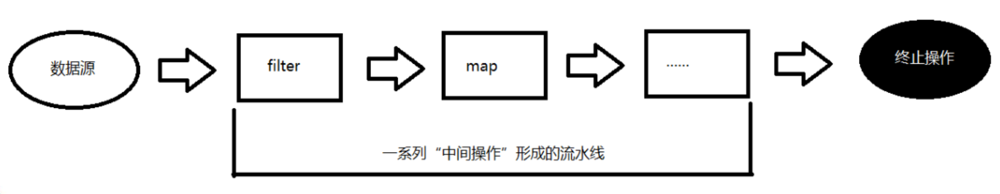

# 05. Stream API

- 笔记本：Java8 新特性
- 创建时间：2021-01-24 06:14:37 UTC
- 更新时间：2021-01-25 03:35:57 UTC
- 印象笔记 GUID：bcfde695-6ef0-4b10-8c03-3db7102df0a6

## Stream API

### 了解 Stream

Java8中有两大最为重要的改变。第一个是 Lambda 表达式;另外一个则是 Stream API(java.util.stream.*)。Stream 是 Java8 中处理集合的关键抽象概念，它可以指定你希望对集合进行的操作，可以执行非常复杂的查找、过滤和映射数据等操作。 使用 Stream API 对集合数据进行操作，就类似于使用 SQL 执行的数据库查询。也可以使用 Stream API 来并行执行操作。简而言之，Stream API 提供了一种高效且易于使用的处理数据的方式。

### 什么是 Stream

是数据渠道，用于操作数据源(集合、数组等)所生成的元素序列。
 **“集合讲的是数据，流讲的是计算!”**
 **注意:**
 1⃣️ Stream 自己不会存储元素。
 2⃣️ Stream 不会改变源对象。相反，他们会返回一个持有结果的新Stream。
 3⃣️ Stream 操作是延迟执行的。这意味着他们会等到需要结果的时候才执行。

### Stream 的操作三个步骤

- 创建 Stream
 一个数据源(如:集合、数组)，获取一个流

- 中间操作
 一个中间操作链，对数据源的数据进行处理

- 终止操作(终端操作)
 一个终止操作，执行中间操作链，并产生结果
 

#### 1. 创建 Stream

1. Java8 中的 Collection 接口被扩展，提供了两个获取流的方法:

- `default Stream<E> stream()` : 返回一个顺序流

- `default Stream<E> parallelStream()` : 返回一个并行流

1. 由数组流创建
 Java8 中的 Arrays 的静态方法 stream() 可 以获取数组流:

- `static <T> Stream<T> stream(T[] array)`: 返回一个流

- `public static IntStream stream(int[] array)`

- `public static LongStream stream(long[] array)`

- `public static DoubleStream stream(double[] array)`

1. 由值创建流
 可以使用静态方法 Stream.of(), 通过显示值 创建一个流。它可以接收任意数量的参数。

- `public static<T> Stream<T> of(T... values)` : 返回一个流

1. 由函数创建流：创建无限流
 可以使用静态方法 `Stream.iterate()` 和 `Stream.generate()`, 创建无限流。

- 迭代 `public static<T> Stream<T> iterate(final T seed, final UnaryOperator<T> f)`

- 生成 `public static<T> Stream<T> generate(Supplier<T> s)`

**创建流的四种方式：**

```
@Test
public void test1() {
    List<String> list = new ArrayList<>();
    // 1. 可以通过 Collection 系列集合提供的 stream() 或 paralleStream()
    Stream<String> stream1 = list.stream();

    Employee[] emps = new Employee[10];
    // 2. 通过 Arrays 中的静态方法 stream() 获取数组流
    Stream<Employee> stream2 = Arrays.stream(emps);

    // 3. 通过 Stream 类中的静态方法 of()
    Stream<String> stream3 = Stream.of("aa", "bb", "cc");

    // 4. 创建无限流
    // 4.1. 迭代
    Stream<Integer> stream4 = Stream.iterate(0, (x) -> x + 2);
    stream4.forEach(System.out::println);

    // 4.2. 生成
    Stream.generate(() ->  Math.random())
            .limit(10)
            .forEach(System.out::println);
}

```

#### 2. Stream 的中间操作

多个中间操作可以连接起来形成一个流水线，除非流水 线上触发终止操作，否则中间操作不会执行任何的处理! 而在终止操作时一次性全部处理，称为 **“惰性求值”**

##### 筛选与切片

 | 方法 | 描述
 | `filter(Predicate p)` | 接收 Lambda，从流中排除某些元素
 | `distinct()` | 筛选，通过流所生成元素的 hashCode() 和 equals() 去除重复元素
 | `limit(long maxSize)` | 截断流，使其元素不超过给定数量
 | `skip(long n)` | 跳过元素，返回一个扔掉了前 n 个元素的流。若流中元素不足 n 个，则返回一个空流。与 limit(n) 互补

**eg：**

```
@Test
public void test1() {
    Stream<Employee> stream = employees.stream()
            .filter((emp) -> {
                System.out.println("Stream API 的中间操作");
                return emp.getAge() > 35;
            })
            .distinct() // 筛选，通过流所生成的 hashCode() 和 equals() 去除重复元素（对于自定义对象需要重写这两个方法）
            .skip(1)
            .limit(2);   // 短路，得到三个满足条件的数据后，后续的迭代操作不再运行了

    stream.forEach(System.out::println);    // 注释掉这句话，上面 stream 中的sout 并没有输出（惰性求值）
}

```

##### 映射

 | 方法 | 描述
 | `map(Function f)` | 接收一个函数作为参数，该函数会被应用到每个元素上，并将其映射成一个新的元素。
 | `mapToDouble(ToDoubleFunction f)` | 接收一个函数作为参数，该函数会被应用到每个元素上，产生一个新的 DoubleStream。
 | `mapToInt(ToIntFunction f)` | 接收一个函数作为参数，该函数会被应用到每个元素上，产生一个新的 IntStream。
 | `mapToLong(ToLongFunction f)` | 接收一个函数作为参数，该函数会被应用到每个元素上，产生一个新的 LongStream。
 | `flatMap(Function f)` | 接收一个函数作为参数，将流中的每个值都换成另一个流，然后把所有流连接成一个流

**eg：**

```
@Test
public void test2() {   // map 是把整个流添加到流中，flatMap是把流中的每个元素加到流中。类似 List 的 add 和 addAll 的区别
    List<String> list = Arrays.asList("aaa", "bbb", "ccc", "ddd", "eee");
    list.stream()
            .map((str) -> str.toUpperCase(Locale.ROOT))
            .forEach(System.out::println);
    System.out.println("--------------------------------");
    employees.stream()
            .map(Employee::getName)
            .forEach(System.out::println);
    System.out.println("--------------------------------");
    Stream<Stream<Character>> stream = list.stream()
            .map(TestStreamApi2::filterCharacter);  // { {a, a, a}, {b, b, b}, ...}
    stream.forEach((sm) -> {
        sm.forEach(System.out::println);
    });
    System.out.println("--------------------------------");
    Stream<Character> characterStream = list.stream()
            .flatMap(TestStreamApi2::filterCharacter);  // {a,a,a,b,b,b,...}
    characterStream.forEach(System.out::println);
}
public static Stream<Character> filterCharacter(String str) {
    List<Character> list = new ArrayList<>();
    for (char ch : str.toCharArray()) {
        list.add(ch);
    }
    return list.stream();
}

```

##### 排序

 | 方法 | 描述
 | `sorted()` | 产生一个新流，其中按自然顺序排序
 | `sorted(Comparator comp)` | 产生一个新流，其中按比较器顺序排序

**eg：**

```
@Test
public void test3() {
    List<String> list = Arrays.asList("bbb", "aaa", "ddd", "ccc", "eee");
    list.stream()
            .sorted()   // 按照 Comparable 排序
            .forEach(System.out::println);
    System.out.println("--------------------------------");
    employees.stream()
            .sorted((e1, e2) -> {       // 按照 Comparator 定制排序
                if (e1.getAge() == e2.getAge()) {
                    return e1.getName().compareTo(e2.getName());
                } else {
                    return Integer.compare(e1.getAge(), e2.getAge());
                }
            })
            .forEach(System.out::println);
}

```

#### 3. Stream 的终止操作

终端操作会从流的流水线生成结果。其结果可以是任何不是流的值，例如: List、Integer，甚至是 void 。

##### 查找与匹配

 | 方法 | 描述
 | `allMatch(Predicate p)` | 检查是否匹配所有元素
 | `anyMatch(Predicate p)` | 检查是否至少匹配一个元素
 | `noneMatch(Predicate p)` | 检查是否没有匹配所有元素
 | `findFirst()` | 返回第一个元素
 | `findAny()` | 返回当前流中的任意元素
 | `count()` | 返回流中元素总数
 | `max(Comparator c)` | 返回流中最大值
 | `min(Comparator c)` | 返回流中最小值
 | `forEach(Consumer c)` | 内部迭代(使用 Collection 接口需要用户去做迭 代，称为外部迭代。相反，Stream API 使用内部 迭代——它帮你把迭代做了)

**eg：**

```
@Test
public void test1() {
    boolean b1 = employees.stream()
            .allMatch((e) -> e.getStatus().equals(Employee.Status.BUSY));   // 检查是否匹配所有元素
    System.out.println(b1);
    boolean b2 = employees.stream()
            .anyMatch((e) -> e.getStatus().equals(Employee.Status.BUSY));   // 检查是否至少匹配一个元素
    System.out.println(b2);
    boolean b3 = employees.stream()
            .noneMatch((e) -> e.getStatus().equals(Employee.Status.BUSY));   // 检查是否没有匹配所有元素
    System.out.println(b3);
    Optional<Employee> first = employees.stream()
            .sorted((e1, e2) -> Double.compare(e2.getSalary(), e1.getSalary()))
            .findFirst();       // 返回第一个元素(当调用的方法返回的结果有可能为空时，会把结果封装到 Optional 中，避免空指针异常)
    System.out.println(first.get());
    System.out.println(employees.parallelStream()
            .filter((e) -> e.getStatus().equals(Employee.Status.FREE))
            .findAny().get());  // 返回当前流中的任意元素
    System.out.println(employees.stream().count()); // 返回流中元素的总个数
    System.out.println(employees.stream()
            .max((e1, e2) -> Double.compare(e1.getSalary(), e2.getSalary())).get());    // 返回流中的最大值
    System.out.println(employees.stream()
            .map(Employee::getSalary)
                .min(Double::compare)       // 返回流中的最小值
            .get());
}

```

##### 归约

 | 方法 | 描述
 | `reduce(T iden, BinaryOperator b)` | 可以将流中元素反复结合起来，得到一个值。 返回 T
 | `reduce(BinaryOperator b)` | 可以将流中元素反复结合起来，得到一个值。 返回 Optional<T>

**eg：**

```
@Test
public void test2() {
    List<Integer> list = Arrays.asList(1,2,3,4,5,6,7,8,9,10);

    System.out.println(list.stream()
            .reduce(0, (x, y) -> x + y));   // 先把 reduce 的第一个参数作为x，流中取的第一个元素作为y，运算后，结果再作为x，流中取出y运算...
    System.out.println("-----------------");
    // eg：计算所有人工资总和
    System.out.println(employees.stream()
            .map(Employee::getSalary)
            .reduce(Double::sum).get());    // reduce(BinaryOperator) 返回值为封装在 Optional 中。因为没有指定起始值，可能为null
}

```

##### 收集

 | 方法 | 描述
 | `collect(Collector c)` | 将流转换为其他形式。接收一个 Collector接口的 实现，用于给Stream中元素做汇总的方法

Collector 接口中方法的实现决定了如何对流执行收集操作(如收 集到 List、Set、Map)。但是 Collectors 实用类提供了很多静态方法，可以方便地创建常见收集器实例，具体方法与实例如下表:

 | 方法 | 返回类型 | 作用 | eg
 | toList | List<T> | 把流中元素收集到List | `List<Employee> emps= list.stream().collect(Collectors.toList());`
 | toSet | Set<T> | 把流中元素收集到Set | `Set<Employee> emps= list.stream().collect(Collectors.toSet());`
 | toCollection | Collection<T> | 把流中元素收集到创建的集合 | `Collection<Employee>emps=list.stream().collect(Collectors.toCollection(ArrayList::new));`
 | counting | Long | 计算流中元素的个数 | `long count = list.stream().collect(Collectors.counting());`
 | summingInt | Integer | 对流中元素的整数属性求和 | `int total=list.stream().collect(Collectors.summingInt(Employee::getSalary));`
 | averagingInt | Double | 计算流中元素Integer属性的平均值 | `double avg= list.stream().collect(Collectors.averagingInt(Employee::getSalary));`
 | summarizingInt | IntSummaryStatistics | 收集流中Integer属性的统计值。如:平均值 | `Int SummaryStatisticsiss= list.stream().collect(Collectors.summarizingInt(Employee::getSalary));`
 | join | String | 连接流中每个字符串 | `String str= list.stream().map(Employee::getName).collect(Collectors.joining());`
 | maxBy | Optional<T> | 根据比较器选择最大值 | `Optional<Emp> max= list.stream().collect(Collectors.maxBy(comparingInt(Employee::getSalary)));`
 | minBy | Optional<T> | 根据比较器选择最小值 | `Optional<Emp> min= list.stream().collect(Collectors.minBy(comparingInt(Employee::getSalary)));`
 | reducing | 归约产生的类型 | 从一个作为累加器的初始值开始，利用BinaryOperator与流中元素逐个结合，从而归约成单个值 | `int total=list.stream().collect(Collectors.reducing(0, Employee::getSalar, Integer::sum));`
 | collectingAndThen | 转换函数返回的类型 | 包裹另一个收集器，对其结果转换函数 | `int thow= list.stream().collect(Collectors.collectingAndThen(Collectors.toList(), List::size));`
 | groupingBy | Map<K, List<T>> | 根据某属性值对流分组，属性为K，结果为V | `Map<Emp.Status, List<Emp>> map= list.stream().collect(Collectors.groupingBy(Employee::getStatus));`
 | partitioningBy | Map<Boolean, List<T>> | 根据true或false进行分区 | `Map<Boolean,List<Emp>> vd= list.stream().collect(Collectors.partitioningBy(Employee::getManage));`

**eg：**

```
public class TestStreamApi3 {
    // 收集：Collect - 将流转换为其他形式，接收一个 Collector 接口的实现，用于给 Stream 中元素做汇总的方法
    @Test
    public void test3() {
        employees.stream()
                .map(Employee::getName)
                .collect(Collectors.toList())
                .forEach(System.out::println);
        System.out.println("------------------");
        employees.stream()
                .map(Employee::getName)
                .collect(Collectors.toSet())
                .forEach(System.out::println);
        System.out.println("------------------");
        employees.stream()
                .map(Employee::getName)
                .collect(Collectors.toCollection(HashSet::new)) // HashSet
                .forEach(System.out::println);
        System.out.println("------------------");
    }
    @Test
    public void test4() {
        System.out.println(employees.stream()
                .collect(Collectors.counting()));   // 总数
        System.out.println("------------------");
        System.out.println(employees.stream()
                .collect(Collectors.averagingDouble(Employee::getSalary))); // 平均值
        System.out.println(employees.stream()
                .collect(Collectors.summingDouble(Employee::getSalary)));   // 总和
        System.out.println(employees.stream()
                .collect(Collectors.maxBy((e1, e2) -> Double.compare(e1.getSalary(), e2.getSalary()))).get());// 最大值
        System.out.println(employees.stream()
                .map(Employee::getSalary)
                .collect(Collectors.minBy(Double::compare)).get()); // 最小值
    }
    @Test
    public void test5() {
        Map<Employee.Status, List<Employee>> collect = employees.stream()
                .collect(Collectors.groupingBy(Employee::getStatus));   // 分组
        System.out.println(collect);
        System.out.println("------------------");
        Map<Employee.Status, Map<String, List<Employee>>> collect1 = employees.stream()
                .collect(Collectors.groupingBy(Employee::getStatus, Collectors.groupingBy((e) -> {  // 多级分组
                    if (e.getAge() <= 35) {
                        return "青年";
                    } else if (e.getAge() <= 50) {
                        return "中年";
                    } else {
                        return "老年";
                    }
                })));
        System.out.println(collect1);
    }
    @Test
    public void test6() {
        Map<Boolean, List<Employee>> collect = employees.stream()
                .collect(Collectors.partitioningBy((e) -> e.getSalary() > 8000));   // 分区
        System.out.println(collect);
    }
    @Test
    public void test7() {
        DoubleSummaryStatistics collect = employees.stream()
                .collect(Collectors.summarizingDouble(Employee::getSalary));    // 收集流中的统计值
        System.out.println(collect.getAverage());
        System.out.println(collect.getSum());
        System.out.println(collect.getMax());
    }
    @Test
    public void test8() {
        String nameStr = employees.stream()
                .map(Employee::getName)
                .collect(Collectors.joining(","));  // 连接流中每个字符串
        System.out.println(nameStr);
    }
}

```

#### 练习题

1. 给定一个数字列表，返回一个由每个数的平方构成的列表

```
Integer[] nums = new Integer[]{1, 2, 3, 4, 5};
Arrays.stream(nums)
        .map((x) -> x * x)
        .forEach(System.out::println);

```

1. 使用 map 和 reduce 方法获取流中 Employee 个数

```
Integer count = employees.stream()
        .map((e) -> 1)
        .reduce(Integer::sum).get();

```

%23%23%20Stream%20API%0A%23%23%23%20%E4%BA%86%E8%A7%A3%20Stream%0AJava8%E4%B8%AD%E6%9C%89%E4%B8%A4%E5%A4%A7%E6%9C%80%E4%B8%BA%E9%87%8D%E8%A6%81%E7%9A%84%E6%94%B9%E5%8F%98%E3%80%82%E7%AC%AC%E4%B8%80%E4%B8%AA%E6%98%AF%20Lambda%20%E8%A1%A8%E8%BE%BE%E5%BC%8F%3B%E5%8F%A6%E5%A4%96%E4%B8%80%E4%B8%AA%E5%88%99%E6%98%AF%20Stream%20API(java.util.stream.%5C*)%E3%80%82Stream%20%E6%98%AF%20Java8%20%E4%B8%AD%E5%A4%84%E7%90%86%E9%9B%86%E5%90%88%E7%9A%84%E5%85%B3%E9%94%AE%E6%8A%BD%E8%B1%A1%E6%A6%82%E5%BF%B5%EF%BC%8C%E5%AE%83%E5%8F%AF%E4%BB%A5%E6%8C%87%E5%AE%9A%E4%BD%A0%E5%B8%8C%E6%9C%9B%E5%AF%B9%E9%9B%86%E5%90%88%E8%BF%9B%E8%A1%8C%E7%9A%84%E6%93%8D%E4%BD%9C%EF%BC%8C%E5%8F%AF%E4%BB%A5%E6%89%A7%E8%A1%8C%E9%9D%9E%E5%B8%B8%E5%A4%8D%E6%9D%82%E7%9A%84%E6%9F%A5%E6%89%BE%E3%80%81%E8%BF%87%E6%BB%A4%E5%92%8C%E6%98%A0%E5%B0%84%E6%95%B0%E6%8D%AE%E7%AD%89%E6%93%8D%E4%BD%9C%E3%80%82%20%E4%BD%BF%E7%94%A8%20Stream%20API%20%E5%AF%B9%E9%9B%86%E5%90%88%E6%95%B0%E6%8D%AE%E8%BF%9B%E8%A1%8C%E6%93%8D%E4%BD%9C%EF%BC%8C%E5%B0%B1%E7%B1%BB%E4%BC%BC%E4%BA%8E%E4%BD%BF%E7%94%A8%20SQL%20%E6%89%A7%E8%A1%8C%E7%9A%84%E6%95%B0%E6%8D%AE%E5%BA%93%E6%9F%A5%E8%AF%A2%E3%80%82%E4%B9%9F%E5%8F%AF%E4%BB%A5%E4%BD%BF%E7%94%A8%20Stream%20API%20%E6%9D%A5%E5%B9%B6%E8%A1%8C%E6%89%A7%E8%A1%8C%E6%93%8D%E4%BD%9C%E3%80%82%E7%AE%80%E8%80%8C%E8%A8%80%E4%B9%8B%EF%BC%8CStream%20API%20%E6%8F%90%E4%BE%9B%E4%BA%86%E4%B8%80%E7%A7%8D%E9%AB%98%E6%95%88%E4%B8%94%E6%98%93%E4%BA%8E%E4%BD%BF%E7%94%A8%E7%9A%84%E5%A4%84%E7%90%86%E6%95%B0%E6%8D%AE%E7%9A%84%E6%96%B9%E5%BC%8F%E3%80%82%0A%0A%0A%23%23%23%20%E4%BB%80%E4%B9%88%E6%98%AF%20Stream%0A%E6%98%AF%E6%95%B0%E6%8D%AE%E6%B8%A0%E9%81%93%EF%BC%8C%E7%94%A8%E4%BA%8E%E6%93%8D%E4%BD%9C%E6%95%B0%E6%8D%AE%E6%BA%90(%E9%9B%86%E5%90%88%E3%80%81%E6%95%B0%E7%BB%84%E7%AD%89)%E6%89%80%E7%94%9F%E6%88%90%E7%9A%84%E5%85%83%E7%B4%A0%E5%BA%8F%E5%88%97%E3%80%82%0A**%E2%80%9C%E9%9B%86%E5%90%88%E8%AE%B2%E7%9A%84%E6%98%AF%E6%95%B0%E6%8D%AE%EF%BC%8C%E6%B5%81%E8%AE%B2%E7%9A%84%E6%98%AF%E8%AE%A1%E7%AE%97!%E2%80%9D**%0A**%E6%B3%A8%E6%84%8F%3A**%0A1%E2%83%A3%EF%B8%8F%20Stream%20%E8%87%AA%E5%B7%B1%E4%B8%8D%E4%BC%9A%E5%AD%98%E5%82%A8%E5%85%83%E7%B4%A0%E3%80%82%0A2%E2%83%A3%EF%B8%8F%20Stream%20%E4%B8%8D%E4%BC%9A%E6%94%B9%E5%8F%98%E6%BA%90%E5%AF%B9%E8%B1%A1%E3%80%82%E7%9B%B8%E5%8F%8D%EF%BC%8C%E4%BB%96%E4%BB%AC%E4%BC%9A%E8%BF%94%E5%9B%9E%E4%B8%80%E4%B8%AA%E6%8C%81%E6%9C%89%E7%BB%93%E6%9E%9C%E7%9A%84%E6%96%B0Stream%E3%80%82%0A3%E2%83%A3%EF%B8%8F%20Stream%20%E6%93%8D%E4%BD%9C%E6%98%AF%E5%BB%B6%E8%BF%9F%E6%89%A7%E8%A1%8C%E7%9A%84%E3%80%82%E8%BF%99%E6%84%8F%E5%91%B3%E7%9D%80%E4%BB%96%E4%BB%AC%E4%BC%9A%E7%AD%89%E5%88%B0%E9%9C%80%E8%A6%81%E7%BB%93%E6%9E%9C%E7%9A%84%E6%97%B6%E5%80%99%E6%89%8D%E6%89%A7%E8%A1%8C%E3%80%82%0A%0A%23%23%23%20Stream%20%E7%9A%84%E6%93%8D%E4%BD%9C%E4%B8%89%E4%B8%AA%E6%AD%A5%E9%AA%A4%0A-%20%E5%88%9B%E5%BB%BA%20Stream%0A%E4%B8%80%E4%B8%AA%E6%95%B0%E6%8D%AE%E6%BA%90(%E5%A6%82%3A%E9%9B%86%E5%90%88%E3%80%81%E6%95%B0%E7%BB%84)%EF%BC%8C%E8%8E%B7%E5%8F%96%E4%B8%80%E4%B8%AA%E6%B5%81%0A-%20%E4%B8%AD%E9%97%B4%E6%93%8D%E4%BD%9C%0A%E4%B8%80%E4%B8%AA%E4%B8%AD%E9%97%B4%E6%93%8D%E4%BD%9C%E9%93%BE%EF%BC%8C%E5%AF%B9%E6%95%B0%E6%8D%AE%E6%BA%90%E7%9A%84%E6%95%B0%E6%8D%AE%E8%BF%9B%E8%A1%8C%E5%A4%84%E7%90%86%0A-%20%E7%BB%88%E6%AD%A2%E6%93%8D%E4%BD%9C(%E7%BB%88%E7%AB%AF%E6%93%8D%E4%BD%9C)%0A%E4%B8%80%E4%B8%AA%E7%BB%88%E6%AD%A2%E6%93%8D%E4%BD%9C%EF%BC%8C%E6%89%A7%E8%A1%8C%E4%B8%AD%E9%97%B4%E6%93%8D%E4%BD%9C%E9%93%BE%EF%BC%8C%E5%B9%B6%E4%BA%A7%E7%94%9F%E7%BB%93%E6%9E%9C%0A!%5B017c911b61ebd012b038dd8a83b149a3.png%5D(evernotecid%3A%2F%2F90F5C43D-AEAE-49B2-85BB-D02B6A52C764%2Fappyinxiangcom%2F25356149%2FENResource%2Fp1609)%0A%0A%23%23%23%23%201.%20%E5%88%9B%E5%BB%BA%20Stream%0A1.%20Java8%20%E4%B8%AD%E7%9A%84%20Collection%20%E6%8E%A5%E5%8F%A3%E8%A2%AB%E6%89%A9%E5%B1%95%EF%BC%8C%E6%8F%90%E4%BE%9B%E4%BA%86%E4%B8%A4%E4%B8%AA%E8%8E%B7%E5%8F%96%E6%B5%81%E7%9A%84%E6%96%B9%E6%B3%95%3A%0A-%20%60default%20Stream%3CE%3E%20stream()%60%20%3A%20%E8%BF%94%E5%9B%9E%E4%B8%80%E4%B8%AA%E9%A1%BA%E5%BA%8F%E6%B5%81%0A-%20%60default%20Stream%3CE%3E%20parallelStream()%60%20%3A%20%E8%BF%94%E5%9B%9E%E4%B8%80%E4%B8%AA%E5%B9%B6%E8%A1%8C%E6%B5%81%0A2.%20%E7%94%B1%E6%95%B0%E7%BB%84%E6%B5%81%E5%88%9B%E5%BB%BA%0AJava8%20%E4%B8%AD%E7%9A%84%20Arrays%20%E7%9A%84%E9%9D%99%E6%80%81%E6%96%B9%E6%B3%95%20stream()%20%E5%8F%AF%20%E4%BB%A5%E8%8E%B7%E5%8F%96%E6%95%B0%E7%BB%84%E6%B5%81%3A%0A-%20%60static%20%3CT%3E%20Stream%3CT%3E%20stream(T%5B%5D%20array)%60%3A%20%E8%BF%94%E5%9B%9E%E4%B8%80%E4%B8%AA%E6%B5%81%0A-%20%60public%20static%20IntStream%20stream(int%5B%5D%20array)%60%0A-%20%60public%20static%20LongStream%20stream(long%5B%5D%20array)%60%0A-%20%60public%20static%20DoubleStream%20stream(double%5B%5D%20array)%60%0A3.%20%E7%94%B1%E5%80%BC%E5%88%9B%E5%BB%BA%E6%B5%81%0A%E5%8F%AF%E4%BB%A5%E4%BD%BF%E7%94%A8%E9%9D%99%E6%80%81%E6%96%B9%E6%B3%95%20Stream.of()%2C%20%E9%80%9A%E8%BF%87%E6%98%BE%E7%A4%BA%E5%80%BC%20%E5%88%9B%E5%BB%BA%E4%B8%80%E4%B8%AA%E6%B5%81%E3%80%82%E5%AE%83%E5%8F%AF%E4%BB%A5%E6%8E%A5%E6%94%B6%E4%BB%BB%E6%84%8F%E6%95%B0%E9%87%8F%E7%9A%84%E5%8F%82%E6%95%B0%E3%80%82%0A-%20%60public%20static%3CT%3E%20Stream%3CT%3E%20of(T...%20values)%60%20%3A%20%E8%BF%94%E5%9B%9E%E4%B8%80%E4%B8%AA%E6%B5%81%0A4.%20%E7%94%B1%E5%87%BD%E6%95%B0%E5%88%9B%E5%BB%BA%E6%B5%81%EF%BC%9A%E5%88%9B%E5%BB%BA%E6%97%A0%E9%99%90%E6%B5%81%0A%E5%8F%AF%E4%BB%A5%E4%BD%BF%E7%94%A8%E9%9D%99%E6%80%81%E6%96%B9%E6%B3%95%20%60Stream.iterate()%60%20%E5%92%8C%20%60Stream.generate()%60%2C%20%E5%88%9B%E5%BB%BA%E6%97%A0%E9%99%90%E6%B5%81%E3%80%82%0A-%20%E8%BF%AD%E4%BB%A3%20%60public%20static%3CT%3E%20Stream%3CT%3E%20iterate(final%20T%20seed%2C%20final%20UnaryOperator%3CT%3E%20f)%60%0A-%20%E7%94%9F%E6%88%90%20%60public%20static%3CT%3E%20Stream%3CT%3E%20generate(Supplier%3CT%3E%20s)%60%0A%0A**%E5%88%9B%E5%BB%BA%E6%B5%81%E7%9A%84%E5%9B%9B%E7%A7%8D%E6%96%B9%E5%BC%8F%EF%BC%9A**%0A%60%60%60java%0A%40Test%0Apublic%20void%20test1()%20%7B%0A%20%20%20%20List%3CString%3E%20list%20%3D%20new%20ArrayList%3C%3E()%3B%0A%20%20%20%20%2F%2F%201.%20%E5%8F%AF%E4%BB%A5%E9%80%9A%E8%BF%87%20Collection%20%E7%B3%BB%E5%88%97%E9%9B%86%E5%90%88%E6%8F%90%E4%BE%9B%E7%9A%84%20stream()%20%E6%88%96%20paralleStream()%0A%20%20%20%20Stream%3CString%3E%20stream1%20%3D%20list.stream()%3B%0A%0A%20%20%20%20Employee%5B%5D%20emps%20%3D%20new%20Employee%5B10%5D%3B%0A%20%20%20%20%2F%2F%202.%20%E9%80%9A%E8%BF%87%20Arrays%20%E4%B8%AD%E7%9A%84%E9%9D%99%E6%80%81%E6%96%B9%E6%B3%95%20stream()%20%E8%8E%B7%E5%8F%96%E6%95%B0%E7%BB%84%E6%B5%81%0A%20%20%20%20Stream%3CEmployee%3E%20stream2%20%3D%20Arrays.stream(emps)%3B%0A%0A%20%20%20%20%2F%2F%203.%20%E9%80%9A%E8%BF%87%20Stream%20%E7%B1%BB%E4%B8%AD%E7%9A%84%E9%9D%99%E6%80%81%E6%96%B9%E6%B3%95%20of()%0A%20%20%20%20Stream%3CString%3E%20stream3%20%3D%20Stream.of(%22aa%22%2C%20%22bb%22%2C%20%22cc%22)%3B%0A%0A%20%20%20%20%2F%2F%204.%20%E5%88%9B%E5%BB%BA%E6%97%A0%E9%99%90%E6%B5%81%0A%20%20%20%20%2F%2F%204.1.%20%E8%BF%AD%E4%BB%A3%0A%20%20%20%20Stream%3CInteger%3E%20stream4%20%3D%20Stream.iterate(0%2C%20(x)%20-%3E%20x%20%2B%202)%3B%0A%20%20%20%20stream4.forEach(System.out%3A%3Aprintln)%3B%0A%0A%20%20%20%20%2F%2F%204.2.%20%E7%94%9F%E6%88%90%0A%20%20%20%20Stream.generate(()%20-%3E%20%20Math.random())%0A%20%20%20%20%20%20%20%20%20%20%20%20.limit(10)%0A%20%20%20%20%20%20%20%20%20%20%20%20.forEach(System.out%3A%3Aprintln)%3B%0A%7D%0A%60%60%60%0A%0A%23%23%23%23%202.%20Stream%20%E7%9A%84%E4%B8%AD%E9%97%B4%E6%93%8D%E4%BD%9C%0A%E5%A4%9A%E4%B8%AA%E4%B8%AD%E9%97%B4%E6%93%8D%E4%BD%9C%E5%8F%AF%E4%BB%A5%E8%BF%9E%E6%8E%A5%E8%B5%B7%E6%9D%A5%E5%BD%A2%E6%88%90%E4%B8%80%E4%B8%AA%E6%B5%81%E6%B0%B4%E7%BA%BF%EF%BC%8C%E9%99%A4%E9%9D%9E%E6%B5%81%E6%B0%B4%20%E7%BA%BF%E4%B8%8A%E8%A7%A6%E5%8F%91%E7%BB%88%E6%AD%A2%E6%93%8D%E4%BD%9C%EF%BC%8C%E5%90%A6%E5%88%99%E4%B8%AD%E9%97%B4%E6%93%8D%E4%BD%9C%E4%B8%8D%E4%BC%9A%E6%89%A7%E8%A1%8C%E4%BB%BB%E4%BD%95%E7%9A%84%E5%A4%84%E7%90%86!%20%E8%80%8C%E5%9C%A8%E7%BB%88%E6%AD%A2%E6%93%8D%E4%BD%9C%E6%97%B6%E4%B8%80%E6%AC%A1%E6%80%A7%E5%85%A8%E9%83%A8%E5%A4%84%E7%90%86%EF%BC%8C%E7%A7%B0%E4%B8%BA%20**%E2%80%9C%E6%83%B0%E6%80%A7%E6%B1%82%E5%80%BC%E2%80%9D**%0A%0A%23%23%23%23%23%20%E7%AD%9B%E9%80%89%E4%B8%8E%E5%88%87%E7%89%87%0A%E6%96%B9%E6%B3%95%20%7C%20%E6%8F%8F%E8%BF%B0%0A---%20%7C%20---%0A%60filter(Predicate%20p)%60%20%7C%20%E6%8E%A5%E6%94%B6%20Lambda%EF%BC%8C%E4%BB%8E%E6%B5%81%E4%B8%AD%E6%8E%92%E9%99%A4%E6%9F%90%E4%BA%9B%E5%85%83%E7%B4%A0%0A%60distinct()%60%20%7C%20%E7%AD%9B%E9%80%89%EF%BC%8C%E9%80%9A%E8%BF%87%E6%B5%81%E6%89%80%E7%94%9F%E6%88%90%E5%85%83%E7%B4%A0%E7%9A%84%20hashCode()%20%E5%92%8C%20%20equals()%20%E5%8E%BB%E9%99%A4%E9%87%8D%E5%A4%8D%E5%85%83%E7%B4%A0%0A%60limit(long%20maxSize)%60%20%7C%20%E6%88%AA%E6%96%AD%E6%B5%81%EF%BC%8C%E4%BD%BF%E5%85%B6%E5%85%83%E7%B4%A0%E4%B8%8D%E8%B6%85%E8%BF%87%E7%BB%99%E5%AE%9A%E6%95%B0%E9%87%8F%0A%60skip(long%20n)%60%20%7C%20%E8%B7%B3%E8%BF%87%E5%85%83%E7%B4%A0%EF%BC%8C%E8%BF%94%E5%9B%9E%E4%B8%80%E4%B8%AA%E6%89%94%E6%8E%89%E4%BA%86%E5%89%8D%20n%20%E4%B8%AA%E5%85%83%E7%B4%A0%E7%9A%84%E6%B5%81%E3%80%82%E8%8B%A5%E6%B5%81%E4%B8%AD%E5%85%83%E7%B4%A0%E4%B8%8D%E8%B6%B3%20n%20%E4%B8%AA%EF%BC%8C%E5%88%99%E8%BF%94%E5%9B%9E%E4%B8%80%E4%B8%AA%E7%A9%BA%E6%B5%81%E3%80%82%E4%B8%8E%20limit(n)%20%E4%BA%92%E8%A1%A5%0A**eg%EF%BC%9A**%0A%60%60%60java%0A%40Test%0Apublic%20void%20test1()%20%7B%0A%20%20%20%20Stream%3CEmployee%3E%20stream%20%3D%20employees.stream()%0A%20%20%20%20%20%20%20%20%20%20%20%20.filter((emp)%20-%3E%20%7B%0A%20%20%20%20%20%20%20%20%20%20%20%20%20%20%20%20System.out.println(%22Stream%20API%20%E7%9A%84%E4%B8%AD%E9%97%B4%E6%93%8D%E4%BD%9C%22)%3B%0A%20%20%20%20%20%20%20%20%20%20%20%20%20%20%20%20return%20emp.getAge()%20%3E%2035%3B%0A%20%20%20%20%20%20%20%20%20%20%20%20%7D)%0A%20%20%20%20%20%20%20%20%20%20%20%20.distinct()%20%2F%2F%20%E7%AD%9B%E9%80%89%EF%BC%8C%E9%80%9A%E8%BF%87%E6%B5%81%E6%89%80%E7%94%9F%E6%88%90%E7%9A%84%20hashCode()%20%E5%92%8C%20equals()%20%E5%8E%BB%E9%99%A4%E9%87%8D%E5%A4%8D%E5%85%83%E7%B4%A0%EF%BC%88%E5%AF%B9%E4%BA%8E%E8%87%AA%E5%AE%9A%E4%B9%89%E5%AF%B9%E8%B1%A1%E9%9C%80%E8%A6%81%E9%87%8D%E5%86%99%E8%BF%99%E4%B8%A4%E4%B8%AA%E6%96%B9%E6%B3%95%EF%BC%89%0A%20%20%20%20%20%20%20%20%20%20%20%20.skip(1)%0A%20%20%20%20%20%20%20%20%20%20%20%20.limit(2)%3B%20%20%20%2F%2F%20%E7%9F%AD%E8%B7%AF%EF%BC%8C%E5%BE%97%E5%88%B0%E4%B8%89%E4%B8%AA%E6%BB%A1%E8%B6%B3%E6%9D%A1%E4%BB%B6%E7%9A%84%E6%95%B0%E6%8D%AE%E5%90%8E%EF%BC%8C%E5%90%8E%E7%BB%AD%E7%9A%84%E8%BF%AD%E4%BB%A3%E6%93%8D%E4%BD%9C%E4%B8%8D%E5%86%8D%E8%BF%90%E8%A1%8C%E4%BA%86%0A%0A%20%20%20%20stream.forEach(System.out%3A%3Aprintln)%3B%20%20%20%20%2F%2F%20%E6%B3%A8%E9%87%8A%E6%8E%89%E8%BF%99%E5%8F%A5%E8%AF%9D%EF%BC%8C%E4%B8%8A%E9%9D%A2%20stream%20%E4%B8%AD%E7%9A%84sout%20%E5%B9%B6%E6%B2%A1%E6%9C%89%E8%BE%93%E5%87%BA%EF%BC%88%E6%83%B0%E6%80%A7%E6%B1%82%E5%80%BC%EF%BC%89%0A%7D%0A%60%60%60%0A%0A%23%23%23%23%23%20%E6%98%A0%E5%B0%84%0A%E6%96%B9%E6%B3%95%20%7C%20%E6%8F%8F%E8%BF%B0%0A---%20%7C%20---%0A%60map(Function%20f)%60%20%7C%20%E6%8E%A5%E6%94%B6%E4%B8%80%E4%B8%AA%E5%87%BD%E6%95%B0%E4%BD%9C%E4%B8%BA%E5%8F%82%E6%95%B0%EF%BC%8C%E8%AF%A5%E5%87%BD%E6%95%B0%E4%BC%9A%E8%A2%AB%E5%BA%94%E7%94%A8%E5%88%B0%E6%AF%8F%E4%B8%AA%E5%85%83%E7%B4%A0%E4%B8%8A%EF%BC%8C%E5%B9%B6%E5%B0%86%E5%85%B6%E6%98%A0%E5%B0%84%E6%88%90%E4%B8%80%E4%B8%AA%E6%96%B0%E7%9A%84%E5%85%83%E7%B4%A0%E3%80%82%0A%60mapToDouble(ToDoubleFunction%20f)%60%20%7C%20%E6%8E%A5%E6%94%B6%E4%B8%80%E4%B8%AA%E5%87%BD%E6%95%B0%E4%BD%9C%E4%B8%BA%E5%8F%82%E6%95%B0%EF%BC%8C%E8%AF%A5%E5%87%BD%E6%95%B0%E4%BC%9A%E8%A2%AB%E5%BA%94%E7%94%A8%E5%88%B0%E6%AF%8F%E4%B8%AA%E5%85%83%E7%B4%A0%E4%B8%8A%EF%BC%8C%E4%BA%A7%E7%94%9F%E4%B8%80%E4%B8%AA%E6%96%B0%E7%9A%84%20DoubleStream%E3%80%82%0A%60mapToInt(ToIntFunction%20f)%60%20%7C%20%E6%8E%A5%E6%94%B6%E4%B8%80%E4%B8%AA%E5%87%BD%E6%95%B0%E4%BD%9C%E4%B8%BA%E5%8F%82%E6%95%B0%EF%BC%8C%E8%AF%A5%E5%87%BD%E6%95%B0%E4%BC%9A%E8%A2%AB%E5%BA%94%E7%94%A8%E5%88%B0%E6%AF%8F%E4%B8%AA%E5%85%83%E7%B4%A0%E4%B8%8A%EF%BC%8C%E4%BA%A7%E7%94%9F%E4%B8%80%E4%B8%AA%E6%96%B0%E7%9A%84%20IntStream%E3%80%82%0A%60mapToLong(ToLongFunction%20f)%60%20%7C%20%E6%8E%A5%E6%94%B6%E4%B8%80%E4%B8%AA%E5%87%BD%E6%95%B0%E4%BD%9C%E4%B8%BA%E5%8F%82%E6%95%B0%EF%BC%8C%E8%AF%A5%E5%87%BD%E6%95%B0%E4%BC%9A%E8%A2%AB%E5%BA%94%E7%94%A8%E5%88%B0%E6%AF%8F%E4%B8%AA%E5%85%83%E7%B4%A0%E4%B8%8A%EF%BC%8C%E4%BA%A7%E7%94%9F%E4%B8%80%E4%B8%AA%E6%96%B0%E7%9A%84%20LongStream%E3%80%82%0A%60flatMap(Function%20f)%60%20%7C%20%E6%8E%A5%E6%94%B6%E4%B8%80%E4%B8%AA%E5%87%BD%E6%95%B0%E4%BD%9C%E4%B8%BA%E5%8F%82%E6%95%B0%EF%BC%8C%E5%B0%86%E6%B5%81%E4%B8%AD%E7%9A%84%E6%AF%8F%E4%B8%AA%E5%80%BC%E9%83%BD%E6%8D%A2%E6%88%90%E5%8F%A6%E4%B8%80%E4%B8%AA%E6%B5%81%EF%BC%8C%E7%84%B6%E5%90%8E%E6%8A%8A%E6%89%80%E6%9C%89%E6%B5%81%E8%BF%9E%E6%8E%A5%E6%88%90%E4%B8%80%E4%B8%AA%E6%B5%81%0A**eg%EF%BC%9A**%0A%60%60%60java%0A%40Test%0Apublic%20void%20test2()%20%7B%20%20%20%2F%2F%20map%20%E6%98%AF%E6%8A%8A%E6%95%B4%E4%B8%AA%E6%B5%81%E6%B7%BB%E5%8A%A0%E5%88%B0%E6%B5%81%E4%B8%AD%EF%BC%8CflatMap%E6%98%AF%E6%8A%8A%E6%B5%81%E4%B8%AD%E7%9A%84%E6%AF%8F%E4%B8%AA%E5%85%83%E7%B4%A0%E5%8A%A0%E5%88%B0%E6%B5%81%E4%B8%AD%E3%80%82%E7%B1%BB%E4%BC%BC%20List%20%E7%9A%84%20add%20%E5%92%8C%20addAll%20%E7%9A%84%E5%8C%BA%E5%88%AB%0A%20%20%20%20List%3CString%3E%20list%20%3D%20Arrays.asList(%22aaa%22%2C%20%22bbb%22%2C%20%22ccc%22%2C%20%22ddd%22%2C%20%22eee%22)%3B%0A%20%20%20%20list.stream()%0A%20%20%20%20%20%20%20%20%20%20%20%20.map((str)%20-%3E%20str.toUpperCase(Locale.ROOT))%0A%20%20%20%20%20%20%20%20%20%20%20%20.forEach(System.out%3A%3Aprintln)%3B%0A%20%20%20%20System.out.println(%22--------------------------------%22)%3B%0A%20%20%20%20employees.stream()%0A%20%20%20%20%20%20%20%20%20%20%20%20.map(Employee%3A%3AgetName)%0A%20%20%20%20%20%20%20%20%20%20%20%20.forEach(System.out%3A%3Aprintln)%3B%0A%20%20%20%20System.out.println(%22--------------------------------%22)%3B%0A%20%20%20%20Stream%3CStream%3CCharacter%3E%3E%20stream%20%3D%20list.stream()%0A%20%20%20%20%20%20%20%20%20%20%20%20.map(TestStreamApi2%3A%3AfilterCharacter)%3B%20%20%2F%2F%20%7B%20%7Ba%2C%20a%2C%20a%7D%2C%20%7Bb%2C%20b%2C%20b%7D%2C%20...%7D%0A%20%20%20%20stream.forEach((sm)%20-%3E%20%7B%0A%20%20%20%20%20%20%20%20sm.forEach(System.out%3A%3Aprintln)%3B%0A%20%20%20%20%7D)%3B%0A%20%20%20%20System.out.println(%22--------------------------------%22)%3B%0A%20%20%20%20Stream%3CCharacter%3E%20characterStream%20%3D%20list.stream()%0A%20%20%20%20%20%20%20%20%20%20%20%20.flatMap(TestStreamApi2%3A%3AfilterCharacter)%3B%20%20%2F%2F%20%7Ba%2Ca%2Ca%2Cb%2Cb%2Cb%2C...%7D%0A%20%20%20%20characterStream.forEach(System.out%3A%3Aprintln)%3B%0A%7D%0Apublic%20static%20Stream%3CCharacter%3E%20filterCharacter(String%20str)%20%7B%0A%20%20%20%20List%3CCharacter%3E%20list%20%3D%20new%20ArrayList%3C%3E()%3B%0A%20%20%20%20for%20(char%20ch%20%3A%20str.toCharArray())%20%7B%0A%20%20%20%20%20%20%20%20list.add(ch)%3B%0A%20%20%20%20%7D%0A%20%20%20%20return%20list.stream()%3B%0A%7D%0A%60%60%60%0A%0A%23%23%23%23%23%20%E6%8E%92%E5%BA%8F%0A%E6%96%B9%E6%B3%95%20%7C%20%E6%8F%8F%E8%BF%B0%0A---%20%7C%20---%0A%60sorted()%60%20%7C%20%E4%BA%A7%E7%94%9F%E4%B8%80%E4%B8%AA%E6%96%B0%E6%B5%81%EF%BC%8C%E5%85%B6%E4%B8%AD%E6%8C%89%E8%87%AA%E7%84%B6%E9%A1%BA%E5%BA%8F%E6%8E%92%E5%BA%8F%0A%60sorted(Comparator%20comp)%60%20%7C%20%E4%BA%A7%E7%94%9F%E4%B8%80%E4%B8%AA%E6%96%B0%E6%B5%81%EF%BC%8C%E5%85%B6%E4%B8%AD%E6%8C%89%E6%AF%94%E8%BE%83%E5%99%A8%E9%A1%BA%E5%BA%8F%E6%8E%92%E5%BA%8F%0A**eg%EF%BC%9A**%20%0A%60%60%60java%20%0A%40Test%0Apublic%20void%20test3()%20%7B%0A%20%20%20%20List%3CString%3E%20list%20%3D%20Arrays.asList(%22bbb%22%2C%20%22aaa%22%2C%20%22ddd%22%2C%20%22ccc%22%2C%20%22eee%22)%3B%0A%20%20%20%20list.stream()%0A%20%20%20%20%20%20%20%20%20%20%20%20.sorted()%20%20%20%2F%2F%20%E6%8C%89%E7%85%A7%20Comparable%20%E6%8E%92%E5%BA%8F%0A%20%20%20%20%20%20%20%20%20%20%20%20.forEach(System.out%3A%3Aprintln)%3B%0A%20%20%20%20System.out.println(%22--------------------------------%22)%3B%0A%20%20%20%20employees.stream()%0A%20%20%20%20%20%20%20%20%20%20%20%20.sorted((e1%2C%20e2)%20-%3E%20%7B%20%20%20%20%20%20%20%2F%2F%20%E6%8C%89%E7%85%A7%20Comparator%20%E5%AE%9A%E5%88%B6%E6%8E%92%E5%BA%8F%0A%20%20%20%20%20%20%20%20%20%20%20%20%20%20%20%20if%20(e1.getAge()%20%3D%3D%20e2.getAge())%20%7B%0A%20%20%20%20%20%20%20%20%20%20%20%20%20%20%20%20%20%20%20%20return%20e1.getName().compareTo(e2.getName())%3B%0A%20%20%20%20%20%20%20%20%20%20%20%20%20%20%20%20%7D%20else%20%7B%0A%20%20%20%20%20%20%20%20%20%20%20%20%20%20%20%20%20%20%20%20return%20Integer.compare(e1.getAge()%2C%20e2.getAge())%3B%0A%20%20%20%20%20%20%20%20%20%20%20%20%20%20%20%20%7D%0A%20%20%20%20%20%20%20%20%20%20%20%20%7D)%0A%20%20%20%20%20%20%20%20%20%20%20%20.forEach(System.out%3A%3Aprintln)%3B%0A%7D%0A%60%60%60%0A%0A%23%23%23%23%203.%20Stream%20%E7%9A%84%E7%BB%88%E6%AD%A2%E6%93%8D%E4%BD%9C%0A%E7%BB%88%E7%AB%AF%E6%93%8D%E4%BD%9C%E4%BC%9A%E4%BB%8E%E6%B5%81%E7%9A%84%E6%B5%81%E6%B0%B4%E7%BA%BF%E7%94%9F%E6%88%90%E7%BB%93%E6%9E%9C%E3%80%82%E5%85%B6%E7%BB%93%E6%9E%9C%E5%8F%AF%E4%BB%A5%E6%98%AF%E4%BB%BB%E4%BD%95%E4%B8%8D%E6%98%AF%E6%B5%81%E7%9A%84%E5%80%BC%EF%BC%8C%E4%BE%8B%E5%A6%82%3A%20List%E3%80%81Integer%EF%BC%8C%E7%94%9A%E8%87%B3%E6%98%AF%20void%20%E3%80%82%0A%0A%23%23%23%23%23%20%E6%9F%A5%E6%89%BE%E4%B8%8E%E5%8C%B9%E9%85%8D%0A%E6%96%B9%E6%B3%95%20%7C%20%E6%8F%8F%E8%BF%B0%0A---%20%7C%20---%0A%60allMatch(Predicate%20p)%60%20%7C%20%E6%A3%80%E6%9F%A5%E6%98%AF%E5%90%A6%E5%8C%B9%E9%85%8D%E6%89%80%E6%9C%89%E5%85%83%E7%B4%A0%0A%60anyMatch(Predicate%20p)%60%20%7C%20%E6%A3%80%E6%9F%A5%E6%98%AF%E5%90%A6%E8%87%B3%E5%B0%91%E5%8C%B9%E9%85%8D%E4%B8%80%E4%B8%AA%E5%85%83%E7%B4%A0%0A%60noneMatch(Predicate%20p)%60%20%7C%20%E6%A3%80%E6%9F%A5%E6%98%AF%E5%90%A6%E6%B2%A1%E6%9C%89%E5%8C%B9%E9%85%8D%E6%89%80%E6%9C%89%E5%85%83%E7%B4%A0%0A%60findFirst()%60%20%7C%20%E8%BF%94%E5%9B%9E%E7%AC%AC%E4%B8%80%E4%B8%AA%E5%85%83%E7%B4%A0%0A%60findAny()%60%20%7C%20%E8%BF%94%E5%9B%9E%E5%BD%93%E5%89%8D%E6%B5%81%E4%B8%AD%E7%9A%84%E4%BB%BB%E6%84%8F%E5%85%83%E7%B4%A0%0A%60count()%60%20%7C%20%E8%BF%94%E5%9B%9E%E6%B5%81%E4%B8%AD%E5%85%83%E7%B4%A0%E6%80%BB%E6%95%B0%0A%60max(Comparator%20c)%60%20%7C%20%E8%BF%94%E5%9B%9E%E6%B5%81%E4%B8%AD%E6%9C%80%E5%A4%A7%E5%80%BC%0A%60min(Comparator%20c)%60%20%7C%20%E8%BF%94%E5%9B%9E%E6%B5%81%E4%B8%AD%E6%9C%80%E5%B0%8F%E5%80%BC%0A%60forEach(Consumer%20c)%60%20%7C%20%E5%86%85%E9%83%A8%E8%BF%AD%E4%BB%A3(%E4%BD%BF%E7%94%A8%20Collection%20%E6%8E%A5%E5%8F%A3%E9%9C%80%E8%A6%81%E7%94%A8%E6%88%B7%E5%8E%BB%E5%81%9A%E8%BF%AD%20%E4%BB%A3%EF%BC%8C%E7%A7%B0%E4%B8%BA%E5%A4%96%E9%83%A8%E8%BF%AD%E4%BB%A3%E3%80%82%E7%9B%B8%E5%8F%8D%EF%BC%8CStream%20API%20%E4%BD%BF%E7%94%A8%E5%86%85%E9%83%A8%20%E8%BF%AD%E4%BB%A3%E2%80%94%E2%80%94%E5%AE%83%E5%B8%AE%E4%BD%A0%E6%8A%8A%E8%BF%AD%E4%BB%A3%E5%81%9A%E4%BA%86)%0A**eg%EF%BC%9A**%0A%60%60%60java%0A%40Test%0Apublic%20void%20test1()%20%7B%0A%20%20%20%20boolean%20b1%20%3D%20employees.stream()%0A%20%20%20%20%20%20%20%20%20%20%20%20.allMatch((e)%20-%3E%20e.getStatus().equals(Employee.Status.BUSY))%3B%20%20%20%2F%2F%20%E6%A3%80%E6%9F%A5%E6%98%AF%E5%90%A6%E5%8C%B9%E9%85%8D%E6%89%80%E6%9C%89%E5%85%83%E7%B4%A0%0A%20%20%20%20System.out.println(b1)%3B%0A%20%20%20%20boolean%20b2%20%3D%20employees.stream()%0A%20%20%20%20%20%20%20%20%20%20%20%20.anyMatch((e)%20-%3E%20e.getStatus().equals(Employee.Status.BUSY))%3B%20%20%20%2F%2F%20%E6%A3%80%E6%9F%A5%E6%98%AF%E5%90%A6%E8%87%B3%E5%B0%91%E5%8C%B9%E9%85%8D%E4%B8%80%E4%B8%AA%E5%85%83%E7%B4%A0%0A%20%20%20%20System.out.println(b2)%3B%0A%20%20%20%20boolean%20b3%20%3D%20employees.stream()%0A%20%20%20%20%20%20%20%20%20%20%20%20.noneMatch((e)%20-%3E%20e.getStatus().equals(Employee.Status.BUSY))%3B%20%20%20%2F%2F%20%E6%A3%80%E6%9F%A5%E6%98%AF%E5%90%A6%E6%B2%A1%E6%9C%89%E5%8C%B9%E9%85%8D%E6%89%80%E6%9C%89%E5%85%83%E7%B4%A0%0A%20%20%20%20System.out.println(b3)%3B%0A%20%20%20%20Optional%3CEmployee%3E%20first%20%3D%20employees.stream()%0A%20%20%20%20%20%20%20%20%20%20%20%20.sorted((e1%2C%20e2)%20-%3E%20Double.compare(e2.getSalary()%2C%20e1.getSalary()))%0A%20%20%20%20%20%20%20%20%20%20%20%20.findFirst()%3B%20%20%20%20%20%20%20%2F%2F%20%E8%BF%94%E5%9B%9E%E7%AC%AC%E4%B8%80%E4%B8%AA%E5%85%83%E7%B4%A0(%E5%BD%93%E8%B0%83%E7%94%A8%E7%9A%84%E6%96%B9%E6%B3%95%E8%BF%94%E5%9B%9E%E7%9A%84%E7%BB%93%E6%9E%9C%E6%9C%89%E5%8F%AF%E8%83%BD%E4%B8%BA%E7%A9%BA%E6%97%B6%EF%BC%8C%E4%BC%9A%E6%8A%8A%E7%BB%93%E6%9E%9C%E5%B0%81%E8%A3%85%E5%88%B0%20Optional%20%E4%B8%AD%EF%BC%8C%E9%81%BF%E5%85%8D%E7%A9%BA%E6%8C%87%E9%92%88%E5%BC%82%E5%B8%B8)%0A%20%20%20%20System.out.println(first.get())%3B%0A%20%20%20%20System.out.println(employees.parallelStream()%0A%20%20%20%20%20%20%20%20%20%20%20%20.filter((e)%20-%3E%20e.getStatus().equals(Employee.Status.FREE))%0A%20%20%20%20%20%20%20%20%20%20%20%20.findAny().get())%3B%20%20%2F%2F%20%E8%BF%94%E5%9B%9E%E5%BD%93%E5%89%8D%E6%B5%81%E4%B8%AD%E7%9A%84%E4%BB%BB%E6%84%8F%E5%85%83%E7%B4%A0%0A%20%20%20%20System.out.println(employees.stream().count())%3B%20%2F%2F%20%E8%BF%94%E5%9B%9E%E6%B5%81%E4%B8%AD%E5%85%83%E7%B4%A0%E7%9A%84%E6%80%BB%E4%B8%AA%E6%95%B0%0A%20%20%20%20System.out.println(employees.stream()%0A%20%20%20%20%20%20%20%20%20%20%20%20.max((e1%2C%20e2)%20-%3E%20Double.compare(e1.getSalary()%2C%20e2.getSalary())).get())%3B%20%20%20%20%2F%2F%20%E8%BF%94%E5%9B%9E%E6%B5%81%E4%B8%AD%E7%9A%84%E6%9C%80%E5%A4%A7%E5%80%BC%0A%20%20%20%20System.out.println(employees.stream()%0A%20%20%20%20%20%20%20%20%20%20%20%20.map(Employee%3A%3AgetSalary)%0A%20%20%20%20%20%20%20%20%20%20%20%20%20%20%20%20.min(Double%3A%3Acompare)%20%20%20%20%20%20%20%2F%2F%20%E8%BF%94%E5%9B%9E%E6%B5%81%E4%B8%AD%E7%9A%84%E6%9C%80%E5%B0%8F%E5%80%BC%0A%20%20%20%20%20%20%20%20%20%20%20%20.get())%3B%0A%7D%0A%60%60%60%0A%0A%23%23%23%23%23%20%E5%BD%92%E7%BA%A6%0A%E6%96%B9%E6%B3%95%20%7C%20%E6%8F%8F%E8%BF%B0%0A---%20%7C%20---%0A%60reduce(T%20iden%2C%20BinaryOperator%20b)%60%20%7C%20%E5%8F%AF%E4%BB%A5%E5%B0%86%E6%B5%81%E4%B8%AD%E5%85%83%E7%B4%A0%E5%8F%8D%E5%A4%8D%E7%BB%93%E5%90%88%E8%B5%B7%E6%9D%A5%EF%BC%8C%E5%BE%97%E5%88%B0%E4%B8%80%E4%B8%AA%E5%80%BC%E3%80%82%20%E8%BF%94%E5%9B%9E%20T%0A%60reduce(BinaryOperator%20b)%60%20%7C%20%E5%8F%AF%E4%BB%A5%E5%B0%86%E6%B5%81%E4%B8%AD%E5%85%83%E7%B4%A0%E5%8F%8D%E5%A4%8D%E7%BB%93%E5%90%88%E8%B5%B7%E6%9D%A5%EF%BC%8C%E5%BE%97%E5%88%B0%E4%B8%80%E4%B8%AA%E5%80%BC%E3%80%82%20%E8%BF%94%E5%9B%9E%20Optional%3CT%3E%0A**eg%EF%BC%9A**%0A%60%60%60java%0A%40Test%0Apublic%20void%20test2()%20%7B%0A%20%20%20%20List%3CInteger%3E%20list%20%3D%20Arrays.asList(1%2C2%2C3%2C4%2C5%2C6%2C7%2C8%2C9%2C10)%3B%0A%0A%20%20%20%20System.out.println(list.stream()%0A%20%20%20%20%20%20%20%20%20%20%20%20.reduce(0%2C%20(x%2C%20y)%20-%3E%20x%20%2B%20y))%3B%20%20%20%2F%2F%20%E5%85%88%E6%8A%8A%20reduce%20%E7%9A%84%E7%AC%AC%E4%B8%80%E4%B8%AA%E5%8F%82%E6%95%B0%E4%BD%9C%E4%B8%BAx%EF%BC%8C%E6%B5%81%E4%B8%AD%E5%8F%96%E7%9A%84%E7%AC%AC%E4%B8%80%E4%B8%AA%E5%85%83%E7%B4%A0%E4%BD%9C%E4%B8%BAy%EF%BC%8C%E8%BF%90%E7%AE%97%E5%90%8E%EF%BC%8C%E7%BB%93%E6%9E%9C%E5%86%8D%E4%BD%9C%E4%B8%BAx%EF%BC%8C%E6%B5%81%E4%B8%AD%E5%8F%96%E5%87%BAy%E8%BF%90%E7%AE%97...%0A%20%20%20%20System.out.println(%22-----------------%22)%3B%0A%20%20%20%20%2F%2F%20eg%EF%BC%9A%E8%AE%A1%E7%AE%97%E6%89%80%E6%9C%89%E4%BA%BA%E5%B7%A5%E8%B5%84%E6%80%BB%E5%92%8C%0A%20%20%20%20System.out.println(employees.stream()%0A%20%20%20%20%20%20%20%20%20%20%20%20.map(Employee%3A%3AgetSalary)%0A%20%20%20%20%20%20%20%20%20%20%20%20.reduce(Double%3A%3Asum).get())%3B%20%20%20%20%2F%2F%20reduce(BinaryOperator)%20%E8%BF%94%E5%9B%9E%E5%80%BC%E4%B8%BA%E5%B0%81%E8%A3%85%E5%9C%A8%20Optional%20%E4%B8%AD%E3%80%82%E5%9B%A0%E4%B8%BA%E6%B2%A1%E6%9C%89%E6%8C%87%E5%AE%9A%E8%B5%B7%E5%A7%8B%E5%80%BC%EF%BC%8C%E5%8F%AF%E8%83%BD%E4%B8%BAnull%0A%7D%0A%60%60%60%0A%0A%23%23%23%23%23%20%E6%94%B6%E9%9B%86%0A%E6%96%B9%E6%B3%95%20%7C%20%E6%8F%8F%E8%BF%B0%0A---%20%7C%20---%0A%60collect(Collector%20c)%60%20%7C%20%E5%B0%86%E6%B5%81%E8%BD%AC%E6%8D%A2%E4%B8%BA%E5%85%B6%E4%BB%96%E5%BD%A2%E5%BC%8F%E3%80%82%E6%8E%A5%E6%94%B6%E4%B8%80%E4%B8%AA%20Collector%E6%8E%A5%E5%8F%A3%E7%9A%84%20%E5%AE%9E%E7%8E%B0%EF%BC%8C%E7%94%A8%E4%BA%8E%E7%BB%99Stream%E4%B8%AD%E5%85%83%E7%B4%A0%E5%81%9A%E6%B1%87%E6%80%BB%E7%9A%84%E6%96%B9%E6%B3%95%0A%0ACollector%20%E6%8E%A5%E5%8F%A3%E4%B8%AD%E6%96%B9%E6%B3%95%E7%9A%84%E5%AE%9E%E7%8E%B0%E5%86%B3%E5%AE%9A%E4%BA%86%E5%A6%82%E4%BD%95%E5%AF%B9%E6%B5%81%E6%89%A7%E8%A1%8C%E6%94%B6%E9%9B%86%E6%93%8D%E4%BD%9C(%E5%A6%82%E6%94%B6%20%E9%9B%86%E5%88%B0%20List%E3%80%81Set%E3%80%81Map)%E3%80%82%E4%BD%86%E6%98%AF%20Collectors%20%E5%AE%9E%E7%94%A8%E7%B1%BB%E6%8F%90%E4%BE%9B%E4%BA%86%E5%BE%88%E5%A4%9A%E9%9D%99%E6%80%81%E6%96%B9%E6%B3%95%EF%BC%8C%E5%8F%AF%E4%BB%A5%E6%96%B9%E4%BE%BF%E5%9C%B0%E5%88%9B%E5%BB%BA%E5%B8%B8%E8%A7%81%E6%94%B6%E9%9B%86%E5%99%A8%E5%AE%9E%E4%BE%8B%EF%BC%8C%E5%85%B7%E4%BD%93%E6%96%B9%E6%B3%95%E4%B8%8E%E5%AE%9E%E4%BE%8B%E5%A6%82%E4%B8%8B%E8%A1%A8%3A%0A%0A%E6%96%B9%E6%B3%95%20%7C%20%E8%BF%94%E5%9B%9E%E7%B1%BB%E5%9E%8B%20%7C%20%E4%BD%9C%E7%94%A8%20%7C%20eg%0A---%20%7C%20---%20%7C%20---%20%7C%20---%0AtoList%20%7C%20List%3CT%3E%20%7C%20%E6%8A%8A%E6%B5%81%E4%B8%AD%E5%85%83%E7%B4%A0%E6%94%B6%E9%9B%86%E5%88%B0List%20%7C%20%60List%3CEmployee%3E%20emps%3D%20list.stream().collect(Collectors.toList())%3B%60%0AtoSet%20%7C%20Set%3CT%3E%20%7C%20%E6%8A%8A%E6%B5%81%E4%B8%AD%E5%85%83%E7%B4%A0%E6%94%B6%E9%9B%86%E5%88%B0Set%20%7C%20%60Set%3CEmployee%3E%20emps%3D%20list.stream().collect(Collectors.toSet())%3B%60%0AtoCollection%20%7C%20Collection%3CT%3E%20%7C%20%E6%8A%8A%E6%B5%81%E4%B8%AD%E5%85%83%E7%B4%A0%E6%94%B6%E9%9B%86%E5%88%B0%E5%88%9B%E5%BB%BA%E7%9A%84%E9%9B%86%E5%90%88%20%7C%20%60Collection%3CEmployee%3Eemps%3Dlist.stream().collect(Collectors.toCollection(ArrayList%3A%3Anew))%3B%60%0Acounting%20%7C%20Long%20%7C%20%E8%AE%A1%E7%AE%97%E6%B5%81%E4%B8%AD%E5%85%83%E7%B4%A0%E7%9A%84%E4%B8%AA%E6%95%B0%20%7C%20%60long%20count%20%3D%20list.stream().collect(Collectors.counting())%3B%60%0AsummingInt%20%7C%20Integer%20%7C%20%E5%AF%B9%E6%B5%81%E4%B8%AD%E5%85%83%E7%B4%A0%E7%9A%84%E6%95%B4%E6%95%B0%E5%B1%9E%E6%80%A7%E6%B1%82%E5%92%8C%20%7C%20%20%20%60int%20total%3Dlist.stream().collect(Collectors.summingInt(Employee%3A%3AgetSalary))%3B%60%0AaveragingInt%20%7C%20Double%20%7C%20%E8%AE%A1%E7%AE%97%E6%B5%81%E4%B8%AD%E5%85%83%E7%B4%A0Integer%E5%B1%9E%E6%80%A7%E7%9A%84%E5%B9%B3%E5%9D%87%E5%80%BC%20%7C%20%60double%20avg%3D%20list.stream().collect(Collectors.averagingInt(Employee%3A%3AgetSalary))%3B%60%0AsummarizingInt%20%7C%20IntSummaryStatistics%20%7C%20%E6%94%B6%E9%9B%86%E6%B5%81%E4%B8%ADInteger%E5%B1%9E%E6%80%A7%E7%9A%84%E7%BB%9F%E8%AE%A1%E5%80%BC%E3%80%82%E5%A6%82%3A%E5%B9%B3%E5%9D%87%E5%80%BC%20%7C%20%60int%20SummaryStatisticsiss%3D%20list.stream().collect(Collectors.summarizingInt(Employee%3A%3AgetSalary))%3B%60%0Ajoin%20%7C%20String%20%7C%20%E8%BF%9E%E6%8E%A5%E6%B5%81%E4%B8%AD%E6%AF%8F%E4%B8%AA%E5%AD%97%E7%AC%A6%E4%B8%B2%20%7C%20%60String%20str%3D%20list.stream().map(Employee%3A%3AgetName).collect(Collectors.joining())%3B%60%0AmaxBy%20%7C%20Optional%3CT%3E%20%7C%20%E6%A0%B9%E6%8D%AE%E6%AF%94%E8%BE%83%E5%99%A8%E9%80%89%E6%8B%A9%E6%9C%80%E5%A4%A7%E5%80%BC%20%7C%20%60Optional%3CEmp%3E%20max%3D%20list.stream().collect(Collectors.maxBy(comparingInt(Employee%3A%3AgetSalary)))%3B%60%0AminBy%20%7C%20Optional%3CT%3E%20%7C%20%E6%A0%B9%E6%8D%AE%E6%AF%94%E8%BE%83%E5%99%A8%E9%80%89%E6%8B%A9%E6%9C%80%E5%B0%8F%E5%80%BC%20%7C%20%60Optional%3CEmp%3E%20min%3D%20list.stream().collect(Collectors.minBy(comparingInt(Employee%3A%3AgetSalary)))%3B%60%0Areducing%20%7C%20%E5%BD%92%E7%BA%A6%E4%BA%A7%E7%94%9F%E7%9A%84%E7%B1%BB%E5%9E%8B%20%7C%20%E4%BB%8E%E4%B8%80%E4%B8%AA%E4%BD%9C%E4%B8%BA%E7%B4%AF%E5%8A%A0%E5%99%A8%E7%9A%84%E5%88%9D%E5%A7%8B%E5%80%BC%E5%BC%80%E5%A7%8B%EF%BC%8C%E5%88%A9%E7%94%A8BinaryOperator%E4%B8%8E%E6%B5%81%E4%B8%AD%E5%85%83%E7%B4%A0%E9%80%90%E4%B8%AA%E7%BB%93%E5%90%88%EF%BC%8C%E4%BB%8E%E8%80%8C%E5%BD%92%E7%BA%A6%E6%88%90%E5%8D%95%E4%B8%AA%E5%80%BC%20%7C%20%60int%20total%3Dlist.stream().collect(Collectors.reducing(0%2C%20Employee%3A%3AgetSalar%2C%20Integer%3A%3Asum))%3B%60%0AcollectingAndThen%20%7C%20%E8%BD%AC%E6%8D%A2%E5%87%BD%E6%95%B0%E8%BF%94%E5%9B%9E%E7%9A%84%E7%B1%BB%E5%9E%8B%20%7C%20%E5%8C%85%E8%A3%B9%E5%8F%A6%E4%B8%80%E4%B8%AA%E6%94%B6%E9%9B%86%E5%99%A8%EF%BC%8C%E5%AF%B9%E5%85%B6%E7%BB%93%E6%9E%9C%E8%BD%AC%E6%8D%A2%E5%87%BD%E6%95%B0%20%7C%20%60int%20thow%3D%20list.stream().collect(Collectors.collectingAndThen(Collectors.toList()%2C%20List%3A%3Asize))%3B%60%0AgroupingBy%20%7C%20Map%3CK%2C%20List%3CT%3E%3E%20%7C%20%E6%A0%B9%E6%8D%AE%E6%9F%90%E5%B1%9E%E6%80%A7%E5%80%BC%E5%AF%B9%E6%B5%81%E5%88%86%E7%BB%84%EF%BC%8C%E5%B1%9E%E6%80%A7%E4%B8%BAK%EF%BC%8C%E7%BB%93%E6%9E%9C%E4%B8%BAV%20%7C%20%60Map%3CEmp.Status%2C%20List%3CEmp%3E%3E%20map%3D%20list.stream().collect(Collectors.groupingBy(Employee%3A%3AgetStatus))%3B%60%0ApartitioningBy%20%7C%20Map%3CBoolean%2C%20List%3CT%3E%3E%20%7C%20%E6%A0%B9%E6%8D%AEtrue%E6%88%96false%E8%BF%9B%E8%A1%8C%E5%88%86%E5%8C%BA%20%7C%20%60Map%3CBoolean%2CList%3CEmp%3E%3E%20vd%3D%20list.stream().collect(Collectors.partitioningBy(Employee%3A%3AgetManage))%3B%60%0A%0A**eg%EF%BC%9A**%0A%60%60%60java%0Apublic%20class%20TestStreamApi3%20%7B%0A%20%20%20%20%2F%2F%20%E6%94%B6%E9%9B%86%EF%BC%9ACollect%20-%20%E5%B0%86%E6%B5%81%E8%BD%AC%E6%8D%A2%E4%B8%BA%E5%85%B6%E4%BB%96%E5%BD%A2%E5%BC%8F%EF%BC%8C%E6%8E%A5%E6%94%B6%E4%B8%80%E4%B8%AA%20Collector%20%E6%8E%A5%E5%8F%A3%E7%9A%84%E5%AE%9E%E7%8E%B0%EF%BC%8C%E7%94%A8%E4%BA%8E%E7%BB%99%20Stream%20%E4%B8%AD%E5%85%83%E7%B4%A0%E5%81%9A%E6%B1%87%E6%80%BB%E7%9A%84%E6%96%B9%E6%B3%95%0A%20%20%20%20%40Test%0A%20%20%20%20public%20void%20test3()%20%7B%0A%20%20%20%20%20%20%20%20employees.stream()%0A%20%20%20%20%20%20%20%20%20%20%20%20%20%20%20%20.map(Employee%3A%3AgetName)%0A%20%20%20%20%20%20%20%20%20%20%20%20%20%20%20%20.collect(Collectors.toList())%0A%20%20%20%20%20%20%20%20%20%20%20%20%20%20%20%20.forEach(System.out%3A%3Aprintln)%3B%0A%20%20%20%20%20%20%20%20System.out.println(%22------------------%22)%3B%0A%20%20%20%20%20%20%20%20employees.stream()%0A%20%20%20%20%20%20%20%20%20%20%20%20%20%20%20%20.map(Employee%3A%3AgetName)%0A%20%20%20%20%20%20%20%20%20%20%20%20%20%20%20%20.collect(Collectors.toSet())%0A%20%20%20%20%20%20%20%20%20%20%20%20%20%20%20%20.forEach(System.out%3A%3Aprintln)%3B%0A%20%20%20%20%20%20%20%20System.out.println(%22------------------%22)%3B%0A%20%20%20%20%20%20%20%20employees.stream()%0A%20%20%20%20%20%20%20%20%20%20%20%20%20%20%20%20.map(Employee%3A%3AgetName)%0A%20%20%20%20%20%20%20%20%20%20%20%20%20%20%20%20.collect(Collectors.toCollection(HashSet%3A%3Anew))%20%2F%2F%20HashSet%0A%20%20%20%20%20%20%20%20%20%20%20%20%20%20%20%20.forEach(System.out%3A%3Aprintln)%3B%0A%20%20%20%20%20%20%20%20System.out.println(%22------------------%22)%3B%0A%20%20%20%20%7D%0A%20%20%20%20%40Test%0A%20%20%20%20public%20void%20test4()%20%7B%0A%20%20%20%20%20%20%20%20System.out.println(employees.stream()%0A%20%20%20%20%20%20%20%20%20%20%20%20%20%20%20%20.collect(Collectors.counting()))%3B%20%20%20%2F%2F%20%E6%80%BB%E6%95%B0%0A%20%20%20%20%20%20%20%20System.out.println(%22------------------%22)%3B%0A%20%20%20%20%20%20%20%20System.out.println(employees.stream()%0A%20%20%20%20%20%20%20%20%20%20%20%20%20%20%20%20.collect(Collectors.averagingDouble(Employee%3A%3AgetSalary)))%3B%20%2F%2F%20%E5%B9%B3%E5%9D%87%E5%80%BC%0A%20%20%20%20%20%20%20%20System.out.println(employees.stream()%0A%20%20%20%20%20%20%20%20%20%20%20%20%20%20%20%20.collect(Collectors.summingDouble(Employee%3A%3AgetSalary)))%3B%20%20%20%2F%2F%20%E6%80%BB%E5%92%8C%0A%20%20%20%20%20%20%20%20System.out.println(employees.stream()%0A%20%20%20%20%20%20%20%20%20%20%20%20%20%20%20%20.collect(Collectors.maxBy((e1%2C%20e2)%20-%3E%20Double.compare(e1.getSalary()%2C%20e2.getSalary()))).get())%3B%2F%2F%20%E6%9C%80%E5%A4%A7%E5%80%BC%0A%20%20%20%20%20%20%20%20System.out.println(employees.stream()%0A%20%20%20%20%20%20%20%20%20%20%20%20%20%20%20%20.map(Employee%3A%3AgetSalary)%0A%20%20%20%20%20%20%20%20%20%20%20%20%20%20%20%20.collect(Collectors.minBy(Double%3A%3Acompare)).get())%3B%20%2F%2F%20%E6%9C%80%E5%B0%8F%E5%80%BC%0A%20%20%20%20%7D%0A%20%20%20%20%40Test%0A%20%20%20%20public%20void%20test5()%20%7B%0A%20%20%20%20%20%20%20%20Map%3CEmployee.Status%2C%20List%3CEmployee%3E%3E%20collect%20%3D%20employees.stream()%0A%20%20%20%20%20%20%20%20%20%20%20%20%20%20%20%20.collect(Collectors.groupingBy(Employee%3A%3AgetStatus))%3B%20%20%20%2F%2F%20%E5%88%86%E7%BB%84%0A%20%20%20%20%20%20%20%20System.out.println(collect)%3B%0A%20%20%20%20%20%20%20%20System.out.println(%22------------------%22)%3B%0A%20%20%20%20%20%20%20%20Map%3CEmployee.Status%2C%20Map%3CString%2C%20List%3CEmployee%3E%3E%3E%20collect1%20%3D%20employees.stream()%0A%20%20%20%20%20%20%20%20%20%20%20%20%20%20%20%20.collect(Collectors.groupingBy(Employee%3A%3AgetStatus%2C%20Collectors.groupingBy((e)%20-%3E%20%7B%20%20%2F%2F%20%E5%A4%9A%E7%BA%A7%E5%88%86%E7%BB%84%0A%20%20%20%20%20%20%20%20%20%20%20%20%20%20%20%20%20%20%20%20if%20(e.getAge()%20%3C%3D%2035)%20%7B%0A%20%20%20%20%20%20%20%20%20%20%20%20%20%20%20%20%20%20%20%20%20%20%20%20return%20%22%E9%9D%92%E5%B9%B4%22%3B%0A%20%20%20%20%20%20%20%20%20%20%20%20%20%20%20%20%20%20%20%20%7D%20else%20if%20(e.getAge()%20%3C%3D%2050)%20%7B%0A%20%20%20%20%20%20%20%20%20%20%20%20%20%20%20%20%20%20%20%20%20%20%20%20return%20%22%E4%B8%AD%E5%B9%B4%22%3B%0A%20%20%20%20%20%20%20%20%20%20%20%20%20%20%20%20%20%20%20%20%7D%20else%20%7B%0A%20%20%20%20%20%20%20%20%20%20%20%20%20%20%20%20%20%20%20%20%20%20%20%20return%20%22%E8%80%81%E5%B9%B4%22%3B%0A%20%20%20%20%20%20%20%20%20%20%20%20%20%20%20%20%20%20%20%20%7D%0A%20%20%20%20%20%20%20%20%20%20%20%20%20%20%20%20%7D)))%3B%0A%20%20%20%20%20%20%20%20System.out.println(collect1)%3B%0A%20%20%20%20%7D%0A%20%20%20%20%40Test%0A%20%20%20%20public%20void%20test6()%20%7B%0A%20%20%20%20%20%20%20%20Map%3CBoolean%2C%20List%3CEmployee%3E%3E%20collect%20%3D%20employees.stream()%0A%20%20%20%20%20%20%20%20%20%20%20%20%20%20%20%20.collect(Collectors.partitioningBy((e)%20-%3E%20e.getSalary()%20%3E%208000))%3B%20%20%20%2F%2F%20%E5%88%86%E5%8C%BA%0A%20%20%20%20%20%20%20%20System.out.println(collect)%3B%0A%20%20%20%20%7D%0A%20%20%20%20%40Test%0A%20%20%20%20public%20void%20test7()%20%7B%0A%20%20%20%20%20%20%20%20DoubleSummaryStatistics%20collect%20%3D%20employees.stream()%0A%20%20%20%20%20%20%20%20%20%20%20%20%20%20%20%20.collect(Collectors.summarizingDouble(Employee%3A%3AgetSalary))%3B%20%20%20%20%2F%2F%20%E6%94%B6%E9%9B%86%E6%B5%81%E4%B8%AD%E7%9A%84%E7%BB%9F%E8%AE%A1%E5%80%BC%0A%20%20%20%20%20%20%20%20System.out.println(collect.getAverage())%3B%0A%20%20%20%20%20%20%20%20System.out.println(collect.getSum())%3B%0A%20%20%20%20%20%20%20%20System.out.println(collect.getMax())%3B%0A%20%20%20%20%7D%0A%20%20%20%20%40Test%0A%20%20%20%20public%20void%20test8()%20%7B%0A%20%20%20%20%20%20%20%20String%20nameStr%20%3D%20employees.stream()%0A%20%20%20%20%20%20%20%20%20%20%20%20%20%20%20%20.map(Employee%3A%3AgetName)%0A%20%20%20%20%20%20%20%20%20%20%20%20%20%20%20%20.collect(Collectors.joining(%22%2C%22))%3B%20%20%2F%2F%20%E8%BF%9E%E6%8E%A5%E6%B5%81%E4%B8%AD%E6%AF%8F%E4%B8%AA%E5%AD%97%E7%AC%A6%E4%B8%B2%0A%20%20%20%20%20%20%20%20System.out.println(nameStr)%3B%0A%20%20%20%20%7D%0A%7D%0A%60%60%60%0A%0A%23%23%23%23%20%E7%BB%83%E4%B9%A0%E9%A2%98%0A1.%20%E7%BB%99%E5%AE%9A%E4%B8%80%E4%B8%AA%E6%95%B0%E5%AD%97%E5%88%97%E8%A1%A8%EF%BC%8C%E8%BF%94%E5%9B%9E%E4%B8%80%E4%B8%AA%E7%94%B1%E6%AF%8F%E4%B8%AA%E6%95%B0%E7%9A%84%E5%B9%B3%E6%96%B9%E6%9E%84%E6%88%90%E7%9A%84%E5%88%97%E8%A1%A8%0A%60%60%60java%0AInteger%5B%5D%20nums%20%3D%20new%20Integer%5B%5D%7B1%2C%202%2C%203%2C%204%2C%205%7D%3B%0AArrays.stream(nums)%0A%20%20%20%20%20%20%20%20.map((x)%20-%3E%20x%20*%20x)%0A%20%20%20%20%20%20%20%20.forEach(System.out%3A%3Aprintln)%3B%0A%60%60%60%0A2.%20%E4%BD%BF%E7%94%A8%20map%20%E5%92%8C%20reduce%20%E6%96%B9%E6%B3%95%E8%8E%B7%E5%8F%96%E6%B5%81%E4%B8%AD%20Employee%20%E4%B8%AA%E6%95%B0%0A%60%60%60java%0AInteger%20count%20%3D%20employees.stream()%0A%20%20%20%20%20%20%20%20.map((e)%20-%3E%201)%0A%20%20%20%20%20%20%20%20.reduce(Integer%3A%3Asum).get()%3B%0A%60%60%60%0A
