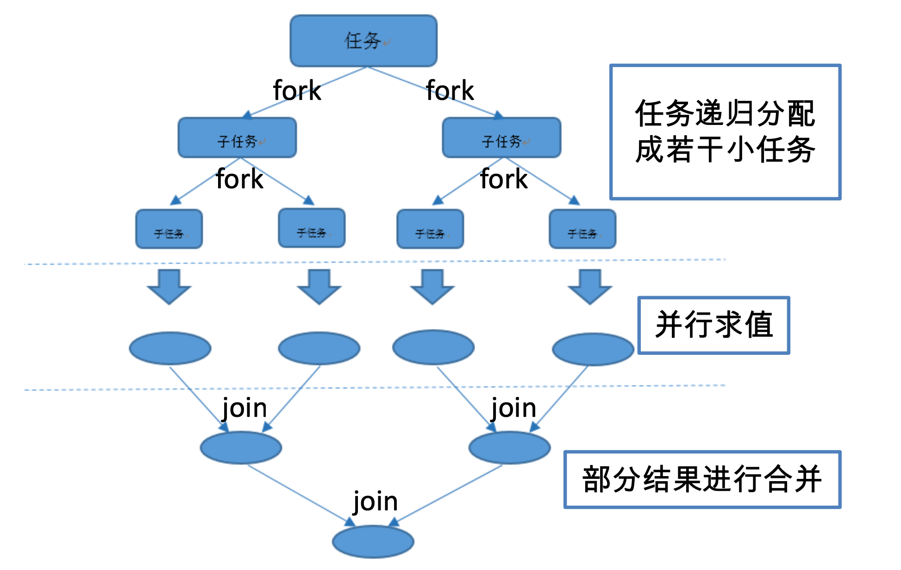

# 06. 并行流与串行流

- 笔记本：Java8 新特性
- 创建时间：2021-01-24 13:34:27 UTC
- 更新时间：2021-01-24 13:35:28 UTC
- 印象笔记 GUID：34707a1b-aad7-4472-88e3-b4a700ceaaa7

## 并行流与串行流

### 并行流

**并行流**就是把一个内容分成多个数据块，并用不同的线程分别处理每个数据块的流
 Java 8 中将并行进行了优化，我们可以很容易的对数据进行并行操作。Stream API 可以声明性地通过 parallel() 与 sequential() 在并行流与顺序流之间进行切换。

#### 了解 Fork/Join 框架

Fork/Join 框架:就是在必要的情况下，将一个大任务，进行拆分(fork)成若干个小任务(拆到不可再拆时)，再将一个个的小任务运算的结果进行 join 汇总.
 

#### Fork/Join 框架与传统线程池的区别

采用 “工作窃取”模式(work-stealing): 当执行新的任务时它可以将其拆分分成更小的任务执行，并将小任务加到线程队列中，然后再从一个随机线程的队列中偷一个并把它放在自己的队列中。

相对于一般的线程池实现,fork/join 框架的优势体现在对其中包含的任务的处理方式上.在一般的线程池中,如果一个线程正在执行的任务由于某些原因无法继续运行,那么该线程会处于等待状态.而在fork/join框架实现中,如果某个子问题由于等待另外一个子问题的完成而无法继续运行.那么处理该子问题的线程会主动寻找其他尚未运行的子问题来执行.这种方式减少了线程的等待时间,提高了性能.
 **eg：**

```
public class ForkJoinCalculate extends RecursiveTask<Long> {

    private static final long serialVersionUID = 5232453952272484271L;

    private long start;
    private long end;

    private static final long THRESHOLD = 10000;

    public ForkJoinCalculate(long start, long end) {
        this.start = start;
        this.end = end;
    }

    @Override
    protected Long compute() {
        long length = end - start;

        if (length <= THRESHOLD) {
            long sum = 0;
            for (long i = start; i <= end; i++) {
                sum += i;
            }
            return sum;
        } else {
            long middle = (start + end) / 2;
            ForkJoinCalculate left = new ForkJoinCalculate(start, middle);
            left.fork();        // 拆分子任务，同时压入线程队列

            ForkJoinCalculate right = new ForkJoinCalculate(middle+1, end);
            right.fork();

            return left.join() + right.join();
        }
    }
}

```

```
public class TestForkJoin {

    // 普通 for
    @Test
    public void test1() {
        long start = System.currentTimeMillis();

        long sum = 0;
        for (long i = 0; i <= 100000000000L; i++) {
            sum += i;
        }

        System.out.println(sum);
        System.out.println("耗时：" + (System.currentTimeMillis() - start));   // 耗时：51087
    }

    // ForkJoin 框架
    @Test
    public void test2() {
        Instant start = Instant.now();

        ForkJoinPool pool = new ForkJoinPool();
        ForkJoinTask<Long> task = new ForkJoinCalculate(0, 100000000000L);

        System.out.println(pool.invoke(task));

        Instant end = Instant.now();
        System.out.println("耗时：" + Duration.between(start, end).toMillis());    //耗时：54197
    }

    // Java8 并行流
    @Test
    public void test3() {
        Instant start = Instant.now();

        LongStream.rangeClosed(0, 100000000000L)
                .parallel()     // 并行流，底层 Fork/Join
                .reduce(0, Long::sum);

        Instant end = Instant.now();
        System.out.println("耗时：" + Duration.between(start, end).toMillis());    //耗时：36636
    }
}

```

%23%23%20%E5%B9%B6%E8%A1%8C%E6%B5%81%E4%B8%8E%E4%B8%B2%E8%A1%8C%E6%B5%81%0A%23%23%23%20%E5%B9%B6%E8%A1%8C%E6%B5%81%0A**%E5%B9%B6%E8%A1%8C%E6%B5%81**%E5%B0%B1%E6%98%AF%E6%8A%8A%E4%B8%80%E4%B8%AA%E5%86%85%E5%AE%B9%E5%88%86%E6%88%90%E5%A4%9A%E4%B8%AA%E6%95%B0%E6%8D%AE%E5%9D%97%EF%BC%8C%E5%B9%B6%E7%94%A8%E4%B8%8D%E5%90%8C%E7%9A%84%E7%BA%BF%E7%A8%8B%E5%88%86%E5%88%AB%E5%A4%84%E7%90%86%E6%AF%8F%E4%B8%AA%E6%95%B0%E6%8D%AE%E5%9D%97%E7%9A%84%E6%B5%81%0AJava%208%20%E4%B8%AD%E5%B0%86%E5%B9%B6%E8%A1%8C%E8%BF%9B%E8%A1%8C%E4%BA%86%E4%BC%98%E5%8C%96%EF%BC%8C%E6%88%91%E4%BB%AC%E5%8F%AF%E4%BB%A5%E5%BE%88%E5%AE%B9%E6%98%93%E7%9A%84%E5%AF%B9%E6%95%B0%E6%8D%AE%E8%BF%9B%E8%A1%8C%E5%B9%B6%E8%A1%8C%E6%93%8D%E4%BD%9C%E3%80%82Stream%20API%20%E5%8F%AF%E4%BB%A5%E5%A3%B0%E6%98%8E%E6%80%A7%E5%9C%B0%E9%80%9A%E8%BF%87%20parallel()%20%E4%B8%8E%20sequential()%20%E5%9C%A8%E5%B9%B6%E8%A1%8C%E6%B5%81%E4%B8%8E%E9%A1%BA%E5%BA%8F%E6%B5%81%E4%B9%8B%E9%97%B4%E8%BF%9B%E8%A1%8C%E5%88%87%E6%8D%A2%E3%80%82%0A%23%23%23%23%20%E4%BA%86%E8%A7%A3%20Fork%2FJoin%20%E6%A1%86%E6%9E%B6%0AFork%2FJoin%20%E6%A1%86%E6%9E%B6%3A%E5%B0%B1%E6%98%AF%E5%9C%A8%E5%BF%85%E8%A6%81%E7%9A%84%E6%83%85%E5%86%B5%E4%B8%8B%EF%BC%8C%E5%B0%86%E4%B8%80%E4%B8%AA%E5%A4%A7%E4%BB%BB%E5%8A%A1%EF%BC%8C%E8%BF%9B%E8%A1%8C%E6%8B%86%E5%88%86(fork)%E6%88%90%E8%8B%A5%E5%B9%B2%E4%B8%AA%E5%B0%8F%E4%BB%BB%E5%8A%A1(%E6%8B%86%E5%88%B0%E4%B8%8D%E5%8F%AF%E5%86%8D%E6%8B%86%E6%97%B6)%EF%BC%8C%E5%86%8D%E5%B0%86%E4%B8%80%E4%B8%AA%E4%B8%AA%E7%9A%84%E5%B0%8F%E4%BB%BB%E5%8A%A1%E8%BF%90%E7%AE%97%E7%9A%84%E7%BB%93%E6%9E%9C%E8%BF%9B%E8%A1%8C%20join%20%E6%B1%87%E6%80%BB.%0A!%5Ba5a6087ba78b07799bdaf246b710c457.png%5D(evernotecid%3A%2F%2F90F5C43D-AEAE-49B2-85BB-D02B6A52C764%2Fappyinxiangcom%2F25356149%2FENResource%2Fp1612)%0A%0A%23%23%23%23%20Fork%2FJoin%20%E6%A1%86%E6%9E%B6%E4%B8%8E%E4%BC%A0%E7%BB%9F%E7%BA%BF%E7%A8%8B%E6%B1%A0%E7%9A%84%E5%8C%BA%E5%88%AB%0A%E9%87%87%E7%94%A8%20%E2%80%9C%E5%B7%A5%E4%BD%9C%E7%AA%83%E5%8F%96%E2%80%9D%E6%A8%A1%E5%BC%8F(work-stealing)%3A%20%E5%BD%93%E6%89%A7%E8%A1%8C%E6%96%B0%E7%9A%84%E4%BB%BB%E5%8A%A1%E6%97%B6%E5%AE%83%E5%8F%AF%E4%BB%A5%E5%B0%86%E5%85%B6%E6%8B%86%E5%88%86%E5%88%86%E6%88%90%E6%9B%B4%E5%B0%8F%E7%9A%84%E4%BB%BB%E5%8A%A1%E6%89%A7%E8%A1%8C%EF%BC%8C%E5%B9%B6%E5%B0%86%E5%B0%8F%E4%BB%BB%E5%8A%A1%E5%8A%A0%E5%88%B0%E7%BA%BF%E7%A8%8B%E9%98%9F%E5%88%97%E4%B8%AD%EF%BC%8C%E7%84%B6%E5%90%8E%E5%86%8D%E4%BB%8E%E4%B8%80%E4%B8%AA%E9%9A%8F%E6%9C%BA%E7%BA%BF%E7%A8%8B%E7%9A%84%E9%98%9F%E5%88%97%E4%B8%AD%E5%81%B7%E4%B8%80%E4%B8%AA%E5%B9%B6%E6%8A%8A%E5%AE%83%E6%94%BE%E5%9C%A8%E8%87%AA%E5%B7%B1%E7%9A%84%E9%98%9F%E5%88%97%E4%B8%AD%E3%80%82%0A%0A%E7%9B%B8%E5%AF%B9%E4%BA%8E%E4%B8%80%E8%88%AC%E7%9A%84%E7%BA%BF%E7%A8%8B%E6%B1%A0%E5%AE%9E%E7%8E%B0%2Cfork%2Fjoin%20%E6%A1%86%E6%9E%B6%E7%9A%84%E4%BC%98%E5%8A%BF%E4%BD%93%E7%8E%B0%E5%9C%A8%E5%AF%B9%E5%85%B6%E4%B8%AD%E5%8C%85%E5%90%AB%E7%9A%84%E4%BB%BB%E5%8A%A1%E7%9A%84%E5%A4%84%E7%90%86%E6%96%B9%E5%BC%8F%E4%B8%8A.%E5%9C%A8%E4%B8%80%E8%88%AC%E7%9A%84%E7%BA%BF%E7%A8%8B%E6%B1%A0%E4%B8%AD%2C%E5%A6%82%E6%9E%9C%E4%B8%80%E4%B8%AA%E7%BA%BF%E7%A8%8B%E6%AD%A3%E5%9C%A8%E6%89%A7%E8%A1%8C%E7%9A%84%E4%BB%BB%E5%8A%A1%E7%94%B1%E4%BA%8E%E6%9F%90%E4%BA%9B%E5%8E%9F%E5%9B%A0%E6%97%A0%E6%B3%95%E7%BB%A7%E7%BB%AD%E8%BF%90%E8%A1%8C%2C%E9%82%A3%E4%B9%88%E8%AF%A5%E7%BA%BF%E7%A8%8B%E4%BC%9A%E5%A4%84%E4%BA%8E%E7%AD%89%E5%BE%85%E7%8A%B6%E6%80%81.%E8%80%8C%E5%9C%A8fork%2Fjoin%E6%A1%86%E6%9E%B6%E5%AE%9E%E7%8E%B0%E4%B8%AD%2C%E5%A6%82%E6%9E%9C%E6%9F%90%E4%B8%AA%E5%AD%90%E9%97%AE%E9%A2%98%E7%94%B1%E4%BA%8E%E7%AD%89%E5%BE%85%E5%8F%A6%E5%A4%96%E4%B8%80%E4%B8%AA%E5%AD%90%E9%97%AE%E9%A2%98%E7%9A%84%E5%AE%8C%E6%88%90%E8%80%8C%E6%97%A0%E6%B3%95%E7%BB%A7%E7%BB%AD%E8%BF%90%E8%A1%8C.%E9%82%A3%E4%B9%88%E5%A4%84%E7%90%86%E8%AF%A5%E5%AD%90%E9%97%AE%E9%A2%98%E7%9A%84%E7%BA%BF%E7%A8%8B%E4%BC%9A%E4%B8%BB%E5%8A%A8%E5%AF%BB%E6%89%BE%E5%85%B6%E4%BB%96%E5%B0%9A%E6%9C%AA%E8%BF%90%E8%A1%8C%E7%9A%84%E5%AD%90%E9%97%AE%E9%A2%98%E6%9D%A5%E6%89%A7%E8%A1%8C.%E8%BF%99%E7%A7%8D%E6%96%B9%E5%BC%8F%E5%87%8F%E5%B0%91%E4%BA%86%E7%BA%BF%E7%A8%8B%E7%9A%84%E7%AD%89%E5%BE%85%E6%97%B6%E9%97%B4%2C%E6%8F%90%E9%AB%98%E4%BA%86%E6%80%A7%E8%83%BD.%0A%0A**eg%EF%BC%9A**%0A%60%60%60java%0Apublic%20class%20ForkJoinCalculate%20extends%20RecursiveTask%3CLong%3E%20%7B%0A%0A%20%20%20%20private%20static%20final%20long%20serialVersionUID%20%3D%205232453952272484271L%3B%0A%0A%20%20%20%20private%20long%20start%3B%0A%20%20%20%20private%20long%20end%3B%0A%0A%20%20%20%20private%20static%20final%20long%20THRESHOLD%20%3D%2010000%3B%0A%0A%20%20%20%20public%20ForkJoinCalculate(long%20start%2C%20long%20end)%20%7B%0A%20%20%20%20%20%20%20%20this.start%20%3D%20start%3B%0A%20%20%20%20%20%20%20%20this.end%20%3D%20end%3B%0A%20%20%20%20%7D%0A%0A%20%20%20%20%40Override%0A%20%20%20%20protected%20Long%20compute()%20%7B%0A%20%20%20%20%20%20%20%20long%20length%20%3D%20end%20-%20start%3B%0A%0A%20%20%20%20%20%20%20%20if%20(length%20%3C%3D%20THRESHOLD)%20%7B%0A%20%20%20%20%20%20%20%20%20%20%20%20long%20sum%20%3D%200%3B%0A%20%20%20%20%20%20%20%20%20%20%20%20for%20(long%20i%20%3D%20start%3B%20i%20%3C%3D%20end%3B%20i%2B%2B)%20%7B%0A%20%20%20%20%20%20%20%20%20%20%20%20%20%20%20%20sum%20%2B%3D%20i%3B%0A%20%20%20%20%20%20%20%20%20%20%20%20%7D%0A%20%20%20%20%20%20%20%20%20%20%20%20return%20sum%3B%0A%20%20%20%20%20%20%20%20%7D%20else%20%7B%0A%20%20%20%20%20%20%20%20%20%20%20%20long%20middle%20%3D%20(start%20%2B%20end)%20%2F%202%3B%0A%20%20%20%20%20%20%20%20%20%20%20%20ForkJoinCalculate%20left%20%3D%20new%20ForkJoinCalculate(start%2C%20middle)%3B%0A%20%20%20%20%20%20%20%20%20%20%20%20left.fork()%3B%20%20%20%20%20%20%20%20%2F%2F%20%E6%8B%86%E5%88%86%E5%AD%90%E4%BB%BB%E5%8A%A1%EF%BC%8C%E5%90%8C%E6%97%B6%E5%8E%8B%E5%85%A5%E7%BA%BF%E7%A8%8B%E9%98%9F%E5%88%97%0A%0A%20%20%20%20%20%20%20%20%20%20%20%20ForkJoinCalculate%20right%20%3D%20new%20ForkJoinCalculate(middle%2B1%2C%20end)%3B%0A%20%20%20%20%20%20%20%20%20%20%20%20right.fork()%3B%0A%0A%20%20%20%20%20%20%20%20%20%20%20%20return%20left.join()%20%2B%20right.join()%3B%0A%20%20%20%20%20%20%20%20%7D%0A%20%20%20%20%7D%0A%7D%0A%60%60%60%0A%60%60%60java%0Apublic%20class%20TestForkJoin%20%7B%0A%0A%20%20%20%20%2F%2F%20%E6%99%AE%E9%80%9A%20for%0A%20%20%20%20%40Test%0A%20%20%20%20public%20void%20test1()%20%7B%0A%20%20%20%20%20%20%20%20long%20start%20%3D%20System.currentTimeMillis()%3B%0A%0A%20%20%20%20%20%20%20%20long%20sum%20%3D%200%3B%0A%20%20%20%20%20%20%20%20for%20(long%20i%20%3D%200%3B%20i%20%3C%3D%20100000000000L%3B%20i%2B%2B)%20%7B%0A%20%20%20%20%20%20%20%20%20%20%20%20sum%20%2B%3D%20i%3B%0A%20%20%20%20%20%20%20%20%7D%0A%0A%20%20%20%20%20%20%20%20System.out.println(sum)%3B%0A%20%20%20%20%20%20%20%20System.out.println(%22%E8%80%97%E6%97%B6%EF%BC%9A%22%20%2B%20(System.currentTimeMillis()%20-%20start))%3B%20%20%20%2F%2F%20%E8%80%97%E6%97%B6%EF%BC%9A51087%0A%20%20%20%20%7D%0A%0A%20%20%20%20%2F%2F%20ForkJoin%20%E6%A1%86%E6%9E%B6%0A%20%20%20%20%40Test%0A%20%20%20%20public%20void%20test2()%20%7B%0A%20%20%20%20%20%20%20%20Instant%20start%20%3D%20Instant.now()%3B%0A%0A%20%20%20%20%20%20%20%20ForkJoinPool%20pool%20%3D%20new%20ForkJoinPool()%3B%0A%20%20%20%20%20%20%20%20ForkJoinTask%3CLong%3E%20task%20%3D%20new%20ForkJoinCalculate(0%2C%20100000000000L)%3B%0A%0A%20%20%20%20%20%20%20%20System.out.println(pool.invoke(task))%3B%0A%0A%20%20%20%20%20%20%20%20Instant%20end%20%3D%20Instant.now()%3B%0A%20%20%20%20%20%20%20%20System.out.println(%22%E8%80%97%E6%97%B6%EF%BC%9A%22%20%2B%20Duration.between(start%2C%20end).toMillis())%3B%20%20%20%20%2F%2F%E8%80%97%E6%97%B6%EF%BC%9A54197%0A%20%20%20%20%7D%0A%0A%20%20%20%20%2F%2F%20Java8%20%E5%B9%B6%E8%A1%8C%E6%B5%81%0A%20%20%20%20%40Test%0A%20%20%20%20public%20void%20test3()%20%7B%0A%20%20%20%20%20%20%20%20Instant%20start%20%3D%20Instant.now()%3B%0A%0A%20%20%20%20%20%20%20%20LongStream.rangeClosed(0%2C%20100000000000L)%0A%20%20%20%20%20%20%20%20%20%20%20%20%20%20%20%20.parallel()%20%20%20%20%20%2F%2F%20%E5%B9%B6%E8%A1%8C%E6%B5%81%EF%BC%8C%E5%BA%95%E5%B1%82%20Fork%2FJoin%0A%20%20%20%20%20%20%20%20%20%20%20%20%20%20%20%20.reduce(0%2C%20Long%3A%3Asum)%3B%0A%0A%20%20%20%20%20%20%20%20Instant%20end%20%3D%20Instant.now()%3B%0A%20%20%20%20%20%20%20%20System.out.println(%22%E8%80%97%E6%97%B6%EF%BC%9A%22%20%2B%20Duration.between(start%2C%20end).toMillis())%3B%20%20%20%20%2F%2F%E8%80%97%E6%97%B6%EF%BC%9A36636%0A%20%20%20%20%7D%0A%7D%0A%60%60%60
