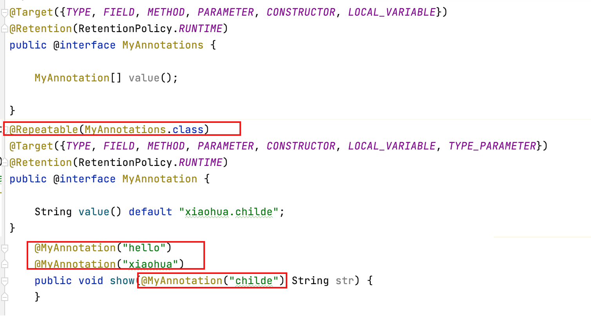

# 10. 重复注解与类型注解

- 笔记本：Java8 新特性
- 创建时间：2021-01-24 17:56:57 UTC
- 更新时间：2021-01-24 18:26:11 UTC
- 印象笔记 GUID：356e32a0-d811-4c11-abb7-e868daea7b76

## 重复注解与类型注解

Java 8对注解处理提供了两点改进:**可重复的注解**及**可用于类型的注解**。

```
@Repeatable(MyAnnotations.class)
@Target({TYPE, FIELD, METHOD, PARAMETER, CONSTRUCTOR, LOCAL_VARIABLE, TYPE_PARAMETER})
@Retention(RetentionPolicy.RUNTIME)
public @interface MyAnnotation {

    String value() default "xiaohua.childe";
}

```

```
@Target({TYPE, FIELD, METHOD, PARAMETER, CONSTRUCTOR, LOCAL_VARIABLE})
@Retention(RetentionPolicy.RUNTIME)
public @interface MyAnnotations {

    MyAnnotation[] value();

}

```

```
public class TestAnnotation {

    @MyAnnotation("hello")
    @MyAnnotation("xiaohua")
    public void show(@MyAnnotation("childe") String str) {
    }

    @Test
    public void test1() throws NoSuchMethodException {
        Class<TestAnnotation> clazz = TestAnnotation.class;
        Method m1 = clazz.getMethod("show");

        MyAnnotation[] annos = m1.getAnnotationsByType(MyAnnotation.class);
        for (MyAnnotation anno : annos) {
            System.out.println(anno.value());   // hello \n xiaohua (public void show() {})
        }
    }
}

```



%23%23%20%E9%87%8D%E5%A4%8D%E6%B3%A8%E8%A7%A3%E4%B8%8E%E7%B1%BB%E5%9E%8B%E6%B3%A8%E8%A7%A3%0AJava%208%E5%AF%B9%E6%B3%A8%E8%A7%A3%E5%A4%84%E7%90%86%E6%8F%90%E4%BE%9B%E4%BA%86%E4%B8%A4%E7%82%B9%E6%94%B9%E8%BF%9B%3A**%E5%8F%AF%E9%87%8D%E5%A4%8D%E7%9A%84%E6%B3%A8%E8%A7%A3**%E5%8F%8A**%E5%8F%AF%E7%94%A8%E4%BA%8E%E7%B1%BB%E5%9E%8B%E7%9A%84%E6%B3%A8%E8%A7%A3**%E3%80%82%0A%60%60%60java%0A%40Repeatable(MyAnnotations.class)%0A%40Target(%7BTYPE%2C%20FIELD%2C%20METHOD%2C%20PARAMETER%2C%20CONSTRUCTOR%2C%20LOCAL_VARIABLE%2C%20TYPE_PARAMETER%7D)%0A%40Retention(RetentionPolicy.RUNTIME)%0Apublic%20%40interface%20MyAnnotation%20%7B%0A%0A%20%20%20%20String%20value()%20default%20%22xiaohua.childe%22%3B%0A%7D%0A%60%60%60%0A%60%60%60java%0A%40Target(%7BTYPE%2C%20FIELD%2C%20METHOD%2C%20PARAMETER%2C%20CONSTRUCTOR%2C%20LOCAL_VARIABLE%7D)%0A%40Retention(RetentionPolicy.RUNTIME)%0Apublic%20%40interface%20MyAnnotations%20%7B%0A%0A%20%20%20%20MyAnnotation%5B%5D%20value()%3B%0A%0A%7D%0A%60%60%60%0A%60%60%60java%0Apublic%20class%20TestAnnotation%20%7B%0A%0A%20%20%20%20%40MyAnnotation(%22hello%22)%0A%20%20%20%20%40MyAnnotation(%22xiaohua%22)%0A%20%20%20%20public%20void%20show(%40MyAnnotation(%22childe%22)%20String%20str)%20%7B%0A%20%20%20%20%7D%0A%0A%20%20%20%20%40Test%0A%20%20%20%20public%20void%20test1()%20throws%20NoSuchMethodException%20%7B%0A%20%20%20%20%20%20%20%20Class%3CTestAnnotation%3E%20clazz%20%3D%20TestAnnotation.class%3B%0A%20%20%20%20%20%20%20%20Method%20m1%20%3D%20clazz.getMethod(%22show%22)%3B%0A%0A%20%20%20%20%20%20%20%20MyAnnotation%5B%5D%20annos%20%3D%20m1.getAnnotationsByType(MyAnnotation.class)%3B%0A%20%20%20%20%20%20%20%20for%20(MyAnnotation%20anno%20%3A%20annos)%20%7B%0A%20%20%20%20%20%20%20%20%20%20%20%20System.out.println(anno.value())%3B%20%20%20%2F%2F%20hello%20%5Cn%20xiaohua%20(public%20void%20show()%20%7B%7D)%0A%20%20%20%20%20%20%20%20%7D%0A%20%20%20%20%7D%0A%7D%0A%60%60%60%0A!%5Bed8c16e10d4ea520ee18e4d08bcc72bd.png%5D(evernotecid%3A%2F%2F90F5C43D-AEAE-49B2-85BB-D02B6A52C764%2Fappyinxiangcom%2F25356149%2FENResource%2Fp1614)%0A
