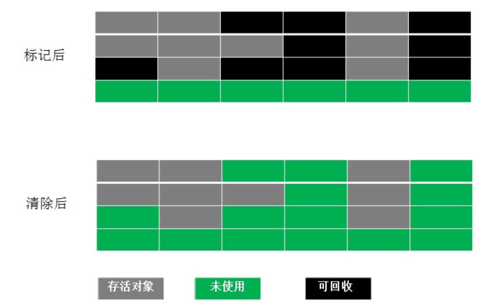
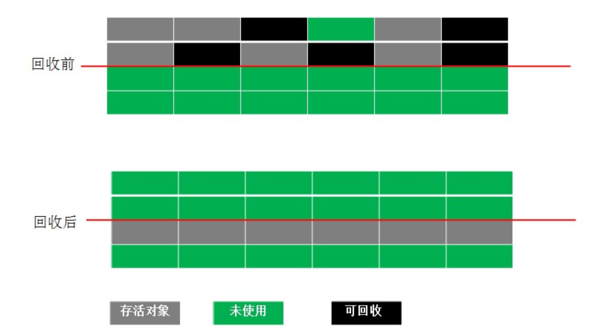
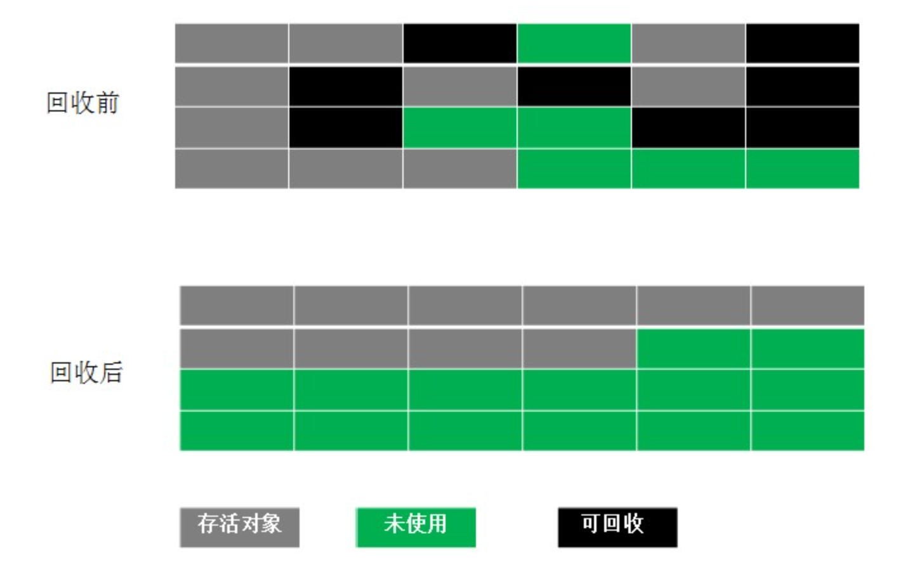
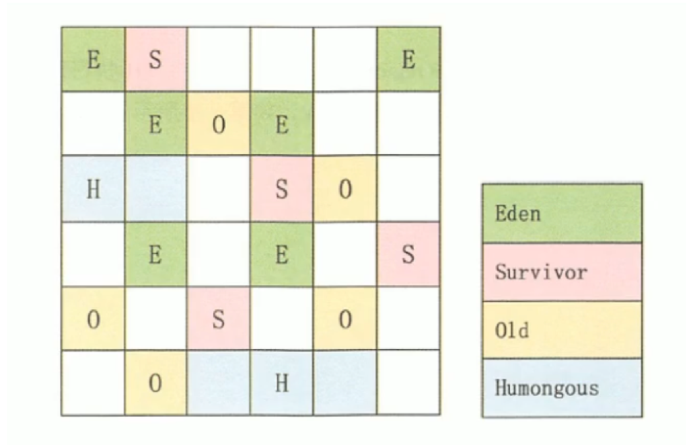
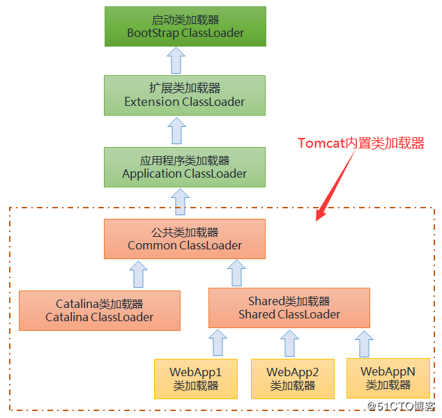

# 01. JVM 面试题

- 笔记本：JVM 面试题
- 创建时间：2021-03-15 06:11:52 UTC
- 更新时间：2021-03-17 06:48:10 UTC
- 印象笔记 GUID：e506830e-50f7-47ef-bc23-a916b9b7d225

#### 1. Java 类加载过程?

Java 类加载需要经历以下 7 个过程:

- **加载（Loading）**

1. 通过一个类的全限定名获取该类的二进制流。

1. 将该二进制流中的静态存储结构转化为方法去运行时数据结构。

1. 在内存中生成该类的 Class 对象，作为该类的数据访问入口。

- **链接（Linking）**

  - **验证（Verification）**
 验证的目的是为了确保 Class 文件的字节流中的信息不会危害到虚拟机.在该阶段主要完成以下四种验证:

    - 文件格式验证:验证字节流是否符合 Class 文件的规范，如主次版本号是否在当前虚拟机范围内，常量池中的常量是否有不被支持的类型.

    - 元数据验证:对字节码描述的信息进行语义分析，如这个类是否有父类，是否集成了不被继承的类等。

    - 元数据验证:对字节码描述的信息进行语义分析，如这个类是否有父类，是否集成了不被继承的类等。

    - 符号引用验证:这个动作在后面的解析过程中发生，主要是为了确保解析动作能正确执行。

  - **准备（Preparation）**
 为类变量分配内存并且设置该类变量的默认初始值，即零值。
 准备阶段是为类的静态变量分配内存并将其初始化为默认值，这些内存都将在方法区中进行分配。准备阶段不分配类中的实例变量的内存，实例变量将会在对象实例化时随着对象一起分配在 Java 堆中。
 **eg：**`public static int value=123;` 在准备阶段 value 初始值为 0 。在初始化阶段才会变为 123。

  - **解析（Resolution）**
 该阶段主要完成符号引用到直接引用的转换动作。解析动作并不一定在初始化动作完成之前，也有可能在初始化之后。

- **初始化（Initialization）**
 初始化阶段就是执行类构造器方法 `<clinit>()` 的过程(此方法不需定义，是 javac 编译器自动收集类中的所有类变量的赋值动作和静态代码块中的语句合并而来的)。
 初始化时类加载的最后一步，前面的类加载过程，除了在加载阶段用户应用程序可以通过自定义类加载器参与之外，其余动作完全由虚拟机主导和控制。到了初始化阶段，才真正开始执行类中定义的 Java 程序代码。

- **使用**

- **卸载**

**个人总结：** 加载 Loading、链接 Linking（包括验证 Verification、准备 Preparation、解析 Resolution）、初始化 Initialization、使用、卸载

#### 2. 描述一下 JVM 加载 Class 文件的原理机制?

Java 虚拟机对 class 文件采用的是按需加载的方式，也就是说当需要使用该类时，才会将它的 class 文件加载到内存中生成 class 对象。而且加载某个类的 class 文件时，Java 虚拟机采用的是双亲委托机制，即把请求交给父类处理，它是一种任务委派模式。

Java 语言是一种具有动态性的解释型语言，类(Class)只有被加载到 JVM 后才能运行。当运行指定程序时，JVM 会将编译生成的 .class 文件按照需求和一定的规则加载到内存中，并组织成为一个完整的 Java 应用程序。这个加载过程是由类加载器完成，具体来说，就是由 ClassLoader 和它的子类来实现的。类加载器本身也是一个类，其实质是把类文件从硬盘读取到内存中。

Java 程序对类的使用分为：主动使用和被动使用。

- 主动使用，又分为七种情况：

  - 创建类的实例

  - 访问某个类的接口或静态变量，或者对该静态变量赋值

  - 调用类的静态方法

  - 反射（比如：Class.forName("com.liudehzi.Test")）

  - 初始化一个类的子类

  - Java 虚拟机启动时被标明为启动类的类

  - JDK 7 开始提供的动态语言支持：
 java.lang.invoke.MethodHandle 实例的解析结果
 REF_getStatic、REF_putStatic、REF_invokeStatic 句柄对应的类没有初始化，则初始化

- 除了以上七种情况，其他使用 Java 类的方式都被看做是对类的被动使用，都不会导致类的初始化。

**个人总结：** 当运行指定程序时，JVM 会将 .class 文件使用双亲委派机制按需加载到内存中，并组织为一个 Java 应用程序。类加载的步骤又分为：加载、链接（验证、准备、解析）、初始化。
 按需加载时，Java 程序对类的使用分为：主动和被动使用。其中创建类的实例、访问类的静态变量/方法、反射、初始化一个类的子类、启动类是主动使用。

#### 3. Java 内存分配

- **PC寄存器：** JVM内部虚拟寄存器，存取速度非常快，程序不可控制。（线程私有）
 PC 寄存器用来**存储指向下一条指令的地址**，也即将要执行的指令代码。由执行引擎读取下一条执行。

- **常量池：** 编译时被确定并保存在 .class 文件中的(final)常量值和一些文本修饰的符号引用(类和接口的全限定名，字段的名称和描述符，方法和名称和描述符)。JDK1.8 之前常量池本身是方法区中的一个数据结构，JDK1.8 之后放在堆中。

- **栈内存：** 基本类型的变量和对象的引用变量(堆内存空间的访问地址)，速度快，可以共享，但是大小与生存期必须确定，缺乏灵活性。（与线程对应，Java栈数据不是线程共有的，所以不需要关心其数据一致性，也不会存在同步锁的问题）
 堆是JVM所管理的内存中国最大的一块，是被所有Java线程锁共享的，不是线程安全的，在JVM启动时创建。

- **堆内存：** new 创建的对象和数组，由 Java 虚拟机自动垃圾回收器管理,存取速度慢。

- **静态域：** static 定义的静态成员(元空间)。

- **方法区：** Java1.8中，HotSpot 虚拟机已经将 方法区（永久代）移除，取而代之的是元空间
 方法区用于存储已被虚拟机加载的类信息、常量、静态变量、动态生成的类等数据。实际上在Java虚拟机的规范中方法区是堆中的一个逻辑部分，但是它却拥有一个叫做非堆(Non-Heap)的别名。

- **元空间：** 元空间在1.8中不在与堆是连续的物理内存，而是改为使用本地内存(Native memory)。元空间使用本地内存也就意味着只要本地内存足够，就不会出现OOM的错误。

- **本地方法栈(Native Method Stack)：** 本地方法栈和Java栈所发挥的作用非常相似，区别不过是Java栈为JVM执行Java方法服务，而本地方法栈为JVM执行Native方法服务。本地方法栈也会抛出StackOverflowError和OutOfMemoryError异常。

**个人总结：** 堆、栈、方法区（元空间）、PC 寄存器、本地方法栈、常量池

#### 4. Java 堆的结构是什么样子的?什么是堆中的永久代(Perm Gen space)?

JVM 的堆是运行时数据区，所有类的实例和数组都是在堆上分配内存。它在 JVM 启动的时候被创建。对象所占的堆内存是由自动内存管理系统也就是垃圾收集器回收。
 堆内存是由存活和死亡的对象组成的。存活的对象是应用可以访问的（GCRoots 可达），不会被垃圾回收。死亡的对象是应用不可访问尚且还没有被垃圾收集器回收掉的对象。一直到垃圾收集器把这些对象回收掉之前，他们会一直占据堆内存空间。
 堆分为 老年代、年轻代（Eden、Survivor0、Survivor1）
 **永久代：** 永久代主要存在类定义，字节码，和常量等很少会变更的信息。并且永久代不会发生垃圾回收，如果永久代满了或者超过了临界值，会触发完全垃圾回收（Full Gc）,JAVA8 之后，HotSpot 中移除了永久代，取而代之的是元空间

**个人总结：** 分代（老年、年轻（Eden、Survivor0/1）），包括存活/死亡对象..。永久代存放常量、字节码、类定义等，Java1.8 后被移除

#### 5. GC 是什么? 为什么要有 GC?

GC 是垃圾收集的意思(Garbage Collection)，内存处理是编程人员容易出现问题的地方，忘记或者错误的内存回收会导致程序或系统的不稳定甚至崩溃，Java 提供的 GC 功能可以自动监测对象是否超过作用域从而达到自动回收内存的目的，Java 语言没有提供释放已分配内存的显式操作方法。

**个人总结：** GC：garbage collection，垃圾收集。Java 不同于 C/C++ 需要自己申请(malloc)和释放(free)空间，Java 没有提供释放已分配内存的显式操作方法，因此需要垃圾收集器帮我们自动收集垃圾对象，防止内存溢出。
 如果不进行垃圾回收，*内存迟早都会被消耗完*，因为不断地分配内存空间而不进行回收，就好像不停地生成生活垃圾而从不打扫一样。

#### 6. 简述 Java 垃圾回收机制

在 JVM 中，有一个垃圾回收线程，它是低优先级的，在正常情况下是不会执行的，只有在虚拟机空闲或者当前堆内存不足时，才会触发执行，扫描那些没有被任何引用的对象，并将它们添加到要回收的集合中，进行回收。

- 自动内存管理，无需开发人员手动参与内存的分配与回收，这样**降低内存泄漏和内存溢出的风险**

  - 没有垃圾回收器，java 也会和 cpp 一样，各种悬垂指针，野指针，泄漏问题让你头疼不已。

- 自动内存管理机制，将程序员从繁重的内存管理中释放出来，可以**更专心地专注于业务开发**

**个人总结：** JVM 中存在一个垃圾回收线程，优先级低，正常情况下是不会执行的，只有空间不足时，才会触发执行（发散：MinorGC、MajorGC、FullGC），扫描没有任何引用的对象（发散：引用计数法、可达性算法），添加到要回收的集合中，进行回收。

#### 7. 如何判断一个对象是否存活?(或者 GC 对象的判定方法)

1. **引用计数法**
 给每一个对象设置一个引用计数器，每当有一个地方引用这个对象时，就将计数器加一，引用失效时，计数器就减一。当一个对象的引用计数器为零时，说明此对象没有被引用，也就是“死对象”,将会被垃圾回收.
 需要单独的字段存储计数器，这样的做法**增加了存储空间的开销**。
 引用计数法有一个缺陷就是**无法解决循环引用问题**，也就是说当对象 A 引用对象 B，对象 B 又引用者对象 A，那么此时 A、B 对象的引用计数器都不为零，也就造成无法完成垃圾回收，所以主流的虚拟机都没有采用这种算法。

1. **可达性算法(引用链法)**
 从一个被称为 **GC Roots** 的对象开始向下搜索， 如果一个对象到 GC Roots 没有任何引用链相连时，则说明此对象不可用。
 在 Java 中可以作为 GC Roots 的对象有以下几种:

  - 虚拟机栈中引用的对象

  - 方法区类静态属性引用的对象‘

  - 方法区常量池引用的对象

  - 本地方法栈 JNI 引用的对象
 如果要使用可达性分析算法来判断内存是否可回收，那么分析工作必须在一个能保障一致性的快照中进行。这点不满足的话分析结果的准确性就无法保证。这点也是导致 GC 进行时必须 **”stop the world“** 的一个重要原因。

**个人总结：** **引用计数法**和**可达性算法**
 引用计数法需要额外增加空间和加/减成本，增加开销，并且无法解决循环引用问题，因此不常用。
 可达性算法：根据 GC Roots 向下搜索，没有任何引用链相连时，才会标记为垃圾（“Stop The World”）。
 **注意：** 当一个对象不可达 GC Root 时，这个对象并不会立马被回收，而是出于一个死缓的阶段，若要被真正的回收需要经历两次标记.**一个无法触及的对象有可能在某一条件下“复活”自己**

- **可触及的：** 从根节点开始，可以到达这个对象。

- **可复活的：** 对象的所有引用都被释放，但是对象有可能在 finalize() 中复活。

- **不可触及的：** 对象的 finalize() 被调用，并且没有复活，那么就会进入不可触及状态。不可触及的对象不可能被复活，因为
 **finalize() 方法只会被调用一次**
 以上三种状态中，是由于 finalize() 方法的存在，进行的区分。只有在对象不可触及时才可以被回收。

#### 8. 垃圾回收的优点和原理。并考虑 2 种回收机制。

Java 语言中一个显著的特点就是引入了垃圾回收机制，使 C++ 程序员最头疼的内存管理的问题迎刃而解，它使得 Java 程序员在编写程序的时候不再需要考虑内存管理。由于有个垃圾回收机制， Java 中的对象不再有“作用域”的概念，只有对象的引用才有"作用域"。垃圾回收可以有效的防止内存泄露，有效的使用可以使用的内存。垃圾回收器通常是作为一个单独的低级别的线程运行，不可预知的情况下对内存堆中已经死亡的或者长时间没有使用的对象进行清除和回收，程序员不能实时的调用垃圾回收器对某个对象或所有对象进行垃圾回收。

回收机制有：**分代复制垃圾回收**和**标记垃圾回收**，**增量垃圾回收**。

**Mark-Sweep（标记-清除）算法：** 标记-清除算法实现起来比较容易，但是有一个比较严重的问题就是容易产生内存碎片，碎片太多可能会导致后续过程中需要为大对象分配空间时无法找到足够的空间而提前触发新的一次垃圾收集动作。
 

**Copying（复制）算法：** 为了解决Mark-Sweep算法的缺陷，Copying算法就被提了出来。它将可用内存按容量划分为大小相等的两块，每次只使用其中的一块。当这一块的内存用完了，就将还存活着的对象复制到另外一块上面，然后再把已使用的内存空间一次清理掉，这样一来就不容易出现内存碎片的问题。
 

- 这种算法虽然实现简单，运行高效且不容易产生内存碎片，但是却对内存空间的使用做出了高昂的代价，因为能够使用的内存缩减到原来的一半。

- 很显然，Copying 算法的效率跟存活对象的数目多少有很大的关系，如果存活对象很多，那么Copying算法的效率将会大大降低。

**Mark-Compact（标记-整理）算法：** 为了解决Copying算法的缺陷，充分利用内存空间，提出了Mark-Compact算法。该算法标记阶段和Mark-Sweep一样，但是在完成标记之后，它不是直接清理可回收对象，而是将存活对象都向一端移动，然后清理掉端边界以外的内存。
 

**Generational Collection（分代收集）算法：** 分代收集算法是目前大部分JVM的垃圾收集器采用的算法。分为老年代和新生代。

**增量收集算法：** 如果一次性将所有的垃圾进行处理，需要造成系统长时间的停顿，那么就可以让垃圾收集线程和应用程序线程交替执行。每次，*垃圾收集线程只收集一小片区域的内存空间，接着切换到应用程序线程。依次反复，直到垃圾收集完成*。
 总的来说，增量收集算法的基础仍是传统的标记-清除和复制算法。增量收集算法通过**对线程间冲突的妥善处理，允许垃圾收集线程以分阶段的方式完成标记、清理活复制工作**。
 缺点：使用这种方式，由于在垃圾回收过程中，间断性地还执行了应用程序代码，所以能减少系统的停顿时间。但是，因为线程切换和上下文转换的消耗，会使得垃圾回收的总体成本上升，*造成系统吞吐量的下降*。

**分区算法：** 分代算法将按对象的生命周期长短划分为两个部分，分区算法将整个堆空间划分为连续的不同小区间region。每一个小区间都独立使用，独立回收。这种算法的好处是可以控制一次回收多少个小区间。
 

**写在最后：**
 注意，这些只是基本的算法思路，实际 GC 实现过程要复杂的多，目前还在发展中的前沿 GC 都是复合算法，并且并行和并发兼备。

**个人总结：** 优点：程序员无序考虑内存管理，可以防止内存泄漏。
 回收机制：标记-清除、复制、标记-整理、分代收集（主流，可以扩展分代手机算法）

#### 9. 垃圾回收器的基本原理是什么?垃圾回收器可以马上回收内存吗?有什么办法主动通知虚拟机进行垃圾回收?

对于 GC 来说，当程序员创建对象时，GC 就开始监控这个对象的地址、大小以及使用情况。通常，GC 采用有向图的方式记录和管理堆(heap)中的所有对象。通过这种方式确定哪些对象是”可达的”，哪些对象是”不可达的”。当 GC 确定一些对象为“不可达”时，GC 就有责任回收这些内存空间。可以。程序员可以手动执行 `System.gc()`，通知 GC 运行，但是 Java 语言规范并不保证 GC 一定会执行。

**个人总结：** 原理：创建对象时，GC 就开始监控对象地址、大小及使用情况。GC 常采用有向图的方式管理堆中的所有对象。当 GC 确定一些对象“不可达”时，就有责任回收这些内存空间。
 程序员可以手动调用 `System.gc()` 通知进行 GC，但是不一定会执行。

#### 10. Java 中会存在内存泄漏吗，请简单描述。

**严格来说**，只有对象不会再被程序用到了，但是 GC 不能回收他们的情况，才叫做内存泄漏。
 但是实际情况很多时候一些不太好的实践（或忽略）会导致对象的生命周期变得很长很长甚至导致 OOM，也可以叫做**宽泛意义上的”内存泄漏“**。
 **举例：**
 1、单例模式
 单例的生命周期和应用程序是一样长的，所以单例程序中，如果持有对外部对象的引用的话，那么这个外部对象是不能被回收的，则会导致内存泄漏的产生。
 2、一些提供 close 的资源未关闭导致内存泄漏
 数据库连接（dataSource.getConnection()），网络连接（socket）和 io 连接必须手动 close，否则是不能被回收的。

Java 中的内存泄露的情况:长生命周期的对象持有短生命周期对 象的引用就很可能发生内存泄露，尽管短生命周期对象已经不再需 要，但是因为长生命周期对象持有它的引用而导致不能被回收，这 就是 Java 中内存泄露的发生场景，通俗地说，就是程序员可能创 建了一个对象，以后一直不再使用这个对象，这个对象却一直被引 用，即这个对象无用但是却无法被垃圾回收器回收的，这就是 java 中可能出现内存泄露的情况，例如，缓存系统，我们加载了一个对 象放在缓存中 (例如放在一个全局 map 对象中)，然后一直不再 使用它，这个对象一直被缓存引用，但却不再被使用。

检查 Java 中的内存泄露，一定要让程序将各种分支情况都完整执 行到程序结束，然后看某个对象是否被使用过，如果没有，则才能 判定这个对象属于内存泄露。

如果一个外部类的实例对象的方法返回了一个内部类的实例对象， 这个内部类对象被长期引用了，即使那个外部类实例对象不再被使 用，但由于内部类持久外部类的实例对象，这个外部类对象将不会 被垃圾回收，这也会造成内存泄露。

**个人总结：** 严格说：只有对象不再使用，但是 GC 不能回收才叫内存泄漏，但是对于一些会导致对象生命周期变得很长甚至导致 OOM 的，也可以叫宽泛意义上的内存泄漏。
 eg：

- 单例模式，如果持有外部对象引用，那么外部对象是不能被回收的。

- 资源未关闭（数据库连接、网络连接、IO）

- 类静态变量引用的对象

#### 11. 深拷贝和浅拷贝

简单来讲就是复制、克隆。

-
**浅拷贝：** 是按位拷贝对象，它会创建一个新对象，这个对象有着原始对象属性值的一份精确拷贝。如果属性是基本类型，拷贝的就是基本类型的值；如果属性是内存地址（引用类型），拷贝的就是内存地址 ，因此如果其中一个对象改变了这个地址，就会影响到另一个对象。即默认拷贝构造函数只是对对象进行浅拷贝复制(逐个成员依次拷贝)，即只复制对象空间而不复制资源。
 **特点：**
 (1) 对于基本数据类型的成员对象，因为基础数据类型是值传递的，所以是直接将属性值赋值给新的对象。基础类型的拷贝，其中一个对象修改该值，不会影响另外一个。
 (2) 对于引用类型，比如数组或者类对象，因为引用类型是引用传递，所以浅拷贝只是把内存地址赋值给了成员变量，它们指向了同一内存空间。改变其中一个，会对另外一个也产生影响。
 **实现：** 实现 `Cloneable` 接口，并覆写 `clone()` 方法。

-
**深拷贝：** 在拷贝引用类型成员变量时，为引用类型的数据成员另辟了一个独立的内存空间，实现真正内容上的拷贝。
 **实现：** 1. 对象内部的引用类型也实现 Clonable 接口，重写 `clone()` 方法。

1. 序列化实现深拷贝（推荐）

**个人总结：**
 **浅拷贝：** 对于基本数据类型来说是拷贝值，但是对于引用类型，拷贝的是地址，因此对浅拷贝的对象中的引用类型修改，会影响到原对象。实现方式：实现 `Cloneable` 接口，并重写 `clone()` 方法。
 **深拷贝：** 引用类型另外开辟了一块独立的内存空间，是真正内容上的拷贝。有两种实现方式：1、要深拷贝的类中的引用类型也实现 Clonable 接口，重写 clone() 方法，比较麻烦。2、序列化

#### 12. System.gc() 和 Runtime.gc() 会做什么事情?

这两个方法用来**提示** JVM 要进行垃圾回收。但是，立即开始还是延迟进行垃圾回收是取决于 JVM 的。

#### 13. `finalize()` 方法什么时候被调用?析构函数 (finalization) 的目的是什么?

垃圾回收器(garbage colector)决定回收某对象时，就会运行该对象的 `finalize()` 方法。但是在 Java 中很不幸，如果内存总是充足的，那么垃圾回收可能永远不会进行，也就是说 `finalize()` 可能永远不被执行，显然指望它做收尾工作是靠不住的。
 那么 `finalize()` 究竟是做什么的呢? 它最主要的用途是回收特殊渠道申请的内存。Java 程序有垃圾回收器，所以一般情况下内存问题不用程序员操心。但有一种 JNI(Java Native Interface)调用 non-Java 程序(C 或 C++)，`finalize()` 的工作就是回收这部分的内存。

**个人总结：** 垃圾回收器决定回收某对象时，就会运行该对象的 `finalize()` 方法。（因此在此方法中对象可能复活，最多只能复活一次）
 `finalize()` 最主要的用途是回收特殊渠道申请的内存。大部分情况下不需要程序员操心。
 **当 JNI（Java Native Interface）调用 non-Java 程序(C 或 C++)，`finalize()` 的工作就是回收这部分的内存。**

#### 14. 如果对象的引用被置为 null，垃圾收集器是否会立即释放对象占用的内存?

不会，在下一个垃圾回收周期中，这个对象将是可被回收的。

#### 15. 什么是分布式垃圾回收(DGC)?它是如何工作的?

DGC 叫做分布式垃圾回收。RMI 使用 DGC 来做自动垃圾回收。 因为 RMI 包含了跨虚拟机的远程对象的引用，垃圾回收是很困难的。DGC 使用引用计数算法来给远程对象提供自动内存管理。

**概念：**

1. Java虚拟机中，一个远程对象不仅会被本地虚拟机内的变量引用，还会被远程引用。

1. 只有当一个远程对象不受到任何本地引用和远程引用，这个远程对象才会结束生命周期。

#### 16. 串行(serial)收集器和吞吐量(throughput)收集器的区别是什么?

吞吐量收集器使用并行版本的新生代垃圾收集器，它用于中等规模和大规模数据的应用程序。而串行收集器对大多数的小应用(在现代处理器上需要大概 100M 左右的内存)就足够了。

**串行垃圾收集器（Serial Collector）：** 串行垃圾收集器是在使用单线程进行垃圾回收，垃圾回收时只有一个线程在工作，并且java中所有的线程都要停止工作等待垃圾回收完成，对于交互比较强的的应用串行垃圾收集器不适用，一般javaWeb应用 不会使用这种垃圾收集器。
 **并行/吞吐量收集器（Parallel / Throughput collector）：** （一般指的是并行能力强的机器，对于并行能力差的机器几乎没有效果）并行垃圾收集器在串行垃圾收集器的基础之上做了改进，将单线程改成了多线程进行垃圾回收，这样可以缩短垃圾回收的时间，但是并行垃圾收集器在收集的过程中也会暂停应用程序，和串行垃圾收集器一样只不过是并行速度更快暂停时间更短。

#### 17. 在 Java 中，对象什么时候可以被垃圾回收?

当对象对当前使用这个对象的应用程序变得不可触及的时候，这个对象就可以被回收了。

#### 18. 简述 Java 内存分配与回收策率以及 Minor GC 和 Major GC。

- 对象优先在堆的 Eden 区分配

- 大对象直接进入老年代

- 长期存活的对象将直接进入老年代
 当 Eden 区没有足够的空间进行分配时，虚拟机会执行一次 Minor GC。Minor GC 通常发生在新生代的 Eden 区，在这个区的对象生存期短，往往发生 Gc 的频率较高，回收速度比较快; Full GC/Major GC 发生在老年代，一般情况下，触发老年代 GC 的时候不会触发 Minor GC，但是通过配置，可以在 Full GC 之前进行一次 Minor GC 这样可以加快老年代的回收速度。

#### 19. JVM 的永久代中会发生垃圾回收么?

垃圾回收不会发生在永久代，如果永久代满了或者是超过了临界值，会触发完全垃圾回收(Full GC)。
 注:Java 8 中已经移除了永久代，新加了一个叫做元数据区的 native 内存区。
 如果Metaspace的空间占用达到了设定的最大值，那么就会触发GC来收集死亡对象和类的加载器。

#### 20. Java 中垃圾收集的方法有哪些?

-
**标记 - 清除：** 这是垃圾收集算法中最基础的，根据名字就可以知道，它的思想就是标记哪些要被回收的对象，然后统一回收。这种方法很简单，但是会有两个主要问题:

  1. 效率不高，标记和清除的效率都很低;

  1. 会产生大量不连续的内存碎片，导致以后程序在分配较大的对象时，由于没有充足的连续内存而提前触发一次 GC 动作。

-
**复制算法：** 为了解决效率问题，复制算法将可用内存按容量划分为相等的两部分，然后每次只使用其中的一块，当一块内存用完时，就将还存活的对象复制到第二块内存上，然后一次性清楚完第一块内存，再将第二块上的对象复制到第一块。但是这种方式，内存的代价太高，每次基本上都要浪费一半的内存。**新生代中的 Survivor0/1 就是复制算法**。

-
**标记 - 整理：** 该算法主要是为了解决标记 - 清除，产生大量内存碎片的问题;当对象存活率较高时，也解决了复制算法的效率问题。 它的不同之处就是在清除对象的时候现将可回收对象移动到一端，然后清除掉端边界以外的对象，这样就不会产生内存碎片了。

-
**分代收集：** 现在的虚拟机垃圾收集大多采用这种方式，它根据对象的生存周期，将堆分为新生代和老年代。在新生代中，由于对象生存期短，每次回收都会有大量对象死去，那么这时就采用复制算法。老年代里的对象存活率较高，没有额外的空间进行分配担保。

#### 21. 什么是类加载器，类加载器有哪些?

Java类加载器（Java Classloader）是Java运行时环境（Java Runtime Environment）的一部分，负责动态加载Java类到Java虚拟机的内存空间中。
 JVM 支持两种类型的类加载器，分别为**引导类加载器（Bootstrap ClassLoader）** 和**自定义类加载器（User-Defined ClassLoader）**
 从概念上来讲，自定义类加载器一般指的是程序中由开发人员自定义的一类类加载器，但是 Java 虚拟机规范却并没有这么定义，而是将**所有派生于抽象类 ClassLoader 的类加载器都划分为自定义类加载器**。

主要有以下四种类加载器:

- **启动类加载器(BootstrapClassLoader)** 用来加载Java核心类库，无法被 Java 程序直接引用。

- **扩展类加载器(extensions class loader)** 它用来加载 Java 的扩展库。Java 虚拟机的实现会提供一个扩展库目录。该类加载器在此目录里面查找并加载 Java 类。

- **系统类加载器(system class loader)** 它根据 Java 应用的类路径(CLASSPATH)来加载 Java 类。一般来说，Java 应用的类都是由它来完成加载的。可以通过 `ClassLoader.getSystemClassLoader()` 来获取它。

- **用户自定义类加载器**

  1. 通过继承 java.lang.ClassLoader 类的方式实现；

  1. JDK1.2 之后已不再建议用户去覆盖 loadClass() 方法，而是建议把自定义的类加载逻辑写在 findClass() 方法中；

  1. 如果没有太过于复杂的需求，可以直接继承 URLClassLoader 类，这样就可以避免自己去编写 findClass() 方法及其获取字节码流的方式，使自定义类加载器编写更加简洁；

#### 22. 类加载器双亲委派模型机制?

当一个类收到了类加载请求时，不会自己先去加载这个类，而是将其委派给父类，由父类去加载，如果此时父类不能加载，反馈给子类，由子类去完成类的加载。

1）如果一个类加载器收到了类加载请求，它并不会自己先去加载，而是把这个请求委托给父类的加载器去执行；
 2）如果父类加载器还存在其父类加载器，则进一步向上委托，依次递归，请求最终将到达顶层的启动类加载器；
 3）如果父类加载器可以完成类加载任务，就返回成功，倘若父类加载器无法完成此加载任务，子类加载器才会尝试自己去加载，这就是双亲委派模式。

#### 23. 打破双亲委派模型机制

**为什么需要破坏双亲委派？**
 因为在某些情况下父类加载器需要委托子类加载器去加载class文件。受到加载范围的限制，父类加载器无法加载到需要的文件，以Driver接口为例，由于Driver接口定义在jdk当中的，而其实现由各个数据库的服务商来提供，比如mysql的就写了MySQL Connector，那么问题就来了，DriverManager（也由jdk提供）要加载各个实现了Driver接口的实现类，然后进行管理，但是DriverManager由启动类加载器加载，只能记载JAVA_HOME的lib下文件，而其实现是由服务商提供的，由系统类加载器加载，这个时候就需要启动类加载器来委托子类来加载Driver实现，从而破坏了双亲委派，这里仅仅是举了破坏双亲委派的其中一个情况。

**eg：** Tomcat 打破双亲委派机制
 Tomcat类加载器结构:
 

Tomcat 类加载器:
 通过tomcat启动类，bootstrap类中，有三个classloader，分别如下

```
ClassLoader commonLoader = null;//基础的classloader
ClassLoader catalinaLoader = null;//Catalina classloader
ClassLoader sharedLoader = null;//公共的classloader

```

Web应用默认的类加载顺序是（打破了双亲委派规则）：

1. 先从JVM的BootStrapClassLoader中加载。

1. 加载Web应用下/WEB-INF/classes中的类。

1. 加载Web应用下/WEB-INF/lib/*.jap中的jar包中的类。

1. 加载上面定义的System路径下面的类。

1. 加载上面定义的Common路径下面的类。

如果在配置文件中配置了``，那么就是遵循双亲委派规则，加载顺序如下：

1. 先从JVM的BootStrapClassLoader中加载。

1. 加载上面定义的System路径下面的类。

1. 加载上面定义的Common路径下面的类。

1. 加载Web应用下/WEB-INF/classes中的类。

1. 加载Web应用下/WEB-INF/lib/*.jap中的jar包中的类。

>
https://www.jianshu.com/p/7706a42ba200
 https://blog.51cto.com/14815984/2515123

%23%23%23%23%201.%20Java%20%E7%B1%BB%E5%8A%A0%E8%BD%BD%E8%BF%87%E7%A8%8B%3F%0AJava%20%E7%B1%BB%E5%8A%A0%E8%BD%BD%E9%9C%80%E8%A6%81%E7%BB%8F%E5%8E%86%E4%BB%A5%E4%B8%8B%207%20%E4%B8%AA%E8%BF%87%E7%A8%8B%3A%0A-%20**%E5%8A%A0%E8%BD%BD%EF%BC%88Loading%EF%BC%89**%0A1.%20%E9%80%9A%E8%BF%87%E4%B8%80%E4%B8%AA%E7%B1%BB%E7%9A%84%E5%85%A8%E9%99%90%E5%AE%9A%E5%90%8D%E8%8E%B7%E5%8F%96%E8%AF%A5%E7%B1%BB%E7%9A%84%E4%BA%8C%E8%BF%9B%E5%88%B6%E6%B5%81%E3%80%82%0A2.%20%E5%B0%86%E8%AF%A5%E4%BA%8C%E8%BF%9B%E5%88%B6%E6%B5%81%E4%B8%AD%E7%9A%84%E9%9D%99%E6%80%81%E5%AD%98%E5%82%A8%E7%BB%93%E6%9E%84%E8%BD%AC%E5%8C%96%E4%B8%BA%E6%96%B9%E6%B3%95%E5%8E%BB%E8%BF%90%E8%A1%8C%E6%97%B6%E6%95%B0%E6%8D%AE%E7%BB%93%E6%9E%84%E3%80%82%0A3.%20%E5%9C%A8%E5%86%85%E5%AD%98%E4%B8%AD%E7%94%9F%E6%88%90%E8%AF%A5%E7%B1%BB%E7%9A%84%20Class%20%E5%AF%B9%E8%B1%A1%EF%BC%8C%E4%BD%9C%E4%B8%BA%E8%AF%A5%E7%B1%BB%E7%9A%84%E6%95%B0%E6%8D%AE%E8%AE%BF%E9%97%AE%E5%85%A5%E5%8F%A3%E3%80%82%0A-%20**%E9%93%BE%E6%8E%A5%EF%BC%88Linking%EF%BC%89**%0A%20%20%20%20-%20**%E9%AA%8C%E8%AF%81%EF%BC%88Verification%EF%BC%89**%0A%20%20%20%20%E9%AA%8C%E8%AF%81%E7%9A%84%E7%9B%AE%E7%9A%84%E6%98%AF%E4%B8%BA%E4%BA%86%E7%A1%AE%E4%BF%9D%20Class%20%E6%96%87%E4%BB%B6%E7%9A%84%E5%AD%97%E8%8A%82%E6%B5%81%E4%B8%AD%E7%9A%84%E4%BF%A1%E6%81%AF%E4%B8%8D%E4%BC%9A%E5%8D%B1%E5%AE%B3%E5%88%B0%E8%99%9A%E6%8B%9F%E6%9C%BA.%E5%9C%A8%E8%AF%A5%E9%98%B6%E6%AE%B5%E4%B8%BB%E8%A6%81%E5%AE%8C%E6%88%90%E4%BB%A5%E4%B8%8B%E5%9B%9B%E7%A7%8D%E9%AA%8C%E8%AF%81%3A%0A%20%20%20%20%20%20%20%20-%20%E6%96%87%E4%BB%B6%E6%A0%BC%E5%BC%8F%E9%AA%8C%E8%AF%81%3A%E9%AA%8C%E8%AF%81%E5%AD%97%E8%8A%82%E6%B5%81%E6%98%AF%E5%90%A6%E7%AC%A6%E5%90%88%20Class%20%E6%96%87%E4%BB%B6%E7%9A%84%E8%A7%84%E8%8C%83%EF%BC%8C%E5%A6%82%E4%B8%BB%E6%AC%A1%E7%89%88%E6%9C%AC%E5%8F%B7%E6%98%AF%E5%90%A6%E5%9C%A8%E5%BD%93%E5%89%8D%E8%99%9A%E6%8B%9F%E6%9C%BA%E8%8C%83%E5%9B%B4%E5%86%85%EF%BC%8C%E5%B8%B8%E9%87%8F%E6%B1%A0%E4%B8%AD%E7%9A%84%E5%B8%B8%E9%87%8F%E6%98%AF%E5%90%A6%E6%9C%89%E4%B8%8D%E8%A2%AB%E6%94%AF%E6%8C%81%E7%9A%84%E7%B1%BB%E5%9E%8B.%0A%20%20%20%20%20%20%20%20-%20%E5%85%83%E6%95%B0%E6%8D%AE%E9%AA%8C%E8%AF%81%3A%E5%AF%B9%E5%AD%97%E8%8A%82%E7%A0%81%E6%8F%8F%E8%BF%B0%E7%9A%84%E4%BF%A1%E6%81%AF%E8%BF%9B%E8%A1%8C%E8%AF%AD%E4%B9%89%E5%88%86%E6%9E%90%EF%BC%8C%E5%A6%82%E8%BF%99%E4%B8%AA%E7%B1%BB%E6%98%AF%E5%90%A6%E6%9C%89%E7%88%B6%E7%B1%BB%EF%BC%8C%E6%98%AF%E5%90%A6%E9%9B%86%E6%88%90%E4%BA%86%E4%B8%8D%E8%A2%AB%E7%BB%A7%E6%89%BF%E7%9A%84%E7%B1%BB%E7%AD%89%E3%80%82%0A%20%20%20%20%20%20%20%20-%20%E5%85%83%E6%95%B0%E6%8D%AE%E9%AA%8C%E8%AF%81%3A%E5%AF%B9%E5%AD%97%E8%8A%82%E7%A0%81%E6%8F%8F%E8%BF%B0%E7%9A%84%E4%BF%A1%E6%81%AF%E8%BF%9B%E8%A1%8C%E8%AF%AD%E4%B9%89%E5%88%86%E6%9E%90%EF%BC%8C%E5%A6%82%E8%BF%99%E4%B8%AA%E7%B1%BB%E6%98%AF%E5%90%A6%E6%9C%89%E7%88%B6%E7%B1%BB%EF%BC%8C%E6%98%AF%E5%90%A6%E9%9B%86%E6%88%90%E4%BA%86%E4%B8%8D%E8%A2%AB%E7%BB%A7%E6%89%BF%E7%9A%84%E7%B1%BB%E7%AD%89%E3%80%82%0A%20%20%20%20%20%20%20%20-%20%E7%AC%A6%E5%8F%B7%E5%BC%95%E7%94%A8%E9%AA%8C%E8%AF%81%3A%E8%BF%99%E4%B8%AA%E5%8A%A8%E4%BD%9C%E5%9C%A8%E5%90%8E%E9%9D%A2%E7%9A%84%E8%A7%A3%E6%9E%90%E8%BF%87%E7%A8%8B%E4%B8%AD%E5%8F%91%E7%94%9F%EF%BC%8C%E4%B8%BB%E8%A6%81%E6%98%AF%E4%B8%BA%E4%BA%86%E7%A1%AE%E4%BF%9D%E8%A7%A3%E6%9E%90%E5%8A%A8%E4%BD%9C%E8%83%BD%E6%AD%A3%E7%A1%AE%E6%89%A7%E8%A1%8C%E3%80%82%0A%20%20%20%20-%20**%E5%87%86%E5%A4%87%EF%BC%88Preparation%EF%BC%89**%0A%20%20%20%20%E4%B8%BA%E7%B1%BB%E5%8F%98%E9%87%8F%E5%88%86%E9%85%8D%E5%86%85%E5%AD%98%E5%B9%B6%E4%B8%94%E8%AE%BE%E7%BD%AE%E8%AF%A5%E7%B1%BB%E5%8F%98%E9%87%8F%E7%9A%84%E9%BB%98%E8%AE%A4%E5%88%9D%E5%A7%8B%E5%80%BC%EF%BC%8C%E5%8D%B3%E9%9B%B6%E5%80%BC%E3%80%82%0A%20%20%20%20%E5%87%86%E5%A4%87%E9%98%B6%E6%AE%B5%E6%98%AF%E4%B8%BA%E7%B1%BB%E7%9A%84%E9%9D%99%E6%80%81%E5%8F%98%E9%87%8F%E5%88%86%E9%85%8D%E5%86%85%E5%AD%98%E5%B9%B6%E5%B0%86%E5%85%B6%E5%88%9D%E5%A7%8B%E5%8C%96%E4%B8%BA%E9%BB%98%E8%AE%A4%E5%80%BC%EF%BC%8C%E8%BF%99%E4%BA%9B%E5%86%85%E5%AD%98%E9%83%BD%E5%B0%86%E5%9C%A8%E6%96%B9%E6%B3%95%E5%8C%BA%E4%B8%AD%E8%BF%9B%E8%A1%8C%E5%88%86%E9%85%8D%E3%80%82%E5%87%86%E5%A4%87%E9%98%B6%E6%AE%B5%E4%B8%8D%E5%88%86%E9%85%8D%E7%B1%BB%E4%B8%AD%E7%9A%84%E5%AE%9E%E4%BE%8B%E5%8F%98%E9%87%8F%E7%9A%84%E5%86%85%E5%AD%98%EF%BC%8C%E5%AE%9E%E4%BE%8B%E5%8F%98%E9%87%8F%E5%B0%86%E4%BC%9A%E5%9C%A8%E5%AF%B9%E8%B1%A1%E5%AE%9E%E4%BE%8B%E5%8C%96%E6%97%B6%E9%9A%8F%E7%9D%80%E5%AF%B9%E8%B1%A1%E4%B8%80%E8%B5%B7%E5%88%86%E9%85%8D%E5%9C%A8%20Java%20%E5%A0%86%E4%B8%AD%E3%80%82%0A%20%20%20%20**eg%EF%BC%9A**%60public%20static%20int%20value%3D123%3B%60%20%E5%9C%A8%E5%87%86%E5%A4%87%E9%98%B6%E6%AE%B5%20value%20%E5%88%9D%E5%A7%8B%E5%80%BC%E4%B8%BA%200%20%E3%80%82%E5%9C%A8%E5%88%9D%E5%A7%8B%E5%8C%96%E9%98%B6%E6%AE%B5%E6%89%8D%E4%BC%9A%E5%8F%98%E4%B8%BA%20123%E3%80%82%0A%20%20%20%20-%20**%E8%A7%A3%E6%9E%90%EF%BC%88Resolution%EF%BC%89**%0A%20%20%20%20%E8%AF%A5%E9%98%B6%E6%AE%B5%E4%B8%BB%E8%A6%81%E5%AE%8C%E6%88%90%E7%AC%A6%E5%8F%B7%E5%BC%95%E7%94%A8%E5%88%B0%E7%9B%B4%E6%8E%A5%E5%BC%95%E7%94%A8%E7%9A%84%E8%BD%AC%E6%8D%A2%E5%8A%A8%E4%BD%9C%E3%80%82%E8%A7%A3%E6%9E%90%E5%8A%A8%E4%BD%9C%E5%B9%B6%E4%B8%8D%E4%B8%80%E5%AE%9A%E5%9C%A8%E5%88%9D%E5%A7%8B%E5%8C%96%E5%8A%A8%E4%BD%9C%E5%AE%8C%E6%88%90%E4%B9%8B%E5%89%8D%EF%BC%8C%E4%B9%9F%E6%9C%89%E5%8F%AF%E8%83%BD%E5%9C%A8%E5%88%9D%E5%A7%8B%E5%8C%96%E4%B9%8B%E5%90%8E%E3%80%82%0A-%20**%E5%88%9D%E5%A7%8B%E5%8C%96%EF%BC%88Initialization%EF%BC%89**%0A%E5%88%9D%E5%A7%8B%E5%8C%96%E9%98%B6%E6%AE%B5%E5%B0%B1%E6%98%AF%E6%89%A7%E8%A1%8C%E7%B1%BB%E6%9E%84%E9%80%A0%E5%99%A8%E6%96%B9%E6%B3%95%20%60%3Cclinit%3E()%60%20%E7%9A%84%E8%BF%87%E7%A8%8B(%E6%AD%A4%E6%96%B9%E6%B3%95%E4%B8%8D%E9%9C%80%E5%AE%9A%E4%B9%89%EF%BC%8C%E6%98%AF%20javac%20%E7%BC%96%E8%AF%91%E5%99%A8%E8%87%AA%E5%8A%A8%E6%94%B6%E9%9B%86%E7%B1%BB%E4%B8%AD%E7%9A%84%E6%89%80%E6%9C%89%E7%B1%BB%E5%8F%98%E9%87%8F%E7%9A%84%E8%B5%8B%E5%80%BC%E5%8A%A8%E4%BD%9C%E5%92%8C%E9%9D%99%E6%80%81%E4%BB%A3%E7%A0%81%E5%9D%97%E4%B8%AD%E7%9A%84%E8%AF%AD%E5%8F%A5%E5%90%88%E5%B9%B6%E8%80%8C%E6%9D%A5%E7%9A%84)%E3%80%82%0A%E5%88%9D%E5%A7%8B%E5%8C%96%E6%97%B6%E7%B1%BB%E5%8A%A0%E8%BD%BD%E7%9A%84%E6%9C%80%E5%90%8E%E4%B8%80%E6%AD%A5%EF%BC%8C%E5%89%8D%E9%9D%A2%E7%9A%84%E7%B1%BB%E5%8A%A0%E8%BD%BD%E8%BF%87%E7%A8%8B%EF%BC%8C%E9%99%A4%E4%BA%86%E5%9C%A8%E5%8A%A0%E8%BD%BD%E9%98%B6%E6%AE%B5%E7%94%A8%E6%88%B7%E5%BA%94%E7%94%A8%E7%A8%8B%E5%BA%8F%E5%8F%AF%E4%BB%A5%E9%80%9A%E8%BF%87%E8%87%AA%E5%AE%9A%E4%B9%89%E7%B1%BB%E5%8A%A0%E8%BD%BD%E5%99%A8%E5%8F%82%E4%B8%8E%E4%B9%8B%E5%A4%96%EF%BC%8C%E5%85%B6%E4%BD%99%E5%8A%A8%E4%BD%9C%E5%AE%8C%E5%85%A8%E7%94%B1%E8%99%9A%E6%8B%9F%E6%9C%BA%E4%B8%BB%E5%AF%BC%E5%92%8C%E6%8E%A7%E5%88%B6%E3%80%82%E5%88%B0%E4%BA%86%E5%88%9D%E5%A7%8B%E5%8C%96%E9%98%B6%E6%AE%B5%EF%BC%8C%E6%89%8D%E7%9C%9F%E6%AD%A3%E5%BC%80%E5%A7%8B%E6%89%A7%E8%A1%8C%E7%B1%BB%E4%B8%AD%E5%AE%9A%E4%B9%89%E7%9A%84%20Java%20%E7%A8%8B%E5%BA%8F%E4%BB%A3%E7%A0%81%E3%80%82%0A-%20**%E4%BD%BF%E7%94%A8**%0A-%20**%E5%8D%B8%E8%BD%BD**%0A%0A**%E4%B8%AA%E4%BA%BA%E6%80%BB%E7%BB%93%EF%BC%9A**%20%E5%8A%A0%E8%BD%BD%20Loading%E3%80%81%E9%93%BE%E6%8E%A5%20Linking%EF%BC%88%E5%8C%85%E6%8B%AC%E9%AA%8C%E8%AF%81%20Verification%E3%80%81%E5%87%86%E5%A4%87%20Preparation%E3%80%81%E8%A7%A3%E6%9E%90%20Resolution%EF%BC%89%E3%80%81%E5%88%9D%E5%A7%8B%E5%8C%96%20Initialization%E3%80%81%E4%BD%BF%E7%94%A8%E3%80%81%E5%8D%B8%E8%BD%BD%0A%20%0A%23%23%23%23%202.%20%E6%8F%8F%E8%BF%B0%E4%B8%80%E4%B8%8B%20JVM%20%E5%8A%A0%E8%BD%BD%20Class%20%E6%96%87%E4%BB%B6%E7%9A%84%E5%8E%9F%E7%90%86%E6%9C%BA%E5%88%B6%3F%0AJava%20%E8%99%9A%E6%8B%9F%E6%9C%BA%E5%AF%B9%20class%20%E6%96%87%E4%BB%B6%E9%87%87%E7%94%A8%E7%9A%84%E6%98%AF%E6%8C%89%E9%9C%80%E5%8A%A0%E8%BD%BD%E7%9A%84%E6%96%B9%E5%BC%8F%EF%BC%8C%E4%B9%9F%E5%B0%B1%E6%98%AF%E8%AF%B4%E5%BD%93%E9%9C%80%E8%A6%81%E4%BD%BF%E7%94%A8%E8%AF%A5%E7%B1%BB%E6%97%B6%EF%BC%8C%E6%89%8D%E4%BC%9A%E5%B0%86%E5%AE%83%E7%9A%84%20class%20%E6%96%87%E4%BB%B6%E5%8A%A0%E8%BD%BD%E5%88%B0%E5%86%85%E5%AD%98%E4%B8%AD%E7%94%9F%E6%88%90%20class%20%E5%AF%B9%E8%B1%A1%E3%80%82%E8%80%8C%E4%B8%94%E5%8A%A0%E8%BD%BD%E6%9F%90%E4%B8%AA%E7%B1%BB%E7%9A%84%20class%20%E6%96%87%E4%BB%B6%E6%97%B6%EF%BC%8CJava%20%E8%99%9A%E6%8B%9F%E6%9C%BA%E9%87%87%E7%94%A8%E7%9A%84%E6%98%AF%E5%8F%8C%E4%BA%B2%E5%A7%94%E6%89%98%E6%9C%BA%E5%88%B6%EF%BC%8C%E5%8D%B3%E6%8A%8A%E8%AF%B7%E6%B1%82%E4%BA%A4%E7%BB%99%E7%88%B6%E7%B1%BB%E5%A4%84%E7%90%86%EF%BC%8C%E5%AE%83%E6%98%AF%E4%B8%80%E7%A7%8D%E4%BB%BB%E5%8A%A1%E5%A7%94%E6%B4%BE%E6%A8%A1%E5%BC%8F%E3%80%82%0A%0AJava%20%E8%AF%AD%E8%A8%80%E6%98%AF%E4%B8%80%E7%A7%8D%E5%85%B7%E6%9C%89%E5%8A%A8%E6%80%81%E6%80%A7%E7%9A%84%E8%A7%A3%E9%87%8A%E5%9E%8B%E8%AF%AD%E8%A8%80%EF%BC%8C%E7%B1%BB(Class)%E5%8F%AA%E6%9C%89%E8%A2%AB%E5%8A%A0%E8%BD%BD%E5%88%B0%20JVM%20%E5%90%8E%E6%89%8D%E8%83%BD%E8%BF%90%E8%A1%8C%E3%80%82%E5%BD%93%E8%BF%90%E8%A1%8C%E6%8C%87%E5%AE%9A%E7%A8%8B%E5%BA%8F%E6%97%B6%EF%BC%8CJVM%20%E4%BC%9A%E5%B0%86%E7%BC%96%E8%AF%91%E7%94%9F%E6%88%90%E7%9A%84%20.class%20%E6%96%87%E4%BB%B6%E6%8C%89%E7%85%A7%E9%9C%80%E6%B1%82%E5%92%8C%E4%B8%80%E5%AE%9A%E7%9A%84%E8%A7%84%E5%88%99%E5%8A%A0%E8%BD%BD%E5%88%B0%E5%86%85%E5%AD%98%E4%B8%AD%EF%BC%8C%E5%B9%B6%E7%BB%84%E7%BB%87%E6%88%90%E4%B8%BA%E4%B8%80%E4%B8%AA%E5%AE%8C%E6%95%B4%E7%9A%84%20Java%20%E5%BA%94%E7%94%A8%E7%A8%8B%E5%BA%8F%E3%80%82%E8%BF%99%E4%B8%AA%E5%8A%A0%E8%BD%BD%E8%BF%87%E7%A8%8B%E6%98%AF%E7%94%B1%E7%B1%BB%E5%8A%A0%E8%BD%BD%E5%99%A8%E5%AE%8C%E6%88%90%EF%BC%8C%E5%85%B7%E4%BD%93%E6%9D%A5%E8%AF%B4%EF%BC%8C%E5%B0%B1%E6%98%AF%E7%94%B1%20ClassLoader%20%E5%92%8C%E5%AE%83%E7%9A%84%E5%AD%90%E7%B1%BB%E6%9D%A5%E5%AE%9E%E7%8E%B0%E7%9A%84%E3%80%82%E7%B1%BB%E5%8A%A0%E8%BD%BD%E5%99%A8%E6%9C%AC%E8%BA%AB%E4%B9%9F%E6%98%AF%E4%B8%80%E4%B8%AA%E7%B1%BB%EF%BC%8C%E5%85%B6%E5%AE%9E%E8%B4%A8%E6%98%AF%E6%8A%8A%E7%B1%BB%E6%96%87%E4%BB%B6%E4%BB%8E%E7%A1%AC%E7%9B%98%E8%AF%BB%E5%8F%96%E5%88%B0%E5%86%85%E5%AD%98%E4%B8%AD%E3%80%82%0A%0AJava%20%E7%A8%8B%E5%BA%8F%E5%AF%B9%E7%B1%BB%E7%9A%84%E4%BD%BF%E7%94%A8%E5%88%86%E4%B8%BA%EF%BC%9A%E4%B8%BB%E5%8A%A8%E4%BD%BF%E7%94%A8%E5%92%8C%E8%A2%AB%E5%8A%A8%E4%BD%BF%E7%94%A8%E3%80%82%0A-%20%E4%B8%BB%E5%8A%A8%E4%BD%BF%E7%94%A8%EF%BC%8C%E5%8F%88%E5%88%86%E4%B8%BA%E4%B8%83%E7%A7%8D%E6%83%85%E5%86%B5%EF%BC%9A%0A%20%20%20%20-%20%E5%88%9B%E5%BB%BA%E7%B1%BB%E7%9A%84%E5%AE%9E%E4%BE%8B%0A%20%20%20%20-%20%E8%AE%BF%E9%97%AE%E6%9F%90%E4%B8%AA%E7%B1%BB%E7%9A%84%E6%8E%A5%E5%8F%A3%E6%88%96%E9%9D%99%E6%80%81%E5%8F%98%E9%87%8F%EF%BC%8C%E6%88%96%E8%80%85%E5%AF%B9%E8%AF%A5%E9%9D%99%E6%80%81%E5%8F%98%E9%87%8F%E8%B5%8B%E5%80%BC%0A%20%20%20%20-%20%E8%B0%83%E7%94%A8%E7%B1%BB%E7%9A%84%E9%9D%99%E6%80%81%E6%96%B9%E6%B3%95%0A%20%20%20%20-%20%E5%8F%8D%E5%B0%84%EF%BC%88%E6%AF%94%E5%A6%82%EF%BC%9AClass.forName(%22com.liudehzi.Test%22)%EF%BC%89%0A%20%20%20%20-%20%E5%88%9D%E5%A7%8B%E5%8C%96%E4%B8%80%E4%B8%AA%E7%B1%BB%E7%9A%84%E5%AD%90%E7%B1%BB%0A%20%20%20%20-%20Java%20%E8%99%9A%E6%8B%9F%E6%9C%BA%E5%90%AF%E5%8A%A8%E6%97%B6%E8%A2%AB%E6%A0%87%E6%98%8E%E4%B8%BA%E5%90%AF%E5%8A%A8%E7%B1%BB%E7%9A%84%E7%B1%BB%0A%20%20%20%20-%20JDK%207%20%E5%BC%80%E5%A7%8B%E6%8F%90%E4%BE%9B%E7%9A%84%E5%8A%A8%E6%80%81%E8%AF%AD%E8%A8%80%E6%94%AF%E6%8C%81%EF%BC%9A%0A%20%20%20%20java.lang.invoke.MethodHandle%20%E5%AE%9E%E4%BE%8B%E7%9A%84%E8%A7%A3%E6%9E%90%E7%BB%93%E6%9E%9C%0A%20%20%20%20REF_getStatic%E3%80%81REF_putStatic%E3%80%81REF_invokeStatic%20%E5%8F%A5%E6%9F%84%E5%AF%B9%E5%BA%94%E7%9A%84%E7%B1%BB%E6%B2%A1%E6%9C%89%E5%88%9D%E5%A7%8B%E5%8C%96%EF%BC%8C%E5%88%99%E5%88%9D%E5%A7%8B%E5%8C%96%0A-%20%E9%99%A4%E4%BA%86%E4%BB%A5%E4%B8%8A%E4%B8%83%E7%A7%8D%E6%83%85%E5%86%B5%EF%BC%8C%E5%85%B6%E4%BB%96%E4%BD%BF%E7%94%A8%20Java%20%E7%B1%BB%E7%9A%84%E6%96%B9%E5%BC%8F%E9%83%BD%E8%A2%AB%E7%9C%8B%E5%81%9A%E6%98%AF%E5%AF%B9%E7%B1%BB%E7%9A%84%E8%A2%AB%E5%8A%A8%E4%BD%BF%E7%94%A8%EF%BC%8C%E9%83%BD%E4%B8%8D%E4%BC%9A%E5%AF%BC%E8%87%B4%E7%B1%BB%E7%9A%84%E5%88%9D%E5%A7%8B%E5%8C%96%E3%80%82%0A%0A**%E4%B8%AA%E4%BA%BA%E6%80%BB%E7%BB%93%EF%BC%9A**%20%E5%BD%93%E8%BF%90%E8%A1%8C%E6%8C%87%E5%AE%9A%E7%A8%8B%E5%BA%8F%E6%97%B6%EF%BC%8CJVM%20%E4%BC%9A%E5%B0%86%20.class%20%E6%96%87%E4%BB%B6%E4%BD%BF%E7%94%A8%E5%8F%8C%E4%BA%B2%E5%A7%94%E6%B4%BE%E6%9C%BA%E5%88%B6%E6%8C%89%E9%9C%80%E5%8A%A0%E8%BD%BD%E5%88%B0%E5%86%85%E5%AD%98%E4%B8%AD%EF%BC%8C%E5%B9%B6%E7%BB%84%E7%BB%87%E4%B8%BA%E4%B8%80%E4%B8%AA%20Java%20%E5%BA%94%E7%94%A8%E7%A8%8B%E5%BA%8F%E3%80%82%E7%B1%BB%E5%8A%A0%E8%BD%BD%E7%9A%84%E6%AD%A5%E9%AA%A4%E5%8F%88%E5%88%86%E4%B8%BA%EF%BC%9A%E5%8A%A0%E8%BD%BD%E3%80%81%E9%93%BE%E6%8E%A5%EF%BC%88%E9%AA%8C%E8%AF%81%E3%80%81%E5%87%86%E5%A4%87%E3%80%81%E8%A7%A3%E6%9E%90%EF%BC%89%E3%80%81%E5%88%9D%E5%A7%8B%E5%8C%96%E3%80%82%0A%E6%8C%89%E9%9C%80%E5%8A%A0%E8%BD%BD%E6%97%B6%EF%BC%8CJava%20%E7%A8%8B%E5%BA%8F%E5%AF%B9%E7%B1%BB%E7%9A%84%E4%BD%BF%E7%94%A8%E5%88%86%E4%B8%BA%EF%BC%9A%E4%B8%BB%E5%8A%A8%E5%92%8C%E8%A2%AB%E5%8A%A8%E4%BD%BF%E7%94%A8%E3%80%82%E5%85%B6%E4%B8%AD%E5%88%9B%E5%BB%BA%E7%B1%BB%E7%9A%84%E5%AE%9E%E4%BE%8B%E3%80%81%E8%AE%BF%E9%97%AE%E7%B1%BB%E7%9A%84%E9%9D%99%E6%80%81%E5%8F%98%E9%87%8F%2F%E6%96%B9%E6%B3%95%E3%80%81%E5%8F%8D%E5%B0%84%E3%80%81%E5%88%9D%E5%A7%8B%E5%8C%96%E4%B8%80%E4%B8%AA%E7%B1%BB%E7%9A%84%E5%AD%90%E7%B1%BB%E3%80%81%E5%90%AF%E5%8A%A8%E7%B1%BB%E6%98%AF%E4%B8%BB%E5%8A%A8%E4%BD%BF%E7%94%A8%E3%80%82%0A%0A%23%23%23%23%203.%20Java%20%E5%86%85%E5%AD%98%E5%88%86%E9%85%8D%0A-%20**PC%E5%AF%84%E5%AD%98%E5%99%A8%EF%BC%9A**%20JVM%E5%86%85%E9%83%A8%E8%99%9A%E6%8B%9F%E5%AF%84%E5%AD%98%E5%99%A8%EF%BC%8C%E5%AD%98%E5%8F%96%E9%80%9F%E5%BA%A6%E9%9D%9E%E5%B8%B8%E5%BF%AB%EF%BC%8C%E7%A8%8B%E5%BA%8F%E4%B8%8D%E5%8F%AF%E6%8E%A7%E5%88%B6%E3%80%82%EF%BC%88%E7%BA%BF%E7%A8%8B%E7%A7%81%E6%9C%89%EF%BC%89%0APC%20%E5%AF%84%E5%AD%98%E5%99%A8%E7%94%A8%E6%9D%A5**%E5%AD%98%E5%82%A8%E6%8C%87%E5%90%91%E4%B8%8B%E4%B8%80%E6%9D%A1%E6%8C%87%E4%BB%A4%E7%9A%84%E5%9C%B0%E5%9D%80**%EF%BC%8C%E4%B9%9F%E5%8D%B3%E5%B0%86%E8%A6%81%E6%89%A7%E8%A1%8C%E7%9A%84%E6%8C%87%E4%BB%A4%E4%BB%A3%E7%A0%81%E3%80%82%E7%94%B1%E6%89%A7%E8%A1%8C%E5%BC%95%E6%93%8E%E8%AF%BB%E5%8F%96%E4%B8%8B%E4%B8%80%E6%9D%A1%E6%89%A7%E8%A1%8C%E3%80%82%0A-%20**%E5%B8%B8%E9%87%8F%E6%B1%A0%EF%BC%9A**%20%E7%BC%96%E8%AF%91%E6%97%B6%E8%A2%AB%E7%A1%AE%E5%AE%9A%E5%B9%B6%E4%BF%9D%E5%AD%98%E5%9C%A8%20.class%20%E6%96%87%E4%BB%B6%E4%B8%AD%E7%9A%84(final)%E5%B8%B8%E9%87%8F%E5%80%BC%E5%92%8C%E4%B8%80%E4%BA%9B%E6%96%87%E6%9C%AC%E4%BF%AE%E9%A5%B0%E7%9A%84%E7%AC%A6%E5%8F%B7%E5%BC%95%E7%94%A8(%E7%B1%BB%E5%92%8C%E6%8E%A5%E5%8F%A3%E7%9A%84%E5%85%A8%E9%99%90%E5%AE%9A%E5%90%8D%EF%BC%8C%E5%AD%97%E6%AE%B5%E7%9A%84%E5%90%8D%E7%A7%B0%E5%92%8C%E6%8F%8F%E8%BF%B0%E7%AC%A6%EF%BC%8C%E6%96%B9%E6%B3%95%E5%92%8C%E5%90%8D%E7%A7%B0%E5%92%8C%E6%8F%8F%E8%BF%B0%E7%AC%A6)%E3%80%82JDK1.8%20%E4%B9%8B%E5%89%8D%E5%B8%B8%E9%87%8F%E6%B1%A0%E6%9C%AC%E8%BA%AB%E6%98%AF%E6%96%B9%E6%B3%95%E5%8C%BA%E4%B8%AD%E7%9A%84%E4%B8%80%E4%B8%AA%E6%95%B0%E6%8D%AE%E7%BB%93%E6%9E%84%EF%BC%8CJDK1.8%20%E4%B9%8B%E5%90%8E%E6%94%BE%E5%9C%A8%E5%A0%86%E4%B8%AD%E3%80%82%0A-%20**%E6%A0%88%E5%86%85%E5%AD%98%EF%BC%9A**%20%E5%9F%BA%E6%9C%AC%E7%B1%BB%E5%9E%8B%E7%9A%84%E5%8F%98%E9%87%8F%E5%92%8C%E5%AF%B9%E8%B1%A1%E7%9A%84%E5%BC%95%E7%94%A8%E5%8F%98%E9%87%8F(%E5%A0%86%E5%86%85%E5%AD%98%E7%A9%BA%E9%97%B4%E7%9A%84%E8%AE%BF%E9%97%AE%E5%9C%B0%E5%9D%80)%EF%BC%8C%E9%80%9F%E5%BA%A6%E5%BF%AB%EF%BC%8C%E5%8F%AF%E4%BB%A5%E5%85%B1%E4%BA%AB%EF%BC%8C%E4%BD%86%E6%98%AF%E5%A4%A7%E5%B0%8F%E4%B8%8E%E7%94%9F%E5%AD%98%E6%9C%9F%E5%BF%85%E9%A1%BB%E7%A1%AE%E5%AE%9A%EF%BC%8C%E7%BC%BA%E4%B9%8F%E7%81%B5%E6%B4%BB%E6%80%A7%E3%80%82%EF%BC%88%E4%B8%8E%E7%BA%BF%E7%A8%8B%E5%AF%B9%E5%BA%94%EF%BC%8CJava%E6%A0%88%E6%95%B0%E6%8D%AE%E4%B8%8D%E6%98%AF%E7%BA%BF%E7%A8%8B%E5%85%B1%E6%9C%89%E7%9A%84%EF%BC%8C%E6%89%80%E4%BB%A5%E4%B8%8D%E9%9C%80%E8%A6%81%E5%85%B3%E5%BF%83%E5%85%B6%E6%95%B0%E6%8D%AE%E4%B8%80%E8%87%B4%E6%80%A7%EF%BC%8C%E4%B9%9F%E4%B8%8D%E4%BC%9A%E5%AD%98%E5%9C%A8%E5%90%8C%E6%AD%A5%E9%94%81%E7%9A%84%E9%97%AE%E9%A2%98%EF%BC%89%0A%E5%A0%86%E6%98%AFJVM%E6%89%80%E7%AE%A1%E7%90%86%E7%9A%84%E5%86%85%E5%AD%98%E4%B8%AD%E5%9B%BD%E6%9C%80%E5%A4%A7%E7%9A%84%E4%B8%80%E5%9D%97%EF%BC%8C%E6%98%AF%E8%A2%AB%E6%89%80%E6%9C%89Java%E7%BA%BF%E7%A8%8B%E9%94%81%E5%85%B1%E4%BA%AB%E7%9A%84%EF%BC%8C%E4%B8%8D%E6%98%AF%E7%BA%BF%E7%A8%8B%E5%AE%89%E5%85%A8%E7%9A%84%EF%BC%8C%E5%9C%A8JVM%E5%90%AF%E5%8A%A8%E6%97%B6%E5%88%9B%E5%BB%BA%E3%80%82%0A-%20**%E5%A0%86%E5%86%85%E5%AD%98%EF%BC%9A**%20new%20%E5%88%9B%E5%BB%BA%E7%9A%84%E5%AF%B9%E8%B1%A1%E5%92%8C%E6%95%B0%E7%BB%84%EF%BC%8C%E7%94%B1%20Java%20%E8%99%9A%E6%8B%9F%E6%9C%BA%E8%87%AA%E5%8A%A8%E5%9E%83%E5%9C%BE%E5%9B%9E%E6%94%B6%E5%99%A8%E7%AE%A1%E7%90%86%2C%E5%AD%98%E5%8F%96%E9%80%9F%E5%BA%A6%E6%85%A2%E3%80%82%0A-%20**%E9%9D%99%E6%80%81%E5%9F%9F%EF%BC%9A**%20static%20%E5%AE%9A%E4%B9%89%E7%9A%84%E9%9D%99%E6%80%81%E6%88%90%E5%91%98(%E5%85%83%E7%A9%BA%E9%97%B4)%E3%80%82%0A-%20**%E6%96%B9%E6%B3%95%E5%8C%BA%EF%BC%9A**%20Java1.8%E4%B8%AD%EF%BC%8CHotSpot%20%E8%99%9A%E6%8B%9F%E6%9C%BA%E5%B7%B2%E7%BB%8F%E5%B0%86%20%E6%96%B9%E6%B3%95%E5%8C%BA%EF%BC%88%E6%B0%B8%E4%B9%85%E4%BB%A3%EF%BC%89%E7%A7%BB%E9%99%A4%EF%BC%8C%E5%8F%96%E8%80%8C%E4%BB%A3%E4%B9%8B%E7%9A%84%E6%98%AF%E5%85%83%E7%A9%BA%E9%97%B4%0A%E6%96%B9%E6%B3%95%E5%8C%BA%E7%94%A8%E4%BA%8E%E5%AD%98%E5%82%A8%E5%B7%B2%E8%A2%AB%E8%99%9A%E6%8B%9F%E6%9C%BA%E5%8A%A0%E8%BD%BD%E7%9A%84%E7%B1%BB%E4%BF%A1%E6%81%AF%E3%80%81%E5%B8%B8%E9%87%8F%E3%80%81%E9%9D%99%E6%80%81%E5%8F%98%E9%87%8F%E3%80%81%E5%8A%A8%E6%80%81%E7%94%9F%E6%88%90%E7%9A%84%E7%B1%BB%E7%AD%89%E6%95%B0%E6%8D%AE%E3%80%82%E5%AE%9E%E9%99%85%E4%B8%8A%E5%9C%A8Java%E8%99%9A%E6%8B%9F%E6%9C%BA%E7%9A%84%E8%A7%84%E8%8C%83%E4%B8%AD%E6%96%B9%E6%B3%95%E5%8C%BA%E6%98%AF%E5%A0%86%E4%B8%AD%E7%9A%84%E4%B8%80%E4%B8%AA%E9%80%BB%E8%BE%91%E9%83%A8%E5%88%86%EF%BC%8C%E4%BD%86%E6%98%AF%E5%AE%83%E5%8D%B4%E6%8B%A5%E6%9C%89%E4%B8%80%E4%B8%AA%E5%8F%AB%E5%81%9A%E9%9D%9E%E5%A0%86(Non-Heap)%E7%9A%84%E5%88%AB%E5%90%8D%E3%80%82%0A-%20**%E5%85%83%E7%A9%BA%E9%97%B4%EF%BC%9A**%20%E5%85%83%E7%A9%BA%E9%97%B4%E5%9C%A81.8%E4%B8%AD%E4%B8%8D%E5%9C%A8%E4%B8%8E%E5%A0%86%E6%98%AF%E8%BF%9E%E7%BB%AD%E7%9A%84%E7%89%A9%E7%90%86%E5%86%85%E5%AD%98%EF%BC%8C%E8%80%8C%E6%98%AF%E6%94%B9%E4%B8%BA%E4%BD%BF%E7%94%A8%E6%9C%AC%E5%9C%B0%E5%86%85%E5%AD%98(Native%20memory)%E3%80%82%E5%85%83%E7%A9%BA%E9%97%B4%E4%BD%BF%E7%94%A8%E6%9C%AC%E5%9C%B0%E5%86%85%E5%AD%98%E4%B9%9F%E5%B0%B1%E6%84%8F%E5%91%B3%E7%9D%80%E5%8F%AA%E8%A6%81%E6%9C%AC%E5%9C%B0%E5%86%85%E5%AD%98%E8%B6%B3%E5%A4%9F%EF%BC%8C%E5%B0%B1%E4%B8%8D%E4%BC%9A%E5%87%BA%E7%8E%B0OOM%E7%9A%84%E9%94%99%E8%AF%AF%E3%80%82%0A-%20**%E6%9C%AC%E5%9C%B0%E6%96%B9%E6%B3%95%E6%A0%88(Native%20Method%20Stack)%EF%BC%9A**%20%E6%9C%AC%E5%9C%B0%E6%96%B9%E6%B3%95%E6%A0%88%E5%92%8CJava%E6%A0%88%E6%89%80%E5%8F%91%E6%8C%A5%E7%9A%84%E4%BD%9C%E7%94%A8%E9%9D%9E%E5%B8%B8%E7%9B%B8%E4%BC%BC%EF%BC%8C%E5%8C%BA%E5%88%AB%E4%B8%8D%E8%BF%87%E6%98%AFJava%E6%A0%88%E4%B8%BAJVM%E6%89%A7%E8%A1%8CJava%E6%96%B9%E6%B3%95%E6%9C%8D%E5%8A%A1%EF%BC%8C%E8%80%8C%E6%9C%AC%E5%9C%B0%E6%96%B9%E6%B3%95%E6%A0%88%E4%B8%BAJVM%E6%89%A7%E8%A1%8CNative%E6%96%B9%E6%B3%95%E6%9C%8D%E5%8A%A1%E3%80%82%E6%9C%AC%E5%9C%B0%E6%96%B9%E6%B3%95%E6%A0%88%E4%B9%9F%E4%BC%9A%E6%8A%9B%E5%87%BAStackOverflowError%E5%92%8COutOfMemoryError%E5%BC%82%E5%B8%B8%E3%80%82%0A%0A**%E4%B8%AA%E4%BA%BA%E6%80%BB%E7%BB%93%EF%BC%9A**%20%E5%A0%86%E3%80%81%E6%A0%88%E3%80%81%E6%96%B9%E6%B3%95%E5%8C%BA%EF%BC%88%E5%85%83%E7%A9%BA%E9%97%B4%EF%BC%89%E3%80%81PC%20%E5%AF%84%E5%AD%98%E5%99%A8%E3%80%81%E6%9C%AC%E5%9C%B0%E6%96%B9%E6%B3%95%E6%A0%88%E3%80%81%E5%B8%B8%E9%87%8F%E6%B1%A0%0A%0A%23%23%23%23%204.%20Java%20%E5%A0%86%E7%9A%84%E7%BB%93%E6%9E%84%E6%98%AF%E4%BB%80%E4%B9%88%E6%A0%B7%E5%AD%90%E7%9A%84%3F%E4%BB%80%E4%B9%88%E6%98%AF%E5%A0%86%E4%B8%AD%E7%9A%84%E6%B0%B8%E4%B9%85%E4%BB%A3(Perm%20Gen%20space)%3F%0AJVM%20%E7%9A%84%E5%A0%86%E6%98%AF%E8%BF%90%E8%A1%8C%E6%97%B6%E6%95%B0%E6%8D%AE%E5%8C%BA%EF%BC%8C%E6%89%80%E6%9C%89%E7%B1%BB%E7%9A%84%E5%AE%9E%E4%BE%8B%E5%92%8C%E6%95%B0%E7%BB%84%E9%83%BD%E6%98%AF%E5%9C%A8%E5%A0%86%E4%B8%8A%E5%88%86%E9%85%8D%E5%86%85%E5%AD%98%E3%80%82%E5%AE%83%E5%9C%A8%20JVM%20%E5%90%AF%E5%8A%A8%E7%9A%84%E6%97%B6%E5%80%99%E8%A2%AB%E5%88%9B%E5%BB%BA%E3%80%82%E5%AF%B9%E8%B1%A1%E6%89%80%E5%8D%A0%E7%9A%84%E5%A0%86%E5%86%85%E5%AD%98%E6%98%AF%E7%94%B1%E8%87%AA%E5%8A%A8%E5%86%85%E5%AD%98%E7%AE%A1%E7%90%86%E7%B3%BB%E7%BB%9F%E4%B9%9F%E5%B0%B1%E6%98%AF%E5%9E%83%E5%9C%BE%E6%94%B6%E9%9B%86%E5%99%A8%E5%9B%9E%E6%94%B6%E3%80%82%0A%E5%A0%86%E5%86%85%E5%AD%98%E6%98%AF%E7%94%B1%E5%AD%98%E6%B4%BB%E5%92%8C%E6%AD%BB%E4%BA%A1%E7%9A%84%E5%AF%B9%E8%B1%A1%E7%BB%84%E6%88%90%E7%9A%84%E3%80%82%E5%AD%98%E6%B4%BB%E7%9A%84%E5%AF%B9%E8%B1%A1%E6%98%AF%E5%BA%94%E7%94%A8%E5%8F%AF%E4%BB%A5%E8%AE%BF%E9%97%AE%E7%9A%84%EF%BC%88GCRoots%20%E5%8F%AF%E8%BE%BE%EF%BC%89%EF%BC%8C%E4%B8%8D%E4%BC%9A%E8%A2%AB%E5%9E%83%E5%9C%BE%E5%9B%9E%E6%94%B6%E3%80%82%E6%AD%BB%E4%BA%A1%E7%9A%84%E5%AF%B9%E8%B1%A1%E6%98%AF%E5%BA%94%E7%94%A8%E4%B8%8D%E5%8F%AF%E8%AE%BF%E9%97%AE%E5%B0%9A%E4%B8%94%E8%BF%98%E6%B2%A1%E6%9C%89%E8%A2%AB%E5%9E%83%E5%9C%BE%E6%94%B6%E9%9B%86%E5%99%A8%E5%9B%9E%E6%94%B6%E6%8E%89%E7%9A%84%E5%AF%B9%E8%B1%A1%E3%80%82%E4%B8%80%E7%9B%B4%E5%88%B0%E5%9E%83%E5%9C%BE%E6%94%B6%E9%9B%86%E5%99%A8%E6%8A%8A%E8%BF%99%E4%BA%9B%E5%AF%B9%E8%B1%A1%E5%9B%9E%E6%94%B6%E6%8E%89%E4%B9%8B%E5%89%8D%EF%BC%8C%E4%BB%96%E4%BB%AC%E4%BC%9A%E4%B8%80%E7%9B%B4%E5%8D%A0%E6%8D%AE%E5%A0%86%E5%86%85%E5%AD%98%E7%A9%BA%E9%97%B4%E3%80%82%0A%E5%A0%86%E5%88%86%E4%B8%BA%20%E8%80%81%E5%B9%B4%E4%BB%A3%E3%80%81%E5%B9%B4%E8%BD%BB%E4%BB%A3%EF%BC%88Eden%E3%80%81Survivor0%E3%80%81Survivor1%EF%BC%89%0A**%E6%B0%B8%E4%B9%85%E4%BB%A3%EF%BC%9A**%20%E6%B0%B8%E4%B9%85%E4%BB%A3%E4%B8%BB%E8%A6%81%E5%AD%98%E5%9C%A8%E7%B1%BB%E5%AE%9A%E4%B9%89%EF%BC%8C%E5%AD%97%E8%8A%82%E7%A0%81%EF%BC%8C%E5%92%8C%E5%B8%B8%E9%87%8F%E7%AD%89%E5%BE%88%E5%B0%91%E4%BC%9A%E5%8F%98%E6%9B%B4%E7%9A%84%E4%BF%A1%E6%81%AF%E3%80%82%E5%B9%B6%E4%B8%94%E6%B0%B8%E4%B9%85%E4%BB%A3%E4%B8%8D%E4%BC%9A%E5%8F%91%E7%94%9F%E5%9E%83%E5%9C%BE%E5%9B%9E%E6%94%B6%EF%BC%8C%E5%A6%82%E6%9E%9C%E6%B0%B8%E4%B9%85%E4%BB%A3%E6%BB%A1%E4%BA%86%E6%88%96%E8%80%85%E8%B6%85%E8%BF%87%E4%BA%86%E4%B8%B4%E7%95%8C%E5%80%BC%EF%BC%8C%E4%BC%9A%E8%A7%A6%E5%8F%91%E5%AE%8C%E5%85%A8%E5%9E%83%E5%9C%BE%E5%9B%9E%E6%94%B6%EF%BC%88Full%20Gc%EF%BC%89%2CJAVA8%20%E4%B9%8B%E5%90%8E%EF%BC%8CHotSpot%20%E4%B8%AD%E7%A7%BB%E9%99%A4%E4%BA%86%E6%B0%B8%E4%B9%85%E4%BB%A3%EF%BC%8C%E5%8F%96%E8%80%8C%E4%BB%A3%E4%B9%8B%E7%9A%84%E6%98%AF%E5%85%83%E7%A9%BA%E9%97%B4%0A%0A**%E4%B8%AA%E4%BA%BA%E6%80%BB%E7%BB%93%EF%BC%9A**%20%E5%88%86%E4%BB%A3%EF%BC%88%E8%80%81%E5%B9%B4%E3%80%81%E5%B9%B4%E8%BD%BB%EF%BC%88Eden%E3%80%81Survivor0%2F1%EF%BC%89%EF%BC%89%EF%BC%8C%E5%8C%85%E6%8B%AC%E5%AD%98%E6%B4%BB%2F%E6%AD%BB%E4%BA%A1%E5%AF%B9%E8%B1%A1..%E3%80%82%E6%B0%B8%E4%B9%85%E4%BB%A3%E5%AD%98%E6%94%BE%E5%B8%B8%E9%87%8F%E3%80%81%E5%AD%97%E8%8A%82%E7%A0%81%E3%80%81%E7%B1%BB%E5%AE%9A%E4%B9%89%E7%AD%89%EF%BC%8CJava1.8%20%E5%90%8E%E8%A2%AB%E7%A7%BB%E9%99%A4%0A%0A%23%23%23%23%205.%20GC%20%E6%98%AF%E4%BB%80%E4%B9%88%3F%20%E4%B8%BA%E4%BB%80%E4%B9%88%E8%A6%81%E6%9C%89%20GC%3F%0AGC%20%E6%98%AF%E5%9E%83%E5%9C%BE%E6%94%B6%E9%9B%86%E7%9A%84%E6%84%8F%E6%80%9D(Garbage%20Collection)%EF%BC%8C%E5%86%85%E5%AD%98%E5%A4%84%E7%90%86%E6%98%AF%E7%BC%96%E7%A8%8B%E4%BA%BA%E5%91%98%E5%AE%B9%E6%98%93%E5%87%BA%E7%8E%B0%E9%97%AE%E9%A2%98%E7%9A%84%E5%9C%B0%E6%96%B9%EF%BC%8C%E5%BF%98%E8%AE%B0%E6%88%96%E8%80%85%E9%94%99%E8%AF%AF%E7%9A%84%E5%86%85%E5%AD%98%E5%9B%9E%E6%94%B6%E4%BC%9A%E5%AF%BC%E8%87%B4%E7%A8%8B%E5%BA%8F%E6%88%96%E7%B3%BB%E7%BB%9F%E7%9A%84%E4%B8%8D%E7%A8%B3%E5%AE%9A%E7%94%9A%E8%87%B3%E5%B4%A9%E6%BA%83%EF%BC%8CJava%20%E6%8F%90%E4%BE%9B%E7%9A%84%20GC%20%E5%8A%9F%E8%83%BD%E5%8F%AF%E4%BB%A5%E8%87%AA%E5%8A%A8%E7%9B%91%E6%B5%8B%E5%AF%B9%E8%B1%A1%E6%98%AF%E5%90%A6%E8%B6%85%E8%BF%87%E4%BD%9C%E7%94%A8%E5%9F%9F%E4%BB%8E%E8%80%8C%E8%BE%BE%E5%88%B0%E8%87%AA%E5%8A%A8%E5%9B%9E%E6%94%B6%E5%86%85%E5%AD%98%E7%9A%84%E7%9B%AE%E7%9A%84%EF%BC%8CJava%20%E8%AF%AD%E8%A8%80%E6%B2%A1%E6%9C%89%E6%8F%90%E4%BE%9B%E9%87%8A%E6%94%BE%E5%B7%B2%E5%88%86%E9%85%8D%E5%86%85%E5%AD%98%E7%9A%84%E6%98%BE%E5%BC%8F%E6%93%8D%E4%BD%9C%E6%96%B9%E6%B3%95%E3%80%82%0A%0A**%E4%B8%AA%E4%BA%BA%E6%80%BB%E7%BB%93%EF%BC%9A**%20GC%EF%BC%9Agarbage%20collection%EF%BC%8C%E5%9E%83%E5%9C%BE%E6%94%B6%E9%9B%86%E3%80%82Java%20%E4%B8%8D%E5%90%8C%E4%BA%8E%20C%2FC%2B%2B%20%E9%9C%80%E8%A6%81%E8%87%AA%E5%B7%B1%E7%94%B3%E8%AF%B7(malloc)%E5%92%8C%E9%87%8A%E6%94%BE(free)%E7%A9%BA%E9%97%B4%EF%BC%8CJava%20%E6%B2%A1%E6%9C%89%E6%8F%90%E4%BE%9B%E9%87%8A%E6%94%BE%E5%B7%B2%E5%88%86%E9%85%8D%E5%86%85%E5%AD%98%E7%9A%84%E6%98%BE%E5%BC%8F%E6%93%8D%E4%BD%9C%E6%96%B9%E6%B3%95%EF%BC%8C%E5%9B%A0%E6%AD%A4%E9%9C%80%E8%A6%81%E5%9E%83%E5%9C%BE%E6%94%B6%E9%9B%86%E5%99%A8%E5%B8%AE%E6%88%91%E4%BB%AC%E8%87%AA%E5%8A%A8%E6%94%B6%E9%9B%86%E5%9E%83%E5%9C%BE%E5%AF%B9%E8%B1%A1%EF%BC%8C%E9%98%B2%E6%AD%A2%E5%86%85%E5%AD%98%E6%BA%A2%E5%87%BA%E3%80%82%0A%E5%A6%82%E6%9E%9C%E4%B8%8D%E8%BF%9B%E8%A1%8C%E5%9E%83%E5%9C%BE%E5%9B%9E%E6%94%B6%EF%BC%8C*%E5%86%85%E5%AD%98%E8%BF%9F%E6%97%A9%E9%83%BD%E4%BC%9A%E8%A2%AB%E6%B6%88%E8%80%97%E5%AE%8C*%EF%BC%8C%E5%9B%A0%E4%B8%BA%E4%B8%8D%E6%96%AD%E5%9C%B0%E5%88%86%E9%85%8D%E5%86%85%E5%AD%98%E7%A9%BA%E9%97%B4%E8%80%8C%E4%B8%8D%E8%BF%9B%E8%A1%8C%E5%9B%9E%E6%94%B6%EF%BC%8C%E5%B0%B1%E5%A5%BD%E5%83%8F%E4%B8%8D%E5%81%9C%E5%9C%B0%E7%94%9F%E6%88%90%E7%94%9F%E6%B4%BB%E5%9E%83%E5%9C%BE%E8%80%8C%E4%BB%8E%E4%B8%8D%E6%89%93%E6%89%AB%E4%B8%80%E6%A0%B7%E3%80%82%0A%0A%23%23%23%23%206.%20%E7%AE%80%E8%BF%B0%20Java%20%E5%9E%83%E5%9C%BE%E5%9B%9E%E6%94%B6%E6%9C%BA%E5%88%B6%0A%E5%9C%A8%20JVM%20%E4%B8%AD%EF%BC%8C%E6%9C%89%E4%B8%80%E4%B8%AA%E5%9E%83%E5%9C%BE%E5%9B%9E%E6%94%B6%E7%BA%BF%E7%A8%8B%EF%BC%8C%E5%AE%83%E6%98%AF%E4%BD%8E%E4%BC%98%E5%85%88%E7%BA%A7%E7%9A%84%EF%BC%8C%E5%9C%A8%E6%AD%A3%E5%B8%B8%E6%83%85%E5%86%B5%E4%B8%8B%E6%98%AF%E4%B8%8D%E4%BC%9A%E6%89%A7%E8%A1%8C%E7%9A%84%EF%BC%8C%E5%8F%AA%E6%9C%89%E5%9C%A8%E8%99%9A%E6%8B%9F%E6%9C%BA%E7%A9%BA%E9%97%B2%E6%88%96%E8%80%85%E5%BD%93%E5%89%8D%E5%A0%86%E5%86%85%E5%AD%98%E4%B8%8D%E8%B6%B3%E6%97%B6%EF%BC%8C%E6%89%8D%E4%BC%9A%E8%A7%A6%E5%8F%91%E6%89%A7%E8%A1%8C%EF%BC%8C%E6%89%AB%E6%8F%8F%E9%82%A3%E4%BA%9B%E6%B2%A1%E6%9C%89%E8%A2%AB%E4%BB%BB%E4%BD%95%E5%BC%95%E7%94%A8%E7%9A%84%E5%AF%B9%E8%B1%A1%EF%BC%8C%E5%B9%B6%E5%B0%86%E5%AE%83%E4%BB%AC%E6%B7%BB%E5%8A%A0%E5%88%B0%E8%A6%81%E5%9B%9E%E6%94%B6%E7%9A%84%E9%9B%86%E5%90%88%E4%B8%AD%EF%BC%8C%E8%BF%9B%E8%A1%8C%E5%9B%9E%E6%94%B6%E3%80%82%0A-%20%E8%87%AA%E5%8A%A8%E5%86%85%E5%AD%98%E7%AE%A1%E7%90%86%EF%BC%8C%E6%97%A0%E9%9C%80%E5%BC%80%E5%8F%91%E4%BA%BA%E5%91%98%E6%89%8B%E5%8A%A8%E5%8F%82%E4%B8%8E%E5%86%85%E5%AD%98%E7%9A%84%E5%88%86%E9%85%8D%E4%B8%8E%E5%9B%9E%E6%94%B6%EF%BC%8C%E8%BF%99%E6%A0%B7**%E9%99%8D%E4%BD%8E%E5%86%85%E5%AD%98%E6%B3%84%E6%BC%8F%E5%92%8C%E5%86%85%E5%AD%98%E6%BA%A2%E5%87%BA%E7%9A%84%E9%A3%8E%E9%99%A9**%0A%20%20%20%20-%20%E6%B2%A1%E6%9C%89%E5%9E%83%E5%9C%BE%E5%9B%9E%E6%94%B6%E5%99%A8%EF%BC%8Cjava%20%E4%B9%9F%E4%BC%9A%E5%92%8C%20cpp%20%E4%B8%80%E6%A0%B7%EF%BC%8C%E5%90%84%E7%A7%8D%E6%82%AC%E5%9E%82%E6%8C%87%E9%92%88%EF%BC%8C%E9%87%8E%E6%8C%87%E9%92%88%EF%BC%8C%E6%B3%84%E6%BC%8F%E9%97%AE%E9%A2%98%E8%AE%A9%E4%BD%A0%E5%A4%B4%E7%96%BC%E4%B8%8D%E5%B7%B2%E3%80%82%0A-%20%E8%87%AA%E5%8A%A8%E5%86%85%E5%AD%98%E7%AE%A1%E7%90%86%E6%9C%BA%E5%88%B6%EF%BC%8C%E5%B0%86%E7%A8%8B%E5%BA%8F%E5%91%98%E4%BB%8E%E7%B9%81%E9%87%8D%E7%9A%84%E5%86%85%E5%AD%98%E7%AE%A1%E7%90%86%E4%B8%AD%E9%87%8A%E6%94%BE%E5%87%BA%E6%9D%A5%EF%BC%8C%E5%8F%AF%E4%BB%A5**%E6%9B%B4%E4%B8%93%E5%BF%83%E5%9C%B0%E4%B8%93%E6%B3%A8%E4%BA%8E%E4%B8%9A%E5%8A%A1%E5%BC%80%E5%8F%91**%0A%0A**%E4%B8%AA%E4%BA%BA%E6%80%BB%E7%BB%93%EF%BC%9A**%20JVM%20%E4%B8%AD%E5%AD%98%E5%9C%A8%E4%B8%80%E4%B8%AA%E5%9E%83%E5%9C%BE%E5%9B%9E%E6%94%B6%E7%BA%BF%E7%A8%8B%EF%BC%8C%E4%BC%98%E5%85%88%E7%BA%A7%E4%BD%8E%EF%BC%8C%E6%AD%A3%E5%B8%B8%E6%83%85%E5%86%B5%E4%B8%8B%E6%98%AF%E4%B8%8D%E4%BC%9A%E6%89%A7%E8%A1%8C%E7%9A%84%EF%BC%8C%E5%8F%AA%E6%9C%89%E7%A9%BA%E9%97%B4%E4%B8%8D%E8%B6%B3%E6%97%B6%EF%BC%8C%E6%89%8D%E4%BC%9A%E8%A7%A6%E5%8F%91%E6%89%A7%E8%A1%8C%EF%BC%88%E5%8F%91%E6%95%A3%EF%BC%9AMinorGC%E3%80%81MajorGC%E3%80%81FullGC%EF%BC%89%EF%BC%8C%E6%89%AB%E6%8F%8F%E6%B2%A1%E6%9C%89%E4%BB%BB%E4%BD%95%E5%BC%95%E7%94%A8%E7%9A%84%E5%AF%B9%E8%B1%A1%EF%BC%88%E5%8F%91%E6%95%A3%EF%BC%9A%E5%BC%95%E7%94%A8%E8%AE%A1%E6%95%B0%E6%B3%95%E3%80%81%E5%8F%AF%E8%BE%BE%E6%80%A7%E7%AE%97%E6%B3%95%EF%BC%89%EF%BC%8C%E6%B7%BB%E5%8A%A0%E5%88%B0%E8%A6%81%E5%9B%9E%E6%94%B6%E7%9A%84%E9%9B%86%E5%90%88%E4%B8%AD%EF%BC%8C%E8%BF%9B%E8%A1%8C%E5%9B%9E%E6%94%B6%E3%80%82%0A%0A%23%23%23%23%207.%20%E5%A6%82%E4%BD%95%E5%88%A4%E6%96%AD%E4%B8%80%E4%B8%AA%E5%AF%B9%E8%B1%A1%E6%98%AF%E5%90%A6%E5%AD%98%E6%B4%BB%3F(%E6%88%96%E8%80%85%20GC%20%E5%AF%B9%E8%B1%A1%E7%9A%84%E5%88%A4%E5%AE%9A%E6%96%B9%E6%B3%95)%0A1.%20**%E5%BC%95%E7%94%A8%E8%AE%A1%E6%95%B0%E6%B3%95**%0A%E7%BB%99%E6%AF%8F%E4%B8%80%E4%B8%AA%E5%AF%B9%E8%B1%A1%E8%AE%BE%E7%BD%AE%E4%B8%80%E4%B8%AA%E5%BC%95%E7%94%A8%E8%AE%A1%E6%95%B0%E5%99%A8%EF%BC%8C%E6%AF%8F%E5%BD%93%E6%9C%89%E4%B8%80%E4%B8%AA%E5%9C%B0%E6%96%B9%E5%BC%95%E7%94%A8%E8%BF%99%E4%B8%AA%E5%AF%B9%E8%B1%A1%E6%97%B6%EF%BC%8C%E5%B0%B1%E5%B0%86%E8%AE%A1%E6%95%B0%E5%99%A8%E5%8A%A0%E4%B8%80%EF%BC%8C%E5%BC%95%E7%94%A8%E5%A4%B1%E6%95%88%E6%97%B6%EF%BC%8C%E8%AE%A1%E6%95%B0%E5%99%A8%E5%B0%B1%E5%87%8F%E4%B8%80%E3%80%82%E5%BD%93%E4%B8%80%E4%B8%AA%E5%AF%B9%E8%B1%A1%E7%9A%84%E5%BC%95%E7%94%A8%E8%AE%A1%E6%95%B0%E5%99%A8%E4%B8%BA%E9%9B%B6%E6%97%B6%EF%BC%8C%E8%AF%B4%E6%98%8E%E6%AD%A4%E5%AF%B9%E8%B1%A1%E6%B2%A1%E6%9C%89%E8%A2%AB%E5%BC%95%E7%94%A8%EF%BC%8C%E4%B9%9F%E5%B0%B1%E6%98%AF%E2%80%9C%E6%AD%BB%E5%AF%B9%E8%B1%A1%E2%80%9D%2C%E5%B0%86%E4%BC%9A%E8%A2%AB%E5%9E%83%E5%9C%BE%E5%9B%9E%E6%94%B6.%0A%E9%9C%80%E8%A6%81%E5%8D%95%E7%8B%AC%E7%9A%84%E5%AD%97%E6%AE%B5%E5%AD%98%E5%82%A8%E8%AE%A1%E6%95%B0%E5%99%A8%EF%BC%8C%E8%BF%99%E6%A0%B7%E7%9A%84%E5%81%9A%E6%B3%95**%E5%A2%9E%E5%8A%A0%E4%BA%86%E5%AD%98%E5%82%A8%E7%A9%BA%E9%97%B4%E7%9A%84%E5%BC%80%E9%94%80**%E3%80%82%0A%E5%BC%95%E7%94%A8%E8%AE%A1%E6%95%B0%E6%B3%95%E6%9C%89%E4%B8%80%E4%B8%AA%E7%BC%BA%E9%99%B7%E5%B0%B1%E6%98%AF**%E6%97%A0%E6%B3%95%E8%A7%A3%E5%86%B3%E5%BE%AA%E7%8E%AF%E5%BC%95%E7%94%A8%E9%97%AE%E9%A2%98**%EF%BC%8C%E4%B9%9F%E5%B0%B1%E6%98%AF%E8%AF%B4%E5%BD%93%E5%AF%B9%E8%B1%A1%20A%20%E5%BC%95%E7%94%A8%E5%AF%B9%E8%B1%A1%20B%EF%BC%8C%E5%AF%B9%E8%B1%A1%20B%20%E5%8F%88%E5%BC%95%E7%94%A8%E8%80%85%E5%AF%B9%E8%B1%A1%20A%EF%BC%8C%E9%82%A3%E4%B9%88%E6%AD%A4%E6%97%B6%20A%E3%80%81B%20%E5%AF%B9%E8%B1%A1%E7%9A%84%E5%BC%95%E7%94%A8%E8%AE%A1%E6%95%B0%E5%99%A8%E9%83%BD%E4%B8%8D%E4%B8%BA%E9%9B%B6%EF%BC%8C%E4%B9%9F%E5%B0%B1%E9%80%A0%E6%88%90%E6%97%A0%E6%B3%95%E5%AE%8C%E6%88%90%E5%9E%83%E5%9C%BE%E5%9B%9E%E6%94%B6%EF%BC%8C%E6%89%80%E4%BB%A5%E4%B8%BB%E6%B5%81%E7%9A%84%E8%99%9A%E6%8B%9F%E6%9C%BA%E9%83%BD%E6%B2%A1%E6%9C%89%E9%87%87%E7%94%A8%E8%BF%99%E7%A7%8D%E7%AE%97%E6%B3%95%E3%80%82%0A2.%20**%E5%8F%AF%E8%BE%BE%E6%80%A7%E7%AE%97%E6%B3%95(%E5%BC%95%E7%94%A8%E9%93%BE%E6%B3%95)**%0A%E4%BB%8E%E4%B8%80%E4%B8%AA%E8%A2%AB%E7%A7%B0%E4%B8%BA%20**GC%20Roots**%20%E7%9A%84%E5%AF%B9%E8%B1%A1%E5%BC%80%E5%A7%8B%E5%90%91%E4%B8%8B%E6%90%9C%E7%B4%A2%EF%BC%8C%20%E5%A6%82%E6%9E%9C%E4%B8%80%E4%B8%AA%E5%AF%B9%E8%B1%A1%E5%88%B0%20GC%20Roots%20%E6%B2%A1%E6%9C%89%E4%BB%BB%E4%BD%95%E5%BC%95%E7%94%A8%E9%93%BE%E7%9B%B8%E8%BF%9E%E6%97%B6%EF%BC%8C%E5%88%99%E8%AF%B4%E6%98%8E%E6%AD%A4%E5%AF%B9%E8%B1%A1%E4%B8%8D%E5%8F%AF%E7%94%A8%E3%80%82%0A%E5%9C%A8%20Java%20%E4%B8%AD%E5%8F%AF%E4%BB%A5%E4%BD%9C%E4%B8%BA%20GC%20Roots%20%E7%9A%84%E5%AF%B9%E8%B1%A1%E6%9C%89%E4%BB%A5%E4%B8%8B%E5%87%A0%E7%A7%8D%3A%0A%20%20%20%20-%20%E8%99%9A%E6%8B%9F%E6%9C%BA%E6%A0%88%E4%B8%AD%E5%BC%95%E7%94%A8%E7%9A%84%E5%AF%B9%E8%B1%A1%0A%20%20%20%20-%20%E6%96%B9%E6%B3%95%E5%8C%BA%E7%B1%BB%E9%9D%99%E6%80%81%E5%B1%9E%E6%80%A7%E5%BC%95%E7%94%A8%E7%9A%84%E5%AF%B9%E8%B1%A1%E2%80%98%0A%20%20%20%20-%20%E6%96%B9%E6%B3%95%E5%8C%BA%E5%B8%B8%E9%87%8F%E6%B1%A0%E5%BC%95%E7%94%A8%E7%9A%84%E5%AF%B9%E8%B1%A1%0A%20%20%20%20-%20%E6%9C%AC%E5%9C%B0%E6%96%B9%E6%B3%95%E6%A0%88%20JNI%20%E5%BC%95%E7%94%A8%E7%9A%84%E5%AF%B9%E8%B1%A1%0A%E5%A6%82%E6%9E%9C%E8%A6%81%E4%BD%BF%E7%94%A8%E5%8F%AF%E8%BE%BE%E6%80%A7%E5%88%86%E6%9E%90%E7%AE%97%E6%B3%95%E6%9D%A5%E5%88%A4%E6%96%AD%E5%86%85%E5%AD%98%E6%98%AF%E5%90%A6%E5%8F%AF%E5%9B%9E%E6%94%B6%EF%BC%8C%E9%82%A3%E4%B9%88%E5%88%86%E6%9E%90%E5%B7%A5%E4%BD%9C%E5%BF%85%E9%A1%BB%E5%9C%A8%E4%B8%80%E4%B8%AA%E8%83%BD%E4%BF%9D%E9%9A%9C%E4%B8%80%E8%87%B4%E6%80%A7%E7%9A%84%E5%BF%AB%E7%85%A7%E4%B8%AD%E8%BF%9B%E8%A1%8C%E3%80%82%E8%BF%99%E7%82%B9%E4%B8%8D%E6%BB%A1%E8%B6%B3%E7%9A%84%E8%AF%9D%E5%88%86%E6%9E%90%E7%BB%93%E6%9E%9C%E7%9A%84%E5%87%86%E7%A1%AE%E6%80%A7%E5%B0%B1%E6%97%A0%E6%B3%95%E4%BF%9D%E8%AF%81%E3%80%82%E8%BF%99%E7%82%B9%E4%B9%9F%E6%98%AF%E5%AF%BC%E8%87%B4%20GC%20%E8%BF%9B%E8%A1%8C%E6%97%B6%E5%BF%85%E9%A1%BB%20**%E2%80%9Dstop%20the%20world%E2%80%9C**%20%E7%9A%84%E4%B8%80%E4%B8%AA%E9%87%8D%E8%A6%81%E5%8E%9F%E5%9B%A0%E3%80%82%0A%0A**%E4%B8%AA%E4%BA%BA%E6%80%BB%E7%BB%93%EF%BC%9A**%20**%E5%BC%95%E7%94%A8%E8%AE%A1%E6%95%B0%E6%B3%95**%E5%92%8C**%E5%8F%AF%E8%BE%BE%E6%80%A7%E7%AE%97%E6%B3%95**%0A%E5%BC%95%E7%94%A8%E8%AE%A1%E6%95%B0%E6%B3%95%E9%9C%80%E8%A6%81%E9%A2%9D%E5%A4%96%E5%A2%9E%E5%8A%A0%E7%A9%BA%E9%97%B4%E5%92%8C%E5%8A%A0%2F%E5%87%8F%E6%88%90%E6%9C%AC%EF%BC%8C%E5%A2%9E%E5%8A%A0%E5%BC%80%E9%94%80%EF%BC%8C%E5%B9%B6%E4%B8%94%E6%97%A0%E6%B3%95%E8%A7%A3%E5%86%B3%E5%BE%AA%E7%8E%AF%E5%BC%95%E7%94%A8%E9%97%AE%E9%A2%98%EF%BC%8C%E5%9B%A0%E6%AD%A4%E4%B8%8D%E5%B8%B8%E7%94%A8%E3%80%82%0A%E5%8F%AF%E8%BE%BE%E6%80%A7%E7%AE%97%E6%B3%95%EF%BC%9A%E6%A0%B9%E6%8D%AE%20GC%20Roots%20%E5%90%91%E4%B8%8B%E6%90%9C%E7%B4%A2%EF%BC%8C%E6%B2%A1%E6%9C%89%E4%BB%BB%E4%BD%95%E5%BC%95%E7%94%A8%E9%93%BE%E7%9B%B8%E8%BF%9E%E6%97%B6%EF%BC%8C%E6%89%8D%E4%BC%9A%E6%A0%87%E8%AE%B0%E4%B8%BA%E5%9E%83%E5%9C%BE%EF%BC%88%E2%80%9CStop%20The%20World%E2%80%9D%EF%BC%89%E3%80%82%0A**%E6%B3%A8%E6%84%8F%EF%BC%9A**%20%E5%BD%93%E4%B8%80%E4%B8%AA%E5%AF%B9%E8%B1%A1%E4%B8%8D%E5%8F%AF%E8%BE%BE%20GC%20Root%20%E6%97%B6%EF%BC%8C%E8%BF%99%E4%B8%AA%E5%AF%B9%E8%B1%A1%E5%B9%B6%E4%B8%8D%E4%BC%9A%E7%AB%8B%E9%A9%AC%E8%A2%AB%E5%9B%9E%E6%94%B6%EF%BC%8C%E8%80%8C%E6%98%AF%E5%87%BA%E4%BA%8E%E4%B8%80%E4%B8%AA%E6%AD%BB%E7%BC%93%E7%9A%84%E9%98%B6%E6%AE%B5%EF%BC%8C%E8%8B%A5%E8%A6%81%E8%A2%AB%E7%9C%9F%E6%AD%A3%E7%9A%84%E5%9B%9E%E6%94%B6%E9%9C%80%E8%A6%81%E7%BB%8F%E5%8E%86%E4%B8%A4%E6%AC%A1%E6%A0%87%E8%AE%B0.**%E4%B8%80%E4%B8%AA%E6%97%A0%E6%B3%95%E8%A7%A6%E5%8F%8A%E7%9A%84%E5%AF%B9%E8%B1%A1%E6%9C%89%E5%8F%AF%E8%83%BD%E5%9C%A8%E6%9F%90%E4%B8%80%E6%9D%A1%E4%BB%B6%E4%B8%8B%E2%80%9C%E5%A4%8D%E6%B4%BB%E2%80%9D%E8%87%AA%E5%B7%B1**%0A-%20**%E5%8F%AF%E8%A7%A6%E5%8F%8A%E7%9A%84%EF%BC%9A**%20%E4%BB%8E%E6%A0%B9%E8%8A%82%E7%82%B9%E5%BC%80%E5%A7%8B%EF%BC%8C%E5%8F%AF%E4%BB%A5%E5%88%B0%E8%BE%BE%E8%BF%99%E4%B8%AA%E5%AF%B9%E8%B1%A1%E3%80%82%0A-%20**%E5%8F%AF%E5%A4%8D%E6%B4%BB%E7%9A%84%EF%BC%9A**%20%E5%AF%B9%E8%B1%A1%E7%9A%84%E6%89%80%E6%9C%89%E5%BC%95%E7%94%A8%E9%83%BD%E8%A2%AB%E9%87%8A%E6%94%BE%EF%BC%8C%E4%BD%86%E6%98%AF%E5%AF%B9%E8%B1%A1%E6%9C%89%E5%8F%AF%E8%83%BD%E5%9C%A8%20finalize()%20%E4%B8%AD%E5%A4%8D%E6%B4%BB%E3%80%82%0A-%20**%E4%B8%8D%E5%8F%AF%E8%A7%A6%E5%8F%8A%E7%9A%84%EF%BC%9A**%20%E5%AF%B9%E8%B1%A1%E7%9A%84%20finalize()%20%E8%A2%AB%E8%B0%83%E7%94%A8%EF%BC%8C%E5%B9%B6%E4%B8%94%E6%B2%A1%E6%9C%89%E5%A4%8D%E6%B4%BB%EF%BC%8C%E9%82%A3%E4%B9%88%E5%B0%B1%E4%BC%9A%E8%BF%9B%E5%85%A5%E4%B8%8D%E5%8F%AF%E8%A7%A6%E5%8F%8A%E7%8A%B6%E6%80%81%E3%80%82%E4%B8%8D%E5%8F%AF%E8%A7%A6%E5%8F%8A%E7%9A%84%E5%AF%B9%E8%B1%A1%E4%B8%8D%E5%8F%AF%E8%83%BD%E8%A2%AB%E5%A4%8D%E6%B4%BB%EF%BC%8C%E5%9B%A0%E4%B8%BA%20%0A**finalize()%20%E6%96%B9%E6%B3%95%E5%8F%AA%E4%BC%9A%E8%A2%AB%E8%B0%83%E7%94%A8%E4%B8%80%E6%AC%A1**%0A%E4%BB%A5%E4%B8%8A%E4%B8%89%E7%A7%8D%E7%8A%B6%E6%80%81%E4%B8%AD%EF%BC%8C%E6%98%AF%E7%94%B1%E4%BA%8E%20finalize()%20%E6%96%B9%E6%B3%95%E7%9A%84%E5%AD%98%E5%9C%A8%EF%BC%8C%E8%BF%9B%E8%A1%8C%E7%9A%84%E5%8C%BA%E5%88%86%E3%80%82%E5%8F%AA%E6%9C%89%E5%9C%A8%E5%AF%B9%E8%B1%A1%E4%B8%8D%E5%8F%AF%E8%A7%A6%E5%8F%8A%E6%97%B6%E6%89%8D%E5%8F%AF%E4%BB%A5%E8%A2%AB%E5%9B%9E%E6%94%B6%E3%80%82%0A%0A%23%23%23%23%208.%20%E5%9E%83%E5%9C%BE%E5%9B%9E%E6%94%B6%E7%9A%84%E4%BC%98%E7%82%B9%E5%92%8C%E5%8E%9F%E7%90%86%E3%80%82%E5%B9%B6%E8%80%83%E8%99%91%202%20%E7%A7%8D%E5%9B%9E%E6%94%B6%E6%9C%BA%E5%88%B6%E3%80%82%0AJava%20%E8%AF%AD%E8%A8%80%E4%B8%AD%E4%B8%80%E4%B8%AA%E6%98%BE%E8%91%97%E7%9A%84%E7%89%B9%E7%82%B9%E5%B0%B1%E6%98%AF%E5%BC%95%E5%85%A5%E4%BA%86%E5%9E%83%E5%9C%BE%E5%9B%9E%E6%94%B6%E6%9C%BA%E5%88%B6%EF%BC%8C%E4%BD%BF%20C%2B%2B%20%E7%A8%8B%E5%BA%8F%E5%91%98%E6%9C%80%E5%A4%B4%E7%96%BC%E7%9A%84%E5%86%85%E5%AD%98%E7%AE%A1%E7%90%86%E7%9A%84%E9%97%AE%E9%A2%98%E8%BF%8E%E5%88%83%E8%80%8C%E8%A7%A3%EF%BC%8C%E5%AE%83%E4%BD%BF%E5%BE%97%20Java%20%E7%A8%8B%E5%BA%8F%E5%91%98%E5%9C%A8%E7%BC%96%E5%86%99%E7%A8%8B%E5%BA%8F%E7%9A%84%E6%97%B6%E5%80%99%E4%B8%8D%E5%86%8D%E9%9C%80%E8%A6%81%E8%80%83%E8%99%91%E5%86%85%E5%AD%98%E7%AE%A1%E7%90%86%E3%80%82%E7%94%B1%E4%BA%8E%E6%9C%89%E4%B8%AA%E5%9E%83%E5%9C%BE%E5%9B%9E%E6%94%B6%E6%9C%BA%E5%88%B6%EF%BC%8C%20Java%20%E4%B8%AD%E7%9A%84%E5%AF%B9%E8%B1%A1%E4%B8%8D%E5%86%8D%E6%9C%89%E2%80%9C%E4%BD%9C%E7%94%A8%E5%9F%9F%E2%80%9D%E7%9A%84%E6%A6%82%E5%BF%B5%EF%BC%8C%E5%8F%AA%E6%9C%89%E5%AF%B9%E8%B1%A1%E7%9A%84%E5%BC%95%E7%94%A8%E6%89%8D%E6%9C%89%22%E4%BD%9C%E7%94%A8%E5%9F%9F%22%E3%80%82%E5%9E%83%E5%9C%BE%E5%9B%9E%E6%94%B6%E5%8F%AF%E4%BB%A5%E6%9C%89%E6%95%88%E7%9A%84%E9%98%B2%E6%AD%A2%E5%86%85%E5%AD%98%E6%B3%84%E9%9C%B2%EF%BC%8C%E6%9C%89%E6%95%88%E7%9A%84%E4%BD%BF%E7%94%A8%E5%8F%AF%E4%BB%A5%E4%BD%BF%E7%94%A8%E7%9A%84%E5%86%85%E5%AD%98%E3%80%82%E5%9E%83%E5%9C%BE%E5%9B%9E%E6%94%B6%E5%99%A8%E9%80%9A%E5%B8%B8%E6%98%AF%E4%BD%9C%E4%B8%BA%E4%B8%80%E4%B8%AA%E5%8D%95%E7%8B%AC%E7%9A%84%E4%BD%8E%E7%BA%A7%E5%88%AB%E7%9A%84%E7%BA%BF%E7%A8%8B%E8%BF%90%E8%A1%8C%EF%BC%8C%E4%B8%8D%E5%8F%AF%E9%A2%84%E7%9F%A5%E7%9A%84%E6%83%85%E5%86%B5%E4%B8%8B%E5%AF%B9%E5%86%85%E5%AD%98%E5%A0%86%E4%B8%AD%E5%B7%B2%E7%BB%8F%E6%AD%BB%E4%BA%A1%E7%9A%84%E6%88%96%E8%80%85%E9%95%BF%E6%97%B6%E9%97%B4%E6%B2%A1%E6%9C%89%E4%BD%BF%E7%94%A8%E7%9A%84%E5%AF%B9%E8%B1%A1%E8%BF%9B%E8%A1%8C%E6%B8%85%E9%99%A4%E5%92%8C%E5%9B%9E%E6%94%B6%EF%BC%8C%E7%A8%8B%E5%BA%8F%E5%91%98%E4%B8%8D%E8%83%BD%E5%AE%9E%E6%97%B6%E7%9A%84%E8%B0%83%E7%94%A8%E5%9E%83%E5%9C%BE%E5%9B%9E%E6%94%B6%E5%99%A8%E5%AF%B9%E6%9F%90%E4%B8%AA%E5%AF%B9%E8%B1%A1%E6%88%96%E6%89%80%E6%9C%89%E5%AF%B9%E8%B1%A1%E8%BF%9B%E8%A1%8C%E5%9E%83%E5%9C%BE%E5%9B%9E%E6%94%B6%E3%80%82%0A%0A%E5%9B%9E%E6%94%B6%E6%9C%BA%E5%88%B6%E6%9C%89%EF%BC%9A**%E5%88%86%E4%BB%A3%E5%A4%8D%E5%88%B6%E5%9E%83%E5%9C%BE%E5%9B%9E%E6%94%B6**%E5%92%8C**%E6%A0%87%E8%AE%B0%E5%9E%83%E5%9C%BE%E5%9B%9E%E6%94%B6**%EF%BC%8C**%E5%A2%9E%E9%87%8F%E5%9E%83%E5%9C%BE%E5%9B%9E%E6%94%B6**%E3%80%82%0A%0A**Mark-Sweep%EF%BC%88%E6%A0%87%E8%AE%B0-%E6%B8%85%E9%99%A4%EF%BC%89%E7%AE%97%E6%B3%95%EF%BC%9A**%20%E6%A0%87%E8%AE%B0-%E6%B8%85%E9%99%A4%E7%AE%97%E6%B3%95%E5%AE%9E%E7%8E%B0%E8%B5%B7%E6%9D%A5%E6%AF%94%E8%BE%83%E5%AE%B9%E6%98%93%EF%BC%8C%E4%BD%86%E6%98%AF%E6%9C%89%E4%B8%80%E4%B8%AA%E6%AF%94%E8%BE%83%E4%B8%A5%E9%87%8D%E7%9A%84%E9%97%AE%E9%A2%98%E5%B0%B1%E6%98%AF%E5%AE%B9%E6%98%93%E4%BA%A7%E7%94%9F%E5%86%85%E5%AD%98%E7%A2%8E%E7%89%87%EF%BC%8C%E7%A2%8E%E7%89%87%E5%A4%AA%E5%A4%9A%E5%8F%AF%E8%83%BD%E4%BC%9A%E5%AF%BC%E8%87%B4%E5%90%8E%E7%BB%AD%E8%BF%87%E7%A8%8B%E4%B8%AD%E9%9C%80%E8%A6%81%E4%B8%BA%E5%A4%A7%E5%AF%B9%E8%B1%A1%E5%88%86%E9%85%8D%E7%A9%BA%E9%97%B4%E6%97%B6%E6%97%A0%E6%B3%95%E6%89%BE%E5%88%B0%E8%B6%B3%E5%A4%9F%E7%9A%84%E7%A9%BA%E9%97%B4%E8%80%8C%E6%8F%90%E5%89%8D%E8%A7%A6%E5%8F%91%E6%96%B0%E7%9A%84%E4%B8%80%E6%AC%A1%E5%9E%83%E5%9C%BE%E6%94%B6%E9%9B%86%E5%8A%A8%E4%BD%9C%E3%80%82%0A!%5B951c3ac5c8bd18baca223f61db78eca7.png%5D(evernotecid%3A%2F%2F90F5C43D-AEAE-49B2-85BB-D02B6A52C764%2Fappyinxiangcom%2F25356149%2FENResource%2Fp1730)%0A%0A**Copying%EF%BC%88%E5%A4%8D%E5%88%B6%EF%BC%89%E7%AE%97%E6%B3%95%EF%BC%9A**%20%E4%B8%BA%E4%BA%86%E8%A7%A3%E5%86%B3Mark-Sweep%E7%AE%97%E6%B3%95%E7%9A%84%E7%BC%BA%E9%99%B7%EF%BC%8CCopying%E7%AE%97%E6%B3%95%E5%B0%B1%E8%A2%AB%E6%8F%90%E4%BA%86%E5%87%BA%E6%9D%A5%E3%80%82%E5%AE%83%E5%B0%86%E5%8F%AF%E7%94%A8%E5%86%85%E5%AD%98%E6%8C%89%E5%AE%B9%E9%87%8F%E5%88%92%E5%88%86%E4%B8%BA%E5%A4%A7%E5%B0%8F%E7%9B%B8%E7%AD%89%E7%9A%84%E4%B8%A4%E5%9D%97%EF%BC%8C%E6%AF%8F%E6%AC%A1%E5%8F%AA%E4%BD%BF%E7%94%A8%E5%85%B6%E4%B8%AD%E7%9A%84%E4%B8%80%E5%9D%97%E3%80%82%E5%BD%93%E8%BF%99%E4%B8%80%E5%9D%97%E7%9A%84%E5%86%85%E5%AD%98%E7%94%A8%E5%AE%8C%E4%BA%86%EF%BC%8C%E5%B0%B1%E5%B0%86%E8%BF%98%E5%AD%98%E6%B4%BB%E7%9D%80%E7%9A%84%E5%AF%B9%E8%B1%A1%E5%A4%8D%E5%88%B6%E5%88%B0%E5%8F%A6%E5%A4%96%E4%B8%80%E5%9D%97%E4%B8%8A%E9%9D%A2%EF%BC%8C%E7%84%B6%E5%90%8E%E5%86%8D%E6%8A%8A%E5%B7%B2%E4%BD%BF%E7%94%A8%E7%9A%84%E5%86%85%E5%AD%98%E7%A9%BA%E9%97%B4%E4%B8%80%E6%AC%A1%E6%B8%85%E7%90%86%E6%8E%89%EF%BC%8C%E8%BF%99%E6%A0%B7%E4%B8%80%E6%9D%A5%E5%B0%B1%E4%B8%8D%E5%AE%B9%E6%98%93%E5%87%BA%E7%8E%B0%E5%86%85%E5%AD%98%E7%A2%8E%E7%89%87%E7%9A%84%E9%97%AE%E9%A2%98%E3%80%82%0A!%5B152a92d579a04a975c6cbb45b3869e8b.png%5D(evernotecid%3A%2F%2F90F5C43D-AEAE-49B2-85BB-D02B6A52C764%2Fappyinxiangcom%2F25356149%2FENResource%2Fp1729)%0A-%20%E8%BF%99%E7%A7%8D%E7%AE%97%E6%B3%95%E8%99%BD%E7%84%B6%E5%AE%9E%E7%8E%B0%E7%AE%80%E5%8D%95%EF%BC%8C%E8%BF%90%E8%A1%8C%E9%AB%98%E6%95%88%E4%B8%94%E4%B8%8D%E5%AE%B9%E6%98%93%E4%BA%A7%E7%94%9F%E5%86%85%E5%AD%98%E7%A2%8E%E7%89%87%EF%BC%8C%E4%BD%86%E6%98%AF%E5%8D%B4%E5%AF%B9%E5%86%85%E5%AD%98%E7%A9%BA%E9%97%B4%E7%9A%84%E4%BD%BF%E7%94%A8%E5%81%9A%E5%87%BA%E4%BA%86%E9%AB%98%E6%98%82%E7%9A%84%E4%BB%A3%E4%BB%B7%EF%BC%8C%E5%9B%A0%E4%B8%BA%E8%83%BD%E5%A4%9F%E4%BD%BF%E7%94%A8%E7%9A%84%E5%86%85%E5%AD%98%E7%BC%A9%E5%87%8F%E5%88%B0%E5%8E%9F%E6%9D%A5%E7%9A%84%E4%B8%80%E5%8D%8A%E3%80%82%0A-%20%E5%BE%88%E6%98%BE%E7%84%B6%EF%BC%8CCopying%20%E7%AE%97%E6%B3%95%E7%9A%84%E6%95%88%E7%8E%87%E8%B7%9F%E5%AD%98%E6%B4%BB%E5%AF%B9%E8%B1%A1%E7%9A%84%E6%95%B0%E7%9B%AE%E5%A4%9A%E5%B0%91%E6%9C%89%E5%BE%88%E5%A4%A7%E7%9A%84%E5%85%B3%E7%B3%BB%EF%BC%8C%E5%A6%82%E6%9E%9C%E5%AD%98%E6%B4%BB%E5%AF%B9%E8%B1%A1%E5%BE%88%E5%A4%9A%EF%BC%8C%E9%82%A3%E4%B9%88Copying%E7%AE%97%E6%B3%95%E7%9A%84%E6%95%88%E7%8E%87%E5%B0%86%E4%BC%9A%E5%A4%A7%E5%A4%A7%E9%99%8D%E4%BD%8E%E3%80%82%0A%0A**Mark-Compact%EF%BC%88%E6%A0%87%E8%AE%B0-%E6%95%B4%E7%90%86%EF%BC%89%E7%AE%97%E6%B3%95%EF%BC%9A**%20%E4%B8%BA%E4%BA%86%E8%A7%A3%E5%86%B3Copying%E7%AE%97%E6%B3%95%E7%9A%84%E7%BC%BA%E9%99%B7%EF%BC%8C%E5%85%85%E5%88%86%E5%88%A9%E7%94%A8%E5%86%85%E5%AD%98%E7%A9%BA%E9%97%B4%EF%BC%8C%E6%8F%90%E5%87%BA%E4%BA%86Mark-Compact%E7%AE%97%E6%B3%95%E3%80%82%E8%AF%A5%E7%AE%97%E6%B3%95%E6%A0%87%E8%AE%B0%E9%98%B6%E6%AE%B5%E5%92%8CMark-Sweep%E4%B8%80%E6%A0%B7%EF%BC%8C%E4%BD%86%E6%98%AF%E5%9C%A8%E5%AE%8C%E6%88%90%E6%A0%87%E8%AE%B0%E4%B9%8B%E5%90%8E%EF%BC%8C%E5%AE%83%E4%B8%8D%E6%98%AF%E7%9B%B4%E6%8E%A5%E6%B8%85%E7%90%86%E5%8F%AF%E5%9B%9E%E6%94%B6%E5%AF%B9%E8%B1%A1%EF%BC%8C%E8%80%8C%E6%98%AF%E5%B0%86%E5%AD%98%E6%B4%BB%E5%AF%B9%E8%B1%A1%E9%83%BD%E5%90%91%E4%B8%80%E7%AB%AF%E7%A7%BB%E5%8A%A8%EF%BC%8C%E7%84%B6%E5%90%8E%E6%B8%85%E7%90%86%E6%8E%89%E7%AB%AF%E8%BE%B9%E7%95%8C%E4%BB%A5%E5%A4%96%E7%9A%84%E5%86%85%E5%AD%98%E3%80%82%0A!%5Bdd98f08ec0044bd38e21a5bfa7edb918.png%5D(evernotecid%3A%2F%2F90F5C43D-AEAE-49B2-85BB-D02B6A52C764%2Fappyinxiangcom%2F25356149%2FENResource%2Fp1728)%0A%0A**Generational%20Collection%EF%BC%88%E5%88%86%E4%BB%A3%E6%94%B6%E9%9B%86%EF%BC%89%E7%AE%97%E6%B3%95%EF%BC%9A**%20%E5%88%86%E4%BB%A3%E6%94%B6%E9%9B%86%E7%AE%97%E6%B3%95%E6%98%AF%E7%9B%AE%E5%89%8D%E5%A4%A7%E9%83%A8%E5%88%86JVM%E7%9A%84%E5%9E%83%E5%9C%BE%E6%94%B6%E9%9B%86%E5%99%A8%E9%87%87%E7%94%A8%E7%9A%84%E7%AE%97%E6%B3%95%E3%80%82%E5%88%86%E4%B8%BA%E8%80%81%E5%B9%B4%E4%BB%A3%E5%92%8C%E6%96%B0%E7%94%9F%E4%BB%A3%E3%80%82%0A%0A**%E5%A2%9E%E9%87%8F%E6%94%B6%E9%9B%86%E7%AE%97%E6%B3%95%EF%BC%9A**%20%E5%A6%82%E6%9E%9C%E4%B8%80%E6%AC%A1%E6%80%A7%E5%B0%86%E6%89%80%E6%9C%89%E7%9A%84%E5%9E%83%E5%9C%BE%E8%BF%9B%E8%A1%8C%E5%A4%84%E7%90%86%EF%BC%8C%E9%9C%80%E8%A6%81%E9%80%A0%E6%88%90%E7%B3%BB%E7%BB%9F%E9%95%BF%E6%97%B6%E9%97%B4%E7%9A%84%E5%81%9C%E9%A1%BF%EF%BC%8C%E9%82%A3%E4%B9%88%E5%B0%B1%E5%8F%AF%E4%BB%A5%E8%AE%A9%E5%9E%83%E5%9C%BE%E6%94%B6%E9%9B%86%E7%BA%BF%E7%A8%8B%E5%92%8C%E5%BA%94%E7%94%A8%E7%A8%8B%E5%BA%8F%E7%BA%BF%E7%A8%8B%E4%BA%A4%E6%9B%BF%E6%89%A7%E8%A1%8C%E3%80%82%E6%AF%8F%E6%AC%A1%EF%BC%8C*%E5%9E%83%E5%9C%BE%E6%94%B6%E9%9B%86%E7%BA%BF%E7%A8%8B%E5%8F%AA%E6%94%B6%E9%9B%86%E4%B8%80%E5%B0%8F%E7%89%87%E5%8C%BA%E5%9F%9F%E7%9A%84%E5%86%85%E5%AD%98%E7%A9%BA%E9%97%B4%EF%BC%8C%E6%8E%A5%E7%9D%80%E5%88%87%E6%8D%A2%E5%88%B0%E5%BA%94%E7%94%A8%E7%A8%8B%E5%BA%8F%E7%BA%BF%E7%A8%8B%E3%80%82%E4%BE%9D%E6%AC%A1%E5%8F%8D%E5%A4%8D%EF%BC%8C%E7%9B%B4%E5%88%B0%E5%9E%83%E5%9C%BE%E6%94%B6%E9%9B%86%E5%AE%8C%E6%88%90*%E3%80%82%0A%E6%80%BB%E7%9A%84%E6%9D%A5%E8%AF%B4%EF%BC%8C%E5%A2%9E%E9%87%8F%E6%94%B6%E9%9B%86%E7%AE%97%E6%B3%95%E7%9A%84%E5%9F%BA%E7%A1%80%E4%BB%8D%E6%98%AF%E4%BC%A0%E7%BB%9F%E7%9A%84%E6%A0%87%E8%AE%B0-%E6%B8%85%E9%99%A4%E5%92%8C%E5%A4%8D%E5%88%B6%E7%AE%97%E6%B3%95%E3%80%82%E5%A2%9E%E9%87%8F%E6%94%B6%E9%9B%86%E7%AE%97%E6%B3%95%E9%80%9A%E8%BF%87**%E5%AF%B9%E7%BA%BF%E7%A8%8B%E9%97%B4%E5%86%B2%E7%AA%81%E7%9A%84%E5%A6%A5%E5%96%84%E5%A4%84%E7%90%86%EF%BC%8C%E5%85%81%E8%AE%B8%E5%9E%83%E5%9C%BE%E6%94%B6%E9%9B%86%E7%BA%BF%E7%A8%8B%E4%BB%A5%E5%88%86%E9%98%B6%E6%AE%B5%E7%9A%84%E6%96%B9%E5%BC%8F%E5%AE%8C%E6%88%90%E6%A0%87%E8%AE%B0%E3%80%81%E6%B8%85%E7%90%86%E6%B4%BB%E5%A4%8D%E5%88%B6%E5%B7%A5%E4%BD%9C**%E3%80%82%0A%E7%BC%BA%E7%82%B9%EF%BC%9A%E4%BD%BF%E7%94%A8%E8%BF%99%E7%A7%8D%E6%96%B9%E5%BC%8F%EF%BC%8C%E7%94%B1%E4%BA%8E%E5%9C%A8%E5%9E%83%E5%9C%BE%E5%9B%9E%E6%94%B6%E8%BF%87%E7%A8%8B%E4%B8%AD%EF%BC%8C%E9%97%B4%E6%96%AD%E6%80%A7%E5%9C%B0%E8%BF%98%E6%89%A7%E8%A1%8C%E4%BA%86%E5%BA%94%E7%94%A8%E7%A8%8B%E5%BA%8F%E4%BB%A3%E7%A0%81%EF%BC%8C%E6%89%80%E4%BB%A5%E8%83%BD%E5%87%8F%E5%B0%91%E7%B3%BB%E7%BB%9F%E7%9A%84%E5%81%9C%E9%A1%BF%E6%97%B6%E9%97%B4%E3%80%82%E4%BD%86%E6%98%AF%EF%BC%8C%E5%9B%A0%E4%B8%BA%E7%BA%BF%E7%A8%8B%E5%88%87%E6%8D%A2%E5%92%8C%E4%B8%8A%E4%B8%8B%E6%96%87%E8%BD%AC%E6%8D%A2%E7%9A%84%E6%B6%88%E8%80%97%EF%BC%8C%E4%BC%9A%E4%BD%BF%E5%BE%97%E5%9E%83%E5%9C%BE%E5%9B%9E%E6%94%B6%E7%9A%84%E6%80%BB%E4%BD%93%E6%88%90%E6%9C%AC%E4%B8%8A%E5%8D%87%EF%BC%8C*%E9%80%A0%E6%88%90%E7%B3%BB%E7%BB%9F%E5%90%9E%E5%90%90%E9%87%8F%E7%9A%84%E4%B8%8B%E9%99%8D*%E3%80%82%0A%0A**%E5%88%86%E5%8C%BA%E7%AE%97%E6%B3%95%EF%BC%9A**%20%E5%88%86%E4%BB%A3%E7%AE%97%E6%B3%95%E5%B0%86%E6%8C%89%E5%AF%B9%E8%B1%A1%E7%9A%84%E7%94%9F%E5%91%BD%E5%91%A8%E6%9C%9F%E9%95%BF%E7%9F%AD%E5%88%92%E5%88%86%E4%B8%BA%E4%B8%A4%E4%B8%AA%E9%83%A8%E5%88%86%EF%BC%8C%E5%88%86%E5%8C%BA%E7%AE%97%E6%B3%95%E5%B0%86%E6%95%B4%E4%B8%AA%E5%A0%86%E7%A9%BA%E9%97%B4%E5%88%92%E5%88%86%E4%B8%BA%E8%BF%9E%E7%BB%AD%E7%9A%84%E4%B8%8D%E5%90%8C%E5%B0%8F%E5%8C%BA%E9%97%B4region%E3%80%82%E6%AF%8F%E4%B8%80%E4%B8%AA%E5%B0%8F%E5%8C%BA%E9%97%B4%E9%83%BD%E7%8B%AC%E7%AB%8B%E4%BD%BF%E7%94%A8%EF%BC%8C%E7%8B%AC%E7%AB%8B%E5%9B%9E%E6%94%B6%E3%80%82%E8%BF%99%E7%A7%8D%E7%AE%97%E6%B3%95%E7%9A%84%E5%A5%BD%E5%A4%84%E6%98%AF%E5%8F%AF%E4%BB%A5%E6%8E%A7%E5%88%B6%E4%B8%80%E6%AC%A1%E5%9B%9E%E6%94%B6%E5%A4%9A%E5%B0%91%E4%B8%AA%E5%B0%8F%E5%8C%BA%E9%97%B4%E3%80%82%0A!%5B2a527fa2fa0c8a90697f2cfc92105818.png%5D(evernotecid%3A%2F%2F90F5C43D-AEAE-49B2-85BB-D02B6A52C764%2Fappyinxiangcom%2F25356149%2FENResource%2Fp1732)%0A%0A**%E5%86%99%E5%9C%A8%E6%9C%80%E5%90%8E%EF%BC%9A**%0A%E6%B3%A8%E6%84%8F%EF%BC%8C%E8%BF%99%E4%BA%9B%E5%8F%AA%E6%98%AF%E5%9F%BA%E6%9C%AC%E7%9A%84%E7%AE%97%E6%B3%95%E6%80%9D%E8%B7%AF%EF%BC%8C%E5%AE%9E%E9%99%85%20GC%20%E5%AE%9E%E7%8E%B0%E8%BF%87%E7%A8%8B%E8%A6%81%E5%A4%8D%E6%9D%82%E7%9A%84%E5%A4%9A%EF%BC%8C%E7%9B%AE%E5%89%8D%E8%BF%98%E5%9C%A8%E5%8F%91%E5%B1%95%E4%B8%AD%E7%9A%84%E5%89%8D%E6%B2%BF%20GC%20%E9%83%BD%E6%98%AF%E5%A4%8D%E5%90%88%E7%AE%97%E6%B3%95%EF%BC%8C%E5%B9%B6%E4%B8%94%E5%B9%B6%E8%A1%8C%E5%92%8C%E5%B9%B6%E5%8F%91%E5%85%BC%E5%A4%87%E3%80%82%0A%0A**%E4%B8%AA%E4%BA%BA%E6%80%BB%E7%BB%93%EF%BC%9A**%20%E4%BC%98%E7%82%B9%EF%BC%9A%E7%A8%8B%E5%BA%8F%E5%91%98%E6%97%A0%E5%BA%8F%E8%80%83%E8%99%91%E5%86%85%E5%AD%98%E7%AE%A1%E7%90%86%EF%BC%8C%E5%8F%AF%E4%BB%A5%E9%98%B2%E6%AD%A2%E5%86%85%E5%AD%98%E6%B3%84%E6%BC%8F%E3%80%82%0A%E5%9B%9E%E6%94%B6%E6%9C%BA%E5%88%B6%EF%BC%9A%E6%A0%87%E8%AE%B0-%E6%B8%85%E9%99%A4%E3%80%81%E5%A4%8D%E5%88%B6%E3%80%81%E6%A0%87%E8%AE%B0-%E6%95%B4%E7%90%86%E3%80%81%E5%88%86%E4%BB%A3%E6%94%B6%E9%9B%86%EF%BC%88%E4%B8%BB%E6%B5%81%EF%BC%8C%E5%8F%AF%E4%BB%A5%E6%89%A9%E5%B1%95%E5%88%86%E4%BB%A3%E6%89%8B%E6%9C%BA%E7%AE%97%E6%B3%95%EF%BC%89%0A%0A%23%23%23%23%209.%20%E5%9E%83%E5%9C%BE%E5%9B%9E%E6%94%B6%E5%99%A8%E7%9A%84%E5%9F%BA%E6%9C%AC%E5%8E%9F%E7%90%86%E6%98%AF%E4%BB%80%E4%B9%88%3F%E5%9E%83%E5%9C%BE%E5%9B%9E%E6%94%B6%E5%99%A8%E5%8F%AF%E4%BB%A5%E9%A9%AC%E4%B8%8A%E5%9B%9E%E6%94%B6%E5%86%85%E5%AD%98%E5%90%97%3F%E6%9C%89%E4%BB%80%E4%B9%88%E5%8A%9E%E6%B3%95%E4%B8%BB%E5%8A%A8%E9%80%9A%E7%9F%A5%E8%99%9A%E6%8B%9F%E6%9C%BA%E8%BF%9B%E8%A1%8C%E5%9E%83%E5%9C%BE%E5%9B%9E%E6%94%B6%3F%0A%E5%AF%B9%E4%BA%8E%20GC%20%E6%9D%A5%E8%AF%B4%EF%BC%8C%E5%BD%93%E7%A8%8B%E5%BA%8F%E5%91%98%E5%88%9B%E5%BB%BA%E5%AF%B9%E8%B1%A1%E6%97%B6%EF%BC%8CGC%20%E5%B0%B1%E5%BC%80%E5%A7%8B%E7%9B%91%E6%8E%A7%E8%BF%99%E4%B8%AA%E5%AF%B9%E8%B1%A1%E7%9A%84%E5%9C%B0%E5%9D%80%E3%80%81%E5%A4%A7%E5%B0%8F%E4%BB%A5%E5%8F%8A%E4%BD%BF%E7%94%A8%E6%83%85%E5%86%B5%E3%80%82%E9%80%9A%E5%B8%B8%EF%BC%8CGC%20%E9%87%87%E7%94%A8%E6%9C%89%E5%90%91%E5%9B%BE%E7%9A%84%E6%96%B9%E5%BC%8F%E8%AE%B0%E5%BD%95%E5%92%8C%E7%AE%A1%E7%90%86%E5%A0%86(heap)%E4%B8%AD%E7%9A%84%E6%89%80%E6%9C%89%E5%AF%B9%E8%B1%A1%E3%80%82%E9%80%9A%E8%BF%87%E8%BF%99%E7%A7%8D%E6%96%B9%E5%BC%8F%E7%A1%AE%E5%AE%9A%E5%93%AA%E4%BA%9B%E5%AF%B9%E8%B1%A1%E6%98%AF%E2%80%9D%E5%8F%AF%E8%BE%BE%E7%9A%84%E2%80%9D%EF%BC%8C%E5%93%AA%E4%BA%9B%E5%AF%B9%E8%B1%A1%E6%98%AF%E2%80%9D%E4%B8%8D%E5%8F%AF%E8%BE%BE%E7%9A%84%E2%80%9D%E3%80%82%E5%BD%93%20GC%20%E7%A1%AE%E5%AE%9A%E4%B8%80%E4%BA%9B%E5%AF%B9%E8%B1%A1%E4%B8%BA%E2%80%9C%E4%B8%8D%E5%8F%AF%E8%BE%BE%E2%80%9D%E6%97%B6%EF%BC%8CGC%20%E5%B0%B1%E6%9C%89%E8%B4%A3%E4%BB%BB%E5%9B%9E%E6%94%B6%E8%BF%99%E4%BA%9B%E5%86%85%E5%AD%98%E7%A9%BA%E9%97%B4%E3%80%82%E5%8F%AF%E4%BB%A5%E3%80%82%E7%A8%8B%E5%BA%8F%E5%91%98%E5%8F%AF%E4%BB%A5%E6%89%8B%E5%8A%A8%E6%89%A7%E8%A1%8C%20%60System.gc()%60%EF%BC%8C%E9%80%9A%E7%9F%A5%20GC%20%E8%BF%90%E8%A1%8C%EF%BC%8C%E4%BD%86%E6%98%AF%20Java%20%E8%AF%AD%E8%A8%80%E8%A7%84%E8%8C%83%E5%B9%B6%E4%B8%8D%E4%BF%9D%E8%AF%81%20GC%20%E4%B8%80%E5%AE%9A%E4%BC%9A%E6%89%A7%E8%A1%8C%E3%80%82%0A%0A**%E4%B8%AA%E4%BA%BA%E6%80%BB%E7%BB%93%EF%BC%9A**%20%E5%8E%9F%E7%90%86%EF%BC%9A%E5%88%9B%E5%BB%BA%E5%AF%B9%E8%B1%A1%E6%97%B6%EF%BC%8CGC%20%E5%B0%B1%E5%BC%80%E5%A7%8B%E7%9B%91%E6%8E%A7%E5%AF%B9%E8%B1%A1%E5%9C%B0%E5%9D%80%E3%80%81%E5%A4%A7%E5%B0%8F%E5%8F%8A%E4%BD%BF%E7%94%A8%E6%83%85%E5%86%B5%E3%80%82GC%20%E5%B8%B8%E9%87%87%E7%94%A8%E6%9C%89%E5%90%91%E5%9B%BE%E7%9A%84%E6%96%B9%E5%BC%8F%E7%AE%A1%E7%90%86%E5%A0%86%E4%B8%AD%E7%9A%84%E6%89%80%E6%9C%89%E5%AF%B9%E8%B1%A1%E3%80%82%E5%BD%93%20GC%20%E7%A1%AE%E5%AE%9A%E4%B8%80%E4%BA%9B%E5%AF%B9%E8%B1%A1%E2%80%9C%E4%B8%8D%E5%8F%AF%E8%BE%BE%E2%80%9D%E6%97%B6%EF%BC%8C%E5%B0%B1%E6%9C%89%E8%B4%A3%E4%BB%BB%E5%9B%9E%E6%94%B6%E8%BF%99%E4%BA%9B%E5%86%85%E5%AD%98%E7%A9%BA%E9%97%B4%E3%80%82%0A%E7%A8%8B%E5%BA%8F%E5%91%98%E5%8F%AF%E4%BB%A5%E6%89%8B%E5%8A%A8%E8%B0%83%E7%94%A8%20%60System.gc()%60%20%E9%80%9A%E7%9F%A5%E8%BF%9B%E8%A1%8C%20GC%EF%BC%8C%E4%BD%86%E6%98%AF%E4%B8%8D%E4%B8%80%E5%AE%9A%E4%BC%9A%E6%89%A7%E8%A1%8C%E3%80%82%0A%0A%23%23%23%23%2010.%20Java%20%E4%B8%AD%E4%BC%9A%E5%AD%98%E5%9C%A8%E5%86%85%E5%AD%98%E6%B3%84%E6%BC%8F%E5%90%97%EF%BC%8C%E8%AF%B7%E7%AE%80%E5%8D%95%E6%8F%8F%E8%BF%B0%E3%80%82%0A**%E4%B8%A5%E6%A0%BC%E6%9D%A5%E8%AF%B4**%EF%BC%8C%E5%8F%AA%E6%9C%89%E5%AF%B9%E8%B1%A1%E4%B8%8D%E4%BC%9A%E5%86%8D%E8%A2%AB%E7%A8%8B%E5%BA%8F%E7%94%A8%E5%88%B0%E4%BA%86%EF%BC%8C%E4%BD%86%E6%98%AF%20GC%20%E4%B8%8D%E8%83%BD%E5%9B%9E%E6%94%B6%E4%BB%96%E4%BB%AC%E7%9A%84%E6%83%85%E5%86%B5%EF%BC%8C%E6%89%8D%E5%8F%AB%E5%81%9A%E5%86%85%E5%AD%98%E6%B3%84%E6%BC%8F%E3%80%82%0A%E4%BD%86%E6%98%AF%E5%AE%9E%E9%99%85%E6%83%85%E5%86%B5%E5%BE%88%E5%A4%9A%E6%97%B6%E5%80%99%E4%B8%80%E4%BA%9B%E4%B8%8D%E5%A4%AA%E5%A5%BD%E7%9A%84%E5%AE%9E%E8%B7%B5%EF%BC%88%E6%88%96%E5%BF%BD%E7%95%A5%EF%BC%89%E4%BC%9A%E5%AF%BC%E8%87%B4%E5%AF%B9%E8%B1%A1%E7%9A%84%E7%94%9F%E5%91%BD%E5%91%A8%E6%9C%9F%E5%8F%98%E5%BE%97%E5%BE%88%E9%95%BF%E5%BE%88%E9%95%BF%E7%94%9A%E8%87%B3%E5%AF%BC%E8%87%B4%20OOM%EF%BC%8C%E4%B9%9F%E5%8F%AF%E4%BB%A5%E5%8F%AB%E5%81%9A**%E5%AE%BD%E6%B3%9B%E6%84%8F%E4%B9%89%E4%B8%8A%E7%9A%84%E2%80%9D%E5%86%85%E5%AD%98%E6%B3%84%E6%BC%8F%E2%80%9C**%E3%80%82%0A**%E4%B8%BE%E4%BE%8B%EF%BC%9A**%0A1%E3%80%81%E5%8D%95%E4%BE%8B%E6%A8%A1%E5%BC%8F%0A%E5%8D%95%E4%BE%8B%E7%9A%84%E7%94%9F%E5%91%BD%E5%91%A8%E6%9C%9F%E5%92%8C%E5%BA%94%E7%94%A8%E7%A8%8B%E5%BA%8F%E6%98%AF%E4%B8%80%E6%A0%B7%E9%95%BF%E7%9A%84%EF%BC%8C%E6%89%80%E4%BB%A5%E5%8D%95%E4%BE%8B%E7%A8%8B%E5%BA%8F%E4%B8%AD%EF%BC%8C%E5%A6%82%E6%9E%9C%E6%8C%81%E6%9C%89%E5%AF%B9%E5%A4%96%E9%83%A8%E5%AF%B9%E8%B1%A1%E7%9A%84%E5%BC%95%E7%94%A8%E7%9A%84%E8%AF%9D%EF%BC%8C%E9%82%A3%E4%B9%88%E8%BF%99%E4%B8%AA%E5%A4%96%E9%83%A8%E5%AF%B9%E8%B1%A1%E6%98%AF%E4%B8%8D%E8%83%BD%E8%A2%AB%E5%9B%9E%E6%94%B6%E7%9A%84%EF%BC%8C%E5%88%99%E4%BC%9A%E5%AF%BC%E8%87%B4%E5%86%85%E5%AD%98%E6%B3%84%E6%BC%8F%E7%9A%84%E4%BA%A7%E7%94%9F%E3%80%82%0A2%E3%80%81%E4%B8%80%E4%BA%9B%E6%8F%90%E4%BE%9B%20close%20%E7%9A%84%E8%B5%84%E6%BA%90%E6%9C%AA%E5%85%B3%E9%97%AD%E5%AF%BC%E8%87%B4%E5%86%85%E5%AD%98%E6%B3%84%E6%BC%8F%0A%E6%95%B0%E6%8D%AE%E5%BA%93%E8%BF%9E%E6%8E%A5%EF%BC%88dataSource.getConnection()%EF%BC%89%EF%BC%8C%E7%BD%91%E7%BB%9C%E8%BF%9E%E6%8E%A5%EF%BC%88socket%EF%BC%89%E5%92%8C%20io%20%E8%BF%9E%E6%8E%A5%E5%BF%85%E9%A1%BB%E6%89%8B%E5%8A%A8%20close%EF%BC%8C%E5%90%A6%E5%88%99%E6%98%AF%E4%B8%8D%E8%83%BD%E8%A2%AB%E5%9B%9E%E6%94%B6%E7%9A%84%E3%80%82%0A%0AJava%20%E4%B8%AD%E7%9A%84%E5%86%85%E5%AD%98%E6%B3%84%E9%9C%B2%E7%9A%84%E6%83%85%E5%86%B5%3A%E9%95%BF%E7%94%9F%E5%91%BD%E5%91%A8%E6%9C%9F%E7%9A%84%E5%AF%B9%E8%B1%A1%E6%8C%81%E6%9C%89%E7%9F%AD%E7%94%9F%E5%91%BD%E5%91%A8%E6%9C%9F%E5%AF%B9%20%E8%B1%A1%E7%9A%84%E5%BC%95%E7%94%A8%E5%B0%B1%E5%BE%88%E5%8F%AF%E8%83%BD%E5%8F%91%E7%94%9F%E5%86%85%E5%AD%98%E6%B3%84%E9%9C%B2%EF%BC%8C%E5%B0%BD%E7%AE%A1%E7%9F%AD%E7%94%9F%E5%91%BD%E5%91%A8%E6%9C%9F%E5%AF%B9%E8%B1%A1%E5%B7%B2%E7%BB%8F%E4%B8%8D%E5%86%8D%E9%9C%80%20%E8%A6%81%EF%BC%8C%E4%BD%86%E6%98%AF%E5%9B%A0%E4%B8%BA%E9%95%BF%E7%94%9F%E5%91%BD%E5%91%A8%E6%9C%9F%E5%AF%B9%E8%B1%A1%E6%8C%81%E6%9C%89%E5%AE%83%E7%9A%84%E5%BC%95%E7%94%A8%E8%80%8C%E5%AF%BC%E8%87%B4%E4%B8%8D%E8%83%BD%E8%A2%AB%E5%9B%9E%E6%94%B6%EF%BC%8C%E8%BF%99%20%E5%B0%B1%E6%98%AF%20Java%20%E4%B8%AD%E5%86%85%E5%AD%98%E6%B3%84%E9%9C%B2%E7%9A%84%E5%8F%91%E7%94%9F%E5%9C%BA%E6%99%AF%EF%BC%8C%E9%80%9A%E4%BF%97%E5%9C%B0%E8%AF%B4%EF%BC%8C%E5%B0%B1%E6%98%AF%E7%A8%8B%E5%BA%8F%E5%91%98%E5%8F%AF%E8%83%BD%E5%88%9B%20%E5%BB%BA%E4%BA%86%E4%B8%80%E4%B8%AA%E5%AF%B9%E8%B1%A1%EF%BC%8C%E4%BB%A5%E5%90%8E%E4%B8%80%E7%9B%B4%E4%B8%8D%E5%86%8D%E4%BD%BF%E7%94%A8%E8%BF%99%E4%B8%AA%E5%AF%B9%E8%B1%A1%EF%BC%8C%E8%BF%99%E4%B8%AA%E5%AF%B9%E8%B1%A1%E5%8D%B4%E4%B8%80%E7%9B%B4%E8%A2%AB%E5%BC%95%20%E7%94%A8%EF%BC%8C%E5%8D%B3%E8%BF%99%E4%B8%AA%E5%AF%B9%E8%B1%A1%E6%97%A0%E7%94%A8%E4%BD%86%E6%98%AF%E5%8D%B4%E6%97%A0%E6%B3%95%E8%A2%AB%E5%9E%83%E5%9C%BE%E5%9B%9E%E6%94%B6%E5%99%A8%E5%9B%9E%E6%94%B6%E7%9A%84%EF%BC%8C%E8%BF%99%E5%B0%B1%E6%98%AF%20java%20%E4%B8%AD%E5%8F%AF%E8%83%BD%E5%87%BA%E7%8E%B0%E5%86%85%E5%AD%98%E6%B3%84%E9%9C%B2%E7%9A%84%E6%83%85%E5%86%B5%EF%BC%8C%E4%BE%8B%E5%A6%82%EF%BC%8C%E7%BC%93%E5%AD%98%E7%B3%BB%E7%BB%9F%EF%BC%8C%E6%88%91%E4%BB%AC%E5%8A%A0%E8%BD%BD%E4%BA%86%E4%B8%80%E4%B8%AA%E5%AF%B9%20%E8%B1%A1%E6%94%BE%E5%9C%A8%E7%BC%93%E5%AD%98%E4%B8%AD%20(%E4%BE%8B%E5%A6%82%E6%94%BE%E5%9C%A8%E4%B8%80%E4%B8%AA%E5%85%A8%E5%B1%80%20map%20%E5%AF%B9%E8%B1%A1%E4%B8%AD)%EF%BC%8C%E7%84%B6%E5%90%8E%E4%B8%80%E7%9B%B4%E4%B8%8D%E5%86%8D%20%E4%BD%BF%E7%94%A8%E5%AE%83%EF%BC%8C%E8%BF%99%E4%B8%AA%E5%AF%B9%E8%B1%A1%E4%B8%80%E7%9B%B4%E8%A2%AB%E7%BC%93%E5%AD%98%E5%BC%95%E7%94%A8%EF%BC%8C%E4%BD%86%E5%8D%B4%E4%B8%8D%E5%86%8D%E8%A2%AB%E4%BD%BF%E7%94%A8%E3%80%82%0A%0A%E6%A3%80%E6%9F%A5%20Java%20%E4%B8%AD%E7%9A%84%E5%86%85%E5%AD%98%E6%B3%84%E9%9C%B2%EF%BC%8C%E4%B8%80%E5%AE%9A%E8%A6%81%E8%AE%A9%E7%A8%8B%E5%BA%8F%E5%B0%86%E5%90%84%E7%A7%8D%E5%88%86%E6%94%AF%E6%83%85%E5%86%B5%E9%83%BD%E5%AE%8C%E6%95%B4%E6%89%A7%20%E8%A1%8C%E5%88%B0%E7%A8%8B%E5%BA%8F%E7%BB%93%E6%9D%9F%EF%BC%8C%E7%84%B6%E5%90%8E%E7%9C%8B%E6%9F%90%E4%B8%AA%E5%AF%B9%E8%B1%A1%E6%98%AF%E5%90%A6%E8%A2%AB%E4%BD%BF%E7%94%A8%E8%BF%87%EF%BC%8C%E5%A6%82%E6%9E%9C%E6%B2%A1%E6%9C%89%EF%BC%8C%E5%88%99%E6%89%8D%E8%83%BD%20%E5%88%A4%E5%AE%9A%E8%BF%99%E4%B8%AA%E5%AF%B9%E8%B1%A1%E5%B1%9E%E4%BA%8E%E5%86%85%E5%AD%98%E6%B3%84%E9%9C%B2%E3%80%82%0A%0A%E5%A6%82%E6%9E%9C%E4%B8%80%E4%B8%AA%E5%A4%96%E9%83%A8%E7%B1%BB%E7%9A%84%E5%AE%9E%E4%BE%8B%E5%AF%B9%E8%B1%A1%E7%9A%84%E6%96%B9%E6%B3%95%E8%BF%94%E5%9B%9E%E4%BA%86%E4%B8%80%E4%B8%AA%E5%86%85%E9%83%A8%E7%B1%BB%E7%9A%84%E5%AE%9E%E4%BE%8B%E5%AF%B9%E8%B1%A1%EF%BC%8C%20%E8%BF%99%E4%B8%AA%E5%86%85%E9%83%A8%E7%B1%BB%E5%AF%B9%E8%B1%A1%E8%A2%AB%E9%95%BF%E6%9C%9F%E5%BC%95%E7%94%A8%E4%BA%86%EF%BC%8C%E5%8D%B3%E4%BD%BF%E9%82%A3%E4%B8%AA%E5%A4%96%E9%83%A8%E7%B1%BB%E5%AE%9E%E4%BE%8B%E5%AF%B9%E8%B1%A1%E4%B8%8D%E5%86%8D%E8%A2%AB%E4%BD%BF%20%E7%94%A8%EF%BC%8C%E4%BD%86%E7%94%B1%E4%BA%8E%E5%86%85%E9%83%A8%E7%B1%BB%E6%8C%81%E4%B9%85%E5%A4%96%E9%83%A8%E7%B1%BB%E7%9A%84%E5%AE%9E%E4%BE%8B%E5%AF%B9%E8%B1%A1%EF%BC%8C%E8%BF%99%E4%B8%AA%E5%A4%96%E9%83%A8%E7%B1%BB%E5%AF%B9%E8%B1%A1%E5%B0%86%E4%B8%8D%E4%BC%9A%20%E8%A2%AB%E5%9E%83%E5%9C%BE%E5%9B%9E%E6%94%B6%EF%BC%8C%E8%BF%99%E4%B9%9F%E4%BC%9A%E9%80%A0%E6%88%90%E5%86%85%E5%AD%98%E6%B3%84%E9%9C%B2%E3%80%82%0A%0A**%E4%B8%AA%E4%BA%BA%E6%80%BB%E7%BB%93%EF%BC%9A**%20%E4%B8%A5%E6%A0%BC%E8%AF%B4%EF%BC%9A%E5%8F%AA%E6%9C%89%E5%AF%B9%E8%B1%A1%E4%B8%8D%E5%86%8D%E4%BD%BF%E7%94%A8%EF%BC%8C%E4%BD%86%E6%98%AF%20GC%20%E4%B8%8D%E8%83%BD%E5%9B%9E%E6%94%B6%E6%89%8D%E5%8F%AB%E5%86%85%E5%AD%98%E6%B3%84%E6%BC%8F%EF%BC%8C%E4%BD%86%E6%98%AF%E5%AF%B9%E4%BA%8E%E4%B8%80%E4%BA%9B%E4%BC%9A%E5%AF%BC%E8%87%B4%E5%AF%B9%E8%B1%A1%E7%94%9F%E5%91%BD%E5%91%A8%E6%9C%9F%E5%8F%98%E5%BE%97%E5%BE%88%E9%95%BF%E7%94%9A%E8%87%B3%E5%AF%BC%E8%87%B4%20OOM%20%E7%9A%84%EF%BC%8C%E4%B9%9F%E5%8F%AF%E4%BB%A5%E5%8F%AB%E5%AE%BD%E6%B3%9B%E6%84%8F%E4%B9%89%E4%B8%8A%E7%9A%84%E5%86%85%E5%AD%98%E6%B3%84%E6%BC%8F%E3%80%82%0Aeg%EF%BC%9A%0A-%20%E5%8D%95%E4%BE%8B%E6%A8%A1%E5%BC%8F%EF%BC%8C%E5%A6%82%E6%9E%9C%E6%8C%81%E6%9C%89%E5%A4%96%E9%83%A8%E5%AF%B9%E8%B1%A1%E5%BC%95%E7%94%A8%EF%BC%8C%E9%82%A3%E4%B9%88%E5%A4%96%E9%83%A8%E5%AF%B9%E8%B1%A1%E6%98%AF%E4%B8%8D%E8%83%BD%E8%A2%AB%E5%9B%9E%E6%94%B6%E7%9A%84%E3%80%82%0A-%20%E8%B5%84%E6%BA%90%E6%9C%AA%E5%85%B3%E9%97%AD%EF%BC%88%E6%95%B0%E6%8D%AE%E5%BA%93%E8%BF%9E%E6%8E%A5%E3%80%81%E7%BD%91%E7%BB%9C%E8%BF%9E%E6%8E%A5%E3%80%81IO%EF%BC%89%0A-%20%E7%B1%BB%E9%9D%99%E6%80%81%E5%8F%98%E9%87%8F%E5%BC%95%E7%94%A8%E7%9A%84%E5%AF%B9%E8%B1%A1%0A%0A%23%23%23%23%2011.%20%E6%B7%B1%E6%8B%B7%E8%B4%9D%E5%92%8C%E6%B5%85%E6%8B%B7%E8%B4%9D%0A%E7%AE%80%E5%8D%95%E6%9D%A5%E8%AE%B2%E5%B0%B1%E6%98%AF%E5%A4%8D%E5%88%B6%E3%80%81%E5%85%8B%E9%9A%86%E3%80%82%20%0A-%20**%E6%B5%85%E6%8B%B7%E8%B4%9D%EF%BC%9A**%20%E6%98%AF%E6%8C%89%E4%BD%8D%E6%8B%B7%E8%B4%9D%E5%AF%B9%E8%B1%A1%EF%BC%8C%E5%AE%83%E4%BC%9A%E5%88%9B%E5%BB%BA%E4%B8%80%E4%B8%AA%E6%96%B0%E5%AF%B9%E8%B1%A1%EF%BC%8C%E8%BF%99%E4%B8%AA%E5%AF%B9%E8%B1%A1%E6%9C%89%E7%9D%80%E5%8E%9F%E5%A7%8B%E5%AF%B9%E8%B1%A1%E5%B1%9E%E6%80%A7%E5%80%BC%E7%9A%84%E4%B8%80%E4%BB%BD%E7%B2%BE%E7%A1%AE%E6%8B%B7%E8%B4%9D%E3%80%82%E5%A6%82%E6%9E%9C%E5%B1%9E%E6%80%A7%E6%98%AF%E5%9F%BA%E6%9C%AC%E7%B1%BB%E5%9E%8B%EF%BC%8C%E6%8B%B7%E8%B4%9D%E7%9A%84%E5%B0%B1%E6%98%AF%E5%9F%BA%E6%9C%AC%E7%B1%BB%E5%9E%8B%E7%9A%84%E5%80%BC%EF%BC%9B%E5%A6%82%E6%9E%9C%E5%B1%9E%E6%80%A7%E6%98%AF%E5%86%85%E5%AD%98%E5%9C%B0%E5%9D%80%EF%BC%88%E5%BC%95%E7%94%A8%E7%B1%BB%E5%9E%8B%EF%BC%89%EF%BC%8C%E6%8B%B7%E8%B4%9D%E7%9A%84%E5%B0%B1%E6%98%AF%E5%86%85%E5%AD%98%E5%9C%B0%E5%9D%80%20%EF%BC%8C%E5%9B%A0%E6%AD%A4%E5%A6%82%E6%9E%9C%E5%85%B6%E4%B8%AD%E4%B8%80%E4%B8%AA%E5%AF%B9%E8%B1%A1%E6%94%B9%E5%8F%98%E4%BA%86%E8%BF%99%E4%B8%AA%E5%9C%B0%E5%9D%80%EF%BC%8C%E5%B0%B1%E4%BC%9A%E5%BD%B1%E5%93%8D%E5%88%B0%E5%8F%A6%E4%B8%80%E4%B8%AA%E5%AF%B9%E8%B1%A1%E3%80%82%E5%8D%B3%E9%BB%98%E8%AE%A4%E6%8B%B7%E8%B4%9D%E6%9E%84%E9%80%A0%E5%87%BD%E6%95%B0%E5%8F%AA%E6%98%AF%E5%AF%B9%E5%AF%B9%E8%B1%A1%E8%BF%9B%E8%A1%8C%E6%B5%85%E6%8B%B7%E8%B4%9D%E5%A4%8D%E5%88%B6(%E9%80%90%E4%B8%AA%E6%88%90%E5%91%98%E4%BE%9D%E6%AC%A1%E6%8B%B7%E8%B4%9D)%EF%BC%8C%E5%8D%B3%E5%8F%AA%E5%A4%8D%E5%88%B6%E5%AF%B9%E8%B1%A1%E7%A9%BA%E9%97%B4%E8%80%8C%E4%B8%8D%E5%A4%8D%E5%88%B6%E8%B5%84%E6%BA%90%E3%80%82%0A**%E7%89%B9%E7%82%B9%EF%BC%9A**%20%0A(1)%20%E5%AF%B9%E4%BA%8E%E5%9F%BA%E6%9C%AC%E6%95%B0%E6%8D%AE%E7%B1%BB%E5%9E%8B%E7%9A%84%E6%88%90%E5%91%98%E5%AF%B9%E8%B1%A1%EF%BC%8C%E5%9B%A0%E4%B8%BA%E5%9F%BA%E7%A1%80%E6%95%B0%E6%8D%AE%E7%B1%BB%E5%9E%8B%E6%98%AF%E5%80%BC%E4%BC%A0%E9%80%92%E7%9A%84%EF%BC%8C%E6%89%80%E4%BB%A5%E6%98%AF%E7%9B%B4%E6%8E%A5%E5%B0%86%E5%B1%9E%E6%80%A7%E5%80%BC%E8%B5%8B%E5%80%BC%E7%BB%99%E6%96%B0%E7%9A%84%E5%AF%B9%E8%B1%A1%E3%80%82%E5%9F%BA%E7%A1%80%E7%B1%BB%E5%9E%8B%E7%9A%84%E6%8B%B7%E8%B4%9D%EF%BC%8C%E5%85%B6%E4%B8%AD%E4%B8%80%E4%B8%AA%E5%AF%B9%E8%B1%A1%E4%BF%AE%E6%94%B9%E8%AF%A5%E5%80%BC%EF%BC%8C%E4%B8%8D%E4%BC%9A%E5%BD%B1%E5%93%8D%E5%8F%A6%E5%A4%96%E4%B8%80%E4%B8%AA%E3%80%82%0A(2)%20%E5%AF%B9%E4%BA%8E%E5%BC%95%E7%94%A8%E7%B1%BB%E5%9E%8B%EF%BC%8C%E6%AF%94%E5%A6%82%E6%95%B0%E7%BB%84%E6%88%96%E8%80%85%E7%B1%BB%E5%AF%B9%E8%B1%A1%EF%BC%8C%E5%9B%A0%E4%B8%BA%E5%BC%95%E7%94%A8%E7%B1%BB%E5%9E%8B%E6%98%AF%E5%BC%95%E7%94%A8%E4%BC%A0%E9%80%92%EF%BC%8C%E6%89%80%E4%BB%A5%E6%B5%85%E6%8B%B7%E8%B4%9D%E5%8F%AA%E6%98%AF%E6%8A%8A%E5%86%85%E5%AD%98%E5%9C%B0%E5%9D%80%E8%B5%8B%E5%80%BC%E7%BB%99%E4%BA%86%E6%88%90%E5%91%98%E5%8F%98%E9%87%8F%EF%BC%8C%E5%AE%83%E4%BB%AC%E6%8C%87%E5%90%91%E4%BA%86%E5%90%8C%E4%B8%80%E5%86%85%E5%AD%98%E7%A9%BA%E9%97%B4%E3%80%82%E6%94%B9%E5%8F%98%E5%85%B6%E4%B8%AD%E4%B8%80%E4%B8%AA%EF%BC%8C%E4%BC%9A%E5%AF%B9%E5%8F%A6%E5%A4%96%E4%B8%80%E4%B8%AA%E4%B9%9F%E4%BA%A7%E7%94%9F%E5%BD%B1%E5%93%8D%E3%80%82%0A**%E5%AE%9E%E7%8E%B0%EF%BC%9A**%20%E5%AE%9E%E7%8E%B0%20%60Cloneable%60%20%E6%8E%A5%E5%8F%A3%EF%BC%8C%E5%B9%B6%E8%A6%86%E5%86%99%20%60clone()%60%20%E6%96%B9%E6%B3%95%E3%80%82%0A%0A-%20**%E6%B7%B1%E6%8B%B7%E8%B4%9D%EF%BC%9A**%20%E5%9C%A8%E6%8B%B7%E8%B4%9D%E5%BC%95%E7%94%A8%E7%B1%BB%E5%9E%8B%E6%88%90%E5%91%98%E5%8F%98%E9%87%8F%E6%97%B6%EF%BC%8C%E4%B8%BA%E5%BC%95%E7%94%A8%E7%B1%BB%E5%9E%8B%E7%9A%84%E6%95%B0%E6%8D%AE%E6%88%90%E5%91%98%E5%8F%A6%E8%BE%9F%E4%BA%86%E4%B8%80%E4%B8%AA%E7%8B%AC%E7%AB%8B%E7%9A%84%E5%86%85%E5%AD%98%E7%A9%BA%E9%97%B4%EF%BC%8C%E5%AE%9E%E7%8E%B0%E7%9C%9F%E6%AD%A3%E5%86%85%E5%AE%B9%E4%B8%8A%E7%9A%84%E6%8B%B7%E8%B4%9D%E3%80%82%0A**%E5%AE%9E%E7%8E%B0%EF%BC%9A**%201.%20%E5%AF%B9%E8%B1%A1%E5%86%85%E9%83%A8%E7%9A%84%E5%BC%95%E7%94%A8%E7%B1%BB%E5%9E%8B%E4%B9%9F%E5%AE%9E%E7%8E%B0%20Clonable%20%E6%8E%A5%E5%8F%A3%EF%BC%8C%E9%87%8D%E5%86%99%20%60clone()%60%20%E6%96%B9%E6%B3%95%E3%80%82%0A2.%20%E5%BA%8F%E5%88%97%E5%8C%96%E5%AE%9E%E7%8E%B0%E6%B7%B1%E6%8B%B7%E8%B4%9D%EF%BC%88%E6%8E%A8%E8%8D%90%EF%BC%89%0A%0A**%E4%B8%AA%E4%BA%BA%E6%80%BB%E7%BB%93%EF%BC%9A**%20%0A**%E6%B5%85%E6%8B%B7%E8%B4%9D%EF%BC%9A**%20%E5%AF%B9%E4%BA%8E%E5%9F%BA%E6%9C%AC%E6%95%B0%E6%8D%AE%E7%B1%BB%E5%9E%8B%E6%9D%A5%E8%AF%B4%E6%98%AF%E6%8B%B7%E8%B4%9D%E5%80%BC%EF%BC%8C%E4%BD%86%E6%98%AF%E5%AF%B9%E4%BA%8E%E5%BC%95%E7%94%A8%E7%B1%BB%E5%9E%8B%EF%BC%8C%E6%8B%B7%E8%B4%9D%E7%9A%84%E6%98%AF%E5%9C%B0%E5%9D%80%EF%BC%8C%E5%9B%A0%E6%AD%A4%E5%AF%B9%E6%B5%85%E6%8B%B7%E8%B4%9D%E7%9A%84%E5%AF%B9%E8%B1%A1%E4%B8%AD%E7%9A%84%E5%BC%95%E7%94%A8%E7%B1%BB%E5%9E%8B%E4%BF%AE%E6%94%B9%EF%BC%8C%E4%BC%9A%E5%BD%B1%E5%93%8D%E5%88%B0%E5%8E%9F%E5%AF%B9%E8%B1%A1%E3%80%82%E5%AE%9E%E7%8E%B0%E6%96%B9%E5%BC%8F%EF%BC%9A%E5%AE%9E%E7%8E%B0%20%60Cloneable%60%20%E6%8E%A5%E5%8F%A3%EF%BC%8C%E5%B9%B6%E9%87%8D%E5%86%99%20%60clone()%60%20%E6%96%B9%E6%B3%95%E3%80%82%0A**%E6%B7%B1%E6%8B%B7%E8%B4%9D%EF%BC%9A**%20%E5%BC%95%E7%94%A8%E7%B1%BB%E5%9E%8B%E5%8F%A6%E5%A4%96%E5%BC%80%E8%BE%9F%E4%BA%86%E4%B8%80%E5%9D%97%E7%8B%AC%E7%AB%8B%E7%9A%84%E5%86%85%E5%AD%98%E7%A9%BA%E9%97%B4%EF%BC%8C%E6%98%AF%E7%9C%9F%E6%AD%A3%E5%86%85%E5%AE%B9%E4%B8%8A%E7%9A%84%E6%8B%B7%E8%B4%9D%E3%80%82%E6%9C%89%E4%B8%A4%E7%A7%8D%E5%AE%9E%E7%8E%B0%E6%96%B9%E5%BC%8F%EF%BC%9A1%E3%80%81%E8%A6%81%E6%B7%B1%E6%8B%B7%E8%B4%9D%E7%9A%84%E7%B1%BB%E4%B8%AD%E7%9A%84%E5%BC%95%E7%94%A8%E7%B1%BB%E5%9E%8B%E4%B9%9F%E5%AE%9E%E7%8E%B0%20Clonable%20%E6%8E%A5%E5%8F%A3%EF%BC%8C%E9%87%8D%E5%86%99%20clone()%20%E6%96%B9%E6%B3%95%EF%BC%8C%E6%AF%94%E8%BE%83%E9%BA%BB%E7%83%A6%E3%80%822%E3%80%81%E5%BA%8F%E5%88%97%E5%8C%96%0A%0A%23%23%23%23%2012.%20System.gc()%20%E5%92%8C%20Runtime.gc()%20%E4%BC%9A%E5%81%9A%E4%BB%80%E4%B9%88%E4%BA%8B%E6%83%85%3F%0A%E8%BF%99%E4%B8%A4%E4%B8%AA%E6%96%B9%E6%B3%95%E7%94%A8%E6%9D%A5**%E6%8F%90%E7%A4%BA**%20JVM%20%E8%A6%81%E8%BF%9B%E8%A1%8C%E5%9E%83%E5%9C%BE%E5%9B%9E%E6%94%B6%E3%80%82%E4%BD%86%E6%98%AF%EF%BC%8C%E7%AB%8B%E5%8D%B3%E5%BC%80%E5%A7%8B%E8%BF%98%E6%98%AF%E5%BB%B6%E8%BF%9F%E8%BF%9B%E8%A1%8C%E5%9E%83%E5%9C%BE%E5%9B%9E%E6%94%B6%E6%98%AF%E5%8F%96%E5%86%B3%E4%BA%8E%20JVM%20%E7%9A%84%E3%80%82%0A%0A%23%23%23%23%2013.%20%60finalize()%60%20%E6%96%B9%E6%B3%95%E4%BB%80%E4%B9%88%E6%97%B6%E5%80%99%E8%A2%AB%E8%B0%83%E7%94%A8%3F%E6%9E%90%E6%9E%84%E5%87%BD%E6%95%B0%20(finalization)%20%E7%9A%84%E7%9B%AE%E7%9A%84%E6%98%AF%E4%BB%80%E4%B9%88%3F%0A%E5%9E%83%E5%9C%BE%E5%9B%9E%E6%94%B6%E5%99%A8(garbage%20colector)%E5%86%B3%E5%AE%9A%E5%9B%9E%E6%94%B6%E6%9F%90%E5%AF%B9%E8%B1%A1%E6%97%B6%EF%BC%8C%E5%B0%B1%E4%BC%9A%E8%BF%90%E8%A1%8C%E8%AF%A5%E5%AF%B9%E8%B1%A1%E7%9A%84%20%60finalize()%60%20%E6%96%B9%E6%B3%95%E3%80%82%E4%BD%86%E6%98%AF%E5%9C%A8%20Java%20%E4%B8%AD%E5%BE%88%E4%B8%8D%E5%B9%B8%EF%BC%8C%E5%A6%82%E6%9E%9C%E5%86%85%E5%AD%98%E6%80%BB%E6%98%AF%E5%85%85%E8%B6%B3%E7%9A%84%EF%BC%8C%E9%82%A3%E4%B9%88%E5%9E%83%E5%9C%BE%E5%9B%9E%E6%94%B6%E5%8F%AF%E8%83%BD%E6%B0%B8%E8%BF%9C%E4%B8%8D%E4%BC%9A%E8%BF%9B%E8%A1%8C%EF%BC%8C%E4%B9%9F%E5%B0%B1%E6%98%AF%E8%AF%B4%20%60finalize()%60%20%E5%8F%AF%E8%83%BD%E6%B0%B8%E8%BF%9C%E4%B8%8D%E8%A2%AB%E6%89%A7%E8%A1%8C%EF%BC%8C%E6%98%BE%E7%84%B6%E6%8C%87%E6%9C%9B%E5%AE%83%E5%81%9A%E6%94%B6%E5%B0%BE%E5%B7%A5%E4%BD%9C%E6%98%AF%E9%9D%A0%E4%B8%8D%E4%BD%8F%E7%9A%84%E3%80%82%0A%E9%82%A3%E4%B9%88%20%60finalize()%60%20%E7%A9%B6%E7%AB%9F%E6%98%AF%E5%81%9A%E4%BB%80%E4%B9%88%E7%9A%84%E5%91%A2%3F%20%E5%AE%83%E6%9C%80%E4%B8%BB%E8%A6%81%E7%9A%84%E7%94%A8%E9%80%94%E6%98%AF%E5%9B%9E%E6%94%B6%E7%89%B9%E6%AE%8A%E6%B8%A0%E9%81%93%E7%94%B3%E8%AF%B7%E7%9A%84%E5%86%85%E5%AD%98%E3%80%82Java%20%E7%A8%8B%E5%BA%8F%E6%9C%89%E5%9E%83%E5%9C%BE%E5%9B%9E%E6%94%B6%E5%99%A8%EF%BC%8C%E6%89%80%E4%BB%A5%E4%B8%80%E8%88%AC%E6%83%85%E5%86%B5%E4%B8%8B%E5%86%85%E5%AD%98%E9%97%AE%E9%A2%98%E4%B8%8D%E7%94%A8%E7%A8%8B%E5%BA%8F%E5%91%98%E6%93%8D%E5%BF%83%E3%80%82%E4%BD%86%E6%9C%89%E4%B8%80%E7%A7%8D%20JNI(Java%20Native%20Interface)%E8%B0%83%E7%94%A8%20non-Java%20%E7%A8%8B%E5%BA%8F(C%20%E6%88%96%20C%2B%2B)%EF%BC%8C%60finalize()%60%20%E7%9A%84%E5%B7%A5%E4%BD%9C%E5%B0%B1%E6%98%AF%E5%9B%9E%E6%94%B6%E8%BF%99%E9%83%A8%E5%88%86%E7%9A%84%E5%86%85%E5%AD%98%E3%80%82%0A%0A**%E4%B8%AA%E4%BA%BA%E6%80%BB%E7%BB%93%EF%BC%9A**%20%E5%9E%83%E5%9C%BE%E5%9B%9E%E6%94%B6%E5%99%A8%E5%86%B3%E5%AE%9A%E5%9B%9E%E6%94%B6%E6%9F%90%E5%AF%B9%E8%B1%A1%E6%97%B6%EF%BC%8C%E5%B0%B1%E4%BC%9A%E8%BF%90%E8%A1%8C%E8%AF%A5%E5%AF%B9%E8%B1%A1%E7%9A%84%20%60finalize()%60%20%E6%96%B9%E6%B3%95%E3%80%82%EF%BC%88%E5%9B%A0%E6%AD%A4%E5%9C%A8%E6%AD%A4%E6%96%B9%E6%B3%95%E4%B8%AD%E5%AF%B9%E8%B1%A1%E5%8F%AF%E8%83%BD%E5%A4%8D%E6%B4%BB%EF%BC%8C%E6%9C%80%E5%A4%9A%E5%8F%AA%E8%83%BD%E5%A4%8D%E6%B4%BB%E4%B8%80%E6%AC%A1%EF%BC%89%0A%60finalize()%60%20%E6%9C%80%E4%B8%BB%E8%A6%81%E7%9A%84%E7%94%A8%E9%80%94%E6%98%AF%E5%9B%9E%E6%94%B6%E7%89%B9%E6%AE%8A%E6%B8%A0%E9%81%93%E7%94%B3%E8%AF%B7%E7%9A%84%E5%86%85%E5%AD%98%E3%80%82%E5%A4%A7%E9%83%A8%E5%88%86%E6%83%85%E5%86%B5%E4%B8%8B%E4%B8%8D%E9%9C%80%E8%A6%81%E7%A8%8B%E5%BA%8F%E5%91%98%E6%93%8D%E5%BF%83%E3%80%82%0A**%E5%BD%93%20JNI%EF%BC%88Java%20Native%20Interface%EF%BC%89%E8%B0%83%E7%94%A8%20non-Java%20%E7%A8%8B%E5%BA%8F(C%20%E6%88%96%20C%2B%2B)%EF%BC%8C%60finalize()%60%20%E7%9A%84%E5%B7%A5%E4%BD%9C%E5%B0%B1%E6%98%AF%E5%9B%9E%E6%94%B6%E8%BF%99%E9%83%A8%E5%88%86%E7%9A%84%E5%86%85%E5%AD%98%E3%80%82**%0A%0A%23%23%23%23%2014.%20%E5%A6%82%E6%9E%9C%E5%AF%B9%E8%B1%A1%E7%9A%84%E5%BC%95%E7%94%A8%E8%A2%AB%E7%BD%AE%E4%B8%BA%20null%EF%BC%8C%E5%9E%83%E5%9C%BE%E6%94%B6%E9%9B%86%E5%99%A8%E6%98%AF%E5%90%A6%E4%BC%9A%E7%AB%8B%E5%8D%B3%E9%87%8A%E6%94%BE%E5%AF%B9%E8%B1%A1%E5%8D%A0%E7%94%A8%E7%9A%84%E5%86%85%E5%AD%98%3F%0A%E4%B8%8D%E4%BC%9A%EF%BC%8C%E5%9C%A8%E4%B8%8B%E4%B8%80%E4%B8%AA%E5%9E%83%E5%9C%BE%E5%9B%9E%E6%94%B6%E5%91%A8%E6%9C%9F%E4%B8%AD%EF%BC%8C%E8%BF%99%E4%B8%AA%E5%AF%B9%E8%B1%A1%E5%B0%86%E6%98%AF%E5%8F%AF%E8%A2%AB%E5%9B%9E%E6%94%B6%E7%9A%84%E3%80%82%0A%0A%23%23%23%23%2015.%20%E4%BB%80%E4%B9%88%E6%98%AF%E5%88%86%E5%B8%83%E5%BC%8F%E5%9E%83%E5%9C%BE%E5%9B%9E%E6%94%B6(DGC)%3F%E5%AE%83%E6%98%AF%E5%A6%82%E4%BD%95%E5%B7%A5%E4%BD%9C%E7%9A%84%3F%0ADGC%20%E5%8F%AB%E5%81%9A%E5%88%86%E5%B8%83%E5%BC%8F%E5%9E%83%E5%9C%BE%E5%9B%9E%E6%94%B6%E3%80%82RMI%20%E4%BD%BF%E7%94%A8%20DGC%20%E6%9D%A5%E5%81%9A%E8%87%AA%E5%8A%A8%E5%9E%83%E5%9C%BE%E5%9B%9E%E6%94%B6%E3%80%82%20%E5%9B%A0%E4%B8%BA%20RMI%20%E5%8C%85%E5%90%AB%E4%BA%86%E8%B7%A8%E8%99%9A%E6%8B%9F%E6%9C%BA%E7%9A%84%E8%BF%9C%E7%A8%8B%E5%AF%B9%E8%B1%A1%E7%9A%84%E5%BC%95%E7%94%A8%EF%BC%8C%E5%9E%83%E5%9C%BE%E5%9B%9E%E6%94%B6%E6%98%AF%E5%BE%88%E5%9B%B0%E9%9A%BE%E7%9A%84%E3%80%82DGC%20%E4%BD%BF%E7%94%A8%E5%BC%95%E7%94%A8%E8%AE%A1%E6%95%B0%E7%AE%97%E6%B3%95%E6%9D%A5%E7%BB%99%E8%BF%9C%E7%A8%8B%E5%AF%B9%E8%B1%A1%E6%8F%90%E4%BE%9B%E8%87%AA%E5%8A%A8%E5%86%85%E5%AD%98%E7%AE%A1%E7%90%86%E3%80%82%0A%0A**%E6%A6%82%E5%BF%B5%EF%BC%9A**%0A1)%20Java%E8%99%9A%E6%8B%9F%E6%9C%BA%E4%B8%AD%EF%BC%8C%E4%B8%80%E4%B8%AA%E8%BF%9C%E7%A8%8B%E5%AF%B9%E8%B1%A1%E4%B8%8D%E4%BB%85%E4%BC%9A%E8%A2%AB%E6%9C%AC%E5%9C%B0%E8%99%9A%E6%8B%9F%E6%9C%BA%E5%86%85%E7%9A%84%E5%8F%98%E9%87%8F%E5%BC%95%E7%94%A8%EF%BC%8C%E8%BF%98%E4%BC%9A%E8%A2%AB%E8%BF%9C%E7%A8%8B%E5%BC%95%E7%94%A8%E3%80%82%0A2)%20%E5%8F%AA%E6%9C%89%E5%BD%93%E4%B8%80%E4%B8%AA%E8%BF%9C%E7%A8%8B%E5%AF%B9%E8%B1%A1%E4%B8%8D%E5%8F%97%E5%88%B0%E4%BB%BB%E4%BD%95%E6%9C%AC%E5%9C%B0%E5%BC%95%E7%94%A8%E5%92%8C%E8%BF%9C%E7%A8%8B%E5%BC%95%E7%94%A8%EF%BC%8C%E8%BF%99%E4%B8%AA%E8%BF%9C%E7%A8%8B%E5%AF%B9%E8%B1%A1%E6%89%8D%E4%BC%9A%E7%BB%93%E6%9D%9F%E7%94%9F%E5%91%BD%E5%91%A8%E6%9C%9F%E3%80%82%0A%0A%23%23%23%23%2016.%20%E4%B8%B2%E8%A1%8C(serial)%E6%94%B6%E9%9B%86%E5%99%A8%E5%92%8C%E5%90%9E%E5%90%90%E9%87%8F(throughput)%E6%94%B6%E9%9B%86%E5%99%A8%E7%9A%84%E5%8C%BA%E5%88%AB%E6%98%AF%E4%BB%80%E4%B9%88%3F%0A%E5%90%9E%E5%90%90%E9%87%8F%E6%94%B6%E9%9B%86%E5%99%A8%E4%BD%BF%E7%94%A8%E5%B9%B6%E8%A1%8C%E7%89%88%E6%9C%AC%E7%9A%84%E6%96%B0%E7%94%9F%E4%BB%A3%E5%9E%83%E5%9C%BE%E6%94%B6%E9%9B%86%E5%99%A8%EF%BC%8C%E5%AE%83%E7%94%A8%E4%BA%8E%E4%B8%AD%E7%AD%89%E8%A7%84%E6%A8%A1%E5%92%8C%E5%A4%A7%E8%A7%84%E6%A8%A1%E6%95%B0%E6%8D%AE%E7%9A%84%E5%BA%94%E7%94%A8%E7%A8%8B%E5%BA%8F%E3%80%82%E8%80%8C%E4%B8%B2%E8%A1%8C%E6%94%B6%E9%9B%86%E5%99%A8%E5%AF%B9%E5%A4%A7%E5%A4%9A%E6%95%B0%E7%9A%84%E5%B0%8F%E5%BA%94%E7%94%A8(%E5%9C%A8%E7%8E%B0%E4%BB%A3%E5%A4%84%E7%90%86%E5%99%A8%E4%B8%8A%E9%9C%80%E8%A6%81%E5%A4%A7%E6%A6%82%20100M%20%E5%B7%A6%E5%8F%B3%E7%9A%84%E5%86%85%E5%AD%98)%E5%B0%B1%E8%B6%B3%E5%A4%9F%E4%BA%86%E3%80%82%0A%0A**%E4%B8%B2%E8%A1%8C%E5%9E%83%E5%9C%BE%E6%94%B6%E9%9B%86%E5%99%A8%EF%BC%88Serial%20Collector%EF%BC%89%EF%BC%9A**%20%E4%B8%B2%E8%A1%8C%E5%9E%83%E5%9C%BE%E6%94%B6%E9%9B%86%E5%99%A8%E6%98%AF%E5%9C%A8%E4%BD%BF%E7%94%A8%E5%8D%95%E7%BA%BF%E7%A8%8B%E8%BF%9B%E8%A1%8C%E5%9E%83%E5%9C%BE%E5%9B%9E%E6%94%B6%EF%BC%8C%E5%9E%83%E5%9C%BE%E5%9B%9E%E6%94%B6%E6%97%B6%E5%8F%AA%E6%9C%89%E4%B8%80%E4%B8%AA%E7%BA%BF%E7%A8%8B%E5%9C%A8%E5%B7%A5%E4%BD%9C%EF%BC%8C%E5%B9%B6%E4%B8%94java%E4%B8%AD%E6%89%80%E6%9C%89%E7%9A%84%E7%BA%BF%E7%A8%8B%E9%83%BD%E8%A6%81%E5%81%9C%E6%AD%A2%E5%B7%A5%E4%BD%9C%E7%AD%89%E5%BE%85%E5%9E%83%E5%9C%BE%E5%9B%9E%E6%94%B6%E5%AE%8C%E6%88%90%EF%BC%8C%E5%AF%B9%E4%BA%8E%E4%BA%A4%E4%BA%92%E6%AF%94%E8%BE%83%E5%BC%BA%E7%9A%84%E7%9A%84%E5%BA%94%E7%94%A8%E4%B8%B2%E8%A1%8C%E5%9E%83%E5%9C%BE%E6%94%B6%E9%9B%86%E5%99%A8%E4%B8%8D%E9%80%82%E7%94%A8%EF%BC%8C%E4%B8%80%E8%88%ACjavaWeb%E5%BA%94%E7%94%A8%20%E4%B8%8D%E4%BC%9A%E4%BD%BF%E7%94%A8%E8%BF%99%E7%A7%8D%E5%9E%83%E5%9C%BE%E6%94%B6%E9%9B%86%E5%99%A8%E3%80%82%0A**%E5%B9%B6%E8%A1%8C%2F%E5%90%9E%E5%90%90%E9%87%8F%E6%94%B6%E9%9B%86%E5%99%A8%EF%BC%88Parallel%20%2F%20Throughput%20collector%EF%BC%89%EF%BC%9A**%20%EF%BC%88%E4%B8%80%E8%88%AC%E6%8C%87%E7%9A%84%E6%98%AF%E5%B9%B6%E8%A1%8C%E8%83%BD%E5%8A%9B%E5%BC%BA%E7%9A%84%E6%9C%BA%E5%99%A8%EF%BC%8C%E5%AF%B9%E4%BA%8E%E5%B9%B6%E8%A1%8C%E8%83%BD%E5%8A%9B%E5%B7%AE%E7%9A%84%E6%9C%BA%E5%99%A8%E5%87%A0%E4%B9%8E%E6%B2%A1%E6%9C%89%E6%95%88%E6%9E%9C%EF%BC%89%E5%B9%B6%E8%A1%8C%E5%9E%83%E5%9C%BE%E6%94%B6%E9%9B%86%E5%99%A8%E5%9C%A8%E4%B8%B2%E8%A1%8C%E5%9E%83%E5%9C%BE%E6%94%B6%E9%9B%86%E5%99%A8%E7%9A%84%E5%9F%BA%E7%A1%80%E4%B9%8B%E4%B8%8A%E5%81%9A%E4%BA%86%E6%94%B9%E8%BF%9B%EF%BC%8C%E5%B0%86%E5%8D%95%E7%BA%BF%E7%A8%8B%E6%94%B9%E6%88%90%E4%BA%86%E5%A4%9A%E7%BA%BF%E7%A8%8B%E8%BF%9B%E8%A1%8C%E5%9E%83%E5%9C%BE%E5%9B%9E%E6%94%B6%EF%BC%8C%E8%BF%99%E6%A0%B7%E5%8F%AF%E4%BB%A5%E7%BC%A9%E7%9F%AD%E5%9E%83%E5%9C%BE%E5%9B%9E%E6%94%B6%E7%9A%84%E6%97%B6%E9%97%B4%EF%BC%8C%E4%BD%86%E6%98%AF%E5%B9%B6%E8%A1%8C%E5%9E%83%E5%9C%BE%E6%94%B6%E9%9B%86%E5%99%A8%E5%9C%A8%E6%94%B6%E9%9B%86%E7%9A%84%E8%BF%87%E7%A8%8B%E4%B8%AD%E4%B9%9F%E4%BC%9A%E6%9A%82%E5%81%9C%E5%BA%94%E7%94%A8%E7%A8%8B%E5%BA%8F%EF%BC%8C%E5%92%8C%E4%B8%B2%E8%A1%8C%E5%9E%83%E5%9C%BE%E6%94%B6%E9%9B%86%E5%99%A8%E4%B8%80%E6%A0%B7%E5%8F%AA%E4%B8%8D%E8%BF%87%E6%98%AF%E5%B9%B6%E8%A1%8C%E9%80%9F%E5%BA%A6%E6%9B%B4%E5%BF%AB%E6%9A%82%E5%81%9C%E6%97%B6%E9%97%B4%E6%9B%B4%E7%9F%AD%E3%80%82%0A%0A%23%23%23%23%2017.%20%E5%9C%A8%20Java%20%E4%B8%AD%EF%BC%8C%E5%AF%B9%E8%B1%A1%E4%BB%80%E4%B9%88%E6%97%B6%E5%80%99%E5%8F%AF%E4%BB%A5%E8%A2%AB%E5%9E%83%E5%9C%BE%E5%9B%9E%E6%94%B6%3F%0A%E5%BD%93%E5%AF%B9%E8%B1%A1%E5%AF%B9%E5%BD%93%E5%89%8D%E4%BD%BF%E7%94%A8%E8%BF%99%E4%B8%AA%E5%AF%B9%E8%B1%A1%E7%9A%84%E5%BA%94%E7%94%A8%E7%A8%8B%E5%BA%8F%E5%8F%98%E5%BE%97%E4%B8%8D%E5%8F%AF%E8%A7%A6%E5%8F%8A%E7%9A%84%E6%97%B6%E5%80%99%EF%BC%8C%E8%BF%99%E4%B8%AA%E5%AF%B9%E8%B1%A1%E5%B0%B1%E5%8F%AF%E4%BB%A5%E8%A2%AB%E5%9B%9E%E6%94%B6%E4%BA%86%E3%80%82%0A%0A%23%23%23%23%2018.%20%20%E7%AE%80%E8%BF%B0%20Java%20%E5%86%85%E5%AD%98%E5%88%86%E9%85%8D%E4%B8%8E%E5%9B%9E%E6%94%B6%E7%AD%96%E7%8E%87%E4%BB%A5%E5%8F%8A%20Minor%20GC%20%E5%92%8C%20Major%20GC%E3%80%82%0A-%20%E5%AF%B9%E8%B1%A1%E4%BC%98%E5%85%88%E5%9C%A8%E5%A0%86%E7%9A%84%20Eden%20%E5%8C%BA%E5%88%86%E9%85%8D%0A-%20%E5%A4%A7%E5%AF%B9%E8%B1%A1%E7%9B%B4%E6%8E%A5%E8%BF%9B%E5%85%A5%E8%80%81%E5%B9%B4%E4%BB%A3%0A-%20%E9%95%BF%E6%9C%9F%E5%AD%98%E6%B4%BB%E7%9A%84%E5%AF%B9%E8%B1%A1%E5%B0%86%E7%9B%B4%E6%8E%A5%E8%BF%9B%E5%85%A5%E8%80%81%E5%B9%B4%E4%BB%A3%0A%E5%BD%93%20Eden%20%E5%8C%BA%E6%B2%A1%E6%9C%89%E8%B6%B3%E5%A4%9F%E7%9A%84%E7%A9%BA%E9%97%B4%E8%BF%9B%E8%A1%8C%E5%88%86%E9%85%8D%E6%97%B6%EF%BC%8C%E8%99%9A%E6%8B%9F%E6%9C%BA%E4%BC%9A%E6%89%A7%E8%A1%8C%E4%B8%80%E6%AC%A1%20Minor%20GC%E3%80%82Minor%20GC%20%E9%80%9A%E5%B8%B8%E5%8F%91%E7%94%9F%E5%9C%A8%E6%96%B0%E7%94%9F%E4%BB%A3%E7%9A%84%20Eden%20%E5%8C%BA%EF%BC%8C%E5%9C%A8%E8%BF%99%E4%B8%AA%E5%8C%BA%E7%9A%84%E5%AF%B9%E8%B1%A1%E7%94%9F%E5%AD%98%E6%9C%9F%E7%9F%AD%EF%BC%8C%E5%BE%80%E5%BE%80%E5%8F%91%E7%94%9F%20Gc%20%E7%9A%84%E9%A2%91%E7%8E%87%E8%BE%83%E9%AB%98%EF%BC%8C%E5%9B%9E%E6%94%B6%E9%80%9F%E5%BA%A6%E6%AF%94%E8%BE%83%E5%BF%AB%3B%20Full%20GC%2FMajor%20GC%20%E5%8F%91%E7%94%9F%E5%9C%A8%E8%80%81%E5%B9%B4%E4%BB%A3%EF%BC%8C%E4%B8%80%E8%88%AC%E6%83%85%E5%86%B5%E4%B8%8B%EF%BC%8C%E8%A7%A6%E5%8F%91%E8%80%81%E5%B9%B4%E4%BB%A3%20GC%20%E7%9A%84%E6%97%B6%E5%80%99%E4%B8%8D%E4%BC%9A%E8%A7%A6%E5%8F%91%20Minor%20GC%EF%BC%8C%E4%BD%86%E6%98%AF%E9%80%9A%E8%BF%87%E9%85%8D%E7%BD%AE%EF%BC%8C%E5%8F%AF%E4%BB%A5%E5%9C%A8%20Full%20GC%20%E4%B9%8B%E5%89%8D%E8%BF%9B%E8%A1%8C%E4%B8%80%E6%AC%A1%20Minor%20GC%20%E8%BF%99%E6%A0%B7%E5%8F%AF%E4%BB%A5%E5%8A%A0%E5%BF%AB%E8%80%81%E5%B9%B4%E4%BB%A3%E7%9A%84%E5%9B%9E%E6%94%B6%E9%80%9F%E5%BA%A6%E3%80%82%0A%0A%0A%23%23%23%23%2019.%20JVM%20%E7%9A%84%E6%B0%B8%E4%B9%85%E4%BB%A3%E4%B8%AD%E4%BC%9A%E5%8F%91%E7%94%9F%E5%9E%83%E5%9C%BE%E5%9B%9E%E6%94%B6%E4%B9%88%3F%0A%E5%9E%83%E5%9C%BE%E5%9B%9E%E6%94%B6%E4%B8%8D%E4%BC%9A%E5%8F%91%E7%94%9F%E5%9C%A8%E6%B0%B8%E4%B9%85%E4%BB%A3%EF%BC%8C%E5%A6%82%E6%9E%9C%E6%B0%B8%E4%B9%85%E4%BB%A3%E6%BB%A1%E4%BA%86%E6%88%96%E8%80%85%E6%98%AF%E8%B6%85%E8%BF%87%E4%BA%86%E4%B8%B4%E7%95%8C%E5%80%BC%EF%BC%8C%E4%BC%9A%E8%A7%A6%E5%8F%91%E5%AE%8C%E5%85%A8%E5%9E%83%E5%9C%BE%E5%9B%9E%E6%94%B6(Full%20GC)%E3%80%82%0A%E6%B3%A8%3AJava%208%20%E4%B8%AD%E5%B7%B2%E7%BB%8F%E7%A7%BB%E9%99%A4%E4%BA%86%E6%B0%B8%E4%B9%85%E4%BB%A3%EF%BC%8C%E6%96%B0%E5%8A%A0%E4%BA%86%E4%B8%80%E4%B8%AA%E5%8F%AB%E5%81%9A%E5%85%83%E6%95%B0%E6%8D%AE%E5%8C%BA%E7%9A%84%20native%20%E5%86%85%E5%AD%98%E5%8C%BA%E3%80%82%0A%E5%A6%82%E6%9E%9CMetaspace%E7%9A%84%E7%A9%BA%E9%97%B4%E5%8D%A0%E7%94%A8%E8%BE%BE%E5%88%B0%E4%BA%86%E8%AE%BE%E5%AE%9A%E7%9A%84%E6%9C%80%E5%A4%A7%E5%80%BC%EF%BC%8C%E9%82%A3%E4%B9%88%E5%B0%B1%E4%BC%9A%E8%A7%A6%E5%8F%91GC%E6%9D%A5%E6%94%B6%E9%9B%86%E6%AD%BB%E4%BA%A1%E5%AF%B9%E8%B1%A1%E5%92%8C%E7%B1%BB%E7%9A%84%E5%8A%A0%E8%BD%BD%E5%99%A8%E3%80%82%0A%0A%23%23%23%23%2020.%20Java%20%E4%B8%AD%E5%9E%83%E5%9C%BE%E6%94%B6%E9%9B%86%E7%9A%84%E6%96%B9%E6%B3%95%E6%9C%89%E5%93%AA%E4%BA%9B%3F%0A-%20**%E6%A0%87%E8%AE%B0%20-%20%E6%B8%85%E9%99%A4%EF%BC%9A**%20%E8%BF%99%E6%98%AF%E5%9E%83%E5%9C%BE%E6%94%B6%E9%9B%86%E7%AE%97%E6%B3%95%E4%B8%AD%E6%9C%80%E5%9F%BA%E7%A1%80%E7%9A%84%EF%BC%8C%E6%A0%B9%E6%8D%AE%E5%90%8D%E5%AD%97%E5%B0%B1%E5%8F%AF%E4%BB%A5%E7%9F%A5%E9%81%93%EF%BC%8C%E5%AE%83%E7%9A%84%E6%80%9D%E6%83%B3%E5%B0%B1%E6%98%AF%E6%A0%87%E8%AE%B0%E5%93%AA%E4%BA%9B%E8%A6%81%E8%A2%AB%E5%9B%9E%E6%94%B6%E7%9A%84%E5%AF%B9%E8%B1%A1%EF%BC%8C%E7%84%B6%E5%90%8E%E7%BB%9F%E4%B8%80%E5%9B%9E%E6%94%B6%E3%80%82%E8%BF%99%E7%A7%8D%E6%96%B9%E6%B3%95%E5%BE%88%E7%AE%80%E5%8D%95%EF%BC%8C%E4%BD%86%E6%98%AF%E4%BC%9A%E6%9C%89%E4%B8%A4%E4%B8%AA%E4%B8%BB%E8%A6%81%E9%97%AE%E9%A2%98%3A%0A%20%20%20%201.%20%E6%95%88%E7%8E%87%E4%B8%8D%E9%AB%98%EF%BC%8C%E6%A0%87%E8%AE%B0%E5%92%8C%E6%B8%85%E9%99%A4%E7%9A%84%E6%95%88%E7%8E%87%E9%83%BD%E5%BE%88%E4%BD%8E%3B%0A%20%20%20%202.%20%E4%BC%9A%E4%BA%A7%E7%94%9F%E5%A4%A7%E9%87%8F%E4%B8%8D%E8%BF%9E%E7%BB%AD%E7%9A%84%E5%86%85%E5%AD%98%E7%A2%8E%E7%89%87%EF%BC%8C%E5%AF%BC%E8%87%B4%E4%BB%A5%E5%90%8E%E7%A8%8B%E5%BA%8F%E5%9C%A8%E5%88%86%E9%85%8D%E8%BE%83%E5%A4%A7%E7%9A%84%E5%AF%B9%E8%B1%A1%E6%97%B6%EF%BC%8C%E7%94%B1%E4%BA%8E%E6%B2%A1%E6%9C%89%E5%85%85%E8%B6%B3%E7%9A%84%E8%BF%9E%E7%BB%AD%E5%86%85%E5%AD%98%E8%80%8C%E6%8F%90%E5%89%8D%E8%A7%A6%E5%8F%91%E4%B8%80%E6%AC%A1%20GC%20%E5%8A%A8%E4%BD%9C%E3%80%82%0A%0A-%20**%E5%A4%8D%E5%88%B6%E7%AE%97%E6%B3%95%EF%BC%9A**%20%E4%B8%BA%E4%BA%86%E8%A7%A3%E5%86%B3%E6%95%88%E7%8E%87%E9%97%AE%E9%A2%98%EF%BC%8C%E5%A4%8D%E5%88%B6%E7%AE%97%E6%B3%95%E5%B0%86%E5%8F%AF%E7%94%A8%E5%86%85%E5%AD%98%E6%8C%89%E5%AE%B9%E9%87%8F%E5%88%92%E5%88%86%E4%B8%BA%E7%9B%B8%E7%AD%89%E7%9A%84%E4%B8%A4%E9%83%A8%E5%88%86%EF%BC%8C%E7%84%B6%E5%90%8E%E6%AF%8F%E6%AC%A1%E5%8F%AA%E4%BD%BF%E7%94%A8%E5%85%B6%E4%B8%AD%E7%9A%84%E4%B8%80%E5%9D%97%EF%BC%8C%E5%BD%93%E4%B8%80%E5%9D%97%E5%86%85%E5%AD%98%E7%94%A8%E5%AE%8C%E6%97%B6%EF%BC%8C%E5%B0%B1%E5%B0%86%E8%BF%98%E5%AD%98%E6%B4%BB%E7%9A%84%E5%AF%B9%E8%B1%A1%E5%A4%8D%E5%88%B6%E5%88%B0%E7%AC%AC%E4%BA%8C%E5%9D%97%E5%86%85%E5%AD%98%E4%B8%8A%EF%BC%8C%E7%84%B6%E5%90%8E%E4%B8%80%E6%AC%A1%E6%80%A7%E6%B8%85%E6%A5%9A%E5%AE%8C%E7%AC%AC%E4%B8%80%E5%9D%97%E5%86%85%E5%AD%98%EF%BC%8C%E5%86%8D%E5%B0%86%E7%AC%AC%E4%BA%8C%E5%9D%97%E4%B8%8A%E7%9A%84%E5%AF%B9%E8%B1%A1%E5%A4%8D%E5%88%B6%E5%88%B0%E7%AC%AC%E4%B8%80%E5%9D%97%E3%80%82%E4%BD%86%E6%98%AF%E8%BF%99%E7%A7%8D%E6%96%B9%E5%BC%8F%EF%BC%8C%E5%86%85%E5%AD%98%E7%9A%84%E4%BB%A3%E4%BB%B7%E5%A4%AA%E9%AB%98%EF%BC%8C%E6%AF%8F%E6%AC%A1%E5%9F%BA%E6%9C%AC%E4%B8%8A%E9%83%BD%E8%A6%81%E6%B5%AA%E8%B4%B9%E4%B8%80%E5%8D%8A%E7%9A%84%E5%86%85%E5%AD%98%E3%80%82**%E6%96%B0%E7%94%9F%E4%BB%A3%E4%B8%AD%E7%9A%84%20Survivor0%2F1%20%E5%B0%B1%E6%98%AF%E5%A4%8D%E5%88%B6%E7%AE%97%E6%B3%95**%E3%80%82%0A%0A-%20**%E6%A0%87%E8%AE%B0%20-%20%E6%95%B4%E7%90%86%EF%BC%9A**%20%E8%AF%A5%E7%AE%97%E6%B3%95%E4%B8%BB%E8%A6%81%E6%98%AF%E4%B8%BA%E4%BA%86%E8%A7%A3%E5%86%B3%E6%A0%87%E8%AE%B0%20-%20%E6%B8%85%E9%99%A4%EF%BC%8C%E4%BA%A7%E7%94%9F%E5%A4%A7%E9%87%8F%E5%86%85%E5%AD%98%E7%A2%8E%E7%89%87%E7%9A%84%E9%97%AE%E9%A2%98%3B%E5%BD%93%E5%AF%B9%E8%B1%A1%E5%AD%98%E6%B4%BB%E7%8E%87%E8%BE%83%E9%AB%98%E6%97%B6%EF%BC%8C%E4%B9%9F%E8%A7%A3%E5%86%B3%E4%BA%86%E5%A4%8D%E5%88%B6%E7%AE%97%E6%B3%95%E7%9A%84%E6%95%88%E7%8E%87%E9%97%AE%E9%A2%98%E3%80%82%20%E5%AE%83%E7%9A%84%E4%B8%8D%E5%90%8C%E4%B9%8B%E5%A4%84%E5%B0%B1%E6%98%AF%E5%9C%A8%E6%B8%85%E9%99%A4%E5%AF%B9%E8%B1%A1%E7%9A%84%E6%97%B6%E5%80%99%E7%8E%B0%E5%B0%86%E5%8F%AF%E5%9B%9E%E6%94%B6%E5%AF%B9%E8%B1%A1%E7%A7%BB%E5%8A%A8%E5%88%B0%E4%B8%80%E7%AB%AF%EF%BC%8C%E7%84%B6%E5%90%8E%E6%B8%85%E9%99%A4%E6%8E%89%E7%AB%AF%E8%BE%B9%E7%95%8C%E4%BB%A5%E5%A4%96%E7%9A%84%E5%AF%B9%E8%B1%A1%EF%BC%8C%E8%BF%99%E6%A0%B7%E5%B0%B1%E4%B8%8D%E4%BC%9A%E4%BA%A7%E7%94%9F%E5%86%85%E5%AD%98%E7%A2%8E%E7%89%87%E4%BA%86%E3%80%82%0A%0A-%20**%E5%88%86%E4%BB%A3%E6%94%B6%E9%9B%86%EF%BC%9A**%20%E7%8E%B0%E5%9C%A8%E7%9A%84%E8%99%9A%E6%8B%9F%E6%9C%BA%E5%9E%83%E5%9C%BE%E6%94%B6%E9%9B%86%E5%A4%A7%E5%A4%9A%E9%87%87%E7%94%A8%E8%BF%99%E7%A7%8D%E6%96%B9%E5%BC%8F%EF%BC%8C%E5%AE%83%E6%A0%B9%E6%8D%AE%E5%AF%B9%E8%B1%A1%E7%9A%84%E7%94%9F%E5%AD%98%E5%91%A8%E6%9C%9F%EF%BC%8C%E5%B0%86%E5%A0%86%E5%88%86%E4%B8%BA%E6%96%B0%E7%94%9F%E4%BB%A3%E5%92%8C%E8%80%81%E5%B9%B4%E4%BB%A3%E3%80%82%E5%9C%A8%E6%96%B0%E7%94%9F%E4%BB%A3%E4%B8%AD%EF%BC%8C%E7%94%B1%E4%BA%8E%E5%AF%B9%E8%B1%A1%E7%94%9F%E5%AD%98%E6%9C%9F%E7%9F%AD%EF%BC%8C%E6%AF%8F%E6%AC%A1%E5%9B%9E%E6%94%B6%E9%83%BD%E4%BC%9A%E6%9C%89%E5%A4%A7%E9%87%8F%E5%AF%B9%E8%B1%A1%E6%AD%BB%E5%8E%BB%EF%BC%8C%E9%82%A3%E4%B9%88%E8%BF%99%E6%97%B6%E5%B0%B1%E9%87%87%E7%94%A8%E5%A4%8D%E5%88%B6%E7%AE%97%E6%B3%95%E3%80%82%E8%80%81%E5%B9%B4%E4%BB%A3%E9%87%8C%E7%9A%84%E5%AF%B9%E8%B1%A1%E5%AD%98%E6%B4%BB%E7%8E%87%E8%BE%83%E9%AB%98%EF%BC%8C%E6%B2%A1%E6%9C%89%E9%A2%9D%E5%A4%96%E7%9A%84%E7%A9%BA%E9%97%B4%E8%BF%9B%E8%A1%8C%E5%88%86%E9%85%8D%E6%8B%85%E4%BF%9D%E3%80%82%0A%0A%23%23%23%23%2021.%20%E4%BB%80%E4%B9%88%E6%98%AF%E7%B1%BB%E5%8A%A0%E8%BD%BD%E5%99%A8%EF%BC%8C%E7%B1%BB%E5%8A%A0%E8%BD%BD%E5%99%A8%E6%9C%89%E5%93%AA%E4%BA%9B%3F%0AJava%E7%B1%BB%E5%8A%A0%E8%BD%BD%E5%99%A8%EF%BC%88Java%20Classloader%EF%BC%89%E6%98%AFJava%E8%BF%90%E8%A1%8C%E6%97%B6%E7%8E%AF%E5%A2%83%EF%BC%88Java%20Runtime%20Environment%EF%BC%89%E7%9A%84%E4%B8%80%E9%83%A8%E5%88%86%EF%BC%8C%E8%B4%9F%E8%B4%A3%E5%8A%A8%E6%80%81%E5%8A%A0%E8%BD%BDJava%E7%B1%BB%E5%88%B0Java%E8%99%9A%E6%8B%9F%E6%9C%BA%E7%9A%84%E5%86%85%E5%AD%98%E7%A9%BA%E9%97%B4%E4%B8%AD%E3%80%82%0AJVM%20%E6%94%AF%E6%8C%81%E4%B8%A4%E7%A7%8D%E7%B1%BB%E5%9E%8B%E7%9A%84%E7%B1%BB%E5%8A%A0%E8%BD%BD%E5%99%A8%EF%BC%8C%E5%88%86%E5%88%AB%E4%B8%BA**%E5%BC%95%E5%AF%BC%E7%B1%BB%E5%8A%A0%E8%BD%BD%E5%99%A8%EF%BC%88Bootstrap%20ClassLoader%EF%BC%89**%20%E5%92%8C**%E8%87%AA%E5%AE%9A%E4%B9%89%E7%B1%BB%E5%8A%A0%E8%BD%BD%E5%99%A8%EF%BC%88User-Defined%20ClassLoader%EF%BC%89**%0A%E4%BB%8E%E6%A6%82%E5%BF%B5%E4%B8%8A%E6%9D%A5%E8%AE%B2%EF%BC%8C%E8%87%AA%E5%AE%9A%E4%B9%89%E7%B1%BB%E5%8A%A0%E8%BD%BD%E5%99%A8%E4%B8%80%E8%88%AC%E6%8C%87%E7%9A%84%E6%98%AF%E7%A8%8B%E5%BA%8F%E4%B8%AD%E7%94%B1%E5%BC%80%E5%8F%91%E4%BA%BA%E5%91%98%E8%87%AA%E5%AE%9A%E4%B9%89%E7%9A%84%E4%B8%80%E7%B1%BB%E7%B1%BB%E5%8A%A0%E8%BD%BD%E5%99%A8%EF%BC%8C%E4%BD%86%E6%98%AF%20Java%20%E8%99%9A%E6%8B%9F%E6%9C%BA%E8%A7%84%E8%8C%83%E5%8D%B4%E5%B9%B6%E6%B2%A1%E6%9C%89%E8%BF%99%E4%B9%88%E5%AE%9A%E4%B9%89%EF%BC%8C%E8%80%8C%E6%98%AF%E5%B0%86**%E6%89%80%E6%9C%89%E6%B4%BE%E7%94%9F%E4%BA%8E%E6%8A%BD%E8%B1%A1%E7%B1%BB%20ClassLoader%20%E7%9A%84%E7%B1%BB%E5%8A%A0%E8%BD%BD%E5%99%A8%E9%83%BD%E5%88%92%E5%88%86%E4%B8%BA%E8%87%AA%E5%AE%9A%E4%B9%89%E7%B1%BB%E5%8A%A0%E8%BD%BD%E5%99%A8**%E3%80%82%0A%0A%E4%B8%BB%E8%A6%81%E6%9C%89%E4%BB%A5%E4%B8%8B%E5%9B%9B%E7%A7%8D%E7%B1%BB%E5%8A%A0%E8%BD%BD%E5%99%A8%3A%0A-%20**%E5%90%AF%E5%8A%A8%E7%B1%BB%E5%8A%A0%E8%BD%BD%E5%99%A8(BootstrapClassLoader)**%20%E7%94%A8%E6%9D%A5%E5%8A%A0%E8%BD%BDJava%E6%A0%B8%E5%BF%83%E7%B1%BB%E5%BA%93%EF%BC%8C%E6%97%A0%E6%B3%95%E8%A2%AB%20Java%20%E7%A8%8B%E5%BA%8F%E7%9B%B4%E6%8E%A5%E5%BC%95%E7%94%A8%E3%80%82%0A-%20**%E6%89%A9%E5%B1%95%E7%B1%BB%E5%8A%A0%E8%BD%BD%E5%99%A8(extensions%20class%20loader)**%20%E5%AE%83%E7%94%A8%E6%9D%A5%E5%8A%A0%E8%BD%BD%20Java%20%E7%9A%84%E6%89%A9%E5%B1%95%E5%BA%93%E3%80%82Java%20%E8%99%9A%E6%8B%9F%E6%9C%BA%E7%9A%84%E5%AE%9E%E7%8E%B0%E4%BC%9A%E6%8F%90%E4%BE%9B%E4%B8%80%E4%B8%AA%E6%89%A9%E5%B1%95%E5%BA%93%E7%9B%AE%E5%BD%95%E3%80%82%E8%AF%A5%E7%B1%BB%E5%8A%A0%E8%BD%BD%E5%99%A8%E5%9C%A8%E6%AD%A4%E7%9B%AE%E5%BD%95%E9%87%8C%E9%9D%A2%E6%9F%A5%E6%89%BE%E5%B9%B6%E5%8A%A0%E8%BD%BD%20Java%20%E7%B1%BB%E3%80%82%0A-%20**%E7%B3%BB%E7%BB%9F%E7%B1%BB%E5%8A%A0%E8%BD%BD%E5%99%A8(system%20class%20loader)**%20%E5%AE%83%E6%A0%B9%E6%8D%AE%20Java%20%E5%BA%94%E7%94%A8%E7%9A%84%E7%B1%BB%E8%B7%AF%E5%BE%84(CLASSPATH)%E6%9D%A5%E5%8A%A0%E8%BD%BD%20Java%20%E7%B1%BB%E3%80%82%E4%B8%80%E8%88%AC%E6%9D%A5%E8%AF%B4%EF%BC%8CJava%20%E5%BA%94%E7%94%A8%E7%9A%84%E7%B1%BB%E9%83%BD%E6%98%AF%E7%94%B1%E5%AE%83%E6%9D%A5%E5%AE%8C%E6%88%90%E5%8A%A0%E8%BD%BD%E7%9A%84%E3%80%82%E5%8F%AF%E4%BB%A5%E9%80%9A%E8%BF%87%20%60ClassLoader.getSystemClassLoader()%60%20%E6%9D%A5%E8%8E%B7%E5%8F%96%E5%AE%83%E3%80%82%0A-%20**%E7%94%A8%E6%88%B7%E8%87%AA%E5%AE%9A%E4%B9%89%E7%B1%BB%E5%8A%A0%E8%BD%BD%E5%99%A8**%20%0A%20%20%20%201.%20%E9%80%9A%E8%BF%87%E7%BB%A7%E6%89%BF%20java.lang.ClassLoader%20%E7%B1%BB%E7%9A%84%E6%96%B9%E5%BC%8F%E5%AE%9E%E7%8E%B0%EF%BC%9B%0A%20%20%20%202.%20JDK1.2%20%E4%B9%8B%E5%90%8E%E5%B7%B2%E4%B8%8D%E5%86%8D%E5%BB%BA%E8%AE%AE%E7%94%A8%E6%88%B7%E5%8E%BB%E8%A6%86%E7%9B%96%20loadClass()%20%E6%96%B9%E6%B3%95%EF%BC%8C%E8%80%8C%E6%98%AF%E5%BB%BA%E8%AE%AE%E6%8A%8A%E8%87%AA%E5%AE%9A%E4%B9%89%E7%9A%84%E7%B1%BB%E5%8A%A0%E8%BD%BD%E9%80%BB%E8%BE%91%E5%86%99%E5%9C%A8%20findClass()%20%E6%96%B9%E6%B3%95%E4%B8%AD%EF%BC%9B%0A%20%20%20%203.%20%E5%A6%82%E6%9E%9C%E6%B2%A1%E6%9C%89%E5%A4%AA%E8%BF%87%E4%BA%8E%E5%A4%8D%E6%9D%82%E7%9A%84%E9%9C%80%E6%B1%82%EF%BC%8C%E5%8F%AF%E4%BB%A5%E7%9B%B4%E6%8E%A5%E7%BB%A7%E6%89%BF%20URLClassLoader%20%E7%B1%BB%EF%BC%8C%E8%BF%99%E6%A0%B7%E5%B0%B1%E5%8F%AF%E4%BB%A5%E9%81%BF%E5%85%8D%E8%87%AA%E5%B7%B1%E5%8E%BB%E7%BC%96%E5%86%99%20findClass()%20%E6%96%B9%E6%B3%95%E5%8F%8A%E5%85%B6%E8%8E%B7%E5%8F%96%E5%AD%97%E8%8A%82%E7%A0%81%E6%B5%81%E7%9A%84%E6%96%B9%E5%BC%8F%EF%BC%8C%E4%BD%BF%E8%87%AA%E5%AE%9A%E4%B9%89%E7%B1%BB%E5%8A%A0%E8%BD%BD%E5%99%A8%E7%BC%96%E5%86%99%E6%9B%B4%E5%8A%A0%E7%AE%80%E6%B4%81%EF%BC%9B%0A%20%20%20%20%0A%20%20%20%20%0A%23%23%23%23%2022.%20%E7%B1%BB%E5%8A%A0%E8%BD%BD%E5%99%A8%E5%8F%8C%E4%BA%B2%E5%A7%94%E6%B4%BE%E6%A8%A1%E5%9E%8B%E6%9C%BA%E5%88%B6%3F%0A%E5%BD%93%E4%B8%80%E4%B8%AA%E7%B1%BB%E6%94%B6%E5%88%B0%E4%BA%86%E7%B1%BB%E5%8A%A0%E8%BD%BD%E8%AF%B7%E6%B1%82%E6%97%B6%EF%BC%8C%E4%B8%8D%E4%BC%9A%E8%87%AA%E5%B7%B1%E5%85%88%E5%8E%BB%E5%8A%A0%E8%BD%BD%E8%BF%99%E4%B8%AA%E7%B1%BB%EF%BC%8C%E8%80%8C%E6%98%AF%E5%B0%86%E5%85%B6%E5%A7%94%E6%B4%BE%E7%BB%99%E7%88%B6%E7%B1%BB%EF%BC%8C%E7%94%B1%E7%88%B6%E7%B1%BB%E5%8E%BB%E5%8A%A0%E8%BD%BD%EF%BC%8C%E5%A6%82%E6%9E%9C%E6%AD%A4%E6%97%B6%E7%88%B6%E7%B1%BB%E4%B8%8D%E8%83%BD%E5%8A%A0%E8%BD%BD%EF%BC%8C%E5%8F%8D%E9%A6%88%E7%BB%99%E5%AD%90%E7%B1%BB%EF%BC%8C%E7%94%B1%E5%AD%90%E7%B1%BB%E5%8E%BB%E5%AE%8C%E6%88%90%E7%B1%BB%E7%9A%84%E5%8A%A0%E8%BD%BD%E3%80%82%0A%0A1%EF%BC%89%E5%A6%82%E6%9E%9C%E4%B8%80%E4%B8%AA%E7%B1%BB%E5%8A%A0%E8%BD%BD%E5%99%A8%E6%94%B6%E5%88%B0%E4%BA%86%E7%B1%BB%E5%8A%A0%E8%BD%BD%E8%AF%B7%E6%B1%82%EF%BC%8C%E5%AE%83%E5%B9%B6%E4%B8%8D%E4%BC%9A%E8%87%AA%E5%B7%B1%E5%85%88%E5%8E%BB%E5%8A%A0%E8%BD%BD%EF%BC%8C%E8%80%8C%E6%98%AF%E6%8A%8A%E8%BF%99%E4%B8%AA%E8%AF%B7%E6%B1%82%E5%A7%94%E6%89%98%E7%BB%99%E7%88%B6%E7%B1%BB%E7%9A%84%E5%8A%A0%E8%BD%BD%E5%99%A8%E5%8E%BB%E6%89%A7%E8%A1%8C%EF%BC%9B%0A2%EF%BC%89%E5%A6%82%E6%9E%9C%E7%88%B6%E7%B1%BB%E5%8A%A0%E8%BD%BD%E5%99%A8%E8%BF%98%E5%AD%98%E5%9C%A8%E5%85%B6%E7%88%B6%E7%B1%BB%E5%8A%A0%E8%BD%BD%E5%99%A8%EF%BC%8C%E5%88%99%E8%BF%9B%E4%B8%80%E6%AD%A5%E5%90%91%E4%B8%8A%E5%A7%94%E6%89%98%EF%BC%8C%E4%BE%9D%E6%AC%A1%E9%80%92%E5%BD%92%EF%BC%8C%E8%AF%B7%E6%B1%82%E6%9C%80%E7%BB%88%E5%B0%86%E5%88%B0%E8%BE%BE%E9%A1%B6%E5%B1%82%E7%9A%84%E5%90%AF%E5%8A%A8%E7%B1%BB%E5%8A%A0%E8%BD%BD%E5%99%A8%EF%BC%9B%0A3%EF%BC%89%E5%A6%82%E6%9E%9C%E7%88%B6%E7%B1%BB%E5%8A%A0%E8%BD%BD%E5%99%A8%E5%8F%AF%E4%BB%A5%E5%AE%8C%E6%88%90%E7%B1%BB%E5%8A%A0%E8%BD%BD%E4%BB%BB%E5%8A%A1%EF%BC%8C%E5%B0%B1%E8%BF%94%E5%9B%9E%E6%88%90%E5%8A%9F%EF%BC%8C%E5%80%98%E8%8B%A5%E7%88%B6%E7%B1%BB%E5%8A%A0%E8%BD%BD%E5%99%A8%E6%97%A0%E6%B3%95%E5%AE%8C%E6%88%90%E6%AD%A4%E5%8A%A0%E8%BD%BD%E4%BB%BB%E5%8A%A1%EF%BC%8C%E5%AD%90%E7%B1%BB%E5%8A%A0%E8%BD%BD%E5%99%A8%E6%89%8D%E4%BC%9A%E5%B0%9D%E8%AF%95%E8%87%AA%E5%B7%B1%E5%8E%BB%E5%8A%A0%E8%BD%BD%EF%BC%8C%E8%BF%99%E5%B0%B1%E6%98%AF%E5%8F%8C%E4%BA%B2%E5%A7%94%E6%B4%BE%E6%A8%A1%E5%BC%8F%E3%80%82%0A%0A%0A%23%23%23%23%2023.%20%E6%89%93%E7%A0%B4%E5%8F%8C%E4%BA%B2%E5%A7%94%E6%B4%BE%E6%A8%A1%E5%9E%8B%E6%9C%BA%E5%88%B6%0A**%E4%B8%BA%E4%BB%80%E4%B9%88%E9%9C%80%E8%A6%81%E7%A0%B4%E5%9D%8F%E5%8F%8C%E4%BA%B2%E5%A7%94%E6%B4%BE%EF%BC%9F**%0A%E5%9B%A0%E4%B8%BA%E5%9C%A8%E6%9F%90%E4%BA%9B%E6%83%85%E5%86%B5%E4%B8%8B%E7%88%B6%E7%B1%BB%E5%8A%A0%E8%BD%BD%E5%99%A8%E9%9C%80%E8%A6%81%E5%A7%94%E6%89%98%E5%AD%90%E7%B1%BB%E5%8A%A0%E8%BD%BD%E5%99%A8%E5%8E%BB%E5%8A%A0%E8%BD%BDclass%E6%96%87%E4%BB%B6%E3%80%82%E5%8F%97%E5%88%B0%E5%8A%A0%E8%BD%BD%E8%8C%83%E5%9B%B4%E7%9A%84%E9%99%90%E5%88%B6%EF%BC%8C%E7%88%B6%E7%B1%BB%E5%8A%A0%E8%BD%BD%E5%99%A8%E6%97%A0%E6%B3%95%E5%8A%A0%E8%BD%BD%E5%88%B0%E9%9C%80%E8%A6%81%E7%9A%84%E6%96%87%E4%BB%B6%EF%BC%8C%E4%BB%A5Driver%E6%8E%A5%E5%8F%A3%E4%B8%BA%E4%BE%8B%EF%BC%8C%E7%94%B1%E4%BA%8EDriver%E6%8E%A5%E5%8F%A3%E5%AE%9A%E4%B9%89%E5%9C%A8jdk%E5%BD%93%E4%B8%AD%E7%9A%84%EF%BC%8C%E8%80%8C%E5%85%B6%E5%AE%9E%E7%8E%B0%E7%94%B1%E5%90%84%E4%B8%AA%E6%95%B0%E6%8D%AE%E5%BA%93%E7%9A%84%E6%9C%8D%E5%8A%A1%E5%95%86%E6%9D%A5%E6%8F%90%E4%BE%9B%EF%BC%8C%E6%AF%94%E5%A6%82mysql%E7%9A%84%E5%B0%B1%E5%86%99%E4%BA%86MySQL%20Connector%EF%BC%8C%E9%82%A3%E4%B9%88%E9%97%AE%E9%A2%98%E5%B0%B1%E6%9D%A5%E4%BA%86%EF%BC%8CDriverManager%EF%BC%88%E4%B9%9F%E7%94%B1jdk%E6%8F%90%E4%BE%9B%EF%BC%89%E8%A6%81%E5%8A%A0%E8%BD%BD%E5%90%84%E4%B8%AA%E5%AE%9E%E7%8E%B0%E4%BA%86Driver%E6%8E%A5%E5%8F%A3%E7%9A%84%E5%AE%9E%E7%8E%B0%E7%B1%BB%EF%BC%8C%E7%84%B6%E5%90%8E%E8%BF%9B%E8%A1%8C%E7%AE%A1%E7%90%86%EF%BC%8C%E4%BD%86%E6%98%AFDriverManager%E7%94%B1%E5%90%AF%E5%8A%A8%E7%B1%BB%E5%8A%A0%E8%BD%BD%E5%99%A8%E5%8A%A0%E8%BD%BD%EF%BC%8C%E5%8F%AA%E8%83%BD%E8%AE%B0%E8%BD%BDJAVA_HOME%E7%9A%84lib%E4%B8%8B%E6%96%87%E4%BB%B6%EF%BC%8C%E8%80%8C%E5%85%B6%E5%AE%9E%E7%8E%B0%E6%98%AF%E7%94%B1%E6%9C%8D%E5%8A%A1%E5%95%86%E6%8F%90%E4%BE%9B%E7%9A%84%EF%BC%8C%E7%94%B1%E7%B3%BB%E7%BB%9F%E7%B1%BB%E5%8A%A0%E8%BD%BD%E5%99%A8%E5%8A%A0%E8%BD%BD%EF%BC%8C%E8%BF%99%E4%B8%AA%E6%97%B6%E5%80%99%E5%B0%B1%E9%9C%80%E8%A6%81%E5%90%AF%E5%8A%A8%E7%B1%BB%E5%8A%A0%E8%BD%BD%E5%99%A8%E6%9D%A5%E5%A7%94%E6%89%98%E5%AD%90%E7%B1%BB%E6%9D%A5%E5%8A%A0%E8%BD%BDDriver%E5%AE%9E%E7%8E%B0%EF%BC%8C%E4%BB%8E%E8%80%8C%E7%A0%B4%E5%9D%8F%E4%BA%86%E5%8F%8C%E4%BA%B2%E5%A7%94%E6%B4%BE%EF%BC%8C%E8%BF%99%E9%87%8C%E4%BB%85%E4%BB%85%E6%98%AF%E4%B8%BE%E4%BA%86%E7%A0%B4%E5%9D%8F%E5%8F%8C%E4%BA%B2%E5%A7%94%E6%B4%BE%E7%9A%84%E5%85%B6%E4%B8%AD%E4%B8%80%E4%B8%AA%E6%83%85%E5%86%B5%E3%80%82%0A%0A%0A**eg%EF%BC%9A**%20Tomcat%20%E6%89%93%E7%A0%B4%E5%8F%8C%E4%BA%B2%E5%A7%94%E6%B4%BE%E6%9C%BA%E5%88%B6%0ATomcat%E7%B1%BB%E5%8A%A0%E8%BD%BD%E5%99%A8%E7%BB%93%E6%9E%84%3A%0A!%5B2f4532ceb3d8a6fd4e2df89647fa40c7.png%5D(evernotecid%3A%2F%2F90F5C43D-AEAE-49B2-85BB-D02B6A52C764%2Fappyinxiangcom%2F25356149%2FENNote%2Fp434%3Fhash%3D2f4532ceb3d8a6fd4e2df89647fa40c7)%0A%0ATomcat%20%E7%B1%BB%E5%8A%A0%E8%BD%BD%E5%99%A8%3A%0A%E9%80%9A%E8%BF%87tomcat%E5%90%AF%E5%8A%A8%E7%B1%BB%EF%BC%8Cbootstrap%E7%B1%BB%E4%B8%AD%EF%BC%8C%E6%9C%89%E4%B8%89%E4%B8%AAclassloader%EF%BC%8C%E5%88%86%E5%88%AB%E5%A6%82%E4%B8%8B%0A%60%60%60java%0AClassLoader%20commonLoader%20%3D%20null%3B%2F%2F%E5%9F%BA%E7%A1%80%E7%9A%84classloader%0AClassLoader%20catalinaLoader%20%3D%20null%3B%2F%2FCatalina%20classloader%0AClassLoader%20sharedLoader%20%3D%20null%3B%2F%2F%E5%85%AC%E5%85%B1%E7%9A%84classloader%0A%60%60%60%0A%0A%0AWeb%E5%BA%94%E7%94%A8%E9%BB%98%E8%AE%A4%E7%9A%84%E7%B1%BB%E5%8A%A0%E8%BD%BD%E9%A1%BA%E5%BA%8F%E6%98%AF%EF%BC%88%E6%89%93%E7%A0%B4%E4%BA%86%E5%8F%8C%E4%BA%B2%E5%A7%94%E6%B4%BE%E8%A7%84%E5%88%99%EF%BC%89%EF%BC%9A%0A1.%20%E5%85%88%E4%BB%8EJVM%E7%9A%84BootStrapClassLoader%E4%B8%AD%E5%8A%A0%E8%BD%BD%E3%80%82%0A2.%20%E5%8A%A0%E8%BD%BDWeb%E5%BA%94%E7%94%A8%E4%B8%8B%2FWEB-INF%2Fclasses%E4%B8%AD%E7%9A%84%E7%B1%BB%E3%80%82%0A3.%20%E5%8A%A0%E8%BD%BDWeb%E5%BA%94%E7%94%A8%E4%B8%8B%2FWEB-INF%2Flib%2F%5C*.jap%E4%B8%AD%E7%9A%84jar%E5%8C%85%E4%B8%AD%E7%9A%84%E7%B1%BB%E3%80%82%0A4.%20%E5%8A%A0%E8%BD%BD%E4%B8%8A%E9%9D%A2%E5%AE%9A%E4%B9%89%E7%9A%84System%E8%B7%AF%E5%BE%84%E4%B8%8B%E9%9D%A2%E7%9A%84%E7%B1%BB%E3%80%82%0A5.%20%E5%8A%A0%E8%BD%BD%E4%B8%8A%E9%9D%A2%E5%AE%9A%E4%B9%89%E7%9A%84Common%E8%B7%AF%E5%BE%84%E4%B8%8B%E9%9D%A2%E7%9A%84%E7%B1%BB%E3%80%82%0A%0A%E5%A6%82%E6%9E%9C%E5%9C%A8%E9%85%8D%E7%BD%AE%E6%96%87%E4%BB%B6%E4%B8%AD%E9%85%8D%E7%BD%AE%E4%BA%86%5C%60%5C%60%EF%BC%8C%E9%82%A3%E4%B9%88%E5%B0%B1%E6%98%AF%E9%81%B5%E5%BE%AA%E5%8F%8C%E4%BA%B2%E5%A7%94%E6%B4%BE%E8%A7%84%E5%88%99%EF%BC%8C%E5%8A%A0%E8%BD%BD%E9%A1%BA%E5%BA%8F%E5%A6%82%E4%B8%8B%EF%BC%9A%0A1.%20%E5%85%88%E4%BB%8EJVM%E7%9A%84BootStrapClassLoader%E4%B8%AD%E5%8A%A0%E8%BD%BD%E3%80%82%0A2.%20%E5%8A%A0%E8%BD%BD%E4%B8%8A%E9%9D%A2%E5%AE%9A%E4%B9%89%E7%9A%84System%E8%B7%AF%E5%BE%84%E4%B8%8B%E9%9D%A2%E7%9A%84%E7%B1%BB%E3%80%82%0A3.%20%E5%8A%A0%E8%BD%BD%E4%B8%8A%E9%9D%A2%E5%AE%9A%E4%B9%89%E7%9A%84Common%E8%B7%AF%E5%BE%84%E4%B8%8B%E9%9D%A2%E7%9A%84%E7%B1%BB%E3%80%82%0A4.%20%E5%8A%A0%E8%BD%BDWeb%E5%BA%94%E7%94%A8%E4%B8%8B%2FWEB-INF%2Fclasses%E4%B8%AD%E7%9A%84%E7%B1%BB%E3%80%82%0A5.%20%E5%8A%A0%E8%BD%BDWeb%E5%BA%94%E7%94%A8%E4%B8%8B%2FWEB-INF%2Flib%2F%5C*.jap%E4%B8%AD%E7%9A%84jar%E5%8C%85%E4%B8%AD%E7%9A%84%E7%B1%BB%E3%80%82%0A%0A%3E%20https%3A%2F%2Fwww.jianshu.com%2Fp%2F7706a42ba200%0A%3E%20https%3A%2F%2Fblog.51cto.com%2F14815984%2F2515123
