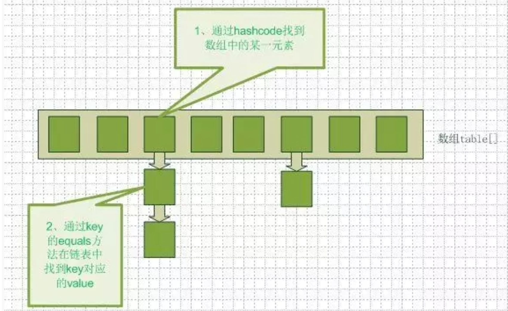
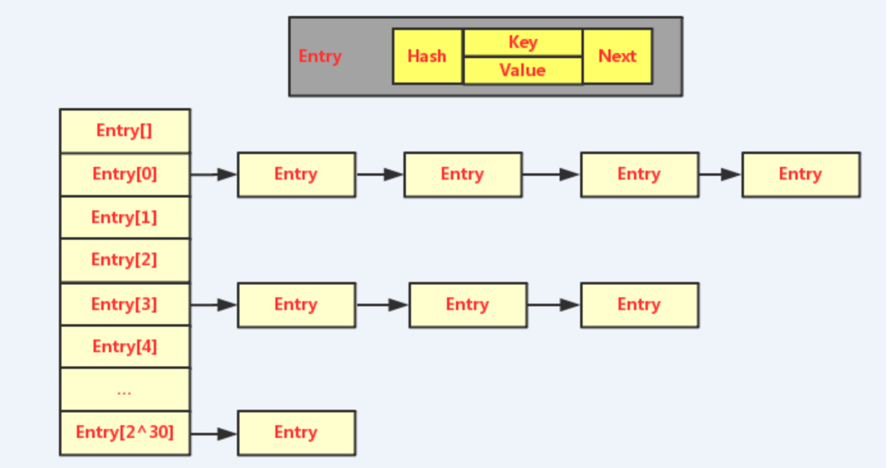
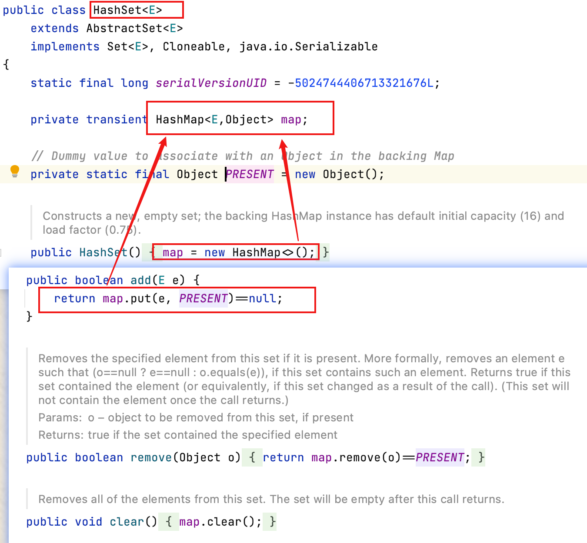
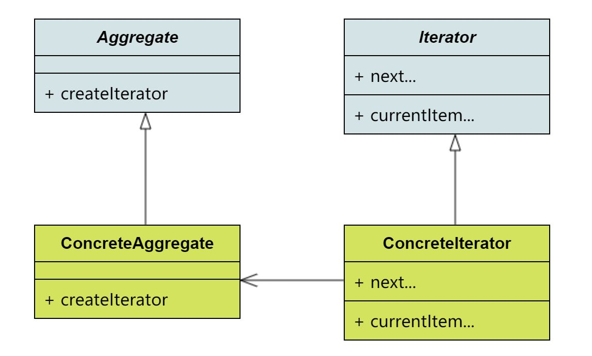

# 集合

- 笔记本：Java 基础面试题
- 创建时间：2021-03-15 13:40:10 UTC
- 更新时间：2021-03-16 05:26:14 UTC
- 印象笔记 GUID：6186524d-7420-46d8-a3f1-89eec797647f

#### 1. ArrayList 和 Vector 的区别

这两个类都实现了 List 接口(List 接口继承了 Collection 接口)，他们都是有序集合，即存储在这两个集合中的元素的位置都是有顺序的，相当于一种动态的数组，我们以后可以按位置索引号取出某个元素，并且其中的数据是允许重复的，这是 HashSet 之类的集合的最大不同处，HashSet 之类的集合不可以按索引号去检索其中的元素，也不允许有重复的元素(本来题目问的与 hashset 没有任何关系，但为了说清楚 ArrayList 与 Vector 的功能，我们使用对比方式，更有利于说明问题)。接着才说 ArrayList 与 Vector 的区别，这主要包括两个方面。

- **同步性:**
 **Vector(已被弃用) 是线程安全的**，也就是说是它的方法之间是线程同步的，而 **ArrayList 是线程序不安全的**，它的方法之间是线程不同步的。
 如果只有一个线程会访问到集合，那最好是使用 ArrayList，因为它不考虑线程安全，效率会高些；如果有多个线程会访问到集合，那最好是使用 Vector，因为不需要我们自己再去考虑和编写线程安全的代码。

- **数据增长:**
 ArrayList 与 Vector 都有一个初始的容量大小，当存储进它们里面的元素的个数超过了容量时，就需要增加 ArrayList 与 Vector 的存储空间，每次要增加存储空间时，不是只增加一个存储单元，而是增加多个存储单元，每次增加的存储单元的个数 在内存空间利用与程序效率之间要取得一定的平衡。Vector 默认增长为原来两倍，而 ArrayList 的增长策略在文档中没有明确规定(从源代码看到的是增长为原来的 1.5 倍)。ArrayList 与 Vector 都可以设置初始的空间大小，Vector 还可以设置增长的空间大小，而 ArrayList 没有提供设置增长空间的方法。
 **总结：** Vector 增长原来的一倍，ArrayList 增加原来的 0.5 倍。

**Tips：** 对于 Vector（弃用）&ArrayList、Hashtable（弃用，因为性能原因）&HashMap，要记住线程安全的问题，记住 Vector 与 Hashtable 是旧的，是 java 一诞生就提供了的，它们是线程安全的，ArrayList 与 HashMap 是 java2 时才提供的，它们是线程不安全的。CurrentHashMap？？？？

**个人总结：** ArrayList 速度快，线程不安全；Vector 线程安全，但是性能低已被废弃（HashTable 同理，可使用 ConcurrentHashMap）。当要存储的数据个数超过初始容量，Vector 增长为原来的一倍（可以设置），ArrayList 增加原来的 0.5 倍。

Vector 和 HashTable 被弃用后，它们被 ArrayList 和 HashMap 代替，但它们是线程不安全的，所以 Collections 工具类提供了相应的包装方法把它们包装成线程安全的集合。
 Collections 针对每种集合都声明了一个线程安全的包装类，在原集合的基础上添加了锁对象，集合中的每个方法都通过这个锁对象实现同步

```
List<String> list = Collections.synchronizedList(new ArrayList<String>());  // SynchronizedList

Set<String> set = Collections.synchronizedSet(new HashSet<String>());   // SynchronizedSet

Map<String, String> map = Collections.synchronizedMap(new HashMap<String, String>());   // SynchronizedMap

```

#### 2. 说说 ArrayList,Vector, LinkedList 的存储性能和特性。

ArrayList 和 Vector 都是使用数组方式存储数据，此数组元素数大于实际存储的数据以便增加和插入元素，它们都允许直接按序号索引元素，但是插入元素要涉及数组元素移动等内存操作，所以索引数据快而插入数据慢，Vector 由于使用了 synchronized 方法(线程安全)，通常性能上较 ArrayList 差，而 LinkedList 使用双向链表实现存储，按序号索引数据需要进行前向或后向遍历，但是插入数据时只需要记录本项的前后项即可，所以插入速度较快。
 **ArrayList 在查找时速度快，LinkedList 在插入与删除时更具优势。**

**个人总结：** ArrayList 和 Vector 底层是数组，因此查找速度快，但是插入删除时需要涉及到数组元素移动等内存操作，较 LinkedList 慢。LinkedList 使用双向链表存储数据，因此插入/删除时具有优势，但查找较 ArrayList 慢。Vector 由于使用 synchronized 性能比 ArrayList 差。

#### 3. 快速失败 (fail-fast) 和安全失败 (fail-safe) 的区别是什么?

Iterator 的安全失败是基于对底层集合做拷贝，因此，它不受源集合上修改的影响。**java.util 包下面的所有的集合类都是快速失败的**，而 **java.util.concurrent 包下面的所有的类都是安全失败的**。快速失败的迭代器会抛出 ConcurrentModificationException 异常，而安全失败的迭代器永远不会抛出这样的异常。

**个人总结：**
 **快速失败（fail-fast）** 在用迭代器遍历一个集合对象时，如果遍历过程中对集合对象的内容进行了修改（增加、删除、修改），则会抛出 ConcurrentModificationException。
 **原理：** 迭代器在遍历时直接访问集合中的内容，并且在遍历过程中使用一个 modCount 变量。集合在遍历过程中如果内容发生变化，就会改变 modCount 的值。每当迭代器使用 hasNext()/next() 遍历下一个元素之前，都会检测 modCount 变量是否为 expectmodCount 值，是的话就返回遍历；否则抛出异常，终止遍历。
 **安全失败（fail-safe）** 遍历时不是直接在集合内容上访问的，而是先复制原有集合内容，在拷贝的集合上进行遍历。因此遍历过程中对原集合所作的修改并不能被迭代器检测到，所以不会触发ConcurrentModificationException 。**缺点：** 不能访问到修改后的内容。

**区别：** java.util 包下的集合类都是快速失败的，不能在多线程下发生并发修改（迭代过程中被修改）。
 java.util.concurrent 包下的容器都是安全失败，可以在多线程下并发使用，并发修改。

#### 4. HashMap 的数据结构

jdk1.8以前是**数组+链表**
 jdk1.8以后是**数组+链表+红黑色**
 在 java 编程语言中，最基本的结构就是两种，一个是数组，另外一个是模拟指针(引用)，所有的数据结构都可以用这两个基本结构来构造的，hashmap 也不例外。Hashmap 实际上是一个数组和链表的结合体(在数据结构中，一般称之为“链表散列“)
 

**补充：**
 数据结构中有数组和链表来实现对数据的存储，但是这两种方式的优点和缺点都很明显：
 1，数组存储，它的存储区间是连续的，比较占内存，故空间复杂度高。但是利用二分法进行查找的话，效率高，时间复杂度为O(1)。其特点就是：存储区间连续，查找速度快，但是占内存严重，插入和删除就慢。
 2，链表查询，它的存储区间离散，占内存比较宽松，故空间复杂度低，但时间复杂度高，为O(n)。其特点就是存储空间离散，空间复杂度低，插入和删除方便，但是时间复杂度高，导致查询比较慢。

综合以上两者的特点，就产生了一个时间复杂度低，占内存比较宽松，增删改查都比较方便的数据结构，也就是经常提到的哈希表。

**哈希表**最常用的实现方法就是拉链法，也可以理解为“链表的数组”。其模型大概如下图所示：
 

#### 5. HashMap 的工作原理是什么?

Java 中的 HashMap 是以键值对 (key-value) 的形式存储元素的。HashMap 需要一个 hash 函数，它使用 hashCode()和 equals()方法来向集合 / 从集合添加和检索元素。当调用 put() 方法的时候，HashMap 会计算 key 的 hash 值，然后把键值对存储在集合中合适的索引上。如果 key 已经存在了，value 会被更新成新值。HashMap 的一些重要的特性是它的容量 (capacity)，负载因子 (load factor) 和扩容极限(threshold resizing)。

#### 6. Hashmap 什么时候进行扩容呢?

当 hashmap 中的元素个数超过数组大小**负载因子(load factor)** 时，就会进行数组扩容，loadFactor 的默认值为 0.75，也就是说，默认情况下，数组大小为 16，那么当 hashmap 中元素个数超过 16 * 0.75=12 的时候，就把数组的大小扩展为 2*16=32， 即扩大一倍，然后重新计算每个元素在数组中的位置，而这是一个非常消耗性能的操 作，所以如果我们已经预知 hashmap 中元素的个数，那么预设元素的个数能够有效 的提高 hashmap 的性能。比如说，我们有 1000 个元素 new HashMap(1000), 但是理论上来讲 new HashMap(1024) 更合适，不过上面 annegu 已经说过，即使 是 1000，hashmap 也自动会将其设置为 1024。 但是 new HashMap(1024) 还 不是更合适的，因为 0.75*1000 < 1000, 也就是说为了让 0.75 * size > 1000, 我们 必须这样 new HashMap(2048) 才最合适，既考虑了 & 的问题，也避免了 resize 的问题。

**个人总结：** HashMap 中默认的负载因子大小为0.75，当一个map填满了75%的bucket时候，和其它集合类(如ArrayList等)一样，将会创建原来HashMap大小的两倍的bucket数组，来重新调整map的大小，并将原来的对象放入新的bucket数组中。这个过程叫作rehashing，因为它调用hash方法找到新的bucket位置。这个值只可能在两个地方，一个是原下标的位置，另一种是在下标为<原下标+原容量>的位置。

#### 7. Hashmap table 的初始化时机是什么时候

一般情况下，在第一次 put 的时候，调用 resize 方法进行 table 的初始化（懒初始化，懒加载思想在很多框架中都有应用！）

- 默认情况下，初始化的 table.length = 16;

- 默认情况下，阀值 threshold = 12;（16 * 0.75）

- 默认情况下，能存放 12 个元素，当存放第 13 个元素后进行扩容

**tips:** 扩容时还是调用 resize()，但与初始化时不同

#### 8. List、Map、Set 三个接口，存取元素时，各有什么特点?

List 与 Set 都是单列元素的集合，它们有一个功共同的父接口，叫 Collection。Set 里面不允许有重复的元素，所谓重复，即不能有两个相等(注意，不是仅仅是相同)的对象，即假设 Set 集合中有了一个 A 对象，现在我要向 Set 集合再存入一个 B 对象，但 B 对象与 A 对象 equals 相等，则 B 对 象存储不进去，所以，Set 集合的 add 方法有一个 boolean 的返回值，当集合中 没有某个元素，此时 add 方法可成功加入该元素时，则返回 true，当集合含有与某 个元素 equals 相等的元素时，此时 add 方法无法加入该元素，返回结果为 false。 Set 取元素时，没法说取第几个，只能以 Iterator 接口取得所有的元素，再逐一遍历各个元素。

List 表示有先后顺序的集合(按先来后到的顺序排序)

Map 与 List 和 Set 不同，它是双列的集合，其中有 put 方法，定义如下: put(obj key,obj value)，每次存储时，要存储一对 key/value，不能存储重复的 key，这个重复的规则也是按 equals 比较相等。取则可以根据 key 获得相应的 value，即 get(Object key) 返回值为 key 所对应的 value。另外，也可以获得所有的 key 的结合，还可以获得所有的 value 的结合，还可以获得 key 和 value 组合 成的 Map.Entry 对象的集合。

List 以特定次序来持有元素，可有重复元素。Set 无法拥有重复元素, 内部排序。 Map 保存 key-value 值，value 可多值。

**个人总结：** Map 保存的是键值对，key 不能重复。Set 和 List 都是单列元素的集合。List 中元素可以重复有序，Set 中元素不能重复（Set并不是无序的，传统说的Set无序是指HashSet,它不能保证元素的添加顺序，更不能保证自然顺序，而Set的其他实现类是可以实现这两种顺序的。保证元素添加的顺序：LinkedHashSet，保证元素自然的顺序：TreeSet）

#### 9. Set 里的元素是不能重复的，那么用什么方法来区分重复与否呢?

Set 里的元素是不能重复的，元素重复与否是使用 equals() 方法进行判断的。
 equals() 和 == 方法决定引用值是否指向同一对象 equals() 在类中被覆盖，为的是当两个分离的对象的内容和类型相配的话，返回真值。

**个人总结：** Set 中元素是不能重复的是通过 `equals()` 方法来判断的。

#### 10. 两个对象值相同 (x.equals(y) == true)，但却可有不同的 hash code，这句话对不对?

对。如果对象要保存在 HashSet 或 HashMap 中，它们的 equals 相等，那么，它们的 hashcode 值就必须相等。
 如果不是要保存在 HashSet 或 HashMap，则与 hashcode 没有什么关系了，这时候 hashcode 不等是可以的，例如 arrayList 存储的对象就不用实现 hashcode，当然，通常都会去实现的。

#### 11. heap 和 stack 有什么区别？

Java 的内存分为两类，一类是栈内存，一类是堆内存。栈内存是指程序进入一个方法时，会为这个方法单独分配一块私属存储空间（栈帧），用于存储这个方法内部的局部变量，当这个方法结束时，分配给这个方法的栈会释放，这个栈中的变量也将随之释放。
 堆是与栈作用不同的内存，一般用于存放不放在当前方法栈中的那些数据，例如，使用 new 创建的对象都放在堆里，所以，它不会随方法的结束而消失。方法中的局部变量使用 final 修饰后，放在堆中，而不是栈中。

**个人总结：** 线程都私有栈，每个方法是一个栈帧，方法结束，栈帧弹出。
 堆中存放的是对象。

- 栈内存存储的是局部变量而堆内存存储的是实体；

- 栈内存的更新速度要快于堆内存，因为局部变量的生命周期很短；

- 栈内存存放的变量生命周期一旦结束就会被释放，而堆内存存放的实体会被垃圾回收机制不定时的回收。

#### 12. Java 集合类框架的基本接口有哪些?

- Collection:代表一组对象，每一个对象都是它的子元素。

- Set:不包含重复元素的 Collection。

- List:有顺序的 collection，并且可以包含重复元素。

- Map:可以把键 (key) 映射到值 (value) 的对象，键不能重复。

#### 13. HashSet、TreeSet、LinkedHashSet 有什么区别?

- HashSet 是由一个 hash 表来实现的，因此，它的元素是无序的。

- TreeSet 是由一个树形的结构来实现的，它里面的元素是有序的。

- LinkedHashSet 继承自 HashSet，内部使用的是 LinkHashMap。这样做的意义或者好处就是 LinkedHashSet 中的元素顺序是可以保证的，也就是说遍历序和插入序是一致的。

**个人总结：** HashSet 基于 hash 表实现，元素无序；TreeSet 基于树形结构，元素有序；LinkedHashSet 继承自 HashSet，基于 LinkHashMap，元素的插入顺序和遍历顺序是一致的。。

#### 14. HashSet 的底层实现是什么?

通过看源码知道 HashSet 的实现是依赖于 HashMap 的，HashSet 的值都是存储在 HashMap 中的。在 HashSet 的构造法中会初始化一个 HashMap 对象，HashSet 不允许值重复，因此，HashSet 的值是作为 HashMap 的 key 存储在 HashMap 中的，当存储的值已经存在时返回 false。
 

**个人总结：** HastSet 内聚合了一个 HashMap，内容实际上是保存在这个 map 中，对 set 的操作，本质上是在操作这个 map，set 的值保存在 map 的 key 中。

#### 15. LinkedHashMap 的实现原理?

LinkedHashMap 也是基于 HashMap 实现的，不同的是它定义了一个 Entry header，这个 header 不是放在 Table 里，它是额外独立出来的。
 LinkedHashMap 通过继承 hashMap 中的 Entry, 并添加两个属性 Entry before,after, 和 header 结合起来组成一个双向链表，来实现按插入顺序或访问顺序 排序。LinkedHashMap 定义了排序模式 accessOrder，该属性为 boolean 型变量，对于访问顺序，为 true;对于插入顺序，则为 false。一般情况下，不必指定排序模式，其迭代顺序即为默认为插入顺序。

#### 16. 为什么集合类没有实现 Cloneable 和 Serializable 接口?

克隆 (cloning) 或者是序列化 (serialization) 的语义和含义是跟具体的实现相关的。因此，应该由集合类的具体实现来决定如何被克隆或者是序列化。

#### 17. 什么是迭代器 (Iterator)?

Iterator 接口提供了很多对集合元素进行迭代的方法。每一个集合类都包含了可以返回迭代器实例的迭代方法。迭代器可以在迭代的过程中删除底层集合的元素, 但是不可以直接调用集合的 remove(Object Obj) 删除，可以通过迭代器的 remove() 方法删除。

**设计模式————迭代器模式：**
 在容器里存放了大量的同类型对象，我们如果想逐个访问容器中的对象，就必须要知道容器的结构。比如，ArrayList 和 LinkedList 的遍历方法一定是不一样的，如果再加上HashMap, TreeMap，以及我们现在正在研究的BinarySearchTree，对于容器的使用者而言，肯定是一个巨大的负担。作为容器的使用者，我肯定希望所有的容器能提供一个统一的接口，这个接口可以遍历容器中的所有内容，又可以把容器的细节屏蔽掉。

幸运的是，确实存在这样的一个统一的接口，这个接口就是 java.util.Iterator。先看类图，下面的这幅图所表示的意思就是，在一个容器类上实现createIterator方法，这个方法可以创建一个迭代器，使用这个迭代器就可以遍历容器中的所有元素了。
 

**个人总结：** 提供统一的对集合元素迭代的方法，每个容器提供方法返回一个实现迭代接口的迭代器类，通过迭代器就可以对不同的容器用统一的方式进行遍历。（缺点，每个容器都要创建对应的迭代器实现类）

#### 18. Iterator 和 ListIterator 的区别是什么?

- Iterator 可用来遍历 Set 和 List 集合，但是 ListIterator 只能用来遍历 List。

- Iterator 对集合只能是前向遍历，ListIterator 既可以前向也可以后向。

- ListIterator 实现了 Iterator 接口，并包含其他的功能，比如:增加元素，替换元 素，获取前一个和后一个元素的索引，等等。

#### 19. 数组 (Array) 和列表 (ArrayList) 有什么区别？什么时候应该使用 Array 而不是 ArrayList?

Array 可以包含基本类型和对象类型，ArrayList 只能包含对象类型。
 Array 大小是固定的，ArrayList 的大小是动态变化的。
 ArrayList 处理固定大小的基本数据类型的时候，这种方式相对比较慢。

#### 20. Java 集合类框架的最佳实践有哪些?

- 假如元素的大小是固定的，而且能事先知道，我们就应该用 Array 而不是 ArrayList。

- 有些集合类允许指定初始容量。因此，如果我们能估计出存储的元素的数目， 我们可以设置初始容量来避免重新计算 hash 值或者是扩容。

- 为了类型安全，可读性和健壮性的原因总是要使用泛型。同时，使用泛型还可 以避免运行时的 ClassCastException。

- 使用 JDK 提供的不变类 (immutable class) 作为 Map 的键可以避免为我们 自己的类实现 hashCode()和 equals()方法。

- 编程的时候接口优于实现。

- 底层的集合实际上是空的情况下，返回长度是 0 的集合或者是数组，不要返
 回 null。

**Tips:** 不变类 -> 不会发生变化的类，就是当类的实例创建后不会发生变化的类。
 eg：String Integer Boolean 等包装类
 不变类的好处：
 1.线程安全的，由于不变类的状态在创建后不会发生改变，所以可以进行线程间的数据共享，不需要同步.
 2.不变类的instance可以被重复使用(reuse).

#### 21. Comparable 和 Comparator 接口是干什么的?列出它们的区别

Java 提供了只包含一个 compareTo() 方法的 Comparable 接口。这个方法可以个给两个对象排序。具体来说，它返回负数，0，正数来表明输入对象小于，等于，大于已经存在的对象。
 Java 提供了包含 compare() 和 equals() 两个方法的 Comparator 接口。 compare() 方法用来给两个输入参数排序，返回负数，0，正数表明第一个参数是小于，等于，大于第二个参数。equals() 方法需要一个对象作为参数，它用来决定输入参数是否和 comparator 相等。只有当输入参数也是一个 comparator 并且输入参数和当前 comparator 的排序结果是相同的时候，这个方法才返回 true。

Comparable是排序接口；若一个类实现了Comparable接口，就意味着“该类支持排序”。
 而Comparator是比较器；我们若需要控制某个类的次序，可以建立一个“该类的比较器”来进行排序。

我们不难发现：Comparable相当于“内部比较器”，而Comparator相当于“外部比较器”。

#### 22. Collection 和 Collections 的区别

collection 是集合类的上级接口, 继承与它的接口主要是 set 和 list。
 collections 类是针对集合类的一个帮助类. 它提供一系列的静态方法对各种集合的搜索, 排序, 线程安全化等操作。

%23%23%23%23%201.%20ArrayList%20%E5%92%8C%20Vector%20%E7%9A%84%E5%8C%BA%E5%88%AB%0A%E8%BF%99%E4%B8%A4%E4%B8%AA%E7%B1%BB%E9%83%BD%E5%AE%9E%E7%8E%B0%E4%BA%86%20List%20%E6%8E%A5%E5%8F%A3(List%20%E6%8E%A5%E5%8F%A3%E7%BB%A7%E6%89%BF%E4%BA%86%20Collection%20%E6%8E%A5%E5%8F%A3)%EF%BC%8C%E4%BB%96%E4%BB%AC%E9%83%BD%E6%98%AF%E6%9C%89%E5%BA%8F%E9%9B%86%E5%90%88%EF%BC%8C%E5%8D%B3%E5%AD%98%E5%82%A8%E5%9C%A8%E8%BF%99%E4%B8%A4%E4%B8%AA%E9%9B%86%E5%90%88%E4%B8%AD%E7%9A%84%E5%85%83%E7%B4%A0%E7%9A%84%E4%BD%8D%E7%BD%AE%E9%83%BD%E6%98%AF%E6%9C%89%E9%A1%BA%E5%BA%8F%E7%9A%84%EF%BC%8C%E7%9B%B8%E5%BD%93%E4%BA%8E%E4%B8%80%E7%A7%8D%E5%8A%A8%E6%80%81%E7%9A%84%E6%95%B0%E7%BB%84%EF%BC%8C%E6%88%91%E4%BB%AC%E4%BB%A5%E5%90%8E%E5%8F%AF%E4%BB%A5%E6%8C%89%E4%BD%8D%E7%BD%AE%E7%B4%A2%E5%BC%95%E5%8F%B7%E5%8F%96%E5%87%BA%E6%9F%90%E4%B8%AA%E5%85%83%E7%B4%A0%EF%BC%8C%E5%B9%B6%E4%B8%94%E5%85%B6%E4%B8%AD%E7%9A%84%E6%95%B0%E6%8D%AE%E6%98%AF%E5%85%81%E8%AE%B8%E9%87%8D%E5%A4%8D%E7%9A%84%EF%BC%8C%E8%BF%99%E6%98%AF%20HashSet%20%E4%B9%8B%E7%B1%BB%E7%9A%84%E9%9B%86%E5%90%88%E7%9A%84%E6%9C%80%E5%A4%A7%E4%B8%8D%E5%90%8C%E5%A4%84%EF%BC%8CHashSet%20%E4%B9%8B%E7%B1%BB%E7%9A%84%E9%9B%86%E5%90%88%E4%B8%8D%E5%8F%AF%E4%BB%A5%E6%8C%89%E7%B4%A2%E5%BC%95%E5%8F%B7%E5%8E%BB%E6%A3%80%E7%B4%A2%E5%85%B6%E4%B8%AD%E7%9A%84%E5%85%83%E7%B4%A0%EF%BC%8C%E4%B9%9F%E4%B8%8D%E5%85%81%E8%AE%B8%E6%9C%89%E9%87%8D%E5%A4%8D%E7%9A%84%E5%85%83%E7%B4%A0(%E6%9C%AC%E6%9D%A5%E9%A2%98%E7%9B%AE%E9%97%AE%E7%9A%84%E4%B8%8E%20hashset%20%E6%B2%A1%E6%9C%89%E4%BB%BB%E4%BD%95%E5%85%B3%E7%B3%BB%EF%BC%8C%E4%BD%86%E4%B8%BA%E4%BA%86%E8%AF%B4%E6%B8%85%E6%A5%9A%20ArrayList%20%E4%B8%8E%20Vector%20%E7%9A%84%E5%8A%9F%E8%83%BD%EF%BC%8C%E6%88%91%E4%BB%AC%E4%BD%BF%E7%94%A8%E5%AF%B9%E6%AF%94%E6%96%B9%E5%BC%8F%EF%BC%8C%E6%9B%B4%E6%9C%89%E5%88%A9%E4%BA%8E%E8%AF%B4%E6%98%8E%E9%97%AE%E9%A2%98)%E3%80%82%E6%8E%A5%E7%9D%80%E6%89%8D%E8%AF%B4%20ArrayList%20%E4%B8%8E%20Vector%20%E7%9A%84%E5%8C%BA%E5%88%AB%EF%BC%8C%E8%BF%99%E4%B8%BB%E8%A6%81%E5%8C%85%E6%8B%AC%E4%B8%A4%E4%B8%AA%E6%96%B9%E9%9D%A2%E3%80%82%0A-%20**%E5%90%8C%E6%AD%A5%E6%80%A7%3A**%0A**Vector(%E5%B7%B2%E8%A2%AB%E5%BC%83%E7%94%A8)%20%E6%98%AF%E7%BA%BF%E7%A8%8B%E5%AE%89%E5%85%A8%E7%9A%84**%EF%BC%8C%E4%B9%9F%E5%B0%B1%E6%98%AF%E8%AF%B4%E6%98%AF%E5%AE%83%E7%9A%84%E6%96%B9%E6%B3%95%E4%B9%8B%E9%97%B4%E6%98%AF%E7%BA%BF%E7%A8%8B%E5%90%8C%E6%AD%A5%E7%9A%84%EF%BC%8C%E8%80%8C%20**ArrayList%20%E6%98%AF%E7%BA%BF%E7%A8%8B%E5%BA%8F%E4%B8%8D%E5%AE%89%E5%85%A8%E7%9A%84**%EF%BC%8C%E5%AE%83%E7%9A%84%E6%96%B9%E6%B3%95%E4%B9%8B%E9%97%B4%E6%98%AF%E7%BA%BF%E7%A8%8B%E4%B8%8D%E5%90%8C%E6%AD%A5%E7%9A%84%E3%80%82%0A%E5%A6%82%E6%9E%9C%E5%8F%AA%E6%9C%89%E4%B8%80%E4%B8%AA%E7%BA%BF%E7%A8%8B%E4%BC%9A%E8%AE%BF%E9%97%AE%E5%88%B0%E9%9B%86%E5%90%88%EF%BC%8C%E9%82%A3%E6%9C%80%E5%A5%BD%E6%98%AF%E4%BD%BF%E7%94%A8%20ArrayList%EF%BC%8C%E5%9B%A0%E4%B8%BA%E5%AE%83%E4%B8%8D%E8%80%83%E8%99%91%E7%BA%BF%E7%A8%8B%E5%AE%89%E5%85%A8%EF%BC%8C%E6%95%88%E7%8E%87%E4%BC%9A%E9%AB%98%E4%BA%9B%EF%BC%9B%E5%A6%82%E6%9E%9C%E6%9C%89%E5%A4%9A%E4%B8%AA%E7%BA%BF%E7%A8%8B%E4%BC%9A%E8%AE%BF%E9%97%AE%E5%88%B0%E9%9B%86%E5%90%88%EF%BC%8C%E9%82%A3%E6%9C%80%E5%A5%BD%E6%98%AF%E4%BD%BF%E7%94%A8%20Vector%EF%BC%8C%E5%9B%A0%E4%B8%BA%E4%B8%8D%E9%9C%80%E8%A6%81%E6%88%91%E4%BB%AC%E8%87%AA%E5%B7%B1%E5%86%8D%E5%8E%BB%E8%80%83%E8%99%91%E5%92%8C%E7%BC%96%E5%86%99%E7%BA%BF%E7%A8%8B%E5%AE%89%E5%85%A8%E7%9A%84%E4%BB%A3%E7%A0%81%E3%80%82%0A-%20**%E6%95%B0%E6%8D%AE%E5%A2%9E%E9%95%BF%3A**%0AArrayList%20%E4%B8%8E%20Vector%20%E9%83%BD%E6%9C%89%E4%B8%80%E4%B8%AA%E5%88%9D%E5%A7%8B%E7%9A%84%E5%AE%B9%E9%87%8F%E5%A4%A7%E5%B0%8F%EF%BC%8C%E5%BD%93%E5%AD%98%E5%82%A8%E8%BF%9B%E5%AE%83%E4%BB%AC%E9%87%8C%E9%9D%A2%E7%9A%84%E5%85%83%E7%B4%A0%E7%9A%84%E4%B8%AA%E6%95%B0%E8%B6%85%E8%BF%87%E4%BA%86%E5%AE%B9%E9%87%8F%E6%97%B6%EF%BC%8C%E5%B0%B1%E9%9C%80%E8%A6%81%E5%A2%9E%E5%8A%A0%20ArrayList%20%E4%B8%8E%20Vector%20%E7%9A%84%E5%AD%98%E5%82%A8%E7%A9%BA%E9%97%B4%EF%BC%8C%E6%AF%8F%E6%AC%A1%E8%A6%81%E5%A2%9E%E5%8A%A0%E5%AD%98%E5%82%A8%E7%A9%BA%E9%97%B4%E6%97%B6%EF%BC%8C%E4%B8%8D%E6%98%AF%E5%8F%AA%E5%A2%9E%E5%8A%A0%E4%B8%80%E4%B8%AA%E5%AD%98%E5%82%A8%E5%8D%95%E5%85%83%EF%BC%8C%E8%80%8C%E6%98%AF%E5%A2%9E%E5%8A%A0%E5%A4%9A%E4%B8%AA%E5%AD%98%E5%82%A8%E5%8D%95%E5%85%83%EF%BC%8C%E6%AF%8F%E6%AC%A1%E5%A2%9E%E5%8A%A0%E7%9A%84%E5%AD%98%E5%82%A8%E5%8D%95%E5%85%83%E7%9A%84%E4%B8%AA%E6%95%B0%20%E5%9C%A8%E5%86%85%E5%AD%98%E7%A9%BA%E9%97%B4%E5%88%A9%E7%94%A8%E4%B8%8E%E7%A8%8B%E5%BA%8F%E6%95%88%E7%8E%87%E4%B9%8B%E9%97%B4%E8%A6%81%E5%8F%96%E5%BE%97%E4%B8%80%E5%AE%9A%E7%9A%84%E5%B9%B3%E8%A1%A1%E3%80%82Vector%20%E9%BB%98%E8%AE%A4%E5%A2%9E%E9%95%BF%E4%B8%BA%E5%8E%9F%E6%9D%A5%E4%B8%A4%E5%80%8D%EF%BC%8C%E8%80%8C%20ArrayList%20%E7%9A%84%E5%A2%9E%E9%95%BF%E7%AD%96%E7%95%A5%E5%9C%A8%E6%96%87%E6%A1%A3%E4%B8%AD%E6%B2%A1%E6%9C%89%E6%98%8E%E7%A1%AE%E8%A7%84%E5%AE%9A(%E4%BB%8E%E6%BA%90%E4%BB%A3%E7%A0%81%E7%9C%8B%E5%88%B0%E7%9A%84%E6%98%AF%E5%A2%9E%E9%95%BF%E4%B8%BA%E5%8E%9F%E6%9D%A5%E7%9A%84%201.5%20%E5%80%8D)%E3%80%82ArrayList%20%E4%B8%8E%20Vector%20%E9%83%BD%E5%8F%AF%E4%BB%A5%E8%AE%BE%E7%BD%AE%E5%88%9D%E5%A7%8B%E7%9A%84%E7%A9%BA%E9%97%B4%E5%A4%A7%E5%B0%8F%EF%BC%8CVector%20%E8%BF%98%E5%8F%AF%E4%BB%A5%E8%AE%BE%E7%BD%AE%E5%A2%9E%E9%95%BF%E7%9A%84%E7%A9%BA%E9%97%B4%E5%A4%A7%E5%B0%8F%EF%BC%8C%E8%80%8C%20ArrayList%20%E6%B2%A1%E6%9C%89%E6%8F%90%E4%BE%9B%E8%AE%BE%E7%BD%AE%E5%A2%9E%E9%95%BF%E7%A9%BA%E9%97%B4%E7%9A%84%E6%96%B9%E6%B3%95%E3%80%82%0A**%E6%80%BB%E7%BB%93%EF%BC%9A**%20Vector%20%E5%A2%9E%E9%95%BF%E5%8E%9F%E6%9D%A5%E7%9A%84%E4%B8%80%E5%80%8D%EF%BC%8CArrayList%20%E5%A2%9E%E5%8A%A0%E5%8E%9F%E6%9D%A5%E7%9A%84%200.5%20%E5%80%8D%E3%80%82%0A%0A**Tips%EF%BC%9A**%20%E5%AF%B9%E4%BA%8E%20Vector%EF%BC%88%E5%BC%83%E7%94%A8%EF%BC%89%26ArrayList%E3%80%81Hashtable%EF%BC%88%E5%BC%83%E7%94%A8%EF%BC%8C%E5%9B%A0%E4%B8%BA%E6%80%A7%E8%83%BD%E5%8E%9F%E5%9B%A0%EF%BC%89%26HashMap%EF%BC%8C%E8%A6%81%E8%AE%B0%E4%BD%8F%E7%BA%BF%E7%A8%8B%E5%AE%89%E5%85%A8%E7%9A%84%E9%97%AE%E9%A2%98%EF%BC%8C%E8%AE%B0%E4%BD%8F%20Vector%20%E4%B8%8E%20Hashtable%20%E6%98%AF%E6%97%A7%E7%9A%84%EF%BC%8C%E6%98%AF%20java%20%E4%B8%80%E8%AF%9E%E7%94%9F%E5%B0%B1%E6%8F%90%E4%BE%9B%E4%BA%86%E7%9A%84%EF%BC%8C%E5%AE%83%E4%BB%AC%E6%98%AF%E7%BA%BF%E7%A8%8B%E5%AE%89%E5%85%A8%E7%9A%84%EF%BC%8CArrayList%20%E4%B8%8E%20HashMap%20%E6%98%AF%20java2%20%E6%97%B6%E6%89%8D%E6%8F%90%E4%BE%9B%E7%9A%84%EF%BC%8C%E5%AE%83%E4%BB%AC%E6%98%AF%E7%BA%BF%E7%A8%8B%E4%B8%8D%E5%AE%89%E5%85%A8%E7%9A%84%E3%80%82CurrentHashMap%EF%BC%9F%EF%BC%9F%EF%BC%9F%EF%BC%9F%0A%0A**%E4%B8%AA%E4%BA%BA%E6%80%BB%E7%BB%93%EF%BC%9A**%20ArrayList%20%E9%80%9F%E5%BA%A6%E5%BF%AB%EF%BC%8C%E7%BA%BF%E7%A8%8B%E4%B8%8D%E5%AE%89%E5%85%A8%EF%BC%9BVector%20%E7%BA%BF%E7%A8%8B%E5%AE%89%E5%85%A8%EF%BC%8C%E4%BD%86%E6%98%AF%E6%80%A7%E8%83%BD%E4%BD%8E%E5%B7%B2%E8%A2%AB%E5%BA%9F%E5%BC%83%EF%BC%88HashTable%20%E5%90%8C%E7%90%86%EF%BC%8C%E5%8F%AF%E4%BD%BF%E7%94%A8%20ConcurrentHashMap%EF%BC%89%E3%80%82%E5%BD%93%E8%A6%81%E5%AD%98%E5%82%A8%E7%9A%84%E6%95%B0%E6%8D%AE%E4%B8%AA%E6%95%B0%E8%B6%85%E8%BF%87%E5%88%9D%E5%A7%8B%E5%AE%B9%E9%87%8F%EF%BC%8CVector%20%E5%A2%9E%E9%95%BF%E4%B8%BA%E5%8E%9F%E6%9D%A5%E7%9A%84%E4%B8%80%E5%80%8D%EF%BC%88%E5%8F%AF%E4%BB%A5%E8%AE%BE%E7%BD%AE%EF%BC%89%EF%BC%8CArrayList%20%E5%A2%9E%E5%8A%A0%E5%8E%9F%E6%9D%A5%E7%9A%84%200.5%20%E5%80%8D%E3%80%82%0A%0AVector%20%E5%92%8C%20HashTable%20%E8%A2%AB%E5%BC%83%E7%94%A8%E5%90%8E%EF%BC%8C%E5%AE%83%E4%BB%AC%E8%A2%AB%20ArrayList%20%E5%92%8C%20HashMap%20%E4%BB%A3%E6%9B%BF%EF%BC%8C%E4%BD%86%E5%AE%83%E4%BB%AC%E6%98%AF%E7%BA%BF%E7%A8%8B%E4%B8%8D%E5%AE%89%E5%85%A8%E7%9A%84%EF%BC%8C%E6%89%80%E4%BB%A5%20Collections%20%E5%B7%A5%E5%85%B7%E7%B1%BB%E6%8F%90%E4%BE%9B%E4%BA%86%E7%9B%B8%E5%BA%94%E7%9A%84%E5%8C%85%E8%A3%85%E6%96%B9%E6%B3%95%E6%8A%8A%E5%AE%83%E4%BB%AC%E5%8C%85%E8%A3%85%E6%88%90%E7%BA%BF%E7%A8%8B%E5%AE%89%E5%85%A8%E7%9A%84%E9%9B%86%E5%90%88%E3%80%82%0ACollections%20%E9%92%88%E5%AF%B9%E6%AF%8F%E7%A7%8D%E9%9B%86%E5%90%88%E9%83%BD%E5%A3%B0%E6%98%8E%E4%BA%86%E4%B8%80%E4%B8%AA%E7%BA%BF%E7%A8%8B%E5%AE%89%E5%85%A8%E7%9A%84%E5%8C%85%E8%A3%85%E7%B1%BB%EF%BC%8C%E5%9C%A8%E5%8E%9F%E9%9B%86%E5%90%88%E7%9A%84%E5%9F%BA%E7%A1%80%E4%B8%8A%E6%B7%BB%E5%8A%A0%E4%BA%86%E9%94%81%E5%AF%B9%E8%B1%A1%EF%BC%8C%E9%9B%86%E5%90%88%E4%B8%AD%E7%9A%84%E6%AF%8F%E4%B8%AA%E6%96%B9%E6%B3%95%E9%83%BD%E9%80%9A%E8%BF%87%E8%BF%99%E4%B8%AA%E9%94%81%E5%AF%B9%E8%B1%A1%E5%AE%9E%E7%8E%B0%E5%90%8C%E6%AD%A5%0A%60%60%60java%0AList%3CString%3E%20list%20%3D%20Collections.synchronizedList(new%20ArrayList%3CString%3E())%3B%20%20%2F%2F%20SynchronizedList%0A%0ASet%3CString%3E%20set%20%3D%20Collections.synchronizedSet(new%20HashSet%3CString%3E())%3B%20%20%20%2F%2F%20SynchronizedSet%0A%0AMap%3CString%2C%20String%3E%20map%20%3D%20Collections.synchronizedMap(new%20HashMap%3CString%2C%20String%3E())%3B%20%20%20%2F%2F%20SynchronizedMap%0A%60%60%60%0A%0A%23%23%23%23%202.%20%E8%AF%B4%E8%AF%B4%20ArrayList%2CVector%2C%20LinkedList%20%E7%9A%84%E5%AD%98%E5%82%A8%E6%80%A7%E8%83%BD%E5%92%8C%E7%89%B9%E6%80%A7%E3%80%82%0AArrayList%20%E5%92%8C%20Vector%20%E9%83%BD%E6%98%AF%E4%BD%BF%E7%94%A8%E6%95%B0%E7%BB%84%E6%96%B9%E5%BC%8F%E5%AD%98%E5%82%A8%E6%95%B0%E6%8D%AE%EF%BC%8C%E6%AD%A4%E6%95%B0%E7%BB%84%E5%85%83%E7%B4%A0%E6%95%B0%E5%A4%A7%E4%BA%8E%E5%AE%9E%E9%99%85%E5%AD%98%E5%82%A8%E7%9A%84%E6%95%B0%E6%8D%AE%E4%BB%A5%E4%BE%BF%E5%A2%9E%E5%8A%A0%E5%92%8C%E6%8F%92%E5%85%A5%E5%85%83%E7%B4%A0%EF%BC%8C%E5%AE%83%E4%BB%AC%E9%83%BD%E5%85%81%E8%AE%B8%E7%9B%B4%E6%8E%A5%E6%8C%89%E5%BA%8F%E5%8F%B7%E7%B4%A2%E5%BC%95%E5%85%83%E7%B4%A0%EF%BC%8C%E4%BD%86%E6%98%AF%E6%8F%92%E5%85%A5%E5%85%83%E7%B4%A0%E8%A6%81%E6%B6%89%E5%8F%8A%E6%95%B0%E7%BB%84%E5%85%83%E7%B4%A0%E7%A7%BB%E5%8A%A8%E7%AD%89%E5%86%85%E5%AD%98%E6%93%8D%E4%BD%9C%EF%BC%8C%E6%89%80%E4%BB%A5%E7%B4%A2%E5%BC%95%E6%95%B0%E6%8D%AE%E5%BF%AB%E8%80%8C%E6%8F%92%E5%85%A5%E6%95%B0%E6%8D%AE%E6%85%A2%EF%BC%8CVector%20%E7%94%B1%E4%BA%8E%E4%BD%BF%E7%94%A8%E4%BA%86%20synchronized%20%E6%96%B9%E6%B3%95(%E7%BA%BF%E7%A8%8B%E5%AE%89%E5%85%A8)%EF%BC%8C%E9%80%9A%E5%B8%B8%E6%80%A7%E8%83%BD%E4%B8%8A%E8%BE%83%20ArrayList%20%E5%B7%AE%EF%BC%8C%E8%80%8C%20LinkedList%20%E4%BD%BF%E7%94%A8%E5%8F%8C%E5%90%91%E9%93%BE%E8%A1%A8%E5%AE%9E%E7%8E%B0%E5%AD%98%E5%82%A8%EF%BC%8C%E6%8C%89%E5%BA%8F%E5%8F%B7%E7%B4%A2%E5%BC%95%E6%95%B0%E6%8D%AE%E9%9C%80%E8%A6%81%E8%BF%9B%E8%A1%8C%E5%89%8D%E5%90%91%E6%88%96%E5%90%8E%E5%90%91%E9%81%8D%E5%8E%86%EF%BC%8C%E4%BD%86%E6%98%AF%E6%8F%92%E5%85%A5%E6%95%B0%E6%8D%AE%E6%97%B6%E5%8F%AA%E9%9C%80%E8%A6%81%E8%AE%B0%E5%BD%95%E6%9C%AC%E9%A1%B9%E7%9A%84%E5%89%8D%E5%90%8E%E9%A1%B9%E5%8D%B3%E5%8F%AF%EF%BC%8C%E6%89%80%E4%BB%A5%E6%8F%92%E5%85%A5%E9%80%9F%E5%BA%A6%E8%BE%83%E5%BF%AB%E3%80%82%0A**ArrayList%20%E5%9C%A8%E6%9F%A5%E6%89%BE%E6%97%B6%E9%80%9F%E5%BA%A6%E5%BF%AB%EF%BC%8CLinkedList%20%E5%9C%A8%E6%8F%92%E5%85%A5%E4%B8%8E%E5%88%A0%E9%99%A4%E6%97%B6%E6%9B%B4%E5%85%B7%E4%BC%98%E5%8A%BF%E3%80%82**%0A%0A**%E4%B8%AA%E4%BA%BA%E6%80%BB%E7%BB%93%EF%BC%9A**%20ArrayList%20%E5%92%8C%20Vector%20%E5%BA%95%E5%B1%82%E6%98%AF%E6%95%B0%E7%BB%84%EF%BC%8C%E5%9B%A0%E6%AD%A4%E6%9F%A5%E6%89%BE%E9%80%9F%E5%BA%A6%E5%BF%AB%EF%BC%8C%E4%BD%86%E6%98%AF%E6%8F%92%E5%85%A5%E5%88%A0%E9%99%A4%E6%97%B6%E9%9C%80%E8%A6%81%E6%B6%89%E5%8F%8A%E5%88%B0%E6%95%B0%E7%BB%84%E5%85%83%E7%B4%A0%E7%A7%BB%E5%8A%A8%E7%AD%89%E5%86%85%E5%AD%98%E6%93%8D%E4%BD%9C%EF%BC%8C%E8%BE%83%20LinkedList%20%E6%85%A2%E3%80%82LinkedList%20%E4%BD%BF%E7%94%A8%E5%8F%8C%E5%90%91%E9%93%BE%E8%A1%A8%E5%AD%98%E5%82%A8%E6%95%B0%E6%8D%AE%EF%BC%8C%E5%9B%A0%E6%AD%A4%E6%8F%92%E5%85%A5%2F%E5%88%A0%E9%99%A4%E6%97%B6%E5%85%B7%E6%9C%89%E4%BC%98%E5%8A%BF%EF%BC%8C%E4%BD%86%E6%9F%A5%E6%89%BE%E8%BE%83%20ArrayList%20%E6%85%A2%E3%80%82Vector%20%E7%94%B1%E4%BA%8E%E4%BD%BF%E7%94%A8%20synchronized%20%E6%80%A7%E8%83%BD%E6%AF%94%20ArrayList%20%E5%B7%AE%E3%80%82%0A%0A%23%23%23%23%203.%20%E5%BF%AB%E9%80%9F%E5%A4%B1%E8%B4%A5%20(fail-fast)%20%E5%92%8C%E5%AE%89%E5%85%A8%E5%A4%B1%E8%B4%A5%20(fail-safe)%20%E7%9A%84%E5%8C%BA%E5%88%AB%E6%98%AF%E4%BB%80%E4%B9%88%3F%0AIterator%20%E7%9A%84%E5%AE%89%E5%85%A8%E5%A4%B1%E8%B4%A5%E6%98%AF%E5%9F%BA%E4%BA%8E%E5%AF%B9%E5%BA%95%E5%B1%82%E9%9B%86%E5%90%88%E5%81%9A%E6%8B%B7%E8%B4%9D%EF%BC%8C%E5%9B%A0%E6%AD%A4%EF%BC%8C%E5%AE%83%E4%B8%8D%E5%8F%97%E6%BA%90%E9%9B%86%E5%90%88%E4%B8%8A%E4%BF%AE%E6%94%B9%E7%9A%84%E5%BD%B1%E5%93%8D%E3%80%82**java.util%20%E5%8C%85%E4%B8%8B%E9%9D%A2%E7%9A%84%E6%89%80%E6%9C%89%E7%9A%84%E9%9B%86%E5%90%88%E7%B1%BB%E9%83%BD%E6%98%AF%E5%BF%AB%E9%80%9F%E5%A4%B1%E8%B4%A5%E7%9A%84**%EF%BC%8C%E8%80%8C%20**java.util.concurrent%20%E5%8C%85%E4%B8%8B%E9%9D%A2%E7%9A%84%E6%89%80%E6%9C%89%E7%9A%84%E7%B1%BB%E9%83%BD%E6%98%AF%E5%AE%89%E5%85%A8%E5%A4%B1%E8%B4%A5%E7%9A%84**%E3%80%82%E5%BF%AB%E9%80%9F%E5%A4%B1%E8%B4%A5%E7%9A%84%E8%BF%AD%E4%BB%A3%E5%99%A8%E4%BC%9A%E6%8A%9B%E5%87%BA%20ConcurrentModificationException%20%E5%BC%82%E5%B8%B8%EF%BC%8C%E8%80%8C%E5%AE%89%E5%85%A8%E5%A4%B1%E8%B4%A5%E7%9A%84%E8%BF%AD%E4%BB%A3%E5%99%A8%E6%B0%B8%E8%BF%9C%E4%B8%8D%E4%BC%9A%E6%8A%9B%E5%87%BA%E8%BF%99%E6%A0%B7%E7%9A%84%E5%BC%82%E5%B8%B8%E3%80%82%0A%0A**%E4%B8%AA%E4%BA%BA%E6%80%BB%E7%BB%93%EF%BC%9A**%20%0A**%E5%BF%AB%E9%80%9F%E5%A4%B1%E8%B4%A5%EF%BC%88fail-fast%EF%BC%89**%20%E5%9C%A8%E7%94%A8%E8%BF%AD%E4%BB%A3%E5%99%A8%E9%81%8D%E5%8E%86%E4%B8%80%E4%B8%AA%E9%9B%86%E5%90%88%E5%AF%B9%E8%B1%A1%E6%97%B6%EF%BC%8C%E5%A6%82%E6%9E%9C%E9%81%8D%E5%8E%86%E8%BF%87%E7%A8%8B%E4%B8%AD%E5%AF%B9%E9%9B%86%E5%90%88%E5%AF%B9%E8%B1%A1%E7%9A%84%E5%86%85%E5%AE%B9%E8%BF%9B%E8%A1%8C%E4%BA%86%E4%BF%AE%E6%94%B9%EF%BC%88%E5%A2%9E%E5%8A%A0%E3%80%81%E5%88%A0%E9%99%A4%E3%80%81%E4%BF%AE%E6%94%B9%EF%BC%89%EF%BC%8C%E5%88%99%E4%BC%9A%E6%8A%9B%E5%87%BA%20ConcurrentModificationException%E3%80%82%0A**%E5%8E%9F%E7%90%86%EF%BC%9A**%20%E8%BF%AD%E4%BB%A3%E5%99%A8%E5%9C%A8%E9%81%8D%E5%8E%86%E6%97%B6%E7%9B%B4%E6%8E%A5%E8%AE%BF%E9%97%AE%E9%9B%86%E5%90%88%E4%B8%AD%E7%9A%84%E5%86%85%E5%AE%B9%EF%BC%8C%E5%B9%B6%E4%B8%94%E5%9C%A8%E9%81%8D%E5%8E%86%E8%BF%87%E7%A8%8B%E4%B8%AD%E4%BD%BF%E7%94%A8%E4%B8%80%E4%B8%AA%20modCount%20%E5%8F%98%E9%87%8F%E3%80%82%E9%9B%86%E5%90%88%E5%9C%A8%E9%81%8D%E5%8E%86%E8%BF%87%E7%A8%8B%E4%B8%AD%E5%A6%82%E6%9E%9C%E5%86%85%E5%AE%B9%E5%8F%91%E7%94%9F%E5%8F%98%E5%8C%96%EF%BC%8C%E5%B0%B1%E4%BC%9A%E6%94%B9%E5%8F%98%20modCount%20%E7%9A%84%E5%80%BC%E3%80%82%E6%AF%8F%E5%BD%93%E8%BF%AD%E4%BB%A3%E5%99%A8%E4%BD%BF%E7%94%A8%20hasNext()%2Fnext()%20%E9%81%8D%E5%8E%86%E4%B8%8B%E4%B8%80%E4%B8%AA%E5%85%83%E7%B4%A0%E4%B9%8B%E5%89%8D%EF%BC%8C%E9%83%BD%E4%BC%9A%E6%A3%80%E6%B5%8B%20modCount%20%E5%8F%98%E9%87%8F%E6%98%AF%E5%90%A6%E4%B8%BA%20expectmodCount%20%E5%80%BC%EF%BC%8C%E6%98%AF%E7%9A%84%E8%AF%9D%E5%B0%B1%E8%BF%94%E5%9B%9E%E9%81%8D%E5%8E%86%EF%BC%9B%E5%90%A6%E5%88%99%E6%8A%9B%E5%87%BA%E5%BC%82%E5%B8%B8%EF%BC%8C%E7%BB%88%E6%AD%A2%E9%81%8D%E5%8E%86%E3%80%82%0A**%E5%AE%89%E5%85%A8%E5%A4%B1%E8%B4%A5%EF%BC%88fail-safe%EF%BC%89**%20%E9%81%8D%E5%8E%86%E6%97%B6%E4%B8%8D%E6%98%AF%E7%9B%B4%E6%8E%A5%E5%9C%A8%E9%9B%86%E5%90%88%E5%86%85%E5%AE%B9%E4%B8%8A%E8%AE%BF%E9%97%AE%E7%9A%84%EF%BC%8C%E8%80%8C%E6%98%AF%E5%85%88%E5%A4%8D%E5%88%B6%E5%8E%9F%E6%9C%89%E9%9B%86%E5%90%88%E5%86%85%E5%AE%B9%EF%BC%8C%E5%9C%A8%E6%8B%B7%E8%B4%9D%E7%9A%84%E9%9B%86%E5%90%88%E4%B8%8A%E8%BF%9B%E8%A1%8C%E9%81%8D%E5%8E%86%E3%80%82%E5%9B%A0%E6%AD%A4%E9%81%8D%E5%8E%86%E8%BF%87%E7%A8%8B%E4%B8%AD%E5%AF%B9%E5%8E%9F%E9%9B%86%E5%90%88%E6%89%80%E4%BD%9C%E7%9A%84%E4%BF%AE%E6%94%B9%E5%B9%B6%E4%B8%8D%E8%83%BD%E8%A2%AB%E8%BF%AD%E4%BB%A3%E5%99%A8%E6%A3%80%E6%B5%8B%E5%88%B0%EF%BC%8C%E6%89%80%E4%BB%A5%E4%B8%8D%E4%BC%9A%E8%A7%A6%E5%8F%91ConcurrentModificationException%20%E3%80%82**%E7%BC%BA%E7%82%B9%EF%BC%9A**%20%E4%B8%8D%E8%83%BD%E8%AE%BF%E9%97%AE%E5%88%B0%E4%BF%AE%E6%94%B9%E5%90%8E%E7%9A%84%E5%86%85%E5%AE%B9%E3%80%82%0A%0A**%E5%8C%BA%E5%88%AB%EF%BC%9A**%20java.util%20%E5%8C%85%E4%B8%8B%E7%9A%84%E9%9B%86%E5%90%88%E7%B1%BB%E9%83%BD%E6%98%AF%E5%BF%AB%E9%80%9F%E5%A4%B1%E8%B4%A5%E7%9A%84%EF%BC%8C%E4%B8%8D%E8%83%BD%E5%9C%A8%E5%A4%9A%E7%BA%BF%E7%A8%8B%E4%B8%8B%E5%8F%91%E7%94%9F%E5%B9%B6%E5%8F%91%E4%BF%AE%E6%94%B9%EF%BC%88%E8%BF%AD%E4%BB%A3%E8%BF%87%E7%A8%8B%E4%B8%AD%E8%A2%AB%E4%BF%AE%E6%94%B9%EF%BC%89%E3%80%82%0Ajava.util.concurrent%20%E5%8C%85%E4%B8%8B%E7%9A%84%E5%AE%B9%E5%99%A8%E9%83%BD%E6%98%AF%E5%AE%89%E5%85%A8%E5%A4%B1%E8%B4%A5%EF%BC%8C%E5%8F%AF%E4%BB%A5%E5%9C%A8%E5%A4%9A%E7%BA%BF%E7%A8%8B%E4%B8%8B%E5%B9%B6%E5%8F%91%E4%BD%BF%E7%94%A8%EF%BC%8C%E5%B9%B6%E5%8F%91%E4%BF%AE%E6%94%B9%E3%80%82%0A%0A%23%23%23%23%204.%20HashMap%20%E7%9A%84%E6%95%B0%E6%8D%AE%E7%BB%93%E6%9E%84%0Ajdk1.8%E4%BB%A5%E5%89%8D%E6%98%AF**%E6%95%B0%E7%BB%84%2B%E9%93%BE%E8%A1%A8**%0Ajdk1.8%E4%BB%A5%E5%90%8E%E6%98%AF**%E6%95%B0%E7%BB%84%2B%E9%93%BE%E8%A1%A8%2B%E7%BA%A2%E9%BB%91%E8%89%B2**%0A%E5%9C%A8%20java%20%E7%BC%96%E7%A8%8B%E8%AF%AD%E8%A8%80%E4%B8%AD%EF%BC%8C%E6%9C%80%E5%9F%BA%E6%9C%AC%E7%9A%84%E7%BB%93%E6%9E%84%E5%B0%B1%E6%98%AF%E4%B8%A4%E7%A7%8D%EF%BC%8C%E4%B8%80%E4%B8%AA%E6%98%AF%E6%95%B0%E7%BB%84%EF%BC%8C%E5%8F%A6%E5%A4%96%E4%B8%80%E4%B8%AA%E6%98%AF%E6%A8%A1%E6%8B%9F%E6%8C%87%E9%92%88(%E5%BC%95%E7%94%A8)%EF%BC%8C%E6%89%80%E6%9C%89%E7%9A%84%E6%95%B0%E6%8D%AE%E7%BB%93%E6%9E%84%E9%83%BD%E5%8F%AF%E4%BB%A5%E7%94%A8%E8%BF%99%E4%B8%A4%E4%B8%AA%E5%9F%BA%E6%9C%AC%E7%BB%93%E6%9E%84%E6%9D%A5%E6%9E%84%E9%80%A0%E7%9A%84%EF%BC%8Chashmap%20%E4%B9%9F%E4%B8%8D%E4%BE%8B%E5%A4%96%E3%80%82Hashmap%20%E5%AE%9E%E9%99%85%E4%B8%8A%E6%98%AF%E4%B8%80%E4%B8%AA%E6%95%B0%E7%BB%84%E5%92%8C%E9%93%BE%E8%A1%A8%E7%9A%84%E7%BB%93%E5%90%88%E4%BD%93(%E5%9C%A8%E6%95%B0%E6%8D%AE%E7%BB%93%E6%9E%84%E4%B8%AD%EF%BC%8C%E4%B8%80%E8%88%AC%E7%A7%B0%E4%B9%8B%E4%B8%BA%E2%80%9C%E9%93%BE%E8%A1%A8%E6%95%A3%E5%88%97%E2%80%9C)%0A!%5Bb9077e0bf9034cb7dfec2cfa80364211.png%5D(evernotecid%3A%2F%2F90F5C43D-AEAE-49B2-85BB-D02B6A52C764%2Fappyinxiangcom%2F25356149%2FENResource%2Fp1734)%0A%0A**%E8%A1%A5%E5%85%85%EF%BC%9A**%0A%E6%95%B0%E6%8D%AE%E7%BB%93%E6%9E%84%E4%B8%AD%E6%9C%89%E6%95%B0%E7%BB%84%E5%92%8C%E9%93%BE%E8%A1%A8%E6%9D%A5%E5%AE%9E%E7%8E%B0%E5%AF%B9%E6%95%B0%E6%8D%AE%E7%9A%84%E5%AD%98%E5%82%A8%EF%BC%8C%E4%BD%86%E6%98%AF%E8%BF%99%E4%B8%A4%E7%A7%8D%E6%96%B9%E5%BC%8F%E7%9A%84%E4%BC%98%E7%82%B9%E5%92%8C%E7%BC%BA%E7%82%B9%E9%83%BD%E5%BE%88%E6%98%8E%E6%98%BE%EF%BC%9A%0A1%EF%BC%8C%E6%95%B0%E7%BB%84%E5%AD%98%E5%82%A8%EF%BC%8C%E5%AE%83%E7%9A%84%E5%AD%98%E5%82%A8%E5%8C%BA%E9%97%B4%E6%98%AF%E8%BF%9E%E7%BB%AD%E7%9A%84%EF%BC%8C%E6%AF%94%E8%BE%83%E5%8D%A0%E5%86%85%E5%AD%98%EF%BC%8C%E6%95%85%E7%A9%BA%E9%97%B4%E5%A4%8D%E6%9D%82%E5%BA%A6%E9%AB%98%E3%80%82%E4%BD%86%E6%98%AF%E5%88%A9%E7%94%A8%E4%BA%8C%E5%88%86%E6%B3%95%E8%BF%9B%E8%A1%8C%E6%9F%A5%E6%89%BE%E7%9A%84%E8%AF%9D%EF%BC%8C%E6%95%88%E7%8E%87%E9%AB%98%EF%BC%8C%E6%97%B6%E9%97%B4%E5%A4%8D%E6%9D%82%E5%BA%A6%E4%B8%BAO(1)%E3%80%82%E5%85%B6%E7%89%B9%E7%82%B9%E5%B0%B1%E6%98%AF%EF%BC%9A%E5%AD%98%E5%82%A8%E5%8C%BA%E9%97%B4%E8%BF%9E%E7%BB%AD%EF%BC%8C%E6%9F%A5%E6%89%BE%E9%80%9F%E5%BA%A6%E5%BF%AB%EF%BC%8C%E4%BD%86%E6%98%AF%E5%8D%A0%E5%86%85%E5%AD%98%E4%B8%A5%E9%87%8D%EF%BC%8C%E6%8F%92%E5%85%A5%E5%92%8C%E5%88%A0%E9%99%A4%E5%B0%B1%E6%85%A2%E3%80%82%0A2%EF%BC%8C%E9%93%BE%E8%A1%A8%E6%9F%A5%E8%AF%A2%EF%BC%8C%E5%AE%83%E7%9A%84%E5%AD%98%E5%82%A8%E5%8C%BA%E9%97%B4%E7%A6%BB%E6%95%A3%EF%BC%8C%E5%8D%A0%E5%86%85%E5%AD%98%E6%AF%94%E8%BE%83%E5%AE%BD%E6%9D%BE%EF%BC%8C%E6%95%85%E7%A9%BA%E9%97%B4%E5%A4%8D%E6%9D%82%E5%BA%A6%E4%BD%8E%EF%BC%8C%E4%BD%86%E6%97%B6%E9%97%B4%E5%A4%8D%E6%9D%82%E5%BA%A6%E9%AB%98%EF%BC%8C%E4%B8%BAO(n)%E3%80%82%E5%85%B6%E7%89%B9%E7%82%B9%E5%B0%B1%E6%98%AF%E5%AD%98%E5%82%A8%E7%A9%BA%E9%97%B4%E7%A6%BB%E6%95%A3%EF%BC%8C%E7%A9%BA%E9%97%B4%E5%A4%8D%E6%9D%82%E5%BA%A6%E4%BD%8E%EF%BC%8C%E6%8F%92%E5%85%A5%E5%92%8C%E5%88%A0%E9%99%A4%E6%96%B9%E4%BE%BF%EF%BC%8C%E4%BD%86%E6%98%AF%E6%97%B6%E9%97%B4%E5%A4%8D%E6%9D%82%E5%BA%A6%E9%AB%98%EF%BC%8C%E5%AF%BC%E8%87%B4%E6%9F%A5%E8%AF%A2%E6%AF%94%E8%BE%83%E6%85%A2%E3%80%82%0A%0A%E7%BB%BC%E5%90%88%E4%BB%A5%E4%B8%8A%E4%B8%A4%E8%80%85%E7%9A%84%E7%89%B9%E7%82%B9%EF%BC%8C%E5%B0%B1%E4%BA%A7%E7%94%9F%E4%BA%86%E4%B8%80%E4%B8%AA%E6%97%B6%E9%97%B4%E5%A4%8D%E6%9D%82%E5%BA%A6%E4%BD%8E%EF%BC%8C%E5%8D%A0%E5%86%85%E5%AD%98%E6%AF%94%E8%BE%83%E5%AE%BD%E6%9D%BE%EF%BC%8C%E5%A2%9E%E5%88%A0%E6%94%B9%E6%9F%A5%E9%83%BD%E6%AF%94%E8%BE%83%E6%96%B9%E4%BE%BF%E7%9A%84%E6%95%B0%E6%8D%AE%E7%BB%93%E6%9E%84%EF%BC%8C%E4%B9%9F%E5%B0%B1%E6%98%AF%E7%BB%8F%E5%B8%B8%E6%8F%90%E5%88%B0%E7%9A%84%E5%93%88%E5%B8%8C%E8%A1%A8%E3%80%82%0A%0A**%E5%93%88%E5%B8%8C%E8%A1%A8**%E6%9C%80%E5%B8%B8%E7%94%A8%E7%9A%84%E5%AE%9E%E7%8E%B0%E6%96%B9%E6%B3%95%E5%B0%B1%E6%98%AF%E6%8B%89%E9%93%BE%E6%B3%95%EF%BC%8C%E4%B9%9F%E5%8F%AF%E4%BB%A5%E7%90%86%E8%A7%A3%E4%B8%BA%E2%80%9C%E9%93%BE%E8%A1%A8%E7%9A%84%E6%95%B0%E7%BB%84%E2%80%9D%E3%80%82%E5%85%B6%E6%A8%A1%E5%9E%8B%E5%A4%A7%E6%A6%82%E5%A6%82%E4%B8%8B%E5%9B%BE%E6%89%80%E7%A4%BA%EF%BC%9A%0A!%5Bccdfa7e8f29cb013e38b478c676b97de.png%5D(evernotecid%3A%2F%2F90F5C43D-AEAE-49B2-85BB-D02B6A52C764%2Fappyinxiangcom%2F25356149%2FENResource%2Fp1735)%0A%0A%0A%23%23%23%23%205.%20HashMap%20%E7%9A%84%E5%B7%A5%E4%BD%9C%E5%8E%9F%E7%90%86%E6%98%AF%E4%BB%80%E4%B9%88%3F%0AJava%20%E4%B8%AD%E7%9A%84%20HashMap%20%E6%98%AF%E4%BB%A5%E9%94%AE%E5%80%BC%E5%AF%B9%20(key-value)%20%E7%9A%84%E5%BD%A2%E5%BC%8F%E5%AD%98%E5%82%A8%E5%85%83%E7%B4%A0%E7%9A%84%E3%80%82HashMap%20%E9%9C%80%E8%A6%81%E4%B8%80%E4%B8%AA%20hash%20%E5%87%BD%E6%95%B0%EF%BC%8C%E5%AE%83%E4%BD%BF%E7%94%A8%20hashCode()%E5%92%8C%20equals()%E6%96%B9%E6%B3%95%E6%9D%A5%E5%90%91%E9%9B%86%E5%90%88%20%2F%20%E4%BB%8E%E9%9B%86%E5%90%88%E6%B7%BB%E5%8A%A0%E5%92%8C%E6%A3%80%E7%B4%A2%E5%85%83%E7%B4%A0%E3%80%82%E5%BD%93%E8%B0%83%E7%94%A8%20put()%20%E6%96%B9%E6%B3%95%E7%9A%84%E6%97%B6%E5%80%99%EF%BC%8CHashMap%20%E4%BC%9A%E8%AE%A1%E7%AE%97%20key%20%E7%9A%84%20hash%20%E5%80%BC%EF%BC%8C%E7%84%B6%E5%90%8E%E6%8A%8A%E9%94%AE%E5%80%BC%E5%AF%B9%E5%AD%98%E5%82%A8%E5%9C%A8%E9%9B%86%E5%90%88%E4%B8%AD%E5%90%88%E9%80%82%E7%9A%84%E7%B4%A2%E5%BC%95%E4%B8%8A%E3%80%82%E5%A6%82%E6%9E%9C%20key%20%E5%B7%B2%E7%BB%8F%E5%AD%98%E5%9C%A8%E4%BA%86%EF%BC%8Cvalue%20%E4%BC%9A%E8%A2%AB%E6%9B%B4%E6%96%B0%E6%88%90%E6%96%B0%E5%80%BC%E3%80%82HashMap%20%E7%9A%84%E4%B8%80%E4%BA%9B%E9%87%8D%E8%A6%81%E7%9A%84%E7%89%B9%E6%80%A7%E6%98%AF%E5%AE%83%E7%9A%84%E5%AE%B9%E9%87%8F%20(capacity)%EF%BC%8C%E8%B4%9F%E8%BD%BD%E5%9B%A0%E5%AD%90%20(load%20factor)%20%E5%92%8C%E6%89%A9%E5%AE%B9%E6%9E%81%E9%99%90(threshold%20resizing)%E3%80%82%0A%0A%23%23%23%23%206.%20Hashmap%20%E4%BB%80%E4%B9%88%E6%97%B6%E5%80%99%E8%BF%9B%E8%A1%8C%E6%89%A9%E5%AE%B9%E5%91%A2%3F%0A%E5%BD%93%20hashmap%20%E4%B8%AD%E7%9A%84%E5%85%83%E7%B4%A0%E4%B8%AA%E6%95%B0%E8%B6%85%E8%BF%87%E6%95%B0%E7%BB%84%E5%A4%A7%E5%B0%8F**%E8%B4%9F%E8%BD%BD%E5%9B%A0%E5%AD%90(load%20factor)**%20%E6%97%B6%EF%BC%8C%E5%B0%B1%E4%BC%9A%E8%BF%9B%E8%A1%8C%E6%95%B0%E7%BB%84%E6%89%A9%E5%AE%B9%EF%BC%8CloadFactor%20%E7%9A%84%E9%BB%98%E8%AE%A4%E5%80%BC%E4%B8%BA%200.75%EF%BC%8C%E4%B9%9F%E5%B0%B1%E6%98%AF%E8%AF%B4%EF%BC%8C%E9%BB%98%E8%AE%A4%E6%83%85%E5%86%B5%E4%B8%8B%EF%BC%8C%E6%95%B0%E7%BB%84%E5%A4%A7%E5%B0%8F%E4%B8%BA%2016%EF%BC%8C%E9%82%A3%E4%B9%88%E5%BD%93%20hashmap%20%E4%B8%AD%E5%85%83%E7%B4%A0%E4%B8%AA%E6%95%B0%E8%B6%85%E8%BF%87%2016%20%5C*%200.75%3D12%20%E7%9A%84%E6%97%B6%E5%80%99%EF%BC%8C%E5%B0%B1%E6%8A%8A%E6%95%B0%E7%BB%84%E7%9A%84%E5%A4%A7%E5%B0%8F%E6%89%A9%E5%B1%95%E4%B8%BA%202%5C*16%3D32%EF%BC%8C%20%E5%8D%B3%E6%89%A9%E5%A4%A7%E4%B8%80%E5%80%8D%EF%BC%8C%E7%84%B6%E5%90%8E%E9%87%8D%E6%96%B0%E8%AE%A1%E7%AE%97%E6%AF%8F%E4%B8%AA%E5%85%83%E7%B4%A0%E5%9C%A8%E6%95%B0%E7%BB%84%E4%B8%AD%E7%9A%84%E4%BD%8D%E7%BD%AE%EF%BC%8C%E8%80%8C%E8%BF%99%E6%98%AF%E4%B8%80%E4%B8%AA%E9%9D%9E%E5%B8%B8%E6%B6%88%E8%80%97%E6%80%A7%E8%83%BD%E7%9A%84%E6%93%8D%20%E4%BD%9C%EF%BC%8C%E6%89%80%E4%BB%A5%E5%A6%82%E6%9E%9C%E6%88%91%E4%BB%AC%E5%B7%B2%E7%BB%8F%E9%A2%84%E7%9F%A5%20hashmap%20%E4%B8%AD%E5%85%83%E7%B4%A0%E7%9A%84%E4%B8%AA%E6%95%B0%EF%BC%8C%E9%82%A3%E4%B9%88%E9%A2%84%E8%AE%BE%E5%85%83%E7%B4%A0%E7%9A%84%E4%B8%AA%E6%95%B0%E8%83%BD%E5%A4%9F%E6%9C%89%E6%95%88%20%E7%9A%84%E6%8F%90%E9%AB%98%20hashmap%20%E7%9A%84%E6%80%A7%E8%83%BD%E3%80%82%E6%AF%94%E5%A6%82%E8%AF%B4%EF%BC%8C%E6%88%91%E4%BB%AC%E6%9C%89%201000%20%E4%B8%AA%E5%85%83%E7%B4%A0%20new%20HashMap(1000)%2C%20%E4%BD%86%E6%98%AF%E7%90%86%E8%AE%BA%E4%B8%8A%E6%9D%A5%E8%AE%B2%20new%20HashMap(1024)%20%E6%9B%B4%E5%90%88%E9%80%82%EF%BC%8C%E4%B8%8D%E8%BF%87%E4%B8%8A%E9%9D%A2%20annegu%20%E5%B7%B2%E7%BB%8F%E8%AF%B4%E8%BF%87%EF%BC%8C%E5%8D%B3%E4%BD%BF%20%E6%98%AF%201000%EF%BC%8Chashmap%20%E4%B9%9F%E8%87%AA%E5%8A%A8%E4%BC%9A%E5%B0%86%E5%85%B6%E8%AE%BE%E7%BD%AE%E4%B8%BA%201024%E3%80%82%20%E4%BD%86%E6%98%AF%20new%20HashMap(1024)%20%E8%BF%98%20%E4%B8%8D%E6%98%AF%E6%9B%B4%E5%90%88%E9%80%82%E7%9A%84%EF%BC%8C%E5%9B%A0%E4%B8%BA%200.75%5C*1000%20%3C%201000%2C%20%E4%B9%9F%E5%B0%B1%E6%98%AF%E8%AF%B4%E4%B8%BA%E4%BA%86%E8%AE%A9%200.75%20%5C*%20size%20%3E%201000%2C%20%E6%88%91%E4%BB%AC%20%E5%BF%85%E9%A1%BB%E8%BF%99%E6%A0%B7%20new%20HashMap(2048)%20%E6%89%8D%E6%9C%80%E5%90%88%E9%80%82%EF%BC%8C%E6%97%A2%E8%80%83%E8%99%91%E4%BA%86%20%26%20%E7%9A%84%E9%97%AE%E9%A2%98%EF%BC%8C%E4%B9%9F%E9%81%BF%E5%85%8D%E4%BA%86%20resize%20%E7%9A%84%E9%97%AE%E9%A2%98%E3%80%82%0A%0A**%E4%B8%AA%E4%BA%BA%E6%80%BB%E7%BB%93%EF%BC%9A**%20HashMap%20%E4%B8%AD%E9%BB%98%E8%AE%A4%E7%9A%84%E8%B4%9F%E8%BD%BD%E5%9B%A0%E5%AD%90%E5%A4%A7%E5%B0%8F%E4%B8%BA0.75%EF%BC%8C%E5%BD%93%E4%B8%80%E4%B8%AAmap%E5%A1%AB%E6%BB%A1%E4%BA%8675%25%E7%9A%84bucket%E6%97%B6%E5%80%99%EF%BC%8C%E5%92%8C%E5%85%B6%E5%AE%83%E9%9B%86%E5%90%88%E7%B1%BB(%E5%A6%82ArrayList%E7%AD%89)%E4%B8%80%E6%A0%B7%EF%BC%8C%E5%B0%86%E4%BC%9A%E5%88%9B%E5%BB%BA%E5%8E%9F%E6%9D%A5HashMap%E5%A4%A7%E5%B0%8F%E7%9A%84%E4%B8%A4%E5%80%8D%E7%9A%84bucket%E6%95%B0%E7%BB%84%EF%BC%8C%E6%9D%A5%E9%87%8D%E6%96%B0%E8%B0%83%E6%95%B4map%E7%9A%84%E5%A4%A7%E5%B0%8F%EF%BC%8C%E5%B9%B6%E5%B0%86%E5%8E%9F%E6%9D%A5%E7%9A%84%E5%AF%B9%E8%B1%A1%E6%94%BE%E5%85%A5%E6%96%B0%E7%9A%84bucket%E6%95%B0%E7%BB%84%E4%B8%AD%E3%80%82%E8%BF%99%E4%B8%AA%E8%BF%87%E7%A8%8B%E5%8F%AB%E4%BD%9Crehashing%EF%BC%8C%E5%9B%A0%E4%B8%BA%E5%AE%83%E8%B0%83%E7%94%A8hash%E6%96%B9%E6%B3%95%E6%89%BE%E5%88%B0%E6%96%B0%E7%9A%84bucket%E4%BD%8D%E7%BD%AE%E3%80%82%E8%BF%99%E4%B8%AA%E5%80%BC%E5%8F%AA%E5%8F%AF%E8%83%BD%E5%9C%A8%E4%B8%A4%E4%B8%AA%E5%9C%B0%E6%96%B9%EF%BC%8C%E4%B8%80%E4%B8%AA%E6%98%AF%E5%8E%9F%E4%B8%8B%E6%A0%87%E7%9A%84%E4%BD%8D%E7%BD%AE%EF%BC%8C%E5%8F%A6%E4%B8%80%E7%A7%8D%E6%98%AF%E5%9C%A8%E4%B8%8B%E6%A0%87%E4%B8%BA%3C%E5%8E%9F%E4%B8%8B%E6%A0%87%2B%E5%8E%9F%E5%AE%B9%E9%87%8F%3E%E7%9A%84%E4%BD%8D%E7%BD%AE%E3%80%82%0A%0A%23%23%23%23%207.%20Hashmap%20table%20%E7%9A%84%E5%88%9D%E5%A7%8B%E5%8C%96%E6%97%B6%E6%9C%BA%E6%98%AF%E4%BB%80%E4%B9%88%E6%97%B6%E5%80%99%0A%E4%B8%80%E8%88%AC%E6%83%85%E5%86%B5%E4%B8%8B%EF%BC%8C%E5%9C%A8%E7%AC%AC%E4%B8%80%E6%AC%A1%20put%20%E7%9A%84%E6%97%B6%E5%80%99%EF%BC%8C%E8%B0%83%E7%94%A8%20resize%20%E6%96%B9%E6%B3%95%E8%BF%9B%E8%A1%8C%20table%20%E7%9A%84%E5%88%9D%E5%A7%8B%E5%8C%96%EF%BC%88%E6%87%92%E5%88%9D%E5%A7%8B%E5%8C%96%EF%BC%8C%E6%87%92%E5%8A%A0%E8%BD%BD%E6%80%9D%E6%83%B3%E5%9C%A8%E5%BE%88%E5%A4%9A%E6%A1%86%E6%9E%B6%E4%B8%AD%E9%83%BD%E6%9C%89%E5%BA%94%E7%94%A8%EF%BC%81%EF%BC%89%0A%0A-%20%E9%BB%98%E8%AE%A4%E6%83%85%E5%86%B5%E4%B8%8B%EF%BC%8C%E5%88%9D%E5%A7%8B%E5%8C%96%E7%9A%84%20table.length%20%3D%2016%3B%20%0A-%20%E9%BB%98%E8%AE%A4%E6%83%85%E5%86%B5%E4%B8%8B%EF%BC%8C%E9%98%80%E5%80%BC%20threshold%20%3D%2012%3B%EF%BC%8816%20%5C*%200.75%EF%BC%89%0A-%20%E9%BB%98%E8%AE%A4%E6%83%85%E5%86%B5%E4%B8%8B%EF%BC%8C%E8%83%BD%E5%AD%98%E6%94%BE%2012%20%E4%B8%AA%E5%85%83%E7%B4%A0%EF%BC%8C%E5%BD%93%E5%AD%98%E6%94%BE%E7%AC%AC%2013%20%E4%B8%AA%E5%85%83%E7%B4%A0%E5%90%8E%E8%BF%9B%E8%A1%8C%E6%89%A9%E5%AE%B9%0A%20%0A**tips%3A**%20%E6%89%A9%E5%AE%B9%E6%97%B6%E8%BF%98%E6%98%AF%E8%B0%83%E7%94%A8%20resize()%EF%BC%8C%E4%BD%86%E4%B8%8E%E5%88%9D%E5%A7%8B%E5%8C%96%E6%97%B6%E4%B8%8D%E5%90%8C%0A%0A%23%23%23%23%208.%20List%E3%80%81Map%E3%80%81Set%20%E4%B8%89%E4%B8%AA%E6%8E%A5%E5%8F%A3%EF%BC%8C%E5%AD%98%E5%8F%96%E5%85%83%E7%B4%A0%E6%97%B6%EF%BC%8C%E5%90%84%E6%9C%89%E4%BB%80%E4%B9%88%E7%89%B9%E7%82%B9%3F%0AList%20%E4%B8%8E%20Set%20%E9%83%BD%E6%98%AF%E5%8D%95%E5%88%97%E5%85%83%E7%B4%A0%E7%9A%84%E9%9B%86%E5%90%88%EF%BC%8C%E5%AE%83%E4%BB%AC%E6%9C%89%E4%B8%80%E4%B8%AA%E5%8A%9F%E5%85%B1%E5%90%8C%E7%9A%84%E7%88%B6%E6%8E%A5%E5%8F%A3%EF%BC%8C%E5%8F%AB%20Collection%E3%80%82Set%20%E9%87%8C%E9%9D%A2%E4%B8%8D%E5%85%81%E8%AE%B8%E6%9C%89%E9%87%8D%E5%A4%8D%E7%9A%84%E5%85%83%E7%B4%A0%EF%BC%8C%E6%89%80%E8%B0%93%E9%87%8D%E5%A4%8D%EF%BC%8C%E5%8D%B3%E4%B8%8D%E8%83%BD%E6%9C%89%E4%B8%A4%E4%B8%AA%E7%9B%B8%E7%AD%89(%E6%B3%A8%E6%84%8F%EF%BC%8C%E4%B8%8D%E6%98%AF%E4%BB%85%E4%BB%85%E6%98%AF%E7%9B%B8%E5%90%8C)%E7%9A%84%E5%AF%B9%E8%B1%A1%EF%BC%8C%E5%8D%B3%E5%81%87%E8%AE%BE%20Set%20%E9%9B%86%E5%90%88%E4%B8%AD%E6%9C%89%E4%BA%86%E4%B8%80%E4%B8%AA%20A%20%E5%AF%B9%E8%B1%A1%EF%BC%8C%E7%8E%B0%E5%9C%A8%E6%88%91%E8%A6%81%E5%90%91%20Set%20%E9%9B%86%E5%90%88%E5%86%8D%E5%AD%98%E5%85%A5%E4%B8%80%E4%B8%AA%20B%20%E5%AF%B9%E8%B1%A1%EF%BC%8C%E4%BD%86%20B%20%E5%AF%B9%E8%B1%A1%E4%B8%8E%20A%20%E5%AF%B9%E8%B1%A1%20equals%20%E7%9B%B8%E7%AD%89%EF%BC%8C%E5%88%99%20B%20%E5%AF%B9%20%E8%B1%A1%E5%AD%98%E5%82%A8%E4%B8%8D%E8%BF%9B%E5%8E%BB%EF%BC%8C%E6%89%80%E4%BB%A5%EF%BC%8CSet%20%E9%9B%86%E5%90%88%E7%9A%84%20add%20%E6%96%B9%E6%B3%95%E6%9C%89%E4%B8%80%E4%B8%AA%20boolean%20%E7%9A%84%E8%BF%94%E5%9B%9E%E5%80%BC%EF%BC%8C%E5%BD%93%E9%9B%86%E5%90%88%E4%B8%AD%20%E6%B2%A1%E6%9C%89%E6%9F%90%E4%B8%AA%E5%85%83%E7%B4%A0%EF%BC%8C%E6%AD%A4%E6%97%B6%20add%20%E6%96%B9%E6%B3%95%E5%8F%AF%E6%88%90%E5%8A%9F%E5%8A%A0%E5%85%A5%E8%AF%A5%E5%85%83%E7%B4%A0%E6%97%B6%EF%BC%8C%E5%88%99%E8%BF%94%E5%9B%9E%20true%EF%BC%8C%E5%BD%93%E9%9B%86%E5%90%88%E5%90%AB%E6%9C%89%E4%B8%8E%E6%9F%90%20%E4%B8%AA%E5%85%83%E7%B4%A0%20equals%20%E7%9B%B8%E7%AD%89%E7%9A%84%E5%85%83%E7%B4%A0%E6%97%B6%EF%BC%8C%E6%AD%A4%E6%97%B6%20add%20%E6%96%B9%E6%B3%95%E6%97%A0%E6%B3%95%E5%8A%A0%E5%85%A5%E8%AF%A5%E5%85%83%E7%B4%A0%EF%BC%8C%E8%BF%94%E5%9B%9E%E7%BB%93%E6%9E%9C%E4%B8%BA%20false%E3%80%82%20Set%20%E5%8F%96%E5%85%83%E7%B4%A0%E6%97%B6%EF%BC%8C%E6%B2%A1%E6%B3%95%E8%AF%B4%E5%8F%96%E7%AC%AC%E5%87%A0%E4%B8%AA%EF%BC%8C%E5%8F%AA%E8%83%BD%E4%BB%A5%20Iterator%20%E6%8E%A5%E5%8F%A3%E5%8F%96%E5%BE%97%E6%89%80%E6%9C%89%E7%9A%84%E5%85%83%E7%B4%A0%EF%BC%8C%E5%86%8D%E9%80%90%E4%B8%80%E9%81%8D%E5%8E%86%E5%90%84%E4%B8%AA%E5%85%83%E7%B4%A0%E3%80%82%0A%0AList%20%E8%A1%A8%E7%A4%BA%E6%9C%89%E5%85%88%E5%90%8E%E9%A1%BA%E5%BA%8F%E7%9A%84%E9%9B%86%E5%90%88(%E6%8C%89%E5%85%88%E6%9D%A5%E5%90%8E%E5%88%B0%E7%9A%84%E9%A1%BA%E5%BA%8F%E6%8E%92%E5%BA%8F)%0A%0AMap%20%E4%B8%8E%20List%20%E5%92%8C%20Set%20%E4%B8%8D%E5%90%8C%EF%BC%8C%E5%AE%83%E6%98%AF%E5%8F%8C%E5%88%97%E7%9A%84%E9%9B%86%E5%90%88%EF%BC%8C%E5%85%B6%E4%B8%AD%E6%9C%89%20put%20%E6%96%B9%E6%B3%95%EF%BC%8C%E5%AE%9A%E4%B9%89%E5%A6%82%E4%B8%8B%3A%20put(obj%20key%2Cobj%20value)%EF%BC%8C%E6%AF%8F%E6%AC%A1%E5%AD%98%E5%82%A8%E6%97%B6%EF%BC%8C%E8%A6%81%E5%AD%98%E5%82%A8%E4%B8%80%E5%AF%B9%20key%2Fvalue%EF%BC%8C%E4%B8%8D%E8%83%BD%E5%AD%98%E5%82%A8%E9%87%8D%E5%A4%8D%E7%9A%84%20key%EF%BC%8C%E8%BF%99%E4%B8%AA%E9%87%8D%E5%A4%8D%E7%9A%84%E8%A7%84%E5%88%99%E4%B9%9F%E6%98%AF%E6%8C%89%20equals%20%E6%AF%94%E8%BE%83%E7%9B%B8%E7%AD%89%E3%80%82%E5%8F%96%E5%88%99%E5%8F%AF%E4%BB%A5%E6%A0%B9%E6%8D%AE%20key%20%E8%8E%B7%E5%BE%97%E7%9B%B8%E5%BA%94%E7%9A%84%20value%EF%BC%8C%E5%8D%B3%20get(Object%20key)%20%E8%BF%94%E5%9B%9E%E5%80%BC%E4%B8%BA%20key%20%E6%89%80%E5%AF%B9%E5%BA%94%E7%9A%84%20value%E3%80%82%E5%8F%A6%E5%A4%96%EF%BC%8C%E4%B9%9F%E5%8F%AF%E4%BB%A5%E8%8E%B7%E5%BE%97%E6%89%80%E6%9C%89%E7%9A%84%20key%20%E7%9A%84%E7%BB%93%E5%90%88%EF%BC%8C%E8%BF%98%E5%8F%AF%E4%BB%A5%E8%8E%B7%E5%BE%97%E6%89%80%E6%9C%89%E7%9A%84%20value%20%E7%9A%84%E7%BB%93%E5%90%88%EF%BC%8C%E8%BF%98%E5%8F%AF%E4%BB%A5%E8%8E%B7%E5%BE%97%20key%20%E5%92%8C%20value%20%E7%BB%84%E5%90%88%20%E6%88%90%E7%9A%84%20Map.Entry%20%E5%AF%B9%E8%B1%A1%E7%9A%84%E9%9B%86%E5%90%88%E3%80%82%0A%0AList%20%E4%BB%A5%E7%89%B9%E5%AE%9A%E6%AC%A1%E5%BA%8F%E6%9D%A5%E6%8C%81%E6%9C%89%E5%85%83%E7%B4%A0%EF%BC%8C%E5%8F%AF%E6%9C%89%E9%87%8D%E5%A4%8D%E5%85%83%E7%B4%A0%E3%80%82Set%20%E6%97%A0%E6%B3%95%E6%8B%A5%E6%9C%89%E9%87%8D%E5%A4%8D%E5%85%83%E7%B4%A0%2C%20%E5%86%85%E9%83%A8%E6%8E%92%E5%BA%8F%E3%80%82%20Map%20%E4%BF%9D%E5%AD%98%20key-value%20%E5%80%BC%EF%BC%8Cvalue%20%E5%8F%AF%E5%A4%9A%E5%80%BC%E3%80%82%0A%0A**%E4%B8%AA%E4%BA%BA%E6%80%BB%E7%BB%93%EF%BC%9A**%20Map%20%E4%BF%9D%E5%AD%98%E7%9A%84%E6%98%AF%E9%94%AE%E5%80%BC%E5%AF%B9%EF%BC%8Ckey%20%E4%B8%8D%E8%83%BD%E9%87%8D%E5%A4%8D%E3%80%82Set%20%E5%92%8C%20List%20%E9%83%BD%E6%98%AF%E5%8D%95%E5%88%97%E5%85%83%E7%B4%A0%E7%9A%84%E9%9B%86%E5%90%88%E3%80%82List%20%E4%B8%AD%E5%85%83%E7%B4%A0%E5%8F%AF%E4%BB%A5%E9%87%8D%E5%A4%8D%E6%9C%89%E5%BA%8F%EF%BC%8CSet%20%E4%B8%AD%E5%85%83%E7%B4%A0%E4%B8%8D%E8%83%BD%E9%87%8D%E5%A4%8D%EF%BC%88Set%E5%B9%B6%E4%B8%8D%E6%98%AF%E6%97%A0%E5%BA%8F%E7%9A%84%EF%BC%8C%E4%BC%A0%E7%BB%9F%E8%AF%B4%E7%9A%84Set%E6%97%A0%E5%BA%8F%E6%98%AF%E6%8C%87HashSet%2C%E5%AE%83%E4%B8%8D%E8%83%BD%E4%BF%9D%E8%AF%81%E5%85%83%E7%B4%A0%E7%9A%84%E6%B7%BB%E5%8A%A0%E9%A1%BA%E5%BA%8F%EF%BC%8C%E6%9B%B4%E4%B8%8D%E8%83%BD%E4%BF%9D%E8%AF%81%E8%87%AA%E7%84%B6%E9%A1%BA%E5%BA%8F%EF%BC%8C%E8%80%8CSet%E7%9A%84%E5%85%B6%E4%BB%96%E5%AE%9E%E7%8E%B0%E7%B1%BB%E6%98%AF%E5%8F%AF%E4%BB%A5%E5%AE%9E%E7%8E%B0%E8%BF%99%E4%B8%A4%E7%A7%8D%E9%A1%BA%E5%BA%8F%E7%9A%84%E3%80%82%E4%BF%9D%E8%AF%81%E5%85%83%E7%B4%A0%E6%B7%BB%E5%8A%A0%E7%9A%84%E9%A1%BA%E5%BA%8F%EF%BC%9ALinkedHashSet%EF%BC%8C%E4%BF%9D%E8%AF%81%E5%85%83%E7%B4%A0%E8%87%AA%E7%84%B6%E7%9A%84%E9%A1%BA%E5%BA%8F%EF%BC%9ATreeSet%EF%BC%89%0A%0A%23%23%23%23%209.%20Set%20%E9%87%8C%E7%9A%84%E5%85%83%E7%B4%A0%E6%98%AF%E4%B8%8D%E8%83%BD%E9%87%8D%E5%A4%8D%E7%9A%84%EF%BC%8C%E9%82%A3%E4%B9%88%E7%94%A8%E4%BB%80%E4%B9%88%E6%96%B9%E6%B3%95%E6%9D%A5%E5%8C%BA%E5%88%86%E9%87%8D%E5%A4%8D%E4%B8%8E%E5%90%A6%E5%91%A2%3F%0ASet%20%E9%87%8C%E7%9A%84%E5%85%83%E7%B4%A0%E6%98%AF%E4%B8%8D%E8%83%BD%E9%87%8D%E5%A4%8D%E7%9A%84%EF%BC%8C%E5%85%83%E7%B4%A0%E9%87%8D%E5%A4%8D%E4%B8%8E%E5%90%A6%E6%98%AF%E4%BD%BF%E7%94%A8%20equals()%20%E6%96%B9%E6%B3%95%E8%BF%9B%E8%A1%8C%E5%88%A4%E6%96%AD%E7%9A%84%E3%80%82%0Aequals()%20%E5%92%8C%20%3D%3D%20%E6%96%B9%E6%B3%95%E5%86%B3%E5%AE%9A%E5%BC%95%E7%94%A8%E5%80%BC%E6%98%AF%E5%90%A6%E6%8C%87%E5%90%91%E5%90%8C%E4%B8%80%E5%AF%B9%E8%B1%A1%20equals()%20%E5%9C%A8%E7%B1%BB%E4%B8%AD%E8%A2%AB%E8%A6%86%E7%9B%96%EF%BC%8C%E4%B8%BA%E7%9A%84%E6%98%AF%E5%BD%93%E4%B8%A4%E4%B8%AA%E5%88%86%E7%A6%BB%E7%9A%84%E5%AF%B9%E8%B1%A1%E7%9A%84%E5%86%85%E5%AE%B9%E5%92%8C%E7%B1%BB%E5%9E%8B%E7%9B%B8%E9%85%8D%E7%9A%84%E8%AF%9D%EF%BC%8C%E8%BF%94%E5%9B%9E%E7%9C%9F%E5%80%BC%E3%80%82%0A%0A**%E4%B8%AA%E4%BA%BA%E6%80%BB%E7%BB%93%EF%BC%9A**%20Set%20%E4%B8%AD%E5%85%83%E7%B4%A0%E6%98%AF%E4%B8%8D%E8%83%BD%E9%87%8D%E5%A4%8D%E7%9A%84%E6%98%AF%E9%80%9A%E8%BF%87%20%60equals()%60%20%E6%96%B9%E6%B3%95%E6%9D%A5%E5%88%A4%E6%96%AD%E7%9A%84%E3%80%82%0A%0A%23%23%23%23%2010.%20%E4%B8%A4%E4%B8%AA%E5%AF%B9%E8%B1%A1%E5%80%BC%E7%9B%B8%E5%90%8C%20(x.equals(y)%20%3D%3D%20true)%EF%BC%8C%E4%BD%86%E5%8D%B4%E5%8F%AF%E6%9C%89%E4%B8%8D%E5%90%8C%E7%9A%84%20hash%20code%EF%BC%8C%E8%BF%99%E5%8F%A5%E8%AF%9D%E5%AF%B9%E4%B8%8D%E5%AF%B9%3F%0A%E5%AF%B9%E3%80%82%E5%A6%82%E6%9E%9C%E5%AF%B9%E8%B1%A1%E8%A6%81%E4%BF%9D%E5%AD%98%E5%9C%A8%20HashSet%20%E6%88%96%20HashMap%20%E4%B8%AD%EF%BC%8C%E5%AE%83%E4%BB%AC%E7%9A%84%20equals%20%E7%9B%B8%E7%AD%89%EF%BC%8C%E9%82%A3%E4%B9%88%EF%BC%8C%E5%AE%83%E4%BB%AC%E7%9A%84%20hashcode%20%E5%80%BC%E5%B0%B1%E5%BF%85%E9%A1%BB%E7%9B%B8%E7%AD%89%E3%80%82%0A%E5%A6%82%E6%9E%9C%E4%B8%8D%E6%98%AF%E8%A6%81%E4%BF%9D%E5%AD%98%E5%9C%A8%20HashSet%20%E6%88%96%20HashMap%EF%BC%8C%E5%88%99%E4%B8%8E%20hashcode%20%E6%B2%A1%E6%9C%89%E4%BB%80%E4%B9%88%E5%85%B3%E7%B3%BB%E4%BA%86%EF%BC%8C%E8%BF%99%E6%97%B6%E5%80%99%20hashcode%20%E4%B8%8D%E7%AD%89%E6%98%AF%E5%8F%AF%E4%BB%A5%E7%9A%84%EF%BC%8C%E4%BE%8B%E5%A6%82%20arrayList%20%E5%AD%98%E5%82%A8%E7%9A%84%E5%AF%B9%E8%B1%A1%E5%B0%B1%E4%B8%8D%E7%94%A8%E5%AE%9E%E7%8E%B0%20hashcode%EF%BC%8C%E5%BD%93%E7%84%B6%EF%BC%8C%E9%80%9A%E5%B8%B8%E9%83%BD%E4%BC%9A%E5%8E%BB%E5%AE%9E%E7%8E%B0%E7%9A%84%E3%80%82%0A%0A%23%23%23%23%2011.%20heap%20%E5%92%8C%20stack%20%E6%9C%89%E4%BB%80%E4%B9%88%E5%8C%BA%E5%88%AB%EF%BC%9F%0AJava%20%E7%9A%84%E5%86%85%E5%AD%98%E5%88%86%E4%B8%BA%E4%B8%A4%E7%B1%BB%EF%BC%8C%E4%B8%80%E7%B1%BB%E6%98%AF%E6%A0%88%E5%86%85%E5%AD%98%EF%BC%8C%E4%B8%80%E7%B1%BB%E6%98%AF%E5%A0%86%E5%86%85%E5%AD%98%E3%80%82%E6%A0%88%E5%86%85%E5%AD%98%E6%98%AF%E6%8C%87%E7%A8%8B%E5%BA%8F%E8%BF%9B%E5%85%A5%E4%B8%80%E4%B8%AA%E6%96%B9%E6%B3%95%E6%97%B6%EF%BC%8C%E4%BC%9A%E4%B8%BA%E8%BF%99%E4%B8%AA%E6%96%B9%E6%B3%95%E5%8D%95%E7%8B%AC%E5%88%86%E9%85%8D%E4%B8%80%E5%9D%97%E7%A7%81%E5%B1%9E%E5%AD%98%E5%82%A8%E7%A9%BA%E9%97%B4%EF%BC%88%E6%A0%88%E5%B8%A7%EF%BC%89%EF%BC%8C%E7%94%A8%E4%BA%8E%E5%AD%98%E5%82%A8%E8%BF%99%E4%B8%AA%E6%96%B9%E6%B3%95%E5%86%85%E9%83%A8%E7%9A%84%E5%B1%80%E9%83%A8%E5%8F%98%E9%87%8F%EF%BC%8C%E5%BD%93%E8%BF%99%E4%B8%AA%E6%96%B9%E6%B3%95%E7%BB%93%E6%9D%9F%E6%97%B6%EF%BC%8C%E5%88%86%E9%85%8D%E7%BB%99%E8%BF%99%E4%B8%AA%E6%96%B9%E6%B3%95%E7%9A%84%E6%A0%88%E4%BC%9A%E9%87%8A%E6%94%BE%EF%BC%8C%E8%BF%99%E4%B8%AA%E6%A0%88%E4%B8%AD%E7%9A%84%E5%8F%98%E9%87%8F%E4%B9%9F%E5%B0%86%E9%9A%8F%E4%B9%8B%E9%87%8A%E6%94%BE%E3%80%82%0A%E5%A0%86%E6%98%AF%E4%B8%8E%E6%A0%88%E4%BD%9C%E7%94%A8%E4%B8%8D%E5%90%8C%E7%9A%84%E5%86%85%E5%AD%98%EF%BC%8C%E4%B8%80%E8%88%AC%E7%94%A8%E4%BA%8E%E5%AD%98%E6%94%BE%E4%B8%8D%E6%94%BE%E5%9C%A8%E5%BD%93%E5%89%8D%E6%96%B9%E6%B3%95%E6%A0%88%E4%B8%AD%E7%9A%84%E9%82%A3%E4%BA%9B%E6%95%B0%E6%8D%AE%EF%BC%8C%E4%BE%8B%E5%A6%82%EF%BC%8C%E4%BD%BF%E7%94%A8%20new%20%E5%88%9B%E5%BB%BA%E7%9A%84%E5%AF%B9%E8%B1%A1%E9%83%BD%E6%94%BE%E5%9C%A8%E5%A0%86%E9%87%8C%EF%BC%8C%E6%89%80%E4%BB%A5%EF%BC%8C%E5%AE%83%E4%B8%8D%E4%BC%9A%E9%9A%8F%E6%96%B9%E6%B3%95%E7%9A%84%E7%BB%93%E6%9D%9F%E8%80%8C%E6%B6%88%E5%A4%B1%E3%80%82%E6%96%B9%E6%B3%95%E4%B8%AD%E7%9A%84%E5%B1%80%E9%83%A8%E5%8F%98%E9%87%8F%E4%BD%BF%E7%94%A8%20final%20%E4%BF%AE%E9%A5%B0%E5%90%8E%EF%BC%8C%E6%94%BE%E5%9C%A8%E5%A0%86%E4%B8%AD%EF%BC%8C%E8%80%8C%E4%B8%8D%E6%98%AF%E6%A0%88%E4%B8%AD%E3%80%82%0A%0A**%E4%B8%AA%E4%BA%BA%E6%80%BB%E7%BB%93%EF%BC%9A**%20%E7%BA%BF%E7%A8%8B%E9%83%BD%E7%A7%81%E6%9C%89%E6%A0%88%EF%BC%8C%E6%AF%8F%E4%B8%AA%E6%96%B9%E6%B3%95%E6%98%AF%E4%B8%80%E4%B8%AA%E6%A0%88%E5%B8%A7%EF%BC%8C%E6%96%B9%E6%B3%95%E7%BB%93%E6%9D%9F%EF%BC%8C%E6%A0%88%E5%B8%A7%E5%BC%B9%E5%87%BA%E3%80%82%0A%E5%A0%86%E4%B8%AD%E5%AD%98%E6%94%BE%E7%9A%84%E6%98%AF%E5%AF%B9%E8%B1%A1%E3%80%82%0A-%20%E6%A0%88%E5%86%85%E5%AD%98%E5%AD%98%E5%82%A8%E7%9A%84%E6%98%AF%E5%B1%80%E9%83%A8%E5%8F%98%E9%87%8F%E8%80%8C%E5%A0%86%E5%86%85%E5%AD%98%E5%AD%98%E5%82%A8%E7%9A%84%E6%98%AF%E5%AE%9E%E4%BD%93%EF%BC%9B%0A-%20%E6%A0%88%E5%86%85%E5%AD%98%E7%9A%84%E6%9B%B4%E6%96%B0%E9%80%9F%E5%BA%A6%E8%A6%81%E5%BF%AB%E4%BA%8E%E5%A0%86%E5%86%85%E5%AD%98%EF%BC%8C%E5%9B%A0%E4%B8%BA%E5%B1%80%E9%83%A8%E5%8F%98%E9%87%8F%E7%9A%84%E7%94%9F%E5%91%BD%E5%91%A8%E6%9C%9F%E5%BE%88%E7%9F%AD%EF%BC%9B%0A-%20%E6%A0%88%E5%86%85%E5%AD%98%E5%AD%98%E6%94%BE%E7%9A%84%E5%8F%98%E9%87%8F%E7%94%9F%E5%91%BD%E5%91%A8%E6%9C%9F%E4%B8%80%E6%97%A6%E7%BB%93%E6%9D%9F%E5%B0%B1%E4%BC%9A%E8%A2%AB%E9%87%8A%E6%94%BE%EF%BC%8C%E8%80%8C%E5%A0%86%E5%86%85%E5%AD%98%E5%AD%98%E6%94%BE%E7%9A%84%E5%AE%9E%E4%BD%93%E4%BC%9A%E8%A2%AB%E5%9E%83%E5%9C%BE%E5%9B%9E%E6%94%B6%E6%9C%BA%E5%88%B6%E4%B8%8D%E5%AE%9A%E6%97%B6%E7%9A%84%E5%9B%9E%E6%94%B6%E3%80%82%0A%0A%23%23%23%23%2012.%20Java%20%E9%9B%86%E5%90%88%E7%B1%BB%E6%A1%86%E6%9E%B6%E7%9A%84%E5%9F%BA%E6%9C%AC%E6%8E%A5%E5%8F%A3%E6%9C%89%E5%93%AA%E4%BA%9B%3F%0A-%20Collection%3A%E4%BB%A3%E8%A1%A8%E4%B8%80%E7%BB%84%E5%AF%B9%E8%B1%A1%EF%BC%8C%E6%AF%8F%E4%B8%80%E4%B8%AA%E5%AF%B9%E8%B1%A1%E9%83%BD%E6%98%AF%E5%AE%83%E7%9A%84%E5%AD%90%E5%85%83%E7%B4%A0%E3%80%82%0A-%20Set%3A%E4%B8%8D%E5%8C%85%E5%90%AB%E9%87%8D%E5%A4%8D%E5%85%83%E7%B4%A0%E7%9A%84%20Collection%E3%80%82%0A-%20List%3A%E6%9C%89%E9%A1%BA%E5%BA%8F%E7%9A%84%20collection%EF%BC%8C%E5%B9%B6%E4%B8%94%E5%8F%AF%E4%BB%A5%E5%8C%85%E5%90%AB%E9%87%8D%E5%A4%8D%E5%85%83%E7%B4%A0%E3%80%82%0A-%20Map%3A%E5%8F%AF%E4%BB%A5%E6%8A%8A%E9%94%AE%20(key)%20%E6%98%A0%E5%B0%84%E5%88%B0%E5%80%BC%20(value)%20%E7%9A%84%E5%AF%B9%E8%B1%A1%EF%BC%8C%E9%94%AE%E4%B8%8D%E8%83%BD%E9%87%8D%E5%A4%8D%E3%80%82%0A%0A%23%23%23%23%2013.%20HashSet%E3%80%81TreeSet%E3%80%81LinkedHashSet%20%E6%9C%89%E4%BB%80%E4%B9%88%E5%8C%BA%E5%88%AB%3F%0A-%20HashSet%20%E6%98%AF%E7%94%B1%E4%B8%80%E4%B8%AA%20hash%20%E8%A1%A8%E6%9D%A5%E5%AE%9E%E7%8E%B0%E7%9A%84%EF%BC%8C%E5%9B%A0%E6%AD%A4%EF%BC%8C%E5%AE%83%E7%9A%84%E5%85%83%E7%B4%A0%E6%98%AF%E6%97%A0%E5%BA%8F%E7%9A%84%E3%80%82%0A-%20TreeSet%20%E6%98%AF%E7%94%B1%E4%B8%80%E4%B8%AA%E6%A0%91%E5%BD%A2%E7%9A%84%E7%BB%93%E6%9E%84%E6%9D%A5%E5%AE%9E%E7%8E%B0%E7%9A%84%EF%BC%8C%E5%AE%83%E9%87%8C%E9%9D%A2%E7%9A%84%E5%85%83%E7%B4%A0%E6%98%AF%E6%9C%89%E5%BA%8F%E7%9A%84%E3%80%82%0A-%20LinkedHashSet%20%E7%BB%A7%E6%89%BF%E8%87%AA%20HashSet%EF%BC%8C%E5%86%85%E9%83%A8%E4%BD%BF%E7%94%A8%E7%9A%84%E6%98%AF%20LinkHashMap%E3%80%82%E8%BF%99%E6%A0%B7%E5%81%9A%E7%9A%84%E6%84%8F%E4%B9%89%E6%88%96%E8%80%85%E5%A5%BD%E5%A4%84%E5%B0%B1%E6%98%AF%20LinkedHashSet%20%E4%B8%AD%E7%9A%84%E5%85%83%E7%B4%A0%E9%A1%BA%E5%BA%8F%E6%98%AF%E5%8F%AF%E4%BB%A5%E4%BF%9D%E8%AF%81%E7%9A%84%EF%BC%8C%E4%B9%9F%E5%B0%B1%E6%98%AF%E8%AF%B4%E9%81%8D%E5%8E%86%E5%BA%8F%E5%92%8C%E6%8F%92%E5%85%A5%E5%BA%8F%E6%98%AF%E4%B8%80%E8%87%B4%E7%9A%84%E3%80%82%0A%0A**%E4%B8%AA%E4%BA%BA%E6%80%BB%E7%BB%93%EF%BC%9A**%20HashSet%20%E5%9F%BA%E4%BA%8E%20hash%20%E8%A1%A8%E5%AE%9E%E7%8E%B0%EF%BC%8C%E5%85%83%E7%B4%A0%E6%97%A0%E5%BA%8F%EF%BC%9BTreeSet%20%E5%9F%BA%E4%BA%8E%E6%A0%91%E5%BD%A2%E7%BB%93%E6%9E%84%EF%BC%8C%E5%85%83%E7%B4%A0%E6%9C%89%E5%BA%8F%EF%BC%9BLinkedHashSet%20%E7%BB%A7%E6%89%BF%E8%87%AA%20HashSet%EF%BC%8C%E5%9F%BA%E4%BA%8E%20LinkHashMap%EF%BC%8C%E5%85%83%E7%B4%A0%E7%9A%84%E6%8F%92%E5%85%A5%E9%A1%BA%E5%BA%8F%E5%92%8C%E9%81%8D%E5%8E%86%E9%A1%BA%E5%BA%8F%E6%98%AF%E4%B8%80%E8%87%B4%E7%9A%84%E3%80%82%E3%80%82%0A%0A%23%23%23%23%2014.%20HashSet%20%E7%9A%84%E5%BA%95%E5%B1%82%E5%AE%9E%E7%8E%B0%E6%98%AF%E4%BB%80%E4%B9%88%3F%0A%E9%80%9A%E8%BF%87%E7%9C%8B%E6%BA%90%E7%A0%81%E7%9F%A5%E9%81%93%20HashSet%20%E7%9A%84%E5%AE%9E%E7%8E%B0%E6%98%AF%E4%BE%9D%E8%B5%96%E4%BA%8E%20HashMap%20%E7%9A%84%EF%BC%8CHashSet%20%E7%9A%84%E5%80%BC%E9%83%BD%E6%98%AF%E5%AD%98%E5%82%A8%E5%9C%A8%20HashMap%20%E4%B8%AD%E7%9A%84%E3%80%82%E5%9C%A8%20HashSet%20%E7%9A%84%E6%9E%84%E9%80%A0%E6%B3%95%E4%B8%AD%E4%BC%9A%E5%88%9D%E5%A7%8B%E5%8C%96%E4%B8%80%E4%B8%AA%20HashMap%20%E5%AF%B9%E8%B1%A1%EF%BC%8CHashSet%20%E4%B8%8D%E5%85%81%E8%AE%B8%E5%80%BC%E9%87%8D%E5%A4%8D%EF%BC%8C%E5%9B%A0%E6%AD%A4%EF%BC%8CHashSet%20%E7%9A%84%E5%80%BC%E6%98%AF%E4%BD%9C%E4%B8%BA%20HashMap%20%E7%9A%84%20key%20%E5%AD%98%E5%82%A8%E5%9C%A8%20HashMap%20%E4%B8%AD%E7%9A%84%EF%BC%8C%E5%BD%93%E5%AD%98%E5%82%A8%E7%9A%84%E5%80%BC%E5%B7%B2%E7%BB%8F%E5%AD%98%E5%9C%A8%E6%97%B6%E8%BF%94%E5%9B%9E%20false%E3%80%82%0A!%5Bf066fc2174e2014abbf75b386dec7287.png%5D(evernotecid%3A%2F%2F90F5C43D-AEAE-49B2-85BB-D02B6A52C764%2Fappyinxiangcom%2F25356149%2FENResource%2Fp1736)%0A%0A**%E4%B8%AA%E4%BA%BA%E6%80%BB%E7%BB%93%EF%BC%9A**%20HastSet%20%E5%86%85%E8%81%9A%E5%90%88%E4%BA%86%E4%B8%80%E4%B8%AA%20HashMap%EF%BC%8C%E5%86%85%E5%AE%B9%E5%AE%9E%E9%99%85%E4%B8%8A%E6%98%AF%E4%BF%9D%E5%AD%98%E5%9C%A8%E8%BF%99%E4%B8%AA%20map%20%E4%B8%AD%EF%BC%8C%E5%AF%B9%20set%20%E7%9A%84%E6%93%8D%E4%BD%9C%EF%BC%8C%E6%9C%AC%E8%B4%A8%E4%B8%8A%E6%98%AF%E5%9C%A8%E6%93%8D%E4%BD%9C%E8%BF%99%E4%B8%AA%20map%EF%BC%8Cset%20%E7%9A%84%E5%80%BC%E4%BF%9D%E5%AD%98%E5%9C%A8%20map%20%E7%9A%84%20key%20%E4%B8%AD%E3%80%82%0A%0A%23%23%23%23%2015.%20LinkedHashMap%20%E7%9A%84%E5%AE%9E%E7%8E%B0%E5%8E%9F%E7%90%86%3F%0ALinkedHashMap%20%E4%B9%9F%E6%98%AF%E5%9F%BA%E4%BA%8E%20HashMap%20%E5%AE%9E%E7%8E%B0%E7%9A%84%EF%BC%8C%E4%B8%8D%E5%90%8C%E7%9A%84%E6%98%AF%E5%AE%83%E5%AE%9A%E4%B9%89%E4%BA%86%E4%B8%80%E4%B8%AA%20Entry%20header%EF%BC%8C%E8%BF%99%E4%B8%AA%20header%20%E4%B8%8D%E6%98%AF%E6%94%BE%E5%9C%A8%20Table%20%E9%87%8C%EF%BC%8C%E5%AE%83%E6%98%AF%E9%A2%9D%E5%A4%96%E7%8B%AC%E7%AB%8B%E5%87%BA%E6%9D%A5%E7%9A%84%E3%80%82%0ALinkedHashMap%20%E9%80%9A%E8%BF%87%E7%BB%A7%E6%89%BF%20hashMap%20%E4%B8%AD%E7%9A%84%20Entry%2C%20%E5%B9%B6%E6%B7%BB%E5%8A%A0%E4%B8%A4%E4%B8%AA%E5%B1%9E%E6%80%A7%20Entry%20before%2Cafter%2C%20%E5%92%8C%20header%20%E7%BB%93%E5%90%88%E8%B5%B7%E6%9D%A5%E7%BB%84%E6%88%90%E4%B8%80%E4%B8%AA%E5%8F%8C%E5%90%91%E9%93%BE%E8%A1%A8%EF%BC%8C%E6%9D%A5%E5%AE%9E%E7%8E%B0%E6%8C%89%E6%8F%92%E5%85%A5%E9%A1%BA%E5%BA%8F%E6%88%96%E8%AE%BF%E9%97%AE%E9%A1%BA%E5%BA%8F%20%E6%8E%92%E5%BA%8F%E3%80%82LinkedHashMap%20%E5%AE%9A%E4%B9%89%E4%BA%86%E6%8E%92%E5%BA%8F%E6%A8%A1%E5%BC%8F%20accessOrder%EF%BC%8C%E8%AF%A5%E5%B1%9E%E6%80%A7%E4%B8%BA%20boolean%20%E5%9E%8B%E5%8F%98%E9%87%8F%EF%BC%8C%E5%AF%B9%E4%BA%8E%E8%AE%BF%E9%97%AE%E9%A1%BA%E5%BA%8F%EF%BC%8C%E4%B8%BA%20true%3B%E5%AF%B9%E4%BA%8E%E6%8F%92%E5%85%A5%E9%A1%BA%E5%BA%8F%EF%BC%8C%E5%88%99%E4%B8%BA%20false%E3%80%82%E4%B8%80%E8%88%AC%E6%83%85%E5%86%B5%E4%B8%8B%EF%BC%8C%E4%B8%8D%E5%BF%85%E6%8C%87%E5%AE%9A%E6%8E%92%E5%BA%8F%E6%A8%A1%E5%BC%8F%EF%BC%8C%E5%85%B6%E8%BF%AD%E4%BB%A3%E9%A1%BA%E5%BA%8F%E5%8D%B3%E4%B8%BA%E9%BB%98%E8%AE%A4%E4%B8%BA%E6%8F%92%E5%85%A5%E9%A1%BA%E5%BA%8F%E3%80%82%0A%0A%23%23%23%23%2016.%20%E4%B8%BA%E4%BB%80%E4%B9%88%E9%9B%86%E5%90%88%E7%B1%BB%E6%B2%A1%E6%9C%89%E5%AE%9E%E7%8E%B0%20Cloneable%20%E5%92%8C%20Serializable%20%E6%8E%A5%E5%8F%A3%3F%0A%E5%85%8B%E9%9A%86%20(cloning)%20%E6%88%96%E8%80%85%E6%98%AF%E5%BA%8F%E5%88%97%E5%8C%96%20(serialization)%20%E7%9A%84%E8%AF%AD%E4%B9%89%E5%92%8C%E5%90%AB%E4%B9%89%E6%98%AF%E8%B7%9F%E5%85%B7%E4%BD%93%E7%9A%84%E5%AE%9E%E7%8E%B0%E7%9B%B8%E5%85%B3%E7%9A%84%E3%80%82%E5%9B%A0%E6%AD%A4%EF%BC%8C%E5%BA%94%E8%AF%A5%E7%94%B1%E9%9B%86%E5%90%88%E7%B1%BB%E7%9A%84%E5%85%B7%E4%BD%93%E5%AE%9E%E7%8E%B0%E6%9D%A5%E5%86%B3%E5%AE%9A%E5%A6%82%E4%BD%95%E8%A2%AB%E5%85%8B%E9%9A%86%E6%88%96%E8%80%85%E6%98%AF%E5%BA%8F%E5%88%97%E5%8C%96%E3%80%82%0A%0A%23%23%23%23%2017.%20%E4%BB%80%E4%B9%88%E6%98%AF%E8%BF%AD%E4%BB%A3%E5%99%A8%20(Iterator)%3F%0AIterator%20%E6%8E%A5%E5%8F%A3%E6%8F%90%E4%BE%9B%E4%BA%86%E5%BE%88%E5%A4%9A%E5%AF%B9%E9%9B%86%E5%90%88%E5%85%83%E7%B4%A0%E8%BF%9B%E8%A1%8C%E8%BF%AD%E4%BB%A3%E7%9A%84%E6%96%B9%E6%B3%95%E3%80%82%E6%AF%8F%E4%B8%80%E4%B8%AA%E9%9B%86%E5%90%88%E7%B1%BB%E9%83%BD%E5%8C%85%E5%90%AB%E4%BA%86%E5%8F%AF%E4%BB%A5%E8%BF%94%E5%9B%9E%E8%BF%AD%E4%BB%A3%E5%99%A8%E5%AE%9E%E4%BE%8B%E7%9A%84%E8%BF%AD%E4%BB%A3%E6%96%B9%E6%B3%95%E3%80%82%E8%BF%AD%E4%BB%A3%E5%99%A8%E5%8F%AF%E4%BB%A5%E5%9C%A8%E8%BF%AD%E4%BB%A3%E7%9A%84%E8%BF%87%E7%A8%8B%E4%B8%AD%E5%88%A0%E9%99%A4%E5%BA%95%E5%B1%82%E9%9B%86%E5%90%88%E7%9A%84%E5%85%83%E7%B4%A0%2C%20%E4%BD%86%E6%98%AF%E4%B8%8D%E5%8F%AF%E4%BB%A5%E7%9B%B4%E6%8E%A5%E8%B0%83%E7%94%A8%E9%9B%86%E5%90%88%E7%9A%84%20remove(Object%20Obj)%20%E5%88%A0%E9%99%A4%EF%BC%8C%E5%8F%AF%E4%BB%A5%E9%80%9A%E8%BF%87%E8%BF%AD%E4%BB%A3%E5%99%A8%E7%9A%84%20remove()%20%E6%96%B9%E6%B3%95%E5%88%A0%E9%99%A4%E3%80%82%0A%0A**%E8%AE%BE%E8%AE%A1%E6%A8%A1%E5%BC%8F%E2%80%94%E2%80%94%E2%80%94%E2%80%94%E8%BF%AD%E4%BB%A3%E5%99%A8%E6%A8%A1%E5%BC%8F%EF%BC%9A**%0A%E5%9C%A8%E5%AE%B9%E5%99%A8%E9%87%8C%E5%AD%98%E6%94%BE%E4%BA%86%E5%A4%A7%E9%87%8F%E7%9A%84%E5%90%8C%E7%B1%BB%E5%9E%8B%E5%AF%B9%E8%B1%A1%EF%BC%8C%E6%88%91%E4%BB%AC%E5%A6%82%E6%9E%9C%E6%83%B3%E9%80%90%E4%B8%AA%E8%AE%BF%E9%97%AE%E5%AE%B9%E5%99%A8%E4%B8%AD%E7%9A%84%E5%AF%B9%E8%B1%A1%EF%BC%8C%E5%B0%B1%E5%BF%85%E9%A1%BB%E8%A6%81%E7%9F%A5%E9%81%93%E5%AE%B9%E5%99%A8%E7%9A%84%E7%BB%93%E6%9E%84%E3%80%82%E6%AF%94%E5%A6%82%EF%BC%8CArrayList%20%E5%92%8C%20LinkedList%20%E7%9A%84%E9%81%8D%E5%8E%86%E6%96%B9%E6%B3%95%E4%B8%80%E5%AE%9A%E6%98%AF%E4%B8%8D%E4%B8%80%E6%A0%B7%E7%9A%84%EF%BC%8C%E5%A6%82%E6%9E%9C%E5%86%8D%E5%8A%A0%E4%B8%8AHashMap%2C%20TreeMap%EF%BC%8C%E4%BB%A5%E5%8F%8A%E6%88%91%E4%BB%AC%E7%8E%B0%E5%9C%A8%E6%AD%A3%E5%9C%A8%E7%A0%94%E7%A9%B6%E7%9A%84BinarySearchTree%EF%BC%8C%E5%AF%B9%E4%BA%8E%E5%AE%B9%E5%99%A8%E7%9A%84%E4%BD%BF%E7%94%A8%E8%80%85%E8%80%8C%E8%A8%80%EF%BC%8C%E8%82%AF%E5%AE%9A%E6%98%AF%E4%B8%80%E4%B8%AA%E5%B7%A8%E5%A4%A7%E7%9A%84%E8%B4%9F%E6%8B%85%E3%80%82%E4%BD%9C%E4%B8%BA%E5%AE%B9%E5%99%A8%E7%9A%84%E4%BD%BF%E7%94%A8%E8%80%85%EF%BC%8C%E6%88%91%E8%82%AF%E5%AE%9A%E5%B8%8C%E6%9C%9B%E6%89%80%E6%9C%89%E7%9A%84%E5%AE%B9%E5%99%A8%E8%83%BD%E6%8F%90%E4%BE%9B%E4%B8%80%E4%B8%AA%E7%BB%9F%E4%B8%80%E7%9A%84%E6%8E%A5%E5%8F%A3%EF%BC%8C%E8%BF%99%E4%B8%AA%E6%8E%A5%E5%8F%A3%E5%8F%AF%E4%BB%A5%E9%81%8D%E5%8E%86%E5%AE%B9%E5%99%A8%E4%B8%AD%E7%9A%84%E6%89%80%E6%9C%89%E5%86%85%E5%AE%B9%EF%BC%8C%E5%8F%88%E5%8F%AF%E4%BB%A5%E6%8A%8A%E5%AE%B9%E5%99%A8%E7%9A%84%E7%BB%86%E8%8A%82%E5%B1%8F%E8%94%BD%E6%8E%89%E3%80%82%0A%0A%E5%B9%B8%E8%BF%90%E7%9A%84%E6%98%AF%EF%BC%8C%E7%A1%AE%E5%AE%9E%E5%AD%98%E5%9C%A8%E8%BF%99%E6%A0%B7%E7%9A%84%E4%B8%80%E4%B8%AA%E7%BB%9F%E4%B8%80%E7%9A%84%E6%8E%A5%E5%8F%A3%EF%BC%8C%E8%BF%99%E4%B8%AA%E6%8E%A5%E5%8F%A3%E5%B0%B1%E6%98%AF%20java.util.Iterator%E3%80%82%E5%85%88%E7%9C%8B%E7%B1%BB%E5%9B%BE%EF%BC%8C%E4%B8%8B%E9%9D%A2%E7%9A%84%E8%BF%99%E5%B9%85%E5%9B%BE%E6%89%80%E8%A1%A8%E7%A4%BA%E7%9A%84%E6%84%8F%E6%80%9D%E5%B0%B1%E6%98%AF%EF%BC%8C%E5%9C%A8%E4%B8%80%E4%B8%AA%E5%AE%B9%E5%99%A8%E7%B1%BB%E4%B8%8A%E5%AE%9E%E7%8E%B0createIterator%E6%96%B9%E6%B3%95%EF%BC%8C%E8%BF%99%E4%B8%AA%E6%96%B9%E6%B3%95%E5%8F%AF%E4%BB%A5%E5%88%9B%E5%BB%BA%E4%B8%80%E4%B8%AA%E8%BF%AD%E4%BB%A3%E5%99%A8%EF%BC%8C%E4%BD%BF%E7%94%A8%E8%BF%99%E4%B8%AA%E8%BF%AD%E4%BB%A3%E5%99%A8%E5%B0%B1%E5%8F%AF%E4%BB%A5%E9%81%8D%E5%8E%86%E5%AE%B9%E5%99%A8%E4%B8%AD%E7%9A%84%E6%89%80%E6%9C%89%E5%85%83%E7%B4%A0%E4%BA%86%E3%80%82%0A!%5Bb183eb1824c12a63177562665bfdeec1.jpeg%5D(evernotecid%3A%2F%2F90F5C43D-AEAE-49B2-85BB-D02B6A52C764%2Fappyinxiangcom%2F25356149%2FENNote%2Fp437%3Fhash%3Db183eb1824c12a63177562665bfdeec1)%0A%0A**%E4%B8%AA%E4%BA%BA%E6%80%BB%E7%BB%93%EF%BC%9A**%20%E6%8F%90%E4%BE%9B%E7%BB%9F%E4%B8%80%E7%9A%84%E5%AF%B9%E9%9B%86%E5%90%88%E5%85%83%E7%B4%A0%E8%BF%AD%E4%BB%A3%E7%9A%84%E6%96%B9%E6%B3%95%EF%BC%8C%E6%AF%8F%E4%B8%AA%E5%AE%B9%E5%99%A8%E6%8F%90%E4%BE%9B%E6%96%B9%E6%B3%95%E8%BF%94%E5%9B%9E%E4%B8%80%E4%B8%AA%E5%AE%9E%E7%8E%B0%E8%BF%AD%E4%BB%A3%E6%8E%A5%E5%8F%A3%E7%9A%84%E8%BF%AD%E4%BB%A3%E5%99%A8%E7%B1%BB%EF%BC%8C%E9%80%9A%E8%BF%87%E8%BF%AD%E4%BB%A3%E5%99%A8%E5%B0%B1%E5%8F%AF%E4%BB%A5%E5%AF%B9%E4%B8%8D%E5%90%8C%E7%9A%84%E5%AE%B9%E5%99%A8%E7%94%A8%E7%BB%9F%E4%B8%80%E7%9A%84%E6%96%B9%E5%BC%8F%E8%BF%9B%E8%A1%8C%E9%81%8D%E5%8E%86%E3%80%82%EF%BC%88%E7%BC%BA%E7%82%B9%EF%BC%8C%E6%AF%8F%E4%B8%AA%E5%AE%B9%E5%99%A8%E9%83%BD%E8%A6%81%E5%88%9B%E5%BB%BA%E5%AF%B9%E5%BA%94%E7%9A%84%E8%BF%AD%E4%BB%A3%E5%99%A8%E5%AE%9E%E7%8E%B0%E7%B1%BB%EF%BC%89%0A%0A%23%23%23%23%2018.%20Iterator%20%E5%92%8C%20ListIterator%20%E7%9A%84%E5%8C%BA%E5%88%AB%E6%98%AF%E4%BB%80%E4%B9%88%3F%0A-%20Iterator%20%E5%8F%AF%E7%94%A8%E6%9D%A5%E9%81%8D%E5%8E%86%20Set%20%E5%92%8C%20List%20%E9%9B%86%E5%90%88%EF%BC%8C%E4%BD%86%E6%98%AF%20ListIterator%20%E5%8F%AA%E8%83%BD%E7%94%A8%E6%9D%A5%E9%81%8D%E5%8E%86%20List%E3%80%82%0A-%20Iterator%20%E5%AF%B9%E9%9B%86%E5%90%88%E5%8F%AA%E8%83%BD%E6%98%AF%E5%89%8D%E5%90%91%E9%81%8D%E5%8E%86%EF%BC%8CListIterator%20%E6%97%A2%E5%8F%AF%E4%BB%A5%E5%89%8D%E5%90%91%E4%B9%9F%E5%8F%AF%E4%BB%A5%E5%90%8E%E5%90%91%E3%80%82%0A-%20ListIterator%20%E5%AE%9E%E7%8E%B0%E4%BA%86%20Iterator%20%E6%8E%A5%E5%8F%A3%EF%BC%8C%E5%B9%B6%E5%8C%85%E5%90%AB%E5%85%B6%E4%BB%96%E7%9A%84%E5%8A%9F%E8%83%BD%EF%BC%8C%E6%AF%94%E5%A6%82%3A%E5%A2%9E%E5%8A%A0%E5%85%83%E7%B4%A0%EF%BC%8C%E6%9B%BF%E6%8D%A2%E5%85%83%20%E7%B4%A0%EF%BC%8C%E8%8E%B7%E5%8F%96%E5%89%8D%E4%B8%80%E4%B8%AA%E5%92%8C%E5%90%8E%E4%B8%80%E4%B8%AA%E5%85%83%E7%B4%A0%E7%9A%84%E7%B4%A2%E5%BC%95%EF%BC%8C%E7%AD%89%E7%AD%89%E3%80%82%0A%0A%0A%23%23%23%23%2019.%20%E6%95%B0%E7%BB%84%20(Array)%20%E5%92%8C%E5%88%97%E8%A1%A8%20(ArrayList)%20%E6%9C%89%E4%BB%80%E4%B9%88%E5%8C%BA%E5%88%AB%EF%BC%9F%E4%BB%80%E4%B9%88%E6%97%B6%E5%80%99%E5%BA%94%E8%AF%A5%E4%BD%BF%E7%94%A8%20Array%20%E8%80%8C%E4%B8%8D%E6%98%AF%20ArrayList%3F%0AArray%20%E5%8F%AF%E4%BB%A5%E5%8C%85%E5%90%AB%E5%9F%BA%E6%9C%AC%E7%B1%BB%E5%9E%8B%E5%92%8C%E5%AF%B9%E8%B1%A1%E7%B1%BB%E5%9E%8B%EF%BC%8CArrayList%20%E5%8F%AA%E8%83%BD%E5%8C%85%E5%90%AB%E5%AF%B9%E8%B1%A1%E7%B1%BB%E5%9E%8B%E3%80%82%0AArray%20%E5%A4%A7%E5%B0%8F%E6%98%AF%E5%9B%BA%E5%AE%9A%E7%9A%84%EF%BC%8CArrayList%20%E7%9A%84%E5%A4%A7%E5%B0%8F%E6%98%AF%E5%8A%A8%E6%80%81%E5%8F%98%E5%8C%96%E7%9A%84%E3%80%82%0AArrayList%20%E5%A4%84%E7%90%86%E5%9B%BA%E5%AE%9A%E5%A4%A7%E5%B0%8F%E7%9A%84%E5%9F%BA%E6%9C%AC%E6%95%B0%E6%8D%AE%E7%B1%BB%E5%9E%8B%E7%9A%84%E6%97%B6%E5%80%99%EF%BC%8C%E8%BF%99%E7%A7%8D%E6%96%B9%E5%BC%8F%E7%9B%B8%E5%AF%B9%E6%AF%94%E8%BE%83%E6%85%A2%E3%80%82%0A%0A%23%23%23%23%2020.%20Java%20%E9%9B%86%E5%90%88%E7%B1%BB%E6%A1%86%E6%9E%B6%E7%9A%84%E6%9C%80%E4%BD%B3%E5%AE%9E%E8%B7%B5%E6%9C%89%E5%93%AA%E4%BA%9B%3F%0A-%20%E5%81%87%E5%A6%82%E5%85%83%E7%B4%A0%E7%9A%84%E5%A4%A7%E5%B0%8F%E6%98%AF%E5%9B%BA%E5%AE%9A%E7%9A%84%EF%BC%8C%E8%80%8C%E4%B8%94%E8%83%BD%E4%BA%8B%E5%85%88%E7%9F%A5%E9%81%93%EF%BC%8C%E6%88%91%E4%BB%AC%E5%B0%B1%E5%BA%94%E8%AF%A5%E7%94%A8%20Array%20%E8%80%8C%E4%B8%8D%E6%98%AF%20ArrayList%E3%80%82%0A-%20%E6%9C%89%E4%BA%9B%E9%9B%86%E5%90%88%E7%B1%BB%E5%85%81%E8%AE%B8%E6%8C%87%E5%AE%9A%E5%88%9D%E5%A7%8B%E5%AE%B9%E9%87%8F%E3%80%82%E5%9B%A0%E6%AD%A4%EF%BC%8C%E5%A6%82%E6%9E%9C%E6%88%91%E4%BB%AC%E8%83%BD%E4%BC%B0%E8%AE%A1%E5%87%BA%E5%AD%98%E5%82%A8%E7%9A%84%E5%85%83%E7%B4%A0%E7%9A%84%E6%95%B0%E7%9B%AE%EF%BC%8C%20%E6%88%91%E4%BB%AC%E5%8F%AF%E4%BB%A5%E8%AE%BE%E7%BD%AE%E5%88%9D%E5%A7%8B%E5%AE%B9%E9%87%8F%E6%9D%A5%E9%81%BF%E5%85%8D%E9%87%8D%E6%96%B0%E8%AE%A1%E7%AE%97%20hash%20%E5%80%BC%E6%88%96%E8%80%85%E6%98%AF%E6%89%A9%E5%AE%B9%E3%80%82%0A-%20%E4%B8%BA%E4%BA%86%E7%B1%BB%E5%9E%8B%E5%AE%89%E5%85%A8%EF%BC%8C%E5%8F%AF%E8%AF%BB%E6%80%A7%E5%92%8C%E5%81%A5%E5%A3%AE%E6%80%A7%E7%9A%84%E5%8E%9F%E5%9B%A0%E6%80%BB%E6%98%AF%E8%A6%81%E4%BD%BF%E7%94%A8%E6%B3%9B%E5%9E%8B%E3%80%82%E5%90%8C%E6%97%B6%EF%BC%8C%E4%BD%BF%E7%94%A8%E6%B3%9B%E5%9E%8B%E8%BF%98%E5%8F%AF%20%E4%BB%A5%E9%81%BF%E5%85%8D%E8%BF%90%E8%A1%8C%E6%97%B6%E7%9A%84%20ClassCastException%E3%80%82%0A-%20%E4%BD%BF%E7%94%A8%20JDK%20%E6%8F%90%E4%BE%9B%E7%9A%84%E4%B8%8D%E5%8F%98%E7%B1%BB%20(immutable%20class)%20%E4%BD%9C%E4%B8%BA%20Map%20%E7%9A%84%E9%94%AE%E5%8F%AF%E4%BB%A5%E9%81%BF%E5%85%8D%E4%B8%BA%E6%88%91%E4%BB%AC%20%E8%87%AA%E5%B7%B1%E7%9A%84%E7%B1%BB%E5%AE%9E%E7%8E%B0%20hashCode()%E5%92%8C%20equals()%E6%96%B9%E6%B3%95%E3%80%82%0A-%20%E7%BC%96%E7%A8%8B%E7%9A%84%E6%97%B6%E5%80%99%E6%8E%A5%E5%8F%A3%E4%BC%98%E4%BA%8E%E5%AE%9E%E7%8E%B0%E3%80%82%0A-%20%E5%BA%95%E5%B1%82%E7%9A%84%E9%9B%86%E5%90%88%E5%AE%9E%E9%99%85%E4%B8%8A%E6%98%AF%E7%A9%BA%E7%9A%84%E6%83%85%E5%86%B5%E4%B8%8B%EF%BC%8C%E8%BF%94%E5%9B%9E%E9%95%BF%E5%BA%A6%E6%98%AF%200%20%E7%9A%84%E9%9B%86%E5%90%88%E6%88%96%E8%80%85%E6%98%AF%E6%95%B0%E7%BB%84%EF%BC%8C%E4%B8%8D%E8%A6%81%E8%BF%94%0A%E5%9B%9E%20null%E3%80%82%0A%0A**Tips%3A**%20%E4%B8%8D%E5%8F%98%E7%B1%BB%20-%3E%20%E4%B8%8D%E4%BC%9A%E5%8F%91%E7%94%9F%E5%8F%98%E5%8C%96%E7%9A%84%E7%B1%BB%EF%BC%8C%E5%B0%B1%E6%98%AF%E5%BD%93%E7%B1%BB%E7%9A%84%E5%AE%9E%E4%BE%8B%E5%88%9B%E5%BB%BA%E5%90%8E%E4%B8%8D%E4%BC%9A%E5%8F%91%E7%94%9F%E5%8F%98%E5%8C%96%E7%9A%84%E7%B1%BB%E3%80%82%0Aeg%EF%BC%9AString%20%20%20Integer%20%20%20Boolean%20%E7%AD%89%E5%8C%85%E8%A3%85%E7%B1%BB%0A%E4%B8%8D%E5%8F%98%E7%B1%BB%E7%9A%84%E5%A5%BD%E5%A4%84%EF%BC%9A%0A%201.%E7%BA%BF%E7%A8%8B%E5%AE%89%E5%85%A8%E7%9A%84%EF%BC%8C%E7%94%B1%E4%BA%8E%E4%B8%8D%E5%8F%98%E7%B1%BB%E7%9A%84%E7%8A%B6%E6%80%81%E5%9C%A8%E5%88%9B%E5%BB%BA%E5%90%8E%E4%B8%8D%E4%BC%9A%E5%8F%91%E7%94%9F%E6%94%B9%E5%8F%98%EF%BC%8C%E6%89%80%E4%BB%A5%E5%8F%AF%E4%BB%A5%E8%BF%9B%E8%A1%8C%E7%BA%BF%E7%A8%8B%E9%97%B4%E7%9A%84%E6%95%B0%E6%8D%AE%E5%85%B1%E4%BA%AB%EF%BC%8C%E4%B8%8D%E9%9C%80%E8%A6%81%E5%90%8C%E6%AD%A5.%0A%202.%E4%B8%8D%E5%8F%98%E7%B1%BB%E7%9A%84instance%E5%8F%AF%E4%BB%A5%E8%A2%AB%E9%87%8D%E5%A4%8D%E4%BD%BF%E7%94%A8(reuse).%0A%20%0A%23%23%23%23%2021.%20Comparable%20%E5%92%8C%20Comparator%20%E6%8E%A5%E5%8F%A3%E6%98%AF%E5%B9%B2%E4%BB%80%E4%B9%88%E7%9A%84%3F%E5%88%97%E5%87%BA%E5%AE%83%E4%BB%AC%E7%9A%84%E5%8C%BA%E5%88%AB%0AJava%20%E6%8F%90%E4%BE%9B%E4%BA%86%E5%8F%AA%E5%8C%85%E5%90%AB%E4%B8%80%E4%B8%AA%20compareTo()%20%E6%96%B9%E6%B3%95%E7%9A%84%20Comparable%20%E6%8E%A5%E5%8F%A3%E3%80%82%E8%BF%99%E4%B8%AA%E6%96%B9%E6%B3%95%E5%8F%AF%E4%BB%A5%E4%B8%AA%E7%BB%99%E4%B8%A4%E4%B8%AA%E5%AF%B9%E8%B1%A1%E6%8E%92%E5%BA%8F%E3%80%82%E5%85%B7%E4%BD%93%E6%9D%A5%E8%AF%B4%EF%BC%8C%E5%AE%83%E8%BF%94%E5%9B%9E%E8%B4%9F%E6%95%B0%EF%BC%8C0%EF%BC%8C%E6%AD%A3%E6%95%B0%E6%9D%A5%E8%A1%A8%E6%98%8E%E8%BE%93%E5%85%A5%E5%AF%B9%E8%B1%A1%E5%B0%8F%E4%BA%8E%EF%BC%8C%E7%AD%89%E4%BA%8E%EF%BC%8C%E5%A4%A7%E4%BA%8E%E5%B7%B2%E7%BB%8F%E5%AD%98%E5%9C%A8%E7%9A%84%E5%AF%B9%E8%B1%A1%E3%80%82%0AJava%20%E6%8F%90%E4%BE%9B%E4%BA%86%E5%8C%85%E5%90%AB%20compare()%20%E5%92%8C%20equals()%20%E4%B8%A4%E4%B8%AA%E6%96%B9%E6%B3%95%E7%9A%84%20Comparator%20%E6%8E%A5%E5%8F%A3%E3%80%82%20compare()%20%E6%96%B9%E6%B3%95%E7%94%A8%E6%9D%A5%E7%BB%99%E4%B8%A4%E4%B8%AA%E8%BE%93%E5%85%A5%E5%8F%82%E6%95%B0%E6%8E%92%E5%BA%8F%EF%BC%8C%E8%BF%94%E5%9B%9E%E8%B4%9F%E6%95%B0%EF%BC%8C0%EF%BC%8C%E6%AD%A3%E6%95%B0%E8%A1%A8%E6%98%8E%E7%AC%AC%E4%B8%80%E4%B8%AA%E5%8F%82%E6%95%B0%E6%98%AF%E5%B0%8F%E4%BA%8E%EF%BC%8C%E7%AD%89%E4%BA%8E%EF%BC%8C%E5%A4%A7%E4%BA%8E%E7%AC%AC%E4%BA%8C%E4%B8%AA%E5%8F%82%E6%95%B0%E3%80%82equals()%20%E6%96%B9%E6%B3%95%E9%9C%80%E8%A6%81%E4%B8%80%E4%B8%AA%E5%AF%B9%E8%B1%A1%E4%BD%9C%E4%B8%BA%E5%8F%82%E6%95%B0%EF%BC%8C%E5%AE%83%E7%94%A8%E6%9D%A5%E5%86%B3%E5%AE%9A%E8%BE%93%E5%85%A5%E5%8F%82%E6%95%B0%E6%98%AF%E5%90%A6%E5%92%8C%20comparator%20%E7%9B%B8%E7%AD%89%E3%80%82%E5%8F%AA%E6%9C%89%E5%BD%93%E8%BE%93%E5%85%A5%E5%8F%82%E6%95%B0%E4%B9%9F%E6%98%AF%E4%B8%80%E4%B8%AA%20comparator%20%E5%B9%B6%E4%B8%94%E8%BE%93%E5%85%A5%E5%8F%82%E6%95%B0%E5%92%8C%E5%BD%93%E5%89%8D%20comparator%20%E7%9A%84%E6%8E%92%E5%BA%8F%E7%BB%93%E6%9E%9C%E6%98%AF%E7%9B%B8%E5%90%8C%E7%9A%84%E6%97%B6%E5%80%99%EF%BC%8C%E8%BF%99%E4%B8%AA%E6%96%B9%E6%B3%95%E6%89%8D%E8%BF%94%E5%9B%9E%20true%E3%80%82%0A%0AComparable%E6%98%AF%E6%8E%92%E5%BA%8F%E6%8E%A5%E5%8F%A3%EF%BC%9B%E8%8B%A5%E4%B8%80%E4%B8%AA%E7%B1%BB%E5%AE%9E%E7%8E%B0%E4%BA%86Comparable%E6%8E%A5%E5%8F%A3%EF%BC%8C%E5%B0%B1%E6%84%8F%E5%91%B3%E7%9D%80%E2%80%9C%E8%AF%A5%E7%B1%BB%E6%94%AF%E6%8C%81%E6%8E%92%E5%BA%8F%E2%80%9D%E3%80%82%0A%E8%80%8CComparator%E6%98%AF%E6%AF%94%E8%BE%83%E5%99%A8%EF%BC%9B%E6%88%91%E4%BB%AC%E8%8B%A5%E9%9C%80%E8%A6%81%E6%8E%A7%E5%88%B6%E6%9F%90%E4%B8%AA%E7%B1%BB%E7%9A%84%E6%AC%A1%E5%BA%8F%EF%BC%8C%E5%8F%AF%E4%BB%A5%E5%BB%BA%E7%AB%8B%E4%B8%80%E4%B8%AA%E2%80%9C%E8%AF%A5%E7%B1%BB%E7%9A%84%E6%AF%94%E8%BE%83%E5%99%A8%E2%80%9D%E6%9D%A5%E8%BF%9B%E8%A1%8C%E6%8E%92%E5%BA%8F%E3%80%82%0A%0A%E6%88%91%E4%BB%AC%E4%B8%8D%E9%9A%BE%E5%8F%91%E7%8E%B0%EF%BC%9AComparable%E7%9B%B8%E5%BD%93%E4%BA%8E%E2%80%9C%E5%86%85%E9%83%A8%E6%AF%94%E8%BE%83%E5%99%A8%E2%80%9D%EF%BC%8C%E8%80%8CComparator%E7%9B%B8%E5%BD%93%E4%BA%8E%E2%80%9C%E5%A4%96%E9%83%A8%E6%AF%94%E8%BE%83%E5%99%A8%E2%80%9D%E3%80%82%0A%0A%23%23%23%23%2022.%20Collection%20%E5%92%8C%20Collections%20%E7%9A%84%E5%8C%BA%E5%88%AB%0Acollection%20%E6%98%AF%E9%9B%86%E5%90%88%E7%B1%BB%E7%9A%84%E4%B8%8A%E7%BA%A7%E6%8E%A5%E5%8F%A3%2C%20%E7%BB%A7%E6%89%BF%E4%B8%8E%E5%AE%83%E7%9A%84%E6%8E%A5%E5%8F%A3%E4%B8%BB%E8%A6%81%E6%98%AF%20set%20%E5%92%8C%20list%E3%80%82%0Acollections%20%E7%B1%BB%E6%98%AF%E9%92%88%E5%AF%B9%E9%9B%86%E5%90%88%E7%B1%BB%E7%9A%84%E4%B8%80%E4%B8%AA%E5%B8%AE%E5%8A%A9%E7%B1%BB.%20%E5%AE%83%E6%8F%90%E4%BE%9B%E4%B8%80%E7%B3%BB%E5%88%97%E7%9A%84%E9%9D%99%E6%80%81%E6%96%B9%E6%B3%95%E5%AF%B9%E5%90%84%E7%A7%8D%E9%9B%86%E5%90%88%E7%9A%84%E6%90%9C%E7%B4%A2%2C%20%E6%8E%92%E5%BA%8F%2C%20%E7%BA%BF%E7%A8%8B%E5%AE%89%E5%85%A8%E5%8C%96%E7%AD%89%E6%93%8D%E4%BD%9C%E3%80%82
