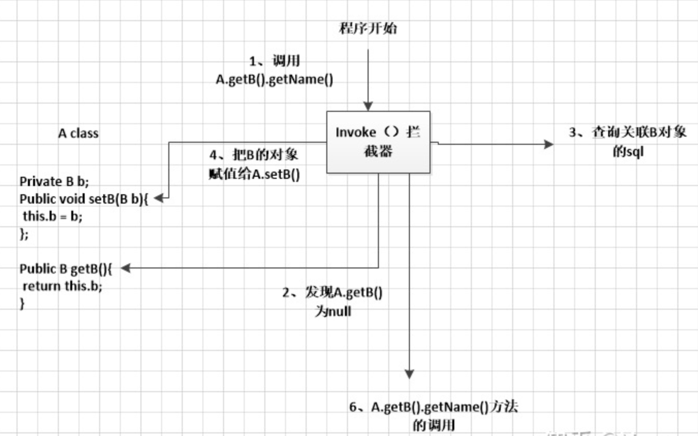

# 基础题

- 笔记本：Mybatis 面试题
- 创建时间：2021-03-11 13:29:06 UTC
- 更新时间：2021-03-12 10:25:47 UTC
- 印象笔记 GUID：2bcd52f6-6d87-4991-9ffa-3b1bdd2ef40c

#### 1. 什么是 Mybatis？

1. Mybatis 是一个**半 ORM（对象关系映射）框架**，它内部封装了 JDBC，开发时*只需要关注 SQL 语句本身*，不需要花费精力去处理加载驱动、创建连接、创建 statement 等繁杂的过程。程序员直接编写原生态 sql，可以严格控制 sql 执行性能，灵活度高。

1. MyBatis 可以使用 XML 或注解来配置和映射原生信息，将 POJO 映射成数据库中的记录，避免了几乎所有的 JDBC 代码和手动设置参数以及获取结果集。

1. 通过 xml 文件或注解的方式将要执行的各种 statement 配置起来，并通过 java 对象和 statement 中 sql 的动态参数进行映射生成最终执行的 sql 语句，最后由 mybatis 框架执行 sql 并将结果映射为 java 对象并返回。（从执行 sql 到返回 result 的过程）。

**个人总结：** 半自动 ORM 框架，从 JDBC 的复杂原生操作解脱出来，只需要关心 sql 语句。使用 XML/注解的方式

#### 2. MyBatis 的优点

1. 基于 SQL 语句编程，相当灵活，不会对应用程序或者数据库的现有设计造成任何影响，SQL 写在 XML 里，解除 sql 与程序代码的耦合，便于统一管理；提供 XML 标签，支持编写动态 SQL 语句，并可重用。

1. 与 JDBC 相比，减少了 50%以上的代码量，消除了 JDBC 大量冗余的代码，不需要手动开关连接；

1. 很好的与各种数据库兼容（因为 MyBatis 使用 JDBC 来连接数据库，所以只要 JDBC 支持的数据库 MyBatis 都支持）。

1. 能够与 Spring 很好的集成；

1. 提供映射标签，支持对象与数据库的 ORM 字段关系映射；提供对象关系映射标签，支持对象关系组件维护。

**个人总结：**

#### 3. MyBatis 框架的缺点

1. SQL 语句的编写工作量较大，尤其当字段多、关联表多时，对开发人员编写 SQL 语句的功底有一定要求。

1. SQL 语句依赖于数据库，导致数据库移植性差，不能随意更换数据库。

**个人总结：**

#### 4. MyBatis 框架适用场合

1. MyBatis 专注于 SQL 本身，是一个足够灵活的 DAO 层解决方案。

1. 对性能的要求很高，或者需求变化较多的项目，如互联网项目，MyBatis 将是不错的选择

**个人总结：**

#### 5. MyBatis 与 Hibernate 有哪些不同？

1. Mybatis 和 hibernate 不同，它不完全是一个 ORM 框架，因为 MyBatis 需要程序员自己编写 Sql 语句

1. Mybatis 直接编写原生态 sql，可以严格控制 sql 执行性能，灵活度高，非常适合对关系数据模型要求不高的软件开发，因为这类软件需求变化频繁，一但需求变化要求迅速输出成果。但是灵活的前提是 mybatis 无法做到数据库无关性，如果需要实现支持多种数据库的软件，则需要自定义多套 sql 映射文件，工作量大。

1. Hibernate 对象/关系映射能力强，数据库无关性好，对于关系模型要求高的软件，如果用 hibernate 开发可以节省很多代码，提高效率。

**个人总结：**

#### 6. `#{}`和`${}`的区别是什么？

1. `#{}`是预编译处理，`${}`是字符串替换。

1. Mybatis 在处理`#{}`时，会将 sql 中的`#{}`替换为?号，调用 PreparedStatement 的 set 方法来赋值；

1. Mybatis 在处理`${}`时，就是把`${}`替换成变量的值。

1. 使用`#{}`可以有效的防止 SQL 注入，提高系统安全性。

**个人总结：** `#{}` 是预编译处理，`${}` 是字符串替换。使用 `#{}` 可以有效防止 SQL 注入

#### 7. 当实体类中的属性名和表中的字段名不一样 ，怎么办 ？

- 第 1 种：通过在查询的 sql 语句中定义字段名的别名，让字段名的别名和实体类的属性名一致

```
<select id=”selectorder” parametertype=”int” resultetype=”me.gacl.domain.order”>
    select order_id id, order_no orderno ,order_price price form
    orders where order_id=#{id};
</select>

```

- 第 2 种：通过来映射字段名和实体类属性名的一一对应的关系。

```
<select id="getOrder" parameterType="int"  resultMap="orderresultmap">
    select * from orders where order_id=#{id}
</select>

<resultMap type=”me.gacl.domain.order” id=”orderresultmap”>
    <!–用 id 属性来映射主键字段–>
    <id property=”id” column=”order_id”>
    <!–用 result 属性来映射非主键字段，property 为实体类属性名，column
            为数据表中的属性–>
    <result property = “orderno” column =”order_no”/>
    <result property=”price” column=”order_price” />
</reslutMap>

```

**个人总结：** 使用 mybatis 时，第一种做法是，sql 语句中起别名，工作量大，不推荐。第二种做法是定义 resultMap 来映射 数据库和实体类的关系
 **tips：** 如果使用 mybatis-plus 可以通过 `@TableId(value = "id", type = IdType.AUTO)` 和 `@TableField(value = "vdate")` 直接注解在实体类的属性上来映射数据库字段。（`@TableName("ssd_data_gradient_weathers")` 注解在类上，映射实体类和数据库表）

#### 8. 模糊查询 like 语句该怎么写?

- 第 1 种：在 Java 代码中添加 sql 通配符。

```
string wildcardname = “%xiao%”;
list<name> names = mapper.selectlike(wildcardname);

```

```
<select id=”selectlike”>
    select * from foo where bar like #{value}
</select>

```

- 第 2 种：在 sql 语句中拼接通配符，会引起 sql 注入

```
string wildcardname = “xiao”;
list<name> names = mapper.selectlike(wildcardname);

```

```
<select id=”selectlike”>
    select * from foo where bar like "%"#{value}"%"
</select>

```

**个人总结：** 在 Java 程序中调用 Mapper 传参时拼接上 '%'，不要在 sql 中去拼接 '%'，可能会导致 sql 注入

#### 9. Mapper 接口的工作原理是什么？Mapper 接口里的方法，参数不同时，方法能重载吗？

- Dao 接口即 Mapper 接口。接口的全限名，就是映射文件中的 namespace 的值；接口的方法名，就是映射文件中 Mapper 的 Statement 的 id 值；接口方法内的参数，就是传递给 sql 的参数。

- Mapper 接口是没有实现类的，当调用接口方法时，接口全限名+方法名拼接字符串作为 key 值，可唯一定位一个 MapperStatement。在 Mybatis 中，每一个 `<select>`、`<insert>`、`<update>`、`<delete>`标签，都会被解析为一个 MapperStatement 对象。

- Mapper 接口里的方法，是不能重载的，因为是使用“全限名+方法名”的保存和寻找策略。Mapper 接口的工作原理是 **JDK 动态代理**，Mybatis 运行时会使用 JDK 动态代理为 Mapper 接口生成代理对象 proxy，代理对象会拦截接口方法，转而执行 MapperStatement 所代表的 sql，然后将 sql 执行结果返回。

**举例：** `com.mybatis3.mappers.StudentDao.findStudentById`，可以唯一找到 namespace 为 `com.mybatis3.mappers.StudentDao` 下面 id 为 findStudentById 的 MapperStatement。

**个人总结：** 使用 JDK 动态代理，生成代理类，拦截接口方法，执行 通过 全限定类名 + id 所定位到的 MapperStatement 所代表的 sql。因此不能重载。
 Dao接口里的方法，是不能重载的，因为是全限名+方法名的保存和寻找策略。

#### 10. Mybatis 是如何进行分页的？分页插件的原理是什么？

- Mybatis 使用 **RowBounds 对象**进行分页，它是针对 ResultSet 结果集执行的内存分页，而非物理分页。可以在 sql 内直接书写带有物理分页的参数来完成物理分页功能，也可以使用分页插件来完成物理分页。

- **分页插件**的基本原理是使用 Mybatis 提供的插件接口，实现自定义插件，在插件的拦截方法内**拦截待执行的 sql**，然后**重写 sql**，根据 dialect 方言，添加对应的物理分页语句和物理分页参数。

##### 补充：

**1. 物理分页**
 物理分页依赖的是某一物理实体，这个物理实体就是数据库，比如MySQL数据库提供了limit关键字，程序员只需要编写带有limit关键字的SQL语句，数据库返回的就是分页结果。
 **2. 逻辑分页**
 逻辑分页依赖的是程序员编写的代码。数据库返回的不是分页结果，而是全部数据，然后再由程序员通过代码获取分页数据，常用的操作是一次性从数据库中查询出全部数据并存储到List集合中，因为List集合有序，再根据索引获取指定范围的数据。
 **比较：**

- **数据库负担：** 物理分页每次都访问数据库，逻辑分页只访问一次数据库，**物理分页对数据库造成的负担大**。

- **服务器负担：** 逻辑分页一次性将数据读取到内存，占用了较大的内容空间，物理分页每次只读取一部分数据，占用内存空间较小。

- **实时性：** 逻辑分页一次性将数据读取到内存，数据发生改变，数据库的最新状态不能实时反映到操作中，实时性差。物理分页每次需要数据时都访问数据库，能够获取数据库的最新状态，实时性强。

- **适用场合：** 逻辑分页主要用于数据量不大、数据稳定的场合，物理分页主要用于数据量较大、更新频繁的场合。

**个人总结：**

1. 可以在 sql 语句中加上 `limit` 关键字进行分页。

1. 拦截器分页，

1. RowBounds分页，数据量小时，RowBounds不失为一种好办法。但是数据量大时，实现拦截器就很有必要了。
 实现：mybatis接口加入RowBounds参数
 `public List<UserBean> queryUsersByPage(String userName, RowBounds rowBounds);`
 service:

```
@Override
    @Transactional(isolation = Isolation.READ_COMMITTED, propagation = Propagation.SUPPORTS)
    public List<RoleBean> queryRolesByPage(String roleName, int start, int limit) {
        return roleDao.queryRolesByPage(roleName, new RowBounds(start, limit));
    }

```

>
https://www.cnblogs.com/aeolian/p/9229149.html

#### 11. Mybatis是如何将sql执行结果封装为目标对象并返回的？都有哪些映射形式？

- 第一种是使用标签，逐一定义数据库列名和对象属性名之间的映射关系。

- 第二种是使用 sql 列的别名功能，将列的别名书写为对象属性名。
 有了列名与属性名的映射关系后，Mybatis 通过反射创建对象，同时使用反射给对象的属性逐一赋值并返回，那些找不到映射关系的属性，是无法完成赋值的。

**个人总结：** 使用 sql 的列别名，或者定义 resultMap 映射数据库列名和对象属性名。如果使用 Mybatis-plus 可以使用注解`@TableName`映射表名和对象，使用`@TableField`映射数据库列和对象属性。

#### 12. 如何执行批量插入?

**个人总结：**

1. 循环执行插入方法

1. 方法中的 sql 语句通过 forEach 标签批量插入
 eg:

```
<insert id="insertAll">
    insert into user(id, username, password, age) values
    <foreach collection="list" item="user" index="index" separator=",">
        (
        #{user.id,jdbcType=VARCHAR},
        #{user.username,jdbcType=VARCHAR},
        #{user.password,jdbcType=VARCHAR},
        #{user.age,jdbcType=VARCHAR}
        )
    </foreach>

</insert>

```

1. mybatis `ExecutorType.BATCH`
 Mybatis内置的ExecutorType有3种，默认的是simple，该模式下它为每个语句的执行创建一个新的预处理语句，单条提交sql；而batch模式重复使用已经预处理的语句，并且批量执行所有更新语句，显然batch性能将更优； 但batch模式也有自己的问题，比如在Insert操作时，在事务没有提交之前，是没有办法获取到自增的id，这在某型情形下是不符合业务要求的
 eg:

```
<insert id=”insertname”>
    insert into names (name) values (#{value})
</insert>

```

```
list < string > names = new arraylist();
names.add(“fred”);
names.add(“barney”);
names.add(“betty”);
names.add(“wilma”);
// 注意这里 executortype.batch
sqlsession sqlsession =
sqlsessionfactory.opensession(executortype.batch);
try {
    namemapper mapper = sqlsession.getmapper(namemapper.class);
    for (string name: names) {
        mapper.insertname(name);
    }
    sqlsession.commit();
} catch (Exception e) {
    e.printStackTrace();
    sqlSession.rollback();
} finally {
    sqlsession.close();
}

```

>
https://www.cnblogs.com/csnjava/p/13863039.html

#### 13. 如何获取自动生成的(主)键值?

insert 方法总是返回一个 int 值 ，这个值代表的是插入的行数。
 如果采用自增长策略，自动生成的键值在 insert 方法执行完后可以被设置到传入 的参数对象中。

**个人总结：**

#### 14. 在 mapper 中如何传递多个参数?

**第一种：** 按 Dao 层参数传入顺序

```
public UserselectUser(String name,String area);

```

对应的 xml,#{0}代表接收的是 dao 层中的第一个参数，#{1}代表 dao 层中第二个参数，更多参数一致往后加即可。

```
<select id="selectUser"resultMap="BaseResultMap">
    select * fromuser_user_t where user_name = #{0} and user_area=#{1}
</select>

```

**第二种：** 使用 `@param` 注解
 eg:

```
public interface usermapper {
    User selectuser(@param(“username”) string username,@param(“hashedpassword”) string hashedpassword);
}

```

使用 `@Param` 注解后，可以直接在 xml 中使用注解的 value 值来获取

```
<select id=”selectuser” resulttype=”user”>
    select id, username, hashedpassword from some_table
    where username = #{username} and hashedpassword = #{hashedpassword}
</select>

```

**第三种：** 多个参数封装成 map

```
public interface UserMapper {
    // 多参数封装到map中，多条件查询
    List<User> findByConditionByMap(HashMap<String, Object> map);
}

```

```
<?xml version="1.0" encoding="UTF-8" ?>
<!DOCTYPE mapper
        PUBLIC "-//mybatis.org//DTD Mapper 3.0//EN"
        "http://mybatis.org/dtd/mybatis-3-mapper.dtd">
<mapper namespace="com.william.dao.UserMapper">
   <!--多参数封装到map中，多条件查询-->
    <select id="findByConditionByMap" parameterType="map" resultType="user">
        select * from user where username like "%"#{username}"%" and sex=#{sex}
       limit #{startIndex},#{pageSize}
    </select>
</mapper>

```

**个人总结：** 可以按照 dao 层传入的顺序，使用 #{0}、#{1}... 来获取参数值；也可以在 Dao 的接口方法行参上使用 `@Param` 注解来指定名称；还可以将参数封装为 Map ，xml 中 根据 map 的 key 获取 #{key}

#### 15. Mybatis 动态 sql 有什么用？执行原理？有哪些动态 sql？

Mybatis 动态 sql 可以在 Xml 映射文件内，以标签的形式编写动态 sql，执行原理是根据表达式的值完成逻辑判断并动态拼接 sql 的功能。

Mybatis 提供了 9 种动态 sql 标签：`trim` | `where` | `set` | `foreach` | `if` | `choose` | `when` | `otherwise` | `bind`。

动态 SQL 执行原理为，内部使用 OGNL 的表达式，从 SQL 参数对象中计算表达式的值，根据表达式的值动态拼接 SQL ，以此来完成动态 SQL 的功能。
 **个人总结：**

#### 16. Xml 映射文件中，除了常见的 `select`|`insert`|`update`|`delete` 标签之外，还有哪些标签？

`<resultMap>`、`<parameterMap>`、`<sql>`、`<include>`、`<selectKey>`，加上动态 sql 的 9 个标签，其中为 sql 片段标签，通过标签引入 sql 片段，为不支持自增的主键生成策略标签。

**个人总结：**

#### 17. Mybatis 的 Xml 映射文件中，不同的 Xml 映射文件，id 是否可以重复？

- 不同的 Xml 映射文件，如果配置了 namespace，那么 id 可以重复；如果没有配置 namespace，那么 id 不能重复；

- **原因**就是 namespace+id 是作为 Map 的 key 使用的，如果没有 namespace，就剩下 id，那么，id 重复会导致数据互相覆盖。有了 namespace，自然 id 就可以重复，namespace 不同，namespace+id 自然也就不同。

**个人总结：** 如果配置了 namespace，可以重复，如果没有配置就不可以重复。因为 默认是通过 namespace + id 来作为 Mapper 的 key 的。不同的 xml 文件，namespace 不同，因此可以重复。

#### 18. 为什么说 Mybatis 是半自动 ORM 映射工具？它与全自动的区别在哪里？

Hibernate 属于全自动 ORM 映射工具，使用 Hibernate 查询关联对象或者关联集合对象时，可以根据对象关系模型直接获取，所以它是全自动的。而 Mybatis在查询关联对象或关联集合对象时，需要手动编写 sql 来完成，所以，称之为半自动 ORM 映射工具。

**个人总结：** 说 MyBatis 是半自动 ORM 最主要的一个原因是，它需要在 XML 或者注解里通过手动或插件生成 SQL，才能完成 SQL 执行结果与对象映射绑定。
 **Tips：** ORM（Object Relational Mapping）对象关系映射

#### 19. 一对一、一对多的关联查询 ？

1. sql 语句中使用 and / join 联立查询

1. 使用 resultMap 接收

```
<mapper namespace="com.lcb.mapping.userMapper">
    <!--association 一对一关联查询 -->
    <select id="getClass" parameterType="int" resultMap="ClassesResultMap">
        select * from class c,teacher t where c.teacher_id=t.t_id and
        c.c_id=#{id}
    </select>

    <resultMap type="com.lcb.user.Classes" id="ClassesResultMap">
        <!-- 实体类的字段名和数据表的字段名映射 -->
        <id property="id" column="c_id"/>
        <result property="name" column="c_name"/>
        <association property="teacher" javaType="com.lcb.user.Teacher">
        <id property="id" column="t_id"/>
        <result property="name" column="t_name"/>
        </association>
    </resultMap>
    <!--collection 一对多关联查询 -->
    <select id="getClass2" parameterType="int" resultMap="ClassesResultMap2">
        select * from class c,teacher t,student s where c.teacher_id=t.t_id
        and c.c_id=s.class_id and c.c_id=#{id}
    </select>
    <resultMap type="com.lcb.user.Classes" id="ClassesResultMap2">
        <id property="id" column="c_id"/>
        <result property="name" column="c_name"/>
        <association property="teacher" javaType="com.lcb.user.Teacher">
        <id property="id" column="t_id"/>
        <result property="name" column="t_name"/>
    </association>
    <collection property="student" ofType="com.lcb.user.Student">
        <id property="id" column="s_id"/>
        <result property="name" column="s_name"/>
    </collection>
    </resultMap>
</mapper>

```

**个人总结：** sql 语句联立查询，resultMap（collection...） 接收

#### 20. MyBatis 实现一对一有几种方式?具体怎么操作的？

有**联合查询**和**嵌套查询**

联合查询是几个表联合查询,只查询一次, 通过在resultMap 里面配置 **association** 节点配置一对一的类就可以完成；

嵌套查询是先查一个表，根据这个表里面的结果的 外键 id，去再另外一个表里面查询数据,也是通过 association 配置，但另外一个表的查询通过 select 属性配置。

**个人总结：** 联合查询和嵌套查询（//TODO：learn）

#### 21. Mybatis 是否支持延迟加载？如果支持，它的实现原理是什么？

Mybatis **仅支持 association 关联对象和 collection 关联集合对象的延迟加载**，association 指的就是一对一，collection 指的就是一对多查询。在 Mybatis 配置文件中，可以配置是否启用延迟加载 `lazyLoadingEnabled=true|false`。

它的原理是，使用 CGLIB 创建目标对象的代理对象，当调用目标方法时，进入拦截器方法，比如调用 a.getB().getName()，拦截器 invoke()方法发现 a.getB()是 null 值，那么就会单独发送事先保存好的查询关联 B 对象的 sql，把 B 查询上来，然后调用 a.setB(b)，于是 a 的对象 b 属性就有值了，接着完成 a.getB().getName()方法的调用。这就是延迟加载的基本原理。

当然了，不光是 Mybatis，几乎所有的包括 Hibernate，支持延迟加载的原理都是一样的。
 

**个人总结：** lazyLoadingEnabled=true 动态代理，拦截方法

#### 22. Mybatis 的一级、二级缓存

- 一级缓存: 基于 PerpetualCache 的 HashMap 本地缓存，其存储作用域为 Session，当 Session flush 或 close 之后，该 Session 中的所有 Cache 就 将清空，默认打开一级缓存。

- 二级缓存与一级缓存其机制相同，默认也是采用 PerpetualCache，HashMap存储，不同在于其存储作用域为 Mapper(Namespace)，并且可自定义存储源，如 Ehcache。默认不打开二级缓存，要开启二级缓存，使用二级缓存属性类需要实现 Serializable 序列化接口(可用来保存对象的状态),可在它的映射文件中配置；

- 对于缓存数据更新机制，当某一个作用域(一级缓存 Session/二级缓存Namespaces)的进行了 C/U/D 操作后，默认该作用域下所有 select 中的缓存将被 clear。

**个人总结：**
 1、默认情况下，只有一级缓存(SqlSession级别的缓存， 也称为本地缓存)开启。
 2、二级缓存需要手动开启和配置，他是基于namespace级 别的缓存。
 3、为了提高扩展性。MyBatis定义了缓存接口Cache。我们 可以通过实现Cache接口来自定义二级缓存

***补充：***
 **一级缓存(local cache)**, 即本地缓存, 作用域默认 为sqlSession。当 Session flush 或 close 后, 该 Session 中的所有 Cache 将被清空。
 • 本地缓存不能被关闭, 但可以调用 clearCache() 来清空本地缓存, 或者改变缓存的作用域.
 • 在mybatis3.1之后,可以配置本地缓存的作用域. 在 mybatis.xml 中配置

**二级缓存(secondlevelcache)**，全局作用域缓存
 • 二级缓存默认不开启，需要手动配置
 • MyBatis提供二级缓存的接口以及实现，缓存实现要求 POJO实现Serializable接口
 • 二级缓存在SqlSession关闭或提交之后才会生效

#### 23. 什么是 MyBatis 的接口绑定？有哪些实现方式？

接口绑定，就是在 MyBatis 中任意定义接口,然后把接口里面的方法和 SQL 语句绑定, 我们直接调用接口方法就可以,这样比起原来了 SqlSession 提供的方法我们可以有更加灵活的选择和设置。

接口绑定有两种实现方式,一种是通过注解绑定，就是在接口的方法上面加上@Select、@Update 等注解，里面包含 Sql 语句来绑定；另外一种就是通过 xml里面写 SQL 来绑定, 在这种情况下,要指定 xml 映射文件里面的 namespace 必须为接口的全路径名。当 Sql 语句比较简单时候,用注解绑定, 当 SQL 语句比较复杂时候,用 xml 绑定,一般用 xml 绑定的比较多。

**个人总结：** 注解/XML 绑定。当 Sql 语句比较简单时候,用注解绑定, 当 SQL 语句比较复杂时候,用 xml 绑定,一般用 xml 绑定的比较多。

#### 24. 使用 MyBatis 的 mapper 接口调用时有哪些要求？

Mapper 接口方法名和 mapper.xml 中定义的每个 sql 的 id 相同；
 Mapper 接口方法的输入参数类型和 mapper.xml 中定义的每个 sql 的 parameterType 的类型相同；
 Mapper 接口方法的输出参数类型和 mapper.xml 中定义的每个 sql 的 resultType 的类型相同；
 Mapper.xml 文件中的 namespace 即是 mapper 接口的类路径。

**个人总结：**

#### 25. 简述 Mybatis 的插件运行原理，以及如何编写一个插件

答：Mybatis 仅可以编写针对 ParameterHandler、ResultSetHandler、StatementHandler、Executor 这 4 种接口的插件，Mybatis 使用 JDK 的动态代理，为需要拦截的接口生成代理对象以实现接口方法拦截功能，每当执行这 4 种接口对象的方法时，就会进入拦截方法，具体就是 InvocationHandler 的 invoke()方法，当然，只会拦截那些你指定需要拦截的方法。

编写插件：实现 Mybatis 的 Interceptor 接口并复写 intercept()方法，然后在给插件编写注解，指定要拦截哪一个接口的哪些方法即可，记住，别忘了在配置文件中配置你编写的插件。
 **个人总结：** 动态代理,实现 Interceptor 接口，重写 intercept() 方法，指定拦截的方法，在配置文件中配置编写的插件。

#### 26. Mybatis执行批量插入，能返回数据库主键列表吗？

能
 mybatis3.3.1中加入了批量新增返回主键id的功能

```
<insert parameterType="List" useGeneratedKeys="true" keyProperty="id">
    insert into user(first_name,last_name) values
    <foreach collection="list" item="obj" separator=","  >
        (#{obj.firstName},#{obj.lastName})
    </foreach>
</insert>

```

#### 27. Mybatis 是如何将 sql 执行结果封装为目标对象并返回的？都有哪些映射形式？

第一种是使用 `<resultMap>` 标签，逐一定义列名和对象属性名之间的映射关系。
 第二种是使用 sql 列的别名功能，将列别名书写为对象属性名，比如 T_NAME AS NAME，对象属性名一般是 name，小写，但是列名不区分大小写，Mybatis 会忽略列名大小写，智能找到与之对应对象属性名，你甚至可以写成 T_NAME AS NaMe，Mybatis 一样可以正常工作。

有了列名与属性名的映射关系后，Mybatis 通过反射创建对象，同时使用反射给对象的属性逐一赋值并返回，那些找不到映射关系的属性，是无法完成赋值的。

#### 28. Mybatis 都有哪些 Executor 执行器？它们之间的区别是什么？

Mybatis 有三种基本的 Executor 执行器，SimpleExecutor、ReuseExecutor、BatchExecutor。

- SimpleExecutor：每执行一次update或select，就开启一个Statement对象，用完立刻关闭Statement对象。

- ReuseExecutor：执行update或select，以sql作为key查找Statement对象，存在就使用，不存在就创建，用完后，不关闭Statement对象，而是放置于Map<String, Statement>内，供下一次使用。简言之，就是重复使用Statement对象。

- BatchExecutor：执行update（没有select，JDBC批处理不支持select），将所有sql都添加到批处理中（addBatch()），等待统一执行（executeBatch()），它缓存了多个Statement对象，每个Statement对象都是addBatch()完毕后，等待逐一执行executeBatch()批处理。与JDBC批处理相同。

**作用范围：** Executor的这些特点，都严格限制在SqlSession生命周期范围内。

#### 29. Mybatis 中如何指定使用哪一种 Executor 执行器？

在Mybatis 配置文件中，可以指定默认的 ExecutorType 执行器类型，也可以手动给 DefaultSqlSessionFactory 的创建 SqlSession 的方法传递 ExecutorType 类型参数。

#### 30. Mybatis 是否可以映射 Enum 枚举类？

Mybatis 可以映射枚举类，不单可以映射枚举类，Mybatis 可以映射任何对象到表的一列上。映射方式为自定义一个 TypeHandler，实现 TypeHandler 的 `setParameter()` 和 `getResult()` 接口方法。TypeHandler 有两个作用，一是完成从 javaType 至 jdbcType 的转换，二是完成 jdbcType 至 javaType 的转换，体现为 `setParameter()` 和 `getResult()` 两个方法，分别代表设置 sql 问号占位符参数和获取列查询结果。

#### 31. 简述 Mybatis 的 Xml 映射文件和 Mybatis 内部数据结构之间的映射关系？

Mybatis 将所有 Xml 配置信息都封装到 All-In-One 重量级对象 Configuration 内部。在 Xml 映射文件中，`<parameterMap>` 标签会被解析为 ParameterMap 对象，其每个子元素会被解析为 ParameterMapping 对象。`<resultMap>` 标签会被解析为 ResultMap 对象，其每个子元素会被解析为 ResultMapping 对象。每一个 `<select>`、`<insert>`、`<update>`、`<delete>` 标签均会被解析为 MappedStatement 对象，标签内的 sql 会被解析为 BoundSql 对象。

**个人总结：** Mybatis 会奖 XML 配置信息通过/*/*解析

#### 32. Mybatis 映射文件中，如果A标签通过include引用了B标签的内容，请问，B标签能否定义在A标签的后面，还是说必须定义在A标签的前面？

虽然Mybatis解析Xml映射文件是按照顺序解析的，但是，被引用的B标签依然可以定义在任何地方，Mybatis都可以正确识别。

原理是，Mybatis解析A标签，发现A标签引用了B标签，但是B标签尚未解析到，尚不存在，此时，Mybatis会将A标签标记为未解析状态，然后继续解析余下的标签，包含B标签，待所有标签解析完毕，Mybatis会重新解析那些被标记为未解析的标签，此时再解析A标签时，B标签已经存在，A标签也就可以正常解析完成了。

%23%23%23%23%201.%20%E4%BB%80%E4%B9%88%E6%98%AF%20Mybatis%EF%BC%9F%0A1.%20Mybatis%20%E6%98%AF%E4%B8%80%E4%B8%AA**%E5%8D%8A%20ORM%EF%BC%88%E5%AF%B9%E8%B1%A1%E5%85%B3%E7%B3%BB%E6%98%A0%E5%B0%84%EF%BC%89%E6%A1%86%E6%9E%B6**%EF%BC%8C%E5%AE%83%E5%86%85%E9%83%A8%E5%B0%81%E8%A3%85%E4%BA%86%20JDBC%EF%BC%8C%E5%BC%80%E5%8F%91%E6%97%B6*%E5%8F%AA%E9%9C%80%E8%A6%81%E5%85%B3%E6%B3%A8%20SQL%20%E8%AF%AD%E5%8F%A5%E6%9C%AC%E8%BA%AB*%EF%BC%8C%E4%B8%8D%E9%9C%80%E8%A6%81%E8%8A%B1%E8%B4%B9%E7%B2%BE%E5%8A%9B%E5%8E%BB%E5%A4%84%E7%90%86%E5%8A%A0%E8%BD%BD%E9%A9%B1%E5%8A%A8%E3%80%81%E5%88%9B%E5%BB%BA%E8%BF%9E%E6%8E%A5%E3%80%81%E5%88%9B%E5%BB%BA%20statement%20%E7%AD%89%E7%B9%81%E6%9D%82%E7%9A%84%E8%BF%87%E7%A8%8B%E3%80%82%E7%A8%8B%E5%BA%8F%E5%91%98%E7%9B%B4%E6%8E%A5%E7%BC%96%E5%86%99%E5%8E%9F%E7%94%9F%E6%80%81%20sql%EF%BC%8C%E5%8F%AF%E4%BB%A5%E4%B8%A5%E6%A0%BC%E6%8E%A7%E5%88%B6%20sql%20%E6%89%A7%E8%A1%8C%E6%80%A7%E8%83%BD%EF%BC%8C%E7%81%B5%E6%B4%BB%E5%BA%A6%E9%AB%98%E3%80%82%0A2.%20MyBatis%20%E5%8F%AF%E4%BB%A5%E4%BD%BF%E7%94%A8%20XML%20%E6%88%96%E6%B3%A8%E8%A7%A3%E6%9D%A5%E9%85%8D%E7%BD%AE%E5%92%8C%E6%98%A0%E5%B0%84%E5%8E%9F%E7%94%9F%E4%BF%A1%E6%81%AF%EF%BC%8C%E5%B0%86%20POJO%20%E6%98%A0%E5%B0%84%E6%88%90%E6%95%B0%E6%8D%AE%E5%BA%93%E4%B8%AD%E7%9A%84%E8%AE%B0%E5%BD%95%EF%BC%8C%E9%81%BF%E5%85%8D%E4%BA%86%E5%87%A0%E4%B9%8E%E6%89%80%E6%9C%89%E7%9A%84%20JDBC%20%E4%BB%A3%E7%A0%81%E5%92%8C%E6%89%8B%E5%8A%A8%E8%AE%BE%E7%BD%AE%E5%8F%82%E6%95%B0%E4%BB%A5%E5%8F%8A%E8%8E%B7%E5%8F%96%E7%BB%93%E6%9E%9C%E9%9B%86%E3%80%82%0A3.%20%E9%80%9A%E8%BF%87%20xml%20%E6%96%87%E4%BB%B6%E6%88%96%E6%B3%A8%E8%A7%A3%E7%9A%84%E6%96%B9%E5%BC%8F%E5%B0%86%E8%A6%81%E6%89%A7%E8%A1%8C%E7%9A%84%E5%90%84%E7%A7%8D%20statement%20%E9%85%8D%E7%BD%AE%E8%B5%B7%E6%9D%A5%EF%BC%8C%E5%B9%B6%E9%80%9A%E8%BF%87%20java%20%E5%AF%B9%E8%B1%A1%E5%92%8C%20statement%20%E4%B8%AD%20sql%20%E7%9A%84%E5%8A%A8%E6%80%81%E5%8F%82%E6%95%B0%E8%BF%9B%E8%A1%8C%E6%98%A0%E5%B0%84%E7%94%9F%E6%88%90%E6%9C%80%E7%BB%88%E6%89%A7%E8%A1%8C%E7%9A%84%20sql%20%E8%AF%AD%E5%8F%A5%EF%BC%8C%E6%9C%80%E5%90%8E%E7%94%B1%20mybatis%20%E6%A1%86%E6%9E%B6%E6%89%A7%E8%A1%8C%20sql%20%E5%B9%B6%E5%B0%86%E7%BB%93%E6%9E%9C%E6%98%A0%E5%B0%84%E4%B8%BA%20java%20%E5%AF%B9%E8%B1%A1%E5%B9%B6%E8%BF%94%E5%9B%9E%E3%80%82%EF%BC%88%E4%BB%8E%E6%89%A7%E8%A1%8C%20sql%20%E5%88%B0%E8%BF%94%E5%9B%9E%20result%20%E7%9A%84%E8%BF%87%E7%A8%8B%EF%BC%89%E3%80%82%0A%0A**%E4%B8%AA%E4%BA%BA%E6%80%BB%E7%BB%93%EF%BC%9A**%20%E5%8D%8A%E8%87%AA%E5%8A%A8%20ORM%20%E6%A1%86%E6%9E%B6%EF%BC%8C%E4%BB%8E%20JDBC%20%E7%9A%84%E5%A4%8D%E6%9D%82%E5%8E%9F%E7%94%9F%E6%93%8D%E4%BD%9C%E8%A7%A3%E8%84%B1%E5%87%BA%E6%9D%A5%EF%BC%8C%E5%8F%AA%E9%9C%80%E8%A6%81%E5%85%B3%E5%BF%83%20sql%20%E8%AF%AD%E5%8F%A5%E3%80%82%E4%BD%BF%E7%94%A8%20XML%2F%E6%B3%A8%E8%A7%A3%E7%9A%84%E6%96%B9%E5%BC%8F%0A%0A%23%23%23%23%202.%20MyBatis%20%E7%9A%84%E4%BC%98%E7%82%B9%0A1.%20%E5%9F%BA%E4%BA%8E%20SQL%20%E8%AF%AD%E5%8F%A5%E7%BC%96%E7%A8%8B%EF%BC%8C%E7%9B%B8%E5%BD%93%E7%81%B5%E6%B4%BB%EF%BC%8C%E4%B8%8D%E4%BC%9A%E5%AF%B9%E5%BA%94%E7%94%A8%E7%A8%8B%E5%BA%8F%E6%88%96%E8%80%85%E6%95%B0%E6%8D%AE%E5%BA%93%E7%9A%84%E7%8E%B0%E6%9C%89%E8%AE%BE%E8%AE%A1%E9%80%A0%E6%88%90%E4%BB%BB%E4%BD%95%E5%BD%B1%E5%93%8D%EF%BC%8CSQL%20%E5%86%99%E5%9C%A8%20XML%20%E9%87%8C%EF%BC%8C%E8%A7%A3%E9%99%A4%20sql%20%E4%B8%8E%E7%A8%8B%E5%BA%8F%E4%BB%A3%E7%A0%81%E7%9A%84%E8%80%A6%E5%90%88%EF%BC%8C%E4%BE%BF%E4%BA%8E%E7%BB%9F%E4%B8%80%E7%AE%A1%E7%90%86%EF%BC%9B%E6%8F%90%E4%BE%9B%20XML%20%E6%A0%87%E7%AD%BE%EF%BC%8C%E6%94%AF%E6%8C%81%E7%BC%96%E5%86%99%E5%8A%A8%E6%80%81%20SQL%20%E8%AF%AD%E5%8F%A5%EF%BC%8C%E5%B9%B6%E5%8F%AF%E9%87%8D%E7%94%A8%E3%80%82%0A2.%20%E4%B8%8E%20JDBC%20%E7%9B%B8%E6%AF%94%EF%BC%8C%E5%87%8F%E5%B0%91%E4%BA%86%2050%25%E4%BB%A5%E4%B8%8A%E7%9A%84%E4%BB%A3%E7%A0%81%E9%87%8F%EF%BC%8C%E6%B6%88%E9%99%A4%E4%BA%86%20JDBC%20%E5%A4%A7%E9%87%8F%E5%86%97%E4%BD%99%E7%9A%84%E4%BB%A3%E7%A0%81%EF%BC%8C%E4%B8%8D%E9%9C%80%E8%A6%81%E6%89%8B%E5%8A%A8%E5%BC%80%E5%85%B3%E8%BF%9E%E6%8E%A5%EF%BC%9B%0A3.%20%E5%BE%88%E5%A5%BD%E7%9A%84%E4%B8%8E%E5%90%84%E7%A7%8D%E6%95%B0%E6%8D%AE%E5%BA%93%E5%85%BC%E5%AE%B9%EF%BC%88%E5%9B%A0%E4%B8%BA%20MyBatis%20%E4%BD%BF%E7%94%A8%20JDBC%20%E6%9D%A5%E8%BF%9E%E6%8E%A5%E6%95%B0%E6%8D%AE%E5%BA%93%EF%BC%8C%E6%89%80%E4%BB%A5%E5%8F%AA%E8%A6%81%20JDBC%20%E6%94%AF%E6%8C%81%E7%9A%84%E6%95%B0%E6%8D%AE%E5%BA%93%20MyBatis%20%E9%83%BD%E6%94%AF%E6%8C%81%EF%BC%89%E3%80%82%0A4.%20%E8%83%BD%E5%A4%9F%E4%B8%8E%20Spring%20%E5%BE%88%E5%A5%BD%E7%9A%84%E9%9B%86%E6%88%90%EF%BC%9B%0A5.%20%E6%8F%90%E4%BE%9B%E6%98%A0%E5%B0%84%E6%A0%87%E7%AD%BE%EF%BC%8C%E6%94%AF%E6%8C%81%E5%AF%B9%E8%B1%A1%E4%B8%8E%E6%95%B0%E6%8D%AE%E5%BA%93%E7%9A%84%20ORM%20%E5%AD%97%E6%AE%B5%E5%85%B3%E7%B3%BB%E6%98%A0%E5%B0%84%EF%BC%9B%E6%8F%90%E4%BE%9B%E5%AF%B9%E8%B1%A1%E5%85%B3%E7%B3%BB%E6%98%A0%E5%B0%84%E6%A0%87%E7%AD%BE%EF%BC%8C%E6%94%AF%E6%8C%81%E5%AF%B9%E8%B1%A1%E5%85%B3%E7%B3%BB%E7%BB%84%E4%BB%B6%E7%BB%B4%E6%8A%A4%E3%80%82%0A%0A%0A**%E4%B8%AA%E4%BA%BA%E6%80%BB%E7%BB%93%EF%BC%9A**%20%0A%0A%23%23%23%23%203.%20MyBatis%20%E6%A1%86%E6%9E%B6%E7%9A%84%E7%BC%BA%E7%82%B9%0A1.%20SQL%20%E8%AF%AD%E5%8F%A5%E7%9A%84%E7%BC%96%E5%86%99%E5%B7%A5%E4%BD%9C%E9%87%8F%E8%BE%83%E5%A4%A7%EF%BC%8C%E5%B0%A4%E5%85%B6%E5%BD%93%E5%AD%97%E6%AE%B5%E5%A4%9A%E3%80%81%E5%85%B3%E8%81%94%E8%A1%A8%E5%A4%9A%E6%97%B6%EF%BC%8C%E5%AF%B9%E5%BC%80%E5%8F%91%E4%BA%BA%E5%91%98%E7%BC%96%E5%86%99%20SQL%20%E8%AF%AD%E5%8F%A5%E7%9A%84%E5%8A%9F%E5%BA%95%E6%9C%89%E4%B8%80%E5%AE%9A%E8%A6%81%E6%B1%82%E3%80%82%0A2.%20SQL%20%E8%AF%AD%E5%8F%A5%E4%BE%9D%E8%B5%96%E4%BA%8E%E6%95%B0%E6%8D%AE%E5%BA%93%EF%BC%8C%E5%AF%BC%E8%87%B4%E6%95%B0%E6%8D%AE%E5%BA%93%E7%A7%BB%E6%A4%8D%E6%80%A7%E5%B7%AE%EF%BC%8C%E4%B8%8D%E8%83%BD%E9%9A%8F%E6%84%8F%E6%9B%B4%E6%8D%A2%E6%95%B0%E6%8D%AE%E5%BA%93%E3%80%82%0A%0A**%E4%B8%AA%E4%BA%BA%E6%80%BB%E7%BB%93%EF%BC%9A**%20%0A%0A%23%23%23%23%204.%20MyBatis%20%E6%A1%86%E6%9E%B6%E9%80%82%E7%94%A8%E5%9C%BA%E5%90%88%0A1.%20MyBatis%20%E4%B8%93%E6%B3%A8%E4%BA%8E%20SQL%20%E6%9C%AC%E8%BA%AB%EF%BC%8C%E6%98%AF%E4%B8%80%E4%B8%AA%E8%B6%B3%E5%A4%9F%E7%81%B5%E6%B4%BB%E7%9A%84%20DAO%20%E5%B1%82%E8%A7%A3%E5%86%B3%E6%96%B9%E6%A1%88%E3%80%82%0A2.%20%E5%AF%B9%E6%80%A7%E8%83%BD%E7%9A%84%E8%A6%81%E6%B1%82%E5%BE%88%E9%AB%98%EF%BC%8C%E6%88%96%E8%80%85%E9%9C%80%E6%B1%82%E5%8F%98%E5%8C%96%E8%BE%83%E5%A4%9A%E7%9A%84%E9%A1%B9%E7%9B%AE%EF%BC%8C%E5%A6%82%E4%BA%92%E8%81%94%E7%BD%91%E9%A1%B9%E7%9B%AE%EF%BC%8CMyBatis%20%E5%B0%86%E6%98%AF%E4%B8%8D%E9%94%99%E7%9A%84%E9%80%89%E6%8B%A9%0A%0A**%E4%B8%AA%E4%BA%BA%E6%80%BB%E7%BB%93%EF%BC%9A**%20%0A%0A%23%23%23%23%205.%20MyBatis%20%E4%B8%8E%20Hibernate%20%E6%9C%89%E5%93%AA%E4%BA%9B%E4%B8%8D%E5%90%8C%EF%BC%9F%0A1.%20Mybatis%20%E5%92%8C%20hibernate%20%E4%B8%8D%E5%90%8C%EF%BC%8C%E5%AE%83%E4%B8%8D%E5%AE%8C%E5%85%A8%E6%98%AF%E4%B8%80%E4%B8%AA%20ORM%20%E6%A1%86%E6%9E%B6%EF%BC%8C%E5%9B%A0%E4%B8%BA%20MyBatis%20%E9%9C%80%E8%A6%81%E7%A8%8B%E5%BA%8F%E5%91%98%E8%87%AA%E5%B7%B1%E7%BC%96%E5%86%99%20Sql%20%E8%AF%AD%E5%8F%A5%0A2.%20Mybatis%20%E7%9B%B4%E6%8E%A5%E7%BC%96%E5%86%99%E5%8E%9F%E7%94%9F%E6%80%81%20sql%EF%BC%8C%E5%8F%AF%E4%BB%A5%E4%B8%A5%E6%A0%BC%E6%8E%A7%E5%88%B6%20sql%20%E6%89%A7%E8%A1%8C%E6%80%A7%E8%83%BD%EF%BC%8C%E7%81%B5%E6%B4%BB%E5%BA%A6%E9%AB%98%EF%BC%8C%E9%9D%9E%E5%B8%B8%E9%80%82%E5%90%88%E5%AF%B9%E5%85%B3%E7%B3%BB%E6%95%B0%E6%8D%AE%E6%A8%A1%E5%9E%8B%E8%A6%81%E6%B1%82%E4%B8%8D%E9%AB%98%E7%9A%84%E8%BD%AF%E4%BB%B6%E5%BC%80%E5%8F%91%EF%BC%8C%E5%9B%A0%E4%B8%BA%E8%BF%99%E7%B1%BB%E8%BD%AF%E4%BB%B6%E9%9C%80%E6%B1%82%E5%8F%98%E5%8C%96%E9%A2%91%E7%B9%81%EF%BC%8C%E4%B8%80%E4%BD%86%E9%9C%80%E6%B1%82%E5%8F%98%E5%8C%96%E8%A6%81%E6%B1%82%E8%BF%85%E9%80%9F%E8%BE%93%E5%87%BA%E6%88%90%E6%9E%9C%E3%80%82%E4%BD%86%E6%98%AF%E7%81%B5%E6%B4%BB%E7%9A%84%E5%89%8D%E6%8F%90%E6%98%AF%20%20mybatis%20%E6%97%A0%E6%B3%95%E5%81%9A%E5%88%B0%E6%95%B0%E6%8D%AE%E5%BA%93%E6%97%A0%E5%85%B3%E6%80%A7%EF%BC%8C%E5%A6%82%E6%9E%9C%E9%9C%80%E8%A6%81%E5%AE%9E%E7%8E%B0%E6%94%AF%E6%8C%81%E5%A4%9A%E7%A7%8D%E6%95%B0%E6%8D%AE%E5%BA%93%E7%9A%84%E8%BD%AF%E4%BB%B6%EF%BC%8C%E5%88%99%E9%9C%80%E8%A6%81%E8%87%AA%E5%AE%9A%E4%B9%89%E5%A4%9A%E5%A5%97%20sql%20%E6%98%A0%E5%B0%84%E6%96%87%E4%BB%B6%EF%BC%8C%E5%B7%A5%E4%BD%9C%E9%87%8F%E5%A4%A7%E3%80%82%0A3.%20Hibernate%20%E5%AF%B9%E8%B1%A1%2F%E5%85%B3%E7%B3%BB%E6%98%A0%E5%B0%84%E8%83%BD%E5%8A%9B%E5%BC%BA%EF%BC%8C%E6%95%B0%E6%8D%AE%E5%BA%93%E6%97%A0%E5%85%B3%E6%80%A7%E5%A5%BD%EF%BC%8C%E5%AF%B9%E4%BA%8E%E5%85%B3%E7%B3%BB%E6%A8%A1%E5%9E%8B%E8%A6%81%E6%B1%82%E9%AB%98%E7%9A%84%E8%BD%AF%E4%BB%B6%EF%BC%8C%E5%A6%82%E6%9E%9C%E7%94%A8%20hibernate%20%E5%BC%80%E5%8F%91%E5%8F%AF%E4%BB%A5%E8%8A%82%E7%9C%81%E5%BE%88%E5%A4%9A%E4%BB%A3%E7%A0%81%EF%BC%8C%E6%8F%90%E9%AB%98%E6%95%88%E7%8E%87%E3%80%82%0A%0A**%E4%B8%AA%E4%BA%BA%E6%80%BB%E7%BB%93%EF%BC%9A**%20%0A%0A%23%23%23%23%206.%20%60%23%7B%7D%60%E5%92%8C%60%24%7B%7D%60%E7%9A%84%E5%8C%BA%E5%88%AB%E6%98%AF%E4%BB%80%E4%B9%88%EF%BC%9F%0A1.%20%60%23%7B%7D%60%E6%98%AF%E9%A2%84%E7%BC%96%E8%AF%91%E5%A4%84%E7%90%86%EF%BC%8C%60%24%7B%7D%60%E6%98%AF%E5%AD%97%E7%AC%A6%E4%B8%B2%E6%9B%BF%E6%8D%A2%E3%80%82%0A2.%20Mybatis%20%E5%9C%A8%E5%A4%84%E7%90%86%60%23%7B%7D%60%E6%97%B6%EF%BC%8C%E4%BC%9A%E5%B0%86%20sql%20%E4%B8%AD%E7%9A%84%60%23%7B%7D%60%E6%9B%BF%E6%8D%A2%E4%B8%BA%3F%E5%8F%B7%EF%BC%8C%E8%B0%83%E7%94%A8%20PreparedStatement%20%E7%9A%84%20set%20%E6%96%B9%E6%B3%95%E6%9D%A5%E8%B5%8B%E5%80%BC%EF%BC%9B%0A3.%20Mybatis%20%E5%9C%A8%E5%A4%84%E7%90%86%60%24%7B%7D%60%E6%97%B6%EF%BC%8C%E5%B0%B1%E6%98%AF%E6%8A%8A%60%24%7B%7D%60%E6%9B%BF%E6%8D%A2%E6%88%90%E5%8F%98%E9%87%8F%E7%9A%84%E5%80%BC%E3%80%82%0A4.%20%E4%BD%BF%E7%94%A8%60%23%7B%7D%60%E5%8F%AF%E4%BB%A5%E6%9C%89%E6%95%88%E7%9A%84%E9%98%B2%E6%AD%A2%20SQL%20%E6%B3%A8%E5%85%A5%EF%BC%8C%E6%8F%90%E9%AB%98%E7%B3%BB%E7%BB%9F%E5%AE%89%E5%85%A8%E6%80%A7%E3%80%82%0A%0A**%E4%B8%AA%E4%BA%BA%E6%80%BB%E7%BB%93%EF%BC%9A**%20%60%23%7B%7D%60%20%E6%98%AF%E9%A2%84%E7%BC%96%E8%AF%91%E5%A4%84%E7%90%86%EF%BC%8C%60%24%7B%7D%60%20%E6%98%AF%E5%AD%97%E7%AC%A6%E4%B8%B2%E6%9B%BF%E6%8D%A2%E3%80%82%E4%BD%BF%E7%94%A8%20%60%23%7B%7D%60%20%E5%8F%AF%E4%BB%A5%E6%9C%89%E6%95%88%E9%98%B2%E6%AD%A2%20SQL%20%E6%B3%A8%E5%85%A5%0A%0A%23%23%23%23%207.%20%E5%BD%93%E5%AE%9E%E4%BD%93%E7%B1%BB%E4%B8%AD%E7%9A%84%E5%B1%9E%E6%80%A7%E5%90%8D%E5%92%8C%E8%A1%A8%E4%B8%AD%E7%9A%84%E5%AD%97%E6%AE%B5%E5%90%8D%E4%B8%8D%E4%B8%80%E6%A0%B7%20%EF%BC%8C%E6%80%8E%E4%B9%88%E5%8A%9E%20%EF%BC%9F%0A-%20%E7%AC%AC%201%20%E7%A7%8D%EF%BC%9A%E9%80%9A%E8%BF%87%E5%9C%A8%E6%9F%A5%E8%AF%A2%E7%9A%84%20sql%20%E8%AF%AD%E5%8F%A5%E4%B8%AD%E5%AE%9A%E4%B9%89%E5%AD%97%E6%AE%B5%E5%90%8D%E7%9A%84%E5%88%AB%E5%90%8D%EF%BC%8C%E8%AE%A9%E5%AD%97%E6%AE%B5%E5%90%8D%E7%9A%84%E5%88%AB%E5%90%8D%E5%92%8C%E5%AE%9E%E4%BD%93%E7%B1%BB%E7%9A%84%E5%B1%9E%E6%80%A7%E5%90%8D%E4%B8%80%E8%87%B4%0A%60%60%60xml%0A%3Cselect%20id%3D%E2%80%9Dselectorder%E2%80%9D%20parametertype%3D%E2%80%9Dint%E2%80%9D%20resultetype%3D%E2%80%9Dme.gacl.domain.order%E2%80%9D%3E%0A%20%20%20%20select%20order_id%20id%2C%20order_no%20orderno%20%2Corder_price%20price%20form%0A%20%20%20%20orders%20where%20order_id%3D%23%7Bid%7D%3B%0A%3C%2Fselect%3E%0A%60%60%60%0A-%20%E7%AC%AC%202%20%E7%A7%8D%EF%BC%9A%E9%80%9A%E8%BF%87%E6%9D%A5%E6%98%A0%E5%B0%84%E5%AD%97%E6%AE%B5%E5%90%8D%E5%92%8C%E5%AE%9E%E4%BD%93%E7%B1%BB%E5%B1%9E%E6%80%A7%E5%90%8D%E7%9A%84%E4%B8%80%E4%B8%80%E5%AF%B9%E5%BA%94%E7%9A%84%E5%85%B3%E7%B3%BB%E3%80%82%0A%60%60%60xml%0A%3Cselect%20id%3D%22getOrder%22%20parameterType%3D%22int%22%20%20resultMap%3D%22orderresultmap%22%3E%0A%20%20%20%20select%20*%20from%20orders%20where%20order_id%3D%23%7Bid%7D%0A%3C%2Fselect%3E%0A%0A%3CresultMap%20type%3D%E2%80%9Dme.gacl.domain.order%E2%80%9D%20id%3D%E2%80%9Dorderresultmap%E2%80%9D%3E%0A%20%20%20%20%3C!%E2%80%93%E7%94%A8%20id%20%E5%B1%9E%E6%80%A7%E6%9D%A5%E6%98%A0%E5%B0%84%E4%B8%BB%E9%94%AE%E5%AD%97%E6%AE%B5%E2%80%93%3E%0A%20%20%20%20%3Cid%20property%3D%E2%80%9Did%E2%80%9D%20column%3D%E2%80%9Dorder_id%E2%80%9D%3E%0A%20%20%20%20%3C!%E2%80%93%E7%94%A8%20result%20%E5%B1%9E%E6%80%A7%E6%9D%A5%E6%98%A0%E5%B0%84%E9%9D%9E%E4%B8%BB%E9%94%AE%E5%AD%97%E6%AE%B5%EF%BC%8Cproperty%20%E4%B8%BA%E5%AE%9E%E4%BD%93%E7%B1%BB%E5%B1%9E%E6%80%A7%E5%90%8D%EF%BC%8Ccolumn%0A%20%20%20%20%20%20%20%20%20%20%20%20%E4%B8%BA%E6%95%B0%E6%8D%AE%E8%A1%A8%E4%B8%AD%E7%9A%84%E5%B1%9E%E6%80%A7%E2%80%93%3E%0A%20%20%20%20%3Cresult%20property%20%3D%20%E2%80%9Corderno%E2%80%9D%20column%20%3D%E2%80%9Dorder_no%E2%80%9D%2F%3E%0A%20%20%20%20%3Cresult%20property%3D%E2%80%9Dprice%E2%80%9D%20column%3D%E2%80%9Dorder_price%E2%80%9D%20%2F%3E%0A%3C%2FreslutMap%3E%0A%60%60%60%0A%0A**%E4%B8%AA%E4%BA%BA%E6%80%BB%E7%BB%93%EF%BC%9A**%20%E4%BD%BF%E7%94%A8%20mybatis%20%E6%97%B6%EF%BC%8C%E7%AC%AC%E4%B8%80%E7%A7%8D%E5%81%9A%E6%B3%95%E6%98%AF%EF%BC%8Csql%20%E8%AF%AD%E5%8F%A5%E4%B8%AD%E8%B5%B7%E5%88%AB%E5%90%8D%EF%BC%8C%E5%B7%A5%E4%BD%9C%E9%87%8F%E5%A4%A7%EF%BC%8C%E4%B8%8D%E6%8E%A8%E8%8D%90%E3%80%82%E7%AC%AC%E4%BA%8C%E7%A7%8D%E5%81%9A%E6%B3%95%E6%98%AF%E5%AE%9A%E4%B9%89%20resultMap%20%E6%9D%A5%E6%98%A0%E5%B0%84%20%E6%95%B0%E6%8D%AE%E5%BA%93%E5%92%8C%E5%AE%9E%E4%BD%93%E7%B1%BB%E7%9A%84%E5%85%B3%E7%B3%BB%0A**tips%EF%BC%9A**%20%E5%A6%82%E6%9E%9C%E4%BD%BF%E7%94%A8%20mybatis-plus%20%E5%8F%AF%E4%BB%A5%E9%80%9A%E8%BF%87%20%60%40TableId(value%20%3D%20%22id%22%2C%20type%20%3D%20IdType.AUTO)%60%20%E5%92%8C%20%60%40TableField(value%20%3D%20%22vdate%22)%60%20%E7%9B%B4%E6%8E%A5%E6%B3%A8%E8%A7%A3%E5%9C%A8%E5%AE%9E%E4%BD%93%E7%B1%BB%E7%9A%84%E5%B1%9E%E6%80%A7%E4%B8%8A%E6%9D%A5%E6%98%A0%E5%B0%84%E6%95%B0%E6%8D%AE%E5%BA%93%E5%AD%97%E6%AE%B5%E3%80%82%EF%BC%88%60%40TableName(%22ssd_data_gradient_weathers%22)%60%20%E6%B3%A8%E8%A7%A3%E5%9C%A8%E7%B1%BB%E4%B8%8A%EF%BC%8C%E6%98%A0%E5%B0%84%E5%AE%9E%E4%BD%93%E7%B1%BB%E5%92%8C%E6%95%B0%E6%8D%AE%E5%BA%93%E8%A1%A8%EF%BC%89%0A%0A%23%23%23%23%208.%20%E6%A8%A1%E7%B3%8A%E6%9F%A5%E8%AF%A2%20like%20%E8%AF%AD%E5%8F%A5%E8%AF%A5%E6%80%8E%E4%B9%88%E5%86%99%3F%0A-%20%E7%AC%AC%201%20%E7%A7%8D%EF%BC%9A%E5%9C%A8%20Java%20%E4%BB%A3%E7%A0%81%E4%B8%AD%E6%B7%BB%E5%8A%A0%20sql%20%E9%80%9A%E9%85%8D%E7%AC%A6%E3%80%82%0A%60%60%60java%0Astring%20wildcardname%20%3D%20%E2%80%9C%25xiao%25%E2%80%9D%3B%0Alist%3Cname%3E%20names%20%3D%20mapper.selectlike(wildcardname)%3B%0A%60%60%60%0A%60%60%60xml%0A%3Cselect%20id%3D%E2%80%9Dselectlike%E2%80%9D%3E%0A%20%20%20%20select%20*%20from%20foo%20where%20bar%20like%20%23%7Bvalue%7D%0A%3C%2Fselect%3E%0A%60%60%60%0A%0A-%20%E7%AC%AC%202%20%E7%A7%8D%EF%BC%9A%E5%9C%A8%20sql%20%E8%AF%AD%E5%8F%A5%E4%B8%AD%E6%8B%BC%E6%8E%A5%E9%80%9A%E9%85%8D%E7%AC%A6%EF%BC%8C%E4%BC%9A%E5%BC%95%E8%B5%B7%20sql%20%E6%B3%A8%E5%85%A5%0A%60%60%60java%0Astring%20wildcardname%20%3D%20%E2%80%9Cxiao%E2%80%9D%3B%0Alist%3Cname%3E%20names%20%3D%20mapper.selectlike(wildcardname)%3B%0A%60%60%60%0A%60%60%60xml%0A%3Cselect%20id%3D%E2%80%9Dselectlike%E2%80%9D%3E%0A%20%20%20%20select%20*%20from%20foo%20where%20bar%20like%20%22%25%22%23%7Bvalue%7D%22%25%22%0A%3C%2Fselect%3E%0A%60%60%60%0A**%E4%B8%AA%E4%BA%BA%E6%80%BB%E7%BB%93%EF%BC%9A**%20%E5%9C%A8%20Java%20%E7%A8%8B%E5%BA%8F%E4%B8%AD%E8%B0%83%E7%94%A8%20Mapper%20%E4%BC%A0%E5%8F%82%E6%97%B6%E6%8B%BC%E6%8E%A5%E4%B8%8A%20'%25'%EF%BC%8C%E4%B8%8D%E8%A6%81%E5%9C%A8%20sql%20%E4%B8%AD%E5%8E%BB%E6%8B%BC%E6%8E%A5%20'%25'%EF%BC%8C%E5%8F%AF%E8%83%BD%E4%BC%9A%E5%AF%BC%E8%87%B4%20sql%20%E6%B3%A8%E5%85%A5%0A%0A%23%23%23%23%209.%20Mapper%20%E6%8E%A5%E5%8F%A3%E7%9A%84%E5%B7%A5%E4%BD%9C%E5%8E%9F%E7%90%86%E6%98%AF%E4%BB%80%E4%B9%88%EF%BC%9FMapper%20%E6%8E%A5%E5%8F%A3%E9%87%8C%E7%9A%84%E6%96%B9%E6%B3%95%EF%BC%8C%E5%8F%82%E6%95%B0%E4%B8%8D%E5%90%8C%E6%97%B6%EF%BC%8C%E6%96%B9%E6%B3%95%E8%83%BD%E9%87%8D%E8%BD%BD%E5%90%97%EF%BC%9F%0A-%20Dao%20%E6%8E%A5%E5%8F%A3%E5%8D%B3%20Mapper%20%E6%8E%A5%E5%8F%A3%E3%80%82%E6%8E%A5%E5%8F%A3%E7%9A%84%E5%85%A8%E9%99%90%E5%90%8D%EF%BC%8C%E5%B0%B1%E6%98%AF%E6%98%A0%E5%B0%84%E6%96%87%E4%BB%B6%E4%B8%AD%E7%9A%84%20namespace%20%E7%9A%84%E5%80%BC%EF%BC%9B%E6%8E%A5%E5%8F%A3%E7%9A%84%E6%96%B9%E6%B3%95%E5%90%8D%EF%BC%8C%E5%B0%B1%E6%98%AF%E6%98%A0%E5%B0%84%E6%96%87%E4%BB%B6%E4%B8%AD%20Mapper%20%E7%9A%84%20Statement%20%E7%9A%84%20id%20%E5%80%BC%EF%BC%9B%E6%8E%A5%E5%8F%A3%E6%96%B9%E6%B3%95%E5%86%85%E7%9A%84%E5%8F%82%E6%95%B0%EF%BC%8C%E5%B0%B1%E6%98%AF%E4%BC%A0%E9%80%92%E7%BB%99%20sql%20%E7%9A%84%E5%8F%82%E6%95%B0%E3%80%82%0A-%20Mapper%20%E6%8E%A5%E5%8F%A3%E6%98%AF%E6%B2%A1%E6%9C%89%E5%AE%9E%E7%8E%B0%E7%B1%BB%E7%9A%84%EF%BC%8C%E5%BD%93%E8%B0%83%E7%94%A8%E6%8E%A5%E5%8F%A3%E6%96%B9%E6%B3%95%E6%97%B6%EF%BC%8C%E6%8E%A5%E5%8F%A3%E5%85%A8%E9%99%90%E5%90%8D%2B%E6%96%B9%E6%B3%95%E5%90%8D%E6%8B%BC%E6%8E%A5%E5%AD%97%E7%AC%A6%E4%B8%B2%E4%BD%9C%E4%B8%BA%20key%20%E5%80%BC%EF%BC%8C%E5%8F%AF%E5%94%AF%E4%B8%80%E5%AE%9A%E4%BD%8D%E4%B8%80%E4%B8%AA%20MapperStatement%E3%80%82%E5%9C%A8%20Mybatis%20%E4%B8%AD%EF%BC%8C%E6%AF%8F%E4%B8%80%E4%B8%AA%20%60%3Cselect%3E%60%E3%80%81%60%3Cinsert%3E%60%E3%80%81%60%3Cupdate%3E%60%E3%80%81%60%3Cdelete%3E%60%E6%A0%87%E7%AD%BE%EF%BC%8C%E9%83%BD%E4%BC%9A%E8%A2%AB%E8%A7%A3%E6%9E%90%E4%B8%BA%E4%B8%80%E4%B8%AA%20MapperStatement%20%E5%AF%B9%E8%B1%A1%E3%80%82%0A-%20Mapper%20%E6%8E%A5%E5%8F%A3%E9%87%8C%E7%9A%84%E6%96%B9%E6%B3%95%EF%BC%8C%E6%98%AF%E4%B8%8D%E8%83%BD%E9%87%8D%E8%BD%BD%E7%9A%84%EF%BC%8C%E5%9B%A0%E4%B8%BA%E6%98%AF%E4%BD%BF%E7%94%A8%E2%80%9C%E5%85%A8%E9%99%90%E5%90%8D%2B%E6%96%B9%E6%B3%95%E5%90%8D%E2%80%9D%E7%9A%84%E4%BF%9D%E5%AD%98%E5%92%8C%E5%AF%BB%E6%89%BE%E7%AD%96%E7%95%A5%E3%80%82Mapper%20%E6%8E%A5%E5%8F%A3%E7%9A%84%E5%B7%A5%E4%BD%9C%E5%8E%9F%E7%90%86%E6%98%AF%20**JDK%20%E5%8A%A8%E6%80%81%E4%BB%A3%E7%90%86**%EF%BC%8CMybatis%20%E8%BF%90%E8%A1%8C%E6%97%B6%E4%BC%9A%E4%BD%BF%E7%94%A8%20JDK%20%E5%8A%A8%E6%80%81%E4%BB%A3%E7%90%86%E4%B8%BA%20Mapper%20%E6%8E%A5%E5%8F%A3%E7%94%9F%E6%88%90%E4%BB%A3%E7%90%86%E5%AF%B9%E8%B1%A1%20proxy%EF%BC%8C%E4%BB%A3%E7%90%86%E5%AF%B9%E8%B1%A1%E4%BC%9A%E6%8B%A6%E6%88%AA%E6%8E%A5%E5%8F%A3%E6%96%B9%E6%B3%95%EF%BC%8C%E8%BD%AC%E8%80%8C%E6%89%A7%E8%A1%8C%20MapperStatement%20%E6%89%80%E4%BB%A3%E8%A1%A8%E7%9A%84%20sql%EF%BC%8C%E7%84%B6%E5%90%8E%E5%B0%86%20sql%20%E6%89%A7%E8%A1%8C%E7%BB%93%E6%9E%9C%E8%BF%94%E5%9B%9E%E3%80%82%0A%0A**%E4%B8%BE%E4%BE%8B%EF%BC%9A**%20%60com.mybatis3.mappers.StudentDao.findStudentById%60%EF%BC%8C%E5%8F%AF%E4%BB%A5%E5%94%AF%E4%B8%80%E6%89%BE%E5%88%B0%20namespace%20%E4%B8%BA%20%60com.mybatis3.mappers.StudentDao%60%20%E4%B8%8B%E9%9D%A2%20id%20%E4%B8%BA%20findStudentById%20%E7%9A%84%20MapperStatement%E3%80%82%0A%0A**%E4%B8%AA%E4%BA%BA%E6%80%BB%E7%BB%93%EF%BC%9A**%20%E4%BD%BF%E7%94%A8%20JDK%20%E5%8A%A8%E6%80%81%E4%BB%A3%E7%90%86%EF%BC%8C%E7%94%9F%E6%88%90%E4%BB%A3%E7%90%86%E7%B1%BB%EF%BC%8C%E6%8B%A6%E6%88%AA%E6%8E%A5%E5%8F%A3%E6%96%B9%E6%B3%95%EF%BC%8C%E6%89%A7%E8%A1%8C%20%E9%80%9A%E8%BF%87%20%E5%85%A8%E9%99%90%E5%AE%9A%E7%B1%BB%E5%90%8D%20%2B%20id%20%E6%89%80%E5%AE%9A%E4%BD%8D%E5%88%B0%E7%9A%84%20MapperStatement%20%E6%89%80%E4%BB%A3%E8%A1%A8%E7%9A%84%20sql%E3%80%82%E5%9B%A0%E6%AD%A4%E4%B8%8D%E8%83%BD%E9%87%8D%E8%BD%BD%E3%80%82%0ADao%E6%8E%A5%E5%8F%A3%E9%87%8C%E7%9A%84%E6%96%B9%E6%B3%95%EF%BC%8C%E6%98%AF%E4%B8%8D%E8%83%BD%E9%87%8D%E8%BD%BD%E7%9A%84%EF%BC%8C%E5%9B%A0%E4%B8%BA%E6%98%AF%E5%85%A8%E9%99%90%E5%90%8D%2B%E6%96%B9%E6%B3%95%E5%90%8D%E7%9A%84%E4%BF%9D%E5%AD%98%E5%92%8C%E5%AF%BB%E6%89%BE%E7%AD%96%E7%95%A5%E3%80%82%0A%0A%23%23%23%23%2010.%20Mybatis%20%E6%98%AF%E5%A6%82%E4%BD%95%E8%BF%9B%E8%A1%8C%E5%88%86%E9%A1%B5%E7%9A%84%EF%BC%9F%E5%88%86%E9%A1%B5%E6%8F%92%E4%BB%B6%E7%9A%84%E5%8E%9F%E7%90%86%E6%98%AF%E4%BB%80%E4%B9%88%EF%BC%9F%0A-%20Mybatis%20%E4%BD%BF%E7%94%A8%20**RowBounds%20%E5%AF%B9%E8%B1%A1**%E8%BF%9B%E8%A1%8C%E5%88%86%E9%A1%B5%EF%BC%8C%E5%AE%83%E6%98%AF%E9%92%88%E5%AF%B9%20ResultSet%20%E7%BB%93%E6%9E%9C%E9%9B%86%E6%89%A7%E8%A1%8C%E7%9A%84%E5%86%85%E5%AD%98%E5%88%86%E9%A1%B5%EF%BC%8C%E8%80%8C%E9%9D%9E%E7%89%A9%E7%90%86%E5%88%86%E9%A1%B5%E3%80%82%E5%8F%AF%E4%BB%A5%E5%9C%A8%20sql%20%E5%86%85%E7%9B%B4%E6%8E%A5%E4%B9%A6%E5%86%99%E5%B8%A6%E6%9C%89%E7%89%A9%E7%90%86%E5%88%86%E9%A1%B5%E7%9A%84%E5%8F%82%E6%95%B0%E6%9D%A5%E5%AE%8C%E6%88%90%E7%89%A9%E7%90%86%E5%88%86%E9%A1%B5%E5%8A%9F%E8%83%BD%EF%BC%8C%E4%B9%9F%E5%8F%AF%E4%BB%A5%E4%BD%BF%E7%94%A8%E5%88%86%E9%A1%B5%E6%8F%92%E4%BB%B6%E6%9D%A5%E5%AE%8C%E6%88%90%E7%89%A9%E7%90%86%E5%88%86%E9%A1%B5%E3%80%82%0A-%20**%E5%88%86%E9%A1%B5%E6%8F%92%E4%BB%B6**%E7%9A%84%E5%9F%BA%E6%9C%AC%E5%8E%9F%E7%90%86%E6%98%AF%E4%BD%BF%E7%94%A8%20Mybatis%20%E6%8F%90%E4%BE%9B%E7%9A%84%E6%8F%92%E4%BB%B6%E6%8E%A5%E5%8F%A3%EF%BC%8C%E5%AE%9E%E7%8E%B0%E8%87%AA%E5%AE%9A%E4%B9%89%E6%8F%92%E4%BB%B6%EF%BC%8C%E5%9C%A8%E6%8F%92%E4%BB%B6%E7%9A%84%E6%8B%A6%E6%88%AA%E6%96%B9%E6%B3%95%E5%86%85**%E6%8B%A6%E6%88%AA%E5%BE%85%E6%89%A7%E8%A1%8C%E7%9A%84%20sql**%EF%BC%8C%E7%84%B6%E5%90%8E**%E9%87%8D%E5%86%99%20sql**%EF%BC%8C%E6%A0%B9%E6%8D%AE%20dialect%20%E6%96%B9%E8%A8%80%EF%BC%8C%E6%B7%BB%E5%8A%A0%E5%AF%B9%E5%BA%94%E7%9A%84%E7%89%A9%E7%90%86%E5%88%86%E9%A1%B5%E8%AF%AD%E5%8F%A5%E5%92%8C%E7%89%A9%E7%90%86%E5%88%86%E9%A1%B5%E5%8F%82%E6%95%B0%E3%80%82%0A%0A%23%23%23%23%23%20%E8%A1%A5%E5%85%85%EF%BC%9A%0A**1.%20%E7%89%A9%E7%90%86%E5%88%86%E9%A1%B5**%20%0A%E7%89%A9%E7%90%86%E5%88%86%E9%A1%B5%E4%BE%9D%E8%B5%96%E7%9A%84%E6%98%AF%E6%9F%90%E4%B8%80%E7%89%A9%E7%90%86%E5%AE%9E%E4%BD%93%EF%BC%8C%E8%BF%99%E4%B8%AA%E7%89%A9%E7%90%86%E5%AE%9E%E4%BD%93%E5%B0%B1%E6%98%AF%E6%95%B0%E6%8D%AE%E5%BA%93%EF%BC%8C%E6%AF%94%E5%A6%82MySQL%E6%95%B0%E6%8D%AE%E5%BA%93%E6%8F%90%E4%BE%9B%E4%BA%86limit%E5%85%B3%E9%94%AE%E5%AD%97%EF%BC%8C%E7%A8%8B%E5%BA%8F%E5%91%98%E5%8F%AA%E9%9C%80%E8%A6%81%E7%BC%96%E5%86%99%E5%B8%A6%E6%9C%89limit%E5%85%B3%E9%94%AE%E5%AD%97%E7%9A%84SQL%E8%AF%AD%E5%8F%A5%EF%BC%8C%E6%95%B0%E6%8D%AE%E5%BA%93%E8%BF%94%E5%9B%9E%E7%9A%84%E5%B0%B1%E6%98%AF%E5%88%86%E9%A1%B5%E7%BB%93%E6%9E%9C%E3%80%82%0A**2.%20%E9%80%BB%E8%BE%91%E5%88%86%E9%A1%B5**%0A%E9%80%BB%E8%BE%91%E5%88%86%E9%A1%B5%E4%BE%9D%E8%B5%96%E7%9A%84%E6%98%AF%E7%A8%8B%E5%BA%8F%E5%91%98%E7%BC%96%E5%86%99%E7%9A%84%E4%BB%A3%E7%A0%81%E3%80%82%E6%95%B0%E6%8D%AE%E5%BA%93%E8%BF%94%E5%9B%9E%E7%9A%84%E4%B8%8D%E6%98%AF%E5%88%86%E9%A1%B5%E7%BB%93%E6%9E%9C%EF%BC%8C%E8%80%8C%E6%98%AF%E5%85%A8%E9%83%A8%E6%95%B0%E6%8D%AE%EF%BC%8C%E7%84%B6%E5%90%8E%E5%86%8D%E7%94%B1%E7%A8%8B%E5%BA%8F%E5%91%98%E9%80%9A%E8%BF%87%E4%BB%A3%E7%A0%81%E8%8E%B7%E5%8F%96%E5%88%86%E9%A1%B5%E6%95%B0%E6%8D%AE%EF%BC%8C%E5%B8%B8%E7%94%A8%E7%9A%84%E6%93%8D%E4%BD%9C%E6%98%AF%E4%B8%80%E6%AC%A1%E6%80%A7%E4%BB%8E%E6%95%B0%E6%8D%AE%E5%BA%93%E4%B8%AD%E6%9F%A5%E8%AF%A2%E5%87%BA%E5%85%A8%E9%83%A8%E6%95%B0%E6%8D%AE%E5%B9%B6%E5%AD%98%E5%82%A8%E5%88%B0List%E9%9B%86%E5%90%88%E4%B8%AD%EF%BC%8C%E5%9B%A0%E4%B8%BAList%E9%9B%86%E5%90%88%E6%9C%89%E5%BA%8F%EF%BC%8C%E5%86%8D%E6%A0%B9%E6%8D%AE%E7%B4%A2%E5%BC%95%E8%8E%B7%E5%8F%96%E6%8C%87%E5%AE%9A%E8%8C%83%E5%9B%B4%E7%9A%84%E6%95%B0%E6%8D%AE%E3%80%82%0A**%E6%AF%94%E8%BE%83%EF%BC%9A**%0A-%20**%E6%95%B0%E6%8D%AE%E5%BA%93%E8%B4%9F%E6%8B%85%EF%BC%9A**%20%E7%89%A9%E7%90%86%E5%88%86%E9%A1%B5%E6%AF%8F%E6%AC%A1%E9%83%BD%E8%AE%BF%E9%97%AE%E6%95%B0%E6%8D%AE%E5%BA%93%EF%BC%8C%E9%80%BB%E8%BE%91%E5%88%86%E9%A1%B5%E5%8F%AA%E8%AE%BF%E9%97%AE%E4%B8%80%E6%AC%A1%E6%95%B0%E6%8D%AE%E5%BA%93%EF%BC%8C**%E7%89%A9%E7%90%86%E5%88%86%E9%A1%B5%E5%AF%B9%E6%95%B0%E6%8D%AE%E5%BA%93%E9%80%A0%E6%88%90%E7%9A%84%E8%B4%9F%E6%8B%85%E5%A4%A7**%E3%80%82%0A-%20**%E6%9C%8D%E5%8A%A1%E5%99%A8%E8%B4%9F%E6%8B%85%EF%BC%9A**%20%E9%80%BB%E8%BE%91%E5%88%86%E9%A1%B5%E4%B8%80%E6%AC%A1%E6%80%A7%E5%B0%86%E6%95%B0%E6%8D%AE%E8%AF%BB%E5%8F%96%E5%88%B0%E5%86%85%E5%AD%98%EF%BC%8C%E5%8D%A0%E7%94%A8%E4%BA%86%E8%BE%83%E5%A4%A7%E7%9A%84%E5%86%85%E5%AE%B9%E7%A9%BA%E9%97%B4%EF%BC%8C%E7%89%A9%E7%90%86%E5%88%86%E9%A1%B5%E6%AF%8F%E6%AC%A1%E5%8F%AA%E8%AF%BB%E5%8F%96%E4%B8%80%E9%83%A8%E5%88%86%E6%95%B0%E6%8D%AE%EF%BC%8C%E5%8D%A0%E7%94%A8%E5%86%85%E5%AD%98%E7%A9%BA%E9%97%B4%E8%BE%83%E5%B0%8F%E3%80%82%0A-%20**%E5%AE%9E%E6%97%B6%E6%80%A7%EF%BC%9A**%20%E9%80%BB%E8%BE%91%E5%88%86%E9%A1%B5%E4%B8%80%E6%AC%A1%E6%80%A7%E5%B0%86%E6%95%B0%E6%8D%AE%E8%AF%BB%E5%8F%96%E5%88%B0%E5%86%85%E5%AD%98%EF%BC%8C%E6%95%B0%E6%8D%AE%E5%8F%91%E7%94%9F%E6%94%B9%E5%8F%98%EF%BC%8C%E6%95%B0%E6%8D%AE%E5%BA%93%E7%9A%84%E6%9C%80%E6%96%B0%E7%8A%B6%E6%80%81%E4%B8%8D%E8%83%BD%E5%AE%9E%E6%97%B6%E5%8F%8D%E6%98%A0%E5%88%B0%E6%93%8D%E4%BD%9C%E4%B8%AD%EF%BC%8C%E5%AE%9E%E6%97%B6%E6%80%A7%E5%B7%AE%E3%80%82%E7%89%A9%E7%90%86%E5%88%86%E9%A1%B5%E6%AF%8F%E6%AC%A1%E9%9C%80%E8%A6%81%E6%95%B0%E6%8D%AE%E6%97%B6%E9%83%BD%E8%AE%BF%E9%97%AE%E6%95%B0%E6%8D%AE%E5%BA%93%EF%BC%8C%E8%83%BD%E5%A4%9F%E8%8E%B7%E5%8F%96%E6%95%B0%E6%8D%AE%E5%BA%93%E7%9A%84%E6%9C%80%E6%96%B0%E7%8A%B6%E6%80%81%EF%BC%8C%E5%AE%9E%E6%97%B6%E6%80%A7%E5%BC%BA%E3%80%82%0A-%20**%E9%80%82%E7%94%A8%E5%9C%BA%E5%90%88%EF%BC%9A**%20%E9%80%BB%E8%BE%91%E5%88%86%E9%A1%B5%E4%B8%BB%E8%A6%81%E7%94%A8%E4%BA%8E%E6%95%B0%E6%8D%AE%E9%87%8F%E4%B8%8D%E5%A4%A7%E3%80%81%E6%95%B0%E6%8D%AE%E7%A8%B3%E5%AE%9A%E7%9A%84%E5%9C%BA%E5%90%88%EF%BC%8C%E7%89%A9%E7%90%86%E5%88%86%E9%A1%B5%E4%B8%BB%E8%A6%81%E7%94%A8%E4%BA%8E%E6%95%B0%E6%8D%AE%E9%87%8F%E8%BE%83%E5%A4%A7%E3%80%81%E6%9B%B4%E6%96%B0%E9%A2%91%E7%B9%81%E7%9A%84%E5%9C%BA%E5%90%88%E3%80%82%0A%0A**%E4%B8%AA%E4%BA%BA%E6%80%BB%E7%BB%93%EF%BC%9A**%20%0A1.%20%E5%8F%AF%E4%BB%A5%E5%9C%A8%20sql%20%E8%AF%AD%E5%8F%A5%E4%B8%AD%E5%8A%A0%E4%B8%8A%20%60limit%60%20%E5%85%B3%E9%94%AE%E5%AD%97%E8%BF%9B%E8%A1%8C%E5%88%86%E9%A1%B5%E3%80%82%0A2.%20%E6%8B%A6%E6%88%AA%E5%99%A8%E5%88%86%E9%A1%B5%EF%BC%8C%0A3.%20RowBounds%E5%88%86%E9%A1%B5%EF%BC%8C%E6%95%B0%E6%8D%AE%E9%87%8F%E5%B0%8F%E6%97%B6%EF%BC%8CRowBounds%E4%B8%8D%E5%A4%B1%E4%B8%BA%E4%B8%80%E7%A7%8D%E5%A5%BD%E5%8A%9E%E6%B3%95%E3%80%82%E4%BD%86%E6%98%AF%E6%95%B0%E6%8D%AE%E9%87%8F%E5%A4%A7%E6%97%B6%EF%BC%8C%E5%AE%9E%E7%8E%B0%E6%8B%A6%E6%88%AA%E5%99%A8%E5%B0%B1%E5%BE%88%E6%9C%89%E5%BF%85%E8%A6%81%E4%BA%86%E3%80%82%0A%E5%AE%9E%E7%8E%B0%EF%BC%9Amybatis%E6%8E%A5%E5%8F%A3%E5%8A%A0%E5%85%A5RowBounds%E5%8F%82%E6%95%B0%0A%60public%20List%3CUserBean%3E%20queryUsersByPage(String%20userName%2C%20RowBounds%20rowBounds)%3B%60%0Aservice%3A%0A%60%60%60java%0A%40Override%0A%20%20%20%20%40Transactional(isolation%20%3D%20Isolation.READ_COMMITTED%2C%20propagation%20%3D%20Propagation.SUPPORTS)%0A%20%20%20%20public%20List%3CRoleBean%3E%20queryRolesByPage(String%20roleName%2C%20int%20start%2C%20int%20limit)%20%7B%0A%20%20%20%20%20%20%20%20return%20roleDao.queryRolesByPage(roleName%2C%20new%20RowBounds(start%2C%20limit))%3B%0A%20%20%20%20%7D%0A%60%60%60%0A%3E%20https%3A%2F%2Fwww.cnblogs.com%2Faeolian%2Fp%2F9229149.html%0A%0A%23%23%23%23%2011.%20Mybatis%E6%98%AF%E5%A6%82%E4%BD%95%E5%B0%86sql%E6%89%A7%E8%A1%8C%E7%BB%93%E6%9E%9C%E5%B0%81%E8%A3%85%E4%B8%BA%E7%9B%AE%E6%A0%87%E5%AF%B9%E8%B1%A1%E5%B9%B6%E8%BF%94%E5%9B%9E%E7%9A%84%EF%BC%9F%E9%83%BD%E6%9C%89%E5%93%AA%E4%BA%9B%E6%98%A0%E5%B0%84%E5%BD%A2%E5%BC%8F%EF%BC%9F%0A-%20%E7%AC%AC%E4%B8%80%E7%A7%8D%E6%98%AF%E4%BD%BF%E7%94%A8%E6%A0%87%E7%AD%BE%EF%BC%8C%E9%80%90%E4%B8%80%E5%AE%9A%E4%B9%89%E6%95%B0%E6%8D%AE%E5%BA%93%E5%88%97%E5%90%8D%E5%92%8C%E5%AF%B9%E8%B1%A1%E5%B1%9E%E6%80%A7%E5%90%8D%E4%B9%8B%E9%97%B4%E7%9A%84%E6%98%A0%E5%B0%84%E5%85%B3%E7%B3%BB%E3%80%82%0A-%20%E7%AC%AC%E4%BA%8C%E7%A7%8D%E6%98%AF%E4%BD%BF%E7%94%A8%20sql%20%E5%88%97%E7%9A%84%E5%88%AB%E5%90%8D%E5%8A%9F%E8%83%BD%EF%BC%8C%E5%B0%86%E5%88%97%E7%9A%84%E5%88%AB%E5%90%8D%E4%B9%A6%E5%86%99%E4%B8%BA%E5%AF%B9%E8%B1%A1%E5%B1%9E%E6%80%A7%E5%90%8D%E3%80%82%0A%E6%9C%89%E4%BA%86%E5%88%97%E5%90%8D%E4%B8%8E%E5%B1%9E%E6%80%A7%E5%90%8D%E7%9A%84%E6%98%A0%E5%B0%84%E5%85%B3%E7%B3%BB%E5%90%8E%EF%BC%8CMybatis%20%E9%80%9A%E8%BF%87%E5%8F%8D%E5%B0%84%E5%88%9B%E5%BB%BA%E5%AF%B9%E8%B1%A1%EF%BC%8C%E5%90%8C%E6%97%B6%E4%BD%BF%E7%94%A8%E5%8F%8D%E5%B0%84%E7%BB%99%E5%AF%B9%E8%B1%A1%E7%9A%84%E5%B1%9E%E6%80%A7%E9%80%90%E4%B8%80%E8%B5%8B%E5%80%BC%E5%B9%B6%E8%BF%94%E5%9B%9E%EF%BC%8C%E9%82%A3%E4%BA%9B%E6%89%BE%E4%B8%8D%E5%88%B0%E6%98%A0%E5%B0%84%E5%85%B3%E7%B3%BB%E7%9A%84%E5%B1%9E%E6%80%A7%EF%BC%8C%E6%98%AF%E6%97%A0%E6%B3%95%E5%AE%8C%E6%88%90%E8%B5%8B%E5%80%BC%E7%9A%84%E3%80%82%0A%0A**%E4%B8%AA%E4%BA%BA%E6%80%BB%E7%BB%93%EF%BC%9A**%20%E4%BD%BF%E7%94%A8%20sql%20%E7%9A%84%E5%88%97%E5%88%AB%E5%90%8D%EF%BC%8C%E6%88%96%E8%80%85%E5%AE%9A%E4%B9%89%20resultMap%20%E6%98%A0%E5%B0%84%E6%95%B0%E6%8D%AE%E5%BA%93%E5%88%97%E5%90%8D%E5%92%8C%E5%AF%B9%E8%B1%A1%E5%B1%9E%E6%80%A7%E5%90%8D%E3%80%82%E5%A6%82%E6%9E%9C%E4%BD%BF%E7%94%A8%20Mybatis-plus%20%E5%8F%AF%E4%BB%A5%E4%BD%BF%E7%94%A8%E6%B3%A8%E8%A7%A3%60%40TableName%60%E6%98%A0%E5%B0%84%E8%A1%A8%E5%90%8D%E5%92%8C%E5%AF%B9%E8%B1%A1%EF%BC%8C%E4%BD%BF%E7%94%A8%60%40TableField%60%E6%98%A0%E5%B0%84%E6%95%B0%E6%8D%AE%E5%BA%93%E5%88%97%E5%92%8C%E5%AF%B9%E8%B1%A1%E5%B1%9E%E6%80%A7%E3%80%82%0A%0A%23%23%23%23%2012.%20%E5%A6%82%E4%BD%95%E6%89%A7%E8%A1%8C%E6%89%B9%E9%87%8F%E6%8F%92%E5%85%A5%3F%0A%0A**%E4%B8%AA%E4%BA%BA%E6%80%BB%E7%BB%93%EF%BC%9A**%20%0A1.%20%E5%BE%AA%E7%8E%AF%E6%89%A7%E8%A1%8C%E6%8F%92%E5%85%A5%E6%96%B9%E6%B3%95%0A2.%20%E6%96%B9%E6%B3%95%E4%B8%AD%E7%9A%84%20sql%20%E8%AF%AD%E5%8F%A5%E9%80%9A%E8%BF%87%20forEach%20%E6%A0%87%E7%AD%BE%E6%89%B9%E9%87%8F%E6%8F%92%E5%85%A5%0Aeg%3A%0A%60%60%60xml%0A%3Cinsert%20id%3D%22insertAll%22%3E%0A%20%20%20%20insert%20into%20user(id%2C%20username%2C%20password%2C%20age)%20values%0A%20%20%20%20%3Cforeach%20collection%3D%22list%22%20item%3D%22user%22%20index%3D%22index%22%20separator%3D%22%2C%22%3E%0A%20%20%20%20%20%20%20%20(%0A%20%20%20%20%20%20%20%20%23%7Buser.id%2CjdbcType%3DVARCHAR%7D%2C%0A%20%20%20%20%20%20%20%20%23%7Buser.username%2CjdbcType%3DVARCHAR%7D%2C%0A%20%20%20%20%20%20%20%20%23%7Buser.password%2CjdbcType%3DVARCHAR%7D%2C%0A%20%20%20%20%20%20%20%20%23%7Buser.age%2CjdbcType%3DVARCHAR%7D%0A%20%20%20%20%20%20%20%20)%0A%20%20%20%20%3C%2Fforeach%3E%0A%0A%3C%2Finsert%3E%0A%60%60%60%0A3.%20mybatis%20%60ExecutorType.BATCH%60%0AMybatis%E5%86%85%E7%BD%AE%E7%9A%84ExecutorType%E6%9C%893%E7%A7%8D%EF%BC%8C%E9%BB%98%E8%AE%A4%E7%9A%84%E6%98%AFsimple%EF%BC%8C%E8%AF%A5%E6%A8%A1%E5%BC%8F%E4%B8%8B%E5%AE%83%E4%B8%BA%E6%AF%8F%E4%B8%AA%E8%AF%AD%E5%8F%A5%E7%9A%84%E6%89%A7%E8%A1%8C%E5%88%9B%E5%BB%BA%E4%B8%80%E4%B8%AA%E6%96%B0%E7%9A%84%E9%A2%84%E5%A4%84%E7%90%86%E8%AF%AD%E5%8F%A5%EF%BC%8C%E5%8D%95%E6%9D%A1%E6%8F%90%E4%BA%A4sql%EF%BC%9B%E8%80%8Cbatch%E6%A8%A1%E5%BC%8F%E9%87%8D%E5%A4%8D%E4%BD%BF%E7%94%A8%E5%B7%B2%E7%BB%8F%E9%A2%84%E5%A4%84%E7%90%86%E7%9A%84%E8%AF%AD%E5%8F%A5%EF%BC%8C%E5%B9%B6%E4%B8%94%E6%89%B9%E9%87%8F%E6%89%A7%E8%A1%8C%E6%89%80%E6%9C%89%E6%9B%B4%E6%96%B0%E8%AF%AD%E5%8F%A5%EF%BC%8C%E6%98%BE%E7%84%B6batch%E6%80%A7%E8%83%BD%E5%B0%86%E6%9B%B4%E4%BC%98%EF%BC%9B%20%E4%BD%86batch%E6%A8%A1%E5%BC%8F%E4%B9%9F%E6%9C%89%E8%87%AA%E5%B7%B1%E7%9A%84%E9%97%AE%E9%A2%98%EF%BC%8C%E6%AF%94%E5%A6%82%E5%9C%A8Insert%E6%93%8D%E4%BD%9C%E6%97%B6%EF%BC%8C%E5%9C%A8%E4%BA%8B%E5%8A%A1%E6%B2%A1%E6%9C%89%E6%8F%90%E4%BA%A4%E4%B9%8B%E5%89%8D%EF%BC%8C%E6%98%AF%E6%B2%A1%E6%9C%89%E5%8A%9E%E6%B3%95%E8%8E%B7%E5%8F%96%E5%88%B0%E8%87%AA%E5%A2%9E%E7%9A%84id%EF%BC%8C%E8%BF%99%E5%9C%A8%E6%9F%90%E5%9E%8B%E6%83%85%E5%BD%A2%E4%B8%8B%E6%98%AF%E4%B8%8D%E7%AC%A6%E5%90%88%E4%B8%9A%E5%8A%A1%E8%A6%81%E6%B1%82%E7%9A%84%0Aeg%3A%0A%60%60%60xml%0A%3Cinsert%20id%3D%E2%80%9Dinsertname%E2%80%9D%3E%0A%20%20%20%20insert%20into%20names%20(name)%20values%20(%23%7Bvalue%7D)%0A%3C%2Finsert%3E%0A%60%60%60%0A%60%60%60java%0Alist%20%3C%20string%20%3E%20names%20%3D%20new%20arraylist()%3B%0Anames.add(%E2%80%9Cfred%E2%80%9D)%3B%0Anames.add(%E2%80%9Cbarney%E2%80%9D)%3B%0Anames.add(%E2%80%9Cbetty%E2%80%9D)%3B%0Anames.add(%E2%80%9Cwilma%E2%80%9D)%3B%0A%2F%2F%20%E6%B3%A8%E6%84%8F%E8%BF%99%E9%87%8C%20executortype.batch%0Asqlsession%20sqlsession%20%3D%0Asqlsessionfactory.opensession(executortype.batch)%3B%0Atry%20%7B%0A%20%20%20%20namemapper%20mapper%20%3D%20sqlsession.getmapper(namemapper.class)%3B%0A%20%20%20%20for%20(string%20name%3A%20names)%20%7B%0A%20%20%20%20%20%20%20%20mapper.insertname(name)%3B%0A%20%20%20%20%7D%0A%20%20%20%20sqlsession.commit()%3B%0A%7D%20catch%20(Exception%20e)%20%7B%0A%20%20%20%20e.printStackTrace()%3B%0A%20%20%20%20sqlSession.rollback()%3B%0A%7D%20finally%20%7B%0A%20%20%20%20sqlsession.close()%3B%0A%7D%0A%60%60%60%0A%3E%20https%3A%2F%2Fwww.cnblogs.com%2Fcsnjava%2Fp%2F13863039.html%0A%0A%23%23%23%23%2013.%20%E5%A6%82%E4%BD%95%E8%8E%B7%E5%8F%96%E8%87%AA%E5%8A%A8%E7%94%9F%E6%88%90%E7%9A%84(%E4%B8%BB)%E9%94%AE%E5%80%BC%3F%0Ainsert%20%E6%96%B9%E6%B3%95%E6%80%BB%E6%98%AF%E8%BF%94%E5%9B%9E%E4%B8%80%E4%B8%AA%20int%20%E5%80%BC%20%EF%BC%8C%E8%BF%99%E4%B8%AA%E5%80%BC%E4%BB%A3%E8%A1%A8%E7%9A%84%E6%98%AF%E6%8F%92%E5%85%A5%E7%9A%84%E8%A1%8C%E6%95%B0%E3%80%82%0A%E5%A6%82%E6%9E%9C%E9%87%87%E7%94%A8%E8%87%AA%E5%A2%9E%E9%95%BF%E7%AD%96%E7%95%A5%EF%BC%8C%E8%87%AA%E5%8A%A8%E7%94%9F%E6%88%90%E7%9A%84%E9%94%AE%E5%80%BC%E5%9C%A8%20insert%20%E6%96%B9%E6%B3%95%E6%89%A7%E8%A1%8C%E5%AE%8C%E5%90%8E%E5%8F%AF%E4%BB%A5%E8%A2%AB%E8%AE%BE%E7%BD%AE%E5%88%B0%E4%BC%A0%E5%85%A5%20%E7%9A%84%E5%8F%82%E6%95%B0%E5%AF%B9%E8%B1%A1%E4%B8%AD%E3%80%82%0A%0A**%E4%B8%AA%E4%BA%BA%E6%80%BB%E7%BB%93%EF%BC%9A**%20%0A%0A%23%23%23%23%2014.%20%E5%9C%A8%20mapper%20%E4%B8%AD%E5%A6%82%E4%BD%95%E4%BC%A0%E9%80%92%E5%A4%9A%E4%B8%AA%E5%8F%82%E6%95%B0%3F%0A**%E7%AC%AC%E4%B8%80%E7%A7%8D%EF%BC%9A**%20%E6%8C%89%20Dao%20%E5%B1%82%E5%8F%82%E6%95%B0%E4%BC%A0%E5%85%A5%E9%A1%BA%E5%BA%8F%0A%60%60%60java%0Apublic%20UserselectUser(String%20name%2CString%20area)%3B%0A%60%60%60%0A%E5%AF%B9%E5%BA%94%E7%9A%84%20xml%2C%23%7B0%7D%E4%BB%A3%E8%A1%A8%E6%8E%A5%E6%94%B6%E7%9A%84%E6%98%AF%20dao%20%E5%B1%82%E4%B8%AD%E7%9A%84%E7%AC%AC%E4%B8%80%E4%B8%AA%E5%8F%82%E6%95%B0%EF%BC%8C%23%7B1%7D%E4%BB%A3%E8%A1%A8%20dao%20%E5%B1%82%E4%B8%AD%E7%AC%AC%E4%BA%8C%E4%B8%AA%E5%8F%82%E6%95%B0%EF%BC%8C%E6%9B%B4%E5%A4%9A%E5%8F%82%E6%95%B0%E4%B8%80%E8%87%B4%E5%BE%80%E5%90%8E%E5%8A%A0%E5%8D%B3%E5%8F%AF%E3%80%82%0A%60%60%60xml%0A%3Cselect%20id%3D%22selectUser%22resultMap%3D%22BaseResultMap%22%3E%0A%20%20%20%20select%20*%20fromuser_user_t%20where%20user_name%20%3D%20%23%7B0%7D%20and%20user_area%3D%23%7B1%7D%0A%3C%2Fselect%3E%0A%60%60%60%0A**%E7%AC%AC%E4%BA%8C%E7%A7%8D%EF%BC%9A**%20%E4%BD%BF%E7%94%A8%20%60%40param%60%20%E6%B3%A8%E8%A7%A3%0Aeg%3A%0A%60%60%60java%0Apublic%20interface%20usermapper%20%7B%0A%20%20%20%20User%20selectuser(%40param(%E2%80%9Cusername%E2%80%9D)%20string%20username%2C%40param(%E2%80%9Chashedpassword%E2%80%9D)%20string%20hashedpassword)%3B%0A%7D%0A%60%60%60%0A%E4%BD%BF%E7%94%A8%20%60%40Param%60%20%E6%B3%A8%E8%A7%A3%E5%90%8E%EF%BC%8C%E5%8F%AF%E4%BB%A5%E7%9B%B4%E6%8E%A5%E5%9C%A8%20xml%20%E4%B8%AD%E4%BD%BF%E7%94%A8%E6%B3%A8%E8%A7%A3%E7%9A%84%20value%20%E5%80%BC%E6%9D%A5%E8%8E%B7%E5%8F%96%0A%60%60%60xml%0A%3Cselect%20id%3D%E2%80%9Dselectuser%E2%80%9D%20resulttype%3D%E2%80%9Duser%E2%80%9D%3E%0A%20%20%20%20select%20id%2C%20username%2C%20hashedpassword%20from%20some_table%0A%20%20%20%20where%20username%20%3D%20%23%7Busername%7D%20and%20hashedpassword%20%3D%20%23%7Bhashedpassword%7D%0A%3C%2Fselect%3E%0A%60%60%60%0A%0A**%E7%AC%AC%E4%B8%89%E7%A7%8D%EF%BC%9A**%20%E5%A4%9A%E4%B8%AA%E5%8F%82%E6%95%B0%E5%B0%81%E8%A3%85%E6%88%90%20map%0A%60%60%60java%0Apublic%20interface%20UserMapper%20%7B%0A%20%20%20%20%2F%2F%20%E5%A4%9A%E5%8F%82%E6%95%B0%E5%B0%81%E8%A3%85%E5%88%B0map%E4%B8%AD%EF%BC%8C%E5%A4%9A%E6%9D%A1%E4%BB%B6%E6%9F%A5%E8%AF%A2%0A%20%20%20%20List%3CUser%3E%20findByConditionByMap(HashMap%3CString%2C%20Object%3E%20map)%3B%0A%7D%0A%60%60%60%0A%60%60%60xml%0A%3C%3Fxml%20version%3D%221.0%22%20encoding%3D%22UTF-8%22%20%3F%3E%0A%3C!DOCTYPE%20mapper%0A%20%20%20%20%20%20%20%20PUBLIC%20%22-%2F%2Fmybatis.org%2F%2FDTD%20Mapper%203.0%2F%2FEN%22%0A%20%20%20%20%20%20%20%20%22http%3A%2F%2Fmybatis.org%2Fdtd%2Fmybatis-3-mapper.dtd%22%3E%0A%3Cmapper%20namespace%3D%22com.william.dao.UserMapper%22%3E%0A%20%20%20%3C!--%E5%A4%9A%E5%8F%82%E6%95%B0%E5%B0%81%E8%A3%85%E5%88%B0map%E4%B8%AD%EF%BC%8C%E5%A4%9A%E6%9D%A1%E4%BB%B6%E6%9F%A5%E8%AF%A2--%3E%0A%20%20%20%20%3Cselect%20id%3D%22findByConditionByMap%22%20parameterType%3D%22map%22%20resultType%3D%22user%22%3E%0A%20%20%20%20%20%20%20%20select%20*%20from%20user%20where%20username%20like%20%22%25%22%23%7Busername%7D%22%25%22%20and%20sex%3D%23%7Bsex%7D%0A%20%20%20%20%20%20%20limit%20%23%7BstartIndex%7D%2C%23%7BpageSize%7D%0A%20%20%20%20%3C%2Fselect%3E%0A%3C%2Fmapper%3E%0A%60%60%60%0A**%E4%B8%AA%E4%BA%BA%E6%80%BB%E7%BB%93%EF%BC%9A**%20%E5%8F%AF%E4%BB%A5%E6%8C%89%E7%85%A7%20dao%20%E5%B1%82%E4%BC%A0%E5%85%A5%E7%9A%84%E9%A1%BA%E5%BA%8F%EF%BC%8C%E4%BD%BF%E7%94%A8%20%23%7B0%7D%E3%80%81%23%7B1%7D...%20%E6%9D%A5%E8%8E%B7%E5%8F%96%E5%8F%82%E6%95%B0%E5%80%BC%EF%BC%9B%E4%B9%9F%E5%8F%AF%E4%BB%A5%E5%9C%A8%20Dao%20%E7%9A%84%E6%8E%A5%E5%8F%A3%E6%96%B9%E6%B3%95%E8%A1%8C%E5%8F%82%E4%B8%8A%E4%BD%BF%E7%94%A8%20%60%40Param%60%20%E6%B3%A8%E8%A7%A3%E6%9D%A5%E6%8C%87%E5%AE%9A%E5%90%8D%E7%A7%B0%EF%BC%9B%E8%BF%98%E5%8F%AF%E4%BB%A5%E5%B0%86%E5%8F%82%E6%95%B0%E5%B0%81%E8%A3%85%E4%B8%BA%20Map%20%EF%BC%8Cxml%20%E4%B8%AD%20%E6%A0%B9%E6%8D%AE%20map%20%E7%9A%84%20key%20%E8%8E%B7%E5%8F%96%20%23%7Bkey%7D%0A%0A%23%23%23%23%2015.%20Mybatis%20%E5%8A%A8%E6%80%81%20sql%20%E6%9C%89%E4%BB%80%E4%B9%88%E7%94%A8%EF%BC%9F%E6%89%A7%E8%A1%8C%E5%8E%9F%E7%90%86%EF%BC%9F%E6%9C%89%E5%93%AA%E4%BA%9B%E5%8A%A8%E6%80%81%20sql%EF%BC%9F%0AMybatis%20%E5%8A%A8%E6%80%81%20sql%20%E5%8F%AF%E4%BB%A5%E5%9C%A8%20Xml%20%E6%98%A0%E5%B0%84%E6%96%87%E4%BB%B6%E5%86%85%EF%BC%8C%E4%BB%A5%E6%A0%87%E7%AD%BE%E7%9A%84%E5%BD%A2%E5%BC%8F%E7%BC%96%E5%86%99%E5%8A%A8%E6%80%81%20sql%EF%BC%8C%E6%89%A7%E8%A1%8C%E5%8E%9F%E7%90%86%E6%98%AF%E6%A0%B9%E6%8D%AE%E8%A1%A8%E8%BE%BE%E5%BC%8F%E7%9A%84%E5%80%BC%E5%AE%8C%E6%88%90%E9%80%BB%E8%BE%91%E5%88%A4%E6%96%AD%E5%B9%B6%E5%8A%A8%E6%80%81%E6%8B%BC%E6%8E%A5%20sql%20%E7%9A%84%E5%8A%9F%E8%83%BD%E3%80%82%0A%0AMybatis%20%E6%8F%90%E4%BE%9B%E4%BA%86%209%20%E7%A7%8D%E5%8A%A8%E6%80%81%20sql%20%E6%A0%87%E7%AD%BE%EF%BC%9A%60trim%60%20%7C%20%60where%60%20%7C%20%60set%60%20%7C%20%60foreach%60%20%7C%20%60if%60%20%7C%20%60choose%60%20%7C%20%60when%60%20%7C%20%60otherwise%60%20%7C%20%60bind%60%E3%80%82%0A%0A%E5%8A%A8%E6%80%81%20SQL%20%E6%89%A7%E8%A1%8C%E5%8E%9F%E7%90%86%E4%B8%BA%EF%BC%8C%E5%86%85%E9%83%A8%E4%BD%BF%E7%94%A8%20OGNL%20%E7%9A%84%E8%A1%A8%E8%BE%BE%E5%BC%8F%EF%BC%8C%E4%BB%8E%20SQL%20%E5%8F%82%E6%95%B0%E5%AF%B9%E8%B1%A1%E4%B8%AD%E8%AE%A1%E7%AE%97%E8%A1%A8%E8%BE%BE%E5%BC%8F%E7%9A%84%E5%80%BC%EF%BC%8C%E6%A0%B9%E6%8D%AE%E8%A1%A8%E8%BE%BE%E5%BC%8F%E7%9A%84%E5%80%BC%E5%8A%A8%E6%80%81%E6%8B%BC%E6%8E%A5%20SQL%20%EF%BC%8C%E4%BB%A5%E6%AD%A4%E6%9D%A5%E5%AE%8C%E6%88%90%E5%8A%A8%E6%80%81%20SQL%20%E7%9A%84%E5%8A%9F%E8%83%BD%E3%80%82%0A**%E4%B8%AA%E4%BA%BA%E6%80%BB%E7%BB%93%EF%BC%9A**%20%0A%0A%23%23%23%23%2016.%20Xml%20%E6%98%A0%E5%B0%84%E6%96%87%E4%BB%B6%E4%B8%AD%EF%BC%8C%E9%99%A4%E4%BA%86%E5%B8%B8%E8%A7%81%E7%9A%84%20%20%60select%60%7C%60insert%60%7C%60update%60%7C%60delete%60%20%E6%A0%87%E7%AD%BE%E4%B9%8B%E5%A4%96%EF%BC%8C%E8%BF%98%E6%9C%89%E5%93%AA%E4%BA%9B%E6%A0%87%E7%AD%BE%EF%BC%9F%0A%60%3CresultMap%3E%60%E3%80%81%60%3CparameterMap%3E%60%E3%80%81%60%3Csql%3E%60%E3%80%81%60%3Cinclude%3E%60%E3%80%81%60%3CselectKey%3E%60%EF%BC%8C%E5%8A%A0%E4%B8%8A%E5%8A%A8%E6%80%81%20sql%20%E7%9A%84%209%20%E4%B8%AA%E6%A0%87%E7%AD%BE%EF%BC%8C%E5%85%B6%E4%B8%AD%E4%B8%BA%20sql%20%E7%89%87%E6%AE%B5%E6%A0%87%E7%AD%BE%EF%BC%8C%E9%80%9A%E8%BF%87%E6%A0%87%E7%AD%BE%E5%BC%95%E5%85%A5%20sql%20%E7%89%87%E6%AE%B5%EF%BC%8C%E4%B8%BA%E4%B8%8D%E6%94%AF%E6%8C%81%E8%87%AA%E5%A2%9E%E7%9A%84%E4%B8%BB%E9%94%AE%E7%94%9F%E6%88%90%E7%AD%96%E7%95%A5%E6%A0%87%E7%AD%BE%E3%80%82%0A%0A**%E4%B8%AA%E4%BA%BA%E6%80%BB%E7%BB%93%EF%BC%9A**%20%0A%0A%23%23%23%23%2017.%20Mybatis%20%E7%9A%84%20Xml%20%E6%98%A0%E5%B0%84%E6%96%87%E4%BB%B6%E4%B8%AD%EF%BC%8C%E4%B8%8D%E5%90%8C%E7%9A%84%20Xml%20%E6%98%A0%E5%B0%84%E6%96%87%E4%BB%B6%EF%BC%8Cid%20%E6%98%AF%E5%90%A6%E5%8F%AF%E4%BB%A5%E9%87%8D%E5%A4%8D%EF%BC%9F%0A-%20%E4%B8%8D%E5%90%8C%E7%9A%84%20Xml%20%E6%98%A0%E5%B0%84%E6%96%87%E4%BB%B6%EF%BC%8C%E5%A6%82%E6%9E%9C%E9%85%8D%E7%BD%AE%E4%BA%86%20namespace%EF%BC%8C%E9%82%A3%E4%B9%88%20id%20%E5%8F%AF%E4%BB%A5%E9%87%8D%E5%A4%8D%EF%BC%9B%E5%A6%82%E6%9E%9C%E6%B2%A1%E6%9C%89%E9%85%8D%E7%BD%AE%20namespace%EF%BC%8C%E9%82%A3%E4%B9%88%20id%20%E4%B8%8D%E8%83%BD%E9%87%8D%E5%A4%8D%EF%BC%9B%0A-%20**%E5%8E%9F%E5%9B%A0**%E5%B0%B1%E6%98%AF%20namespace%2Bid%20%E6%98%AF%E4%BD%9C%E4%B8%BA%20Map%20%E7%9A%84%20key%20%E4%BD%BF%E7%94%A8%E7%9A%84%EF%BC%8C%E5%A6%82%E6%9E%9C%E6%B2%A1%E6%9C%89%20namespace%EF%BC%8C%E5%B0%B1%E5%89%A9%E4%B8%8B%20id%EF%BC%8C%E9%82%A3%E4%B9%88%EF%BC%8Cid%20%E9%87%8D%E5%A4%8D%E4%BC%9A%E5%AF%BC%E8%87%B4%E6%95%B0%E6%8D%AE%E4%BA%92%E7%9B%B8%E8%A6%86%E7%9B%96%E3%80%82%E6%9C%89%E4%BA%86%20namespace%EF%BC%8C%E8%87%AA%E7%84%B6%20id%20%E5%B0%B1%E5%8F%AF%E4%BB%A5%E9%87%8D%E5%A4%8D%EF%BC%8Cnamespace%20%E4%B8%8D%E5%90%8C%EF%BC%8Cnamespace%2Bid%20%E8%87%AA%E7%84%B6%E4%B9%9F%E5%B0%B1%E4%B8%8D%E5%90%8C%E3%80%82%0A%0A**%E4%B8%AA%E4%BA%BA%E6%80%BB%E7%BB%93%EF%BC%9A**%20%E5%A6%82%E6%9E%9C%E9%85%8D%E7%BD%AE%E4%BA%86%20namespace%EF%BC%8C%E5%8F%AF%E4%BB%A5%E9%87%8D%E5%A4%8D%EF%BC%8C%E5%A6%82%E6%9E%9C%E6%B2%A1%E6%9C%89%E9%85%8D%E7%BD%AE%E5%B0%B1%E4%B8%8D%E5%8F%AF%E4%BB%A5%E9%87%8D%E5%A4%8D%E3%80%82%E5%9B%A0%E4%B8%BA%20%E9%BB%98%E8%AE%A4%E6%98%AF%E9%80%9A%E8%BF%87%20namespace%20%2B%20id%20%E6%9D%A5%E4%BD%9C%E4%B8%BA%20Mapper%20%E7%9A%84%20key%20%E7%9A%84%E3%80%82%E4%B8%8D%E5%90%8C%E7%9A%84%20xml%20%E6%96%87%E4%BB%B6%EF%BC%8Cnamespace%20%E4%B8%8D%E5%90%8C%EF%BC%8C%E5%9B%A0%E6%AD%A4%E5%8F%AF%E4%BB%A5%E9%87%8D%E5%A4%8D%E3%80%82%0A%0A%23%23%23%23%2018.%20%E4%B8%BA%E4%BB%80%E4%B9%88%E8%AF%B4%20Mybatis%20%E6%98%AF%E5%8D%8A%E8%87%AA%E5%8A%A8%20ORM%20%E6%98%A0%E5%B0%84%E5%B7%A5%E5%85%B7%EF%BC%9F%E5%AE%83%E4%B8%8E%E5%85%A8%E8%87%AA%E5%8A%A8%E7%9A%84%E5%8C%BA%E5%88%AB%E5%9C%A8%E5%93%AA%E9%87%8C%EF%BC%9F%0AHibernate%20%E5%B1%9E%E4%BA%8E%E5%85%A8%E8%87%AA%E5%8A%A8%20ORM%20%E6%98%A0%E5%B0%84%E5%B7%A5%E5%85%B7%EF%BC%8C%E4%BD%BF%E7%94%A8%20Hibernate%20%E6%9F%A5%E8%AF%A2%E5%85%B3%E8%81%94%E5%AF%B9%E8%B1%A1%E6%88%96%E8%80%85%E5%85%B3%E8%81%94%E9%9B%86%E5%90%88%E5%AF%B9%E8%B1%A1%E6%97%B6%EF%BC%8C%E5%8F%AF%E4%BB%A5%E6%A0%B9%E6%8D%AE%E5%AF%B9%E8%B1%A1%E5%85%B3%E7%B3%BB%E6%A8%A1%E5%9E%8B%E7%9B%B4%E6%8E%A5%E8%8E%B7%E5%8F%96%EF%BC%8C%E6%89%80%E4%BB%A5%E5%AE%83%E6%98%AF%E5%85%A8%E8%87%AA%E5%8A%A8%E7%9A%84%E3%80%82%E8%80%8C%20Mybatis%E5%9C%A8%E6%9F%A5%E8%AF%A2%E5%85%B3%E8%81%94%E5%AF%B9%E8%B1%A1%E6%88%96%E5%85%B3%E8%81%94%E9%9B%86%E5%90%88%E5%AF%B9%E8%B1%A1%E6%97%B6%EF%BC%8C%E9%9C%80%E8%A6%81%E6%89%8B%E5%8A%A8%E7%BC%96%E5%86%99%20sql%20%E6%9D%A5%E5%AE%8C%E6%88%90%EF%BC%8C%E6%89%80%E4%BB%A5%EF%BC%8C%E7%A7%B0%E4%B9%8B%E4%B8%BA%E5%8D%8A%E8%87%AA%E5%8A%A8%20ORM%20%E6%98%A0%E5%B0%84%E5%B7%A5%E5%85%B7%E3%80%82%0A%0A**%E4%B8%AA%E4%BA%BA%E6%80%BB%E7%BB%93%EF%BC%9A**%20%E8%AF%B4%20MyBatis%20%E6%98%AF%E5%8D%8A%E8%87%AA%E5%8A%A8%20ORM%20%E6%9C%80%E4%B8%BB%E8%A6%81%E7%9A%84%E4%B8%80%E4%B8%AA%E5%8E%9F%E5%9B%A0%E6%98%AF%EF%BC%8C%E5%AE%83%E9%9C%80%E8%A6%81%E5%9C%A8%20XML%20%E6%88%96%E8%80%85%E6%B3%A8%E8%A7%A3%E9%87%8C%E9%80%9A%E8%BF%87%E6%89%8B%E5%8A%A8%E6%88%96%E6%8F%92%E4%BB%B6%E7%94%9F%E6%88%90%20SQL%EF%BC%8C%E6%89%8D%E8%83%BD%E5%AE%8C%E6%88%90%20SQL%20%E6%89%A7%E8%A1%8C%E7%BB%93%E6%9E%9C%E4%B8%8E%E5%AF%B9%E8%B1%A1%E6%98%A0%E5%B0%84%E7%BB%91%E5%AE%9A%E3%80%82%0A**Tips%EF%BC%9A**%20ORM%EF%BC%88Object%20Relational%20Mapping%EF%BC%89%E5%AF%B9%E8%B1%A1%E5%85%B3%E7%B3%BB%E6%98%A0%E5%B0%84%0A%0A%0A%23%23%23%23%2019.%20%E4%B8%80%E5%AF%B9%E4%B8%80%E3%80%81%E4%B8%80%E5%AF%B9%E5%A4%9A%E7%9A%84%E5%85%B3%E8%81%94%E6%9F%A5%E8%AF%A2%20%EF%BC%9F%0A1.%20sql%20%E8%AF%AD%E5%8F%A5%E4%B8%AD%E4%BD%BF%E7%94%A8%20and%20%2F%20join%20%E8%81%94%E7%AB%8B%E6%9F%A5%E8%AF%A2%0A2.%20%E4%BD%BF%E7%94%A8%20resultMap%20%E6%8E%A5%E6%94%B6%0A%60%60%60xml%0A%3Cmapper%20namespace%3D%22com.lcb.mapping.userMapper%22%3E%0A%20%20%20%20%3C!--association%20%E4%B8%80%E5%AF%B9%E4%B8%80%E5%85%B3%E8%81%94%E6%9F%A5%E8%AF%A2%20--%3E%0A%20%20%20%20%3Cselect%20id%3D%22getClass%22%20parameterType%3D%22int%22%20resultMap%3D%22ClassesResultMap%22%3E%0A%20%20%20%20%20%20%20%20select%20*%20from%20class%20c%2Cteacher%20t%20where%20c.teacher_id%3Dt.t_id%20and%0A%20%20%20%20%20%20%20%20c.c_id%3D%23%7Bid%7D%0A%20%20%20%20%3C%2Fselect%3E%0A%0A%20%20%20%20%3CresultMap%20type%3D%22com.lcb.user.Classes%22%20id%3D%22ClassesResultMap%22%3E%0A%20%20%20%20%20%20%20%20%3C!--%20%E5%AE%9E%E4%BD%93%E7%B1%BB%E7%9A%84%E5%AD%97%E6%AE%B5%E5%90%8D%E5%92%8C%E6%95%B0%E6%8D%AE%E8%A1%A8%E7%9A%84%E5%AD%97%E6%AE%B5%E5%90%8D%E6%98%A0%E5%B0%84%20--%3E%0A%20%20%20%20%20%20%20%20%3Cid%20property%3D%22id%22%20column%3D%22c_id%22%2F%3E%0A%20%20%20%20%20%20%20%20%3Cresult%20property%3D%22name%22%20column%3D%22c_name%22%2F%3E%0A%20%20%20%20%20%20%20%20%3Cassociation%20property%3D%22teacher%22%20javaType%3D%22com.lcb.user.Teacher%22%3E%0A%20%20%20%20%20%20%20%20%3Cid%20property%3D%22id%22%20column%3D%22t_id%22%2F%3E%0A%20%20%20%20%20%20%20%20%3Cresult%20property%3D%22name%22%20column%3D%22t_name%22%2F%3E%0A%20%20%20%20%20%20%20%20%3C%2Fassociation%3E%0A%20%20%20%20%3C%2FresultMap%3E%0A%20%20%20%20%3C!--collection%20%E4%B8%80%E5%AF%B9%E5%A4%9A%E5%85%B3%E8%81%94%E6%9F%A5%E8%AF%A2%20--%3E%0A%20%20%20%20%3Cselect%20id%3D%22getClass2%22%20parameterType%3D%22int%22%20resultMap%3D%22ClassesResultMap2%22%3E%0A%20%20%20%20%20%20%20%20select%20*%20from%20class%20c%2Cteacher%20t%2Cstudent%20s%20where%20c.teacher_id%3Dt.t_id%0A%20%20%20%20%20%20%20%20and%20c.c_id%3Ds.class_id%20and%20c.c_id%3D%23%7Bid%7D%0A%20%20%20%20%3C%2Fselect%3E%0A%20%20%20%20%3CresultMap%20type%3D%22com.lcb.user.Classes%22%20id%3D%22ClassesResultMap2%22%3E%0A%20%20%20%20%20%20%20%20%3Cid%20property%3D%22id%22%20column%3D%22c_id%22%2F%3E%0A%20%20%20%20%20%20%20%20%3Cresult%20property%3D%22name%22%20column%3D%22c_name%22%2F%3E%0A%20%20%20%20%20%20%20%20%3Cassociation%20property%3D%22teacher%22%20javaType%3D%22com.lcb.user.Teacher%22%3E%0A%20%20%20%20%20%20%20%20%3Cid%20property%3D%22id%22%20column%3D%22t_id%22%2F%3E%0A%20%20%20%20%20%20%20%20%3Cresult%20property%3D%22name%22%20column%3D%22t_name%22%2F%3E%0A%20%20%20%20%3C%2Fassociation%3E%0A%20%20%20%20%3Ccollection%20property%3D%22student%22%20ofType%3D%22com.lcb.user.Student%22%3E%0A%20%20%20%20%20%20%20%20%3Cid%20property%3D%22id%22%20column%3D%22s_id%22%2F%3E%0A%20%20%20%20%20%20%20%20%3Cresult%20property%3D%22name%22%20column%3D%22s_name%22%2F%3E%0A%20%20%20%20%3C%2Fcollection%3E%0A%20%20%20%20%3C%2FresultMap%3E%0A%3C%2Fmapper%3E%0A%60%60%60%0A**%E4%B8%AA%E4%BA%BA%E6%80%BB%E7%BB%93%EF%BC%9A**%20sql%20%E8%AF%AD%E5%8F%A5%E8%81%94%E7%AB%8B%E6%9F%A5%E8%AF%A2%EF%BC%8CresultMap%EF%BC%88collection...%EF%BC%89%20%E6%8E%A5%E6%94%B6%0A%0A%23%23%23%23%2020.%20MyBatis%20%E5%AE%9E%E7%8E%B0%E4%B8%80%E5%AF%B9%E4%B8%80%E6%9C%89%E5%87%A0%E7%A7%8D%E6%96%B9%E5%BC%8F%3F%E5%85%B7%E4%BD%93%E6%80%8E%E4%B9%88%E6%93%8D%E4%BD%9C%E7%9A%84%EF%BC%9F%0A%E6%9C%89**%E8%81%94%E5%90%88%E6%9F%A5%E8%AF%A2**%E5%92%8C**%E5%B5%8C%E5%A5%97%E6%9F%A5%E8%AF%A2**%0A%0A%E8%81%94%E5%90%88%E6%9F%A5%E8%AF%A2%E6%98%AF%E5%87%A0%E4%B8%AA%E8%A1%A8%E8%81%94%E5%90%88%E6%9F%A5%E8%AF%A2%2C%E5%8F%AA%E6%9F%A5%E8%AF%A2%E4%B8%80%E6%AC%A1%2C%20%E9%80%9A%E8%BF%87%E5%9C%A8resultMap%20%E9%87%8C%E9%9D%A2%E9%85%8D%E7%BD%AE%20**association**%20%E8%8A%82%E7%82%B9%E9%85%8D%E7%BD%AE%E4%B8%80%E5%AF%B9%E4%B8%80%E7%9A%84%E7%B1%BB%E5%B0%B1%E5%8F%AF%E4%BB%A5%E5%AE%8C%E6%88%90%EF%BC%9B%0A%0A%E5%B5%8C%E5%A5%97%E6%9F%A5%E8%AF%A2%E6%98%AF%E5%85%88%E6%9F%A5%E4%B8%80%E4%B8%AA%E8%A1%A8%EF%BC%8C%E6%A0%B9%E6%8D%AE%E8%BF%99%E4%B8%AA%E8%A1%A8%E9%87%8C%E9%9D%A2%E7%9A%84%E7%BB%93%E6%9E%9C%E7%9A%84%20%E5%A4%96%E9%94%AE%20id%EF%BC%8C%E5%8E%BB%E5%86%8D%E5%8F%A6%E5%A4%96%E4%B8%80%E4%B8%AA%E8%A1%A8%E9%87%8C%E9%9D%A2%E6%9F%A5%E8%AF%A2%E6%95%B0%E6%8D%AE%2C%E4%B9%9F%E6%98%AF%E9%80%9A%E8%BF%87%20association%20%E9%85%8D%E7%BD%AE%EF%BC%8C%E4%BD%86%E5%8F%A6%E5%A4%96%E4%B8%80%E4%B8%AA%E8%A1%A8%E7%9A%84%E6%9F%A5%E8%AF%A2%E9%80%9A%E8%BF%87%20select%20%E5%B1%9E%E6%80%A7%E9%85%8D%E7%BD%AE%E3%80%82%0A%0A**%E4%B8%AA%E4%BA%BA%E6%80%BB%E7%BB%93%EF%BC%9A**%20%E8%81%94%E5%90%88%E6%9F%A5%E8%AF%A2%E5%92%8C%E5%B5%8C%E5%A5%97%E6%9F%A5%E8%AF%A2%EF%BC%88%2F%2FTODO%EF%BC%9Alearn%EF%BC%89%0A%0A%23%23%23%23%2021.%20Mybatis%20%E6%98%AF%E5%90%A6%E6%94%AF%E6%8C%81%E5%BB%B6%E8%BF%9F%E5%8A%A0%E8%BD%BD%EF%BC%9F%E5%A6%82%E6%9E%9C%E6%94%AF%E6%8C%81%EF%BC%8C%E5%AE%83%E7%9A%84%E5%AE%9E%E7%8E%B0%E5%8E%9F%E7%90%86%E6%98%AF%E4%BB%80%E4%B9%88%EF%BC%9F%0AMybatis%20**%E4%BB%85%E6%94%AF%E6%8C%81%20association%20%E5%85%B3%E8%81%94%E5%AF%B9%E8%B1%A1%E5%92%8C%20collection%20%E5%85%B3%E8%81%94%E9%9B%86%E5%90%88%E5%AF%B9%E8%B1%A1%E7%9A%84%E5%BB%B6%E8%BF%9F%E5%8A%A0%E8%BD%BD**%EF%BC%8Cassociation%20%E6%8C%87%E7%9A%84%E5%B0%B1%E6%98%AF%E4%B8%80%E5%AF%B9%E4%B8%80%EF%BC%8Ccollection%20%E6%8C%87%E7%9A%84%E5%B0%B1%E6%98%AF%E4%B8%80%E5%AF%B9%E5%A4%9A%E6%9F%A5%E8%AF%A2%E3%80%82%E5%9C%A8%20Mybatis%20%E9%85%8D%E7%BD%AE%E6%96%87%E4%BB%B6%E4%B8%AD%EF%BC%8C%E5%8F%AF%E4%BB%A5%E9%85%8D%E7%BD%AE%E6%98%AF%E5%90%A6%E5%90%AF%E7%94%A8%E5%BB%B6%E8%BF%9F%E5%8A%A0%E8%BD%BD%20%60lazyLoadingEnabled%3Dtrue%7Cfalse%60%E3%80%82%0A%0A%E5%AE%83%E7%9A%84%E5%8E%9F%E7%90%86%E6%98%AF%EF%BC%8C%E4%BD%BF%E7%94%A8%20CGLIB%20%E5%88%9B%E5%BB%BA%E7%9B%AE%E6%A0%87%E5%AF%B9%E8%B1%A1%E7%9A%84%E4%BB%A3%E7%90%86%E5%AF%B9%E8%B1%A1%EF%BC%8C%E5%BD%93%E8%B0%83%E7%94%A8%E7%9B%AE%E6%A0%87%E6%96%B9%E6%B3%95%E6%97%B6%EF%BC%8C%E8%BF%9B%E5%85%A5%E6%8B%A6%E6%88%AA%E5%99%A8%E6%96%B9%E6%B3%95%EF%BC%8C%E6%AF%94%E5%A6%82%E8%B0%83%E7%94%A8%20a.getB().getName()%EF%BC%8C%E6%8B%A6%E6%88%AA%E5%99%A8%20invoke()%E6%96%B9%E6%B3%95%E5%8F%91%E7%8E%B0%20a.getB()%E6%98%AF%20null%20%E5%80%BC%EF%BC%8C%E9%82%A3%E4%B9%88%E5%B0%B1%E4%BC%9A%E5%8D%95%E7%8B%AC%E5%8F%91%E9%80%81%E4%BA%8B%E5%85%88%E4%BF%9D%E5%AD%98%E5%A5%BD%E7%9A%84%E6%9F%A5%E8%AF%A2%E5%85%B3%E8%81%94%20B%20%E5%AF%B9%E8%B1%A1%E7%9A%84%20sql%EF%BC%8C%E6%8A%8A%20B%20%E6%9F%A5%E8%AF%A2%E4%B8%8A%E6%9D%A5%EF%BC%8C%E7%84%B6%E5%90%8E%E8%B0%83%E7%94%A8%20a.setB(b)%EF%BC%8C%E4%BA%8E%E6%98%AF%20a%20%E7%9A%84%E5%AF%B9%E8%B1%A1%20b%20%E5%B1%9E%E6%80%A7%E5%B0%B1%E6%9C%89%E5%80%BC%E4%BA%86%EF%BC%8C%E6%8E%A5%E7%9D%80%E5%AE%8C%E6%88%90%20a.getB().getName()%E6%96%B9%E6%B3%95%E7%9A%84%E8%B0%83%E7%94%A8%E3%80%82%E8%BF%99%E5%B0%B1%E6%98%AF%E5%BB%B6%E8%BF%9F%E5%8A%A0%E8%BD%BD%E7%9A%84%E5%9F%BA%E6%9C%AC%E5%8E%9F%E7%90%86%E3%80%82%0A%0A%E5%BD%93%E7%84%B6%E4%BA%86%EF%BC%8C%E4%B8%8D%E5%85%89%E6%98%AF%20Mybatis%EF%BC%8C%E5%87%A0%E4%B9%8E%E6%89%80%E6%9C%89%E7%9A%84%E5%8C%85%E6%8B%AC%20Hibernate%EF%BC%8C%E6%94%AF%E6%8C%81%E5%BB%B6%E8%BF%9F%E5%8A%A0%E8%BD%BD%E7%9A%84%E5%8E%9F%E7%90%86%E9%83%BD%E6%98%AF%E4%B8%80%E6%A0%B7%E7%9A%84%E3%80%82%0A!%5Be507536e9bdd50d30a9d21f76236068a.png%5D(evernotecid%3A%2F%2F90F5C43D-AEAE-49B2-85BB-D02B6A52C764%2Fappyinxiangcom%2F25356149%2FENResource%2Fp1727)%0A%0A**%E4%B8%AA%E4%BA%BA%E6%80%BB%E7%BB%93%EF%BC%9A**%20lazyLoadingEnabled%3Dtrue%20%E5%8A%A8%E6%80%81%E4%BB%A3%E7%90%86%EF%BC%8C%E6%8B%A6%E6%88%AA%E6%96%B9%E6%B3%95%0A%0A%23%23%23%23%2022.%20Mybatis%20%E7%9A%84%E4%B8%80%E7%BA%A7%E3%80%81%E4%BA%8C%E7%BA%A7%E7%BC%93%E5%AD%98%0A-%20%E4%B8%80%E7%BA%A7%E7%BC%93%E5%AD%98%3A%20%E5%9F%BA%E4%BA%8E%20PerpetualCache%20%E7%9A%84%20HashMap%20%E6%9C%AC%E5%9C%B0%E7%BC%93%E5%AD%98%EF%BC%8C%E5%85%B6%E5%AD%98%E5%82%A8%E4%BD%9C%E7%94%A8%E5%9F%9F%E4%B8%BA%20Session%EF%BC%8C%E5%BD%93%20Session%20flush%20%E6%88%96%20close%20%E4%B9%8B%E5%90%8E%EF%BC%8C%E8%AF%A5%20Session%20%E4%B8%AD%E7%9A%84%E6%89%80%E6%9C%89%20Cache%20%E5%B0%B1%20%E5%B0%86%E6%B8%85%E7%A9%BA%EF%BC%8C%E9%BB%98%E8%AE%A4%E6%89%93%E5%BC%80%E4%B8%80%E7%BA%A7%E7%BC%93%E5%AD%98%E3%80%82%0A-%20%E4%BA%8C%E7%BA%A7%E7%BC%93%E5%AD%98%E4%B8%8E%E4%B8%80%E7%BA%A7%E7%BC%93%E5%AD%98%E5%85%B6%E6%9C%BA%E5%88%B6%E7%9B%B8%E5%90%8C%EF%BC%8C%E9%BB%98%E8%AE%A4%E4%B9%9F%E6%98%AF%E9%87%87%E7%94%A8%20PerpetualCache%EF%BC%8CHashMap%E5%AD%98%E5%82%A8%EF%BC%8C%E4%B8%8D%E5%90%8C%E5%9C%A8%E4%BA%8E%E5%85%B6%E5%AD%98%E5%82%A8%E4%BD%9C%E7%94%A8%E5%9F%9F%E4%B8%BA%20Mapper(Namespace)%EF%BC%8C%E5%B9%B6%E4%B8%94%E5%8F%AF%E8%87%AA%E5%AE%9A%E4%B9%89%E5%AD%98%E5%82%A8%E6%BA%90%EF%BC%8C%E5%A6%82%20Ehcache%E3%80%82%E9%BB%98%E8%AE%A4%E4%B8%8D%E6%89%93%E5%BC%80%E4%BA%8C%E7%BA%A7%E7%BC%93%E5%AD%98%EF%BC%8C%E8%A6%81%E5%BC%80%E5%90%AF%E4%BA%8C%E7%BA%A7%E7%BC%93%E5%AD%98%EF%BC%8C%E4%BD%BF%E7%94%A8%E4%BA%8C%E7%BA%A7%E7%BC%93%E5%AD%98%E5%B1%9E%E6%80%A7%E7%B1%BB%E9%9C%80%E8%A6%81%E5%AE%9E%E7%8E%B0%20Serializable%20%E5%BA%8F%E5%88%97%E5%8C%96%E6%8E%A5%E5%8F%A3(%E5%8F%AF%E7%94%A8%E6%9D%A5%E4%BF%9D%E5%AD%98%E5%AF%B9%E8%B1%A1%E7%9A%84%E7%8A%B6%E6%80%81)%2C%E5%8F%AF%E5%9C%A8%E5%AE%83%E7%9A%84%E6%98%A0%E5%B0%84%E6%96%87%E4%BB%B6%E4%B8%AD%E9%85%8D%E7%BD%AE%EF%BC%9B%0A-%20%E5%AF%B9%E4%BA%8E%E7%BC%93%E5%AD%98%E6%95%B0%E6%8D%AE%E6%9B%B4%E6%96%B0%E6%9C%BA%E5%88%B6%EF%BC%8C%E5%BD%93%E6%9F%90%E4%B8%80%E4%B8%AA%E4%BD%9C%E7%94%A8%E5%9F%9F(%E4%B8%80%E7%BA%A7%E7%BC%93%E5%AD%98%20Session%2F%E4%BA%8C%E7%BA%A7%E7%BC%93%E5%AD%98Namespaces)%E7%9A%84%E8%BF%9B%E8%A1%8C%E4%BA%86%20C%2FU%2FD%20%E6%93%8D%E4%BD%9C%E5%90%8E%EF%BC%8C%E9%BB%98%E8%AE%A4%E8%AF%A5%E4%BD%9C%E7%94%A8%E5%9F%9F%E4%B8%8B%E6%89%80%E6%9C%89%20select%20%E4%B8%AD%E7%9A%84%E7%BC%93%E5%AD%98%E5%B0%86%E8%A2%AB%20clear%E3%80%82%0A%0A**%E4%B8%AA%E4%BA%BA%E6%80%BB%E7%BB%93%EF%BC%9A**%0A1%E3%80%81%E9%BB%98%E8%AE%A4%E6%83%85%E5%86%B5%E4%B8%8B%EF%BC%8C%E5%8F%AA%E6%9C%89%E4%B8%80%E7%BA%A7%E7%BC%93%E5%AD%98(SqlSession%E7%BA%A7%E5%88%AB%E7%9A%84%E7%BC%93%E5%AD%98%EF%BC%8C%20%E4%B9%9F%E7%A7%B0%E4%B8%BA%E6%9C%AC%E5%9C%B0%E7%BC%93%E5%AD%98)%E5%BC%80%E5%90%AF%E3%80%82%0A2%E3%80%81%E4%BA%8C%E7%BA%A7%E7%BC%93%E5%AD%98%E9%9C%80%E8%A6%81%E6%89%8B%E5%8A%A8%E5%BC%80%E5%90%AF%E5%92%8C%E9%85%8D%E7%BD%AE%EF%BC%8C%E4%BB%96%E6%98%AF%E5%9F%BA%E4%BA%8Enamespace%E7%BA%A7%20%E5%88%AB%E7%9A%84%E7%BC%93%E5%AD%98%E3%80%82%0A3%E3%80%81%E4%B8%BA%E4%BA%86%E6%8F%90%E9%AB%98%E6%89%A9%E5%B1%95%E6%80%A7%E3%80%82MyBatis%E5%AE%9A%E4%B9%89%E4%BA%86%E7%BC%93%E5%AD%98%E6%8E%A5%E5%8F%A3Cache%E3%80%82%E6%88%91%E4%BB%AC%20%E5%8F%AF%E4%BB%A5%E9%80%9A%E8%BF%87%E5%AE%9E%E7%8E%B0Cache%E6%8E%A5%E5%8F%A3%E6%9D%A5%E8%87%AA%E5%AE%9A%E4%B9%89%E4%BA%8C%E7%BA%A7%E7%BC%93%E5%AD%98%0A%0A***%E8%A1%A5%E5%85%85%EF%BC%9A***%0A**%E4%B8%80%E7%BA%A7%E7%BC%93%E5%AD%98(local%20cache)**%2C%20%E5%8D%B3%E6%9C%AC%E5%9C%B0%E7%BC%93%E5%AD%98%2C%20%E4%BD%9C%E7%94%A8%E5%9F%9F%E9%BB%98%E8%AE%A4%20%E4%B8%BAsqlSession%E3%80%82%E5%BD%93%20Session%20flush%20%E6%88%96%20close%20%E5%90%8E%2C%20%E8%AF%A5%20Session%20%E4%B8%AD%E7%9A%84%E6%89%80%E6%9C%89%20Cache%20%E5%B0%86%E8%A2%AB%E6%B8%85%E7%A9%BA%E3%80%82%0A%E2%80%A2%20%E6%9C%AC%E5%9C%B0%E7%BC%93%E5%AD%98%E4%B8%8D%E8%83%BD%E8%A2%AB%E5%85%B3%E9%97%AD%2C%20%E4%BD%86%E5%8F%AF%E4%BB%A5%E8%B0%83%E7%94%A8%20clearCache()%20%E6%9D%A5%E6%B8%85%E7%A9%BA%E6%9C%AC%E5%9C%B0%E7%BC%93%E5%AD%98%2C%20%E6%88%96%E8%80%85%E6%94%B9%E5%8F%98%E7%BC%93%E5%AD%98%E7%9A%84%E4%BD%9C%E7%94%A8%E5%9F%9F.%0A%E2%80%A2%20%E5%9C%A8mybatis3.1%E4%B9%8B%E5%90%8E%2C%E5%8F%AF%E4%BB%A5%E9%85%8D%E7%BD%AE%E6%9C%AC%E5%9C%B0%E7%BC%93%E5%AD%98%E7%9A%84%E4%BD%9C%E7%94%A8%E5%9F%9F.%20%E5%9C%A8%20mybatis.xml%20%E4%B8%AD%E9%85%8D%E7%BD%AE%0A%0A**%E4%BA%8C%E7%BA%A7%E7%BC%93%E5%AD%98(secondlevelcache)**%EF%BC%8C%E5%85%A8%E5%B1%80%E4%BD%9C%E7%94%A8%E5%9F%9F%E7%BC%93%E5%AD%98%0A%E2%80%A2%20%E4%BA%8C%E7%BA%A7%E7%BC%93%E5%AD%98%E9%BB%98%E8%AE%A4%E4%B8%8D%E5%BC%80%E5%90%AF%EF%BC%8C%E9%9C%80%E8%A6%81%E6%89%8B%E5%8A%A8%E9%85%8D%E7%BD%AE%0A%E2%80%A2%20MyBatis%E6%8F%90%E4%BE%9B%E4%BA%8C%E7%BA%A7%E7%BC%93%E5%AD%98%E7%9A%84%E6%8E%A5%E5%8F%A3%E4%BB%A5%E5%8F%8A%E5%AE%9E%E7%8E%B0%EF%BC%8C%E7%BC%93%E5%AD%98%E5%AE%9E%E7%8E%B0%E8%A6%81%E6%B1%82%20POJO%E5%AE%9E%E7%8E%B0Serializable%E6%8E%A5%E5%8F%A3%0A%E2%80%A2%20%E4%BA%8C%E7%BA%A7%E7%BC%93%E5%AD%98%E5%9C%A8SqlSession%E5%85%B3%E9%97%AD%E6%88%96%E6%8F%90%E4%BA%A4%E4%B9%8B%E5%90%8E%E6%89%8D%E4%BC%9A%E7%94%9F%E6%95%88%0A%0A%23%23%23%23%2023.%20%E4%BB%80%E4%B9%88%E6%98%AF%20MyBatis%20%E7%9A%84%E6%8E%A5%E5%8F%A3%E7%BB%91%E5%AE%9A%EF%BC%9F%E6%9C%89%E5%93%AA%E4%BA%9B%E5%AE%9E%E7%8E%B0%E6%96%B9%E5%BC%8F%EF%BC%9F%0A%E6%8E%A5%E5%8F%A3%E7%BB%91%E5%AE%9A%EF%BC%8C%E5%B0%B1%E6%98%AF%E5%9C%A8%20MyBatis%20%E4%B8%AD%E4%BB%BB%E6%84%8F%E5%AE%9A%E4%B9%89%E6%8E%A5%E5%8F%A3%2C%E7%84%B6%E5%90%8E%E6%8A%8A%E6%8E%A5%E5%8F%A3%E9%87%8C%E9%9D%A2%E7%9A%84%E6%96%B9%E6%B3%95%E5%92%8C%20SQL%20%E8%AF%AD%E5%8F%A5%E7%BB%91%E5%AE%9A%2C%20%E6%88%91%E4%BB%AC%E7%9B%B4%E6%8E%A5%E8%B0%83%E7%94%A8%E6%8E%A5%E5%8F%A3%E6%96%B9%E6%B3%95%E5%B0%B1%E5%8F%AF%E4%BB%A5%2C%E8%BF%99%E6%A0%B7%E6%AF%94%E8%B5%B7%E5%8E%9F%E6%9D%A5%E4%BA%86%20SqlSession%20%E6%8F%90%E4%BE%9B%E7%9A%84%E6%96%B9%E6%B3%95%E6%88%91%E4%BB%AC%E5%8F%AF%E4%BB%A5%E6%9C%89%E6%9B%B4%E5%8A%A0%E7%81%B5%E6%B4%BB%E7%9A%84%E9%80%89%E6%8B%A9%E5%92%8C%E8%AE%BE%E7%BD%AE%E3%80%82%0A%0A%E6%8E%A5%E5%8F%A3%E7%BB%91%E5%AE%9A%E6%9C%89%E4%B8%A4%E7%A7%8D%E5%AE%9E%E7%8E%B0%E6%96%B9%E5%BC%8F%2C%E4%B8%80%E7%A7%8D%E6%98%AF%E9%80%9A%E8%BF%87%E6%B3%A8%E8%A7%A3%E7%BB%91%E5%AE%9A%EF%BC%8C%E5%B0%B1%E6%98%AF%E5%9C%A8%E6%8E%A5%E5%8F%A3%E7%9A%84%E6%96%B9%E6%B3%95%E4%B8%8A%E9%9D%A2%E5%8A%A0%E4%B8%8A%40Select%E3%80%81%40Update%20%E7%AD%89%E6%B3%A8%E8%A7%A3%EF%BC%8C%E9%87%8C%E9%9D%A2%E5%8C%85%E5%90%AB%20Sql%20%E8%AF%AD%E5%8F%A5%E6%9D%A5%E7%BB%91%E5%AE%9A%EF%BC%9B%E5%8F%A6%E5%A4%96%E4%B8%80%E7%A7%8D%E5%B0%B1%E6%98%AF%E9%80%9A%E8%BF%87%20xml%E9%87%8C%E9%9D%A2%E5%86%99%20SQL%20%E6%9D%A5%E7%BB%91%E5%AE%9A%2C%20%E5%9C%A8%E8%BF%99%E7%A7%8D%E6%83%85%E5%86%B5%E4%B8%8B%2C%E8%A6%81%E6%8C%87%E5%AE%9A%20xml%20%E6%98%A0%E5%B0%84%E6%96%87%E4%BB%B6%E9%87%8C%E9%9D%A2%E7%9A%84%20namespace%20%E5%BF%85%E9%A1%BB%E4%B8%BA%E6%8E%A5%E5%8F%A3%E7%9A%84%E5%85%A8%E8%B7%AF%E5%BE%84%E5%90%8D%E3%80%82%E5%BD%93%20Sql%20%E8%AF%AD%E5%8F%A5%E6%AF%94%E8%BE%83%E7%AE%80%E5%8D%95%E6%97%B6%E5%80%99%2C%E7%94%A8%E6%B3%A8%E8%A7%A3%E7%BB%91%E5%AE%9A%2C%20%E5%BD%93%20SQL%20%E8%AF%AD%E5%8F%A5%E6%AF%94%E8%BE%83%E5%A4%8D%E6%9D%82%E6%97%B6%E5%80%99%2C%E7%94%A8%20xml%20%E7%BB%91%E5%AE%9A%2C%E4%B8%80%E8%88%AC%E7%94%A8%20xml%20%E7%BB%91%E5%AE%9A%E7%9A%84%E6%AF%94%E8%BE%83%E5%A4%9A%E3%80%82%0A%0A**%E4%B8%AA%E4%BA%BA%E6%80%BB%E7%BB%93%EF%BC%9A**%20%E6%B3%A8%E8%A7%A3%2FXML%20%E7%BB%91%E5%AE%9A%E3%80%82%E5%BD%93%20Sql%20%E8%AF%AD%E5%8F%A5%E6%AF%94%E8%BE%83%E7%AE%80%E5%8D%95%E6%97%B6%E5%80%99%2C%E7%94%A8%E6%B3%A8%E8%A7%A3%E7%BB%91%E5%AE%9A%2C%20%E5%BD%93%20SQL%20%E8%AF%AD%E5%8F%A5%E6%AF%94%E8%BE%83%E5%A4%8D%E6%9D%82%E6%97%B6%E5%80%99%2C%E7%94%A8%20xml%20%E7%BB%91%E5%AE%9A%2C%E4%B8%80%E8%88%AC%E7%94%A8%20xml%20%E7%BB%91%E5%AE%9A%E7%9A%84%E6%AF%94%E8%BE%83%E5%A4%9A%E3%80%82%0A%0A%23%23%23%23%2024.%20%E4%BD%BF%E7%94%A8%20MyBatis%20%E7%9A%84%20mapper%20%E6%8E%A5%E5%8F%A3%E8%B0%83%E7%94%A8%E6%97%B6%E6%9C%89%E5%93%AA%E4%BA%9B%E8%A6%81%E6%B1%82%EF%BC%9F%0AMapper%20%E6%8E%A5%E5%8F%A3%E6%96%B9%E6%B3%95%E5%90%8D%E5%92%8C%20mapper.xml%20%E4%B8%AD%E5%AE%9A%E4%B9%89%E7%9A%84%E6%AF%8F%E4%B8%AA%20sql%20%E7%9A%84%20id%20%E7%9B%B8%E5%90%8C%EF%BC%9B%0AMapper%20%E6%8E%A5%E5%8F%A3%E6%96%B9%E6%B3%95%E7%9A%84%E8%BE%93%E5%85%A5%E5%8F%82%E6%95%B0%E7%B1%BB%E5%9E%8B%E5%92%8C%20mapper.xml%20%E4%B8%AD%E5%AE%9A%E4%B9%89%E7%9A%84%E6%AF%8F%E4%B8%AA%20sql%20%E7%9A%84%20parameterType%20%E7%9A%84%E7%B1%BB%E5%9E%8B%E7%9B%B8%E5%90%8C%EF%BC%9B%0AMapper%20%E6%8E%A5%E5%8F%A3%E6%96%B9%E6%B3%95%E7%9A%84%E8%BE%93%E5%87%BA%E5%8F%82%E6%95%B0%E7%B1%BB%E5%9E%8B%E5%92%8C%20mapper.xml%20%E4%B8%AD%E5%AE%9A%E4%B9%89%E7%9A%84%E6%AF%8F%E4%B8%AA%20sql%20%E7%9A%84%20resultType%20%E7%9A%84%E7%B1%BB%E5%9E%8B%E7%9B%B8%E5%90%8C%EF%BC%9B%0AMapper.xml%20%E6%96%87%E4%BB%B6%E4%B8%AD%E7%9A%84%20namespace%20%E5%8D%B3%E6%98%AF%20mapper%20%E6%8E%A5%E5%8F%A3%E7%9A%84%E7%B1%BB%E8%B7%AF%E5%BE%84%E3%80%82%0A%0A**%E4%B8%AA%E4%BA%BA%E6%80%BB%E7%BB%93%EF%BC%9A**%20%0A%0A%0A%23%23%23%23%2025.%20%E7%AE%80%E8%BF%B0%20Mybatis%20%E7%9A%84%E6%8F%92%E4%BB%B6%E8%BF%90%E8%A1%8C%E5%8E%9F%E7%90%86%EF%BC%8C%E4%BB%A5%E5%8F%8A%E5%A6%82%E4%BD%95%E7%BC%96%E5%86%99%E4%B8%80%E4%B8%AA%E6%8F%92%E4%BB%B6%0A%E7%AD%94%EF%BC%9AMybatis%20%E4%BB%85%E5%8F%AF%E4%BB%A5%E7%BC%96%E5%86%99%E9%92%88%E5%AF%B9%20ParameterHandler%E3%80%81ResultSetHandler%E3%80%81StatementHandler%E3%80%81Executor%20%E8%BF%99%204%20%E7%A7%8D%E6%8E%A5%E5%8F%A3%E7%9A%84%E6%8F%92%E4%BB%B6%EF%BC%8CMybatis%20%E4%BD%BF%E7%94%A8%20JDK%20%E7%9A%84%E5%8A%A8%E6%80%81%E4%BB%A3%E7%90%86%EF%BC%8C%E4%B8%BA%E9%9C%80%E8%A6%81%E6%8B%A6%E6%88%AA%E7%9A%84%E6%8E%A5%E5%8F%A3%E7%94%9F%E6%88%90%E4%BB%A3%E7%90%86%E5%AF%B9%E8%B1%A1%E4%BB%A5%E5%AE%9E%E7%8E%B0%E6%8E%A5%E5%8F%A3%E6%96%B9%E6%B3%95%E6%8B%A6%E6%88%AA%E5%8A%9F%E8%83%BD%EF%BC%8C%E6%AF%8F%E5%BD%93%E6%89%A7%E8%A1%8C%E8%BF%99%204%20%E7%A7%8D%E6%8E%A5%E5%8F%A3%E5%AF%B9%E8%B1%A1%E7%9A%84%E6%96%B9%E6%B3%95%E6%97%B6%EF%BC%8C%E5%B0%B1%E4%BC%9A%E8%BF%9B%E5%85%A5%E6%8B%A6%E6%88%AA%E6%96%B9%E6%B3%95%EF%BC%8C%E5%85%B7%E4%BD%93%E5%B0%B1%E6%98%AF%20InvocationHandler%20%E7%9A%84%20invoke()%E6%96%B9%E6%B3%95%EF%BC%8C%E5%BD%93%E7%84%B6%EF%BC%8C%E5%8F%AA%E4%BC%9A%E6%8B%A6%E6%88%AA%E9%82%A3%E4%BA%9B%E4%BD%A0%E6%8C%87%E5%AE%9A%E9%9C%80%E8%A6%81%E6%8B%A6%E6%88%AA%E7%9A%84%E6%96%B9%E6%B3%95%E3%80%82%0A%0A%E7%BC%96%E5%86%99%E6%8F%92%E4%BB%B6%EF%BC%9A%E5%AE%9E%E7%8E%B0%20Mybatis%20%E7%9A%84%20Interceptor%20%E6%8E%A5%E5%8F%A3%E5%B9%B6%E5%A4%8D%E5%86%99%20intercept()%E6%96%B9%E6%B3%95%EF%BC%8C%E7%84%B6%E5%90%8E%E5%9C%A8%E7%BB%99%E6%8F%92%E4%BB%B6%E7%BC%96%E5%86%99%E6%B3%A8%E8%A7%A3%EF%BC%8C%E6%8C%87%E5%AE%9A%E8%A6%81%E6%8B%A6%E6%88%AA%E5%93%AA%E4%B8%80%E4%B8%AA%E6%8E%A5%E5%8F%A3%E7%9A%84%E5%93%AA%E4%BA%9B%E6%96%B9%E6%B3%95%E5%8D%B3%E5%8F%AF%EF%BC%8C%E8%AE%B0%E4%BD%8F%EF%BC%8C%E5%88%AB%E5%BF%98%E4%BA%86%E5%9C%A8%E9%85%8D%E7%BD%AE%E6%96%87%E4%BB%B6%E4%B8%AD%E9%85%8D%E7%BD%AE%E4%BD%A0%E7%BC%96%E5%86%99%E7%9A%84%E6%8F%92%E4%BB%B6%E3%80%82%0A**%E4%B8%AA%E4%BA%BA%E6%80%BB%E7%BB%93%EF%BC%9A**%20%E5%8A%A8%E6%80%81%E4%BB%A3%E7%90%86%2C%E5%AE%9E%E7%8E%B0%20Interceptor%20%E6%8E%A5%E5%8F%A3%EF%BC%8C%E9%87%8D%E5%86%99%20intercept()%20%E6%96%B9%E6%B3%95%EF%BC%8C%E6%8C%87%E5%AE%9A%E6%8B%A6%E6%88%AA%E7%9A%84%E6%96%B9%E6%B3%95%EF%BC%8C%E5%9C%A8%E9%85%8D%E7%BD%AE%E6%96%87%E4%BB%B6%E4%B8%AD%E9%85%8D%E7%BD%AE%E7%BC%96%E5%86%99%E7%9A%84%E6%8F%92%E4%BB%B6%E3%80%82%0A%0A%0A%23%23%23%23%2026.%20Mybatis%E6%89%A7%E8%A1%8C%E6%89%B9%E9%87%8F%E6%8F%92%E5%85%A5%EF%BC%8C%E8%83%BD%E8%BF%94%E5%9B%9E%E6%95%B0%E6%8D%AE%E5%BA%93%E4%B8%BB%E9%94%AE%E5%88%97%E8%A1%A8%E5%90%97%EF%BC%9F%0A%E8%83%BD%0Amybatis3.3.1%E4%B8%AD%E5%8A%A0%E5%85%A5%E4%BA%86%E6%89%B9%E9%87%8F%E6%96%B0%E5%A2%9E%E8%BF%94%E5%9B%9E%E4%B8%BB%E9%94%AEid%E7%9A%84%E5%8A%9F%E8%83%BD%0A%60%60%60java%0A%3Cinsert%20id%3D%22insertUsers%22%20parameterType%3D%22List%22%20useGeneratedKeys%3D%22true%22%20keyProperty%3D%22id%22%3E%0A%20%20%20%20insert%20into%20user(first_name%2Clast_name)%20values%0A%20%20%20%20%3Cforeach%20collection%3D%22list%22%20item%3D%22obj%22%20separator%3D%22%2C%22%20%20%3E%0A%20%20%20%20%20%20%20%20(%23%7Bobj.firstName%7D%2C%23%7Bobj.lastName%7D)%0A%20%20%20%20%3C%2Fforeach%3E%20%20%0A%3C%2Finsert%3E%0A%60%60%60%0A%0A%23%23%23%23%2027.%20Mybatis%20%E6%98%AF%E5%A6%82%E4%BD%95%E5%B0%86%20sql%20%E6%89%A7%E8%A1%8C%E7%BB%93%E6%9E%9C%E5%B0%81%E8%A3%85%E4%B8%BA%E7%9B%AE%E6%A0%87%E5%AF%B9%E8%B1%A1%E5%B9%B6%E8%BF%94%E5%9B%9E%E7%9A%84%EF%BC%9F%E9%83%BD%E6%9C%89%E5%93%AA%E4%BA%9B%E6%98%A0%E5%B0%84%E5%BD%A2%E5%BC%8F%EF%BC%9F%0A%E7%AC%AC%E4%B8%80%E7%A7%8D%E6%98%AF%E4%BD%BF%E7%94%A8%20%60%3CresultMap%3E%60%20%E6%A0%87%E7%AD%BE%EF%BC%8C%E9%80%90%E4%B8%80%E5%AE%9A%E4%B9%89%E5%88%97%E5%90%8D%E5%92%8C%E5%AF%B9%E8%B1%A1%E5%B1%9E%E6%80%A7%E5%90%8D%E4%B9%8B%E9%97%B4%E7%9A%84%E6%98%A0%E5%B0%84%E5%85%B3%E7%B3%BB%E3%80%82%0A%E7%AC%AC%E4%BA%8C%E7%A7%8D%E6%98%AF%E4%BD%BF%E7%94%A8%20sql%20%E5%88%97%E7%9A%84%E5%88%AB%E5%90%8D%E5%8A%9F%E8%83%BD%EF%BC%8C%E5%B0%86%E5%88%97%E5%88%AB%E5%90%8D%E4%B9%A6%E5%86%99%E4%B8%BA%E5%AF%B9%E8%B1%A1%E5%B1%9E%E6%80%A7%E5%90%8D%EF%BC%8C%E6%AF%94%E5%A6%82%20T_NAME%20AS%20NAME%EF%BC%8C%E5%AF%B9%E8%B1%A1%E5%B1%9E%E6%80%A7%E5%90%8D%E4%B8%80%E8%88%AC%E6%98%AF%20name%EF%BC%8C%E5%B0%8F%E5%86%99%EF%BC%8C%E4%BD%86%E6%98%AF%E5%88%97%E5%90%8D%E4%B8%8D%E5%8C%BA%E5%88%86%E5%A4%A7%E5%B0%8F%E5%86%99%EF%BC%8CMybatis%20%E4%BC%9A%E5%BF%BD%E7%95%A5%E5%88%97%E5%90%8D%E5%A4%A7%E5%B0%8F%E5%86%99%EF%BC%8C%E6%99%BA%E8%83%BD%E6%89%BE%E5%88%B0%E4%B8%8E%E4%B9%8B%E5%AF%B9%E5%BA%94%E5%AF%B9%E8%B1%A1%E5%B1%9E%E6%80%A7%E5%90%8D%EF%BC%8C%E4%BD%A0%E7%94%9A%E8%87%B3%E5%8F%AF%E4%BB%A5%E5%86%99%E6%88%90%20T_NAME%20AS%20NaMe%EF%BC%8CMybatis%20%E4%B8%80%E6%A0%B7%E5%8F%AF%E4%BB%A5%E6%AD%A3%E5%B8%B8%E5%B7%A5%E4%BD%9C%E3%80%82%0A%0A%E6%9C%89%E4%BA%86%E5%88%97%E5%90%8D%E4%B8%8E%E5%B1%9E%E6%80%A7%E5%90%8D%E7%9A%84%E6%98%A0%E5%B0%84%E5%85%B3%E7%B3%BB%E5%90%8E%EF%BC%8CMybatis%20%E9%80%9A%E8%BF%87%E5%8F%8D%E5%B0%84%E5%88%9B%E5%BB%BA%E5%AF%B9%E8%B1%A1%EF%BC%8C%E5%90%8C%E6%97%B6%E4%BD%BF%E7%94%A8%E5%8F%8D%E5%B0%84%E7%BB%99%E5%AF%B9%E8%B1%A1%E7%9A%84%E5%B1%9E%E6%80%A7%E9%80%90%E4%B8%80%E8%B5%8B%E5%80%BC%E5%B9%B6%E8%BF%94%E5%9B%9E%EF%BC%8C%E9%82%A3%E4%BA%9B%E6%89%BE%E4%B8%8D%E5%88%B0%E6%98%A0%E5%B0%84%E5%85%B3%E7%B3%BB%E7%9A%84%E5%B1%9E%E6%80%A7%EF%BC%8C%E6%98%AF%E6%97%A0%E6%B3%95%E5%AE%8C%E6%88%90%E8%B5%8B%E5%80%BC%E7%9A%84%E3%80%82%0A%0A%23%23%23%23%2028.%20Mybatis%20%E9%83%BD%E6%9C%89%E5%93%AA%E4%BA%9B%20Executor%20%E6%89%A7%E8%A1%8C%E5%99%A8%EF%BC%9F%E5%AE%83%E4%BB%AC%E4%B9%8B%E9%97%B4%E7%9A%84%E5%8C%BA%E5%88%AB%E6%98%AF%E4%BB%80%E4%B9%88%EF%BC%9F%0AMybatis%20%E6%9C%89%E4%B8%89%E7%A7%8D%E5%9F%BA%E6%9C%AC%E7%9A%84%20Executor%20%E6%89%A7%E8%A1%8C%E5%99%A8%EF%BC%8CSimpleExecutor%E3%80%81ReuseExecutor%E3%80%81BatchExecutor%E3%80%82%0A-%20SimpleExecutor%EF%BC%9A%E6%AF%8F%E6%89%A7%E8%A1%8C%E4%B8%80%E6%AC%A1update%E6%88%96select%EF%BC%8C%E5%B0%B1%E5%BC%80%E5%90%AF%E4%B8%80%E4%B8%AAStatement%E5%AF%B9%E8%B1%A1%EF%BC%8C%E7%94%A8%E5%AE%8C%E7%AB%8B%E5%88%BB%E5%85%B3%E9%97%ADStatement%E5%AF%B9%E8%B1%A1%E3%80%82%0A-%20ReuseExecutor%EF%BC%9A%E6%89%A7%E8%A1%8Cupdate%E6%88%96select%EF%BC%8C%E4%BB%A5sql%E4%BD%9C%E4%B8%BAkey%E6%9F%A5%E6%89%BEStatement%E5%AF%B9%E8%B1%A1%EF%BC%8C%E5%AD%98%E5%9C%A8%E5%B0%B1%E4%BD%BF%E7%94%A8%EF%BC%8C%E4%B8%8D%E5%AD%98%E5%9C%A8%E5%B0%B1%E5%88%9B%E5%BB%BA%EF%BC%8C%E7%94%A8%E5%AE%8C%E5%90%8E%EF%BC%8C%E4%B8%8D%E5%85%B3%E9%97%ADStatement%E5%AF%B9%E8%B1%A1%EF%BC%8C%E8%80%8C%E6%98%AF%E6%94%BE%E7%BD%AE%E4%BA%8EMap%3CString%2C%20Statement%3E%E5%86%85%EF%BC%8C%E4%BE%9B%E4%B8%8B%E4%B8%80%E6%AC%A1%E4%BD%BF%E7%94%A8%E3%80%82%E7%AE%80%E8%A8%80%E4%B9%8B%EF%BC%8C%E5%B0%B1%E6%98%AF%E9%87%8D%E5%A4%8D%E4%BD%BF%E7%94%A8Statement%E5%AF%B9%E8%B1%A1%E3%80%82%0A-%20BatchExecutor%EF%BC%9A%E6%89%A7%E8%A1%8Cupdate%EF%BC%88%E6%B2%A1%E6%9C%89select%EF%BC%8CJDBC%E6%89%B9%E5%A4%84%E7%90%86%E4%B8%8D%E6%94%AF%E6%8C%81select%EF%BC%89%EF%BC%8C%E5%B0%86%E6%89%80%E6%9C%89sql%E9%83%BD%E6%B7%BB%E5%8A%A0%E5%88%B0%E6%89%B9%E5%A4%84%E7%90%86%E4%B8%AD%EF%BC%88addBatch()%EF%BC%89%EF%BC%8C%E7%AD%89%E5%BE%85%E7%BB%9F%E4%B8%80%E6%89%A7%E8%A1%8C%EF%BC%88executeBatch()%EF%BC%89%EF%BC%8C%E5%AE%83%E7%BC%93%E5%AD%98%E4%BA%86%E5%A4%9A%E4%B8%AAStatement%E5%AF%B9%E8%B1%A1%EF%BC%8C%E6%AF%8F%E4%B8%AAStatement%E5%AF%B9%E8%B1%A1%E9%83%BD%E6%98%AFaddBatch()%E5%AE%8C%E6%AF%95%E5%90%8E%EF%BC%8C%E7%AD%89%E5%BE%85%E9%80%90%E4%B8%80%E6%89%A7%E8%A1%8CexecuteBatch()%E6%89%B9%E5%A4%84%E7%90%86%E3%80%82%E4%B8%8EJDBC%E6%89%B9%E5%A4%84%E7%90%86%E7%9B%B8%E5%90%8C%E3%80%82%0A%0A**%E4%BD%9C%E7%94%A8%E8%8C%83%E5%9B%B4%EF%BC%9A**%20Executor%E7%9A%84%E8%BF%99%E4%BA%9B%E7%89%B9%E7%82%B9%EF%BC%8C%E9%83%BD%E4%B8%A5%E6%A0%BC%E9%99%90%E5%88%B6%E5%9C%A8SqlSession%E7%94%9F%E5%91%BD%E5%91%A8%E6%9C%9F%E8%8C%83%E5%9B%B4%E5%86%85%E3%80%82%0A%0A%23%23%23%23%2029.%20Mybatis%20%E4%B8%AD%E5%A6%82%E4%BD%95%E6%8C%87%E5%AE%9A%E4%BD%BF%E7%94%A8%E5%93%AA%E4%B8%80%E7%A7%8D%20Executor%20%E6%89%A7%E8%A1%8C%E5%99%A8%EF%BC%9F%0A%E5%9C%A8Mybatis%20%E9%85%8D%E7%BD%AE%E6%96%87%E4%BB%B6%E4%B8%AD%EF%BC%8C%E5%8F%AF%E4%BB%A5%E6%8C%87%E5%AE%9A%E9%BB%98%E8%AE%A4%E7%9A%84%20ExecutorType%20%E6%89%A7%E8%A1%8C%E5%99%A8%E7%B1%BB%E5%9E%8B%EF%BC%8C%E4%B9%9F%E5%8F%AF%E4%BB%A5%E6%89%8B%E5%8A%A8%E7%BB%99%20DefaultSqlSessionFactory%20%E7%9A%84%E5%88%9B%E5%BB%BA%20SqlSession%20%E7%9A%84%E6%96%B9%E6%B3%95%E4%BC%A0%E9%80%92%20ExecutorType%20%E7%B1%BB%E5%9E%8B%E5%8F%82%E6%95%B0%E3%80%82%0A%0A%23%23%23%23%2030.%20Mybatis%20%E6%98%AF%E5%90%A6%E5%8F%AF%E4%BB%A5%E6%98%A0%E5%B0%84%20Enum%20%E6%9E%9A%E4%B8%BE%E7%B1%BB%EF%BC%9F%0AMybatis%20%E5%8F%AF%E4%BB%A5%E6%98%A0%E5%B0%84%E6%9E%9A%E4%B8%BE%E7%B1%BB%EF%BC%8C%E4%B8%8D%E5%8D%95%E5%8F%AF%E4%BB%A5%E6%98%A0%E5%B0%84%E6%9E%9A%E4%B8%BE%E7%B1%BB%EF%BC%8CMybatis%20%E5%8F%AF%E4%BB%A5%E6%98%A0%E5%B0%84%E4%BB%BB%E4%BD%95%E5%AF%B9%E8%B1%A1%E5%88%B0%E8%A1%A8%E7%9A%84%E4%B8%80%E5%88%97%E4%B8%8A%E3%80%82%E6%98%A0%E5%B0%84%E6%96%B9%E5%BC%8F%E4%B8%BA%E8%87%AA%E5%AE%9A%E4%B9%89%E4%B8%80%E4%B8%AA%20TypeHandler%EF%BC%8C%E5%AE%9E%E7%8E%B0%20TypeHandler%20%E7%9A%84%20%60setParameter()%60%20%E5%92%8C%20%60getResult()%60%20%E6%8E%A5%E5%8F%A3%E6%96%B9%E6%B3%95%E3%80%82TypeHandler%20%E6%9C%89%E4%B8%A4%E4%B8%AA%E4%BD%9C%E7%94%A8%EF%BC%8C%E4%B8%80%E6%98%AF%E5%AE%8C%E6%88%90%E4%BB%8E%20javaType%20%E8%87%B3%20jdbcType%20%E7%9A%84%E8%BD%AC%E6%8D%A2%EF%BC%8C%E4%BA%8C%E6%98%AF%E5%AE%8C%E6%88%90%20jdbcType%20%E8%87%B3%20javaType%20%E7%9A%84%E8%BD%AC%E6%8D%A2%EF%BC%8C%E4%BD%93%E7%8E%B0%E4%B8%BA%20%60setParameter()%60%20%E5%92%8C%20%60getResult()%60%20%E4%B8%A4%E4%B8%AA%E6%96%B9%E6%B3%95%EF%BC%8C%E5%88%86%E5%88%AB%E4%BB%A3%E8%A1%A8%E8%AE%BE%E7%BD%AE%20sql%20%E9%97%AE%E5%8F%B7%E5%8D%A0%E4%BD%8D%E7%AC%A6%E5%8F%82%E6%95%B0%E5%92%8C%E8%8E%B7%E5%8F%96%E5%88%97%E6%9F%A5%E8%AF%A2%E7%BB%93%E6%9E%9C%E3%80%82%0A%0A%23%23%23%23%2031.%20%E7%AE%80%E8%BF%B0%20Mybatis%20%E7%9A%84%20Xml%20%E6%98%A0%E5%B0%84%E6%96%87%E4%BB%B6%E5%92%8C%20Mybatis%20%E5%86%85%E9%83%A8%E6%95%B0%E6%8D%AE%E7%BB%93%E6%9E%84%E4%B9%8B%E9%97%B4%E7%9A%84%E6%98%A0%E5%B0%84%E5%85%B3%E7%B3%BB%EF%BC%9F%0AMybatis%20%E5%B0%86%E6%89%80%E6%9C%89%20Xml%20%E9%85%8D%E7%BD%AE%E4%BF%A1%E6%81%AF%E9%83%BD%E5%B0%81%E8%A3%85%E5%88%B0%20All-In-One%20%E9%87%8D%E9%87%8F%E7%BA%A7%E5%AF%B9%E8%B1%A1%20Configuration%20%E5%86%85%E9%83%A8%E3%80%82%E5%9C%A8%20Xml%20%E6%98%A0%E5%B0%84%E6%96%87%E4%BB%B6%E4%B8%AD%EF%BC%8C%60%3CparameterMap%3E%60%20%E6%A0%87%E7%AD%BE%E4%BC%9A%E8%A2%AB%E8%A7%A3%E6%9E%90%E4%B8%BA%20ParameterMap%20%E5%AF%B9%E8%B1%A1%EF%BC%8C%E5%85%B6%E6%AF%8F%E4%B8%AA%E5%AD%90%E5%85%83%E7%B4%A0%E4%BC%9A%E8%A2%AB%E8%A7%A3%E6%9E%90%E4%B8%BA%20ParameterMapping%20%E5%AF%B9%E8%B1%A1%E3%80%82%60%3CresultMap%3E%60%20%E6%A0%87%E7%AD%BE%E4%BC%9A%E8%A2%AB%E8%A7%A3%E6%9E%90%E4%B8%BA%20ResultMap%20%E5%AF%B9%E8%B1%A1%EF%BC%8C%E5%85%B6%E6%AF%8F%E4%B8%AA%E5%AD%90%E5%85%83%E7%B4%A0%E4%BC%9A%E8%A2%AB%E8%A7%A3%E6%9E%90%E4%B8%BA%20ResultMapping%20%E5%AF%B9%E8%B1%A1%E3%80%82%E6%AF%8F%E4%B8%80%E4%B8%AA%20%60%3Cselect%3E%60%E3%80%81%60%3Cinsert%3E%60%E3%80%81%60%3Cupdate%3E%60%E3%80%81%60%3Cdelete%3E%60%20%E6%A0%87%E7%AD%BE%E5%9D%87%E4%BC%9A%E8%A2%AB%E8%A7%A3%E6%9E%90%E4%B8%BA%20MappedStatement%20%E5%AF%B9%E8%B1%A1%EF%BC%8C%E6%A0%87%E7%AD%BE%E5%86%85%E7%9A%84%20sql%20%E4%BC%9A%E8%A2%AB%E8%A7%A3%E6%9E%90%E4%B8%BA%20BoundSql%20%E5%AF%B9%E8%B1%A1%E3%80%82%0A%0A**%E4%B8%AA%E4%BA%BA%E6%80%BB%E7%BB%93%EF%BC%9A**%20Mybatis%20%E4%BC%9A%E5%A5%96%20XML%20%E9%85%8D%E7%BD%AE%E4%BF%A1%E6%81%AF%E9%80%9A%E8%BF%87%2F*%2F*%E8%A7%A3%E6%9E%90%0A%0A%23%23%23%23%2032.%20Mybatis%20%E6%98%A0%E5%B0%84%E6%96%87%E4%BB%B6%E4%B8%AD%EF%BC%8C%E5%A6%82%E6%9E%9CA%E6%A0%87%E7%AD%BE%E9%80%9A%E8%BF%87include%E5%BC%95%E7%94%A8%E4%BA%86B%E6%A0%87%E7%AD%BE%E7%9A%84%E5%86%85%E5%AE%B9%EF%BC%8C%E8%AF%B7%E9%97%AE%EF%BC%8CB%E6%A0%87%E7%AD%BE%E8%83%BD%E5%90%A6%E5%AE%9A%E4%B9%89%E5%9C%A8A%E6%A0%87%E7%AD%BE%E7%9A%84%E5%90%8E%E9%9D%A2%EF%BC%8C%E8%BF%98%E6%98%AF%E8%AF%B4%E5%BF%85%E9%A1%BB%E5%AE%9A%E4%B9%89%E5%9C%A8A%E6%A0%87%E7%AD%BE%E7%9A%84%E5%89%8D%E9%9D%A2%EF%BC%9F%0A%E8%99%BD%E7%84%B6Mybatis%E8%A7%A3%E6%9E%90Xml%E6%98%A0%E5%B0%84%E6%96%87%E4%BB%B6%E6%98%AF%E6%8C%89%E7%85%A7%E9%A1%BA%E5%BA%8F%E8%A7%A3%E6%9E%90%E7%9A%84%EF%BC%8C%E4%BD%86%E6%98%AF%EF%BC%8C%E8%A2%AB%E5%BC%95%E7%94%A8%E7%9A%84B%E6%A0%87%E7%AD%BE%E4%BE%9D%E7%84%B6%E5%8F%AF%E4%BB%A5%E5%AE%9A%E4%B9%89%E5%9C%A8%E4%BB%BB%E4%BD%95%E5%9C%B0%E6%96%B9%EF%BC%8CMybatis%E9%83%BD%E5%8F%AF%E4%BB%A5%E6%AD%A3%E7%A1%AE%E8%AF%86%E5%88%AB%E3%80%82%0A%0A%E5%8E%9F%E7%90%86%E6%98%AF%EF%BC%8CMybatis%E8%A7%A3%E6%9E%90A%E6%A0%87%E7%AD%BE%EF%BC%8C%E5%8F%91%E7%8E%B0A%E6%A0%87%E7%AD%BE%E5%BC%95%E7%94%A8%E4%BA%86B%E6%A0%87%E7%AD%BE%EF%BC%8C%E4%BD%86%E6%98%AFB%E6%A0%87%E7%AD%BE%E5%B0%9A%E6%9C%AA%E8%A7%A3%E6%9E%90%E5%88%B0%EF%BC%8C%E5%B0%9A%E4%B8%8D%E5%AD%98%E5%9C%A8%EF%BC%8C%E6%AD%A4%E6%97%B6%EF%BC%8CMybatis%E4%BC%9A%E5%B0%86A%E6%A0%87%E7%AD%BE%E6%A0%87%E8%AE%B0%E4%B8%BA%E6%9C%AA%E8%A7%A3%E6%9E%90%E7%8A%B6%E6%80%81%EF%BC%8C%E7%84%B6%E5%90%8E%E7%BB%A7%E7%BB%AD%E8%A7%A3%E6%9E%90%E4%BD%99%E4%B8%8B%E7%9A%84%E6%A0%87%E7%AD%BE%EF%BC%8C%E5%8C%85%E5%90%ABB%E6%A0%87%E7%AD%BE%EF%BC%8C%E5%BE%85%E6%89%80%E6%9C%89%E6%A0%87%E7%AD%BE%E8%A7%A3%E6%9E%90%E5%AE%8C%E6%AF%95%EF%BC%8CMybatis%E4%BC%9A%E9%87%8D%E6%96%B0%E8%A7%A3%E6%9E%90%E9%82%A3%E4%BA%9B%E8%A2%AB%E6%A0%87%E8%AE%B0%E4%B8%BA%E6%9C%AA%E8%A7%A3%E6%9E%90%E7%9A%84%E6%A0%87%E7%AD%BE%EF%BC%8C%E6%AD%A4%E6%97%B6%E5%86%8D%E8%A7%A3%E6%9E%90A%E6%A0%87%E7%AD%BE%E6%97%B6%EF%BC%8CB%E6%A0%87%E7%AD%BE%E5%B7%B2%E7%BB%8F%E5%AD%98%E5%9C%A8%EF%BC%8CA%E6%A0%87%E7%AD%BE%E4%B9%9F%E5%B0%B1%E5%8F%AF%E4%BB%A5%E6%AD%A3%E5%B8%B8%E8%A7%A3%E6%9E%90%E5%AE%8C%E6%88%90%E4%BA%86%E3%80%82%0A%0A
