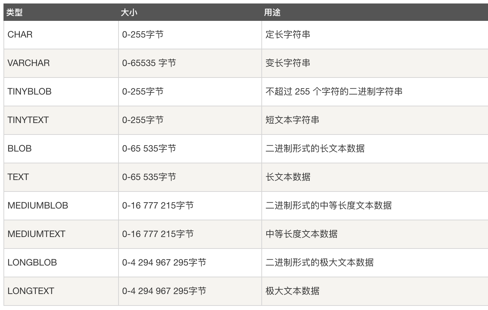

# Mysql-Basic

- 笔记本：Mysql 面试题
- 创建时间：2021-03-16 06:20:10 UTC
- 更新时间：2021-03-17 06:27:35 UTC
- 印象笔记 GUID：8c5551f9-3f61-4af4-a9a6-8b22f074f4a4

#### 1. 简述 MySQL 中 InnoDB 支持的四种事务隔离级别名称，以及逐级之间的区别?

- **read uncommited:** 读到未提交数据

- **read committed:** 脏读，不可重复读

- **repeatable read:** 可重读

- **serializable:** 串行事务

 | 事务隔离级别 | 脏读 | 不可重复读 | 幻读
 | 读未提交（read-uncommitted） | 是 | 是 | 是
 | 不可重复读（read-committed） | 否 | 是 | 是
 | 可重复读（repeatable-read） | 否 | 否 | 是
 | 串行化（serializable） | 否 | 否 | 否

**Tips：** 事务的并发问题
 1、脏读：事务A读取了事务B更新的数据，然后B回滚操作，那么A读取到的数据是脏数据

2、不可重复读：事务 A 多次读取同一数据，事务 B 在事务A多次读取的过程中，对数据作了更新并提交，导致事务A多次读取同一数据时，结果 不一致。

3、幻读：系统管理员A将数据库中所有学生的成绩从具体分数改为ABCDE等级，但是系统管理员B就在这个时候插入了一条具体分数的记录，当系统管理员A改结束后发现还有一条记录没有改过来，就好像发生了幻觉一样，这就叫幻读。

**小结：** 不可重复读的和幻读很容易混淆，不可重复读侧重于修改，幻读侧重于新增或删除。解决不可重复读的问题只需锁住满足条件的行，解决幻读需要锁表

#### 2. 在 MySQL 中 ENUM 的用法是什么?

ENUM 是一个字符串对象，用于指定一组预定义的值，并可在创建表时使用。 SQL 语法如下:

```
create table student(name varchar(25), gender enum('man', 'woman'));

```

#### 3. CHAR 和 VARCHAR 的区别?

CHAR 和 VARCHAR 类型在存储和检索方面有所不同。
 CHAR 列长度固定为创建表时声明的长度，长度值范围是 1 到 255。
 当 CHAR 值被存储时，它们被用空格填充到特定长度，检索 CHAR 值时需删除尾随空格。

- char（len）括号中存储写的是字符长度，最大值为255，如果在存储的时你实际存储的字符长度低于括号中填写的长度，那它在存储的时候会**以空格补全位数进行存储**。varchar，则不具备这样的特性，最大长度取值为65535，不会空格补全进行存储；

- char在取值的时候会把存值后面的空格去除掉，varchar 如果后面有空格则会保留；

- char 是定长，varcahr 是变长（定长就是所占用的空间就是不管存储多少个字，所占用的内存空间都是括号中的最大值称上编码换算率，就是n字符=几个字节的这个倍率）

**补充：** 字符与字节的区别：一个字符由于所使用的字符集的不同，会并存储在一个或多个字节中，所以一个字符占用多少个字节取决于所使用的字符集

**注意：** char（len）与varchar（len）后面接的数据大小为存储的字符数，而不是字节数；

#### 4. 列的字符串类型可以是什么?

- CHAR(M)：固定长度字符串，在定义时需要指定字符串长度，当保存时在右侧填充空格以达到指定的长度。

- VARCHAR(M)：长度可变的字符串，当保存时会检查尾部是否存在空格，如果存在则删除。

- TEXT：主要用来存储文章内容、评论和留言等，并且不删除保存内容的尾部空格（0-65535 字节）

- ENUM：是一个字符串对象，其值为创建表时在字段规定中枚举的一列值。

- SET：SET类型与ENUM类型在定义时是类似的，区别在于ENUM类型的字段只能从定义的字段值中选择一个值插入，而SET类型的字段可以从定义的列值中选择多个字符的联合。

- BLOB：二进制形式的长文本数据（0-65535 字节）



#### 5. MySQL 中使用什么存储引擎?

存储引擎称为表类型，数据使用各种技术存储在文件中。

- **InnoDB：** MySql 5.6 版本默认的存储引擎。InnoDB 是一个事务安全的存储引擎，它具备提交、回滚以及崩溃恢复的功能以保护用户数据。InnoDB 的行级别锁定以及 Oracle 风格的一致性无锁读提升了它的多用户并发数以及性能。InnoDB 将用户数据存储在聚集索引中以减少基于主键的普通查询所带来的 I/O 开销。为了保证数据的完整性，InnoDB 还支持外键约束。

- **MyISAM：** MyISAM既不支持事务、也不支持外键、其优势是访问速度快，但是表级别的锁定限制了它在读写负载方面的性能，因此它经常应用于只读或者以读为主的数据场景。

- Memory：在内存中存储所有数据，应用于对非关键数据由快速查找的场景。Memory类型的表访问数据非常快，因为它的数据是存放在内存中的，并且默认使用HASH索引，但是一旦服务关闭，表中的数据就会丢失

- Merge：允许 MySql DBA 或开发者将一系列相同的 MyISAM 表进行分组，并把它们作为一个对象进行引用。适用于超大规模数据场景，如数据仓库。

- BLACKHOLE：黑洞存储引擎，类似于 Unix 的 /dev/null，Archive 只接收但却并不保存数据。对这种引擎的表的查询常常返回一个空集。这种表可以应用于 DML 语句需要发送到从服务器，但主服务器并不会保留这种数据的备份的主从配置中。

- ...

#### 6. mysql timestamp 类型字段的 CURRENT_TIMESTAMP 与 ON UPDATE CURRENT_TIMESTAMP 属性

- **CURRENT_TIMESTAMP**
 当要向数据库执行 insert 操作时，如果有个 timestamp 字段属性设为CURRENT_TIMESTAMP，则无论这个字段有没有set值都插入当前系统时间

- **ON UPDATE CURRENT_TIMESTAMP**
 当执行 update 操作时，并且字段有 ON UPDATE CURRENT_TIMESTAMP 属性。则字段无论值有没有变化，他的值也会跟着更新为当前UPDATE操作时的时间。

#### 7. 主键和候选键有什么区别?

表格的每一行都由主键唯一标识, 一个表只有一个主键。
 主键也是候选键。按照惯例，候选键可以被指定为主键，并且可以用于任何外键引用。

**补充：**

- **超键(super key):** 在关系中能唯一标识元组的属性集称为关系模式的超键/码。

- **候选键(candidate key):** 不含有多余属性的超键称为候选键，即其真子集不再是超键。

- **主键(primary key):** 用户选作元组标识的一个候选键称为主键，是候选键之一。

#### 8. MySQL 数据库服务器性能分析的方法命令有哪些?

- Show status 一些值得监控的变量值

  - Bytes_received和Bytes_sent：和服务器之间来往的流量。

  - Com_*服务器正在执行的命令。

  - Created_*在查询执行期限间创建的临时表和文件。

  - Handler_*存储引擎操作。

  - Select_*不同类型的联接执行计划。

  - Sort_*几种排序信息。

- show profile：MySql用来分析当前会话SQL语句执行的资源消耗情况

- show session status like 'Select'

- explain

#### 9. LIKE 和 REGEXP 操作有什么区别?

like要求整个数据都要匹配，而REGEXP只需要部分匹配即可。
 也就是说，用Like,必须这个字段的所有内容满足条件，而REGEXP只需要有任何一个片段满足即可。

#### 10. BLOB 和 TEXT 有什么区别?

BLOB 是一个二进制对象，可以容纳可变数量的数据。有四种类型的 BLOB：TINYBLOB、BLOB、MEDIUMBLOB 和 LONGBLOB 它们只能在所能容纳价值的最大长度上有所不同。
 TEXT 是一个不区分大小写的 BLOB。四种 TEXT 类型：TINYTEXT、TEXT、MEDIUMTEXT 和 LONGTEXT 它们对应于四种 BLOB 类型，并具有相同的最大长度和存储要求。
 **BLOB 和 TEXT 类型之间的唯一区别在于对 BLOB 值进行排序和比较时区分大小 写，对 TEXT 值不区分大小写。**

#### 11. 数据库的三范式?

**第一范式:** 数据库表的每一个字段都是不可分割的。
 **第二范式:** 数据库表中的非主属性只依赖于主键。
 **第三范式:** 不存在非主属性对关键字的传递函数依赖关系。

#### 12. MySQL 表中允许有多少个 TRIGGERS?

在 MySQL 表中允许有六个触发器，如下:

- BEFORE INSERT

- AFTER INSERT

- BEFORE UPDATE

- AFTER UPDATE

- BEFORE DELETE

- AFTER DELETE

#### 13. 什么是通用 SQL 函数?

-
**数学函数：** Abs(num)求绝对值、floor(num)向下取整、ceil(num)向上取整

-
**字符串函数：**

  - insert (s1,index,length,s2) 替换函数

  - upper(str)，ucase(str)将字母改为大写

  - lower(str)，lcase(str)将字母改为小写

  - left(str，length)返回 str 字符串的前 length 个字符

  - right(str，length)返回 str 字符串的后 length 个字符

  - substring(str，index，length)返回 str 字符串从 index 位开始长度为 length 个字符(index 从 1 开始)

  - reverse(str)将 str 字符串倒序输出

-
**日期函数：**

  - curdate()、current_date() 获取当前日期

  - curtime()、current_time() 获取当前日期

  - now()获取当前日期和时间

  - datediff(d1、d2)d1 和 d2 之间的天数差

  - adddate(date，num)返回 date 日期开始，之后 num 天的日期

  - subdate(date，num)返回 date 日期开始，之前 num 天的日期

-
**聚合函数：**

  - Count(字段)根据某个字段统计总记录数(当前数据库保存到多少条数据)

  - sum(字段)计算某个字段的数值总和

  - avg(字段)计算某个字段的数值的平均值

  - Max(字段)、min(字段)求某个字段最大或最小值

#### 14. MySQL 中有哪几种锁?

MyISAM 支持表锁，InnoDB 支持表锁和行锁，默认为行锁。

- 表级锁:开销小，加锁快，不会出现死锁。锁定粒度大，发生锁冲突的概率最高，并发量最低。

- 行级锁:开销大，加锁慢，会出现死锁。锁力度小，发生锁冲突的概率小，并发度最高。

#### 15. MySQL 数据优化

**优化数据类型：**

- 避免使用 NULL，NULL 需要特殊处理，大多数时候应该使用 NOT NULL，或者使用一个特殊的值，如 0，-1 作为默认值

- 尽可能使用更小的字段，MySQL 从磁盘读取数据后是存储到内存中的，然后使用 cpu 周期和磁盘 I/O 读取它，这意味着越小的数据类 型占用的空间越小.

**小心字符集转换：** 客户端或应用程序使用的字符集可能和表本身的字符集不一样，这需要 MySQL 在运行过程中隐含地进行转换，此外，要确定字符集如 UTF- 8 是否支持多字节字符，因此它们需要更多的存储空间。

**count(col) 和 count(*)**:
 在不加WHERE限制条件的情况下，COUNT(*)与COUNT(COL)基本可以认为是等价的；
 但是在有WHERE限制条件的情况下，COUNT(*)会比COUNT(COL)快非常多；

**优化子查询：** 遇到子查询时，MySQL 查询优化引擎并不是总是最有效的，这就是为什么经常将子查询转换为连接查询的原因了，优化器已经能够正确处理连接查询了，当然要注意的一点是，确保连接表 (第二个表) 的连接列是有索引的，在第一个表上 MySQL 通常会相对于第二个表的查询子集进行一次全表扫描，这是嵌套循环算法的一部分。

**优化 UNION：**

- 在跨多个不同的数据库时使用 UNION 是一个有趣的优化方法，UNION 从两个互不关联的表中返回数据，这就意味着不会出现重复的行，同时也必须对数据进行排序，我们知道排序是非常耗费资源的，特别是对大表的排序。

- UNION ALL 可以大大加快速度，如果你已经知道你的数据不会包括重复行，或者你不在乎是否会出现重复的行，在这两种情况下使用
 UNION ALL 更适合。此外，还可以在应用程序逻辑中采用某些方法避免出现重复的行，这样 UNION ALL 和 UNION 返回的结果都是一样的，但 UNION ALL 不会进行排序。

#### 16. 数据库备份。

mysqldump

#### 17. truncate delete drop 的区别

- drop(DDL 语句):是不可逆操作，会将表所占用空间全部释放掉;

- truncate(DDL 语句):只针对于删除表的操作，在删除过程中不会激活与表有关的删除触发器并且不会把删除记录放在日志中;当表被 truncate 后，这个表和索引会恢复到初始大小;

- delete(DML 语句):可以删除表也可以删除行，但是删除记录会被计入日志保存，而且表空间大小不会恢复到原来;

**执行速度：** drop > truncate > delete

**扩展：**

-
**DDL（Data Definition Languages）语句：** 即数据库定义语句，用来创建数据库中的表、索引、视图、存储过程、触发器等，常用的语句关键字有：`CREATE`, `ALTER`, `DROP`, `TRUNCATE`, `COMMENT`, `RENAME`。

-
**DML（Data Manipulation Language）语句：** 即数据操纵语句，用来查询、添加、更新、删除等，常用的语句关键字有：`SELECT`, `INSERT`, `UPDATE,DELETE`, `MERGE`, `CALL`, `EXPLAIN` , `LOCK TABLE`,包括通用性的增删改查。

-
**DCL（Data Control Language）语句：** 即数据控制语句，用于授权/撤销数据库及其字段的权限（DCL is short name of Data Control Language which includes commands such as GRANT and mostly concerned with rights, permissions and other controls of the database system.）。常用的语句关键字有：`GRANT`, `REVOKE`。

-
**TCL（Transaction Control Language）语句：** 事务控制语句，用于控制事务，常用的语句关键字有：`COMMIT`, `ROLLBACK`, `SAVEPOINT`, `SET TRANSACTION`。

%23%23%23%23%201.%20%E7%AE%80%E8%BF%B0%20MySQL%20%E4%B8%AD%20InnoDB%20%E6%94%AF%E6%8C%81%E7%9A%84%E5%9B%9B%E7%A7%8D%E4%BA%8B%E5%8A%A1%E9%9A%94%E7%A6%BB%E7%BA%A7%E5%88%AB%E5%90%8D%E7%A7%B0%EF%BC%8C%E4%BB%A5%E5%8F%8A%E9%80%90%E7%BA%A7%E4%B9%8B%E9%97%B4%E7%9A%84%E5%8C%BA%E5%88%AB%3F%0A-%20**read%20uncommited%3A**%20%E8%AF%BB%E5%88%B0%E6%9C%AA%E6%8F%90%E4%BA%A4%E6%95%B0%E6%8D%AE%0A-%20**read%20committed%3A**%20%E8%84%8F%E8%AF%BB%EF%BC%8C%E4%B8%8D%E5%8F%AF%E9%87%8D%E5%A4%8D%E8%AF%BB%0A-%20**repeatable%20read%3A**%20%E5%8F%AF%E9%87%8D%E8%AF%BB%0A-%20**serializable%3A**%20%E4%B8%B2%E8%A1%8C%E4%BA%8B%E5%8A%A1%0A%0A%E4%BA%8B%E5%8A%A1%E9%9A%94%E7%A6%BB%E7%BA%A7%E5%88%AB%20%7C%20%E8%84%8F%E8%AF%BB%20%7C%20%E4%B8%8D%E5%8F%AF%E9%87%8D%E5%A4%8D%E8%AF%BB%20%7C%20%E5%B9%BB%E8%AF%BB%0A--%20%7C%20--%20%7C%20--%20%7C%20--%0A%E8%AF%BB%E6%9C%AA%E6%8F%90%E4%BA%A4%EF%BC%88read-uncommitted%EF%BC%89%7C%09%E6%98%AF%09%7C%E6%98%AF%09%7C%E6%98%AF%0A%E4%B8%8D%E5%8F%AF%E9%87%8D%E5%A4%8D%E8%AF%BB%EF%BC%88read-committed%EF%BC%89%7C%09%E5%90%A6%7C%09%E6%98%AF%09%7C%E6%98%AF%0A%E5%8F%AF%E9%87%8D%E5%A4%8D%E8%AF%BB%EF%BC%88repeatable-read%EF%BC%89%7C%09%E5%90%A6%09%7C%E5%90%A6%7C%09%E6%98%AF%0A%E4%B8%B2%E8%A1%8C%E5%8C%96%EF%BC%88serializable%EF%BC%89%7C%09%E5%90%A6%09%7C%E5%90%A6%7C%09%E5%90%A6%0A%0A**Tips%EF%BC%9A**%20%E4%BA%8B%E5%8A%A1%E7%9A%84%E5%B9%B6%E5%8F%91%E9%97%AE%E9%A2%98%0A1%E3%80%81%E8%84%8F%E8%AF%BB%EF%BC%9A%E4%BA%8B%E5%8A%A1A%E8%AF%BB%E5%8F%96%E4%BA%86%E4%BA%8B%E5%8A%A1B%E6%9B%B4%E6%96%B0%E7%9A%84%E6%95%B0%E6%8D%AE%EF%BC%8C%E7%84%B6%E5%90%8EB%E5%9B%9E%E6%BB%9A%E6%93%8D%E4%BD%9C%EF%BC%8C%E9%82%A3%E4%B9%88A%E8%AF%BB%E5%8F%96%E5%88%B0%E7%9A%84%E6%95%B0%E6%8D%AE%E6%98%AF%E8%84%8F%E6%95%B0%E6%8D%AE%0A%0A2%E3%80%81%E4%B8%8D%E5%8F%AF%E9%87%8D%E5%A4%8D%E8%AF%BB%EF%BC%9A%E4%BA%8B%E5%8A%A1%20A%20%E5%A4%9A%E6%AC%A1%E8%AF%BB%E5%8F%96%E5%90%8C%E4%B8%80%E6%95%B0%E6%8D%AE%EF%BC%8C%E4%BA%8B%E5%8A%A1%20B%20%E5%9C%A8%E4%BA%8B%E5%8A%A1A%E5%A4%9A%E6%AC%A1%E8%AF%BB%E5%8F%96%E7%9A%84%E8%BF%87%E7%A8%8B%E4%B8%AD%EF%BC%8C%E5%AF%B9%E6%95%B0%E6%8D%AE%E4%BD%9C%E4%BA%86%E6%9B%B4%E6%96%B0%E5%B9%B6%E6%8F%90%E4%BA%A4%EF%BC%8C%E5%AF%BC%E8%87%B4%E4%BA%8B%E5%8A%A1A%E5%A4%9A%E6%AC%A1%E8%AF%BB%E5%8F%96%E5%90%8C%E4%B8%80%E6%95%B0%E6%8D%AE%E6%97%B6%EF%BC%8C%E7%BB%93%E6%9E%9C%20%E4%B8%8D%E4%B8%80%E8%87%B4%E3%80%82%0A%0A3%E3%80%81%E5%B9%BB%E8%AF%BB%EF%BC%9A%E7%B3%BB%E7%BB%9F%E7%AE%A1%E7%90%86%E5%91%98A%E5%B0%86%E6%95%B0%E6%8D%AE%E5%BA%93%E4%B8%AD%E6%89%80%E6%9C%89%E5%AD%A6%E7%94%9F%E7%9A%84%E6%88%90%E7%BB%A9%E4%BB%8E%E5%85%B7%E4%BD%93%E5%88%86%E6%95%B0%E6%94%B9%E4%B8%BAABCDE%E7%AD%89%E7%BA%A7%EF%BC%8C%E4%BD%86%E6%98%AF%E7%B3%BB%E7%BB%9F%E7%AE%A1%E7%90%86%E5%91%98B%E5%B0%B1%E5%9C%A8%E8%BF%99%E4%B8%AA%E6%97%B6%E5%80%99%E6%8F%92%E5%85%A5%E4%BA%86%E4%B8%80%E6%9D%A1%E5%85%B7%E4%BD%93%E5%88%86%E6%95%B0%E7%9A%84%E8%AE%B0%E5%BD%95%EF%BC%8C%E5%BD%93%E7%B3%BB%E7%BB%9F%E7%AE%A1%E7%90%86%E5%91%98A%E6%94%B9%E7%BB%93%E6%9D%9F%E5%90%8E%E5%8F%91%E7%8E%B0%E8%BF%98%E6%9C%89%E4%B8%80%E6%9D%A1%E8%AE%B0%E5%BD%95%E6%B2%A1%E6%9C%89%E6%94%B9%E8%BF%87%E6%9D%A5%EF%BC%8C%E5%B0%B1%E5%A5%BD%E5%83%8F%E5%8F%91%E7%94%9F%E4%BA%86%E5%B9%BB%E8%A7%89%E4%B8%80%E6%A0%B7%EF%BC%8C%E8%BF%99%E5%B0%B1%E5%8F%AB%E5%B9%BB%E8%AF%BB%E3%80%82%0A%0A**%E5%B0%8F%E7%BB%93%EF%BC%9A**%20%E4%B8%8D%E5%8F%AF%E9%87%8D%E5%A4%8D%E8%AF%BB%E7%9A%84%E5%92%8C%E5%B9%BB%E8%AF%BB%E5%BE%88%E5%AE%B9%E6%98%93%E6%B7%B7%E6%B7%86%EF%BC%8C%E4%B8%8D%E5%8F%AF%E9%87%8D%E5%A4%8D%E8%AF%BB%E4%BE%A7%E9%87%8D%E4%BA%8E%E4%BF%AE%E6%94%B9%EF%BC%8C%E5%B9%BB%E8%AF%BB%E4%BE%A7%E9%87%8D%E4%BA%8E%E6%96%B0%E5%A2%9E%E6%88%96%E5%88%A0%E9%99%A4%E3%80%82%E8%A7%A3%E5%86%B3%E4%B8%8D%E5%8F%AF%E9%87%8D%E5%A4%8D%E8%AF%BB%E7%9A%84%E9%97%AE%E9%A2%98%E5%8F%AA%E9%9C%80%E9%94%81%E4%BD%8F%E6%BB%A1%E8%B6%B3%E6%9D%A1%E4%BB%B6%E7%9A%84%E8%A1%8C%EF%BC%8C%E8%A7%A3%E5%86%B3%E5%B9%BB%E8%AF%BB%E9%9C%80%E8%A6%81%E9%94%81%E8%A1%A8%0A%0A%23%23%23%23%202.%20%E5%9C%A8%20MySQL%20%E4%B8%AD%20ENUM%20%E7%9A%84%E7%94%A8%E6%B3%95%E6%98%AF%E4%BB%80%E4%B9%88%3F%0AENUM%20%E6%98%AF%E4%B8%80%E4%B8%AA%E5%AD%97%E7%AC%A6%E4%B8%B2%E5%AF%B9%E8%B1%A1%EF%BC%8C%E7%94%A8%E4%BA%8E%E6%8C%87%E5%AE%9A%E4%B8%80%E7%BB%84%E9%A2%84%E5%AE%9A%E4%B9%89%E7%9A%84%E5%80%BC%EF%BC%8C%E5%B9%B6%E5%8F%AF%E5%9C%A8%E5%88%9B%E5%BB%BA%E8%A1%A8%E6%97%B6%E4%BD%BF%E7%94%A8%E3%80%82%20SQL%20%E8%AF%AD%E6%B3%95%E5%A6%82%E4%B8%8B%3A%0A%60%60%60sql%0Acreate%20table%20student(name%20varchar(25)%2C%20gender%20enum('man'%2C%20'woman'))%3B%0A%60%60%60%0A%0A%23%23%23%23%203.%20CHAR%20%E5%92%8C%20VARCHAR%20%E7%9A%84%E5%8C%BA%E5%88%AB%3F%0ACHAR%20%E5%92%8C%20VARCHAR%20%E7%B1%BB%E5%9E%8B%E5%9C%A8%E5%AD%98%E5%82%A8%E5%92%8C%E6%A3%80%E7%B4%A2%E6%96%B9%E9%9D%A2%E6%9C%89%E6%89%80%E4%B8%8D%E5%90%8C%E3%80%82%0ACHAR%20%E5%88%97%E9%95%BF%E5%BA%A6%E5%9B%BA%E5%AE%9A%E4%B8%BA%E5%88%9B%E5%BB%BA%E8%A1%A8%E6%97%B6%E5%A3%B0%E6%98%8E%E7%9A%84%E9%95%BF%E5%BA%A6%EF%BC%8C%E9%95%BF%E5%BA%A6%E5%80%BC%E8%8C%83%E5%9B%B4%E6%98%AF%201%20%E5%88%B0%20255%E3%80%82%0A%E5%BD%93%20CHAR%20%E5%80%BC%E8%A2%AB%E5%AD%98%E5%82%A8%E6%97%B6%EF%BC%8C%E5%AE%83%E4%BB%AC%E8%A2%AB%E7%94%A8%E7%A9%BA%E6%A0%BC%E5%A1%AB%E5%85%85%E5%88%B0%E7%89%B9%E5%AE%9A%E9%95%BF%E5%BA%A6%EF%BC%8C%E6%A3%80%E7%B4%A2%20CHAR%20%E5%80%BC%E6%97%B6%E9%9C%80%E5%88%A0%E9%99%A4%E5%B0%BE%E9%9A%8F%E7%A9%BA%E6%A0%BC%E3%80%82%0A%0A-%20char%EF%BC%88len%EF%BC%89%E6%8B%AC%E5%8F%B7%E4%B8%AD%E5%AD%98%E5%82%A8%E5%86%99%E7%9A%84%E6%98%AF%E5%AD%97%E7%AC%A6%E9%95%BF%E5%BA%A6%EF%BC%8C%E6%9C%80%E5%A4%A7%E5%80%BC%E4%B8%BA255%EF%BC%8C%E5%A6%82%E6%9E%9C%E5%9C%A8%E5%AD%98%E5%82%A8%E7%9A%84%E6%97%B6%E4%BD%A0%E5%AE%9E%E9%99%85%E5%AD%98%E5%82%A8%E7%9A%84%E5%AD%97%E7%AC%A6%E9%95%BF%E5%BA%A6%E4%BD%8E%E4%BA%8E%E6%8B%AC%E5%8F%B7%E4%B8%AD%E5%A1%AB%E5%86%99%E7%9A%84%E9%95%BF%E5%BA%A6%EF%BC%8C%E9%82%A3%E5%AE%83%E5%9C%A8%E5%AD%98%E5%82%A8%E7%9A%84%E6%97%B6%E5%80%99%E4%BC%9A**%E4%BB%A5%E7%A9%BA%E6%A0%BC%E8%A1%A5%E5%85%A8%E4%BD%8D%E6%95%B0%E8%BF%9B%E8%A1%8C%E5%AD%98%E5%82%A8**%E3%80%82varchar%EF%BC%8C%E5%88%99%E4%B8%8D%E5%85%B7%E5%A4%87%E8%BF%99%E6%A0%B7%E7%9A%84%E7%89%B9%E6%80%A7%EF%BC%8C%E6%9C%80%E5%A4%A7%E9%95%BF%E5%BA%A6%E5%8F%96%E5%80%BC%E4%B8%BA65535%EF%BC%8C%E4%B8%8D%E4%BC%9A%E7%A9%BA%E6%A0%BC%E8%A1%A5%E5%85%A8%E8%BF%9B%E8%A1%8C%E5%AD%98%E5%82%A8%EF%BC%9B%0A-%20char%E5%9C%A8%E5%8F%96%E5%80%BC%E7%9A%84%E6%97%B6%E5%80%99%E4%BC%9A%E6%8A%8A%E5%AD%98%E5%80%BC%E5%90%8E%E9%9D%A2%E7%9A%84%E7%A9%BA%E6%A0%BC%E5%8E%BB%E9%99%A4%E6%8E%89%EF%BC%8Cvarchar%20%E5%A6%82%E6%9E%9C%E5%90%8E%E9%9D%A2%E6%9C%89%E7%A9%BA%E6%A0%BC%E5%88%99%E4%BC%9A%E4%BF%9D%E7%95%99%EF%BC%9B%0A-%20char%20%E6%98%AF%E5%AE%9A%E9%95%BF%EF%BC%8Cvarcahr%20%E6%98%AF%E5%8F%98%E9%95%BF%EF%BC%88%E5%AE%9A%E9%95%BF%E5%B0%B1%E6%98%AF%E6%89%80%E5%8D%A0%E7%94%A8%E7%9A%84%E7%A9%BA%E9%97%B4%E5%B0%B1%E6%98%AF%E4%B8%8D%E7%AE%A1%E5%AD%98%E5%82%A8%E5%A4%9A%E5%B0%91%E4%B8%AA%E5%AD%97%EF%BC%8C%E6%89%80%E5%8D%A0%E7%94%A8%E7%9A%84%E5%86%85%E5%AD%98%E7%A9%BA%E9%97%B4%E9%83%BD%E6%98%AF%E6%8B%AC%E5%8F%B7%E4%B8%AD%E7%9A%84%E6%9C%80%E5%A4%A7%E5%80%BC%E7%A7%B0%E4%B8%8A%E7%BC%96%E7%A0%81%E6%8D%A2%E7%AE%97%E7%8E%87%EF%BC%8C%E5%B0%B1%E6%98%AFn%E5%AD%97%E7%AC%A6%3D%E5%87%A0%E4%B8%AA%E5%AD%97%E8%8A%82%E7%9A%84%E8%BF%99%E4%B8%AA%E5%80%8D%E7%8E%87%EF%BC%89%0A%0A%0A**%E8%A1%A5%E5%85%85%EF%BC%9A**%20%E5%AD%97%E7%AC%A6%E4%B8%8E%E5%AD%97%E8%8A%82%E7%9A%84%E5%8C%BA%E5%88%AB%EF%BC%9A%E4%B8%80%E4%B8%AA%E5%AD%97%E7%AC%A6%E7%94%B1%E4%BA%8E%E6%89%80%E4%BD%BF%E7%94%A8%E7%9A%84%E5%AD%97%E7%AC%A6%E9%9B%86%E7%9A%84%E4%B8%8D%E5%90%8C%EF%BC%8C%E4%BC%9A%E5%B9%B6%E5%AD%98%E5%82%A8%E5%9C%A8%E4%B8%80%E4%B8%AA%E6%88%96%E5%A4%9A%E4%B8%AA%E5%AD%97%E8%8A%82%E4%B8%AD%EF%BC%8C%E6%89%80%E4%BB%A5%E4%B8%80%E4%B8%AA%E5%AD%97%E7%AC%A6%E5%8D%A0%E7%94%A8%E5%A4%9A%E5%B0%91%E4%B8%AA%E5%AD%97%E8%8A%82%E5%8F%96%E5%86%B3%E4%BA%8E%E6%89%80%E4%BD%BF%E7%94%A8%E7%9A%84%E5%AD%97%E7%AC%A6%E9%9B%86%0A%0A**%E6%B3%A8%E6%84%8F%EF%BC%9A**%20char%EF%BC%88len%EF%BC%89%E4%B8%8Evarchar%EF%BC%88len%EF%BC%89%E5%90%8E%E9%9D%A2%E6%8E%A5%E7%9A%84%E6%95%B0%E6%8D%AE%E5%A4%A7%E5%B0%8F%E4%B8%BA%E5%AD%98%E5%82%A8%E7%9A%84%E5%AD%97%E7%AC%A6%E6%95%B0%EF%BC%8C%E8%80%8C%E4%B8%8D%E6%98%AF%E5%AD%97%E8%8A%82%E6%95%B0%EF%BC%9B%0A%0A%23%23%23%23%204.%20%E5%88%97%E7%9A%84%E5%AD%97%E7%AC%A6%E4%B8%B2%E7%B1%BB%E5%9E%8B%E5%8F%AF%E4%BB%A5%E6%98%AF%E4%BB%80%E4%B9%88%3F%0A-%20CHAR(M)%EF%BC%9A%E5%9B%BA%E5%AE%9A%E9%95%BF%E5%BA%A6%E5%AD%97%E7%AC%A6%E4%B8%B2%EF%BC%8C%E5%9C%A8%E5%AE%9A%E4%B9%89%E6%97%B6%E9%9C%80%E8%A6%81%E6%8C%87%E5%AE%9A%E5%AD%97%E7%AC%A6%E4%B8%B2%E9%95%BF%E5%BA%A6%EF%BC%8C%E5%BD%93%E4%BF%9D%E5%AD%98%E6%97%B6%E5%9C%A8%E5%8F%B3%E4%BE%A7%E5%A1%AB%E5%85%85%E7%A9%BA%E6%A0%BC%E4%BB%A5%E8%BE%BE%E5%88%B0%E6%8C%87%E5%AE%9A%E7%9A%84%E9%95%BF%E5%BA%A6%E3%80%82%0A-%20VARCHAR(M)%EF%BC%9A%E9%95%BF%E5%BA%A6%E5%8F%AF%E5%8F%98%E7%9A%84%E5%AD%97%E7%AC%A6%E4%B8%B2%EF%BC%8C%E5%BD%93%E4%BF%9D%E5%AD%98%E6%97%B6%E4%BC%9A%E6%A3%80%E6%9F%A5%E5%B0%BE%E9%83%A8%E6%98%AF%E5%90%A6%E5%AD%98%E5%9C%A8%E7%A9%BA%E6%A0%BC%EF%BC%8C%E5%A6%82%E6%9E%9C%E5%AD%98%E5%9C%A8%E5%88%99%E5%88%A0%E9%99%A4%E3%80%82%0A-%20TEXT%EF%BC%9A%E4%B8%BB%E8%A6%81%E7%94%A8%E6%9D%A5%E5%AD%98%E5%82%A8%E6%96%87%E7%AB%A0%E5%86%85%E5%AE%B9%E3%80%81%E8%AF%84%E8%AE%BA%E5%92%8C%E7%95%99%E8%A8%80%E7%AD%89%EF%BC%8C%E5%B9%B6%E4%B8%94%E4%B8%8D%E5%88%A0%E9%99%A4%E4%BF%9D%E5%AD%98%E5%86%85%E5%AE%B9%E7%9A%84%E5%B0%BE%E9%83%A8%E7%A9%BA%E6%A0%BC%EF%BC%880-65535%20%E5%AD%97%E8%8A%82%EF%BC%89%0A-%20ENUM%EF%BC%9A%E6%98%AF%E4%B8%80%E4%B8%AA%E5%AD%97%E7%AC%A6%E4%B8%B2%E5%AF%B9%E8%B1%A1%EF%BC%8C%E5%85%B6%E5%80%BC%E4%B8%BA%E5%88%9B%E5%BB%BA%E8%A1%A8%E6%97%B6%E5%9C%A8%E5%AD%97%E6%AE%B5%E8%A7%84%E5%AE%9A%E4%B8%AD%E6%9E%9A%E4%B8%BE%E7%9A%84%E4%B8%80%E5%88%97%E5%80%BC%E3%80%82%0A-%20SET%EF%BC%9ASET%E7%B1%BB%E5%9E%8B%E4%B8%8EENUM%E7%B1%BB%E5%9E%8B%E5%9C%A8%E5%AE%9A%E4%B9%89%E6%97%B6%E6%98%AF%E7%B1%BB%E4%BC%BC%E7%9A%84%EF%BC%8C%E5%8C%BA%E5%88%AB%E5%9C%A8%E4%BA%8EENUM%E7%B1%BB%E5%9E%8B%E7%9A%84%E5%AD%97%E6%AE%B5%E5%8F%AA%E8%83%BD%E4%BB%8E%E5%AE%9A%E4%B9%89%E7%9A%84%E5%AD%97%E6%AE%B5%E5%80%BC%E4%B8%AD%E9%80%89%E6%8B%A9%E4%B8%80%E4%B8%AA%E5%80%BC%E6%8F%92%E5%85%A5%EF%BC%8C%E8%80%8CSET%E7%B1%BB%E5%9E%8B%E7%9A%84%E5%AD%97%E6%AE%B5%E5%8F%AF%E4%BB%A5%E4%BB%8E%E5%AE%9A%E4%B9%89%E7%9A%84%E5%88%97%E5%80%BC%E4%B8%AD%E9%80%89%E6%8B%A9%E5%A4%9A%E4%B8%AA%E5%AD%97%E7%AC%A6%E7%9A%84%E8%81%94%E5%90%88%E3%80%82%0A-%20BLOB%EF%BC%9A%E4%BA%8C%E8%BF%9B%E5%88%B6%E5%BD%A2%E5%BC%8F%E7%9A%84%E9%95%BF%E6%96%87%E6%9C%AC%E6%95%B0%E6%8D%AE%EF%BC%880-65535%20%E5%AD%97%E8%8A%82%EF%BC%89%0A%0A!%5B4f964d91eae849f2443d3636f82b89e2.png%5D(evernotecid%3A%2F%2F90F5C43D-AEAE-49B2-85BB-D02B6A52C764%2Fappyinxiangcom%2F25356149%2FENNote%2Fp438%3Fhash%3D4f964d91eae849f2443d3636f82b89e2)%0A%0A%23%23%23%23%205.%20MySQL%20%E4%B8%AD%E4%BD%BF%E7%94%A8%E4%BB%80%E4%B9%88%E5%AD%98%E5%82%A8%E5%BC%95%E6%93%8E%3F%0A%E5%AD%98%E5%82%A8%E5%BC%95%E6%93%8E%E7%A7%B0%E4%B8%BA%E8%A1%A8%E7%B1%BB%E5%9E%8B%EF%BC%8C%E6%95%B0%E6%8D%AE%E4%BD%BF%E7%94%A8%E5%90%84%E7%A7%8D%E6%8A%80%E6%9C%AF%E5%AD%98%E5%82%A8%E5%9C%A8%E6%96%87%E4%BB%B6%E4%B8%AD%E3%80%82%0A-%20**InnoDB%EF%BC%9A**%20MySql%205.6%20%E7%89%88%E6%9C%AC%E9%BB%98%E8%AE%A4%E7%9A%84%E5%AD%98%E5%82%A8%E5%BC%95%E6%93%8E%E3%80%82InnoDB%20%E6%98%AF%E4%B8%80%E4%B8%AA%E4%BA%8B%E5%8A%A1%E5%AE%89%E5%85%A8%E7%9A%84%E5%AD%98%E5%82%A8%E5%BC%95%E6%93%8E%EF%BC%8C%E5%AE%83%E5%85%B7%E5%A4%87%E6%8F%90%E4%BA%A4%E3%80%81%E5%9B%9E%E6%BB%9A%E4%BB%A5%E5%8F%8A%E5%B4%A9%E6%BA%83%E6%81%A2%E5%A4%8D%E7%9A%84%E5%8A%9F%E8%83%BD%E4%BB%A5%E4%BF%9D%E6%8A%A4%E7%94%A8%E6%88%B7%E6%95%B0%E6%8D%AE%E3%80%82InnoDB%20%E7%9A%84%E8%A1%8C%E7%BA%A7%E5%88%AB%E9%94%81%E5%AE%9A%E4%BB%A5%E5%8F%8A%20Oracle%20%E9%A3%8E%E6%A0%BC%E7%9A%84%E4%B8%80%E8%87%B4%E6%80%A7%E6%97%A0%E9%94%81%E8%AF%BB%E6%8F%90%E5%8D%87%E4%BA%86%E5%AE%83%E7%9A%84%E5%A4%9A%E7%94%A8%E6%88%B7%E5%B9%B6%E5%8F%91%E6%95%B0%E4%BB%A5%E5%8F%8A%E6%80%A7%E8%83%BD%E3%80%82InnoDB%20%E5%B0%86%E7%94%A8%E6%88%B7%E6%95%B0%E6%8D%AE%E5%AD%98%E5%82%A8%E5%9C%A8%E8%81%9A%E9%9B%86%E7%B4%A2%E5%BC%95%E4%B8%AD%E4%BB%A5%E5%87%8F%E5%B0%91%E5%9F%BA%E4%BA%8E%E4%B8%BB%E9%94%AE%E7%9A%84%E6%99%AE%E9%80%9A%E6%9F%A5%E8%AF%A2%E6%89%80%E5%B8%A6%E6%9D%A5%E7%9A%84%20I%2FO%20%E5%BC%80%E9%94%80%E3%80%82%E4%B8%BA%E4%BA%86%E4%BF%9D%E8%AF%81%E6%95%B0%E6%8D%AE%E7%9A%84%E5%AE%8C%E6%95%B4%E6%80%A7%EF%BC%8CInnoDB%20%E8%BF%98%E6%94%AF%E6%8C%81%E5%A4%96%E9%94%AE%E7%BA%A6%E6%9D%9F%E3%80%82%0A-%20**MyISAM%EF%BC%9A**%20MyISAM%E6%97%A2%E4%B8%8D%E6%94%AF%E6%8C%81%E4%BA%8B%E5%8A%A1%E3%80%81%E4%B9%9F%E4%B8%8D%E6%94%AF%E6%8C%81%E5%A4%96%E9%94%AE%E3%80%81%E5%85%B6%E4%BC%98%E5%8A%BF%E6%98%AF%E8%AE%BF%E9%97%AE%E9%80%9F%E5%BA%A6%E5%BF%AB%EF%BC%8C%E4%BD%86%E6%98%AF%E8%A1%A8%E7%BA%A7%E5%88%AB%E7%9A%84%E9%94%81%E5%AE%9A%E9%99%90%E5%88%B6%E4%BA%86%E5%AE%83%E5%9C%A8%E8%AF%BB%E5%86%99%E8%B4%9F%E8%BD%BD%E6%96%B9%E9%9D%A2%E7%9A%84%E6%80%A7%E8%83%BD%EF%BC%8C%E5%9B%A0%E6%AD%A4%E5%AE%83%E7%BB%8F%E5%B8%B8%E5%BA%94%E7%94%A8%E4%BA%8E%E5%8F%AA%E8%AF%BB%E6%88%96%E8%80%85%E4%BB%A5%E8%AF%BB%E4%B8%BA%E4%B8%BB%E7%9A%84%E6%95%B0%E6%8D%AE%E5%9C%BA%E6%99%AF%E3%80%82%0A-%20Memory%EF%BC%9A%E5%9C%A8%E5%86%85%E5%AD%98%E4%B8%AD%E5%AD%98%E5%82%A8%E6%89%80%E6%9C%89%E6%95%B0%E6%8D%AE%EF%BC%8C%E5%BA%94%E7%94%A8%E4%BA%8E%E5%AF%B9%E9%9D%9E%E5%85%B3%E9%94%AE%E6%95%B0%E6%8D%AE%E7%94%B1%E5%BF%AB%E9%80%9F%E6%9F%A5%E6%89%BE%E7%9A%84%E5%9C%BA%E6%99%AF%E3%80%82Memory%E7%B1%BB%E5%9E%8B%E7%9A%84%E8%A1%A8%E8%AE%BF%E9%97%AE%E6%95%B0%E6%8D%AE%E9%9D%9E%E5%B8%B8%E5%BF%AB%EF%BC%8C%E5%9B%A0%E4%B8%BA%E5%AE%83%E7%9A%84%E6%95%B0%E6%8D%AE%E6%98%AF%E5%AD%98%E6%94%BE%E5%9C%A8%E5%86%85%E5%AD%98%E4%B8%AD%E7%9A%84%EF%BC%8C%E5%B9%B6%E4%B8%94%E9%BB%98%E8%AE%A4%E4%BD%BF%E7%94%A8HASH%E7%B4%A2%E5%BC%95%EF%BC%8C%E4%BD%86%E6%98%AF%E4%B8%80%E6%97%A6%E6%9C%8D%E5%8A%A1%E5%85%B3%E9%97%AD%EF%BC%8C%E8%A1%A8%E4%B8%AD%E7%9A%84%E6%95%B0%E6%8D%AE%E5%B0%B1%E4%BC%9A%E4%B8%A2%E5%A4%B1%0A-%20Merge%EF%BC%9A%E5%85%81%E8%AE%B8%20MySql%20DBA%20%E6%88%96%E5%BC%80%E5%8F%91%E8%80%85%E5%B0%86%E4%B8%80%E7%B3%BB%E5%88%97%E7%9B%B8%E5%90%8C%E7%9A%84%20MyISAM%20%E8%A1%A8%E8%BF%9B%E8%A1%8C%E5%88%86%E7%BB%84%EF%BC%8C%E5%B9%B6%E6%8A%8A%E5%AE%83%E4%BB%AC%E4%BD%9C%E4%B8%BA%E4%B8%80%E4%B8%AA%E5%AF%B9%E8%B1%A1%E8%BF%9B%E8%A1%8C%E5%BC%95%E7%94%A8%E3%80%82%E9%80%82%E7%94%A8%E4%BA%8E%E8%B6%85%E5%A4%A7%E8%A7%84%E6%A8%A1%E6%95%B0%E6%8D%AE%E5%9C%BA%E6%99%AF%EF%BC%8C%E5%A6%82%E6%95%B0%E6%8D%AE%E4%BB%93%E5%BA%93%E3%80%82%0A-%20BLACKHOLE%EF%BC%9A%E9%BB%91%E6%B4%9E%E5%AD%98%E5%82%A8%E5%BC%95%E6%93%8E%EF%BC%8C%E7%B1%BB%E4%BC%BC%E4%BA%8E%20Unix%20%E7%9A%84%20%2Fdev%2Fnull%EF%BC%8CArchive%20%E5%8F%AA%E6%8E%A5%E6%94%B6%E4%BD%86%E5%8D%B4%E5%B9%B6%E4%B8%8D%E4%BF%9D%E5%AD%98%E6%95%B0%E6%8D%AE%E3%80%82%E5%AF%B9%E8%BF%99%E7%A7%8D%E5%BC%95%E6%93%8E%E7%9A%84%E8%A1%A8%E7%9A%84%E6%9F%A5%E8%AF%A2%E5%B8%B8%E5%B8%B8%E8%BF%94%E5%9B%9E%E4%B8%80%E4%B8%AA%E7%A9%BA%E9%9B%86%E3%80%82%E8%BF%99%E7%A7%8D%E8%A1%A8%E5%8F%AF%E4%BB%A5%E5%BA%94%E7%94%A8%E4%BA%8E%20DML%20%E8%AF%AD%E5%8F%A5%E9%9C%80%E8%A6%81%E5%8F%91%E9%80%81%E5%88%B0%E4%BB%8E%E6%9C%8D%E5%8A%A1%E5%99%A8%EF%BC%8C%E4%BD%86%E4%B8%BB%E6%9C%8D%E5%8A%A1%E5%99%A8%E5%B9%B6%E4%B8%8D%E4%BC%9A%E4%BF%9D%E7%95%99%E8%BF%99%E7%A7%8D%E6%95%B0%E6%8D%AE%E7%9A%84%E5%A4%87%E4%BB%BD%E7%9A%84%E4%B8%BB%E4%BB%8E%E9%85%8D%E7%BD%AE%E4%B8%AD%E3%80%82%0A-%20...%0A%0A%23%23%23%23%206.%20mysql%20timestamp%20%E7%B1%BB%E5%9E%8B%E5%AD%97%E6%AE%B5%E7%9A%84%20CURRENT_TIMESTAMP%20%E4%B8%8E%20ON%20UPDATE%20CURRENT_TIMESTAMP%20%E5%B1%9E%E6%80%A7%0A-%20**CURRENT_TIMESTAMP**%0A%E5%BD%93%E8%A6%81%E5%90%91%E6%95%B0%E6%8D%AE%E5%BA%93%E6%89%A7%E8%A1%8C%20insert%20%E6%93%8D%E4%BD%9C%E6%97%B6%EF%BC%8C%E5%A6%82%E6%9E%9C%E6%9C%89%E4%B8%AA%20timestamp%20%E5%AD%97%E6%AE%B5%E5%B1%9E%E6%80%A7%E8%AE%BE%E4%B8%BACURRENT_TIMESTAMP%EF%BC%8C%E5%88%99%E6%97%A0%E8%AE%BA%E8%BF%99%E4%B8%AA%E5%AD%97%E6%AE%B5%E6%9C%89%E6%B2%A1%E6%9C%89set%E5%80%BC%E9%83%BD%E6%8F%92%E5%85%A5%E5%BD%93%E5%89%8D%E7%B3%BB%E7%BB%9F%E6%97%B6%E9%97%B4%0A-%20**ON%20UPDATE%20CURRENT_TIMESTAMP**%0A%E5%BD%93%E6%89%A7%E8%A1%8C%20update%20%E6%93%8D%E4%BD%9C%E6%97%B6%EF%BC%8C%E5%B9%B6%E4%B8%94%E5%AD%97%E6%AE%B5%E6%9C%89%20ON%20UPDATE%20CURRENT_TIMESTAMP%20%E5%B1%9E%E6%80%A7%E3%80%82%E5%88%99%E5%AD%97%E6%AE%B5%E6%97%A0%E8%AE%BA%E5%80%BC%E6%9C%89%E6%B2%A1%E6%9C%89%E5%8F%98%E5%8C%96%EF%BC%8C%E4%BB%96%E7%9A%84%E5%80%BC%E4%B9%9F%E4%BC%9A%E8%B7%9F%E7%9D%80%E6%9B%B4%E6%96%B0%E4%B8%BA%E5%BD%93%E5%89%8DUPDATE%E6%93%8D%E4%BD%9C%E6%97%B6%E7%9A%84%E6%97%B6%E9%97%B4%E3%80%82%0A%0A%23%23%23%23%207.%20%E4%B8%BB%E9%94%AE%E5%92%8C%E5%80%99%E9%80%89%E9%94%AE%E6%9C%89%E4%BB%80%E4%B9%88%E5%8C%BA%E5%88%AB%3F%0A%E8%A1%A8%E6%A0%BC%E7%9A%84%E6%AF%8F%E4%B8%80%E8%A1%8C%E9%83%BD%E7%94%B1%E4%B8%BB%E9%94%AE%E5%94%AF%E4%B8%80%E6%A0%87%E8%AF%86%2C%20%E4%B8%80%E4%B8%AA%E8%A1%A8%E5%8F%AA%E6%9C%89%E4%B8%80%E4%B8%AA%E4%B8%BB%E9%94%AE%E3%80%82%0A%E4%B8%BB%E9%94%AE%E4%B9%9F%E6%98%AF%E5%80%99%E9%80%89%E9%94%AE%E3%80%82%E6%8C%89%E7%85%A7%E6%83%AF%E4%BE%8B%EF%BC%8C%E5%80%99%E9%80%89%E9%94%AE%E5%8F%AF%E4%BB%A5%E8%A2%AB%E6%8C%87%E5%AE%9A%E4%B8%BA%E4%B8%BB%E9%94%AE%EF%BC%8C%E5%B9%B6%E4%B8%94%E5%8F%AF%E4%BB%A5%E7%94%A8%E4%BA%8E%E4%BB%BB%E4%BD%95%E5%A4%96%E9%94%AE%E5%BC%95%E7%94%A8%E3%80%82%0A%0A**%E8%A1%A5%E5%85%85%EF%BC%9A**%20%0A-%20**%E8%B6%85%E9%94%AE(super%20key)%3A**%20%E5%9C%A8%E5%85%B3%E7%B3%BB%E4%B8%AD%E8%83%BD%E5%94%AF%E4%B8%80%E6%A0%87%E8%AF%86%E5%85%83%E7%BB%84%E7%9A%84%E5%B1%9E%E6%80%A7%E9%9B%86%E7%A7%B0%E4%B8%BA%E5%85%B3%E7%B3%BB%E6%A8%A1%E5%BC%8F%E7%9A%84%E8%B6%85%E9%94%AE%2F%E7%A0%81%E3%80%82%0A-%20**%E5%80%99%E9%80%89%E9%94%AE(candidate%20key)%3A**%20%E4%B8%8D%E5%90%AB%E6%9C%89%E5%A4%9A%E4%BD%99%E5%B1%9E%E6%80%A7%E7%9A%84%E8%B6%85%E9%94%AE%E7%A7%B0%E4%B8%BA%E5%80%99%E9%80%89%E9%94%AE%EF%BC%8C%E5%8D%B3%E5%85%B6%E7%9C%9F%E5%AD%90%E9%9B%86%E4%B8%8D%E5%86%8D%E6%98%AF%E8%B6%85%E9%94%AE%E3%80%82%0A-%20**%E4%B8%BB%E9%94%AE(primary%20key)%3A**%20%E7%94%A8%E6%88%B7%E9%80%89%E4%BD%9C%E5%85%83%E7%BB%84%E6%A0%87%E8%AF%86%E7%9A%84%E4%B8%80%E4%B8%AA%E5%80%99%E9%80%89%E9%94%AE%E7%A7%B0%E4%B8%BA%E4%B8%BB%E9%94%AE%EF%BC%8C%E6%98%AF%E5%80%99%E9%80%89%E9%94%AE%E4%B9%8B%E4%B8%80%E3%80%82%0A%0A%23%23%23%23%208.%20MySQL%20%E6%95%B0%E6%8D%AE%E5%BA%93%E6%9C%8D%E5%8A%A1%E5%99%A8%E6%80%A7%E8%83%BD%E5%88%86%E6%9E%90%E7%9A%84%E6%96%B9%E6%B3%95%E5%91%BD%E4%BB%A4%E6%9C%89%E5%93%AA%E4%BA%9B%3F%0A-%20Show%20status%20%E4%B8%80%E4%BA%9B%E5%80%BC%E5%BE%97%E7%9B%91%E6%8E%A7%E7%9A%84%E5%8F%98%E9%87%8F%E5%80%BC%0A%20%20%20%20-%20Bytes_received%E5%92%8CBytes_sent%EF%BC%9A%E5%92%8C%E6%9C%8D%E5%8A%A1%E5%99%A8%E4%B9%8B%E9%97%B4%E6%9D%A5%E5%BE%80%E7%9A%84%E6%B5%81%E9%87%8F%E3%80%82%0A%20%20%20%20-%20Com_%5C*%E6%9C%8D%E5%8A%A1%E5%99%A8%E6%AD%A3%E5%9C%A8%E6%89%A7%E8%A1%8C%E7%9A%84%E5%91%BD%E4%BB%A4%E3%80%82%0A%20%20%20%20-%20Created_%5C*%E5%9C%A8%E6%9F%A5%E8%AF%A2%E6%89%A7%E8%A1%8C%E6%9C%9F%E9%99%90%E9%97%B4%E5%88%9B%E5%BB%BA%E7%9A%84%E4%B8%B4%E6%97%B6%E8%A1%A8%E5%92%8C%E6%96%87%E4%BB%B6%E3%80%82%0A%20%20%20%20-%20Handler_%5C*%E5%AD%98%E5%82%A8%E5%BC%95%E6%93%8E%E6%93%8D%E4%BD%9C%E3%80%82%0A%20%20%20%20-%20Select_%5C*%E4%B8%8D%E5%90%8C%E7%B1%BB%E5%9E%8B%E7%9A%84%E8%81%94%E6%8E%A5%E6%89%A7%E8%A1%8C%E8%AE%A1%E5%88%92%E3%80%82%0A%20%20%20%20-%20Sort_%5C*%E5%87%A0%E7%A7%8D%E6%8E%92%E5%BA%8F%E4%BF%A1%E6%81%AF%E3%80%82%0A-%20show%20profile%EF%BC%9AMySql%E7%94%A8%E6%9D%A5%E5%88%86%E6%9E%90%E5%BD%93%E5%89%8D%E4%BC%9A%E8%AF%9DSQL%E8%AF%AD%E5%8F%A5%E6%89%A7%E8%A1%8C%E7%9A%84%E8%B5%84%E6%BA%90%E6%B6%88%E8%80%97%E6%83%85%E5%86%B5%0A-%20show%20session%20status%20like%20'Select'%0A-%20explain%0A%0A%23%23%23%23%209.%20LIKE%20%E5%92%8C%20REGEXP%20%E6%93%8D%E4%BD%9C%E6%9C%89%E4%BB%80%E4%B9%88%E5%8C%BA%E5%88%AB%3F%0Alike%E8%A6%81%E6%B1%82%E6%95%B4%E4%B8%AA%E6%95%B0%E6%8D%AE%E9%83%BD%E8%A6%81%E5%8C%B9%E9%85%8D%EF%BC%8C%E8%80%8CREGEXP%E5%8F%AA%E9%9C%80%E8%A6%81%E9%83%A8%E5%88%86%E5%8C%B9%E9%85%8D%E5%8D%B3%E5%8F%AF%E3%80%82%0A%E4%B9%9F%E5%B0%B1%E6%98%AF%E8%AF%B4%EF%BC%8C%E7%94%A8Like%2C%E5%BF%85%E9%A1%BB%E8%BF%99%E4%B8%AA%E5%AD%97%E6%AE%B5%E7%9A%84%E6%89%80%E6%9C%89%E5%86%85%E5%AE%B9%E6%BB%A1%E8%B6%B3%E6%9D%A1%E4%BB%B6%EF%BC%8C%E8%80%8CREGEXP%E5%8F%AA%E9%9C%80%E8%A6%81%E6%9C%89%E4%BB%BB%E4%BD%95%E4%B8%80%E4%B8%AA%E7%89%87%E6%AE%B5%E6%BB%A1%E8%B6%B3%E5%8D%B3%E5%8F%AF%E3%80%82%0A%0A%23%23%23%23%2010.%20BLOB%20%E5%92%8C%20TEXT%20%E6%9C%89%E4%BB%80%E4%B9%88%E5%8C%BA%E5%88%AB%3F%0ABLOB%20%E6%98%AF%E4%B8%80%E4%B8%AA%E4%BA%8C%E8%BF%9B%E5%88%B6%E5%AF%B9%E8%B1%A1%EF%BC%8C%E5%8F%AF%E4%BB%A5%E5%AE%B9%E7%BA%B3%E5%8F%AF%E5%8F%98%E6%95%B0%E9%87%8F%E7%9A%84%E6%95%B0%E6%8D%AE%E3%80%82%E6%9C%89%E5%9B%9B%E7%A7%8D%E7%B1%BB%E5%9E%8B%E7%9A%84%20BLOB%EF%BC%9ATINYBLOB%E3%80%81BLOB%E3%80%81MEDIUMBLOB%20%E5%92%8C%20LONGBLOB%20%E5%AE%83%E4%BB%AC%E5%8F%AA%E8%83%BD%E5%9C%A8%E6%89%80%E8%83%BD%E5%AE%B9%E7%BA%B3%E4%BB%B7%E5%80%BC%E7%9A%84%E6%9C%80%E5%A4%A7%E9%95%BF%E5%BA%A6%E4%B8%8A%E6%9C%89%E6%89%80%E4%B8%8D%E5%90%8C%E3%80%82%0ATEXT%20%E6%98%AF%E4%B8%80%E4%B8%AA%E4%B8%8D%E5%8C%BA%E5%88%86%E5%A4%A7%E5%B0%8F%E5%86%99%E7%9A%84%20BLOB%E3%80%82%E5%9B%9B%E7%A7%8D%20TEXT%20%E7%B1%BB%E5%9E%8B%EF%BC%9ATINYTEXT%E3%80%81TEXT%E3%80%81MEDIUMTEXT%20%E5%92%8C%20LONGTEXT%20%E5%AE%83%E4%BB%AC%E5%AF%B9%E5%BA%94%E4%BA%8E%E5%9B%9B%E7%A7%8D%20BLOB%20%E7%B1%BB%E5%9E%8B%EF%BC%8C%E5%B9%B6%E5%85%B7%E6%9C%89%E7%9B%B8%E5%90%8C%E7%9A%84%E6%9C%80%E5%A4%A7%E9%95%BF%E5%BA%A6%E5%92%8C%E5%AD%98%E5%82%A8%E8%A6%81%E6%B1%82%E3%80%82%0A**BLOB%20%E5%92%8C%20TEXT%20%E7%B1%BB%E5%9E%8B%E4%B9%8B%E9%97%B4%E7%9A%84%E5%94%AF%E4%B8%80%E5%8C%BA%E5%88%AB%E5%9C%A8%E4%BA%8E%E5%AF%B9%20BLOB%20%E5%80%BC%E8%BF%9B%E8%A1%8C%E6%8E%92%E5%BA%8F%E5%92%8C%E6%AF%94%E8%BE%83%E6%97%B6%E5%8C%BA%E5%88%86%E5%A4%A7%E5%B0%8F%20%E5%86%99%EF%BC%8C%E5%AF%B9%20TEXT%20%E5%80%BC%E4%B8%8D%E5%8C%BA%E5%88%86%E5%A4%A7%E5%B0%8F%E5%86%99%E3%80%82**%0A%0A%23%23%23%23%2011.%20%E6%95%B0%E6%8D%AE%E5%BA%93%E7%9A%84%E4%B8%89%E8%8C%83%E5%BC%8F%3F%0A**%E7%AC%AC%E4%B8%80%E8%8C%83%E5%BC%8F%3A**%20%E6%95%B0%E6%8D%AE%E5%BA%93%E8%A1%A8%E7%9A%84%E6%AF%8F%E4%B8%80%E4%B8%AA%E5%AD%97%E6%AE%B5%E9%83%BD%E6%98%AF%E4%B8%8D%E5%8F%AF%E5%88%86%E5%89%B2%E7%9A%84%E3%80%82%0A**%E7%AC%AC%E4%BA%8C%E8%8C%83%E5%BC%8F%3A**%20%E6%95%B0%E6%8D%AE%E5%BA%93%E8%A1%A8%E4%B8%AD%E7%9A%84%E9%9D%9E%E4%B8%BB%E5%B1%9E%E6%80%A7%E5%8F%AA%E4%BE%9D%E8%B5%96%E4%BA%8E%E4%B8%BB%E9%94%AE%E3%80%82%0A**%E7%AC%AC%E4%B8%89%E8%8C%83%E5%BC%8F%3A**%20%E4%B8%8D%E5%AD%98%E5%9C%A8%E9%9D%9E%E4%B8%BB%E5%B1%9E%E6%80%A7%E5%AF%B9%E5%85%B3%E9%94%AE%E5%AD%97%E7%9A%84%E4%BC%A0%E9%80%92%E5%87%BD%E6%95%B0%E4%BE%9D%E8%B5%96%E5%85%B3%E7%B3%BB%E3%80%82%0A%0A%23%23%23%23%2012.%20MySQL%20%E8%A1%A8%E4%B8%AD%E5%85%81%E8%AE%B8%E6%9C%89%E5%A4%9A%E5%B0%91%E4%B8%AA%20TRIGGERS%3F%0A%E5%9C%A8%20MySQL%20%E8%A1%A8%E4%B8%AD%E5%85%81%E8%AE%B8%E6%9C%89%E5%85%AD%E4%B8%AA%E8%A7%A6%E5%8F%91%E5%99%A8%EF%BC%8C%E5%A6%82%E4%B8%8B%3A%0A-%20BEFORE%20INSERT%20%0A-%20AFTER%20INSERT%20%0A-%20BEFORE%20UPDATE%20%0A-%20AFTER%20UPDATE%20%0A-%20BEFORE%20DELETE%20%0A-%20AFTER%20DELETE%0A%0A%23%23%23%23%2013.%20%E4%BB%80%E4%B9%88%E6%98%AF%E9%80%9A%E7%94%A8%20SQL%20%E5%87%BD%E6%95%B0%3F%0A-%20**%E6%95%B0%E5%AD%A6%E5%87%BD%E6%95%B0%EF%BC%9A**%20Abs(num)%E6%B1%82%E7%BB%9D%E5%AF%B9%E5%80%BC%E3%80%81floor(num)%E5%90%91%E4%B8%8B%E5%8F%96%E6%95%B4%E3%80%81ceil(num)%E5%90%91%E4%B8%8A%E5%8F%96%E6%95%B4%0A-%20**%E5%AD%97%E7%AC%A6%E4%B8%B2%E5%87%BD%E6%95%B0%EF%BC%9A**%20%0A%20%20%20%20-%20insert%20(s1%2Cindex%2Clength%2Cs2)%20%E6%9B%BF%E6%8D%A2%E5%87%BD%E6%95%B0%0A%20%20%20%20-%20upper(str)%EF%BC%8Cucase(str)%E5%B0%86%E5%AD%97%E6%AF%8D%E6%94%B9%E4%B8%BA%E5%A4%A7%E5%86%99%0A%20%20%20%20-%20lower(str)%EF%BC%8Clcase(str)%E5%B0%86%E5%AD%97%E6%AF%8D%E6%94%B9%E4%B8%BA%E5%B0%8F%E5%86%99%0A%20%20%20%20-%20left(str%EF%BC%8Clength)%E8%BF%94%E5%9B%9E%20str%20%E5%AD%97%E7%AC%A6%E4%B8%B2%E7%9A%84%E5%89%8D%20length%20%E4%B8%AA%E5%AD%97%E7%AC%A6%0A%20%20%20%20-%20right(str%EF%BC%8Clength)%E8%BF%94%E5%9B%9E%20str%20%E5%AD%97%E7%AC%A6%E4%B8%B2%E7%9A%84%E5%90%8E%20length%20%E4%B8%AA%E5%AD%97%E7%AC%A6%0A%20%20%20%20-%20substring(str%EF%BC%8Cindex%EF%BC%8Clength)%E8%BF%94%E5%9B%9E%20str%20%E5%AD%97%E7%AC%A6%E4%B8%B2%E4%BB%8E%20index%20%E4%BD%8D%E5%BC%80%E5%A7%8B%E9%95%BF%E5%BA%A6%E4%B8%BA%20length%20%E4%B8%AA%E5%AD%97%E7%AC%A6(index%20%E4%BB%8E%201%20%E5%BC%80%E5%A7%8B)%0A%20%20%20%20-%20reverse(str)%E5%B0%86%20str%20%E5%AD%97%E7%AC%A6%E4%B8%B2%E5%80%92%E5%BA%8F%E8%BE%93%E5%87%BA%0A%0A-%20**%E6%97%A5%E6%9C%9F%E5%87%BD%E6%95%B0%EF%BC%9A**%20%0A%20%20%20%20-%20curdate()%E3%80%81current_date()%20%E8%8E%B7%E5%8F%96%E5%BD%93%E5%89%8D%E6%97%A5%E6%9C%9F%0A%20%20%20%20-%20curtime()%E3%80%81current_time()%20%E8%8E%B7%E5%8F%96%E5%BD%93%E5%89%8D%E6%97%A5%E6%9C%9F%0A%20%20%20%20-%20now()%E8%8E%B7%E5%8F%96%E5%BD%93%E5%89%8D%E6%97%A5%E6%9C%9F%E5%92%8C%E6%97%B6%E9%97%B4%0A%20%20%20%20-%20datediff(d1%E3%80%81d2)d1%20%E5%92%8C%20d2%20%E4%B9%8B%E9%97%B4%E7%9A%84%E5%A4%A9%E6%95%B0%E5%B7%AE%0A%20%20%20%20-%20adddate(date%EF%BC%8Cnum)%E8%BF%94%E5%9B%9E%20date%20%E6%97%A5%E6%9C%9F%E5%BC%80%E5%A7%8B%EF%BC%8C%E4%B9%8B%E5%90%8E%20num%20%E5%A4%A9%E7%9A%84%E6%97%A5%E6%9C%9F%0A%20%20%20%20-%20subdate(date%EF%BC%8Cnum)%E8%BF%94%E5%9B%9E%20date%20%E6%97%A5%E6%9C%9F%E5%BC%80%E5%A7%8B%EF%BC%8C%E4%B9%8B%E5%89%8D%20num%20%E5%A4%A9%E7%9A%84%E6%97%A5%E6%9C%9F%0A-%20**%E8%81%9A%E5%90%88%E5%87%BD%E6%95%B0%EF%BC%9A**%0A%20%20%20%20-%20Count(%E5%AD%97%E6%AE%B5)%E6%A0%B9%E6%8D%AE%E6%9F%90%E4%B8%AA%E5%AD%97%E6%AE%B5%E7%BB%9F%E8%AE%A1%E6%80%BB%E8%AE%B0%E5%BD%95%E6%95%B0(%E5%BD%93%E5%89%8D%E6%95%B0%E6%8D%AE%E5%BA%93%E4%BF%9D%E5%AD%98%E5%88%B0%E5%A4%9A%E5%B0%91%E6%9D%A1%E6%95%B0%E6%8D%AE)%0A%20%20%20%20-%20sum(%E5%AD%97%E6%AE%B5)%E8%AE%A1%E7%AE%97%E6%9F%90%E4%B8%AA%E5%AD%97%E6%AE%B5%E7%9A%84%E6%95%B0%E5%80%BC%E6%80%BB%E5%92%8C%0A%20%20%20%20-%20avg(%E5%AD%97%E6%AE%B5)%E8%AE%A1%E7%AE%97%E6%9F%90%E4%B8%AA%E5%AD%97%E6%AE%B5%E7%9A%84%E6%95%B0%E5%80%BC%E7%9A%84%E5%B9%B3%E5%9D%87%E5%80%BC%0A%20%20%20%20-%20Max(%E5%AD%97%E6%AE%B5)%E3%80%81min(%E5%AD%97%E6%AE%B5)%E6%B1%82%E6%9F%90%E4%B8%AA%E5%AD%97%E6%AE%B5%E6%9C%80%E5%A4%A7%E6%88%96%E6%9C%80%E5%B0%8F%E5%80%BC%0A%0A%23%23%23%23%2014.%20MySQL%20%E4%B8%AD%E6%9C%89%E5%93%AA%E5%87%A0%E7%A7%8D%E9%94%81%3F%0AMyISAM%20%E6%94%AF%E6%8C%81%E8%A1%A8%E9%94%81%EF%BC%8CInnoDB%20%E6%94%AF%E6%8C%81%E8%A1%A8%E9%94%81%E5%92%8C%E8%A1%8C%E9%94%81%EF%BC%8C%E9%BB%98%E8%AE%A4%E4%B8%BA%E8%A1%8C%E9%94%81%E3%80%82%0A-%20%E8%A1%A8%E7%BA%A7%E9%94%81%3A%E5%BC%80%E9%94%80%E5%B0%8F%EF%BC%8C%E5%8A%A0%E9%94%81%E5%BF%AB%EF%BC%8C%E4%B8%8D%E4%BC%9A%E5%87%BA%E7%8E%B0%E6%AD%BB%E9%94%81%E3%80%82%E9%94%81%E5%AE%9A%E7%B2%92%E5%BA%A6%E5%A4%A7%EF%BC%8C%E5%8F%91%E7%94%9F%E9%94%81%E5%86%B2%E7%AA%81%E7%9A%84%E6%A6%82%E7%8E%87%E6%9C%80%E9%AB%98%EF%BC%8C%E5%B9%B6%E5%8F%91%E9%87%8F%E6%9C%80%E4%BD%8E%E3%80%82%0A-%20%E8%A1%8C%E7%BA%A7%E9%94%81%3A%E5%BC%80%E9%94%80%E5%A4%A7%EF%BC%8C%E5%8A%A0%E9%94%81%E6%85%A2%EF%BC%8C%E4%BC%9A%E5%87%BA%E7%8E%B0%E6%AD%BB%E9%94%81%E3%80%82%E9%94%81%E5%8A%9B%E5%BA%A6%E5%B0%8F%EF%BC%8C%E5%8F%91%E7%94%9F%E9%94%81%E5%86%B2%E7%AA%81%E7%9A%84%E6%A6%82%E7%8E%87%E5%B0%8F%EF%BC%8C%E5%B9%B6%E5%8F%91%E5%BA%A6%E6%9C%80%E9%AB%98%E3%80%82%0A%0A%23%23%23%23%2015.%20MySQL%20%E6%95%B0%E6%8D%AE%E4%BC%98%E5%8C%96%0A**%E4%BC%98%E5%8C%96%E6%95%B0%E6%8D%AE%E7%B1%BB%E5%9E%8B%EF%BC%9A**%0A-%20%E9%81%BF%E5%85%8D%E4%BD%BF%E7%94%A8%20NULL%EF%BC%8CNULL%20%E9%9C%80%E8%A6%81%E7%89%B9%E6%AE%8A%E5%A4%84%E7%90%86%EF%BC%8C%E5%A4%A7%E5%A4%9A%E6%95%B0%E6%97%B6%E5%80%99%E5%BA%94%E8%AF%A5%E4%BD%BF%E7%94%A8%20NOT%20NULL%EF%BC%8C%E6%88%96%E8%80%85%E4%BD%BF%E7%94%A8%E4%B8%80%E4%B8%AA%E7%89%B9%E6%AE%8A%E7%9A%84%E5%80%BC%EF%BC%8C%E5%A6%82%200%EF%BC%8C-1%20%E4%BD%9C%E4%B8%BA%E9%BB%98%E8%AE%A4%E5%80%BC%0A-%20%E5%B0%BD%E5%8F%AF%E8%83%BD%E4%BD%BF%E7%94%A8%E6%9B%B4%E5%B0%8F%E7%9A%84%E5%AD%97%E6%AE%B5%EF%BC%8CMySQL%20%E4%BB%8E%E7%A3%81%E7%9B%98%E8%AF%BB%E5%8F%96%E6%95%B0%E6%8D%AE%E5%90%8E%E6%98%AF%E5%AD%98%E5%82%A8%E5%88%B0%E5%86%85%E5%AD%98%E4%B8%AD%E7%9A%84%EF%BC%8C%E7%84%B6%E5%90%8E%E4%BD%BF%E7%94%A8%20cpu%20%E5%91%A8%E6%9C%9F%E5%92%8C%E7%A3%81%E7%9B%98%20I%2FO%20%E8%AF%BB%E5%8F%96%E5%AE%83%EF%BC%8C%E8%BF%99%E6%84%8F%E5%91%B3%E7%9D%80%E8%B6%8A%E5%B0%8F%E7%9A%84%E6%95%B0%E6%8D%AE%E7%B1%BB%20%E5%9E%8B%E5%8D%A0%E7%94%A8%E7%9A%84%E7%A9%BA%E9%97%B4%E8%B6%8A%E5%B0%8F.%0A%0A**%E5%B0%8F%E5%BF%83%E5%AD%97%E7%AC%A6%E9%9B%86%E8%BD%AC%E6%8D%A2%EF%BC%9A**%20%E5%AE%A2%E6%88%B7%E7%AB%AF%E6%88%96%E5%BA%94%E7%94%A8%E7%A8%8B%E5%BA%8F%E4%BD%BF%E7%94%A8%E7%9A%84%E5%AD%97%E7%AC%A6%E9%9B%86%E5%8F%AF%E8%83%BD%E5%92%8C%E8%A1%A8%E6%9C%AC%E8%BA%AB%E7%9A%84%E5%AD%97%E7%AC%A6%E9%9B%86%E4%B8%8D%E4%B8%80%E6%A0%B7%EF%BC%8C%E8%BF%99%E9%9C%80%E8%A6%81%20MySQL%20%E5%9C%A8%E8%BF%90%E8%A1%8C%E8%BF%87%E7%A8%8B%E4%B8%AD%E9%9A%90%E5%90%AB%E5%9C%B0%E8%BF%9B%E8%A1%8C%E8%BD%AC%E6%8D%A2%EF%BC%8C%E6%AD%A4%E5%A4%96%EF%BC%8C%E8%A6%81%E7%A1%AE%E5%AE%9A%E5%AD%97%E7%AC%A6%E9%9B%86%E5%A6%82%20UTF-%208%20%E6%98%AF%E5%90%A6%E6%94%AF%E6%8C%81%E5%A4%9A%E5%AD%97%E8%8A%82%E5%AD%97%E7%AC%A6%EF%BC%8C%E5%9B%A0%E6%AD%A4%E5%AE%83%E4%BB%AC%E9%9C%80%E8%A6%81%E6%9B%B4%E5%A4%9A%E7%9A%84%E5%AD%98%E5%82%A8%E7%A9%BA%E9%97%B4%E3%80%82%0A%0A**count(col)%20%E5%92%8C%20count(%5C*)**%3A%20%0A%E5%9C%A8%E4%B8%8D%E5%8A%A0WHERE%E9%99%90%E5%88%B6%E6%9D%A1%E4%BB%B6%E7%9A%84%E6%83%85%E5%86%B5%E4%B8%8B%EF%BC%8CCOUNT(%5C*)%E4%B8%8ECOUNT(COL)%E5%9F%BA%E6%9C%AC%E5%8F%AF%E4%BB%A5%E8%AE%A4%E4%B8%BA%E6%98%AF%E7%AD%89%E4%BB%B7%E7%9A%84%EF%BC%9B%0A%E4%BD%86%E6%98%AF%E5%9C%A8%E6%9C%89WHERE%E9%99%90%E5%88%B6%E6%9D%A1%E4%BB%B6%E7%9A%84%E6%83%85%E5%86%B5%E4%B8%8B%EF%BC%8CCOUNT(%5C*)%E4%BC%9A%E6%AF%94COUNT(COL)%E5%BF%AB%E9%9D%9E%E5%B8%B8%E5%A4%9A%EF%BC%9B%0A%0A**%E4%BC%98%E5%8C%96%E5%AD%90%E6%9F%A5%E8%AF%A2%EF%BC%9A**%20%E9%81%87%E5%88%B0%E5%AD%90%E6%9F%A5%E8%AF%A2%E6%97%B6%EF%BC%8CMySQL%20%E6%9F%A5%E8%AF%A2%E4%BC%98%E5%8C%96%E5%BC%95%E6%93%8E%E5%B9%B6%E4%B8%8D%E6%98%AF%E6%80%BB%E6%98%AF%E6%9C%80%E6%9C%89%E6%95%88%E7%9A%84%EF%BC%8C%E8%BF%99%E5%B0%B1%E6%98%AF%E4%B8%BA%E4%BB%80%E4%B9%88%E7%BB%8F%E5%B8%B8%E5%B0%86%E5%AD%90%E6%9F%A5%E8%AF%A2%E8%BD%AC%E6%8D%A2%E4%B8%BA%E8%BF%9E%E6%8E%A5%E6%9F%A5%E8%AF%A2%E7%9A%84%E5%8E%9F%E5%9B%A0%E4%BA%86%EF%BC%8C%E4%BC%98%E5%8C%96%E5%99%A8%E5%B7%B2%E7%BB%8F%E8%83%BD%E5%A4%9F%E6%AD%A3%E7%A1%AE%E5%A4%84%E7%90%86%E8%BF%9E%E6%8E%A5%E6%9F%A5%E8%AF%A2%E4%BA%86%EF%BC%8C%E5%BD%93%E7%84%B6%E8%A6%81%E6%B3%A8%E6%84%8F%E7%9A%84%E4%B8%80%E7%82%B9%E6%98%AF%EF%BC%8C%E7%A1%AE%E4%BF%9D%E8%BF%9E%E6%8E%A5%E8%A1%A8%20(%E7%AC%AC%E4%BA%8C%E4%B8%AA%E8%A1%A8)%20%E7%9A%84%E8%BF%9E%E6%8E%A5%E5%88%97%E6%98%AF%E6%9C%89%E7%B4%A2%E5%BC%95%E7%9A%84%EF%BC%8C%E5%9C%A8%E7%AC%AC%E4%B8%80%E4%B8%AA%E8%A1%A8%E4%B8%8A%20MySQL%20%E9%80%9A%E5%B8%B8%E4%BC%9A%E7%9B%B8%E5%AF%B9%E4%BA%8E%E7%AC%AC%E4%BA%8C%E4%B8%AA%E8%A1%A8%E7%9A%84%E6%9F%A5%E8%AF%A2%E5%AD%90%E9%9B%86%E8%BF%9B%E8%A1%8C%E4%B8%80%E6%AC%A1%E5%85%A8%E8%A1%A8%E6%89%AB%E6%8F%8F%EF%BC%8C%E8%BF%99%E6%98%AF%E5%B5%8C%E5%A5%97%E5%BE%AA%E7%8E%AF%E7%AE%97%E6%B3%95%E7%9A%84%E4%B8%80%E9%83%A8%E5%88%86%E3%80%82%0A%0A**%E4%BC%98%E5%8C%96%20UNION%EF%BC%9A**%0A-%20%E5%9C%A8%E8%B7%A8%E5%A4%9A%E4%B8%AA%E4%B8%8D%E5%90%8C%E7%9A%84%E6%95%B0%E6%8D%AE%E5%BA%93%E6%97%B6%E4%BD%BF%E7%94%A8%20UNION%20%E6%98%AF%E4%B8%80%E4%B8%AA%E6%9C%89%E8%B6%A3%E7%9A%84%E4%BC%98%E5%8C%96%E6%96%B9%E6%B3%95%EF%BC%8CUNION%20%E4%BB%8E%E4%B8%A4%E4%B8%AA%E4%BA%92%E4%B8%8D%E5%85%B3%E8%81%94%E7%9A%84%E8%A1%A8%E4%B8%AD%E8%BF%94%E5%9B%9E%E6%95%B0%E6%8D%AE%EF%BC%8C%E8%BF%99%E5%B0%B1%E6%84%8F%E5%91%B3%E7%9D%80%E4%B8%8D%E4%BC%9A%E5%87%BA%E7%8E%B0%E9%87%8D%E5%A4%8D%E7%9A%84%E8%A1%8C%EF%BC%8C%E5%90%8C%E6%97%B6%E4%B9%9F%E5%BF%85%E9%A1%BB%E5%AF%B9%E6%95%B0%E6%8D%AE%E8%BF%9B%E8%A1%8C%E6%8E%92%E5%BA%8F%EF%BC%8C%E6%88%91%E4%BB%AC%E7%9F%A5%E9%81%93%E6%8E%92%E5%BA%8F%E6%98%AF%E9%9D%9E%E5%B8%B8%E8%80%97%E8%B4%B9%E8%B5%84%E6%BA%90%E7%9A%84%EF%BC%8C%E7%89%B9%E5%88%AB%E6%98%AF%E5%AF%B9%E5%A4%A7%E8%A1%A8%E7%9A%84%E6%8E%92%E5%BA%8F%E3%80%82%0A-%20UNION%20ALL%20%E5%8F%AF%E4%BB%A5%E5%A4%A7%E5%A4%A7%E5%8A%A0%E5%BF%AB%E9%80%9F%E5%BA%A6%EF%BC%8C%E5%A6%82%E6%9E%9C%E4%BD%A0%E5%B7%B2%E7%BB%8F%E7%9F%A5%E9%81%93%E4%BD%A0%E7%9A%84%E6%95%B0%E6%8D%AE%E4%B8%8D%E4%BC%9A%E5%8C%85%E6%8B%AC%E9%87%8D%E5%A4%8D%E8%A1%8C%EF%BC%8C%E6%88%96%E8%80%85%E4%BD%A0%E4%B8%8D%E5%9C%A8%E4%B9%8E%E6%98%AF%E5%90%A6%E4%BC%9A%E5%87%BA%E7%8E%B0%E9%87%8D%E5%A4%8D%E7%9A%84%E8%A1%8C%EF%BC%8C%E5%9C%A8%E8%BF%99%E4%B8%A4%E7%A7%8D%E6%83%85%E5%86%B5%E4%B8%8B%E4%BD%BF%E7%94%A8%0AUNION%20ALL%20%E6%9B%B4%E9%80%82%E5%90%88%E3%80%82%E6%AD%A4%E5%A4%96%EF%BC%8C%E8%BF%98%E5%8F%AF%E4%BB%A5%E5%9C%A8%E5%BA%94%E7%94%A8%E7%A8%8B%E5%BA%8F%E9%80%BB%E8%BE%91%E4%B8%AD%E9%87%87%E7%94%A8%E6%9F%90%E4%BA%9B%E6%96%B9%E6%B3%95%E9%81%BF%E5%85%8D%E5%87%BA%E7%8E%B0%E9%87%8D%E5%A4%8D%E7%9A%84%E8%A1%8C%EF%BC%8C%E8%BF%99%E6%A0%B7%20UNION%20ALL%20%E5%92%8C%20UNION%20%E8%BF%94%E5%9B%9E%E7%9A%84%E7%BB%93%E6%9E%9C%E9%83%BD%E6%98%AF%E4%B8%80%E6%A0%B7%E7%9A%84%EF%BC%8C%E4%BD%86%20UNION%20ALL%20%E4%B8%8D%E4%BC%9A%E8%BF%9B%E8%A1%8C%E6%8E%92%E5%BA%8F%E3%80%82%0A%0A%0A%23%23%23%23%2016.%20%E6%95%B0%E6%8D%AE%E5%BA%93%E5%A4%87%E4%BB%BD%E3%80%82%0Amysqldump%0A%0A%23%23%23%23%2017.%20truncate%20delete%20drop%20%E7%9A%84%E5%8C%BA%E5%88%AB%0A-%20drop(DDL%20%E8%AF%AD%E5%8F%A5)%3A%E6%98%AF%E4%B8%8D%E5%8F%AF%E9%80%86%E6%93%8D%E4%BD%9C%EF%BC%8C%E4%BC%9A%E5%B0%86%E8%A1%A8%E6%89%80%E5%8D%A0%E7%94%A8%E7%A9%BA%E9%97%B4%E5%85%A8%E9%83%A8%E9%87%8A%E6%94%BE%E6%8E%89%3B%0A-%20truncate(DDL%20%E8%AF%AD%E5%8F%A5)%3A%E5%8F%AA%E9%92%88%E5%AF%B9%E4%BA%8E%E5%88%A0%E9%99%A4%E8%A1%A8%E7%9A%84%E6%93%8D%E4%BD%9C%EF%BC%8C%E5%9C%A8%E5%88%A0%E9%99%A4%E8%BF%87%E7%A8%8B%E4%B8%AD%E4%B8%8D%E4%BC%9A%E6%BF%80%E6%B4%BB%E4%B8%8E%E8%A1%A8%E6%9C%89%E5%85%B3%E7%9A%84%E5%88%A0%E9%99%A4%E8%A7%A6%E5%8F%91%E5%99%A8%E5%B9%B6%E4%B8%94%E4%B8%8D%E4%BC%9A%E6%8A%8A%E5%88%A0%E9%99%A4%E8%AE%B0%E5%BD%95%E6%94%BE%E5%9C%A8%E6%97%A5%E5%BF%97%E4%B8%AD%3B%E5%BD%93%E8%A1%A8%E8%A2%AB%20truncate%20%E5%90%8E%EF%BC%8C%E8%BF%99%E4%B8%AA%E8%A1%A8%E5%92%8C%E7%B4%A2%E5%BC%95%E4%BC%9A%E6%81%A2%E5%A4%8D%E5%88%B0%E5%88%9D%E5%A7%8B%E5%A4%A7%E5%B0%8F%3B%0A-%20delete(DML%20%E8%AF%AD%E5%8F%A5)%3A%E5%8F%AF%E4%BB%A5%E5%88%A0%E9%99%A4%E8%A1%A8%E4%B9%9F%E5%8F%AF%E4%BB%A5%E5%88%A0%E9%99%A4%E8%A1%8C%EF%BC%8C%E4%BD%86%E6%98%AF%E5%88%A0%E9%99%A4%E8%AE%B0%E5%BD%95%E4%BC%9A%E8%A2%AB%E8%AE%A1%E5%85%A5%E6%97%A5%E5%BF%97%E4%BF%9D%E5%AD%98%EF%BC%8C%E8%80%8C%E4%B8%94%E8%A1%A8%E7%A9%BA%E9%97%B4%E5%A4%A7%E5%B0%8F%E4%B8%8D%E4%BC%9A%E6%81%A2%E5%A4%8D%E5%88%B0%E5%8E%9F%E6%9D%A5%3B%0A%0A**%E6%89%A7%E8%A1%8C%E9%80%9F%E5%BA%A6%EF%BC%9A**%20drop%20%3E%20truncate%20%3E%20delete%0A%0A**%E6%89%A9%E5%B1%95%EF%BC%9A**%0A-%20**DDL%EF%BC%88Data%20Definition%20Languages%EF%BC%89%E8%AF%AD%E5%8F%A5%EF%BC%9A**%20%E5%8D%B3%E6%95%B0%E6%8D%AE%E5%BA%93%E5%AE%9A%E4%B9%89%E8%AF%AD%E5%8F%A5%EF%BC%8C%E7%94%A8%E6%9D%A5%E5%88%9B%E5%BB%BA%E6%95%B0%E6%8D%AE%E5%BA%93%E4%B8%AD%E7%9A%84%E8%A1%A8%E3%80%81%E7%B4%A2%E5%BC%95%E3%80%81%E8%A7%86%E5%9B%BE%E3%80%81%E5%AD%98%E5%82%A8%E8%BF%87%E7%A8%8B%E3%80%81%E8%A7%A6%E5%8F%91%E5%99%A8%E7%AD%89%EF%BC%8C%E5%B8%B8%E7%94%A8%E7%9A%84%E8%AF%AD%E5%8F%A5%E5%85%B3%E9%94%AE%E5%AD%97%E6%9C%89%EF%BC%9A%60CREATE%60%2C%20%60ALTER%60%2C%20%60DROP%60%2C%20%60TRUNCATE%60%2C%20%60COMMENT%60%2C%20%60RENAME%60%E3%80%82%0A%0A-%20**DML%EF%BC%88Data%20Manipulation%20Language%EF%BC%89%E8%AF%AD%E5%8F%A5%EF%BC%9A**%20%E5%8D%B3%E6%95%B0%E6%8D%AE%E6%93%8D%E7%BA%B5%E8%AF%AD%E5%8F%A5%EF%BC%8C%E7%94%A8%E6%9D%A5%E6%9F%A5%E8%AF%A2%E3%80%81%E6%B7%BB%E5%8A%A0%E3%80%81%E6%9B%B4%E6%96%B0%E3%80%81%E5%88%A0%E9%99%A4%E7%AD%89%EF%BC%8C%E5%B8%B8%E7%94%A8%E7%9A%84%E8%AF%AD%E5%8F%A5%E5%85%B3%E9%94%AE%E5%AD%97%E6%9C%89%EF%BC%9A%60SELECT%60%2C%20%60INSERT%60%2C%20%60UPDATE%2CDELETE%60%2C%20%60MERGE%60%2C%20%60CALL%60%2C%20%60EXPLAIN%60%20%2C%20%60LOCK%20TABLE%60%2C%E5%8C%85%E6%8B%AC%E9%80%9A%E7%94%A8%E6%80%A7%E7%9A%84%E5%A2%9E%E5%88%A0%E6%94%B9%E6%9F%A5%E3%80%82%0A%0A-%20**DCL%EF%BC%88Data%20Control%20Language%EF%BC%89%E8%AF%AD%E5%8F%A5%EF%BC%9A**%20%E5%8D%B3%E6%95%B0%E6%8D%AE%E6%8E%A7%E5%88%B6%E8%AF%AD%E5%8F%A5%EF%BC%8C%E7%94%A8%E4%BA%8E%E6%8E%88%E6%9D%83%2F%E6%92%A4%E9%94%80%E6%95%B0%E6%8D%AE%E5%BA%93%E5%8F%8A%E5%85%B6%E5%AD%97%E6%AE%B5%E7%9A%84%E6%9D%83%E9%99%90%EF%BC%88DCL%20is%20short%20name%20of%20Data%20Control%20Language%20which%20includes%20commands%20such%20as%20GRANT%20and%20mostly%20concerned%20with%20rights%2C%20permissions%20and%20other%20controls%20of%20the%20database%20system.%EF%BC%89%E3%80%82%E5%B8%B8%E7%94%A8%E7%9A%84%E8%AF%AD%E5%8F%A5%E5%85%B3%E9%94%AE%E5%AD%97%E6%9C%89%EF%BC%9A%60GRANT%60%2C%20%60REVOKE%60%E3%80%82%0A%0A-%20**TCL%EF%BC%88Transaction%20Control%20Language%EF%BC%89%E8%AF%AD%E5%8F%A5%EF%BC%9A**%20%E4%BA%8B%E5%8A%A1%E6%8E%A7%E5%88%B6%E8%AF%AD%E5%8F%A5%EF%BC%8C%E7%94%A8%E4%BA%8E%E6%8E%A7%E5%88%B6%E4%BA%8B%E5%8A%A1%EF%BC%8C%E5%B8%B8%E7%94%A8%E7%9A%84%E8%AF%AD%E5%8F%A5%E5%85%B3%E9%94%AE%E5%AD%97%E6%9C%89%EF%BC%9A%60COMMIT%60%2C%20%60ROLLBACK%60%2C%20%60SAVEPOINT%60%2C%20%60SET%20TRANSACTION%60%E3%80%82%0A%0A
