# 尚硅谷大厂面试题--JUC 多线程及高并发

- 笔记本：尚硅谷面试题
- 创建时间：2021-04-13 14:46:52 UTC
- 更新时间：2021-04-18 03:05:43 UTC
- 印象笔记 GUID：20848974-a099-4e35-b5eb-6c65356784a3

##### 1. 请你谈谈你对 volatile 的理解

1. volatile 是 Java 虚拟机提供的**轻量级的同步机制**

- 保证可见性

- 不保证原子性

- 禁止指令重排

1.
JMM（Java 内存模型） 你谈谈（线程安全性获得保证）。
 JMM（Java Memory Model）本身是一种抽象的概念**并不真实存在**，它描述的是一组规则或规范，通过这组规范定义了程序中各个变量（包括实例字段，静态字段和构成数组对象的元素）的访问方式。
 JMM 关于同步的规定：

  - 线程解锁前，必须把共享变量的值刷新回主内存

  - 线程加锁前，必须读取主内存的最新值到自己的工作内存

  - 加锁解锁是同一把锁

由于 JVM 运行程序的实体是线程，而每个线程创建时 JVM 都会为其创建一个工作内存（有些地方称为栈空间），工作内存是每个线程的私有数据区域，而 Java 内存模型中规定所有变量都存储在**主内存**，主内存是共享内存区域，所有线程都可以访问，**但线程对变量的操作（读取赋值等）必须在工作内存中进行，首先要将变量从主内存拷贝到自己的工作内存空间，然后对变量进行操作，操作完成后再将变量写回主内存**，不能直接操作主内存中的变量，各个线程中的工作内存中存储着主内存中的*变量副本拷贝*，因此不同的线程间无法访问对方的工作内存，线程间的通信（传值）必须通过主内存来完成，其简要访问过程如下图：
 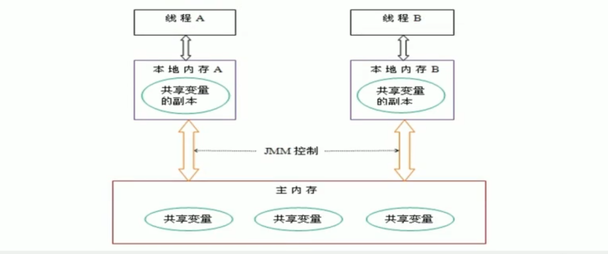

- 可见性

- 原子性
 eg：number++，底层是多条字节码指令，多线程情况下，是非线程安全的。volatile 无法保证原子性。加 synchronized 太重。使用 juc atomic 包下的 AtomicInteger 等。

- 有序性
 计算机在执行程序时，为了提高性能，编译器和处理器常常会对**指令做重排**，一般分为以下三种：
 

  - 单线程环境里面确保程序最终执行结果和代码顺序执行的结果一致。

  - 处理器在进行重排序时必须要考虑指令之间的**数据依赖性**

  - 多线程环境中线程交替执行，由于编译器优化重排的存在，两个线程中使用的变量能否保证一致性是无法确定的，结果无法预测

volatile 总结：
 volatile 实现**禁止指令重排优化**，从而避免多线程下程序出现乱序执行的现象
 先了解一个概念，内存屏障（Memory Barrier）又称内存栅栏，是一个 CPU 指令，它的作用有两个：
 一是保证特定操作的执行顺序
 二是保证某些特定变量的内存可见性（利用该特性可以实现 volatile 的内存可见性）。
 由于编译器和处理器都能执行指令重排优化。如果在指令间插入一条 Memory Barrier 则会告诉编译器和 CPU，不管什么指令都不能和这条 Memory Barrier 指令重排序，也就是说**通过插入内存屏障禁止在内存屏障前后的指令执行重新排序优化**。内存屏障另外一个作用是强制刷出各种 CPU 的缓存数据，因此任何 CPU 上的线程都能读取到这些数据的最新版本。
 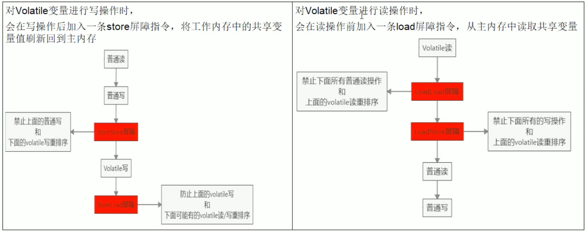

工作内存与主内存同步延迟现象导致的可见性问题
 可以使用 synchronized 或 volatile 关键字解决，它们都可以使一个线程**修改后的变量立即对其他线程可见**。
 对于指令重排导致的可见性问题和有序性问题
 可以利用 volatile 关键字解决，因为 volatile 的另外一个作用就是禁止重排序优化。

1. 你在哪些地方用到过 volatile？

- 单例模式 DCL 代码

```
public static SingletonDemo {
    // 创建对象不是原子操作，可能会指令重排，高并发情况下，读取到的 instance 不为 null 时，instance 的引用对象可能没有完成初始化
    private static volatile SingletonDemo instance = null;

    private SingletonDemo() {
    }

    // DCL(Double Check Lock 双端检锁机制)
    public static SingletonDemo getInstance() {
        if (instance == null) {
            synchronized (SingletonDemo.class) {
                if (instance == null) {
                    instance = new SingletonDemo();
                }
            }
        }
        return instance;
    }
}

```

- 单例模式 volatile 分析
 DCL(双端检锁)机制不一定线程安全，原因是有指令重排序的存在，假如 volatile 可以禁止指令重排
 原因在于某一个线程执行到第一次检查，读取到的 instance 不为 null 时，instance 的引用对象**可能没有完成初始化**。
 instance = new SingletonDemo(); 可以分为以下3步完成（伪代码）

```
memory = allocate();    // 1. 分配对象内存空间
instance(memory);       // 2. 初始化对象
instance = memory;      // 3. 设置 instance 指向刚分配的内存地址，此时 instance != null

```

步骤2和步骤3**不存在数据依赖关系**，而且无论重排前还是重排后程序的执行结果在单线程中并没有改变，因此这种重排优化是允许的。

```
memory = allocate();    // 1. 分配对象内存空间
instance = memory;      // 3. 设置 instance 指向刚分配的内存地址，此时 instance != null，但是对象还没有完成初始化！！！
instance(memory);       // 2. 初始化对象

```

但是指令重排只会保证串行语义的执行的一致性（单线程），但并不会关心多线程间的语义一致性。
 **所以当一条线程访问 instance 不为 null 时，由于 instance 实例并未必已初始化完成，也就造成了线程安全问题**。

##### 2. CAS 你知道吗？

1. 比较并交换

```
public static void main(String[] args) {
    AtomicInteger atomicInteger = new AtomicInteger(5);
    boolean csRes = atomicInteger.compareAndSet(5, 2019);
    System.out.println(csRes + "\tcurrent data: " + atomicInteger.get());

    System.out.println(atomicInteger.compareAndSet(5, 1024) + "\tcurrent data: " + atomicInteger.get());
}

```

1. CAS 底层原理？如果知道，谈谈你对 UnSafe 的理解

- atomicInteger.getAndIncrement();
 `atomicInteger.getAndIncrement()` 方法的源码：
 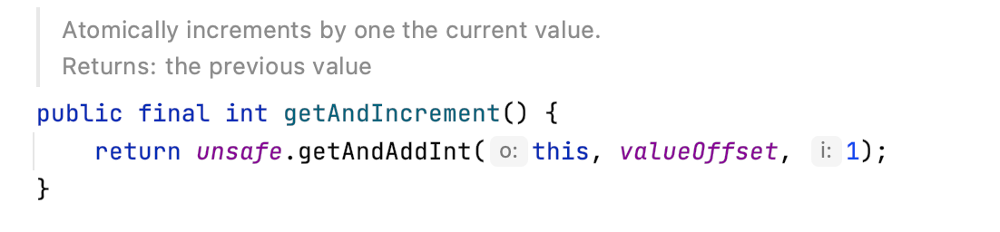

- UnSafe
 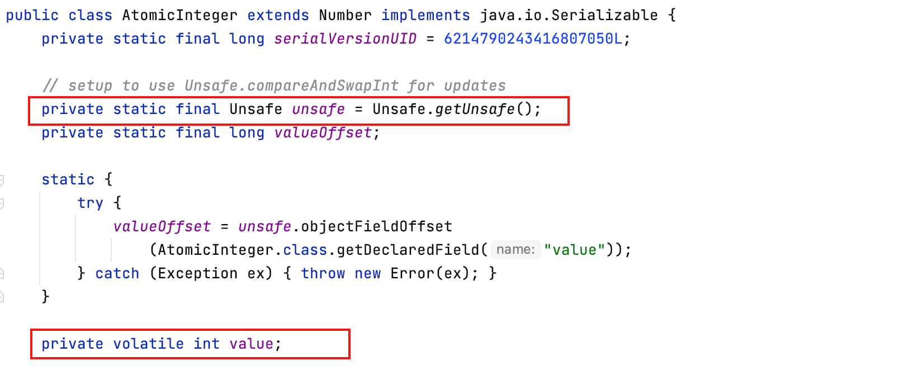
 **1、UnSafe**
 UnSafe 是 CAS 的核心类，由于 Java 方法无法直接访问底层系统，需要通过本地（native）方法来访问，UnSafe 相当于一个后门，基于该类可以直接操作特定内存的数据。**UnSafe 类存在于 sun.misc 包中**，其内部方法操作可以像 C 的指针一样直接操作内存，因为 Java 中 CAS 操作的执行依赖于 Unsafe 类的方法。
 ***注意：*** UnSafe 类中的所有方法都是 native 修饰的，也就是说 UnSafe 类中的方法都直接调用操作系统底层资源执行相应任务
 **2、ValueOffset**
 变量 valueOffset，表示该变量值在内存中的**偏移地址**，因为 UnSafe 就是根据内存便宜地址获取数据的
 **3、变量 value 用 volatile 修饰，保证了多线程之间的内存可见性**

- CAS 是什么
 CAS 的全称为 Compare-And-Swap，**它是一条 CPU 并发原语**。
 它的功能是判断内存某个位置的值是否为预期值，如果是则更改为新的值，这个过程是原子的。
 CAS 并发原语体现在 Java 语言中就是 sun.misc.Unsafe 类中的各个方法。调用 Unsafe 类中的 CAS 方法，JVM 会帮我们实现出 CAS 汇编指令。这是一种**完全依赖于硬件**的功能，通过它实现了原子操作。再次强调，由于 CAS 是一种系统原语，原语属于操作系统用语范畴，是由若干条指令组成的，用于完成某个功能的一个过程，**并且原语的执行必须是连续的，在执行过程中不允许被中断，也就是说 CAS 是一条 CPU 的原子指令，不会造成所谓的数据不一致问题（线程安全）**。
 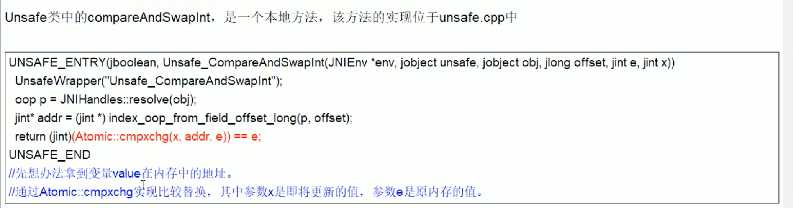
 **CAS 简单总结：**
 CAS 比较当前工作内存中的值与主内存中的值，如果相同则执行规定操作，否则继续比较直到主内存和工作内存中的值一致为止。
 CAS 应用：CAS 有三个操作数，内存值V，旧的预期值A，要修改的更新值B。当且仅当预期值A和内存值V相同时，将内存值V修改为B，否则什么都不做

1. CAS 缺点

- 循环时间长开销很大（有个 do while，如果一直不成功，会给 CPU 带来很大的开销）

- 只能保证一个共享变量的原子操作
 当对一个共享变量执行操作时，我们可以使用循环 CAS 的方式来保证原子操作，但是对于多个共享变量操作时，循环 CAS 就无法保证操作的原子性，这个时候就可以用锁来保证原子性。

- 引出来 ABA 问题

**Tips：** 读多的场景非常适合 CAS，CAS 不适合竞争激烈的长 time 业务，常见的比如 IO 业务。（Synchronized 拿不到锁会放弃 CPU 时间片）

##### 3. 原子类 AtomicInteger 的 ABA 问题谈谈？原子更新引用知道吗？

- ABA 问题怎么产生的
 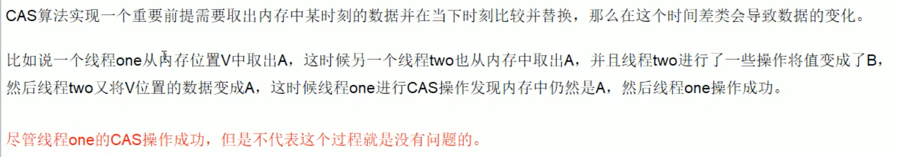

- 原子引用

```
public static void main(String[] args) {
    User z3 = new User("z3", 22);
    User li4 = new User("li4", 25);

    AtomicReference<User> atomicReference = new AtomicReference<>();
    atomicReference.set(z3);

    System.out.println(atomicReference.compareAndSet(z3, li4) + "\t" + atomicReference.get());
    System.out.println(atomicReference.compareAndSet(z3, li4) + "\t" + atomicReference.get());
}

```

- 时间戳原子引用

```
public class ABADemo {  // ABA 问题的解决    --> AtomicStampedReference

    static AtomicReference<Integer> atomicReference = new AtomicReference<>(100);
    static AtomicStampedReference<Integer> atomicStampedReference = new AtomicStampedReference<>(100, 1);

    public static void main(String[] args) {
        System.out.println("================= 以下是 ABA 问题的产生 =================");
        new Thread(() -> {
            atomicReference.compareAndSet(100, 101);
            atomicReference.compareAndSet(101, 100);
        }, "t1").start();

        new Thread(() -> {
            // 暂停一秒钟 t2 线程，保证上面的 t1 线程完成了一次 ABA 操作
            try {
                TimeUnit.SECONDS.sleep(1);
            } catch (InterruptedException e) {
                e.printStackTrace();
            }
            System.out.println(atomicReference.compareAndSet(100, 2021) + "\t" + atomicReference.get());
        }, "t2").start();

        try {
            TimeUnit.SECONDS.sleep(2);
        } catch (InterruptedException e) {
            e.printStackTrace();
        }
        System.out.println("================= 以下是 ABA 问题的解决 =================");
        new Thread(() -> {
            int stamp = atomicStampedReference.getStamp();
            System.out.println(Thread.currentThread().getName() + "\t第1次版本号：" + stamp);
            // 暂停一秒钟 t3 线程
            try {
                TimeUnit.SECONDS.sleep(1);
            } catch (InterruptedException e) {
                e.printStackTrace();
            }
            atomicStampedReference.compareAndSet(100, 101, atomicStampedReference.getStamp(), atomicStampedReference.getStamp() + 1);
            System.out.println(Thread.currentThread().getName() + "\t第2次版本号：" + atomicStampedReference.getStamp());
            atomicStampedReference.compareAndSet(101, 100, atomicStampedReference.getStamp(), atomicStampedReference.getStamp() + 1);
            System.out.println(Thread.currentThread().getName() + "\t第3次版本号：" + atomicStampedReference.getStamp());
        }, "t3").start();

        new Thread(() -> {
            int stamp = atomicStampedReference.getStamp();
            System.out.println(Thread.currentThread().getName() + "\t第2次版本号：" + stamp);
            // 暂停3秒钟 t4 线程
            try {
                TimeUnit.SECONDS.sleep(3);
            } catch (InterruptedException e) {
                e.printStackTrace();
            }
            boolean result = atomicStampedReference.compareAndSet(100, 2021, stamp, stamp + 1);
            System.out.println(Thread.currentThread().getName() + "\t修改成功否：" + result + "\t当前最新实际版本号：" + atomicStampedReference.getStamp());
            System.out.println(Thread.currentThread().getName() + "\t当前实际最新值：" + atomicStampedReference.getReference());
        }, "t4").start();
    }
}

```

##### 4. 我们知道 ArrayList 是线程不安全，请编码写一个不安全的案例并给出解决方案。

```
public class ContainerNotSafeDemo {
    public static void main(String[] args) {
        // Map<String, String> map = new HashMap<>();  // java.util.ConcurrentModificationException
        // Map<String, String> map = Collections.synchronizedMap(new HashMap<>());
        Map<String, String> map = new ConcurrentHashMap<>();
        for (int i = 1; i <= 30; i++) {
            new Thread(() -> {
                map.put(Thread.currentThread().getName(), UUID.randomUUID().toString().substring(0, 8));
                System.out.println(map);
            }, String.valueOf(i)).start();
        }
    }

    public static void setNotSafe() {
        // Set<String> set = new HashSet<>();
        // Set<String> set = Collections.synchronizedSet(new HashSet<>());
        Set<String> set = new CopyOnWriteArraySet<>();  // 底层是 private final CopyOnWriteArrayList<E> al;
        for (int i = 1; i <= 30; i++) {
            new Thread(() -> {
                set.add(UUID.randomUUID().toString().substring(0, 8));
                System.out.println(set);
            }, String.valueOf(i)).start();
        }
        new HashSet<>().add("1");
        // 底层：HashMap，add -> put(e, object);
        // HashSet不采用null是因为在remove的时候，成功返回移除的value，失败返回null，如果开始就设置为null，无法区分
    }

    public static void listNotSafe() {
        //        List<String> list = Arrays.asList("a", "b", "c");
//        List<String> list = new ArrayList<>();
        // List<String> list = new Vector<>(); // 底层 add 方法 public synchronized boolean add(E e)
//        List<String> list = Collections.synchronizedList(new ArrayList<>());
        List<String> list = new CopyOnWriteArrayList<>();

        for (int i = 1; i <= 30; i++) {
            new Thread(() -> {
                list.add(UUID.randomUUID().toString().substring(0, 8));
                System.out.println(list);
            }, String.valueOf(i)).start();
        }
        // java.util.ConcurrentModificationException 并发修改异常

        /**
         * 1、故障现象：
         *  java.util.ConcurrentModificationException
         * 2、导致原因
         *  并发争抢修改导致，参考花名册签名案例，一个人正在写入，另一个人过来抢夺，导致数据不一致情况，并发修改异常。
         * 3、解决方案
         *  3.1 new Vector<>()
         *  3.2 Collections.synchronizedList(new ArrayList<>());
         *  3.3 new CopyOnWriteArrayList<>();
         *  3.4
         * 4、优化建议（同样的错误不犯第二次）
         */

        /*
        写时复制（CopyOnWrite）
        private transient volatile Object[] array;

        public boolean add(E e) {
            final ReentrantLock lock = this.lock;
            lock.lock();
            try {
                Object[] elements = getArray();
                int len = elements.length;
                Object[] newElements = Arrays.copyOf(elements, len + 1);
                newElements[len] = e;
                setArray(newElements);
                return true;
            } finally {
                lock.unlock();
            }
        }
         */
    }
}

```

写时复制：
 CopyOnWrite 容器即写时复制的容器。往一个容器添加元素的时候，不直接往当前容器 Object[] 添加，而是先将当前容器 Ojbect[] 进行 copy，复制出一个新的容器 Object[] new Elements，然后新的容器 Object[] newElements 里添加元素，添加完元素后，再将原容器的引用指向新的容器 setArray(newElements); 这样做的好处是可以对 CopyOnWrite 容器进行并发的读，而不需要加锁，因为当前容器不会添加任何元素。所以 CopyOnWrite 容器也是一种读写分离的思想，读和写不同的容器

##### 5. 公平锁/非公平锁/可重入锁/递归锁/自旋锁谈谈你的理解？请手写一个自旋锁

###### 公平和非公平锁

**公平锁：** 是指多个线程按照申请锁的顺序来获取锁，类似排队打饭，先来后到
 **非公平锁：** 是指多个线程获取锁的顺序并不是按照申请锁的顺序，有可能后申请的线程比先申请的线程优先获取锁。在高并发的情况下，有可能会造成优先级反转或者饥饿现象
 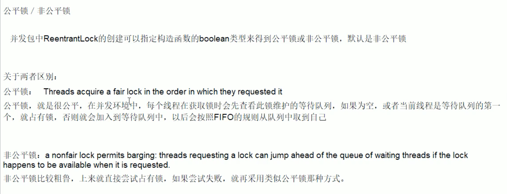

**Java ReentrantLock 而言**，通过构造函数指定该锁是否是公平锁，**默认是非公平锁**。非公平锁的优点在于吞吐量比公平锁大。
 对于 **Synchronized** 而言，也是一种非公平锁

###### 可重入锁（又名递归锁）

- 是什么？
 可重入锁（也叫递归锁）
 指的是同一线程外层函数获得锁之后，内层递归函数仍然能够获取该锁的代码，在同一个线程在外层方法获取锁的时候，进入内层方法会自动获取锁。
 也就是说：**线程可以进入任何一个它已经拥有的锁所同步着的代码块**。

- ReetrantLock/Synchronized 就是一个典型的可重入锁

- 可重入锁最大的作用是避免死锁

###### 自旋锁

自旋锁（Spinlock）
 是指尝试获取锁的线程不会立即阻塞，而是**采用循环的方式去尝试获取锁**，这样的好处是减少线程上下文切换的消耗，缺点是循环会消耗 CPU

```
/**
 * 通过 CAS 操作完成自旋锁，A 线程先进来调用 mylock 方法自己持有锁 5 秒钟，B 随后进来发现当前线程持有锁，不是 null，所以只能通过自旋等待，直到 A 释放锁后 B 随后抢到
 * @Author serva
 * @Date 2021/4/15 3:09 下午
 * @Version 1.0
 */
public class SpinLockDemo {
    // 原子引用线程
    AtomicReference<Thread> atomicReference = new AtomicReference<>();

    public void myLock() {
        Thread thread = Thread.currentThread();
        System.out.println(Thread.currentThread().getName() + "\tcome in ~");
        while (!atomicReference.compareAndSet(null, thread)) {
        }
    }

    public void myUnlock() {
        Thread thread = Thread.currentThread();
        atomicReference.compareAndSet(thread, null);
        System.out.println(Thread.currentThread().getName() + "\tinvoke myUnlock() ~");
    }

    public static void main(String[] args) {
        SpinLockDemo spinLockDemo = new SpinLockDemo();

        new Thread(() -> {
            spinLockDemo.myLock();
            try { TimeUnit.SECONDS.sleep(5); } catch (InterruptedException e) { e.printStackTrace(); }
            spinLockDemo.myUnlock();
        }, "AA").start();

        try { TimeUnit.SECONDS.sleep(1); } catch (InterruptedException e) { e.printStackTrace(); }

        new Thread(() -> {
            spinLockDemo.myLock();
            try { TimeUnit.SECONDS.sleep(1); } catch (InterruptedException e) { e.printStackTrace(); }
            spinLockDemo.myUnlock();
        }, "BB").start();
    }
}

```

###### 独占锁（写锁）/共享锁（读锁）/互斥锁

独占锁：指该锁一次只能被一个线程所持有，对 ReentrantLock 和 Synchronized 而言都是独占锁

共享锁：指该锁可以被多个线程所持有。
 对 ReentrantReadWriteLock 其读锁是共享锁，其写锁是独占锁。
 读锁的共享可保证并发读是非常高效的，读写、写读、写写的过程是互斥的

```
/**
 * 多个线程同时读一个资源类没有任何问题，所以为了满足并发量，读取共享资源应该可以同时进行
 *  但是，如果又一个线程想去写共享资源，就不应该再有其他线程可以对该资源进行读/写
 *      读-读 能共存
 *      读-写 不能共存
 *      写-写 不能共存
 *  写操作：原子+独占 整个过程必须是一个完整的统一体，中间不许被分割打断
 * @Author serva
 * @Date 2021/4/15 5:42 下午
 * @Version 1.0
 */
public class ReadAndWriteLockDemo {
    public static void main(String[] args) {
        MyCache myCache = new MyCache();

        for (int i = 1; i <= 5; i++) {
            final int tempInt = i;
            new Thread(() -> {
                myCache.put(tempInt + "", tempInt + "");
            }, String.valueOf(i)).start();
        }

        for (int i = 1; i <= 5; i++) {
            final int tempInt = i;
            new Thread(() -> {
                myCache.get(tempInt + "");
            }, String.valueOf(i)).start();
        }
    }
}

class MyCache { // 资源类
    private volatile Map<String, Object> map = new HashMap<>();
    // private Lock lock = new ReentrantLock();
    private ReentrantReadWriteLock rwLock = new ReentrantReadWriteLock();

    public void put(String key, Object value) {
        rwLock.writeLock().lock();
        try {
            System.out.println(Thread.currentThread().getName() + "\t正在写入: " + key);
            try { TimeUnit.MILLISECONDS.sleep(300); } catch (InterruptedException e) { e.printStackTrace(); }
            map.put(key, value);
            System.out.println(Thread.currentThread().getName() + "\t写入完成");
        } finally {
            rwLock.writeLock().unlock();
        }
    }

    public void get(String key) {
        rwLock.readLock().lock();
        try {
            System.out.println(Thread.currentThread().getName() + "\t正在读取: " + key);
            try { TimeUnit.MILLISECONDS.sleep(300); } catch (InterruptedException e) { e.printStackTrace(); }
            Object result = map.get(key);
            System.out.println(Thread.currentThread().getName() + "\t读取完成: " + result);
        } finally {
            rwLock.readLock().unlock();;
        }
    }
}

```

##### 6. CountDownLatch/CycliBarrier/Semaphore 使用过吗？

- CountDownLatch
 让一些线程阻塞直到另一些线程完成一系列操作后才被唤醒
 CountDownLatch 主要有两种方法，当一个或多个线程调用 await 方法时，调用线程会被阻塞。其他线程调用 countDown 方法会将计数器减1（调用 countDown 方法的线程不会阻塞），当计数器的值变为零时，因调用 await 方法被阻塞的线程会被唤醒，继续执行。

- CyclicBarrier
 CyclicBarrier 的字母意思是可循环（Cyclic）使用的屏障（Barrier）。它要做的事是，让一组线程到达一个屏障（也可以叫同步点）时被阻塞，直到最后一个线程到达屏障时，屏障才会开门，所有被屏障拦截的线程才会继续干活，线程进入屏障通过 CyclicBarrier 的 await() 方法

```
public class CyclicBarrierDemo {
    public static void main(String[] args) {
        CyclicBarrier cyclicBarrier = new CyclicBarrier(7, () -> System.out.println("-=-=-=-=- 召唤神龙"));

        for (int i = 1; i <= 7; i++) {
            final int tmpInt = i;
            new Thread(() -> {
                System.out.println(Thread.currentThread().getName() + "\t收集到第：" +  tmpInt + "颗龙珠");
                try {
                    cyclicBarrier.await();
                } catch (InterruptedException e) {
                    e.printStackTrace();
                } catch (BrokenBarrierException e) {
                    e.printStackTrace();
                }
            }, String.valueOf(i)).start();
        }
    }
}

```

- Semaphore
 信号量主要用于两个目的，一个是用于多个共享资源的互斥使用，另一个用于并发线程数的控制。
 **eg：** 争车位

```
public class SemaphoreDemo {
    public static void main(String[] args) {
        Semaphore semaphore = new Semaphore(3); // 模拟3个停车位

        for (int i = 1; i <= 6; i++) {  // 模拟 6 部汽车
            new Thread(() -> {
                try {
                    semaphore.acquire();
                    System.out.println(Thread.currentThread().getName() + "\t抢到车位");
                    TimeUnit.SECONDS.sleep(3);
                    System.out.println(Thread.currentThread().getName() + "\t停车3s后离开车位");
                } catch (InterruptedException e) {
                    e.printStackTrace();
                } finally {
                    semaphore.release();
                }
            }, String.valueOf(i)).start();
        }
    }
}

```

##### 7. 阻塞队列知道吗？

###### 队列+阻塞队列

阻塞队列，顾名思义，首先它是一个队列，而一个阻塞队列在数据结构中所起的作用大致如下图所示：
 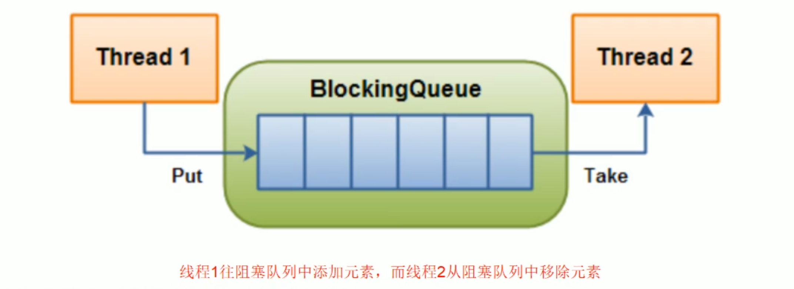
 当阻塞队列是空时，从队列中**获取**元素的操作将会被阻塞
 当阻塞队列是满时，往队列里**添加**元素的操作将会被阻塞

试图从空的阻塞队列中获取元素的线程将会被阻塞，直到其他的线程往空的队列插入新的元素。
 同样，试图往已满的阻塞队列中添加新元素的线程同样也会被阻塞，直到其他的线程从列中移除一个或者多个元素或者完全清空队列后使队列重新变得空闲起来后并后续新增

###### 为什么用？有什么好处？

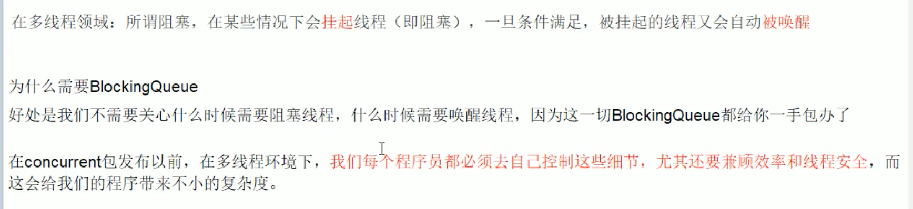

###### BlockingQueue 的核心方法

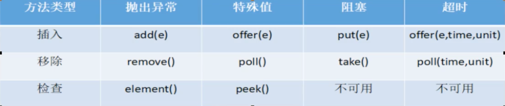
 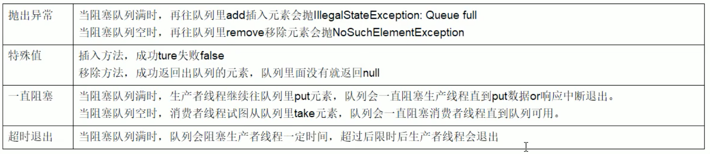

###### 架构梳理+种类分析

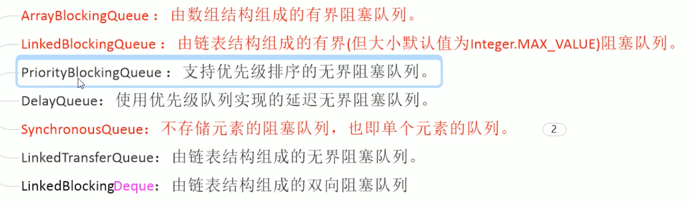
 **SynchronousQueue：**
 SynchronousQueue 没有容量
 与其他 BlockingQueue 不同，SynchronousQueue 是一个不存储元素的 BlockingQueue。
 每一个 put 操作必须要等待一个 take 操作，否则不能继续添加元素，反之亦然。

```
public class SynchronousQueueDemo {
    public static void main(String[] args) {
        BlockingQueue<String> blockingQueue = new SynchronousQueue<>();

        new Thread(() -> {
            try {
                System.out.println(Thread.currentThread().getName() + "\t put 1");
                blockingQueue.put("1");
                System.out.println(Thread.currentThread().getName() + "\t put 2");
                blockingQueue.put("2");
                System.out.println(Thread.currentThread().getName() + "\t put 3");
                blockingQueue.put("3");
            } catch (InterruptedException e) {
                e.printStackTrace();
            }
        }, "AAA").start();

        new Thread(() -> {
            try {
                TimeUnit.SECONDS.sleep(5);
                System.out.println(Thread.currentThread().getName() + "\t" + blockingQueue.take());
                TimeUnit.SECONDS.sleep(5);
                System.out.println(Thread.currentThread().getName() + "\t" + blockingQueue.take());
                TimeUnit.SECONDS.sleep(5);
                System.out.println(Thread.currentThread().getName() + "\t" + blockingQueue.take());
            } catch (InterruptedException e) {
                e.printStackTrace();
            }
        }, "BBB").start();
    }
}

```

###### 用在哪里

- 生产者消费者模式
 传统版

```
/**
 * 题目：一个初始值为0的变量，两个线程对其交替操作，一个加1，一个减1，来5轮
 *  1、线程 操作(方法) 资源类
 *  2、判断 干活 通知
 *  3、防止虚假唤醒机制
 */
public class ProdComsumer_TraditionDemo {
    public static void main(String[] args) {
        ShareData shareData = new ShareData();

        new Thread(() -> {
            for (int i = 1; i <= 5; i++) {
                shareData.increment();
            }
        }, "AA").start();
        new Thread(() -> {
            for (int i = 1; i <= 5; i++) {
                shareData.decrement();
            }
        }, "BB").start();
    }
}

class ShareData {   // 资源类
    private int number = 0;
    private Lock lock = new ReentrantLock();
    private Condition condition = lock.newCondition();

    public void increment() {
        try {
            lock.lock();
            // 1、判断
            while (number != 0) {   // 不能使用 if 防止产生虚假唤醒
                // 等待，不能生产
                condition.await();
            }
            // 2、干活
            number++;
            System.out.println(Thread.currentThread().getName() + "\t" + number);
            // 3、通知唤醒
            condition.signalAll();
        } catch (Exception e) {
            e.printStackTrace();
        } finally {
            lock.unlock();
        }
    }
    public void decrement() {
        try {
            lock.lock();
            // 1、判断
            while (number == 0) {
                // 等待，不能生产
                condition.await();
            }
            // 2、干活
            number--;
            System.out.println(Thread.currentThread().getName() + "\t" + number);
            // 3、通知唤醒
            condition.signalAll();
        } catch (Exception e) {
            e.printStackTrace();
        } finally {
            lock.unlock();
        }
    }
}

```

阻塞队列版

```
/**
 * volatile/CAS/atomicInteger/BlockQueue/线程狡猾/原子引用
 */
public class ProdConsumer_BlockQueueDemo {
    public static void main(String[] args) throws InterruptedException {
        MyResource myResource = new MyResource(new ArrayBlockingQueue<>(10));

        new Thread(() -> {
            System.out.println(Thread.currentThread().getName() + "\t生产线程启动");
            try {
                myResource.myProd();
            } catch (InterruptedException e) {
                e.printStackTrace();
            }
        }, "prod").start();

        new Thread(() -> {
            System.out.println(Thread.currentThread().getName() + "\t消费线程启动");
            try {
                myResource.myConsumer();
            } catch (InterruptedException e) {
                e.printStackTrace();
            }
        }, "consumer").start();

        TimeUnit.SECONDS.sleep(5);
        System.out.println("5s 到，main 线程叫停，活动结束");
        myResource.stop();
    }
}
class MyResource {
    private volatile boolean FLAG = true;    // 默认开启，进行生产+消费
    private AtomicInteger atomicInteger = new AtomicInteger();

    BlockingQueue<String> blockingQueue = null;
    public MyResource(BlockingQueue<String> blockingQueue) {
        this.blockingQueue = blockingQueue;
        System.out.println(blockingQueue.getClass().getName());
    }

    public void myProd() throws InterruptedException {
        String data = null;
        boolean retValue;
        while (FLAG) {
            data = atomicInteger.incrementAndGet() + "";
            retValue = blockingQueue.offer(data, 2l, TimeUnit.SECONDS);
            if (retValue) {
                System.out.println(Thread.currentThread().getName() + "\t插入队列: " + data + " 成功");
            } else {
                System.out.println(Thread.currentThread().getName() + "\t插入队列: " + data + " 失败");
            }
            TimeUnit.SECONDS.sleep(1);
        }
        System.out.println(Thread.currentThread().getName() + "\tFLAG=FALSE，生产动作结束");
    }

    public void myConsumer() throws InterruptedException {
        String result = null;
        while (FLAG) {
            result = blockingQueue.poll(2l, TimeUnit.SECONDS);
            if (null == result || result.equalsIgnoreCase("")) {
                FLAG = false;
                System.out.println(Thread.currentThread().getName() + "\t 超过 2s 没有取到蛋糕，消费退出");
                return;
            }
            System.out.println(Thread.currentThread().getName() + "\t消费队列：" + result + " 成功");
        }
    }

    public void stop() {
        this.FLAG = false;
    }
}

```

- 线程池

- 消息中间件

##### 8. 线程池用过吗？ThreadPoolExecutor 谈谈你的理解？

1.
为什么用线程池，优势
 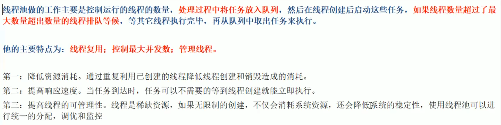

1.
线程池如何使用？

  1.
架构说明：
 Java 中的线程池是通过 Executor 框架实现的，该框架中用到了 Executor，Executors，ExecutorService，ThreadPoolExecutor 这几个类。

  1.
编码实现

  - `Executors.newFixedThreadPool(5);` 执行长期的任务，性能好很多
 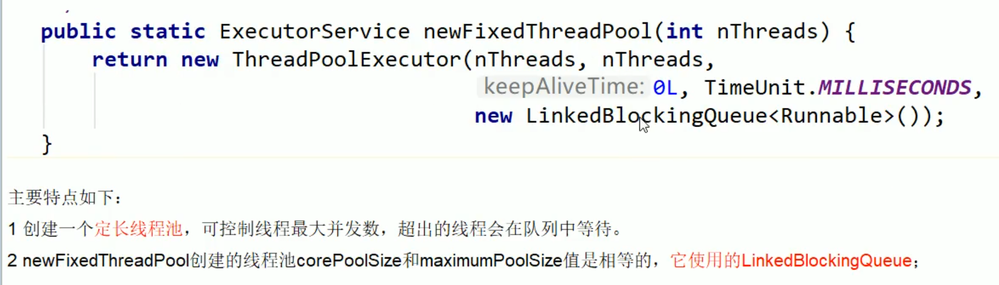

  - `Executors.newSingleThreadExecutor();` 一个任务一个任务执行的场景

  - 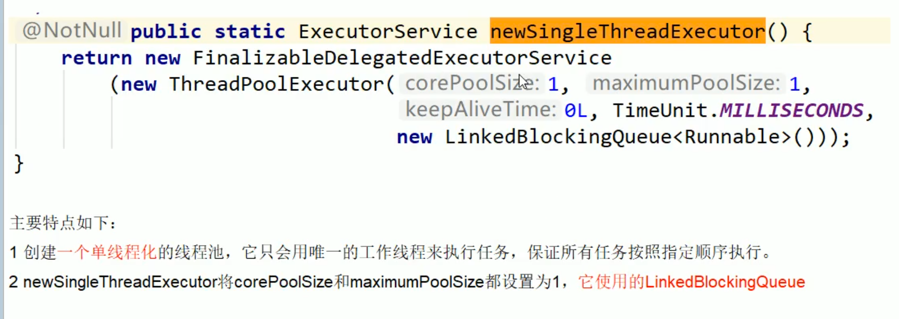

  - `Executors.newCachedThreadPool();` 使用：执行很多短期异步的小程序或者负载较轻的服务器
 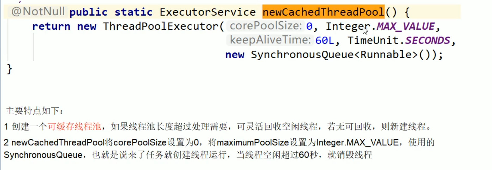

  1. ThreadPoolExecutor
 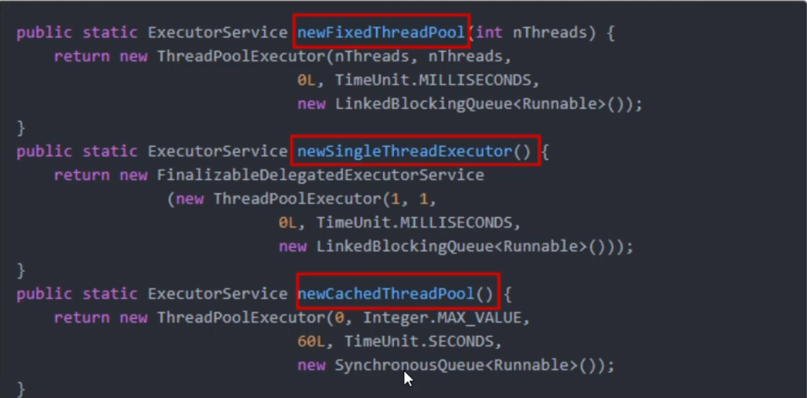

1.
线程池的几个重要参数介绍
 七大参数：
 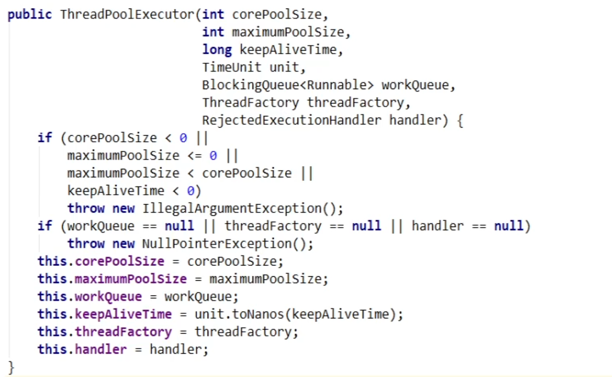

  1. corePoolSize：线程池中的常驻核心线程数

    1. 创建了线程池后，当有请求任务来之后，就会安排池中的线程去执行请求任务，近似理解为今日当值线程

    1. 当线程池中的线程数目达到 corePoolSize 后，就会把到达的任务放到缓存队列当中

  1. maximumPoolSize：线程池能够容纳同时执行的最大线程数，此值必须大于等于1

  1. keepAliveTime：多余的空闲线程的存活时间
 当前线程池数量超过 corePoolSize 时，当空闲时间达到 keepAliveTime 值时，多余空闲线程会被销毁直到只剩下 corePoolSize 个线程为止。

  1. unit：keepAliveTime 的单位

  1. workQueue：任务队列，被提交但尚未被执行的任务

  1. threadFactory：表示生成线程池中工作线程的线程工厂，用于创建线程**一般用默认的即可**。

  1. handler：拒绝策略，表示当队列满了并且工作线程大于等于线程池的最大线程数（maximumPoolSize）时如何拒绝

1.
说说线程池的底层工作原理
 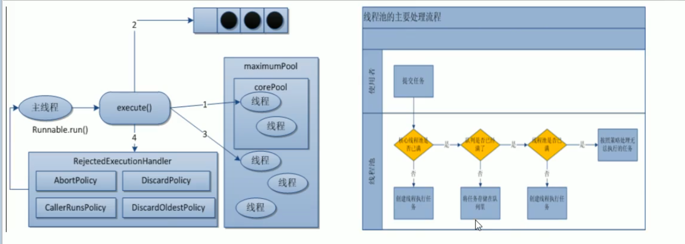
 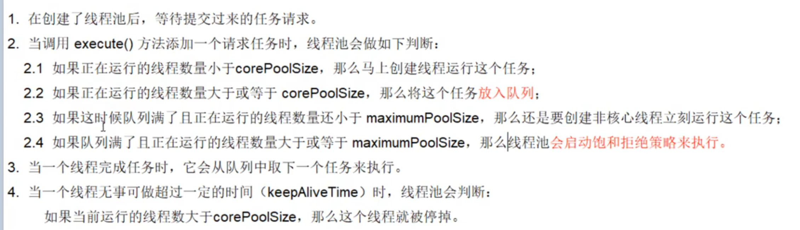

##### 9. 线程池用过吗？生产上你如何设置合理参数

###### 线程池的拒绝策略你谈谈

- 是什么？
 **等待队列已经排满了**，再也塞不下新任务了，同时，**线程池中的 max 线程也达到了**，无法继续为新任务服务。这时候，我们就需要拒绝策略机制合理的处理这个问题。

- JDK 内置的拒绝策略
 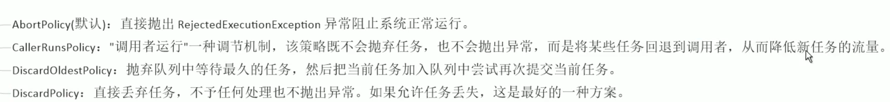

- 以上内置的拒绝策略均实现了 RejectedExecutionHandler 接口

###### 在工作中单一的/固定数的/可变的三种创建线程池的方法，你用哪个多？超级大坑？

答案是**一个都不用**，我们生产上只能使用自定义的
 Executors 中 JDK 已经给你提供了，为什么不用？
 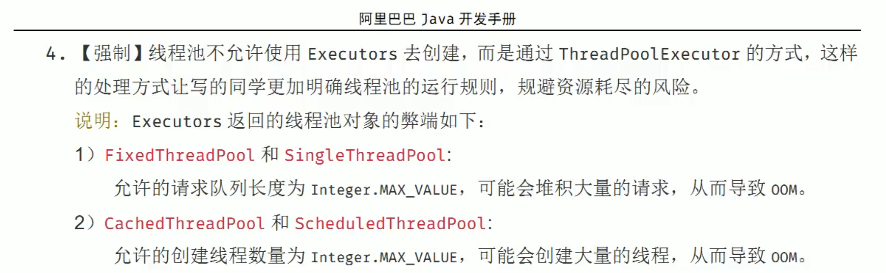

###### 你在工作中时如何使用线程池的，是否自定义过线程池使用

```
/**
 * 第四种获得/使用 Java 多线程的方式，线程池
 */
public class MyThreadPoolDemo {
    public static void main(String[] args) {
        ExecutorService threadPool = new ThreadPoolExecutor(2, 5, 1l,
                TimeUnit.SECONDS, new LinkedBlockingDeque<>(3),
                Executors.defaultThreadFactory(),
//                new ThreadPoolExecutor.AbortPolicy());
//                new ThreadPoolExecutor.CallerRunsPolicy()); // 满了后会退给调用中（main）
//                new ThreadPoolExecutor.DiscardOldestPolicy());
                new ThreadPoolExecutor.DiscardPolicy());

        try {
            // 模拟 10 个用户来办理业务，每个用户就是一个来自外部的请求线程
            for (int i = 0; i < 30; i++) {   // 最大线程数 max + 阻塞队列数
                threadPool.execute(() -> {
                    System.out.println(Thread.currentThread().getName() + "\t办理业务");
                });
                // TimeUnit.MILLISECONDS.sleep(200);
            }
        } finally {
            threadPool.shutdown();
        }
    }

    public static void threadPoolInit() {
        // 一池5个处理线程
        // ExecutorService threadPool = Executors.newFixedThreadPool(5);
        // 一池1个处理线程
        // ExecutorService threadPool = Executors.newSingleThreadExecutor();
        // 一池N个处理线程
        ExecutorService threadPool = Executors.newCachedThreadPool();

        try {
            // 模拟 10 个用户来办理业务，每个用户就是一个来自外部的请求线程
            for (int i = 0; i < 10; i++) {
                threadPool.execute(() -> {
                    System.out.println(Thread.currentThread().getName() + "\t办理业务");
                });
                // TimeUnit.MILLISECONDS.sleep(200);
            }
        } finally {
            threadPool.shutdown();
        }
    }
}

```

###### 合理配置线程池你是如何考虑的

-
CPU 密集型
 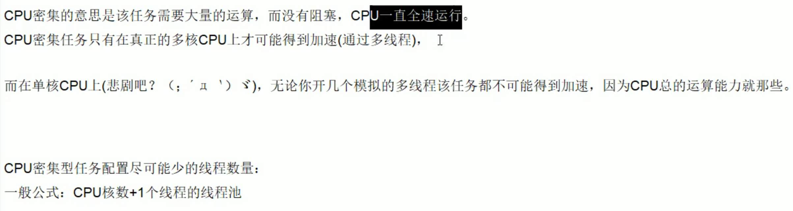

-
IO 密集型

  1. 由于 IO 密集型任务线程并不是一直在执行任务，则应配置尽可能多的线程，如 CPU 核数 * 2

  1. 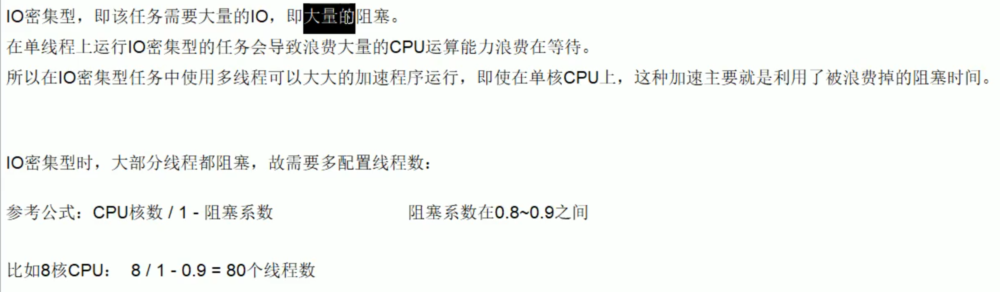

##### 10. 死锁编码及定位分析

###### 是什么

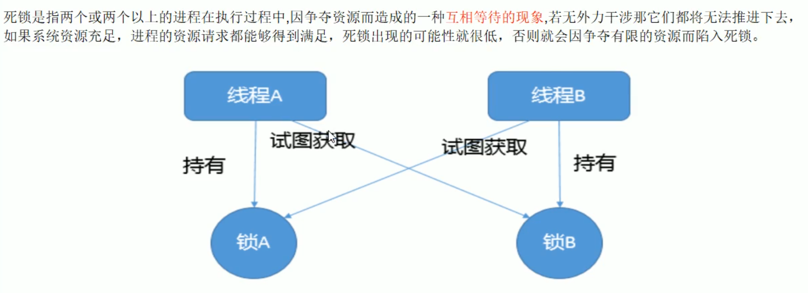
 **产生死锁的主要原因**

- 系统资源不足

- 进程运行推进的顺序不合适

- 资源分配不当

###### 代码

```
/**
 * jps -l 找到 id，然后 jstack id
 */
public class DeadLockDemo {
    public static void main(String[] args) {
        String lockA = "lockA";
        String lockB = "lockB";

        new Thread(new HoldLockThread(lockA, lockB), "ThreadA").start();
        new Thread(new HoldLockThread(lockB, lockA), "ThreadB").start();
    }
}

class HoldLockThread implements Runnable {
    private String lockA;
    private String lockB;
    public HoldLockThread(String lockA, String lockB) {
        this.lockA = lockA;
        this.lockB = lockB;
    }

    @Override
    public void run() {
        synchronized (lockA) {
            System.out.println(Thread.currentThread().getName() + "\t自己持有：" + lockA + "\t尝试获取：" + lockB);

            try {TimeUnit.SECONDS.sleep(2);} catch (InterruptedException e) { e.printStackTrace();}

            synchronized (lockB) {
                System.out.println(Thread.currentThread().getName() + "\t自己持有：" + lockB + "\t尝试获取：" + lockA);
            }
        }
    }
}

```

###### 解决

**jps** 命令定位进程号
 **jstack** 找到死锁查看
 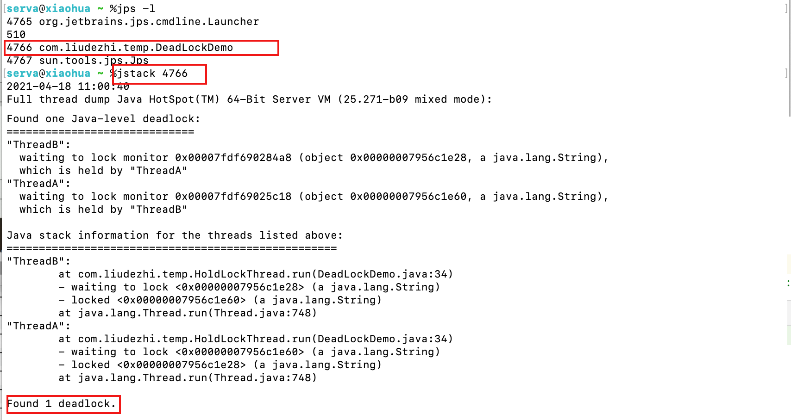

##### 11. Java 里面锁请谈谈你的理解，能说多少说多少

##### Synchornized 和 lock 有什么区别？用新的 lock 有什么好处？举例说明

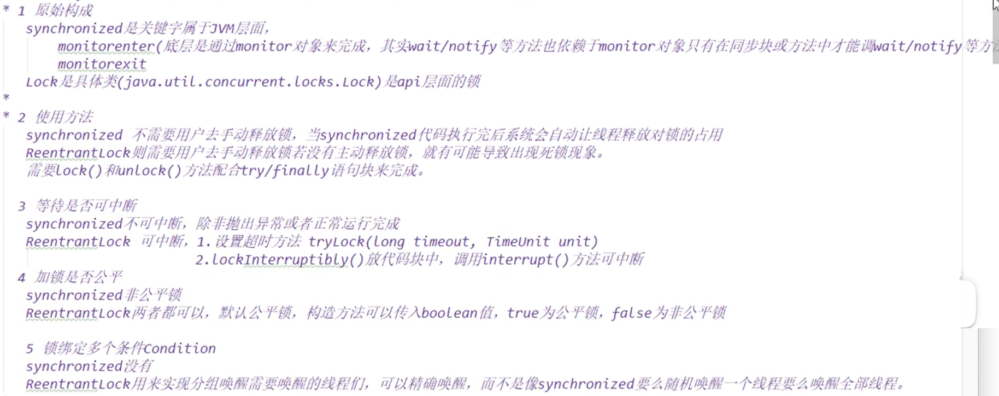

```
/**
 * 题目：多线程之间按顺序调用，实现 A -> B -> C 三个线程启动，要求如下：
 *  AA 打印 5次，BB 打印 10次，CC 打印 15次
 *  紧接着
 *  AA 打印 5次，BB 打印 10次，CC 打印 15次
 *  ...
 *  来10轮
 */
public class SyncAndReentrantLockDemo {
    public static void main(String[] args) {
        ShareResource shareResource = new ShareResource();

        new Thread(() -> {
            for (int i = 0; i < 10; i++) {
                shareResource.print5();
            }
        }, "A").start();
        new Thread(() -> {
            for (int i = 0; i < 10; i++) {
                shareResource.print10();
            }
        }, "B").start();
        new Thread(() -> {
            for (int i = 0; i < 10; i++) {
                shareResource.print15();
            }
        }, "C").start();
    }
}
class ShareResource {
    private int number = 1; // A:1 B:2 C:3
    private Lock lock = new ReentrantLock();
    private Condition c1 = lock.newCondition();
    private Condition c2 = lock.newCondition();
    private Condition c3 = lock.newCondition();

    public void print5() {
        lock.lock();
        try {
            // 1. 判断
            while (number != 1) {
                c1.await();
            }
            // 2. 干活
            for (int i = 0; i < 5; i++) {
                System.out.println(Thread.currentThread().getName() + "\t" + i);
            }
            // 3. 通知
            number = 2;
            c2.signal();
        } catch (InterruptedException e) {
            e.printStackTrace();
        } finally {
            lock.unlock();
        }
    }
    public void print10() {
        lock.lock();
        try {
            // 1. 判断
            while (number != 2) {
                c2.await();
            }
            // 2. 干活
            for (int i = 0; i < 10; i++) {
                System.out.println(Thread.currentThread().getName() + "\t" + i);
            }
            // 3. 通知
            number = 3;
            c3.signal();
        } catch (InterruptedException e) {
            e.printStackTrace();
        } finally {
            lock.unlock();
        }
    }
    public void print15() {
        lock.lock();
        try {
            // 1. 判断
            while (number != 3) {
                c3.await();
            }
            // 2. 干活
            for (int i = 0; i < 5; i++) {
                System.out.println(Thread.currentThread().getName() + "\t" + i);
            }
            // 3. 通知
            number = 1;
            c1.signal();
        } catch (InterruptedException e) {
            e.printStackTrace();
        } finally {
            lock.unlock();
        }
    }
}

```

%23%23%23%23%23%201.%20%E8%AF%B7%E4%BD%A0%E8%B0%88%E8%B0%88%E4%BD%A0%E5%AF%B9%20volatile%20%E7%9A%84%E7%90%86%E8%A7%A3%0A1.%20volatile%20%E6%98%AF%20Java%20%E8%99%9A%E6%8B%9F%E6%9C%BA%E6%8F%90%E4%BE%9B%E7%9A%84**%E8%BD%BB%E9%87%8F%E7%BA%A7%E7%9A%84%E5%90%8C%E6%AD%A5%E6%9C%BA%E5%88%B6**%0A-%20%E4%BF%9D%E8%AF%81%E5%8F%AF%E8%A7%81%E6%80%A7%0A-%20%E4%B8%8D%E4%BF%9D%E8%AF%81%E5%8E%9F%E5%AD%90%E6%80%A7%0A-%20%E7%A6%81%E6%AD%A2%E6%8C%87%E4%BB%A4%E9%87%8D%E6%8E%92%0A%0A2.%20JMM%EF%BC%88Java%20%E5%86%85%E5%AD%98%E6%A8%A1%E5%9E%8B%EF%BC%89%20%E4%BD%A0%E8%B0%88%E8%B0%88%EF%BC%88%E7%BA%BF%E7%A8%8B%E5%AE%89%E5%85%A8%E6%80%A7%E8%8E%B7%E5%BE%97%E4%BF%9D%E8%AF%81%EF%BC%89%E3%80%82%0AJMM%EF%BC%88Java%20Memory%20Model%EF%BC%89%E6%9C%AC%E8%BA%AB%E6%98%AF%E4%B8%80%E7%A7%8D%E6%8A%BD%E8%B1%A1%E7%9A%84%E6%A6%82%E5%BF%B5**%E5%B9%B6%E4%B8%8D%E7%9C%9F%E5%AE%9E%E5%AD%98%E5%9C%A8**%EF%BC%8C%E5%AE%83%E6%8F%8F%E8%BF%B0%E7%9A%84%E6%98%AF%E4%B8%80%E7%BB%84%E8%A7%84%E5%88%99%E6%88%96%E8%A7%84%E8%8C%83%EF%BC%8C%E9%80%9A%E8%BF%87%E8%BF%99%E7%BB%84%E8%A7%84%E8%8C%83%E5%AE%9A%E4%B9%89%E4%BA%86%E7%A8%8B%E5%BA%8F%E4%B8%AD%E5%90%84%E4%B8%AA%E5%8F%98%E9%87%8F%EF%BC%88%E5%8C%85%E6%8B%AC%E5%AE%9E%E4%BE%8B%E5%AD%97%E6%AE%B5%EF%BC%8C%E9%9D%99%E6%80%81%E5%AD%97%E6%AE%B5%E5%92%8C%E6%9E%84%E6%88%90%E6%95%B0%E7%BB%84%E5%AF%B9%E8%B1%A1%E7%9A%84%E5%85%83%E7%B4%A0%EF%BC%89%E7%9A%84%E8%AE%BF%E9%97%AE%E6%96%B9%E5%BC%8F%E3%80%82%0AJMM%20%E5%85%B3%E4%BA%8E%E5%90%8C%E6%AD%A5%E7%9A%84%E8%A7%84%E5%AE%9A%EF%BC%9A%0A%20%20%20%20-%20%E7%BA%BF%E7%A8%8B%E8%A7%A3%E9%94%81%E5%89%8D%EF%BC%8C%E5%BF%85%E9%A1%BB%E6%8A%8A%E5%85%B1%E4%BA%AB%E5%8F%98%E9%87%8F%E7%9A%84%E5%80%BC%E5%88%B7%E6%96%B0%E5%9B%9E%E4%B8%BB%E5%86%85%E5%AD%98%0A%20%20%20%20-%20%E7%BA%BF%E7%A8%8B%E5%8A%A0%E9%94%81%E5%89%8D%EF%BC%8C%E5%BF%85%E9%A1%BB%E8%AF%BB%E5%8F%96%E4%B8%BB%E5%86%85%E5%AD%98%E7%9A%84%E6%9C%80%E6%96%B0%E5%80%BC%E5%88%B0%E8%87%AA%E5%B7%B1%E7%9A%84%E5%B7%A5%E4%BD%9C%E5%86%85%E5%AD%98%0A%20%20%20%20-%20%E5%8A%A0%E9%94%81%E8%A7%A3%E9%94%81%E6%98%AF%E5%90%8C%E4%B8%80%E6%8A%8A%E9%94%81%0A%0A%20%20%20%20%E7%94%B1%E4%BA%8E%20JVM%20%E8%BF%90%E8%A1%8C%E7%A8%8B%E5%BA%8F%E7%9A%84%E5%AE%9E%E4%BD%93%E6%98%AF%E7%BA%BF%E7%A8%8B%EF%BC%8C%E8%80%8C%E6%AF%8F%E4%B8%AA%E7%BA%BF%E7%A8%8B%E5%88%9B%E5%BB%BA%E6%97%B6%20JVM%20%E9%83%BD%E4%BC%9A%E4%B8%BA%E5%85%B6%E5%88%9B%E5%BB%BA%E4%B8%80%E4%B8%AA%E5%B7%A5%E4%BD%9C%E5%86%85%E5%AD%98%EF%BC%88%E6%9C%89%E4%BA%9B%E5%9C%B0%E6%96%B9%E7%A7%B0%E4%B8%BA%E6%A0%88%E7%A9%BA%E9%97%B4%EF%BC%89%EF%BC%8C%E5%B7%A5%E4%BD%9C%E5%86%85%E5%AD%98%E6%98%AF%E6%AF%8F%E4%B8%AA%E7%BA%BF%E7%A8%8B%E7%9A%84%E7%A7%81%E6%9C%89%E6%95%B0%E6%8D%AE%E5%8C%BA%E5%9F%9F%EF%BC%8C%E8%80%8C%20Java%20%E5%86%85%E5%AD%98%E6%A8%A1%E5%9E%8B%E4%B8%AD%E8%A7%84%E5%AE%9A%E6%89%80%E6%9C%89%E5%8F%98%E9%87%8F%E9%83%BD%E5%AD%98%E5%82%A8%E5%9C%A8**%E4%B8%BB%E5%86%85%E5%AD%98**%EF%BC%8C%E4%B8%BB%E5%86%85%E5%AD%98%E6%98%AF%E5%85%B1%E4%BA%AB%E5%86%85%E5%AD%98%E5%8C%BA%E5%9F%9F%EF%BC%8C%E6%89%80%E6%9C%89%E7%BA%BF%E7%A8%8B%E9%83%BD%E5%8F%AF%E4%BB%A5%E8%AE%BF%E9%97%AE%EF%BC%8C**%E4%BD%86%E7%BA%BF%E7%A8%8B%E5%AF%B9%E5%8F%98%E9%87%8F%E7%9A%84%E6%93%8D%E4%BD%9C%EF%BC%88%E8%AF%BB%E5%8F%96%E8%B5%8B%E5%80%BC%E7%AD%89%EF%BC%89%E5%BF%85%E9%A1%BB%E5%9C%A8%E5%B7%A5%E4%BD%9C%E5%86%85%E5%AD%98%E4%B8%AD%E8%BF%9B%E8%A1%8C%EF%BC%8C%E9%A6%96%E5%85%88%E8%A6%81%E5%B0%86%E5%8F%98%E9%87%8F%E4%BB%8E%E4%B8%BB%E5%86%85%E5%AD%98%E6%8B%B7%E8%B4%9D%E5%88%B0%E8%87%AA%E5%B7%B1%E7%9A%84%E5%B7%A5%E4%BD%9C%E5%86%85%E5%AD%98%E7%A9%BA%E9%97%B4%EF%BC%8C%E7%84%B6%E5%90%8E%E5%AF%B9%E5%8F%98%E9%87%8F%E8%BF%9B%E8%A1%8C%E6%93%8D%E4%BD%9C%EF%BC%8C%E6%93%8D%E4%BD%9C%E5%AE%8C%E6%88%90%E5%90%8E%E5%86%8D%E5%B0%86%E5%8F%98%E9%87%8F%E5%86%99%E5%9B%9E%E4%B8%BB%E5%86%85%E5%AD%98**%EF%BC%8C%E4%B8%8D%E8%83%BD%E7%9B%B4%E6%8E%A5%E6%93%8D%E4%BD%9C%E4%B8%BB%E5%86%85%E5%AD%98%E4%B8%AD%E7%9A%84%E5%8F%98%E9%87%8F%EF%BC%8C%E5%90%84%E4%B8%AA%E7%BA%BF%E7%A8%8B%E4%B8%AD%E7%9A%84%E5%B7%A5%E4%BD%9C%E5%86%85%E5%AD%98%E4%B8%AD%E5%AD%98%E5%82%A8%E7%9D%80%E4%B8%BB%E5%86%85%E5%AD%98%E4%B8%AD%E7%9A%84*%E5%8F%98%E9%87%8F%E5%89%AF%E6%9C%AC%E6%8B%B7%E8%B4%9D*%EF%BC%8C%E5%9B%A0%E6%AD%A4%E4%B8%8D%E5%90%8C%E7%9A%84%E7%BA%BF%E7%A8%8B%E9%97%B4%E6%97%A0%E6%B3%95%E8%AE%BF%E9%97%AE%E5%AF%B9%E6%96%B9%E7%9A%84%E5%B7%A5%E4%BD%9C%E5%86%85%E5%AD%98%EF%BC%8C%E7%BA%BF%E7%A8%8B%E9%97%B4%E7%9A%84%E9%80%9A%E4%BF%A1%EF%BC%88%E4%BC%A0%E5%80%BC%EF%BC%89%E5%BF%85%E9%A1%BB%E9%80%9A%E8%BF%87%E4%B8%BB%E5%86%85%E5%AD%98%E6%9D%A5%E5%AE%8C%E6%88%90%EF%BC%8C%E5%85%B6%E7%AE%80%E8%A6%81%E8%AE%BF%E9%97%AE%E8%BF%87%E7%A8%8B%E5%A6%82%E4%B8%8B%E5%9B%BE%EF%BC%9A%0A%20%20%20%20!%5Bdbe91109b4bbd9a2fc70311e5f066b2d.png%5D(evernotecid%3A%2F%2F90F5C43D-AEAE-49B2-85BB-D02B6A52C764%2Fappyinxiangcom%2F25356149%2FENResource%2Fp1742)%0A%0A-%20%E5%8F%AF%E8%A7%81%E6%80%A7%0A-%20%E5%8E%9F%E5%AD%90%E6%80%A7%0Aeg%EF%BC%9Anumber%2B%2B%EF%BC%8C%E5%BA%95%E5%B1%82%E6%98%AF%E5%A4%9A%E6%9D%A1%E5%AD%97%E8%8A%82%E7%A0%81%E6%8C%87%E4%BB%A4%EF%BC%8C%E5%A4%9A%E7%BA%BF%E7%A8%8B%E6%83%85%E5%86%B5%E4%B8%8B%EF%BC%8C%E6%98%AF%E9%9D%9E%E7%BA%BF%E7%A8%8B%E5%AE%89%E5%85%A8%E7%9A%84%E3%80%82volatile%20%E6%97%A0%E6%B3%95%E4%BF%9D%E8%AF%81%E5%8E%9F%E5%AD%90%E6%80%A7%E3%80%82%E5%8A%A0%20synchronized%20%E5%A4%AA%E9%87%8D%E3%80%82%E4%BD%BF%E7%94%A8%20juc%20atomic%20%E5%8C%85%E4%B8%8B%E7%9A%84%20AtomicInteger%20%E7%AD%89%E3%80%82%0A-%20%E6%9C%89%E5%BA%8F%E6%80%A7%0A%E8%AE%A1%E7%AE%97%E6%9C%BA%E5%9C%A8%E6%89%A7%E8%A1%8C%E7%A8%8B%E5%BA%8F%E6%97%B6%EF%BC%8C%E4%B8%BA%E4%BA%86%E6%8F%90%E9%AB%98%E6%80%A7%E8%83%BD%EF%BC%8C%E7%BC%96%E8%AF%91%E5%99%A8%E5%92%8C%E5%A4%84%E7%90%86%E5%99%A8%E5%B8%B8%E5%B8%B8%E4%BC%9A%E5%AF%B9**%E6%8C%87%E4%BB%A4%E5%81%9A%E9%87%8D%E6%8E%92**%EF%BC%8C%E4%B8%80%E8%88%AC%E5%88%86%E4%B8%BA%E4%BB%A5%E4%B8%8B%E4%B8%89%E7%A7%8D%EF%BC%9A%0A!%5B1878ff7bd7b06438ae4cf2aeccef4c2f.png%5D(evernotecid%3A%2F%2F90F5C43D-AEAE-49B2-85BB-D02B6A52C764%2Fappyinxiangcom%2F25356149%2FENResource%2Fp1743)%0A%20%20%20%20-%20%E5%8D%95%E7%BA%BF%E7%A8%8B%E7%8E%AF%E5%A2%83%E9%87%8C%E9%9D%A2%E7%A1%AE%E4%BF%9D%E7%A8%8B%E5%BA%8F%E6%9C%80%E7%BB%88%E6%89%A7%E8%A1%8C%E7%BB%93%E6%9E%9C%E5%92%8C%E4%BB%A3%E7%A0%81%E9%A1%BA%E5%BA%8F%E6%89%A7%E8%A1%8C%E7%9A%84%E7%BB%93%E6%9E%9C%E4%B8%80%E8%87%B4%E3%80%82%0A%20%20%20%20-%20%E5%A4%84%E7%90%86%E5%99%A8%E5%9C%A8%E8%BF%9B%E8%A1%8C%E9%87%8D%E6%8E%92%E5%BA%8F%E6%97%B6%E5%BF%85%E9%A1%BB%E8%A6%81%E8%80%83%E8%99%91%E6%8C%87%E4%BB%A4%E4%B9%8B%E9%97%B4%E7%9A%84**%E6%95%B0%E6%8D%AE%E4%BE%9D%E8%B5%96%E6%80%A7**%0A%20%20%20%20-%20%E5%A4%9A%E7%BA%BF%E7%A8%8B%E7%8E%AF%E5%A2%83%E4%B8%AD%E7%BA%BF%E7%A8%8B%E4%BA%A4%E6%9B%BF%E6%89%A7%E8%A1%8C%EF%BC%8C%E7%94%B1%E4%BA%8E%E7%BC%96%E8%AF%91%E5%99%A8%E4%BC%98%E5%8C%96%E9%87%8D%E6%8E%92%E7%9A%84%E5%AD%98%E5%9C%A8%EF%BC%8C%E4%B8%A4%E4%B8%AA%E7%BA%BF%E7%A8%8B%E4%B8%AD%E4%BD%BF%E7%94%A8%E7%9A%84%E5%8F%98%E9%87%8F%E8%83%BD%E5%90%A6%E4%BF%9D%E8%AF%81%E4%B8%80%E8%87%B4%E6%80%A7%E6%98%AF%E6%97%A0%E6%B3%95%E7%A1%AE%E5%AE%9A%E7%9A%84%EF%BC%8C%E7%BB%93%E6%9E%9C%E6%97%A0%E6%B3%95%E9%A2%84%E6%B5%8B%0A%0Avolatile%20%E6%80%BB%E7%BB%93%EF%BC%9A%0Avolatile%20%E5%AE%9E%E7%8E%B0**%E7%A6%81%E6%AD%A2%E6%8C%87%E4%BB%A4%E9%87%8D%E6%8E%92%E4%BC%98%E5%8C%96**%EF%BC%8C%E4%BB%8E%E8%80%8C%E9%81%BF%E5%85%8D%E5%A4%9A%E7%BA%BF%E7%A8%8B%E4%B8%8B%E7%A8%8B%E5%BA%8F%E5%87%BA%E7%8E%B0%E4%B9%B1%E5%BA%8F%E6%89%A7%E8%A1%8C%E7%9A%84%E7%8E%B0%E8%B1%A1%0A%E5%85%88%E4%BA%86%E8%A7%A3%E4%B8%80%E4%B8%AA%E6%A6%82%E5%BF%B5%EF%BC%8C%E5%86%85%E5%AD%98%E5%B1%8F%E9%9A%9C%EF%BC%88Memory%20Barrier%EF%BC%89%E5%8F%88%E7%A7%B0%E5%86%85%E5%AD%98%E6%A0%85%E6%A0%8F%EF%BC%8C%E6%98%AF%E4%B8%80%E4%B8%AA%20CPU%20%E6%8C%87%E4%BB%A4%EF%BC%8C%E5%AE%83%E7%9A%84%E4%BD%9C%E7%94%A8%E6%9C%89%E4%B8%A4%E4%B8%AA%EF%BC%9A%0A%E4%B8%80%E6%98%AF%E4%BF%9D%E8%AF%81%E7%89%B9%E5%AE%9A%E6%93%8D%E4%BD%9C%E7%9A%84%E6%89%A7%E8%A1%8C%E9%A1%BA%E5%BA%8F%0A%E4%BA%8C%E6%98%AF%E4%BF%9D%E8%AF%81%E6%9F%90%E4%BA%9B%E7%89%B9%E5%AE%9A%E5%8F%98%E9%87%8F%E7%9A%84%E5%86%85%E5%AD%98%E5%8F%AF%E8%A7%81%E6%80%A7%EF%BC%88%E5%88%A9%E7%94%A8%E8%AF%A5%E7%89%B9%E6%80%A7%E5%8F%AF%E4%BB%A5%E5%AE%9E%E7%8E%B0%20volatile%20%E7%9A%84%E5%86%85%E5%AD%98%E5%8F%AF%E8%A7%81%E6%80%A7%EF%BC%89%E3%80%82%0A%E7%94%B1%E4%BA%8E%E7%BC%96%E8%AF%91%E5%99%A8%E5%92%8C%E5%A4%84%E7%90%86%E5%99%A8%E9%83%BD%E8%83%BD%E6%89%A7%E8%A1%8C%E6%8C%87%E4%BB%A4%E9%87%8D%E6%8E%92%E4%BC%98%E5%8C%96%E3%80%82%E5%A6%82%E6%9E%9C%E5%9C%A8%E6%8C%87%E4%BB%A4%E9%97%B4%E6%8F%92%E5%85%A5%E4%B8%80%E6%9D%A1%20Memory%20Barrier%20%E5%88%99%E4%BC%9A%E5%91%8A%E8%AF%89%E7%BC%96%E8%AF%91%E5%99%A8%E5%92%8C%20CPU%EF%BC%8C%E4%B8%8D%E7%AE%A1%E4%BB%80%E4%B9%88%E6%8C%87%E4%BB%A4%E9%83%BD%E4%B8%8D%E8%83%BD%E5%92%8C%E8%BF%99%E6%9D%A1%20Memory%20Barrier%20%E6%8C%87%E4%BB%A4%E9%87%8D%E6%8E%92%E5%BA%8F%EF%BC%8C%E4%B9%9F%E5%B0%B1%E6%98%AF%E8%AF%B4**%E9%80%9A%E8%BF%87%E6%8F%92%E5%85%A5%E5%86%85%E5%AD%98%E5%B1%8F%E9%9A%9C%E7%A6%81%E6%AD%A2%E5%9C%A8%E5%86%85%E5%AD%98%E5%B1%8F%E9%9A%9C%E5%89%8D%E5%90%8E%E7%9A%84%E6%8C%87%E4%BB%A4%E6%89%A7%E8%A1%8C%E9%87%8D%E6%96%B0%E6%8E%92%E5%BA%8F%E4%BC%98%E5%8C%96**%E3%80%82%E5%86%85%E5%AD%98%E5%B1%8F%E9%9A%9C%E5%8F%A6%E5%A4%96%E4%B8%80%E4%B8%AA%E4%BD%9C%E7%94%A8%E6%98%AF%E5%BC%BA%E5%88%B6%E5%88%B7%E5%87%BA%E5%90%84%E7%A7%8D%20CPU%20%E7%9A%84%E7%BC%93%E5%AD%98%E6%95%B0%E6%8D%AE%EF%BC%8C%E5%9B%A0%E6%AD%A4%E4%BB%BB%E4%BD%95%20CPU%20%E4%B8%8A%E7%9A%84%E7%BA%BF%E7%A8%8B%E9%83%BD%E8%83%BD%E8%AF%BB%E5%8F%96%E5%88%B0%E8%BF%99%E4%BA%9B%E6%95%B0%E6%8D%AE%E7%9A%84%E6%9C%80%E6%96%B0%E7%89%88%E6%9C%AC%E3%80%82%0A!%5B8c0914525ada9e9e98b364c6a6a10bbe.png%5D(evernotecid%3A%2F%2F90F5C43D-AEAE-49B2-85BB-D02B6A52C764%2Fappyinxiangcom%2F25356149%2FENResource%2Fp1744)%0A%0A%E5%B7%A5%E4%BD%9C%E5%86%85%E5%AD%98%E4%B8%8E%E4%B8%BB%E5%86%85%E5%AD%98%E5%90%8C%E6%AD%A5%E5%BB%B6%E8%BF%9F%E7%8E%B0%E8%B1%A1%E5%AF%BC%E8%87%B4%E7%9A%84%E5%8F%AF%E8%A7%81%E6%80%A7%E9%97%AE%E9%A2%98%0A%E5%8F%AF%E4%BB%A5%E4%BD%BF%E7%94%A8%20synchronized%20%E6%88%96%20volatile%20%E5%85%B3%E9%94%AE%E5%AD%97%E8%A7%A3%E5%86%B3%EF%BC%8C%E5%AE%83%E4%BB%AC%E9%83%BD%E5%8F%AF%E4%BB%A5%E4%BD%BF%E4%B8%80%E4%B8%AA%E7%BA%BF%E7%A8%8B**%E4%BF%AE%E6%94%B9%E5%90%8E%E7%9A%84%E5%8F%98%E9%87%8F%E7%AB%8B%E5%8D%B3%E5%AF%B9%E5%85%B6%E4%BB%96%E7%BA%BF%E7%A8%8B%E5%8F%AF%E8%A7%81**%E3%80%82%0A%E5%AF%B9%E4%BA%8E%E6%8C%87%E4%BB%A4%E9%87%8D%E6%8E%92%E5%AF%BC%E8%87%B4%E7%9A%84%E5%8F%AF%E8%A7%81%E6%80%A7%E9%97%AE%E9%A2%98%E5%92%8C%E6%9C%89%E5%BA%8F%E6%80%A7%E9%97%AE%E9%A2%98%0A%E5%8F%AF%E4%BB%A5%E5%88%A9%E7%94%A8%20volatile%20%E5%85%B3%E9%94%AE%E5%AD%97%E8%A7%A3%E5%86%B3%EF%BC%8C%E5%9B%A0%E4%B8%BA%20volatile%20%E7%9A%84%E5%8F%A6%E5%A4%96%E4%B8%80%E4%B8%AA%E4%BD%9C%E7%94%A8%E5%B0%B1%E6%98%AF%E7%A6%81%E6%AD%A2%E9%87%8D%E6%8E%92%E5%BA%8F%E4%BC%98%E5%8C%96%E3%80%82%0A%0A3.%20%E4%BD%A0%E5%9C%A8%E5%93%AA%E4%BA%9B%E5%9C%B0%E6%96%B9%E7%94%A8%E5%88%B0%E8%BF%87%20volatile%EF%BC%9F%0A-%20%E5%8D%95%E4%BE%8B%E6%A8%A1%E5%BC%8F%20DCL%20%E4%BB%A3%E7%A0%81%0A%60%60%60java%0Apublic%20static%20SingletonDemo%20%7B%0A%20%20%20%20%2F%2F%20%E5%88%9B%E5%BB%BA%E5%AF%B9%E8%B1%A1%E4%B8%8D%E6%98%AF%E5%8E%9F%E5%AD%90%E6%93%8D%E4%BD%9C%EF%BC%8C%E5%8F%AF%E8%83%BD%E4%BC%9A%E6%8C%87%E4%BB%A4%E9%87%8D%E6%8E%92%EF%BC%8C%E9%AB%98%E5%B9%B6%E5%8F%91%E6%83%85%E5%86%B5%E4%B8%8B%EF%BC%8C%E8%AF%BB%E5%8F%96%E5%88%B0%E7%9A%84%20instance%20%E4%B8%8D%E4%B8%BA%20null%20%E6%97%B6%EF%BC%8Cinstance%20%E7%9A%84%E5%BC%95%E7%94%A8%E5%AF%B9%E8%B1%A1%E5%8F%AF%E8%83%BD%E6%B2%A1%E6%9C%89%E5%AE%8C%E6%88%90%E5%88%9D%E5%A7%8B%E5%8C%96%0A%20%20%20%20private%20static%20volatile%20SingletonDemo%20instance%20%3D%20null%3B%0A%0A%20%20%20%20private%20SingletonDemo()%20%7B%0A%20%20%20%20%7D%0A%0A%20%20%20%20%2F%2F%20DCL(Double%20Check%20Lock%20%E5%8F%8C%E7%AB%AF%E6%A3%80%E9%94%81%E6%9C%BA%E5%88%B6)%0A%20%20%20%20public%20static%20SingletonDemo%20getInstance()%20%7B%0A%20%20%20%20%20%20%20%20if%20(instance%20%3D%3D%20null)%20%7B%0A%20%20%20%20%20%20%20%20%20%20%20%20synchronized%20(SingletonDemo.class)%20%7B%0A%20%20%20%20%20%20%20%20%20%20%20%20%20%20%20%20if%20(instance%20%3D%3D%20null)%20%7B%0A%20%20%20%20%20%20%20%20%20%20%20%20%20%20%20%20%20%20%20%20instance%20%3D%20new%20SingletonDemo()%3B%0A%20%20%20%20%20%20%20%20%20%20%20%20%20%20%20%20%7D%0A%20%20%20%20%20%20%20%20%20%20%20%20%7D%0A%20%20%20%20%20%20%20%20%7D%0A%20%20%20%20%20%20%20%20return%20instance%3B%0A%20%20%20%20%7D%0A%7D%0A%60%60%60%0A-%20%E5%8D%95%E4%BE%8B%E6%A8%A1%E5%BC%8F%20volatile%20%E5%88%86%E6%9E%90%0ADCL(%E5%8F%8C%E7%AB%AF%E6%A3%80%E9%94%81)%E6%9C%BA%E5%88%B6%E4%B8%8D%E4%B8%80%E5%AE%9A%E7%BA%BF%E7%A8%8B%E5%AE%89%E5%85%A8%EF%BC%8C%E5%8E%9F%E5%9B%A0%E6%98%AF%E6%9C%89%E6%8C%87%E4%BB%A4%E9%87%8D%E6%8E%92%E5%BA%8F%E7%9A%84%E5%AD%98%E5%9C%A8%EF%BC%8C%E5%81%87%E5%A6%82%20volatile%20%E5%8F%AF%E4%BB%A5%E7%A6%81%E6%AD%A2%E6%8C%87%E4%BB%A4%E9%87%8D%E6%8E%92%0A%E5%8E%9F%E5%9B%A0%E5%9C%A8%E4%BA%8E%E6%9F%90%E4%B8%80%E4%B8%AA%E7%BA%BF%E7%A8%8B%E6%89%A7%E8%A1%8C%E5%88%B0%E7%AC%AC%E4%B8%80%E6%AC%A1%E6%A3%80%E6%9F%A5%EF%BC%8C%E8%AF%BB%E5%8F%96%E5%88%B0%E7%9A%84%20instance%20%E4%B8%8D%E4%B8%BA%20null%20%E6%97%B6%EF%BC%8Cinstance%20%E7%9A%84%E5%BC%95%E7%94%A8%E5%AF%B9%E8%B1%A1**%E5%8F%AF%E8%83%BD%E6%B2%A1%E6%9C%89%E5%AE%8C%E6%88%90%E5%88%9D%E5%A7%8B%E5%8C%96**%E3%80%82%0Ainstance%20%3D%20new%20SingletonDemo()%3B%20%E5%8F%AF%E4%BB%A5%E5%88%86%E4%B8%BA%E4%BB%A5%E4%B8%8B3%E6%AD%A5%E5%AE%8C%E6%88%90%EF%BC%88%E4%BC%AA%E4%BB%A3%E7%A0%81%EF%BC%89%0A%60%60%60%0Amemory%20%3D%20allocate()%3B%20%20%20%20%2F%2F%201.%20%E5%88%86%E9%85%8D%E5%AF%B9%E8%B1%A1%E5%86%85%E5%AD%98%E7%A9%BA%E9%97%B4%0Ainstance(memory)%3B%20%20%20%20%20%20%20%2F%2F%202.%20%E5%88%9D%E5%A7%8B%E5%8C%96%E5%AF%B9%E8%B1%A1%0Ainstance%20%3D%20memory%3B%20%20%20%20%20%20%2F%2F%203.%20%E8%AE%BE%E7%BD%AE%20instance%20%E6%8C%87%E5%90%91%E5%88%9A%E5%88%86%E9%85%8D%E7%9A%84%E5%86%85%E5%AD%98%E5%9C%B0%E5%9D%80%EF%BC%8C%E6%AD%A4%E6%97%B6%20instance%20!%3D%20null%0A%60%60%60%0A%E6%AD%A5%E9%AA%A42%E5%92%8C%E6%AD%A5%E9%AA%A43**%E4%B8%8D%E5%AD%98%E5%9C%A8%E6%95%B0%E6%8D%AE%E4%BE%9D%E8%B5%96%E5%85%B3%E7%B3%BB**%EF%BC%8C%E8%80%8C%E4%B8%94%E6%97%A0%E8%AE%BA%E9%87%8D%E6%8E%92%E5%89%8D%E8%BF%98%E6%98%AF%E9%87%8D%E6%8E%92%E5%90%8E%E7%A8%8B%E5%BA%8F%E7%9A%84%E6%89%A7%E8%A1%8C%E7%BB%93%E6%9E%9C%E5%9C%A8%E5%8D%95%E7%BA%BF%E7%A8%8B%E4%B8%AD%E5%B9%B6%E6%B2%A1%E6%9C%89%E6%94%B9%E5%8F%98%EF%BC%8C%E5%9B%A0%E6%AD%A4%E8%BF%99%E7%A7%8D%E9%87%8D%E6%8E%92%E4%BC%98%E5%8C%96%E6%98%AF%E5%85%81%E8%AE%B8%E7%9A%84%E3%80%82%0A%60%60%60%0Amemory%20%3D%20allocate()%3B%20%20%20%20%2F%2F%201.%20%E5%88%86%E9%85%8D%E5%AF%B9%E8%B1%A1%E5%86%85%E5%AD%98%E7%A9%BA%E9%97%B4%0Ainstance%20%3D%20memory%3B%20%20%20%20%20%20%2F%2F%203.%20%E8%AE%BE%E7%BD%AE%20instance%20%E6%8C%87%E5%90%91%E5%88%9A%E5%88%86%E9%85%8D%E7%9A%84%E5%86%85%E5%AD%98%E5%9C%B0%E5%9D%80%EF%BC%8C%E6%AD%A4%E6%97%B6%20instance%20!%3D%20null%EF%BC%8C%E4%BD%86%E6%98%AF%E5%AF%B9%E8%B1%A1%E8%BF%98%E6%B2%A1%E6%9C%89%E5%AE%8C%E6%88%90%E5%88%9D%E5%A7%8B%E5%8C%96%EF%BC%81%EF%BC%81%EF%BC%81%0Ainstance(memory)%3B%20%20%20%20%20%20%20%2F%2F%202.%20%E5%88%9D%E5%A7%8B%E5%8C%96%E5%AF%B9%E8%B1%A1%0A%60%60%60%0A%E4%BD%86%E6%98%AF%E6%8C%87%E4%BB%A4%E9%87%8D%E6%8E%92%E5%8F%AA%E4%BC%9A%E4%BF%9D%E8%AF%81%E4%B8%B2%E8%A1%8C%E8%AF%AD%E4%B9%89%E7%9A%84%E6%89%A7%E8%A1%8C%E7%9A%84%E4%B8%80%E8%87%B4%E6%80%A7%EF%BC%88%E5%8D%95%E7%BA%BF%E7%A8%8B%EF%BC%89%EF%BC%8C%E4%BD%86%E5%B9%B6%E4%B8%8D%E4%BC%9A%E5%85%B3%E5%BF%83%E5%A4%9A%E7%BA%BF%E7%A8%8B%E9%97%B4%E7%9A%84%E8%AF%AD%E4%B9%89%E4%B8%80%E8%87%B4%E6%80%A7%E3%80%82%0A**%E6%89%80%E4%BB%A5%E5%BD%93%E4%B8%80%E6%9D%A1%E7%BA%BF%E7%A8%8B%E8%AE%BF%E9%97%AE%20instance%20%E4%B8%8D%E4%B8%BA%20null%20%E6%97%B6%EF%BC%8C%E7%94%B1%E4%BA%8E%20instance%20%E5%AE%9E%E4%BE%8B%E5%B9%B6%E6%9C%AA%E5%BF%85%E5%B7%B2%E5%88%9D%E5%A7%8B%E5%8C%96%E5%AE%8C%E6%88%90%EF%BC%8C%E4%B9%9F%E5%B0%B1%E9%80%A0%E6%88%90%E4%BA%86%E7%BA%BF%E7%A8%8B%E5%AE%89%E5%85%A8%E9%97%AE%E9%A2%98**%E3%80%82%0A%0A---%0A%0A%23%23%23%23%23%202.%20CAS%20%E4%BD%A0%E7%9F%A5%E9%81%93%E5%90%97%EF%BC%9F%0A1.%20%E6%AF%94%E8%BE%83%E5%B9%B6%E4%BA%A4%E6%8D%A2%0A%60%60%60java%0Apublic%20static%20void%20main(String%5B%5D%20args)%20%7B%0A%20%20%20%20AtomicInteger%20atomicInteger%20%3D%20new%20AtomicInteger(5)%3B%0A%20%20%20%20boolean%20csRes%20%3D%20atomicInteger.compareAndSet(5%2C%202019)%3B%0A%20%20%20%20System.out.println(csRes%20%2B%20%22%5Ctcurrent%20data%3A%20%22%20%2B%20atomicInteger.get())%3B%0A%0A%20%20%20%20System.out.println(atomicInteger.compareAndSet(5%2C%201024)%20%2B%20%22%5Ctcurrent%20data%3A%20%22%20%2B%20atomicInteger.get())%3B%0A%7D%0A%60%60%60%0A%0A2.%20CAS%20%E5%BA%95%E5%B1%82%E5%8E%9F%E7%90%86%EF%BC%9F%E5%A6%82%E6%9E%9C%E7%9F%A5%E9%81%93%EF%BC%8C%E8%B0%88%E8%B0%88%E4%BD%A0%E5%AF%B9%20UnSafe%20%E7%9A%84%E7%90%86%E8%A7%A3%0A-%20atomicInteger.getAndIncrement()%3B%0A%60atomicInteger.getAndIncrement()%60%20%E6%96%B9%E6%B3%95%E7%9A%84%E6%BA%90%E7%A0%81%EF%BC%9A%0A!%5B5408e74fa36887c7c712914970605791.png%5D(evernotecid%3A%2F%2F90F5C43D-AEAE-49B2-85BB-D02B6A52C764%2Fappyinxiangcom%2F25356149%2FENResource%2Fp1745)%0A-%20UnSafe%0A!%5Bf8a08c8253f522ff18508a97c97948e9.png%5D(evernotecid%3A%2F%2F90F5C43D-AEAE-49B2-85BB-D02B6A52C764%2Fappyinxiangcom%2F25356149%2FENResource%2Fp1746)%0A**1%E3%80%81UnSafe**%0AUnSafe%20%E6%98%AF%20CAS%20%E7%9A%84%E6%A0%B8%E5%BF%83%E7%B1%BB%EF%BC%8C%E7%94%B1%E4%BA%8E%20Java%20%E6%96%B9%E6%B3%95%E6%97%A0%E6%B3%95%E7%9B%B4%E6%8E%A5%E8%AE%BF%E9%97%AE%E5%BA%95%E5%B1%82%E7%B3%BB%E7%BB%9F%EF%BC%8C%E9%9C%80%E8%A6%81%E9%80%9A%E8%BF%87%E6%9C%AC%E5%9C%B0%EF%BC%88native%EF%BC%89%E6%96%B9%E6%B3%95%E6%9D%A5%E8%AE%BF%E9%97%AE%EF%BC%8CUnSafe%20%E7%9B%B8%E5%BD%93%E4%BA%8E%E4%B8%80%E4%B8%AA%E5%90%8E%E9%97%A8%EF%BC%8C%E5%9F%BA%E4%BA%8E%E8%AF%A5%E7%B1%BB%E5%8F%AF%E4%BB%A5%E7%9B%B4%E6%8E%A5%E6%93%8D%E4%BD%9C%E7%89%B9%E5%AE%9A%E5%86%85%E5%AD%98%E7%9A%84%E6%95%B0%E6%8D%AE%E3%80%82**UnSafe%20%E7%B1%BB%E5%AD%98%E5%9C%A8%E4%BA%8E%20sun.misc%20%E5%8C%85%E4%B8%AD**%EF%BC%8C%E5%85%B6%E5%86%85%E9%83%A8%E6%96%B9%E6%B3%95%E6%93%8D%E4%BD%9C%E5%8F%AF%E4%BB%A5%E5%83%8F%20C%20%E7%9A%84%E6%8C%87%E9%92%88%E4%B8%80%E6%A0%B7%E7%9B%B4%E6%8E%A5%E6%93%8D%E4%BD%9C%E5%86%85%E5%AD%98%EF%BC%8C%E5%9B%A0%E4%B8%BA%20Java%20%E4%B8%AD%20CAS%20%E6%93%8D%E4%BD%9C%E7%9A%84%E6%89%A7%E8%A1%8C%E4%BE%9D%E8%B5%96%E4%BA%8E%20Unsafe%20%E7%B1%BB%E7%9A%84%E6%96%B9%E6%B3%95%E3%80%82%0A***%E6%B3%A8%E6%84%8F%EF%BC%9A***%20UnSafe%20%E7%B1%BB%E4%B8%AD%E7%9A%84%E6%89%80%E6%9C%89%E6%96%B9%E6%B3%95%E9%83%BD%E6%98%AF%20native%20%E4%BF%AE%E9%A5%B0%E7%9A%84%EF%BC%8C%E4%B9%9F%E5%B0%B1%E6%98%AF%E8%AF%B4%20UnSafe%20%E7%B1%BB%E4%B8%AD%E7%9A%84%E6%96%B9%E6%B3%95%E9%83%BD%E7%9B%B4%E6%8E%A5%E8%B0%83%E7%94%A8%E6%93%8D%E4%BD%9C%E7%B3%BB%E7%BB%9F%E5%BA%95%E5%B1%82%E8%B5%84%E6%BA%90%E6%89%A7%E8%A1%8C%E7%9B%B8%E5%BA%94%E4%BB%BB%E5%8A%A1%0A**2%E3%80%81ValueOffset**%0A%E5%8F%98%E9%87%8F%20valueOffset%EF%BC%8C%E8%A1%A8%E7%A4%BA%E8%AF%A5%E5%8F%98%E9%87%8F%E5%80%BC%E5%9C%A8%E5%86%85%E5%AD%98%E4%B8%AD%E7%9A%84**%E5%81%8F%E7%A7%BB%E5%9C%B0%E5%9D%80**%EF%BC%8C%E5%9B%A0%E4%B8%BA%20UnSafe%20%E5%B0%B1%E6%98%AF%E6%A0%B9%E6%8D%AE%E5%86%85%E5%AD%98%E4%BE%BF%E5%AE%9C%E5%9C%B0%E5%9D%80%E8%8E%B7%E5%8F%96%E6%95%B0%E6%8D%AE%E7%9A%84%0A**3%E3%80%81%E5%8F%98%E9%87%8F%20value%20%E7%94%A8%20volatile%20%E4%BF%AE%E9%A5%B0%EF%BC%8C%E4%BF%9D%E8%AF%81%E4%BA%86%E5%A4%9A%E7%BA%BF%E7%A8%8B%E4%B9%8B%E9%97%B4%E7%9A%84%E5%86%85%E5%AD%98%E5%8F%AF%E8%A7%81%E6%80%A7**%0A-%20CAS%20%E6%98%AF%E4%BB%80%E4%B9%88%0ACAS%20%E7%9A%84%E5%85%A8%E7%A7%B0%E4%B8%BA%20Compare-And-Swap%EF%BC%8C**%E5%AE%83%E6%98%AF%E4%B8%80%E6%9D%A1%20CPU%20%E5%B9%B6%E5%8F%91%E5%8E%9F%E8%AF%AD**%E3%80%82%0A%E5%AE%83%E7%9A%84%E5%8A%9F%E8%83%BD%E6%98%AF%E5%88%A4%E6%96%AD%E5%86%85%E5%AD%98%E6%9F%90%E4%B8%AA%E4%BD%8D%E7%BD%AE%E7%9A%84%E5%80%BC%E6%98%AF%E5%90%A6%E4%B8%BA%E9%A2%84%E6%9C%9F%E5%80%BC%EF%BC%8C%E5%A6%82%E6%9E%9C%E6%98%AF%E5%88%99%E6%9B%B4%E6%94%B9%E4%B8%BA%E6%96%B0%E7%9A%84%E5%80%BC%EF%BC%8C%E8%BF%99%E4%B8%AA%E8%BF%87%E7%A8%8B%E6%98%AF%E5%8E%9F%E5%AD%90%E7%9A%84%E3%80%82%20%0ACAS%20%E5%B9%B6%E5%8F%91%E5%8E%9F%E8%AF%AD%E4%BD%93%E7%8E%B0%E5%9C%A8%20Java%20%E8%AF%AD%E8%A8%80%E4%B8%AD%E5%B0%B1%E6%98%AF%20sun.misc.Unsafe%20%E7%B1%BB%E4%B8%AD%E7%9A%84%E5%90%84%E4%B8%AA%E6%96%B9%E6%B3%95%E3%80%82%E8%B0%83%E7%94%A8%20Unsafe%20%E7%B1%BB%E4%B8%AD%E7%9A%84%20CAS%20%E6%96%B9%E6%B3%95%EF%BC%8CJVM%20%E4%BC%9A%E5%B8%AE%E6%88%91%E4%BB%AC%E5%AE%9E%E7%8E%B0%E5%87%BA%20CAS%20%E6%B1%87%E7%BC%96%E6%8C%87%E4%BB%A4%E3%80%82%E8%BF%99%E6%98%AF%E4%B8%80%E7%A7%8D**%E5%AE%8C%E5%85%A8%E4%BE%9D%E8%B5%96%E4%BA%8E%E7%A1%AC%E4%BB%B6**%E7%9A%84%E5%8A%9F%E8%83%BD%EF%BC%8C%E9%80%9A%E8%BF%87%E5%AE%83%E5%AE%9E%E7%8E%B0%E4%BA%86%E5%8E%9F%E5%AD%90%E6%93%8D%E4%BD%9C%E3%80%82%E5%86%8D%E6%AC%A1%E5%BC%BA%E8%B0%83%EF%BC%8C%E7%94%B1%E4%BA%8E%20CAS%20%E6%98%AF%E4%B8%80%E7%A7%8D%E7%B3%BB%E7%BB%9F%E5%8E%9F%E8%AF%AD%EF%BC%8C%E5%8E%9F%E8%AF%AD%E5%B1%9E%E4%BA%8E%E6%93%8D%E4%BD%9C%E7%B3%BB%E7%BB%9F%E7%94%A8%E8%AF%AD%E8%8C%83%E7%95%B4%EF%BC%8C%E6%98%AF%E7%94%B1%E8%8B%A5%E5%B9%B2%E6%9D%A1%E6%8C%87%E4%BB%A4%E7%BB%84%E6%88%90%E7%9A%84%EF%BC%8C%E7%94%A8%E4%BA%8E%E5%AE%8C%E6%88%90%E6%9F%90%E4%B8%AA%E5%8A%9F%E8%83%BD%E7%9A%84%E4%B8%80%E4%B8%AA%E8%BF%87%E7%A8%8B%EF%BC%8C**%E5%B9%B6%E4%B8%94%E5%8E%9F%E8%AF%AD%E7%9A%84%E6%89%A7%E8%A1%8C%E5%BF%85%E9%A1%BB%E6%98%AF%E8%BF%9E%E7%BB%AD%E7%9A%84%EF%BC%8C%E5%9C%A8%E6%89%A7%E8%A1%8C%E8%BF%87%E7%A8%8B%E4%B8%AD%E4%B8%8D%E5%85%81%E8%AE%B8%E8%A2%AB%E4%B8%AD%E6%96%AD%EF%BC%8C%E4%B9%9F%E5%B0%B1%E6%98%AF%E8%AF%B4%20CAS%20%E6%98%AF%E4%B8%80%E6%9D%A1%20CPU%20%E7%9A%84%E5%8E%9F%E5%AD%90%E6%8C%87%E4%BB%A4%EF%BC%8C%E4%B8%8D%E4%BC%9A%E9%80%A0%E6%88%90%E6%89%80%E8%B0%93%E7%9A%84%E6%95%B0%E6%8D%AE%E4%B8%8D%E4%B8%80%E8%87%B4%E9%97%AE%E9%A2%98%EF%BC%88%E7%BA%BF%E7%A8%8B%E5%AE%89%E5%85%A8%EF%BC%89**%E3%80%82%0A!%5B1a0614377b28e96d64b72f7bf6eabc50.png%5D(evernotecid%3A%2F%2F90F5C43D-AEAE-49B2-85BB-D02B6A52C764%2Fappyinxiangcom%2F25356149%2FENResource%2Fp1747)%0A**CAS%20%E7%AE%80%E5%8D%95%E6%80%BB%E7%BB%93%EF%BC%9A**%0ACAS%20%E6%AF%94%E8%BE%83%E5%BD%93%E5%89%8D%E5%B7%A5%E4%BD%9C%E5%86%85%E5%AD%98%E4%B8%AD%E7%9A%84%E5%80%BC%E4%B8%8E%E4%B8%BB%E5%86%85%E5%AD%98%E4%B8%AD%E7%9A%84%E5%80%BC%EF%BC%8C%E5%A6%82%E6%9E%9C%E7%9B%B8%E5%90%8C%E5%88%99%E6%89%A7%E8%A1%8C%E8%A7%84%E5%AE%9A%E6%93%8D%E4%BD%9C%EF%BC%8C%E5%90%A6%E5%88%99%E7%BB%A7%E7%BB%AD%E6%AF%94%E8%BE%83%E7%9B%B4%E5%88%B0%E4%B8%BB%E5%86%85%E5%AD%98%E5%92%8C%E5%B7%A5%E4%BD%9C%E5%86%85%E5%AD%98%E4%B8%AD%E7%9A%84%E5%80%BC%E4%B8%80%E8%87%B4%E4%B8%BA%E6%AD%A2%E3%80%82%0ACAS%20%E5%BA%94%E7%94%A8%EF%BC%9ACAS%20%E6%9C%89%E4%B8%89%E4%B8%AA%E6%93%8D%E4%BD%9C%E6%95%B0%EF%BC%8C%E5%86%85%E5%AD%98%E5%80%BCV%EF%BC%8C%E6%97%A7%E7%9A%84%E9%A2%84%E6%9C%9F%E5%80%BCA%EF%BC%8C%E8%A6%81%E4%BF%AE%E6%94%B9%E7%9A%84%E6%9B%B4%E6%96%B0%E5%80%BCB%E3%80%82%E5%BD%93%E4%B8%94%E4%BB%85%E5%BD%93%E9%A2%84%E6%9C%9F%E5%80%BCA%E5%92%8C%E5%86%85%E5%AD%98%E5%80%BCV%E7%9B%B8%E5%90%8C%E6%97%B6%EF%BC%8C%E5%B0%86%E5%86%85%E5%AD%98%E5%80%BCV%E4%BF%AE%E6%94%B9%E4%B8%BAB%EF%BC%8C%E5%90%A6%E5%88%99%E4%BB%80%E4%B9%88%E9%83%BD%E4%B8%8D%E5%81%9A%0A3.%20CAS%20%E7%BC%BA%E7%82%B9%0A-%20%E5%BE%AA%E7%8E%AF%E6%97%B6%E9%97%B4%E9%95%BF%E5%BC%80%E9%94%80%E5%BE%88%E5%A4%A7%EF%BC%88%E6%9C%89%E4%B8%AA%20do%20while%EF%BC%8C%E5%A6%82%E6%9E%9C%E4%B8%80%E7%9B%B4%E4%B8%8D%E6%88%90%E5%8A%9F%EF%BC%8C%E4%BC%9A%E7%BB%99%20CPU%20%E5%B8%A6%E6%9D%A5%E5%BE%88%E5%A4%A7%E7%9A%84%E5%BC%80%E9%94%80%EF%BC%89%0A-%20%E5%8F%AA%E8%83%BD%E4%BF%9D%E8%AF%81%E4%B8%80%E4%B8%AA%E5%85%B1%E4%BA%AB%E5%8F%98%E9%87%8F%E7%9A%84%E5%8E%9F%E5%AD%90%E6%93%8D%E4%BD%9C%0A%E5%BD%93%E5%AF%B9%E4%B8%80%E4%B8%AA%E5%85%B1%E4%BA%AB%E5%8F%98%E9%87%8F%E6%89%A7%E8%A1%8C%E6%93%8D%E4%BD%9C%E6%97%B6%EF%BC%8C%E6%88%91%E4%BB%AC%E5%8F%AF%E4%BB%A5%E4%BD%BF%E7%94%A8%E5%BE%AA%E7%8E%AF%20CAS%20%E7%9A%84%E6%96%B9%E5%BC%8F%E6%9D%A5%E4%BF%9D%E8%AF%81%E5%8E%9F%E5%AD%90%E6%93%8D%E4%BD%9C%EF%BC%8C%E4%BD%86%E6%98%AF%E5%AF%B9%E4%BA%8E%E5%A4%9A%E4%B8%AA%E5%85%B1%E4%BA%AB%E5%8F%98%E9%87%8F%E6%93%8D%E4%BD%9C%E6%97%B6%EF%BC%8C%E5%BE%AA%E7%8E%AF%20CAS%20%E5%B0%B1%E6%97%A0%E6%B3%95%E4%BF%9D%E8%AF%81%E6%93%8D%E4%BD%9C%E7%9A%84%E5%8E%9F%E5%AD%90%E6%80%A7%EF%BC%8C%E8%BF%99%E4%B8%AA%E6%97%B6%E5%80%99%E5%B0%B1%E5%8F%AF%E4%BB%A5%E7%94%A8%E9%94%81%E6%9D%A5%E4%BF%9D%E8%AF%81%E5%8E%9F%E5%AD%90%E6%80%A7%E3%80%82%0A-%20%E5%BC%95%E5%87%BA%E6%9D%A5%20ABA%20%E9%97%AE%E9%A2%98%0A%0A**Tips%EF%BC%9A**%20%E8%AF%BB%E5%A4%9A%E7%9A%84%E5%9C%BA%E6%99%AF%E9%9D%9E%E5%B8%B8%E9%80%82%E5%90%88%20CAS%EF%BC%8CCAS%20%E4%B8%8D%E9%80%82%E5%90%88%E7%AB%9E%E4%BA%89%E6%BF%80%E7%83%88%E7%9A%84%E9%95%BF%20time%20%E4%B8%9A%E5%8A%A1%EF%BC%8C%E5%B8%B8%E8%A7%81%E7%9A%84%E6%AF%94%E5%A6%82%20IO%20%E4%B8%9A%E5%8A%A1%E3%80%82%EF%BC%88Synchronized%20%E6%8B%BF%E4%B8%8D%E5%88%B0%E9%94%81%E4%BC%9A%E6%94%BE%E5%BC%83%20CPU%20%E6%97%B6%E9%97%B4%E7%89%87%EF%BC%89%0A%0A---%0A%0A%23%23%23%23%23%203.%20%E5%8E%9F%E5%AD%90%E7%B1%BB%20AtomicInteger%20%E7%9A%84%20ABA%20%E9%97%AE%E9%A2%98%E8%B0%88%E8%B0%88%EF%BC%9F%E5%8E%9F%E5%AD%90%E6%9B%B4%E6%96%B0%E5%BC%95%E7%94%A8%E7%9F%A5%E9%81%93%E5%90%97%EF%BC%9F%0A-%20ABA%20%E9%97%AE%E9%A2%98%E6%80%8E%E4%B9%88%E4%BA%A7%E7%94%9F%E7%9A%84%0A!%5B791b919a74df539a3d99cf8bd316262e.png%5D(evernotecid%3A%2F%2F90F5C43D-AEAE-49B2-85BB-D02B6A52C764%2Fappyinxiangcom%2F25356149%2FENResource%2Fp1748)%0A-%20%E5%8E%9F%E5%AD%90%E5%BC%95%E7%94%A8%0A%60%60%60java%0Apublic%20static%20void%20main(String%5B%5D%20args)%20%7B%0A%20%20%20%20User%20z3%20%3D%20new%20User(%22z3%22%2C%2022)%3B%0A%20%20%20%20User%20li4%20%3D%20new%20User(%22li4%22%2C%2025)%3B%0A%0A%20%20%20%20AtomicReference%3CUser%3E%20atomicReference%20%3D%20new%20AtomicReference%3C%3E()%3B%0A%20%20%20%20atomicReference.set(z3)%3B%0A%0A%20%20%20%20System.out.println(atomicReference.compareAndSet(z3%2C%20li4)%20%2B%20%22%5Ct%22%20%2B%20atomicReference.get())%3B%0A%20%20%20%20System.out.println(atomicReference.compareAndSet(z3%2C%20li4)%20%2B%20%22%5Ct%22%20%2B%20atomicReference.get())%3B%0A%7D%0A%60%60%60%0A-%20%E6%97%B6%E9%97%B4%E6%88%B3%E5%8E%9F%E5%AD%90%E5%BC%95%E7%94%A8%0A%60%60%60java%0Apublic%20class%20ABADemo%20%7B%20%20%2F%2F%20ABA%20%E9%97%AE%E9%A2%98%E7%9A%84%E8%A7%A3%E5%86%B3%20%20%20%20--%3E%20AtomicStampedReference%0A%0A%20%20%20%20static%20AtomicReference%3CInteger%3E%20atomicReference%20%3D%20new%20AtomicReference%3C%3E(100)%3B%0A%20%20%20%20static%20AtomicStampedReference%3CInteger%3E%20atomicStampedReference%20%3D%20new%20AtomicStampedReference%3C%3E(100%2C%201)%3B%0A%0A%20%20%20%20public%20static%20void%20main(String%5B%5D%20args)%20%7B%0A%20%20%20%20%20%20%20%20System.out.println(%22%3D%3D%3D%3D%3D%3D%3D%3D%3D%3D%3D%3D%3D%3D%3D%3D%3D%20%E4%BB%A5%E4%B8%8B%E6%98%AF%20ABA%20%E9%97%AE%E9%A2%98%E7%9A%84%E4%BA%A7%E7%94%9F%20%3D%3D%3D%3D%3D%3D%3D%3D%3D%3D%3D%3D%3D%3D%3D%3D%3D%22)%3B%0A%20%20%20%20%20%20%20%20new%20Thread(()%20-%3E%20%7B%0A%20%20%20%20%20%20%20%20%20%20%20%20atomicReference.compareAndSet(100%2C%20101)%3B%0A%20%20%20%20%20%20%20%20%20%20%20%20atomicReference.compareAndSet(101%2C%20100)%3B%0A%20%20%20%20%20%20%20%20%7D%2C%20%22t1%22).start()%3B%0A%0A%20%20%20%20%20%20%20%20new%20Thread(()%20-%3E%20%7B%0A%20%20%20%20%20%20%20%20%20%20%20%20%2F%2F%20%E6%9A%82%E5%81%9C%E4%B8%80%E7%A7%92%E9%92%9F%20t2%20%E7%BA%BF%E7%A8%8B%EF%BC%8C%E4%BF%9D%E8%AF%81%E4%B8%8A%E9%9D%A2%E7%9A%84%20t1%20%E7%BA%BF%E7%A8%8B%E5%AE%8C%E6%88%90%E4%BA%86%E4%B8%80%E6%AC%A1%20ABA%20%E6%93%8D%E4%BD%9C%0A%20%20%20%20%20%20%20%20%20%20%20%20try%20%7B%0A%20%20%20%20%20%20%20%20%20%20%20%20%20%20%20%20TimeUnit.SECONDS.sleep(1)%3B%0A%20%20%20%20%20%20%20%20%20%20%20%20%7D%20catch%20(InterruptedException%20e)%20%7B%0A%20%20%20%20%20%20%20%20%20%20%20%20%20%20%20%20e.printStackTrace()%3B%0A%20%20%20%20%20%20%20%20%20%20%20%20%7D%0A%20%20%20%20%20%20%20%20%20%20%20%20System.out.println(atomicReference.compareAndSet(100%2C%202021)%20%2B%20%22%5Ct%22%20%2B%20atomicReference.get())%3B%0A%20%20%20%20%20%20%20%20%7D%2C%20%22t2%22).start()%3B%0A%0A%20%20%20%20%20%20%20%20try%20%7B%0A%20%20%20%20%20%20%20%20%20%20%20%20TimeUnit.SECONDS.sleep(2)%3B%0A%20%20%20%20%20%20%20%20%7D%20catch%20(InterruptedException%20e)%20%7B%0A%20%20%20%20%20%20%20%20%20%20%20%20e.printStackTrace()%3B%0A%20%20%20%20%20%20%20%20%7D%0A%20%20%20%20%20%20%20%20System.out.println(%22%3D%3D%3D%3D%3D%3D%3D%3D%3D%3D%3D%3D%3D%3D%3D%3D%3D%20%E4%BB%A5%E4%B8%8B%E6%98%AF%20ABA%20%E9%97%AE%E9%A2%98%E7%9A%84%E8%A7%A3%E5%86%B3%20%3D%3D%3D%3D%3D%3D%3D%3D%3D%3D%3D%3D%3D%3D%3D%3D%3D%22)%3B%0A%20%20%20%20%20%20%20%20new%20Thread(()%20-%3E%20%7B%0A%20%20%20%20%20%20%20%20%20%20%20%20int%20stamp%20%3D%20atomicStampedReference.getStamp()%3B%0A%20%20%20%20%20%20%20%20%20%20%20%20System.out.println(Thread.currentThread().getName()%20%2B%20%22%5Ct%E7%AC%AC1%E6%AC%A1%E7%89%88%E6%9C%AC%E5%8F%B7%EF%BC%9A%22%20%2B%20stamp)%3B%0A%20%20%20%20%20%20%20%20%20%20%20%20%2F%2F%20%E6%9A%82%E5%81%9C%E4%B8%80%E7%A7%92%E9%92%9F%20t3%20%E7%BA%BF%E7%A8%8B%0A%20%20%20%20%20%20%20%20%20%20%20%20try%20%7B%0A%20%20%20%20%20%20%20%20%20%20%20%20%20%20%20%20TimeUnit.SECONDS.sleep(1)%3B%0A%20%20%20%20%20%20%20%20%20%20%20%20%7D%20catch%20(InterruptedException%20e)%20%7B%0A%20%20%20%20%20%20%20%20%20%20%20%20%20%20%20%20e.printStackTrace()%3B%0A%20%20%20%20%20%20%20%20%20%20%20%20%7D%0A%20%20%20%20%20%20%20%20%20%20%20%20atomicStampedReference.compareAndSet(100%2C%20101%2C%20atomicStampedReference.getStamp()%2C%20atomicStampedReference.getStamp()%20%2B%201)%3B%0A%20%20%20%20%20%20%20%20%20%20%20%20System.out.println(Thread.currentThread().getName()%20%2B%20%22%5Ct%E7%AC%AC2%E6%AC%A1%E7%89%88%E6%9C%AC%E5%8F%B7%EF%BC%9A%22%20%2B%20atomicStampedReference.getStamp())%3B%0A%20%20%20%20%20%20%20%20%20%20%20%20atomicStampedReference.compareAndSet(101%2C%20100%2C%20atomicStampedReference.getStamp()%2C%20atomicStampedReference.getStamp()%20%2B%201)%3B%0A%20%20%20%20%20%20%20%20%20%20%20%20System.out.println(Thread.currentThread().getName()%20%2B%20%22%5Ct%E7%AC%AC3%E6%AC%A1%E7%89%88%E6%9C%AC%E5%8F%B7%EF%BC%9A%22%20%2B%20atomicStampedReference.getStamp())%3B%0A%20%20%20%20%20%20%20%20%7D%2C%20%22t3%22).start()%3B%0A%0A%20%20%20%20%20%20%20%20new%20Thread(()%20-%3E%20%7B%0A%20%20%20%20%20%20%20%20%20%20%20%20int%20stamp%20%3D%20atomicStampedReference.getStamp()%3B%0A%20%20%20%20%20%20%20%20%20%20%20%20System.out.println(Thread.currentThread().getName()%20%2B%20%22%5Ct%E7%AC%AC2%E6%AC%A1%E7%89%88%E6%9C%AC%E5%8F%B7%EF%BC%9A%22%20%2B%20stamp)%3B%0A%20%20%20%20%20%20%20%20%20%20%20%20%2F%2F%20%E6%9A%82%E5%81%9C3%E7%A7%92%E9%92%9F%20t4%20%E7%BA%BF%E7%A8%8B%0A%20%20%20%20%20%20%20%20%20%20%20%20try%20%7B%0A%20%20%20%20%20%20%20%20%20%20%20%20%20%20%20%20TimeUnit.SECONDS.sleep(3)%3B%0A%20%20%20%20%20%20%20%20%20%20%20%20%7D%20catch%20(InterruptedException%20e)%20%7B%0A%20%20%20%20%20%20%20%20%20%20%20%20%20%20%20%20e.printStackTrace()%3B%0A%20%20%20%20%20%20%20%20%20%20%20%20%7D%0A%20%20%20%20%20%20%20%20%20%20%20%20boolean%20result%20%3D%20atomicStampedReference.compareAndSet(100%2C%202021%2C%20stamp%2C%20stamp%20%2B%201)%3B%0A%20%20%20%20%20%20%20%20%20%20%20%20System.out.println(Thread.currentThread().getName()%20%2B%20%22%5Ct%E4%BF%AE%E6%94%B9%E6%88%90%E5%8A%9F%E5%90%A6%EF%BC%9A%22%20%2B%20result%20%2B%20%22%5Ct%E5%BD%93%E5%89%8D%E6%9C%80%E6%96%B0%E5%AE%9E%E9%99%85%E7%89%88%E6%9C%AC%E5%8F%B7%EF%BC%9A%22%20%2B%20atomicStampedReference.getStamp())%3B%0A%20%20%20%20%20%20%20%20%20%20%20%20System.out.println(Thread.currentThread().getName()%20%2B%20%22%5Ct%E5%BD%93%E5%89%8D%E5%AE%9E%E9%99%85%E6%9C%80%E6%96%B0%E5%80%BC%EF%BC%9A%22%20%2B%20atomicStampedReference.getReference())%3B%0A%20%20%20%20%20%20%20%20%7D%2C%20%22t4%22).start()%3B%0A%20%20%20%20%7D%0A%7D%0A%60%60%60%0A%0A---%0A%0A%23%23%23%23%23%204.%20%E6%88%91%E4%BB%AC%E7%9F%A5%E9%81%93%20ArrayList%20%E6%98%AF%E7%BA%BF%E7%A8%8B%E4%B8%8D%E5%AE%89%E5%85%A8%EF%BC%8C%E8%AF%B7%E7%BC%96%E7%A0%81%E5%86%99%E4%B8%80%E4%B8%AA%E4%B8%8D%E5%AE%89%E5%85%A8%E7%9A%84%E6%A1%88%E4%BE%8B%E5%B9%B6%E7%BB%99%E5%87%BA%E8%A7%A3%E5%86%B3%E6%96%B9%E6%A1%88%E3%80%82%0A%60%60%60java%0Apublic%20class%20ContainerNotSafeDemo%20%7B%0A%20%20%20%20public%20static%20void%20main(String%5B%5D%20args)%20%7B%0A%20%20%20%20%20%20%20%20%2F%2F%20Map%3CString%2C%20String%3E%20map%20%3D%20new%20HashMap%3C%3E()%3B%20%20%2F%2F%20java.util.ConcurrentModificationException%0A%20%20%20%20%20%20%20%20%2F%2F%20Map%3CString%2C%20String%3E%20map%20%3D%20Collections.synchronizedMap(new%20HashMap%3C%3E())%3B%0A%20%20%20%20%20%20%20%20Map%3CString%2C%20String%3E%20map%20%3D%20new%20ConcurrentHashMap%3C%3E()%3B%0A%20%20%20%20%20%20%20%20for%20(int%20i%20%3D%201%3B%20i%20%3C%3D%2030%3B%20i%2B%2B)%20%7B%0A%20%20%20%20%20%20%20%20%20%20%20%20new%20Thread(()%20-%3E%20%7B%0A%20%20%20%20%20%20%20%20%20%20%20%20%20%20%20%20map.put(Thread.currentThread().getName()%2C%20UUID.randomUUID().toString().substring(0%2C%208))%3B%0A%20%20%20%20%20%20%20%20%20%20%20%20%20%20%20%20System.out.println(map)%3B%0A%20%20%20%20%20%20%20%20%20%20%20%20%7D%2C%20String.valueOf(i)).start()%3B%0A%20%20%20%20%20%20%20%20%7D%0A%20%20%20%20%7D%0A%0A%20%20%20%20public%20static%20void%20setNotSafe()%20%7B%0A%20%20%20%20%20%20%20%20%2F%2F%20Set%3CString%3E%20set%20%3D%20new%20HashSet%3C%3E()%3B%0A%20%20%20%20%20%20%20%20%2F%2F%20Set%3CString%3E%20set%20%3D%20Collections.synchronizedSet(new%20HashSet%3C%3E())%3B%0A%20%20%20%20%20%20%20%20Set%3CString%3E%20set%20%3D%20new%20CopyOnWriteArraySet%3C%3E()%3B%20%20%2F%2F%20%E5%BA%95%E5%B1%82%E6%98%AF%20private%20final%20CopyOnWriteArrayList%3CE%3E%20al%3B%0A%20%20%20%20%20%20%20%20for%20(int%20i%20%3D%201%3B%20i%20%3C%3D%2030%3B%20i%2B%2B)%20%7B%0A%20%20%20%20%20%20%20%20%20%20%20%20new%20Thread(()%20-%3E%20%7B%0A%20%20%20%20%20%20%20%20%20%20%20%20%20%20%20%20set.add(UUID.randomUUID().toString().substring(0%2C%208))%3B%0A%20%20%20%20%20%20%20%20%20%20%20%20%20%20%20%20System.out.println(set)%3B%0A%20%20%20%20%20%20%20%20%20%20%20%20%7D%2C%20String.valueOf(i)).start()%3B%0A%20%20%20%20%20%20%20%20%7D%0A%20%20%20%20%20%20%20%20new%20HashSet%3C%3E().add(%221%22)%3B%0A%20%20%20%20%20%20%20%20%2F%2F%20%E5%BA%95%E5%B1%82%EF%BC%9AHashMap%EF%BC%8Cadd%20-%3E%20put(e%2C%20object)%3B%0A%20%20%20%20%20%20%20%20%2F%2F%20HashSet%E4%B8%8D%E9%87%87%E7%94%A8null%E6%98%AF%E5%9B%A0%E4%B8%BA%E5%9C%A8remove%E7%9A%84%E6%97%B6%E5%80%99%EF%BC%8C%E6%88%90%E5%8A%9F%E8%BF%94%E5%9B%9E%E7%A7%BB%E9%99%A4%E7%9A%84value%EF%BC%8C%E5%A4%B1%E8%B4%A5%E8%BF%94%E5%9B%9Enull%EF%BC%8C%E5%A6%82%E6%9E%9C%E5%BC%80%E5%A7%8B%E5%B0%B1%E8%AE%BE%E7%BD%AE%E4%B8%BAnull%EF%BC%8C%E6%97%A0%E6%B3%95%E5%8C%BA%E5%88%86%0A%20%20%20%20%7D%0A%0A%20%20%20%20public%20static%20void%20listNotSafe()%20%7B%0A%20%20%20%20%20%20%20%20%2F%2F%20%20%20%20%20%20%20%20List%3CString%3E%20list%20%3D%20Arrays.asList(%22a%22%2C%20%22b%22%2C%20%22c%22)%3B%0A%2F%2F%20%20%20%20%20%20%20%20List%3CString%3E%20list%20%3D%20new%20ArrayList%3C%3E()%3B%0A%20%20%20%20%20%20%20%20%2F%2F%20List%3CString%3E%20list%20%3D%20new%20Vector%3C%3E()%3B%20%2F%2F%20%E5%BA%95%E5%B1%82%20add%20%E6%96%B9%E6%B3%95%20public%20synchronized%20boolean%20add(E%20e)%0A%2F%2F%20%20%20%20%20%20%20%20List%3CString%3E%20list%20%3D%20Collections.synchronizedList(new%20ArrayList%3C%3E())%3B%0A%20%20%20%20%20%20%20%20List%3CString%3E%20list%20%3D%20new%20CopyOnWriteArrayList%3C%3E()%3B%0A%0A%20%20%20%20%20%20%20%20for%20(int%20i%20%3D%201%3B%20i%20%3C%3D%2030%3B%20i%2B%2B)%20%7B%0A%20%20%20%20%20%20%20%20%20%20%20%20new%20Thread(()%20-%3E%20%7B%0A%20%20%20%20%20%20%20%20%20%20%20%20%20%20%20%20list.add(UUID.randomUUID().toString().substring(0%2C%208))%3B%0A%20%20%20%20%20%20%20%20%20%20%20%20%20%20%20%20System.out.println(list)%3B%0A%20%20%20%20%20%20%20%20%20%20%20%20%7D%2C%20String.valueOf(i)).start()%3B%0A%20%20%20%20%20%20%20%20%7D%0A%20%20%20%20%20%20%20%20%2F%2F%20java.util.ConcurrentModificationException%20%E5%B9%B6%E5%8F%91%E4%BF%AE%E6%94%B9%E5%BC%82%E5%B8%B8%0A%0A%20%20%20%20%20%20%20%20%2F**%0A%20%20%20%20%20%20%20%20%20*%201%E3%80%81%E6%95%85%E9%9A%9C%E7%8E%B0%E8%B1%A1%EF%BC%9A%0A%20%20%20%20%20%20%20%20%20*%20%20java.util.ConcurrentModificationException%0A%20%20%20%20%20%20%20%20%20*%202%E3%80%81%E5%AF%BC%E8%87%B4%E5%8E%9F%E5%9B%A0%0A%20%20%20%20%20%20%20%20%20*%20%20%E5%B9%B6%E5%8F%91%E4%BA%89%E6%8A%A2%E4%BF%AE%E6%94%B9%E5%AF%BC%E8%87%B4%EF%BC%8C%E5%8F%82%E8%80%83%E8%8A%B1%E5%90%8D%E5%86%8C%E7%AD%BE%E5%90%8D%E6%A1%88%E4%BE%8B%EF%BC%8C%E4%B8%80%E4%B8%AA%E4%BA%BA%E6%AD%A3%E5%9C%A8%E5%86%99%E5%85%A5%EF%BC%8C%E5%8F%A6%E4%B8%80%E4%B8%AA%E4%BA%BA%E8%BF%87%E6%9D%A5%E6%8A%A2%E5%A4%BA%EF%BC%8C%E5%AF%BC%E8%87%B4%E6%95%B0%E6%8D%AE%E4%B8%8D%E4%B8%80%E8%87%B4%E6%83%85%E5%86%B5%EF%BC%8C%E5%B9%B6%E5%8F%91%E4%BF%AE%E6%94%B9%E5%BC%82%E5%B8%B8%E3%80%82%0A%20%20%20%20%20%20%20%20%20*%203%E3%80%81%E8%A7%A3%E5%86%B3%E6%96%B9%E6%A1%88%0A%20%20%20%20%20%20%20%20%20*%20%203.1%20new%20Vector%3C%3E()%0A%20%20%20%20%20%20%20%20%20*%20%203.2%20Collections.synchronizedList(new%20ArrayList%3C%3E())%3B%0A%20%20%20%20%20%20%20%20%20*%20%203.3%20new%20CopyOnWriteArrayList%3C%3E()%3B%0A%20%20%20%20%20%20%20%20%20*%20%203.4%0A%20%20%20%20%20%20%20%20%20*%204%E3%80%81%E4%BC%98%E5%8C%96%E5%BB%BA%E8%AE%AE%EF%BC%88%E5%90%8C%E6%A0%B7%E7%9A%84%E9%94%99%E8%AF%AF%E4%B8%8D%E7%8A%AF%E7%AC%AC%E4%BA%8C%E6%AC%A1%EF%BC%89%0A%20%20%20%20%20%20%20%20%20*%2F%0A%0A%20%20%20%20%20%20%20%20%2F*%0A%20%20%20%20%20%20%20%20%E5%86%99%E6%97%B6%E5%A4%8D%E5%88%B6%EF%BC%88CopyOnWrite%EF%BC%89%0A%20%20%20%20%20%20%20%20private%20transient%20volatile%20Object%5B%5D%20array%3B%0A%0A%20%20%20%20%20%20%20%20public%20boolean%20add(E%20e)%20%7B%0A%20%20%20%20%20%20%20%20%20%20%20%20final%20ReentrantLock%20lock%20%3D%20this.lock%3B%0A%20%20%20%20%20%20%20%20%20%20%20%20lock.lock()%3B%0A%20%20%20%20%20%20%20%20%20%20%20%20try%20%7B%0A%20%20%20%20%20%20%20%20%20%20%20%20%20%20%20%20Object%5B%5D%20elements%20%3D%20getArray()%3B%0A%20%20%20%20%20%20%20%20%20%20%20%20%20%20%20%20int%20len%20%3D%20elements.length%3B%0A%20%20%20%20%20%20%20%20%20%20%20%20%20%20%20%20Object%5B%5D%20newElements%20%3D%20Arrays.copyOf(elements%2C%20len%20%2B%201)%3B%0A%20%20%20%20%20%20%20%20%20%20%20%20%20%20%20%20newElements%5Blen%5D%20%3D%20e%3B%0A%20%20%20%20%20%20%20%20%20%20%20%20%20%20%20%20setArray(newElements)%3B%0A%20%20%20%20%20%20%20%20%20%20%20%20%20%20%20%20return%20true%3B%0A%20%20%20%20%20%20%20%20%20%20%20%20%7D%20finally%20%7B%0A%20%20%20%20%20%20%20%20%20%20%20%20%20%20%20%20lock.unlock()%3B%0A%20%20%20%20%20%20%20%20%20%20%20%20%7D%0A%20%20%20%20%20%20%20%20%7D%0A%20%20%20%20%20%20%20%20%20*%2F%0A%20%20%20%20%7D%0A%7D%0A%60%60%60%0A%E5%86%99%E6%97%B6%E5%A4%8D%E5%88%B6%EF%BC%9A%0ACopyOnWrite%20%E5%AE%B9%E5%99%A8%E5%8D%B3%E5%86%99%E6%97%B6%E5%A4%8D%E5%88%B6%E7%9A%84%E5%AE%B9%E5%99%A8%E3%80%82%E5%BE%80%E4%B8%80%E4%B8%AA%E5%AE%B9%E5%99%A8%E6%B7%BB%E5%8A%A0%E5%85%83%E7%B4%A0%E7%9A%84%E6%97%B6%E5%80%99%EF%BC%8C%E4%B8%8D%E7%9B%B4%E6%8E%A5%E5%BE%80%E5%BD%93%E5%89%8D%E5%AE%B9%E5%99%A8%20Object%5B%5D%20%E6%B7%BB%E5%8A%A0%EF%BC%8C%E8%80%8C%E6%98%AF%E5%85%88%E5%B0%86%E5%BD%93%E5%89%8D%E5%AE%B9%E5%99%A8%20Ojbect%5B%5D%20%E8%BF%9B%E8%A1%8C%20copy%EF%BC%8C%E5%A4%8D%E5%88%B6%E5%87%BA%E4%B8%80%E4%B8%AA%E6%96%B0%E7%9A%84%E5%AE%B9%E5%99%A8%20Object%5B%5D%20new%20Elements%EF%BC%8C%E7%84%B6%E5%90%8E%E6%96%B0%E7%9A%84%E5%AE%B9%E5%99%A8%20Object%5B%5D%20newElements%20%E9%87%8C%E6%B7%BB%E5%8A%A0%E5%85%83%E7%B4%A0%EF%BC%8C%E6%B7%BB%E5%8A%A0%E5%AE%8C%E5%85%83%E7%B4%A0%E5%90%8E%EF%BC%8C%E5%86%8D%E5%B0%86%E5%8E%9F%E5%AE%B9%E5%99%A8%E7%9A%84%E5%BC%95%E7%94%A8%E6%8C%87%E5%90%91%E6%96%B0%E7%9A%84%E5%AE%B9%E5%99%A8%20setArray(newElements)%3B%20%E8%BF%99%E6%A0%B7%E5%81%9A%E7%9A%84%E5%A5%BD%E5%A4%84%E6%98%AF%E5%8F%AF%E4%BB%A5%E5%AF%B9%20CopyOnWrite%20%E5%AE%B9%E5%99%A8%E8%BF%9B%E8%A1%8C%E5%B9%B6%E5%8F%91%E7%9A%84%E8%AF%BB%EF%BC%8C%E8%80%8C%E4%B8%8D%E9%9C%80%E8%A6%81%E5%8A%A0%E9%94%81%EF%BC%8C%E5%9B%A0%E4%B8%BA%E5%BD%93%E5%89%8D%E5%AE%B9%E5%99%A8%E4%B8%8D%E4%BC%9A%E6%B7%BB%E5%8A%A0%E4%BB%BB%E4%BD%95%E5%85%83%E7%B4%A0%E3%80%82%E6%89%80%E4%BB%A5%20CopyOnWrite%20%E5%AE%B9%E5%99%A8%E4%B9%9F%E6%98%AF%E4%B8%80%E7%A7%8D%E8%AF%BB%E5%86%99%E5%88%86%E7%A6%BB%E7%9A%84%E6%80%9D%E6%83%B3%EF%BC%8C%E8%AF%BB%E5%92%8C%E5%86%99%E4%B8%8D%E5%90%8C%E7%9A%84%E5%AE%B9%E5%99%A8%0A%0A%0A---%0A%0A%23%23%23%23%23%205.%20%E5%85%AC%E5%B9%B3%E9%94%81%2F%E9%9D%9E%E5%85%AC%E5%B9%B3%E9%94%81%2F%E5%8F%AF%E9%87%8D%E5%85%A5%E9%94%81%2F%E9%80%92%E5%BD%92%E9%94%81%2F%E8%87%AA%E6%97%8B%E9%94%81%E8%B0%88%E8%B0%88%E4%BD%A0%E7%9A%84%E7%90%86%E8%A7%A3%EF%BC%9F%E8%AF%B7%E6%89%8B%E5%86%99%E4%B8%80%E4%B8%AA%E8%87%AA%E6%97%8B%E9%94%81%0A%23%23%23%23%23%23%20%E5%85%AC%E5%B9%B3%E5%92%8C%E9%9D%9E%E5%85%AC%E5%B9%B3%E9%94%81%0A**%E5%85%AC%E5%B9%B3%E9%94%81%EF%BC%9A**%20%E6%98%AF%E6%8C%87%E5%A4%9A%E4%B8%AA%E7%BA%BF%E7%A8%8B%E6%8C%89%E7%85%A7%E7%94%B3%E8%AF%B7%E9%94%81%E7%9A%84%E9%A1%BA%E5%BA%8F%E6%9D%A5%E8%8E%B7%E5%8F%96%E9%94%81%EF%BC%8C%E7%B1%BB%E4%BC%BC%E6%8E%92%E9%98%9F%E6%89%93%E9%A5%AD%EF%BC%8C%E5%85%88%E6%9D%A5%E5%90%8E%E5%88%B0%0A**%E9%9D%9E%E5%85%AC%E5%B9%B3%E9%94%81%EF%BC%9A**%20%E6%98%AF%E6%8C%87%E5%A4%9A%E4%B8%AA%E7%BA%BF%E7%A8%8B%E8%8E%B7%E5%8F%96%E9%94%81%E7%9A%84%E9%A1%BA%E5%BA%8F%E5%B9%B6%E4%B8%8D%E6%98%AF%E6%8C%89%E7%85%A7%E7%94%B3%E8%AF%B7%E9%94%81%E7%9A%84%E9%A1%BA%E5%BA%8F%EF%BC%8C%E6%9C%89%E5%8F%AF%E8%83%BD%E5%90%8E%E7%94%B3%E8%AF%B7%E7%9A%84%E7%BA%BF%E7%A8%8B%E6%AF%94%E5%85%88%E7%94%B3%E8%AF%B7%E7%9A%84%E7%BA%BF%E7%A8%8B%E4%BC%98%E5%85%88%E8%8E%B7%E5%8F%96%E9%94%81%E3%80%82%E5%9C%A8%E9%AB%98%E5%B9%B6%E5%8F%91%E7%9A%84%E6%83%85%E5%86%B5%E4%B8%8B%EF%BC%8C%E6%9C%89%E5%8F%AF%E8%83%BD%E4%BC%9A%E9%80%A0%E6%88%90%E4%BC%98%E5%85%88%E7%BA%A7%E5%8F%8D%E8%BD%AC%E6%88%96%E8%80%85%E9%A5%A5%E9%A5%BF%E7%8E%B0%E8%B1%A1%0A!%5B9ed9fdad2abdd2b75a419f13c3a20db7.png%5D(evernotecid%3A%2F%2F90F5C43D-AEAE-49B2-85BB-D02B6A52C764%2Fappyinxiangcom%2F25356149%2FENResource%2Fp1749)%0A%0A**Java%20ReentrantLock%20%E8%80%8C%E8%A8%80**%EF%BC%8C%E9%80%9A%E8%BF%87%E6%9E%84%E9%80%A0%E5%87%BD%E6%95%B0%E6%8C%87%E5%AE%9A%E8%AF%A5%E9%94%81%E6%98%AF%E5%90%A6%E6%98%AF%E5%85%AC%E5%B9%B3%E9%94%81%EF%BC%8C**%E9%BB%98%E8%AE%A4%E6%98%AF%E9%9D%9E%E5%85%AC%E5%B9%B3%E9%94%81**%E3%80%82%E9%9D%9E%E5%85%AC%E5%B9%B3%E9%94%81%E7%9A%84%E4%BC%98%E7%82%B9%E5%9C%A8%E4%BA%8E%E5%90%9E%E5%90%90%E9%87%8F%E6%AF%94%E5%85%AC%E5%B9%B3%E9%94%81%E5%A4%A7%E3%80%82%0A%E5%AF%B9%E4%BA%8E%20**Synchronized**%20%E8%80%8C%E8%A8%80%EF%BC%8C%E4%B9%9F%E6%98%AF%E4%B8%80%E7%A7%8D%E9%9D%9E%E5%85%AC%E5%B9%B3%E9%94%81%0A%0A%0A%23%23%23%23%23%23%20%E5%8F%AF%E9%87%8D%E5%85%A5%E9%94%81%EF%BC%88%E5%8F%88%E5%90%8D%E9%80%92%E5%BD%92%E9%94%81%EF%BC%89%0A-%20%E6%98%AF%E4%BB%80%E4%B9%88%EF%BC%9F%0A%E5%8F%AF%E9%87%8D%E5%85%A5%E9%94%81%EF%BC%88%E4%B9%9F%E5%8F%AB%E9%80%92%E5%BD%92%E9%94%81%EF%BC%89%0A%E6%8C%87%E7%9A%84%E6%98%AF%E5%90%8C%E4%B8%80%E7%BA%BF%E7%A8%8B%E5%A4%96%E5%B1%82%E5%87%BD%E6%95%B0%E8%8E%B7%E5%BE%97%E9%94%81%E4%B9%8B%E5%90%8E%EF%BC%8C%E5%86%85%E5%B1%82%E9%80%92%E5%BD%92%E5%87%BD%E6%95%B0%E4%BB%8D%E7%84%B6%E8%83%BD%E5%A4%9F%E8%8E%B7%E5%8F%96%E8%AF%A5%E9%94%81%E7%9A%84%E4%BB%A3%E7%A0%81%EF%BC%8C%E5%9C%A8%E5%90%8C%E4%B8%80%E4%B8%AA%E7%BA%BF%E7%A8%8B%E5%9C%A8%E5%A4%96%E5%B1%82%E6%96%B9%E6%B3%95%E8%8E%B7%E5%8F%96%E9%94%81%E7%9A%84%E6%97%B6%E5%80%99%EF%BC%8C%E8%BF%9B%E5%85%A5%E5%86%85%E5%B1%82%E6%96%B9%E6%B3%95%E4%BC%9A%E8%87%AA%E5%8A%A8%E8%8E%B7%E5%8F%96%E9%94%81%E3%80%82%0A%E4%B9%9F%E5%B0%B1%E6%98%AF%E8%AF%B4%EF%BC%9A**%E7%BA%BF%E7%A8%8B%E5%8F%AF%E4%BB%A5%E8%BF%9B%E5%85%A5%E4%BB%BB%E4%BD%95%E4%B8%80%E4%B8%AA%E5%AE%83%E5%B7%B2%E7%BB%8F%E6%8B%A5%E6%9C%89%E7%9A%84%E9%94%81%E6%89%80%E5%90%8C%E6%AD%A5%E7%9D%80%E7%9A%84%E4%BB%A3%E7%A0%81%E5%9D%97**%E3%80%82%0A-%20ReetrantLock%2FSynchronized%20%E5%B0%B1%E6%98%AF%E4%B8%80%E4%B8%AA%E5%85%B8%E5%9E%8B%E7%9A%84%E5%8F%AF%E9%87%8D%E5%85%A5%E9%94%81%0A-%20%E5%8F%AF%E9%87%8D%E5%85%A5%E9%94%81%E6%9C%80%E5%A4%A7%E7%9A%84%E4%BD%9C%E7%94%A8%E6%98%AF%E9%81%BF%E5%85%8D%E6%AD%BB%E9%94%81%0A%0A%23%23%23%23%23%23%20%E8%87%AA%E6%97%8B%E9%94%81%0A%E8%87%AA%E6%97%8B%E9%94%81%EF%BC%88Spinlock%EF%BC%89%0A%E6%98%AF%E6%8C%87%E5%B0%9D%E8%AF%95%E8%8E%B7%E5%8F%96%E9%94%81%E7%9A%84%E7%BA%BF%E7%A8%8B%E4%B8%8D%E4%BC%9A%E7%AB%8B%E5%8D%B3%E9%98%BB%E5%A1%9E%EF%BC%8C%E8%80%8C%E6%98%AF**%E9%87%87%E7%94%A8%E5%BE%AA%E7%8E%AF%E7%9A%84%E6%96%B9%E5%BC%8F%E5%8E%BB%E5%B0%9D%E8%AF%95%E8%8E%B7%E5%8F%96%E9%94%81**%EF%BC%8C%E8%BF%99%E6%A0%B7%E7%9A%84%E5%A5%BD%E5%A4%84%E6%98%AF%E5%87%8F%E5%B0%91%E7%BA%BF%E7%A8%8B%E4%B8%8A%E4%B8%8B%E6%96%87%E5%88%87%E6%8D%A2%E7%9A%84%E6%B6%88%E8%80%97%EF%BC%8C%E7%BC%BA%E7%82%B9%E6%98%AF%E5%BE%AA%E7%8E%AF%E4%BC%9A%E6%B6%88%E8%80%97%20CPU%0A%60%60%60java%0A%2F**%0A%20*%20%E9%80%9A%E8%BF%87%20CAS%20%E6%93%8D%E4%BD%9C%E5%AE%8C%E6%88%90%E8%87%AA%E6%97%8B%E9%94%81%EF%BC%8CA%20%E7%BA%BF%E7%A8%8B%E5%85%88%E8%BF%9B%E6%9D%A5%E8%B0%83%E7%94%A8%20mylock%20%E6%96%B9%E6%B3%95%E8%87%AA%E5%B7%B1%E6%8C%81%E6%9C%89%E9%94%81%205%20%E7%A7%92%E9%92%9F%EF%BC%8CB%20%E9%9A%8F%E5%90%8E%E8%BF%9B%E6%9D%A5%E5%8F%91%E7%8E%B0%E5%BD%93%E5%89%8D%E7%BA%BF%E7%A8%8B%E6%8C%81%E6%9C%89%E9%94%81%EF%BC%8C%E4%B8%8D%E6%98%AF%20null%EF%BC%8C%E6%89%80%E4%BB%A5%E5%8F%AA%E8%83%BD%E9%80%9A%E8%BF%87%E8%87%AA%E6%97%8B%E7%AD%89%E5%BE%85%EF%BC%8C%E7%9B%B4%E5%88%B0%20A%20%E9%87%8A%E6%94%BE%E9%94%81%E5%90%8E%20B%20%E9%9A%8F%E5%90%8E%E6%8A%A2%E5%88%B0%0A%20*%20%40Author%20serva%0A%20*%20%40Date%202021%2F4%2F15%203%3A09%20%E4%B8%8B%E5%8D%88%0A%20*%20%40Version%201.0%0A%20*%2F%0Apublic%20class%20SpinLockDemo%20%7B%0A%20%20%20%20%2F%2F%20%E5%8E%9F%E5%AD%90%E5%BC%95%E7%94%A8%E7%BA%BF%E7%A8%8B%0A%20%20%20%20AtomicReference%3CThread%3E%20atomicReference%20%3D%20new%20AtomicReference%3C%3E()%3B%0A%0A%20%20%20%20public%20void%20myLock()%20%7B%0A%20%20%20%20%20%20%20%20Thread%20thread%20%3D%20Thread.currentThread()%3B%0A%20%20%20%20%20%20%20%20System.out.println(Thread.currentThread().getName()%20%2B%20%22%5Ctcome%20in%20~%22)%3B%0A%20%20%20%20%20%20%20%20while%20(!atomicReference.compareAndSet(null%2C%20thread))%20%7B%0A%20%20%20%20%20%20%20%20%7D%0A%20%20%20%20%7D%0A%0A%20%20%20%20public%20void%20myUnlock()%20%7B%0A%20%20%20%20%20%20%20%20Thread%20thread%20%3D%20Thread.currentThread()%3B%0A%20%20%20%20%20%20%20%20atomicReference.compareAndSet(thread%2C%20null)%3B%0A%20%20%20%20%20%20%20%20System.out.println(Thread.currentThread().getName()%20%2B%20%22%5Ctinvoke%20myUnlock()%20~%22)%3B%0A%20%20%20%20%7D%0A%0A%20%20%20%20public%20static%20void%20main(String%5B%5D%20args)%20%7B%0A%20%20%20%20%20%20%20%20SpinLockDemo%20spinLockDemo%20%3D%20new%20SpinLockDemo()%3B%0A%0A%20%20%20%20%20%20%20%20new%20Thread(()%20-%3E%20%7B%0A%20%20%20%20%20%20%20%20%20%20%20%20spinLockDemo.myLock()%3B%0A%20%20%20%20%20%20%20%20%20%20%20%20try%20%7B%20TimeUnit.SECONDS.sleep(5)%3B%20%7D%20catch%20(InterruptedException%20e)%20%7B%20e.printStackTrace()%3B%20%7D%0A%20%20%20%20%20%20%20%20%20%20%20%20spinLockDemo.myUnlock()%3B%0A%20%20%20%20%20%20%20%20%7D%2C%20%22AA%22).start()%3B%0A%0A%0A%20%20%20%20%20%20%20%20try%20%7B%20TimeUnit.SECONDS.sleep(1)%3B%20%7D%20catch%20(InterruptedException%20e)%20%7B%20e.printStackTrace()%3B%20%7D%0A%0A%20%20%20%20%20%20%20%20new%20Thread(()%20-%3E%20%7B%0A%20%20%20%20%20%20%20%20%20%20%20%20spinLockDemo.myLock()%3B%0A%20%20%20%20%20%20%20%20%20%20%20%20try%20%7B%20TimeUnit.SECONDS.sleep(1)%3B%20%7D%20catch%20(InterruptedException%20e)%20%7B%20e.printStackTrace()%3B%20%7D%0A%20%20%20%20%20%20%20%20%20%20%20%20spinLockDemo.myUnlock()%3B%0A%20%20%20%20%20%20%20%20%7D%2C%20%22BB%22).start()%3B%0A%20%20%20%20%7D%0A%7D%0A%60%60%60%0A%0A%23%23%23%23%23%23%20%E7%8B%AC%E5%8D%A0%E9%94%81%EF%BC%88%E5%86%99%E9%94%81%EF%BC%89%2F%E5%85%B1%E4%BA%AB%E9%94%81%EF%BC%88%E8%AF%BB%E9%94%81%EF%BC%89%2F%E4%BA%92%E6%96%A5%E9%94%81%0A%E7%8B%AC%E5%8D%A0%E9%94%81%EF%BC%9A%E6%8C%87%E8%AF%A5%E9%94%81%E4%B8%80%E6%AC%A1%E5%8F%AA%E8%83%BD%E8%A2%AB%E4%B8%80%E4%B8%AA%E7%BA%BF%E7%A8%8B%E6%89%80%E6%8C%81%E6%9C%89%EF%BC%8C%E5%AF%B9%20ReentrantLock%20%E5%92%8C%20Synchronized%20%E8%80%8C%E8%A8%80%E9%83%BD%E6%98%AF%E7%8B%AC%E5%8D%A0%E9%94%81%0A%0A%E5%85%B1%E4%BA%AB%E9%94%81%EF%BC%9A%E6%8C%87%E8%AF%A5%E9%94%81%E5%8F%AF%E4%BB%A5%E8%A2%AB%E5%A4%9A%E4%B8%AA%E7%BA%BF%E7%A8%8B%E6%89%80%E6%8C%81%E6%9C%89%E3%80%82%0A%E5%AF%B9%20ReentrantReadWriteLock%20%E5%85%B6%E8%AF%BB%E9%94%81%E6%98%AF%E5%85%B1%E4%BA%AB%E9%94%81%EF%BC%8C%E5%85%B6%E5%86%99%E9%94%81%E6%98%AF%E7%8B%AC%E5%8D%A0%E9%94%81%E3%80%82%0A%E8%AF%BB%E9%94%81%E7%9A%84%E5%85%B1%E4%BA%AB%E5%8F%AF%E4%BF%9D%E8%AF%81%E5%B9%B6%E5%8F%91%E8%AF%BB%E6%98%AF%E9%9D%9E%E5%B8%B8%E9%AB%98%E6%95%88%E7%9A%84%EF%BC%8C%E8%AF%BB%E5%86%99%E3%80%81%E5%86%99%E8%AF%BB%E3%80%81%E5%86%99%E5%86%99%E7%9A%84%E8%BF%87%E7%A8%8B%E6%98%AF%E4%BA%92%E6%96%A5%E7%9A%84%0A%60%60%60java%0A%2F**%0A%20*%20%E5%A4%9A%E4%B8%AA%E7%BA%BF%E7%A8%8B%E5%90%8C%E6%97%B6%E8%AF%BB%E4%B8%80%E4%B8%AA%E8%B5%84%E6%BA%90%E7%B1%BB%E6%B2%A1%E6%9C%89%E4%BB%BB%E4%BD%95%E9%97%AE%E9%A2%98%EF%BC%8C%E6%89%80%E4%BB%A5%E4%B8%BA%E4%BA%86%E6%BB%A1%E8%B6%B3%E5%B9%B6%E5%8F%91%E9%87%8F%EF%BC%8C%E8%AF%BB%E5%8F%96%E5%85%B1%E4%BA%AB%E8%B5%84%E6%BA%90%E5%BA%94%E8%AF%A5%E5%8F%AF%E4%BB%A5%E5%90%8C%E6%97%B6%E8%BF%9B%E8%A1%8C%0A%20*%20%20%E4%BD%86%E6%98%AF%EF%BC%8C%E5%A6%82%E6%9E%9C%E5%8F%88%E4%B8%80%E4%B8%AA%E7%BA%BF%E7%A8%8B%E6%83%B3%E5%8E%BB%E5%86%99%E5%85%B1%E4%BA%AB%E8%B5%84%E6%BA%90%EF%BC%8C%E5%B0%B1%E4%B8%8D%E5%BA%94%E8%AF%A5%E5%86%8D%E6%9C%89%E5%85%B6%E4%BB%96%E7%BA%BF%E7%A8%8B%E5%8F%AF%E4%BB%A5%E5%AF%B9%E8%AF%A5%E8%B5%84%E6%BA%90%E8%BF%9B%E8%A1%8C%E8%AF%BB%2F%E5%86%99%0A%20*%20%20%20%20%20%20%E8%AF%BB-%E8%AF%BB%20%E8%83%BD%E5%85%B1%E5%AD%98%0A%20*%20%20%20%20%20%20%E8%AF%BB-%E5%86%99%20%E4%B8%8D%E8%83%BD%E5%85%B1%E5%AD%98%0A%20*%20%20%20%20%20%20%E5%86%99-%E5%86%99%20%E4%B8%8D%E8%83%BD%E5%85%B1%E5%AD%98%0A%20*%20%20%E5%86%99%E6%93%8D%E4%BD%9C%EF%BC%9A%E5%8E%9F%E5%AD%90%2B%E7%8B%AC%E5%8D%A0%20%E6%95%B4%E4%B8%AA%E8%BF%87%E7%A8%8B%E5%BF%85%E9%A1%BB%E6%98%AF%E4%B8%80%E4%B8%AA%E5%AE%8C%E6%95%B4%E7%9A%84%E7%BB%9F%E4%B8%80%E4%BD%93%EF%BC%8C%E4%B8%AD%E9%97%B4%E4%B8%8D%E8%AE%B8%E8%A2%AB%E5%88%86%E5%89%B2%E6%89%93%E6%96%AD%0A%20*%20%40Author%20serva%0A%20*%20%40Date%202021%2F4%2F15%205%3A42%20%E4%B8%8B%E5%8D%88%0A%20*%20%40Version%201.0%0A%20*%2F%0Apublic%20class%20ReadAndWriteLockDemo%20%7B%0A%20%20%20%20public%20static%20void%20main(String%5B%5D%20args)%20%7B%0A%20%20%20%20%20%20%20%20MyCache%20myCache%20%3D%20new%20MyCache()%3B%0A%0A%20%20%20%20%20%20%20%20for%20(int%20i%20%3D%201%3B%20i%20%3C%3D%205%3B%20i%2B%2B)%20%7B%0A%20%20%20%20%20%20%20%20%20%20%20%20final%20int%20tempInt%20%3D%20i%3B%0A%20%20%20%20%20%20%20%20%20%20%20%20new%20Thread(()%20-%3E%20%7B%0A%20%20%20%20%20%20%20%20%20%20%20%20%20%20%20%20myCache.put(tempInt%20%2B%20%22%22%2C%20tempInt%20%2B%20%22%22)%3B%0A%20%20%20%20%20%20%20%20%20%20%20%20%7D%2C%20String.valueOf(i)).start()%3B%0A%20%20%20%20%20%20%20%20%7D%0A%0A%20%20%20%20%20%20%20%20for%20(int%20i%20%3D%201%3B%20i%20%3C%3D%205%3B%20i%2B%2B)%20%7B%0A%20%20%20%20%20%20%20%20%20%20%20%20final%20int%20tempInt%20%3D%20i%3B%0A%20%20%20%20%20%20%20%20%20%20%20%20new%20Thread(()%20-%3E%20%7B%0A%20%20%20%20%20%20%20%20%20%20%20%20%20%20%20%20myCache.get(tempInt%20%2B%20%22%22)%3B%0A%20%20%20%20%20%20%20%20%20%20%20%20%7D%2C%20String.valueOf(i)).start()%3B%0A%20%20%20%20%20%20%20%20%7D%0A%20%20%20%20%7D%0A%7D%0A%0Aclass%20MyCache%20%7B%20%2F%2F%20%E8%B5%84%E6%BA%90%E7%B1%BB%0A%20%20%20%20private%20volatile%20Map%3CString%2C%20Object%3E%20map%20%3D%20new%20HashMap%3C%3E()%3B%0A%20%20%20%20%2F%2F%20private%20Lock%20lock%20%3D%20new%20ReentrantLock()%3B%0A%20%20%20%20private%20ReentrantReadWriteLock%20rwLock%20%3D%20new%20ReentrantReadWriteLock()%3B%0A%0A%20%20%20%20public%20void%20put(String%20key%2C%20Object%20value)%20%7B%0A%20%20%20%20%20%20%20%20rwLock.writeLock().lock()%3B%0A%20%20%20%20%20%20%20%20try%20%7B%0A%20%20%20%20%20%20%20%20%20%20%20%20System.out.println(Thread.currentThread().getName()%20%2B%20%22%5Ct%E6%AD%A3%E5%9C%A8%E5%86%99%E5%85%A5%3A%20%22%20%2B%20key)%3B%0A%20%20%20%20%20%20%20%20%20%20%20%20try%20%7B%20TimeUnit.MILLISECONDS.sleep(300)%3B%20%7D%20catch%20(InterruptedException%20e)%20%7B%20e.printStackTrace()%3B%20%7D%0A%20%20%20%20%20%20%20%20%20%20%20%20map.put(key%2C%20value)%3B%0A%20%20%20%20%20%20%20%20%20%20%20%20System.out.println(Thread.currentThread().getName()%20%2B%20%22%5Ct%E5%86%99%E5%85%A5%E5%AE%8C%E6%88%90%22)%3B%0A%20%20%20%20%20%20%20%20%7D%20finally%20%7B%0A%20%20%20%20%20%20%20%20%20%20%20%20rwLock.writeLock().unlock()%3B%0A%20%20%20%20%20%20%20%20%7D%0A%20%20%20%20%7D%0A%0A%20%20%20%20public%20void%20get(String%20key)%20%7B%0A%20%20%20%20%20%20%20%20rwLock.readLock().lock()%3B%0A%20%20%20%20%20%20%20%20try%20%7B%0A%20%20%20%20%20%20%20%20%20%20%20%20System.out.println(Thread.currentThread().getName()%20%2B%20%22%5Ct%E6%AD%A3%E5%9C%A8%E8%AF%BB%E5%8F%96%3A%20%22%20%2B%20key)%3B%0A%20%20%20%20%20%20%20%20%20%20%20%20try%20%7B%20TimeUnit.MILLISECONDS.sleep(300)%3B%20%7D%20catch%20(InterruptedException%20e)%20%7B%20e.printStackTrace()%3B%20%7D%0A%20%20%20%20%20%20%20%20%20%20%20%20Object%20result%20%3D%20map.get(key)%3B%0A%20%20%20%20%20%20%20%20%20%20%20%20System.out.println(Thread.currentThread().getName()%20%2B%20%22%5Ct%E8%AF%BB%E5%8F%96%E5%AE%8C%E6%88%90%3A%20%22%20%2B%20result)%3B%0A%20%20%20%20%20%20%20%20%7D%20finally%20%7B%0A%20%20%20%20%20%20%20%20%20%20%20%20rwLock.readLock().unlock()%3B%3B%0A%20%20%20%20%20%20%20%20%7D%0A%20%20%20%20%7D%0A%7D%0A%60%60%60%0A%0A---%0A%0A%23%23%23%23%23%206.%20CountDownLatch%2FCycliBarrier%2FSemaphore%20%E4%BD%BF%E7%94%A8%E8%BF%87%E5%90%97%EF%BC%9F%0A-%20CountDownLatch%0A%E8%AE%A9%E4%B8%80%E4%BA%9B%E7%BA%BF%E7%A8%8B%E9%98%BB%E5%A1%9E%E7%9B%B4%E5%88%B0%E5%8F%A6%E4%B8%80%E4%BA%9B%E7%BA%BF%E7%A8%8B%E5%AE%8C%E6%88%90%E4%B8%80%E7%B3%BB%E5%88%97%E6%93%8D%E4%BD%9C%E5%90%8E%E6%89%8D%E8%A2%AB%E5%94%A4%E9%86%92%0ACountDownLatch%20%E4%B8%BB%E8%A6%81%E6%9C%89%E4%B8%A4%E7%A7%8D%E6%96%B9%E6%B3%95%EF%BC%8C%E5%BD%93%E4%B8%80%E4%B8%AA%E6%88%96%E5%A4%9A%E4%B8%AA%E7%BA%BF%E7%A8%8B%E8%B0%83%E7%94%A8%20await%20%E6%96%B9%E6%B3%95%E6%97%B6%EF%BC%8C%E8%B0%83%E7%94%A8%E7%BA%BF%E7%A8%8B%E4%BC%9A%E8%A2%AB%E9%98%BB%E5%A1%9E%E3%80%82%E5%85%B6%E4%BB%96%E7%BA%BF%E7%A8%8B%E8%B0%83%E7%94%A8%20countDown%20%E6%96%B9%E6%B3%95%E4%BC%9A%E5%B0%86%E8%AE%A1%E6%95%B0%E5%99%A8%E5%87%8F1%EF%BC%88%E8%B0%83%E7%94%A8%20countDown%20%E6%96%B9%E6%B3%95%E7%9A%84%E7%BA%BF%E7%A8%8B%E4%B8%8D%E4%BC%9A%E9%98%BB%E5%A1%9E%EF%BC%89%EF%BC%8C%E5%BD%93%E8%AE%A1%E6%95%B0%E5%99%A8%E7%9A%84%E5%80%BC%E5%8F%98%E4%B8%BA%E9%9B%B6%E6%97%B6%EF%BC%8C%E5%9B%A0%E8%B0%83%E7%94%A8%20await%20%E6%96%B9%E6%B3%95%E8%A2%AB%E9%98%BB%E5%A1%9E%E7%9A%84%E7%BA%BF%E7%A8%8B%E4%BC%9A%E8%A2%AB%E5%94%A4%E9%86%92%EF%BC%8C%E7%BB%A7%E7%BB%AD%E6%89%A7%E8%A1%8C%E3%80%82%0A-%20CyclicBarrier%0ACyclicBarrier%20%E7%9A%84%E5%AD%97%E6%AF%8D%E6%84%8F%E6%80%9D%E6%98%AF%E5%8F%AF%E5%BE%AA%E7%8E%AF%EF%BC%88Cyclic%EF%BC%89%E4%BD%BF%E7%94%A8%E7%9A%84%E5%B1%8F%E9%9A%9C%EF%BC%88Barrier%EF%BC%89%E3%80%82%E5%AE%83%E8%A6%81%E5%81%9A%E7%9A%84%E4%BA%8B%E6%98%AF%EF%BC%8C%E8%AE%A9%E4%B8%80%E7%BB%84%E7%BA%BF%E7%A8%8B%E5%88%B0%E8%BE%BE%E4%B8%80%E4%B8%AA%E5%B1%8F%E9%9A%9C%EF%BC%88%E4%B9%9F%E5%8F%AF%E4%BB%A5%E5%8F%AB%E5%90%8C%E6%AD%A5%E7%82%B9%EF%BC%89%E6%97%B6%E8%A2%AB%E9%98%BB%E5%A1%9E%EF%BC%8C%E7%9B%B4%E5%88%B0%E6%9C%80%E5%90%8E%E4%B8%80%E4%B8%AA%E7%BA%BF%E7%A8%8B%E5%88%B0%E8%BE%BE%E5%B1%8F%E9%9A%9C%E6%97%B6%EF%BC%8C%E5%B1%8F%E9%9A%9C%E6%89%8D%E4%BC%9A%E5%BC%80%E9%97%A8%EF%BC%8C%E6%89%80%E6%9C%89%E8%A2%AB%E5%B1%8F%E9%9A%9C%E6%8B%A6%E6%88%AA%E7%9A%84%E7%BA%BF%E7%A8%8B%E6%89%8D%E4%BC%9A%E7%BB%A7%E7%BB%AD%E5%B9%B2%E6%B4%BB%EF%BC%8C%E7%BA%BF%E7%A8%8B%E8%BF%9B%E5%85%A5%E5%B1%8F%E9%9A%9C%E9%80%9A%E8%BF%87%20CyclicBarrier%20%E7%9A%84%20await()%20%E6%96%B9%E6%B3%95%0A%60%60%60java%0Apublic%20class%20CyclicBarrierDemo%20%7B%0A%20%20%20%20public%20static%20void%20main(String%5B%5D%20args)%20%7B%0A%20%20%20%20%20%20%20%20CyclicBarrier%20cyclicBarrier%20%3D%20new%20CyclicBarrier(7%2C%20()%20-%3E%20System.out.println(%22-%3D-%3D-%3D-%3D-%20%E5%8F%AC%E5%94%A4%E7%A5%9E%E9%BE%99%22))%3B%0A%0A%20%20%20%20%20%20%20%20for%20(int%20i%20%3D%201%3B%20i%20%3C%3D%207%3B%20i%2B%2B)%20%7B%0A%20%20%20%20%20%20%20%20%20%20%20%20final%20int%20tmpInt%20%3D%20i%3B%0A%20%20%20%20%20%20%20%20%20%20%20%20new%20Thread(()%20-%3E%20%7B%0A%20%20%20%20%20%20%20%20%20%20%20%20%20%20%20%20System.out.println(Thread.currentThread().getName()%20%2B%20%22%5Ct%E6%94%B6%E9%9B%86%E5%88%B0%E7%AC%AC%EF%BC%9A%22%20%2B%20%20tmpInt%20%2B%20%22%E9%A2%97%E9%BE%99%E7%8F%A0%22)%3B%0A%20%20%20%20%20%20%20%20%20%20%20%20%20%20%20%20try%20%7B%0A%20%20%20%20%20%20%20%20%20%20%20%20%20%20%20%20%20%20%20%20cyclicBarrier.await()%3B%0A%20%20%20%20%20%20%20%20%20%20%20%20%20%20%20%20%7D%20catch%20(InterruptedException%20e)%20%7B%0A%20%20%20%20%20%20%20%20%20%20%20%20%20%20%20%20%20%20%20%20e.printStackTrace()%3B%0A%20%20%20%20%20%20%20%20%20%20%20%20%20%20%20%20%7D%20catch%20(BrokenBarrierException%20e)%20%7B%0A%20%20%20%20%20%20%20%20%20%20%20%20%20%20%20%20%20%20%20%20e.printStackTrace()%3B%0A%20%20%20%20%20%20%20%20%20%20%20%20%20%20%20%20%7D%0A%20%20%20%20%20%20%20%20%20%20%20%20%7D%2C%20String.valueOf(i)).start()%3B%0A%20%20%20%20%20%20%20%20%7D%0A%20%20%20%20%7D%0A%7D%0A%60%60%60%0A-%20Semaphore%0A%E4%BF%A1%E5%8F%B7%E9%87%8F%E4%B8%BB%E8%A6%81%E7%94%A8%E4%BA%8E%E4%B8%A4%E4%B8%AA%E7%9B%AE%E7%9A%84%EF%BC%8C%E4%B8%80%E4%B8%AA%E6%98%AF%E7%94%A8%E4%BA%8E%E5%A4%9A%E4%B8%AA%E5%85%B1%E4%BA%AB%E8%B5%84%E6%BA%90%E7%9A%84%E4%BA%92%E6%96%A5%E4%BD%BF%E7%94%A8%EF%BC%8C%E5%8F%A6%E4%B8%80%E4%B8%AA%E7%94%A8%E4%BA%8E%E5%B9%B6%E5%8F%91%E7%BA%BF%E7%A8%8B%E6%95%B0%E7%9A%84%E6%8E%A7%E5%88%B6%E3%80%82%0A**eg%EF%BC%9A**%20%E4%BA%89%E8%BD%A6%E4%BD%8D%0A%60%60%60java%0Apublic%20class%20SemaphoreDemo%20%7B%0A%20%20%20%20public%20static%20void%20main(String%5B%5D%20args)%20%7B%0A%20%20%20%20%20%20%20%20Semaphore%20semaphore%20%3D%20new%20Semaphore(3)%3B%20%2F%2F%20%E6%A8%A1%E6%8B%9F3%E4%B8%AA%E5%81%9C%E8%BD%A6%E4%BD%8D%0A%0A%20%20%20%20%20%20%20%20for%20(int%20i%20%3D%201%3B%20i%20%3C%3D%206%3B%20i%2B%2B)%20%7B%20%20%2F%2F%20%E6%A8%A1%E6%8B%9F%206%20%E9%83%A8%E6%B1%BD%E8%BD%A6%0A%20%20%20%20%20%20%20%20%20%20%20%20new%20Thread(()%20-%3E%20%7B%0A%20%20%20%20%20%20%20%20%20%20%20%20%20%20%20%20try%20%7B%0A%20%20%20%20%20%20%20%20%20%20%20%20%20%20%20%20%20%20%20%20semaphore.acquire()%3B%0A%20%20%20%20%20%20%20%20%20%20%20%20%20%20%20%20%20%20%20%20System.out.println(Thread.currentThread().getName()%20%2B%20%22%5Ct%E6%8A%A2%E5%88%B0%E8%BD%A6%E4%BD%8D%22)%3B%0A%20%20%20%20%20%20%20%20%20%20%20%20%20%20%20%20%20%20%20%20TimeUnit.SECONDS.sleep(3)%3B%0A%20%20%20%20%20%20%20%20%20%20%20%20%20%20%20%20%20%20%20%20System.out.println(Thread.currentThread().getName()%20%2B%20%22%5Ct%E5%81%9C%E8%BD%A63s%E5%90%8E%E7%A6%BB%E5%BC%80%E8%BD%A6%E4%BD%8D%22)%3B%0A%20%20%20%20%20%20%20%20%20%20%20%20%20%20%20%20%7D%20catch%20(InterruptedException%20e)%20%7B%0A%20%20%20%20%20%20%20%20%20%20%20%20%20%20%20%20%20%20%20%20e.printStackTrace()%3B%0A%20%20%20%20%20%20%20%20%20%20%20%20%20%20%20%20%7D%20finally%20%7B%0A%20%20%20%20%20%20%20%20%20%20%20%20%20%20%20%20%20%20%20%20semaphore.release()%3B%0A%20%20%20%20%20%20%20%20%20%20%20%20%20%20%20%20%7D%0A%20%20%20%20%20%20%20%20%20%20%20%20%7D%2C%20String.valueOf(i)).start()%3B%0A%20%20%20%20%20%20%20%20%7D%0A%20%20%20%20%7D%0A%7D%0A%60%60%60%0A%0A---%0A%0A%23%23%23%23%23%207.%20%E9%98%BB%E5%A1%9E%E9%98%9F%E5%88%97%E7%9F%A5%E9%81%93%E5%90%97%EF%BC%9F%0A%23%23%23%23%23%23%20%E9%98%9F%E5%88%97%2B%E9%98%BB%E5%A1%9E%E9%98%9F%E5%88%97%0A%E9%98%BB%E5%A1%9E%E9%98%9F%E5%88%97%EF%BC%8C%E9%A1%BE%E5%90%8D%E6%80%9D%E4%B9%89%EF%BC%8C%E9%A6%96%E5%85%88%E5%AE%83%E6%98%AF%E4%B8%80%E4%B8%AA%E9%98%9F%E5%88%97%EF%BC%8C%E8%80%8C%E4%B8%80%E4%B8%AA%E9%98%BB%E5%A1%9E%E9%98%9F%E5%88%97%E5%9C%A8%E6%95%B0%E6%8D%AE%E7%BB%93%E6%9E%84%E4%B8%AD%E6%89%80%E8%B5%B7%E7%9A%84%E4%BD%9C%E7%94%A8%E5%A4%A7%E8%87%B4%E5%A6%82%E4%B8%8B%E5%9B%BE%E6%89%80%E7%A4%BA%EF%BC%9A%0A!%5B1cdaeb48b184a4ca882a020dbf6e64a7.png%5D(evernotecid%3A%2F%2F90F5C43D-AEAE-49B2-85BB-D02B6A52C764%2Fappyinxiangcom%2F25356149%2FENResource%2Fp1750)%0A%E5%BD%93%E9%98%BB%E5%A1%9E%E9%98%9F%E5%88%97%E6%98%AF%E7%A9%BA%E6%97%B6%EF%BC%8C%E4%BB%8E%E9%98%9F%E5%88%97%E4%B8%AD**%E8%8E%B7%E5%8F%96**%E5%85%83%E7%B4%A0%E7%9A%84%E6%93%8D%E4%BD%9C%E5%B0%86%E4%BC%9A%E8%A2%AB%E9%98%BB%E5%A1%9E%0A%E5%BD%93%E9%98%BB%E5%A1%9E%E9%98%9F%E5%88%97%E6%98%AF%E6%BB%A1%E6%97%B6%EF%BC%8C%E5%BE%80%E9%98%9F%E5%88%97%E9%87%8C**%E6%B7%BB%E5%8A%A0**%E5%85%83%E7%B4%A0%E7%9A%84%E6%93%8D%E4%BD%9C%E5%B0%86%E4%BC%9A%E8%A2%AB%E9%98%BB%E5%A1%9E%0A%0A%E8%AF%95%E5%9B%BE%E4%BB%8E%E7%A9%BA%E7%9A%84%E9%98%BB%E5%A1%9E%E9%98%9F%E5%88%97%E4%B8%AD%E8%8E%B7%E5%8F%96%E5%85%83%E7%B4%A0%E7%9A%84%E7%BA%BF%E7%A8%8B%E5%B0%86%E4%BC%9A%E8%A2%AB%E9%98%BB%E5%A1%9E%EF%BC%8C%E7%9B%B4%E5%88%B0%E5%85%B6%E4%BB%96%E7%9A%84%E7%BA%BF%E7%A8%8B%E5%BE%80%E7%A9%BA%E7%9A%84%E9%98%9F%E5%88%97%E6%8F%92%E5%85%A5%E6%96%B0%E7%9A%84%E5%85%83%E7%B4%A0%E3%80%82%0A%E5%90%8C%E6%A0%B7%EF%BC%8C%E8%AF%95%E5%9B%BE%E5%BE%80%E5%B7%B2%E6%BB%A1%E7%9A%84%E9%98%BB%E5%A1%9E%E9%98%9F%E5%88%97%E4%B8%AD%E6%B7%BB%E5%8A%A0%E6%96%B0%E5%85%83%E7%B4%A0%E7%9A%84%E7%BA%BF%E7%A8%8B%E5%90%8C%E6%A0%B7%E4%B9%9F%E4%BC%9A%E8%A2%AB%E9%98%BB%E5%A1%9E%EF%BC%8C%E7%9B%B4%E5%88%B0%E5%85%B6%E4%BB%96%E7%9A%84%E7%BA%BF%E7%A8%8B%E4%BB%8E%E5%88%97%E4%B8%AD%E7%A7%BB%E9%99%A4%E4%B8%80%E4%B8%AA%E6%88%96%E8%80%85%E5%A4%9A%E4%B8%AA%E5%85%83%E7%B4%A0%E6%88%96%E8%80%85%E5%AE%8C%E5%85%A8%E6%B8%85%E7%A9%BA%E9%98%9F%E5%88%97%E5%90%8E%E4%BD%BF%E9%98%9F%E5%88%97%E9%87%8D%E6%96%B0%E5%8F%98%E5%BE%97%E7%A9%BA%E9%97%B2%E8%B5%B7%E6%9D%A5%E5%90%8E%E5%B9%B6%E5%90%8E%E7%BB%AD%E6%96%B0%E5%A2%9E%0A%0A%23%23%23%23%23%23%20%E4%B8%BA%E4%BB%80%E4%B9%88%E7%94%A8%EF%BC%9F%E6%9C%89%E4%BB%80%E4%B9%88%E5%A5%BD%E5%A4%84%EF%BC%9F%0A!%5Bca287cc49089e0fa248ca994402184c1.png%5D(evernotecid%3A%2F%2F90F5C43D-AEAE-49B2-85BB-D02B6A52C764%2Fappyinxiangcom%2F25356149%2FENResource%2Fp1751)%0A%0A%23%23%23%23%23%23%20BlockingQueue%20%E7%9A%84%E6%A0%B8%E5%BF%83%E6%96%B9%E6%B3%95%0A!%5B66c36768aefd5767a5a063f1d3bc68d3.png%5D(evernotecid%3A%2F%2F90F5C43D-AEAE-49B2-85BB-D02B6A52C764%2Fappyinxiangcom%2F25356149%2FENResource%2Fp1754)%0A!%5B29d0ad84928235c27965ca5f87adcdfa.png%5D(evernotecid%3A%2F%2F90F5C43D-AEAE-49B2-85BB-D02B6A52C764%2Fappyinxiangcom%2F25356149%2FENResource%2Fp1755)%0A%0A%23%23%23%23%23%23%20%E6%9E%B6%E6%9E%84%E6%A2%B3%E7%90%86%2B%E7%A7%8D%E7%B1%BB%E5%88%86%E6%9E%90%0A%0A!%5B7231a2e17dfd73ee8e0f9f6cda69a0af.png%5D(evernotecid%3A%2F%2F90F5C43D-AEAE-49B2-85BB-D02B6A52C764%2Fappyinxiangcom%2F25356149%2FENResource%2Fp1753)%0A**SynchronousQueue%EF%BC%9A**%0ASynchronousQueue%20%E6%B2%A1%E6%9C%89%E5%AE%B9%E9%87%8F%0A%E4%B8%8E%E5%85%B6%E4%BB%96%20BlockingQueue%20%E4%B8%8D%E5%90%8C%EF%BC%8CSynchronousQueue%20%E6%98%AF%E4%B8%80%E4%B8%AA%E4%B8%8D%E5%AD%98%E5%82%A8%E5%85%83%E7%B4%A0%E7%9A%84%20BlockingQueue%E3%80%82%0A%E6%AF%8F%E4%B8%80%E4%B8%AA%20put%20%E6%93%8D%E4%BD%9C%E5%BF%85%E9%A1%BB%E8%A6%81%E7%AD%89%E5%BE%85%E4%B8%80%E4%B8%AA%20take%20%E6%93%8D%E4%BD%9C%EF%BC%8C%E5%90%A6%E5%88%99%E4%B8%8D%E8%83%BD%E7%BB%A7%E7%BB%AD%E6%B7%BB%E5%8A%A0%E5%85%83%E7%B4%A0%EF%BC%8C%E5%8F%8D%E4%B9%8B%E4%BA%A6%E7%84%B6%E3%80%82%0A%0A%60%60%60java%0Apublic%20class%20SynchronousQueueDemo%20%7B%0A%20%20%20%20public%20static%20void%20main(String%5B%5D%20args)%20%7B%0A%20%20%20%20%20%20%20%20BlockingQueue%3CString%3E%20blockingQueue%20%3D%20new%20SynchronousQueue%3C%3E()%3B%0A%0A%20%20%20%20%20%20%20%20new%20Thread(()%20-%3E%20%7B%0A%20%20%20%20%20%20%20%20%20%20%20%20try%20%7B%0A%20%20%20%20%20%20%20%20%20%20%20%20%20%20%20%20System.out.println(Thread.currentThread().getName()%20%2B%20%22%5Ct%20put%201%22)%3B%0A%20%20%20%20%20%20%20%20%20%20%20%20%20%20%20%20blockingQueue.put(%221%22)%3B%0A%20%20%20%20%20%20%20%20%20%20%20%20%20%20%20%20System.out.println(Thread.currentThread().getName()%20%2B%20%22%5Ct%20put%202%22)%3B%0A%20%20%20%20%20%20%20%20%20%20%20%20%20%20%20%20blockingQueue.put(%222%22)%3B%0A%20%20%20%20%20%20%20%20%20%20%20%20%20%20%20%20System.out.println(Thread.currentThread().getName()%20%2B%20%22%5Ct%20put%203%22)%3B%0A%20%20%20%20%20%20%20%20%20%20%20%20%20%20%20%20blockingQueue.put(%223%22)%3B%0A%20%20%20%20%20%20%20%20%20%20%20%20%7D%20catch%20(InterruptedException%20e)%20%7B%0A%20%20%20%20%20%20%20%20%20%20%20%20%20%20%20%20e.printStackTrace()%3B%0A%20%20%20%20%20%20%20%20%20%20%20%20%7D%0A%20%20%20%20%20%20%20%20%7D%2C%20%22AAA%22).start()%3B%0A%0A%20%20%20%20%20%20%20%20new%20Thread(()%20-%3E%20%7B%0A%20%20%20%20%20%20%20%20%20%20%20%20try%20%7B%0A%20%20%20%20%20%20%20%20%20%20%20%20%20%20%20%20TimeUnit.SECONDS.sleep(5)%3B%0A%20%20%20%20%20%20%20%20%20%20%20%20%20%20%20%20System.out.println(Thread.currentThread().getName()%20%2B%20%22%5Ct%22%20%2B%20blockingQueue.take())%3B%0A%20%20%20%20%20%20%20%20%20%20%20%20%20%20%20%20TimeUnit.SECONDS.sleep(5)%3B%0A%20%20%20%20%20%20%20%20%20%20%20%20%20%20%20%20System.out.println(Thread.currentThread().getName()%20%2B%20%22%5Ct%22%20%2B%20blockingQueue.take())%3B%0A%20%20%20%20%20%20%20%20%20%20%20%20%20%20%20%20TimeUnit.SECONDS.sleep(5)%3B%0A%20%20%20%20%20%20%20%20%20%20%20%20%20%20%20%20System.out.println(Thread.currentThread().getName()%20%2B%20%22%5Ct%22%20%2B%20blockingQueue.take())%3B%0A%20%20%20%20%20%20%20%20%20%20%20%20%7D%20catch%20(InterruptedException%20e)%20%7B%0A%20%20%20%20%20%20%20%20%20%20%20%20%20%20%20%20e.printStackTrace()%3B%0A%20%20%20%20%20%20%20%20%20%20%20%20%7D%0A%20%20%20%20%20%20%20%20%7D%2C%20%22BBB%22).start()%3B%0A%20%20%20%20%7D%0A%7D%0A%60%60%60%0A%0A%23%23%23%23%23%23%20%E7%94%A8%E5%9C%A8%E5%93%AA%E9%87%8C%0A-%20%E7%94%9F%E4%BA%A7%E8%80%85%E6%B6%88%E8%B4%B9%E8%80%85%E6%A8%A1%E5%BC%8F%0A%E4%BC%A0%E7%BB%9F%E7%89%88%0A%60%60%60java%0A%2F**%0A%20*%20%E9%A2%98%E7%9B%AE%EF%BC%9A%E4%B8%80%E4%B8%AA%E5%88%9D%E5%A7%8B%E5%80%BC%E4%B8%BA0%E7%9A%84%E5%8F%98%E9%87%8F%EF%BC%8C%E4%B8%A4%E4%B8%AA%E7%BA%BF%E7%A8%8B%E5%AF%B9%E5%85%B6%E4%BA%A4%E6%9B%BF%E6%93%8D%E4%BD%9C%EF%BC%8C%E4%B8%80%E4%B8%AA%E5%8A%A01%EF%BC%8C%E4%B8%80%E4%B8%AA%E5%87%8F1%EF%BC%8C%E6%9D%A55%E8%BD%AE%0A%20*%20%201%E3%80%81%E7%BA%BF%E7%A8%8B%20%E6%93%8D%E4%BD%9C(%E6%96%B9%E6%B3%95)%20%E8%B5%84%E6%BA%90%E7%B1%BB%0A%20*%20%202%E3%80%81%E5%88%A4%E6%96%AD%20%E5%B9%B2%E6%B4%BB%20%E9%80%9A%E7%9F%A5%0A%20*%20%203%E3%80%81%E9%98%B2%E6%AD%A2%E8%99%9A%E5%81%87%E5%94%A4%E9%86%92%E6%9C%BA%E5%88%B6%0A%20*%2F%0Apublic%20class%20ProdComsumer_TraditionDemo%20%7B%0A%20%20%20%20public%20static%20void%20main(String%5B%5D%20args)%20%7B%0A%20%20%20%20%20%20%20%20ShareData%20shareData%20%3D%20new%20ShareData()%3B%0A%0A%20%20%20%20%20%20%20%20new%20Thread(()%20-%3E%20%7B%0A%20%20%20%20%20%20%20%20%20%20%20%20for%20(int%20i%20%3D%201%3B%20i%20%3C%3D%205%3B%20i%2B%2B)%20%7B%0A%20%20%20%20%20%20%20%20%20%20%20%20%20%20%20%20shareData.increment()%3B%0A%20%20%20%20%20%20%20%20%20%20%20%20%7D%0A%20%20%20%20%20%20%20%20%7D%2C%20%22AA%22).start()%3B%0A%20%20%20%20%20%20%20%20new%20Thread(()%20-%3E%20%7B%0A%20%20%20%20%20%20%20%20%20%20%20%20for%20(int%20i%20%3D%201%3B%20i%20%3C%3D%205%3B%20i%2B%2B)%20%7B%0A%20%20%20%20%20%20%20%20%20%20%20%20%20%20%20%20shareData.decrement()%3B%0A%20%20%20%20%20%20%20%20%20%20%20%20%7D%0A%20%20%20%20%20%20%20%20%7D%2C%20%22BB%22).start()%3B%0A%20%20%20%20%7D%0A%7D%0A%0Aclass%20ShareData%20%7B%20%20%20%2F%2F%20%E8%B5%84%E6%BA%90%E7%B1%BB%0A%20%20%20%20private%20int%20number%20%3D%200%3B%0A%20%20%20%20private%20Lock%20lock%20%3D%20new%20ReentrantLock()%3B%0A%20%20%20%20private%20Condition%20condition%20%3D%20lock.newCondition()%3B%0A%0A%20%20%20%20public%20void%20increment()%20%7B%0A%20%20%20%20%20%20%20%20try%20%7B%0A%20%20%20%20%20%20%20%20%20%20%20%20lock.lock()%3B%0A%20%20%20%20%20%20%20%20%20%20%20%20%2F%2F%201%E3%80%81%E5%88%A4%E6%96%AD%0A%20%20%20%20%20%20%20%20%20%20%20%20while%20(number%20!%3D%200)%20%7B%20%20%20%2F%2F%20%E4%B8%8D%E8%83%BD%E4%BD%BF%E7%94%A8%20if%20%E9%98%B2%E6%AD%A2%E4%BA%A7%E7%94%9F%E8%99%9A%E5%81%87%E5%94%A4%E9%86%92%0A%20%20%20%20%20%20%20%20%20%20%20%20%20%20%20%20%2F%2F%20%E7%AD%89%E5%BE%85%EF%BC%8C%E4%B8%8D%E8%83%BD%E7%94%9F%E4%BA%A7%0A%20%20%20%20%20%20%20%20%20%20%20%20%20%20%20%20condition.await()%3B%0A%20%20%20%20%20%20%20%20%20%20%20%20%7D%0A%20%20%20%20%20%20%20%20%20%20%20%20%2F%2F%202%E3%80%81%E5%B9%B2%E6%B4%BB%0A%20%20%20%20%20%20%20%20%20%20%20%20number%2B%2B%3B%0A%20%20%20%20%20%20%20%20%20%20%20%20System.out.println(Thread.currentThread().getName()%20%2B%20%22%5Ct%22%20%2B%20number)%3B%0A%20%20%20%20%20%20%20%20%20%20%20%20%2F%2F%203%E3%80%81%E9%80%9A%E7%9F%A5%E5%94%A4%E9%86%92%0A%20%20%20%20%20%20%20%20%20%20%20%20condition.signalAll()%3B%0A%20%20%20%20%20%20%20%20%7D%20catch%20(Exception%20e)%20%7B%0A%20%20%20%20%20%20%20%20%20%20%20%20e.printStackTrace()%3B%0A%20%20%20%20%20%20%20%20%7D%20finally%20%7B%0A%20%20%20%20%20%20%20%20%20%20%20%20lock.unlock()%3B%0A%20%20%20%20%20%20%20%20%7D%0A%20%20%20%20%7D%0A%20%20%20%20public%20void%20decrement()%20%7B%0A%20%20%20%20%20%20%20%20try%20%7B%0A%20%20%20%20%20%20%20%20%20%20%20%20lock.lock()%3B%0A%20%20%20%20%20%20%20%20%20%20%20%20%2F%2F%201%E3%80%81%E5%88%A4%E6%96%AD%0A%20%20%20%20%20%20%20%20%20%20%20%20while%20(number%20%3D%3D%200)%20%7B%0A%20%20%20%20%20%20%20%20%20%20%20%20%20%20%20%20%2F%2F%20%E7%AD%89%E5%BE%85%EF%BC%8C%E4%B8%8D%E8%83%BD%E7%94%9F%E4%BA%A7%0A%20%20%20%20%20%20%20%20%20%20%20%20%20%20%20%20condition.await()%3B%0A%20%20%20%20%20%20%20%20%20%20%20%20%7D%0A%20%20%20%20%20%20%20%20%20%20%20%20%2F%2F%202%E3%80%81%E5%B9%B2%E6%B4%BB%0A%20%20%20%20%20%20%20%20%20%20%20%20number--%3B%0A%20%20%20%20%20%20%20%20%20%20%20%20System.out.println(Thread.currentThread().getName()%20%2B%20%22%5Ct%22%20%2B%20number)%3B%0A%20%20%20%20%20%20%20%20%20%20%20%20%2F%2F%203%E3%80%81%E9%80%9A%E7%9F%A5%E5%94%A4%E9%86%92%0A%20%20%20%20%20%20%20%20%20%20%20%20condition.signalAll()%3B%0A%20%20%20%20%20%20%20%20%7D%20catch%20(Exception%20e)%20%7B%0A%20%20%20%20%20%20%20%20%20%20%20%20e.printStackTrace()%3B%0A%20%20%20%20%20%20%20%20%7D%20finally%20%7B%0A%20%20%20%20%20%20%20%20%20%20%20%20lock.unlock()%3B%0A%20%20%20%20%20%20%20%20%7D%0A%20%20%20%20%7D%0A%7D%0A%60%60%60%0A%E9%98%BB%E5%A1%9E%E9%98%9F%E5%88%97%E7%89%88%0A%60%60%60java%0A%2F**%0A%20*%20volatile%2FCAS%2FatomicInteger%2FBlockQueue%2F%E7%BA%BF%E7%A8%8B%E7%8B%A1%E7%8C%BE%2F%E5%8E%9F%E5%AD%90%E5%BC%95%E7%94%A8%0A%20*%2F%0Apublic%20class%20ProdConsumer_BlockQueueDemo%20%7B%0A%20%20%20%20public%20static%20void%20main(String%5B%5D%20args)%20throws%20InterruptedException%20%7B%0A%20%20%20%20%20%20%20%20MyResource%20myResource%20%3D%20new%20MyResource(new%20ArrayBlockingQueue%3C%3E(10))%3B%0A%0A%20%20%20%20%20%20%20%20new%20Thread(()%20-%3E%20%7B%0A%20%20%20%20%20%20%20%20%20%20%20%20System.out.println(Thread.currentThread().getName()%20%2B%20%22%5Ct%E7%94%9F%E4%BA%A7%E7%BA%BF%E7%A8%8B%E5%90%AF%E5%8A%A8%22)%3B%0A%20%20%20%20%20%20%20%20%20%20%20%20try%20%7B%0A%20%20%20%20%20%20%20%20%20%20%20%20%20%20%20%20myResource.myProd()%3B%0A%20%20%20%20%20%20%20%20%20%20%20%20%7D%20catch%20(InterruptedException%20e)%20%7B%0A%20%20%20%20%20%20%20%20%20%20%20%20%20%20%20%20e.printStackTrace()%3B%0A%20%20%20%20%20%20%20%20%20%20%20%20%7D%0A%20%20%20%20%20%20%20%20%7D%2C%20%22prod%22).start()%3B%0A%0A%20%20%20%20%20%20%20%20new%20Thread(()%20-%3E%20%7B%0A%20%20%20%20%20%20%20%20%20%20%20%20System.out.println(Thread.currentThread().getName()%20%2B%20%22%5Ct%E6%B6%88%E8%B4%B9%E7%BA%BF%E7%A8%8B%E5%90%AF%E5%8A%A8%22)%3B%0A%20%20%20%20%20%20%20%20%20%20%20%20try%20%7B%0A%20%20%20%20%20%20%20%20%20%20%20%20%20%20%20%20myResource.myConsumer()%3B%0A%20%20%20%20%20%20%20%20%20%20%20%20%7D%20catch%20(InterruptedException%20e)%20%7B%0A%20%20%20%20%20%20%20%20%20%20%20%20%20%20%20%20e.printStackTrace()%3B%0A%20%20%20%20%20%20%20%20%20%20%20%20%7D%0A%20%20%20%20%20%20%20%20%7D%2C%20%22consumer%22).start()%3B%0A%0A%20%20%20%20%20%20%20%20TimeUnit.SECONDS.sleep(5)%3B%0A%20%20%20%20%20%20%20%20System.out.println(%225s%20%E5%88%B0%EF%BC%8Cmain%20%E7%BA%BF%E7%A8%8B%E5%8F%AB%E5%81%9C%EF%BC%8C%E6%B4%BB%E5%8A%A8%E7%BB%93%E6%9D%9F%22)%3B%0A%20%20%20%20%20%20%20%20myResource.stop()%3B%0A%20%20%20%20%7D%0A%7D%0Aclass%20MyResource%20%7B%0A%20%20%20%20private%20volatile%20boolean%20FLAG%20%3D%20true%3B%20%20%20%20%2F%2F%20%E9%BB%98%E8%AE%A4%E5%BC%80%E5%90%AF%EF%BC%8C%E8%BF%9B%E8%A1%8C%E7%94%9F%E4%BA%A7%2B%E6%B6%88%E8%B4%B9%0A%20%20%20%20private%20AtomicInteger%20atomicInteger%20%3D%20new%20AtomicInteger()%3B%0A%0A%20%20%20%20BlockingQueue%3CString%3E%20blockingQueue%20%3D%20null%3B%0A%20%20%20%20public%20MyResource(BlockingQueue%3CString%3E%20blockingQueue)%20%7B%0A%20%20%20%20%20%20%20%20this.blockingQueue%20%3D%20blockingQueue%3B%0A%20%20%20%20%20%20%20%20System.out.println(blockingQueue.getClass().getName())%3B%0A%20%20%20%20%7D%0A%0A%20%20%20%20public%20void%20myProd()%20throws%20InterruptedException%20%7B%0A%20%20%20%20%20%20%20%20String%20data%20%3D%20null%3B%0A%20%20%20%20%20%20%20%20boolean%20retValue%3B%0A%20%20%20%20%20%20%20%20while%20(FLAG)%20%7B%0A%20%20%20%20%20%20%20%20%20%20%20%20data%20%3D%20atomicInteger.incrementAndGet()%20%2B%20%22%22%3B%0A%20%20%20%20%20%20%20%20%20%20%20%20retValue%20%3D%20blockingQueue.offer(data%2C%202l%2C%20TimeUnit.SECONDS)%3B%0A%20%20%20%20%20%20%20%20%20%20%20%20if%20(retValue)%20%7B%0A%20%20%20%20%20%20%20%20%20%20%20%20%20%20%20%20System.out.println(Thread.currentThread().getName()%20%2B%20%22%5Ct%E6%8F%92%E5%85%A5%E9%98%9F%E5%88%97%3A%20%22%20%2B%20data%20%2B%20%22%20%E6%88%90%E5%8A%9F%22)%3B%0A%20%20%20%20%20%20%20%20%20%20%20%20%7D%20else%20%7B%0A%20%20%20%20%20%20%20%20%20%20%20%20%20%20%20%20System.out.println(Thread.currentThread().getName()%20%2B%20%22%5Ct%E6%8F%92%E5%85%A5%E9%98%9F%E5%88%97%3A%20%22%20%2B%20data%20%2B%20%22%20%E5%A4%B1%E8%B4%A5%22)%3B%0A%20%20%20%20%20%20%20%20%20%20%20%20%7D%0A%20%20%20%20%20%20%20%20%20%20%20%20TimeUnit.SECONDS.sleep(1)%3B%0A%20%20%20%20%20%20%20%20%7D%0A%20%20%20%20%20%20%20%20System.out.println(Thread.currentThread().getName()%20%2B%20%22%5CtFLAG%3DFALSE%EF%BC%8C%E7%94%9F%E4%BA%A7%E5%8A%A8%E4%BD%9C%E7%BB%93%E6%9D%9F%22)%3B%0A%20%20%20%20%7D%0A%0A%20%20%20%20public%20void%20myConsumer()%20throws%20InterruptedException%20%7B%0A%20%20%20%20%20%20%20%20String%20result%20%3D%20null%3B%0A%20%20%20%20%20%20%20%20while%20(FLAG)%20%7B%0A%20%20%20%20%20%20%20%20%20%20%20%20result%20%3D%20blockingQueue.poll(2l%2C%20TimeUnit.SECONDS)%3B%0A%20%20%20%20%20%20%20%20%20%20%20%20if%20(null%20%3D%3D%20result%20%7C%7C%20result.equalsIgnoreCase(%22%22))%20%7B%0A%20%20%20%20%20%20%20%20%20%20%20%20%20%20%20%20FLAG%20%3D%20false%3B%0A%20%20%20%20%20%20%20%20%20%20%20%20%20%20%20%20System.out.println(Thread.currentThread().getName()%20%2B%20%22%5Ct%20%E8%B6%85%E8%BF%87%202s%20%E6%B2%A1%E6%9C%89%E5%8F%96%E5%88%B0%E8%9B%8B%E7%B3%95%EF%BC%8C%E6%B6%88%E8%B4%B9%E9%80%80%E5%87%BA%22)%3B%0A%20%20%20%20%20%20%20%20%20%20%20%20%20%20%20%20return%3B%0A%20%20%20%20%20%20%20%20%20%20%20%20%7D%0A%20%20%20%20%20%20%20%20%20%20%20%20System.out.println(Thread.currentThread().getName()%20%2B%20%22%5Ct%E6%B6%88%E8%B4%B9%E9%98%9F%E5%88%97%EF%BC%9A%22%20%2B%20result%20%2B%20%22%20%E6%88%90%E5%8A%9F%22)%3B%0A%20%20%20%20%20%20%20%20%7D%0A%20%20%20%20%7D%0A%0A%20%20%20%20public%20void%20stop()%20%7B%0A%20%20%20%20%20%20%20%20this.FLAG%20%3D%20false%3B%0A%20%20%20%20%7D%0A%7D%0A%60%60%60%0A-%20%E7%BA%BF%E7%A8%8B%E6%B1%A0%0A-%20%E6%B6%88%E6%81%AF%E4%B8%AD%E9%97%B4%E4%BB%B6%0A%0A---%0A%0A%23%23%23%23%23%208.%20%E7%BA%BF%E7%A8%8B%E6%B1%A0%E7%94%A8%E8%BF%87%E5%90%97%EF%BC%9FThreadPoolExecutor%20%E8%B0%88%E8%B0%88%E4%BD%A0%E7%9A%84%E7%90%86%E8%A7%A3%EF%BC%9F%0A1.%20%E4%B8%BA%E4%BB%80%E4%B9%88%E7%94%A8%E7%BA%BF%E7%A8%8B%E6%B1%A0%EF%BC%8C%E4%BC%98%E5%8A%BF%0A!%5B7bff499e03f3d9588bef16a9b31a68ea.png%5D(evernotecid%3A%2F%2F90F5C43D-AEAE-49B2-85BB-D02B6A52C764%2Fappyinxiangcom%2F25356149%2FENResource%2Fp1758)%0A%0A2.%20%E7%BA%BF%E7%A8%8B%E6%B1%A0%E5%A6%82%E4%BD%95%E4%BD%BF%E7%94%A8%EF%BC%9F%0A%20%20%20%201.%20%E6%9E%B6%E6%9E%84%E8%AF%B4%E6%98%8E%EF%BC%9A%0A%20%20%20%20Java%20%E4%B8%AD%E7%9A%84%E7%BA%BF%E7%A8%8B%E6%B1%A0%E6%98%AF%E9%80%9A%E8%BF%87%20Executor%20%E6%A1%86%E6%9E%B6%E5%AE%9E%E7%8E%B0%E7%9A%84%EF%BC%8C%E8%AF%A5%E6%A1%86%E6%9E%B6%E4%B8%AD%E7%94%A8%E5%88%B0%E4%BA%86%20Executor%EF%BC%8CExecutors%EF%BC%8CExecutorService%EF%BC%8CThreadPoolExecutor%20%E8%BF%99%E5%87%A0%E4%B8%AA%E7%B1%BB%E3%80%82%0A%20%20%20%20%0A%20%20%20%202.%20%E7%BC%96%E7%A0%81%E5%AE%9E%E7%8E%B0%0A%20%20%20%20-%20%60Executors.newFixedThreadPool(5)%3B%60%20%E6%89%A7%E8%A1%8C%E9%95%BF%E6%9C%9F%E7%9A%84%E4%BB%BB%E5%8A%A1%EF%BC%8C%E6%80%A7%E8%83%BD%E5%A5%BD%E5%BE%88%E5%A4%9A%0A%20%20%20%20!%5Bcac60eca05ead34df7927494110b8da8.png%5D(evernotecid%3A%2F%2F90F5C43D-AEAE-49B2-85BB-D02B6A52C764%2Fappyinxiangcom%2F25356149%2FENResource%2Fp1759)%20%0A%20%20%20%20-%20%60Executors.newSingleThreadExecutor()%3B%60%20%E4%B8%80%E4%B8%AA%E4%BB%BB%E5%8A%A1%E4%B8%80%E4%B8%AA%E4%BB%BB%E5%8A%A1%E6%89%A7%E8%A1%8C%E7%9A%84%E5%9C%BA%E6%99%AF%0A%20%20%20%20-%20!%5B61c9803988c39d5723f532f3fa36d555.png%5D(evernotecid%3A%2F%2F90F5C43D-AEAE-49B2-85BB-D02B6A52C764%2Fappyinxiangcom%2F25356149%2FENResource%2Fp1760)%0A%20%20%20%20-%20%60Executors.newCachedThreadPool()%3B%60%20%E4%BD%BF%E7%94%A8%EF%BC%9A%E6%89%A7%E8%A1%8C%E5%BE%88%E5%A4%9A%E7%9F%AD%E6%9C%9F%E5%BC%82%E6%AD%A5%E7%9A%84%E5%B0%8F%E7%A8%8B%E5%BA%8F%E6%88%96%E8%80%85%E8%B4%9F%E8%BD%BD%E8%BE%83%E8%BD%BB%E7%9A%84%E6%9C%8D%E5%8A%A1%E5%99%A8%0A%20%20%20%20!%5B35896354df77f09fa4db8dfcffbf6e0f.png%5D(evernotecid%3A%2F%2F90F5C43D-AEAE-49B2-85BB-D02B6A52C764%2Fappyinxiangcom%2F25356149%2FENResource%2Fp1761)%0A%20%20%20%20%0A%20%20%20%203.%20ThreadPoolExecutor%0A%20%20%20%20!%5B68bfd716cec3f5729b8df40a9afb0fd7.png%5D(evernotecid%3A%2F%2F90F5C43D-AEAE-49B2-85BB-D02B6A52C764%2Fappyinxiangcom%2F25356149%2FENResource%2Fp1762)%0A%20%20%20%20%0A3.%20%E7%BA%BF%E7%A8%8B%E6%B1%A0%E7%9A%84%E5%87%A0%E4%B8%AA%E9%87%8D%E8%A6%81%E5%8F%82%E6%95%B0%E4%BB%8B%E7%BB%8D%0A%E4%B8%83%E5%A4%A7%E5%8F%82%E6%95%B0%EF%BC%9A%0A!%5B90f9d867ceec5648235a9e15a04fd992.png%5D(evernotecid%3A%2F%2F90F5C43D-AEAE-49B2-85BB-D02B6A52C764%2Fappyinxiangcom%2F25356149%2FENResource%2Fp1763)%0A%20%20%20%201.%20corePoolSize%EF%BC%9A%E7%BA%BF%E7%A8%8B%E6%B1%A0%E4%B8%AD%E7%9A%84%E5%B8%B8%E9%A9%BB%E6%A0%B8%E5%BF%83%E7%BA%BF%E7%A8%8B%E6%95%B0%0A%20%20%20%20%20%20%20%201.%20%E5%88%9B%E5%BB%BA%E4%BA%86%E7%BA%BF%E7%A8%8B%E6%B1%A0%E5%90%8E%EF%BC%8C%E5%BD%93%E6%9C%89%E8%AF%B7%E6%B1%82%E4%BB%BB%E5%8A%A1%E6%9D%A5%E4%B9%8B%E5%90%8E%EF%BC%8C%E5%B0%B1%E4%BC%9A%E5%AE%89%E6%8E%92%E6%B1%A0%E4%B8%AD%E7%9A%84%E7%BA%BF%E7%A8%8B%E5%8E%BB%E6%89%A7%E8%A1%8C%E8%AF%B7%E6%B1%82%E4%BB%BB%E5%8A%A1%EF%BC%8C%E8%BF%91%E4%BC%BC%E7%90%86%E8%A7%A3%E4%B8%BA%E4%BB%8A%E6%97%A5%E5%BD%93%E5%80%BC%E7%BA%BF%E7%A8%8B%0A%20%20%20%20%20%20%20%202.%20%E5%BD%93%E7%BA%BF%E7%A8%8B%E6%B1%A0%E4%B8%AD%E7%9A%84%E7%BA%BF%E7%A8%8B%E6%95%B0%E7%9B%AE%E8%BE%BE%E5%88%B0%20corePoolSize%20%E5%90%8E%EF%BC%8C%E5%B0%B1%E4%BC%9A%E6%8A%8A%E5%88%B0%E8%BE%BE%E7%9A%84%E4%BB%BB%E5%8A%A1%E6%94%BE%E5%88%B0%E7%BC%93%E5%AD%98%E9%98%9F%E5%88%97%E5%BD%93%E4%B8%AD%0A%20%20%20%202.%20maximumPoolSize%EF%BC%9A%E7%BA%BF%E7%A8%8B%E6%B1%A0%E8%83%BD%E5%A4%9F%E5%AE%B9%E7%BA%B3%E5%90%8C%E6%97%B6%E6%89%A7%E8%A1%8C%E7%9A%84%E6%9C%80%E5%A4%A7%E7%BA%BF%E7%A8%8B%E6%95%B0%EF%BC%8C%E6%AD%A4%E5%80%BC%E5%BF%85%E9%A1%BB%E5%A4%A7%E4%BA%8E%E7%AD%89%E4%BA%8E1%0A%20%20%20%203.%20keepAliveTime%EF%BC%9A%E5%A4%9A%E4%BD%99%E7%9A%84%E7%A9%BA%E9%97%B2%E7%BA%BF%E7%A8%8B%E7%9A%84%E5%AD%98%E6%B4%BB%E6%97%B6%E9%97%B4%0A%E5%BD%93%E5%89%8D%E7%BA%BF%E7%A8%8B%E6%B1%A0%E6%95%B0%E9%87%8F%E8%B6%85%E8%BF%87%20corePoolSize%20%E6%97%B6%EF%BC%8C%E5%BD%93%E7%A9%BA%E9%97%B2%E6%97%B6%E9%97%B4%E8%BE%BE%E5%88%B0%20keepAliveTime%20%E5%80%BC%E6%97%B6%EF%BC%8C%E5%A4%9A%E4%BD%99%E7%A9%BA%E9%97%B2%E7%BA%BF%E7%A8%8B%E4%BC%9A%E8%A2%AB%E9%94%80%E6%AF%81%E7%9B%B4%E5%88%B0%E5%8F%AA%E5%89%A9%E4%B8%8B%20corePoolSize%20%E4%B8%AA%E7%BA%BF%E7%A8%8B%E4%B8%BA%E6%AD%A2%E3%80%82%0A%20%20%20%204.%20unit%EF%BC%9AkeepAliveTime%20%E7%9A%84%E5%8D%95%E4%BD%8D%0A%20%20%20%205.%20workQueue%EF%BC%9A%E4%BB%BB%E5%8A%A1%E9%98%9F%E5%88%97%EF%BC%8C%E8%A2%AB%E6%8F%90%E4%BA%A4%E4%BD%86%E5%B0%9A%E6%9C%AA%E8%A2%AB%E6%89%A7%E8%A1%8C%E7%9A%84%E4%BB%BB%E5%8A%A1%0A%20%20%20%206.%20threadFactory%EF%BC%9A%E8%A1%A8%E7%A4%BA%E7%94%9F%E6%88%90%E7%BA%BF%E7%A8%8B%E6%B1%A0%E4%B8%AD%E5%B7%A5%E4%BD%9C%E7%BA%BF%E7%A8%8B%E7%9A%84%E7%BA%BF%E7%A8%8B%E5%B7%A5%E5%8E%82%EF%BC%8C%E7%94%A8%E4%BA%8E%E5%88%9B%E5%BB%BA%E7%BA%BF%E7%A8%8B**%E4%B8%80%E8%88%AC%E7%94%A8%E9%BB%98%E8%AE%A4%E7%9A%84%E5%8D%B3%E5%8F%AF**%E3%80%82%0A%20%20%20%207.%20handler%EF%BC%9A%E6%8B%92%E7%BB%9D%E7%AD%96%E7%95%A5%EF%BC%8C%E8%A1%A8%E7%A4%BA%E5%BD%93%E9%98%9F%E5%88%97%E6%BB%A1%E4%BA%86%E5%B9%B6%E4%B8%94%E5%B7%A5%E4%BD%9C%E7%BA%BF%E7%A8%8B%E5%A4%A7%E4%BA%8E%E7%AD%89%E4%BA%8E%E7%BA%BF%E7%A8%8B%E6%B1%A0%E7%9A%84%E6%9C%80%E5%A4%A7%E7%BA%BF%E7%A8%8B%E6%95%B0%EF%BC%88maximumPoolSize%EF%BC%89%E6%97%B6%E5%A6%82%E4%BD%95%E6%8B%92%E7%BB%9D%0A%0A4.%20%E8%AF%B4%E8%AF%B4%E7%BA%BF%E7%A8%8B%E6%B1%A0%E7%9A%84%E5%BA%95%E5%B1%82%E5%B7%A5%E4%BD%9C%E5%8E%9F%E7%90%86%0A!%5B55228711cc6c72780a6c9f6cbca91fa3.png%5D(evernotecid%3A%2F%2F90F5C43D-AEAE-49B2-85BB-D02B6A52C764%2Fappyinxiangcom%2F25356149%2FENResource%2Fp1765)%0A!%5B948e5d19bbdbf2f82fe09e6df597c3d9.png%5D(evernotecid%3A%2F%2F90F5C43D-AEAE-49B2-85BB-D02B6A52C764%2Fappyinxiangcom%2F25356149%2FENResource%2Fp1764)%0A%0A---%0A%0A%23%23%23%23%23%209.%20%E7%BA%BF%E7%A8%8B%E6%B1%A0%E7%94%A8%E8%BF%87%E5%90%97%EF%BC%9F%E7%94%9F%E4%BA%A7%E4%B8%8A%E4%BD%A0%E5%A6%82%E4%BD%95%E8%AE%BE%E7%BD%AE%E5%90%88%E7%90%86%E5%8F%82%E6%95%B0%0A%23%23%23%23%23%23%20%E7%BA%BF%E7%A8%8B%E6%B1%A0%E7%9A%84%E6%8B%92%E7%BB%9D%E7%AD%96%E7%95%A5%E4%BD%A0%E8%B0%88%E8%B0%88%0A-%20%E6%98%AF%E4%BB%80%E4%B9%88%EF%BC%9F%0A**%E7%AD%89%E5%BE%85%E9%98%9F%E5%88%97%E5%B7%B2%E7%BB%8F%E6%8E%92%E6%BB%A1%E4%BA%86**%EF%BC%8C%E5%86%8D%E4%B9%9F%E5%A1%9E%E4%B8%8D%E4%B8%8B%E6%96%B0%E4%BB%BB%E5%8A%A1%E4%BA%86%EF%BC%8C%E5%90%8C%E6%97%B6%EF%BC%8C**%E7%BA%BF%E7%A8%8B%E6%B1%A0%E4%B8%AD%E7%9A%84%20max%20%E7%BA%BF%E7%A8%8B%E4%B9%9F%E8%BE%BE%E5%88%B0%E4%BA%86**%EF%BC%8C%E6%97%A0%E6%B3%95%E7%BB%A7%E7%BB%AD%E4%B8%BA%E6%96%B0%E4%BB%BB%E5%8A%A1%E6%9C%8D%E5%8A%A1%E3%80%82%E8%BF%99%E6%97%B6%E5%80%99%EF%BC%8C%E6%88%91%E4%BB%AC%E5%B0%B1%E9%9C%80%E8%A6%81%E6%8B%92%E7%BB%9D%E7%AD%96%E7%95%A5%E6%9C%BA%E5%88%B6%E5%90%88%E7%90%86%E7%9A%84%E5%A4%84%E7%90%86%E8%BF%99%E4%B8%AA%E9%97%AE%E9%A2%98%E3%80%82%0A-%20JDK%20%E5%86%85%E7%BD%AE%E7%9A%84%E6%8B%92%E7%BB%9D%E7%AD%96%E7%95%A5%0A!%5B2f67b7328ebe39a51e4e30febf8fb800.png%5D(evernotecid%3A%2F%2F90F5C43D-AEAE-49B2-85BB-D02B6A52C764%2Fappyinxiangcom%2F25356149%2FENResource%2Fp1766)%0A-%20%E4%BB%A5%E4%B8%8A%E5%86%85%E7%BD%AE%E7%9A%84%E6%8B%92%E7%BB%9D%E7%AD%96%E7%95%A5%E5%9D%87%E5%AE%9E%E7%8E%B0%E4%BA%86%20RejectedExecutionHandler%20%E6%8E%A5%E5%8F%A3%0A%0A%0A%23%23%23%23%23%23%20%E5%9C%A8%E5%B7%A5%E4%BD%9C%E4%B8%AD%E5%8D%95%E4%B8%80%E7%9A%84%2F%E5%9B%BA%E5%AE%9A%E6%95%B0%E7%9A%84%2F%E5%8F%AF%E5%8F%98%E7%9A%84%E4%B8%89%E7%A7%8D%E5%88%9B%E5%BB%BA%E7%BA%BF%E7%A8%8B%E6%B1%A0%E7%9A%84%E6%96%B9%E6%B3%95%EF%BC%8C%E4%BD%A0%E7%94%A8%E5%93%AA%E4%B8%AA%E5%A4%9A%EF%BC%9F%E8%B6%85%E7%BA%A7%E5%A4%A7%E5%9D%91%EF%BC%9F%0A%E7%AD%94%E6%A1%88%E6%98%AF**%E4%B8%80%E4%B8%AA%E9%83%BD%E4%B8%8D%E7%94%A8**%EF%BC%8C%E6%88%91%E4%BB%AC%E7%94%9F%E4%BA%A7%E4%B8%8A%E5%8F%AA%E8%83%BD%E4%BD%BF%E7%94%A8%E8%87%AA%E5%AE%9A%E4%B9%89%E7%9A%84%0AExecutors%20%E4%B8%AD%20JDK%20%E5%B7%B2%E7%BB%8F%E7%BB%99%E4%BD%A0%E6%8F%90%E4%BE%9B%E4%BA%86%EF%BC%8C%E4%B8%BA%E4%BB%80%E4%B9%88%E4%B8%8D%E7%94%A8%EF%BC%9F%0A!%5B33761d680f81bcfeceb1eb4f63fe539b.png%5D(evernotecid%3A%2F%2F90F5C43D-AEAE-49B2-85BB-D02B6A52C764%2Fappyinxiangcom%2F25356149%2FENResource%2Fp1767)%0A%0A%0A%23%23%23%23%23%23%20%E4%BD%A0%E5%9C%A8%E5%B7%A5%E4%BD%9C%E4%B8%AD%E6%97%B6%E5%A6%82%E4%BD%95%E4%BD%BF%E7%94%A8%E7%BA%BF%E7%A8%8B%E6%B1%A0%E7%9A%84%EF%BC%8C%E6%98%AF%E5%90%A6%E8%87%AA%E5%AE%9A%E4%B9%89%E8%BF%87%E7%BA%BF%E7%A8%8B%E6%B1%A0%E4%BD%BF%E7%94%A8%0A%60%60%60java%0A%2F**%0A%20*%20%E7%AC%AC%E5%9B%9B%E7%A7%8D%E8%8E%B7%E5%BE%97%2F%E4%BD%BF%E7%94%A8%20Java%20%E5%A4%9A%E7%BA%BF%E7%A8%8B%E7%9A%84%E6%96%B9%E5%BC%8F%EF%BC%8C%E7%BA%BF%E7%A8%8B%E6%B1%A0%0A%20*%2F%0Apublic%20class%20MyThreadPoolDemo%20%7B%0A%20%20%20%20public%20static%20void%20main(String%5B%5D%20args)%20%7B%0A%20%20%20%20%20%20%20%20ExecutorService%20threadPool%20%3D%20new%20ThreadPoolExecutor(2%2C%205%2C%201l%2C%0A%20%20%20%20%20%20%20%20%20%20%20%20%20%20%20%20TimeUnit.SECONDS%2C%20new%20LinkedBlockingDeque%3C%3E(3)%2C%0A%20%20%20%20%20%20%20%20%20%20%20%20%20%20%20%20Executors.defaultThreadFactory()%2C%0A%2F%2F%20%20%20%20%20%20%20%20%20%20%20%20%20%20%20%20new%20ThreadPoolExecutor.AbortPolicy())%3B%0A%2F%2F%20%20%20%20%20%20%20%20%20%20%20%20%20%20%20%20new%20ThreadPoolExecutor.CallerRunsPolicy())%3B%20%2F%2F%20%E6%BB%A1%E4%BA%86%E5%90%8E%E4%BC%9A%E9%80%80%E7%BB%99%E8%B0%83%E7%94%A8%E4%B8%AD%EF%BC%88main%EF%BC%89%0A%2F%2F%20%20%20%20%20%20%20%20%20%20%20%20%20%20%20%20new%20ThreadPoolExecutor.DiscardOldestPolicy())%3B%0A%20%20%20%20%20%20%20%20%20%20%20%20%20%20%20%20new%20ThreadPoolExecutor.DiscardPolicy())%3B%0A%0A%20%20%20%20%20%20%20%20try%20%7B%0A%20%20%20%20%20%20%20%20%20%20%20%20%2F%2F%20%E6%A8%A1%E6%8B%9F%2010%20%E4%B8%AA%E7%94%A8%E6%88%B7%E6%9D%A5%E5%8A%9E%E7%90%86%E4%B8%9A%E5%8A%A1%EF%BC%8C%E6%AF%8F%E4%B8%AA%E7%94%A8%E6%88%B7%E5%B0%B1%E6%98%AF%E4%B8%80%E4%B8%AA%E6%9D%A5%E8%87%AA%E5%A4%96%E9%83%A8%E7%9A%84%E8%AF%B7%E6%B1%82%E7%BA%BF%E7%A8%8B%0A%20%20%20%20%20%20%20%20%20%20%20%20for%20(int%20i%20%3D%200%3B%20i%20%3C%2030%3B%20i%2B%2B)%20%7B%20%20%20%2F%2F%20%E6%9C%80%E5%A4%A7%E7%BA%BF%E7%A8%8B%E6%95%B0%20max%20%2B%20%E9%98%BB%E5%A1%9E%E9%98%9F%E5%88%97%E6%95%B0%0A%20%20%20%20%20%20%20%20%20%20%20%20%20%20%20%20threadPool.execute(()%20-%3E%20%7B%0A%20%20%20%20%20%20%20%20%20%20%20%20%20%20%20%20%20%20%20%20System.out.println(Thread.currentThread().getName()%20%2B%20%22%5Ct%E5%8A%9E%E7%90%86%E4%B8%9A%E5%8A%A1%22)%3B%0A%20%20%20%20%20%20%20%20%20%20%20%20%20%20%20%20%7D)%3B%0A%20%20%20%20%20%20%20%20%20%20%20%20%20%20%20%20%2F%2F%20TimeUnit.MILLISECONDS.sleep(200)%3B%0A%20%20%20%20%20%20%20%20%20%20%20%20%7D%0A%20%20%20%20%20%20%20%20%7D%20finally%20%7B%0A%20%20%20%20%20%20%20%20%20%20%20%20threadPool.shutdown()%3B%0A%20%20%20%20%20%20%20%20%7D%0A%20%20%20%20%7D%0A%0A%20%20%20%20public%20static%20void%20threadPoolInit()%20%7B%0A%20%20%20%20%20%20%20%20%2F%2F%20%E4%B8%80%E6%B1%A05%E4%B8%AA%E5%A4%84%E7%90%86%E7%BA%BF%E7%A8%8B%0A%20%20%20%20%20%20%20%20%2F%2F%20ExecutorService%20threadPool%20%3D%20Executors.newFixedThreadPool(5)%3B%0A%20%20%20%20%20%20%20%20%2F%2F%20%E4%B8%80%E6%B1%A01%E4%B8%AA%E5%A4%84%E7%90%86%E7%BA%BF%E7%A8%8B%0A%20%20%20%20%20%20%20%20%2F%2F%20ExecutorService%20threadPool%20%3D%20Executors.newSingleThreadExecutor()%3B%0A%20%20%20%20%20%20%20%20%2F%2F%20%E4%B8%80%E6%B1%A0N%E4%B8%AA%E5%A4%84%E7%90%86%E7%BA%BF%E7%A8%8B%0A%20%20%20%20%20%20%20%20ExecutorService%20threadPool%20%3D%20Executors.newCachedThreadPool()%3B%0A%0A%20%20%20%20%20%20%20%20try%20%7B%0A%20%20%20%20%20%20%20%20%20%20%20%20%2F%2F%20%E6%A8%A1%E6%8B%9F%2010%20%E4%B8%AA%E7%94%A8%E6%88%B7%E6%9D%A5%E5%8A%9E%E7%90%86%E4%B8%9A%E5%8A%A1%EF%BC%8C%E6%AF%8F%E4%B8%AA%E7%94%A8%E6%88%B7%E5%B0%B1%E6%98%AF%E4%B8%80%E4%B8%AA%E6%9D%A5%E8%87%AA%E5%A4%96%E9%83%A8%E7%9A%84%E8%AF%B7%E6%B1%82%E7%BA%BF%E7%A8%8B%0A%20%20%20%20%20%20%20%20%20%20%20%20for%20(int%20i%20%3D%200%3B%20i%20%3C%2010%3B%20i%2B%2B)%20%7B%0A%20%20%20%20%20%20%20%20%20%20%20%20%20%20%20%20threadPool.execute(()%20-%3E%20%7B%0A%20%20%20%20%20%20%20%20%20%20%20%20%20%20%20%20%20%20%20%20System.out.println(Thread.currentThread().getName()%20%2B%20%22%5Ct%E5%8A%9E%E7%90%86%E4%B8%9A%E5%8A%A1%22)%3B%0A%20%20%20%20%20%20%20%20%20%20%20%20%20%20%20%20%7D)%3B%0A%20%20%20%20%20%20%20%20%20%20%20%20%20%20%20%20%2F%2F%20TimeUnit.MILLISECONDS.sleep(200)%3B%0A%20%20%20%20%20%20%20%20%20%20%20%20%7D%0A%20%20%20%20%20%20%20%20%7D%20finally%20%7B%0A%20%20%20%20%20%20%20%20%20%20%20%20threadPool.shutdown()%3B%0A%20%20%20%20%20%20%20%20%7D%0A%20%20%20%20%7D%0A%7D%0A%60%60%60%0A%0A%23%23%23%23%23%23%20%E5%90%88%E7%90%86%E9%85%8D%E7%BD%AE%E7%BA%BF%E7%A8%8B%E6%B1%A0%E4%BD%A0%E6%98%AF%E5%A6%82%E4%BD%95%E8%80%83%E8%99%91%E7%9A%84%0A-%20CPU%20%E5%AF%86%E9%9B%86%E5%9E%8B%0A!%5B5f85c448cf2935eeabb21196ded3c6ff.png%5D(evernotecid%3A%2F%2F90F5C43D-AEAE-49B2-85BB-D02B6A52C764%2Fappyinxiangcom%2F25356149%2FENResource%2Fp1768)%0A%0A-%20IO%20%E5%AF%86%E9%9B%86%E5%9E%8B%0A%20%20%20%201.%20%E7%94%B1%E4%BA%8E%20IO%20%E5%AF%86%E9%9B%86%E5%9E%8B%E4%BB%BB%E5%8A%A1%E7%BA%BF%E7%A8%8B%E5%B9%B6%E4%B8%8D%E6%98%AF%E4%B8%80%E7%9B%B4%E5%9C%A8%E6%89%A7%E8%A1%8C%E4%BB%BB%E5%8A%A1%EF%BC%8C%E5%88%99%E5%BA%94%E9%85%8D%E7%BD%AE%E5%B0%BD%E5%8F%AF%E8%83%BD%E5%A4%9A%E7%9A%84%E7%BA%BF%E7%A8%8B%EF%BC%8C%E5%A6%82%20CPU%20%E6%A0%B8%E6%95%B0%20*%202%0A%20%20%20%202.%20!%5B880c0ae15500d2dbd2e266fbb5479ce6.png%5D(evernotecid%3A%2F%2F90F5C43D-AEAE-49B2-85BB-D02B6A52C764%2Fappyinxiangcom%2F25356149%2FENResource%2Fp1769)%0A%20%20%20%20%0A%0A---%0A%0A%23%23%23%23%23%2010.%20%E6%AD%BB%E9%94%81%E7%BC%96%E7%A0%81%E5%8F%8A%E5%AE%9A%E4%BD%8D%E5%88%86%E6%9E%90%0A%23%23%23%23%23%23%20%E6%98%AF%E4%BB%80%E4%B9%88%0A!%5B171c950872bcbe8db7b862a5fc038561.png%5D(evernotecid%3A%2F%2F90F5C43D-AEAE-49B2-85BB-D02B6A52C764%2Fappyinxiangcom%2F25356149%2FENResource%2Fp1770)%0A**%E4%BA%A7%E7%94%9F%E6%AD%BB%E9%94%81%E7%9A%84%E4%B8%BB%E8%A6%81%E5%8E%9F%E5%9B%A0**%0A-%20%E7%B3%BB%E7%BB%9F%E8%B5%84%E6%BA%90%E4%B8%8D%E8%B6%B3%0A-%20%E8%BF%9B%E7%A8%8B%E8%BF%90%E8%A1%8C%E6%8E%A8%E8%BF%9B%E7%9A%84%E9%A1%BA%E5%BA%8F%E4%B8%8D%E5%90%88%E9%80%82%0A-%20%E8%B5%84%E6%BA%90%E5%88%86%E9%85%8D%E4%B8%8D%E5%BD%93%0A%0A%23%23%23%23%23%23%20%E4%BB%A3%E7%A0%81%0A%60%60%60java%0A%2F**%0A%20*%20jps%20-l%20%E6%89%BE%E5%88%B0%20id%EF%BC%8C%E7%84%B6%E5%90%8E%20jstack%20id%0A%20*%2F%0Apublic%20class%20DeadLockDemo%20%7B%0A%20%20%20%20public%20static%20void%20main(String%5B%5D%20args)%20%7B%0A%20%20%20%20%20%20%20%20String%20lockA%20%3D%20%22lockA%22%3B%0A%20%20%20%20%20%20%20%20String%20lockB%20%3D%20%22lockB%22%3B%0A%0A%20%20%20%20%20%20%20%20new%20Thread(new%20HoldLockThread(lockA%2C%20lockB)%2C%20%22ThreadA%22).start()%3B%0A%20%20%20%20%20%20%20%20new%20Thread(new%20HoldLockThread(lockB%2C%20lockA)%2C%20%22ThreadB%22).start()%3B%0A%20%20%20%20%7D%0A%7D%0A%0Aclass%20HoldLockThread%20implements%20Runnable%20%7B%0A%20%20%20%20private%20String%20lockA%3B%0A%20%20%20%20private%20String%20lockB%3B%0A%20%20%20%20public%20HoldLockThread(String%20lockA%2C%20String%20lockB)%20%7B%0A%20%20%20%20%20%20%20%20this.lockA%20%3D%20lockA%3B%0A%20%20%20%20%20%20%20%20this.lockB%20%3D%20lockB%3B%0A%20%20%20%20%7D%0A%0A%20%20%20%20%40Override%0A%20%20%20%20public%20void%20run()%20%7B%0A%20%20%20%20%20%20%20%20synchronized%20(lockA)%20%7B%0A%20%20%20%20%20%20%20%20%20%20%20%20System.out.println(Thread.currentThread().getName()%20%2B%20%22%5Ct%E8%87%AA%E5%B7%B1%E6%8C%81%E6%9C%89%EF%BC%9A%22%20%2B%20lockA%20%2B%20%22%5Ct%E5%B0%9D%E8%AF%95%E8%8E%B7%E5%8F%96%EF%BC%9A%22%20%2B%20lockB)%3B%0A%0A%20%20%20%20%20%20%20%20%20%20%20%20try%20%7BTimeUnit.SECONDS.sleep(2)%3B%7D%20catch%20(InterruptedException%20e)%20%7B%20e.printStackTrace()%3B%7D%0A%0A%20%20%20%20%20%20%20%20%20%20%20%20synchronized%20(lockB)%20%7B%0A%20%20%20%20%20%20%20%20%20%20%20%20%20%20%20%20System.out.println(Thread.currentThread().getName()%20%2B%20%22%5Ct%E8%87%AA%E5%B7%B1%E6%8C%81%E6%9C%89%EF%BC%9A%22%20%2B%20lockB%20%2B%20%22%5Ct%E5%B0%9D%E8%AF%95%E8%8E%B7%E5%8F%96%EF%BC%9A%22%20%2B%20lockA)%3B%0A%20%20%20%20%20%20%20%20%20%20%20%20%7D%0A%20%20%20%20%20%20%20%20%7D%0A%20%20%20%20%7D%0A%7D%0A%60%60%60%0A%23%23%23%23%23%23%20%E8%A7%A3%E5%86%B3%0A**jps**%20%E5%91%BD%E4%BB%A4%E5%AE%9A%E4%BD%8D%E8%BF%9B%E7%A8%8B%E5%8F%B7%0A**jstack**%20%E6%89%BE%E5%88%B0%E6%AD%BB%E9%94%81%E6%9F%A5%E7%9C%8B%0A!%5B082fe56449e8b043622f4d1445d581b4.png%5D(evernotecid%3A%2F%2F90F5C43D-AEAE-49B2-85BB-D02B6A52C764%2Fappyinxiangcom%2F25356149%2FENResource%2Fp1771)%0A%0A---%0A%0A%23%23%23%23%23%2011.%20Java%20%E9%87%8C%E9%9D%A2%E9%94%81%E8%AF%B7%E8%B0%88%E8%B0%88%E4%BD%A0%E7%9A%84%E7%90%86%E8%A7%A3%EF%BC%8C%E8%83%BD%E8%AF%B4%E5%A4%9A%E5%B0%91%E8%AF%B4%E5%A4%9A%E5%B0%91%0A%0A%0A%23%23%23%23%23%20Synchornized%20%E5%92%8C%20lock%20%E6%9C%89%E4%BB%80%E4%B9%88%E5%8C%BA%E5%88%AB%EF%BC%9F%E7%94%A8%E6%96%B0%E7%9A%84%20lock%20%E6%9C%89%E4%BB%80%E4%B9%88%E5%A5%BD%E5%A4%84%EF%BC%9F%E4%B8%BE%E4%BE%8B%E8%AF%B4%E6%98%8E%0A!%5Ba026cdad9891e63db74ecda0696522df.png%5D(evernotecid%3A%2F%2F90F5C43D-AEAE-49B2-85BB-D02B6A52C764%2Fappyinxiangcom%2F25356149%2FENResource%2Fp1757)%0A%60%60%60java%0A%2F**%0A%20*%20%E9%A2%98%E7%9B%AE%EF%BC%9A%E5%A4%9A%E7%BA%BF%E7%A8%8B%E4%B9%8B%E9%97%B4%E6%8C%89%E9%A1%BA%E5%BA%8F%E8%B0%83%E7%94%A8%EF%BC%8C%E5%AE%9E%E7%8E%B0%20A%20-%3E%20B%20-%3E%20C%20%E4%B8%89%E4%B8%AA%E7%BA%BF%E7%A8%8B%E5%90%AF%E5%8A%A8%EF%BC%8C%E8%A6%81%E6%B1%82%E5%A6%82%E4%B8%8B%EF%BC%9A%0A%20*%20%20AA%20%E6%89%93%E5%8D%B0%205%E6%AC%A1%EF%BC%8CBB%20%E6%89%93%E5%8D%B0%2010%E6%AC%A1%EF%BC%8CCC%20%E6%89%93%E5%8D%B0%2015%E6%AC%A1%0A%20*%20%20%E7%B4%A7%E6%8E%A5%E7%9D%80%0A%20*%20%20AA%20%E6%89%93%E5%8D%B0%205%E6%AC%A1%EF%BC%8CBB%20%E6%89%93%E5%8D%B0%2010%E6%AC%A1%EF%BC%8CCC%20%E6%89%93%E5%8D%B0%2015%E6%AC%A1%0A%20*%20%20...%0A%20*%20%20%E6%9D%A510%E8%BD%AE%0A%20*%2F%0Apublic%20class%20SyncAndReentrantLockDemo%20%7B%0A%20%20%20%20public%20static%20void%20main(String%5B%5D%20args)%20%7B%0A%20%20%20%20%20%20%20%20ShareResource%20shareResource%20%3D%20new%20ShareResource()%3B%0A%0A%20%20%20%20%20%20%20%20new%20Thread(()%20-%3E%20%7B%0A%20%20%20%20%20%20%20%20%20%20%20%20for%20(int%20i%20%3D%200%3B%20i%20%3C%2010%3B%20i%2B%2B)%20%7B%0A%20%20%20%20%20%20%20%20%20%20%20%20%20%20%20%20shareResource.print5()%3B%0A%20%20%20%20%20%20%20%20%20%20%20%20%7D%0A%20%20%20%20%20%20%20%20%7D%2C%20%22A%22).start()%3B%0A%20%20%20%20%20%20%20%20new%20Thread(()%20-%3E%20%7B%0A%20%20%20%20%20%20%20%20%20%20%20%20for%20(int%20i%20%3D%200%3B%20i%20%3C%2010%3B%20i%2B%2B)%20%7B%0A%20%20%20%20%20%20%20%20%20%20%20%20%20%20%20%20shareResource.print10()%3B%0A%20%20%20%20%20%20%20%20%20%20%20%20%7D%0A%20%20%20%20%20%20%20%20%7D%2C%20%22B%22).start()%3B%0A%20%20%20%20%20%20%20%20new%20Thread(()%20-%3E%20%7B%0A%20%20%20%20%20%20%20%20%20%20%20%20for%20(int%20i%20%3D%200%3B%20i%20%3C%2010%3B%20i%2B%2B)%20%7B%0A%20%20%20%20%20%20%20%20%20%20%20%20%20%20%20%20shareResource.print15()%3B%0A%20%20%20%20%20%20%20%20%20%20%20%20%7D%0A%20%20%20%20%20%20%20%20%7D%2C%20%22C%22).start()%3B%0A%20%20%20%20%7D%0A%7D%0Aclass%20ShareResource%20%7B%0A%20%20%20%20private%20int%20number%20%3D%201%3B%20%2F%2F%20A%3A1%20B%3A2%20C%3A3%0A%20%20%20%20private%20Lock%20lock%20%3D%20new%20ReentrantLock()%3B%0A%20%20%20%20private%20Condition%20c1%20%3D%20lock.newCondition()%3B%0A%20%20%20%20private%20Condition%20c2%20%3D%20lock.newCondition()%3B%0A%20%20%20%20private%20Condition%20c3%20%3D%20lock.newCondition()%3B%0A%0A%20%20%20%20public%20void%20print5()%20%7B%0A%20%20%20%20%20%20%20%20lock.lock()%3B%0A%20%20%20%20%20%20%20%20try%20%7B%0A%20%20%20%20%20%20%20%20%20%20%20%20%2F%2F%201.%20%E5%88%A4%E6%96%AD%0A%20%20%20%20%20%20%20%20%20%20%20%20while%20(number%20!%3D%201)%20%7B%0A%20%20%20%20%20%20%20%20%20%20%20%20%20%20%20%20c1.await()%3B%0A%20%20%20%20%20%20%20%20%20%20%20%20%7D%0A%20%20%20%20%20%20%20%20%20%20%20%20%2F%2F%202.%20%E5%B9%B2%E6%B4%BB%0A%20%20%20%20%20%20%20%20%20%20%20%20for%20(int%20i%20%3D%200%3B%20i%20%3C%205%3B%20i%2B%2B)%20%7B%0A%20%20%20%20%20%20%20%20%20%20%20%20%20%20%20%20System.out.println(Thread.currentThread().getName()%20%2B%20%22%5Ct%22%20%2B%20i)%3B%0A%20%20%20%20%20%20%20%20%20%20%20%20%7D%0A%20%20%20%20%20%20%20%20%20%20%20%20%2F%2F%203.%20%E9%80%9A%E7%9F%A5%0A%20%20%20%20%20%20%20%20%20%20%20%20number%20%3D%202%3B%0A%20%20%20%20%20%20%20%20%20%20%20%20c2.signal()%3B%0A%20%20%20%20%20%20%20%20%7D%20catch%20(InterruptedException%20e)%20%7B%0A%20%20%20%20%20%20%20%20%20%20%20%20e.printStackTrace()%3B%0A%20%20%20%20%20%20%20%20%7D%20finally%20%7B%0A%20%20%20%20%20%20%20%20%20%20%20%20lock.unlock()%3B%0A%20%20%20%20%20%20%20%20%7D%0A%20%20%20%20%7D%0A%20%20%20%20public%20void%20print10()%20%7B%0A%20%20%20%20%20%20%20%20lock.lock()%3B%0A%20%20%20%20%20%20%20%20try%20%7B%0A%20%20%20%20%20%20%20%20%20%20%20%20%2F%2F%201.%20%E5%88%A4%E6%96%AD%0A%20%20%20%20%20%20%20%20%20%20%20%20while%20(number%20!%3D%202)%20%7B%0A%20%20%20%20%20%20%20%20%20%20%20%20%20%20%20%20c2.await()%3B%0A%20%20%20%20%20%20%20%20%20%20%20%20%7D%0A%20%20%20%20%20%20%20%20%20%20%20%20%2F%2F%202.%20%E5%B9%B2%E6%B4%BB%0A%20%20%20%20%20%20%20%20%20%20%20%20for%20(int%20i%20%3D%200%3B%20i%20%3C%2010%3B%20i%2B%2B)%20%7B%0A%20%20%20%20%20%20%20%20%20%20%20%20%20%20%20%20System.out.println(Thread.currentThread().getName()%20%2B%20%22%5Ct%22%20%2B%20i)%3B%0A%20%20%20%20%20%20%20%20%20%20%20%20%7D%0A%20%20%20%20%20%20%20%20%20%20%20%20%2F%2F%203.%20%E9%80%9A%E7%9F%A5%0A%20%20%20%20%20%20%20%20%20%20%20%20number%20%3D%203%3B%0A%20%20%20%20%20%20%20%20%20%20%20%20c3.signal()%3B%0A%20%20%20%20%20%20%20%20%7D%20catch%20(InterruptedException%20e)%20%7B%0A%20%20%20%20%20%20%20%20%20%20%20%20e.printStackTrace()%3B%0A%20%20%20%20%20%20%20%20%7D%20finally%20%7B%0A%20%20%20%20%20%20%20%20%20%20%20%20lock.unlock()%3B%0A%20%20%20%20%20%20%20%20%7D%0A%20%20%20%20%7D%0A%20%20%20%20public%20void%20print15()%20%7B%0A%20%20%20%20%20%20%20%20lock.lock()%3B%0A%20%20%20%20%20%20%20%20try%20%7B%0A%20%20%20%20%20%20%20%20%20%20%20%20%2F%2F%201.%20%E5%88%A4%E6%96%AD%0A%20%20%20%20%20%20%20%20%20%20%20%20while%20(number%20!%3D%203)%20%7B%0A%20%20%20%20%20%20%20%20%20%20%20%20%20%20%20%20c3.await()%3B%0A%20%20%20%20%20%20%20%20%20%20%20%20%7D%0A%20%20%20%20%20%20%20%20%20%20%20%20%2F%2F%202.%20%E5%B9%B2%E6%B4%BB%0A%20%20%20%20%20%20%20%20%20%20%20%20for%20(int%20i%20%3D%200%3B%20i%20%3C%205%3B%20i%2B%2B)%20%7B%0A%20%20%20%20%20%20%20%20%20%20%20%20%20%20%20%20System.out.println(Thread.currentThread().getName()%20%2B%20%22%5Ct%22%20%2B%20i)%3B%0A%20%20%20%20%20%20%20%20%20%20%20%20%7D%0A%20%20%20%20%20%20%20%20%20%20%20%20%2F%2F%203.%20%E9%80%9A%E7%9F%A5%0A%20%20%20%20%20%20%20%20%20%20%20%20number%20%3D%201%3B%0A%20%20%20%20%20%20%20%20%20%20%20%20c1.signal()%3B%0A%20%20%20%20%20%20%20%20%7D%20catch%20(InterruptedException%20e)%20%7B%0A%20%20%20%20%20%20%20%20%20%20%20%20e.printStackTrace()%3B%0A%20%20%20%20%20%20%20%20%7D%20finally%20%7B%0A%20%20%20%20%20%20%20%20%20%20%20%20lock.unlock()%3B%0A%20%20%20%20%20%20%20%20%7D%0A%20%20%20%20%7D%0A%7D%0A%60%60%60
