# 尚硅谷大厂面试题--JVM + GC 解析

- 笔记本：尚硅谷面试题
- 创建时间：2021-04-18 03:05:58 UTC
- 更新时间：2021-04-18 15:12:45 UTC
- 印象笔记 GUID：a8a2fa22-4c4a-4e61-bff9-56350e5b3d6b

##### 1. JVM 垃圾回收的时候如何确定垃圾？是否知道什么是 GC Roots

简单来说，内存中已经不再被使用到的空间就是垃圾
 **如何判定一个对象是否可以被回收？**

- 引用计数法

- 枚举根节点做可达性分析（根搜索路径）
 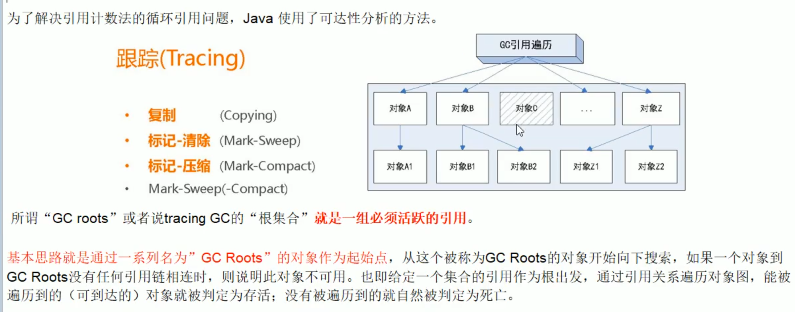
 **eg：**
 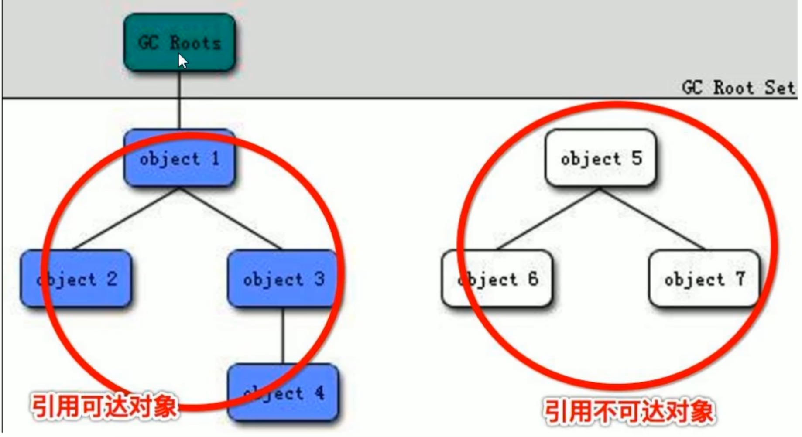
 **可以作为 GC Roots 的对象：**
 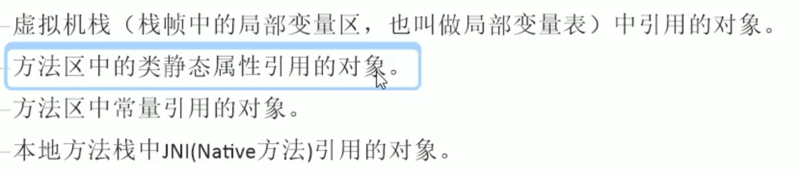

##### 2. 你说你做过的 JVM 调优和参数配置，请问如何盘点查看 JVM 系统默认值

jinfo -flag 具体参数 进程 id
 jinfo -flag 进程 id
 java -XX:PrintFlagsInitial
 java -XX:PrintFlagsFinal
 java -XX:PrintCommandLineFlags(打印命令行参数)

##### 3. 你平时工作用过的 JVM 常用基本配置参数有哪些？

- `-Xms` 初始大小内存，默认物理内存 1/64。等价 `-XX:InitialHeapSzie`

- `-Xmx` 最大分配内存，默认物理内存 1/4。等价 `-XX:MaxHeapSize`

- `-Xss` 设置单个线程栈的大小，一般默认为 512k～1024k。等价于 `-XX:ThreadStackSize`
 如果没有自己设置这个参数，执行jinfo -flag ThreadStackSize ID，会得到结果0，这里表示的是使用系统默认值（不是真的只有0k）
 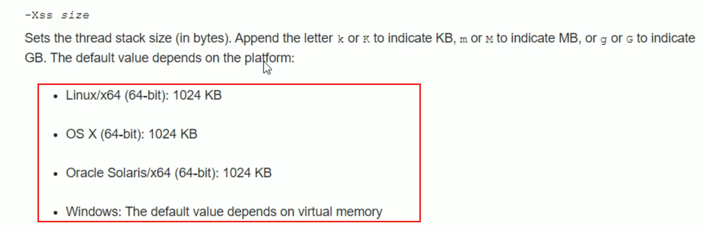

- `-Xmn` 设置年轻代大小

- `-XX:MetaspaceSize` JVM 默认元空间比较小，因此一般需要调整大一些
 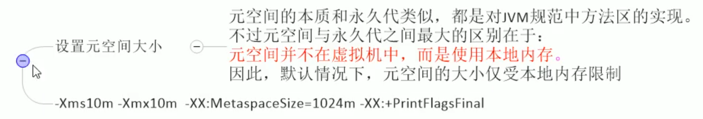

- `-XX:+PrintGCDetails` 输出 GC 的详细日志信息

- `-XX:SurvivorRatio`
 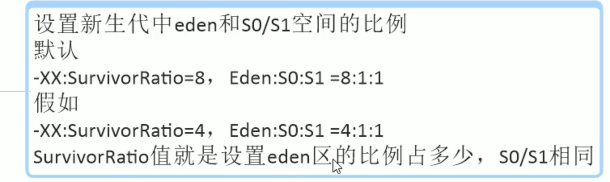

- `-XX:NewRatio`
 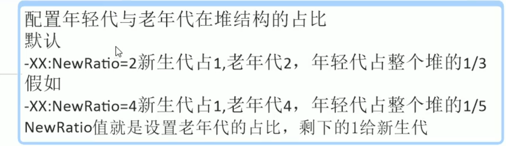

- `-XX:MaxTenuringThreshold` 设置垃圾最大年龄
 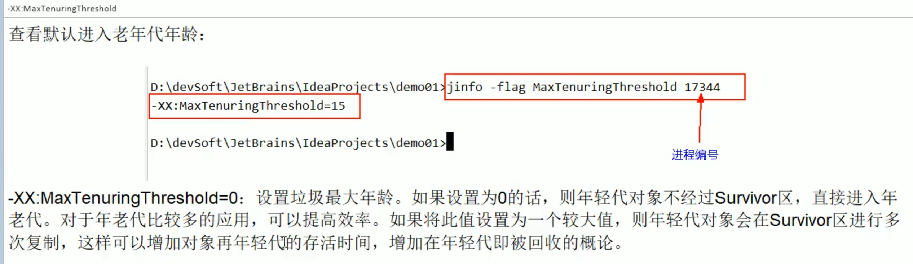

##### 4. 强引用、软引用、弱引用、虚引用分别是什么？

###### 整体架构

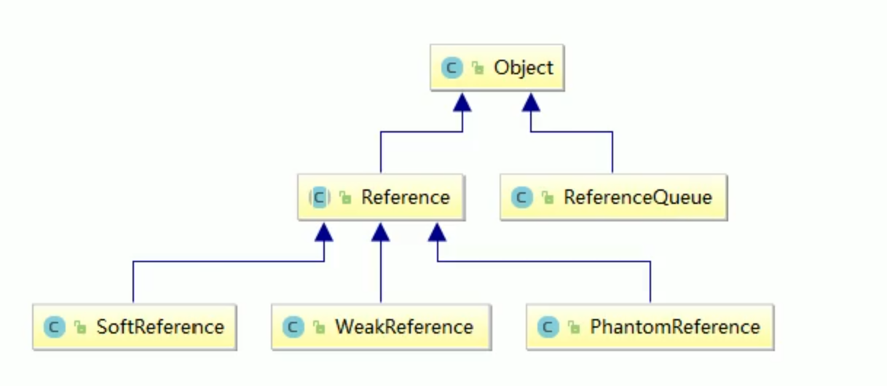

###### 强引用（默认支持模式）

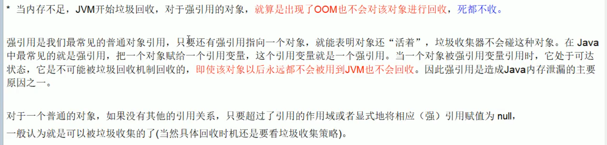

###### 软引用

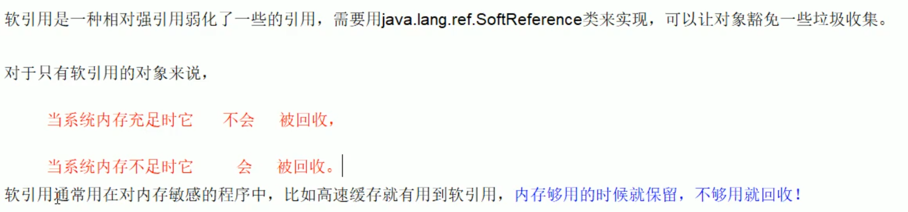

###### 弱引用

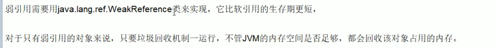

###### 虚引用

**软引用和弱引用适用场景：**
 图片缓存
 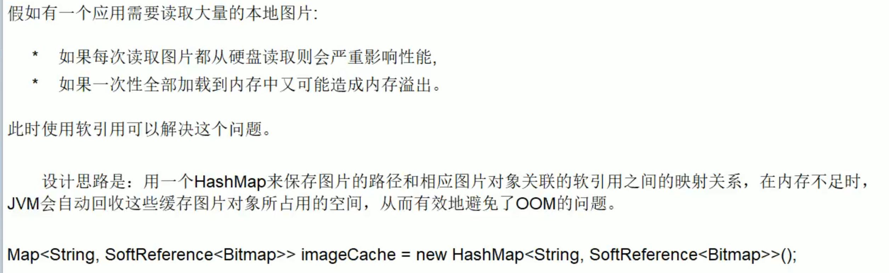

**如果你知道弱引用的话，能谈谈 WeakhashMap 吗？

##### 5. 请谈谈你对 OOM 的认识

##### 6. GC 垃圾回收算法和垃圾收集器的关系？分别是什么请你谈谈

##### 7. 怎么查看服务器默认的垃圾收集器是哪个？生产上如何配置垃圾收集器的？谈谈你对垃圾收集器的理解？

##### 8. G1 垃圾收集器

##### 9. 生产环境服务器变慢，诊断思路和性能评估谈谈？

##### 10. 假如生产环境出现 CPU 占用过高，请谈谈你的分析思路和定位

##### 11.

%23%23%23%23%23%201.%20JVM%20%E5%9E%83%E5%9C%BE%E5%9B%9E%E6%94%B6%E7%9A%84%E6%97%B6%E5%80%99%E5%A6%82%E4%BD%95%E7%A1%AE%E5%AE%9A%E5%9E%83%E5%9C%BE%EF%BC%9F%E6%98%AF%E5%90%A6%E7%9F%A5%E9%81%93%E4%BB%80%E4%B9%88%E6%98%AF%20GC%20Roots%0A%E7%AE%80%E5%8D%95%E6%9D%A5%E8%AF%B4%EF%BC%8C%E5%86%85%E5%AD%98%E4%B8%AD%E5%B7%B2%E7%BB%8F%E4%B8%8D%E5%86%8D%E8%A2%AB%E4%BD%BF%E7%94%A8%E5%88%B0%E7%9A%84%E7%A9%BA%E9%97%B4%E5%B0%B1%E6%98%AF%E5%9E%83%E5%9C%BE%0A**%E5%A6%82%E4%BD%95%E5%88%A4%E5%AE%9A%E4%B8%80%E4%B8%AA%E5%AF%B9%E8%B1%A1%E6%98%AF%E5%90%A6%E5%8F%AF%E4%BB%A5%E8%A2%AB%E5%9B%9E%E6%94%B6%EF%BC%9F**%0A-%20%E5%BC%95%E7%94%A8%E8%AE%A1%E6%95%B0%E6%B3%95%0A-%20%E6%9E%9A%E4%B8%BE%E6%A0%B9%E8%8A%82%E7%82%B9%E5%81%9A%E5%8F%AF%E8%BE%BE%E6%80%A7%E5%88%86%E6%9E%90%EF%BC%88%E6%A0%B9%E6%90%9C%E7%B4%A2%E8%B7%AF%E5%BE%84%EF%BC%89%0A!%5Beb450b499c0d3e83195b8f11e37c5236.png%5D(evernotecid%3A%2F%2F90F5C43D-AEAE-49B2-85BB-D02B6A52C764%2Fappyinxiangcom%2F25356149%2FENResource%2Fp1772)%0A%20%20%20%20**eg%EF%BC%9A**%0A%20%20%20%20!%5Be58eaeb4c845182f70b7e03e163aac8a.png%5D(evernotecid%3A%2F%2F90F5C43D-AEAE-49B2-85BB-D02B6A52C764%2Fappyinxiangcom%2F25356149%2FENResource%2Fp1773)%0A%20%20%20%20**%E5%8F%AF%E4%BB%A5%E4%BD%9C%E4%B8%BA%20GC%20Roots%20%E7%9A%84%E5%AF%B9%E8%B1%A1%EF%BC%9A**%0A!%5B3d2245f538a5bf990710b5d24056f433.png%5D(evernotecid%3A%2F%2F90F5C43D-AEAE-49B2-85BB-D02B6A52C764%2Fappyinxiangcom%2F25356149%2FENResource%2Fp1774)%0A%0A%0A%0A%23%23%23%23%23%202.%20%E4%BD%A0%E8%AF%B4%E4%BD%A0%E5%81%9A%E8%BF%87%E7%9A%84%20JVM%20%E8%B0%83%E4%BC%98%E5%92%8C%E5%8F%82%E6%95%B0%E9%85%8D%E7%BD%AE%EF%BC%8C%E8%AF%B7%E9%97%AE%E5%A6%82%E4%BD%95%E7%9B%98%E7%82%B9%E6%9F%A5%E7%9C%8B%20JVM%20%E7%B3%BB%E7%BB%9F%E9%BB%98%E8%AE%A4%E5%80%BC%0Ajinfo%20-flag%20%E5%85%B7%E4%BD%93%E5%8F%82%E6%95%B0%20%E8%BF%9B%E7%A8%8B%20id%0Ajinfo%20-flag%20%E8%BF%9B%E7%A8%8B%20id%0Ajava%20-XX%3APrintFlagsInitial%0Ajava%20-XX%3APrintFlagsFinal%0Ajava%20-XX%3APrintCommandLineFlags(%E6%89%93%E5%8D%B0%E5%91%BD%E4%BB%A4%E8%A1%8C%E5%8F%82%E6%95%B0)%0A%0A%23%23%23%23%23%203.%20%E4%BD%A0%E5%B9%B3%E6%97%B6%E5%B7%A5%E4%BD%9C%E7%94%A8%E8%BF%87%E7%9A%84%20JVM%20%E5%B8%B8%E7%94%A8%E5%9F%BA%E6%9C%AC%E9%85%8D%E7%BD%AE%E5%8F%82%E6%95%B0%E6%9C%89%E5%93%AA%E4%BA%9B%EF%BC%9F%0A-%20%60-Xms%60%20%E5%88%9D%E5%A7%8B%E5%A4%A7%E5%B0%8F%E5%86%85%E5%AD%98%EF%BC%8C%E9%BB%98%E8%AE%A4%E7%89%A9%E7%90%86%E5%86%85%E5%AD%98%201%2F64%E3%80%82%E7%AD%89%E4%BB%B7%20%60-XX%3AInitialHeapSzie%60%0A-%20%60-Xmx%60%20%E6%9C%80%E5%A4%A7%E5%88%86%E9%85%8D%E5%86%85%E5%AD%98%EF%BC%8C%E9%BB%98%E8%AE%A4%E7%89%A9%E7%90%86%E5%86%85%E5%AD%98%201%2F4%E3%80%82%E7%AD%89%E4%BB%B7%20%60-XX%3AMaxHeapSize%60%0A-%20%60-Xss%60%20%E8%AE%BE%E7%BD%AE%E5%8D%95%E4%B8%AA%E7%BA%BF%E7%A8%8B%E6%A0%88%E7%9A%84%E5%A4%A7%E5%B0%8F%EF%BC%8C%E4%B8%80%E8%88%AC%E9%BB%98%E8%AE%A4%E4%B8%BA%20512k%EF%BD%9E1024k%E3%80%82%E7%AD%89%E4%BB%B7%E4%BA%8E%20%60-XX%3AThreadStackSize%60%0A%E5%A6%82%E6%9E%9C%E6%B2%A1%E6%9C%89%E8%87%AA%E5%B7%B1%E8%AE%BE%E7%BD%AE%E8%BF%99%E4%B8%AA%E5%8F%82%E6%95%B0%EF%BC%8C%E6%89%A7%E8%A1%8Cjinfo%20-flag%20ThreadStackSize%20ID%EF%BC%8C%E4%BC%9A%E5%BE%97%E5%88%B0%E7%BB%93%E6%9E%9C0%EF%BC%8C%E8%BF%99%E9%87%8C%E8%A1%A8%E7%A4%BA%E7%9A%84%E6%98%AF%E4%BD%BF%E7%94%A8%E7%B3%BB%E7%BB%9F%E9%BB%98%E8%AE%A4%E5%80%BC%EF%BC%88%E4%B8%8D%E6%98%AF%E7%9C%9F%E7%9A%84%E5%8F%AA%E6%9C%890k%EF%BC%89%0A!%5B1dc71893d601cba40326666c33a1099b.png%5D(evernotecid%3A%2F%2F90F5C43D-AEAE-49B2-85BB-D02B6A52C764%2Fappyinxiangcom%2F25356149%2FENResource%2Fp1775)%0A-%20%60-Xmn%60%20%E8%AE%BE%E7%BD%AE%E5%B9%B4%E8%BD%BB%E4%BB%A3%E5%A4%A7%E5%B0%8F%0A-%20%60-XX%3AMetaspaceSize%60%20JVM%20%E9%BB%98%E8%AE%A4%E5%85%83%E7%A9%BA%E9%97%B4%E6%AF%94%E8%BE%83%E5%B0%8F%EF%BC%8C%E5%9B%A0%E6%AD%A4%E4%B8%80%E8%88%AC%E9%9C%80%E8%A6%81%E8%B0%83%E6%95%B4%E5%A4%A7%E4%B8%80%E4%BA%9B%0A!%5B408de90c868f1b4517cc670e754ec641.png%5D(evernotecid%3A%2F%2F90F5C43D-AEAE-49B2-85BB-D02B6A52C764%2Fappyinxiangcom%2F25356149%2FENResource%2Fp1776)%0A-%20%60-XX%3A%2BPrintGCDetails%60%20%E8%BE%93%E5%87%BA%20GC%20%E7%9A%84%E8%AF%A6%E7%BB%86%E6%97%A5%E5%BF%97%E4%BF%A1%E6%81%AF%0A-%20%60-XX%3ASurvivorRatio%60%20%0A!%5B6d4428ec34cdd786915b1c847660b645.png%5D(evernotecid%3A%2F%2F90F5C43D-AEAE-49B2-85BB-D02B6A52C764%2Fappyinxiangcom%2F25356149%2FENResource%2Fp1777)%0A-%20%60-XX%3ANewRatio%60%20%0A!%5Be967c8a52881c025c5227106c644b16c.png%5D(evernotecid%3A%2F%2F90F5C43D-AEAE-49B2-85BB-D02B6A52C764%2Fappyinxiangcom%2F25356149%2FENResource%2Fp1778)%0A-%20%60-XX%3AMaxTenuringThreshold%60%20%E8%AE%BE%E7%BD%AE%E5%9E%83%E5%9C%BE%E6%9C%80%E5%A4%A7%E5%B9%B4%E9%BE%84%0A!%5Be7e10911762f0cc0bf88a982646baa96.png%5D(evernotecid%3A%2F%2F90F5C43D-AEAE-49B2-85BB-D02B6A52C764%2Fappyinxiangcom%2F25356149%2FENResource%2Fp1779)%0A%0A%23%23%23%23%23%204.%20%E5%BC%BA%E5%BC%95%E7%94%A8%E3%80%81%E8%BD%AF%E5%BC%95%E7%94%A8%E3%80%81%E5%BC%B1%E5%BC%95%E7%94%A8%E3%80%81%E8%99%9A%E5%BC%95%E7%94%A8%E5%88%86%E5%88%AB%E6%98%AF%E4%BB%80%E4%B9%88%EF%BC%9F%0A%23%23%23%23%23%23%20%E6%95%B4%E4%BD%93%E6%9E%B6%E6%9E%84%0A!%5Bcb045ce94a959d25c1fe0bb8df804372.png%5D(evernotecid%3A%2F%2F90F5C43D-AEAE-49B2-85BB-D02B6A52C764%2Fappyinxiangcom%2F25356149%2FENResource%2Fp1780)%0A%23%23%23%23%23%23%20%E5%BC%BA%E5%BC%95%E7%94%A8%EF%BC%88%E9%BB%98%E8%AE%A4%E6%94%AF%E6%8C%81%E6%A8%A1%E5%BC%8F%EF%BC%89%0A!%5B963819a9852e9d026dea82ed78aecc24.png%5D(evernotecid%3A%2F%2F90F5C43D-AEAE-49B2-85BB-D02B6A52C764%2Fappyinxiangcom%2F25356149%2FENResource%2Fp1781)%0A%23%23%23%23%23%23%20%E8%BD%AF%E5%BC%95%E7%94%A8%0A!%5Baacf9a5da3a4b2dce023534f041729ed.png%5D(evernotecid%3A%2F%2F90F5C43D-AEAE-49B2-85BB-D02B6A52C764%2Fappyinxiangcom%2F25356149%2FENResource%2Fp1782)%0A%23%23%23%23%23%23%20%E5%BC%B1%E5%BC%95%E7%94%A8%0A!%5B8f6e6affd1b5dc3a35722fba4419116f.png%5D(evernotecid%3A%2F%2F90F5C43D-AEAE-49B2-85BB-D02B6A52C764%2Fappyinxiangcom%2F25356149%2FENResource%2Fp1783)%0A%23%23%23%23%23%23%20%E8%99%9A%E5%BC%95%E7%94%A8%0A%0A**%E8%BD%AF%E5%BC%95%E7%94%A8%E5%92%8C%E5%BC%B1%E5%BC%95%E7%94%A8%E9%80%82%E7%94%A8%E5%9C%BA%E6%99%AF%EF%BC%9A**%0A%E5%9B%BE%E7%89%87%E7%BC%93%E5%AD%98%0A!%5B61b3646b5ec2d9fd8db8bf764c79db28.png%5D(evernotecid%3A%2F%2F90F5C43D-AEAE-49B2-85BB-D02B6A52C764%2Fappyinxiangcom%2F25356149%2FENResource%2Fp1784)%0A%0A**%E5%A6%82%E6%9E%9C%E4%BD%A0%E7%9F%A5%E9%81%93%E5%BC%B1%E5%BC%95%E7%94%A8%E7%9A%84%E8%AF%9D%EF%BC%8C%E8%83%BD%E8%B0%88%E8%B0%88%20WeakHashMap%20%E5%90%97%EF%BC%9F%0A%0A%0A%23%23%23%23%23%205.%20%E8%AF%B7%E8%B0%88%E8%B0%88%E4%BD%A0%E5%AF%B9%20OOM%20%E7%9A%84%E8%AE%A4%E8%AF%86%0A%0A%23%23%23%23%23%206.%20GC%20%E5%9E%83%E5%9C%BE%E5%9B%9E%E6%94%B6%E7%AE%97%E6%B3%95%E5%92%8C%E5%9E%83%E5%9C%BE%E6%94%B6%E9%9B%86%E5%99%A8%E7%9A%84%E5%85%B3%E7%B3%BB%EF%BC%9F%E5%88%86%E5%88%AB%E6%98%AF%E4%BB%80%E4%B9%88%E8%AF%B7%E4%BD%A0%E8%B0%88%E8%B0%88%0A%0A%23%23%23%23%23%207.%20%E6%80%8E%E4%B9%88%E6%9F%A5%E7%9C%8B%E6%9C%8D%E5%8A%A1%E5%99%A8%E9%BB%98%E8%AE%A4%E7%9A%84%E5%9E%83%E5%9C%BE%E6%94%B6%E9%9B%86%E5%99%A8%E6%98%AF%E5%93%AA%E4%B8%AA%EF%BC%9F%E7%94%9F%E4%BA%A7%E4%B8%8A%E5%A6%82%E4%BD%95%E9%85%8D%E7%BD%AE%E5%9E%83%E5%9C%BE%E6%94%B6%E9%9B%86%E5%99%A8%E7%9A%84%EF%BC%9F%E8%B0%88%E8%B0%88%E4%BD%A0%E5%AF%B9%E5%9E%83%E5%9C%BE%E6%94%B6%E9%9B%86%E5%99%A8%E7%9A%84%E7%90%86%E8%A7%A3%EF%BC%9F%0A%0A%23%23%23%23%23%208.%20G1%20%E5%9E%83%E5%9C%BE%E6%94%B6%E9%9B%86%E5%99%A8%0A%0A%23%23%23%23%23%209.%20%E7%94%9F%E4%BA%A7%E7%8E%AF%E5%A2%83%E6%9C%8D%E5%8A%A1%E5%99%A8%E5%8F%98%E6%85%A2%EF%BC%8C%E8%AF%8A%E6%96%AD%E6%80%9D%E8%B7%AF%E5%92%8C%E6%80%A7%E8%83%BD%E8%AF%84%E4%BC%B0%E8%B0%88%E8%B0%88%EF%BC%9F%0A%0A%23%23%23%23%23%2010.%20%E5%81%87%E5%A6%82%E7%94%9F%E4%BA%A7%E7%8E%AF%E5%A2%83%E5%87%BA%E7%8E%B0%20CPU%20%E5%8D%A0%E7%94%A8%E8%BF%87%E9%AB%98%EF%BC%8C%E8%AF%B7%E8%B0%88%E8%B0%88%E4%BD%A0%E7%9A%84%E5%88%86%E6%9E%90%E6%80%9D%E8%B7%AF%E5%92%8C%E5%AE%9A%E4%BD%8D%0A%0A%23%23%23%23%23%2011.%20
